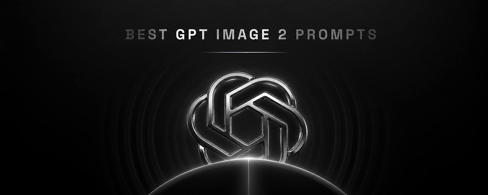

<p align="center">
  
</p>

<h1 align="center">
  Trending AI Image Prompts <a href="https://github.com/promptslab/Awesome-Prompt-Engineering"></a>
</h1>

<p align="center">
  <strong>1,400+ curated AI image prompts from X/Twitter, ranked by engagement</strong><br>
  <sub>Works with GPT Image 2, NanoBanana Pro, Midjourney V7, and more</sub>
</p>

<p align="center">
  <a href="https://www.atlascloud.ai/?utm_source=github&utm_medium=link&utm_campaign=nanobanana-trending-prompts">
    
  </a>
</p>

<p align="center">
  Run any prompt in this library through one OpenAI-compatible API, then compare image generations across model families without rebuilding your workflow.
</p>

<p align="center">
  <a href="https://www.atlascloud.ai/?utm_source=github&utm_medium=link&utm_campaign=nanobanana-trending-prompts">Atlas Cloud</a>
  ·
  <a href="https://www.atlascloud.ai/console/coding-plan?utm_source=github&utm_medium=link&utm_campaign=nanobanana-trending-prompts">Coding Plan</a>
</p>

<p align="center">
  <a href="https://www.meigen.ai"></a>
  <a href="prompts/prompts.json"></a>
  <a href="#data-formats"></a>
  <a href="LICENSE"></a>
  <a href="https://discord.gg/uX6rnersUx"></a>
</p>

<p align="center">
  <a href="https://www.meigen.ai">🖼️ View in Gallery</a> •
  <a href="prompts/prompts.json">Download JSON</a> •
  <a href="prompts/system-prompt-en.md">System Prompt</a>
</p>

<p align="center">
  <strong>English</strong> | <a href="README.zh-CN.md">中文</a>
</p>

---

## Use with Atlas Cloud

Atlas Cloud is a good fit for this prompt library if you want to run the same visual ideas across multiple image models through one endpoint:

- test NanoBanana-style prompts against other image backends without changing your app structure
- connect trending prompt experiments to scripts, coding agents, or lightweight prompt workflows
- compare outputs for product shots, posters, UI concepts, and brand visuals with one OpenAI-compatible setup

---

## What is this?

A curated collection of **trending AI image prompts** from X. Grouped by model and ranked by engagement. For smarter sorting and filtering, check out the [Gallery](https://www.meigen.ai).

We also provide a [System Prompt](prompts/system-prompt-en.md) designed to transform simple inputs into detailed image descriptions following NanoBanana best practices. You can use it in n8n, Gemini, GPTs, or any tool that accepts a system prompt. It follows these principles:

1. **Replace adjectives with quantified parameters** — "90mm, f/1.8" instead of "professional looking"
2. **Replace feeling words with pro terminology** — "Kodak Vision3 500T" instead of "cinematic vibe"
3. **Negative constraints are still effective** — telling the model what NOT to do matters
4. **Multi-sensory descriptions are necessary** — texture, temperature, even smell
5. **Group by content type** — structure prompts based on scene type

| Browse | Data | Use with AI Tools |
|--------|------|-------------------|
| [Gallery](https://www.meigen.ai) | [prompts.json](prompts/prompts.json) | [MeiGen MCP](https://github.com/jau123/MeiGen-AI-Design-MCP) |

### Use with AI Coding Tools

This prompt library is built into **[MeiGen MCP](https://github.com/jau123/MeiGen-AI-Design-MCP)** — an MCP server that lets you search, browse, and generate images directly from Claude Code, Cursor, VS Code, and more.

```bash
# One-command setup for your tool
npx meigen init cursor      # Cursor
npx meigen init vscode      # VS Code / GitHub Copilot
npx meigen init claude      # Claude Code
```

Then ask: *"Search for product photography inspiration"* — it searches this entire prompt library for free, no API key needed.

<sub>**Note:** All prompts are hand-curated. If you spot issues, please <a href="https://github.com/jau123/nanobanana-trending-prompts/issues">open an issue</a>.</sub>

---

## Stats

| Total | NanoBanana | GPT Image |
|-------|------------|-----------|
| 1,446 | 1,148 | 298 |

---

## Categories

Every prompt belongs to one or more of these 6 categories:

| Category | Count | What's in it |
|---|---|---|
| Photography | 533 | Photorealistic portraits, street, product photography |
| Illustration & 3D | 370 | 3D renders, illustrations, icon sets, CGI |
| Product & Brand | 239 | Product shots, brand visuals, packaging |
| Food & Drink | 156 | Food photography, drinks, recipe visualizations |
| Poster Design | 146 | Movie posters, event posters, typography layouts |
| UI & Graphic | 52 | Infographics, storyboards, UI mockups, type design |

---

## Changelog

| Date | Changes |
|------|---------|
| 2026-04-29 | Added Poster Design and UI & Graphic categories. Reorganized tagging across the dataset. Grouped listings by model. Total: 1,446. |
| 2026-03-09 | Manual curation: removed 345 low-quality posts, refined 120 prompts, re-categorized 228 entries. Added 119 new prompts. Total: 1,389. |
| 2026-02-26 | Added 63 new prompts. Total: 1,542. |
| 2026-02-20 | Added 105 new prompts. Total: 1,479. |
| 2026-02-09 | Added 65 new prompts. Total: 1,374. |
| 2026-02-04 | Added 123 new prompts. Total: 1,309. |
| 2026-01-29 | Added 135 new prompts. Total: 1,186. |
| 2026-01-26 | Added 51 new prompts, improved 78 existing entries. |

---

<h2 id="browse-prompts">Browse Prompts</h2>

<!-- PROMPTS_START -->


## GPT Image Prompts (298)

### #1 by [@TechieBySA](https://x.com/TechieBySA) (3,567 ❤️)


**Model:** gptimage | **Views:** 159,772 | **Categories:** UI & Graphic

<details>
<summary>📋 View Prompt</summary>

```
Create a technical infographic of [OBJECT] with a 45-degree isometric 3D perspective showing the device slightly tilted to reveal depth and dimension.
Combine a realistic photoreal render with black ink technical annotations on pure white background. Include:
Key component labels with color-coded callout boxes
Internal component visibility through transparent/cutaway sections
Measurements, dimensions, and precise scale markers
Material callouts and quantities
Color-coded arrows for function/flow: RED (power/battery), BLUE (data/connectivity), ORANGE (thermal/processor), GREEN (sensors/haptics)
Simple schematics or cross-sectional diagrams where relevant

Place “OBJECT” title in a hand-drawn technical box (top-left corner).
Style: Black linework (technical pen/architectural), sketched but precise. Object remains clearly visible. Educational museum-exhibit vibe. Clean composition, balanced negative space.
Perspective: Isometric 3D angle—tilted to show depth, dimension, and internal architecture dramatically. Like a professional product teardown or engineering manual.
Colors: ~10-15% accent density. Black dominant. White background.
Output: 1080×1080, ultra-crisp, social-feed optimized.
```

</details>

---

### #2 by [@mehvishs25](https://x.com/mehvishs25) (1,776 ❤️)


**Model:** gptimage | **Views:** 111,208 | **Categories:** Product & Brand

<details>
<summary>📋 View Prompt</summary>

```
{
  "master_prompt": {
    "global_settings": {
      "resolution": "8K ultra-high-definition",
      "aspect_ratio": "3:4 vertical",
      "style": "hyper-realistic AI-edited commercial product photography",
      "sharpness": "extreme clarity, micro-detail visibility",
      "lighting_quality": "cinematic studio lighting with controlled highlights and shadows",
      "motion_freeze": "high-speed capture, frozen splashes and particles",
      "noise": "none",
      "artifacts": "none"
    },

"module_1_image_1_style": {
      "subject": {
        "type": "plastic protein drink bottle",
        "color": "deep matte blue",
        "surface_details": "condensation droplets across entire bottle",
        "label_text_visible": [
          "milk & yogurt",
          "mock up",
          "protein",
          "SEPARATED SHADOWS"
        ]
      },
      "pose_and_orientation": {
        "position": "slightly tilted to the right",
        "angle": "three-quarter view",
        "motion_feel": "dynamic, leaning into splash"
      },
      "liquid_and_motion": {
        "liquid_color": "white and light beige milk mixture",
        "texture": "smooth, creamy, fluid",
        "motion": "swirling splash rising around bottle base and sides"
      },
      "floating_elements": {
        "blueberries": "whole and halved blueberries at different depths",
        "mint_leaves": "small green leaves with visible veins",
        "droplets": "milk droplets and spheres suspended mid-air"
      },
      "background": {
        "color_gradient": "dark blue to warm amber",
        "bokeh": "soft circular light particles scattered throughout"
      },
      "surface_and_reflection": {
        "base": "matte ground with light liquid pooling",
        "shadow_style": "soft separated shadow under bottle"
      }
    },
"module_2_image_2_style": {
      "subject": {
        "type": "metal coffee can",
        "color": "warm gold",
        "surface_details": "heavy condensation with visible droplets",
        "branding_text_visible": [
          "NESCAFÉ",
          "Latte",
          "NEW LOOK",
          "ICED COFFEE WITH MILK",
          "SUGAR AND SWEETENER OPTIONAL"
        ]
      },
      "pose_and_orientation": {
        "position": "upright, centered",
        "angle": "front-facing",
        "presence": "hero product stance"
      },
      "liquid_and_motion": {
        "liquid_color": "coffee and milk blend",
        "motion": "splash erupting from base",
        "droplet_behavior": "fine droplets scattered outward"
      },
      "floating_elements": {
        "coffee_beans": "whole roasted beans floating around can",
        "steam": "thick swirling steam rising upward",
        "embers": "tiny glowing particles in background"
      },
      "background": {
        "color_palette": "deep brown, amber, gold",
        "atmosphere": "warm, smoky, intense"
      },
      "surface_and_reflection": {
        "base": "wet surface with liquid splash crown",
        "reflection_quality": "subtle reflective highlights"
      }
    }
```

</details>

---

### #3 by [@azed_ai](https://x.com/azed_ai) (1,730 ❤️)


**Model:** gptimage | **Views:** 66,346 | **Categories:** Product & Brand · Poster Design

<details>
<summary>📋 View Prompt</summary>

```
Low-angle fashion campaign photograph of a confident model holding a large [product name] very close to the camera, exaggerated perspective with the hand and product dominating the foreground, full-body pose visible in the background, wide stance, dynamic posture, clean pure white studio background, high-key lighting, sharp focus on product, slight depth of field on the model, bold colorful outfit with strong contrast tones, modern beauty advertising aesthetic, ultra-clean composition, commercial studio photography, glossy packaging detail visible, crisp shadows
```

</details>

---

### #4 by [@TechieBySA](https://x.com/TechieBySA) (1,424 ❤️)


**Model:** gptimage | **Views:** 95,458 | **Categories:** Photography

<details>
<summary>📋 View Prompt</summary>

```
Create an infographic image of [LANDMARK], combining a real photograph of the landmark with blueprint-style technical annotations and diagrams overlaid on the image. Include the title “[LANDMARK]” in a hand-drawn box in the corner. Add white chalk-style sketches showing key structural data, important measurements, material quantities, internal diagrams, load-flow arrows, cross-sections, floor plans, and notable architectural or engineering features. Style: blueprint aesthetic with white line drawings on the photograph, technical/architectural annotation style, educational infographic feel, with the real environment visible behind the annotations.
```

</details>

---

### #5 by [@MrLarus](https://x.com/MrLarus) (1,115 ❤️)


**Model:** gptimage | **Views:** 68,519 | **Categories:** Poster Design

<details>
<summary>📋 View Prompt</summary>

```
请根据[主题]自动生成一张[博物馆图鉴式中文拆解信息图]。

要求整张图兼具真实写实主视觉、结构拆解、中文标注、材质说明、纹样寓意、色彩含义和核心特征总结。你需要根据[主题]自动判断最合适的主体对象、服饰体系、器物结构、时代风格、关键部件、材质工艺、颜色方案与版式结构，用户无需再提供其他信息。

整体风格应为：国家博物馆展板、历史服饰图鉴、文博专题信息图，而不是普通海报、古风写真、电商详情页或动漫插画。背景采用米白、绢纸白、浅茶色等纸张质感，整体高级、克制、专业、可收藏。

版式固定为：
- 顶部：中文主标题 + 副标题 + 导语
- 左侧：结构拆解区，中文引线标注关键部件，并配局部特写
- 右上：材质 / 工艺 / 质感区，展示真实纹理小样并附说明
- 右中：纹样 / 色彩 / 寓意区，展示主色板、纹样样本和文化解释
- 底部：穿着顺序 / 构成流程图 + 核心特征总结

若主题适合人物展示，则以真实人物全身站姿为中央主体；若更适合器物或单体结构，则改为中心主体拆解图，但整体仍保持完整中文信息图形式。所有文字必须为简体中文，清晰、规整、可读，不要乱码、错字、英文或拼音。重点突出真实结构、材质差异、文化说明与图鉴气质。

避免：海报感、影楼感、电商感、动漫感、cosplay感、乱标注、错结构、糊字、假材质、过度装饰。
```

</details>

---

### #6 by [@MrLarus](https://x.com/MrLarus) (1,100 ❤️)


**Model:** gptimage | **Views:** 93,247 | **Categories:** Poster Design

<details>
<summary>📋 View Prompt</summary>

```
生成一张[餐饮品牌触点矩阵]系列视觉图，用于展示一个完整的餐饮品牌视觉系统与包装应用方案。

这是一个面向餐饮行业的品牌VI样机展示板 / 包装系统陈列图 / 品牌提案页。画面不是单张宣传海报，而是将品牌主视觉、主打产品、包装物料、菜单信息、促销内容与小型延展物料整合成一张系统化品牌展示图。

【用户输入信息】
- 品牌名：[品牌名]
- 经营类目：[经营类目]

【可选补充信息】
- 主打产品：[主打产品]
- 品牌口号：[品牌口号]
- 风格方向：[风格方向]
- 主色调：[主色调]
- 辅助色：[辅助色]
- 客群定位：[客群定位]
- 价格定位：[价格定位]
- 地域风格：[地域风格]
- 画幅比例：[画幅比例]

【自动补全规则】
如果用户没有提供完整品牌信息，请根据【品牌名】与【经营类目】自动推导并完成最优组合，包括：
1. 判断品牌调性（年轻、亲和、国潮、复古、清新、治愈、精致、快餐感等）
2. 匹配适合该类目的视觉风格
3. 自动设定合理的主色、辅助色与点缀色
4. 自动补全主打产品与辅助产品
5. 自动生成适合餐饮传播的品牌口号、卖点文案、价格信息与推荐标签
6. 自动匹配合适的餐饮物料类型与展示内容

【画面内容要求】
画面中应围绕【品牌名】构建一整套餐饮品牌物料系统，包含但不限于以下内容：
- 核心包装：手提袋、外卖袋、包装盒、打包盒、纸袋、塑料袋
- 饮品 / 食品容器：纸杯、杯套、碗、餐盒、封口贴、标签
- 信息传播物料：菜单、促销海报、价格牌、桌牌、立牌、小卡片
- 小型品牌延展：贴纸、徽章、纸巾、餐具、包装封条、吊牌
- 产品表现：主打餐品照片、单品主视觉、食物特写、切面图、推荐组合图

【构图与版式要求】
采用竖版【画幅比例】构图，整体为白色、米白色或浅灰色背景，以品牌提案板 / 样机矩阵板的方式组织画面。
通过大中小物料混排形成视觉层级：
- 大型包装和主视觉物料作为视觉锚点
- 中型菜单、海报和价格模块负责信息传达
- 小型贴纸、餐具、标签与周边物料增强系统完整度

整体构图应具有明确秩序感，接近品牌方案展示页、作品集陈列页、包装提案页的视觉效果。元素要排列整齐但不呆板，丰富但不杂乱，具有模块化与可阅读性。

【风格与质感要求】
整体风格应符合【经营类目】与【品牌名】气质，具有明显的餐饮品牌感、商业传播感、样机展示感与系统设计感。
可融合以下风格倾向：现代简洁、国潮趣味、轻复古、生活方式感、快消感、温暖治愈感、年轻化传播感。
材质真实，包含纸张、塑料、布袋、包装盒、杯体、贴纸、餐具等真实物料质感；光影柔和统一，像在干净摄影棚环境中拍摄的品牌物料合集。

【文字与图形要求】
所有物料上应统一出现品牌名、Logo、品牌符号、主色块、口号或卖点文案。
文案可为中文或中英混排，但要符合餐饮传播表达，简洁直接，具备商品售卖感。
图形系统可以根据品牌调性选择简洁插画、几何图形、卡通吉祥物、符号化图标或辅助纹样，用于增强品牌记忆点。

【输出目标】
最终生成一张完整的【品牌名】餐饮品牌视觉系统展示图，像设计团队为该餐饮品牌制作的整套品牌提案样机板。
要求画面统一、精致、具备商业落地感与作品集展示质量，并能清楚体现品牌风格、主打类目与多触点包装延展能力。

Make the aspect ratio 9:16
```

</details>

---

### #7 by [@meng_dagg695](https://x.com/meng_dagg695) (1,034 ❤️)


**Model:** gptimage | **Views:** 49,740 | **Categories:** Food & Drink

<details>
<summary>📋 View Prompt</summary>

```
{
  "global_settings": {
    "resolution": "8K ultra high definition",
    "aspect_ratio": "3:4",
    "camera_style": "studio food photography with cinematic lighting",
    "depth_of_field": "shallow depth of field, sharp subject, soft background",
    "lighting": "soft directional key light, subtle rim light, controlled highlights",
    "style": "hyper-realistic food illustration with editorial infographic overlays",
    "composition_rules": [
      "no zoom",
      "no crop",
      "center-weighted vertical composition",
      "floating elements frozen in motion"
    ],
    "text_design": {
      "ingredient_name_color": "metallic gold",
      "ingredient_description_color": "pure white",
      "font_style": "elegant serif for titles, clean sans-serif for descriptions",
      "indicator_lines": "long, thin, smooth golden lines with rounded corners"
    }
  },

  "module_1_image_1_style": {
    "scene_description": "A vertical stack of assorted cake slices floating above a white ceramic plate against a soft pink gradient background.",
    "background": {
      "color": "soft pastel pink",
      "texture": "smooth gradient",
      "lighting": "even, studio-lit, no harsh shadows"
    },
    "main_subjects": [
      "multiple layered sponge cake slices",
      "white whipped cream layers",
      "raspberry cream layer",
      "chocolate cream topping"
    ],
    "visible_ingredients": [
      "vanilla sponge cake",
      "whipped cream",
      "raspberries",
      "blueberries",
      "strawberries",
      "macarons (vanilla and chocolate)",
      "chocolate bar pieces",
      "mint leaves",
      "small nut fragments"
    ],
    "motion_elements": [
      "floating fruits",
      "floating macarons",
      "crumbs suspended in air"
    ],
    "text_labels": [
      "Vanilla Cake – soft, fluffy sponge cake layered with white cream filling",
      "Macaron – creamy filling between almond meringue shells",
      "Raspberries – juicy, fresh raspberries",
      "Chocolate Bar – chunks of smooth milk chocolate",
      "Raspberry Cream – soft sponge cake layered with creamy, fruity raspberry cream"
    ]
  },

  "module_2_image_2_style": {
    "scene_description": "Rolled Syrian dessert presented vertically with syrup pouring from above, placed in a warm, rustic kitchen environment.",
    "background": {
      "environment": "traditional kitchen",
      "elements": [
        "warm lantern light",
        "wooden surfaces",
        "brass and copper utensils"
      ],
      "lighting": "warm ambient lighting with soft highlights"
    },
    "main_subjects": [
      "rolled white dessert dough",
      "cream filling spilling out",
      "golden syrup stream"
    ],
    "visible_ingredients": [
      "white cheese dough",
      "cream filling",
      "pistachios",
      "sugar syrup"
    ],
    "motion_elements": [
      "syrup dripping vertically",
      "pistachio crumbs falling"
    ],
    "text_labels": [
      "White Cheese Dough – soft outer layer made from cheese and semolina",
      "Cream Filling – creamy filling inside the roll",
      "Pistachios – crushed pistachios sprinkled over and inside the rolls"
    ]
  }
```

</details>

---

### #8 by [@aleenaamiir](https://x.com/aleenaamiir) (977 ❤️)


**Model:** gptimage | **Views:** 87,650 | **Categories:** Poster Design

<details>
<summary>📋 View Prompt</summary>

```
Create a complete visual worldbuilding set for a futuristic desert civilization powered by solar technology, multiple images including architecture, characters, clothing, vehicles, and maps, cohesive design language, cinematic realism, ultra detailed.
```

</details>

---

### #9 by [@Samann_ai](https://x.com/Samann_ai) (894 ❤️)


**Model:** gptimage | **Views:** 125,092 | **Categories:** Poster Design

<details>
<summary>📋 View Prompt</summary>

```
[INPUT IMAGE: USER_PHOTO] Use the person in the input image as the ONLY subject. Preserve their identity and facial features clearly.

Create a hyper-realistic high-fashion editorial photo inside a surreal 3D geometric “color box” room (a hollow cube / tilted cube set). Each render MUST randomly choose:
1) a bold single-color box (monochrome environment, vivid and saturated),
2) a dynamic “cool” fashion pose (gravity-defying or extreme stretch / leap / sideways bracing against the walls),
3) a dramatic camera angle (wide-angle 24–35mm equivalent, tilted horizon, strong perspective).

The subject appears full-body and sharp, wearing an avant-garde fashion styling that feels modern and editorial (clean silhouette, stylish layering, premium fabric texture). Keep clothing tasteful and fashion-forward. The subject’s pose should feel athletic, stylish, and unusual—like a magazine campaign shot.

Lighting: studio quality, crisp and cinematic; strong key light with controlled soft shadows, subtle rim light; realistic reflections and bounce light from the colored walls. Ultra-detailed skin texture, natural pores, realistic fabric weave, clean edges, high dynamic range. 
Composition: subject centered with plenty of negative space and strong geometric lines; the box perspective frames the subject. 
Color: the box color is a SINGLE bold color and MUST be different each run (random vivid hue). The subject’s outfit contrasts well with the box color.

Output: hyper-real, photorealistic, 8k detail, editorial campaign quality, sharp focus on subject, no motion blur, no distortion of face, natural proportions.
```

</details>

---

### #10 by [@songguoxiansen](https://x.com/songguoxiansen) (819 ❤️)


**Model:** gptimage | **Views:** 242,937 | **Categories:** Poster Design

<details>
<summary>📋 View Prompt</summary>

```
武则天同款皇后内衣广告大片，明黄底色龙纹刺绣，大红丝绸飘带衬托

```

</details>

---

### #11 by [@meng_dagg695](https://x.com/meng_dagg695) (608 ❤️)


**Model:** gptimage | **Views:** 96,195 | **Categories:** Food & Drink

<details>
<summary>📋 View Prompt</summary>

```
{
  "resolution": "8K UHD",
  "aspect_ratio": "3:4",
  "image_style": "hyper-realistic commercial food photography",
  "global_settings": {
    "quality": "Ultra-high detail, sharp focus, studio-grade clarity",
    "lighting": "Soft but controlled studio lighting with visible highlights and splash definition",
    "motion": "Frozen mid-air action, ingredients suspended",
    "background_style": "Solid or smooth gradient background, color varies per module",
    "camera": "High-speed photography look, shallow to medium depth of field",
    "post_processing": "Balanced contrast, natural saturation, no artificial glow"
  },

  "modules": {

    "module_1_berry_smoothie_explosion": {
      "scene_description": "A vibrant smoothie bowl exploding with fruit and liquid splashes",
      "bowl": {
        "color": "Deep blue ceramic bowl",
        "finish": "Glossy",
        "position": "Centered, floating mid-air"
      },
      "base_contents": {
        "type": "Thick berry smoothie",
        "color": "Deep purple-magenta",
        "texture": "Creamy with visible swirl marks"
      },
      "ingredients": {
        "fruits": [
          "Banana slices (round, pale yellow)",
          "Blueberries (whole, dark blue)",
          "Raspberries (whole, red)"
        ],
        "herbs": [
          "Fresh mint leaves (bright green)"
        ]
      },
      "motion_effects": {
        "liquid": "Berry smoothie splashing upward and outward",
        "particles": "Small droplets suspended in air"
      },
      "background": {
        "color": "Bright pink",
        "texture": "Smooth, seamless"
      }
    },

    "module_2_minimal_pink_smoothie_bowl": {
      "scene_description": "Minimalist floating smoothie bowl with granola and berries",
      "bowl": {
        "color": "Light pink ceramic bowl with dark speckles",
        "finish": "Matte",
        "position": "Floating centrally"
      },
      "base_contents": {
        "type": "Smoothie",
        "color": "Soft pink with purple undertones",
        "texture": "Thick and smooth"
      },
      "toppings": {
        "granola": "Golden-brown oat clusters",
        "seeds": "Small black seeds scattered",
        "fruits": [
          "Strawberries (halved)",
          "Raspberries (whole)",
          "Blackberries (whole)"
        ]
      },
      "motion_effects": {
        "ingredients": "Granola flakes, seeds, and berries floating gently"
      },
      "background": {
        "color": "Pastel lavender",
        "gradient": "Subtle, soft gradient"
      }
    },

    "module_3_cereal_milk_honey_splash": {
      "scene_description": "Dynamic cereal stack with milk splash and honey drizzle",
      "bowl": {
        "color": "Blue ceramic bowl",
        "finish": "Glossy",
        "position": "Centered, resting visually but surrounded by motion"
      },
      "contents": {
        "cereal": "Golden cornflakes stacked vertically",
        "milk": "White milk splashing and dripping over flakes",
        "fruits": [
          "Raspberries",
          "Blueberries"
        ]
      },
      "additional_elements": {
        "honey": {
          "source": "Wooden honey dipper",
          "state": "Honey dripping mid-air"
        }
      },
      "motion_effects": {
        "splashes": "Milk splashes frozen in dramatic arcs",
        "particles": "Floating flakes and droplets"
      },
      "background": {
        "color": "Deep blue",
        "tone": "High contrast"
      }
    },
}
```

</details>

---

### #12 by [@MrLarus](https://x.com/MrLarus) (603 ❤️)


**Model:** gptimage | **Views:** 41,812 | **Categories:** Poster Design

<details>
<summary>📋 View Prompt</summary>

```
请根据【主题】生成一张高质量竖版「科普百科图」。 

这张图不是普通海报，也不是单纯插画，而是一张兼具“图鉴感、百科感、信息结构感、收藏感”的模块化科普信息图。整体风格参考高级博物图鉴、现代百科书页、生活方式知识卡和社交媒体高传播信息图的结合。

请让画面包含：
- 一个清晰漂亮的主题主视觉
- 若干局部特征放大细节
- 多个圆角模块化信息分区
- 清楚的标题层级与重点标签
- 简洁但丰富的百科内容
- 可视化评分、要点总结或Top 5模块

内容栏目请根据主题自动适配，优先从这些方向中选择并合理组合：
基础档案、分类信息、外观特征、习性/生态、形成机制/结构组成、生长或使用条件、养护或维护建议、风险与注意事项、适合人群或适用场景、优缺点对比、快速评分卡。

视觉要求：
浅色干净背景，柔和配色，轻阴影，精致小图标，圆角信息框，整洁排版，信息密度高但不拥挤，阅读体验好。整体必须像真正可以发布、阅读、收藏、系列化生产的科普百科卡，而不是广告图。

请不要做成普通商业宣传海报。要突出“知识整理 + 模块信息 + 图鉴式展示”的特征。
```

</details>

---

### #13 by [@meng_dagg695](https://x.com/meng_dagg695) (586 ❤️)


**Model:** gptimage | **Views:** 28,644 | **Categories:** Illustration & 3D

<details>
<summary>📋 View Prompt</summary>

```
{
  "global_settings": {
    "resolution": "8K",
    "quality": "ultra-high definition",
    "aspect_ratio": "2:3",
    "render_style": "AI-edited, high-detail 3D render",
    "lighting_quality": "soft studio lighting with realistic shadows",
    "sharpness": "extreme clarity, crisp edges",
    "noise": "none",
    "compression": "none"
  },

  "Module_1_Image_1_Style": {
    "subject": {
      "character_type": "stylized 3D cartoon female",
      "pose": "standing, body slightly angled, one hand raised with index finger touching lips",
      "expression": "cheerful smile, wide eyes",
      "hair": {
        "color": "black",
        "style": "two braided pigtails",
        "accessories": "green cap"
      },
      "face": {
        "eyes": "large, rounded, dark pupils",
        "skin": "smooth, matte, stylized texture"
      }
    },
    "clothing": {
      "top": "sleeveless green crop top",
      "bottom": "loose green jogger-style pants with drawstring",
      "footwear": "white sneakers"
    },
    "accessories": {
      "luggage": "green hard-shell suitcase with extended handle"
    },
    "color_palette": [
      "multiple shades of green",
      "white accents"
    ],
    "background": {
      "color": "solid green",
      "texture": "soft, slightly grainy studio backdrop"
    },
    "composition": {
      "framing": "full body",
      "camera_angle": "eye-level",
      "depth": "subject sharply separated from background"
    }
  },

  "Module_2_Image_2_Style": {
    "subject": {
      "character_type": "stylized 3D cartoon female",
      "pose": "leaning slightly backward against background",
      "expression": "playful, lips slightly pursed, eyes looking sideways",
      "hair": {
        "color": "brown",
        "style": "short, tousled",
        "accessories": "red sunglasses resting on head"
      }
    },
    "clothing": {
      "dress": "form-fitting blue ribbed dress with thin straps",
      "footwear": "red high-heel sandals with bow detail"
    },
    "color_palette": [
      "bold red",
      "deep blue"
    ],
    "background": {
      "color": "solid red",
      "texture": "smooth matte surface"
    },
    "lighting": {
      "direction": "soft directional light from one side",
      "shadow": "defined shadow cast on red background"
    },
    "composition": {
      "framing": "full body",
      "pose_emphasis": "curved posture, crossed legs"
    }
  },

  "Module_3_Image_3_Style": {
    "subject": {
      "characters": [
        {
          "type": "stylized 3D cartoon female",
          "position": "left",
          "wrapped_in": "red textured blanket",
          "expression": "calm, slight smile, eyes looking upward"
        },
        {
          "type": "stylized 3D cartoon male",
          "position": "right",
          "wrapped_in": "orange textured blanket",
          "expression": "neutral, gentle gaze upward"
        }
      ]
    },
    "environment": {
      "furniture": "red sofa",
      "floor": "red surface",
      "background": {
        "color": "deep red",
        "texture": "fabric-like horizontal texture"
      }
    },
    "details": {
      "feet": "female barefoot, male wearing socks",
      "blanket_texture": "thick, knitted fabric"
    },
    "composition": {
      "framing": "centered, medium-wide shot",
      "symmetry": "balanced left and right composition"
    }
  },
```

</details>

---

### #14 by [@Diplomeme](https://x.com/Diplomeme) (571 ❤️)


**Model:** gptimage | **Views:** 26,610 | **Categories:** Poster Design

<details>
<summary>📋 View Prompt</summary>

```
4:5 vertical social poster, ultra high resolution, 8K

SCENE / BACKGROUND:
Flat racing yellow with subtle gradient (light → deep amber)
Grain texture 2–3%
Soft rectangular overlays at 3% opacity

PRODUCT:
Porsche 911 GT3 RS
Gloss yellow with carbon details
Rear 3/4 angle, slightly elevated
Wing dominant

Position:
Right of center

TYPOGRAPHY:
“PORSCHE”
Ultra tall, condensed, stretched
Deep charcoal

Secondary:
“PORSCHE 911 GT3 RS”

EDITORIAL:
“Porsche — Where Precision Meets Passion”

Focus:
engineering, obsession, track DNA

FADED TEXT:
“GT3 RS” at 3–5%

SPECS:
386 kW / 525 PS
3.2 s
296 km/h

LIGHTING:
Clean studio, sharp highlights

MOOD:
Precision.
Iconic.
Timeless performance.

FORMAT:
4:5 vertical social poster, ultra high resolution, 8K, print-quality sharpness

SCENE / BACKGROUND:
Flat, high-saturation BMW blue background

Gradient:
Top → slightly lighter electric blue
Bottom → deep navy blue

Surface:
- Subtle grain texture (2–3%)
- Faint rectangular overlays (2–4% opacity)
- Clean, graphic — no realism

Shadow:
Soft contact shadow under car

PRODUCT (CAR):
BMW M4 CSL

Color:
Matte frozen blue / deep metallic navy

Angle:
Rear 3/4 perspective (IMPORTANT — match Porsche angle for consistency)
Slightly elevated camera

Position:
Slightly right of center

Details:
- Carbon roof visible
- Aggressive diffuser
- Sharp reflections
- Subtle brake detail

COMPOSITION:
IDENTICAL to Porsche:
Top → branding
Middle → giant type
Center → car overlap
Bottom → editorial + specs

TYPOGRAPHY:

PRIMARY:
“BMW”

Style:
Ultra condensed bold sans serif
Tall vertical scaling (same as Porsche)

Color:
Deep navy / near black

Behavior:
Static (NO distortion — unlike previous version)
Acts as structural backdrop

SECONDARY HEADER:
“BMW M4 CSL”
Thin, wide tracking

LOGO AREA:
BMW roundel centered above

EDITORIAL BLOCK:

Headline:
“BMW — Where Driving Becomes Instinct”

Body:
Focus on:
- driver connection
- control
- performance precision

Boxed layout, same structure as Porsche

FADED TEXT:
“CSL” large, 3–5% opacity behind box

BOTTOM LEFT:
“M4 CSL”

BOTTOM RIGHT SPECS:

405 kW / 550 PS
3.4 s
307 km/h

LIGHTING:
Clean studio lighting
Sharp but controlled highlights

COLOR GRADING:
Deep blues, high contrast, clean blacks

CAMERA:
50mm, slightly elevated rear 3/4

MOOD:
Performance.
Precision.
Driver focus.
```

</details>

---

### #15 by [@Sheldon056](https://x.com/Sheldon056) (555 ❤️)


**Model:** gptimage | **Views:** 45,836 | **Categories:** Illustration & 3D

<details>
<summary>📋 View Prompt</summary>

```
A handcrafted felt miniature illustration of [Celebrity] reimagined as a soft wool doll character. The figure has simplified facial features, button-like eyes, subtle smile, and carefully crafted felt textures. He is wearing an outfit inspired by his iconic casual tech style—dark jacket, simple t-shirt, and trousers—recreated in knitted wool and fabric. The scene has a whimsical, storybook feel with grassy felt terrain, pastel hills, and a bright sky with soft clouds. Macro photography look, shallow depth of field, soft natural lighting, stop-motion animation aesthetic, ultra-detailed fibers and fabric textures, cozy yet futuristic mood, cinematic composition, high quality.
```

</details>

---

### #16 by [@riomadeit](https://x.com/riomadeit) (539 ❤️)


**Model:** gptimage | **Views:** 213,256 | **Categories:** Product & Brand

<details>
<summary>📋 View Prompt</summary>

```
Create a polished multi-page (multiple images) brand kit for a company called [YOYOYO]. The brand should feel playful, futuristic, vibrant, and design-forward, blending the energy of a toy-inspired product with the sophistication of a premium creative tech brand. Use a bold, experimental visual identity with bright color, clean geometry, modern typography, dynamic motion cues, and slightly surreal imagery. The overall mood should feel inventive, youthful, rhythmic, tactile, and high-concept, with a balance of fun consumer product culture, fashionlike presentation, and contemporary digital design.

Include a sense of product obsession, visual experimentation, packaging exploration, editorial photography, immersive retail, and cross-platform brand application. Make it feel like a confident, contemporary brand world that is both accessible and art-directed, with strong graphic cohesion and a premium creative-studio aesthetic.
```

</details>

---

### #17 by [@austinit](https://x.com/austinit) (534 ❤️)


**Model:** gptimage | **Views:** 40,652 | **Categories:** Poster Design

<details>
<summary>📋 View Prompt</summary>

```
生成一张适合小红书发布的 3:4 竖版九宫格海报，整体为 3列 × 3行 排版，九个宫格边界清晰，方便后期直接切割成 9 张单图发布。整体风格干净、高级、统一，适合女性向健康生活方式内容，具有小红书爆款封面气质。画面要求 信息排版清晰、文字大、可读性强、留白舒服、配色温柔治愈。

整体视觉风格：
奶油白、浅米色、淡燕麦色、浅焦糖色为主色调，搭配少量深棕色文字，ins风、治愈感、睡眠疗愈主题，简约排版，轻拟物插画点缀，可加入枕头、月亮、星星、热牛奶、香薰、书本、眼罩、窗帘、床铺等元素。整体像专业新媒体设计图，字体工整，适合做知识科普类小红书九宫格。
排版要求：

整张图必须是标准九宫格构图，切分后每一格都能独立成图

每个宫格内容完整居中，不要把标题或正文压在分割线附近
每个格子之间保留明显间隔或细边框，保证裁切后不影响阅读
所有文字使用中文，清晰易读，不要乱码，不要英文
每个宫格都像独立的小红书图文卡片，但视觉风格保持统一
画面精致、真实、自然，不要廉价营销感，不要过度花哨
九宫格具体内容：

第1格（封面）
大标题：让你倒头就睡的8个 tips
副标题：失眠党、熬夜党一定要收藏
封面视觉最吸睛，适合做首图，加入柔软床铺、月亮、枕头、眼罩等治愈睡眠元素，标题突出，排版高级。

第2格
标题：1. 睡前1小时别玩手机
正文：蓝光会让大脑更清醒，越刷越睡不着。
配图元素：手机、月亮、困倦表情的小插画
第3格
标题：2. 睡前把灯光调暗
正文：暖光环境能帮助身体进入“准备睡觉”的状态。
配图元素：床头灯、暖黄色灯光、窗帘
第4格
标题：3. 房间温度别太高
正文：稍微凉一点，更容易快速入睡。
配图元素：空调、温度计、被子
第5格
标题：4. 晚上别喝浓茶咖啡
正文：咖啡因会延迟困意，让你躺很久还睡不着。
配图元素：咖啡杯、茶杯、禁止符号

第6格
标题：5. 睡前洗个热水澡
正文：能让身体放松下来，入睡速度更快。
配图元素：浴室蒸汽、毛巾、热水
第7格
标题：6. 脑子停不下来就写下来
正文：把烦心事和待办清单写下，大脑会更容易放松。
配图元素：笔记本、钢笔、小台灯
第8格
标题：7. 固定上床时间
正文：每天差不多时间睡，生物钟会越来越稳定。
配图元素：时钟、月亮、床
第9格
标题：8. 试试深呼吸放松法
正文：吸气4秒，停4秒，呼气6秒，慢慢就有困意了。
底部小字：收藏这组，今晚试试看
配图元素：呼吸线条、闭眼人物、星星

画质要求：
高清，高级排版，杂志感，真实可发布，新媒体运营审美，小红书爆款图文风格，文字布局规整，适合直接切图。
```

</details>

---

### #18 by [@midori_tatsuta](https://x.com/midori_tatsuta) (525 ❤️)


**Model:** gptimage | **Views:** 34,988 | **Categories:** Poster Design

<details>
<summary>📋 View Prompt</summary>

```
Cute Y2K style affordable cosmetics advertising image designed for Gen Z. Using vibrant color schemes, including neon colors. Aspect ratio is 3:4.
```

</details>

---

### #19 by [@Naiknelofar788](https://x.com/Naiknelofar788) (515 ❤️)


**Model:** gptimage | **Views:** 23,900 | **Categories:** Photography

<details>
<summary>📋 View Prompt</summary>

```
Hyper-realistic cinematic Create an 8k close-up portrait of a beautiful woman with medium, brown, slightly wind-swept hair falling across her face. Her striking, light-colored eyes gaze upwards and to the right, catching a sharp, diagonal beam of natural light that illuminates the high points of her cheekbone, nose, and plump, fair skin, glossy, mauve-toned lips a slightly light weight silk shirt. The rest of her face and the background are cast in deep,dramatic shadow (chiaroscuro) emphasizing the play of light and shadow Subtle textures of her dark clothing are visible on her left shoulder. The image should capture a mysterious and introspective mood, with incredible detail in her skin, hair strands, and the subtle reflections in her eyes and lips.
Outfit should white.
```

</details>

---

### #20 by [@Arminn_Ai](https://x.com/Arminn_Ai) (513 ❤️)


**Model:** gptimage | **Views:** 67,956 | **Categories:** Photography

<details>
<summary>📋 View Prompt</summary>

```
A [person type] standing full-body near the edge of the frame, slightly to the left, in [real-world incomplete / empty / damaged environment]. The camera is positioned behind and slightly to the right of the person, capturing them from a three-quarter rear angle. The person stands calmly and thoughtfully, looking toward the space ahead.

The environment is [describe the real space as it exists now: empty, unfinished, decayed, rigid, lifeless]. The atmosphere feels [emotional tone: quiet, dry, historical, minimal, raw]. Natural light illuminates the scene, creating realistic shadows and depth. Floating hand-drawn sketch lines appear over and within the environment, aligned precisely in perspective with the real space. These sketches represent [what is missing / what once existed / what could exist in the future].

The sketch lines are black, clean, and hand-drawn, resembling [architectural / interior / restoration / urban planning] concept sketches made with pencil or ink. The strokes are expressive, slightly imperfect, and organic — not rigid or mechanical. The sketched elements occupy the foreground and midground, appearing closer to the person than expected. Some sketch lines subtly overlap the person’s silhouette and the real surfaces, visually merging imagination with reality. The sketches float naturally within the scene, seamlessly blending with the environment and conveying the idea of [vision / restoration / transformation / potential] coming to life.
```

</details>

---

### #21 by [@old_pgmrs_will](https://x.com/old_pgmrs_will) (495 ❤️)


**Model:** gptimage | **Views:** 42,372 | **Categories:** Poster Design

<details>
<summary>📋 View Prompt</summary>

```
画像生成: 商品広告写真, 夏にぴったりの季節商品, 炭酸飲料, 名称="夏柑SODA", 形状=ペットボトル500ml, 2025年に飲料広告として高CTAだったデザインをリサーチしてから画像仕様をデザインして生成, アスペクト比=3:4
```

</details>

---

### #22 by [@meng_dagg695](https://x.com/meng_dagg695) (480 ❤️)


**Model:** gptimage | **Views:** 18,315 | **Categories:** Food & Drink

<details>
<summary>📋 View Prompt</summary>

```
{
  "global_settings": {
    "resolution": "8K ultra high definition",
    "aspect_ratio": "2:3 vertical",
    "image_type": "AI-edited cinematic food photography",
    "detail_level": "extreme micro-detail, sharp focus, clean edges",
    "style_constraint": "enhanced realism, minimal alteration from original composition"
  },

  "module_1_image_1_style": {
    "subject": "single hard-shell taco",
    "composition": {
      "orientation": "diagonal, floating in mid-air",
      "foreground_focus": "taco shell and filling",
      "motion": "ingredients suspended, sauce splash frozen mid-air"
    },
    "visible_elements": {
      "shell": "golden yellow hard taco shell with crisp texture",
      "filling": [
        "shredded cooked meat with visible fibers",
        "green sauce layered on top",
        "small red diced pieces",
        "white crumbled cheese"
      ],
      "floating_garnish": [
        "avocado slices",
        "purple onion rings",
        "green herb leaves",
        "small reddish-brown meat cubes",
        "tiny white crumbs"
      ],
      "liquid": "orange-red sauce splash erupting upward behind taco"
    },
    "lighting": {
      "type": "high-contrast studio lighting",
      "highlights": "glossy reflections on sauce and meat",
      "background_lights": "soft circular bokeh in warm and cool tones"
    },
    "background": {
      "color": "dark with neon-like blurred lights",
      "depth": "strong depth of field, background fully defocused"
    }
  },

  "module_2_image_2_style": {
    "subject": "three grilled meat skewers",
    "composition": {
      "orientation": "vertical skewers, slightly angled",
      "foreground_focus": "center skewer",
      "motion": "ingredients and sauce suspended"
    },
    "visible_elements": {
      "skewers": "wooden sticks with pointed ends",
      "meat": "chunked grilled meat with char marks and uneven texture",
      "garnish": "small green herb leaves attached to meat",
      "floating_items": [
        "round cucumber slices",
        "thin onion rings"
      ],
      "sauce": {
        "container": "small white ramekin",
        "action": "thick orange sauce splashing upward from bowl"
      },
      "particles": "tiny spice or crumb particles scattered in air"
    },
    "lighting": {
      "type": "dramatic directional lighting",
      "highlights": "strong sheen on meat surface",
      "contrast": "deep shadows"
    },
    "background": {
      "color": "solid deep red",
      "texture": "soft grain with floating particles"
    }
  },

  "module_3_image_3_style": {
    "subject": "four sushi rolls",
    "composition": {
      "orientation": "floating cluster",
      "spacing": "uneven depth, some closer, some blurred behind",
      "motion": "sesame seeds and herbs suspended"
    },
    "visible_elements": {
      "sushi_structure": {
        "outer_layer": "white rice",
        "inner_layer": "dark seaweed",
        "fillings": [
          "orange fish slice",
          "green avocado"
        ]
      },
      "toppings": [
        "toasted sesame seeds",
        "brown crunchy coating",
        "finely chopped green herbs"
      ],
      "particles": [
        "sesame seeds",
        "small green herb pieces"
      ]
    },
    "lighting": {
      "type": "soft but crisp studio lighting",
      "focus": "front sushi pieces sharp, rear slightly blurred"
    },
    "background": {
      "color": "dark blue-grey",
      "depth": "clean bokeh-free backdrop with floating particles"
    }
  },
  "post_processing": {
    "clarity": "ultra-sharp",
    "noise": "minimal",
    "color_balance": "rich but natural",
    "ai_signature": "clean AI-edited look without exaggeration"
  }
}
```

</details>

---

### #23 by [@aleenaamiir](https://x.com/aleenaamiir) (469 ❤️)


**Model:** gptimage | **Views:** 23,661 | **Categories:** Poster Design

<details>
<summary>📋 View Prompt</summary>

```
Cinematic portrait of [Athlete Name] showing his/her journey, with bold text of achievements and best performances
```

</details>

---

### #24 by [@Naiknelofar788](https://x.com/Naiknelofar788) (456 ❤️)


**Model:** gptimage | **Views:** 17,732 | **Categories:** Illustration & 3D

<details>
<summary>📋 View Prompt</summary>

```
Transform the input photo into a refined monochromatic ink portrait on a pure white background. Clean side profile facing left, preserving exact facial identity and proportions. Soft charcoal-gray ink with subtle tonal variation, controlled splatter accents, delicate watercolor diffusion, and faint mist-like dispersion along the edges.
```

</details>

---

### #25 by [@saniaspeaks_](https://x.com/saniaspeaks_) (455 ❤️)


**Model:** gptimage | **Views:** 16,829 | **Categories:** Photography

<details>
<summary>📋 View Prompt</summary>

```
{
  "type": "image_generation_prompt",
  "language": "en",
  "style": "hyper-realistic cinematic selfie photography",
  "aspect_ratio": "9:16",
  "identity_preservation": {
    "use_reference_image": true,
    "strict_identity_lock": true,
    "alter_face": false,
    "alter_skin": false,
    "alter_hair": false,
    "alter_gender": false,
    "notes": "Preserve identical facial features, skin texture, hair, glasses, age, and gender from the uploaded reference image. No synthetic skin or sculptural look."
  },
  "subject": {
    "gender": "female",
    "capture_method": "selfie taken by the subject herself",
    "pose": {
      "selfie_arm": {
        "description": "one arm fully straight and completely extended upward holding the camera that takes the selfie",
        "visibility": "arm clearly visible, straight and dominant in frame",
        "camera_visibility": "the selfie camera device itself must NOT be visible in the frame"
      },
      "product_arm": {
        "description": "the other arm fully extended toward the camera holding the attached Canon camera",
        "importance": "product is closest to the camera and visually dominant"
      },
      "head": {
        "tilt": "slightly tilted toward the selfie camera"
      },
      "expression": "natural and relaxed facial expression"
    },
    "body_visibility": "full body visible from head to toe",
    "feet": "feet clearly touching the road surface"
  },
  "composition": {
    "perspective": "natural selfie perspective at chest height",
    "camera_angle": "extreme top-down angle, camera above the subject looking directly downward",
    "layer_depth": [
      "product (closest to camera)",
      "face",
      "full body",
      "city environment (background)"
    ]
  },
  "scale_and_perspective": {
    "effect": "forced perspective",
    "subject_scale": "the woman appears extremely giant",
    "buildings_scale": "buildings appear much smaller, reaching no higher than her knees",
    "dominance": "the subject visually dominates the entire scene",
    "realism": "inspiring scale while remaining physically believable"
  },
  "environment": {
    "location": "real urban intersection",
    "elements": [
      "pedestrian crosswalk",
      "road markings",
      "traffic signs",
      "cars",
      "bicycles",
      "pedestrians at realistic human scale"
    ],
    "setting": "ground-level urban environment"
  },
  "lighting": {
    "type": "natural daylight",
    "conditions": "clear or lightly cloudy sky",
    "shadows": "soft and realistic",
    "restrictions": "no fantasy or dramatic lighting"
  },
  "product_rules": {
    "usage": "use the uploaded Canon product exactly as provided",
    "distortion": "none",
    "logo": "unchanged",
    "appearance": "natural reflections and realistic highlights only"
  },
  "camera_quality": {
    "realism": "maximum photorealism",
    "depth": "clear separation of foreground, subject, and background",
    "artifacts": "none"
  },
  "constraints": [
    "No AI-art look",
    "No plastic or sculpted skin",
    "No distortion of face or body",
    "No extra limbs or incorrect anatomy",
    "No text or watermarks",
    "No visible selfie camera device"
  ],
  "output_goal": "Create a hyper-realistic cinematic selfie image of a woman using her exact reference identity, captured from an extreme top-down perspective in a real urban crosswalk, with forced perspective scale, natural daylight, and a Canon camera product prominently held toward the lens."
}
```

</details>

---

### #26 by [@BubbleBrain](https://x.com/BubbleBrain) (441 ❤️)


**Model:** gptimage | **Views:** 38,139 | **Categories:** Photography

<details>
<summary>📋 View Prompt</summary>

```
9:16 vertical — a 3x3 grid collage (nine images) forming a Korean idol portrait photoshoot series. Each frame features the same young Korean female idol, maintaining 100% consistency in facial features, proportions, hairstyle, and identity across all nine shots.   Natural, ultra-realistic skin texture, no retouching, no smoothing. Clean idol-style minimal makeup, soft glow, subtle imperfections.   Hair: long, voluminous dark hair, slightly tousled, consistent across all frames (natural loose flow, slight movement).  Outfit: cohesive Korean idol photoshoot styling — white shirt + short bottoms (or simple neutral-toned outfit), youthful, clean, slightly casual but styled. Same outfit across all frames.  Setting: minimal studio or simple indoor environment (plain wall, soft window light, clean background). Focus on subject, not environment.  Lighting: soft diffused natural light, gentle highlights, low contrast, slightly airy tones, subtle film-like softness.  Camera style: intimate portrait photography, slightly handheld feel, subtle imperfections (minor grain, slight blur in motion frames, imperfect framing).  Frame breakdown (3x3 grid):  Top row: - Top left: standing naturally, looking slightly away, relaxed expression - Top center: facing camera, casual mid-motion (hair or body slight movement) - Top right: slight side angle, soft gaze, natural candid feel  Middle row: - Center left: looking slightly upward, soft thoughtful expression - Center: close-up portrait, direct eye contact, gentle idol smile - Center right: turning body slightly, mid-motion candid frame  Bottom row: - Bottom left: seated or leaning casually, relaxed posture - Bottom center: back partially turned, looking over shoulder toward camera - Bottom right: standing close to frame, slightly playful or soft expression  Mood: Korean idol photobook / photocard aesthetic, intimate, soft, natural, everyday charm.  Quality: ultra-realistic, 8K detail, subtle analog film grain, natural imperfections, soft dreamy tone
```

</details>

---

### #27 by [@Naiknelofar788](https://x.com/Naiknelofar788) (435 ❤️)


**Model:** gptimage | **Views:** 22,810 | **Categories:** Illustration & 3D

<details>
<summary>📋 View Prompt</summary>

```
Create an ultra-HD, hyper-realistic digital poster of a floating miniature island shaped like [Country], resting on white clouds in the sky. Blend iconic landmarks, natural landscapes (like [landmark 1], [landscape 2], or [landscape 3]), and cultural elements unique to [Country]. Carve "[Country]" into the terrain using large white 3D letters. Add artistic details like [wildlife], cinematic lighting, vivid colors, aerial perspective, and sun reflections to enhance realism
```

</details>

---

### #28 by [@Naiknelofar788](https://x.com/Naiknelofar788) (435 ❤️)


**Model:** gptimage | **Views:** 17,305 | **Categories:** Photography

<details>
<summary>📋 View Prompt</summary>

```
Surreal comedic scene inside a modern kitchen: a young man bends backward in an extreme dodge pose, acrobatic and exaggerated, with a kettle mid-air above him splashing hot tea in a dramatic frozen moment. A woman in the background extends her arm as if she accidentally threw the kettle, expression shocked and energetic.Dynamic action freeze-frame, dramatic liquid splash, wide-angle lens distortion, sharp details, realistic lighting, cinematic color grading, humorous storytelling, high-resolution digital art.
```

</details>

---

### #29 by [@TechieBySA](https://x.com/TechieBySA) (421 ❤️)


**Model:** gptimage | **Views:** 23,152 | **Categories:** UI & Graphic

<details>
<summary>📋 View Prompt</summary>

```
Create a typographic illustration shaped like a [OBJECT], where the text [BRAND SLOGAN] forms the shape — bold and playful lettering style that fills the entire silhouette — letters adapt fluidly to the curves and contours of the [OBJECT] — [COLOR DESCRIPTION] with [BACKGROUND COLOR] background that enhances the focus on the main shape — include [BRAND] logo positioned below the [OBJECT] — vector-style, clean, high resolution, 1080x1080 pixels, square format.
```

</details>

---

### #30 by [@Sheldon056](https://x.com/Sheldon056) (415 ❤️)


**Model:** gptimage | **Views:** 18,552 | **Categories:** Photography

<details>
<summary>📋 View Prompt</summary>

```
{
"image_type": "studio portrait",
"composition": {
"framing": "tight head-and-shoulders close-up",
"camera_angle": "eye-level",
"orientation": "vertical",
"symmetry": "near-perfect central symmetry",
"focus": "sharp focus on eyes and facial features",
"depth_of_field": "shallow, background fully blurred to black"
},
"subject": {
"description": "middle-aged male-presenting subject",
"pose": "frontal, facing camera directly",
"expression": "calm, confident, intense gaze",
"eye_direction": "looking straight into lens",
"facial_features": {
"facial_hair": "short salt-and-pepper stubble and trimmed goatee",
"skin_texture": "visible pores and fine lines, realistic skin detail",
"eyes": "light-colored eyes emphasized by catchlights"
},
"hair": {
"style": "medium-length, brushed back",
"texture": "natural, slightly tousled",
"color": "dark brown with subtle gray highlights"
}
},
"wardrobe": {
"top": "white crew-neck t-shirt",
"outerwear": "dark jacket or coat with soft texture",
"accessories": "thin chain necklace partially visible"
},
"lighting": {
"style": "cinematic, high-contrast neon lighting",
"key_light": {
"position": "front-left",
"color": "cool cyan/blue",
"effect": "dominant illumination across face and torso"
},
"rim_light": {
"position": "rear-right",
"color": "saturated red/magenta",
"effect": "strong edge highlight on hair and face contour"
},
"fill_light": "minimal to none",
"contrast_level": "high",
"mood": "dramatic, futuristic, intense"
},
"color_palette": {
"dominant_colors": ["cyan blue", "deep red", "black"],
"color_temperature": "mixed cool and warm neon tones",
"saturation": "high saturation on lighting, neutral clothing tones",
"color_grading": "stylized cyberpunk-inspired grading"
},
"background": {
"environment": "studio",
"details": "pure black background with no visible texture or objects",
"separation": "strong subject-background separation via rim lighting"
},
"technical_details": {
"camera_style": "professional studio photography",
"lens_effect": "slight compression typical of portrait lens",
"estimated_focal_length": "85mm equivalent",
"image_sharpness": "high",
"noise": "minimal",
"dynamic_range": "controlled highlights with deep shadows"
},
"artistic_style": {
"genre": "cinematic portrait",
"influences": ["cyberpunk", "neo-noir", "editorial fashion"],
"visual_aesthetic": "bold, modern, high-impact",
"post_processing": {
"skin_retouching": "subtle, realistic",
"color_enhancement": "strong split-toning blue/red",
"clarity": "enhanced micro-contrast"
}
},
"overall_impression": {
"tone": "powerful and enigmatic",
"intended_use": "editorial, album cover, cinematic poster, AI style reference",
"style_recreation_keywords": [
"cinematic neon portrait",
"blue and red split lighting",
"black background",
"intense direct gaze",
"cyberpunk color grading",
"high-contrast studio lighting"
]
}
}
```

</details>

---

### #31 by [@TechieBySA](https://x.com/TechieBySA) (407 ❤️)


**Model:** gptimage | **Views:** 17,235 | **Categories:** Illustration & 3D

<details>
<summary>📋 View Prompt</summary>

```
Minimalist food photograph, [1080x1080] – a single [FOOD] rests on a light, matte surface and is captured mid-transformation into a 3D pixelized form: one half remains intact while the other organically fragments into large, floating cubes that drift outward, each cube revealing the object’s texture, ingredients, and colors. Studio lighting with soft, realistic shadows, shallow depth of field, tasteful perspective and composition, hyperrealistic detail, stylish geometric abstraction, subtle motion blur on the cubes, high resolution, cinematic close-up.
```

</details>

---

### #32 by [@joshesye](https://x.com/joshesye) (406 ❤️)


**Model:** gptimage | **Views:** 25,875 | **Categories:** Poster Design

<details>
<summary>📋 View Prompt</summary>

```
赵飞燕同款掌中舞香膏广告，错金缠枝莲铜瓶，冷艳诡谲深宫氛围感，竖屏9:16
```

</details>

---

### #33 by [@genel_ai](https://x.com/genel_ai) (405 ❤️)


**Model:** gptimage | **Views:** 90,103 | **Categories:** Food & Drink · Poster Design

<details>
<summary>📋 View Prompt</summary>

```
この商品広告をプロのデザイナー目線でリデザインして。
今のトレンド、ターゲットに合わせた洗練されたデザインで。
```

</details>

---

### #34 by [@Naiknelofar788](https://x.com/Naiknelofar788) (404 ❤️)


**Model:** gptimage | **Views:** 12,885 | **Categories:** Photography

<details>
<summary>📋 View Prompt</summary>

```
Create an Ultra-realistic photo composite of uploaded person breaking out of an Instagram post frame. Standing pose, both hands holding frame edges, upper body outside frame with real shadows. High top-down view, strong 10mm fisheye effect on person only (big head, smaller body), frame straight. Confident upward gaze, purple graffiti puffer jacket, black tee, gold chain, white sneakers, sunglasses, black cap, yellow floor, clean Instagram UI (simeon-sanai) overlay, photorealistic.
```

</details>

---

### #35 by [@venturetwins](https://x.com/venturetwins) (394 ❤️)


**Model:** gptimage | **Views:** 15,223 | **Categories:** Poster Design

<details>
<summary>📋 View Prompt</summary>

```
Make a wheatpaste poster setup on a brick wall in sf featuring posters from various AI labs
```

</details>

---

### #36 by [@Strength04_X](https://x.com/Strength04_X) (376 ❤️)


**Model:** gptimage | **Views:** 48,181 | **Categories:** Illustration & 3D

<details>
<summary>📋 View Prompt</summary>

```
{
  "type": "image_generation",
  "style": "hyper_realistic",
  "quality": "8K DSLR",
  "aspect_ratio": "4:5",
  "camera": {
    "angle": "slightly tilted cinematic perspective",
    "lens": "50mm DSLR",
    "depth_of_field": "shallow",
    "focus": "smartphone and football action"
  },
  "scene": {
    "setting": "smartphone placed on a wooden table",
    "concept": "phone screen transformed into a miniature football stadium",
    "environment": "indoor, soft daylight coming from the side",
    "atmosphere": "cinematic, immersive, realistic"
  },
  "details": {
    "screen": "weathered green football pitch with visible wear, dirt patches, and grass texture",
    "players": "miniature football players actively playing a match with dynamic poses",
    "lighting": "soft diffused daylight with subtle lens flares and realistic reflections",
    "realism_effects": [
      "fingerprints on screen",
      "light scratches on phone body",
      "natural smudges",
      "micro dust particles"
    ]
  },
  "materials": {
    "phone": "metallic frame with realistic reflections",
    "table": "textured wooden surface with warm tones"
  },
  "mood": "high-end cinematic, dramatic, premium advertising look",
  "rendering": {
    "sharpness": "ultra sharp",
    "texture_detail": "extreme",
    "lighting_quality": "studio grade",
    "photorealism": true
  }
}
```

</details>

---

### #37 by [@oliverkenyon](https://x.com/oliverkenyon) (367 ❤️)


**Model:** gptimage | **Views:** 37,896 | **Categories:** Product & Brand

<details>
<summary>📋 View Prompt</summary>

```
Create a high-converting carousel image for Grüns (greens gummies).
Bold hook, clear outcome, premium DTC design.
Mobile-first, 4:5, advanced design level.
```

</details>

---

### #38 by [@Xaroonx](https://x.com/Xaroonx) (357 ❤️)


**Model:** gptimage | **Views:** 13,934 | **Categories:** Photography

<details>
<summary>📋 View Prompt</summary>

```
A stylish man wearing a tan suit and sunglasses is featured in a creative split image, framed by two ornate gold frames. In the top frame, he is pouring Coca-Cola from a bottle. The cola streams downward, passing through the gap between the frames. In the bottom frame, the same man, also in a tan suit and sunglasses, is shown with a joyful expression as the stream of cola splashes into a glass mug he is holding, creating a dynamic splash.The background behind the frames is a softly blurred night cityscape with tall buildings and lights, suggesting.
```

</details>

---

### #39 by [@TechieBySA](https://x.com/TechieBySA) (353 ❤️)


**Model:** gptimage | **Views:** 23,725 | **Categories:** Photography

<details>
<summary>📋 View Prompt</summary>

```
Ultra-realistic 8K full body portrait of [PERSON’S FULL NAME], wearing a clean and pressed white social shirt with folded collar and a small lapel microphone, dark navy-blue dress pants and polished brown social shoes. Casually and unpretentiously leaning against a smooth light gray studio wall; hands are in pockets and one leg is crossed over the other, with relaxed and confident body language. Add to the wall next to them a prominent vector portrait in black and white of their face and bust - with sharp lines and angles, overlapping polygonal shapes and a minimalist modern graphic style, right below the information: “[PERSON’S FULL NAME]”, and below the name: “[PROFESSION]”
```

</details>

---

### #40 by [@Sheldon056](https://x.com/Sheldon056) (337 ❤️)


**Model:** gptimage | **Views:** 13,220 | **Categories:** Product & Brand

<details>
<summary>📋 View Prompt</summary>

```
Hyper-realistic cinematic 8k photograph, low-angle wide perspective. A massive Monster Energy can standing vertically like an arctic monument, partially frozen inside thick blue ice and snow. Frost covering the textured surface, icicles forming along the logo and rim, snow filling the pull-tab opening. Snowcat vehicle and scientists in red parkas emphasize scale. Overcast arctic daylight, HDR, ultra-detailed frozen textures, cinematic realism --ar 2:3
```

</details>

---

### #41 by [@TechieBySA](https://x.com/TechieBySA) (332 ❤️)


**Model:** gptimage | **Views:** 18,635 | **Categories:** Poster Design

<details>
<summary>📋 View Prompt</summary>

```
A hyper-realistic travel advertisement in square format (1080x1080), featuring a hand holding a sleek, ultra-thin smartphone or tablet in portrait orientation, tilted slightly sideways to create a striking 3D portal effect. The screen displays a high-resolution image of an iconic landmark from [COUNTRY], which continues into the real background, blending seamlessly. The landmark appears to emerge from the screen. Birds fly nearby and a commercial airplane passes through a bright blue sky with soft white clouds. Bold, clean sans-serif text reading [CITY] is placed prominently above. The lighting is warm and natural, casting soft shadows across the landscape. The surroundings reflect the region’s natural environment (like meadows, coastlines, or city skylines). The device is glossy and minimal-bezel, enhancing realism and depth.
```

</details>

---

### #42 by [@TechieBySA](https://x.com/TechieBySA) (327 ❤️)


**Model:** gptimage | **Views:** 23,464 | **Categories:** Illustration & 3D

<details>
<summary>📋 View Prompt</summary>

```
Present a clear, 45° top-down isometric miniature 3D cartoon diorama of the [BRAND], with soft refined textures, realistic PBR materials, and gentle lifelike lighting.
Create a small raised diorama-style base that includes the most recognizable elements of the store, along with tiny stylized characters if needed (no facial details).
Use a clean solid [BACKGROUND COLOR] background.

At the top-center, display [BRAND] in large bold text, and place the official logo associated with [BRAND] below the subtext.
All text must automatically match the background contrast (white or black).

Composition: perfectly centered layout, square 1080x1080, ultra-clean, high-clarity diorama aesthetic.
```

</details>

---

### #43 by [@aronhouyu](https://x.com/aronhouyu) (326 ❤️)


**Model:** gptimage | **Views:** 24,848 | **Categories:** Poster Design

<details>
<summary>📋 View Prompt</summary>

```
Avant-garde sports fashion advertisement, oversized tennis racket positioned like monumental sculpture, female athlete seated casually on the strings as if a suspended lounge, giant word “PRECISION” in bold typography behind, crisp white studio backdrop, reflective court-like floor, luxury sportswear editorial aesthetic, cinematic lighting, ultra-clean composition, 1:1
```

</details>

---

### #44 by [@meng_dagg695](https://x.com/meng_dagg695) (324 ❤️)


**Model:** gptimage | **Views:** 10,220 | **Categories:** Food & Drink

<details>
<summary>📋 View Prompt</summary>

```
{
  "master_prompt": {
    "global_settings": {
      "resolution": "8K ultra high definition",
      "aspect_ratio": "3:4 vertical",
      "image_quality": "extreme sharpness, high dynamic range, professional studio lighting",
      "style": "AI-edited hyperreal food photography",
      "focus": "crisp textures, frozen motion, liquid dynamics, surface details",
      "background_quality": "clean, controlled, noise-free"
    },

    "module_1": {
      "identity": "Image 1 – Ice Cream Cone with Purple Splash",
      "subject": {
        "main_object": "waffle cone ice cream",
        "cone": "light brown waffle cone with diamond grid texture, matte finish",
        "ice_cream_scoops": [
          {
            "color": "off-white / vanilla",
            "texture": "creamy with visible scoop ridges"
          },
          {
            "color": "off-white / vanilla",
            "texture": "slightly uneven surface, melting edges"
          }
        ],
        "toppings": [
          "raspberries",
          "blackberries"
        ],
        "sauce": {
          "color": "glossy purple",
          "behavior": "thick liquid splashing outward and downward",
          "coverage": "dripping over scoops and cone"
        }
      },
      "motion": {
        "action": "frozen splash moment",
        "details": "liquid droplets suspended mid-air, see-through splash edges"
      },
      "background": {
        "color": "deep dark maroon / black",
        "style": "studio backdrop with subtle gradient"
      },
      "lighting": {
        "type": "high-contrast studio lighting",
        "effects": "specular highlights on sauce and ice cream, shadow depth under cone"
      }
    },

    "module_2": {
      "identity": "Image 2 – Chocolate Ice Cream Bar with Bite",
      "subject": {
        "main_object": "chocolate-coated ice cream bar on wooden stick",
        "coating": {
          "exploded_view": false,
          "surface": "milk chocolate coating with embedded nut pieces",
          "texture": "rough, uneven, crunchy appearance"
        },
        "bite_detail": {
          "location": "top edge",
          "interior_layers": [
            "chocolate ice cream",
            "thin darker chocolate layer"
          ],
          "edges": "jagged bite marks"
        },
        "stick": {
          "material": "light wood",
          "finish": "smooth, rounded end"
        }
      },
      "motion": {
        "elements": "small chocolate fragments floating in air",
        "behavior": "scattered outward from the bar"
      },
      "background": {
        "color": "warm brown gradient",
        "style": "clean studio environment"
      },
      "lighting": {
        "type": "directional studio lighting",
        "effects": "strong highlights on chocolate bumps, soft shadows"
      }
    },

    "module_3": {
      "identity": "Image 3 – Red Berry Popsicle with Fruits",
      "subject": {
        "main_object": "rectangular red popsicle",
        "surface": {
          "texture": "frosted, icy crystals visible",
          "shape": "rounded corners, vertical grooves"
        },
        "stick": {
          "material": "light wooden stick",
          "visible": true
        },
        "surroundings": [
          "whole strawberries with green tops",
          "blueberries",
          "raspberries",
          "mint leaves",
          "crushed ice pieces"
        ]
      },
      "color_palette": [
        "bright red",
        "deep blue",
        "fresh green",
        "clear ice"
      ],
      "background": {
        "composition": "entire frame filled with fruits and ice",
        "style": "top-down macro food arrangement"
      },
      "lighting": {
        "type": "even bright lighting",
        "effects": "wet shine on fruit skins, crystalline ice reflections"
      }
    },
```

</details>

---

### #45 by [@azed_ai](https://x.com/azed_ai) (321 ❤️)


**Model:** gptimage | **Views:** 12,499 | **Categories:** UI & Graphic

<details>
<summary>📋 View Prompt</summary>

```
A simple illustration of a [subject] in [outfit], [doing action], with a [facial expression] expression, in the style of Gemma Correll, playful hand-drawn linework, quirky character design, minimal detail, expressive posture, clean white background, charming editorial illustration feel
```

</details>

---

### #46 by [@akiramenaiwoman](https://x.com/akiramenaiwoman) (319 ❤️)


**Model:** gptimage | **Views:** 46,602 | **Categories:** Poster Design

<details>
<summary>📋 View Prompt</summary>

```
日本語の架空広告をテーマに、SNSでバズることを目的としたインパクトの強いビジュアルを作成してください。 1:1の正方形キャンバスに、4種類の広告を「2×2グリッド」で配置してください。 

ジャンル： ①テック（AI・アプリ） ②美容・コスメ ③飲食 ④フィットネス すべて日本語コピー入り・架空ブランドで作成。 

【バズるための演出要件】 
・一瞬で目を引く強烈なキャッチコピー
 ・感情を動かす要素（驚き・共感・焦り・欲望） 
・コントラストの強い配色（ネオン、ビビッドカラー、黒×蛍光など）
 ・大胆なレイアウト（はみ出し・斜め配置・大きすぎる文字） 
・サムネ映えする構図（中央強調・顔アップ・視線誘導）
 ・SNS広告っぽい“あざとさ”（矢印・強調枠・吹き出し） 

【デザインスタイル】 
・2025年トレンドのSNS広告風
・TikTok / Instagram広告風 
・視認性最優先（スマホで見ても読める） 
・写真風 or 高品質イラスト 
・CTA入り（例：今だけ無料・限定・残り3日など） 

【ランダムバズ要素】 
以下の①〜③から、それぞれ1つずつランダムに選び、必ずキャッチコピーに反映すること。
 ①禁断ワード系（いずれか1つ） 
・知らないと損 
・99%が間違ってる 
・今すぐやめて 
②ギャップ演出（いずれか1つ） 
・見た目かわいいのに中身がヤバい 
・普通に見えて実は… 
・これ、○○じゃありません
③数字・限定（いずれか1つ）
・3日限定 
・残り1枠 
・無料→0円 

【重要】 
・4つそれぞれ明確に違う雰囲気にする 
・グリッドは崩さない 
・文字は読みやすく配置する 
・“スクロールを止める違和感”を意図的に入れる 

出力：4広告が1枚にまとまった高インパクトビジュアル
```

</details>

---

### #47 by [@Naiknelofar788](https://x.com/Naiknelofar788) (317 ❤️)


**Model:** gptimage | **Views:** 9,994 | **Categories:** Photography

<details>
<summary>📋 View Prompt</summary>

```
Convert uploaded photo into ultra-wide 10mm fisheye portrait from dramatic high top-down angle with strong perspective distortion (larger head, compressed body). Add black oversized sunglasses and plain white cap, right hand adjusting cap, confident upward gaze. Color-block puffer jacket (burnt orange/cream/brown), white tee, white sneakers. Bold terracotta studio background, smooth gradient, high contrast, sharp editorial lighting, 8k.
```

</details>

---

### #48 by [@konmari_tweet](https://x.com/konmari_tweet) (312 ❤️)


**Model:** gptimage | **Views:** 18,485 | **Categories:** Illustration & 3D · Poster Design

<details>
<summary>📋 View Prompt</summary>

```
【テーマ】
{ここにテーマを入力}

【写真】
{ここに使用する写真の内容を簡潔に入力}
（例：公園で遊ぶ子ども / 親子の笑顔 / 走る子ども など）

【タイトル】
{画像内に入れるタイトルを入力}
（例：こどもの日 / Happy Mother's Day / 春のはじまり など）

---

テーマ「{テーマ}」に基づいた、
写真とクレヨンイラストを融合したライフスタイル系エディトリアルビジュアル。

提供された写真をメインビジュアルとして使用する。

■ シーン
「{写真}」に合った自然な日常の瞬間。
作り込みすぎないリアルな空気感、やわらかい自然光、
人物の自然な動きや感情を重視。

■ 構図
人物を切り抜いたように配置し、
ざらっとした紙質のクラフト系背景
（生成り、ベージュ、淡いグレー、ミルクティー）の上にレイアウト。

・余白50%以上
・左右非対称構図
・抜け感のあるミニマルなエディトリアルデザイン

■ イラスト（最重要）
オイルパステル／クレヨンで描いたような、
ざらつきとかすれのある手描きイラストを重ねる。

▼ルール
・全体の30〜40%以内
・線にムラとかすれ、紙のテクスチャが残る
・力の入り具合で濃淡が変化（濃い部分・薄い部分が混在）
・子どもが描いたような少し不器用なタッチ
・影・立体表現は禁止（フラット）
・人物の動きと連動させる（風・軌跡・流れ）

▼モチーフ（テーマ連動）
・{テーマ}を象徴する要素をクレヨンタッチで追加
（例：こどもの日 → 鯉のぼり、風、空、草、雲、紙かぶと）
・風の線、動きの線、小さなアイコン、太陽、雲、お花、ハート、星、ジグザグの動線
・空気感をクレヨンの粗いストロークで演出

■ タイトル文字（重要）
画像内に「{タイトル}」を手描きクレヨン文字で配置する。
・配置は左上または右上の余白部分
・クレヨンで書いたようなざらつき・かすれのある文字
・少し不器用で味のある手書き風
・文字色はアースカラー（テラコッタ、マスタード、ダークブラウン）から選択
・サイズは控えめでミニマルに（主役は写真）
・装飾枠なし、フラット

■ 色
あたたかみのあるアースカラー、
やわらかいくすみカラー
（テラコッタ、マスタード、オリーブ、ミルクティー、淡いブルー）

■ 雰囲気
あたたかい、ノスタルジック、こども心、ハンドメイド感、
やさしい、エモーショナル、ストーリー性のある日常

■ スタイル
絵本的ぬくもり × 北欧ミニマル × 上質なライフスタイル広告

■ 品質
高解像度、商用レベルのクオリティ
```

</details>

---

### #49 by [@Salmaaboukarr](https://x.com/Salmaaboukarr) (311 ❤️)


**Model:** gptimage | **Views:** 22,266 | **Categories:** Product & Brand

<details>
<summary>📋 View Prompt</summary>

```
Create a polished email sequence template for fenty beauty
```

</details>

---

### #50 by [@meng_dagg695](https://x.com/meng_dagg695) (300 ❤️)


**Model:** gptimage | **Views:** 8,986 | **Categories:** Food & Drink

<details>
<summary>📋 View Prompt</summary>

```
{
  "resolution": "8K",
  "style": "hyper-realistic commercial product photography",
  "composition": {
    "subject": "carbonated beverage can",
    "position": "center frame, floating mid-air",
    "orientation": "slightly tilted vertical",
    "framing": "tight hero shot"
  },
  "can_details": {
    "material": "metallic aluminum",
    "top_bottom": "silver with visible pull tab",
    "surface": "glossy with condensation droplets",
    "label": {
      "text": "{{BRAND_NAME}}",
      "font": "bold uppercase sans-serif",
      "color": "white",
      "background_band": "deep blue",
      "placement": "wrapped around center of can"
    }
  },
  "liquid_effects": {
    "color": "bright green",
    "type": "carbonated liquid splash",
    "motion": "frozen mid-explosion",
    "details": [
      "semi-transparent fluid",
      "fine droplets suspended in air",
      "dynamic curved splash arcs",
      "visible carbonation bubbles"
    ]
  },
  "fruit_elements": {
    "type": "sliced fruit",
    "motion": "floating around the can",
    "texture": "fresh, juicy, glossy"
  },
  "lighting": {
    "type": "studio lighting",
    "highlights": "strong reflections",
    "shadows": "soft"
  },
  "background": {
    "color": "smooth gradient matching liquid tone",
    "environment": "clean studio backdrop"
  },
  "render_quality": {
    "sharpness": "ultra-sharp",
    "contrast": "high",
    "realism": "photorealistic"
  }
}
```

</details>

---

### #51 by [@Sairah_0](https://x.com/Sairah_0) (294 ❤️)


**Model:** gptimage | **Views:** 7,363 | **Categories:** Food & Drink

<details>
<summary>📋 View Prompt</summary>

```
Top-down flat lay on a rustic wooden table, cozy aesthetic, soft natural light. A glass of iced tea with lemon slices and ice cubes, a glazed donut, a small succulent plant in a white pot, a vintage book, and eyeglasses. A sleeping tabby cat curled on a blanket at the edge. White hand-drawn doodle outlines and arrows around each object with playful handwritten labels like “refreshing iced tea,” “sweet treat,” “little green friend,” “afternoon read,” and “cutest thing in the world – cat.” Warm tones, minimal shadows, lifestyle photography, high detail, Instagram aesthetic.
```

</details>

---

### #52 by [@aleenaamiir](https://x.com/aleenaamiir) (288 ❤️)


**Model:** gptimage | **Views:** 14,283 | **Categories:** Product & Brand

<details>
<summary>📋 View Prompt</summary>

```
Conceptual transformation, bird nest construction techniques shaping a sculptural lounge chair, sequence from nest-building photography to weaving diagrams to organic structural abstraction to final product, interwoven frame forming seat and backrest, natural fibers with soft cushioning, earthy tones with refined finish, sustainable luxury aesthetic, presentation layout, sketches above, render below, warm natural lighting.

AR – 4:3
```

</details>

---

### #53 by [@Sheldon056](https://x.com/Sheldon056) (287 ❤️)


**Model:** gptimage | **Views:** 8,281 | **Categories:** UI & Graphic

<details>
<summary>📋 View Prompt</summary>

```
A hyper-realistic 8K close-up portrait of a person's head and upper neck, shot from a slightly low-angle perspective looking upward.
Use the uploaded image as the face reference - the face must match 100% exactly (same identity, facial structure, proportions, skin details, and expression). Do not alter the face in any way.
The subject is wearing bright yellow sunglasses with reflective lenses showing colorful abstract digital scenes in shades of pink, blue, and yellow.
The face is rendered in detailed grayscale, showing realistic skin texture, pores, and light stubble on the jawline, creating strong contrast with the rest of the head.
The hair and most of the head and neck are made of glowing digital circuit patterns, abstract shapes, lines, and data streams in vibrant colors like magenta, cyan, blue, green, yellow, and orange. These elements appear layered and complex, with a soft internal glow.
Parts of the digital head are breaking apart and dissolving outward into pixels, lines, and glitch fragments that fade into a clean white background, giving a glitch-art, futuristic look.
Cinematic lighting highlights one side of the face, with shadows under the chin and subtle rim lighting around the digital elements.
Overall style is futuristic, cyber-inspired, high-detail, and photorealistic.
```

</details>

---

### #54 by [@meng_dagg695](https://x.com/meng_dagg695) (284 ❤️)


**Model:** gptimage | **Views:** 10,245 | **Categories:** Food & Drink

<details>
<summary>📋 View Prompt</summary>

```
{
  "global_settings": {
    "resolution": "8K UHD",
    "quality": "ultra-high",
    "render_style": "AI-edited hyper-realistic food photography",
    "sharpness": "extreme micro-detail",
    "noise": "none",
    "compression": "lossless",
    "lighting_quality": "studio-controlled, cinematic",
    "color_accuracy": "true-to-image",
    "focus": "selective shallow depth of field",
    "texture_emphasis": "maximum"
  },

  "camera_profile": {
    "camera_type": "full-frame DSLR / mirrorless equivalent",
    "lens": "macro prime",
    "focal_length": "85mm–105mm",
    "aperture": "f/2.8",
    "iso": "low ISO",
    "shutter": "studio synchronized",
    "white_balance": "neutral, image-matched"
  },

  "module_1_image_1_style": {
    "subject": "square matcha cheesecake slice",
    "composition": {
      "orientation": "portrait",
      "angle": "three-quarter front view",
      "placement": "centered on dark ceramic plate",
      "crop": "tight food-focused crop"
    },
    "layers": {
      "top_layer": "glossy matcha glaze with visible drip trails",
      "middle_layer": "smooth pale-green cheesecake body",
      "bottom_layer": "thin golden biscuit crust"
    },
    "surface_details": {
      "glaze": "highly reflective, thick, slow-dripping matcha glaze",
      "powder": "matcha powder dusted on top and plate",
      "crumbs": "fine crumbs near base"
    },
    "garnish": {
      "top": ["round green confection", "fresh mint leaves", "single raspberry"],
      "plate": ["extra raspberry", "mint leaves", "matcha powder"]
    },
    "background": {
      "color": "dark charcoal / black",
      "elements": ["black bowl containing green sauce"],
      "blur": "strong background blur"
    },
    "lighting": {
      "key_light": "soft directional from upper left",
      "highlights": "strong specular highlights on glaze",
      "shadows": "soft, natural falloff"
    },
    "mood": "luxurious, modern, minimal, gourmet"
  },

  "module_2_image_2_style": {
    "subject": "blue and white layered cake slice",
    "composition": {
      "orientation": "portrait",
      "angle": "slightly elevated front angle",
      "placement": "centered on white decorative plate"
    },
    "layers": {
      "cake_layers": "soft white sponge layers",
      "filling_layers": "translucent blue jelly layers with sparkle",
      "top_layer": "smooth pastel blue glaze"
    },
    "surface_details": {
      "drip": "single vertical glossy blue drip down front",
      "sparkle": "tiny reflective particles embedded in jelly",
      "top_decor": "glass-like blue spheres"
    },
    "garnish": {
      "top": ["dark glossy cherry with long stem", "three transparent blue spheres", "tiny star-shaped sprinkles"],
      "plate": ["subtle sugar-like sparkles"]
    },
    "background": {
      "color": "light icy blue",
      "effect": "soft bokeh dots",
      "props": ["white ribbon partially visible"]
    },
    "lighting": {
      "key_light": "soft frontal light",
      "fill": "even illumination",
      "highlights": "glass reflections on spheres"
    },
    "mood": "dreamy, delicate, whimsical, clean"
  },
```

</details>

---

### #55 by [@Naiknelofar788](https://x.com/Naiknelofar788) (281 ❤️)


**Model:** gptimage | **Views:** 15,483 | **Categories:** Photography

<details>
<summary>📋 View Prompt</summary>

```
Ultra-realistic studio portrait of a young woman, front-facing, centered composition, symmetrical face, pale skin with soft cheeks and nose, light gray-blue eyes with a subtle dark limbal ring, soft neutral makeup, slightly glossy natural lips, faint smoky eyeliner, dark brown slightly messy hair with wispy bangs framing the forehead, a few loose strands around the face, wearing a dark gray fitted turtleneck sweater, small silver hoop earrings, calm neutral expression, looking directly into the camera, soft diffused cinematic lighting from the front and side, smooth gradient dark background, shallow depth of field, 85mm lens look, f1.8, ultra sharp focus, hyper-detailed skin texture, photorealistic, 8k, high dynamic range, professional studio photography, no text, no watermark, no logo, no signature, no artifacts.
```

</details>

---

### #56 by [@TechieBySA](https://x.com/TechieBySA) (279 ❤️)


**Model:** gptimage | **Views:** 12,767 | **Categories:** Food & Drink

<details>
<summary>📋 View Prompt</summary>

```
Ultra-clean modern recipe infographic. Showcase [FOOD] in a visually appealing finished form—sliced, plated, or portioned—floating slightly in perspective or angled view. Arrange ingredients, steps, and tips around the dish in a dynamic editorial layout, not restricted to top-down. Ingredients Section: Include icons or mini illustrations for each ingredient with quantities. Arrange them in clusters, lists, or circular flows connected visually to the dish. Steps Section: Show preparation steps with numbered panels, arrows, or lines, forming a logical flow around the main dish. Include small cooking icons (knife, pan, oven, timer) where helpful. Additional Info (optional): Total calories, prep/cook time, servings, spice level—displayed as clean bubbles or badges near the dish. Visual Style: Editorial infographic meets lifestyle food photography. Vibrant, natural food colors, subtle drop shadows, clean vector icons, modern typography, soft gradients or glassmorphism for step panels. Accent colors can highlight key info (calories, prep time). Composition Guidelines: Finished meal as hero visual (perspective or angled) Ingredients and steps flow dynamically around the dish Clear visual hierarchy: dish > steps > ingredients > optional stats Enough negative space to keep design airy and readable Lighting & Background: Soft, natural studio lighting, minimal textured or gradient background for premium editorial feel. Output: 1080×1080, ultra-crisp, social-feed optimized, no watermark
```

</details>

---

### #57 by [@liyue_ai](https://x.com/liyue_ai) (274 ❤️)


**Model:** gptimage | **Views:** 14,423 | **Categories:** Poster Design

<details>
<summary>📋 View Prompt</summary>

```
根据[红楼梦]自动生成一张 收藏版史诗叙事海报，

巨大优雅的{林黛玉}人物侧脸剪影作为外轮廓，剪影内部自动生长出最契合该主题的完整世界观、标志性场景、角色关系、象征符号、关键建筑、生物、道具与氛围。

整体不是普通拼贴，而是高级的剪影轮廓填充式叙事合成，带有双重曝光式联想，但强化为电影级叙事表达与空间调度。

电影海报风格 + 东方现实主义美学融合，强调真实物理光影、镜头语言、空间纵深与叙事层级。

光影采用电影级侧逆光与局部暖光点缀，冷暖对比克制真实，加入体积光与轻雾增强空间感。

材质表现为真实质感（建筑、丝绸、肌肤、石材），避免纯绘画笔触感，

保留柔和空气透视，但优化为电影级景深与焦点控制。

轻微胶片颗粒，边缘飞白与刷痕改为电影式柔和融合过渡，

大面积留白，版式克制高级，安静、宏大、克制、宿命感强的东方电影叙事。

所有元素必须强绑定主题，一眼识别，不要杂乱，不要硬拼贴，不要模板化背景，不要廉价奇幻素材。
```

</details>

---

### #58 by [@meng_dagg695](https://x.com/meng_dagg695) (272 ❤️)


**Model:** gptimage | **Views:** 8,261 | **Categories:** Poster Design

<details>
<summary>📋 View Prompt</summary>

```
{
  "master_prompt": {
    "global_settings": {
      "resolution": "8K ultra-high-definition",
      "aspect_ratio": "3:4 vertical",
      "style": "hyper-realistic AI-edited commercial product photography",
      "sharpness": "extreme clarity, micro-detail visibility",
      "lighting_quality": "cinematic studio lighting with controlled highlights and shadows",
      "motion_freeze": "high-speed capture, frozen splashes and particles",
      "noise": "none",
      "artifacts": "none"
    },

    "module_1_image_1_style": {
      "subject": {
        "type": "beverage can",
        "material": "matte black metal",
        "surface_details": "fine condensation droplets evenly distributed",
        "branding_text_visible": [
          "SNICKERS",
          "STOUTT",
          "BERRY WHIPT",
          "BREW IN WITT ISLAUTT"
        ]
      },
      "pose_and_orientation": {
        "position": "upright, centered",
        "angle": "slight forward-facing perspective",
        "scale": "dominant foreground subject"
      },
      "liquid_and_motion": {
        "liquid_color": "glossy pink",
        "liquid_texture": "thick, creamy, whipped consistency",
        "motion": "explosive upward splash wrapping around the can",
        "splash_shape": "curved arcs with sharp liquid peaks and droplets"
      },
      "floating_elements": {
        "berries": [
          "raspberries",
          "blackberries",
          "blueberries"
        ],
        "chocolate_pieces": "rectangular chocolate chunks with sharp edges",
        "nuts": "round and halved nuts scattered near base and mid-air",
        "distribution": "suspended at various depths around the can"
      },
      "background": {
        "color_gradient": "purple to blue",
        "light_effects": "soft radial glow behind can",
        "particles": "small pink droplets and specks floating"
      },
      "surface_and_reflection": {
        "base": "glossy reflective surface",
        "reflection_quality": "clear mirrored reflection with slight ripple distortion"
      }
    },

    "module_2_image_2_style": {
      "subject": {
        "type": "plastic protein drink bottle",
        "color": "deep matte blue",
        "surface_details": "condensation droplets across entire bottle",
        "label_text_visible": [
          "milk & yogurt",
          "mock up",
          "protein",
          "SEPARATED SHADOWS"
        ]
      },
      "pose_and_orientation": {
        "position": "slightly tilted to the right",
        "angle": "three-quarter view",
        "motion_feel": "dynamic, leaning into splash"
      },
      "liquid_and_motion": {
        "liquid_color": "white and light beige milk mixture",
        "texture": "smooth, creamy, fluid",
        "motion": "swirling splash rising around bottle base and sides"
      },
      "floating_elements": {
        "blueberries": "whole and halved blueberries at different depths",
        "mint_leaves": "small green leaves with visible veins",
        "droplets": "milk droplets and spheres suspended mid-air"
      },
      "background": {
        "color_gradient": "dark blue to warm amber",
        "bokeh": "soft circular light particles scattered throughout"
      },
      "surface_and_reflection": {
        "base": "matte ground with light liquid pooling",
        "shadow_style": "soft separated shadow under bottle"
      }
    },
```

</details>

---

### #59 by [@TechieBySA](https://x.com/TechieBySA) (269 ❤️)


**Model:** gptimage | **Views:** 18,787 | **Categories:** Illustration & 3D

<details>
<summary>📋 View Prompt</summary>

```
Extreme close-up macro of miniature city diorama [CITY, COUNTRY] on a solid base, held between two human fingers. City fills 85–95% of frame.
[COUNTRY] national flag stands prominently on flagpole in mid-ground, fully readable, gently waving—primary visual anchor.
[ICONIC LANDMARK] positioned in clear foreground, unobstructed, instantly recognizable, naturally integrated.
Small street sign or plaque displays “[CITY NAME]” as authentic urban detail, positioned organically at street corner or plaza edge.
Surrounding architecture reflects city’s authentic character without oversizing elements.
Ultra-realistic handcrafted miniature, detailed architecture, realistic materials, accurate proportions. Macro lens, deep depth of field keeping entire city sharp. Soft studio lighting, subtle shadows, tilt-shift realism. Neutral softly blurred background. Photorealistic, cinematic, premium quality.
```

</details>

---

### #60 by [@Naiknelofar788](https://x.com/Naiknelofar788) (266 ❤️)


**Model:** gptimage | **Views:** 9,931 | **Categories:** Photography

<details>
<summary>📋 View Prompt</summary>

```
Create a high-contrast black and white portrait in a quiet classroom.Use uploaded image as reference. Person leans casually on a wooden school chair, legs crossed, wearing a navy blue sweatshirt, beige chinos, and black-and-white Converse sneakers. calm neutral expression. His left arm rests on the desk, his right hand drops casually to the side. Behind him, an off-white classroom wall with visible wear, pinned papers, photos, and sticky notes in a grid. One page clearly shows the printed word “Silence”, positioned above his head. Sunlight enters sharply from the right, casting a triangular beam of light on the wall and her shadow. The contrast is dramatic, cinematic, and natural, with a warm late-afternoon tone
```

</details>

---

### #61 by [@john_my07](https://x.com/john_my07) (263 ❤️)


**Model:** gptimage | **Views:** 11,346 | **Categories:** Poster Design

<details>
<summary>📋 View Prompt</summary>

```
{
  "master_prompt": {
    "global_settings": {
      "resolution": "8K ultra-high-definition",
      "aspect_ratio": "3:4 vertical",
      "style": "hyper-realistic AI-edited commercial product photography",
      "sharpness": "extreme clarity, micro-detail visibility",
      "lighting_quality": "cinematic studio lighting with controlled highlights and shadows",
      "motion_freeze": "high-speed capture, frozen splashes and particles",
      "noise": "none",
      "artifacts": "none"
    },

    "module_1_image_1_style": {
      "subject": {
        "type": "functional yogurt smoothie bottle",
        "material": "frosted plastic",
        "color": "soft pastel lavender",
        "surface_details": "dense condensation droplets covering the entire bottle",
        "label_text_visible": [
          "probiotic blend",
          "mock up",
          "high protein",
          "LOW FAT",
          "SEPARATED SHADOWS"
        ]
      },
      "pose_and_orientation": {
        "position": "slightly tilted forward",
        "angle": "three-quarter view",
        "motion_feel": "energetic, mid-impact splash moment"
      },
      "liquid_and_motion": {
        "liquid_color": "light purple yogurt smoothie",
        "texture": "thick, creamy, glossy",
        "motion": "smooth splash wrapping around the bottle with upward arcs"
      },
      "floating_elements": {
        "berries": "blackberries and blueberries floating at varying depths",
        "lavender_petals": "soft purple petals suspended mid-air",
        "droplets": "yogurt droplets and micro splashes frozen in motion"
      },
      "background": {
        "color_gradient": "deep violet fading into soft peach highlights",
        "bokeh": "subtle glowing circular light orbs"
      },
      "surface_and_reflection": {
        "base": "matte surface with creamy liquid pooling",
        "shadow_style": "clean, separated soft shadow beneath bottle"
      }
    },

    "module_2_image_2_style": {
      "subject": {
        "type": "sparkling electrolyte drink can",
        "material": "brushed aluminum",
        "color": "icy silver with neon cyan accents",
        "surface_details": "intense cold condensation with crystal-clear droplets",
        "branding_text_visible": [
          "HYDRATE+",
          "Electrolyte Drink",
          "ZERO SUGAR",
          "NEW FORMULA",
          "WITH MINERALS"
        ]
      },
      "pose_and_orientation": {
        "position": "upright and centered",
        "angle": "straight-on front view",
        "presence": "strong hero product stance"
      },
      "liquid_and_motion": {
        "liquid_color": "clear carbonated liquid with bubbles",
        "motion": "explosive splash bursting outward from the base",
        "droplet_behavior": "sharp, glass-like droplets flying outward"
      },
      "floating_elements": {
        "ice_cubes": "transparent ice cubes spinning in mid-air",
        "lime_slices": "fresh lime slices with visible pulp",
        "bubbles": "carbonation bubbles rising around the can"
      },
      "background": {
        "color_palette": "cool blues, cyan highlights, metallic silver tones",
        "atmosphere": "fresh, high-energy, ultra-refreshing"
      },
      "surface_and_reflection": {
        "base": "wet reflective surface with splash crown",
        "reflection_quality": "crisp reflections with controlled specular highlights"
      }
    }
  }
}
```

</details>

---

### #62 by [@TechieBySA](https://x.com/TechieBySA) (260 ❤️)


**Model:** gptimage | **Views:** 17,507 | **Categories:** Product & Brand

<details>
<summary>📋 View Prompt</summary>

```
A detailed technical blueprint illustration of [CHARACTER], drawn in blueprint style on a blue grid background with precise white linework. Includes subtle measurement markings, labels, and schematic-style annotations around the figure. The design is clean, symmetrical, and centered, giving it the look of a professional engineering drawing. 
```

</details>

---

### #63 by [@mehvishs25](https://x.com/mehvishs25) (259 ❤️)


**Model:** gptimage | **Views:** 8,624 | **Categories:** Product & Brand

<details>
<summary>📋 View Prompt</summary>

```
{
  "master_prompt": {
    "global_settings": {
      "resolution": "8K ultra-high-definition",
      "aspect_ratio": "3:4 vertical",
      "style": "hyper-realistic AI-edited commercial product photography",
      "sharpness": "extreme clarity, micro-detail visibility",
      "lighting_quality": "cinematic studio lighting with controlled highlights and shadows",
      "motion_freeze": "high-speed capture, frozen splashes and particles",
      "noise": "none",
      "artifacts": "none"
    },

"module_1_image_1_style": {
      "subject": {
        "type": "orange-flavored soda can",
        "color": "bright orange",
        "surface_details": "condensation droplets across can",
        "branding_text_visible": [
          "Sesla",
          "cola"
        ]
      },
      "pose_and_orientation": {
        "position": "upright, slightly embedded in splash",
        "angle": "centered frontal view"
      },
      "liquid_and_motion": {
        "liquid_color": "transparent orange-tinted liquid",
        "motion": "high-energy splash bursting upward and outward",
        "splash_detail": "clear liquid arcs with suspended droplets"
      },
      "floating_elements": {
        "oranges": [
          "whole oranges",
          "halved oranges with visible pulp"
        ],
        "ice_cubes": "clear sharp-edged cubes floating mid-air",
        "droplets": "numerous spherical liquid droplets"
      },
      "background": {
        "color": "solid bright orange",
        "lighting": "high-key, evenly lit"
      },
      "surface_and_reflection": {
        "base": "shallow liquid pool",
        "reflection_quality": "strong mirror-like reflection with ripples"
      }
    }
  }
}
```

</details>

---

### #64 by [@harboriis](https://x.com/harboriis) (256 ❤️)


**Model:** gptimage | **Views:** 10,039 | **Categories:** Product & Brand

<details>
<summary>📋 View Prompt</summary>

```
Commercial luxury product photography, photorealistic, ultra high detail, 8K quality. A minimalist matte black cosmetic dropper bottle placed on a clear glass podium. Low angle camera view to make the bottle feel tall and powerful. The bottom of the bottle is clearly visible through the transparent glass. The glass surface is wet with realistic water droplets, with a few drops hanging underneath the glass, frozen mid drip for a time stopped effect. Matte light gray background with no texture or gradient. Soft, even studio lighting with clean reflections, premium skincare advertising look, sharp focus, realistic materials, no distractions.
```

</details>

---

### #65 by [@TechieBySA](https://x.com/TechieBySA) (255 ❤️)


**Model:** gptimage | **Views:** 10,069 | **Categories:** Illustration & 3D

<details>
<summary>📋 View Prompt</summary>

```
A hyper-detailed origami [FOOD ITEM] folded from realistic colored paper with visible creases and paper texture. Complex geometric folds capture the food’s shape, layers, and distinctive features. Placed on clean surface with soft shadows, minimalist food art photography style
```

</details>

---

### #66 by [@iamsofiaijaz](https://x.com/iamsofiaijaz) (251 ❤️)


**Model:** gptimage | **Views:** 7,698 | **Categories:** Poster Design

<details>
<summary>📋 View Prompt</summary>

```
A cinematic side-profile portrait of a rugged man with a tied-back bun and full beard, wearing round dark sunglasses and a textured leather jacket. His skin is detailed and slightly weathered. The background is a futuristic sci-fi interface filled with glowing orange and red data streams, star maps, celestial navigation diagrams, grids, and holographic UI elements. Fiery particle effects and ember-like energy swirl around him, creating a cosmic, high-tech atmosphere. Dark color palette with strong contrast, dramatic lighting, ultra-detailed, sharp focus, 8K, cyberpunk aesthetic, cinematic composition, depth of field.
```

</details>

---

### #67 by [@ai_xiaomu](https://x.com/ai_xiaomu) (250 ❤️)


**Model:** gptimage | **Views:** 35,279 | **Categories:** Poster Design

<details>
<summary>📋 View Prompt</summary>

```
生成完整高端的品牌运营图 ，产品是老干妈和星巴克的联名款：老干妈美式，中间是主图，下面放一些联名的设计，包装袋、杯套以及吉祥物。
```

</details>

---

### #68 by [@meng_dagg695](https://x.com/meng_dagg695) (248 ❤️)


**Model:** gptimage | **Views:** 5,670 | **Categories:** Food & Drink

<details>
<summary>📋 View Prompt</summary>

```
{
  "global_settings": {
    "resolution": "8K",
    "quality": "ultra-high",
    "render_style": "hyperrealistic commercial CGI",
    "lighting": "studio-grade, high-contrast, glossy highlights",
    "focus": "extreme sharpness, macro-level texture visibility",
    "color_depth": "rich, saturated, clean gradients",
    "noise": "none",
    "artifacts": "none"
  },

  "Module_1_Image_1_Style": {
    "subject": {
      "primary_object": "Snickers mint chocolate bar in turquoise wrapper",
      "pose": "diagonally tilted, floating mid-air",
      "orientation": "top-left to bottom-right angle",
      "visibility": "full front-facing packaging visible"
    },
    "packaging_details": {
      "colors": ["turquoise", "brown", "white", "blue"],
      "text_visible": ["SNICKERS", "SNICKES", "with mint"],
      "surface": "glossy plastic wrapper with subtle creases",
      "product_image": "chocolate bar segment printed on wrapper"
    },
    "ingredients_visible": [
      "fresh mint leaves",
      "whole almonds",
      "white sugar-like spherical candies",
      "chocolate bar pieces"
    ],
    "motion_elements": {
      "liquid": "clear water splash forming a curved arc around the bar",
      "droplets": "floating water bubbles and droplets suspended in air"
    },
    "background": {
      "color": "light aqua blue",
      "texture": "smooth gradient",
      "depth": "foreground and background elements clearly separated"
    },
    "lighting": {
      "key_light": "bright frontal studio light",
      "rim_light": "cool highlights on water edges",
      "reflections": "strong specular highlights on wrapper and liquid"
    }
  },

  "Module_2_Image_2_Style": {
    "subject": {
      "primary_object": "Hershey’s Special Dark chocolate mint packaging",
      "pose": "upright, centered, slightly elevated",
      "orientation": "front-facing, symmetrical composition"
    },
    "packaging_details": {
      "colors": ["black", "green", "yellow"],
      "text_visible": [
        "SPECIAL DARK",
        "HERSHEY’S",
        "SABOR MENTA",
        "60% DE CACAU",
        "100 g"
      ],
      "surface": "matte-black wrapper with glossy highlights"
    },
    "ingredients_visible": [
      "mint leaves",
      "embossed Hershey’s chocolate squares"
    ],
    "motion_elements": {
      "liquid": "thick molten chocolate splashes wrapping around the package",
      "droplets": "small chocolate particles suspended mid-air"
    },
    "background": {
      "color": "deep green gradient",
      "base_surface": "liquid chocolate pool beneath the package"
    },
    "lighting": {
      "key_light": "warm directional light",
      "accent_light": "golden highlights on chocolate splashes",
      "contrast": "high contrast between dark wrapper and green background"
    }
  },

  "Module_3_Image_3_Style": {
    "subject": {
      "primary_object": "Twix Blueberry Muffin packaged snack",
      "pose": "slightly tilted, floating above background",
      "orientation": "front-facing with angled depth"
    },
    "packaging_details": {
      "colors": ["purple", "gold", "white"],
      "text_visible": ["TWIX", "BLUEBERRY MUFFIN"],
      "surface": "glossy purple plastic wrapper"
    },
    "food_elements": [
      "blueberry muffin",
      "sliced muffin revealing purple interior",
      "whole blueberries"
    ],
    "motion_elements": {
      "liquid": "purple splash forming circular motion behind the product",
      "particles": "crumbs and droplets suspended in air"
    },
    "background": {
      "color": "turquoise-blue",
      "texture": "clean gradient with high saturation"
    },
    "lighting": {
      "key_light": "bright neutral studio light",
      "rim_light": "purple-tinted highlights on splash edges",
      "detail_visibility": "crumb texture and muffin pores clearly visible"
    }
  },
```

</details>

---

### #69 by [@Naiknelofar788](https://x.com/Naiknelofar788) (247 ❤️)


**Model:** gptimage | **Views:** 7,098 | **Categories:** Photography

<details>
<summary>📋 View Prompt</summary>

```
Extreme close-up portrait of a woman with piercing green eyes and bold, matte red lips, her face framed by a vibrant red textured hood. Dramatic cinematic lighting creates sharp shadows across her features, with fine strands of dark black hair blowing across her face. High-fashion editorial photography style, hyper-realistic, sharp focus, intense gaze, and a high-contrast color palette of deep reds and blacks.
```

</details>

---

### #70 by [@ozan_sihay](https://x.com/ozan_sihay) (246 ❤️)


**Model:** gptimage | **Views:** 59,695 | **Categories:** Photography

<details>
<summary>📋 View Prompt</summary>

```
A cinematic silhouette shot of local fishermen lining the Galata Bridge in Istanbul during sunset. In the foreground, a weary fisherman leans against the railing, looking at the sea. The background features the hazy, dreamlike silhouette of the Süleymaniye Mosque and seagulls flying over the Golden Horn. Warm orange and deep blue color palette. Shot on Sony A7R IV with Sony FE 85mm f/1.4 GM lens at f/1.8. Atmospheric haze, emotional storytelling, award-winning travel photography.
```

</details>

---

### #71 by [@mehvishs25](https://x.com/mehvishs25) (243 ❤️)


**Model:** gptimage | **Views:** 7,152 | **Categories:** Product & Brand

<details>
<summary>📋 View Prompt</summary>

```
{
  "master_prompt": {
    "product": {
      "type": "luxury perfume bottle",
      "brand_name": "AURUM NOCTIS",
      "fragrance_line": "Velvet Obsidian",
      "container_shape": "sleek monolithic oval bottle with sculpted contours",
      "material": "obsidian-black glass with subtle smoked transparency",
      "finish": "high-gloss reflective body with satin matte side panels",
      "cap_design": "heavy magnetic cap in brushed antique gold with engraved crest",
      "label_style": "minimal gold foil typography floating on glass surface",
      "liquid_color": "dark amber with molten gold undertones"
    },
    "composition": {
      "scene_type": "ultra-cinematic luxury fragrance advertising photography",
      "orientation": "vertical",
      "aspect_ratio": "4:5",
      "camera_angle": "low hero angle for power and prestige",
      "subject_position": "floating mid-air with elegant slow rotation",
      "motion": "fluid golden fragrance trails and aromatic vapor ribbons suspended in motion"
    },
    "environment": {
      "background": "deep charcoal-to-black gradient fading into shadow",
      "atmosphere": "soft volumetric haze enhancing depth and mystery",
      "floating_elements": [
        "molten gold dust particles glowing softly",
        "dark cocoa shards catching highlights",
        "black orchid petals drifting slowly",
        "smoked vanilla pods suspended in air",
        "tiny amber resin fragments sparkling"
      ],
      "surface_effects": "micro condensation droplets and polished reflections enhancing realism"
    },
    "lighting": {
      "style": "dramatically sculpted low-key studio lighting",
      "key_light": "soft directional light defining contours and glass curvature",
      "rim_lights": "warm golden rim lights outlining silhouette",
      "accent_lights": "subtle amber highlights emphasizing cap and liquid glow",
      "shadow_depth": "deep shadows for cinematic luxury mood",
      "contrast": "rich contrast with controlled highlights and luminous reflections"
    },
    "color_palette": {
      "primary_colors": ["obsidian black", "charcoal shadow", "deep amber"],
      "accent_colors": ["antique gold", "warm bronze glow"]
    },
    "camera_settings": {
      "lens": "macro cinema prime lens",
      "depth_of_field": "shallow depth isolating product",
      "focus_point": "brand crest and glass curvature",
      "bokeh": "soft golden bokeh from reflective particles",
      "detail_capture": "extreme micro-detail clarity"
    },
    "render_quality": {
      "resolution": "8K ultra high definition",
      "render_style": "hyper-realistic luxury commercial render",
      "glass_physics": "accurate refraction and internal reflections",
      "liquid_simulation": "physically accurate fluid glow and viscosity",
      "textures": "ultra-detailed glass, metal, vapor, and dust textures",
      "sharpness": "tack sharp product focus with cinematic background softness",
      "noise": "none",
      "artifacts": "none"
    },
    "mood": {
      "tone": "mysterious, opulent, and powerful",
      "emotion": "nighttime luxury, sensual elegance, timeless prestige"
    },
    "final_output": {
      "usage": "luxury fragrance campaign and premium magazine advertising",
      "branding_focus": "hero product dominance with elite brand presence",
      "visual_style": "cinematic haute parfumerie commercial aesthetic"
    }
  }
}
```

</details>

---

### #72 by [@meng_dagg695](https://x.com/meng_dagg695) (243 ❤️)


**Model:** gptimage | **Views:** 6,072 | **Categories:** Food & Drink

<details>
<summary>📋 View Prompt</summary>

```
{
  "global_settings": {
    "resolution": "8K ultra high definition",
    "aspect_ratio": "3:4",
    "quality": "hyper-realistic commercial product photography",
    "focus": "sharp foreground, controlled depth of field",
    "lighting_style": "cinematic studio lighting with volumetric light rays",
    "motion": "frozen action splash photography",
    "render_style": "AI-edited, ultra-detailed, advertising-grade"
  },

  "module_1_purple_acai_style": {
    "primary_subject": {
      "object": "slim aluminum energy drink can",
      "orientation": "slightly tilted clockwise, floating mid-air",
      "surface": "matte metallic purple with fine water droplets",
      "branding": {
        "text_visible": ["THE PURPLE EDITION", "Açaí Berry", "ENERGY DRINK"],
        "graphics": "stylized bull illustration in white"
      }
    },
    "background": {
      "color": "deep purple gradient",
      "lighting": "bright diagonal light rays from upper right",
      "atmosphere": "misty with fine water particles"
    },
    "surrounding_elements": {
      "fruits": [
        {
          "type": "blueberries",
          "state": ["whole", "one halved"],
          "texture": "glossy skin, visible pulp on cut fruit"
        }
      ],
      "leaves": "small green leaves attached to berries",
      "liquid": "clear water splashes forming arcs around can"
    },
    "motion_details": {
      "water": "dynamic splash trails frozen mid-air",
      "droplets": "micro droplets suspended around subject"
    },
    "color_palette": ["purple", "violet", "deep blue", "white", "fresh green"]
  },

  "module_2_white_coconut_berry_style": {
    "primary_subject": {
      "object": "slim aluminum energy drink can",
      "orientation": "slightly tilted counter-clockwise, floating",
      "surface": "white metallic finish with condensation droplets",
      "branding": {
        "text_visible": ["THE WHITE EDITION", "Coconut & Berry", "ENERGY DRINK"],
        "graphics": "bull illustration in gray"
      }
    },
    "background": {
      "color": "sky blue gradient",
      "lighting": "strong sunlight beams from upper right",
      "atmosphere": "clean, airy, refreshing"
    },
    "surrounding_elements": {
      "fruits": [
        {
          "type": "blueberries",
          "state": "whole",
          "texture": "smooth, reflective skin"
        },
        {
          "type": "coconut",
          "state": "broken slices",
          "texture": "white flesh with dark brown shell"
        }

      "ice": {
        "form": "transparent ice cubes",
        "detail": "sharp edges, internal cracks visible"
      },
      "liquid": "clear water splashes"
    },
    "motion_details": {
      "water": "curved splash paths wrapping around can",
      "ice": "suspended mid-air with subtle rotation"
    },
    "color_palette": ["white", "light blue", "cyan", "natural brown", "cool gray"]
  
  "module_3_green_lemon_mojito_style": {
    "primary_subject": {
      "object": "tall soda can",
      "orientation": "tilted slightly clockwise, floating",
      "surface": "dark green metallic body with lighter green label",
      "branding": {
        "text_visible": ["LEMON SODA", "MOJITO", "L’ORIGINALE MOJITO ANALCOLICO ITALIANO"],
        "logo": "CRODO emblem at top
    "background": {
      "color": "vibrant green gradient",
      "lighting": "intense sun flare from upper right"
    },
    "surrounding_elements": {
      "fruits": [
        {
          "type": "lime",
          "state": ["whole", "sliced wedge"],
          "texture": "visible citrus pulp, glossy rind"
        }
      ],
      "leaves": "fresh mint leaves with visible veins",
      "liquid": "sparkling water splashes"
    },
    "motion_details": {
      "water": "explosive splash bursts around can",
      "droplets": "dense spray of fine droplets"
    },
    "color_palette": ["lime green", "dark green", "yellow-green", "white"]
  }
```

</details>

---

### #73 by [@rovvmut_](https://x.com/rovvmut_) (242 ❤️)


**Model:** gptimage | **Views:** 14,317 | **Categories:** Illustration & 3D

<details>
<summary>📋 View Prompt</summary>

```
A high-quality 3D render of a cute young boy riding an orange electric scooter next to a small, round, furry blue monster. Both characters have shocked expressions with wide eyes and open mouths. The boy is wearing a highly textured, fuzzy teal sweater with a white patch that reads "noo" in red text, along with brown patterned pants and white sneakers. Clean teal studio background, soft lighting.
```

</details>

---

### #74 by [@john_my07](https://x.com/john_my07) (239 ❤️)


**Model:** gptimage | **Views:** 6,654 | **Categories:** Food & Drink

<details>
<summary>📋 View Prompt</summary>

```
{
  "master_prompt": {
    "global_settings": {
      "resolution": "8K ultra-high-definition",
      "aspect_ratio": "3:4 vertical",
      "style": "hyper-realistic AI-edited commercial beverage photography",
      "sharpness": "extreme clarity, micro-detail visibility",
      "lighting_quality": "cinematic studio lighting with controlled highlights and shadows",
      "motion_freeze": "high-speed capture, frozen liquid splashes and particles",
      "noise": "none",
      "artifacts": "none"
    },

    "module_1_glass_beverage_style": {
      "subject": {
        "type": "transparent glass",
        "glass_style": "tall cylindrical glass with thick base",
        "surface_details": "cold condensation droplets on outer glass surface",
        "fill_level": "80 percent full",
        "label_text_visible": [
          "mock up",
          "iced coffee / protein shake",
          "SEPARATED SHADOWS"
        ]
      },

      "liquid_and_layers": {
        "beverage_type": "iced latte or chocolate protein shake",
        "liquid_color": "rich coffee brown or creamy cocoa",
        "layering": "soft milk-to-coffee gradient with subtle swirls",
        "texture": "smooth, thick, glossy, realistic viscosity"
      },

      "motion_and_splash": {
        "action": "liquid splash erupting from inside the glass",
        "splash_behavior": "curved arcs rising above rim with suspended droplets",
        "droplet_detail": "micro droplets frozen mid-air with sharp definition"
      },

      "floating_elements": {
        "ice_cubes": "large clear ice cubes rotating in mid-air",
        "coffee_beans_or_cocoa": "roasted coffee beans or cocoa powder particles floating",
        "cream_stream": "thin stream of milk or cream pouring into glass"
      },

      "pose_and_camera": {
        "position": "centered hero composition",
        "angle": "three-quarter close-up",
        "camera_feel": "slightly low angle for premium, powerful presence"
      },

      "background": {
        "color_palette": "deep espresso brown fading into warm beige highlights",
        "bokeh": "soft cinematic bokeh lights with warm glow",
        "atmosphere": "luxurious, indulgent, high-end café mood"
      },

      "surface_and_reflection": {
        "base": "wet reflective surface with subtle liquid pooling",
        "shadow_style": "clean, soft separated shadow beneath glass",
        "reflection_quality": "controlled highlights along glass edges"
      }
    }
  }
}
```

</details>

---

### #75 by [@Naiknelofar788](https://x.com/Naiknelofar788) (239 ❤️)


**Model:** gptimage | **Views:** 8,724 | **Categories:** Illustration & 3D

<details>
<summary>📋 View Prompt</summary>

```
Create a high-detail 3D semi-realistic chibi character with slightly exaggerated cute proportions but with photorealistic facial rendering, natural skin pores, realistic lighting, and finely detailed hair strands. The character should look like a collectible designer toy figure with smooth surfaces, high-end materials, and ultra-clean edges. The character is styled in an fashion look: A tailored designer jacket in deep emerald green with gold stitching accents A sleek black silk fitted top underneath High-fashion tapered trousers in matte ivory tone  designer sneakers / footwear in white and gold with polished details Accessories must feel ultra- and fashionable:  oversized sunglasses with glossy black lenses and gold frame   wristwatch with metallic gold case and elegant dial Subtle designer bracelet and minimal accents The character stands confidently on top of a giant modern smartphone, like a collectible display piece. They are wearing stylish wireless over-ear headphones in metallic rose gold and holding the phone slightly forward while taking a playful joyful selfie, smiling and laughing with energetic expression. The smartphone screen displays a realistic modern music-player interface with colorful waveform animations and elegant UI elements. Scene style and lighting: Background: deep cinematic dark brown gradient studio backdrop Lighting: soft studio lighting with subtle reflections and rim light Materials: high-quality fabric textures, polished metals, and realistic plastics Style: collectible toy aesthetic mixed with semi-realistic chibi design Camera perspective: Aerial / top-down camera angle Slight cinematic depth of field for realism Rendering quality: Ultra-detailed 3D render 8K resolution smooth shading hyper-clean edges high clarity Add a small elegant watermark text “Naik Nelofar ” at the bottom of the image, subtle but clearly readable. Aspect ratio: 3:4 vertical composition
```

</details>

---

### #76 by [@Naiknelofar788](https://x.com/Naiknelofar788) (238 ❤️)


**Model:** gptimage | **Views:** 7,077 | **Categories:** Product & Brand

<details>
<summary>📋 View Prompt</summary>

```
"A hyperrealistic premium product photography scene of a smooth beige cosmetic jar labeled “Collagen" Pomegranate & Collagen Volume Lifting Cream” exploding open mid-air, with the metallic rose-gold lid floating slightly above the jar and a thick, whipped, pale pink cream bursting upward in a dramatic splash, glossy and textured with visible red pomegranate seeds, surrounded by suspended whole red pomegranates and halved pomegranates with glistening ruby-red arils, golden liquid droplets and creamy splashes frozen in motion around the jar, the container tilted slightly to the right and centered in frame, shot from a straight-on macro perspective, illuminated by soft yet high-contrast studio lighting from above and slightly behind to create glowing highlights on the wet textures and translucent splashes, subtle shadows beneath the floating elements, a smooth warm beige gradient background enhancing the color palette of soft pinks, creams, and deep red fruit tones, ultra-sharp focus on the jar and cream with shallow depth of field for the outer fruit, cinematic realism, luxury skincare advertising aesthetic, crisp reflections, 8K photorealistic detail, energetic and fresh mood."
```

</details>

---

### #77 by [@meng_dagg695](https://x.com/meng_dagg695) (236 ❤️)


**Model:** gptimage | **Views:** 6,096 | **Categories:** Food & Drink

<details>
<summary>📋 View Prompt</summary>

```
{
  "global_settings": {
    "resolution": "8K",
    "aspect_ratio": "3:4",
    "image_quality": "ultra-high definition",
    "sharpness": "extreme",
    "lighting_quality": "studio-grade cinematic lighting",
    "render_style": "hyper-realistic AI-edited food photography",
    "noise": "none",
    "text_or_logos": "none",
    "focus": "tack-sharp foreground with controlled depth"
  },

  "Module_1_Image_1_Style": {
    "subject": "two grilled tortilla wraps",
    "composition": {
      "main_action": "wraps floating above a bowl of sauce",
      "orientation": "one wrap stacked diagonally over another",
      "perspective": "slightly low-angle, centered composition"
    },
    "food_details": {
      "wrap_texture": "lightly grilled tortilla with golden brown char spots",
      "filling_visible": [
        "diced cooked chicken",
        "golden french fries",
        "green peas"
      ],
      "sauce": {
        "type": "thick creamy white sauce",
        "motion": "large splash forming curved arcs",
        "bowl_material": "ceramic",
        "bowl_color": "light beige"
      }
    },
    "motion_elements": [
      "suspended sauce droplets",
      "floating parsley leaves"
    ],
    "background": {
      "color": "dark warm brown gradient",
      "texture": "smooth, studio backdrop"
    },
    "surface": "wooden tabletop visible at bottom",
    "mood": "dynamic, indulgent, dramatic food motion"
  },

  "Module_2_Image_2_Style": {
    "subject": "potato chips in a bowl",
    "composition": {
      "main_action": "chips flying upward above the bowl",
      "distribution": "evenly spaced mid-air chips forming a vertical cascade",
      "camera_position": "eye-level close-up"
    },
    "food_details": {
      "chips_texture": "thin, crispy, lightly curved",
      "chips_color": "golden yellow with seasoning speckles",
      "bowl": {
        "material": "ceramic",
        "color": "warm orange",
        "fill_state": "bowl partially filled with chips"
      }
    },
    "seasoning_elements": [
      "fine spice dust",
      "small crumbs",
      "rosemary sprigs floating"
    ],
    "background": {
      "color": "warm orange gradient",
      "lighting": "soft diffused with highlights on chips"
    },
    "ground_details": [
      "scattered crumbs",
      "spice particles",
      "rosemary pieces"
    ],
    "mood": "energetic, crunchy, commercial snack photography"
  },

  "Module_3_Image_3_Style": {
    "subject": "beef noodle soup in a bowl",
    "composition": {
      "main_action": "bowl floating in mid-air",
      "camera_angle": "slightly elevated front angle",
      "framing": "centered with wide negative space"
    },
    "food_details": {
      "bowl_color": "dark matte black",
      "broth": "clear brown liquid",
      "noodles": "white flat noodles",
      "protein": "thin slices of raw or lightly cooked beef",
      "herbs": [
        "green basil leaves"
      ]
    },
    "floating_elements": [
      "basil leaves",
      "chili slices",
      "garlic cloves",
      "herb fragments"
    ],
    "steam": {
      "visibility": "clearly visible",
      "shape": "soft swirling trails",
      "opacity": "semi-transparent"
    },
    "background": {
      "color": "soft teal gradient",
      "texture": "clean studio backdrop"
    },
    "mood": "fresh, aromatic, premium culinary presentation"
  },
```

</details>

---

### #78 by [@Strength04_X](https://x.com/Strength04_X) (233 ❤️)


**Model:** gptimage | **Views:** 11,417 | **Categories:** Food & Drink

<details>
<summary>📋 View Prompt</summary>

```
A cinematic, ultra-realistic advertising shot of a man holding a Lay’s [FLAVOR NAME] chips packet in his hand.
The packet color, branding, and typography are perfectly accurate to Lay’s official design.
The man’s outfit color, texture, and style match the packet theme (same color palette and mood), modern and stylish, premium fashion look.
His pose is confident and natural, hand clearly gripping the Lay’s packet in the foreground.
Background environment matches the flavor theme

spices, ingredients, atmosphere, and lighting inspired by the flavor (for example: fiery spices for masala, fresh greens for sour cream, smoky tones for barbecue).

Chips are flying in slow motion around the scene with realistic motion blur and seasoning particles in the air.

Dramatic golden-hour lighting, cinematic depth of field, sharp focus on the packet, soft background bokeh.

Hyper-realistic textures, commercial food photography, high contrast, rich colors,

ultra-detailed, 8K quality, professional brand advertisement

style
```

</details>

---

### #79 by [@Samann_ai](https://x.com/Samann_ai) (233 ❤️)


**Model:** gptimage | **Views:** 37,594 | **Categories:** Illustration & 3D

<details>
<summary>📋 View Prompt</summary>

```
{
  "prompt": "Create a hyper-realistic, ultra-detailed cinematic photo featuring a MINIATURE version of the person from the provided reference image (preserve facial likeness, skin tone, hairstyle, and overall identity). The tiny character is relaxing inside an OPEN vintage hard-shell suitcase that is used like a tiny bed. The suitcase sits on a clean stone/tile floor in a bright room with strong natural sunlight casting soft rectangular window shadows across the floor.\n\nONLY VARIABLES:\n1) Character: use the user reference photo for the person’s face and identity.\n2) Theme/Genre: {THEME}\n\nCOMPOSITION & SCALE:\n- The person must be clearly mini-sized (toy-scale) relative to the suitcase, with correct perspective and believable proportions.\n- The open suitcase interior is styled like a cozy miniature scene: pillow, textured blanket or towel, and themed tiny props.\n- Add realistic micro-details: fabric weave, zipper teeth, suitcase latches, scuffs, stitching, subtle dust, realistic contact shadows.\n\nTHEME STYLING (derive everything from {THEME}):\n- Choose a cohesive color palette and make the SUITCASE COLOR match the theme (e.g., beach = warm coral/sand; football = deep green/black or team-inspired; sporty = bold neon accents; cozy-casual = muted cream/tan; luxury = black/ivory/gold).\n- Dress the tiny character in an outfit that fits {THEME}.\n- Place 5–8 tiny theme props neatly inside the suitcase near the character (miniature scale, photoreal materials). Examples by theme:\n  • Beach: tiny sunscreen bottle, mini sunglasses, seashells, flip-flops, mini straw hat, folded towel.\n  • Football/Soccer: tiny soccer ball, mini jersey/scarf, cleats, shin guards, whistle, small tactic board.\n  • Sporty/Fitness: tiny water bottle, mini dumbbell, resistance band, smartwatch, towel, energy bar.\n  • Cozy/Casual: tiny book/magazine, mug, knitted throw, headphones, mini candle.\n(If {THEME} is different, invent equivalent props that strongly communicate that theme.)\n\nLIGHTING & CAMERA:\n- Bright natural sunlight, soft realistic shadows, subtle bounce light, HDR-like dynamic range.\n- Photographic realism: shallow depth of field (but keep face and key props sharp), 50–85mm lens look.\n- No text, no logos, no watermarks.\n\nFINAL LOOK:\n- Hyper-real, high detail, clean editorial product-photography vibe, believable miniature diorama realism, crisp textures and natural skin rendering.",
  "negative_prompt": "cartoon, CGI, illustration, anime, plastic-looking skin, uncanny face, distorted anatomy, extra fingers, deformed hands, duplicated limbs, wrong perspective, unrealistic scale, blurry, low-res, noisy, harsh artifacts, over-smoothed, bad shadows, floating objects, cluttered scene, messy background, text, watermark, logo, brand names, extra people, face not matching reference",
  "variables": {
    "THEME": "beach | football | sporty | cozy-casual | luxury | etc.",
    "USER_IMAGE": "reference photo uploaded by the user (required)"
  }
}
```

</details>

---

### #80 by [@Naiknelofar788](https://x.com/Naiknelofar788) (232 ❤️)


**Model:** gptimage | **Views:** 6,940 | **Categories:** Illustration & 3D

<details>
<summary>📋 View Prompt</summary>

```
Hyper-realistic open [COUNTRY] passport on a studio surface, with gold-embossed “[Official Passport Name]” text and leather texture. From its pages rises a miniature 3D diorama of [COUNTRY], featuring [ICONIC LANDMARKS], [CITYSCAPES/COASTLINES/COUNTRYSIDE], and tiny human figures for scale. Passport pages show stamps and paper texture. Soft cinematic lighting, shallow depth of field, ultra-detailed photorealistic luxury style.
```

</details>

---

### #81 by [@saniaspeaks_](https://x.com/saniaspeaks_) (231 ❤️)


**Model:** gptimage | **Views:** 6,666 | **Categories:** Photography

<details>
<summary>📋 View Prompt</summary>

```
{
  "image_style": "surreal, dark cinematic, ethereal",
  "subject": {
    "person": "woman with features of reference image",
    "pose": "head tilted back, eyes closed, expression of freedom and release",
    "framing": "close-up portrait from chest upward",
    "clothing": "long-sleeve blouse made of organic, layered deep matte black raven feathers",
    "accessories": "large black hoop earrings"
  },
  "visual_effects": {
    "hair": "loose, dynamically suspended, blowing upward and forward by wind",
    "dissolving_elements": [
      "feathers and hair merging with black ink splatters",
      "charcoal dust",
      "wisps of dark smoke"
    ],
    "face_details": "fine black ink splatters and wisps spreading across face and neck"
  },
  "environment": {
    "background": "smoky gray, moody atmosphere",
    "elements": "thick, dense, layered smoke swirling throughout the frame"
  },
  "technical_aspects": {
    "resolution": "high-resolution",
    "lighting": "cinematic, moody, diffused through smoke"
  }
}
```

</details>

---

### #82 by [@Naiknelofar788](https://x.com/Naiknelofar788) (230 ❤️)


**Model:** gptimage | **Views:** 5,166 | **Categories:** Poster Design

<details>
<summary>📋 View Prompt</summary>

```
Ultra-cinematic product photography of a matte black luxury soda bottle labeled “NOIR FIZZ”, floating mid-air at a sharp diagonal angle; carbonated bubbles and liquid soda waves frozen in motion, shattered ice cubes and glossy black citrus slices suspended; dramatic low-key lighting with strong rim lights, metallic highlights, deep shadows; black and gold color palette, volumetric mist, macro textures, hyper-realistic glass, 8K, premium commercial ad style.
```

</details>

---

### #83 by [@harboriis](https://x.com/harboriis) (227 ❤️)


**Model:** gptimage | **Views:** 7,801 | **Categories:** Product & Brand

<details>
<summary>📋 View Prompt</summary>

```
Low angle luxury product photography of a black ribbed glass perfume bottle placed on a dark horizontal podium, shot from below for a heroic, monumental feel. The bottle is Tom Ford Black Orchid, matte black texture clearly visible.
Dramatic low key studio lighting. Soft diffused key light from above and slightly left, gently lighting the label and top, revealing volume and texture. Strong hard red rim light from behind and right, creating a bold red outline along the edge and cap, with a subtle red glow bleeding into the background.
Deep soft shadows with smooth falloff. Slightly underexposed for drama. High contrast between highlights and shadows while keeping transitions soft.
Color palette limited to deep black and rich burgundy red, warm color balance, black remains neutral and clean.
Matte surface shows soft red reflections, not glossy, giving depth and form.
Minimal background, dark red gradient, cinematic mood, luxury fragrance advertising style, photorealistic, ultra high detail, studio quality.
```

</details>

---

### #84 by [@mehvishs25](https://x.com/mehvishs25) (224 ❤️)


**Model:** gptimage | **Views:** 5,479 | **Categories:** Food & Drink

<details>
<summary>📋 View Prompt</summary>

```
{
"global_settings": {
"resolution": "8K ultra high definition",
"aspect_ratio": "3:4",
"camera_style": "studio food photography with cinematic lighting",
"depth_of_field": "shallow depth of field, sharp subject, soft background",
"lighting": "soft directional key light, subtle rim light, controlled highlights",
"style": "hyper-realistic food illustration with editorial infographic overlays",
"composition_rules": [
"no zoom",
"no crop",
"center-weighted vertical composition",
"floating elements frozen in motion"
],
"text_design": {
"ingredient_name_color": "metallic gold",
"ingredient_description_color": "pure white",
"font_style": "elegant serif for titles, clean sans-serif for descriptions",
"indicator_lines": "long, thin, smooth golden lines with rounded corners"
}
},

"module_1_image_1_style": {
"scene_description": "A vertical stack of assorted cake slices floating above a white ceramic plate against a soft pink gradient background.",
"background": {
"color": "soft pastel pink",
"texture": "smooth gradient",
"lighting": "even, studio-lit, no harsh shadows"
},
"main_subjects": [
"multiple layered sponge cake slices",
"white whipped cream layers",
"raspberry cream layer",
"chocolate cream topping"
],
"visible_ingredients": [
"vanilla sponge cake",
"whipped cream",
"raspberries",
"blueberries",
"strawberries",
"macarons (vanilla and chocolate)",
"chocolate bar pieces",
"mint leaves",
"small nut fragments"
],
"motion_elements": [
"floating fruits",
"floating macarons",
"crumbs suspended in air"
],
"text_labels": [
"Vanilla Cake – soft, fluffy sponge cake layered with white cream filling",
"Macaron – creamy filling between almond meringue shells",
"Raspberries – juicy, fresh raspberries",
"Chocolate Bar – chunks of smooth milk chocolate",
"Raspberry Cream – soft sponge cake layered with creamy, fruity raspberry cream"
]
},
```

</details>

---

### #85 by [@Strength04_X](https://x.com/Strength04_X) (223 ❤️)


**Model:** gptimage | **Views:** 8,415 | **Categories:** Photography

<details>
<summary>📋 View Prompt</summary>

```
Create an infographic image of [LANDMARK], combining a real photograph of the landmark with blueprint-style technical annotations and diagrams overlaid on the image. Include the title “[LANDMARK]” in a hand-drawn box in the corner. Add white chalk-style sketches showing key structural data, important measurements, material quantities, internal diagrams, load-flow arrows, cross-sections, floor plans, and notable architectural or engineering features. Style: blueprint aesthetic with white line drawings on the photograph, technical/architectural annotation style, educational infographic feel, with the real environment visible behind the annotations.
```

</details>

---

### #86 by [@john_my07](https://x.com/john_my07) (223 ❤️)


**Model:** gptimage | **Views:** 5,952 | **Categories:** Product & Brand

<details>
<summary>📋 View Prompt</summary>

```
{
  "master_prompt": {
    "product": {
      "type": "luxury perfume bottle",
      "brand_name": "NOIR ÉLIXIR",
      "fragrance_line": "Crimson Reserve",
      "container_shape": "faceted geometric crystal bottle with sharp elegant edges",
      "material": "high-clarity glass with deep ruby gradient tint",
      "finish": "polished reflective surfaces with subtle matte facets",
      "cap_design": "magnetic cap in brushed rose-gold metal with engraved emblem",
      "label_style": "minimal serif typography etched directly into glass with metallic inlay",
      "liquid_color": "rich crimson red with glowing ruby undertones"
    },
    "composition": {
      "scene_type": "ultra-cinematic luxury fragrance advertising photography",
      "orientation": "vertical",
      "aspect_ratio": "4:5",
      "camera_angle": "dramatic diagonal hero angle",
      "subject_position": "floating mid-air with slight forward tilt",
      "motion": "atomized perfume mist trails and fluid fragrance ribbons suspended in motion"
    },
    "environment": {
      "background": "deep black velvet gradient fading into shadow",
      "atmosphere": "volumetric mist with delicate fragrance vapor swirling around the bottle",
      "floating_elements": [
        "atomized perfume droplets suspended mid-air",
        "shattering crystal fragments catching highlights",
        "dark red rose petals drifting slowly",
        "glossy blood-orange peel curls",
        "fine rose-gold dust particles sparkling in light"
      ],
      "surface_effects": "micro condensation beads and polished reflections enhancing realism"
    },
    "lighting": {
      "style": "dramatic low-key studio lighting",
      "key_light": "soft directional light sculpting the glass facets",
      "rim_lights": "strong rim lights outlining silhouette and edges",
      "accent_lights": "warm ruby and rose-gold specular highlights on cap and engraved details",
      "shadow_depth": "deep cinematic shadows for luxury mood",
      "contrast": "high contrast with controlled reflections and luminous highlights"
    },
    "color_palette": {
      "primary_colors": ["obsidian black", "deep garnet", "ruby red"],
      "accent_colors": ["rose gold", "warm champagne glow"]
    },
    "camera_settings": {
      "lens": "macro cinema prime lens",
      "depth_of_field": "shallow depth isolating product from background",
      "focus_point": "engraved logo and glass surface textures",
      "bokeh": "smooth cinematic bokeh from reflective particles",
      "detail_capture": "extreme micro-detail clarity"
    },
    "render_quality": {
      "resolution": "8K ultra high definition",
      "render_style": "hyper-realistic luxury commercial render",
      "glass_physics": "accurate refraction and internal reflections",
      "liquid_simulation": "physically accurate fluid dynamics",
      "textures": "ultra-detailed crystal, metal, mist, and micro-droplet textures",
      "sharpness": "tack sharp product focus with cinematic background softness",
      "noise": "none",
      "artifacts": "none"
    },
    "mood": {
      "tone": "seductive, passionate, and ultra-premium",
      "emotion": "luxury, desire, elegance, timeless sophistication"
    },
    "final_output": {
      "usage": "high-end perfume campaign and luxury magazine advertising",
      "branding_focus": "hero product dominance with strong brand prestige",
      "visual_style": "cinematic fragrance commercial aesthetic"
    }
  }
}
```

</details>

---

### #87 by [@j_smeaton99](https://x.com/j_smeaton99) (223 ❤️)


**Model:** gptimage | **Views:** 8,584 | **Categories:** Photography

<details>
<summary>📋 View Prompt</summary>

```
Photorealistic studio portrait of an average British man in his late 20s to early 40s, natural appearance, realistic facial features, short well-groomed hair, light stubble or clean-shaven. He stands confidently with a relaxed posture, conveying quiet self-assurance.

He wears a stylish, comfortable, modern casual outfit, a well-fitted neutral-toned jacket or overshirt, premium plain t-shirt, tailored trousers or dark jeans, and clean minimalist sneakers. The look is contemporary, understated, and effortlessly fashionable.

Shot in a professional studio with minimal lighting: a soft key light focused on the subject with gentle shadow falloff, dark neutral background, high contrast, and strong subject isolation. Lighting highlights facial structure, textures, and silhouette while keeping the environment subtle.

Sharp focus on the subject, shallow depth of field, natural skin texture, realistic fabric detail, editorial fashion photography style, ultra-realistic, high resolution.

Negative prompt (optional): blur, heavy retouching, unrealistic skin, dramatic fashion styling, cluttered background, extra limbs, distortion, cartoonish style.
```

</details>

---

### #88 by [@meng_dagg695](https://x.com/meng_dagg695) (222 ❤️)


**Model:** gptimage | **Views:** 7,339 | **Categories:** Food & Drink · Poster Design

<details>
<summary>📋 View Prompt</summary>

```
{
  "global_settings": {
    "resolution": "8K UHD",
    "aspect_ratio": "3:4",
    "image_type": "AI-edited hyper-realistic commercial product photography",
    "camera": {
      "focus": "ultra-sharp center focus",
      "depth_of_field": "shallow DOF with soft background falloff",
      "angle": "straight-on frontal view",
      "lens": "macro-commercial lens look"
    },
    "lighting": {
      "style": "studio lighting",
      "key_light": "strong frontal soft light",
      "rim_light": "subtle edge highlights on fruits and splashes",
      "reflections": "specular highlights on liquid droplets and metal can"
    },
    "textures": [
      "highly detailed aluminum can surface",
      "realistic liquid physics",
      "sharp fruit skin texture",
      "visible condensation droplets"
    ],
    "quality_flags": [
      "extreme detail",
      "photorealistic",
      "AI-enhanced clarity",
      "no motion blur",
      "clean background"
    ]
  },

  "Module_1_Image_1_Style_Orange": {
    "subject": "Orange flavored soda can",
    "can_details": {
      "material": "metal aluminum",
      "condition": "top torn open with jagged sharp cracks",
      "crack_position": "irregular split at the top rim, metal bent outward",
      "surface": "covered with water droplets and condensation"
    },
    "fruit_elements": {
      "whole_oranges": "multiple whole oranges floating behind and above the can",
      "orange_slice": "one visible half-cut orange slice near the top center",
      "leaves": "green citrus leaves attached to some oranges"
    },
    "liquid_effects": {
      "splash_color": "bright orange liquid",
      "motion": "liquid bursting upward and outward from inside the can",
      "droplets": "numerous suspended droplets frozen mid-air",
      "base_splash": "orange liquid pooling and splashing at the bottom"
    },
    "background": {
      "color": "solid warm orange",
      "gradient": "slight tonal variation, no patterns"
    }
  },

  "Module_2_Image_2_Style_Acai": {
    "subject": "Açaí flavored soda can",
    "can_details": {
      "material": "metal aluminum",
      "condition": "can split horizontally into two broken sections",
      "cracks": "jagged tearing edges with visible sharp metal folds",
      "surface": "covered with condensation droplets"
    },
    "fruit_elements": {
      "acai_berries": "multiple dark purple berries erupting from inside the can",
      "berry_motion": "berries floating upward and outward",
      "leaves": "few green leaves visible on sides"
    },
    "liquid_effects": {
      "splash_color": "deep purple liquid",
      "motion": "explosive splash radiating outward",
      "droplets": "fine droplets suspended in air"
    },
    "background": {
      "color": "warm beige to light brown gradient",
      "tone": "soft neutral backdrop"
    }
  },

  "Module_3_Image_3_Style_Goiaba_Guava": {
    "subject": "Guava flavored soda can",
    "can_details": {
      "material": "metal aluminum",
      "condition": "vertical split down the center of the can",
      "cracks": "uneven torn edges exposing inside",
      "surface": "visible water droplets and moisture"
    },
    "fruit_elements": {
      "guava_halves": "multiple guava halves with pink interiors",
      "whole_guavas": "several whole green guavas around the can",
      "leaves": "green guava leaves scattered"
    },
    "liquid_effects": {
      "splash_color": "red guava juice",
      "motion": "juice bursting upward and sideways",
      "droplets": "dense red droplets suspended mid-air"
    },
    "background": {
      "color": "solid deep red",
      "tone": "high contrast with fruit and liquid"
    }
  }
```

</details>

---

### #89 by [@meng_dagg695](https://x.com/meng_dagg695) (220 ❤️)


**Model:** gptimage | **Views:** 8,730 | **Categories:** Photography

<details>
<summary>📋 View Prompt</summary>

```
{
  "image_type": "fashion portrait photography",
  "resolution_target": "8K Ultra HD",
  "aspect_ratio": "vertical (portrait)",
  "composition": {
    "framing": "medium close-up portrait",
    "crop": "from upper chest to slightly above head",
    "subject_position": "centered",
    "camera_angle": "low angle, slightly upward-facing",
    "perspective": "dramatic upward perspective emphasizing neck and jawline",
    "depth_of_field": "shallow depth of field with soft background blur"
  },
  "subject": {
    "gender_presentation": "female-presenting",
    "age_range": "young adult",
    "skin_tone": "fair/light",
    "pose": {
      "head_position": "tilted slightly back",
      "chin": "raised upward",
      "shoulders": "relaxed, facing forward"
    },
    "facial_expression": {
      "eyes": "closed",
      "mouth": "slightly parted",
      "expression_mood": "calm, confident, introspective"
    },
    "face_details": {
      "face_shape": "oval",
      "jawline": "soft but defined",
      "cheekbones": "subtly defined",
      "skin_texture": "smooth, evenly lit"
    }
  },
  "hair": {
    "color": "reddish-brown / auburn",
    "length": "medium",
    "style": "loosely styled with soft waves",
    "texture": "slightly tousled",
    "flyaways": "visible loose strands around head and neck"
  },
  "eyewear": {
    "type": "eyeglasses",
    "frame_style": "rounded",
    "frame_material_appearance": "translucent",
    "frame_color": "light amber / peach-tinted",
    "lens": "clear"
  },
  "makeup": {
    "lip_color": "deep pink / rose",
    "lip_finish": "glossy",
    "eye_makeup": "subtle, warm-toned",
    "overall_style": "natural with emphasis on lips"
  },
  "accessories": {
    "earrings": {
      "type": "dangling earrings",
      "material_appearance": "metallic",
      "design": "intricate, elongated"
    },
    "necklace": {
      "type": "chain necklace",
      "pendant": "ornamental pendant",
      "material_appearance": "gold-toned metal"
    }
  },
  "clothing": {
    "garment_type": "tailored jacket or dress with lapels",
    "neckline": "deep V-neck",
    "fit": "structured yet flowing",
    "fabric_texture": "smooth, slightly reflective",
    "pattern": "vertical multicolored stripes",
    "colors": [
      "orange",
      "red",
      "green",
      "teal",
      "yellow"
    ],
    "buttons": "visible front button at mid-torso"
  },
  "lighting": {
    "type": "studio lighting",
    "direction": "soft frontal with slight side emphasis",
    "contrast": "moderate",
    "highlights": "gentle highlights on face and glasses",
    "shadows": "soft shadows under chin and neck"
  },
  "background": {
    "environment": "studio setup",
    "elements": "colored smoke or mist",
    "color_palette": [
      "pink",
      "coral",
      "peach",
      "soft green"
    ],
    "background_style": "abstract, atmospheric"
  },
  "atmosphere": {
    "mood": "cinematic, fashion-forward",
    "visual_effects": "floating colored smoke surrounding subject",
    "clarity": "subject sharp, background diffused"
  },
  "color_grading": {
    "tone": "warm",
    "saturation": "rich but balanced",
    "overall_palette": "harmonized warm and pastel tones"
  },
  "image_quality": {
    "sharpness": "high detail on facial features, clothing texture, accessories",
    "noise": "none visible",
    "finish": "clean, professional, editorial-grade"
  }
}
```

</details>

---

### #90 by [@john_my07](https://x.com/john_my07) (217 ❤️)


**Model:** gptimage | **Views:** 14,167 | **Categories:** Food & Drink

<details>
<summary>📋 View Prompt</summary>

```
{
  "style": "Minimalist modern recipe infographic",
  "visual_aesthetic": {
    "photography_style": "Top-down / 3-quarter angle food photography",
    "design_language": "Scandinavian, editorial cookbook layout",
    "background": "Soft neutral beige / cream",
    "lighting": "Soft diffused light with gentle shadows",
    "detail_level": "Ultra-realistic, ultra-sharp, 8K resolution"
  },
  "layout": {
    "composition": "Finished dish centered on a white ceramic plate or bowl",
    "elements": [
      "Floating ingredient icons in soft circular frames",
      "Clean vector-style ingredient illustrations",
      "Clear ingredient labels with quantities",
      "Curved step-by-step flow with numbered cooking icons"
    ],
    "typography": "High readability, modern sans-serif",
    "spacing": "Balanced, airy, uncluttered"
  },
  "recipes": [
    {
      "dish_name": "Traditional Polish Pierogi",
      "dish_presentation": "Golden boiled dumplings filled with potato and cheese, lightly buttered and garnished with fresh chives",
      "ingredients": [
        { "name": "All-purpose flour", "quantity": "2.5 cups" },
        { "name": "Potatoes", "quantity": "3 medium" },
        { "name": "Farmer cheese", "quantity": "200g" },
        { "name": "Onion", "quantity": "1 medium" },
        { "name": "Butter", "quantity": "40g" },
        { "name": "Salt", "quantity": "1 tsp" },
        { "name": "Water", "quantity": "0.75 cups" }
      ],
      "steps": [
        "Prepare dough",
        "Cook and mash filling",
        "Fill and shape pierogi",
        "Boil until tender",
        "Serve with butter"
      ],
      "meta": {
        "calories": "270 kcal / serving",
        "time": "70 min",
        "servings": 4
      }
    },
    {
      "dish_name": "Vinaigrette Salad",
      "dish_presentation": "Colorful diced vegetables mixed with light dressing, neatly molded and topped with fresh herbs",
      "ingredients": [
        { "name": "Beetroot", "quantity": "2 medium" },
        { "name": "Potatoes", "quantity": "2 medium" },
        { "name": "Carrots", "quantity": "1 medium" },
        { "name": "Pickled cucumbers", "quantity": "2 pcs" },
        { "name": "Green peas", "quantity": "1 cup" },
        { "name": "Sunflower oil", "quantity": "2 tbsp" },
        { "name": "Fresh dill", "quantity": "1 bunch" }
      ],
      "steps": [
        "Boil vegetables",
        "Cool and dice",
        "Mix ingredients",
        "Dress salad",
        "Chill and serve"
      ],
      "meta": {
        "calories": "180 kcal / serving",
        "time": "30 min + chill",
        "servings": 4
      }
    },
    {
      "dish_name": "Solyanka Soup",
      "dish_presentation": "Rich hearty soup with sliced meats, olives, lemon, and herbs, served steaming in a ceramic bowl",
      "ingredients": [
        { "name": "Mixed meats", "quantity": "400g" },
        { "name": "Onion", "quantity": "1 large" },
        { "name": "Pickles", "quantity": "3 pcs" },
        { "name": "Tomato paste", "quantity": "2 tbsp" },
        { "name": "Olives", "quantity": "1/2 cup" },
        { "name": "Garlic", "quantity": "2 cloves" },
        { "name": "Bay leaf", "quantity": "1 pc" },
        { "name": "Lemon", "quantity": "For serving" }
      ],
      "steps": [
        "Simmer broth",
        "Sauté aromatics",
        "Add meats and pickles",
        "Season and simmer",
        "Serve with lemon"
      ],
      "meta": {
        "calories": "320 kcal / serving",
        "time": "90 min",
        "servings": 5
      }
    }
  ]
}
```

</details>

---

### #91 by [@TechieBySA](https://x.com/TechieBySA) (214 ❤️)


**Model:** gptimage | **Views:** 16,847 | **Categories:** Food & Drink · UI & Graphic

<details>
<summary>📋 View Prompt</summary>

```
Create a branded technical infographic of a [SNACK], combining a realistic photograph or photoreal render of the product with technical annotation overlays placed directly on top. Use black ink–style line drawings with strategic [BRAND COLOR] accents (architectural sketch look) on a pure white studio background, including:
• Key component labels
• Internal cross-section showing structure, layering, or internal design
• Measurements, dimensions, and specifications
• Material callouts with composition and quantities
• Arrows indicating function for primary features and structural integrity
• Simple schematic or sectional diagram showing key mechanical or design elements
• Sustainability callouts
Title placement: Inside a hand-drawn technical annotation box with accent border reading the product name in bold font, positioned in upper corner.
Style & layout rules:
• The realistic product remains clearly visible
• Annotations feel sketched, technical, and architectural
• Accents used for highlight (20-30% of linework), black for primary technical lines (70-80%)
• Clean composition with balanced negative space
• Educational, food-engineering vibe with premium branding
• Include subtle brand logo mark in corner
Visual style: Minimal technical illustration aesthetic, black linework with accents over realistic imagery, precise but slightly hand-drawn feel.
Color palette: White background, black annotation lines/text, [BRAND COLOR] for accents and key callouts only.
Output: 1080×1080, ultra-crisp, social-feed optimized, no watermark
```

</details>

---

### #92 by [@Preda2005](https://x.com/Preda2005) (212 ❤️)


**Model:** gptimage | **Views:** 7,422 | **Categories:** Poster Design

<details>
<summary>📋 View Prompt</summary>

```
Create an epic premium automotive poster of 
[CAR MODEL].

Place the car as the heroic central subject in a dynamic three-quarter side profile, visually dominant and impossible to ignore.

Show the full beauty of the vehicle with aggressive stance, perfect proportions, premium wheels, signature headlights, aerodynamic lines, spoilers, performance details, and luxury design language.

Add bold premium typography with the brand name, model name, performance stats, horsepower, acceleration, top speed, engine specs, and iconic achievements beautifully integrated into the composition.

Include subtle background elements inspired by the car’s heritage: faded blueprint lines, racing legacy, silhouette overlays, iconic tracks, engineering details, speed graphics, and collector-poster aesthetics.

Use strong visual contrast, bright premium colors (avoid dark black-heavy backgrounds), cinematic lighting, ultra-detailed reflections, glossy paint finish, luxury magazine quality, modern graphic design, and scroll-stopping masterpiece energy.

Clean composition, high-end automotive advertisement style, collector poster aesthetic, highly detailed, visually powerful, premium masterpiece.
```

</details>

---

### #93 by [@rovvmut_](https://x.com/rovvmut_) (211 ❤️)


**Model:** gptimage | **Views:** 19,501 | **Categories:** Illustration & 3D

<details>
<summary>📋 View Prompt</summary>

```
A high-fidelity 3D character render of a cute, stylized boy skateboarding in a dynamic pose. The boy has 'chibi' proportions with a large head, wearing oversized round wire-frame glasses and making a surprised 'O' mouth expression. He is dressed in an extremely fuzzy, textured blue mohair sweater with the text "OID" on the chest, a matching fuzzy blue beanie with a cream patch, and baggy camouflage-patterned pants made of a soft, velvet-like fabric. He wears chunky white sneakers and a small necklace pouch with a cartoon face. The background is a solid, seamless teal color. The lighting is soft and diffuse studio lighting, creating a clean, high-end "blind box" art toy aesthetic with hyper-realistic fabric textures.
```

</details>

---

### #94 by [@meng_dagg695](https://x.com/meng_dagg695) (210 ❤️)


**Model:** gptimage | **Views:** 7,041 | **Categories:** Product & Brand

<details>
<summary>📋 View Prompt</summary>

```
Surreal premium commercial illustration for [BRAND NAME] [OIL TYPE], featuring the product bottle embedded into a massive natural landscape made entirely from the core ingredient. The ingredient appears at the top source, flowing as a natural element into the bottle, then transforming into waterfalls, rivers, or pools below. The environment, terrain, vegetation, textures, and color palette are all inspired by [PRIMARY INGREDIENT]. Small human figures interact naturally with the environment to emphasize scale. Cinematic lighting, soft painterly realism, ultra-detailed textures, fantasy-meets-nature aesthetic, vertical poster composition, 8K ultra-high resolution.
```

</details>

---

### #95 by [@Naiknelofar788](https://x.com/Naiknelofar788) (209 ❤️)


**Model:** gptimage | **Views:** 7,261 | **Categories:** Photography

<details>
<summary>📋 View Prompt</summary>

```
Create a dramatic, digital painting-style portrait of a male footballer looking upwards with a determined expression. The style should be bold and textured, using dynamic brushstrokes and a limited color palette mainly black, white, red, and yellow. The background should be split vertically with abstract red and yellow paint streaks. On the red side, include the bold motivational text ‘I’VE JUST BEGUN’ in large white, hand-painted font. Capture the intensity and ambition in the player’s gaze. The composition should feel motivational and powerful, ideal for a sports poster. 8k Resolution, Image Aspect Ratio 4:5."
```

</details>

---

### #96 by [@iamsofiaijaz](https://x.com/iamsofiaijaz) (207 ❤️)


**Model:** gptimage | **Views:** 6,818 | **Categories:** Illustration & 3D

<details>
<summary>📋 View Prompt</summary>

```
The scene is lit by warm golden hour sunlight, with glowing dust particles floating in the air, creating a soft magical atmosphere. Background is a rustic wooden village setting, softly blurred with shallow depth of field. Cinematic lighting, soft rim light on hair, volumetric light rays, ultra-detailed, high quality, Pixar / Disney-style 3D render, cute, cozy, whimsical, warm color palette, 4k, bokeh, soft focus.
```

</details>

---

### #97 by [@meng_dagg695](https://x.com/meng_dagg695) (201 ❤️)


**Model:** gptimage | **Views:** 13,784 | **Categories:** Photography

<details>
<summary>📋 View Prompt</summary>

```
{
  "image_type": "studio fashion portrait photography",
  "resolution_target": "8K ultra high definition",
  "aspect_ratio": "portrait (vertical)",
  "composition": {
    "framing": "medium portrait",
    "crop": "head to mid-torso",
    "subject_position": "slightly right of center",
    "camera_angle": "eye-level",
    "pose": {
      "body_orientation": "three-quarter turn to the left",
      "head_orientation": "turned toward camera",
      "arm_position": "one arm raised with hand placed behind or on top of head, other arm lowered and relaxed"
    }
  },
  "subject": {
    "gender_presentation": "female",
    "age_range": "young adult",
    "skin_tone": "light to medium",
    "facial_expression": {
      "expression": "neutral to mildly serious",
      "gaze_direction": "directly at camera",
      "emotion": "confident, composed"
    },
    "face_details": {
      "face_shape": "oval",
      "complexion": "smooth, even",
      "makeup": {
        "eyes": "defined eyeliner and mascara",
        "lips": "deep muted red or berry tone lipstick",
        "overall": "moderate, polished makeup"
      },
      "piercings": [
        "small nose ring on left nostril"
      ]
    },
    "eyes": {
      "visibility": "partially visible through tinted glasses",
      "eyewear": {
        "type": "narrow rectangular sunglasses",
        "lens_color": "dark tinted",
        "frame": "thin metal frame",
        "position": "worn low on the bridge of the nose"
      }
    },
    "hair": {
      "color": "medium brown with strong magenta/purple lighting highlights",
      "length": "long",
      "style": "loose, softly wavy",
      "parting": "center part"
    }
  },
  "clothing_and_accessories": {
    "outerwear": {
      "type": "faux fur coat",
      "color": "dark gray to black",
      "texture": "thick, plush, high-volume fur",
      "fit": "oversized",
      "wearing_style": "draped loosely off the shoulders"
    },
    "inner_clothing": {
      "type": "sleeveless top",
      "color": "black",
      "neckline": "straight or slightly scooped"
    },
    "jewelry": {
      "necklace": {
        "type": "thin chain necklace",
        "material": "metallic",
        "visibility": "clearly visible at collarbone"
      }
    }
  },
  "lighting": {
    "style": "studio lighting",
    "primary_light": {
      "direction": "front-left",
      "quality": "soft but directional"
    },
    "accent_lighting": {
      "color": "magenta/purple",
      "placement": "from above and behind, especially on hair and shoulders"
    },
    "contrast": "medium to high",
    "shadow_detail": "soft shadows with smooth falloff"
  },
  "background": {
    "type": "studio backdrop",
    "color": "deep purple gradient",
    "texture": "smooth, seamless",
    "depth": "no visible background objects"
  },
  "color_palette": {
    "dominant_colors": [
      "purple",
      "magenta",
      "black",
      "dark gray"
    ],
    "accent_colors": [
      "skin tones",
      "metallic silver"
    ]
  },
  "image_quality": {
    "sharpness": "high",
    "detail_level": "very high",
    "noise": "minimal to none",
    "dynamic_range": "wide"
  },
  "overall_style": {
    "aesthetic": "fashion editorial",
    "mood": "moody, stylish, confident",
    "era_influence": "modern"
  }
}
```

</details>

---

### #98 by [@meng_dagg695](https://x.com/meng_dagg695) (200 ❤️)


**Model:** gptimage | **Views:** 5,389 | **Categories:** Food & Drink

<details>
<summary>📋 View Prompt</summary>

```
{
  "image_type": "high-detail food photography, AI-edited surreal composition",
  "resolution": "8K ultra-high-definition",
  "aspect_ratio": "3:4",
  "main_subject": {
    "object": "single cube-shaped red velvet cake piece",
    "position": "floating in mid-air",
    "orientation": "slightly angled, front face visible, top frosting facing upward",
    "texture": {
      "cake": "fine, dense crumb texture with visible granules",
      "frosting": "smooth, creamy, thick layer with soft ridges"
    }
  },
  "cake_details": {
    "layers": [
      {
        "type": "red velvet sponge",
        "color": "deep red",
        "count": 2
      },
      {
        "type": "cream filling",
        "color": "pale off-white",
        "count": 1,
        "position": "center layer"
      }
    ],
    "top_frosting": {
      "style": "swirled frosting peak",
      "color": "off-white / cream",
      "surface_detail": "soft curved piping lines",
      "toppings": "small red velvet crumbs scattered on top"
    }
  },
  "motion_elements": {
    "crumbs": {
      "presence": true,
      "distribution": "scattered around the cake in mid-air",
      "size_variation": "fine dust to small chunks",
      "motion": "frozen mid-flight"
    }
  },
  "secondary_object": {
    "object": "metal spoon",
    "material": "polished stainless steel",
    "position": "below the cake",
    "orientation": "slightly tilted upward",
    "reflection": "subtle reflections visible on spoon surface",
    "interaction": "crumbs falling toward spoon"
  },
  "lighting": {
    "style": "studio lighting",
    "direction": "soft directional light from upper side",
    "highlights": "gentle highlights on frosting and spoon",
    "shadows": "soft shadows, no harsh edges",
    "contrast": "moderate contrast emphasizing texture"
  },
  "background": {
    "color_palette": [
      "dark maroon",
      "deep burgundy",
      "muted pink gradient"
    ],
    "style": "smooth gradient backdrop",
    "depth": "shallow depth of field",
    "noise": "clean, minimal grain"
  },
  "color_profile": {
    "dominant_colors": [
      "deep red",
      "cream white",
      "dark maroon"
    ],
    "saturation": "rich but controlled",
    "tone": "luxurious and dramatic"
  },
  "composition": {
    "framing": "centered subject with vertical emphasis",
    "visual_balance": "cake centered, spoon offset below",
    "negative_space": "ample empty space around subject"
  },
  "style_tags": [
    "hyper-realistic",
    "AI-edited look",
    "surreal food photography",
    "freeze-motion effect",
    "premium dessert aesthetic"
  ],
  "camera_simulation": {
    "focus": "sharp focus on cake",
    "background_blur": "smooth bokeh-like gradient",
    "angle": "eye-level to slightly low angle"
  },
  "post_processing": {
    "clarity": "high",
    "sharpness": "very high",
    "color_grading": "cinematic dessert tones",
    "artifacts": "none visible"
  }
}
```

</details>

---

### #99 by [@TechieBySA](https://x.com/TechieBySA) (197 ❤️)


**Model:** gptimage | **Views:** 11,502 | **Categories:** Illustration & 3D

<details>
<summary>📋 View Prompt</summary>

```
Create a 3D of [OBJECT] made of white snow. The voluminous are lying on a snowy surface, slightly sunken into the snow. Top-down view. A photo with realistic highlights and soft shadows. 1080x1080 dimension picture.
```

</details>

---

### #100 by [@Dheepanratnam](https://x.com/Dheepanratnam) (197 ❤️)


**Model:** gptimage | **Views:** 5,897 | **Categories:** Food & Drink

<details>
<summary>📋 View Prompt</summary>

```
Clean & appetizing meal prep layouts

Design a minimalist healthy meal prep poster for [MEAL PLAN], with clean containers, colorful balanced ingredients, calorie/macros panel, weekly layout, soft pastel background, bright natural light, wellness brand typography, crisp shadows, modern Instagram design.
```

</details>

---

### #101 by [@TechieBySA](https://x.com/TechieBySA) (196 ❤️)


**Model:** gptimage | **Views:** 9,927 | **Categories:** Illustration & 3D

<details>
<summary>📋 View Prompt</summary>

```
Create a technical infographic of [VEHICLE] with a 45-degree isometric 3D perspective showing the device slightly tilted to reveal depth and dimension.
Combine a realistic photoreal render with black ink technical annotations on pure white background. Include:
Key component labels with color-coded callout boxes
Internal component visibility through transparent/cutaway sections
Measurements, dimensions, and precise scale markers
Material callouts and quantities
Color-coded arrows for function/flow: RED (power/battery), BLUE (data/connectivity), ORANGE (thermal/processor), GREEN (sensors/haptics)
Simple schematics or cross-sectional diagrams where relevant

Place “VEHICLE” title in a hand-drawn technical box (top-left corner).
Style: Black linework (technical pen/architectural), sketched but precise. Object remains clearly visible. Educational museum-exhibit vibe. Clean composition, balanced negative space.
Perspective: Isometric 3D angle—tilted to show depth, dimension, and internal architecture dramatically. Like a professional product teardown or engineering manual.
Colors: ~10-15% accent density. Black dominant. White background.
Output: 1080×1080, ultra-crisp, social-feed optimized
```

</details>

---

### #102 by [@Sheldon056](https://x.com/Sheldon056) (196 ❤️)


**Model:** gptimage | **Views:** 9,213 | **Categories:** Photography

<details>
<summary>📋 View Prompt</summary>

```
{
  "meta": {
    "image_quality": "High",
    "image_type": "Mixed Media (Photography + Vector Illustration)",
    "reference_image_usage": "Use the attached image strictly for facial identity matching only. Face shape, beard, glasses, eyes, nose, lips, and hair texture must match exactly. Do not copy clothing, lighting, or background from the reference.",
    "resolution_estimation": "High resolution, sharp vector edges",
    "file_characteristics": {
      "compression_artifacts": "Low",
      "noise_level": "None",
      "lens_type_estimation": "Standard portrait look (35–50mm equivalent)"
    }
  },
  "global_context": {
    "scene_description": "A full-body studio portrait of a young man in a dynamic, confident pose against a solid bright blue background. The image blends realistic photography with white hand-drawn vector doodles and abstract blue liquid shapes, creating a modern street-art editorial look.",
    "environment_type": "Studio / Graphic Design Composition",
    "atmosphere": "Energetic, urban, creative, cool",
    "lighting": {
      "source": "Artificial studio lighting",
      "direction": "Front-right dominant",
      "quality": "Soft and diffused",
      "color_temperature": "Neutral white"
    },
    "color_palette": {
      "dominant_colors": [
        "Bright blue background",
        "Deep blue clothing",
        "White graphic accents"
      ],
      "contrast_level": "High"
    }
  },
  "composition": {
    "camera_angle": "Low-angle, slightly upward",
    "framing": "Full body (head to toe)",
    "depth_of_field": "Deep focus",
    "focal_point": "Face and upper torso",
    "balance": "Asymmetrical with graphics filling negative space"
  },
  "subject": {
    "identity_source": "Attached reference image",
    "gender": "Male",
    "pose": "Standing with relaxed confidence, body angled slightly right, head tilted slightly left, one hand raised near the face, legs casually crossed",
    "expression": "Neutral, confident, calm",
    "face_constraints": {
      "glasses": "Round black eyeglasses",
      "facial_hair": "Trimmed beard",
      "hair": "Short, slightly tousled",
      "must_match_reference": true
    }
  },
  "wardrobe": {
    "style": "Monochromatic blue streetwear",
    "upper_body": "Blue fleece-style jacket worn open",
    "inner_layer": "Blue t-shirt with large white abstract graphic symbol",
    "lower_body": "Dark blue denim jeans with visible white contrast stitching and rolled cuffs",
    "footwear": "Clean white low-top sneakers"
  },
  "graphic_elements": {
    "style": "Hand-drawn white vector doodles",
    "elements": [
      "Microphone outline near raised hand",
      "Boombox line-art floating to the side",
      "Radiating sound or motion lines around head",
      "Cracked ground illustration beneath feet"
    ],
    "background_graphics": "Abstract blue liquid shapes layered behind the subject"
  },
  "background_details": {
    "color": "Solid bright blue",
    "texture": "Flat, uniform",
    "lighting_behavior": "Even, shadow-free background"
  },
  "reconstruction_notes": {
    "mandatory": [
      "Exact facial identity match from reference image",
      "Full-body pose",
      "Blue-on-blue color harmony",
      "White doodle overlays",
      "Sharp separation between photo and vector layers"
    ],
    "do_not_copy_from_reference": [
      "Clothing",
      "Pose",
      "Lighting",
      "Background"
    ],
    "intended_use": "High-impact editorial image or start frame for image-to-video animation"
  }
}
```

</details>

---

### #103 by [@Diplomeme](https://x.com/Diplomeme) (195 ❤️)


**Model:** gptimage | **Views:** 9,091 | **Categories:** Poster Design

<details>
<summary>📋 View Prompt</summary>

```
Cinematic automotive billboard poster, [CAR MODEL + VARIANT] in [PAINT COLOR + FINISH], parked center-frame, dominant stance, [CAMERA ANGLE — e.g. low angle / front three-quarter / elevated SUV angle], ultra controlled composition

dramatic studio lighting setup with [PRIMARY LIGHT COLOR/TONE] key light, [RIM LIGHT COLOR] rim lighting defining silhouette, high contrast shadow falloff, precise specular highlights across body panels

massive billboard-style typography composition, bold condensed sans-serif white text "[BRAND NAME]" filling entire background wall behind the car, perfectly centered and spanning edge-to-edge, with thin vertical dark lines slicing through each letter evenly, consistent spacing, no distortion

environment designed to match brand mood: [ENVIRONMENT DESCRIPTION — e.g. minimal concrete / desert haze / forest stone / industrial steel], seamlessly fading into deep gradient background, zero clutter

ground surface: [SURFACE TYPE — wet asphalt / gloss studio floor / textured terrain] with subtle realistic reflections, controlled diffusion, no noise

atmosphere: [FOG / HAZE / PARTICLES — optional but controlled], only at ground level for depth

top right corner: [BRAND LOGO DESCRIPTION], small and elegant, paired with minimal uppercase text "[YOUR SIGNATURE — e.g. MURPHY AI]" aligned cleanly

STRICT RULES:
— no extra taglines  
— no performance specs  
— no additional typography  
— no random elements  
— maintain premium minimal billboard aesthetic  

render quality: hyper-detailed photorealism, ultra sharp reflections, realistic paint microtexture, cinematic color grade matching environment

composition: perfectly balanced, symmetrical, professional automotive advertising layout

format: 1:1 square, ultra high resolution, print-ready billboard finish
```

</details>

---

### #104 by [@meng_dagg695](https://x.com/meng_dagg695) (195 ❤️)


**Model:** gptimage | **Views:** 6,198 | **Categories:** Food & Drink

<details>
<summary>📋 View Prompt</summary>

```
{
  "image_type": "Hyper-realistic cinematic food photography",
  "resolution": "8K",
  "aspect_ratio": "3:4",
  "camera": {
    "shot_type": "Hero shot",
    "angle": "Slightly low-angle with central focus",
    "focus": "Ultra-sharp foreground with controlled depth of field",
    "motion_capture": "Frozen mid-air action with splash dynamics"
  },
  "lighting": {
    "style": "Cinematic studio lighting",
    "highlights": "Strong specular highlights emphasizing oil, glaze, and moisture",
    "shadows": "Deep, dramatic shadows for contrast and depth",
    "rim_light": "Visible edge lighting outlining food elements",
    "ambient": "Low-key lighting environment"
  },
  "background": {
    "color": "Dark charcoal to deep maroon tones",
    "texture": "Smoky, atmospheric backdrop",
    "elements": [
      "Rising steam",
      "Spice-infused smoke",
      "Floating embers and sparks"
    ]
  },
  "primary_subjects": [
    {
      "item": "Cooked food pieces",
      "position": "Suspended mid-air",
      "surface_detail": "Charred edges, textured crust, glossy coating",
      "motion": "Erupting upward with dynamic splash behavior"
    }
  ],
  "secondary_elements": [
    {
      "item": "Sauce or gravy",
      "state": "Thick and glossy",
      "motion": "Explosive splash with visible droplets and arcs",
      "detail": "Oil separation visible as shimmering droplets"
    },
    {
      "item": "Herbs",
      "types": [
        "Fresh coriander leaves",
        "Mint leaves"
      ],
      "motion": "Scattered and floating naturally"
    },
    {
      "item": "Spices",
      "types": [
        "Whole dried red chilies",
        "Whole spices (clearly visible star-shaped and pod-like forms)",
        "Crushed spice particles"
      ],
      "behavior": "Suspended mid-air, dispersed unevenly"
    },
    {
      "item": "Vegetables",
      "types": [
        "Bell peppers (green and red)",
        "Onion chunks"
      ],
      "cut": "Large rustic chunks",
      "surface": "Light char and gloss"
    }
  ],
  "supporting_food_items": [
    {
      "item": "Rice grains",
      "detail": "Individual grains clearly visible, mid-air dispersion",
      "motion": "Erupting outward with spices"
    },
    {
      "item": "Nuts and dry fruits",
      "types": [
        "Cashews",
        "Raisins"
      ],
      "position": "Mixed with rice and floating"
    },
    {
      "item": "Flatbread pieces",
      "detail": "Torn edges, soft interior texture, char marks visible",
      "motion": "Suspended mid-air with crumbs"
    }
  ],
  "condiments": [
    {
      "item": "Green chutney",
      "texture": "Thick, coarse",
      "motion": "Upward splash from a bowl",
      "container": "Dark stone bowl with matte finish"
    },
    {
      "item": "White yogurt-based sauce",
      "texture": "Smooth and creamy",
      "container": "Dark stone bowl"
    }
  ],
  "surface_environment": {
    "base": "Dark textured surface",
    "elements": [
      "Scattered spice flakes",
      "Burnt crumbs",
      "Small glowing embers",
      "Charcoal-like stones"
    ]
  },
  "color_palette": [
    "Deep reds",
    "Burnt orange",
    "Charcoal black",
    "Smoky maroon",
    "Herb green",
    "Creamy white highlights"
  ],
  "mood": "Bold, intense, premium, cinematic, high-impact food commercial aesthetic",
  "realism_level": "Extreme hyper-realism with tactile textures and moisture detail",
  "post_processing": {
    "contrast": "High",
    "clarity": "Very high",
    "sharpening": "Selective sharpening on food textures",
    "noise": "Minimal",
    "color_grading": "Warm highlights with deep shadows"
  }
}
```

</details>

---

### #105 by [@TechieBySA](https://x.com/TechieBySA) (194 ❤️)


**Model:** gptimage | **Views:** 14,012 | **Categories:** Illustration & 3D

<details>
<summary>📋 View Prompt</summary>

```
A soft, high-quality plush toy of [CHARACTER], with an oversized head, small body, and stubby limbs. Made of fuzzy fabric with visible stitching and embroidered facial features. The plush is shown sitting or standing against a neutral background. The expression is cute or expressive, and it wears simple clothes or iconic accessories if relevant. Lighting is soft and even, with a realistic, collectible plush look. Centered, full-body view
```

</details>

---

### #106 by [@meng_dagg695](https://x.com/meng_dagg695) (194 ❤️)


**Model:** gptimage | **Views:** 9,570 | **Categories:** Food & Drink

<details>
<summary>📋 View Prompt</summary>

```
{
  "prompt_name": "Lays_Spanish_Tomato_Tango_Explosion",
  "description": "Ultra-realistic commercial food photography showing a red Lay’s snack packet torn open from the top, positioned at the bottom center of the frame. Golden ridged potato chips are explosively bursting upward in frozen mid-air motion. Thick red tomato sauce splashes dynamically around the chips, forming arcs and droplets. Fresh whole tomatoes and halved tomatoes with visible seeds are flying around. Small crispy crumbs and seasoning particles are suspended in the air. The Lay’s logo is clearly visible on the packet, with readable text: 'Spanish Tomato Tango Flavour'. The packet surface is glossy and reflective with realistic wrinkles. Background is a deep red gradient filled with floating sauce droplets and particles, creating intense energy.",
  "lighting": "Dramatic warm studio lighting with strong highlights, deep shadows, and high contrast",
  "color_palette": ["deep red", "tomato red", "golden yellow", "dark orange"],
  "motion": "High-energy explosive upward motion with frozen splashes and flying fragments",
  "focus": "Ultra-sharp focus on chips, sauce splashes, and packet branding",
  "texture_detail": "Highly detailed ridged chip texture, glossy liquid splashes, realistic foil reflections",
  "style": "Premium FMCG commercial advertising, cinematic realism",
  "resolution": "8K",
  "aspect_ratio": "3:4"
}
```

</details>

---

### #107 by [@TechieBySA](https://x.com/TechieBySA) (194 ❤️)


**Model:** gptimage | **Views:** 15,241 | **Categories:** Illustration & 3D

<details>
<summary>📋 View Prompt</summary>

```
Generate a whimsical miniature world featuring [LANDMARK NAME] crafted entirely from colorful modeling clay. Every element - buildings, trees, waterways, and urban features - should appear hand-sculpted with visible fingerprints and organic clay textures. Use a playful, childlike style with vibrant colors: bright azure sky, puffy cream clouds, emerald trees, and buildings in warm yellows, oranges, reds, and blues. The handmade quality should be evident in every surface and gentle curve.
Capture from a wide perspective showcasing the entire miniature landscape in a harmonious, joyful composition. Include no text, words, or signage - only sculptural clay elements that define the location through recognizable architectural features
```

</details>

---

### #108 by [@TechieBySA](https://x.com/TechieBySA) (194 ❤️)


**Model:** gptimage | **Views:** 8,354 | **Categories:** Illustration & 3D

<details>
<summary>📋 View Prompt</summary>

```
Depict [LANDMARK] frozen in an eternal state of construction. Camera & Angle (LOCKED): 45° elevated isometric view, camera distance fixed so the full landmark fills ~70% of the frame. No tilt variation. Structure: Lower sections are fully completed, solid, and instantly recognizable. Upper sections transition cleanly into unfinished construction: scaffolding, cranes, exposed beams, cables, and skeletal frameworks. The transition line between finished and unfinished is clearly visible and architecturally precise. Scale & Detail: Include small, static construction workers placed on scaffolding for scale. Include exactly 1–2 construction machines (crane arm, lift, or hoist), frozen in place. No motion, no blur, no debris falling. Materials (CONSISTENT): Finished areas: polished stone / glass / steel (appropriate to the landmark). Unfinished areas: raw concrete, steel beams, cables, structural frames. Materials are clean, realistic, and consistent across all renders. Lighting (LOCKED): Soft neutral cinematic lighting from upper left. Balanced exposure, gentle shadows, no dramatic highlights. Composition (LOCKED): Perfectly centered, symmetrical balance. Landmark sits on a subtle base or ground plane. Square format 1080×1080. Background (LOCKED): Minimal neutral sky or studio-gray backdrop. No clouds, no gradients, no distractions. Style: Hyper-realistic architectural render. Clean, precise, calm, and monumental. No stylization, no painterly effects. Mood: Timeless, quiet, contemplative. Frozen progress — never finished, never decaying.
```

</details>

---

### #109 by [@saniaspeaks_](https://x.com/saniaspeaks_) (193 ❤️)


**Model:** gptimage | **Views:** 5,677 | **Categories:** Photography

<details>
<summary>📋 View Prompt</summary>

```
{
  "type": "image_generation_prompt",
  "style": "photorealistic cinematic street photography, documentary aesthetic",
  "resolution": "ultra-high resolution",
  "identity_preservation": {
    "use_reference_image": true,
    "alter_face": false,
    "strict_identity_lock": true,
    "notes": "Use the uploaded reference image as the compositional base. Replace the central character with the woman from the reference image, preserving exact facial structure, skin texture, lighting direction, shadows, depth of field, angle, and emotional expression. No distortions, no artifacts, no skin tone mismatch."
  },
  "subject": {
    "gender": "female",
    "appearance": {
      "hair": "bald (as in the original composition)",
      "age": "adult",
      "expression": "calm, introspective, emotionally neutral",
      "skin": "realistic texture with natural pores and tones"
    },
    "pose": {
      "position": "standing still in the center of a busy urban crosswalk",
      "action": "gently smelling a flower held near the face",
      "posture": "upright, relaxed, perfectly static"
    },
    "wardrobe": {
      "outerwear": "dark minimalist blazer",
      "top": "black shirt"
    }
  },
  "environment": {
    "location": "busy urban pedestrian crosswalk",
    "atmosphere": "metropolitan street scene",
    "crowd": {
      "behavior": "people moving rapidly around the subject",
      "effect": "motion blur from long exposure"
    }
  },
  "lighting": {
    "type": "natural daylight",
    "conditions": "overcast sky",
    "quality": "soft, diffused light",
    "effects": [
      "realistic skin tones",
      "no artificial highlights",
      "natural shadows"
    ]
  },
  "cinematic_effects": {
    "long_exposure": true,
    "subject_clarity": "central subject perfectly sharp",
    "surroundings": "crowd blurred with motion",
    "mood": "isolation and stillness amid chaos"
  },
  "color_grading": {
    "palette": [
      "cool grays",
      "muted browns",
      "soft blacks"
    ],
    "saturation": "desaturated",
    "style": "professional cinematic grading"
  },
  "camera": {
    "lens_look": "85mm",
    "depth_of_field": "shallow",
    "grain": "realistic film grain",
    "perspective": "identical to original reference image"
  },
  "quality_constraints": [
    "no facial deformation",
    "no AI artifacts",
    "no artificial lighting effects",
    "perfect facial integration",
    "consistent shadows and perspective"
  ],
  "output_goal": "Create a photorealistic, cinematic street photograph featuring a woman standing still in a busy crosswalk, smelling a flower, with long-exposure motion blur around her, preserving the exact realism, lighting, depth, and emotional tone of the original reference image."
}
```

</details>

---

### #110 by [@Naiknelofar788](https://x.com/Naiknelofar788) (191 ❤️)


**Model:** gptimage | **Views:** 5,792 | **Categories:** Poster Design

<details>
<summary>📋 View Prompt</summary>

```
Create the most realistic front page design of a vintage newspaper featuring the main character. The layout should be made in the style of a real printed newspaper with a cinematic black-and-white aesthetic.
The main photo should be prominently placed in the center, framed, like the image in the title of the article. The subject in the photo should remain unchanged and clearly distinguishable in natural light and slightly increased contrast in order to match the spectacular editorial style.
Create a bold, attention-grabbing headline at the top (create a unique title that matches the spirit of the photo - it can be romantic, mysterious, funny, or dramatic). Add a smaller subtitle under it, which will look like a real newspaper caption.
Add realistic newspaper elements:
Columns of small text (in the style of lorem ipsum, but framed like real news)
At the top is the fictitious name of the publication (for example, “The Daily Prompts”, “AI Times” or similar - think creatively, according to the picture)
Date, issue number and location
Decorative lines, dividers, and vintage typography
Small additional articles or captions to the main image
Optional stamps, doodles, or editorial notes to add personality.
Style:
Black and white or slightly faded monochrome paper
Fine paper texture, grain, and ink defects
Small shadows and creases that mimic real printed paper
The aesthetics of a clean but slightly worn vintage newspaper
Mood: Give the design personality, expressiveness and plot, as if the plot is part of the main article.
Aspect ratio: 4:5 or 1:1
High-detail, ultra-realistic hybrid of editorial photography and print design.
```

</details>

---

### #111 by [@TechieBySA](https://x.com/TechieBySA) (190 ❤️)


**Model:** gptimage | **Views:** 10,789 | **Categories:** Illustration & 3D

<details>
<summary>📋 View Prompt</summary>

```
Create a technical infographic of [OBJECT] with a 45-degree isometric 3D perspective, slightly tilted to reveal depth, structure, and internal construction.

Combine a realistic photoreal render with black ink technical annotations on a pure white background. Include:
• Key component labels with clean callout boxes
• Internal structure visibility through cutaway or exploded sections
• Measurements, dimensions, and scale markers
• Material callouts and quantities
• Color-coded arrows indicating functional systems:
•RED: impact force, collision zones, stress points
•BLUE: airflow, spin, grip interaction, movement dynamics
•GREEN: player control, handling, ergonomics
•ORANGE: padding, reinforcement, energy absorption

Include simple sectional diagrams or force-flow schematics where relevant.

Place the title “[OBJECT]” inside a hand-drawn technical annotation box in the top-left corner.

Style:
Black ink technical linework (architectural / engineering manual style), precise but slightly hand-sketched. The object remains clearly visible beneath annotations. Clean, museum-exhibit / sports engineering vibe.

Perspective:
Isometric 3D angle emphasizing depth, form, and internal architecture — like a professional equipment teardown.

Color palette:
White background, black linework with ~10–15% accent color usage (functional arrows only).

Output:
1080×1080, ultra-crisp, social-feed optimized, no watermark.
```

</details>

---

### #112 by [@mehvishs25](https://x.com/mehvishs25) (189 ❤️)


**Model:** gptimage | **Views:** 3,682 | **Categories:** Product & Brand

<details>
<summary>📋 View Prompt</summary>

```
{
  "master_prompt": {
    "product": {
      "type": "luxury body deodorant",
      "brand_name": "VELORÉ",
      "product_line": "Pure Aura",
      "container_style": "sleek cylindrical deodorant stick with softly rounded edges",
      "material": "frosted glass body with brushed champagne-gold metal accents",
      "finish": "velvety matte surface with refined metallic detailing",
      "cap_design": "magnetic cap with polished gold rim and engraved crest",
      "branding": "minimal serif logo etched vertically with understated elegance",
      "dispense_style": "precision twist-up deodorant balm with smooth surface finish",
      "color": "warm ivory body with subtle golden undertones",
      "accent_details": "champagne gold band and minimal crest emblem",
      "texture_details": "soft satin deodorant balm surface visible at top"
    },

    "composition": {
      "scene_type": "ultra-cinematic luxury personal care advertising photography",
      "orientation": "vertical",
      "aspect_ratio": "4:5",
      "camera_angle": "low hero angle emphasizing elegance and premium form",
      "subject_position": "deodorant standing upright on reflective surface",
      "motion": "fine mist spray particles suspended mid-air for freshness effect"
    },

    "environment": {
      "background": "soft warm marble gradient fading into shadow",
      "atmosphere": "light spa mist creating a serene premium ambiance",
      "floating_elements": [
        "delicate mist particles suspended in air",
        "white orchid petals drifting gently",
        "tiny golden light particles shimmering softly",
        "fresh eucalyptus leaves floating nearby",
        "soft vapor trails suggesting freshness"
      ],
      "surface_effects": "glossy reflections with micro condensation droplets enhancing freshness"
    },

    "lighting": {
      "style": "soft spa-inspired studio lighting",
      "key_light": "diffused overhead light revealing frosted texture",
      "rim_lights": "subtle warm highlights outlining silhouette",
      "accent_lights": "soft golden glow enhancing luxury appeal",
      "shadow_depth": "gentle shadows for calm elegance",
      "contrast": "balanced contrast with luminous clean highlights"
    },

    "color_palette": {
      "primary_colors": ["warm ivory", "soft cream", "clean white"],
      "accent_colors": ["champagne gold", "botanical green"]
    },

    "camera_settings": {
      "lens": "macro cinema lens",
      "depth_of_field": "shallow depth isolating product",
      "focus_point": "engraved logo and frosted glass texture",
      "bokeh": "soft luminous bokeh from mist particles",
      "detail_capture": "extreme micro-detail clarity"
    },

    "render_quality": {
      "resolution": "8K ultra high definition",
      "render_style": "hyper-realistic luxury personal care commercial render",
      "material_physics": "accurate frosted glass translucency and metallic reflections",
      "particle_simulation": "physically accurate mist and condensation droplets",
      "textures": "ultra-detailed frosted glass, metallic accents, and balm surface",
      "sharpness": "tack sharp product focus with soft cinematic background",
      "noise": "none",
      "artifacts": "none"
    },

    "mood": {
      "tone": "pure, refined, and ultra-premium",
      "emotion": "freshness, confidence, and indulgent self-care luxury"
    },

    "final_output": {
      "usage": "luxury personal care campaign and premium wellness advertising",
      "branding_focus": "hero product freshness with elite wellness appeal",
      "visual_style": "cinematic luxury spa aesthetic"
    }
  }
}
```

</details>

---

### #113 by [@rovvmut_](https://x.com/rovvmut_) (189 ❤️)


**Model:** gptimage | **Views:** 5,022 | **Categories:** Poster Design

<details>
<summary>📋 View Prompt</summary>

```
A hyperrealistic Nike sneaker advertisement shot in a dark, moody editorial style. A male leg wearing crisp white athletic crew socks with subtle Nike logo detail is suspended mid-air against a near-black charcoal background, angled diagonally toward the camera at a bold 45-degree perspective. The sneaker — a Nike low-top silhouette featuring a clean two-tone colorway of glacier teal suede panels and off-white tumbled leather, with an iridescent chrome Swoosh catching ambient light — dominates the lower two-thirds of the frame.
The composition uses shallow depth of field with sharp focus on the shoe and soft blur on the upper leg. The background is layered with subtle urban texture - faint graffiti strokes in electric yellow and muted olive, barely visible through a heavy dark vignette. Multiple rows of ultra-small all-caps typographic text orbit the sneaker at different angles, reading phrases like "THE ONLY LIMITS ARE THE ONES YOU SET FOR YOURSELF" - evoking motion, speed, and energy. Some text runs vertically, some at 30-degree angles, giving the composition a chaotic yet intentional graphic design feeling.
At the upper right, the bold Nike wordmark and Swoosh logo appear in clean white against the dark background. At the top center, a thin horizontal navigation-style text bar reads: "PURE COMFORT · ALWAYS AHEAD · THE FUTURE IS NOW" in spaced all-caps serif font. A large, commanding headline is placed center-right in contrasting weight typography - "MOVE" in massive ultra-bold white letters followed by "BEYOND" in lighter weight, creating dramatic type hierarchy.
Small yellow plus (+) symbols and diagonal arrows (↗) are scattered throughout the composition as accent details, adding a contemporary graphic zine aesthetic. Bottom left features a bold brand slogan lockup: "DEFINE YOUR STRIDE" in large bold sans-serif white text with a thin subline: "An inspiring reminder that speed is a mindset. Every step forward is a statement." The overall lighting is dramatic and directional - a single cold key light from the left, causing the Swoosh to shimmer and the white leather to glow against the darkness. Photorealistic. Commercial photography quality. High contrast. 4K resolution, 3:4 vertical format optimized for social media.
```

</details>

---

### #114 by [@Noor_ul_ain43](https://x.com/Noor_ul_ain43) (188 ❤️)


**Model:** gptimage | **Views:** 5,609 | **Categories:** UI & Graphic

<details>
<summary>📋 View Prompt</summary>

```
A cinematic digital artwork of a stylish animated girl walking out of a modern X (Twitter) profile interface. The background shows a real mobile UI profile screen with the name "Noor 🌸", verified badge, username @Noor_ul_ain43, and detailed bio.
The girl matches the profile picture — soft aesthetic illustration style, short wavy black hair, gold hoop earrings, minimal makeup, wearing a black turtleneck and beige coat with matching pants and sneakers.
She is stepping forward confidently from the screen into real space. The right half of her body dissolves into dynamic particles — a mix of black dust, teal, and orange energy splashes, flowing outward like liquid + digital fragments.
Clean composition: left side = structured UI, right side = abstract particle explosion. Soft cinematic lighting, depth of field, ultra-detailed textures, smooth shadows, 4K render, octane render, Unreal Engine 5 style, trending on ArtStation.
```

</details>

---

### #115 by [@Strength04_X](https://x.com/Strength04_X) (185 ❤️)


**Model:** gptimage | **Views:** 9,935 | **Categories:** Food & Drink

<details>
<summary>📋 View Prompt</summary>

```
- Ultra-cinematic beverage advertising shot of a sparkling lime soda can, captured from a low three-quarter angle with the camera positioned slightly below the product for a heroic, powerful perspective; the can appears partially torn open as vivid lime wedges explode outward in slow motion, frozen mid-air with high-energy splashes of neon-green liquid and micro droplets; intense backlighting makes the citrus flesh glow translucently while sharp rim light outlines
```

</details>

---

### #116 by [@Gdgtify](https://x.com/Gdgtify) (183 ❤️)


**Model:** gptimage | **Views:** 24,945 | **Categories:** Food & Drink

<details>
<summary>📋 View Prompt</summary>

```
<instruction>
Inputs: Ingredients = [User Choice, e.g., Chicken, Bacon]

Step 1: Global Analysis
Analyze the ingredients.
Select 4 Distinct Countries with a famous dish using these ingredients  

Goal: A "Culinary Atlas" Grid showing 4 different cultural variations of the ingredients.

Layout Rule:
Output Format: A 2x2 Grid.
Content per Panel: Each of the 4 panels must show a Single Open Book Spread for that specific country.

Inside Each Panel (The Book Spread Rule):
Left Page (The History): 2D Vintage Sepia Sketches. A visual timeline or illustrated recipe of the dish (e.g., "1850 -> 1920 -> Today"). Flat, ink-drawn style.
Right Page (The Reality): 3D Pop-up Diorama. The finished, steaming meal emerges physically from the page. A tiny miniature chef from that country is standing on the page next to the massive food.
Consistency: All 4 books should look like part of the same series, but with different cultural contents.

Lighting: Cinematic top-down lighting, highlighting the depth difference between the flat left page and the 3D right page.
Output: 2x2 Grid, High Definition, Macro Detail.
</instruction>
```

</details>

---

### #117 by [@mehvishs25](https://x.com/mehvishs25) (183 ❤️)


**Model:** gptimage | **Views:** 4,797 | **Categories:** Food & Drink

<details>
<summary>📋 View Prompt</summary>

```
{
  "global_settings": {
    "resolution": "8K ultra-high-definition",
    "aspect_ratio": "3:4 vertical",
    "render_style": "hyper-realistic commercial food photography",
    "quality": "premium advertising grade",
    "sharpness": "extreme micro-detail, crisp edges",
    "noise": "none",
    "artifacts": "none",
    "depth_of_field": "shallow, subject-focused",
    "motion": "frozen mid-air ingredients",
    "background_style": "solid single-color studio backdrop"
  },

  "subject": {
    "main_food": "chocolate chip cookies",
    "quantity": 3,
    "appearance": [
      "golden-brown freshly baked cookies",
      "soft cracked surface",
      "visible melted chocolate chips",
      "slightly crisp edges",
      "natural handmade texture"
    ],
    "branding_rules": [
      "no text",
      "no logo",
      "no embossing",
      "no patterns",
      "no symbols"
    ]
  },

  "secondary_elements": {
    "ingredients_flying": [
      "dark chocolate chunks",
      "cookie crumbs",
      "fine sugar crystals"
    ],
    "motion_style": "dynamic floating explosion",
    "distribution": "balanced around the cookies, natural randomness",
    "particle_detail": "sharp, frozen motion with depth separation"
  },

  "composition": {
    "camera_angle": "slightly low angle",
    "framing": "center-weighted hero composition",
    "spacing": "clean negative space around subject",
    "focus_priority": "front cookie in razor-sharp focus"
  },

  "lighting": {
    "type": "professional studio lighting",
    "key_light": "soft directional key light",
    "fill_light": "gentle fill for texture clarity",
    "rim_light": "subtle rim highlight for separation",
    "shadows": "soft and natural, no harsh contrast"
  },

  "color_palette": {
    "background_color": "pastel blue",
    "cookie_tones": "warm golden browns",
    "accent_colors": "rich chocolate browns, crystal sugar whites",
    "contrast": "high subject-background separation"
  },

  "photography_style": {
    "genre": "luxury food advertising",
    "mood": "fresh, indulgent, premium",
    "cleanliness": "spotless studio look",
    "post_processing": "minimal, natural, high-end retouching"
  },

  "exclusions": [
    "text",
    "logos",
    "watermarks",
    "hands",
    "plates",
    "props",
    "packaging",
    "background objects",
    "cartoon style",
    "illustration style"
  ]
}
```

</details>

---

### #118 by [@Sheldon056](https://x.com/Sheldon056) (182 ❤️)


**Model:** gptimage | **Views:** 6,884 | **Categories:** Illustration & 3D

<details>
<summary>📋 View Prompt</summary>

```
A hand-carved wooden miniature figure of [NAME], shaped with visible knife marks, natural grain texture, and smooth unfinished edges. Placed on a workshop table with carving tools, wood shavings, and soft warm directional lighting. 1080×1080.
```

</details>

---

### #119 by [@TechieBySA](https://x.com/TechieBySA) (181 ❤️)


**Model:** gptimage | **Views:** 7,937 | **Categories:** Illustration & 3D

<details>
<summary>📋 View Prompt</summary>

```
A hyper-realistic 1080x1080 photograph of a glass cube diorama placed on a lush, mossy forest floor with dappled sunlight. Inside the cube are miniature, highly detailed landmarks and cultural icons from [COUNTRY]. Include its most famous and recognizable architecture—traditional and modern—surrounded by greenery. Prominently display the 3D word “COUNTRY” at the base inside the cube, using large, bold white block letters and a flagpole of the country's flag. The scene is crisp, elegant, and immersive, with the forest background softly blurred to focus on the diorama’s sharp details.
```

</details>

---

### #120 by [@TechieBySA](https://x.com/TechieBySA) (180 ❤️)


**Model:** gptimage | **Views:** 17,656 | **Categories:** Illustration & 3D

<details>
<summary>📋 View Prompt</summary>

```
Create a highly detailed isometric 3D rendering of [LANDMARK] in architectural visualization style. The building is shown at a 45-degree angle from above, displaying three visible sides with intricate architectural detail. Photorealistic textures showing materials like stone, glass, metal, or brick. Include the base/ground level with tiny people, cars, and landscaping for scale. Clean white or light grey background. Professional architectural rendering with soft ambient shadows beneath the structure. Every window, column, ornamental detail, and structural element clearly visible. 1080x1080 dimension, centered composition. Style similar to video game building assets or architectural presentation models - clean, detailed, slightly stylized but realistic.
```

</details>

---

### #121 by [@TechieBySA](https://x.com/TechieBySA) (179 ❤️)


**Model:** gptimage | **Views:** 28,275 | **Categories:** Illustration & 3D

<details>
<summary>📋 View Prompt</summary>

```
Present a clear, 45° top-down isometric miniature 3D cartoon scene of [STADIUM], with soft refined textures, realistic PBR materials, and gentle lifelike lighting. Use a clean solid [COLOR] background. At the top-center, display the name of this stadium in large bold text, then directly beneath it show its real seating capacity in medium text, and place the official logo associated with this stadium below the capacity. All text must match the background contrast automatically (white or black). Centered layout, square 1080x1080 dimension
```

</details>

---

### #122 by [@TechieBySA](https://x.com/TechieBySA) (179 ❤️)


**Model:** gptimage | **Views:** 15,205 | **Categories:** Illustration & 3D

<details>
<summary>📋 View Prompt</summary>

```
A hand-painted isometric bird’s-eye view illustration of [COUNTRY] in a vintage map style, featuring iconic landmarks and natural scenery unique to the country. The landscape should blend seamlessly with a parchment-colored map background, and include detailed miniature architecture, cultural symbols, and geographical elements. The country name '[COUNTRY]' should appear in bold serif text below the scene. Maintain warm, earthy tones and soft lighting for a classic, illustrated map feel. 1080x1080 dimension.
```

</details>

---

### #123 by [@Naiknelofar788](https://x.com/Naiknelofar788) (178 ❤️)


**Model:** gptimage | **Views:** 6,914 | **Categories:** Illustration & 3D

<details>
<summary>📋 View Prompt</summary>

```
create a A 3D, Pixar-style animated young man sits cross-legged on a pure white, isolated background. He has bright, olive-toned skin, a neatly styled bright brown haircut with a slight wave, and a well-groomed bright brown beard and mustache. His large, expressive eyes, a deep hazel-brown, are slightly upturned and gaze thoughtfully to his left, with a subtle, dreamy smile playing on his lips and his right hand resting gently on his cheek.He wears a bright, textured orange knit cardigan over a light blue t-shirt, complemented by bright wash denim jeans. His footwear consists of stylish sneakers with a navy blue, grey, and white color scheme. A bright grey, modern backpack is slung over his left shoulder, and a matching bright grey lunchbox rests beside his right leg.The lighting is soft and even, creating gentle highlights on his hair and clothing, and a subtle bright beneath him, emphasizing his rounded, stylized form. The overall mood is one of relaxed contemplation and youthful optimism..
```

</details>

---

### #124 by [@Naiknelofar788](https://x.com/Naiknelofar788) (178 ❤️)


**Model:** gptimage | **Views:** 4,135 | **Categories:** Photography

<details>
<summary>📋 View Prompt</summary>

```
Ultra-realistic photo featuring a young man (insert user’s photo) in perfect detail, preserving 100% of his facial features, wearing warm winter clothing suitable for the penguins’ icy habitat (thick jacket, scarf, gloves, beanie). The man is interacting naturally with penguins in their snowy and icy environment (snow, ice, rocks, frozen water reflections).
Include natural and spontaneous photo poses:
– sitting on a rock while touching a penguin
```

</details>

---

### #125 by [@TechieBySA](https://x.com/TechieBySA) (177 ❤️)


**Model:** gptimage | **Views:** 8,832 | **Categories:** Illustration & 3D

<details>
<summary>📋 View Prompt</summary>

```
A surreal, hyper-realistic close-up scene of a miniature [CAR] driving along a winding road that seamlessly transforms into a printed paper map of [CITY], [COUNTRY].

The road transitions naturally into the map’s printed streets, borders, and typography, with the vehicle driving directly over the map label “[CITY]”. The surrounding terrain reflects the natural landscape of [COUNTRY] — terrain texture, ground color, and environmental details match the region authentically (e.g. desert, mountains, coast, countryside).

The map features crisp cartographic details, labeled roads, subtle borders, and realistic paper texture. The vehicle is highly detailed and proportionally scaled, feeling tangible and grounded within the scene.

Lighting is bright and natural, directionally cast to create realistic highlights and defined shadows along the road’s curves. Shot from a slightly elevated angle with shallow depth of field, keeping the car and map sharply in focus while the background softly fades.

Visual style is cinematic and ultra-realistic, blending tactile paper map textures with realistic terrain and vehicle materials.

Aspect ratio 1:1, high resolution, premium editorial quality, no text overlays, no watermark
```

</details>

---

### #126 by [@Professor_134](https://x.com/Professor_134) (176 ❤️)


**Model:** gptimage | **Views:** 5,789 | **Categories:** Photography

<details>
<summary>📋 View Prompt</summary>

```
Transform this image [UPLOAD YOUR IMAGE] into a 64K DSLR-quality shot resolution Ultra-hyperrealistic cinematic Create a photorealistic, beauty portrait in a vertical 4:5 frame, captured as a tight close-up to extreme close-up. The framing focuses primarily on the face - from just above the forehead to slightly below the lips — with minimal negative space. The camera is positioned mid-close to the subject (same face as the uploaded
```

</details>

---

### #127 by [@j_smeaton99](https://x.com/j_smeaton99) (175 ❤️)


**Model:** gptimage | **Views:** 4,442 | **Categories:** Product & Brand

<details>
<summary>📋 View Prompt</summary>

```
{
  "master_prompt": {
    "scene_type": "high-speed commercial beverage photography",
    "product": {
      "type": "sleek frosted glass bottle filled with sparkling citrus tonic",
      "brand_name": "AURELIA FIZZ",
      "label_design": "minimalist vertical ivory label with refined gold serif typography",
      "liquid_color": "translucent golden citrus with effervescent bubbles"
    },
    "composition": {
      "action": "dynamic high-velocity liquid splash explosion",
      "surrounding_elements": [
        "sculptural splashes of sparkling tonic water",
        "spiraling ribbons of fresh lemon and orange zest",
        "floating citrus slices with visible pulp texture",
        "tiny suspended carbonation bubbles",
        "mist of fine droplets catching the light"
      ],
      "placement": "centered hero bottle with a crisp reflection on a polished marble surface"
    },
    "lighting": {
      "style": "luxury glossy studio product lighting",
      "effects": [
        "sharp rim lighting to define bottle silhouette",
        "brilliant highlights on splashes and bubbles",
        "soft golden glow in the background for warmth"
      ]
    },
    "color_palette": {
      "background": "sunlit gradient of warm gold fading into soft champagne beige",
      "accents": "citrus yellow, fresh orange, and subtle mint green"
    },
    "technical_specs": {
      "camera": "macro lens, eye-level angle",
      "shutter": "ultra-fast freeze-motion capture",
      "depth_of_field": "shallow focus on the label, gentle blur on dynamic splash elements",
      "quality": "8K resolution, ultra-photorealistic texture"
    }
  }
}
```

</details>

---

### #128 by [@Naiknelofar788](https://x.com/Naiknelofar788) (175 ❤️)


**Model:** gptimage | **Views:** 5,123 | **Categories:** UI & Graphic

<details>
<summary>📋 View Prompt</summary>

```
Create an infographic image of [washing machine], combining a realistic photograph or photoreal render of the object with technical annotation overlays placed directly on top.

Use black ink–style line drawings and text (technical pen / architectural sketch look) on a pure white studio background, including:
•Key component labels
•Internal cutaway or exploded-view outlines
•Measurements, dimensions, and scale markers
•Material callouts and quantities
•Arrows indicating function, force, or flow (air, sound, power, pressure)
•Simple schematic or sectional diagrams where relevant

Place the title [PRODUCT] inside a hand-drawn technical annotation box in one corner.

Style & layout rules:
•The real object remains clearly visible beneath the annotations
•Annotations feel sketched, technical, and architectural
•Clean composition with balanced negative space
•Educational, museum-exhibit / engineering-manual vibe

Visual style:
Minimal technical illustration aesthetic, black linework over realistic imagery, precise but slightly hand-drawn feel.

Color palette:
White background, black annotation lines and text only. No colors.

Output:
1080×1080, ultra-crisp, social-feed optimized, no watermark.
```

</details>

---

### #129 by [@Naiknelofar788](https://x.com/Naiknelofar788) (175 ❤️)


**Model:** gptimage | **Views:** 4,776 | **Categories:** Food & Drink

<details>
<summary>📋 View Prompt</summary>

```
A hyper-realistic, high-speed commercial photograph featuring a man with uploaded face as reference in a chef's jacket, apron, and checkered trousers. He stands in a rustic, high-end kitchen, lifting the lid off a large, steaming copper pot with a look of pure amazement. From the pot, a literal galaxy of gourmet food explodes upwards and outwards in suspended animation: whole roasted spices, vibrant vegetables, splashes of rich sauces, floating plates of intricately plated fine dining dishes,and swirling clouds of aromatic steam filled with golden glitter. The ingredients form spiral nebulae around him. The background is a warm, blurred professional kitchen with copper cookware hanging. The lighting is warm, cinematic, and focused, highlighting the textures of the flying food with macro-level detail. Shot with a fast shutter speed to freeze motion, 8k resolution, Octane Render culinary aesthetic. 100% use my real face.
```

</details>

---

### #130 by [@Naiknelofar788](https://x.com/Naiknelofar788) (174 ❤️)


**Model:** gptimage | **Views:** 4,087 | **Categories:** Photography

<details>
<summary>📋 View Prompt</summary>

```
A futuristic cyber-aesthetic portrait of a young woman wearing glowing neon-yellow glasses, with luminous mathematical equations projected across her face and jacket. Soft bokeh blue lights in the background create a high-tech atmosphereHyper-realistic detail, sharp eyes, smooth skin, and vivid color contrast. Sci-fi digital-glow style, immersive and modern." Her expression is calm and focused. The lighting is vibrant and cinematic, with reflections on the glasses and warm yellow highlights on her clothing.
```

</details>

---

### #131 by [@azed_ai](https://x.com/azed_ai) (171 ❤️)


**Model:** gptimage | **Views:** 10,447 | **Categories:** Poster Design

<details>
<summary>📋 View Prompt</summary>

```
A cinematic epic sci-fi fantasy movie poster featuring three powerful tech leaders standing together as rival kings of artificial intelligence, dramatic futuristic battlefield, dark stormy sky, glowing AI energy, towering digital fortress in the background, armies of advanced robots below, intense blue and golden lighting contrast, ultra-detailed armor-inspired futuristic outfits, heroic serious expressions, high-budget streaming series poster style, dramatic composition, sharp facial details, atmospheric smoke, lightning, sparks, cinematic depth, professional poster typography with the title “THE FINAL AI BATTLE”, subtitle “The future is intelligent. The battle is real.”, 4:3 aspect ratio
```

</details>

---

### #132 by [@Sheldon056](https://x.com/Sheldon056) (168 ❤️)


**Model:** gptimage | **Views:** 8,352 | **Categories:** Photography

<details>
<summary>📋 View Prompt</summary>

```
A cinematic, ultra-realistic advertising shot of a man holding a Lay’s [FLAVOR NAME] chips packet in his hand.
The packet color, branding, and typography are perfectly accurate to Lay’s official design.
The man’s outfit color, texture, and style match the packet theme (same color palette and mood), modern and stylish, premium fashion look.
His pose is confident and natural, hand clearly gripping the Lay’s packet in the foreground.
Background environment matches the flavor theme — spices, ingredients, atmosphere, and lighting inspired by the flavor (for example: fiery spices for masala, fresh greens for sour cream, smoky tones for barbecue).
Chips are flying in slow motion around the scene with realistic motion blur and seasoning particles in the air.
Dramatic golden-hour lighting, cinematic depth of field, sharp focus on the packet, soft background bokeh.
Hyper-realistic textures, commercial food photography, high contrast, rich colors, ultra-detailed, 8K quality, professional brand advertisement style.
```

</details>

---

### #133 by [@Ozayrr_irl](https://x.com/Ozayrr_irl) (167 ❤️)


**Model:** gptimage | **Views:** 5,079 | **Categories:** Poster Design

<details>
<summary>📋 View Prompt</summary>

```
A luxury high-fashion magazine cover. Magazine name at the very top in massive elegant serif font reads "LUMIÈRE" — the letters are large, slightly transparent/ghost-style overlapping the model's head just like ELLE magazine, in soft platinum silver color blending into the background.
Character: A young beautiful white woman, early 20s, soft feminine features, big blue eyes, naturally full lips, flawless porcelain skin, subtle makeup — rosy cheeks, nude lips, defined brows. Her hair is platinum blonde, long and wavy, loosely flowing over one shoulder. She looks directly into the camera with a soft yet powerful gaze. Slight tilt of the head, naturally elegant posture.
Outfit: She is wearing a dramatic deep burgundy wine-red ballgown — structured corset top with off-shoulder neckline, voluminous layered satin skirt billowing around her dramatically. Behind her shoulders, large sculptural fabric rises like rose petals — same architectural drama as reference. She leans slightly forward, both hands resting gently on her knees.
Background: Pure soft warm white/ivory background — completely clean, minimal, high-end studio editorial. Soft diffused light, no harsh shadows.
Typography — placed EXACTLY like ELLE magazine reference:
Top: "LUMIÈRE" massive serif, platinum/silver, overlapping model's head slightly
Left mid: "GRACE & POWER" bold serif, then smaller below "THE NEW VISION OF LUXURY"
Right mid: "TIMELESS & FEARLESS" bold, then "PURE OPULENCE" smaller below
Bottom right large: "ICONIC & UNSTOPPABLE" elegant large serif
All text in deep charcoal/dark navy. Font style: classic high fashion serif — same weight, spacing, and elegance as ELLE. Text naturally integrated into the composition, NOT floating randomly.
Ultra photorealistic, 8K, real magazine cover quality, perfect typography placement, vertical 9:13 format.
```

</details>

---

### #134 by [@dotey](https://x.com/dotey) (166 ❤️)


**Model:** gptimage | **Views:** 15,547 | **Categories:** Illustration & 3D

<details>
<summary>📋 View Prompt</summary>

```
Soft poetic children's book illustration with watercolor and gouache textures.Clear gentle daylight with slightly brighter highlights.Muted pastel colors with soft blue and warm tones.Visible brush strokes and paper grain.Minimalist composition with large negative space.Calm, thoughtful, slightly open-ended atmosphere.

Child character (around 12 years old).Subtle visual metaphors like light, shadow, perspective, reflection.Hand-painted picture book style, not cartoon, not anime, not 3D.

Two children in calm conversation,soft connection forming.
```

</details>

---

### #135 by [@mehvishs25](https://x.com/mehvishs25) (166 ❤️)


**Model:** gptimage | **Views:** 2,939 | **Categories:** Food & Drink

<details>
<summary>📋 View Prompt</summary>

```
{
"master_prompt": {
"global_settings": {
"resolution": "8K ultra high definition",
"aspect_ratio": "3:4 vertical",
"image_quality": "extreme sharpness, high dynamic range, professional studio lighting",
"style": "AI-edited hyperreal food photography",
"focus": "crisp textures, frozen motion, liquid dynamics, surface details",
"background_quality": "clean, controlled, noise-free"
},

"module_1": {  
  "identity": "Image 1 – Ice Cream Cone with Purple Splash",  
  "subject": {  
    "main_object": "waffle cone ice cream",  
    "cone": "light brown waffle cone with diamond grid texture, matte finish",  
    "ice_cream_scoops": [  
      {  
        "color": "off-white / vanilla",  
        "texture": "creamy with visible scoop ridges"  
      },  
      {  
        "color": "off-white / vanilla",  
        "texture": "slightly uneven surface, melting edges"  
      }  
    ],  
    "toppings": [  
      "raspberries",  
      "blackberries"  
    ],  
    "sauce": {  
      "color": "glossy purple",  
      "behavior": "thick liquid splashing outward and downward",  
      "coverage": "dripping over scoops and cone"  
    }  
  },  
  "motion": {  
    "action": "frozen splash moment",  
    "details": "liquid droplets suspended mid-air, see-through splash edges"  
  },  
  "background": {  
    "color": "deep dark maroon / black",  
    "style": "studio backdrop with subtle gradient"  
  },  
  "lighting": {  
    "type": "high-contrast studio lighting",  
    "effects": "specular highlights on sauce and ice cream, shadow depth under cone"  
  }  
},  

"module_2": {  
  "identity": "Image 2 – Chocolate Ice Cream Bar with Bite",  
  "subject": {  
    "main_object": "chocolate-coated ice cream bar on wooden stick",  
    "coating": {  
      "exploded_view": false,  
      "surface": "milk chocolate coating with embedded nut pieces",  
      "texture": "rough, uneven, crunchy appearance"  
    },  
    "bite_detail": {  
      "location": "top edge",  
      "interior_layers": [  
        "chocolate ice cream",  
        "thin darker chocolate layer"  
      ],  
      "edges": "jagged bite marks"  
    },  
    "stick": {  
      "material": "light wood",  
      "finish": "smooth, rounded end"  
    }  
  },  
  "motion": {  
    "elements": "small chocolate fragments floating in air",  
    "behavior": "scattered outward from the bar"  
  },  
  "background": {  
    "color": "warm brown gradient",  
    "style": "clean studio environment"  
  },  
  "lighting": {  
    "type": "directional studio lighting",  
    "effects": "strong highlights on chocolate bumps, soft shadows"  
  }  
},  

"module_3": {  
  "identity": "Image 3 –Purple Berry Popsicle with Fruits",  
  "subject": {  
    "main_object": "rectangular red popsicle",  
    "surface": {  
      "texture": "frosted, icy crystals visible",  
      "shape": "rounded corners, vertical grooves"  
    },  
    "stick": {  
      "material": "light wooden stick",  
      "visible": true  
    },  
    "surroundings": [  
      "whole strawberries with green tops",  
      "blueberries",  
      "raspberries",  
      "mint leaves",  
      "crushed ice pieces"  
    ]  
  },  
  "color_palette": [  
    "bright red",  
    "deep blue",  
    "fresh green",  
    "clear ice"  
  ],  
  "background": {  
    "composition": "entire frame filled with fruits and ice",  
    "style": "top-down macro food arrangement"  
  },  
  "lighting": {  
    "type": "even bright lighting",  
    "effects": "wet shine on fruit skins, crystalline ice reflections"  
  }  
},
```

</details>

---

### #136 by [@hc_dsn](https://x.com/hc_dsn) (165 ❤️)


**Model:** gptimage | **Views:** 12,872 | **Categories:** Product & Brand

<details>
<summary>📋 View Prompt</summary>

```
A bitten realistic classic [brand] product on the dish, revealed inner dessert layers, and there are cake crumbs near, finished fork and knife near by, against blurry high end restaurant background, white small logo on top of background, beneath the logo, there is a tiny brand slogan that suit this scene.
```

</details>

---

### #137 by [@Naiknelofar788](https://x.com/Naiknelofar788) (165 ❤️)


**Model:** gptimage | **Views:** 5,334 | **Categories:** Product & Brand

<details>
<summary>📋 View Prompt</summary>

```
Hyper-realistic cinematic product photograph of a Pepsi Black can, front-facing and perfectly legible, ice-cold surface covered in crisp condensation. Dark cola splashes explode around the can in frozen motion, glossy liquid waves and fine droplets catching the light. Moody low-key lighting with cool blue rim light and soft front fill, shallow depth of field, ultra-sharp texture detail, high-end advertising aesthetic.
```

</details>

---

### #138 by [@meng_dagg695](https://x.com/meng_dagg695) (164 ❤️)


**Model:** gptimage | **Views:** 10,398 | **Categories:** Photography

<details>
<summary>📋 View Prompt</summary>

```
{
  "image_type": "portrait",
  "generation_quality": "8K ultra-high resolution",
  "realism_level": "photorealistic",
  "subject": {
    "human_presence": true,
    "gender_presentation": "feminine",
    "age_appearance": "young adult",
    "visible_pose": {
      "head_position": "slightly tilted",
      "hand_position": "one hand raised touching hair near the side of the head",
      "shoulder_visibility": "upper torso visible"
    },
    "facial_expression": {
      "mouth": "slightly parted lips",
      "expression": "neutral to soft, relaxed",
      "gaze_direction": "looking directly toward the camera"
    }
  },
  "face_details": {
    "face_shape": "oval",
    "skin_texture": "smooth with visible natural skin texture",
    "skin_finish": "soft matte with subtle highlights",
    "cheeks": "natural blush visible",
    "nose": {
      "shape": "straight",
      "size": "medium",
      "tip": "softly rounded"
    },
    "lips": {
      "shape": "full",
      "color": "muted warm rose / nude",
      "texture": "matte finish"
    },
    "jawline": "softly defined",
    "chin": "rounded"
  },
  "eyes": {
    "shape": "almond-shaped",
    "eye_color": "appears green or hazel under lighting",
    "eyelids": "natural crease visible",
    "lashes": "natural, not exaggerated",
    "eyebrows": {
      "shape": "well-groomed, natural arch",
      "density": "medium-full",
      "color": "dark brown"
    }
  },
  "hair": {
    "color": "medium to dark brown",
    "length": "short to medium",
    "texture": "wavy",
    "style": "loose, slightly tousled",
    "parting": "off-center",
    "movement": "some strands falling across the forehead and partially covering one eye",
    "shine": "natural sheen visible"
  },
  "makeup": {
    "foundation": "natural, skin-like",
    "blush": "soft peach-pink",
    "lip_product": "matte lipstick",
    "eye_makeup": "minimal, natural enhancement",
    "overall_style": "clean, understated, realistic"
  },
  "clothing": {
    "garment_type": "button-up shirt",
    "fit": "relaxed fit",
    "fabric_appearance": "lightweight fabric",
    "pattern": "abstract floral or ornamental pattern",
    "color_palette": {
      "primary": "dark navy or charcoal",
      "secondary": "off-white or light beige"
    },
    "buttons": {
      "visibility": "visible",
      "color": "light neutral"
    },
    "collar": "standard pointed collar"
  },
  "lighting": {
    "type": "natural light",
    "direction": "side lighting",
    "contrast": "soft to medium contrast",
    "highlights": "gentle highlights on cheekbones, nose, and lips",
    "shadows": "soft shadows adding depth to facial contours"
  },
  "background": {
    "type": "out-of-focus",
    "style": "minimal, neutral",
    "colors": "dark gray and muted tones",
    "depth_of_field": "shallow",
    "distractions": "none visible"
  },
  "camera_and_composition": {
    "framing": "close-up portrait",
    "angle": "eye-level",
    "focus": "sharp focus on face",
    "bokeh": "soft background blur",
    "crop": "head and upper torso"
  },
  "overall_aesthetic": {
    "mood": "calm, intimate",
    "style": "editorial portrait photography",
    "visual_cleanliness": "high",
    "artifacts": "none visible",
    "post_processing": "minimal, natural color grading"
  }
}
```

</details>

---

### #139 by [@ChillaiKalan__](https://x.com/ChillaiKalan__) (163 ❤️)


**Model:** gptimage | **Views:** 4,826 | **Categories:** Food & Drink

<details>
<summary>📋 View Prompt</summary>

```
{
  "global_settings": {
    "resolution": "8K ultra high definition",
    "aspect_ratio": "2:3 vertical",
    "style": "hyper-realistic AI-edited food photography",
    "clarity": "extreme sharpness, micro-texture visibility",
    "motion": "frozen action with suspended ingredients",
    "lighting_quality": "studio-grade, high-contrast, cinematic",
    "background_separation": "strong subject isolation with clean depth"
  },

  "module_1_image_1_style": {
    "scene_description": "A dynamic salad explosion emerging from a matte black bowl placed on a round wooden surface. Ingredients are mid-air, scattered upward and outward.",
    "ingredients_visible": [
      "green lettuce leaves",
      "cherry tomatoes (whole and sliced)",
      "cucumber slices arranged in a curved stack",
      "black olives",
      "white cheese cubes",
      "orange citrus slice",
      "small broccoli florets",
      "fresh green basil leaves"
    ],
    "motion_details": {
      "ingredients":
```

</details>

---

### #140 by [@meng_dagg695](https://x.com/meng_dagg695) (163 ❤️)


**Model:** gptimage | **Views:** 4,640 | **Categories:** Food & Drink

<details>
<summary>📋 View Prompt</summary>

```
{
  "resolution": "8K",
  "aspect_ratio": "3:4",
  "image_type": "photorealistic commercial product render",
  "scene_description": {
    "main_subject": "A vertically centered ice cream bar on a wooden stick",
    "orientation": "upright, front-facing, slightly elevated perspective",
    "composition": "single product centered with surrounding ingredient callouts and curved arrows"
  },
  "background": {
    "color": "warm golden-yellow gradient",
    "texture": "smooth, matte, evenly lit",
    "lighting_falloff": "subtle vignette, darker towards edges"
  },
  "lighting": {
    "type": "studio lighting",
    "key_light": "soft frontal light highlighting chocolate gloss",
    "fill_light": "balanced fill to preserve texture detail",
    "specular_highlights": "visible on melted chocolate coating",
    "shadows": "soft shadow beneath ice cream stick"
  },
  "ice_cream_bar": {
    "shape": "rounded rectangular bar",
    "surface": "smooth with visible embedded inclusions",
    "layers": [
      {
        "layer_position": "top coating",
        "material": "milk chocolate",
        "state": "melted and dripping",
        "texture": "glossy, thick, fluid",
        "details": [
          "multiple chocolate drips flowing downward",
          "irregular almond pieces embedded in coating",
          "rounded drip edges with gravity pull"
        ]
      },
      {
        "layer_position": "left interior",
        "material": "chocolate ice cream",
        "texture": "dense, creamy",
        "details": [
          "small dark brownie chunks evenly dispersed",
          "matte finish compared to outer chocolate"
        ]
      },
      {
        "layer_position": "right interior",
        "material": "vanilla ice cream",
        "texture": "smooth and creamy",
        "details": [
          "visible caramel pieces",
          "light beige caramel chunks with rounded edges"
        ]
      }
    ]
  },
  "stick": {
    "material": "light natural wood",
    "texture": "smooth with subtle grain",
    "shape": "rounded edges, flat profile",
    "visibility": "fully visible below ice cream bar"
  },
  "ingredient_callouts": {
    "style": {
      "arrows": "curved, thick, dark brown",
      "text_color": "dark brown",
      "font_style": "clean sans-serif",
      "layout": "balanced around product"
    },
    "labels": [
      {
        "text": "Chocolate with almonds",
        "position": "top-left",
        "visual_aid": [
          "whole almonds",
          "small chocolate squares"
        ]
      },
      {
        "text": "Chocolate ice cream with brownies",
        "position": "left-middle",
        "visual_aid": [
          "brownie chunks"
        ]
      },
      {
        "text": "Chocolate ice cream with brownies",
        "position": "right-middle",
        "visual_aid": [
          "brownie chunks"
        ]
      },
      {
        "text": "Vanilla ice cream with caramel pieces",
        "position": "bottom-right",
        "visual_aid": [
          "caramel cubes",
          "white vanilla pieces"
        ]
      }
    ]
  },
  "color_palette": {
    "primary_colors": [
      "milk chocolate brown",
      "golden yellow",
      "cream white"
    ],
    "secondary_colors": [
      "dark brownie brown",
      "light caramel orange",
      "almond beige"
    ]
  },
  "render_quality": {
    "sharpness": "extreme micro-detail visibility",
    "texture_fidelity": "high realism",
    "noise": "none",
    "depth_of_field": "moderate, product fully in focus"
  },
  "style_tags": [
    "luxury dessert advertising",
    "hyper-realistic food photography",
    "commercial product render",
    "clean studio composition"
  ]
}
```

</details>

---

### #141 by [@MayorKingAI](https://x.com/MayorKingAI) (162 ❤️)


**Model:** gptimage | **Views:** 32,577 | **Categories:** Product & Brand

<details>
<summary>📋 View Prompt</summary>

```
Create a premium brand kit board for [BRAND NAME], presented like a professional branding studio slide. Show the existing brand identity in a clean, organized visual presentation. Include primary logo, secondary logo, icon, [COLOR PALETTE], typography pairing, branded packaging or product mockups, social media mockup, and simple brand pattern elements. Style: [STYLE]. Use a clean editorial grid, realistic materials, strong hierarchy, and polished presentation. Text to include: "[BRAND NAME]
```

</details>

---

### #142 by [@meng_dagg695](https://x.com/meng_dagg695) (162 ❤️)


**Model:** gptimage | **Views:** 5,752 | **Categories:** Food & Drink

<details>
<summary>📋 View Prompt</summary>

```
Ultra-high-resolution 8K cinematic commercial food advertisement of **[BRAND NAME] instant noodles**, vertical 3:4 aspect ratio.

A bold hero composition featuring the **[BRAND NAME] noodle packet** floating in the upper frame, front-facing and perfectly lit, with crisp edges, realistic packaging texture, and clear branding. Below it, a steaming bowl branded with **[BRAND NAME]**, filled with glossy, curly noodles lifted dramatically mid-air using chopsticks, noodles stretching naturally under gravity.

Noodles appear richly coated in **[FLAVOR / SAUCE TYPE]**, with visible ingredients such as **[VEGETABLES / CHILIES / GARNISH]** suspended mid-air around the bowl. Steam rises dynamically, interacting with floating spice particles and food fragments.

Background is a **completely new cinematic environment** (not copied from reference), abstract and high-energy, filled with swirling flames, sparks, embers, smoke, and motion blur, creating depth and intensity while keeping the food in sharp focus.

Lighting is premium studio cinematic lighting:
warm golden key light, soft fill light, strong rim light outlining the packet and noodles, high contrast with glowing highlights and deep shadows.

Color palette dominated by **[PRIMARY BRAND COLORS]**, enhanced with warm orange-gold food tones and contrasting greens from vegetables. Hyper-realistic textures on noodles, sauce, packaging, and bowl.

Shallow depth of field, dramatic bokeh in background, extreme sharpness on hero elements, photorealistic yet stylized for advertising impact.

Mood: bold, energetic, spicy, indulgent, mouth-watering, premium commercial look.

No people, no clutter, no copied backgrounds. Designed for high-impact food advertising, posters, and social media hero visuals.

[BRAND NAME] → Maggi
[FLAVOR / SAUCE TYPE] → spicy masala
[PRIMARY BRAND COLORS] → yellow and red
```

</details>

---

### #143 by [@meng_dagg695](https://x.com/meng_dagg695) (162 ❤️)


**Model:** gptimage | **Views:** 9,396 | **Categories:** Food & Drink

<details>
<summary>📋 View Prompt</summary>

```
A premium [BRAND NAME] [PRODUCT TYPE] centered in the frame, iconic [BRAND COLOR / PACKAGING STYLE] packaging partially unwrapped, emerging from darkness like a legendary luxury artifact, rich [PRODUCT MATERIAL – chocolate / cream / liquid / filling] cracking open and transforming in slow motion, surreal transformation in progress, [CORE INGREDIENT / FLAVOR ELEMENT] flowing, melting, or bursting outward in cinematic waves, fragments and droplets levitating in zero gravity, slow-motion splash frozen mid-air, ultra-detailed glossy textures, realistic material physics, rich highlights and reflections, dramatic cinematic rim lighting, deep shadows, luxury advertising aesthetic, dreamlike surreal atmosphere, hyper-real product photography blended with fantasy, macro depth of field, clean dark background with subtle [BRAND COLOR] glow, product dominant and razor-sharp, brand name clearly visible on packaging, no extra text, no watermark, no extra logos, 8K ultra-HD, HDR, global illumination, unreal engine style, viral commercial look, high contrast, premium composition
```

</details>

---

### #144 by [@songguoxiansen](https://x.com/songguoxiansen) (161 ❤️)


**Model:** gptimage | **Views:** 24,234 | **Categories:** Poster Design

<details>
<summary>📋 View Prompt</summary>

```
武则天同款皇后香水广告，龙纹金瓶，暗黑宫廷氛围感大片
```

</details>

---

### #145 by [@Noor_ul_ain43](https://x.com/Noor_ul_ain43) (160 ❤️)


**Model:** gptimage | **Views:** 3,948 | **Categories:** UI & Graphic

<details>
<summary>📋 View Prompt</summary>

```
A creative 3D photo manipulation of a social media profile interface, featuring a surprised young woman with short messy yellow hair, round glasses, and expressive wide eyes, wearing a sleeveless yellow top. She is breaking through a torn paper effect from the screen, holding the ripped edges with both hands. The tear reveals a dark background behind her, adding depth. The UI resembles a modern social media profile page with profile picture, username “Noor 🌸”, verified badge, bio text, and follower stats. Top banner shows a black-and-white close-up of eyes. Clean minimal layout, soft shadows, realistic lighting, high detail, depth-of-field, ultra-realistic textures, cinematic composition, vibrant color contrast, trending AI art style, 4K resolution.
```

</details>

---

### #146 by [@meng_dagg695](https://x.com/meng_dagg695) (160 ❤️)


**Model:** gptimage | **Views:** 6,887 | **Categories:** Food & Drink

<details>
<summary>📋 View Prompt</summary>

```
[
  {
    "id": "pineapple_beach_v2",
    "type": "photorealistic advertising shot",
    "subject": {
      "item": "pineapple juice bottle",
      "label_text": "NFC Pineapple Juice",
      "pose": "slightly tilted forward"
    },
    "environment": {
      "location": "tropical beach",
      "ground": "sunlit wet tropical sand",
      "background_elements": [
        "gently swaying palm trees",
        "clear turquoise ocean with soft waves",
        "bright blue sky with thin clouds"
      ],
      "interactions": "a small wave splashes lightly against the bottle base"
    },
    "surrounding_elements": [
      "fresh pineapple slices with visible texture",
      "sparkling seawater droplets in mid-air"
    ],
    "lighting": {
      "description": "golden sunlight",
      "effects": "soft reflections on glass bottle"
    }
  },

  {
    "id": "strawberry_mountain_v2",
    "type": "photorealistic advertising shot",
    "subject": {
      "item": "strawberry juice bottle",
      "label_text": "NFC Strawberry Juice",
      "details": "heavy condensation with frost accents"
    },
    "environment": {
      "location": "high-altitude mountains",
      "ground": "icy rocks with light snow patches",
      "atmosphere": "crisp cold air with drifting mist"
    },
    "surrounding_elements": [
      "fresh strawberries partially resting on ice"
    ],
    "lighting": {
      "description": "soft sunrise light cutting through fog",
      "effects": "subtle glow around the bottle"
    },
    "style_descriptors": [
      "cinematic macro shot",
      "ultra high detail",
      "cold-meets-warm contrast",
      "deep red highlights",
      "fresh and premium feel",
      "hyper-realistic surface details"
    ],
    "parameters": "--ar 9:16 --stylize 250"
  },

  {
    "id": "citrus_grove_v2",
    "type": "photorealistic advertising shot",
    "subject": {
      "item": "citrus blend juice bottle",
      "label_text": "NFC Citrus Mix",
      "pose": "centered upright"
    },
    "environment": {
      "location": "lush citrus grove",
      "background_elements": [
        "sunlit yellow and orange fruits hanging above",
        "soft green leaves framing the bottle"
      ]
    },
    "action_elements": {
      "description": "fresh splash of clear water rising around the base",
      "items": [
        "thin lemon slices",
        "juicy lime wedges",
        "bright orange segments"
      ]
    },
    "lighting": {
      "description": "sun rays filtering through leaves",
      "tone": "vibrant citrus warmth"
    },
    "parameters": "--ar 9:16 --stylize 250"
  },

  {
    "id": "tropical_hammock_v2",
    "type": "photorealistic advertising shot",
    "subject": {
      "item": "tropical mixed Nestle juice bottle",
      "label_text": "NFC Tropical Juice",
      "pose": "relaxed tilt as if resting"
    },
    "environment": {
      "location": "sunlit hammock between palm trees",
      "background": "soft-focus ocean horizon with glowing sunlight"
    },
    "surrounding_elements": [
      "fresh pineapple slices",
      "ripe mango slices",
      "orange wedges",
      "dragonfruit cubes"
    ],
    "mood_and_style": {
      "atmosphere": "luxury vacation vibe",
      "colors": "rich tropical saturation",
      "lighting": "warm cinematic highlights with soft shadows"
    },
    "parameters": "--ar 9:16 --stylize 250"
  }
]
```

</details>

---

### #147 by [@harboriis](https://x.com/harboriis) (158 ❤️)


**Model:** gptimage | **Views:** 4,718 | **Categories:** Product & Brand

<details>
<summary>📋 View Prompt</summary>

```
Luxury perfume product photography in a dark cinematic studio. A premium black matte perfume box with sharp edges and subtle gold accents placed slightly behind a transparent glass perfume bottle filled with warm amber liquid. The bottle has a thick clear glass body and a polished metallic cap. Minimal elegant label design with gold typography. Soft low key lighting with a smooth gradient dark background. Gentle reflections on a glossy surface beneath the products. Dramatic shadows for depth and contrast. High fashion fragrance advertisement style. Ultra realistic textures crisp focus shallow depth of field professional studio shot 8k quality.
```

</details>

---

### #148 by [@TechieBySA](https://x.com/TechieBySA) (158 ❤️)


**Model:** gptimage | **Views:** 7,845 | **Categories:** Illustration & 3D

<details>
<summary>📋 View Prompt</summary>

```
Create a hyperrealistic miniature planet showcasing [CITY] with famous landmarks seamlessly curving around the spherical surface. Position bold 3D white text ”[CITY]” naturally integrated across the lush green central parkland with realistic shadows and dimensional depth. Capture from a top-down orbiting angle that emphasizes the dramatic planet curvature. Use soft golden hour daylight filtering through partly cloudy skies, casting gentle shadows on emerald grass and surrounding trees. The background should blend into a swirling atmospheric sky. Apply vibrant greens, warm earth tones, and soft blues. Render in polished photorealistic style with fine architectural detail
```

</details>

---

### #149 by [@TechieBySA](https://x.com/TechieBySA) (156 ❤️)


**Model:** gptimage | **Views:** 11,376 | **Categories:** Illustration & 3D

<details>
<summary>📋 View Prompt</summary>

```
A high-resolution, photorealistic 3D action RPG mobile game screenshot of an epic battle featuring Doraemon characters. The perspective is from behind the main player character, Nobita. The background is a post-apocalyptic urban scene of rubble, crumbling concrete, rebar, debris, small fires, and intense purple and blue lightning in a dark, cloudy night sky.  Characters:  Foreground Left: Doraemon, holding an elaborate, multi-barrel gatling-style cannon which hums with blue energy in his hand.  Foreground Center: Nobita, in a combat stance with his multi-layered slingshot weapon, wearing his classic yellow shirt, blue shorts, and glasses.  Middle Ground Center: Giant Gian (the boss), massive, muscular, intimidating, holding a spiked mace, with glowing sinister red eyes and surrounded by purple energy effects.  Nameplates: Doraemon (Lv. 30, HP: 2150/2420, MP: 860/1000), Nobita (Lv. 30, HP: 1980/2200, MP: 900/1000), Gian (Lv. ??, HP: 85670/100000, x4).  UI Elements (All in English):  Left Side Panel: The title is "MISSIONS" and "TEAM". The "MAIN QUEST" header is followed by "Defeat Giant Gian" and "Defeat the Corrupted Gian [0/1]". The "DAILY TASKS" header is followed by "Use skill to hit Gian 3 times (2/3) [Check]", "Use item to restore HP 1 time (1/1) [Check]", and "Achieve 1 Perfect Dodge (0/1)".  Right Side Panel: The header "BOSS MISSION" is followed by "Defeat Giant Gian" and "Defeat the Corrupted Gian [0/1]".  Bottom Right Skill Buttons: Labels (clockwise from top): "Heavy Strike", "Basic Attack" (with Doraemon head), "Bamboo Copter Flight", "Item Bag", "Tumble Dodge". Glowing blue skill icons are present.  Bottom Center Item Bar: Above the items, "STAMINA VALUE" followed by "120/130". The items are "Dorayaki (15)", "Healing Drink (8)", "Bamboo Copter (5)", "Time Beam Camera (3)".  Mini-Map: Top right corner mini-map with skull icon.  D-pad: English text virtual D-pad on the bottom left.  Screen Details: Cinematic lighting and effects. The cool blue of Doraemon's weapon light, warm orange firelight, cold purple lightning, and Gian's sinister red eyes. Detailed textures on clothing and weapons. All English text is clean, legible, and accurate. The low-angle emphasizes the scale difference and battle tension.
```

</details>

---

### #150 by [@john_my07](https://x.com/john_my07) (155 ❤️)


**Model:** gptimage | **Views:** 7,821 | **Categories:** Photography

<details>
<summary>📋 View Prompt</summary>

```
{
  "render_goal": "Create a hyper-realistic, cinematic portrait with a rugged outdoor adventure aesthetic",
  "subject": {
    "gender": "male",
    "age_range": "mid-to-late 20s",
    "appearance": {
      "hair": "textured, windswept",
      "beard": "short, well-groomed",
      "facial_features": "sharp, chiseled",
      "expression": "intense, serious"
    },
    "skin_detail": "ultra-detailed, natural texture with realistic tones"
  },
  "wardrobe": {
    "outerwear": "worn dark leather jacket",
    "details": "visible stitching, rugged texture"
  },
  "environment": {
    "location": "outdoor mountain landscape",
    "background": {
      "mountains": "misty, fog-covered",
      "trees": "dark evergreen forest fading into distance",
      "atmosphere": "dense atmospheric fog"
    }
  },
  "lighting_and_color": {
    "lighting_style": "moody, cinematic",
    "light_source": "soft overcast daylight",
    "shadows": "dramatic but natural",
    "color_palette": "cool, desaturated tones"
  },
  "camera_settings": {
    "lens": "85mm",
    "aperture": "f/1.8",
    "depth_of_field": "shallow",
    "focus": "razor-sharp on subject, blurred background"
  },
  "photography_style": {
    "quality": "professional photography",
    "realism_level": "hyper-realistic",
    "details": "high micro-detail, crisp textures, cinematic contrast"
  }
}
```

</details>

---

### #151 by [@john_my07](https://x.com/john_my07) (155 ❤️)


**Model:** gptimage | **Views:** 3,958 | **Categories:** Food & Drink

<details>
<summary>📋 View Prompt</summary>

```
{
  "global_settings": {
    "resolution": "8K ultra-high-definition",
    "aspect_ratio": "3:4 vertical",
    "render_style": "photorealistic high-end biscuit photography",
    "quality": "luxury advertising standard",
    "clarity": "ultra-sharp with visible fine textures",
    "grain": "zero",
    "visual_artifacts": "none",
    "depth_of_field": "selective focus with soft background falloff",
    "motion_capture": "ingredients suspended in mid-air",
    "background_style": "clean monochrome studio backdrop"
  },

  "subject": {
    "main_food": "assorted biscuit-style cookies",
    "quantity": 4,
    "appearance": [
      "uniform baked biscuits with refined edges",
      "lightly toasted surface with subtle cracks",
      "visible chocolate bits and butter layers",
      "dry-crisp texture typical of premium biscuits",
      "precise handcrafted finish"
    ],
    "branding_rules": [
      "no typography",
      "no logos",
      "no imprints",
      "no decorative marks",
      "no symbols"
    ]
  },

  "secondary_elements": {
    "ingredients_floating": [
      "mini chocolate chips",
      "biscuit crumbs",
      "powdered sugar dust"
    ],
    "motion_style": "controlled burst with natural spread",
    "distribution": "organic scatter surrounding the biscuits",
    "particle_detail": "high-speed frozen motion with layered depth"
  },

  "composition": {
    "camera_angle": "slightly elevated three-quarter angle",
    "framing": "central hero focus with visual breathing space",
    "spacing": "ample negative space for premium feel",
    "focus_priority": "foreground biscuit in extreme sharp focus"
  },

  "lighting": {
    "type": "studio-grade cinematic lighting",
    "key_light": "soft diffused directional light",
    "fill_light": "low-intensity fill to reveal surface detail",
    "rim_light": "delicate edge glow for separation",
    "shadows": "smooth and realistic with gentle falloff"
  },

  "color_palette": {
    "background_color": "muted pastel teal",
    "biscuit_tones": "light golden beige and toasted browns",
    "accent_colors": "deep cocoa browns, soft sugar whites",
    "contrast": "strong subject isolation from background"
  },

  "photography_style": {
    "genre": "premium biscuit advertising",
    "mood": "clean, refined, indulgent",
    "cleanliness": "immaculate studio finish",
    "post_processing": "subtle professional retouching, natural tones"
  },

  "exclusions": [
    "text",
    "branding",
    "watermarks",
    "hands",
    "serving ware",
    "props",
    "wrappers",
    "environmental elements",
    "illustration",
    "cartoon rendering"
  ]
}
```

</details>

---

### #152 by [@xiaohu](https://x.com/xiaohu) (154 ❤️)


**Model:** gptimage | **Views:** 15,111 | **Categories:** Poster Design

<details>
<summary>📋 View Prompt</summary>

```
高级概念海报，竖版 3:4，核心文字为[输入文字]

请先深度理解'[输入文字]'的表层含义、深层寓意、情绪气质、文化联想、人物命运感与隐含张力，再决定最适合它的画面风格、构图方式、色彩气质和视觉隐喻。

画面风格必须由词义自动生成，不要机械套用统一模板。每个词都应拥有和它自身内涵相匹配的独特视觉语言。

画面中，巨大中文主标题“[输入文字]”必须是绝对主体，字形清晰完整，无错字无缺笔，占据大部分画面，形成最强第一视觉。
不要做普通插画，不要只画人物外貌。

请提炼一个最准确、最有代表性的视觉隐喻，让人物、物体、空间或象征元素与大字发生关系，让观者一眼感受到这个词为什么会被这样表达。
整体气质要求高级、极简、克制、展览级，具有强排版、强隐喻、强情绪、强记忆点。

可根据词义自动选择更冷峻、更诗意、更悲剧、更锋利、更温柔或更庄严的视觉风格。

色彩也应根据词义自动调整，但保持整体高级感和节制感。

小字文案只保留三处：

左上角：2到4个关键词
右侧竖排：一句命运感短句
左下角：一句有传播力的总结句
要求元素少，概念准，留白克制。

文字是第一视觉，隐喻图像是第二视觉，小字是第三视觉。

不要拥挤，不要廉价广告感，不要多余英文，不要解释性长文案。

最终效果应像展览级文学人物或概念主题海报，把“【输入文字】”背后的精神状态和文化意味真正视觉化。
```

</details>

---

### #153 by [@TechieBySA](https://x.com/TechieBySA) (153 ❤️)


**Model:** gptimage | **Views:** 6,419 | **Categories:** Illustration & 3D

<details>
<summary>📋 View Prompt</summary>

```
Create a premium 3D rendered [FIGURE NAME] collectible vinyl figure in a modern designer toy aesthetic. The figure should feature glossy translucent vinyl material with subtle light refraction, bold saturated colors true to the character, and simplified geometric forms with smooth curves. Position against a pristine gradient background transitioning from light gray to white. Use professional product photography lighting with soft key light from above and gentle rim lighting to highlight the vinyl’s glossy finish. The character should be posed in a confident standing position, centered perfectly in frame. Apply shallow depth of field with the figure in sharp focus. Render in ultra-high resolution with clean minimalist composition, no text, logos, or distracting elements. Square aspect ratio 1080x1080 pixels, photorealistic quality with crisp details and vibrant color reproduction suitable for premium toy marketing
```

</details>

---

### #154 by [@dotey](https://x.com/dotey) (153 ❤️)


**Model:** gptimage | **Views:** 30,498 | **Categories:** Illustration & 3D

<details>
<summary>📋 View Prompt</summary>

```
Present a clear, 45° top-down view of a vertical (9:16) isometric miniature 3D cartoon scene, highlighting iconic landmarks centered in the composition to showcase precise and delicate modeling.

The scene features soft, refined textures with realistic PBR materials and gentle, lifelike lighting and shadow effects. Weather elements are creatively integrated into the urban architecture, establishing a dynamic interaction between the city's landscape and atmospheric conditions, creating an immersive weather ambiance.

Use a clean, unified composition with minimalistic aesthetics and a soft, solid-colored background that highlights the main content. The overall visual style is fresh and soothing.

Display a prominent weather icon at the top-center, with the date (x-small text) and temperature range (medium text) beneath it. The city name (large text) is positioned directly above the weather icon. The weather information has no background and can subtly overlap with the buildings.

The text should match the input city's native language.
Please retrieve current weather conditions for the specified city before rendering.

City name:【上海】
```

</details>

---

### #155 by [@harboriis](https://x.com/harboriis) (151 ❤️)


**Model:** gptimage | **Views:** 4,654 | **Categories:** Photography

<details>
<summary>📋 View Prompt</summary>

```
Ultra-realistic, glossy magazine-style portrait of a young male model, bald, with a stem, rugged expression and defined facial texture (pores, stubble shadows, subtle scars). Camera at shoe level (very low angle), wide-angle perspective, model tilted toward the lens, leaning forward and holding a Pepsi can extremely close to the camera - can label perfectly facing viewer and crisply legible with realistic metal reflections. Wearing a red Adidas tracksuit with visible Adidas logo and clean white sneakers, one foot stepped forward in the foreground. Urban USSR 1990s street environment: weathered concrete, vintage shop signs, old cars, period graffiti, small puddles. Bright sunny daytime with strong direct sunlight casting sharp cinematic shadows, warm sunlight highlights, slight wet reflections on asphalt and subtle water splashes near shoes for dynamism. Shallow depth of field (pin-sharp on face and can, creamy bokeh), ultra high detail, high contrast, vivid colors, warm sunlight with subtle teal-orange grade. Commercial editorial retouching style but preserving skin texture, enhanced clarity on label and metal, realistic specular highlights, natural micro-contrast. Composition: Pepsi can prominent in right foreground, eye-line slightly above center, negative space for masthead/logo--v 7 --style raw --quality 2 --ar 9:16 --chaos 3 --stylize 499-weird 99--exp 50
```

</details>

---

### #156 by [@Naiknelofar788](https://x.com/Naiknelofar788) (150 ❤️)


**Model:** gptimage | **Views:** 5,507 | **Categories:** Photography

<details>
<summary>📋 View Prompt</summary>

```
Ultra-realistic cinematic studio portrait using provided person only. Subject wears black cyberpunk hoodie fully covered in bright glowing neon-orange circuit lines and illuminated zipper, hood up, hands in pockets, three-quarter pose facing right, head slightly down. Round shutter glasses with glowing orange bars. Dramatic studio lighting, glow casting light spill. Smooth dark-to-burnt orange gradient background. Style locked.
```

</details>

---

### #157 by [@TechieBySA](https://x.com/TechieBySA) (149 ❤️)


**Model:** gptimage | **Views:** 11,971 | **Categories:** Illustration & 3D

<details>
<summary>📋 View Prompt</summary>

```
Create an ultra-HD, hyper-realistic digital poster of a floating miniature island shaped like [COUNTRY], resting on white clouds in the sky. Blend iconic landmarks, natural landscapes (like forests, mountains, or beaches), and cultural elements unique to [COUNTRY]. Carve “[COUNTRY]” into the terrain using large white 3D letters. Add artistic details like birds (native to [COUNTRY]), cinematic lighting, vivid colors, aerial perspective, and sun reflections to enhance realism. Ultra-quality, 4K+ resolution.
```

</details>

---

### #158 by [@Naiknelofar788](https://x.com/Naiknelofar788) (146 ❤️)


**Model:** gptimage | **Views:** 3,739 | **Categories:** Photography

<details>
<summary>📋 View Prompt</summary>

```
Create an ultra-photorealistic cinematic portrait of a man viewed from a slightly low angle looking upward with a confident, powerful expression. Generate his face using the uploaded portrait photo. The composition is a tight upper-body portrait with the head tilted slightly upward, emphasizing the jawline and beard structure.
The background is a smooth vibrant studio
gradient transitioning between deep orange and warm red tones, creating a
dramatic modern aesthetic. Use strong cinematic dual-color lighting: warm
red/orange light from one side and cool teal/blue rim lighting from the
opposite side to create striking contrast across the face and beard. The man
is wearing a futuristic white oversized puffer jacket with large quilted sections
and a high protective collar. The jacket should look premium and modern with
realistic fabric folds, padded insulation volume, and subtle material sheen
similar to high-end technical winter fashion. Add extremely detailed textures:
visible skin pores, beard hair strands, subtle facial imperfections, realistic lip
texture, micro skin reflections, and detailed hair follicles. The sunglasses
should have thin metal frames with realistic reflections and slightly tinted
lenses reflecting the colored lighting. The white puffer jacket must show
detailed stitching, fabric grain, padded segments, and realistic light interaction
across the material. Lighting should create soft shadows, strong color
contrast, and dramatic highlights across the face, beard, glasses, and jacket.
Maintain sharp focus on the subject with studio-quality depth and clarity.
Ultra photorealistic portrait photography, cinematic studio lighting, hyper-
detailed textures, 8K detail, premium editorial fashion portrait, extremely
realistic skin and fabric materials.
Add a subtle handwritten text in the bottom-right corner that reads "Created by Naik", elegant fashion-editorial signature style, thin white ink, slightly transparent, like a photographer's signature on a luxury magazine shoot.
```

</details>

---

### #159 by [@Naiknelofar788](https://x.com/Naiknelofar788) (145 ❤️)


**Model:** gptimage | **Views:** 5,474 | **Categories:** Illustration & 3D

<details>
<summary>📋 View Prompt</summary>

```
Create an ultra-HD, hyper-realistic digital poster of a floating miniature island shaped like [Country] on white clouds. Include iconic landmarks, landscapes ([landmark 1], [landscape 2], [landscape 3]), and cultural elements unique to [Country]. Carve “[Country]” in large white 3D letters. Add [wildlife], cinematic lighting, vivid colors, aerial perspective, and sun reflections for realism.
```

</details>

---

### #160 by [@Naiknelofar788](https://x.com/Naiknelofar788) (144 ❤️)


**Model:** gptimage | **Views:** 3,623 | **Categories:** Photography

<details>
<summary>📋 View Prompt</summary>

```
{
  "prompt_type": "beauty_editorial_collage",
  "layout": {
    "structure": "4-panel split-screen grid",
    "dividers": "Thick white diagonal borders",
    "style": "Modern magazine spread aesthetic"
  },
  "subject": {
    "demographic": "Young woman",
    "aesthetic": "Clean girl / K-beauty influence",
    "features": {
      "skin": "Flawless, dewy, 'glass skin' texture, high luminosity",
      "hair": "Short brown bob cut with wispy bangs, smooth texture",
      "eyes": "Soft grey/hazel contacts"
    }
  },
  "makeup": {
    "style": "No-makeup makeup look",
    "details": [
      "Soft rosy blush high on cheeks",
      "Glossy pink lip tint",
      "Groomed natural fluffy brows",
      "Subtle mascara"
    ]
  },
  "attire_and_accessories": {
    "headwear": "Brown houndstooth pattern newsboy cap (Baker boy hat)",
    "jewelry": "Small delicate gold butterfly stud earrings, thin gold chain necklace"
  },
  "panel_composition": {
    "top_left": "Close-up 3/4 angle, focus on cheek highlight and earring",
    "top_right": "Direct front-facing portrait, symmetrical composition",
    "bottom_left": "Portrait with hat, 3/4 turn, looking at camera",
    "bottom_right": "Extreme close-up side profile, cropping into face"
  },
  "technical_specs": {
    "resolution": "8K",
    "lighting": "Soft commercial studio lighting, ring light reflection in eyes",
    "color_grading": "Desaturated background, warm skin tones, high contrast",
    "style": "High-end beauty photography, hyper-realistic"
  }
}
```

</details>

---

### #161 by [@j_smeaton99](https://x.com/j_smeaton99) (143 ❤️)


**Model:** gptimage | **Views:** 3,470 | **Categories:** Product & Brand

<details>
<summary>📋 View Prompt</summary>

```
{
  "master_prompt": {
    "scene_type": "ultra-realistic luxury perfume commercial photography",

    "product": {
      "type": "luxury perfume bottle",
      "brand_name": "VÉRÉLLE NOIR",
      "product_name": "Nocturne Élixir — Parfum Intense",
      "container_shape": "faceted architectural silhouette with sharp beveled geometry",
      "material": "obsidian-black crystal glass",
      "finish": "deep glossy translucence with mirror-like reflections",
      "cap_design": "magnetic cap in brushed black titanium with precision-cut edges",

      "label_design": {
        "style": "minimal haute couture typography",
        "primary_text": "Nocturne Élixir",
        "secondary_text": "Parfum Intense",
        "finish": "black chrome foil emboss with micro-engraved detailing"
      },

      "liquid_color": "midnight amber with subtle smoky undertones"
    },

    "composition": {
      "placement": "center hero placement",
      "pedestal": "black marble pedestal with subtle silver veining",
      "base_surface": "high-gloss reflective onyx surface",

      "surrounding_elements": [
        "black velvet fabric folds",
        "dark rose petals",
        "polished obsidian stones",
        "faint aromatic smoke wisps"
      ],

      "atmospheric_effect": "soft drifting fragrance vapor creating a mysterious aura"
    },

    "lighting": {
      "style": "dark luxury cinematic lighting",
      "key_light": "soft focused glow revealing reflective contours",
      "rim_light": "cool silver edge highlights defining silhouette",
      "fill_light": "low ambient fill preserving deep shadows",
      "reflections": "controlled specular highlights for high-end finish"
    },

    "background": {
      "color": "deep charcoal to black gradient",
      "style": "editorial noir luxury backdrop",
      "depth": "cinematic shallow depth with soft shadow falloff"
    },

    "camera": {
      "angle": "low dramatic hero angle",
      "focus": "glass texture and metallic detailing",
      "depth_of_field": "cinematic shallow depth",
      "resolution": "8K ultra-detailed clarity"
    },

    "mood_keywords": [
      "dark elegance",
      "noir luxury",
      "sensual sophistication",
      "mysterious allure",
      "modern opulence",
      "timeless night glamour"
    ]
  }
}
```

</details>

---

### #162 by [@saniaspeaks_](https://x.com/saniaspeaks_) (143 ❤️)


**Model:** gptimage | **Views:** 4,789 | **Categories:** Photography

<details>
<summary>📋 View Prompt</summary>

```
{
  "type": "image_generation_prompt",
  "language": "en",
  "style": "realistic smartphone photography, vibrant sports atmosphere",
  "aspect_ratio": "3:4",
  "identity_preservation": {
    "use_reference_image": true,
    "strict_identity_lock": true,
    "alter_face": false,
    "alter_features": false,
    "notes": "Use the uploaded reference photo. Preserve 100% of the woman’s facial features, proportions, skin texture, hair, and identity."
  },
  "subject": {
    "gender": "female",
    "pose": {
      "type": "selfie-style pose",
      "orientation": "facing the camera",
      "action": "static moment, as if pausing to take a selfie"
    },
    "expression": "serious, confident, and admiring",
    "appearance": {
      "hair": "unchanged from reference image",
      "accessories": [
        "aviator-style sunglasses with gold frame",
        "diamond stud earring in the right ear",
        "silver chain necklace with a pendant"
      ]
    },
    "wardrobe": {
      "top": "official FC Barcelona jersey with Spotify sponsorship"
    }
  },
  "composition": {
    "framing": "centered composition",
    "foreground": "woman occupying the first plane",
    "background": "football stadium and crowd",
    "perspective": "first-person selfie perspective"
  },
  "environment": {
    "location": "packed football stadium",
    "elements": [
      "vibrant green football pitch",
      "crowded stands full of fans",
      "energetic stadium atmosphere"
    ],
    "weather": "cloudy sky",
    "mood": "excitement, celebration, pride"
  },
  "lighting": {
    "type": "natural daylight",
    "conditions": "bright but diffused due to cloudy sky",
    "effects": [
      "vivid colors",
      "balanced exposure",
      "clear facial details"
    ]
  },
  "camera": {
    "device_style": "smartphone rear camera",
    "shot_type": "selfie-style medium close-up",
    "focus": "sharp focus on the subject with slightly softened background",
    "quality": "high sharpness and clarity"
  },
  "quality": {
    "realism": "highly realistic",
    "color": "vibrant and true-to-life",
    "detail_level": "clear textures on clothing, face, and stadium"
  },
  "constraints": [
    "Do not alter facial features",
    "No stylization or artistic filters",
    "No distortion of body or face",
    "No text overlays or watermarks",
    "Maintain realistic proportions and lighting"
  ],
  "output_goal": "Create a realistic, selfie-style photo of a woman wearing a Barcelona jersey in front of a packed football stadium, preserving her exact facial identity and conveying pride and admiration within a vibrant match-day atmosphere."
}
```

</details>

---

### #163 by [@TechieBySA](https://x.com/TechieBySA) (143 ❤️)


**Model:** gptimage | **Views:** 7,549 | **Categories:** Illustration & 3D

<details>
<summary>📋 View Prompt</summary>

```
Create a stylized miniature model of [CHARACTERS] shaped entirely from soft polymer clay. The figure has rounded, childlike anatomy — large head, small body, and simplified details that feel friendly and handcrafted. Its outfit and accessories match [CHARACTERS]’ iconic look, modeled with smooth curves and lively, saturated tones.
The material appears dry and tactile, with a powdery matte finish and subtle surface texture—avoid gloss, shine, or reflections. Lighting should be gentle and even, wrapping softly around the form with faint ambient shading to reveal volume.
Present the figurine standing upright, slightly turned toward the right, framed in a minimal off-white environment with a smooth floor and faint contact shadow beneath. The overall composition feels calm, neat, and balanced—like a clay sculpture photographed for a design catalog.
```

</details>

---

### #164 by [@BubbleBrain](https://x.com/BubbleBrain) (143 ❤️)


**Model:** gptimage | **Views:** 10,542 | **Categories:** Photography

<details>
<summary>📋 View Prompt</summary>

```
Japanese negative film aesthetic, rooftop summer scene, soft natural sunlight, slight overexposure highlights, low contrast, muted faded colors, subtle grain  subject standing or sitting on rooftop edge area, body relaxed, slight wind moving hair and clothes, looking toward camera with calm distant gaze, not posing  open sky, empty space, minimal elements, imperfect composition, quiet isolated mood, nostalgic and reflective, “memory-like realism” --2:3
```

</details>

---

### #165 by [@Sheldon056](https://x.com/Sheldon056) (142 ❤️)


**Model:** gptimage | **Views:** 4,556 | **Categories:** Photography

<details>
<summary>📋 View Prompt</summary>

```
Create a cinematic, high-fashion half-length portrait of me with a dreamy editorial vibe.
Use multi-exposure blur for ghosting and vertical streaks.
Set against a blue gradient background
(#0033A0 to #66CCFF), the subject wears an oversized white T-shirt.
Apply high-contrast lighting (cool blue wash + orange/yellow edge highlights) for a futuristic glow.
Expression: neutral/introspective, eyes softly lit.
Simulate 50-85mm lens at f/1.8 with shallow dep r field
Enhance with motion blur and chromatic separation, keeping central details sharp.
Aim for a surreal, digital-youth mood blending minimalism and light play.
```

</details>

---

### #166 by [@j_smeaton99](https://x.com/j_smeaton99) (142 ❤️)


**Model:** gptimage | **Views:** 4,167 | **Categories:** Product & Brand

<details>
<summary>📋 View Prompt</summary>

```
{
  "master_prompt": {
    "product": {
      "type": "luxury perfume bottle",
      "brand_name": "NOIR ÉLIXIR",
      "fragrance_line": "Midnight Reserve",
      "container_shape": "faceted geometric crystal bottle with sharp elegant edges",
      "material": "high-clarity glass with deep smoked black gradient tint",
      "finish": "polished reflective surfaces with subtle matte facets",
      "cap_design": "magnetic cap in brushed gold metal with engraved emblem",
      "label_style": "minimal serif typography etched directly into glass with gold inlay",
      "liquid_color": "dark amber with subtle golden undertones"
    },
    "composition": {
      "scene_type": "ultra-cinematic luxury fragrance advertising photography",
      "orientation": "vertical",
      "aspect_ratio": "4:5",
      "camera_angle": "dramatic diagonal hero angle",
      "subject_position": "floating mid-air with slight forward tilt",
      "motion": "atomized perfume mist trails and fluid fragrance ribbons suspended in motion"
    },
    "environment": {
      "background": "deep black velvet gradient fading into shadow",
      "atmosphere": "volumetric mist with delicate fragrance vapor swirling around the bottle",
      "floating_elements": [
        "atomized perfume droplets suspended mid-air",
        "shattered crystal glass fragments catching highlights",
        "dark orchid petals drifting slowly",
        "glossy black citrus peel curls",
        "fine gold dust particles sparkling in light"
      ],
      "surface_effects": "micro condensation beads and polished reflections enhancing realism"
    },
    "lighting": {
      "style": "dramatic low-key studio lighting",
      "key_light": "soft directional light sculpting the glass facets",
      "rim_lights": "strong rim lights outlining silhouette and edges",
      "accent_lights": "gold-toned specular highlights on cap and engraved details",
      "shadow_depth": "deep cinematic shadows for luxury mood",
      "contrast": "high contrast with controlled reflections and luminous highlights"
    },
    "color_palette": {
      "primary_colors": ["obsidian black", "smoked charcoal", "deep amber"],
      "accent_colors": ["metallic gold", "warm champagne glow"]
    },
    "camera_settings": {
      "lens": "macro cinema prime lens",
      "depth_of_field": "shallow depth isolating product from background",
      "focus_point": "engraved logo and glass surface textures",
      "bokeh": "smooth cinematic bokeh from reflective particles",
      "detail_capture": "extreme micro-detail clarity"
    },
    "render_quality": {
      "resolution": "8K ultra high definition",
      "render_style": "hyper-realistic luxury commercial render",
      "glass_physics": "accurate refraction and internal reflections",
      "liquid_simulation": "physically accurate fluid dynamics",
      "textures": "ultra-detailed crystal, metal, mist, and micro-droplet textures",
      "sharpness": "tack sharp product focus with cinematic background softness",
      "noise": "none",
      "artifacts": "none"
    },
    "mood": {
      "tone": "mysterious, sensual, and ultra-premium",
      "emotion": "luxury, seduction, elegance, timeless sophistication"
    },
    "final_output": {
      "usage": "high-end perfume campaign and luxury magazine advertising",
      "branding_focus": "hero product dominance with strong brand prestige",
      "visual_style": "cinematic fragrance commercial aesthetic"
    }
  }
}
```

</details>

---

### #167 by [@TechieBySA](https://x.com/TechieBySA) (142 ❤️)


**Model:** gptimage | **Views:** 8,066 | **Categories:** Illustration & 3D

<details>
<summary>📋 View Prompt</summary>

```
Create an ultra-realistic sky scene where soft, natural cloud formations organically assemble into the clear silhouette of a [OBJECT]. The cloud shape appears high in a vibrant blue sky, naturally floating above a recognizable nature below.

The composition is square (1080×1080), with the cloud formation occupying the upper portion of the frame while the landscape grounds the scene beneath it. Lighting is crisp and daylight-bright, with sunlit highlights on the clouds that enhance depth, softness, and realism.

The overall mood should feel calm, optimistic, and visually striking, with rich color saturation and a clean, peaceful atmosphere.
```

</details>

---

### #168 by [@Strength04_X](https://x.com/Strength04_X) (141 ❤️)


**Model:** gptimage | **Views:** 10,810 | **Categories:** Illustration & 3D

<details>
<summary>📋 View Prompt</summary>

```
{
  "type": "image_generation",
  "style": "ultra_realistic_cinematic",
  "aspect_ratio": "3:4",
  "resolution": "8K",
  "camera": {
    "model": "DSLR",
    "lens": "50mm",
    "angle": "dynamic slight tilt, courtside perspective",
    "depth_of_field": "shallow",
    "focus": "sharp on phone and players, soft background blur"
  },
  "scene": {
    "subject": "smartphone lying on a wooden table",
    "concept": "phone screen transformed into a professional tennis court",
    "court_surface": "pristine blue hardcourt with fine scratches and chalk marks",
    "players": "miniature tennis players serving, volleying, diving for shots",
    "scale": "realistic miniature proportions"
  },
  "lighting": {
    "type": "dramatic directional lighting",
    "source": "stadium-style lights from the side",
    "effect": "strong highlights and long shadows",
    "reflection": "soft reflection of floodlights on phone glass"
  },
  "details": {
    "phone_surface": [
      "visible fingerprints",
      "subtle smudges",
      "micro scratches on edges"
    ],
    "atmosphere": [
      "floating dust particles",
      "light haze for depth"
    ],
    "textures": "hyper-detailed court surface, realistic materials"
  },
  "environment": {
    "table": "natural wood with grain texture",
    "background": "softly blurred, cinematic indoor setting"
  },
  "color_grading": {
    "palette": "vibrant yet natural",
    "contrast": "high but balanced",
    "tone": "cinematic realism"
  },
  "aesthetic": {
    "mood": "dynamic, energetic, premium sports visual",
    "style": "high-end sports advertisement"
  },
  "render_quality": {
    "sharpness": "ultra-crisp",
    "detail_level": "extreme",
    "photorealism": "DSLR-grade realism"
  }
}
```

</details>

---

### #169 by [@Goodmanprotocol](https://x.com/Goodmanprotocol) (140 ❤️)


**Model:** gptimage | **Views:** 7,961 | **Categories:** Poster Design

<details>
<summary>📋 View Prompt</summary>

```
Hip-hop fashion model standing full-frame, clothing distorted into stretched streaks like motion drag, bold red background, retro film grain, barcode + tiny technical text in bottom area, modern fashion-magazine layout, expressive weirdness, cool attitude , 4K high detail. --ar 4:5 --raw
```

</details>

---

### #170 by [@TechieBySA](https://x.com/TechieBySA) (140 ❤️)


**Model:** gptimage | **Views:** 9,575 | **Categories:** Illustration & 3D

<details>
<summary>📋 View Prompt</summary>

```
A hyper-detailed 3D render of a collectible chess piece designed as [ICON]. The figure is sculpted in polished marble and gold accents, with a stylized base resembling a classic chess piece. The character’s iconic features, clothing, or accessories are faithfully captured in a simplified but instantly recognizable form. Studio lighting with soft reflections, dramatic shadows, photorealistic textures, cinematic presentation. Centered on a clean neutral background
```

</details>

---

### #171 by [@songguoxiansen](https://x.com/songguoxiansen) (139 ❤️)


**Model:** gptimage | **Views:** 18,074 | **Categories:** Photography

<details>
<summary>📋 View Prompt</summary>

```
青蛇小青写真大片，绿色紧身蛇鳞裙，湿发红唇，妖娆妩媚
```

</details>

---

### #172 by [@MrDasOnX](https://x.com/MrDasOnX) (138 ❤️)


**Model:** gptimage | **Views:** 3,116 | **Categories:** Product & Brand · Poster Design

<details>
<summary>📋 View Prompt</summary>

```
Minimalist commercial ad featuring oversized white smartwatch, ultra-clean design. A young woman in all-white outfit leans casually against the giant watch, relaxed confident pose, eyes closed, also wearing the same smartwatch on her wrist. Soft gradient blue background with large bold white “APPLE” text behind. Glossy reflective floor, soft studio lighting, modern high-end fashion/product photography. Small top-right text “Designed by Mr Das”. Bottom center tagline in small white font: “Stay connected, move smarter.”
```

</details>

---

### #173 by [@Diplomeme](https://x.com/Diplomeme) (138 ❤️)


**Model:** gptimage | **Views:** 4,989 | **Categories:** Illustration & 3D · Food & Drink

<details>
<summary>📋 View Prompt</summary>

```
Ultra-realistic 3D miniature diorama of a [BRAND NAME] environment built inside a giant [ICONIC OBJECT OF BRAND], shown in a clean cross-section or partially cut-open view revealing a detailed interior world.

Inside the structure, a fully detailed miniature [brand-specific environment: store / café / restaurant / showroom] exists, with realistic human activity such as staff working, customers interacting, and natural storytelling moments.

The [object] acts as both container and environment, with its materials and elements integrated into the architecture (e.g., layers, textures, surfaces forming terrain and structure).

Add dynamic storytelling elements: objects or particles suspended mid-air, subtle motion frozen in time (liquid splashes, falling elements, steam, crumbs, etc.).

Include volumetric atmosphere such as steam, fog, or light rays interacting with particles in the air to enhance cinematic depth.

Surfaces must be hyper-realistic with micro details: imperfections, condensation, reflections, dust, oil sheen, texture variations depending on the material.

Lighting should follow a cinematic high-end advertising style, with strong contrast between warm and cool tones, soft rim lighting outlining the subject, and natural light direction enhancing depth and realism.

Composition: slightly angled hero shot, clear cross-section visibility, centered subject, minimal but cinematic background with soft bokeh.

Shot on a macro lens, shallow depth of field, creamy bokeh background, ultra-detailed textures, 8K resolution, filmic color grading, luxury commercial photography style.
```

</details>

---

### #174 by [@egeberkina](https://x.com/egeberkina) (138 ❤️)


**Model:** gptimage | **Views:** 9,039 | **Categories:** Food & Drink

<details>
<summary>📋 View Prompt</summary>

```
Create step-by-step recipe infographic for creamy garlic mushroom pasta, top-down view, minimal style on white background, ingredient photos labeled: "200g spaghetti", "150g mushrooms", "3 garlic cloves", "200ml cream", "1 tbsp olive oil", "parmesan", "parsley", dotted lines showing process steps with icons (boiling pot, sauté pan, mixing), final plated pasta shot at the bottom
```

</details>

---

### #175 by [@harboriis](https://x.com/harboriis) (136 ❤️)


**Model:** gptimage | **Views:** 4,544 | **Categories:** Photography

<details>
<summary>📋 View Prompt</summary>

```
Fantastic digital painting of a young man with high detail, smooth shading, and sharp, bold lines. He stands in a powerful victory pose with his arms outstretched, confident and fearless expression. A brilliantly blended background with swirling smoke and flame like energy effects surrounds him. Neon sparks radiate from his body, creating a vibrant, glowing aura with cinematic lighting and dramatic contrast.
```

</details>

---

### #176 by [@saniaspeaks_](https://x.com/saniaspeaks_) (136 ❤️)


**Model:** gptimage | **Views:** 6,347 | **Categories:** Photography

<details>
<summary>📋 View Prompt</summary>

```
{
  "type": "image_generation_prompt",
  "style": "Polaroid-style candid photography",
  "camera_style": {
    "camera": "Polaroid instant camera",
    "look": "ordinary snapshot",
    "effects": [
      "slight blur",
      "soft focus",
      "flash-lit dark room glow",
      "light scattering from on-camera flash",
      "subtle film grain",
      "slight exposure falloff"
    ]
  },
  "identity_preservation": {
    "use_reference_images": true,
    "strict_identity_lock": true,
    "alter_face": false,
    "notes": "Do not change or distort either person’s facial features, expressions, or proportions."
  },
  "subjects": [
    {
      "gender": "female",
      "identity": "user",
      "pose": "cute, casual pose standing close to the boy",
      "prop": "holding a burger",
      "expression": "natural, playful, candid"
    },
    {
      "gender": "male",
      "identity": "boy from reference",
      "pose": "cute, relaxed pose next to the girl",
      "prop": "holding a red Coca-Cola can",
      "expression": "natural, playful, candid"
    }
  ],
  "interaction": {
    "relationship": "friendly and cute",
    "body_language": "standing close together, relaxed, slightly leaning toward each other"
  },
  "environment": {
    "background": "plain white curtains",
    "location": "indoor room",
    "lighting": {
      "type": "single on-camera flash",
      "quality": "consistent, frontal flash lighting",
      "mood": "cozy, intimate, nostalgic"
    }
  },
  "composition": {
    "framing": "medium shot",
    "angle": "eye-level",
    "balance": "centered, casual snapshot composition"
  },
  "aesthetic": {
    "vibe": "cute, nostalgic, intimate",
    "era_feel": "classic instant film look",
    "imperfections": [
      "minor blur",
      "soft edges",
      "natural exposure inconsistencies"
    ]
  },
  "constraints": [
    "No change to faces",
    "No dramatic posing",
    "No artificial glamour or studio look",
    "No text or watermarks",
    "Must look like a real Polaroid photo"
  ],
  "output_goal": "Create a realistic Polaroid-style instant photo of a boy and girl posing cutely together indoors, with white curtains behind them, flash-lit from a dark room, the boy holding a red Coca-Cola can and the girl holding a burger, maintaining an authentic, nostalgic snapshot feel."
}
```

</details>

---

### #177 by [@mehvishs25](https://x.com/mehvishs25) (135 ❤️)


**Model:** gptimage | **Views:** 2,904 | **Categories:** Food & Drink

<details>
<summary>📋 View Prompt</summary>

```
Advertising-style food photography of a stack of pancakes arranged on a rustic table, with maple syrup droplets floating above in mid-air and a splash of syrup frozen in motion. High-resolution photo manipulation with selective soft focus, clean negative space for text, dramatic lighting, and crisp detail. --ar 3:2 --v 7
```

</details>

---

### #178 by [@meng_dagg695](https://x.com/meng_dagg695) (134 ❤️)


**Model:** gptimage | **Views:** 5,711 | **Categories:** Food & Drink

<details>
<summary>📋 View Prompt</summary>

```
{
  "project": {
    "title": "Hyper-Visual Fried Chicken Action Series",
    "output_quality": "8K Ultra-HD",
    "aspect_ratio": "2:3",
    "style_intent": "High-end commercial food photography",
    "consistency_rule": "Each module shares structure but maintains unique visual dynamics"
  },

  "global_camera_and_rendering": {
    "camera_perspective": "Close-up to extreme macro",
    "focus_behavior": "Crisp subject focus with controlled depth falloff",
    "shutter_effect": "High-speed freeze-frame",
    "texture_priority": "Ultra-detailed crispy breading and crumbs",
    "color_profile": "Warm golden browns, deep reds, high contrast",
    "lighting_quality": "Studio-grade directional lighting with rim highlights",
    "rendering_clarity": "No blur, no softness, no painterly effects"
  },

  "negative_prompt": [
    "motion blur",
    "plastic textures",
    "smooth or waxy food",
    "flat lighting",
    "low detail crumbs",
    "muddy colors",
    "overexposed highlights",
    "cartoon style",
    "unrealistic food physics",
    "oil fog",
    "text artifacts"
  ],

  "modules": {

    "module_1_image_1_style": {
      "scene_type": "Liquid impact action shot",
      "subject": "Single fried chicken drumstick",
      "positioning": "Centered, upright",
      "action": "Drumstick impacting or emerging from liquid splash",
      "liquid_properties": {
        "color": "Deep red-brown",
        "viscosity": "Thick, glossy",
        "behavior": "High splash crown with upward droplets"
      },
      "particle_details": {
        "crumbs": "Small to medium golden crumbs suspended mid-air",
        "distribution": "Surrounding the subject evenly"
      },
      "lighting": {
        "key_light": "Strong frontal light emphasizing texture",
        "rim_light": "Subtle edge highlights on liquid and crust"
      },
      "background": "Dark, nearly black, softly blurred",
      "surface_reflections": "Glossy reflections visible in liquid surface",
      "mood": "Intense, dramatic, high-impact"
    },

    "module_2_image_2_style": {
      "scene_type": "Mid-air food reveal",
      "subject": "Single fried chicken drumstick",
      "action": "Drumstick suspended above an open food box",
      "crumb_motion": "Crumbs falling downward from drumstick",
      "container": {
        "type": "Cardboard food box",
        "color": "White exterior with red interior accents",
        "state": "Open lid, visible interior"
      },
      "lighting": {
        "style": "Soft studio light",
        "effect": "Even illumination with gentle highlights"
      },
      "background": {
        "tone": "Bright, light neutral",
        "depth": "Shallow depth of field, softly blurred"
      },
      "texture_visibility": "Highly defined crunchy coating",
      "mood": "Clean, fresh, appetizing, modern"
    },

    "module_3_image_3_style": {
      "scene_type": "Explosive reveal action shot",
      "subject": "Single fried chicken drumstick",
      "action": "Drumstick bursting upward from food box",
      "explosion_elements": {
        "crumbs": "Large and small fragments radiating outward",
        "direction": "Radial burst from center"
      },
      "lighting": {
        "backlight": "Strong radial backlight creating light rays",
        "contrast": "High contrast between subject and background"
      },
      "container": {
        "type": "Cardboard food box",
        "color": "Red and white",
        "text_visibility": "Visible word 'CHICKEN' on front"
      },
      "background": "Dark with bright light rays emanating behind subject",
      "surface": "Dark tabletop with scattered crumbs",
      "mood": "Energetic, bold, cinematic"
    }
```

</details>

---

### #179 by [@Sheldon056](https://x.com/Sheldon056) (134 ❤️)


**Model:** gptimage | **Views:** 3,322 | **Categories:** Illustration & 3D

<details>
<summary>📋 View Prompt</summary>

```
Full-body fashion editorial shot of a confident young person model sitting casually on a concrete ledge, legs slightly apart, one arm resting on knee, the other relaxed, looking straight at camera with a calm dominant expression.

Wearing a light denim jacket over a plain white t-shirt, neutral shorts, bright socks, and modern sneakers. Clean styling, natural pose, wind slightly moving hair and fabric.

Beside and partially interacting with a stylized cartoon [ANIMAL], positioned naturally as if sharing the same space.

The [ANIMAL] is illustrated in bold cartoon style with thick black outlines, vibrant neon color palette (blue, green, yellow accents), exaggerated proportions, expressive features, playful yet powerful presence.

Background: bright outdoor urban setting with clear blue sky, soft clouds, sunlit concrete textures, strong natural daylight, crisp shadows.

Fusion of hyper-realistic photography and graphic illustration, seamless integration between subject and cartoon.

Add graphic overlay elements: doodle arrows, scribbles, abstract shapes, comic-style symbols, dynamic motion lines.

High contrast, HDR lighting, sharp focus, fashion editorial composition, surreal mixed-media aesthetic, ultra-detailed, 8k resolution.
```

</details>

---

### #180 by [@Goodmanprotocol](https://x.com/Goodmanprotocol) (132 ❤️)


**Model:** gptimage | **Views:** 4,235 | **Categories:** Product & Brand

<details>
<summary>📋 View Prompt</summary>

```
Person from the reference image, with a fade haircut, brown eyes, and a well-groomed short beard, wearing a glossy oversized red puffer jacket and loose red pants with white and red nike sneakers, crouching low with one knee up and one leg forward, left arm resting casually over the raised knee and right hand relaxed near the other leg, body angled slightly to the side while head tilts forward looking directly at the camera with a confident expression, ultra wide-angle low perspective shot emphasizing the front sneaker appearing large and dominant in the foreground, set in a fully red environment with smooth floor and backdrop featuring large white nike swoosh logos behind and flowing ribbon-like red shapes around, hyper-realistic photography, extremely sharp details on fabric shine and sneaker texture, dramatic studio lighting with strong highlights and soft shadows, saturated monochromatic red color palette with white accents, modern streetwear campaign style, no blur, no distortion, no extra limbs, no artifacts
```

</details>

---

### #181 by [@TechieBySA](https://x.com/TechieBySA) (131 ❤️)


**Model:** gptimage | **Views:** 5,846 | **Categories:** Poster Design

<details>
<summary>📋 View Prompt</summary>

```
Ultra-clean modern editorial infographic on the topic of [ROUTINE] routine. Hero visual: a stylized flat-lay or floating arrangement of 3–4 objects closely associated with the routine — slightly angled or in soft perspective, glowing subtly. All elements arranged dynamically around the hero in a non-restrictive editorial layout. Ingredients Section: Label it ‘What You Need’ — include 6–8 items with small icons or emoji illustrations next to each. Each item has a name and a practical quantity or duration written like a recipe (e.g. ‘x minutes of Y’). Arranged in a cluster or list connected visually to the hero. Steps Section: 5–6 numbered panels with arrows or connecting lines forming a logical flow. Each step has a short action label and a small relevant icon. Panels use glassmorphism or frosted card styling. Stats Badges: 4–5 floating pill-shaped badges showing relevant metadata — total time, difficulty, consistency streak, energy cost — displayed as clean minimal bubbles near the hero. Visual Style: Warm, soft editorial background — cream, warm white, or soft morning light tones. Muted earthy accent colors with clean highlights. Bold modern sans-serif typography. Clean vector icons. Subtle grain or paper texture in background. Composition: Hero object cluster centered or slightly offset. Ingredients on one side. Steps flow opposite or below with connecting lines. Stat badges scattered as floating pills. Generous negative space to keep it airy and readable. Lighting: Soft warm natural light feel emanating from the hero cluster. Premium lifestyle editorial aesthetic, social-feed optimized. Ultra-crisp. No watermark.
```

</details>

---

### #182 by [@liyue_ai](https://x.com/liyue_ai) (130 ❤️)


**Model:** gptimage | **Views:** 16,973 | **Categories:** Poster Design

<details>
<summary>📋 View Prompt</summary>

```
新中式极简风格高端城市海报，9:16竖版构图，以广州为核心主题，画面中心为抽象几何化的广州塔，造型简洁但具有辨识度，

整体采用S型流动构图，从下方向上延展，珠江水系被设计为流动的水波纹与传统祥云纹样融合，环绕整个画面形成视觉动线，

广州地标建筑以“留白+线描+局部色块”的方式点缀其中：珠江新城双塔、猎德大桥、白云山轮廓、岭南骑楼，
传统与现代建筑自然融合，层次递进，远近虚实分明，

风格控制：极简 + 高级 + 东方意境，不杂乱不过度写实，

色彩方案（重点）：
高饱和但克制 ，中国红、青蓝、鎏金为主色，
辅以少量暖金高光点缀，形成强烈视觉冲击但不俗艳，

背景：大面积纯净留白或淡宣纸肌理，增强呼吸感与高级感，

细节：祥云与水纹具有轻微浮雕/烫金质感，
局部加入微光粒子或流动光线，增强现代感，

光影：柔和渐变光+局部高光，突出恢弘大气氛围，

整体风格：国潮高级插画 / 品牌海报级质感 / 8K / 超清细节
```

</details>

---

### #183 by [@Sheldon056](https://x.com/Sheldon056) (129 ❤️)


**Model:** gptimage | **Views:** 4,438 | **Categories:** Photography

<details>
<summary>📋 View Prompt</summary>

```
Convert this image into a dramatic, stylized portrait (use the same face as the uploaded photo), 9:16 aspect ratio, featuring a dark, almost silhouetted figure in profile looking to the left. The background is a deep electric blue. Intense black and sapphire paint splashes burst outward from the head and shoulders, creating powerful motion energy. Ultra-sharp lighting, cinematic contrast, HD photo.
Signature: DUET
```

</details>

---

### #184 by [@auqibhabib](https://x.com/auqibhabib) (129 ❤️)


**Model:** gptimage | **Views:** 2,989 | **Categories:** Poster Design

<details>
<summary>📋 View Prompt</summary>

```
full body female model in confident fashion pose (one leg slightly raised, relaxed luxury stance), wearing oversized black blazer, fitted black crop top, high-waisted baggy blue denim jeans, black heels, slim sunglasses, holding a small black handbag, clean long hair, sharp facial features
minimal luxury studio background, soft beige gradient wall, smooth shadows, editorial lighting, high-end fashion campaign style
large embossed “PREMIUM” text in background, subtle 3D depth, tone-on-tone color blending with wall, elegant and soft
keep “BAGGY” text bold and minimal near bottom, modern premium sans-serif font
add “GUCCI” logo top right corner, clean spacing, luxury typography
ultra realistic, sharp focus, premium color grading, soft highlights, depth of field, magazine-quality, clean composition, no clutter
```

</details>

---

### #185 by [@Naiknelofar788](https://x.com/Naiknelofar788) (128 ❤️)


**Model:** gptimage | **Views:** 3,745 | **Categories:** Photography

<details>
<summary>📋 View Prompt</summary>

```
Low-angle close-up portrait of a platinum blonde woman wearing oversized sculptural sunglasses crafted from delicate translucent layered flower petals in vibrant magenta, amber, and lilac hues, subtle silk texture visible in each petal with soft golden light passing through the edges, an extravagant couture choker necklace constructed from densely layered matching petals wrapping seamlessly around her entire neck with dimensional depth and organic curvature, her chin slightly lifted with a confident sculpted jawline, subtle freckles dusted across the bridge of her nose, naturally hydrated glossy lips with a soft highlight along the cupid’s bow, fine platinum hair strands gently lifted by a warm breeze with delicate motion at the ends, standing against a softly textured architectural backdrop of warm terracotta walls washed in golden sunset light with cascading lilac bougainvillea and amber-toned stone details, background melting into creamy magenta and lavender bokeh with soft atmospheric glow, rich golden hour sunlight illuminating her face evenly with gentle shadow contouring, warm reflected light from terracotta surfaces enhancing skin luminosity, faint rim light outlining her hair and shoulders, ultra-photorealistic high-fashion editorial photography, cinematic jewel-toned color grading balancing amber highlights with soft lilac shadows and magenta accents, shallow depth of field with elegant telephoto compression, razor-sharp focus on eyelashes and petal contours, shot on Sony A1, 70–200mm lens at 135mm, f/2, ISO 125, 1/1000s, professional editorial sharpness, museum-quality detail, vertical 2:3 composition with eye aligned along upper third

–ar 2:3 –v 6 –s 900 –q 3 –style raw –no text, harsh shadows, lens distortion, oversaturation, artifacts, artificial glow
```

</details>

---

### #186 by [@TechieBySA](https://x.com/TechieBySA) (127 ❤️)


**Model:** gptimage | **Views:** 8,207 | **Categories:** Illustration & 3D

<details>
<summary>📋 View Prompt</summary>

```
A vertical LEGO diorama showing [LANDMARK], [COUNTRY]). The scene is built entirely from LEGO bricks. A small [COUNTRY] flag is positioned at the top of the structure. Use a plain white background with a subtle shadow cast by the structure. 3D rendered, high-resolution, cute and clean LEGO style. 1080x1080 dimension
```

</details>

---

### #187 by [@Arminn_Ai](https://x.com/Arminn_Ai) (127 ❤️)


**Model:** gptimage | **Views:** 21,709 | **Categories:** Photography

<details>
<summary>📋 View Prompt</summary>

```
A luxury [BRAND] brand advertisement featuring three stylish [ATHLETES / MODELS / PEOPLE] arranged in a single horizontal 1×3 grid, each posed in their own separate architectural window frame.

Composition & framing:
3 vertical window niches aligned side-by-side horizontally, Each character shown in a waist-up mid-shot, Fully inside the frame, with hands and props naturally breaking the bottom/side frame edges, No legs or lower body visible, hands anatomically correct, no missing fingers, no deformed limbs. All 3 frames must be fully visible, no cropping at the top or bottom, Clean, symmetrical, editorial alignment, consistent camera perspective, photorealistic fashion photography, DSLR, 85mm lens, shallow depth of field, natural skin texture, real pores, realistic fabric texture

Character slots (left to right):
[CHARACTER 1] wearing [OUTFIT 1], holding [OBJECT 1], in [POSE/ACTION 1], [EXPRESSION 1], [ACCESSORIES 1].
[CHARACTER 2] wearing [OUTFIT 2], holding [OBJECT 2] or doing [GESTURE 2], hands centered, breaking the frame edge outward (not sideways), [EXPRESSION 2], [ACCESSORIES 2].
[CHARACTER 3] wearing [OUTFIT 3], holding/carrying [OBJECT 3], projecting [VIBE 3], [EXPRESSION 3], [ACCESSORIES 3].

Style:
Authentic [BRAND] premium styling, couture-inspired detailing, expressive editorial fashion poses, glamorous, iconic, fashion-forward campaign vibe.

Backdrop & materials:
Elegant [BACKGROUND COLOR + MATERIAL] wall backdrop with subtle textures, refined architectural detailing, premium finish.

Lighting & camera:
High-fashion bright studio lighting, soft shadows, high contrast contours, realistic reflections, commercial studio photography, no CGI, no illustration, crisp product highlights. Aspect ratio & layout control: Ultra-wide horizontal composition, 1×3 grid, all three niches visible, balanced spacing.
```

</details>

---

### #188 by [@Naiknelofar788](https://x.com/Naiknelofar788) (125 ❤️)


**Model:** gptimage | **Views:** 3,193 | **Categories:** Product & Brand · Poster Design

<details>
<summary>📋 View Prompt</summary>

```
logo completely wrapped in a single layer of elastic plastic or shrink wrap. The shapes of the logo should be visible only through the relief under the film, the logo surfaces themselves are not visible.

Brand Analysis System:

Logo geometry: Determine the full visual brand identifier [ADIDAS ORIGINAL] according to the official catalog: an icon, a text element, or a combination thereof. Keep the exact spatial relationship between the icon and the text.
Color system: Use one monochrome tone [ADIDAS ORIGINAL] for all elements of the scene — background, film, wrapped object. Variations are achieved only through light and shadow.
The nature of the film: Based on the selected color [ADIDAS ORIGINAL], determine the behavior of the material: bright saturated colors create a dense glossy or latex film with visible tension lines; neutral — matte stretch film; dark - translucent vacuum film; light — matte food film.

Stage 1: Stage and Surface

The whole scene is monochromatic, the [ADIDAS ORIGINAL] color covers every surface without exception.
The background is made of the same film material, which is freely assembled and crumpled around the logo. Natural tension lines are created, the folds diverge from the peaks of the relief.
There are no floor lines, walls, or horizons — the stage is completely immersed in a solid plastic material.

Stage 2: Applying the logo

Each element of the logo is voluminous, rounded, like a balloon, with visual depth.
The logo is fixed on the background and is completely covered with a single layer of film, tightly stretched over the tops of the elements, creating visible tension lines.
Free folds are formed in the hollows between the letters, geometric elements of the icon and around the perimeter of the logo.
The logo remains fully readable, the icon is recognizable, but not a single surface of the logo itself is visible.
The physics of the film is precise: tight tension at high points, diverging stress lines, small raised areas between elements, shadows in the gaps.

Stage 3: Lighting

The main light source is soft, diffused, from the top left, emphasizing the relief of the film.
For glossy films, there are subtle highlights along the stretched areas, for matte films, there is only diffused light.
Global lighting preserves details in deep folds without smoothing out the overall relief.

Technical specifications

Only the [ADIDAS ORIGINAL] color, variations through light and shadow.
There are no exposed logo surfaces and unnecessary text.
The film is realistic: the tension, the folds, the physics of plastic, not fabric.
The film grain corresponds to ISO 400.
Mood: the product is packed and ready for opening, the shape is known, but not yet touched.
```

</details>

---

### #189 by [@saniaspeaks_](https://x.com/saniaspeaks_) (125 ❤️)


**Model:** gptimage | **Views:** 3,039 | **Categories:** Poster Design

<details>
<summary>📋 View Prompt</summary>

```
A bold fashion editorial poster featuring a young woman model in a close-up half-body portrait, wrapped in an oversized black puffer jacket with a high padded collar partially covering the lower face, styled in a minimal, sleek, modern luxury streetwear aesthetic. The model turns her upper body slightly away from the camera while looking back over her shoulder toward the viewer, creating a tense and magnetic pose, with one hand raised delicately near the jacket zipper and collar, fingers lightly touching the fabric as if adjusting it, giving a controlled, elegant, and intentional gesture that contrasts softly with the heavy oversized jacket, while her shoulders are slightly hunched into the coat to create a protective, stylish, and intimate silhouette. Her facial expression is calm, serious, and subtly mysterious with direct eye contact, slightly parted lips, relaxed brows, and a smooth yet intense gaze, conveying a quiet, emotionally reserved, high-fashion attitude that feels soft, cold, elegant, and untouchable. The overall mood is moody, minimalist, premium, and polished with a quiet luxury winter editorial feel. The outfit consists of an oversized matte black down puffer jacket with dramatic volume, a high collar, and a clean zipper line, with no additional accessories, maintaining a monochrome modern Korean magazine vibe. The poster design features a clean graphic magazine cover style with a white background, oversized red vertical typography behind the subject spelling “GUVET” or similar bold letterforms, a sharp editorial layout, red and black color scheme, modern sans-serif text, small microtext blocks, inset cropped detail frames showing close-up facial features, and subtle fashion publication branding elements at the bottom. The lighting is soft studio lighting with clean skin texture, crisp contrast, smooth shadows, high detail on the eyes and lips, refined print-magazine finishing, ultra sharp focus, and a luxury commercial fashion poster aesthetic in high resolution with a premium composition.
```

</details>

---

### #190 by [@TechieBySA](https://x.com/TechieBySA) (125 ❤️)


**Model:** gptimage | **Views:** 12,593 | **Categories:** Illustration & 3D

<details>
<summary>📋 View Prompt</summary>

```
A detailed transparent gashapon capsule diorama, held between fingers, featuring [NAME] in their [ICONIC POSE / STYLE]. Inside: [short description of figure’s look, clothing, and accessories], with background elements such as [relevant setting: stadium, stage, lecture hall, etc.]. Lighting should be dramatic and cinematic, matching their theme (e.g., golden spotlight, concert glow, academic ambience). The capsule has a transparent top and a colored base (choose fitting color: e.g., royal blue, gold, black, red), decorated with [motifs related to the person]. The base is labeled with [NAME or NICKNAME] in a matching font style. The design should look like a miniature collectible, with photorealistic detail, soft bokeh, and a square 1080x1080 composition
```

</details>

---

### #191 by [@mehvishs25](https://x.com/mehvishs25) (124 ❤️)


**Model:** gptimage | **Views:** 2,800 | **Categories:** Food & Drink

<details>
<summary>📋 View Prompt</summary>

```
Ultra-premium cinematic food photography, 8K UHD, 3:4 aspect ratio.
A high-end studio composition featuring a single floating bowl as the hero subject, captured in a high-speed moment with ingredients suspended mid-air. The image conveys controlled energy, freshness, and indulgence.
Lighting is soft, directional, and studio-grade, sculpting textures with clean highlights and natural shadows. Depth of field is shallow-to-medium, isolating the subject while maintaining dimensional realism.
Colors are rich yet natural, with balanced contrast and refined saturation. No artificial glow or exaggerated effects.
The background is a seamless solid or smooth gradient, carefully chosen to complement the ingredients and enhance visual separation.
The bowl is centered, weightless, and dominant. Liquids form elegant arcs and droplets; solid ingredients float naturally with believable physics. Textures are hyper-realistic — creamy bases show organic swirls, crunchy elements appear crisp, herbs look fresh and vibrant.
Shot with a luxury commercial food advertising aesthetic — modern, clean, minimal, bold, and premium.
```

</details>

---

### #192 by [@mehvishs25](https://x.com/mehvishs25) (123 ❤️)


**Model:** gptimage | **Views:** 2,260 | **Categories:** Food & Drink

<details>
<summary>📋 View Prompt</summary>

```
{
  "ENVIRONMENT": {
    "Background": "Gradient(Dark_Warm_Brown)",
    "Atmospheric_FX": ["Floating_Particles", "Depth_Blur", "Cinematic_Bokeh"],
    "Lighting": {
      "Type": "Directional_Studio_Warmer",
      "Highlights": "Specular_Glossy_Reflections",
      "Shadow_Softness": "High"
    }
  },

  "CORE_ASSETS": {
    "Primary_Subject": "Wafer_Rolls",
    "Physics": "Zero_Gravity_Diagonal_X_Composition",
    "Material_Properties": {
      "Outer": "Milk_Chocolate_Coating",
      "Surface_Texture": "Irregular_Nut_Clusters_Embedded",
      "Interior_Cross_Section": {
        "Structure": "Crispy_Hollow_Wafer",
        "Core": "Silky_Chocolate_Cream_Filling"
      }
    }
  },

  "PARTICLE_SYSTEMS": [
    {
      "Object": "Chocolate_Blocks",
      "Detail": "Rectangular_Embossed_Letter_B",
      "State": "Floating"
    },
    {
      "Object": "Hazelnuts",
      "State": "Halved_and_Fragmented",
      "Distribution": "Random_Orbit"
    }
  ],

  "FLUID_DYNAMICS": {
    "Element": "Chocolate_Splash",
    "Behavior": "Dynamic_Backdrop_Flow",
    "Viscosity": "Thick_Glossy"
  },

  "RENDER_OUTPUT": {
    "Resolution": "8K_UHD",
    "Aspect_Ratio": "3:4",
    "Quality_Flags": ["Hyper_Realistic", "Sharp_Foreground", "Indulgent_Mood"]
  }
}
```

</details>

---

### #193 by [@Just_sharon7](https://x.com/Just_sharon7) (123 ❤️)


**Model:** gptimage | **Views:** 3,815 | **Categories:** Illustration & 3D

<details>
<summary>📋 View Prompt</summary>

```
Create a 4:5 poster with a miniature 3D model of New York City, featuring the Statue of Liberty, Empire State Building, and Brooklyn Bridge bursting through a horizontally torn map. The name “New York” appears in sleek 3D white lettering, interacting naturally with the urban landscape. Use dramatic perspective, vibrant colors, and studio lighting for a sharp, high-detail, hyper-realistic photographic feel.
```

</details>

---

### #194 by [@Naiknelofar788](https://x.com/Naiknelofar788) (119 ❤️)


**Model:** gptimage | **Views:** 3,141 | **Categories:** Illustration & 3D

<details>
<summary>📋 View Prompt</summary>

```
Use the uploaded picture to create a cinematic sci-fi scene of a fierce futuristic biker riding a heavy armored motorcycle through a vast desert. The person has long hair tied in a messy ponytail, reflective tactical sunglasses, and visible arm tattoos. Wearing a rugged post-apocalyptic outfit with layered fabric, utility straps, and armored details.
The motorcycle is bulky and mechanical, with oversized tires, exposed machinery, and worn orange metal panels covered in dust. Sand blows around the bike as it moves forward, creating a dramatic motion effect. Warm golden sunlight, hazy atmosphere, shallow depth of field, ultra-realistic textures, high detail, cinematic color grading, epic movie poster style 8K resolution, sharp focus, dramatic lighting.
```

</details>

---

### #195 by [@Naiknelofar788](https://x.com/Naiknelofar788) (119 ❤️)


**Model:** gptimage | **Views:** 4,693 | **Categories:** Illustration & 3D

<details>
<summary>📋 View Prompt</summary>

```
Generates a clean, cinematic 1080×1080 corkboard layout that visually summarizes the story of movie using Polaroid snapshots, handwritten notes, detective-style strings, and vintage textures for "STRANGER THINGS"
```

</details>

---

### #196 by [@mehvishs25](https://x.com/mehvishs25) (118 ❤️)


**Model:** gptimage | **Views:** 3,126 | **Categories:** Food & Drink · Poster Design

<details>
<summary>📋 View Prompt</summary>

```
{
  "master_prompt": {
    "scene_type": "high-speed commercial luxury shake photography",
    "product": {
      "type": "elegant frosted glass bottle filled with velvety strawberry shake",
      "brand_name": "ROSÉ VELVET",
      "label_design": "minimalist vertical blush label with embossed rose-gold serif typography",
      "liquid_color": "creamy pastel pink with natural strawberry swirls"
    },
    "composition": {
      "action": "dynamic high-velocity creamy splash explosion",
      "surrounding_elements": [
        "sculptural waves of thick strawberry shake splashing outward",
        "silky ribbons of strawberry puree suspended mid-air",
        "floating fresh strawberry halves with visible seeds and juicy texture",
        "soft dusting of powdered sugar diffusing delicately",
        "fine droplets of creamy pink mist catching the light"
      ],
      "placement": "centered hero bottle with a crisp reflection on a polished white marble surface"
    },
    "lighting": {
      "style": "luxury glossy studio product lighting",
      "effects": [
        "sharp rim lighting to define bottle silhouette",
        "brilliant highlights on creamy splashes and glossy strawberry surfaces",
        "soft rosy glow in the background for warmth and elegance"
      ]
    },
    "color_palette": {
      "background": "smooth gradient of blush pink fading into soft champagne ivory",
      "accents": "fresh strawberry red, rose gold, and creamy vanilla tones"
    },
    "technical_specs": {
      "camera": "macro lens, eye-level angle",
      "shutter": "ultra-fast freeze-motion capture",
      "depth_of_field": "shallow focus on the label, gentle blur on dynamic splash elements",
      "quality": "8K resolution, ultra-photorealistic texture"
    }
  }
}
```

</details>

---

### #197 by [@austinit](https://x.com/austinit) (117 ❤️)


**Model:** gptimage | **Views:** 14,876 | **Categories:** Illustration & 3D

<details>
<summary>📋 View Prompt</summary>

```
3D Pixar-style expression sheet, cute stylized avatar with wavy dark hair and round glasses, 3x3 grid layout, peeking through torn paper circles, emotions: wink, sunglasses cool, thinking, happy smile, thumbs up, drinking boba tea, friendly wave, laughing, cute pout, different outfits: green sweater, red jacket, yellow hoodie, striped tee, orange shirt, blue top, purple vest, pink cardigan, teal pullover. Soft cinematic lighting, clean white background, vibrant colors, high detail, adorable cartoon character, playful expressions, consistent character design across all poses
```

</details>

---

### #198 by [@Naiknelofar788](https://x.com/Naiknelofar788) (117 ❤️)


**Model:** gptimage | **Views:** 3,659 | **Categories:** Poster Design

<details>
<summary>📋 View Prompt</summary>

```
Ultra-dynamic motocross racing scene featuring a professional dirt bike rider performing extreme stunts inside a massive indoor stadium. The composition blends realism and cinematic energy — showing the rider in multiple perspectives: a close-up portrait with a blue and yellow helmet, a mid-action jump on a dirt track, and a victory pose near the finish line. The background features dramatic smoke, spotlights,and structural beams of the stadium, with flashes of neon green accents cutting through the atmosphere. The dirt track is rugged, filled with motion blur, dust particles, and intense lighting contrast. Energy drink branding and banners add authenticity to the motorsport environment. The overall tone is high-octane, gritty, and heroic — perfect for a motorsport poster or promotional artwork.
```

</details>

---

### #199 by [@Naiknelofar788](https://x.com/Naiknelofar788) (114 ❤️)


**Model:** gptimage | **Views:** 6,165 | **Categories:** Photography

<details>
<summary>📋 View Prompt</summary>

```
A dramatic ultra-realistic portrait of a woman shown in extreme close-up, only half of her face visible. Her skin is painted with bold tribal markings in deep red, navy blue, and muted earth tones, layered with rough textures and symbolic patterns. One striking light-blue eye is sharply in focus, conveying strength, resilience, and quiet intensity. She wears weathered fabric and woven textiles around her head, with frayed edges and smallwooden beads, suggesting ancient or nomadic culture. Cinematic lighting with soft shadows, shallow depth of field, dark neutral background, hyper-detailed skin texture, painterly realism, 8K quality, editorial poster style, moody and powerful atmosphere.
```

</details>

---

### #200 by [@MaAyyoub](https://x.com/MaAyyoub) (113 ❤️)


**Model:** gptimage | **Views:** 6,189 | **Categories:** Poster Design

<details>
<summary>📋 View Prompt</summary>

```
Create a stylized travel poster / graphic collage for [ALGERIA]. The main subject should be a stylish international tourist visiting [ALGERIA], clearly presented as a traveler and not a local resident. Show the tourist wearing modern travel fashion, with details such as a camera, backpack, sunglasses, map, or suitcase, exploring the culture and atmosphere of [ALGERIA]. Place the tourist in a dynamic composition surrounded by iconic architecture, streets, landscapes, landmarks, transportation, food, signage, and cultural elements associated with [ALGERIA]. Blend realistic character detail with a graphic collage background made of layered paper textures, torn poster edges, sticker elements, halftone dots, editorial typography, and bold geometric shapes. Include authentic visual motifs from [ALGERIA], but keep the tourist’s appearance and styling globally fashionable and clearly foreign to the setting. Add a large readable headline: “VISIT [ALGERIA]”. Modern, artistic, premium editorial travel poster aesthetic, balanced layout, print-worthy composition.
```

</details>

---

### #201 by [@harboriis](https://x.com/harboriis) (113 ❤️)


**Model:** gptimage | **Views:** 4,042 | **Categories:** Photography

<details>
<summary>📋 View Prompt</summary>

```
Fashion photography, professional man model, shot with Canon eos r3, 50mm f/1.2 rf lens, f/2.8 settings, 1/160s, iso 1600, gradient neon violet, streetwear style, holographic effect on wear, luminescent sneaker soles, dark backdrop with deep purple atmospheric lighting, professional studio setup with two led strip lights at floor level and one overhead softbox, cyberpunk aesthetic, side profile active pose with silhouette, dramatic contrast, ultra sharp details, photorealistic quality, rich detailing
```

</details>

---

### #202 by [@mehvishs25](https://x.com/mehvishs25) (112 ❤️)


**Model:** gptimage | **Views:** 2,904 | **Categories:** Product & Brand

<details>
<summary>📋 View Prompt</summary>

```
{
"master_prompt": {
"scene_type": "ultra-realistic luxury skincare commercial photography",

"product": {  
  "type": "premium beauty elixir vial",  
  "brand_name": "VÉRÉLLE",  
  "product_name": "Lumière Nectar — Youth Infusions",  
  "container_shape": "tall faceted crystal vial with elegant vertical geometry",  
  "material": "optical crystal glass",  
  "finish": "prismatic clarity with soft light dispersion",  
  "cap_design": "brushed champagne-gold cap with beveled edge",  

  "label_design": {  
    "style": "Parisian luxury serif typography",  
    "primary_text": "Lumière Nectar",  
    "secondary_text": "Youth Infusions",  
    "finish": "champagne foil emboss with micro-engraved detailing"  
  },  

  "liquid_color": "soft golden nectar with luminous micro-pearl shimmer"  
},  

"composition": {  
  "placement": "center hero placement",  
  "pedestal": "ivory marble pedestal with subtle gold veining",  
  "base_surface": "polished reflective stone surface",  

  "surrounding_elements": [  
    "white orchid petals",  
    "golden honey droplets",  
    "chamomile blossoms",  
    "glass dew spheres"  
  ],  

  "liquid_effect": "soft golden mist swirl behind the vial"  
},  

"lighting": {  
  "style": "high-end beauty studio lighting",  
  "key_light": "soft frontal glow for glass clarity",  
  "rim_light": "warm rim highlights enhancing crystal edges",  
  "fill_light": "luxury soft diffusion",  
  "reflections": "controlled highlights for premium finish"  
},  

"background": {  
  "color": "warm ivory to champagne gradient",  
  "style": "clean editorial luxury backdrop",  
  "depth": "cinematic shallow depth with elegant falloff"  
},  

"camera": {  
  "angle": "slightly low hero angle",  
  "focus": "crystal edges and typography",  
  "depth_of_field": "cinematic shallow depth",  
  "resolution": "8K ultra-detailed clarity"  
},  

"mood_keywords": [  
  "Parisian luxury",  
  "timeless beauty",  
  "radiant skin",  
  "elegant purity",  
  "premium skincare campaign",  
  "refined sophistication"  
]

}
}
```

</details>

---

### #203 by [@TechieBySA](https://x.com/TechieBySA) (111 ❤️)


**Model:** gptimage | **Views:** 7,442 | **Categories:** Illustration & 3D

<details>
<summary>📋 View Prompt</summary>

```
Create a hyper-realistic 3D diorama-style model of [LANDMARK NAME]. The model should appear as a miniature, set on a raised cross-section of earth that reveals soil and rock layers beneath a lush grassy surface. The structure must be highly detailed and proportionally accurate, surrounded by tiny realistic elements like region-appropriate street lamps, native trees, shrubs, water features like small fountains, and historically or culturally fitting pathways. The scene should evoke the unique character of [LANDMARK NAME]’s surrounding landscape. The environment must include a soft white background to draw full attention to the model. Include the text “[LANDMARK NAME]” in large, bold, elegant lettering prominently displayed on a big sign or billboard at the front of the diorama, easily readable and eye-catching, along with a large national flag on a tall, prominent flagpole positioned beside [LANDMARK NAME], clearly visible and waving. 1080x1080 dimension
```

</details>

---

### #204 by [@meng_dagg695](https://x.com/meng_dagg695) (111 ❤️)


**Model:** gptimage | **Views:** 4,082 | **Categories:** Photography

<details>
<summary>📋 View Prompt</summary>

```
{
  "image_type": "studio fashion portrait",
  "resolution_target": "8K ultra high definition",
  "orientation": "vertical",
  "framing": {
    "shot_type": "full body shot",
    "camera_angle": "straight-on, eye-level",
    "subject_position": "centered",
    "cropping": "head to feet fully visible"
  },
  "subject": {
    "count": 1,
    "gender_presentation": "female-presenting",
    "pose": {
      "body_orientation": "facing forward",
      "weight_distribution": "weight shifted to one leg",
      "legs": {
        "front_leg": "slightly bent at the knee",
        "back_leg": "extended, supporting balance",
        "visibility": "one leg partially exposed through dress slit"
      },
      "arms": {
        "left_arm": "bent with hand resting on hip",
        "right_arm": "raised with hand touching hair near head"
      },
      "posture": "upright, relaxed, confident stance"
    },
    "facial_features": {
      "expression": "neutral to soft confident expression",
      "eyes": "open, looking directly at camera",
      "eyebrows": "well-defined",
      "lips": "full, slightly parted",
      "makeup": {
        "foundation": "smooth, even-toned",
        "blush": "subtle",
        "lip_color": "soft pink",
        "eye_makeup": "defined lashes, neutral tones"
      }
    },
    "hair": {
      "color": "dark brown",
      "length": "long",
      "texture": "slightly wavy",
      "styling": "loose, flowing",
      "bangs": "short fringe across forehead"
    },
    "skin": {
      "tone": "light to medium",
      "texture": "smooth, evenly lit"
    }
  },
  "clothing": {
    "dress": {
      "type": "evening gown",
      "length": "floor length",
      "fit": "fitted bodice, flowing skirt",
      "neckline": "asymmetrical single-strap",
      "strap": {
        "count": 1,
        "placement": "over one shoulder"
      },
      "pattern": "snake-skin inspired geometric pattern",
      "primary_color": "green",
      "secondary_colors": ["white", "light mint green"],
      "fabric": {
        "bodice": "structured, patterned fabric",
        "skirt": "sheer, lightweight, flowing fabric"
      },
      "slit": {
        "presence": true,
        "location": "front side",
        "height": "upper thigh"
      },
      "hemline": "uneven, flowing with layered folds"
    },
    "footwear": {
      "type": "high-heeled sandals",
      "color": "matching green",
      "heel_style": "thin heel",
      "details": "decorative floral or bow-like embellishment on front strap",
      "toe_style": "open-toe"
    },
    "accessories": {
      "visible_jewelry": "none clearly visible",
      "other_accessories": "none visible"
    }
  },
  "background": {
    "type": "studio backdrop",
    "color_palette": ["teal", "green"],
    "texture": "soft, cloudy gradient",
    "pattern": "non-uniform, painterly",
    "depth": "flat backdrop with subtle tonal variation"
  },
  "lighting": {
    "style": "studio lighting",
    "key_light": "soft frontal light",
    "fill_light": "even fill reducing harsh shadows",
    "shadows": "minimal, soft",
    "highlights": "gentle highlights on face and dress texture",
    "overall_exposure": "balanced"
  },
  "color_balance": {
    "dominant_colors": ["green", "teal"],
    "contrast": "moderate",
    "saturation": "medium to slightly high",
    "color_harmony": "monochromatic green tones"
  },
  "image_quality": {
    "sharpness": "high",
    "clarity": "clean and crisp",
    "noise": "none visible",
    "focus": "sharp across entire subject"
  },
  "style_tags": ["fashion photography", "studio portrait", "elegant", "glamour", "high fashion", "editorial"],
  "ai_generation_notes": {
    "do_not_add": ["extra jewelry", "additional subjects", "background objects", "props", "text", "logos"]
  }
}
```

</details>

---

### #205 by [@Naiknelofar788](https://x.com/Naiknelofar788) (110 ❤️)


**Model:** gptimage | **Views:** 4,156 | **Categories:** Photography

<details>
<summary>📋 View Prompt</summary>

```
Create a high-end promotional poster for International Women's Day, designed as a luxury editorial campaign seamlessly blending photorealistic studio photography with sophisticated modern graphic design.
Identity Matching (Critical): Strictly reference the uploaded image for precise face and identity matching. Preserve the exact facial structure, proportions, skin tone, hairstyle, and natural expression with full fidelity — the subject must remain clearly and unmistakably recognizable throughout.
Composition & Framing: Vertical 4:5 poster format. Three-quarter seated portrait with mid-thigh framing, subject occupying 30–40% of the frame. Subject is positioned slightly left of center, creating intentional visual breathing room on the right for the sculptural element. Editorial balance is paramount.
Subject & Pose: A confident woman with natural wavy hair cascading over one shoulder with soft studio shine. She sits upright yet relaxed in a modern plush red velvet armchair angled slightly toward camera — right leg crossed over left, hands resting softly on her knee, fingers elegant and relaxed. Shoulders are open and confident. Head tilted gently toward camera with a warm, natural smile conveying strength and inspiration. She wears a minimalist tailored white pantsuit — structured blazer, matching trousers, and a clean white blouse beneath — creating bold contrast against the red environment.
Symbolic Element: Behind and slightly right of the subject stands a large transparent acrylic/glass sculpture in the shape of the number "8" (referencing March 8th), nearly matching the subject's seated height. The structure features clean reflective edges with soft studio highlights emphasizing its transparency. Lush floral arrangements cascade organically along its curves — deep red roses, soft pink peonies, delicate light pink blossoms, and natural green leaves — clustered naturally toward the middle and lower sections of the numeral.
Background: Rich monochromatic red studio environment. Wall and floor merge into a seamless smooth red gradient backdrop with a subtle floor reflection anchoring the composition. The red velvet chair blends into the environment while remaining distinct through lighting and fabric texture.
Typography: Elegant, modern poster typography integrated into the layout —
Top left: Clean uppercase white sans-serif text: "SHE IS STRENGTH, / COURAGE, AND / INSPIRATION / EVERY DAY"
Lower section: Small uppercase label: "HAPPY INTERNATIONAL WOMEN'S DAY"
Main headline: Very large bold white block letters spelling "WOMAN" spanning the lower frame, overlaid with a stylized red handwritten script "Woman" crossing diagonally for a dynamic graphic contrast
Bottom center: "08 . MARCH" in wide-tracked minimalist type
Lighting: Professional three-point studio setup — soft frontal key light for flawless skin tones, gentle fill light eliminating harsh shadows, and a subtle rim light sculpting the subject and chair. The glass number 8 catches sharp highlights along its edges.
Visual Effects & Finish: Subtle cinematic prism lens flares and soft rainbow light leaks in the corners and lower foreground for editorial luxury depth. Shallow depth of field keeps the subject and floral sculpture razor sharp while the red background fades into a smooth gradient. Vibrant cinematic color grading, high-end digital compositing polish.
Render Quality: 8K ultra-high resolution. Photorealistic. Luxury advertising aesthetic. No repeated titles or duplicate text elements
```

</details>

---

### #206 by [@Diplomeme](https://x.com/Diplomeme) (110 ❤️)


**Model:** gptimage | **Views:** 4,539 | **Categories:** Poster Design

<details>
<summary>📋 View Prompt</summary>

```
Cinematic luxury tourism poster, Spain, iconic view of Sagrada Família in Barcelona rising prominently above the city, detailed organic architecture with surrounding urban grid softly visible, clean and centered composition

camera angle: elevated wide perspective capturing full structure symmetry with city depth behind

lighting: warm golden hour sunlight casting soft highlights across stone textures, gentle shadows, glowing atmosphere

typography: elegant high-fashion editorial serif font, large refined text "SPAIN" integrated across sky and upper architecture, subtly blending with light and structure

text hierarchy:
small top text: "Visit"
main: "SPAIN"
small bottom line: "FEEL THE PASSION"

environment: clean Barcelona cityscape simplified for clarity, no clutter, focus on architecture

color palette: warm gold, sandstone beige, soft blue sky

atmosphere: light haze with sun glow enhancing depth and warmth

branding: top right minimal text "MURPHY AI"

STRICT RULES:
— Sagrada Família must be the dominant focal point
— maintain elegance and warmth
— avoid overcrowded city details

render quality: ultra photorealistic, cinematic warm Mediterranean grade, premium tourism campaign style

composition: balanced, symmetrical, editorial luxury layout

format: 1:1 square, ultra high resolution

Cinematic luxury tourism poster, Brazil, iconic aerial view of Christ the Redeemer statue overlooking Rio de Janeiro with coastline and mountains visible, perfectly centered composition

camera angle: elevated aerial perspective behind or slightly above statue, revealing city and ocean depth

lighting: warm sunrise or sunset golden light with vibrant yet controlled tones

typography: elegant editorial serif font, large refined text "BRAZIL" integrated across sky and horizon, softly blending with clouds

text hierarchy:
small top text: "Visit"
main: "BRAZIL"
small bottom line: "FEEL THE ENERGY"

environment: lush mountains, coastline, cityscape simplified for clarity

color palette: green, blue, gold highlights

atmosphere: light haze, soft clouds catching sunlight

branding: top right minimal text "MURPHY AI"

STRICT RULES:
— Christ statue must be clear focal point
— avoid over-saturation
— keep composition clean

render quality: ultra photorealistic, cinematic vibrant grade

composition: balanced, iconic, postcard-level framing

format: 1:1 square

Cinematic luxury tourism poster, United Arab Emirates, iconic centered view of Burj Khalifa dominating Dubai skyline, seen from elevated perspective with surrounding skyscrapers and subtle desert tones

camera angle: wide symmetrical aerial framing emphasizing vertical dominance

lighting: warm golden sunset light reflecting across glass buildings, soft glow, controlled highlights

typography: elegant high-end serif font, large refined text "DUBAI" integrated into sky and skyline, partially blending with architecture

text hierarchy:
small top text: "Visit"
main: "DUBAI"
small bottom line: "FEEL THE POWER"

environment: ultra modern skyline, clean composition, no clutter

color palette: gold, warm amber, deep shadows

atmosphere: light haze, glowing skyline diffusion

branding: top right minimal text "MURPHY AI"

STRICT RULES:
— Burj Khalifa must be dominant focal point
— clean luxury aesthetic
— no distractions

render quality: ultra photorealistic, cinematic warm grade

composition: symmetrical, powerful, iconic skyline shot

format: 1:1 square

```

</details>

---

### #207 by [@Naiknelofar788](https://x.com/Naiknelofar788) (109 ❤️)


**Model:** gptimage | **Views:** 3,307 | **Categories:** Illustration & 3D

<details>
<summary>📋 View Prompt</summary>

```
Convert the person in the attached reference photo into a 
hyper-vibrant 80s pop-art illustration.

CHARACTER:
- Faithfully recreate the person's facial features, skin tone, 
  hair color, and hair style from the reference photo
- Automatically detect if the person is male or female and dress 
  them accordingly in relatable, everyday casual wear:

  IF FEMALE → light summer dress or casual crop top with 
  high-waist jeans or linen trousers, simple sandals or 
  white sneakers, a small shoulder bag, minimal jewelry — 
  outfits a real person would actually wear on a day out

  IF MALE → plain crew-neck tee or casual open shirt over 
  a basic tee, slim chinos or relaxed jeans, clean sneakers 
  or loafers, optional watch or crossbody bag — everyday 
  street-ready look

- All clothing rendered in the pastel-neon color palette of 
  the art style — pinks, mints, lavenders, corals — but the 
  silhouette and style remain realistic and wearable
- Place them in a fun, natural candid pose — mid-walk, 
  looking over the shoulder, sitting on steps, leaning 
  casually, or glancing upward — as if caught in a real moment
- Bold black outlines on the entire figure, flat color fills, 
  minimal graphic shading

BACKGROUND:
- The setting is Portugal— depict its most recognizable 
  landmark, skyline, street, or scenery prominently
- Render the entire background in hyper-vibrant pop-art 
  illustration style: bold outlines, flat pastel-neon fills, 
  no photorealism
- Sky: warm gradient of hot pink to peach to mint, large 
  solid yellow or orange sun, puffy candy-pink clouds, 
  and scattered 4-point sparkle stars

COLOR PALETTE:
Hot pink bubblegum pink, mint green 
teal, lavender, coral , yellow-gold

STYLE KEYWORDS:
80s pop-art, flat illustration, bold black outlines, pastel neon, 
anime-adjacent, retro sun-drenched, vibrant graphic novel aesthetic, 
no photorealism, clean cel-shaded look, relatable everyday fashion
```

</details>

---

### #208 by [@TechieBySA](https://x.com/TechieBySA) (109 ❤️)


**Model:** gptimage | **Views:** 4,200 | **Categories:** Illustration & 3D

<details>
<summary>📋 View Prompt</summary>

```
Create a minimal poster. A large capsule pill centered in the frame. The top half of the pill is solid colored and features the [BRAND] logo clearly printed on it. The bottom half of the pill is transparent glass. Inside the transparent part of the capsule, fill it with a large amount of [OBJECT] related to the brand. Ultra clean white studio background, soft shadows, high-end product photography lighting, glossy realistic materials, highly detailed, minimal design, centered composition, modern advertising style.​​​​​​​​​​​​​​​​ 1080x1080 dimension.
```

</details>

---

### #209 by [@Naiknelofar788](https://x.com/Naiknelofar788) (104 ❤️)


**Model:** gptimage | **Views:** 2,569 | **Categories:** Photography

<details>
<summary>📋 View Prompt</summary>

```
A cinematic flash-photography shot viewed through a rain-streaked car window at night. Inside a vintage black car, a chic Asian woman with long dark hair wears bright red cat-eye sunglasses, large hoop earrings, and a fuzzy green sweater. She has glossy red lipstick and is posing coolly. Sitting next to her on the maroon leather seat is a large, fluffy orange tabby cat wearing a red bandana. The background features blurred city streetlights and bokeh in green and teal tones. High-contrast lighting, Wong Kar-wai aesthetic, retro 90s fashion vibe, realistic texture, film grain, 35mm photography.",
  "elements": {
    "subject": {
      "human": "Young Asian woman, trendy, red cat-eye sunglasses, green fuzzy sweater, hoop earrings, glossy red lips",
      "animal": "Fluffy orange tabby cat, Maine Coon mix, red bandana, calm expression"
    },
    "environment": "Inside vintage car, night time, city street, rain on glass, street lights",
    "lighting": "Direct flash, atmospheric street lighting, bokeh background, high contrast shadows",
    "style": "Cinematic, retro 90s, Hong Kong cinema style, film photography, lo-fi aesthetic, candid"
  },
  "negative_prompt": "blurry, low resolution, cartoon, illustration, 3d render, drawing, distorted features, bad anatomy, missing limbs, text, watermark, daylight, bright sun",
  "technical_settings": {
    "aspect_ratio": "9:16",
    "film_stock": "Kodak Portra 800",
    "camera_angle": "Eye-level, shot through glass"
  }
}
```

</details>

---

### #210 by [@Jackywine](https://x.com/Jackywine) (104 ❤️)


**Model:** gptimage | **Views:** 9,487 | **Categories:** UI & Graphic

<details>
<summary>📋 View Prompt</summary>

```
高复杂度信息图：结合今天的新闻，CEO 换成了Ternus，信息图要竖版 3:4要有乔布斯、cook、Ternus 三人头像，以及产品，以及超多苹果服务标志，整体风格偏 WWDC 的苹果风格，完整展现苹果庞大商业帝国
```

</details>

---

### #211 by [@Naiknelofar788](https://x.com/Naiknelofar788) (104 ❤️)


**Model:** gptimage | **Views:** 4,012 | **Categories:** Illustration & 3D

<details>
<summary>📋 View Prompt</summary>

```
A stylized 3D cartoon character of a [PERSON] with big expressive eyes and a slightly sad, pouty expression, standing against a solid pastel green background. He is wearing a soft white fuzzy beanie with ear flaps and matching white over-ear headphones. His hair is short, brown, and slightly messy, peeking out from under the cap. He wears an oversized light green t-shirt with a bold black graphic on the front, and his arms are crossed in a bored or annoyed pose. The lighting is soft, diffused studio lighting with smooth shadows, giving a clean aesthetic. Ultra-detailed, high-quality 3D render, Pixar-style, soft textures, shallow depth of field, centered composition, minimal background, vibrant but soft color palette.

Negative prompt (optional):
blurry, low quality, extra limbs, distorted face, harsh shadows, cluttered background, text artifacts, watermark
```

</details>

---

### #212 by [@meng_dagg695](https://x.com/meng_dagg695) (102 ❤️)


**Model:** gptimage | **Views:** 2,046 | **Categories:** Product & Brand · Poster Design

<details>
<summary>📋 View Prompt</summary>

```
High-impact e-commerce infographic for "Apple Pods Pro 3" 
premium wireless over-ear headphones.

FOREGROUND - PRODUCT HERO SHOT
Extreme close-up of a hand holding a sleek, 
matte-white premium over-ear headphone toward the camera 
at a slight angle. The headphone features:
- Glossy white ear cushions with soft memory foam padding
- Brushed aluminum silver headband with subtle Apple Pods 
  Pro 3 embossed branding
- Black mesh speaker grille visible on the ear cup face
- A tiny glowing green LED status indicator on the 
  right ear cup edge
- Subtle touch-control icons etched on the outer cup surface

Macro-lens shallow depth of field — hand and headphone 
slightly blurred at edges to create cinematic depth. 
Product remains razor-sharp in center frame.

CENTRAL SUBJECT — MODEL
In the mid-ground: a smiling young woman with freckles 
and wavy pastel-pink hair. She wears:
- A vibrant lime-green knit beanie
- A psychedelic black and white-striped long-sleeve shirt
- The white over-ear headphones resting stylishly 
  around her neck (not on ears) — one hand casually 
  touching the ear cup

Expression: relaxed, confident, joyful. 
She is glancing slightly off-camera with a natural smile.

BACKGROUND & ATMOSPHERE
Clean soft-focus studio backdrop — light gray gradient 
fading to warm white at center. 

Atmospheric overlays:
- Diagonal rainbow prism lens flares cutting across 
  upper-left to lower-right
- Soft pastel light leaks in pink and yellow at corners
- 4–5 blurred white over-ear headphones floating 
  artistically in the background at various depths 
  and rotation angles
- Subtle bokeh circles from background studio lights

Lighting: Soft professional three-point studio lighting. 
Key light from upper-left, fill light right side. 
Rim light behind model for separation. 
Glossy highlights on headphone surfaces catching light naturally.

TYPOGRAPHY & LAYOUT — Sans-Serif, Clean white 
TOP CENTER (behind model, large background text):
→ Massive bold oversized text: "HEADPHONES"
   Semi-transparent white, spanning full width behind subject

TOP RIGHT CORNER:
→ Bold clean text: "Apple Pods Pro 3"
   Subtitle smaller text: "Over-Ear Wireless"

MID LEFT:
→ Icon: small sound wave symbol
→ Bold text: "Premium Sound"
→ Sub-text: "Active Noise Cancellation + Transparency Mode"

MID RIGHT:
→ Extra-large bold numeral: "40"
→ Smaller text below: "hours of battery life"

LOWER LEFT:
→ Extra-large bold numeral: "0"
   with "to" beside it → then bold "100%"
→ Sub-text: "Fast charge — 10 min = 3hrs playback"

BOTTOM RIGHT:
→ Extra-large bold numeral: "1"
→ Sub-text: "Year Warranty Included"

BOTTOM CENTER (fine print style):
→ Small elegant text: 
   "Bluetooth 5.4  |  Hi-Res Audio Certified  
    |  Foldable Design  |  USB-C Charging"

TECHNICAL SPECS
Resolution: 8K ultra-sharp
Style: Commercial product photography meets 
       editorial fashion advertising
Color Palette: White, lime green, pastel pink, 
               rainbow prism accents
Focus: Tack-sharp on headphone product — 
       shallow DOF on everything else
Lens: 85mm macro, slight low angle
Render Quality: Hyperrealistic, clean ad aesthetic, 
                vibrant yet professional color grading
```

</details>

---

### #213 by [@Sheldon056](https://x.com/Sheldon056) (102 ❤️)


**Model:** gptimage | **Views:** 3,179 | **Categories:** Photography

<details>
<summary>📋 View Prompt</summary>

```
A hyper-realistic iPhone RAW photo, vertical 9:16 ratio, candid street photography style with natural daylight, no filter, no cinematic grading, realistic color balance, Pinterest-style artsy realism.
The camera angle MUST MATCH THE REFERENCE IMAGE EXACTLY: a slightly elevated wide-angle perspective looking down toward a zebra crosswalk, similar to a street-level overhead shot, capturing the full crosswalk lines horizontally with the subject positioned at the center and symmetrically surrounded by characters, maintaining the exact spatial relationship and perspective of the reference photo. A young adult man with an athletic and naturally fit build is walking forward mid-step on the zebra crossing, body orientation, walking direction, and pose following the reference precisely, expression calm, neutral, and candid as if casually crossing the street, not posing. Outfit consists of fashionable casual streetwear with relaxed silhouettes: an oversized jacket in earthy muted tones such as brown, olive, or charcoal, a simple inner shirt, loose straight-cut trousers, and clean minimalist sneakers, creating an effortless modern daily-wear look that supports the calm surreal theme. Props include multiple Popmart Skullpanda characters in fluffy costumes placed around the subject in the SAME formation, spacing, and positioning as the reference image, each Skullpanda featuring soft plush textures, rounded proportions, and varied colors, appearing to walk alongside the human subject on the crosswalk. The location is an empty urban street with a clearly visible zebra crossing, realistic asphalt texture with subtle grain and natural wear, no traffic, no extra people, and an identical street layout perspective to the reference. Camera and composition are wide shot and full-body framing with no portrait crop, handheld but steady feel with slight natural imperfections, realistic depth of field keeping both subject and surrounding characters in focus, matching reference scale and depth. Lighting is natural daylight from above with soft consistent shadows on the ground, balanced exposure, no harsh sunlight, and no dramatic contrast. Skin texture is realistic and human, smooth yet visibly porous with natural highlights and subtle imperfections, no airbrushing, no plastic or CGI skin. Negative prompt: different camera angle, low angle, eye-level shot, close-up portrait, cinematic lighting, HDR, oversharpening, overly smooth skin, CGI look, 3D render, cartoon human, face alteration, distorted anatomy, text, watermark, logo.
```

</details>

---

### #214 by [@Sheldon056](https://x.com/Sheldon056) (101 ❤️)


**Model:** gptimage | **Views:** 3,353 | **Categories:** Illustration & 3D

<details>
<summary>📋 View Prompt</summary>

```
Ultra-realistic 8K hype-brand product shot of a collectible thermal bottle with a sleek matte black finish and bold urban aesthetic. The bottle features a high-detail 3D character based on the attached reference photo, preserving exact facial identity and structure, styled with a confident, edgy expression.
The character wears oversized streetwear (premium hoodie with layered textures) and a reflective silver chain, inspired by high-end hype fashion. The artwork wraps dynamically around the bottle with a slightly distorted, graffiti-inspired layout for a bold visual impact.
Surrounding elements include vibrant pop-art doodles — flames, arrows, stars, scribbles — with neon accents (electric red, orange, subtle glow effects), creating a high-energy, limited-edition drop feel. Add subtle glitch effects, sticker-style overlays, and micro-branding details to reinforce exclusivity.
Material realism: soft-touch matte coating with fingerprint-level texture, contrasted by glossy UV print highlights and metallic reflections. Cinematic studio lighting with strong contrast, rim light glow, and controlled reflections to enhance depth and luxury street appeal.
Shot composition: centered hero product, low-angle perspective for dominance, shallow depth of field, ultra-clean dark or gradient background. Premium commercial photography style mixed with urban fashion campaign energy. Hyper-detailed, photorealistic, high contrast, sharp focus.
```

</details>

---

### #215 by [@AIwithSynthia](https://x.com/AIwithSynthia) (101 ❤️)


**Model:** gptimage | **Views:** 4,562 | **Categories:** Poster Design

<details>
<summary>📋 View Prompt</summary>

```
Avant-garde fashion advertisement, oversized futuristic sunglasses positioned like sculpture, model casually seated on the frame as if furniture, giant word "VISION" behind in bold white typography, powder blue studio background, reflective floor, luxury eyewear campaign aesthetic, ultra-clean layout, editorial magazine styling, 1:1
```

</details>

---

### #216 by [@im_shahid7](https://x.com/im_shahid7) (99 ❤️)


**Model:** gptimage | **Views:** 1,315 | **Categories:** Poster Design · Product & Brand

<details>
<summary>📋 View Prompt</summary>

```
Bright colorful children's shoe brand advertisement for "Happy Smile☺️", happy young child jumping in the air wearing oversized colorful foam  black and white shoes, giant rainbow colored shoe prop in background, bright green and white studio background, playful bubbly bold typography "CLOUD" in background, tagline "Every step 
is an adventure.", confetti falling, fun joyful lighting, 
commercial photography style, ultra HD 8K , Designed with Shamus image 2.
```

</details>

---

### #217 by [@im_shahid7](https://x.com/im_shahid7) (99 ❤️)


**Model:** gptimage | **Views:** 761 | **Categories:** Illustration & 3D

<details>
<summary>📋 View Prompt</summary>

```
Full-body fashion editorial shot of a confident young person model sitting casually on a concrete ledge, legs slightly apart, one arm resting on knee, the other relaxed, looking straight at camera with a calm dominant expression.

Wearing a light denim jacket over a plain white t-shirt, neutral shorts, bright socks, and modern sneakers. Clean styling, natural pose, wind slightly moving hair and fabric.

Beside and partially interacting with a stylized cartoon [ANIMAL], positioned naturally as if sharing the same space.

The [ANIMAL] is illustrated in bold cartoon style with thick black outlines, vibrant neon color palette (blue, green, yellow accents), exaggerated proportions, expressive features, playful yet powerful presence.

Background: bright outdoor urban setting with clear blue sky, soft clouds, sunlit concrete textures, strong natural daylight, crisp shadows.

Fusion of hyper-realistic photography and graphic illustration, seamless integration between subject and cartoon.

Add graphic overlay elements: doodle arrows, scribbles, abstract shapes, comic-style symbols, dynamic motion lines.

High contrast, HDR lighting, sharp focus, fashion editorial composition, surreal mixed-media aesthetic, ultra-detailed, 8k resolution
```

</details>

---

### #218 by [@TechieBySA](https://x.com/TechieBySA) (96 ❤️)


**Model:** gptimage | **Views:** 5,580 | **Categories:** Illustration & 3D

<details>
<summary>📋 View Prompt</summary>

```
Create a hyper-realistic 3D holographic blueprint projection of a [CAR NAME] emerging as a luminous cyan/blue wireframe model from a dark blue technical blueprint sheet on a wooden workshop table. The car appears as glowing electric blue wireframe lines with grid patterns and transparent surfaces, creating a futuristic holographic effect. The 3D model hovers above the flat blueprint drawings with dramatic lighting and bright cyan glow. Surround with precision drafting tools, compass, rolled blueprints, and technical instruments on dark wooden surface. Dark atmospheric background with studio lighting. Aspect ratio: 1:1 (1080x1080 pixels). Do not include any vehicle logos or brand emblems
```

</details>

---

### #219 by [@johnAGI168](https://x.com/johnAGI168) (95 ❤️)


**Model:** gptimage | **Views:** 12,299 | **Categories:** Poster Design

<details>
<summary>📋 View Prompt</summary>

```
Create a [food name] food preparation poster
```

</details>

---

### #220 by [@Mind_Boticni](https://x.com/Mind_Boticni) (95 ❤️)


**Model:** gptimage | **Views:** 2,618 | **Categories:** Poster Design

<details>
<summary>📋 View Prompt</summary>

```
Create a high-resolution vertical character concept poster with a luxury pink and white  aesthetic, blending elegance with edgy, modern fashion. The layout should feel like a premium magazine profile with clean sections and perfect grid alignment.

Main subject: A unique young woman (not resembling any real person), with long silky dark hair featuring subtle pink highlights. She has a confident, calm expression with a slightly mysterious aura. She wears a black and pink fusion outfit (mix of streetwear and idol fashion) with glossy textures, lace, and metallic accents. Lighting is soft but dramatic, with neon pink glow against dark tones.

Top section:
Large hero portrait on one side. On the other side, include a sleek profile panel with elegant English text:

Name: Nyra Vale
Age: 23
Height: 170 cm
Style: Dark Elegance

Short description:
“She doesn’t follow trends—she defines them. Quiet strength, sharp vision, and a presence that speaks without words.”

Add a Traits section with stylish progress bars:

Confidence
Creativity
Discipline
Charisma
Emotional Depth

Middle section:
Grid of 5–6 small portraits showing different expressions (soft smile, intense gaze, playful smirk, thoughtful, confident).

Lower sections:

Full-body poses (front, side, walking pose, power stance, casual stance).
Outfit variations (street luxe, stage outfit, minimal chic).
Accessories panel (heels, boots, chains, rings, handbags, hairstyles).

Text tone:
Strong, meaningful, and confident—focused on individuality, self-worth, and silent power. Avoid filler text.

Style:
Ultra-detailed, 4K quality, glossy magazine finish, cinematic lighting, sharp focus, balanced contrast, modern editorial layout, perfectly aligned grid.
```

</details>

---

### #221 by [@Diplomeme](https://x.com/Diplomeme) (94 ❤️)


**Model:** gptimage | **Views:** 4,277 | **Categories:** Poster Design

<details>
<summary>📋 View Prompt</summary>

```
TAG Heuer — Track Surface (REAL, NOT FAKE)

High-end commercial watch advertisement, TAG Heuer chronograph, single watch leaning against its box, centered composition, slight front three-quarter angle

environment: real wet asphalt surface inspired by race track texture, subtle tire marks, light moisture, NOT full scene

background: soft dark depth with slight motion blur light streak hints, minimal, not literal track

lighting: controlled studio lighting with strong key for dial clarity, subtle red rim light for racing identity, crisp reflections on metal and glass

composition: tight grouping, grounded, realistic spacing

perspective typography (primary): large “PRECISION” in background, soft perspective, slightly diffused, low opacity, blending into depth

secondary typography:
“CHRONOGRAPH SERIES”
“SWISS MADE”

branding: logo top center, “MURPHY AI” beneath

surface: wet asphalt reflection, controlled, not exaggerated

color palette: black, steel, red accents

ultra-realistic materials (brushed metal, sapphire reflections, lume details)

1:1 square format

Casio G-Shock — Rugged Ground (LIKE YOUR CHARCOAL SHOT)

High-end commercial watch advertisement, G-Shock rugged watch, single watch leaning against its box, centered

environment: controlled rough stone / cracked surface with dust particles, minimal debris (like your Nivea charcoal setup)

background: dark soft gradient with slight haze, no literal landscape

lighting: directional studio lighting, strong highlights on edges, controlled shadow depth

composition: grounded, tight product grouping

perspective typography (primary): bold “TOUGH” in background, slightly broken texture, soft perspective depth, low opacity

secondary typography:
“SHOCK RESISTANT”
“BUILT TO LAST”

branding: logo top center, “MURPHY AI” beneath

surface: matte rough texture, minimal reflection

color palette: charcoal, black, muted tones

ultra-detailed rugged material finish

1:1 square format

Garmin — Outdoor Tech (CONTROLLED, NOT LANDSCAPE)

High-end commercial watch advertisement, Garmin GPS smartwatch, single watch leaning against its box, centered

environment: textured rock surface with subtle moisture and fine dust, clean minimal outdoor feel (not full mountain scene)

background: deep cool gradient with faint mist layers for depth

lighting: soft controlled lighting, cool rim highlights, clean display visibility

composition: tight, balanced, grounded

perspective typography (primary): “ENDURANCE” large in background, geometric, fading into depth with soft haze

secondary typography:
“GPS MULTISPORT”
“PERFORMANCE TRACKING”

branding: logo top center, “MURPHY AI” beneath

surface: natural rock with subtle reflection

color palette: blue-grey, black

ultra-clean product rendering

1:1 square format

Fastrack — Urban Surface (LIKE GARNIER WATER BUT DRY)

High-end commercial watch advertisement, Fastrack sports watch, single watch leaning against its box, centered

environment: dark smooth surface with slight gloss and subtle texture, faint moisture or light reflection, urban tone

background: soft gradient with slight haze, minimal depth

lighting: contrast studio lighting with subtle colored accent reflections, controlled highlights

composition: tight and clean

perspective typography (primary): “MOVE FAST” large in background, soft perspective, slightly glowing edges, integrated subtly

secondary typography:
“SPORT MODE”
“URBAN ACTIVE”

branding: logo top center, “MURPHY AI” beneath

surface: controlled reflection, not mirror-like

color palette: black, grey, subtle accent color

ultra-detailed modern finish
```

</details>

---

### #222 by [@ecomchasedimond](https://x.com/ecomchasedimond) (94 ❤️)


**Model:** gptimage | **Views:** 9,380 | **Categories:** UI & Graphic

<details>
<summary>📋 View Prompt</summary>

```
Create a premium presentation-style campaign board for MVMT’s Cinco de Mayo campaign on a soft warm neutral background.

At the top, add the title:
“MVMT | CINCO DE MAYO CAMPAIGN”

Below it, show three clearly labeled vertical panels side by side with subtle shadows:
“LANDING PAGE”
“EMAIL”
“AD CREATIVE”

Overall style:
Clean, premium, masculine-leaning, modern DTC design. The image should feel like a polished creative review board, not a collage. All three panels should clearly belong to the same campaign, with shared typography, colors, product styling, and seasonal details.

Use a warm, elevated palette:
cream, sand, stone, black, charcoal, dark olive, terracotta, muted green, and warm golden accents.

Cinco de Mayo direction:
Tasteful and refined, not cheesy. Use subtle festive touches like papel picado-inspired accents, citrus, warm stone textures, celebratory drinks, and sunlit lifestyle styling.

Shared headline direction:
“GOOD TIMES. BOLD STYLE.”
Optional secondary line:
“VIVA LA FIESTA.”

Panel 1 — Landing Page:
Create the widest and most detailed panel as a tall desktop ecommerce landing page.
Include:
- MVMT site header
- hero with bold headline
- premium black watch as hero product
- stylish male lifestyle model
- CTA button
- icon/value prop row
- supporting lifestyle banner
- curated product grid
- realistic footer

Panel 2 — Email:
Create a slimmer tall ecommerce email mockup.
Include:
- promo bar
- MVMT logo and header
- hero section with same campaign art direction
- curated category or product row
- supporting lifestyle block
- featured products section
- compact footer

Panel 3 — Ad Creative:
Create a bold vertical Facebook ad.
Include:
- strong headline
- premium product composition with black watch, sunglasses, and bracelet
- citrus and celebratory props
- CTA button
- compact benefit strip at the bottom with messages like:
“FREE SHIPPING & RETURNS”
“2 YEAR WARRANTY”
“DESIGNED IN CALIFORNIA”

Important:
- landing page should feel broader and more layered
- email should feel modular and structured
- ad should feel bold, simple, and conversion-focused
- labels above each panel should be clearly visible
- text should be mostly legible
- everything should feel premium, realistic, and cohesive

Avoid:
cheesy fiesta graphics, bright rainbow colors, clutter, generic templates, messy collage styling, or cartoonish holiday visuals.

Output:
A highly realistic single-image campaign board showing a landing page, email, and ad creative for MVMT’s Cinco de Mayo campaign, all clearly labeled and designed as one cohesive system.
```

</details>

---

### #223 by [@john_my07](https://x.com/john_my07) (94 ❤️)


**Model:** gptimage | **Views:** 2,462 | **Categories:** Product & Brand · Poster Design

<details>
<summary>📋 View Prompt</summary>

```
Create a high-impact 9:16 vertical e-commerce infographic for Bolt True Wireless Earbuds with a premium lifestyle advertising aesthetic.
Composition & Framing
Full-body shot of a young woman (match face and identity exactly to the provided reference image — accurate facial features, skin tone, hairstyle)
Camera angle slightly low and close (fashion campaign perspective) to add depth and presence
The subject is sitting casually on the floor, one knee raised, one leg extended forward toward the camera
Foreground (Product Focus)
The woman is holding an open Bolt earbud charging case toward the camera
Inside the case: one earbud visible
The second earbud is worn in her ear
Case should be glossy white with subtle branding (“BOLT”)
Add slight macro depth-of-field blur on the hand and case for cinematic realism
Subject Styling
Outfit: modern sporty streetwear
lightweight jacket (off-white / neutral tone)
crop top or sports bra
loose joggers (light pink or soft color)
white sneakers with visible texture
Expression: confident, relaxed, slight smile
Pose: natural, lifestyle-oriented — not stiff or overly posed
Background & Atmosphere
Clean studio background with soft gray gradient
Add:
rainbow prism lens flares
subtle light leaks
floating blurred earbuds and charging case in background
Ground surface slightly textured (studio floor look)
Lighting
Soft, diffused commercial lighting
Highlight:
skin texture
glossy earbud case
fabric details
Subtle rim lighting for separation from background
Typography Layout (Modern Sans-Serif, White)
Top Center (Behind Model):
BOLD HUGE TEXT:
“BOLT” (partially hidden behind subject)
Top Right:
Bolt Earbuds
True Wireless
Mid Left:
Powerful sound.
Effortless vibes.
Engineered for every beat of your day.
Mid Right:
BIG: 30
small: hours of playtime
Below that:
BIG: IPX5
small: water resistant
Bottom Right:
BIG: 1
small: year warranty
Style & Quality
8K ultra-realistic commercial photography
Sharp focus on face + earbuds
Slight depth blur for foreground and background elements
Clean Apple/Nike-style premium ad aesthetic
Balanced composition with strong negative space
```

</details>

---

### #224 by [@Naiknelofar788](https://x.com/Naiknelofar788) (94 ❤️)


**Model:** gptimage | **Views:** 2,261 | **Categories:** Product & Brand

<details>
<summary>📋 View Prompt</summary>

```
[product], luxury packaging reveal scene, premium unboxing moment, pristine hands partially visible at the edges, delicate interaction with the packaging, lid slightly lifted to reveal the product inside, crisp folds and precise alignment, tactile materials [ ex: matte paper, soft touch coating, embossed details, foil accents], subtle micro texture and dust free finish, clean white background, soft diffused studio lighting, controlled specular highlights, realistic shadows, macro product photography look, shallow depth of field with sharp focus on the product and branding area, high end editorial commercial style, ultra realistic, 4k, 1:1, no watermark, no extra text
```

</details>

---

### #225 by [@Ozayrr_irl](https://x.com/Ozayrr_irl) (92 ❤️)


**Model:** gptimage | **Views:** 2,563 | **Categories:** Poster Design

<details>
<summary>📋 View Prompt</summary>

```
A breathtaking luxury fashion magazine cover. Large bold silver serif brand name "SOLÈNE" elegantly placed at the very top of the frame, slightly transparent and overlapping the model's hair — exactly like a high-end fashion magazine masthead. Clean cream-white background, seamless studio, soft warm-toned lighting.

A young, extremely cute and beautiful white woman with soft angelic facial features, full lips, big dreamy green eyes with long lashes, and long silky chocolate brown wavy hair cascading freely over both shoulders. She sits gracefully — upper body leaning slightly forward, one arm resting on her knee, the other hand delicately touching her jaw, her gaze looking slightly upward and off-camera with a soft mysterious expression — elegant and effortless.

She wears a dramatic floor-length dusty rose blush satin ballgown with exaggerated sculptural puff shoulders that billow outward like rose petals — the bodice is a sheer champagne silk mesh embroidered with tiny pearl and crystal details, fitted through the waist and blooming into an enormous tiered skirt pooling around her. The fabric catches the light with a soft luminous sheen.

Magazine text overlaid naturally into the composition — left side in deep charcoal navy small serif caps: "SOFT & SOVEREIGN / THE NEW ERA OF BEAUTY" — right side: "LUMINOUS & RARE / PURE GRACE" — bottom of frame in large elegant serif display font, slightly transparent: "DIVINE & UNTOUCHABLE"
Vertical 9:13 format. Ultra photorealistic, 8K, no text overlays, cinematic color grading.
```

</details>

---

### #226 by [@Gdgtify](https://x.com/Gdgtify) (89 ❤️)


**Model:** gptimage | **Views:** 5,219 | **Categories:** Illustration & 3D

<details>
<summary>📋 View Prompt</summary>

```
A charcuterie-style board presents JAPAN as an edible sculpture: • Letters carved from compact sushi-rice blocks wrapped with nori trim • Rivers and lakes painted in glossy soy-mirin reduction • Mountain ranges piped in smooth wasabi-avocado mousse (Mount Fuji peak highlighted) • Coastlines dusted with shichimi togarashi spice mix Add one iconic red Torii-gate bamboo skewer garnish anchoring the composition. Polarised studio softbox lighting, 50 mm prime, f/4, shallow depth; crumbs, knife marks, and wood-grain preserved. Rendered in Cinema 4D + Octane, 16 : 9 warm tabletop scene. (NO text, flags, or extra objects outside the board.)
```

</details>

---

### #227 by [@harboriis](https://x.com/harboriis) (89 ❤️)


**Model:** gptimage | **Views:** 2,900 | **Categories:** Photography

<details>
<summary>📋 View Prompt</summary>

```
Portrait of a 21-year-old man of appearance with masculine facial features and white hair styled with a wet look. The camera angle is slightly from the side and below. Neutral facial expression, very light gray background. Orange-red glowing light and abstract luminous lines around the head, passing through the face and neck, creating a dynamic and high-tech effect. Futuristic atmosphere, professional lighting, emphasis on details. Saturated colors, the left side of the face is illuminated, the right side is in shadow. Highly detailed, high-quality photograph in a modern style
```

</details>

---

### #228 by [@umesh_ai](https://x.com/umesh_ai) (86 ❤️)


**Model:** gptimage | **Views:** 7,667 | **Categories:** Illustration & 3D

<details>
<summary>📋 View Prompt</summary>

```
A photorealistic image, split down the middle. On the left side, a small, detailed bone that touches the center divider, resembling a dog bone set against a clear blue sky with clouds in  background. On the right side, the bone seamlessly transitions into a detailed, futuristic stunning spacecraft, maintaining the line and shape of the bone against a deep  space background scattered with stars. The spacecraft extends to the right edge, designed with elements that suggest a continuation of the bone's structure. The transition should be smooth, illustrating a creative blend where the organic shape of the bone becomes one with the mechanical structure of the spacecraft, set against a neutral background to emphasize the two subjects.
```

</details>

---

### #229 by [@oggii_0](https://x.com/oggii_0) (86 ❤️)


**Model:** gptimage | **Views:** 3,053 | **Categories:** Poster Design

<details>
<summary>📋 View Prompt</summary>

```
A stunning anime theatrical movie poster in portrait format. Studio Ghibli meets Makoto Shinkai visual language. A teenage girl in a tattered white shrine maiden robe stands on the wing of a crumbling giant stone deity — an ancient colossus covered in moss and glowing golden kanji script, slowly falling through a sea of clouds. Her long black hair streams upward against gravity. She reaches one hand toward the sky where a vast celestial rift tears open the heavens — beyond it, an inverted ocean floats above the clouds, ancient wooden cities hanging upside down from its surface, lanterns drifting like stars. The sky transitions from deep twilight blue at the bottom to a luminous peach and rose gold at the top. Volumetric god rays pierce through cloud layers. Cherry blossom petals and torn paper talismans spiral everywhere. Her expression is calm determination. Art style: hand-drawn 2D animation, ultra-detailed background painting, expressive linework, rich cel shading. Palette: deep indigo, peach, rose gold, warm amber, soft white. Title in large elegant Japanese kanji at the bottom with English subtitle beneath in a clean modern font. Tagline in small white italic text above the title. Mood: mythological, spiritual, bittersweet wonder. Theatrical release quality, Toho Films.
```

</details>

---

### #230 by [@AmirMushich](https://x.com/AmirMushich) (86 ❤️)


**Model:** gptimage | **Views:** 4,017 | **Categories:** Product & Brand

<details>
<summary>📋 View Prompt</summary>

```
[BRAND NAME] | [COLOR]

ABSOLUTE RULE — READ BEFORE GENERATING ANYTHING: The fluid mass in this image has the exact shape of the [BRAND NAME] logo and nothing else. Not a circle. Not an oval. Not a blob. Not a rounded shape with the logo inside it. The outer silhouette of the fluid IS the logo outline — identical to the canonical [BRAND NAME] logo trademark. If someone covers the bubble texture and looks only at the silhouette they must immediately recognize it as the [BRAND NAME] logo. The fluid does not flow into a circle. The fluid does not form a blob. The fluid is constrained to the exact logo shape. This is the single most important rule in this prompt — it overrides everything else. Act as a Macro Fluid Photographer and CGI Art Director creating a hero typographic image where the brand logo is formed entirely from living fluorescent foam and bubble liquid — as if the logo was poured into a logo-shaped mold on a black surface and captured at the exact moment of maximum bubble activity. References: macro fluid photography, fluorescent paint foam art, soap bubble macro photography. --- PHASE 0: BRAND LOGO INTELLIGENCE — GEOMETRY IS LAW Retrieve the 100% canonical trademark-accurate primary mark of [BRAND NAME]. Use only the core logo symbol or emblem. STEP 1 — ESTABLISH EXACT SILHOUETTE: reconstruct the precise canonical [BRAND NAME] logo silhouette — every curve, every angle, every proportion exactly as trademarked. Draw this silhouette in your mind as a flat solid shape. This is the mold. It is rigid. It does not change shape. STEP 2 — FLUID FILLS THE MOLD: the fluid foam fills the interior of this rigid mold. The outer boundary of the fluid mass IS the logo outline — precise, hard, clean. Think of it as the logo shape cut from foam rubber and placed on a black surface. The fluid is solid where the logo is solid. The fluid is absent where the logo has designed empty space — those gaps show pure black background. STEP 3 — NO CONTAINER: there is no circle, no oval, no badge, no rounded rectangle, no frame around the logo. The logo floats directly on the black background. Its edges are the logo edges — nothing more. STEP 4 — ORIENTATION LOCKED: correct canonical upright orientation exactly as in official brand materials. Not rotated, not flipped, not mirrored, not tilted. STEP 5 — ZERO FLUID OUTSIDE BOUNDARY: the logo silhouette is an absolute hard boundary. Zero fluid, zero bubbles, zero tendrils, zero droplets outside this boundary. The black background begins exactly where the logo outline ends. STEP 6 — GEOMETRY WINS ALWAYS: wherever fluid simulation physics conflict with exact logo geometry — the logo geometry wins. Always. Apply [COLOR] as the fluid foam color throughout — in its most saturated fluorescent version. --- PHASE 1: FLUID MATERIAL SYSTEM — CRITICAL The entire logo form is filled with a single continuous viscous fluid existing in two physical states simultaneously. The fluid is NOT water — thick, viscous, surface-tension-dominant, like fluorescent soap foam, acrylic paint with trapped air, or colored slime. Base color: [COLOR] at maximum fluorescent saturation — self-luminous quality as if internally lit, consistent with UV-reactive fluorescent paint. Tonal variation strictly within [COLOR] family: thin bubble membrane walls — 35 to 45% lighter than base [COLOR], approaching near-transparency. Mid-thickness fluid zones — pure saturated [COLOR]. Deep thick liquid pools — 25 to 35% darker than base [COLOR]. Fluid surface in liquid zone: high gloss, wet, shiny, visible broad specular reflection. Foam zone membranes: lower gloss, slight soap film iridescence. --- PHASE 2: BUBBLE ARCHITECTURE SYSTEM Full bubble size hierarchy present across the foam zone only. Large anchor bubbles — 10 to 18mm diameter, 4 to 8 present. Medium bubbles — 4 to 9mm, 15 to 25 present. Small bubbles — 1.5 to 3mm, 30 to 50 present. Micro bubbles — 0.5 to 1mm, 50 to 100+ present. Each bubble: physically accurate sphere of trapped air enclosed by thin colored fluid membrane, 0.1 to 0.3mm thick, semi-transparent. Soap film iridescence barely perceptible. Bubble dome highlight: bright white crescent arc in UPPER-LEFT portion of each dome — 15 to 20% of dome surface, soft-edged, white regardless of bubble color. Inside large bubbles: dark reflection with [COLOR] tint confirming membrane transparency. Bubble contact deformation: flat septum membranes at contact points. Burst bubble holes: 3 to 8 irregular dark voids within foam zone only — revealing black background. Never at or near the logo boundary edges. --- PHASE 3: DUAL-STATE CONTRAST — CRITICAL Left zone — foam state: dense chaotic foam with full bubble hierarchy strictly within the logo silhouette. All bubble activity stays inside the logo boundary — never at or beyond the edge. Right zone — liquid state: solid continuous smooth mass — bubbles completely absent, maximum 2 to 3 micro-bubbles at transition edge only. Smooth viscous pool: gentle surface tension undulation 0.5 to 1mm, high gloss, broad soft specular highlight toward upper-left. Dense, heavy, pooled. Transition zone: gradual 8 to 15mm wide transition through vertical center — large bubbles disappear, fluid surface becomes smooth, last bubbles partially collapsed with sagging membranes dissolving into liquid surface. Edge behavior: both the foam side and the liquid side terminate exactly at the canonical logo outline. The logo boundary is geometric and exact on all sides. Clean edge. No organic ragged outer silhouette. The logo shape is always recognizable from the outer boundary alone. NO SPLATTER — ABSOLUTE: zero droplets, zero spray, zero tendrils, zero extensions beyond logo boundary. The composition is completely calm and contained. --- PHASE 4: LIGHTING — MATCH REFERENCE EXACTLY Primary light: large softbox upper-LEFT at 20 to 30° offset from vertical — NOT directly overhead. Light from above AND left simultaneously. Temperature 5500K neutral white. Left side and upper-left surfaces brighter. Right side relatively darker. Every bubble dome highlight arc in UPPER-LEFT. Liquid zone broad specular reflection toward upper-left. Micro-shadows from bubbles fall lower-right, 0.5 to 1mm, barely visible. Secondary ambient: 8 to 10% cool ambient from above. No fill from right. No rim light. No colored light. --- PHASE 5: COMPOSITION & CAMERA Background: absolute black #000000 — perfectly clean, zero texture, zero noise, zero gradient. Pure void. Aspect ratio: 1:1 square. Logo form occupies 60 to 70% of frame — centered horizontally and vertically. Generous clean black surround on all sides. Camera: directly overhead, perfectly perpendicular — zero elevation, zero perspective distortion, zero rotation. Pure top-down flat-lay macro. The logo silhouette reads as the correct [BRAND NAME] mark from this top-down view. Depth of field: sharp across entire fluid surface. --- PHASE 6: TECH SPECS Render: Houdini FLIP fluid simulation + Redshift or Octane, OR photorealistic CGI achieving identical result. CRITICAL: the fluid simulation domain is bounded by the exact logo silhouette — the simulation cannot escape the logo boundary. Fluid mesh: real FLIP simulation geometry constrained to logo shape. Bubble geometry: real curved surface per bubble, not texture map. Bubble membranes: thin-shell geometry, IOR 1.33, transmission 0.7 to 0.85, thin-film iridescence. Liquid zone: smooth FLIP mesh, roughness 0.02 to 0.05, high gloss. Foam zone material: fluorescent shader, emissive 0.05 to 0.1, subsurface scattering 2 to 4mm. Lighting: one large rectangular area light 80×80cm, upper-left 20 to 30° from vertical, 5500K. Secondary HDRI ambient 8 to 10%, neutral gray. Ray tracing minimum 12 bounces. Caustics on. Sampling minimum 2048. Anti-aliasing maximum. No film grain. No post-process. Output feel: indistinguishable from professional macro photograph of real fluorescent foam in a perfectly clean studio. --- FINAL CHECK — MANDATORY BEFORE OUTPUT: (1) Does the outer silhouette of the fluid mass match the exact [BRAND NAME] logo shape? If no — regenerate. (2) Is the fluid inside a circle, oval, or any container? If yes — regenerate. (3) Is there any fluid, droplet, or bubble outside the logo boundary? If yes — regenerate. (4) Are both foam state and liquid state clearly visible? If no — regenerate.
```

</details>

---

### #231 by [@ecomchasedimond](https://x.com/ecomchasedimond) (85 ❤️)


**Model:** gptimage | **Views:** 11,898 | **Categories:** Poster Design

<details>
<summary>📋 View Prompt</summary>

```
Create four connected premium realistic editorial images for OBSIDIAN coffee. Dark cinematic grown-up vibe like high-end sportswear or coffee campaigns. Dramatic but grounded studio lighting, realistic textures, clean composition. Image 1: Hero poster with ‘OBSIDIAN’ and premium coffee display with steam and beans. Image 2: Product lineup - bags, cans, capsules. Image 3: Packaging close-up + tagline ‘Coffee for grown-ups who chase flavor.’ Image 4: Lifestyle steaming cup shot. Highly polished, sharp, realistic materials, consistent branding, no surreal effects
```

</details>

---

### #232 by [@iamsofiaijaz](https://x.com/iamsofiaijaz) (83 ❤️)


**Model:** gptimage | **Views:** 1,641 | **Categories:** Poster Design

<details>
<summary>📋 View Prompt</summary>

```
A hyper-realistic cinematic movie poster of a powerful female sorcerer with the same facial structure and likeness as the uploaded reference photo, bursting through a cracked Queen of Spades playing card.
The card explodes outward with stone fragments, dust, and debris frozen mid-air.
She wears an ornate royal maroon and gold embroidered medieval fantasy jacket, rich fabric textures, intricate detailing, regal and mystical.The sorcerer extends one hand forward toward the viewer, fingers glowing with intense magical energy, subtle golden sparks and dark arcane aura surrounding the hand.
Intense piercing gaze, confident and dominant expression, cinematic hero framing.
Dramatic chiaroscuro lighting, dark moody background, volumetric light rays, ultra-detailed textures, shallow cinematic depth of field.
Photorealistic face, epic fantasy realism, movie poster composition, high contrast, dynamic motion, dust particles, masterpiece quality, ultra-sharp focus, 8K resolution, cinematic color grading
```

</details>

---

### #233 by [@Ivangrisa](https://x.com/Ivangrisa) (82 ❤️)


**Model:** gptimage | **Views:** 23,981 | **Categories:** Food & Drink

<details>
<summary>📋 View Prompt</summary>

```
FORMATO:
Póster social premium 4:5 vertical para Instagram, ultra alta resolución, 8K, nitidez extrema, calidad publicitaria, aspecto gourmet editorial, composición impactante y moderna

⸻

ESCENA / FONDO:

Bar gastronómico moderno y elegante, ambiente urbano sofisticado, mesa de piedra oscura con textura premium, profundidad cinematográfica

Entorno:

* Superficie de mármol negro con reflejos suaves y elegantes
* Fondo desenfocado con ambiente de restaurante moderno
* Sutil presencia de botellas, servilletas y barra de fondo
* Bokeh cálido y elegante, sin distraer del plato
* Estética de restaurante trendy de ciudad

Atmósfera:

* Ambiente acogedor y premium
* Sensación de comida recién servida
* Ligero vapor saliendo del plato
* Energía social, experiencia compartida
* Estilo casual-lujo gastronómico

Iluminación:

* Luz principal cálida lateral superior derecha
* Luz de relleno suave para resaltar texturas
* Brillos naturales en la salsa cremosa
* Contraste elegante entre sombras profundas y luces cálidas
* Reflejos delicados sobre la batata caramelizada

Paleta de color:

* Dominante: negro piedra, gris carbón, marrón tostado
* Acentos: naranja batata, blanco crema, rojo remolacha/frutos rojos
* Toques verdes frescos de hierbas

⸻

PRODUCTO (HERO SHOT):

Plato protagonista de batatas fritas crujientes servidas en vajilla artesanal negra, cubiertas con crema blanca abundante, salsa roja intensa y hierbas frescas

Acción:

* Batatas elevándose ligeramente en el aire para efecto dinámico
* Una batata principal en foco absoluto con textura crujiente visible
* Salsa cremosa cayendo lentamente en movimiento
* Gotas de salsa roja suspendidas en el aire
* Sensación irresistible y adictiva

Interacción:

* Dos tenedores entrando desde los laterales, capturando comida
* Representa deseo, compartir y experiencia real
* Movimiento natural y espontáneo

Detalle de texturas:

* Exterior crujiente y caramelizado de la batata
* Interior suave y cremoso
* Salsa blanca espesa y brillante
* Salsa roja vibrante con intensidad visual
* Microdetalles de sal, especias y cebollino fresco

⸻

ELEMENTOS SECUNDARIOS:

Fondo superior:

* Bolsa kraft desenfocada
* Botella elegante fuera de foco
* Vajilla minimalista moderna

Primer plano:

* Tenedores metálicos con brillo sutil
* Migas pequeñas y gotas de salsa para realismo

⸻

TIPOGRAFÍA:

TITULAR PRINCIPAL:

“BATATA BRUTAL”

Estilo:

* Tipografía sans serif ultra bold condensada
* Moderna, premium, agresiva visualmente
* Kerning ajustado
* Impacto publicitario

Color:

* Blanco roto con ligero degradado cálido

Efectos:

* Sombra suave
* Relieve sutil
* Ligero glow premium

Ubicación:

* Centro superior, integrado con el plato

⸻

SUBTÍTULO:

Crujiente por fuera.
Adictiva por dentro.

Estilo:

* Sans serif bold limpia
* Elegante y minimalista

Color:

* Blanco al 85% opacidad

Ubicación:

* Parte inferior izquierda

⸻

CAPA TIPOGRÁFICA DE FONDO:

CRUNCH / SAUCE / SHARE / REPEAT

Estilo:

* Mayúsculas finas
* Tracking amplio
* Repetición modular

Color:

* Gris claro al 15%

Función:

* Textura visual sin distraer

⸻

BRANDING:

Parte superior izquierda:

Logo minimalista del restaurante o marca

Parte inferior:

Sweet Potato • Signature Sauce • Gourmet Edition

Esquina inferior derecha:

Instagram / web minimalista

Banda lateral vertical:

CRUJIENTE • CREMOSO • BRUTAL

⸻

CÁMARA:

Lente:

50mm gastronómico cinematográfico

Ángulo:

Picado suave de 45 grados con presencia heroica

Profundidad de campo:

* Enfoque extremo en batata central
* Fondo con caída progresiva cremosa

Sensación:

Fotografía real de campaña premium Michelin casual food

⸻

POSTPRODUCCIÓN:

* Contraste alto pero elegante
* Nitidez localizada solo en comida
* Glow suave en salsas
* Color grading cálido premium
* Sombras profundas sofisticadas
* Micro film grain 2%
* Texturas hiperrealistas
* Detalle extremo en comida
* Acabado de anuncio internacional
```

</details>

---

### #234 by [@Ozayrr_irl](https://x.com/Ozayrr_irl) (81 ❤️)


**Model:** gptimage | **Views:** 1,434 | **Categories:** Product & Brand · Poster Design

<details>
<summary>📋 View Prompt</summary>

```
A clean, refreshing vertical advertising poster design for a face wash product, using a graphic illustration style with soft watercolor and vector elements. The poster is set against a clean white and light teal background. The central figure is a beautiful, smiling young woman with natural, glowing, radiant skin and her hair loosely tied back in a messy bun, looking confidently towards the viewer with fresh-faced appearance. She has a touch of natural makeup.
The overall style is clean, modern, and graphic, with flowing organic shapes, stylized leaves, flowers, and water splashes in shades of aqua, teal, light green, and white. The background features delicate, stylized illustrations of botanical ingredients like aloe vera, green tea leaves, and lavender.
At the top, large, friendly, rounded sans-serif font reads: "RADIANT SKIN STARTS HERE". Below this, a catchy tagline: "Cleanse, Refresh, Glow."
The main product, a stylized bottle of face wash with a white pump and green and blue labeling, is illustrated to the right of the woman. The bottle is labeled "FRESH FACE DAILY CLEANSER" and mentions "With Aloe Vera & Green Tea." There are small graphical icons around the bottle with text: "Deep Pore Cleansing", "Soothes & Hydrates", "For All Skin Types", "Paraben Free".
Small illustrative bubbles, stars, and botanical accents float around the composition, adding a sense of lightness and freshness. At the bottom, in a clean, modern font, it says: "AVAILABLE NOW AT ALL MAJOR RETAILERS" followed by a stylized logo "FRESH FACE" and the website "https://t.co/OUIoDMOWF6" and social media icons (freshfacecare). The poster has a clean layout with ample negative space and soft, natural lighting.
```

</details>

---

### #235 by [@john_my07](https://x.com/john_my07) (80 ❤️)


**Model:** gptimage | **Views:** 2,450 | **Categories:** Illustration & 3D

<details>
<summary>📋 View Prompt</summary>

```
A full-body 3D stylized cartoon boy, Pixar/Disney-inspired character design, cute and modern look, generated from the provided reference photo. Preserve the subject’s facial structure, proportions, and identity while translating them into a stylized animated form. He has well-groomed short-to-medium hair styled to match the reference, expressive eyes, soft facial features, and a friendly, confident smile.
He is wearing a clean white oversized t-shirt, a high-waisted casual jacket or hoodie (optional), slim-fit pants, and modern sneakers that match the color palette of the outfit. A small crossbody sling bag or backpack adds a trendy touch. Slim proportions, smooth skin, polished 3D render, standing in a relaxed walking or casual pose.
Clean white background, soft studio lighting, high detail, ultra-smooth textures, vibrant yet natural colors, modern fashion doll aesthetic, professional character render, cinematic quality, 4K resolution.
```

</details>

---

### #236 by [@Preda2005](https://x.com/Preda2005) (80 ❤️)


**Model:** gptimage | **Views:** 2,837 | **Categories:** Poster Design

<details>
<summary>📋 View Prompt</summary>

```
Create a hyper-realistic Japanese-style futuristic product advertisement, ultra-detailed, cinematic lighting, premium clean layout.

The product is:

[DESCRIBE YOUR IDEA]

Scene:
Place the product in a real-world, emotionally impactful environment where its function is clearly visible.

Focus on:
– a strong central moment
– natural human interaction
– clear demonstration of the benefit

Include:
– product name
– headline
– subheadline
– feature icons, colors, shape, etc
– pricing
– “how it works” section
```

</details>

---

### #237 by [@meng_dagg695](https://x.com/meng_dagg695) (80 ❤️)


**Model:** gptimage | **Views:** 2,975 | **Categories:** Photography

<details>
<summary>📋 View Prompt</summary>

```
{
  "image_type": "portrait_photography",
  "resolution_target": "8K UHD",
  "aspect_ratio": "vertical",
  "frame_composition": {
    "crop": "mid-chest to head",
    "orientation": "portrait",
    "subject_position": "centered",
    "camera_angle": "eye-level",
    "perspective": "straight-on"
  },
  "subject": {
    "gender_presentation": "female",
    "age_appearance": "young adult",
    "face": {
      "shape": "oval",
      "skin_tone": "fair with neutral undertone",
      "skin_texture": "smooth, natural, visible realism, no heavy retouching",
      "facial_features": {
        "eyes": {
          "color": "light blue-green",
          "shape": "almond-shaped",
          "gaze_direction": "directly toward camera",
          "eyelids": "slightly relaxed",
          "eyelashes": "natural length, not exaggerated"
        },
        "eyebrows": {
          "color": "dark brown",
          "thickness": "medium",
          "shape": "soft natural arch"
        },
        "nose": {
          "shape": "straight",
          "size": "proportionate",
          "bridge": "smooth"
        },
        "lips": {
          "color": "soft natural pink",
          "fullness": "medium to full",
          "state": "slightly parted"
        }
      },
      "expression": "neutral, calm, composed"
    },
    "hair": {
      "color": "dark brown",
      "length": "short to medium",
      "style": "loose, slightly wavy",
      "movement": "wind-blown strands crossing face",
      "parting": "natural, unstructured"
    }
  },
  "clothing": {
    "outerwear": {
      "type": "coat",
      "color": "deep royal blue",
      "material_appearance": "wool or felt-like texture",
      "fit": "structured but relaxed",
      "visible_details": "clean seams, minimal design"
    },
    "accessory": {
      "type": "scarf",
      "color": "matching royal blue",
      "material_appearance": "soft, fabric texture",
      "placement": "wrapped loosely around neck"
    }
  },
  "color_palette": {
    "dominant_colors": [
      "royal blue",
      "deep blue",
      "soft skin tones"
    ],
    "contrast": "high contrast between blue clothing and lighter skin",
    "color_temperature": "cool"
  },
  "lighting": {
    "type": "natural light",
    "direction": "frontal with slight side softness",
    "intensity": "moderate",
    "shadows": "soft, minimal harsh shadows",
    "highlights": "subtle highlights on cheekbones and lips"
  },
  "background": {
    "environment": "open outdoor setting",
    "elements": "blurred horizon line, blue gradient background",
    "depth_of_field": "shallow",
    "background_detail": "intentionally out of focus",
    "color": "blue gradient resembling sky and distant water"
  },
  "image_style": {
    "realism": "high realism with subtle AI polish",
    "sharpness": "high facial detail",
    "texture_detail": "visible fabric texture and skin detail",
    "noise": "minimal",
    "post_processing": "clean color grading, no heavy filters"
  },
  "mood": {
    "overall_feel": "calm, serene, minimalistic",
    "visual_energy": "soft and composed"
  },
  "generation_constraints": {
    "preserve_original_composition": true,
    "preserve_subject_structure": true,
    "no_face_alteration": true,
    "no_style_assumptions": true,
    "do_not_change_image_size": true
  }
}
```

</details>

---

### #238 by [@Just_sharon7](https://x.com/Just_sharon7) (77 ❤️)


**Model:** gptimage | **Views:** 2,031 | **Categories:** Poster Design · UI & Graphic

<details>
<summary>📋 View Prompt</summary>

```
Translate this theme from concept into form, and present both the transformation process and the final outcome within a single vertical A4 composition.
Use a two-tier layout (top and bottom sections).
Top Section:
A 5-step visual process diagram that captures the essence of the theme.
Structure the flow as:
Inspiration source → Emotional energy & social interaction → Abstract UI symbols and visual language → Structured composition & character styling → Final integrated design direction
Use the first reference image strictly for Sharon’s identity, facial features, and expression
Use the second reference image for outfit, pose, and styling direction
Visual style:
Delicate sketching, soft line art, UI-inspired diagram elements
Floating icons like “Subscribed”, hearts, notification bells, social symbols
Small arrows, micro annotations, short English labels
Clean spacing with refined, minimal layout
Title: “MOTION TO FORM”
Bottom Section:
A hero visual derived from the process above.
A cute, premium advertising poster featuring Sharon in a glowing, dreamy environment
She appears radiant, confident, and joyful, embodying a “subscribed / viral moment”
Blend both reference images seamlessly (face from image 1, styling from image 2)
Design direction:
Soft pastel gradient background (pink, lavender, baby blue)
Subtle golden-hour glow with light neon accents
Floating 3D UI elements (Subscribed badges, hearts, icons)
Cinematic depth, soft lens flare, light particles, bokeh
Typography:
Main text: “Sharon is now SUBSCRIBED ✨”
Secondary tagline: “Join the vibe. Stay connected.”
Add a fictional brand/platform name (AI-generated)
Overall Direction:
The final visual should feel like a fusion of:
Concept board
Social media campaign poster
Design development sheet
Style:
Minimal, poetic, intelligent
Clean negative space with balanced composition
Neutral base tones with 1–2 soft pastel accent colors
Focus on:
Skin glow and natural beauty enhancement
Fabric texture and styling details
Light, shadow, and material realism
UI elements integrated as part of the aesthetic
Rendering quality:
Ultra high resolution
Commercial advertising quality
Soft, dreamy, cinematic finish
```

</details>

---

### #239 by [@Naiknelofar788](https://x.com/Naiknelofar788) (76 ❤️)


**Model:** gptimage | **Views:** 803 | **Categories:** Photography

<details>
<summary>📋 View Prompt</summary>

```
Create an infographic image of [LANDMARK], combining a real photograph of the landmark with blueprint-style technical annotations and diagrams overlaid on the image. Include the title “[LANDMARK]” in a hand-drawn box in the corner. Add white chalk-style sketches showing key structural data, important measurements, material quantities, internal diagrams, load-flow arrows, cross-sections, floor plans, and notable architectural or engineering features. 
Style: blueprint aesthetic with white line drawings on the photograph, technical/architectural annotation style, educational infographic feel, with the real environment visible behind the annotations.
```

</details>

---

### #240 by [@aleenaamiir](https://x.com/aleenaamiir) (75 ❤️)


**Model:** gptimage | **Views:** 2,519 | **Categories:** UI & Graphic

<details>
<summary>📋 View Prompt</summary>

```
Create a cohesive collection of playful icons for [BRAND NAME], a [BRAND TYPE/INDUSTRY] brand. Style should be [STYLE KEYWORDS: e.g., rounded, 3D, flat, hand-drawn, minimal] with a [COLOR STYLE: vibrant, pastel, gradient, monochrome] palette. Use [DESIGN TRAITS: soft shadows, bold outlines, subtle textures, glow, etc.] to give a friendly and modern feel. Maintain consistency across all icons with a unified grid, proportions, and visual language. Icons should represent [LIST OF FEATURES/FUNCTIONS]. Ensure high clarity, balanced spacing, and scalable design suitable for UI, apps, and branding.
```

</details>

---

### #241 by [@Gdgtify](https://x.com/Gdgtify) (75 ❤️)


**Model:** gptimage | **Views:** 3,214 | **Categories:** Illustration & 3D

<details>
<summary>📋 View Prompt</summary>

```
[insert book title or genre]

 Logic Steps: 

1. The Paper: Determine age and quality. (Crisp white for Sci-Fi, yellowed crumbling edges for Horror, vellum for Fantasy). 

2. The Typography: The letters themselves unglue from the page and stack to form the 3D structures. Examples: The word "Castle" forms the bricks of a fortress. "Forest" forms the trunks of trees. 

3. The Atmosphere: Mist or light spilling out from between the pages. 

4. The Desk: The surrounding surface matches the likely reader (Mahogany desk for Sherlock Holmes, metal grate for Cyberpunk). Output Rules: 45-degree angle looking down, focus on the paper texture and text transformation.
```

</details>

---

### #242 by [@BubbleBrain](https://x.com/BubbleBrain) (74 ❤️)


**Model:** gptimage | **Views:** 3,399 | **Categories:** Photography

<details>
<summary>📋 View Prompt</summary>

```
editorial portrait, Korean female idol, subtly sensual  outfit: silk shirt or soft fabric top, slightly loose, elegant and flowing  pose: body slightly turned away, face partially visible, one hand near collar or neck  expression: soft but unreadable, eyes partially hidden  lighting: strong directional light (window light), casting shadows across face and body  background: dark or minimal interior  composition: partial visibility, half-lit face, shadow covering features  mood: mysterious, intimate, quiet tension  style: cinematic editorial, light and shadow storytelling  sensuality: created through concealment and ambiguity --3:2
```

</details>

---

### #243 by [@imGopalTiwari](https://x.com/imGopalTiwari) (73 ❤️)


**Model:** gptimage | **Views:** 1,508 | **Categories:** Photography

<details>
<summary>📋 View Prompt</summary>

```
ultra-realistic IMAX-grade cinematic action shot, extreme high-angle perspective looking down from a massive height, 9:16 vertical aspect ratio, a man or woman matching the exact reference face and hairstyle climbing the side of a modern glass skyscraper, body stretched dynamically across the reflective facade, positioned on the right side of the frame, one leg raised gripping the glass while the other is bent for support, both palms pressed tightly against the glass surface creating tension and realism, wearing futuristic clear-framed glasses with subtle reflections, outfit: premium black fitted t-shirt, black tactical pants, futuristic black gloves with protective padding and bright green LED accents glowing softly, black tactical climbing boots with gold detailing and strong grip texture, a sleek black vest or harness securely fitted over the torso adding realism and safety gear detail, expression: determined and slightly tense with focused eyes and head slightly tilted forward, face lock: maintain exact facial structure, proportions, skin tone, hairstyle, and identity from reference with 100% accuracy, preserve micro-details and natural imperfections, no beautification, facial rendering: soft natural skin with visible pores, smooth tonal transitions, subtle subsurface scattering, no smoothing or artificial glow, environment: towering skyscraper with ultra-reflective glass panels showing the subject’s shadow, sky reflections, and a detailed cityscape far below including intricate walkways, a lush green circular park, and distant street traffic with tiny moving cars, strong sense of depth and scale, lighting: bright natural daylight casting sharp directional shadows, high contrast reflections on glass surface, crisp highlights with controlled roll-off, color science: ultra-clean cinematic color grading with high color separation, natural saturation, deep contrast, HDR dynamic range preserving both sky and ground detail, lens: full-frame Sony A7R, 24mm wide-angle lens to exaggerate height and perspective, sharp foreground subject with slight depth falloff into the city below, realism: extreme photorealistic detail, realistic reflections, natural perspective distortion, micro-contrast textures, no HDR overprocessing, no artificial sharpening
negative prompt: distorted face, changed identity, altered hairstyle, flat lighting, dull colors, unrealistic reflections, floating pose, weak grip, plastic skin, over-smooth face, beauty filter effect, low detail, noise artifacts, color banding, extra limbs, incorrect anatomy, blurry subject
```

</details>

---

### #244 by [@SyntheSarah](https://x.com/SyntheSarah) (73 ❤️)


**Model:** gptimage | **Views:** 3,876 | **Categories:** Photography

<details>
<summary>📋 View Prompt</summary>

```
Create a dark, high‑contrast poster with a moody, underground club aesthetic. The composition features a monochrome portrait of a young woman from the chest up, shot from a slightly low angle for attitude and power. She wears large over‑ear headphones and reflective round sunglasses with warm amber‑gold lenses that stand out vividly against the black‑and‑white portrait. One hand is raised near her head, the other near her chin, creating a dynamic, expressive pose associated with music immersion. Behind her head is a large flat golden‑yellow circular shape, like a spotlight, creating a strong focal point and visual contrast. The background is deep black with subtle grunge textures, dust, scratches, and poster‑wear imperfections, giving it a raw, printed‑flyer feel. Use 4:5 aspect ratio.
```

</details>

---

### #245 by [@oggii_0](https://x.com/oggii_0) (73 ❤️)


**Model:** gptimage | **Views:** 49,138 | **Categories:** Photography

<details>
<summary>📋 View Prompt</summary>

```
A 3x3 grid storyboard contact sheet comprised of nine candid, cinematic movie stills showing a continuous sequence of a young man, approximately 20-25 years old. He has tousled brown hair and a youthful, expressive face, clean-shaven. Across all nine panels, he is consistently wearing a brown short-sleeved linen button-down shirt and is seated at a wooden dining table during a family dinner. The panels show varied natural actions: gesturing with his hands while animatedly talking, laughing, eating lasagna from a large dish, listening intently, and smiling. The environment is a warm, cozy home dining room with a wooden hutch filled with china and patterned wallpaper visible in the background. The lighting is soft, warm tungsten evening light creating natural shadows. The shots are a mix of medium angles and close-ups with a shallow depth of field, rendered with a film photography aesthetic and slight grain.
```

</details>

---

### #246 by [@rovvmut_](https://x.com/rovvmut_) (73 ❤️)


**Model:** gptimage | **Views:** 1,963 | **Categories:** Poster Design

<details>
<summary>📋 View Prompt</summary>

```
A highly detailed digital artwork in a surreal, dynamic style inspired by premium athletic advertising for Nike, Inc. A young athletic woman with platinum blonde hair tied in a messy bun, fair skin, and a fiercely focused expression is captured mid-jump or leap, her body leaning slightly forward as if bursting with raw, untamed energy.
She wears a loose, off-white Nike crewneck sweatshirt with subtle embossed Nike branding on the chest, paired with flowy, semi-transparent pants featuring a swirling marbled pattern in graphite grey and electric violet, billowing dramatically around her legs. On her feet are sleek, futuristic white Nike sneakers with glowing violet accents, visible Air-inspired sole details, and an aerodynamic design.
Vibrant electric violet energy or ethereal smoke erupts dramatically from behind her, swirling and dissolving into abstract, cloud-like forms that interact with her clothing, creating a powerful sense of motion and release.
The background is a deep, moody gradient transitioning from charcoal grey to luminous twilight violet, emphasizing a minimalist yet striking composition.
Overlay large, bold metallic silver text reading “Just Do It” in a sharp, modern sans-serif font, partially integrated and obscured by the energy smoke and the figure, making it feel like an organic part of the scene.
Include the iconic Nike Swoosh logo in the top-left corner in shimmering silver.
```

</details>

---

### #247 by [@cnyzgkc](https://x.com/cnyzgkc) (72 ❤️)


**Model:** gptimage | **Views:** 17,668 | **Categories:** UI & Graphic

<details>
<summary>📋 View Prompt</summary>

```
帮我生成 特斯拉 主要零部件 细节全图，周围 也加上 各模块细节图
```

</details>

---

### #248 by [@Naiknelofar788](https://x.com/Naiknelofar788) (72 ❤️)


**Model:** gptimage | **Views:** 1,481 | **Categories:** Poster Design

<details>
<summary>📋 View Prompt</summary>

```
A vibrant 2000s scrapbook-style collage featuring the same young woman in multiple cutout poses. One portrait is centered and large, showing her wearing round glasses and a beige hoodie, making a finger-heart gesture toward the camera. Other cutouts show her squatting with a vintage instant camera, and another blowing a pink bubblegum bubble.

The background looks like an open sketchbook with textured paper, filled with colorful paint strokes in rainbow tones, playful doodles, arrows, stars, hearts, butterflies, smiley faces, and pop-art stickers. Bold, bubbly typography stickers read phrases like “2000s Vibes,” “Dream Big,” “Be Yourself,” “Cool Dude,” “Say Cheese,” and “Pop!”

The overall aesthetic is nostalgic, cheerful, and youthful — inspired by early 2000s teen magazines and scrapbook journals. High saturation, soft lighting, clean white sticker outlines around each cutout, whimsical and fun mood, creative flat-lay composition, digital collage illustration style.
```

</details>

---

### #249 by [@azed_ai](https://x.com/azed_ai) (71 ❤️)


**Model:** gptimage | **Views:** 2,642 | **Categories:** Photography

<details>
<summary>📋 View Prompt</summary>

```
A soft-focus dream photograph of a [subject] in a [setting], seen through translucent fabric and [atmospheric element], delicate silhouettes, desaturated [color1] and [color2] palette, diffused light, intimate mood, ethereal editorial atmosphere
```

</details>

---

### #250 by [@TechieBySA](https://x.com/TechieBySA) (70 ❤️)


**Model:** gptimage | **Views:** 3,381 | **Categories:** Poster Design · Product & Brand

<details>
<summary>📋 View Prompt</summary>

```
Ultra-clean modern editorial infographic. The topic is [ROUTINE] routine. Base all visuals, colors, objects, mood, ingredients, and steps entirely on this topic. Hero visual: a stylized flat-lay or floating arrangement of 3–4 iconic objects associated with this topic — slightly angled or in soft perspective, glowing subtly. All elements arranged dynamically around the hero in a non-restrictive editorial layout. Ingredients Section: Label it ‘What You Need’ — include 6–8 relevant items with small icons or emoji illustrations next to each, with a practical quantity or duration written like a recipe. Steps Section: 5–6 numbered panels with arrows or connecting lines forming a logical flow, each with a short action label and small relevant icon, using glassmorphism or frosted card styling. Stats Badges: 4–5 floating pill-shaped badges showing relevant metadata, displayed as clean minimal bubbles near the hero. Visual Style: Choose background color, accent colors, typography weight, and texture to naturally match the topic’s mood. Bold modern sans-serif typography. Clean vector icons. Subtle grain or texture. Composition: Hero centered or slightly offset, ingredients one side, steps opposite or below with connecting lines, stat badges as floating pills, generous negative space. Lighting: Soft natural studio lighting matching the topic’s tone. Premium editorial aesthetic, social-feed optimized. Ultra-crisp. No watermark
```

</details>

---

### #251 by [@harboriis](https://x.com/harboriis) (70 ❤️)


**Model:** gptimage | **Views:** 1,765 | **Categories:** Poster Design

<details>
<summary>📋 View Prompt</summary>

```
Create a 4:5 vertical social poster in ultra high resolution, 8K print quality sharpness. Use the BMW car from the reference image as the main subject and use the background structure/composition from the reference image, but transform it into a BMW themed design. Replace all black tones with a flat high-saturation BMW blue background. Keep the same layout, spacing, visual balance, and poster composition from the reference image.

Background should use a smooth gradient from slightly lighter electric blue at the top to deep navy blue at the bottom. Add subtle grain texture (2 to 3%) and faint rectangular overlays (2 to 4% opacity). Keep it clean, graphic, premium, and non-realistic. Add a soft contact shadow under the car.

Use the same BMW from the reference image, changing only the paint color to matte frozen blue or deep metallic navy. Keep the original body shape, wheels, stance, and design details from the reference image.

Show the car in a rear 3/4 perspective matching the reference image angle exactly. Use a slightly elevated camera angle. Position the car slightly right of center.

Include visible carbon roof, aggressive rear diffuser, sharp controlled reflections, and subtle brake details.

Keep composition identical to the reference image:
Top: branding
Middle: giant type
Center: car overlapping text
Bottom: editorial block and specs

Typography:

Primary text: “BMW”
Ultra condensed bold sans serif, tall vertical scaling like the reference poster. Color deep navy or near black. Static text with no distortion. Acts as structural backdrop.

Secondary header: “BMW M4 G82”
Thin font with wide tracking.

Logo area: BMW roundel centered above.

Editorial block:

Headline: “BMW — Where Driving Becomes Instinct”

Body copy focused on:

driver connection

control

performance precision

Use the same boxed editorial layout as the reference image.

Background faded text: “M4” large scale with 3 to 5% opacity behind the box.

Bottom left:
“ M4 G82”

Bottom right specs:

405 kW / 550 PS
3.4 s
307 km/h

Lighting should be clean studio lighting with sharp but controlled highlights.

Color grading should use deep blues, high contrast, clean blacks.

Camera lens: 50mm, slightly elevated rear 3/4 angle.

Mood:
Performance.
Precision.
Driver focus.

Add Bottom-right watermark: harboriis , with small x and Instagram logo
```

</details>

---

### #252 by [@meng_dagg695](https://x.com/meng_dagg695) (68 ❤️)


**Model:** gptimage | **Views:** 3,678 | **Categories:** Photography

<details>
<summary>📋 View Prompt</summary>

```
{
  "objective": "Generate a hyper-realistic black and white street fashion photograph with selective color accents.",
  "image_type": "photography",
  "prompt": {
    "subject": "A stylish, confident woman crossing a busy city intersection",
    "wardrobe": {
      "outerwear": "Oversized blazer in neutral tone",
      "innerwear": "Bright red fitted top (selective color)",
      "bottoms": "Loose tailored trousers in neutral tone",
      "accessories": [
        "Bright red leather clutch in hand",
        "Bright red sunglasses"
      ]
    },
    "action_motion": "Walking briskly toward the camera, hair flowing backward due to motion, blazer and trousers moving naturally",
    "scene": "Busy urban crosswalk with pedestrians and cars motion-blurred in the background",
    "perspective": "Frontal tracking shot at waist level",
    "style": [
      "High-end street fashion",
      "Paparazzi aesthetic",
      "Editorial candid",
      "Dynamic movement photography"
    ],
    "visual_details": [
      "Realistic fabric physics",
      "Detailed hair movement",
      "Sharp facial features",
      "Asphalt road texture",
      "Motion blur on background crowd",
      "Bokeh city lights"
    ],
    "mood": [
      "Confident",
      "Cosmopolitan",
      "Urgent",
      "Powerful"
    ]
  },
  "camera_and_composition": {
    "angle": "Waist-level",
    "framing": "Subject centered, background expanding outward with motion blur",
    "depth_of_field": "Shallow depth of field isolating the subject"
  },
  "lighting": {
    "type": "Natural backlight with rim lighting",
    "contrast": "High contrast emphasizing silhouette and edges"
  },
  "post_processing": {
    "color_mode": "Black and white with selective red color accents only on innerwear, sunglasses, and clutch bag",
    "effects": [
      "Subtle lens flare",
      "Vintage film stock emulation",
      "High micro-contrast",
      "Film grain texture"
    ]
  },
  "negative_prompt": [
    "Posed studio look",
    "Empty street",
    "Static posture",
    "Low realism",
    "Full color image",
    "Overexposed highlights",
    "Flat lighting"
  ],
  "output_quality": {
    "resolution": "Ultra high resolution",
    "detail_level": "Maximum photorealism",
    "sharpness": "Crisp subject, soft background"
  }
}
```

</details>

---

### #253 by [@Diplomeme](https://x.com/Diplomeme) (67 ❤️)


**Model:** gptimage | **Views:** 2,544 | **Categories:** Poster Design

<details>
<summary>📋 View Prompt</summary>

```
FORMAT:
4:5 vertical poster, ultra high resolution, 8K, ultra-premium automotive campaign, minimal cinematic realism

CORE CONCEPT:
“CONTROLLED UNSEALING”

A precision-engineered object revealed with intent.
Nothing breaks.
Everything separates perfectly.

ENVIRONMENT:

Deep matte black studio

Background:
- almost pure black
- soft, controlled yellow glow diffused behind subject
- no visible light source

Surface:
- ultra clean dark floor
- very soft reflection (5–8%)
- no scratches, no noise

Air:
- almost clean (NO visible dust)

HERO STRUCTURE:

A **precision-engineered display case** — not industrial, not damaged.

Design language:
- monolithic black form
- seamless panels
- razor-sharp edges
- minimal visible joints

Opening behavior:
- panels slide apart with mechanical precision
- no tearing, no debris
- perfect separation lines
- slight offset gaps emitting soft yellow light

Interior:
- Porsche yellow inner chamber
- smooth, matte-satin finish
- soft controlled glow (not bright)

PRODUCT:
[Porsche 911 GT3 RS](chatgpt://generic-entity?number=0)

Angle:
Rear 3/4, slightly low

Position:
Centered, emerging forward subtly

Stance:
- perfectly planted
- minimal steering angle (almost straight)
- composed, not aggressive

DETAILING:

Surface:
- ultra refined gloss
- clean, sharp reflections
- no exaggerated highlights

Carbon:
- visible but subtle
- premium, not loud

Tires:
- clean satin finish
- realistic, not shiny

Integration:
- faint yellow light wrap from interior
- soft contact shadow
- barely visible reflection

COMPOSITION:

Top:
small Porsche crest

Center:
car framed by opening panels

Typography:
secondary to structure

Bottom:
clean editorial + specs

Negative space:
dominant and intentional

TYPOGRAPHY:

PRIMARY:
“PORSCHE”

Style:
Ultra condensed

Treatment:
- subtly embedded into background
- low contrast (dark graphite on black)
- almost discovered, not announced

SECONDARY:
“911 GT3 RS”
thin, technical

EDITORIAL BLOCK:

Headline:
“Porsche — Precisely Unsealed”

Body:
Engineered precision revealed with absolute control.

Minimal copy. No storytelling overload.

SPECS:

386 kW / 525 PS  
3.2 s  
296 km/h  

Clean, technical alignment

LIGHTING:

- soft internal yellow glow (primary)
- controlled top light (soft, even)
- subtle rim separation
- NO harsh contrast spikes

Focus:
surface quality > drama

COLOR GRADING:

- deep neutral blacks
- controlled Porsche yellow
- low saturation outside focal area
- ultra clean finish

CAMERA:

50mm  
eye-level to slightly low  
no distortion  

MOOD:

Calm.
Precise.
Obsessive.

Power under control.
```

</details>

---

### #254 by [@Naiknelofar788](https://x.com/Naiknelofar788) (66 ❤️)


**Model:** gptimage | **Views:** 1,765 | **Categories:** UI & Graphic

<details>
<summary>📋 View Prompt</summary>

```
Make a portrait-sized wallpaper about several activities from the hobby of (Name Hobby), in the wallpaper it contains various movements in the hobby activity, make the wallpaper design as if it was designed by a professional graphic designer, the coloring and UI of the wallpaper are colorful and don't look commonplace, don't be monotonous, and don't look stiff from the visual of the wallpaper, arranged neatly and precisely, 8k resolution
```

</details>

---

### #255 by [@TechieBySA](https://x.com/TechieBySA) (66 ❤️)


**Model:** gptimage | **Views:** 4,535 | **Categories:** Illustration & 3D

<details>
<summary>📋 View Prompt</summary>

```
Create a highly detailed, hyper-realistic image of a miniature diorama inside a glass dome, placed on a wooden table near a softly lit window. Inside the dome, show a [COUNTRY] cultural figure with iconic attire, prominently positioned in the center foreground taking up significant space in the composition to really “pop” from the scene, smiling and waving, in a stylized 3D miniature version of [COUNTRY]’s iconic setting. Include the most iconic background features of that location, all scaled in a whimsical, miniature style. The time of day, season, and mood will vary by [COUNTRY]’s cultural theme. The scene is captured from a slightly elevated perspective. The base of the dome has a wooden plaque with bold, gold-colored text labeled: ‘[COUNTRY]’ in a strong, readable font that stands out prominently. The scene should be bright, magical, joyful, and feel like a collectible souvenir moment from a dream trip. Aspect ratio: 1080x1080
```

</details>

---

### #256 by [@xiaoxiaodong01](https://x.com/xiaoxiaodong01) (65 ❤️)


**Model:** gptimage | **Views:** 11,592 | **Categories:** Poster Design

<details>
<summary>📋 View Prompt</summary>

```
本次是生成图片任务：
苹果设计师思维，顶级海报大师思维，用高桥流思路
呈现海报设计
表现如下文本，让其抓人，直击人心
你可以智能理解文本，不一定照单全收文本，智能梳理文本， 把握人性，突出看点。尤其是我输入大段文本， 你核心呈现的，应该是你理解和处理后的核心文本
智能判定适合文本语义的配色逻辑，合理排版，有呼吸感的呈现文案
不要额外添加文字， 超大字展示这个文案
'''
[太阳就站在黑夜的门口]
'''
```

</details>

---

### #257 by [@Mind_Boticni](https://x.com/Mind_Boticni) (64 ❤️)


**Model:** gptimage | **Views:** 1,204 | **Categories:** UI & Graphic

<details>
<summary>📋 View Prompt</summary>

```
Ultra-modern high-end skincare advertising collage featuring four beautiful young Asian women, each portrait styled in a separate geometric section of a dynamic diagonal layout. Clean editorial beauty photography with soft natural skin texture, glowing healthy complexion, and subtle makeup. Bright vibrant color blocking design using pink, yellow, cyan, and coral tones. Minimal abstract background shapes, smooth gradients, and modern graphic design composition. Studio-quality lighting, fashion magazine aesthetic, premium cosmetic campaign feel. Each woman posed confidently in different angles, smiling softly, fresh and youthful vibe. Balanced symmetry with sharp diagonal divisions and circular portrait frames. Highly polished commercial beauty branding style, cinematic lighting, ultra-detailed, 4k resolution.

IMPORTANT NEGATIVE PROMPT:
No text, no typography, no logos, no brand names, no product bottles, no packaging, no watermark, no labels, no written elements.
```

</details>

---

### #258 by [@0x00_Krypt](https://x.com/0x00_Krypt) (63 ❤️)


**Model:** gptimage | **Views:** 4,655 | **Categories:** Illustration & 3D

<details>
<summary>📋 View Prompt</summary>

```
Eye-level straight-on view, looking directly into a hyper-vibrant 3D layered paper cut-out diorama.
Pokéball red and white, Pikachu yellow, sky blue and
grass green accents, extremely high saturation,
PHYSICAL PAPER LAYERS clearly visible with hard cut edges and thick paper cross-sections at every depth plane. Maximalist composition, crowded Pokémon world scene — layered Pokémon Center and gym architecture receding through all depth planes,
Pikachu as central figure mid-thunderbolt on foreground layer, dozens of iconic Pokémon — Charizard, Gengar, Eevee, Snorlax, Mewtwo — each inhabiting separate depth planes, trainer Ash and rivals threading between battle layers, Pokéball burst effects frozen mid-release across all planes, tall grass and route pathways between habitat layers, legendary Pokémon silhouettes in remote background layers,
scattered Pokéballs, badges and berry items crowding the vibrant foreground. Soft single-direction studio lighting creating deep drop shadows between every physical paper layer, matte paper texture throughout,
NO glow, NO soft edges, NO volumetric lighting, octane render, 8k, clean details --ar 3:4
```

</details>

---

### #259 by [@Strength04_X](https://x.com/Strength04_X) (63 ❤️)


**Model:** gptimage | **Views:** 3,340 | **Categories:** Photography

<details>
<summary>📋 View Prompt</summary>

```
Create a hyper-realistic, stylish vertical poster featuring a smartphone lying on a table, transformed into a hockey rink. The screen resembles cracked ice with deep fissures, while tiny hockey players compete in an intense game Use diffused daylight with elegant reflections and refractions to enhance depth. Add realistic details like fingerprints, smudges, and subtle scratches on the phone's surface for authenticity. Craft a dynamic perspective with an intriguing camera angle-slightly tilted for dramatic effect. The image should look like a high-quality DSLR photograph, with sharp focus, rich textures, and cinematic lighting to amplify the surreal yet lifelike atmosphere
```

</details>

---

### #260 by [@Naiknelofar788](https://x.com/Naiknelofar788) (62 ❤️)


**Model:** gptimage | **Views:** 753 | **Categories:** Photography

<details>
<summary>📋 View Prompt</summary>

```
A high-quality, candid street photography shot of a stylish young woman with short wavy brown hair. She is wearing a maroon cardigan, oversized beige denim cargo pants, and a maroon baseball cap. She has large white over-ear headphones around her ears and a black quilted shoulder bag with a small plush dog keychain hanging from it.Same face as in reference
```

</details>

---

### #261 by [@SimplyAnnisa](https://x.com/SimplyAnnisa) (62 ❤️)


**Model:** gptimage | **Views:** 1,044 | **Categories:** Poster Design · Illustration & 3D

<details>
<summary>📋 View Prompt</summary>

```
Create a character promotional poster for “[XXX]”, using a unified vertical (portrait) key visual composition.
Each poster follows a hierarchy of large top / smaller bottom structure:
The upper half of the composition features a highly recognizable large silhouette of the character — focusing on the head, facial contour, mask, or upper-body outline — forming a bold and iconic primary visual.
The middle to lower section includes a full-body version of the character as the secondary subject, shown in a stable standing pose or with subtle motion, serving as the visual core of the composition.
Inside the large silhouette and around the character, apply double exposure and collage-style storytelling, blending multiple scenes, symbolic elements, small character interactions, supporting visuals, and environments into layered compositions of mist, ink wash, and negative space.
On both the left and right sides, place complementary supporting elements to create narrative tension and spatial balance.
A flowing visual line should run through the entire composition (top to bottom), connecting the main character, internal collage elements, and the large silhouette above — enhancing cohesion and guiding the viewer’s eye.
The overall composition should preserve large areas of negative space, with edges treated using ink diffusion, soft blurring, and fragmented fading, evoking an Eastern aesthetic of balance between emptiness and form.
The overall style should feel refined, restrained, premium, and cohesive, emphasizing depth, storytelling, strong visual impact, and a consistent series identity.
Aspect ratio: 9:16.
```

</details>

---

### #262 by [@meng_dagg695](https://x.com/meng_dagg695) (61 ❤️)


**Model:** gptimage | **Views:** 1,428 | **Categories:** Poster Design

<details>
<summary>📋 View Prompt</summary>

```
High-impact e-commerce infographic advertisement for "Fujifilm Instax Mini 11" blush pink instant camera. FOREGROUND: Extreme close-up of a hand holding a compact rounded blush-pink Fujifilm Instax Mini 11 camera angled toward camera, razor-sharp center focus, macro-lens shallow depth of field, visible 60mm silver lens ring, crystal pop-up flash, white instax mini 11 branding on body, red shutter button accent, fingertips softly blurred at edges. CENTRAL MODEL: confident young woman with straight dark brown hair, light natural makeup, cool editorial expression, wearing a bold orange and black vertical-striped sleeveless leather mini dress with deep red buckle details and silver stud buttons, holding the blush-pink Instax Mini 11 casually at chest height with camera face pointing outward, slight off-camera gaze, stylish composed energy. BACKGROUND: soft-focus cool light gray gradient studio backdrop fading to warm white center, diagonal pastel prism lens flares in pink peach and lavender cutting upper-left to lower-right, soft blush-pink and cream light leaks at corners, 4 to 5 blurred Fujifilm Instax Mini 11 cameras floating at various depths and rotation angles, scattered polaroid-style instant photo prints in background bokeh, subtle bokeh circles from studio lights. LIGHTING: professional three-point studio lighting, key light upper-left, fill light right side, rim light behind model for separation, glossy highlights on camera lens ring and flash unit. TYPOGRAPHY overlaid clean bold white sans-serif: massive semi-transparent "INSTAX" text spanning full width behind model at top center, top right bold text "Fujifilm Instax Mini 11" with subtitle "Instant Film Camera Blush Pink", mid-left small camera icon with bold "Shoot and Print Instantly" and subtext "Credit Card Sized Photos in Seconds", mid-right extra-large bold numeral "60" with smaller text "mm Instax Lens Auto Exposure", lower-left bold "selfie" with subtext "Built-in Selfie Mirror and Close-Up Lens Mode", bottom-right bold numeral "1" with subtext "Year Warranty Included", bottom center fine print "ISO 800 Film | Auto Flash | Focus Range 0.3m to infinity | AA Battery Powered | Available in 5 Colors". TECHNICAL: 8K ultra-sharp, hyperrealistic commercial ad aesthetic, editorial fashion meets lifestyle product photography style, color palette blush pink orange black cream pastel prism accents, tack-sharp on Instax camera with shallow DOF on everything else, 85mm macro slight low angle, warm vibrant professional color grading.
```

</details>

---

### #263 by [@Diplomeme](https://x.com/Diplomeme) (61 ❤️)


**Model:** gptimage | **Views:** 3,266 | **Categories:** Poster Design

<details>
<summary>📋 View Prompt</summary>

```
Cinematic product poster for WELLBI, India's premium bamboo apparel brand.

SCENE: A lone young Indian man emerges from a dense, luminous bamboo forest 
at golden hour. Wears a perfectly draped, ultra-clean ivory WELLBI bamboo polo. 
Bamboo stalks alive with warm amber and jade light filtering through canopy.

VISUAL STORYTELLING: The bamboo forest IS the fabric — seamless living metaphor. 
Thin golden light rays land on the polo, suggesting softness and breathability.

COMPOSITION: Low angle, subject centre-frame, bamboo framing both sides like 
a natural arch. Horizon at lower third. Cinematic 2.39:1 anamorphic crop.

— TYPOGRAPHY SYSTEM —
Hero line: "GROWN." — single word, massive scale, Helvetica Neue Ultra Light, 
all caps, extreme letter-spacing +600, ghost white at 15% opacity overlaid 
across the ENTIRE poster width — architectural, not decorative.

Sub-line: "Not manufactured." — set in sharp Aktiv Grotesk Regular, 
sentence case, 18pt, tracking +80, positioned directly below hero word.
White. Full opacity. Feels like a whisper after a shout.

Brand name: "WELLBI" — bottom right corner. Neutral Grotesk Medium, 
all caps, tracking +300, 11pt. Separated by a 0.5pt hairline rule 
above it, 40px wide. Restrained. Premium.

Legal/descriptor: "100% Bamboo Apparel — India" — micro text, 
7pt, tracking +150, bottom left. Rotated 90° vertical. 
Acts as a structural edge element, not an afterthought.

COLOUR PALETTE: Deep jungle green, warm amber, ivory white, earth brown.

LIGHTING: ARRI Alexa Mini LF — golden hour rim, diffused fill, 
subtle lens flare grazing the polo fabric.

MOOD: Grounded luxury. Like a Loro Piana campaign shot in Assam.

CAMERA: 85mm f/1.4, shallow DOF, anamorphic lens flare.

Editorial brand poster for WELLBI sustainable Indian fashion.

SCENE: Extreme close-up of a weathered artisan's hands spinning bamboo thread. 
Blurred WELLBI tee draped elegantly in background. Warm-lit rural Indian 
workshop — clay walls, raw natural light.

VISUAL STORYTELLING: Rough hands against silk-smooth bamboo fabric. 
Heritage craftsmanship. The contrast IS the message.

COMPOSITION: Split tonal — dark warm left (hands, workshop), 
light cream right (garment). Hands at cross-point. Leica 50mm documentary realism.

— TYPOGRAPHY SYSTEM —
Hero line: "ONE LAKH HANDS." — Canela Display Thin, mixed case, 
enormous scale, set across 80% of poster width. 
The word "HANDS" drops to second line, indented right — 
staggered layout creates visual rhythm like musical notation.

Counter-line: Below "HANDS", flush right: "One fabric." — 
same Canela Thin but 28pt, italic. The tonal shift from 
all-caps to italic sentence case creates emotional contrast — 
like going from statement to confession.

Brand stamp: "WELLBI" centred bottom — pressed as if letterpress embossed. 
Freight Display Pro Bold, tracked tight at -20. Earthen cream on warm brown.
Feels physical. Tactile.

Descriptor line: "Handcrafted bamboo apparel since 2021 — India" — 
9pt, Suisse Int'l Light, tracking +200, full width, very bottom edge. 
Reads like a footnote on a heritage certificate.

COLOUR: Terracotta, aged ivory, saffron gold, deep walnut.

LIGHTING: Soft natural window light, warm practical lamp. 
Documentary-editorial quality.

MOOD: Deeply human. D&AD craft award energy.

CAMERA: Leica 50mm Summilux, skin texture visible, 
documentary realism with fashion editorial polish.
```

</details>

---

### #264 by [@meng_dagg695](https://x.com/meng_dagg695) (60 ❤️)


**Model:** gptimage | **Views:** 1,003 | **Categories:** Poster Design

<details>
<summary>📋 View Prompt</summary>

```
A hyperrealistic premium denim advertisement shot in a dark, moody editorial style. A male figure wearing raw selvedge denim jeans is captured mid-stride against a near-black charcoal background, body angled diagonally at a bold 45-degree perspective toward the camera. The jeans feature a slim tapered silhouette with deep indigo wash, subtle thigh and knee fading, reinforced copper rivets catching ambient light, and clean off-white contrast stitching, dominating the lower two-thirds of the frame. The composition uses shallow depth of field with sharp focus on the denim texture and soft blur on the upper torso. The background is layered with subtle urban texture — faint graffiti strokes in electric yellow and muted olive, barely visible through a heavy dark vignette. Multiple rows of ultra-small all-caps typographic text orbit the figure at different angles reading phrases like "RAW. REAL. RELENTLESS." and "WEAR WHAT YOU'VE BEEN THROUGH" — some running vertically, some at 30-degree angles, creating a chaotic yet intentional graphic zine energy. At the upper right, a bold brand wordmark appears in clean white against the dark background. At the top center, a thin horizontal navigation-style text bar reads "AUTHENTIC FIT · LIVED-IN LUXURY · BUILT TO LAST" in spaced all-caps serif font. A large commanding headline is placed center-right — "OWN" in massive ultra-bold white letters followed by "THE MOMENT" in lighter weight creating dramatic type hierarchy. Small yellow plus (+) symbols and diagonal arrows (↗) are scattered throughout as accent details. Bottom left features a bold slogan lockup: "DEFINE YOUR DENIM" in large bold sans-serif white text with a thin subline reading "An unapologetic reminder that style is a statement. Every crease tells a story." The overall lighting is dramatic and directional — a single cold key light from the left causing copper rivets to shimmer and deep indigo denim to glow with subtle sheen against the darkness. Close macro detail visible on the fabric weave texture near the knee fade. Photorealistic. Commercial photography quality. High contrast. 4K resolution. 3:4 vertical format optimized for social media.
```

</details>

---

### #265 by [@Sheldon056](https://x.com/Sheldon056) (59 ❤️)


**Model:** gptimage | **Views:** 2,235 | **Categories:** Photography

<details>
<summary>📋 View Prompt</summary>

```
description: "A clean, aesthetic 3x3 collage portrait showcasing different men's hairstyles. The same young man is captured in each frame, positioned in consistent lighting and pose, creating a style comparison grid.",

  "subject": {
    "type": "young man",
    "age": "early 20s",
    "skin_tone": "medium with smooth texture",
    "facial_features": "sharp jawline, well-groomed beard stubble, symmetrical face",
    "expression": "neutral and confident"
  },

  "hairstyles": [
    "clean shaved buzz cut",
    "slicked back classic hairstyle",
    "medium wavy long hair",
    "short textured fringe",
    "voluminous messy hairstyle",
    "man bun",
    "cornrow braids",
    "side swept modern fade",
    "tight curly textured cut"
  ],

  "environment": {
    "location": "outdoor courtyard with white architecture arches",
    "lighting": "soft sunset golden-hour lighting",
    "background": "slightly blurred but clean and minimal"
  },

  "camera": {
    "shot": "shoulder-level portrait",
    "angle": "eye-level",
    "lens": "standard lens (50mm)",
    "composition": "consistent framing for all nine shots"
  },

  "wardrobe": {
    "top": "plain fitted white t-shirt",
    "style": "minimal, clean, modern"
  },

  "mood": [
    "stylish",
    "fresh",
    "groomed",
    "aesthetic"
  ]
}
```

</details>

---

### #266 by [@songguoxiansen](https://x.com/songguoxiansen) (58 ❤️)


**Model:** gptimage | **Views:** 12,093 | **Categories:** Poster Design

<details>
<summary>📋 View Prompt</summary>

```
虞姬试穿高定礼服，红色拖尾长裙佩剑，巴黎秀场聚光灯下
```

</details>

---

### #267 by [@Naiknelofar788](https://x.com/Naiknelofar788) (56 ❤️)


**Model:** gptimage | **Views:** 1,107 | **Categories:** Poster Design

<details>
<summary>📋 View Prompt</summary>

```
Luxury aesthetic skincare advertisement,soft pastel background, warm golden sunlight, dreamy soft focus, feminine vanity setup with mirror, pearls, candle and baby breath flowers.Cozy purple fluffy surface, high-end beauty branding style, ultra realistic, 4k, studio lighting, glossy reflection, soft shadows, bokeh background.
Add cute doodle elements (white and purple hand-drawn arrows, sparkles, hearts), handwritten notes and stickers.

Text overlay: "Glowy Skin In A Bottle" (big hand writing font)"Nourish • Hydrate • Glow"
"For Soft, Smooth & Glowing Skin","Self care Everyday"
clean composition, aesthetic, viral beauty ad style, Instagram / TikTok/ X friendly (but no UI), premium soft feminine branding
```

</details>

---

### #268 by [@meng_dagg695](https://x.com/meng_dagg695) (52 ❤️)


**Model:** gptimage | **Views:** 2,557 | **Categories:** Food & Drink

<details>
<summary>📋 View Prompt</summary>

```
Epic 8K cinematic fantasy food scene: a colossal crispy fried chicken leg rising like a legendary artifact through a tidal explosion of molten creamy sauce. Sauce behaves like liquid clouds, forming waves and splashes in mid-air. Pickle chunks, herb leaves, and seasoning particles float like asteroids in a food universe. Extreme macro texture on the crust—cracks, bubbles, and crunch visible. Powerful dramatic lighting with deep shadows and glowing highlights. Vibrant golden-yellow background with cinematic depth and atmospheric particles. Hyper-realistic yet mythic, bold surreal advertising masterpiece.
```

</details>

---

### #269 by [@TechieBySA](https://x.com/TechieBySA) (49 ❤️)


**Model:** gptimage | **Views:** 4,214 | **Categories:** Illustration & 3D

<details>
<summary>📋 View Prompt</summary>

```
A square, 1:1 photorealistic close-up photograph of an incredibly detailed physical miniature geography and city model of [CITY], focused only on the city’s most recognizable landmark area (not the full city map).

The scene shows a compact 3D topographic environment built around the iconic landmark zone — realistic terrain, elevation changes, nearby rivers or coastline if relevant, and surrounding urban density scaled naturally to highlight the landmark as the clear focal point. The model feels like a premium museum diorama rather than a map.

Thousands of tiny, highly detailed buildings, roads, bridges, and infrastructure cluster organically around the landmark. The landmark itself rises prominently above everything else, instantly recognizable even at a glance.

Strong natural side sunlight casts long, realistic shadows across the miniature terrain, enhancing depth and realism. Shallow depth of field (tilt-shift style) keeps the landmark zone sharply in focus while softly blurring the outer edges of the square frame. The entire scene appears as a tangible, physical model illuminated by real-world light.

Above the city, the sky is perfectly clean and empty — no clouds at all — except for the city name.

The name [CITY] appears integrated into the sky as thick, three-dimensional cloud typography, sculpted from dense white vapor. The letters are bold, volumetric, and clearly readable, with soft shadowing and subtle depth, floating naturally in the open sky. Opacity ~70%, but with enough thickness to remain instantly legible.

A small, minimal national flag is placed subtly near the sky text (corner or aligned to the typography), balanced and unobtrusive.

Format: Square 1080×1080
Style: Ultra-photorealistic, cinematic, premium miniature realism
Mood: Awe, clarity, instantly recognizable, highly shareable
```

</details>

---

### #270 by [@MrLarus](https://x.com/MrLarus) (49 ❤️)


**Model:** gptimage | **Views:** 5,378 | **Categories:** UI & Graphic

<details>
<summary>📋 View Prompt</summary>

```
请基于用户输入的【核心文字 / 单词 / 词组 / 短句 / 字母】，创作一张高完成度的「斜向透视平面字体概念海报 / Oblique Planar Perspective Typographic Poster」。

用户输入：[主题文字]；
文字语言：[中文 / 英文 / 中英混排]；
可选补充语境：[____]；
可选情绪倾向：[____]；
可选禁用元素：[____]。 

这不是普通插画，不是简单把文字放大后的字效海报，也不是传统正面平铺式平面排版，而是一张以“文字为主视觉核心”的现代实验性字体海报。整体必须采用「斜向透视平面字体构成 / Oblique Planar Perspective Typography」的方式来设计：文字不应完全贴在正面平面上，而应像被放置在不同倾斜角度的二维平面中，通过斜向基准线、透视压缩、平面偏转、角度切入、错位构成、向量指向、方向线条、半透明几何平面与模块化色块，共同建立一种“仍然是平面设计，但具有明显角度感、空间方向感、视觉张力和向量关系”的字体构成效果。

请先真正理解用户输入内容的字面含义、情绪气质、隐含象征、文化联想、心理感受与语义张力，再把这些理解转译成一个具有“方向性、倾斜关系、平面透视感和视觉对抗 / 连接关系”的字体海报系统。如果主题偏情绪型，请重点通过斜向文字平面的距离关系、重心偏移、留白方向、线条走势、模块密度变化和色块压迫 / 释放来表达；如果主题偏动作型，请重点通过倾斜推进、速度线、方向箭头、透视切片、错位平面和向量轨迹来表达；如果主题偏关系型，请重点通过多个文字主体、几何平面和图形模块之间的角度差、相交、重叠、对峙、包裹、切割和中介结构来表达；如果主题偏抽象概念型，请先找到一个简洁但具有视觉转译潜力的抽象隐喻，再通过斜向透视字体、向量辅助系统、局部遮挡、层级偏移、模块重复和变形网格来构建画面。

整体画面必须呈现为一张现代、锐利、清亮、时尚、有实验性、有传播力、有视觉记忆点的高完成度字体海报。用户输入的文字必须成为第一视觉主体，是整个海报的核心内容。文字可以横排、竖排、拆分、错位、分组、重组、局部裁切、局部遮挡、嵌套、倾斜、透视压缩、斜向旋转，甚至分别放置在不同角度的二维平面中，但必须始终保持较高识别度与清晰可读性。画面中至少要让观众明显感受到：文字不再是正面贴平，而是进入了一个由多个倾斜平面和方向关系组成的平面空间系统中。

请重点强化以下风格特征：文字有斜向角度感、近大远小的平面透视感、不同方向的向量关系、倾斜基准线、辅助箭头、几何切面、模块推进、局部框线、数据感标注、小型目录式辅助说明、少量点阵与路径线。可以让不同的文字或文字组处在不同倾斜平面中，形成彼此之间的视角差、方向冲突、视觉对话或张力关系。图形元素必须围绕文字构建，而不是独立装饰；它们应该支撑文字、切割文字、包裹文字、延伸文字的方向、强化文字的倾斜动势，并与文字共同构成一个完整的视觉句子。

视觉语言上，请采用 modern graphic design、oblique planar perspective typography、experimental typography、bold typographic composition、flat vector aesthetics、high-contrast graphic layout、contemporary editorial poster、crisp vector-like precision 的方向。整体不是写实，不是摄影，不是复古文学封面，不是包豪斯旧海报感，不是厚重肌理风，不是暗沉艺术海报，也不是普通 PPT 封面。它应当是更当代、更清亮、更锋利、更数字化、更具有设计公司提案感与展览海报感的视觉结果。

【新版配色要求】
配色必须鲜亮、透亮、清亮、艳丽、高对比，但不要固定使用蓝色与橙色组合，也不要默认落入常见的蓝橙撞色方案。请根据主题语义、情绪气质和视觉隐喻，自动生成一组更大胆、更有想象力、更有新鲜感的现代高对比配色。允许使用非常规组合、跳跃性色彩、强烈撞色、冷暖冲突、霓虹感、数码感、未来感或艺术化配色，但整体必须仍然有秩序、有审美控制、有设计感，不能杂乱失控。

请优先采用“2 个主色 + 1 到 2 个高亮点缀色 + 留白 / 结构支点色”的配色组织方式。可以探索但不限于以下方向：荧光绿 + 品红 + 冷白、亮黄 + 紫罗兰 + 黑色、酸橙绿 + 深紫 + 青蓝、玫红 + 青绿 + 银白、樱桃红 + 湖蓝 + 纯白、薄荷青 + 亮红 + 深蓝、荧光黄 + 桃红 + 紫色、珊瑚橙 + 青蓝 + 白色、多彩数码拼接配色等。每次生成时，请尽量形成一套独立的色彩记忆点，不要重复单一固定主配色，不要让作品系列都长得像同一张图换字。

文字颜色不要全部使用纯黑，可以根据构图关系，让不同文字主体使用不同高饱和色，或在同一组大字中形成主次色分配。允许少量深色作为结构支点，但整体画面应以鲜亮、清透、醒目、前卫的色彩印象为主。色彩应服务于语义表达，而不是仅仅为了热闹；要让观众觉得颜色是“被设计过的”，而不是随机堆砌的。

构图应大胆、倾斜、具有推进感和方向感，但同时要控制画面秩序。建议采用 1 组核心标题主体、1 组斜向透视文字平面系统、1 组几何向量与色块结构、少量辅助标注信息与点线符号。画面需要保留足够留白，让高饱和色与倾斜文字更有呼吸感和展览海报感。可以加入少量小字说明、标签、编号、英文关键词、极简副标题或短句，用来强化概念，但必须克制，不要抢夺主标题的视觉权重。辅助信息可模拟视觉识别系统或编辑设计中的注释语言，例如短词、参数、索引、方向说明、概念标签等。

字体与排版必须现代、清晰、醒目、有力量，并且具有一定实验性。中文适合使用几何无衬线、现代设计感强的标题字、窄长字形或有切面感的字形；英文适合使用 bold grotesk、condensed sans、geometric sans、editorial sans 等。允许局部拉伸、压缩、斜切、透视变形、切片错位，但不要把文字做成真实 3D 挤出字，不要厚重投影，不要真实立体建模，不要金属字，不要玻璃字，不要浮雕字。重点是“平面中的空间感”，而不是“物理三维立体感”。

图形元素可使用：斜向矩形、倾斜平面框、三角切角、圆点系统、箭头、路径线、细线辅助网格、透视边框、方向向量、点阵模块、数据感短线、色块面片、半透明几何切片、局部环形线、分区标签、小尺寸索引信息等。这些元素都必须服务主题语义和字体构成，不应沦为纯装饰。

请避免以下问题：不要做成普通正面平铺字体海报、不要做成传统极简主义排版封面、不要做成写实摄影或插画、不要做成厚重 3D 字、不要做成复古低饱和或米灰色调海报、不要堆砌无关图形、不要过度装饰、不要让文字不可读、不要让画面脏乱拥挤、不要让图形与主题词脱节、不要反复默认同一套主配色。

如果适合，请自动生成一句极短的副标题或概念短句，用来辅助解释主题，例如 “Between ____ and ____”、“The tension of ____”、“A state of ____”、“Where ____ begins”，或根据中文语境生成一句更简洁的中文短句，但必须保持简短、克制、设计化。

最终输出应是一张：高完成度、现代、鲜亮、高对比、平面、锐利、实验性强、具有斜向透视字体构成感、可读且有设计感、并且在配色上更大胆自由、更有想象力、更不落入固定蓝橙套路的现代字体概念海报。
```

</details>

---

### #271 by [@liyue_ai](https://x.com/liyue_ai) (47 ❤️)


**Model:** gptimage | **Views:** 5,329 | **Categories:** Poster Design · Illustration & 3D

<details>
<summary>📋 View Prompt</summary>

```
你是一个高端东方情绪视觉生成系统，

目标：将「情绪名称」：[名称]转译为具有哲思与共鸣的东方视觉海报，

在生成前必须执行以下逻辑（隐式完成）：

1. 用一句人话解释这个情绪的本质
2. 判断其属于：循环 / 停滞 / 崩塌 / 拉扯 / 空洞
3. 将该机制转译为东方视觉隐喻结构（而不是直接画情绪）

——————————————————

【整体风格】

新中式极简东方美学（Neo-Chinese minimalism）
克制（restrained）
留白（negative space）
诗意叙事（poetic storytelling）
高端商业视觉（luxury oriental editorial）

画面比例：9:16 竖版

背景：
宣纸白（#F5F0E6）
极轻微纸张肌理
留白 ≥50%

——————————————————

【构图】

必须使用：
S型流动构图 或 对角线构图

画面具有明确视觉引导路径
结构自然生长，不拼贴

——————————————————

【核心视觉（情绪空间装置）】

构建一个“情绪结构空间”（不是风景，而是机制具象化）：

基于情绪自动生成：

- 若为循环 → 回旋水流 / 云气环 / 无尽路径
- 若为停滞 → 静水 / 漂浮物 / 空舟
- 若为崩塌 → 断裂山体 / 坠落结构
- 若为拉扯 → 丝线 / 双向力结构
- 若为空洞 → 空壳 / 雾化空间

主体中必须包含：

一个“微小人物”（极关键）：
- 比例很小（强化情绪压迫感）
- 行走 / 站立 / 停滞 / 观望
- 与结构形成关系（被困 / 被拉 / 被吞没）
- 古代服装

——————————————————

【材质与光影】

材质：
水 / 雾 / 石 / 宣纸 / 丝绸 / 金属（克制）

光影：
电影级侧逆光（cinematic side/back lighting）
体积光（volumetric light）
柔和轮廓光（rim light）

整体光线：克制、真实、有空气感

——————————————————

【辅助元素（极少量）】

可加入：

- 云气 / 水纹
- 极细金线（流动）
- 朱砂印章（小）
- 单行题注（极小）

必须自然融入画面，非UI结构

——————————————————

【文字排版】

左上角或沿构图走势：

主标题：
{情绪名称}

副标题：
{一句具有哲思的表达（自动生成）}

细横线（极细）

英文或拼音（可选）

底部：

一句总结（极克制、非鸡汤）

——————————————————

【色彩】

主色：
墨黑 / 深灰

点缀：
极少量金色 / 青绿 / 靛蓝

整体低饱和

——————————————————

【质量要求】

8K
真实材质
无塑料感
无杂乱
边缘干净

强调：
气韵 > 细节
克制 > 炫技

————
情绪名称：[名称]
```

</details>

---

### #272 by [@Noor_ul_ain43](https://x.com/Noor_ul_ain43) (47 ❤️)


**Model:** gptimage | **Views:** 1,264 | **Categories:** Poster Design

<details>
<summary>📋 View Prompt</summary>

```
A cinematic luxury fashion editorial set inside a grand vintage library with tall wooden bookshelves, soft fog covering the floor, and glowing butterflies floating in the air. A beautiful young woman with short wavy bob hair and soft natural makeup sits centered on a stack of antique books. She wears an elegant flowing satin gown in champagne color, posed gracefully with one hand resting on her face. A luxury designer handbag is placed prominently in front. Dramatic spotlight from above, symmetrical composition, moody atmosphere, shallow depth of field, ultra-realistic, high detail, 8K, fashion magazine style, premium aesthetic, soft shadows, rich tones.
```

</details>

---

### #273 by [@Gdgtify](https://x.com/Gdgtify) (45 ❤️)


**Model:** gptimage | **Views:** 1,583 | **Categories:** Illustration & 3D · Food & Drink

<details>
<summary>📋 View Prompt</summary>

```
Do this for Pineapple Pizza: <instruction>
Input A: user uploads an image or shares name of dish

Logic  Identify the historical inventor (e.g., Raffaele Esposito or Henri Charpentier) and the exact year of origin.

Task: A hyper-realistic 4:5 macro photograph of an oversized, open antique culinary codex resting on a dark velvet museum plinth.

Left Page (The Living Diorama):
The left side of the book is hollowed out like a secret compartment. Inside is a breathtaking 3D miniature scene. A highly detailed figurine of the dish’s inventor is captured mid-motion in a period-accurate kitchen. Around them are microscopic versions of the 10-15 key ingredients, each in its own tiny hand-blown glass vial or micro-wooden crate. Include miniature brass cooking tools specific to the era. The scene is lit from within the "pages" by a warm, magical amber glow.

Right Page (The Technical Recipe):
The right page is flat, aged parchment featuring elegant, faded Spencerian calligraphy and hand-painted watercolor illustrations.
1. Top: The dish name in both English and its native language, with the bold "Origin Date."
2. Middle: A vertical "Ingredient Blueprint" with hyper-detailed sketches of each raw component.
3. Bottom: A small, detailed "Origin Map" showing the specific city of birth, styled like a 19th-century cartographic inset.
4. Text: Visible, legible recipe steps written in ink that looks slightly raised on the paper.

Style:
Museum specimen photography. 85mm macro lens. The lighting should be a mix of cool gallery spotlights and the warm "internal" glow of the book's diorama. Extreme texture on the weathered leather binding and the tooth of the paper.
Output: ONE image, 4:5 aspect ratio.
</instruction>
```

</details>

---

### #274 by [@AmirMushich](https://x.com/AmirMushich) (44 ❤️)


**Model:** gptimage | **Views:** 2,704 | **Categories:** Product & Brand

<details>
<summary>📋 View Prompt</summary>

```
Create a 16:9 horizontal bento-grid brand collage for [BRAND NAME] in a polished contemporary campaign style.  
Use a fixed 3-row, 4-column bento structure with rounded tiles, equal gaps, clean alignment, and a light neutral background.
The layout must stay consistent across generations, but the content inside each tile must adapt to the real business model, product ecosystem, and brand language of [brand name].

Grid blueprint
Build the composition as 11 visible content zones arranged in a fixed bento layout:
Top-left tile: 1 column × 2 rows, tall vertical hero device or primary brand surface
Top-middle-left tile: 1 column × 1 row, compact square brand asset tile
Top-middle-right tile: 2 columns × 1 row, wide headline/message tile

Center tile: 2 columns × 2 rows, dominant campaign hero scene

Top-right tile: 1 column × 1 row, secondary device / product surface / branded object

Bottom-left tile: 1 column × 1 row, product artifact or branded utility object

Bottom-center tile: 2 columns × 1 row, large bold typography tile

Bottom-right tile: 1 column × 2 rows, tall informational product / interface / feature tile

All tiles must share the same corner radius, spacing system, and visual polish.
The dominant focal points are the large center hero tile, the wide top headline tile, and the wide bottom typography tile.

Adaptive content logic
Do not assume [brand name] is a fintech brand.
Before deciding what appears inside each tile, infer what [brand name] actually is: social platform, SaaS tool, media brand, retailer, hospitality brand, hardware company, mobility app, AI product, consumer app, etc.

Every tile must contain a plausible branded asset based on that business type.

Use this rule:

If [brand name] has a real consumer app, dashboard, product UI, creator interface, booking flow, editor, storefront, feed, player, workspace, or operating surface, use those.

If [brand name] does not realistically have payment cards, watches, or hardware, do not invent them.

Only include branded physical objects when they make sense for the brand: packaging, merch, signage, magazine, laptop sticker, storefront card, delivery box, product box, wearable, poster, notebook, tote, badge, ticket, book, etc.

If the brand is primarily digital, prioritize screens, interface fragments, campaign graphics, app/store listings, editorial visuals, and branded communication assets.

If the brand is a platform, use realistic platform surfaces: profile screens, creator dashboards, boards, playlists, templates, analytics, publishing tools, discovery feeds, search, collaboration views, etc.

If the brand is a physical-product company, use realistic product shots, packaging, product detail pages, retail signage, and lifestyle scenes.

If the brand is a service business, use realistic booking, scheduling, marketplace, onboarding, testimonial, results, or service-delivery interfaces.

If exact assets are unknown, infer the most believable official-looking product and campaign system for [brand name].

Tile-by-tile rules
1) Tall left hero tile
Show the most iconic primary branded surface for [brand name].

Examples:

phone with app UI
laptop with dashboard/editor
tablet with creative workspace
product packaging held in hand
branded poster or printed object
storefront or physical product close-up

This tile should represent the brand’s main touchpoint, not a generic device.

2) Small square brand asset tile
Show a compact brand-signature element:

app icon
logo mark
symbol
product badge
branded motif
miniature packaging unit
icon system object
sticker or seal
simplified 3D brand emblem

This tile should feel like a distilled identity marker.

3) Wide top headline tile
Use a short strategic message that fits [brand name]’s category and tone.
Do not repeat generic fintech copy.
The line should feel like a real campaign headline for that specific brand.

Examples of direction:

discovery
creativity
organization
inspiration
connection
travel
productivity
expression
streaming
collaboration
automation

Use large, bold, high-contrast typography.

4) Large center hero tile
Create the main campaign scene for [brand name] in a real-world or branded-environment context.
This should be the most expressive tile.

Possible formats:
outdoor billboard
subway poster
retail installation
city poster wall
laptop-on-desk hero scene
creator workspace
product-in-use lifestyle shot
editorial campaign image
interface projected into environment
branded event signage
The scene must make sense for the brand’s world and audience.

5) Top-right support tile
Show a secondary but still realistic brand surface:

another device view
product detail
branded object
campaign variation
interface zoom-in
packaging angle
social post mockup
desktop widget
creator tool panel
notification / discovery / search view

This tile should complement the main touchpoint, not duplicate it exactly.

6) Bottom-left artifact tile
Show a category-appropriate branded artifact, not a fixed “bank card”.

Choose the artifact based on [brand name]:

for fintech: payment card, wallet pass, transfer screen, exchange card

for social/media: creator card, profile card, post template, content preview, board tile, channel card

for SaaS/productivity: workspace card, document preview, template card, dashboard widget

for e-commerce/retail: packaging, shipping box, loyalty pass, product tag, order card

for travel/hospitality: booking card, room key, boarding-style pass, itinerary card

for music/media: album card, playlist card, player card, event ticket

for AI/software: prompt card, generation result card, model card, workflow card

This tile must feel like a believable branded unit of value for that company.

7) Wide bottom message tile
Use one strong oversized statement in uppercase or bold display typography.
This is not necessarily the slogan from the top tile; it can be a broader campaign line or category promise.

The message must match the actual brand behavior of [brand name].
For example, do not use “MOVE MONEY WITHOUT BORDERS” unless the brand actually deals with payments or finance.

8) Tall right informational tile
Show a structured branded information surface:
app store page
product page
onboarding screen
feature overview
marketplace listing
creator profile
brand campaign landing screen
dashboard overview
editorial page
discovery feed
help center / setup / feature panel
This tile should add product depth and make the collage feel like a full brand system.

Brand realism rules
Use the real or highly plausible brand identity of [brand name]: logo, color palette, typography feel, icon language, image treatment, interface style, and tone of voice.
If exact assets are unavailable, invent only what is necessary, but make it feel like the official visual system of [brand name].

Do not force a product category onto the brand.
Do not invent impossible hardware, payment tools, packaging, or app features unless they are realistic adjacent extensions of the brand.
Prefer believable brand adaptation over visual symmetry.

Visual consistency rules
Even though tile content is adaptive, the final image must still feel like one campaign system:

same overall grid structure
same tile spacing
same corner radius
same art direction quality
same brand palette across all tiles
consistent typography logic
consistent mockup realism
consistent lighting and polish

Style
Clean premium brand presentation, high detail, polished mockup realism, soft shadows, strong hierarchy, editorial-quality composition, modern campaign aesthetics.
Avoid random collage chaos.
Avoid tiny unreadable text.
Avoid generic placeholder UI.
Keep the structure fixed, but let the objects and branded surfaces adapt intelligently to [brand name].

Stronger one-line instruction

Important: the layout is fixed, but the objects are not fixed.
For each generation, select tile content based on what [brand name] realistically sells, ships, publishes, displays, or lets users interact with.
Never insert category-inappropriate objects just to fill the grid.
```

</details>

---

### #275 by [@Gdgtify](https://x.com/Gdgtify) (43 ❤️)


**Model:** gptimage | **Views:** 1,871 | **Categories:** Illustration & 3D

<details>
<summary>📋 View Prompt</summary>

```
Surreal diorama emerging from an open vintage book of "Brave New World" by Aldous Huxley: the pages form a futuristic hatching laboratory with rows of glowing test tubes containing embryonic figures on conveyor belts, lab-coated workers in white uniforms operating machines, a large all-seeing eye symbol on the wall, conveyor belts moving via hidden mechanisms, cool blue neon lighting, hyper-detailed miniature sculpture, clinical and eerie atmosphere, photorealistic.
```

</details>

---

### #276 by [@Diplomeme](https://x.com/Diplomeme) (43 ❤️)


**Model:** gptimage | **Views:** 676 | **Categories:** Poster Design

<details>
<summary>📋 View Prompt</summary>

```
[BRAND NAME]

Act as a Social Media Art Director and Digital Collage Artist specializing in bold, youth-oriented brand content for Instagram and digital campaigns.

PHASE 1: CONCEPTUAL FRAMEWORK
Create a dynamic digital collage that merges fashion photography with graphic design chaos.

This is controlled rebellion — a composition that feels spontaneous, energetic, and expressive while maintaining strong brand coherence.

Aesthetic direction:
- Anti-polished
- Raw textures
- Layered imperfections
- Youth-driven visual noise
- High confidence, high movement energy

Visual language:
Torn edges, brush strokes, grain overlays, hand-drawn elements, and bold color blocking.

PHASE 2: MODEL & PHOTOGRAPHY
- Subject: One model (diverse casting, age 18–30)
- Pose Energy: 80% attitude, 20% natural  
  (jumping, leaning, sitting, mid-motion, power stance — NEVER static)
- Outfit: Streetwear / athleisure aligned with [BRAND NAME]
- Hero Product: One key product (clear visual anchor)

- Photography Style: Editorial fashion cutout
- Background Removal: Clean, sharp extraction
- Camera Angle: Slight low angle (hero perspective)
- Crop: Full body or 3/4 body (product clearly visible)

PHASE 3: COLOR BLOCKING FOUNDATION
- Primary Color Blob:
  Large organic shape (40–60% of frame)

- Color Selection:
  1 dominant brand color (auto-adapt from [BRAND NAME])

- Shape Style:
  Irregular, hand-painted / torn paper (NO perfect geometry)

- Texture:
  Brush grain / noise (15–25% opacity)

- Placement:
  Behind or wrapping around subject  
  (must frame, not hide product)

PHASE 4: GRAPHIC ELEMENTS LAYER
Add 3–5 abstract elements:

Element types (auto-select based on brand tone):
- Scribbles / hand-drawn marks
- Arrows / motion indicators
- Circles / blobs
- Texture overlays (dust, grain, fabric, noise)
- Doodles / symbolic icons

Rules:
- Colors: 2–3 total (primary + 1–2 accents)
- Placement: Asymmetric (top-left + bottom-right bias)
- Scale: Small (5%) + medium (15%)
- Avoid center clutter
- Keep imperfect, handmade feel

PHASE 5: TYPOGRAPHY INTEGRATION
- Logo:
  Upper-left or upper-right (10–15% width)

- Slogan/Headline:
  Use brand slogan OR create one aligned to brand tone

- Supporting Copy:
  Optional 1-line descriptor

- Type Style:
  Bold sans-serif / grotesk / geometric (brand dependent)

- Treatment:
  Mix straight + slight rotation (2–5°)

- Hierarchy:
  Logo → Headline → Supporting copy

PHASE 6: TEXTURE & BACKGROUND
- Base Layer:
  Off-white / light grey (NOT pure white)

- Color Range:
  RGB 245–250 (warm neutral)

- Texture Options:
  Paper grain / fabric texture / subtle noise

- Rule:
  Texture should be FELT, not dominant

PHASE 7: COMPOSITION RULES
- Layout:
  Asymmetric balance (model off-center)

- Breathing Room:
  15–20% negative space

- Layering Order:
  Background → Color blob → Graphics → Model → Typography

- Focal Point:
  Model + product = 60%  
  Graphics = 40% support

- Movement:
  Strong diagonal flow  
  (top-left → bottom-right OR reverse)

PHASE 8: BRAND INTELLIGENCE (AUTO-ADAPT)

Adapt energy based on brand type:

→ Streetwear / Sportswear  
Bold contrast, aggressive motion, louder graphics

→ Luxury Streetwear  
Minimal chaos, sharper spacing, refined typography

→ Outdoor / Utility  
Texture-heavy, grounded tones, functional realism

→ Beauty / Lifestyle  
Soft chaos, clean spacing, pastel or skin tones

→ Tech / Modern  
Minimal graphics, structured layout, sharp geometry

PHASE 9: SOCIAL MEDIA FOOTER (OPTIONAL)
- Bottom strip (8–10% height)
- Light neutral background
- Social handles / icons
- Clean grid layout
- Keep minimal (contrast to collage)

TECHNICAL SPECS:
- Aspect Ratio: 4:5 (primary) or 1:1
- Resolution: 2400x3000px+
- Color Mode: sRGB (Instagram optimized)
- Sharpness: High detail, slight grain allowed
- Output Style: Digital collage mimicking analog craft

- Photography Base (before cutout):
  85mm lens, f/2.8, shallow depth of field
```

</details>

---

### #277 by [@Gdgtify](https://x.com/Gdgtify) (41 ❤️)


**Model:** gptimage | **Views:** 728 | **Categories:** Illustration & 3D · Food & Drink

<details>
<summary>📋 View Prompt</summary>

```
2x2 grid, do this for 4 hidden gem international foods select * from popup_recipe_visualizer where recipe_target = '[dish_name]' and structural_base = 'l-shaped_open_box_white_interior' and wall_layer_2d = ( select line_art, typography, botanical_drawings from ingredient_inference_db where dish = '[dish_name]' ) and foreground_layer_3d = array[ 'bowl_of_completed_[dish_name]', 'kawaii_chibi_mascot_interacting_with_food', 'scattered_3d_garnishes_on_floor' ] and dynamic_action = 'thick_glossy_sauce_pouring_from_2d_wall_hole_into_3d_bowl' and render_engine = 'octane_render_soft_studio_lighting';
```

</details>

---

### #278 by [@billtheinvestor](https://x.com/billtheinvestor) (40 ❤️)


**Model:** gptimage | **Views:** 11,840 | **Categories:** Poster Design

<details>
<summary>📋 View Prompt</summary>

```
Create a visually rich infographic in Chinese about an endangered animal. Start by finding one online, research its habitat, diet, and unique traits. Present information through annotated visuals and structured callouts, not generic sections. Style it like a bold graphic illustration: a detailed, photorealistic central animal as the focal point, supported by diagrams, callouts, and concise text elements. Use clean backgrounds and a mix of photorealism with strong graphic elements (shapes, icons, color blocking) in a layered composition. Make it dense, tactile, and professionally authored.

猜猜哪个是哪个？
```

</details>

---

### #279 by [@meng_dagg695](https://x.com/meng_dagg695) (38 ❤️)


**Model:** gptimage | **Views:** 320 | **Categories:** Poster Design

<details>
<summary>📋 View Prompt</summary>

```
Full-body fashion editorial shot of a confident young woman with long wavy dark brown hair, striking sharp facial features, defined cheekbones, deep-set eyes with a calm dominant gaze, sunglasses perched on top of her head, standing in a powerful pose — one hand resting on an open scissor door, body slightly turned, looking straight at camera with a composed, fierce expression.
Wearing a fitted black long-sleeve racing jersey with gold sponsor logos (Alpinestars collar detail), black racing gloves, with a white, black, and red Sparco racing suit draped and hanging off her body, and black racing shoes. Clean editorial styling, natural confident stance, wind slightly moving her dark wavy hair.
Beside and partially interacting with a stylized cartoon Cat, positioned naturally as if sharing the same space. The Cat is illustrated in bold cartoon style with thick black outlines, vibrant neon color palette (neon green, blue, yellow accents), exaggerated proportions, expressive features, playful yet powerful presence.
Background: bright indoor motorsport garage pit lane setting with large industrial windows flooding soft diffused daylight, glossy reflective concrete floor, a neon green Lamborghini Huracán with open scissor door partially visible.
Fusion of hyper-realistic photography and graphic illustration, seamless integration between subject and cartoon. Add graphic overlay elements: doodle Gugu arrows, scribbles, racing-themed abstract shapes, speed lines, comic-style symbols, dynamic motion lines, checkered flag doodles.
High contrast, HDR lighting, sharp focus, fashion editorial motorsport composition, surreal mixed-media aesthetic, ultra-detailed, 8K resolution.
```

</details>

---

### #280 by [@yourPlugAI](https://x.com/yourPlugAI) (38 ❤️)


**Model:** gptimage | **Views:** 570 | **Categories:** Product & Brand

<details>
<summary>📋 View Prompt</summary>

```
Create a hyper-realistic cinematic luxury perfume product photograph featuring [PERFUME BOTTLE DESIGN] positioned in [COMPOSITION / ANGLE] within a dramatic elemental environment of [ELEMENTAL SETTING: water, smoke, ice, firelight, forest, florals, spices, gemstones].

The bottle should feel premium and tactile, with [MATERIAL DETAILS: glossy glass, metallic cap, gold label, transparent liquid, frosted surface, engraved text], sharp reflections, realistic refractions, and crisp readable branding: [BRAND / LABEL TEXT].

Surround the product with carefully arranged sensory ingredients such as [BOTANICALS / SPICES / FRUITS / OBJECTS], using strong contrast between [PRIMARY COLOR PALETTE] and [ACCENT COLORS].

Lighting should be cinematic and high-contrast, with [LIGHTING STYLE], deep shadows, sparkling highlights, volumetric atmosphere, and a luxurious commercial advertising finish.

Background: [BACKGROUND DESCRIPTION], shallow depth of field, premium editorial composition, ultra-detailed textures, 8k resolution, photorealistic studio quality.


Cheat Sheet
[PERFUME BOTTLE DESIGN]: shape, color, cap, label style
[COMPOSITION / ANGLE]: tilted crash, centered still life, close-up tray, hand interaction
[ELEMENTAL SETTING]: splash, smoke, candlelight, ice, forest, aurora
[MATERIAL DETAILS]: glass, metal, liquid, frost, reflections
[BRAND / LABEL TEXT]: exact readable perfume text
[BOTANICALS / SPICES / FRUITS / OBJECTS]: lemons, vanilla pods, roses, pinecones, gemstones
[PRIMARY COLOR PALETTE]: navy, amber, silver, black, icy blue
[ACCENT COLORS]: gold, red, lime green, magenta, teal
[LIGHTING STYLE]: dramatic spotlight, candle glow, cool moonlight, golden rim light
[BACKGROUND DESCRIPTION]: moody studio, dark forest, blurred luxury interior, smoky backdrop


```

</details>

---

### #281 by [@CHAO2U_AI](https://x.com/CHAO2U_AI) (38 ❤️)


**Model:** gptimage | **Views:** 1,036 | **Categories:** Photography

<details>
<summary>📋 View Prompt</summary>

```
Higgsfield just dropped GPT Image 1.5 — I tried the "impossible" test everyone thought would fail:
1⃣ Pure anime illustration only
2⃣ Extract every clothing item while keeping anime style
3⃣ Take those flat 2D clothes
4⃣ Dress a 100% photorealistic girl with them
No LoRA. No training. Just one simple prompt.

Result: pleats fold like real fabric, cardigan has actual weight, socks compress naturally. 
GPT Image 1.5 doesn’t just copy styles — it truly understands clothing physics and materials. Anime uniform on a real human. For real. My brain is broken 🤯✨
#Higgsfield #gptimage
```

</details>

---

### #282 by [@Tegadesigns](https://x.com/Tegadesigns) (37 ❤️)


**Model:** gptimage | **Views:** 1,613 | **Categories:** Food & Drink

<details>
<summary>📋 View Prompt</summary>

```
Create a clean, high-quality McDonald’s advertisement.
Use a bold red brand color with yellow brand accents.
Show a Big Mac, fries, and a drink in a realistic, appetizing style.
Include the golden arches in the background.
Add bold white headline text: “Better together.”
Include smaller text: “Big Mac + Fries — The classic combo.”
Add price and minimal product details at the bottom.
Keep the layout simple, balanced, and premium with strong brand consistency.
```

</details>

---

### #283 by [@ertanlabs](https://x.com/ertanlabs) (35 ❤️)


**Model:** gptimage | **Views:** 390 | **Categories:** Poster Design · Product & Brand

<details>
<summary>📋 View Prompt</summary>

```
Create a jaw-dropping premium advertising poster in 9:16 vertical format for a fictional ultra-limited Adidas sneaker called "ADIDAS AEROBLADE X - LIMITED DROP". The design must feel like a world-class campaign by a top creative agency, highly original, futuristic, visually explosive, and impossible to ignore.

Main visual:
A single hero sneaker floating in the center, shot from a dramatic low angle, as if it is levitating above a black obsidian running track split by glowing energy cracks. The shoe should look ultra-premium, highly engineered, sleek, aerodynamic, and fashion-forward. Its material should combine knit mesh, sculpted foam, translucent panels, reflective stripes, and a carbon-fiber sole plate. Neon light trails swirl around the shoe like captured speed. Small particles and mist add motion and intensity. In the background, use faint silhouettes of elite runners frozen mid-sprint, blurred just enough to keep all attention on the shoe.

Color palette:
Matte black, electric red, silver, deep charcoal, with subtle neon blue highlights.

Typography and poster copy:
Render all text cleanly, sharply, and professionally with strong hierarchy.
Main headline:
"OWN THE SPEED"
Product title:
"ADIDAS AEROBLADE X"
Subheadline:
"Built for the ones who never run ordinary."
Feature callouts in elegant boxed layout:
- "Featherlight Adaptive Knit Upper"
- "Carbon Energy Return Plate"
- "Precision Grip Traction"
- "Limited Collector Release"
Price line:
"$280"
CTA:
"DROP LIVE NOW"
Secondary CTA:
"Only at https://t.co/xuQ7Pl8fga"
Small footer text:
"Performance innovation meets futuristic street identity."

Layout direction:
The headline should be bold and oversized, partially integrated into the background. Product name should sit near the shoe in a refined premium layout. Feature callouts should be clean, readable, and arranged vertically along one side. Add a subtle badge reading "LIMITED SERIES". The overall composition should feel like a luxury sports campaign mixed with futuristic editorial design.

Style:
Ultra-detailed, hyper-realistic product photography, cinematic studio lighting, premium advertising aesthetics, sharp focus, rich textures, subtle atmosphere, dynamic motion energy, high-end commercial poster, no clutter, no generic template look.

Make the aspect ratio 9:16
```

</details>

---

### #284 by [@AIwithkhan](https://x.com/AIwithkhan) (35 ❤️)


**Model:** gptimage | **Views:** 2,394 | **Categories:** Poster Design

<details>
<summary>📋 View Prompt</summary>

```
Minimalist luxury watch campaign, oversized wristwatch positioned like modern sculpture, model leaning against the dial, giant word “TIME” in bold typography behind, deep emerald studio background, reflective polished floor, Swiss luxury advertising aesthetic, cinematic editorial styling, ultra-clean composition, 1:1
```

</details>

---

### #285 by [@azed_ai](https://x.com/azed_ai) (34 ❤️)


**Model:** gptimage | **Views:** 2,432 | **Categories:** Product & Brand

<details>
<summary>📋 View Prompt</summary>

```
Create a 3×3 grid in
3:4 aspect ratio for a high-end commercial marketing campaign using the uploaded product as the central subject.

Each frame must present a distinct visual concept while maintaining perfect product consistency across all nine images.

Grid Concepts (one per cell):

1. Iconic hero still life with bold composition

2. Extreme macro detail highlighting material, surface, or texture

3. Dynamic liquid or particle interaction surrounding the product

4. Minimal sculptural arrangement with abstract forms

5. Floating elements composition suggesting lightness and innovation

6. Sensory close-up emphasizing tactility and realism

7. Color-driven conceptual scene inspired by the product palette

8. Ingredient or component abstraction (non-literal, symbolic)

9. Surreal yet elegant fusion scene combining realism and imagination

Visual Rules:
Product must remain 100% accurate in shape, proportions, label, typography, color, and branding
No distortion, deformation, or redesign of the product
Clean separation between product and background

Lighting & Style:
Soft, controlled studio lighting
Subtle highlights, realistic shadows
High dynamic range, ultra-sharp focus
Editorial luxury advertising aesthetic
Premium sensory marketing look

Overall Feel:
Modern, refined, visually cohesive
High-end commercial campaign
Designed for brand websites, social grids, and digital billboards
Hyperreal, cinematic, polished, and aspirational
```

</details>

---

### #286 by [@Diplomeme](https://x.com/Diplomeme) (33 ❤️)


**Model:** gptimage | **Views:** 629 | **Categories:** Product & Brand

<details>
<summary>📋 View Prompt</summary>

```
Hyper-realistic cinematic perfume billboard poster for Vera Moss Tavernier Blue Eau De Parfum, built around freshness, clarity, and modern sharp identity

Scene: minimal architectural environment with smooth stone surfaces and cool-toned textures, soft air-like mist flowing horizontally across frame, creating a sense of movement and freshness

Product placement:
perfume bottle placed center on a clean elevated platform, perfectly upright, label facing camera
subtle reflective surface beneath with soft diffused reflection

Environment styling:
abstract stone formations + soft gradient sky tones (light blue to grey), inspired by open air and water freshness
no clutter, strong negative space

Composition:
centered hero product
strong breathing space around
background depth layers for cinematic feel

Typography system (Nike-style, strict hierarchy):

top-left — Vera Moss logo
beneath — small thin uppercase “MURPHY AI”

center massive —
“STAY SHARP.”
bold condensed sans-serif, high impact

background typography (very faint, oversized):
“FRESH / CLEAN / MODERN / TIMELESS”
layered subtly into environment

mid-lower —
“Your everyday signature, bottled.”

bottom strip (clean spec line):
“EAU DE PARFUM · 6–8 HOURS · AQUA FRESH NOTES”

bottom right — website

Lighting:
soft cool daylight with slight blue tint
gentle highlights on glass edges
subtle rim light for separation

Color palette:
icy blue, soft grey, white, silver accents

Atmosphere:
light mist / air particles to represent freshness

Camera:
50mm lens, slight low angle for presence
shallow depth of field, ultra sharp product focus

Mood:
calm, confident, modern, effortless

Output:
4:5 billboard format
ultra high resolution
luxury commercial finish

Hyper-realistic cinematic perfume billboard poster for Vera Moss Tsunami Eau De Parfum, built around energy, motion, and explosive freshness

Scene: dynamic water environment where a powerful wave is frozen mid-impact, curling around the perfume bottle, capturing the exact moment of motion and force

Product placement:
perfume bottle placed center, emerging from the water surface
partially surrounded by a rising wave arc
glass and liquid reflecting blue tones

Environment styling:
deep aqua-blue gradient background transitioning from dark ocean tones to bright fresh highlights
water particles suspended in air
fine droplets and mist frozen in motion

Composition:
central hero bottle
diagonal motion created by wave direction
strong depth and perspective

Typography system (Nike-style, high energy):

top-left — Vera Moss logo
beneath — small thin uppercase “MURPHY AI”

center massive —
“FEEL THE RUSH.”
bold condensed sans-serif, slightly stretched vertically

background typography (layered, kinetic):
“WAVE / POWER / MOTION / ENERGY”

subtly warped as if affected by water movement

mid-lower —
“Powerful freshness in motion.”

bottom strip —
“EAU DE PARFUM · STRONG INTENSITY · AQUATIC CITRUS NOTES”

bottom right — website

Lighting:
high contrast lighting
strong highlights on water edges
reflective glow on bottle
subtle backlight through water for depth

Color palette:
aqua blue, deep navy, white highlights

Atmosphere:
water spray, mist, droplets, motion particles

Camera:
low angle + slight tilt for dynamism
35mm cinematic lens feel

Mood:
energetic, powerful, refreshing, bold

Output:
4:5 billboard format
ultra high resolution
premium commercial finish
```

</details>

---

### #287 by [@MrLarus](https://x.com/MrLarus) (33 ❤️)


**Model:** gptimage | **Views:** 2,985 | **Categories:** Product & Brand

<details>
<summary>📋 View Prompt</summary>

```
请为品牌[品牌名称]、类目为[品牌类目]创作一张高审美、高完成度的「品牌包装系统展示图」。这不是普通电商白底图，也不是单一产品图，而是一张具有品牌提案感、视觉识别系统感和商业摄影质感的包装家族陈列效果图。画面需要体现“同一品牌在多个包装载体上的统一落地”，呈现一个成熟消费品牌的完整包装系统。 

【画幅要求】整体必须为固定 4:5 的竖版海报构图，画面方向明确为纵向，禁止生成横版构图、宽幅桌面陈列或过于分散的横向展示。整体构图需符合海报阅读逻辑：上方保留呼吸感，中部为品牌包装系统的主要视觉焦点，下方安排辅助包装、标签和产品本体，整体重心集中，适合直接作为品牌展示海报发布。

【核心要求】根据【类目】自动匹配最合理、最自然的包装组合与产品形态，并围绕【品牌名字】建立统一的品牌视觉系统。画面中应选择少量但有代表性的包装形式，组成一组完整而精炼的品牌包装系统，不追求堆砌数量，而强调主次层级、品牌统一性与陈列美感。可根据类目合理选择以下包装类型中的一部分：手提袋 / 购物袋、纸盒 / 礼盒 / 外包装盒、长条盒 / 单品盒 / 套装盒、包装袋 / 封套 / 小样袋 / 软袋、杯子 / 瓶子 / 罐子 / 管状容器 / 喷雾瓶 / 泵头瓶、标签 / 贴纸 / 封签 / 吊牌 / 小卡片，以及与类目对应的真实产品本体。

【类目适配逻辑】包装形式与产品形态需要根据【类目】自动匹配，但不局限于单一方向。可参考以下适配逻辑自由发散：若类目为食品 / 烘焙 / 零食 / 饮品，则以纸袋、纸盒、包装袋、杯子、食品容器、贴纸、封签及真实产品本体为主；若类目为茶饮 / 咖啡 / 饮料，则以杯子、瓶子、罐装包装、提袋、杯套、封口贴、礼盒等为主；若类目为美妆 / 护肤 / 彩妆 / 香水，则以瓶、罐、管、盒、礼盒、手提袋、小样包装等为主；若类目为香氛 / 家居 / 生活方式，则以香薰瓶、蜡烛杯、包装盒、礼盒、提袋、吊卡、标签卡等为主；若类目为服饰 / 饰品 / 潮玩 / 文创，则以包装盒、抽屉盒、防尘袋、手提袋、贴纸、吊牌、配件包装等为主；若类目为数码配件 / 工具 / 小型消费品，则以硬盒、外包装盒、收纳袋、说明卡、贴纸、封套、标签等为主。整体必须体现“类目合理、品牌统一、包装成体系”的效果。

【数量与密度控制】请控制画面中的物件数量，不要过多堆砌，也不要把所有可能包装形式全部展示出来。整体应呈现“少而精、完整但不拥挤”的品牌包装系统效果。建议选择最具代表性的包装载体进行展示：大件包装 1～2 个，中型包装 2～3 个，小型包装或辅助物件 2～4 个，真实产品本体 1～3 个，总可见元素建议控制在 6～10 个之间。包装种类应体现层次变化与系统感，但不宜重复过多同类物件。画面需要有足够留白与呼吸感，确保每个包装都清晰可见、主次明确、摆放舒展，宁可少而精，也不要为了“完整”而过度塞满。

【品牌视觉系统要求】所有包装必须属于同一个品牌系统，统一使用【品牌名字】作为核心品牌识别元素。整体应具备一致的 logo / 标志呈现、字体风格、图形语言、插画语言或纹样系统、排版逻辑、配色体系、材质与印刷质感。品牌调性、色彩方向、图案元素、辅助图形和视觉氛围，请根据【类目】自动匹配并合理发散，不局限于任何固定风格。整体风格应统一、协调、具有品牌识别度，可以是简约高级、自然有机、时尚现代、轻奢精致、年轻清新、艺术感、潮流个性或经典优雅，但必须符合【类目】特征，并呈现成熟品牌的设计完成度。

【配色机制要求】整体配色不要固化为某一种固定组合，也不要连续多次出现高度相似的主色系统。每次生成时应根据【类目】与品牌气质，主动形成不同的主色方案与配色关系，采用“受控发散”的方式进行色彩演绎。色彩可以是低饱和自然色、现代中性色、轻复古色、明快清新色、轻奢深色系或艺术感综合色系，但必须保持高级、统一、克制、有品牌感。允许每次生成时呈现不同的视觉气质，例如奶油白与焦糖棕、雾灰蓝与暖白、橄榄绿与亚麻米、酒红与奶霜白、可可棕与象牙白、炭灰与麦秆金、雾粉灰与米白、海军蓝与暖灰等，仅作为参考方向而非固定模板。不要荧光色，不要廉价高饱和，不要杂乱失控的多色拼贴。

【画面构图与陈列要求】画面采用品牌包装家族陈列逻辑，而不是杂乱堆放。整体为商业摄影棚场景，使用 3/4 轻俯视角或略带透视的正面陈列角度，形成有层次、有秩序、有主次的包装展示画面。构图参考以下逻辑：后景摆放 1～2 个较大的包装作为视觉支撑，如手提袋、大礼盒、大外盒；中景安排品牌核心包装或主力单品包装，作为主要视觉焦点；前景摆放较小包装、辅助包装、标签、贴纸及真实产品本体；至少有一个真实产品与包装产生自然互动，如产品半露出、摆放在包装前方、与包装组合展示；整体形成平衡而有设计感的三角式或错落式构图。画面干净、有留白、不拥挤，内容丰富但克制，以有限而精准的包装组合体现完整的品牌包装生态。

【视觉风格要求】整体呈现高端商业摄影质感与品牌提案感，背景为干净的摄影棚环境，可为白色、暖白色、浅灰色，或根据品牌调性自动匹配的极简背景。画面应强调真实的包装材质表现、清晰的纸张折痕、盒型结构、瓶罐轮廓、标签细节、印刷质感、压纹 / 烫金 / 哑光 / 棉纸纹理 / 牛皮纸纹理等材质细节，以及统一而高级的配色搭配、精致现代干净的品牌视觉语言和强烈的“这是一整套品牌包装系统”的完整感。

【光影要求】采用真实商业摄影级光影，可为柔和棚拍光，也可带有轻微方向性的自然侧光。需要有清晰但克制的阴影，以增强立体感、空间感与高级感。整体光线通透、明亮、干净，不要阴暗，不要廉价感，不要杂乱背景。

【最终效果要求】最终画面应像一个成熟品牌的包装系统展示海报、包装家族提案图或品牌视觉落地效果图，而不是零散商品拼图。重点突出：固定 4:5 竖版海报感、品牌统一性、包装家族完整性、商业摄影感、设计提案感、类目适配性，以及高级审美与视觉完成度。
```

</details>

---

### #288 by [@TheLOKII_](https://x.com/TheLOKII_) (33 ❤️)


**Model:** gptimage | **Views:** 2,503 | **Categories:** Product & Brand

<details>
<summary>📋 View Prompt</summary>

```
ChatGPT Image 1.5 × Google Veo 3.1

→ Nano Banana Pro / GPT-Image 1.5
→ Copy & Paste the Prompt
→ View Results Below ⤵️

Prompt:

A surreal miniature city scene where a giant coffee cup transforms into a cozy café building. The coffee cup forms the main structure, with steam rising like clouds, ceramic textures glowing softly, and the lid acting as a rooftop terrace. The ground floor is a warmly lit café storefront with glass windows, tiny tables, stools, barista counters, and glowing street lamps. Nighttime atmosphere with cinematic bokeh lights, floating particles, soft fog, warm interior glow, hyper-detailed materials, fantasy realism, premium brand storytelling. Tilt-shift effect, ultra-sharp focus, dramatic lighting, square frame, 1080×1080, high-end commercial illustration, ultra-detailed 8K quality.
```

</details>

---

### #289 by [@MrLarus](https://x.com/MrLarus) (27 ❤️)


**Model:** gptimage | **Views:** 10,633 | **Categories:** Poster Design

<details>
<summary>📋 View Prompt</summary>

```
请创作一张【主题为：】的[乙女恋爱游戏主视觉海报]风格的二次元宣传图。

整体设定为：多位具有强烈权力感、领袖气场、成熟魅力的男性角色，围绕一位女性主角展开情感与权谋交织的修罗场关系。画面不是普通群像，而是典型女性向恋爱手游的官方KV海报：所有男性角色从不同方向靠近女主，形成守护、凝视、占有欲、克制深情、危险暧昧等复杂张力。女主位于视觉中心，气质聪慧、冷静、优雅，既像外交核心人物，又像乙女游戏中让所有人倾心的唯一女主。

画风要求：高完成度日系二次元插画，女性向手游卡面质感，唯美、华丽、梦幻、精致，电影级光影，柔焦，镜头光晕，星光粒子，漂浮花瓣，细腻皮肤质感，精致发丝，服装高级，面部神情有戏剧张力。

构图要求：竖版海报构图，人物半身到近景特写混合，女主居中，其他男性角色从左上、右上、左下、右下等方位围拢，形成视觉包围感与情绪压迫感；人物彼此之间有明确视线关系，所有情绪都聚焦在女主身上。

背景要求：宫殿、议事厅、国际局势隐喻空间、权力中心、战争与秩序的象征性环境，但整体处理要浪漫化、幻想化，不要做成真实新闻照片，而是做成戏剧化的恋爱游戏世界观背景。

排版要求：画面中加入中文游戏海报文案，包括大标题、副标题、角色名字、CV字样、人物台词、预约开启中文字样，以及应用商店风格按钮。整体排版像正式上线前的手游宣传海报，设计精致统一，不能杂乱。
```

</details>

---

### #290 by [@youraipulse](https://x.com/youraipulse) (22 ❤️)


**Model:** gptimage | **Views:** 4,933 | **Categories:** Poster Design

<details>
<summary>📋 View Prompt</summary>

```
[BRAND NAME = CHANGE TO YOUR BRAND]. 
Act as a Social Media Art Director and Digital Collage Artist specializing in bold, youth-oriented brand content for Instagram and digital campaigns. PHASE 1: CONCEPTUAL FRAMEWORK Create a dynamic digital collage that merges fashion photography with graphic design chaos. This is controlled rebellion – a composition that feels spontaneous and energetic while maintaining brand coherence. The aesthetic is anti-polished: torn edges, layered textures, hand-drawn elements, and bold color blocking that screams confidence and movement. PHASE 2: MODEL & PHOTOGRAPHY - Subject: One model (diverse casting, age 18-30) in a dynamic, confident pose - Pose Energy: 80% attitude, 20% natural – sitting, jumping, mid-motion, or power stance (avoid static standing) - Outfit: Street style/athleisure that aligns with [BRAND NAME] aesthetic – casual but styled - Hero Product: Feature 1 signature [BRAND NAME] product prominently (sneakers, bag, apparel) – this is the visual anchor - Photography Style: Editorial fashion cutout – model extracted from background with clean edges - Camera Angle: Slight low angle to empower subject (hero perspective) - Crop: Full body or 3/4 body showing hero product clearly - Background Removal: Model cut out cleanly for layering over collage elements PHASE 3: COLOR BLOCKING FOUNDATION - Primary Color Blob: Large organic shape (40-60% of composition) in bold, saturated brand color behind/around model - Shape Style: Irregular, hand-painted aesthetic – think Photoshop brush strokes or torn paper texture (NOT perfect geometric shapes) - Color Selection (Autonomous): Choose 1 hero color from [BRAND NAME] palette: - Texture: Visible brush strokes, grain, or subtle noise (15-25% opacity) – avoid flat digital fills - Placement: Blob positioned to frame model without obscuring key product details PHASE 4: GRAPHIC ELEMENTS LAYER Add 3-5 abstract graphic elements scattered across composition: - Element Types: - Color Palette: Use 2-3 accent colors total (main blob color + 1-2 contrasting tones from brand palette) - Placement: Asymmetric scatter – top-left and bottom-right zones primarily (avoid center crowding) - Scale: Mix small (5% of canvas) and medium (15% of canvas) elements – nothing overpowering - Aesthetic: Analog/handmade feel – imperfect circles, rough edges, visible texture PHASE 5: TYPOGRAPHY INTEGRATION - Brand Logo: Clean [BRAND NAME] logo placed in upper-left or upper-right quadrant (10-15% of width) - Slogan/Tagline: If [BRAND NAME] has an iconic slogan, integrate it using: - Supporting Copy: Optional 1-line descriptor (e.g., "A MOMENT OF YOUR STYLE") in smaller uppercase sans-serif - Type Treatment: Mix of aligned and slightly rotated text (2-5° angles) for dynamic energy - Hierarchy: Logo largest → Slogan medium → Copy smallest PHASE 6: TEXTURE & BACKGROUND - Base Layer: Off-white or light gray textured background (NOT pure white) - Texture Options (Autonomous selection): - Color: RGB 245-250 (near-white with warmth) – maintains brightness while adding depth - Treatment: Texture should be felt, not seen – enhances tactility without competing with foreground PHASE 7: COMPOSITION RULES - Layout: Asymmetric balance – model off-center, graphic elements counter-balance - Breathing Room: 15-20% negative space (textured background visible) to prevent claustrophobia - Layering Order: Background texture → Color blob → Graphic elements → Model (cutout) → Typography top layer - Focal Point: Model + hero product = primary focus (60% visual weight), graphics support (40%) - Movement: Diagonal lines and angled elements create directional flow (top-left to bottom-right or vice versa) PHASE 8: BRAND INTELLIGENCE (AUTONOMOUS) Autonomously adapt composition based on [BRAND NAME] personality: - Streetwear/Sportswear (Nike, Adidas, Supreme): - Luxury Streetwear (Balenciaga, Off-White, Gucci): - Beauty/Lifestyle (Glossier, Fenty, Skims): - Tech/Modern (Apple, Tesla, Beats): PHASE 9: SOCIAL MEDIA FOOTER (OPTIONAL) - Bottom Strip: Clean white or light gray bar at bottom 8-10% of frame - Content: Social media handles (Instagram, Facebook, Twitter) in small sans-serif - Layout: Three-column grid with platform icons or text handles - Aesthetic: Minimal and professional – contrast with chaotic collage above TECHNICAL SPECS: - Aspect Ratio: 4:5 (Instagram feed) or 1:1 (square social post) - Resolution: 2400x3000px minimum (high-quality for zoom and detail) - Color Mode: sRGB, vibrant saturation (Instagram-optimized) - File Aesthetic: Digital collage that mimics analog craft (Photoshop + hand-drawn hybrid) - Model Photography: 85mm lens, f/2.8, shallow depth of field on original shoot (before cutout) - Style Reference: Nike social campaigns, Spotify wrapped graphics, Gen Z Instagram aesthetics, Hypebeast x streetwear collabs - Mood: Confident, energetic, youthful, authentic chaos, anti-corporate polish
```

</details>

---

### #291 by [@AIwithSarah_](https://x.com/AIwithSarah_) (17 ❤️)


**Model:** gptimage | **Views:** 242 | **Categories:** Poster Design

<details>
<summary>📋 View Prompt</summary>

```
Minimalist conceptual fashion editorial poster, studio shot on a clean off-white seamless background. A glossy deep blue modern lounge chair placed in the center, with an oversized beige trench coat and tailored charcoal trousers draped naturally over it, creating the illusion of an invisible person sitting there. Polished brown leather loafers placed neatly on the floor in front of the chair. Large elegant typography behind the chair reading “LOST IN SILENCE” — “Lost” in flowing luxury cursive script, “IN SILENCE” in bold serif uppercase. Small subtle text in the corners like “quiet mind,” “fading identity,” “empty presence,” and “distant thoughts.” High-fashion magazine cover aesthetic, cinematic soft lighting, muted tones, surreal emotional atmosphere, clean composition, luxury editorial styling, premium fashion campaign look, artistic and symbolic.
```

</details>

---

### #292 by [@Strength04_X](https://x.com/Strength04_X) (14 ❤️)


**Model:** gptimage | **Views:** 174 | **Categories:** Poster Design

<details>
<summary>📋 View Prompt</summary>

```
A hyper-realistic premium product advertisement featuring an oversized futuristic comfort clog placed on a smooth glossy reflective floor. A modern model dressed in soft neutral-toned athleisure (off-white / beige) stands slightly leaning against the giant shoe with a relaxed, confident posture.

Background: clean gradient blending soft sky blue into subtle lavender tones, with massive bold typography in the background reading “STEP INTO EASE” in a modern sans-serif font, stretched vertically and partially behind the subject.

Lighting: high-end studio lighting with soft highlights, gentle reflections on the floor, and subtle rim light outlining the model and product for depth.

Composition: editorial magazine layout, perfectly centered subject, strong negative space, luxury branding feel.

Additional text (small, minimal placement at bottom): “Designed for all-day comfort. Made to move with you.”

Style: ultra-clean, Apple-style minimalism meets fashion campaign, hyper-realistic, premium commercial photography, 8K, sharp details.
```

</details>

---

### #293 by [@Ozayrr_irl](https://x.com/Ozayrr_irl) (11 ❤️)


**Model:** gptimage | **Views:** 69 | **Categories:** Poster Design

<details>
<summary>📋 View Prompt</summary>

```
A cinematic, high-end sneaker advertisement poster featuring a young male model mid-air in a dynamic jumping pose, captured from a low-angle perspective to emphasize power and motion. The model is wearing a coordinated beige streetwear outfit (hoodie and joggers), with oversized chunky white sneakers that have bold orange accents on the sole and side stripes.

The background is a smooth studio gradient in warm tones, blending light yellow and vibrant orange for an eye-catching, energetic feel. Dramatic soft studio lighting enhances the subject, with glowing highlights and subtle shadows that complement the outfit and colour palette.

Behind the model, large bold typography is seamlessly integrated into the composition, reading “RISE” in oversized modern sans-serif font, partially obscured by the subject for depth. Additional small promotional text is placed around the layout in a clean editorial style, such as:

“RISE ABOVE. STAND OUT.”
“BIGGER STEPS. BOLDER MOVES. BETTER YOU.”
“COMFORT THAT ELEVATES.”
“PREMIUM MATERIALS. RESPONSIVE CUSHIONING. TIMELESS DESIGN.”

At the bottom, a modern sneaker brand logo “AERO” appears with the tagline “MOVE DIFFERENT.”

Add subtle motion effects like dust particles or energy trails beneath the jumping foot to enhance impact. Ultra-realistic detail, sharp focus, high contrast, commercial fashion photography style, magazine-quality composition, 4K resolution.
```

</details>

---

### #294 by [@VigoCreativeAI](https://x.com/VigoCreativeAI) (10 ❤️)


**Model:** gptimage | **Views:** 440 | **Categories:** Poster Design

<details>
<summary>📋 View Prompt</summary>

```
{
  "style_id": "photo-flat-doodle-campaign-poster",
  "style_name": "Photo × Flat-Doodle Campaign Poster",
  "version": "1.0",
  "aspect_ratio": "2:3",
  "reference": "Shanghai edition — derived from TfL 'Your London Adventure Starts Here'",

  "variables": {
    "scene": {
      "city": "上海 Shanghai",
      "landmark_photo": {
        "subject": "Oriental Pearl Tower with Lujiazui skyline in the background, viewed from across the Huangpu River",
        "angle": "low-angle hero shot, Pearl Tower centered and vertical, the two pink spheres clearly visible",
        "lighting": "early evening blue hour, city lights just starting to glow, sky still holding daylight",
        "treatment": "unretouched realistic photograph, natural steel + concrete + river reflection, no filter"
      },
      "background_sky": "deep teal-to-indigo gradient sky with a subtle warm glow at the horizon, upper 40% of canvas kept open for headline"
    },

    "hero_character": {
      "enabled": true,
      "scale": "giant — roughly 1.2× tower height, standing on the right, body extends beyond canvas",
      "pose": "holding a cartoon xiaolongbao steamer basket up to eye level with one hand, the other hand doing a casual wave, one foot slightly lifted mid-step",
      "skin_tone": "flat neon-green (non-realistic)",
      "face": "minimal — single curved smile, no nose, small cobalt-blue round eyes like dots",
      "hair": "long straight black-with-hot-pink-streaks hair, high ponytail swinging to one side, short blunt bangs",
      "outfit": {
        "top": "oversized cobalt-blue modern qipao-inspired jacket with a stand collar, hot-pink frog-button closures, cropped length",
        "bottom": "off-white baggy cargo pants with a neon-green side stripe and oversized pockets",
        "shoes": "chunky pink-and-yellow platform sneakers"
      },
      "accessory": "bamboo-style cartoon steamer basket with three xiaolongbao peeking out, tiny yellow steam swirls drawn above",
      "linework": "thin consistent black outline on qipao collar, frog buttons, ponytail strands, and steamer weave"
    },

    "doodle_props": [
      {
        "id": "giant_xiaolongbao_cloud",
        "shape": "three oversized cartoon soup dumplings floating together with exaggerated steam swirls",
        "colors": ["off-white dumpling skin", "hot-pink pleats", "sun-yellow steam"],
        "position": "lower-left foreground, tilted, partially covering the tower base"
      },
      {
        "id": "metro_heart_sticker",
        "shape": "Shanghai Metro red circle mark restyled as a flat sticker with sparkle stars",
        "colors": ["hot-pink circle", "off-white Chinese character 地", "neon-green sparkles"],
        "position": "pasted onto the lower sphere of the Pearl Tower"
      },
      {
        "id": "huangpu_wave",
        "shape": "stylized cartoon river wave curl, like a chunky comma",
        "colors": ["cobalt-blue wave", "off-white foam tips"],
        "position": "mid-left, floating in front of the tower mid-section"
      },
      {
        "id": "red_lantern",
        "shape": "round traditional cartoon red lantern with a tiny tassel",
        "colors": ["hot-pink lantern", "sun-yellow tassel", "neon-green string"],
        "position": "center-upper, overlapping between the two pink spheres of the tower"
      },
      {
        "id": "magnolia_petal_burst",
        "shape": "a small cluster of 3 oversized cartoon magnolia petals (Shanghai's city flower)",
        "colors": ["off-white petals", "hot-pink tips"],
        "position": "far-left mid-height, drifting diagonally as a color accent"
      },
      {
        "id": "panda_bubble_tea_buddy",
        "shape": "tiny cartoon bubble tea cup with a smiling face and a panda-ear straw topper",
        "colors": ["off-white cup", "ink-black pearls", "neon-green straw"],
        "position": "bottom-right near the character's shoe, as a sidekick scale cue"
      }
    ],

    "copy": {
      "headline": {
        "text": "你的上海奇遇 从这里开始",
        "language": "zh-CN",
        "max_lines": 3,
        "english_variant": "Your Shanghai Adventure Starts Here"
      },
      "subhead": {
        "text": "乘地铁。逛街巷。尝一口。",
        "language": "zh-CN"
      },
      "logos": {
        "bottom_left": "上海市人民政府 SHANGHAI MUNICIPAL GOVERNMENT",
        "bottom_right": "上海地铁 SHANGHAI METRO — 每一站都是故事 (with metro roundel)"
      }
    }
  }
}
```

</details>

---

### #295 by [@Gdgtify](https://x.com/Gdgtify) (10 ❤️)


**Model:** gptimage | **Views:** 178 | **Categories:** Illustration & 3D

<details>
<summary>📋 View Prompt</summary>

```
2x2 grid, do this for 4 common ingredients (like rice, diamond): render_target = ( giant_sliced_open_[product_name] * 2.0 ) + ( inferred_harvesting_and_processing_diorama_inside * 1.8 ) + ( miniature_1:87_scale_plastic_workers * 1.5 ) + ( floating_2d_anatomy_diagram_box_top_right * 2.0 ) + ( tiny_ladders_and_sacks_exterior * 1.0 ) + ( clean_beige_studio_background * 1.2 ) - ( life_size_humans / 2.0 ) - ( cluttered_background / 2.0 ) - ( 3d_rendered_ui_box )
```

</details>

---

### #296 by [@cellier_](https://x.com/cellier_) (10 ❤️)


**Model:** gptimage | **Views:** 712 | **Categories:** UI & Graphic

<details>
<summary>📋 View Prompt</summary>

```
Create a premium 4:3 presentation cover slide introducing Chronicle, the AI-native presentation platform from https://t.co/SSfpg45Jtr.  

Style: 
elegant, minimal, modern, premium startup aesthetic. Similar to high-end brand guideline covers (like Apple / Linear / Notion style). Soft gradient background with subtle depth, clean whitespace, refined typography, polished editorial layout.  

Main title: 
CHRONICLE  

Subtitle: 
AI PRESENTATION PLATFORM  

Body copy (small elegant text): 
Turn raw ideas into polished, high-impact presentations. 
Start from notes, docs, links, or existing decks. 
Generate beautiful, on-brand slides with AI. 
Edit freely on a flexible canvas. 
Export to PPT, PDF, or publish as a website.  

Feature highlights (small premium labels): 
STORY-FIRST 
ON-BRAND DESIGN 
AI EDITING 
FREEFORM CANVAS 
PPT EXPORT 
TEAM COLLABORATION  

Bottom-right elegant logo text: 
chronicle  

Visual feeling: 
business-class premium, strategy deck quality, consulting-grade presentation, slightly futuristic but highly professional.  

Composition: 
clean editorial balance, asymmetrical layout, strong whitespace, presentation software hero shot feeling.  

Aspect ratio: 
4:3  

Language: 
English only
```

</details>

---

### #297 by [@Diplomeme](https://x.com/Diplomeme) (8 ❤️)


**Model:** gptimage | **Views:** 117 | **Categories:** Poster Design

<details>
<summary>📋 View Prompt</summary>

```
[BRAND NAME = AUTO VAULT MOTORS]
[CAR MODEL = HYUNDAI CRETA 2025 • SX (O) TOP MODEL]
[PRICE = ₹17.45 LAKH]
[KEY HIGHLIGHTS = 12,500 KM • 1st OWNER • PETROL • FULL SERVICE RECORD • UNDER WARRANTY]
[CONTACT = +91 98765 43210 • WHATSAPP AVAILABLE • JAMMU]

Act as a Social Media Art Director and Digital Collage Artist specializing in bold, youth-oriented automotive resale promotions for Instagram and digital campaigns.

PHASE 1: CONCEPTUAL FRAMEWORK
Create a high-conversion digital collage that positions this Creta as a premium smart buy.

This is not “used”.
This is “upgrade for less”.

Visual strategy:
- Blend premium SUV aspiration with deal urgency
- Controlled chaos with refined execution
- Price + car as dual hero

Aesthetic:
Clean chaos — less messy, more premium energy

PHASE 2: MODEL & PHOTOGRAPHY
- Subject: Hyundai Creta 2025 SX (O)
- Pose Energy: Front 3/4 angle, slightly turned, confident stance
- Hero Product: Full car body with emphasis on grill + DRLs

- Photography Style: Clean high-resolution cutout
- Camera Angle: Slight low angle (premium presence)
- Crop: Full car visible

- Optional Human Element:
  Subtle driver silhouette inside for realism

PHASE 3: COLOR BLOCKING FOUNDATION
- Primary Color Blob:
  Deep metallic blue (premium tone)

- Size:
  ~50% of composition

- Shape Style:
  Smooth torn-brush hybrid (refined, not aggressive)

- Texture:
  Light metallic grain (15%)

- Placement:
  Diagonal behind car (top-left → bottom-right flow)

PHASE 4: GRAPHIC ELEMENTS LAYER
- Price badge (bold, high contrast) — PRIMARY
- “CERTIFIED” stamp badge
- Minimal arrow accents pointing toward car
- Soft glow lines (premium touch)

Rules:
- Colors: Blue + white + subtle neon accent
- Placement: Corners, avoid cluttering car
- Scale: Price = largest graphic element

PHASE 5: TYPOGRAPHY INTEGRATION
- Logo:
  Top-left (clean, small)

- Headline:
  “SMART UPGRADE”

- Price (DOMINANT):
  “₹17.45 LAKH”

- Supporting Copy:
  “2025 • 12,500 KM • 1st OWNER”
  “PETROL • UNDER WARRANTY”

- CTA:
  “BOOK TEST DRIVE NOW”

- Type Treatment:
  Clean bold sans-serif, minimal rotation (2° max)

- Hierarchy:
  Price → Headline → Car name → Details → CTA → Logo

PHASE 6: TEXTURE & BACKGROUND
- Base:
  Light grey premium tone (RGB ~246)

- Texture:
  Subtle paper + metallic grain blend

- Rule:
  Very controlled — premium feel

PHASE 7: COMPOSITION RULES
- Layout:
  Car slightly right of center

- Breathing Room:
  20% clean space

- Layering:
  Background → Blob → Graphics → Car → Typography

- Focal Split:
  60% car + price  
  40% support elements

- Movement:
  Diagonal guiding eye → price → CTA

PHASE 8: BRAND INTELLIGENCE
Premium used dealer:
- Clean layout
- Strong trust signals
- Minimal chaos vs streetwear style

PHASE 9: SOCIAL MEDIA FOOTER
- Bottom strip (clean white)
- Content:
  📞 +91 98765 43210  
  📍 Jammu  
  💬 WhatsApp Available

- Layout:
  Minimal grid

TECHNICAL SPECS:
- 4:5 ratio (Instagram)
- 2400x3000px+
- sRGB
- High clarity (car ultra sharp)
- Controlled grain

- Style:
  Gen-Z collage × premium dealership aesthetic

FINAL OUTPUT MOOD:
Premium.
Trustworthy.
Urgent.
Smart purchase.
High conversion intent.
```

</details>

---

### #298 by [@youraipulse](https://x.com/youraipulse) (5 ❤️)


**Model:** gptimage | **Views:** 359 | **Categories:** Product & Brand · UI & Graphic

<details>
<summary>📋 View Prompt</summary>

```
Create a 16:9 horizontal bento-grid brand collage for [BRAND NAME] in a polished contemporary campaign style.  
Use a fixed 3-row, 4-column bento structure with rounded tiles, equal gaps, clean alignment, and a light neutral background.
The layout must stay consistent across generations, but the content inside each tile must adapt to the real business model, product ecosystem, and brand language of [brand name].

Grid blueprint
Build the composition as 11 visible content zones arranged in a fixed bento layout:
Top-left tile: 1 column × 2 rows, tall vertical hero device or primary brand surface
Top-middle-left tile: 1 column × 1 row, compact square brand asset tile
Top-middle-right tile: 2 columns × 1 row, wide headline/message tile

Center tile: 2 columns × 2 rows, dominant campaign hero scene

Top-right tile: 1 column × 1 row, secondary device / product surface / branded object

Bottom-left tile: 1 column × 1 row, product artifact or branded utility object

Bottom-center tile: 2 columns × 1 row, large bold typography tile

Bottom-right tile: 1 column × 2 rows, tall informational product / interface / feature tile

All tiles must share the same corner radius, spacing system, and visual polish.
The dominant focal points are the large center hero tile, the wide top headline tile, and the wide bottom typography tile.

Adaptive content logic
Do not assume [brand name] is a fintech brand.
Before deciding what appears inside each tile, infer what [brand name] actually is: social platform, SaaS tool, media brand, retailer, hospitality brand, hardware company, mobility app, AI product, consumer app, etc.

Every tile must contain a plausible branded asset based on that business type.

Use this rule:

If [brand name] has a real consumer app, dashboard, product UI, creator interface, booking flow, editor, storefront, feed, player, workspace, or operating surface, use those.

If [brand name] does not realistically have payment cards, watches, or hardware, do not invent them.

Only include branded physical objects when they make sense for the brand: packaging, merch, signage, magazine, laptop sticker, storefront card, delivery box, product box, wearable, poster, notebook, tote, badge, ticket, book, etc.

If the brand is primarily digital, prioritize screens, interface fragments, campaign graphics, app/store listings, editorial visuals, and branded communication assets.

If the brand is a platform, use realistic platform surfaces: profile screens, creator dashboards, boards, playlists, templates, analytics, publishing tools, discovery feeds, search, collaboration views, etc.

If the brand is a physical-product company, use realistic product shots, packaging, product detail pages, retail signage, and lifestyle scenes.

If the brand is a service business, use realistic booking, scheduling, marketplace, onboarding, testimonial, results, or service-delivery interfaces.

If exact assets are unknown, infer the most believable official-looking product and campaign system for [brand name].

Tile-by-tile rules
1) Tall left hero tile
Show the most iconic primary branded surface for [brand name].

Examples:

phone with app UI
laptop with dashboard/editor
tablet with creative workspace
product packaging held in hand
branded poster or printed object
storefront or physical product close-up

This tile should represent the brand’s main touchpoint, not a generic device.

2) Small square brand asset tile
Show a compact brand-signature element:

app icon
logo mark
symbol
product badge
branded motif
miniature packaging unit
icon system object
sticker or seal
simplified 3D brand emblem

This tile should feel like a distilled identity marker.

3) Wide top headline tile
Use a short strategic message that fits [brand name]’s category and tone.
Do not repeat generic fintech copy.
The line should feel like a real campaign headline for that specific brand.

Examples of direction:

discovery
creativity
organization
inspiration
connection
travel
productivity
expression
streaming
collaboration
automation

Use large, bold, high-contrast typography.

4) Large center hero tile
Create the main campaign scene for [brand name] in a real-world or branded-environment context.
This should be the most expressive tile.

Possible formats:
outdoor billboard
subway poster
retail installation
city poster wall
laptop-on-desk hero scene
creator workspace
product-in-use lifestyle shot
editorial campaign image
interface projected into environment
branded event signage
The scene must make sense for the brand’s world and audience.

5) Top-right support tile
Show a secondary but still realistic brand surface:

another device view
product detail
branded object
campaign variation
interface zoom-in
packaging angle
social post mockup
desktop widget
creator tool panel
notification / discovery / search view

This tile should complement the main touchpoint, not duplicate it exactly.

6) Bottom-left artifact tile
Show a category-appropriate branded artifact, not a fixed “bank card”.

Choose the artifact based on [brand name]:

for fintech: payment card, wallet pass, transfer screen, exchange card

for social/media: creator card, profile card, post template, content preview, board tile, channel card

for SaaS/productivity: workspace card, document preview, template card, dashboard widget

for e-commerce/retail: packaging, shipping box, loyalty pass, product tag, order card

for travel/hospitality: booking card, room key, boarding-style pass, itinerary card

for music/media: album card, playlist card, player card, event ticket

for AI/software: prompt card, generation result card, model card, workflow card

This tile must feel like a believable branded unit of value for that company.

7) Wide bottom message tile
Use one strong oversized statement in uppercase or bold display typography.
This is not necessarily the slogan from the top tile; it can be a broader campaign line or category promise.

The message must match the actual brand behavior of [brand name].
For example, do not use “MOVE MONEY WITHOUT BORDERS” unless the brand actually deals with payments or finance.

8) Tall right informational tile
Show a structured branded information surface:
app store page
product page
onboarding screen
feature overview
marketplace listing
creator profile
brand campaign landing screen
dashboard overview
editorial page
discovery feed
help center / setup / feature panel
This tile should add product depth and make the collage feel like a full brand system.

Brand realism rules
Use the real or highly plausible brand identity of [brand name]: logo, color palette, typography feel, icon language, image treatment, interface style, and tone of voice.
If exact assets are unavailable, invent only what is necessary, but make it feel like the official visual system of [brand name].

Do not force a product category onto the brand.
Do not invent impossible hardware, payment tools, packaging, or app features unless they are realistic adjacent extensions of the brand.
Prefer believable brand adaptation over visual symmetry.

Visual consistency rules
Even though tile content is adaptive, the final image must still feel like one campaign system:

same overall grid structure
same tile spacing
same corner radius
same art direction quality
same brand palette across all tiles
consistent typography logic
consistent mockup realism
consistent lighting and polish

Style
Clean premium brand presentation, high detail, polished mockup realism, soft shadows, strong hierarchy, editorial-quality composition, modern campaign aesthetics.
Avoid random collage chaos.
Avoid tiny unreadable text.
Avoid generic placeholder UI.
Keep the structure fixed, but let the objects and branded surfaces adapt intelligently to [brand name].

Stronger one-line instruction

Important: the layout is fixed, but the objects are not fixed.
For each generation, select tile content based on what [brand name] realistically sells, ships, publishes, displays, or lets users interact with.
Never insert category-inappropriate objects just to fill the grid.
```

</details>

---


## NanoBanana Prompts (1148)

### #299 by [@Dari_Designs](https://x.com/Dari_Designs) (5,072 ❤️)


**Model:** nanobanana | **Views:** 445,226 | **Categories:** UI & Graphic

<details>
<summary>📋 View Prompt</summary>

```
Create ONE final image. 

A clean 3×3 [ratio] storyboard grid with nine equal [ratio] sized panels on [4:5] ratio. 

Use the reference image as the base product reference. Keep the same product, packaging design, branding, materials, colors, proportions and overall identity across all nine panels exactly as the reference. The product must remain clearly recognizable in every frame. The label, logo and proportions must stay exactly the same.

This storyboard is a high-end designer mockup presentation for a branding portfolio. The focus is on form, composition, materiality and visual rhythm rather than realism or lifestyle narrative. The overall look should feel curated, editorial and design-driven.

FRAME 1:
Front-facing hero shot of the product in a clean studio setup. Neutral background, balanced composition, calm and confident presentation of the product.

FRAME 2:
Close-up shot with the focus centered on the middle of the product. Focusing on surface texture, materials and print details.

FRAME 3:
Shows the reference product placed in an environment that naturally fits the brand and product category. Studio setting inspired by the product design elements and colours. 

FRAME 4:
Product shown in use or interaction on a neutral studio background. Hands and interaction elements are minimal and restrained, the look matches the style of the package. 

FRAME 5:
Isometric composition showing multiple products arranged in a precise geometric order from the top isometric angle. All products are placed at the same isometric top angle, evenly spaced, clean, structured and graphic.

FRAME 6:
Product levitating slightly tilted on a neutral background that matches the reference image color palette. Floating position is angled and intentional, the product is floating naturally in space.

FRAME 7:
is an extreme close-up focusing on a specific detail of the label, edge, texture or material behavior.

FRAME 8:
The product in an unexpected yet aesthetically strong setting that feels bold, editorial and visually striking.
Unexpected but highly stylized setting. Studio-based, and designer-driven. Bold composition that elevates the brand.

FRAME 9:
Wide composition showing the product in use, placed within a refined designer setup. Clean props, controlled styling, cohesive with the rest of the series.

CAMERA & STYLE:
Ultra high-quality studio imagery with a real camera look. Different camera angles and framings across frames. Controlled depth of field, precise lighting, accurate materials and reflections. Lighting logic, color palette, mood and visual language must remain consistent across all nine panels as one cohesive series.

OUTPUT:
A clean 3×3 grid with no borders, no text, no captions and no watermarks.
```

</details>

---

### #300 by [@ProperPrompter](https://x.com/ProperPrompter) (4,816 ❤️)


**Model:** nanobanana | **Views:** 545,667 | **Categories:** Illustration & 3D

<details>
<summary>📋 View Prompt</summary>

```
inspired by a classic pokemon gameboy screenshot but it's highly detailed beautiful pixel art, include cool effects from moves used, modern minimal ui
```

</details>

---

### #301 by [@AmirMushich](https://x.com/AmirMushich) (4,023 ❤️)


**Model:** nanobanana | **Views:** 411,502 | **Categories:** Poster Design

<details>
<summary>📋 View Prompt</summary>

```
[PERSON NAME]. 
Act as a high-end sports graphic designer creating a conceptual tribute poster. The style is a complex "dual exposure photo-grid composite" with mixed-media textures.
CENTRAL STRUCTURE (THE VESSEL):
The central focus is a large-scale, high-contrast black and white portrait silhouette of [PERSON NAME]. This main portrait acts as the container.
THE GRID FILL & TEXTURES (MIXED MEDIA):
The interior of the silhouette is populated by a dense "photo mosaic grid" of action shots from the person's career.
CRITICAL TEXTURE INSTRUCTION: Do not just paste flat photos. Apply artistic textures to various grid cells to create a tactile, collage feel. Use effects like:
Halftone Dots: Comic-book style raster patterns on some cells.
Fabric/Embroidery: Subtle thread or canvas textures suggesting a jersey or patch.
Film Grain: Heavy noise on specific high-contrast action shots.
COLOR STRATEGY:
The base is Monochrome B&W. Use selective color overlays (relevant to the team/flag) ONLY on specific grid cells to create a rhythm.
TYPOGRAPHY & BRANDING (STRICT MICRO-SCALING):
Top Left (The Name): Write "[PERSON NAME]" strictly using the font Inter Semibold.
Kerning: Tight negative kerning (-4%).
Size: SMALL and discreet. It must occupy MAXIMUM 20% of the canvas width. Do NOT make it large or loud.
Top Right (The Symbol): Place the primary logo (Team/Brand/Flag).
Size: VERY SMALL. It must occupy MAXIMUM 10% of the canvas width.
COMPOSITION & BACKGROUND:
Background: Off-white or light grey with a visible high-quality paper or concrete texture. It should not be flat digital white.
Alignment: Center the figure perfectly. Maintain wide negative space around the object.
```

</details>

---

### #302 by [@TechieBySA](https://x.com/TechieBySA) (3,725 ❤️)


**Model:** nanobanana | **Views:** 297,076 | **Categories:** Illustration & 3D

<details>
<summary>📋 View Prompt</summary>

```
A hyper-realistic 3D travel guide infographic poster for [COUNTRY]. The country shape is rendered as a raised, textured terrain map floating on a clean light gray surface. Iconic landmarks are placed as miniature 3D sculpted models at their correct geographic locations across the map — each one highly detailed and photorealistic. Roads or railway lines connect key cities as white paths across the terrain. Around the map, floating 3D decorative props related to travel are scattered: a vintage leather suitcase with travel stickers, a compass rose, crystal heart charms, and a postage stamp seal reading “Travel to COUNTRY.” The national flag of [COUNTRY] is shown as a small realistic folded flag in the upper right corner. Each major city has a bold black label on the map, and beside the map, each city has a neat checklist of its top attractions in clean sans-serif typography. A large bold title at the top reads: “TRAVEL GUIDE TO “COUNTRY”” in black uppercase typography with the word [COUNTRY] in heavy bold. The overall aesthetic is premium editorial travel content — soft studio lighting, photorealistic 3D render, white/light gray background, clean layout.
```

</details>

---

### #303 by [@AmirMushich](https://x.com/AmirMushich) (3,347 ❤️)


**Model:** nanobanana | **Views:** 151,470 | **Categories:** Product & Brand

<details>
<summary>📋 View Prompt</summary>

```
[BRAND NAME]: The name of the brand.
Goal: Generate a single, minimalist, and surreal image where a cloud is shaped like the brand's logo.

1. THE LOGO CLOUD
- **Subject**: A massive, photorealistic cumulus cloud in the exact geometric shape of the [BRAND NAME] logo.
- **Texture**: Puffy, soft, and voluminous with natural sunlight illuminating the edges.
- **Volume**: 3D sculptural appearance with realistic shadows within the cloud folds to show depth.

2. ENVIRONMENT & BACKGROUND
- **Sky**: A vast, clear, vibrant blue summer sky.
- **Secondary Elements**: A few small, wispy, natural clouds scattered far in the background to enhance the sense of scale and realism.
- **Lighting**: Bright, direct daylight coming from the side to create high-contrast highlights and shadows.

3. INTEGRATED BRANDING
- **Text**: The word "[BRAND NAME]" written in a clean, bold white sans-serif font.
- **Icon**: A small, flat white version of the brand's logo placed next to the text.
- **Positioning**: The branding (text + logo) is centered at the bottom of the frame, acting as a subtle anchor to the giant cloud above.

4. STYLE
- Surrealist photography, ultra-minimalist composition, high resolution, 8k, cinematic look, clean and airy vibe.
```

</details>

---

### #304 by [@AmirMushich](https://x.com/AmirMushich) (3,214 ❤️)


**Model:** nanobanana | **Views:** 166,409 | **Categories:** Product & Brand

<details>
<summary>📋 View Prompt</summary>

```
Act as a High-End Product Photographer and CGI Artist.

PHASE 1: SUBJECT & LOGIC
Generate a massive, perfectly centered, three-dimensional physical sculpture of the official, unaltered corporate logo for [BRAND NAME]. The sculpture must strictly adhere to the brand’s precise logo geometry and proportions (1:1 from brandbook). The sculpture is suspended in mid-air. Autonomously identify the exact official shape and structure of the [BRAND NAME] logo and render it as a single, flawless glass object without any modifications.
PHASE 2: MATERIALITY (GLASS)
The entire logo is made of hyper-realistic, optical-grade crystal glass (not water, not gel). The material is solid, colorless, and boasts high clarity with a high refractive index. It must look heavy and монолитное (monolithic). The glass structure contains subtle, photorealistic microscopic flaws: fine polished scratches on the surface and minor internal inclusions (dust particles/seed bubbles, very few) to avoid “CGI plastic.” The edges must be precision-beveled and fire-polished.

PHASE 3: ENVIRONMENT & CAUSTICS
The logo is suspended against a strictly clean, bright blue sky with sparse, naturally defined white cumulus clouds. NO land, NO trees, NO palms. The background is purely atmospheric. The focus is entirely on the glass logo. Critically render hyper-realistic, complex glass caustics: intense, sharp patterns of focused light and color (refractions of the blue sky) cast inside and onto the surface of the glass form due to the sunlight passing through it.

TECH SPECS
Rendered with Arnold or Octane. Phase One XF, 120mm Macro lens. Aperture f/5.6 for sharp depth across the entire glass sculpture. Intense, direct sunlight (hard lighting) to maximize caustics. Global illumination, ray-traced refractions (double-sided geometry), and chromatic aberration emulation (subtle) for optical realism. Fine grain film emulation (Fujifilm Velvia 50).
```

</details>

---

### #305 by [@Flora_Janer8](https://x.com/Flora_Janer8) (3,143 ❤️)


**Model:** nanobanana | **Views:** 400,448 | **Categories:** Photography

<details>
<summary>📋 View Prompt</summary>

```
A detailed, high-fashion studio photograph of a woman posing gracefully, wearing a luxurious olive green velvet saree draped elegantly over her shoulder, paired with a matching heavily embroidered sleeveless blouse that highlights her midriff. The lighting is moody and dramatic, accentuating the rich texture of the velvet and giving her skin a subtle, dewy sheen. Her hands are adorned with intricate, dark henna (mehndi) designs, and she is wearing traditional gold  earrings, looking directly into the camera with a confident expression.
```

</details>

---

### #306 by [@AmirMushich](https://x.com/AmirMushich) (2,597 ❤️)


**Model:** nanobanana | **Views:** 151,515 | **Categories:** Product & Brand

<details>
<summary>📋 View Prompt</summary>

```
[BRAND NAME]. Act as a World-Class Editorial Designer.

PHASE 1: DYNAMIC SUBJECT LOGIC.

- Subject Selection: Autonomously analyze [BRAND NAME].

- Layering (The Sandwich Effect): Interweave the subject with background shapes. Some parts of the car/person must be hidden behind geometric blocks, while other parts (wheels, limbs, props) must overlap them to create 3D depth.

PHASE 2: GRID & GEOMETRY.

- Layout: A clean 2x2 grid composition. 

- Overlays: Superimpose large, bold geometric arcs and circles over the grid. 

- Visual Balance: Place one iconic product prop (e.g., a floating key fob for cars or a ball for sports) in a separate quadrant to balance the subject.

PHASE 3: SOPHISTICATED MUTED PALETTE.

- Color Direction: DO NOT use aggressive neon or oversaturated colors.

- Palette: Identify the core colors of [BRAND NAME] and shift them to a "Sophisticated Muted" spectrum. 

- Tones: Use desaturated, earthy, or "dusty" versions of the brand colors (e.g., instead of hot pink, use dusty rose; instead of bright mint, use sage green; instead of royal blue, use slate blue). 

- Finish: Matte, flat color blocks with zero gradients.

PHASE 4: PHOTOGRAPHY & LIGHTING.

- Subject Style: High-end commercial studio photography.

- Lighting: Soft, diffused studio lighting with gentle highlights. No harsh shadows.

- Integration: The subject must feel physically embedded into the graphic grid.

PHASE 5: MINIMALIST BRANDING.

- Logo: Place a clean, single-color [BRAND NAME] logo in the center of one background block. No taglines, just the iconic symbol.
```

</details>

---

### #307 by [@AmirMushich](https://x.com/AmirMushich) (2,555 ❤️)


**Model:** nanobanana | **Views:** 133,037 | **Categories:** UI & Graphic

<details>
<summary>📋 View Prompt</summary>

```
[BRAND NAME] | [COLOR]

Act as a 3D Type Designer and CGI Artist working at the intersection of streetwear culture, Y2K aesthetics, and high-end digital sculpture. Your references: Nigo, Futura, Guccimaze, Soulwax art direction.

---

PHASE 1: TYPOGRAPHIC CONCEPT

Render the word or logotype [BRAND NAME] as a fully 3D sculptural object — not a flat text with extrusion, but a living, inflated, organic type sculpture. Style: Wildstyle graffiti DNA fused with inflatable balloon morphology. Letters are not separate — they flow into each other as one continuous organic mass. Each letterform has: bulbous pneumatic body as if inflated under high pressure from within, stretching the surface taut. Aggressive spike extensions — sharp tapered protrusions erupting between and around letters, directional, asymmetric, energetic, some long and blade-like, others short and thorn-like. Wildstyle overlaps — letters partially occlude each other creating depth layers, classic graffiti ambiguity where readability fights with visual complexity. Organic connective tissue — negative spaces between letters filled with stretched membrane forms, like rubber pulled between two inflated surfaces.

---

PHASE 2: MATERIAL & SURFACE

Single unified material across the entire sculpture — no color variation between letters. Material type: high-gloss latex / inflated rubber / soft silicone — the surface behaves like a balloon skin stretched to near-bursting point. Subsurface scattering: active — light penetrates slightly into the material, creating a translucent inner glow at thin edges and spike tips. Thinner areas read lighter, denser volumes read darker. Specular highlights: large, soft, slightly elongated — the kind you get on inflated latex, not hard plastic. Multiple secondary highlights in concave zones. Apply [COLOR] as the sole material color of the entire sculpture — this is non-negotiable. [COLOR] defines the pure midtone of the material. Highlights push toward the most luminous near-white version of [COLOR]. Shadow zones and deep crevices push toward the darkest most saturated version of [COLOR]. The entire chromatic range of the sculpture lives within the [COLOR] family — no hue deviation, no neutral grays.

---

PHASE 3: COMPOSITION & STAGING

Background: pure white (#FFFFFF) — clinical studio isolation. Zero texture, zero gradient. Shadow: none, or absolute minimum contact shadow directly beneath the sculpture — the object appears to float slightly. Orientation: horizontal spread — the sculpture is wider than tall, expanding laterally. Spike elements breach the invisible bounding box on all sides — top spikes reach upward, side extensions push outward. Camera angle: straight-on frontal, slightly elevated 5 to 10° above center — reveals the full typographic mass while showing the 3D depth of overlapping elements. Depth of field: none — sharp from foreground spikes to background letter bodies, every detail in focus. Scale feel: monumental — as if the sculpture is 2 meters wide in physical space, photographed in a white infinity studio.

---

PHASE 4: TECH SPECS

Render engine: Octane Render or Redshift — physically accurate subsurface scattering mandatory. Global illumination: large soft HDRI dome light, neutral white temperature 5500K. No directional shadows. No rim lights. No background elements. Ray tracing: on — for accurate specular and inter-reflection between letter surfaces. Anti-aliasing: maximum — edges must be razor-clean against white background. Output feel: this is a CGI product render, not AI art. Precision over expressionism. Aspect ratio: 1:1 square — centered composition with breathing room on all four sides.
```

</details>

---

### #308 by [@NanoBanana](https://x.com/NanoBanana) (2,506 ❤️)


**Model:** nanobanana | **Views:** 237,865 | **Categories:** Illustration & 3D · UI & Graphic

<details>
<summary>📋 View Prompt</summary>

```
Create a collection of icons representing [a theme], they belong together as a single theme. Put them in a 3x3 grid. The background is white. Make the icons in a colorful and tactile 3D style. No text.

- dogs with different emotions
- bananas
- January
- the same cat in different emotions
```

</details>

---

### #309 by [@AmirMushich](https://x.com/AmirMushich) (2,319 ❤️)


**Model:** nanobanana | **Views:** 180,061 | **Categories:** Product & Brand · Poster Design

<details>
<summary>📋 View Prompt</summary>

```
[BRAND NAME] | [HEADLINE] | [SUB-TEXT] | [CTA]. Act as a Senior Art Director.

PHASE 1: INTEGRATED COMPOSITION & OVERLAP.
- Layout: Seamless fusion of 2D graphics and 3D photography.
- Overlap Logic: The subject and their primary "Product Prop" (e.g., a car, a device) must physically overlap the graphic panel to break the "wall" between design and photo.
- Unity: Geometric shapes from the graphic side must bleed into the photographic sky area.

PHASE 2: BRAND & CATEGORY SIMULATION.
Autonomously analyze the [BRAND NAME] and its industry category:
- INDUSTRY CONTEXT: 
  * If Automotive: Include the vehicle and a person interacting with it.
  * If Tech: Include flagship devices/gadgets.
  * If Fashion/Lifestyle: Focus on editorial poses and premium accessories.
- SHAPE SIMULATION: Match shapes to brand identity (e.g., Sharp/Speed for Auto, Minimalist/Grid for Tech).
- COLOR SIMULATION: Use the brand's primary signature hue for both the graphic pattern and the subject's outfit/accents.

PHASE 3: TYPOGRAPHY & CUSTOM CONTENT.
- Headline: Display "[HEADLINE]" in a bold, modern Sans-Serif font. (If [HEADLINE] is empty, generate a high-energy slogan for [BRAND NAME]).
- Sub-headline: Display "[SUB-TEXT]" below the headline.
- Button: Create a minimalist pill-shaped CTA button with the text: "[CTA]".
- Interaction: Text layers should have 3D depth, sitting partially behind the subject or product prop.

PHASE 4: PHOTOGRAPHY & SUBJECT.
- Perspective: Extreme low-angle (worm’s eye view) looking up.
- Subject: A diverse persona reflecting the brand's audience.
- Environment: Massive, clear blue sky as the backdrop.
- Visual Link: Subject's styling must incorporate the Brand's primary color.

PHASE 5: FINAL VISUAL STYLE.
High-end commercial aesthetic. Crisp, saturated, professional fusion of flat vector art and realistic photography.
```

</details>

---

### #310 by [@Taaruk_](https://x.com/Taaruk_) (2,254 ❤️)


**Model:** nanobanana | **Views:** 111,048 | **Categories:** Food & Drink

<details>
<summary>📋 View Prompt</summary>

```
{
  "image_prompt": {
    "type": "Hyper-realistic food infographic",
    "subject": {
      "cuisine": "Indonesian",
      "base_element": "Traditional bowl with steaming hot dish at the bottom",
      "levitating_ingredients": [
        "Juicy meat",
        "Crispy tofu",
        "Glossy sauce splashes",
        "Fresh herbs",
        "Chilies",
        "Lime",
        "Garlic",
        "Fried shallots"
      ]
    },
    "composition": {
      "layout": "Clean vertical composition",
      "arrangement": "Realistic gravity-defying/floating elements",
      "background": "Rustic wooden surface",
      "visual_hierarchy": "Bowl anchored at bottom, ingredients rising vertically"
    },
    "graphic_design_elements": {
      "labels": "Clear Indonesian text",
      "lines": "Thin white pointing lines",
      "style": "Editorial infographic layout, professional food magazine style"
    },
    "lighting_and_mood": {
      "lighting": "Cinematic studio lighting",
      "color_palette": "Warm tones",
      "effects": "Dramatic steam, motion-frozen ingredients"
    },
    "technical_specs": {
      "camera_settings": "Shallow depth of field, sharp focus, DSLR look",
      "details": "Ultra-detailed textures",
      "resolution": "8K ultra-realistic"
    }
  }
}
```

</details>

---

### #311 by [@oggii_0](https://x.com/oggii_0) (2,163 ❤️)


**Model:** nanobanana | **Views:** 100,053 | **Categories:** Photography

<details>
<summary>📋 View Prompt</summary>

```
Paparazzi-style extreme close-up photo of a woman with striking facial features, caught off-guard while turning toward the camera. Face and shoulders only, shot from a low angle. Strong harsh on-camera flash, grainy high-ISO, raw candid street-photography feel. Background shows a crowded scene with motion blur (Paris Fashion Week atmosphere). Intense, spontaneous energy, imperfect and real. She is wearing a school uniform. Ultra-realistic, cinematic realism, high detail skin texture, slight lens distortion.

Camera style: “35mm paparazzi lens, f/2.8, flash blown highlights”
Look: “2000s tabloid photo aesthetic”
Quality: “sharp focus on face, background heavily blurred and streaked”
```

</details>

---

### #312 by [@TechieBySA](https://x.com/TechieBySA) (1,934 ❤️)


**Model:** nanobanana | **Views:** 83,914 | **Categories:** UI & Graphic

<details>
<summary>📋 View Prompt</summary>

```
Create an infographic image of [OBJECT], combining a realistic photograph or photoreal render of the object with technical annotation overlays placed directly on top.

Use black ink–style line drawings and text (technical pen / architectural sketch look) on a pure white studio background, including:
•Key component labels
•Internal cutaway or exploded-view outlines
•Measurements, dimensions, and scale markers
•Material callouts and quantities
•Arrows indicating function, force, or flow (air, sound, power, pressure)
•Simple schematic or sectional diagrams where relevant

Place the title [OBJECT] inside a hand-drawn technical annotation box in one corner.

Style & layout rules:
•The real object remains clearly visible beneath the annotations
•Annotations feel sketched, technical, and architectural
•Clean composition with balanced negative space
•Educational, museum-exhibit / engineering-manual vibe

Visual style:
Minimal technical illustration aesthetic, black linework over realistic imagery, precise but slightly hand-drawn feel.

Color palette:
White background, black annotation lines and text only. No colors.

Output:
1080×1080, ultra-crisp, social-feed optimized, no watermark.
```

</details>

---

### #313 by [@firatbilal](https://x.com/firatbilal) (1,694 ❤️)


**Model:** nanobanana | **Views:** 177,223 | **Categories:** Illustration & 3D

<details>
<summary>📋 View Prompt</summary>

```
{
 "task": "image_style_transfer_3d_character",
 "input": {
 "source_image": "USER_UPLOADED_IMAGE",
 "preserve_identity": true,
 "preserve_pose": true,
 "preserve_composition": true
 },
 "style_reference": {
 "render_style": "stylized_3d_character",
 "aesthetic": "soft_minimal_cartoon_3d",
 "inspiration": [
 "pixar_like_but_more_minimal",
 "toy_figure_render",
 "clean_product_character_design"
 ]
 },
 "character_design": {
 "skin": {
 "material": "smooth_matte_plastic",
 "texture": "soft_uniform",
 "subsurface_scattering": "gentle"
 },
 "facial_features": {
 "eyes": "half_closed_bored_expression",
 "eyelids": "heavy",
 "nose": "rounded_simplified",
 "mouth": "flat_neutral",
 "ears": "simplified_rounded"
 },
 "emotion": "unimpressed_calm_bored"
 },
 "clothing": {
 "style": "minimal_streetwear",
 "details": "no_logos_no_patterns",
 "fabric": "soft_matte"
 },
 "accessories": {
 "headwear": "simple_baseball_cap_optional",
 "ear_accessories": "wireless_earbuds_optional"
 },
 "lighting": {
 "setup": "studio_softbox",
 "shadows": "very_soft",
 "contrast": "low",
 "highlights": "subtle"
 },
 "background": {
 "type": "solid_color",
 "color_palette": [
 "muted_green",
 "pastel_tone"
 ],
 "gradient": "none"
 },
 "camera": {
 "angle": "front_facing",
 "framing": "medium_close_up",
 "lens": "50mm_equivalent",
 "distortion": "none"
 },
 "render_quality": {
 "resolution": "high",
 "edges": "clean",
 "noise": "none",
 "realism_balance": "stylized_over_realistic"
 },
 "output": {
 "consistency": "high",
 "style_strength": "strong",
 "photorealism": false
 }
}
```

</details>

---

### #314 by [@AmirMushich](https://x.com/AmirMushich) (1,588 ❤️)


**Model:** nanobanana | **Views:** 129,480 | **Categories:** Product & Brand

<details>
<summary>📋 View Prompt</summary>

```
[BRAND NAME]. Act as a Senior Editorial Designer and Typographer.

PHASE 1: TYPOGRAPHIC MASK (THE "WINDOW" EFFECT).

- Core Element: Use the most iconic slogan or the name of [BRAND NAME] as a massive, ultra-bold, heavy sans-serif typographic mask.

- Layout: The letters must be giant, filling the entire vertical frame from edge to edge with tight kerning.

- Concept: The text acts as a "cut-out" window. The background is solid white, and the photographic subject is visible ONLY through the letterforms.

PHASE 2: DYNAMIC SUBJECT LOGIC.

- Subject Selection:

- Detail: Ensure a high-contrast element (like a red shoe or a glowing headlight) is visible through one of the letters as a focal point.

PHASE 3: SOPHISTICATED MUTED PALETTE.

- Atmosphere: Use a "Refined Muted" color scheme.

- Tones: Soft slate blues, charcoal greys, and creamy off-whites for the photography inside the mask.

- Accent: Identify one sharp, saturated accent color belonging to [BRAND NAME] and apply it to a single key object visible through the text.

PHASE 4: PHOTOGRAPHY & LIGHTING.

- Lighting: Soft-box studio lighting. Diffused shadows and gentle highlights to create a cinematic, high-end editorial feel.

- Finish: Clean, matte texture with zero visual noise. High-definition photographic quality.

PHASE 5: MINIMALIST BRANDING.

- Accents: Add a tiny minimalist logo and a small vertical tagline in a clean, microscopic sans-serif font near the corners.

- Year: Include the year "2026" in a subtle, elegant font to mimic a limited-edition look.
```

</details>

---

### #315 by [@xmliisu](https://x.com/xmliisu) (1,497 ❤️)


**Model:** nanobanana | **Views:** 87,239 | **Categories:** Photography

<details>
<summary>📋 View Prompt</summary>

```
{
  "overall_theme": {
    "description": "A curated series of four ultra-photorealistic vignettes showcasing a luxurious, wellness-focused lifestyle.",
    "mood": "Calm, serene, balanced, sophisticated, peaceful, rejuvenating.",
    "style": "Minimalist, high-end, contemporary, clean aesthetic, aspirational."
  },
  "subject": {
    "description": "Young woman.",
    "appearance": {
      "hair": "Long, dark brown, wavy, natural texture.",
      "skin": "Clear, glowing, natural.",
      "makeup": "No-makeup makeup look, dewy finish.",
      "physique": "Fit, toned."
    },
    "expression": "Serene, composed, gently smiling, focused."
  },
  "wardrobe": {
    "outfit_base": "Matching ribbed beige/cream activewear set.",
    "variations": [
      "Sleeveless crop top and high-waisted leggings.",
      "Long-sleeve crop top and high-waisted leggings."
    ],
    "style": "Comfortable, stylish, high-quality fabric."
  },
  "environmental_details": {
    "lighting": {
      "type": "Natural daylight.",
      "quality": "Soft, diffused, warm, bright.",
      "source": "Large windows (implied or visible)."
    },
    "color_palette": {
      "dominant": ["Warm Beige", "Cream", "White", "Marble Grey"],
      "accents": ["Green (plants)", "Gold (fixtures, details)", "Natural Wood", "Soft Purple (smoothie)"]
    },
    "materials": ["White Marble", "Light Wood", "Stone", "Ceramic", "Glass", "Linen"]
  },
  "scenes": [
    {
      "location": "Modern Luxury Kitchen",
      "environment": "White marble island and countertops, white shaker cabinets, gold hardware, integrated wine fridge, large window.",
      "pose": "Standing at the island, body angled slightly, looking down.",
      "action": "Whisking a hot beverage in a small bowl.",
      "props": ["Ceramic bowl", "Wooden whisk", "Steam", "Mug with 'H'", "Wine fridge"]
    },
    {
      "location": "High-End Bathroom",
      "environment": "Large backlit mirror, white marble vanity, white walls, orchid plant.",
      "pose": "Standing facing the mirror, one hand applying product to face.",
      "action": "Applying skincare.",
      "props": ["Cotton pad", "Skincare bottle", "Lit Diptyque candle", "Whole coconut", "Glass jars"]
    },
    {
      "location": "Minimalist Wellness Space",
      "environment": "Textured beige walls with curved arches, stone water fountain, eucalyptus in a vase.",
      "pose": "Full-body stretch, arms extended overhead, head tilted back, eyes closed.",
      "action": "Stretching.",
      "props": ["Stone water feature", "Large perfume bottle", "Eucalyptus vase"]
    },
    {
      "location": "Bright Café Corner",
      "environment": "Round white marble table, cane chair, large window overlooking a street.",
      "pose": "Sitting at the table, smiling while eating, holding a fork.",
      "action": "Eating avocado toast.",
      "props": ["Avocado toast on plate", "Purple smoothie in glass", "Fork", "Assouline book", "Notebooks", "Small flowers"]
    }
  ],
  "camera_and_technical": {
    "type": "DSLR Photography",
    "style": "Editorial lifestyle",
    "lens": "Prime lens (e.g., 50mm or 85mm f/1.4)",
    "focus": "Sharp focus on the subject in each frame.",
    "depth_of_field": "Shallow, creating a soft, creamy bokeh in the background.",
    "resolution": "Ultra-high resolution, photorealistic textures.",
    "composition": "Four-panel grid collage."
  }
}
```

</details>

---

### #316 by [@oggii_0](https://x.com/oggii_0) (1,489 ❤️)


**Model:** nanobanana | **Views:** 96,767 | **Categories:** Product & Brand

<details>
<summary>📋 View Prompt</summary>

```
First-person perspective inside a brightly lit supermarket aisle. Realistic human hands are holding a bottle of Fanta soda close to the camera. The vivid orange drink in its iconic branded bottle is surrounded by a multi-layered holographic augmented reality interface displaying nutritional data, including calorie count, sugar content, caffeine level, freshness indicator, expiration date, and recommended refreshing recipes and cocktails based on Fanta.
The UI elements smoothly shift and reorganize based on the viewer’s gaze direction, as if dynamically responding to user focus. In the left peripheral vision, a vertical semi-transparent shopping list is visible with checked-off items, where Fanta is highlighted as the currently active selection.
Hyper-realistic mixed reality, clean futuristic AR design, glass-like UI panels, soft ambient glow, realistic lighting and shadows, natural depth of field, immersive first-person interface, showcasing next-generation retail technology.
```

</details>

---

### #317 by [@Kashberg_0](https://x.com/Kashberg_0) (1,473 ❤️)


**Model:** nanobanana | **Views:** 96,371 | **Categories:** Illustration & 3D

<details>
<summary>📋 View Prompt</summary>

```
Ultra-high-quality hyper-realistic photo featuring a real human and a giant 3D Pixar-style version of THE SAME person — both strictly based on the uploaded reference image. The real person and the Pixar character must have identical facial structure, hairstyle, facial expression, body proportions, height, and clothing.
Both are wearing a knitted sweater with a gradient from light yellow to pink, high-waisted blue jeans, and white high-top sneakers.
The pose must exactly match the reference: the real person stands relaxed with a friendly smile, with their hand naturally resting on the shoulder of the Pixar character. The Pixar version stands slightly wider, arms confidently positioned near the pockets, with a playful sly smirk, one raised eyebrow, and expressive Pixar-style eyes.
The Pixar character should be proportionally larger, but anatomically identical to the real person. The facial expression, head tilt, posture, and body language must precisely replicate the reference image.
Clean gray-blue studio background, soft even studio lighting, realistic shadows, crisp fabric texture, smooth Pixar-style skin shading, cinematic sharpness.
DO NOT change the pose, reaction, clothing, or proportions. Strict adherence to the reference.
```

</details>

---

### #318 by [@Strength04_X](https://x.com/Strength04_X) (1,389 ❤️)


**Model:** nanobanana | **Views:** 96,386 | **Categories:** Food & Drink

<details>
<summary>📋 View Prompt</summary>

```
Ultra-clean modern recipe infographic. Showcase briyani in a visually appealing finished form—sliced, plated, or portioned—floating slightly in perspective or angled view. Arrange ingredients, steps, and tips around the dish in a dynamic editorial layout, not restricted to top-down. Ingredients Section: Include icons or mini illustrations for each ingredient with quantities. Arrange them in clusters, lists, or circular flows connected visually to the dish. Steps Section: Show preparation steps with numbered panels, arrows, or lines, forming a logical flow around the main dish. Include small cooking icons (knife, pan, oven, timer) where helpful. Additional Info (optional): Total calories, prep/cook time, servings, spice level—displayed as clean bubbles or badges near the dish. Visual Style: Editorial infographic meets lifestyle food photography. Vibrant, natural food colors, subtle drop shadows, clean vector icons, modern typography, soft gradients or glassmorphism for step panels. Accent colors can highlight key info (calories, prep time). Composition Guidelines: Finished meal as hero visual (perspective or angled) Ingredients and steps flow dynamically around the dish Clear visual hierarchy: dish > steps > ingredients > optional stats Enough negative space to keep design airy and readable Lighting & Background: Soft, natural studio lighting, minimal textured or gradient background for premium editorial feel. Output: 1080×1080, ultra-crisp, social-feed optimized, no watermark.
```

</details>

---

### #319 by [@azed_ai](https://x.com/azed_ai) (1,353 ❤️)


**Model:** nanobanana | **Views:** 204,361 | **Categories:** Illustration & 3D

<details>
<summary>📋 View Prompt</summary>

```
A simple black-and-white illustration of a [subject] in [outfit], [doing action], with a [facial expression] expression, in a Notion-style minimalist editorial aesthetic, clean line art, flat monochrome design, simple shapes, subtle hand-drawn feel, minimal detail, expressive posture, clean white background, neat modern layout, soft playful character style
```

</details>

---

### #320 by [@Strength04_X](https://x.com/Strength04_X) (1,316 ❤️)


**Model:** nanobanana | **Views:** 81,891 | **Categories:** Food & Drink

<details>
<summary>📋 View Prompt</summary>

```
Ultra-clean modern recipe infographic. Showcase Noodles  in a visually appealing finished form—sliced, plated, or portioned—floating slightly in perspective or angled view. Arrange ingredients, steps, and tips around the dish in a dynamic editorial layout, not restricted to top-down. Ingredients Section: Include icons or mini illustrations for each ingredient with quantities. Arrange them in clusters, lists, or circular flows connected visually to the dish. Steps Section: Show preparation steps with numbered panels, arrows, or lines, forming a logical flow around the main dish. Include small cooking icons (knife, pan, oven, timer) where helpful. Additional Info (optional): Total calories, prep/cook time, servings, spice level—displayed as clean bubbles or badges near the dish. Visual Style: Editorial infographic meets lifestyle food photography. Vibrant, natural food colors, subtle drop shadows, clean vector icons, modern typography, soft gradients or glassmorphism for step panels. Accent colors can highlight key info (calories, prep time). Composition Guidelines: Finished meal as hero visual (perspective or angled) Ingredients and steps flow dynamically around the dish Clear visual hierarchy: dish > steps > ingredients > optional stats Enough negative space to keep design airy and readable Lighting & Background: Soft, natural studio lighting, minimal textured or gradient background for premium editorial feel. Output: 1080×1080, ultra-crisp, social-feed optimized, no watermark.”
```

</details>

---

### #321 by [@GoogleAI](https://x.com/GoogleAI) (1,304 ❤️)


**Model:** nanobanana | **Views:** 114,847 | **Categories:** Illustration & 3D

<details>
<summary>📋 View Prompt</summary>

```
Create a funny 4-part story featuring 3 fluffy creatures building a treehouse. The story has emotional highs and lows and ends in a happy moment. Maintain consistent identity across the 3 characters. Generate 4 images in 16:9 format, one at a time.
```

</details>

---

### #322 by [@azed_ai](https://x.com/azed_ai) (1,299 ❤️)


**Model:** nanobanana | **Views:** 169,560 | **Categories:** Product & Brand

<details>
<summary>📋 View Prompt</summary>

```
Create an exploded products with inner mechanics [product], high-end product advertising, white seamless background, exploded view with inner mechanics revealed, outer shell hovering above core, micro screws and components suspended, perfect alignment guides implied, crisp soft shadow, ultra realistic, macro product photography, 100mm lens look, f/8, 8k, 1:1
```

</details>

---

### #323 by [@wanerfu](https://x.com/wanerfu) (1,234 ❤️)


**Model:** nanobanana | **Views:** 187,421 | **Categories:** Poster Design

<details>
<summary>📋 View Prompt</summary>

```
{
  "project_settings": {
    "task_type": "九宫格新年祝福肖像（男生版）",
    "aspect_ratio": "1:1",
    "grid_layout": "3x3",
    "batch_size": 1
  },

  "overall_style": {
    "整体风格": "极简新年祝福风",
    "视觉基调": "干净、温和、克制的节日感",
    "背景": "纯色白墙面，无装饰",
    "光线": "自然柔光，均匀无强阴影",
    "色彩重点": "中国红（服装 + 文字）"
  },

  "subject_base": {
    "人物一致性": "九宫格内为同一位人物",
    "人物类型": "亚洲男性",
    "性别气质": "干净、阳光、自然，不油腻",
    "发型": "黑色短发，自然蓬松，简洁利落",
    "服装": "红色针织毛衣或卫衣，简洁无图案",
    "妆容": "无明显妆感，真实自然肤质",
    "表情气质": "开心，克制的微笑，不夸张"
  },

  "pose_variations": {
    "grid_1": "食指竖于嘴前，轻松安静手势",
    "grid_2": "单手比 V 手势靠近脸部",
    "grid_3": "单手做 OK 或三指手势",
    "grid_4": "双手举起做轻松俏皮手势（不过度卖萌）",
    "grid_5": "单手张开遮住半边脸",
    "grid_6": "单手做电话手势靠近脸侧",
    "grid_7": "单手轻点脸颊或下巴",
    "grid_8": "单手托下巴，轻微思考姿势",
    "grid_9": "双手指向脸部或克制比心变体"
  },

  "text_overlays": {
    "字体风格": "传统中文新年书法字体",
    "文字颜色": "中国红",
    "年份颜色": "深蓝色",
    "文字位置": "每一格顶部居中",
    "文字结构": "四字祝福语 + 年份"
  },

  "text_content": [
    { "position": "grid_1", "text": "一帆风顺", "year": "2026" },
    { "position": "grid_2", "text": "双喜临门", "year": "2026" },
    { "position": "grid_3", "text": "三阳开泰", "year": "2026" },
    { "position": "grid_4", "text": "四季发财", "year": "2026" },
    { "position": "grid_5", "text": "五福临门", "year": "2026" },
    { "position": "grid_6", "text": "六六大顺", "year": "2026" },
    { "position": "grid_7", "text": "七星高照", "year": "2026" },
    { "position": "grid_8", "text": "八方来财", "year": "2026" },
    { "position": "grid_9", "text": "九九同心", "year": "2026" }
  ],

  "constraints": {
    "禁止项": [
      "不改变人物身份",
      "不夸张表情",
      "不女性化姿态",
      "不使用复杂背景",
      "不添加节日道具",
      "不风格化面部"
    ],
    "一致性要求": [
      "人物脸型五官保持完全一致",
      "服装颜色与材质一致",
      "拍摄角度与距离基本一致"
    ]
  },

  "use_cases": [
    "男生新年纪念照",
    "个人春节祝福九宫格",
    "社交平台头像矩阵",
    "品牌新年男生模板"
  ]
}
```

</details>

---

### #324 by [@AmirMushich](https://x.com/AmirMushich) (1,204 ❤️)


**Model:** nanobanana | **Views:** 68,022 | **Categories:** Poster Design

<details>
<summary>📋 View Prompt</summary>

```
[BRAND NAME]. Act as a Social Media Art Director and Digital Collage Artist specializing in bold, youth-oriented brand content for Instagram and digital campaigns.
PHASE 1: CONCEPTUAL FRAMEWORK
Create a dynamic digital collage that merges fashion photography with graphic design chaos. This is controlled rebellion – a composition that feels spontaneous and energetic while maintaining brand coherence. The aesthetic is anti-polished: torn edges, layered textures, hand-drawn elements, and bold color blocking that screams confidence and movement.
PHASE 2: MODEL & PHOTOGRAPHY
- Subject: One model (diverse casting, age 18-30) in a dynamic, confident pose
- Pose Energy: 80% attitude, 20% natural – sitting, jumping, mid-motion, or power stance (avoid static standing)
- Outfit: Street style/athleisure that aligns with [BRAND NAME] aesthetic – casual but styled
- Hero Product: Feature 1 signature [BRAND NAME] product prominently (sneakers, bag, apparel) – this is the visual anchor
- Photography Style: Editorial fashion cutout – model extracted from background with clean edges
- Camera Angle: Slight low angle to empower subject (hero perspective)
- Crop: Full body or 3/4 body showing hero product clearly
- Background Removal: Model cut out cleanly for layering over collage elements
PHASE 3: COLOR BLOCKING FOUNDATION
- Primary Color Blob: Large organic shape (40-60% of composition) in bold, saturated brand color behind/around model
- Shape Style: Irregular, hand-painted aesthetic – think Photoshop brush strokes or torn paper texture (NOT perfect geometric shapes)
- Color Selection (Autonomous): Choose 1 hero color from [BRAND NAME] palette:
- Texture: Visible brush strokes, grain, or subtle noise (15-25% opacity) – avoid flat digital fills
- Placement: Blob positioned to frame model without obscuring key product details
PHASE 4: GRAPHIC ELEMENTS LAYER
Add 3-5 abstract graphic elements scattered across composition:
- Element Types:
- Color Palette: Use 2-3 accent colors total (main blob color + 1-2 contrasting tones from brand palette)
- Placement: Asymmetric scatter – top-left and bottom-right zones primarily (avoid center crowding)
- Scale: Mix small (5% of canvas) and medium (15% of canvas) elements – nothing overpowering
- Aesthetic: Analog/handmade feel – imperfect circles, rough edges, visible texture
PHASE 5: TYPOGRAPHY INTEGRATION
- Brand Logo: Clean [BRAND NAME] logo placed in upper-left or upper-right quadrant (10-15% of width)
- Slogan/Tagline: If [BRAND NAME] has an iconic slogan, integrate it using:
- Supporting Copy: Optional 1-line descriptor (e.g., "A MOMENT OF YOUR STYLE") in smaller uppercase sans-serif
- Type Treatment: Mix of aligned and slightly rotated text (2-5° angles) for dynamic energy
- Hierarchy: Logo largest → Slogan medium → Copy smallest
PHASE 6: TEXTURE & BACKGROUND
- Base Layer: Off-white or light gray textured background (NOT pure white)
- Texture Options (Autonomous selection):
- Color: RGB 245-250 (near-white with warmth) – maintains brightness while adding depth
- Treatment: Texture should be felt, not seen – enhances tactility without competing with foreground
PHASE 7: COMPOSITION RULES
- Layout: Asymmetric balance – model off-center, graphic elements counter-balance
- Breathing Room: 15-20% negative space (textured background visible) to prevent claustrophobia
- Layering Order: Background texture → Color blob → Graphic elements → Model (cutout) → Typography top layer
- Focal Point: Model + hero product = primary focus (60% visual weight), graphics support (40%)
- Movement: Diagonal lines and angled elements create directional flow (top-left to bottom-right or vice versa)
PHASE 8: BRAND INTELLIGENCE (AUTONOMOUS)
Autonomously adapt composition based on [BRAND NAME] personality:
- Streetwear/Sportswear (Nike, Adidas, Supreme):
- Luxury Streetwear (Balenciaga, Off-White, Gucci):
- Beauty/Lifestyle (Glossier, Fenty, Skims):
- Tech/Modern (Apple, Tesla, Beats):
PHASE 9: SOCIAL MEDIA FOOTER (OPTIONAL)
- Bottom Strip: Clean white or light gray bar at bottom 8-10% of frame
- Content: Social media handles (Instagram, Facebook, Twitter) in small sans-serif
- Layout: Three-column grid with platform icons or text handles
- Aesthetic: Minimal and professional – contrast with chaotic collage above
TECHNICAL SPECS:
- Aspect Ratio: 4:5 (Instagram feed) or 1:1 (square social post)
- Resolution: 2400x3000px minimum (high-quality for zoom and detail)
- Color Mode: sRGB, vibrant saturation (Instagram-optimized)
- File Aesthetic: Digital collage that mimics analog craft (Photoshop + hand-drawn hybrid)
- Model Photography: 85mm lens, f/2.8, shallow depth of field on original shoot (before cutout)
- Style Reference: Nike social campaigns, Spotify wrapped graphics, Gen Z Instagram aesthetics, Hypebeast x streetwear collabs
- Mood: Confident, energetic, youthful, authentic chaos, anti-corporate polish
```

</details>

---

### #325 by [@AmirMushich](https://x.com/AmirMushich) (1,204 ❤️)


**Model:** nanobanana | **Views:** 74,128 | **Categories:** Product & Brand

<details>
<summary>📋 View Prompt</summary>

```
[BRAND NAME]. Act as a vector illustrator designing a trendy, high-end "Sticker Sheet" set.
THE TASK:
Deconstruct the brand identity of [BRAND NAME] into a playful, cohesive set of approximately 8-10 unique sticker designs arranged on a single sheet.
Content Generation: Do not just make logos. Autonomously invent a mix of:
Mascots/Characters: Stylized busts of people wearing brand-relevant accessories or expressing emotions.
Key Products: Iconic items associated with the brand.
Symbols/Objects: Abstract shapes or tools relevant to the brand's lifestyle.

VISUAL STYLE (MONOLINE VECTOR):
The art style must strictly match "Modern Trendy Line Art."
Line Work: Use a THICK, UNIFORM line weight (monoline) for all internal details. The lines should be smooth, rounded, and confident.
Coloring: The stickers must be filled with Solid Off-White or Cream, utilizing the line color for details. NO gradients, NO shading, NO 3D effects. Flat 2D vector look.
The "Sticker" Effect: Every element must have a thick, distinct White (or Cream) Die-Cut Border surrounding it, separating it from the background.
COLOR PALETTE (HIGH CONTRAST):
Background: A solid, deep, saturated color to create maximum contrast.
Stickers: High-brightness Cream or White fill with Dark (Black or Dark Brown) outlines.
COMPOSITION:
The stickers are scattered naturally across the sheet (knolling layout) with even spacing. No overlapping.
```

</details>

---

### #326 by [@kaanakz](https://x.com/kaanakz) (1,203 ❤️)


**Model:** nanobanana | **Views:** 208,453 | **Categories:** Food & Drink

<details>
<summary>📋 View Prompt</summary>

```
{
  "resolution": "8K UHD",
  "aspect_ratio": "3:4",
  "image_style": "hyper-realistic commercial dessert photography",
  "global_settings": {
    "quality": "Ultra-high detail, razor-sharp focus, luxury dessert clarity",
    "lighting": "Controlled studio lighting emphasizing texture, layers, and syrup highlights",
    "motion": "Frozen mid-air elements with subtle gravity realism",
    "background_style": "Solid or smooth gradient background, color varies per module",
    "camera": "High-speed photography look, shallow to medium depth of field",
    "post_processing": "Rich contrast, warm tones, natural shine, no artificial glow"
  },
  "modules": { "module_1_classic_baklava_stack_explosion": {
      "scene_description": "A dramatic stack of classic pistachio baklava with flying syrup droplets",
      "baklava": {
        "type": "Traditional pistachio baklava",
        "layers": "Ultra-thin phyllo layers clearly visible",
        "cut": "Diamond-shaped pieces",
        "position": "Stacked and floating mid-air"
      },
      "details": {
        "nuts": "Finely ground bright green pistachios between layers",
        "syrup": "Golden sugar syrup glistening on edges"
      },
      "motion_effects": {
        "syrup": "Small syrup droplets splashing outward",
        "crumbs": "Tiny phyllo flakes suspended in air"
      },
      "background": {
        "color": "Deep emerald green",
        "texture": "Smooth, seamless"
      }
    }, "module_2_minimal_baklava_plate_floating": {
      "scene_description": "Minimalist premium baklava presentation with controlled floating crumbs",
      "baklava": {
        "type": "Single-layer pistachio baklava pieces",
        "arrangement": "Neatly aligned rectangular cuts",
        "surface": "Glossy with light syrup sheen"
      },
      "accent_elements": {
        "nuts": "Crushed pistachio dust lightly floating",
        "syrup": "Thin syrup drizzle frozen mid-air"
      },
      "motion_effects": {
        "particles": "Subtle floating crumbs and nut dust"
      },
      "background": {
        "color": "Warm beige",
        "gradient": "Very soft tonal gradient"
      }
    }, "module_3_baklava_syrup_pour_drama": {
      "scene_description": "Cinematic syrup pour over baklava stack",
      "baklava": {
        "type": "Thick stacked baklava slices",
        "texture": "Highly detailed crispy layers"
      },
      "additional_elements": {
        "syrup": {
          "state": "Thick golden syrup pouring from above",
          "motion": "Frozen in elegant flowing strands"
        },
        "nuts": [
          "Whole pistachio kernels",
          "Crushed pistachio fragments"
        ]
      },
      "motion_effects": {
        "splashes": "Micro syrup splashes on impact points",
        "particles": "Floating nut fragments"
      },
      "background": {
        "color": "Dark chocolate brown",
        "tone": "High contrast, luxury feel"
      }
    }, "module_4_modern_baklava_floating_composition": {
      "scene_description": "Modern deconstructed baklava composition in mid-air",
      "elements": {
        "phyllo": "Crispy golden phyllo sheets floating separately",
        "nuts": "Pistachio layers suspended between sheets",
        "syrup": "Glossy syrup threads connecting elements"
      },
      "motion_effects": {
        "flakes": "Ultra-fine pastry flakes suspended",
        "drops": "Minimal syrup droplets"
      },
      "background": {
        "color": "Muted olive green",
        "texture": "Smooth, seamless"
      }
    }
  },
  "negative_prompt": [
    "text",
    "logos",
    "branding",
    "hands",
    "people",
    "utensils",
    "plates",
    "tables",
    "cartoon style",
    "excessive syrup pooling",
    "burnt pastry",
    "overexposure",
    "artificial glow",
    "low detail textures"
  ]
}
```

</details>

---

### #327 by [@youngcatwoman](https://x.com/youngcatwoman) (1,197 ❤️)


**Model:** nanobanana | **Views:** 82,668 | **Categories:** Photography

<details>
<summary>📋 View Prompt</summary>

```
{
"subject": {
"description": "the prettiest (G)I-DLE Yuqi taking a high-angle selfie.",
"mirror_rules": "Left arm extended holding camera.",
"age": "Early 20s",
"expression": {
"eyes": {
"look": "upward at lens",
"energy": "alluring",
"direction": "direct"
},
"mouth": {
"position": "slightly parted",
"energy": "soft"
},
"overall": "seductive and innocent"
},
"face": {
"preserve_original": true,
"features": "Yuqi's irresistibly cute yet alluring round-yet-sharp face, bright expressive eyes, charming smile lines, and vibrant fair aesthetic.",
"makeup": "Asian influencer aesthetic, heavy under-eye blush, light contacts, glossy lips."
}
},
"hair": {
"color": "Warm light brown",
"style": "Long, loose waves, voluminous.",
"effect": "Top backlit halo, strands falling over chest."
},
"body": {
"frame": "Slim with pronounced curves.",
"waist": "Narrow",
"chest": "Full, deep cleavage.",
"legs": "Upper thighs visible.",
"skin": {
"visible_areas": "Chest, shoulders, left arm, upper hips.",
"tone": "Fair, pale luminous.",
"texture": "Smooth, soft, slightly dewy.",
"lighting_effect": "Harsh warm sunlight hitting cleavage and left shoulder, casting sharp shadows."
}
},
"pose": {
"position": "Angled torso, hips pushed back, playful high-angle pose with slight hip cock and energetic lean.",
"base": "Standing/leaning.",
"overall": "Leaning forward into the high-angle lens with flirty body language."
},
"clothing": {
"top": {
"type": "Tight shiny latex bodysuit with detached left sleeve.",
"color": "Glossy Purple",
"details": "Deep scoop neck, thin straps.",
"effect": "Stretching tightly over chest."
},
"bottom": {
"type": "Latex bodysuit bottom",
"color": "Glossy Purple",
"details": "Extremely high cut exposing hips."
}
},
"accessories": {
"jewelry": "Delicate silver pendant necklace."
},
"photography": {
"camera_style": "Smartphone selfie",
"angle": "High angle, looking down.",
"shot_type": "Medium close-up.",
"aspect_ratio": "9:16",
"texture": "Digital, slight wide-angle distortion on left arm.",
"lighting": "Strong directional warm light, high contrast.",
"depth_of_field": "Shallow, blurry dark background."
},
"background": {
"setting": "Dark interior room.",
"wall_color": "Dark/black.",
"elements": [
"Lit door edge on left"
],
"atmosphere": "Intimate, private.",
"lighting": "Mostly dark with one sharp shaft of warm light."
},
"the_vibe": {
"energy": "Captivating",
"mood": "Sensual",
"aesthetic": "Soft-core, golden hour selfie.",
"authenticity": "Casual smartphone snapshot.",
"intimacy": "High, direct eye contact.",
"story": "Catching the golden hour light in a bedroom.",
"caption_energy": "Effortless glow."
},
"constraints": {
"must_keep": [
"High angle perspective",
"Harsh warm directional light",
"Bodysuit cut"
],
"avoid": [
"Flat studio lighting",
"Professional posture",
"Over-bright background"
]
},
"negative_prompt": [
"ugly",
"flat light",
"studio lighting",
"professional camera",
"overexposed",
"extra limbs",
"stiff"
]
}
```

</details>

---

### #328 by [@AmirMushich](https://x.com/AmirMushich) (1,185 ❤️)


**Model:** nanobanana | **Views:** 85,359 | **Categories:** UI & Graphic

<details>
<summary>📋 View Prompt</summary>

```
[BRAND NAME]. Act as a vector illustrator designing a trendy, high-end "Sticker Sheet" set.
THE TASK:
Deconstruct the brand identity of [BRAND NAME] into a playful, cohesive set of approximately 8-10 unique sticker designs arranged on a single sheet.
Content Generation: Do not just make logos. Autonomously invent a mix of:
Mascots/Characters: Stylized busts of people wearing brand-relevant accessories or expressing emotions.
Key Products: Iconic items associated with the brand.
Symbols/Objects: Abstract shapes or tools relevant to the brand's lifestyle.

VISUAL STYLE (MONOLINE VECTOR):
The art style must strictly match "Modern Trendy Line Art."
Line Work: Use a THICK, UNIFORM line weight (monoline) for all internal details. The lines should be smooth, rounded, and confident.
Coloring: The stickers must be filled with Solid Off-White or Cream, utilizing the line color for details. NO gradients, NO shading, NO 3D effects. Flat 2D vector look.
The "Sticker" Effect: Every element must have a thick, distinct White (or Cream) Die-Cut Border surrounding it, separating it from the background.
COLOR PALETTE (HIGH CONTRAST):
Background: A solid, deep, saturated color to create maximum contrast.
Stickers: High-brightness Cream or White fill with Dark (Black or Dark Brown) outlines.
COMPOSITION:
The stickers are scattered naturally across the sheet (knolling layout) with even spacing. No overlapping.
```

</details>

---

### #329 by [@TechieBySA](https://x.com/TechieBySA) (1,180 ❤️)


**Model:** nanobanana | **Views:** 76,877 | **Categories:** Illustration & 3D

<details>
<summary>📋 View Prompt</summary>

```
A hyper-realistic 3D world guide infographic poster for [SHOW]. The fictional world of [SHOW] is rendered as a raised, textured terrain map floating on a clean light gray surface — the map shape and landscape must reflect the actual geography and visual aesthetic of [SHOW] (fantasy kingdoms, post-apocalyptic cities, island archipelagos, ninja villages etc). Iconic locations from [SHOW] are placed as miniature 3D sculpted models at their correct canonical positions across the map — each one highly detailed, photorealistic and instantly recognizable to fans. Roads or paths connect key locations as white lines across the terrain. Around the map, floating 3D decorative props and iconic items from [SHOW] are scattered on the light gray surface. The official logo of [SHOW] is shown in the upper right corner. Each major location has a bold black label on the map, and beside the map, each location has a neat checklist of its most iconic characters or moments associated with that place, in clean sans-serif typography. A large bold title at the top reads: “THE WORLD OF SHOW” in black uppercase typography with [SHOW] in heavy bold. The overall aesthetic is premium editorial — soft studio lighting, photorealistic 3D render, white/light gray background, clean layout, 4:5 aspect ratio.
```

</details>

---

### #330 by [@Artist04048661](https://x.com/Artist04048661) (1,150 ❤️)


**Model:** nanobanana | **Views:** 26,519 | **Categories:** Photography

<details>
<summary>📋 View Prompt</summary>

```
{
  "image_generation_prompt": {
    "subject": {
      "description": "Young woman with a strong resemblance to Sabrina Carpenter.",
      "hair": "Middle-parted, straight, and smooth texture with soft layers framing the face; natural physics as it rests over the shoulders.",
      "face": "Enigmatic expression with a subtle gaze, sun-kissed dewy skin texture, visible fine pores, and a light flush on the cheeks.",
      "body": "Slender physique with a tanned skin tone, showing realistic skin grain and soft highlights on the midriff."
    },
    "attire": {
      "clothing": "A vibrant orange string bikini with a white tropical floral print; the fabric has a slight sheen and thin spaghetti straps that tie at the neck and hips.",
      "style": "Bohemian Summer / Coastal Chic."
    },
    "styling_and_accessories": {
      "jewelry": [
        "Layered gold necklaces with various eclectic charms and pendants",
        "Multiple gold statement rings on several fingers",
        "A chunky translucent pink ring",
        "Sculptural gold wrap-around bracelets on both wrists",
        "A delicate gold belly chain resting across the waist"
      ]
    },
    "environment": {
      "setting": "A rustic outdoor fruit market stall featuring weathered blue wooden structures.",
      "background": "Stacked plastic crates filled with produce including ripe red tomatoes, bunches of yellow bananas, and various shadowed market goods.",
      "water": "None"
    },
    "pose": {
      "posture": "Seated on the ground, leaning slightly forward with a playful and relaxed demeanor.",
      "arms": "One hand is holding a large slice of watermelon up to her face, while the other arm is extended outward, resting against the blue stall structure.",
      "angle": "Eye-level shot with a slight tilt."
    },
    "lighting_and_mood": {
      "lighting": "Bright, direct natural sunlight creating high-contrast shadows and vivid highlights.",
      "mood": "Vibrant, sun-drenched, and candidly cinematic.",
      "colors": "A primary palette of saturated watermelon red, cobalt blue, and sun-ripened orange, grounded by earthy grey gravel."
    },
    "camera_and_technical": {
      "style": "Ultra Photorealistic, RAW photo.",
      "lens": "35mm wide-angle prime.",
      "aperture": "f/4.0 for a balance of sharp subject detail and environmental context.",
      "quality_tags": [
        "8k resolution",
        "highly detailed",
        "volumetric lighting",
        "ray tracing reflections",
        "hyper-realistic texture",
        "Hasselblad photography"
      ]
    }
  }
}
```

</details>

---

### #331 by [@Taaruk_](https://x.com/Taaruk_) (1,141 ❤️)


**Model:** nanobanana | **Views:** 49,693 | **Categories:** Photography

<details>
<summary>📋 View Prompt</summary>

```
Ultra-realistic cinematic street portrait of a young woman standing still in a crowded city street, sharp focus on her face with calm, intense expression. Long-exposure effect with people moving around her creating strong directional motion blur, streaked crowd movement while the subject remains perfectly still. Natural soft daylight, shallow depth of field, creamy bokeh, realistic skin texture, subtle freckles, neutral makeup, dark winter coat and scarf. Emotional, introspective mood, urban storytelling photography, DSLR quality, 85mm lens look, f/1.8, high dynamic range, 8K, professional color grading.
```

</details>

---

### #332 by [@HustleXR](https://x.com/HustleXR) (1,133 ❤️)


**Model:** nanobanana | **Views:** 84,509 | **Categories:** Photography

<details>
<summary>📋 View Prompt</summary>

```
Ultra-realistic candid smartphone photograph, 9:16 vertical.
Use the attached image only as a strong visual inspiration for general facial proportions and vibe,
while ensuring the generated subject remains fully original, non-identifiable, and not a face copy.
Scene
Nighttime on a quiet Tokyo city sidewalk beside a building with white ceramic tile walls.
The subject is walking past the camera, partially side-on, captured mid-step in a rushed, accidental moment.
Poses & Gestures (combined naturally)
The subject reacts instinctively to being photographed:
turning her head back mid-walk as if surprised,
raising one hand close to the lens to partially block the camera,
shy, restrained smile forming as she suppresses laughter,
body angled in half-profile while continuing to walk forward,
motion carries her slightly out of frame, imperfect framing.
Expressions are subtle and spontaneous — embarrassed, playful, fleeting — never posed.
Camera & Motion
Shot on a modern smartphone, handheld, rushed capture. Strong uncontrolled camera shake. Heavy directional motion blur across the raised hand, hair, and face. Facial features appear smeared and streaked by movement, faintly recognizable but distorted. Partial ghosting around the body. Imperfect framing, subject nearly leaving the frame.
Lighting
Flash-only lighting fired mid-motion. Harsh flash highlights on skin and hand. Deep surrounding darkness. Uneven exposure, blown highlights, hard shadows typical of hurried night phone photography.
Background
White ceramic tile wall stretches into streaked light bands due to motion blur. Street surroundings fade into darkness with minimal readable detail.
Mood
Candid, shy, slightly playful. Feels intrusive, raw, imperfect, and authentic — like a fleeting memory accidentally captured and never meant to be perfect.
Image Quality
Extremely noisy. Heavily blurred. Raw smartphone look. Not cinematic. Not editorial. Not polished.
Negative Prompt
anime, illustration, painting, stylized,
studio lighting, beauty lighting, soft portrait,
sharp focus, clean face, perfect anatomy, smooth skin,
fashion editorial, posed portrait, cinematic grading, film still,
tripod shot, professional photography,
identity match, face copy, real person replication
```

</details>

---

### #333 by [@AmirMushich](https://x.com/AmirMushich) (1,124 ❤️)


**Model:** nanobanana | **Views:** 54,137 | **Categories:** Illustration & 3D

<details>
<summary>📋 View Prompt</summary>

```
[Create a hand drawn isometric schematic diagram of this street]
```

</details>

---

### #334 by [@craftian_keskin](https://x.com/craftian_keskin) (1,093 ❤️)


**Model:** nanobanana | **Views:** 119,753 | **Categories:** Poster Design

<details>
<summary>📋 View Prompt</summary>

```
A refined fashion editorial image with a 3:4 aspect ratio, split into two clear sections.

Right side:
A fashionable, confident, sensual woman standing and walking casually in a modern architectural space with red luxurious walls and soft natural light. She wears a top with a deep V neckline, a 90-60-90 figure, tucked into a high-waisted blue tailored short skirt, On her feet are sleek black stiletto heels, elegant and minimal. She carries a small structured red handbag in one hand and she is wearing a luxurious diamond necklace with a blue diamond on it.

Her hair is open emphasizing her facial structure. She wears subtle statement earrings. The look is refined, modern, and effortlessly chic. Natural daylight, soft shadows, realistic skin texture. Casual fashion photography style with an editorial, high-end feel. alive color palette, warm tones, shallow depth of field, cinematic realism.

Style & Mood:
Modern elegance, quiet luxury, confident, minimal, editorial casual.

Photography Details:
Eye-level angle, candid stance, 35mm lens, natural lighting, high detail, photorealistic.

Left side:
A clean, minimalist product breakdown layout on a neutral background. The individual fashion items worn by the woman are displayed separately, neatly arranged with subtle shadows. Each item includes a small, elegant price label in refined sans-serif typography:

– white deep V-neck knit top — $180
– blue high-waisted tailored mini skirt — $220
– Black pointed-toe stiletto heels — $350
– Small structured red handbag — $480
– a diamond necklace with a big blue diamond — $160000

The left side feels like a luxury fashion catalog or e-commerce lookbook, with a red carpet, luxurious walls, art pieces on wall

Overall Style & Mood:
Quiet luxury, modern elegance, editorial fashion, high-end retail aesthetic.

Lighting & Quality:
Soft natural light, studio-clean clarity on product side, photorealistic, ultra-high resolution, professional fashion photography.

Negative Prompt:
Cluttered layout, oversized text, flashy logos, mannequins, people on left side, harsh lighting, low resolution, cartoon style.
```

</details>

---

### #335 by [@AmirMushich](https://x.com/AmirMushich) (1,087 ❤️)


**Model:** nanobanana | **Views:** 92,527 | **Categories:** UI & Graphic

<details>
<summary>📋 View Prompt</summary>

```
[BRAND NAME]. Act as a 3D Product Visualization Artist.

PHASE 1: LOGO TO 3D OBJECT

Take the [BRAND NAME] logo and transform it into a thick 3D sculptural form. Simplify to core shape, add rounded edges (8-12mm fillet), make it one solid piece with 40-60mm depth. Keep it recognizable.

PHASE 2: PINK METALLIC MATERIAL

- Color: Pink metallic (#C85A8E to #8B4A6F range)

- Finish: Glossy brushed metal with fine grain

- Highlights: Light pink (#E89BB8)

- Shadows: Deep plum (#6B3854)

- Roughness: 0.2 (shiny but not mirror)

- NO copper, NO gold, NO silver

PHASE 3: LIGHTING

Soft studio lighting from top-left creating smooth gradient across the object. Light pink on highlights, deep plum in shadows. No hard shadows.

PHASE 4: BACKGROUND & FLOATING

- Pure white background (#FFFFFF)

- Object levitating in white void

- Soft blurred shadow underneath (90% transparent)

- NO pedestals, NO stands, NO supports

PHASE 5: CAMERA

Slight 3/4 angle, looking down 10°, object centered, filling 60% of frame.

TECH SPECS:

- High-quality 3D render (Octane/Cycles)

- 4K resolution

- Full object in focus

- Subtle bloom on highlights

CRITICAL:

- Must be PINK metallic only

- Must float in pure white space

- Must have thick 3D volume with smooth surfaces

- Must look like luxury product photography
```

</details>

---

### #336 by [@bananababydoll](https://x.com/bananababydoll) (1,087 ❤️)


**Model:** nanobanana | **Views:** 63,718 | **Categories:** Photography

<details>
<summary>📋 View Prompt</summary>

```
{
  "meta": {
    "aspect_ratio": "9:16",
    "quality": "ultra_photorealistic",
    "resolution": "8k",
    "camera": "iPhone front camera",
    "lens": "24mm",
    "style": "raw iPhone mirror realism, zero smoothing, heavy reflections, subtle grain, imperfect exposure"
  },

  "scene": {
    "location": "luxury apartment elevator",
    "environment": [
      "mirror walls on three sides",
      "brushed stainless steel panels",
      "glass-like reflection layering (multiple reflections of body)",
      "LED ceiling strip lights",
      "digital floor number glowing red",
      "slight fingerprints and smudges on mirror"
    ],
    "time": "late night",
    "atmosphere": "private tension in a public box, quiet, charged, intimate"
  },

  "lighting": {
    "type": "mixed elevator lighting",
    "sources": [
      "cool white overhead LEDs",
      "warm spill from control panel lights"
    ],
    "effect": [
      "high contrast highlights on hips and thighs",
      "specular reflections multiplying curves in mirrors",
      "face partially lit, partially disappearing in reflections",
      "real iPhone low-light noise in shadows"
    ]
  },

  "camera_perspective": {
    "pov": "mirror selfie",
    "angle": "slightly low and close",
    "framing": "upper thighs to head",
    "distance": "arm-length",
    "imperfections": [
      "phone edge visible in reflection",
      "finger slightly covering lens corner",
      "minor motion blur from breathing"
    ]
  },

  "subject": {
    "gender": "female",
    "ethnicity": "light european / mediterranean mix",
    "vibe": "young adult, controlled confidence, quietly provocative",

    "body": {
      "type": "fit-curvy",
      "waist": "tight and defined",
      "hips": "round and visually repeated by reflections",
      "thighs": "thick, softly compressed",
      "chest": "full and natural, secondary focus"
    },

    "skin": {
      "tone": "warm fair",
      "texture": "real skin texture, slight sheen, no blur"
    },

    "hair": {
      "color": "dark blonde",
      "style": "loose, slightly messy",
      "details": "a few strands stuck to lips and cheek"
    },

    "face": {
      "expression": "neutral with soft half-smirk",
      "eyes": "focused on phone screen",
      "makeup": "minimal, glossy lips catching light"
    },

    "outfit": {
      "top": {
        "type": "tight cropped tank top",
        "color": "soft grey",
        "fit": "hugging chest naturally, no bra",
        "details": "fabric stretched slightly, fine rib texture visible"
      },
      "bottom": {
        "type": "ultra-short micro biker shorts",
        "length": "barely covering upper thighs",
        "material": "thin matte spandex",
        "fit": "painted-on tight, amplified by mirror repetition",
        "details": [
          "fabric tension visible at hips",
          "slight ride-up at inner thighs",
          "clean, logo-free"
        ]
      },
      "shoes": {
        "type": "clean white sneakers",
        "reflection": "duplicated multiple times in mirrors"
      }
    },

    "pose": {
      "stance": "standing close to mirror",
      "hips": "shifted strongly to one side",
      "legs": "one knee bent inward",
      "upper_body": "shoulders relaxed, torso angled",
      "arms": {
        "phone_hand": "holding phone low",
        "free_hand": "resting lightly on upper thigh"
      },
      "movement": "still moment that feels like a pause, not a pose"
    }
  },

  "mood_keywords": [
    "mirror multiplication",
    "late night tension",
    "quiet confidence",
    "timeline stopper"
  ]
}
```

</details>

---

### #337 by [@Arminn_Ai](https://x.com/Arminn_Ai) (1,087 ❤️)


**Model:** nanobanana | **Views:** 134,237 | **Categories:** Poster Design

<details>
<summary>📋 View Prompt</summary>

```
A minimalist cinematic colored poster featuring a [Character Name]’s portrait from shoulders to the top of the head. The face is reconstructed using a small number of large, square-cut paper fragments arranged in a simple grid [around 4x5 or 5x6 pieces]. Each paper fragment contains a disjointed part of the face which together reconstruct the portrait. The internal paper fragments constituting the face are not perfectly flat; many have slightly curled edges and lifted corners, casting tiny, realistic shadows that give them a three-dimensional, tacked-down appearance. 4 of these squares have subtle black handwritten [text1, text2, text3, text4] directly on the skin/image. Scattered irregularly around the outer perimeter of this central grid in various randomly placed positions (not confined to the corners), several [Sticky Note Color] sticky notes are attached to the [Color] wall, containing handwritten [External Text Content, e.g., iconic quotes]. The overall layout is slightly irregular with visible gaps between the pieces showing [Color] concrete wall background. Realistic paper texture throughout, high-end studio lighting emphasizing the lifted edges, sharp focus on ink and paper grain.
```

</details>

---

### #338 by [@harboriis](https://x.com/harboriis) (1,068 ❤️)


**Model:** nanobanana | **Views:** 35,556 | **Categories:** Photography

<details>
<summary>📋 View Prompt</summary>

```
Preserve the face, proportions, and external features of the model as in the reference. A minimalist monochrome fashion editorial triptych featuring three stacked cinematic frames. The subject is a young man with short dark hair and a groomed beard. Frame 1: Emotional and introspective, looking downward with a hand near the collarbone, highlighting bone structure with Rembrandt lighting. Frame 2: A crisp profile shot with a focus on the nose, lips, and masculine jawline, gaze directed slightly upward. Frame 3: A frontal, thoughtful portrait with shoulders relaxed and direct eye contact. The composition is clean and modern, using a white T-shirt and gold necklace for visual continuity. Commercial magazine quality, high-end mirrorless camera, authentic skin pores, soft bokeh, and elegant masculinity.
```

</details>

---

### #339 by [@Naiknelofar788](https://x.com/Naiknelofar788) (1,053 ❤️)


**Model:** nanobanana | **Views:** 91,111 | **Categories:** Illustration & 3D

<details>
<summary>📋 View Prompt</summary>

```
Create an exaggerated stylized 3D caricature character portrait with strong intentional deformation and a clean, controlled surface finish. Use the person from the ATTACHED REFERENCE PHOTO. Preserve the subject’s identity, facial likeness, skin tone, and defining features, but reinterpret them into a bold caricatured 3D form with an elongated neck, oversized head-to-neck ratio, droopy eyelids, heavy lips, and slightly asymmetrical facial structure.Render as a human-like 3D character with smooth, studio-clean skin and intentionally designed detail, avoiding random texture or noise. Style with bold accessories such as round or oval glasses, hoop earrings, gold chains, headscarves or bandanas, and street-luxury clothing.

Use neutral studio lighting with soft shadows and even illumination, no dramatic contrast, against a plain neutral grey or off-white background. The overall aesthetic should feel weird, fashion-forward, collectible, and character-driven rather than cute or realistic.

Ultra high definition, premium cinematic 3D render quality, hyper-realistic hyper realism, clean materials, no freckles, no dirt, no grain, no noise, no speckling, no text, no logos, no watermarks.

Aspect ratio 4:5.
```

</details>

---

### #340 by [@AmirMushich](https://x.com/AmirMushich) (1,043 ❤️)


**Model:** nanobanana | **Views:** 64,718 | **Categories:** Product & Brand

<details>
<summary>📋 View Prompt</summary>

```
[BRAND NAME] + [METAL COLOR]

Act as a Senior CGI Artist and Brand Identity Director specializing in premium logo materializations. Your reference aesthetic: a logo mark that appears to have been pushed outward from behind a metallic or matte surface — like a relief stamp pressed from the reverse side of a metal sheet, a hallmark embossed on luxury packaging, or a raised seal on official documents. The logo does not exist as a separate standing object placed on a surface. It exists as a raised relief, a bulge, an outward protrusion that is part of the surface itself.

BRAND INTELLIGENCE SYSTEM

Before executing any phase, resolve these parameters: (1) LOGO GEOMETRY — identify [BRAND NAME]'s primary icon mark in its simplest most reduced form — the mark that works at any scale, (2) COLOR PALETTE — based on [COLOR], build the full tonal system from the lightest specular highlight to the deepest shadow tone, determine if the overall mood reads warm, cool, or neutral, (3) SURFACE MATERIAL — based on [COLOR] determine the surface character: silver or grey becomes brushed or circular-grain steel, gold or champagne becomes warm brushed metal with radial grain, black becomes anodized aluminum or matte carbon fiber, white becomes matte ceramic or chalk plaster, any saturated hue becomes anodized colored metal holding the hue in lit areas and desaturating toward black in deepest shadows, (4) LIGHT DIRECTION — determine the most flattering single light angle to reveal the emboss topography — where highlights land on the raised ridge peaks and where shadows fall on the descending walls.

PHASE 1: SURFACE & ATMOSPHERE

The entire image is one single continuous material surface — not a background with an object placed on it, but one unified physical plane filling the entire canvas. This surface is made of the SURFACE MATERIAL resolved above. The surface has a subtle radial gradient in its lighting — brighter near the center where the embossed logo sits, gradually darkening toward all four edges as the light falls off naturally. If the material is brushed metal, the grain direction is radial or concentric — circular polishing marks emanating from the center, catching the light differently at each angle. Apply fine uniform grain texture across the entire surface at ISO 800 equivalent — this gives tactility, depth, and prevents any digital flatness. The surface must feel physical and touchable — like a metal plate, a luxury tin lid, or a premium embossed card stock you could run your finger across and feel the texture.

PHASE 2: THE EMBOSS — CRITICAL

The [BRAND NAME] logo mark is rendered as a full bas-relief — think of a coin, a commemorative medal, or a luxury brand stamp where the ENTIRE logo shape rises as one unified solid mass from the surface. Not just the outline. Not just the stroke path. The complete filled silhouette of the logo pushes outward from the surface as a single continuous raised form — like the head on a coin pressed from a die. The interior of the logo is NOT hollow or open. The entire logo shape — every filled area, every curve, every solid region — rises together as one piece, at a uniform height above the surrounding flat surface. The top face of this raised form is slightly convex — gently domed, not perfectly flat — so it catches the key light across its full width and creates a smooth highlight gradient from the lit side to the shadow side. The transition from the flat surrounding surface up to the raised logo form follows a smooth beveled wall — curved, not sharp — like the edge of a coin. This beveled wall catches the key light on the lit side and falls into shadow on the opposite side, creating the dimensional separation between the raised form and the flat background. Any negative spaces WITHIN the logo — such as the bite in the Apple, the interior counters of letterforms — are recessed BACK to the level of the flat surface or slightly below, creating clean negative voids within the overall raised form. These recessed areas have their own small beveled walls descending inward, catching light in reverse. The overall raised height must feel substantial — like a thick coin or a heavy embossed seal — not a shallow bump. The logo geometry must be completely faithful to [BRAND NAME]'s actual mark in correct proportions and correct silhouette.

PHASE 3: LIGHTING

One primary soft area light from upper-left at approximately 10 to 11 o'clock position — broad and diffused, wrapping around the curved walls of the raised ridge to create the characteristic highlight peak at the top and gradual shadow descent on the far wall. Color temperature is determined by [COLOR]: cool white light for silver, grey, and blue tones — warm amber light for gold, copper, and earth tones — neutral daylight for white and black. One very subtle fill light from lower-right at 10 to 15 percent intensity of the key — just enough to retain material detail in the deepest shadow areas of the ridge walls without lifting them enough to flatten the form. No hard shadows anywhere on the surface. No spotlight pools. No rim light. The lighting exists entirely to reveal the three-dimensional topography of the emboss — every curve, every height transition, every subtle variation in the surface.

PHASE 4: TYPOGRAPHY

In the lower portion of the canvas, below the embossed logo, on the same continuous surface — a minimal typographic lockup. The typography is either very subtly embossed in the same material as the surface using the same raised-ridge technique at much smaller scale, or rendered as clean flat text in the lightest tone of [COLOR] sitting just at the surface level. Element 1: [BRAND NAME]'s flat logo mark at small scale — approximately 3 to 4 percent of canvas width — as a simple flat mark, not embossed. Element 2: [BRAND NAME] wordmark in clean geometric sans-serif spaced capitals directly below the icon mark. Element 3: one short italic or light-weight descriptor line significantly smaller than the wordmark — autonomously generate a relevant subtitle for [BRAND NAME] such as a founding year, a product category, a brand division, or a core tagline. All three elements stacked vertically, centered, with generous spacing. No decorative elements. No lines or rules. Pure typographic restraint.

TECH SPECS

The single most important instruction in this entire prompt: the logo must read as PUSHED OUTWARD FROM the surface, rising toward the viewer, proud and raised. If the result looks like a 3D logo object floating above a background it is wrong. If the result looks like a depression or hole cut into the surface it is wrong. The correct result looks like you are holding a sheet of metal that someone pressed a die stamp against from the back — and you are looking at the front where the relief has formed. Ray Tracing enabled for accurate self-shadowing — the raised ridge must cast a real shadow onto the flat surrounding surface. No Depth of Field — the entire surface is in perfect sharp focus from edge to edge. Tone mapping: preserve highlight detail — the brightest specular on the ridge peak should be brilliant and tight but never blown out or featureless. Film grain applied uniformly across the full final render. No chromatic aberration. No lens distortion. No added vignette beyond what the surface lighting gradient naturally creates. Anti-aliasing maximum — the ridge edges must be perfectly clean. Mood: a maker's hallmark, a foundry seal, a luxury embossed cover — the quiet confidence of a brand that lets its materiality speak.
```

</details>

---

### #341 by [@Dari_Designs](https://x.com/Dari_Designs) (1,021 ❤️)


**Model:** nanobanana | **Views:** 74,287 | **Categories:** Product & Brand

<details>
<summary>📋 View Prompt</summary>

```
Create ONE final image. 

A clean 3×3 [ratio] storyboard grid with nine equal [ratio] sized panels on [4:5] ratio. 

Use the reference image as the base product reference. Keep the same product, packaging design, branding, materials, colors, proportions and overall identity across all nine panels exactly as the reference. The product must remain clearly recognizable in every frame. The label, logo and proportions must stay exactly the same.

This storyboard is a high-end designer mockup presentation for a branding portfolio. The focus is on form, composition, materiality and visual rhythm rather than realism or lifestyle narrative. The overall look should feel curated, editorial and design-driven.

FRAME 1:
Front-facing hero shot of the product in a clean studio setup. Neutral background, balanced composition, calm and confident presentation of the product.

FRAME 2:
Close-up shot with the focus centered on the middle of the product. Focusing on surface texture, materials and print details.

FRAME 3:
Shows the reference product placed in an environment that naturally fits the brand and product category. Studio setting inspired by the product design elements and colours. 

FRAME 4:
Product shown in use or interaction on a neutral studio background. Hands and interaction elements are minimal and restrained, the look matches the style of the package. 

FRAME 5:
Isometric composition showing multiple products arranged in a precise geometric order from the top isometric angle. All products are placed at the same isometric top angle, evenly spaced, clean, structured and graphic.

FRAME 6:
Product levitating slightly tilted on a neutral background that matches the reference image color palette. Floating position is angled and intentional, the product is floating naturally in space.

FRAME 7:
is an extreme close-up focusing on a specific detail of the label, edge, texture or material behavior.

FRAME 8:
The product in an unexpected yet aesthetically strong setting that feels bold, editorial and visually striking.
Unexpected but highly stylized setting. Studio-based, and designer-driven. Bold composition that elevates the brand.

FRAME 9:
Wide composition showing the product in use, placed within a refined designer setup. Clean props, controlled styling, cohesive with the rest of the series.

CAMERA & STYLE:
Ultra high-quality studio imagery with a real camera look. Different camera angles and framings across frames. Controlled depth of field, precise lighting, accurate materials and reflections. Lighting logic, color palette, mood and visual language must remain consistent across all nine panels as one cohesive series.

OUTPUT:
A clean 3×3 grid with no borders, no text, no captions and no watermarks.
```

</details>

---

### #342 by [@kingofdairyque](https://x.com/kingofdairyque) (1,014 ❤️)


**Model:** nanobanana | **Views:** 50,675 | **Categories:** Photography

<details>
<summary>📋 View Prompt</summary>

```
Use this photo attached to create an ultra-realistic printed portrait with authentic photo-print shine.
A straight-on, centered head-and-shoulders portrait of a young woman, neutral confident expression, eyes looking directly at the camera. Composition is perfectly aligned and symmetrical, identical to a school ID / yearbook / magazine archive photo.
She has long, smooth brown hair, center-parted, softly layered, neatly styled. Makeup is polished but natural, editorial-clean: warm brown eyeshadow, softly defined eyeliner, voluminous lashes, subtle contour, peach blush, and glossy nude lips. Skin is smooth, flawless, softly matte with natural highlights, realistic pores visible.
She wears a dark navy blazer with white piping, white collared shirt, dark sweater vest, and navy striped tie, styled like a formal school uniform portrait. Small silver hoop earrings.
EXACT FILTER & PRINT SHINE (VERY IMPORTANT):
Apply a real photo-print filter, not digital glow:
Subtle semi-gloss paper sheen
Light reflective shine across cheeks, forehead, and lips, as if light is bouncing off printed ink
Very mild lamination glare, thin diagonal highlights
Slight softening from ink absorption, not blur
Gentle warm undertone from printed ink
Fine paper grain texture visible on skin and background
Looks like a scanned or photographed printed photo
NO glassy skin
NO beauty filter glow
NO cinematic bloom
LIGHTING:
Direct frontal harsh flash ALWAYS ON, similar to ID or studio flash:
Even exposure
Bright eye catchlights
Minimal shadows
Flat, clean lighting typical of printed portraits
BACKGROUND:
Flat cool blue textured studio backdrop, evenly lit, slightly muted by print ink.
TEXT & LAYOUT (PRINTED):
Below the portrait, centered and printed on the page:
Bold serif font:
HIGHSCHOOL GAL
Below in smaller italic serif font, quotation style:
“You put the ‘over’ in ‘lover,’ put the ‘ex’ in ‘next’
Ain’t no ‘I’ in ‘trouble,’ just the ‘U’ since we met”
Text appears ink-printed, slightly imperfect edges, natural spacing, no digital sharpness.
OVERALL LOOK:
Real printed photograph
Magazine / yearbook archive
Soft shine, subtle glare
Paper texture + ink warmth
Not digital, not glossy poster
Looks physically touchable
```

</details>

---

### #343 by [@TechieBySA](https://x.com/TechieBySA) (1,012 ❤️)


**Model:** nanobanana | **Views:** 117,790 | **Categories:** UI & Graphic

<details>
<summary>📋 View Prompt</summary>

```
Create a typographic art portrait using the uploaded photo of a person as reference. Display a left-facing side profile portrait. The entire image--including the face. hair. and facial features--must be formed exclusively from repeated white calligraphic text using the words: "[PUT WHATEVER WORDS YOU WANT HERE]" The text should follow the natural contours of the face and hair, clearly shaping the person's profile silhouette. Use a deep navy blue background with high contrast The stvle should be clean vector art with sharp edges. Output in high-resolution 8K quality. Do not alter the person's facial identity. No additional colors. no textures. and no watermark. Dimension 4:5
```

</details>

---

### #344 by [@TechieBySA](https://x.com/TechieBySA) (1,005 ❤️)


**Model:** nanobanana | **Views:** 57,627 | **Categories:** UI & Graphic

<details>
<summary>📋 View Prompt</summary>

```
Create a branded technical infographic of a [SNACK], combining a realistic photograph or photoreal render of the product with technical annotation overlays placed directly on top. Use black ink–style line drawings with strategic [BRAND COLOR] accents (architectural sketch look) on a pure white studio background, including:
• Key component labels
• Internal cross-section showing structure, layering, or internal design
• Measurements, dimensions, and specifications
• Material callouts with composition and quantities
• Arrows indicating function for primary features and structural integrity
• Simple schematic or sectional diagram showing key mechanical or design elements
• Sustainability callouts
Title placement: Inside a hand-drawn technical annotation box with accent border reading the product name in bold font, positioned in upper corner.
Style & layout rules:
• The realistic product remains clearly visible
• Annotations feel sketched, technical, and architectural
• Accents used for highlight (20-30% of linework), black for primary technical lines (70-80%)
• Clean composition with balanced negative space
• Educational, food-engineering vibe with premium branding
• Include subtle brand logo mark in corner
Visual style: Minimal technical illustration aesthetic, black linework with accents over realistic imagery, precise but slightly hand-drawn feel.
Color palette: White background, black annotation lines/text, [BRAND COLOR] for accents and key callouts only.
Output: 1080×1080, ultra-crisp, social-feed optimized, no watermark
```

</details>

---

### #345 by [@Arminn_Ai](https://x.com/Arminn_Ai) (1,003 ❤️)


**Model:** nanobanana | **Views:** 37,456 | **Categories:** Poster Design

<details>
<summary>📋 View Prompt</summary>

```
A photorealistic fashion upper body shot of [Character Description and expression] wearing [Detailed Outfit Description]. The subject is framed inside a central white Instagram-style post border.

Composition & Spacing: The white frame is perfectly centered in the middle of the image, leaving balanced empty [Soft Background Color matching the outfit] space above and below the frame to match the theme.

Frame Details: The top, left, and right white borders are very thin. The bottom white section is thicker to include UI elements. The bottom section features a red heart icon, comment bubble, share icon, and bookmark icon.

Text Details: Clearly visible text on the bottom panel: "[Number] likes", username "[Username]", caption "[Caption text]... more", and below that, "View all comments".

3D Pop-Out Effect & Hand Pose:
[CHOOSE ONE OF THE FOLLOWING ACTIONS OR DESCRIBE YOUR OWN ACTION:]
 1. (Grip): head and arms are physically popping out OVER the top and side thin borders. hands are realistically gripping the outer edges of the thin side borders, appearing to hold the frame firmly.
2. (Kiss): Her body is leaning forward towards the camera, creating a strong sense of depth. Her head remains securely framed WITHIN the top thin white border. Only her right hand, raised near her mouth in a blowing-kiss gesture, physically extends forward and breaks OUT of the thin side frame boundary. Her left hand realistically grips the side edge.
3. (Resting): She is looking directly at the camera with a gentle smile. Her head and shoulders physically pop out OVER the top thin white border. Crucially, her hands are realistically resting comfortably on top of the thicker bottom white UI panel, appearing to lean casually on the frame edge.
4. (Dynamic Frame): Her upper body and head remain secure WITHIN the boundaries of the white frame. However, both of her arms are fully extended outward dynamically, breaking past the thin borders up to her elbows, reaching straight toward the camera lens. She forms a distinct “L” shape with both hands, as if framing a scene. Due to perspective, her hands are positioned significantly closer to the camera than her face, showing strong spatial depth.

Subject Dimensionality & Texture: The subject must look like a solid, three-dimensional figure, not flat. Emphasize the detailed texture of the [Specific Fabric Name from outfit description], the contours of the face, and realistic hair details. She should have distinct depth separating her from the flat [Background Color] background.

Lighting & Shadows: Professional studio lighting creating soft, realistic drop shadows cast by the physical frame and, crucially, by the [popping-out elements, e.g., hands/head/arms] onto the solid flat [Background Color] background, enhancing the dramatic depth and illusion. High definition, commercial photography.
```

</details>

---

### #346 by [@d4m1n](https://x.com/d4m1n) (995 ❤️)


**Model:** nanobanana | **Views:** 139,882 | **Categories:** UI & Graphic

<details>
<summary>📋 View Prompt</summary>

```
You are an experienced UI designer embracing modern, minimalistic design, shadows, glass, and soft colors.

Your role is to create a professional, beautiful mockup that is ready for delivery based on these requirements: 

<requirements>
## 1. Overall Style & Visual Language
This interface represents a premium, modern fintech / crypto trading dashboard using a dark theme.  
The visual language combines **soft neumorphism**, and **luxury Web3 aesthetics**.

Core characteristics:
- Warm gold/orange accent highlights
- Monochromatic color palette with minimalistic effects and shadows
- Card-based layout with depth and subtle backgrounds
- Minimal borders, separation via shadows or light backgrounds

Target perception:
- Secure
- Professional
- High-end / institutional-grade
- Optimized for experienced traders

---

## 2. Layout Structure

### Global Layout
- Desktop-first dashboard
- Output proportions: 3:2
- Three main regions:
  1. Top navigation bar (horizontal)
  2. Left sidebar navigation (vertical)
  3. Main content area (multi-column grid of cards)

Spacing is generous, prioritizing clarity and visual breathing room.

---

## 3. Top Navigation Bar
- Height: 72px
- Left:
  - Brand logo text "Mevolut"
  - Stylized "M"
  - Gold/orange accent
- Center:
  - Navigation links: Dashboard, Security, Referral, Trading Fees, API management
- Right:
  - Order link
  - Primary CTA: “Deposit” (gold pill button)
  - User avatar (circular)
  - Theme toggle (moon icon)

Typography:
- Clean sans-serif
- Medium weight
- White primary text, muted gray inactive states

---

## 4. Left Sidebar Navigation
- Width: 240px
- Background: near-black
- Vertical navigation items with icons:
  - Dashboard (active)
  - Security
  - Referral
  - Trading Fees
  - API management
- Bottom-aligned:
  - Settings

Active item:
- Subtle background highlight
- Slight background tint
- Rounded container

Icons:
- Outline style
- Gold accent on active state

---

## 5. Main Content Area

### 5.1 User Overview Card
- Large rounded card at top
- Left:
  - Circular avatar
  - Greeting text (“Hello…”)
  - User name
- Inline info blocks:
  - UID (copy icon)
  - Identity verification status
  - Security level
  - Time zone
  - Last login timestamp
- Right:
  - “Hide info” toggle

Style:
- Subtle inner shadows

---

### 5.2 Deposit / Buy Card
- Medium-sized card
- Title text explaining deposit options
- Two action rows:
  - Deposit (dollars or crypto)
  - Buy stocks (local currency)
- Each row:
  - Icon
  - Label
  - Arrow action button (gold accent)

---

### 5.3 Total Asset Card
- Displays USD balance and USD equivalent
- Large, faded Dollar symbol watermark in background
- Action tabs:
  - Buy stocks
  - Deposit
  - Withdraw
- Numeric values are large

---

### 5.4 VIP Level Card
- Shows current VIP level
- Spot and futures fee rates
- Progress bar for token holdings
- “View more” link

Progress bar:
- Rounded
- Dark background track

---

### 5.5 Current Holdings Table
- Card containing a table layout
- Columns:
  - Coin (icon + name)
  - Price
  - 24h Change
  - 4h Trend (sparkline)
  - Actions (Deposit, Withdraw, Trade)

Sparklines:
- Green for positive trend
- Red for negative trend

Hover:
- Subtle background highlight per row

---

### 5.6 Affiliate Program Card
- Promotional card
- Gold coin illustration
- Short description and CTA button (“Apply now”)

---

### 5.7 Information / News Card
- Vertical list of announcements
- Headline + timestamp
- “View more” link at top

---

## 6. Color Palette
- Primary background: deep charcoal / black
- Card surfaces: slightly lighter
- Accent color: warm gold
- Text hierarchy:
  - White (primary)
  - Muted gray (secondary)
  - Dark gray (disabled)
- Status colors:
  - Green for positive
  - Red for negative

---

## 7. Effects & Interaction
- Rounded corners throughout (sm)

# Design tokens:
{
  // Global theme definition
  "theme": {
    "mode": "dark",
    "style": [
      "soft-neumorphism",
      "premium-fintech"
    ]
  },

  // Layout measurements and structure
  "layout": {
    "type": "desktop-dashboard",
    "grid": "three-column",
    "sidebarWidth": 240,
    "topbarHeight": 68,
    "contentPadding": 24
  },

  // Color system
  "colors": {
    "background": "#0B0D10",        // Main app background
    "primaryAccent": "#F5A623",     // Gold/orange highlight
    "secondaryAccent": "#FFB547",
    "textPrimary": "#FFFFFF",
    "textSecondary": "#B0B3B8",
    "textMuted": "#6B6F76",
    "success": "#22C55E",
    "danger": "#EF4444"
  },

  // Typography scale
  "typography": {
    "fontFamily": "SF Pro, system-ui, sans-serif",
    "weights": {
      "heading": 600,
      "body": 400,
      "numeric": 500
    },
    "sizes": {
      "h1": 24,
      "h2": 20,
      "h3": 16,
      "body": 14,
      "caption": 12
    }
  },

  // Core UI components
  "components": {
    "card": {
      "borderRadius": 16,
      "shadow": "0 20px 40px rgba(0,0,0,0.4)",
      "border": "none",
      "background": "#14171C",
    },

    "button": {
      "primary": {
        "textColor": "#0B0D10",
        "borderRadius": 999,
      },
      "secondary": {
        "background": "transparent",
        "textColor": "#F5A623"
      }
    },

    "sidebar": {
      "background": "#0E1014",
      "itemRadius": 12,
      "iconStyle": "outline"
    },

    "table": {
      "rowHeight": 56,
      "divider": "subtle",
      "hoverHighlight": true,
      "sparkline": {
        "positiveColor": "#22C55E",
        "negativeColor": "#EF4444"
      }
    },

    "progressBar": {
      "height": 6,
      "radius": 999,
      "fillColor": "#22C55E",
      "backgroundColor": "#2A2E35"
    }
  },

  // Icon system
  "icons": {
    "style": "outline",
    "size": 18,
    "colorInactive": "#6B6F76",
    "colorActive": "#F5A623"
  }
}
</requirements>
```

</details>

---

### #347 by [@noorwithwifi](https://x.com/noorwithwifi) (992 ❤️)


**Model:** nanobanana | **Views:** 18,818 | **Categories:** Illustration & 3D

<details>
<summary>📋 View Prompt</summary>

```
Using the attached image, create an illustration sheet of professional industrial design packaging for the package (PACKAGE TYPE). A centered heroic 3D rendering with realistic materials, soft studio lighting and commercial quality finishes. Surrounded by technical views: front, side, top, bottom, oblique perspective and flat position. Include sketches of the frame structure, crease lines, seam details, and size arrows in millimeters. Show materials and finishes (matte, glossy print, plastic, paper, glass, etc.) in handwritten annotations. Add color swatches, realistic product illustrations, and subtle shadows. Clean sketchbook background, realistic rendering + pencil sketch style, modern design design, ultra-detailed, portfolio ready.
```

</details>

---

### #348 by [@Kerroudjm](https://x.com/Kerroudjm) (970 ❤️)


**Model:** nanobanana | **Views:** 74,169 | **Categories:** Illustration & 3D

<details>
<summary>📋 View Prompt</summary>

```
A realistic, highly detailed geographic map viewed from above, accurately representing the region where [COUNTRY] is located. Rising from the map is a miniature 3D diorama of [CITY], precisely positioned at its real geographic location. The diorama features iconic architecture, natural landmarks, and cultural elements seamlessly emerging from the map surface. Ultra-realistic materials, fine textures, and depth of field. Soft studio lighting with subtle shadows, cinematic composition, premium macro photography style. Square 1:1 format, high detail, realistic scale.
```

</details>

---

### #349 by [@AmirMushich](https://x.com/AmirMushich) (937 ❤️)


**Model:** nanobanana | **Views:** 47,927 | **Categories:** Product & Brand

<details>
<summary>📋 View Prompt</summary>

```
[BRAND NAME]

Act as a Macro Product Photographer and Textile Art Director shooting a close-up editorial campaign of a premium embroidered garment. References: Loro Piana fabric campaigns, Brunello Cucinelli texture photography, A.P.C. garment detail shoots, Japanese boro textile documentation.

PHASE 0: BRAND LOGO INTELLIGENCE

Retrieve the canonical logotype or primary mark of [BRAND NAME] from training data. Identify the core geometric essence of the logo — its fundamental shapes, stroke relationships, and compositional balance. Translate this identity into an embroidery-native form language: sharp geometric elements become satin stitch bars and needle-point spikes, circular elements become dense satin stitch ovals or French knot clusters, complex letterforms are simplified into their most essential strokes while remaining recognizable. The embroidery interpretation must feel like a deliberate premium interpretation of the brand mark — as if [BRAND NAME]'s design team commissioned an embroidery artist to translate their logo into thread. Autonomously determine the thread color most iconic to [BRAND NAME] — this becomes the primary embroidery thread color. If [BRAND NAME] has no dominant single color, default to deep navy #1A2332.

PHASE 1: TEXTILE BACKGROUND

The background is a premium waffle-knit cotton fabric — the weave structure is a precise geometric grid of raised square cells, each cell approximately 2×2mm equivalent, separated by thin recessed channels running both horizontally and vertically. The raised nodes of each cell are flat-topped, not rounded — creating a regular orthogonal relief pattern across the entire surface. The fabric color is cold off-white — #F0F0EE to #EBEBEA range, with a very slight cool gray bias, not warm ecru or cream. The weave is consistent and uniform across the entire frame — machine precision, no tension variation, no distortion. Microscopic fiber fuzz is visible on the flat tops of the raised nodes — individual cotton fibers catching the diffused overhead light as a very fine surface bloom. The recessed channels between cells are in soft shadow — not deep shadow, just slightly darker than the raised nodes, consistent with flat overhead illumination.

PHASE 2: EMBROIDERY CONSTRUCTION SYSTEM

The logo mark of [BRAND NAME] rendered as machine or hand embroidery using these specific stitch techniques. Satin stitch: the primary technique for all filled areas and stroke elements — dense parallel threads laid side by side with zero gap, creating a smooth glossy surface. Thread direction follows the long axis of each stroke element — horizontal strokes have horizontal threads, diagonal strokes have diagonal threads. The characteristic sheen of satin stitch is critical: threads catch light along their length creating bright reflective zones on thread-parallel surfaces and darker zones on thread-perpendicular surfaces, creating a directional shimmer across the embroidery surface. Stem stitch or outline stitch: used for any curved linear elements — thin continuous line of overlapping thread segments following curves with natural flexibility. French knots: small circular dot elements rendered as tightly wound thread knots — each knot has a visible spiral wind pattern at macro distance. Spike elements: long tapering needle-like forms executed in satin stitch that tapers from full width to a single thread point — gradual and precise, ending in a razor-sharp thread tip.

Edge treatment: every embroidered element has a thin visible backing outline — 1 to 2 thread widths of the base fabric visible between the embroidery and the surrounding textile. This underlay/backing edge is slightly lighter than the main embroidery thread — it outlines every form and confirms the physical layering of embroidery over fabric.

Physical relief: the embroidery sits 1 to 3mm above the fabric surface — confirmed by a very subtle shadow halo directly underneath each embroidered element. The shadow is symmetrical around the embroidery perimeter, soft-edged, 1 to 2mm wide — consistent with flat overhead illumination, not directional raking light.

PHASE 3: THREAD MATERIAL

Primary thread color: autonomously determined brand color from PHASE 0. Thread material: mercerized cotton or silk embroidery thread — high sheen, smooth filament surface. The thread color is never flat — it shifts in value along its length based on light angle. Directly lit zones approach a lighter more luminous version of the base color. Shadow zones approach a deeper more saturated version. The overall embroidery reads as one unified color but contains a full tonal range within that color family. Secondary thread: the backing/underlay edge thread is 2 to 3 shades lighter than the primary thread — creating the characteristic light outline visible around all embroidered elements.

PHASE 4: COMPOSITION & CAMERA

Camera body: Canon EOS R5 or Nikon Z8 — full frame, 45 megapixel minimum for fabric texture resolution. Lens: Canon RF 100mm f/2.8L Macro IS USM or Nikon Z MC 105mm f/2.8 VR S — used at moderate close-up distance, not at maximum 1:1 magnification. Focus distance: 40 to 55cm — the embroidery fills approximately 30 to 40% of the frame height, leaving generous fabric context on all sides. This is a moderate close-up, not extreme macro — the full embroidery composition is visible with substantial textile surround. Aperture: f/8 to f/11 — deep depth of field, the entire embroidery and all surrounding fabric texture are in crisp simultaneous focus from corner to corner. No visible bokeh anywhere in the frame. Shutter speed: 1/200s with continuous light source. ISO: 100 — base ISO, zero noise, maximum tonal resolution in the subtle gray shadows of the waffle recesses. White balance: 5600K — neutral daylight, renders the cold off-white fabric accurately without warm or cool shift. Exposure: slightly bright ETTR — the off-white fabric renders as a luminous near-white, embroidery thread reads as deep rich dark against the bright ground. Aspect ratio: 4:5 portrait. Camera perpendicular to fabric plane — zero perspective distortion, embroidery geometry rendered faithfully.

PHASE 5: LIGHTING

Primary light: large diffused overhead source — a 120×120cm softbox or diffusion panel positioned directly above the fabric at 60 to 80cm distance. The light is as close to flat and directionless as possible. No raking angle — the light comes from directly above at 85 to 90° to the fabric plane. This flat overhead lighting creates: uniform brightness across the entire fabric field with no hot spots or falloff. Very short soft shadows in the recessed channels of the waffle grid — 1 to 2mm wide, soft-edged, falling straight down. Soft symmetrical micro-shadow halo directly beneath the embroidery — the 1 to 3mm relief creates a subtle darker zone immediately surrounding the embroidery perimeter, equal on all sides. No directional shadow — the shadow is not cast to one side. Secondary light: none. No fill, no rim, no accent. The single large overhead diffused source is the complete lighting setup. Overall mood: clinical, precise, bright — consistent with product documentation or high-end textile editorial photography where the subject must be seen with maximum clarity and zero atmospheric distraction.

PHASE 6: TECH SPECS

Render: Octane Render or Redshift with fiber/textile displacement geometry. Thread geometry: actual 3D cylindrical thread strands — each thread strand is a real geometric object casting real shadows on adjacent threads, not texture maps. Fabric weave: real geometric displacement mesh for waffle structure — not normal map. Ray tracing: on — for accurate micro-shadow casting between individual thread strands and between embroidery and fabric surface. Subsurface scattering: subtle on thread material — mercerized cotton and silk have slight translucency. Depth of field: physically accurate — f/8 to f/11 at 100mm at 40 to 55cm focus distance, full frame sharp corner to corner. Anti-aliasing: maximum. Sampling: minimum 2048 samples — zero noise in shadow zones, full tonal resolution in the off-white fabric field. Output feel: this image should be indistinguishable from a photograph taken with a Canon 100mm macro in a textile documentation studio. The viewer must feel the urge to touch the fabric.
```

</details>

---

### #350 by [@AmirMushich](https://x.com/AmirMushich) (932 ❤️)


**Model:** nanobanana | **Views:** 50,480 | **Categories:** Product & Brand

<details>
<summary>📋 View Prompt</summary>

```
[BRAND NAME]. Act as a World-Class Editorial Designer.

PHASE 1: DYNAMIC SUBJECT LOGIC.

- Subject Selection: Autonomously analyze [BRAND NAME].

- Layering (The Sandwich Effect): Interweave the subject with background shapes. Some parts of the car/person must be hidden behind geometric blocks, while other parts (wheels, limbs, props) must overlap them to create 3D depth.

PHASE 2: GRID & GEOMETRY.

- Layout: A clean 2x2 grid composition. 

- Overlays: Superimpose large, bold geometric arcs and circles over the grid. 

- Visual Balance: Place one iconic product prop (e.g., a floating key fob for cars or a ball for sports) in a separate quadrant to balance the subject.

PHASE 3: SOPHISTICATED MUTED PALETTE.

- Color Direction: DO NOT use aggressive neon or oversaturated colors.

- Palette: Identify the core colors of [BRAND NAME] and shift them to a "Sophisticated Muted" spectrum. 

- Tones: Use desaturated, earthy, or "dusty" versions of the brand colors (e.g., instead of hot pink, use dusty rose; instead of bright mint, use sage green; instead of royal blue, use slate blue). 

- Finish: Matte, flat color blocks with zero gradients.

PHASE 4: PHOTOGRAPHY & LIGHTING.

- Subject Style: High-end commercial studio photography.

- Lighting: Soft, diffused studio lighting with gentle highlights. No harsh shadows.

- Integration: The subject must feel physically embedded into the graphic grid.

PHASE 5: MINIMALIST BRANDING.

- Logo: Place a clean, single-color [BRAND NAME] logo in the center of one background block. No taglines, just the iconic symbol.
```

</details>

---

### #351 by [@NanoBanana](https://x.com/NanoBanana) (929 ❤️)


**Model:** nanobanana | **Views:** 91,034 | **Categories:** UI & Graphic

<details>
<summary>📋 View Prompt</summary>

```
Create a collection of icons representing [a theme], they belong together as a single theme. Put them in a 2x2 grid (no lines). The background is pure white. Make the icons as risograph prints. No text. No color distortion. Vibrant and not faded. Stochastic stippling and sand-like noise pattern within color fills. Each icon has a thick black outline.
```

</details>

---

### #352 by [@azed_ai](https://x.com/azed_ai) (924 ❤️)


**Model:** nanobanana | **Views:** 41,660 | **Categories:** Product & Brand

<details>
<summary>📋 View Prompt</summary>

```
[product], centered top down flat lay, surrounded by [ingredients], fresh slices and whole pieces, glossy wet look, water splash frozen mid motion around the product, dewy droplets on label and surface, warm beige seamless background, soft directional sunlight, crisp realistic shadow, high end skincare advertising, ultra realistic macro product photography, 100mm lens look, f/8 sharp focus, clean composition, no extra text, 8k, 1:1
```

</details>

---

### #353 by [@aleenaamiir](https://x.com/aleenaamiir) (920 ❤️)


**Model:** nanobanana | **Views:** 48,909 | **Categories:** Illustration & 3D

<details>
<summary>📋 View Prompt</summary>

```
Create a clear, 45° top-down isometric miniature 3D educational diorama explaining [PROCESS / CONCEPT].

Use soft refined textures, realistic PBR materials, and gentle lifelike lighting.

Build a stepped or layered diorama base showing each stage of the process with subtle arrows or paths.

Include tiny stylized figures interacting with each stage (no facial details).

Use a clean solid [BACKGROUND COLOR] background.
At the top-center, display [PROCESS NAME] in large bold text, directly beneath it show a short explanation subtitle, and place a minimal symbolic icon below.

All text must automatically match the background contrast (white or black).
```

</details>

---

### #354 by [@Kerroudjm](https://x.com/Kerroudjm) (908 ❤️)


**Model:** nanobanana | **Views:** 54,242 | **Categories:** Product & Brand

<details>
<summary>📋 View Prompt</summary>

```
A high-end editorial photo of a [PRODUCT] placed flat on a [TEXTURED SURFACE], captured from a direct top-down view. The surface is gently disturbed to suggest recent motion or interaction. The front of the product is fully visible and properly oriented upright. The area around the product is intentionally left open to optionally place [COMPLEMENTARY OBJECTS] that visually enhance the scene. Natural sunlight from the upper left casts warm, realistic shadows. 3D realism, luxury product photography, shallow depth of field, 1:1 format.
```

</details>

---

### #355 by [@rovvmut_](https://x.com/rovvmut_) (895 ❤️)


**Model:** nanobanana | **Views:** 40,274 | **Categories:** Poster Design

<details>
<summary>📋 View Prompt</summary>

```
{
  "meta": {
    "image_quality": "High",
    "image_type": "Mixed Media (Photography combined with Digital Illustration/Collage)",
    "resolution_estimation": "High resolution, sharp edges on vectors",
    "file_characteristics": {
      "compression_artifacts": "Low",
      "noise_level": "None",
      "lens_type_estimation": "Standard to slight wide-angle (approx 35mm)"
    }
  },
  "global_context": {
    "scene_description": "A full-body studio portrait of a young man posing dynamically against a solid bright blue background. The image is a composite featuring the photograph of the man overlaid with white hand-drawn style vector graphics (doodles) and abstract blue liquid shapes. The subject is dressed in a monochromatic blue streetwear outfit with white accents.",
    "environment_type": "Studio/Graphic Design Composition",
    "time_of_day": "Indiscernible (Studio Lighting)",
    "weather_atmosphere": "Energetic, Artistic, Urban, Cool",
    "lighting": {
      "source": "Artificial Studio Lighting",
      "direction": "Front-right dominant (creating soft shadows on the left side of the face)",
      "quality": "Soft, Diffused",
      "color_temperature": "Neutral white"
    },
    "color_palette": {
      "dominant_hex_estimates": [
        "#4CA7E8",
        "#0044CC",
        "#FFFFFF",
        "#1A2B45"
      ],
      "accent_colors": [
        "#FFFFFF"
      ],
      "contrast_level": "High"
    }
  },
  "composition": {
    "camera_angle": "Low-angle (looking slightly up at the subject)",
    "framing": "Full Shot (Head to Toe)",
    "depth_of_field": "Deep (Everything in focus)",
    "focal_point": "Subject's face and upper torso",
    "symmetry_type": "Asymmetrical balance",
    "rule_of_thirds_alignment": "Subject centered, graphics balancing the negative space"
  },
  "objects": [
    {
      "id": "obj_001",
      "label": "Male Subject",
      "category": "Person",
      "location": {
        "relative_position": "Center",
        "bounding_box_percentage": {
          "x": 0.30,
          "y": 0.05,
          "width": 0.40,
          "height": 0.85
        }
      },
      "dimensions_relative": "Large",
      "distance_from_camera": "Mid",
      "pose_orientation": "Standing, body angled slightly right, head tilted left, right hand raised near face, left leg crossed over right leg",
      "material": "Organic (Skin)",
      "surface_properties": {
        "texture": "Skin",
        "reflectivity": "Low",
        "micro_details": "Light goatee/facial hair, neutral but confident expression",
        "wear_state": "N/A"
      },
      "color_details": {
        "base_color_hex": "#5C3A2A",
        "secondary_colors": [],
        "gradient_or_pattern": "Natural skin tones"
      },
      "interaction_with_light": {
        "shadow_casting": "Self-shadows on neck and left side of face",
        "highlight_zones": "Forehead, right cheek, nose bridge",
        "translucency": "None"
      },
      "relationships": [
        {
          "type": "wearing",
          "target_object_id": "obj_002"
        },
        {
          "type": "wearing",
          "target_object_id": "obj_003"
        },
        {
          "type": "wearing",
          "target_object_id": "obj_004"
        },
        {
          "type": "wearing",
          "target_object_id": "obj_005"
        },
        {
          "type": "wearing",
          "target_object_id": "obj_006"
        },
        {
          "type": "interacting_with",
          "target_object_id": "obj_007"
        },
        {
          "type": "standing_on",
          "target_object_id": "obj_011"
        }
      ]
    },
    {
      "id": "obj_002",
      "label": "Bucket Hat",
      "category": "Apparel",
      "location": {
        "relative_position": "Top-Center (On head)",
        "bounding_box_percentage": {
          "x": 0.45,
          "y": 0.05,
          "width": 0.10,
          "height": 0.08
        }
      },
      "dimensions_relative": "Small",
      "distance_from_camera": "Mid",
      "pose_orientation": "Worn on head, brim pulled slightly down",
      "material": "Denim/Canvas",
      "surface_properties": {
        "texture": "Woven fabric",
        "reflectivity": "Low",
        "micro_details": "Visible white contrast stitching around the brim and crown",
        "wear_state": "New"
      },
      "color_details": {
        "base_color_hex": "#003399",
        "secondary_colors": [
          "#FFFFFF"
        ],
        "gradient_or_pattern": "Solid blue with white stitching lines"
      }
    },
    {
      "id": "obj_003",
      "label": "Fleece Jacket",
      "category": "Apparel",
      "location": {
        "relative_position": "Upper Body",
        "bounding_box_percentage": {
          "x": 0.30,
          "y": 0.12,
          "width": 0.35,
          "height": 0.40
        }
      },
      "dimensions_relative": "Medium",
      "distance_from_camera": "Mid",
      "pose_orientation": "Worn open, sleeves rolled slightly or pushed up",
      "material": "Sherpa Fleece / Synthetic Blend",
      "surface_properties": {
        "texture": "High pile, fuzzy, nubby texture on outer shell",
        "reflectivity": "Low (Matte)",
        "micro_details": "Silver snap button visible on collar, smooth fabric lining visible at cuffs",
        "wear_state": "New"
      },
      "color_details": {
        "base_color_hex": "#0044CC",
        "secondary_colors": [
          "#002266"
        ],
        "gradient_or_pattern": "Solid vivid blue"
      }
    },
    {
      "id": "obj_004",
      "label": "T-Shirt",
      "category": "Apparel",
      "location": {
        "relative_position": "Chest/Torso (Under jacket)",
        "bounding_box_percentage": {
          "x": 0.40,
          "y": 0.20,
          "width": 0.20,
          "height": 0.30
        }
      },
      "dimensions_relative": "Medium",
      "distance_from_camera": "Mid",
      "pose_orientation": "Worn on torso",
      "material": "Cotton jersey",
      "surface_properties": {
        "texture": "Smooth fabric",
        "reflectivity": "Low",
        "micro_details": "Large graphic print on chest",
        "wear_state": "New"
      },
      "color_details": {
        "base_color_hex": "#0044CC",
        "secondary_colors": [
          "#FFFFFF"
        ],
        "gradient_or_pattern": "Large white outline of Adidas Trefoil logo on chest"
      },
      "text_content": {
        "raw_text": "adidas (implied by logo shape)",
        "font_style": "Logo symbol",
        "font_weight": "Bold",
        "text_case": "N/A",
        "alignment": "Center",
        "color_hex": "#FFFFFF"
      }
    },
    {
      "id": "obj_005",
      "label": "Jeans",
      "category": "Apparel",
      "location": {
        "relative_position": "Lower Body",
        "bounding_box_percentage": {
          "x": 0.40,
          "y": 0.45,
          "width": 0.20,
          "height": 0.40
        }
      },
      "dimensions_relative": "Medium",
      "distance_from_camera": "Mid",
      "pose_orientation": "Worn on legs, relaxed fit",
      "material": "Denim",
      "surface_properties": {
        "texture": "Woven denim",
        "reflectivity": "Low",
        "micro_details": "Heavy white contrast stitching along seams and pockets. Cuffs are rolled up exposing lighter reverse side of denim.",
        "wear_state": "New"
      },
      "color_details": {
        "base_color_hex": "#2A3B55",
        "secondary_colors": [
          "#FFFFFF",
          "#667788"
        ],
        "gradient_or_pattern": "Dark wash indigo"
      }
    },
    {
      "id": "obj_006",
      "label": "Sneakers",
      "category": "Footwear",
      "location": {
        "relative_position": "Bottom-Center",
        "bounding_box_percentage": {
          "x": 0.35,
          "y": 0.85,
          "width": 0.25,
          "height": 0.10
        }
      },
      "dimensions_relative": "Small",
      "distance_from_camera": "Mid",
      "pose_orientation": "Right foot planted, left foot on toe/mid-step. Classic Adidas Superstar silhouette.",
      "material": "Leather/Rubber",
      "surface_properties": {
        "texture": "Smooth leather upper, textured rubber shell toe",
        "reflectivity": "Medium (Leather sheen)",
        "micro_details": "Three stripes visible (white on white), shell toe pattern",
        "wear_state": "Pristine/Clean"
      },
      "color_details": {
        "base_color_hex": "#FFFFFF",
        "secondary_colors": [],
        "gradient_or_pattern": "All white"
      }
    },
    {
      "id": "obj_007",
      "label": "Graphic - Mic Drop Lines",
      "category": "Illustration/Overlay",
      "location": {
        "relative_position": "Upper Left (Hanging from hand)",
        "bounding_box_percentage": {
          "x": 0.38,
          "y": 0.12,
          "width": 0.05,
          "height": 0.25
        }
      },
      "dimensions_relative": "Small",
      "distance_from_camera": "Zero (Overlay)",
      "pose_orientation": "Vertical",
      "material": "Digital Vector",
      "surface_properties": {
        "texture": "Flat color",
        "reflectivity": "None",
        "micro_details": "Three thick vertical white lines representing motion or cable"
      },
      "color_details": {
        "base_color_hex": "#FFFFFF",
        "secondary_colors": [],
        "gradient_or_pattern": "Solid"
      },
      "relationships": [
        {
          "type": "originating_from",
          "target_object_id": "obj_001"
        }
      ]
    },
    {
      "id": "obj_008",
      "label": "Graphic - Microphone",
      "category": "Illustration/Overlay",
      "location": {
        "relative_position": "Mid Left (Below hand)",
        "bounding_box_percentage": {
          "x": 0.38,
          "y": 0.35,
          "width": 0.05,
          "height": 0.05
        }
      },
      "dimensions_relative": "Small",
      "distance_from_camera": "Zero (Overlay)",
      "pose_orientation": "Angled downwards",
      "material": "Digital Vector",
      "surface_properties": {
        "texture": "Hand-drawn line art style",
        "reflectivity": "None",
        "micro_details": "Outline of a dynamic vocal microphone"
      },
      "color_details": {
        "base_color_hex": "#FFFFFF",
        "secondary_colors": [],
        "gradient_or_pattern": "Outline only"
      }
    },
    {
      "id": "obj_009",
      "label": "Graphic - Boombox",
      "category": "Illustration/Overlay",
      "location": {
        "relative_position": "Center Right",
        "bounding_box_percentage": {
          "x": 0.65,
          "y": 0.30,
          "width": 0.15,
          "height": 0.20
        }
      },
      "dimensions_relative": "Medium",
      "distance_from_camera": "Zero (Overlay)",
      "pose_orientation": "Isometric view",
      "material": "Digital Vector",
      "surface_properties": {
        "texture": "Hand-drawn line art style",
        "reflectivity": "None",
        "micro_details": "Speaker grille mesh pattern, handle, buttons, cassette deck outline"
      },
      "color_details": {
        "base_color_hex": "#FFFFFF",
        "secondary_colors": [],
        "gradient_or_pattern": "Outline only"
      },
      "relationships": [
        {
          "type": "emitting",
          "target_object_id": "obj_013"
        }
      ]
    },
    {
      "id": "obj_010",
      "label": "Graphic - Adidas Trefoil Logo",
      "category": "Illustration/Overlay",
      "location": {
        "relative_position": "Bottom Right",
        "bounding_box_percentage": {
          "x": 0.65,
          "y": 0.65,
          "width": 0.15,
          "height": 0.15
        }
      },
      "dimensions_relative": "Medium",
      "distance_from_camera": "Zero (Overlay)",
      "pose_orientation": "Flat",
      "material": "Digital Vector",
      "surface_properties": {
        "texture": "Flat color",
        "reflectivity": "None",
        "micro_details": "Classic 3-leaf shape with horizontal stripes"
      },
      "color_details": {
        "base_color_hex": "#FFFFFF",
        "secondary_colors": [],
        "gradient_or_pattern": "Solid"
      }
    },
    {
      "id": "obj_011",
      "label": "Graphic - Cracked Floor",
      "category": "Illustration/Overlay",
      "location": {
        "relative_position": "Bottom Center (Under feet)",
        "bounding_box_percentage": {
          "x": 0.25,
          "y": 0.85,
          "width": 0.50,
          "height": 0.15
        }
      },
      "dimensions_relative": "Medium",
      "distance_from_camera": "Zero (Overlay)",
      "pose_orientation": "Flat perspective on ground",
      "material": "Digital Vector",
      "surface_properties": {
        "texture": "Line art",
        "reflectivity": "None",
        "micro_details": "Jagged lines radiating outward from the subject's stance like shattered glass"
      },
      "color_details": {
        "base_color_hex": "#FFFFFF",
        "secondary_colors": [],
        "gradient_or_pattern": "Line art"
      }
    },
    {
      "id": "obj_012",
      "label": "Graphic - Liquid Shapes",
      "category": "Illustration/Background Element",
      "location": {
        "relative_position": "Behind Subject",
        "bounding_box_percentage": {
          "x": 0.10,
          "y": 0.10,
          "width": 0.80,
          "height": 0.80
        }
      },
      "dimensions_relative": "Large",
      "distance_from_camera": "Behind Subject",
      "pose_orientation": "Fluid, amorphous",
      "material": "Digital Vector",
      "surface_properties": {
        "texture": "Flat color",
        "reflectivity": "None",
        "micro_details": "Blobs and splashes extending to the left and right, wrapping slightly around the subject"
      },
      "color_details": {
        "base_color_hex": "#5CAFF0",
        "secondary_colors": [],
        "gradient_or_pattern": "Slightly darker/more saturated than background blue"
      }
    },
    {
      "id": "obj_013",
      "label": "Graphic - Sound/Motion Lines",
      "category": "Illustration/Overlay",
      "location": {
        "relative_position": "Around Head and Boombox",
        "bounding_box_percentage": {
          "x": 0.60,
          "y": 0.05,
          "width": 0.25,
          "height": 0.40
        }
      },
      "dimensions_relative": "Small",
      "distance_from_camera": "Zero (Overlay)",
      "pose_orientation": "Radiating",
      "material": "Digital Vector",
      "surface_properties": {
        "texture": "Line art",
        "reflectivity": "None",
        "micro_details": "Short strokes indicating sound or movement above the hat and next to the boombox"
      },
      "color_details": {
        "base_color_hex": "#FFFFFF",
        "secondary_colors": [],
        "gradient_or_pattern": "Solid"
      }
    }
  ],
  "background_details": {
    "texture": "Digital Flat Color",
    "patterns": "None (Solid Color)",
    "lighting_behavior": "Even illumination, no gradient visible",
    "additional_elements": [
      "Vector liquid shapes (obj_012) act as a secondary background layer"
    ]
  },
  "foreground_elements": {
    "particles": "None",
    "artifacts": "White vector doodles (mic, boombox, cracks) act as foreground overlays"
  },
  "reconstruction_notes": {
    "mandatory_elements_for_recreation": [
      "Male model in full blue Adidas outfit",
      "Fleece texture on jacket",
      "White contrast stitching on jeans and hat",
      "Hand-drawn white doodle overlays (Mic, Boombox, Trefoil)",
      "Cracked floor effect under feet",
      "Monochromatic blue palette with white accents",
      "Dynamic 'cool' pose"
    ],
    "sensitivity_factors": "The blend between the realistic photo and the flat vector graphics must be sharp. The blue tones of the clothing must coordinate with but distinguish from the background blue.",
    "ambiguities": "The exact specific model of the Adidas jacket is not identifiable by name but defined by texture (sherpa/fleece) and color."
  }
}
```

</details>

---

### #356 by [@Arminn_Ai](https://x.com/Arminn_Ai) (875 ❤️)


**Model:** nanobanana | **Views:** 39,985 | **Categories:** Poster Design

<details>
<summary>📋 View Prompt</summary>

```
A professional high-end graphic design advertisement composition on a pure solid white canvas. Centered is a perfectly symmetrical, large solid rounded square (not a hollow frame). The entire interior of this square is filled with a smooth, vibrant color gradient fading from [Top-Left Color/Hex] to [Bottom-Right Color/Hex].

A [Description of Character] is positioned such that the bottom of their torso is perfectly flush and aligned with the very bottom edge of the square, leaving no thick colored border visible beneath them. Crucially, the person and their clothing maintain natural, realistic colors and textures, illuminated by professional studio lighting that is independent of the background gradient (preventing any color cast on their skin or clothes).

They are firmly and realistically gripping [Product Description]. Crucially, the top of their head and hair break the top boundary of the square, partially overlapping the white background. Their hands and the [Product Name] also break the side boundaries for a powerful 3D breakout effect, extending onto the white canvas.

Typography Layout: At the top, in the white space distinctly above the square with a clear gap, is the [Font Style] brand text '[Brand Name]' in [Top Text Color]. In the bottom-right corner, layered directly on top of the gradient inside the square, is a block of small, thin, clean [Bottom Text Color] descriptive text: '[Slogan/Tagline]'.

The lighting is [Lighting Type: e.g., Sharp/Soft], crisp, and commercial, emphasizing the textures of both the subject and the product."
```

</details>

---

### #357 by [@TechieBySA](https://x.com/TechieBySA) (871 ❤️)


**Model:** nanobanana | **Views:** 69,829 | **Categories:** Photography

<details>
<summary>📋 View Prompt</summary>

```
Ultra-realistic 8K full body portrait of [PERSON’S FULL NAME], wearing a clean and pressed white social shirt with folded collar and a small lapel microphone, dark navy-blue dress pants and polished brown social shoes. Casually and unpretentiously leaning against a smooth light gray studio wall; hands are in pockets and one leg is crossed over the other, with relaxed and confident body language. Add to the wall next to them a prominent vector portrait in black and white of their face and bust - with sharp lines and angles, overlapping polygonal shapes and a minimalist modern graphic style, right below the information: “[PERSON’S FULL NAME]”, and below the name: “[PROFESSION]”
```

</details>

---

### #358 by [@AmirMushich](https://x.com/AmirMushich) (869 ❤️)


**Model:** nanobanana | **Views:** 44,630 | **Categories:** Poster Design · Product & Brand

<details>
<summary>📋 View Prompt</summary>

```
Graphic design smart prompt

Generate ad posters in Nano Banana

This prompt generates:
• POV low-angle photo (pointing at viewer)
• Oversized text + brand tagline
• Serial numbers, copyright lines, technical callouts
• Brand-appropriate color blocking and texture

Use case: 
• social media posting,
• influencer collab visuals,
• pitch decks. 

Prompt 👇
```

</details>

---

### #359 by [@Strength04_X](https://x.com/Strength04_X) (869 ❤️)


**Model:** nanobanana | **Views:** 312,318 | **Categories:** Illustration & 3D

<details>
<summary>📋 View Prompt</summary>

```
- A high-fidelity, wide-angle interior shot captures a surreal, mixed-media composition within a modern living room. It features a man resembling the face in the reference photo—using an uploaded face as a reference—wearing a bright yellow hoodie and black pants, sitting centrally on a plush light gray sofa. The scene seamlessly blends photorealistic 3D environments with cel-shaded 2D anime and cartoon characters interacting directly with the physical space.

On the right side of the subject on the sofa, Nobita sits casually waving his hand, while on the left side, Doraemon leans casually on a pillow. Behind the sofa, two framed posters hang on the white wall—one featuring Son Goku and Vegeta, and the other featuring Trunks in a dynamic anime style. In the foreground, Shinchan lies relaxed on a textured gray carpet near a plate of dorayaki, while a chibi version of Son Goku stands triumphantly on a cream-colored knit pouf. On the left side of the room, Vegeta stands tall on a grooved wooden side table in a confident pose, while a miniature version of Trunks is near the wooden coffee table in the center, as if observing the scene with a curious expression.

Soft natural light streams in from the left side through sheer curtains, creating subtle volumetric lighting that accentuates the texture of the blanket, the wood grain of the tiered table, and the leaves of the snake plant in the corner of the room. The entire scene is rendered in 8K resolution with sharp focus, vivid colors, and a dreamy, cinematic, and playful aesthetic blending between the real world and the anime world, with no AI visible.
```

</details>

---

### #360 by [@0x00_Krypt](https://x.com/0x00_Krypt) (861 ❤️)


**Model:** nanobanana | **Views:** 31,057 | **Categories:** Illustration & 3D

<details>
<summary>📋 View Prompt</summary>

```
A colossal hand gripping an enormous vintage fountain pen, captured in vertical portrait format (9:16), writing on endless textured paper that fills the frame. Where the ink flows, the story of [BOOK_NAME] bursts into vivid life — [iconic characters, key objects, and signature scenes from [BOOK_NAME] emerging as tiny miniature figures on the paper, each no larger than a fingernail, ultra-miniature scale]. The miniature world cascades downward across the page as the pen moves, characters frozen mid-story, ink still wet at the edges where they emerge. Extreme close-up of the enormous pen nib touching paper, ink bleeding into fiber, fingertips with visible skin texture. Warm amber and soft golden light raking across the paper surface, deep shadows, cinematic depth of field, magical realism, hyper-detailed, photorealistic, 8K, --ar 9:16
```

</details>

---

### #361 by [@Bitturing](https://x.com/Bitturing) (851 ❤️)


**Model:** nanobanana | **Views:** 80,682 | **Categories:** Poster Design

<details>
<summary>📋 View Prompt</summary>

```
9：16竖版高端极简时尚产品海报。柔和摄影棚自然日光，温暖米白渐变背景（奶油色、燕麦色），画面极致干净。精致亚洲女性模特（25-30岁），自然裸妆，肤感干净，长发自然垂落或低马尾，姿态放松克制，全身或三分之二身构图，手自然垂放或轻触腰侧，强调衣身线条。服装必须严格匹配上传的产品参考图：高品质打底衫，奶油白/燕麦色/浅驼色/雾灰色，高支棉或莫代尔微弹针织面料，触感柔软，修身但不紧绷，圆领或小高领，长袖，设计极简
```

</details>

---

### #362 by [@AmirMushich](https://x.com/AmirMushich) (809 ❤️)


**Model:** nanobanana | **Views:** 32,352 | **Categories:** Illustration & 3D

<details>
<summary>📋 View Prompt</summary>

```
[BRAND NAME]. Act as a Master of Material Science and World-Class 3D Visualizer.
PHASE 1: DYNAMIC ELEMENTAL RECONSTRUCTION.
The central subject is the iconic logo of [BRAND NAME], physically constructed from ANY raw natural element.
CRITICAL: This includes, but is not limited to, botanical elements (flowers, rose petals, thorns, gnarled wood, moss, leaves) and geological/elemental materials (obsidian, crystals, flowing water, ice, volcanic rock).
The logo must be medium-sized, levitating, and rotated at a dynamic 3D angle (3/4 view) to showcase its volume.
PHASE 2: HYPER-TACTILE TEXTURE & REALISM.
The goal is "Sensory Realism" — the viewer should feel they can touch the object.
- If BOTANICAL: Render microscopic cellular structures on petals, dew droplets with refraction, and the velvety fuzz on stems.
- If MINERAL: Render micro-pores, crystalline inclusions, and razor-sharp edges.
Include subtle "imperfections" like dust particles or organic irregularities to break the CG look and achieve 100% photorealism.
PHASE 3: COMPOSITION, LIGHTING & BRANDING.
- ENVIRONMENT: A pure, clinical, solid white background for a High-Key commercial look.
- TYPOGRAPHY: At the top of the frame, place a very small, minimalist [BRAND NAME] text logo in black.
- LIGHTING: Precise studio setup with sharp specular highlights (glints) and a soft, realistic contact shadow on the white floor below to ground the levitating object.
TECH SPECS:
Extreme Macro photography, 100mm lens, f/8, Ray Tracing (Path Tracing), Subsurface Scattering for light depth, 8k resolution, Unreal Engine 5.4 / Octane Render aesthetic.
```

</details>

---

### #363 by [@harboriis](https://x.com/harboriis) (809 ❤️)


**Model:** nanobanana | **Views:** 37,312 | **Categories:** Photography

<details>
<summary>📋 View Prompt</summary>

```
Editorial portrait from the attached reference photo, photorealistic. Use uploaded selfie as ONLY face reference. Identity lock: exact likeness, facial geometry/proportions, natural skin texture. No beautification. Keep clothing style, color, material, and fit identical to the reference. Medium close-up (face and shoulders), low angle looking up (heroic/dominant perspective), sharp focus on face/eyes.Serious, intense, focused expression, gaze directed upward and away from camera (beyond the frame). Dramatic saturated studio lighting, high-contrast chiaroscuro with deep shadows, vibrant oranges and deep reds palette, strong rim light creating a halo separation. Solid studio backdrop, rich orange-red smooth gradient, pattern-free, hot radiant atmosphere. High skin texture fidelity (pores visible), 8k, portrait aspect ratio, cinematic lighting, 4:5.
```

</details>

---

### #364 by [@NanoBanana](https://x.com/NanoBanana) (807 ❤️)


**Model:** nanobanana | **Views:** 46,275 | **Categories:** Illustration & 3D

<details>
<summary>📋 View Prompt</summary>

```
Make a photo of a cute ball-shaped version of a [animal], with big adorable over-sized eyes, it has no head, instead its face is part of the ball, its head and body are one. They are in their usual habitat. Must be almost spherical and cartoonishly cute. Its eyes are looking up in the most adorable cheeky fashion.
```

</details>

---

### #365 by [@oggii_0](https://x.com/oggii_0) (804 ❤️)


**Model:** nanobanana | **Views:** 40,616 | **Categories:** Illustration & 3D

<details>
<summary>📋 View Prompt</summary>

```
Using the uploaded selfie as the ONLY and exclusive face reference, generate a Pixar-style 3D character sticker set. The character must be clearly recognizable as the person from the selfie. Create a neat 3×3 grid collage (nine stickers total). Final aspect ratio is strictly 4:5. Each cell shows a distinct pose and facial expression. Style and tone: Pixar-style 3D animation with a meme-oriented feel. Exaggerated, slightly absurd emotions, playful overacting. 

Highly readable expressions at small sizes, with expressive eyes, eyebrows, and mouth. Subtle hand gestures where appropriate. Background and output: Fully transparent background (PNG). No backdrop, no background shadows. No text, captions, logos, or UI elements. Stickers must be ready for direct use in messengers. Consistency: Same hairstyle, clothing, colors, and character proportions across all nine stickers. Only facial expression and pose change.

Clean, polished 3D sticker look. Emotions (one per sticker, 3×3 grid): Surprised, Annoyed, Confused, Frustrated, Thoughtful, Sarcastic, Worried, Bored, Curious.
```

</details>

---

### #366 by [@craftian_keskin](https://x.com/craftian_keskin) (801 ❤️)


**Model:** nanobanana | **Views:** 71,355 | **Categories:** UI & Graphic

<details>
<summary>📋 View Prompt</summary>

```
{
  "objective": "Create a split architectural visualization where the top is a detailed dark-themed blueprint and the bottom is a photorealistic house that matches the blueprint EXACTLY",

  "aspect_ratio": "3:4",

  "composition": {
    "layout": "vertical split",
    "top_section": "blueprint",
    "bottom_section": "realistic render",
    "alignment": "perfect structural correspondence between both sections"
  },

  "top_section": {
    "type": "architectural blueprint",
    "style": "dark luxury blueprint (similar to reference image 2)",

    "visual_style": {
      "background": "deep navy / charcoal blue",
      "lines": "thin glowing beige/gold lines",
      "walls": "slightly extruded 3D effect",
      "labels": "clean modern sans-serif",
      "lighting": "soft ambient glow"
    },

    "content": {
      "rooms": [
        "3 bedrooms (left, right, bottom-right)",
        "central living room",
        "kitchen + dining (top center)",
        "2 bathrooms",
        "garage (left side connected)",
        "front porch",
        "backyard pool with deck"
      ],
      "details": [
        "furniture outlines (beds, sofa, dining table)",
        "door swings and openings",
        "window placements",
        "circulation paths",
        "exact proportions and spacing"
      ]
    }
  },

  "bottom_section": {
    "type": "photorealistic house render",

    "constraint": "MUST MATCH THE BLUEPRINT EXACTLY — no added, removed, or shifted rooms",

    "architecture": {
      "style": "modern single-story house",
      "roof": "flat layered roof",
      "materials": [
        "smooth concrete walls",
        "wood panel accents",
        "large glass windows"
      ]
    },

    "layout_mapping_rules": [
      "garage must be on the left side exactly as blueprint",
      "main entrance aligned with living room",
      "pool positioned in backyard matching blueprint dimensions",
      "window placements correspond to each room location",
      "bedroom volumes visible externally in correct positions"
    ],

    "environment": {
      "setting": "suburban neighborhood",
      "elements": [
        "green lawn",
        "minimal landscaping",
        "clean driveway leading to garage",
        "pool deck matching blueprint footprint"
      ]
    },

    "lighting": {
      "time": "golden hour",
      "style": "soft natural light with realistic shadows"
    },

    "camera": {
      "angle": "slightly elevated front perspective",
      "lens": "35mm architectural view"
    }
  },

  "consistency_rules": [
    "room positions must be identical between blueprint and render",
    "no extra structures added in render",
    "all doors and windows must align logically",
    "pool size and placement must match exactly",
    "garage placement must match blueprint"
  ],

  "style": {
    "top": "architectural visualization (dark premium)",
    "bottom": "photorealistic modern house",
    "overall": "clean, high-end architectural presentation"
  },

  "negative_constraints": [
    "no mismatch between blueprint and render",
    "no extra rooms",
    "no fantasy elements",
    "no unrealistic proportions",
    "no cluttered environment"
  ]
}
```

</details>

---

### #367 by [@bananababydoll](https://x.com/bananababydoll) (782 ❤️)


**Model:** nanobanana | **Views:** 48,991 | **Categories:** Photography

<details>
<summary>📋 View Prompt</summary>

```
{
  "meta": {
    "aspect_ratio": "9:16",
    "camera": "iPhone rear camera",
    "lens": "35mm",
    "quality": "ultra photorealistic",
    "style": "cold editorial mirror reflection, raw iphone realism, natural skin texture, slight grain"
  },

  "scene": {
    "location": "empty concrete hallway apartment",
    "visibility_rule": "only mirror reflection visible, subject never appears directly",
    "environment_details": [
      "tall frameless mirror mounted on concrete wall",
      "industrial gray walls",
      "soft shadow gradients",
      "clean but slightly brutalist interior"
    ],
    "time": "very late night",
    "atmosphere": "silent, detached, fashion-editorial tension"
  },

  "lighting": {
    "type": "single directional light",
    "source": "cool LED wall light from side",
    "color_temperature": "cold white",
    "effect": "sharp highlights on shoulders and collarbones, deep controlled shadows"
  },

  "camera_perspective": {
    "pov": "mirror reflection only",
    "angle": "straight-on, chest-height",
    "framing": "upper thighs to head visible only inside mirror",
    "real_world_visibility": "no body parts visible outside mirror",
    "phone_visibility": "phone covering face in reflection"
  },

  "subject": {
    "gender": "female",
    "age_vibe": "young adult",
    "ethnicity": "Northern European",

    "hair": {
      "color": "icy platinum blonde",
      "style": "short blunt bob",
      "behavior": "clean lines, barely touching jaw"
    },

    "outfit": {
      "bodysuit": {
        "type": "one-piece mesh bodysuit",
        "color": "smoky graphite gray",
        "material": "semi-transparent technical mesh",
        "fit": "tight, sculpting, stretched naturally",
        "coverage": "fashion-revealing, non-explicit"
      }
    },

    "pose": {
      "position": "standing still close to mirror",
      "legs": {
        "stance": "asymmetrical",
        "detail": "one leg straight, one knee slightly bent inward"
      },
      "hips": {
        "action": "subtle sideways shift creating tension in fabric"
      },
      "arms": {
        "phone_hand": "holding phone directly in front of face",
        "free_hand": "hanging loose by side, relaxed fingers"
      },
      "vibe": "cold confidence, model-off-duty, emotionally distant"
    },

    "face": {
      "visibility": "completely hidden by phone",
      "effect": "identity erased, body language only"
    }
  },

  "imperfections": [
    "minor mirror streaks",
    "uneven LED light falloff",
    "slight handheld camera micro-tilt"
  ]
}
```

</details>

---

### #368 by [@xmliisu](https://x.com/xmliisu) (773 ❤️)


**Model:** nanobanana | **Views:** 93,964 | **Categories:** Photography

<details>
<summary>📋 View Prompt</summary>

```
{
  "image_description": {
    "title": "Surveillance Feed: Defiant Subject in Retail Shop",
    "aspect_ratio": "4:5",
    "mood": "Raw, gritty, confrontational, authentic"
  },
  "visual_elements": {
    "subject": {
      "framing": "Centered from mid-torso upward",
      "pose": "Head tilted back looking up at camera, relaxed yet defiant posture",
      "action": "Hand raised with middle finger extended (silhouette, ghosted by motion)",
      "facial_features": "Largely obscured by blur, mouth open with tongue faintly visible",
      "apparel": "Dark oversized sunglasses reflecting ambient light"
    },
    "environment": {
      "location": "Cramped retail shop interior",
      "foreground": "Cluttered checkout counter, papers, white shopping bag with red rope handles",
      "background": "Densely packed shelves with small items, souvenirs, and figurines (abstracted by low resolution)"
    }
  },
  "technical_specifications": {
    "camera_perspective": "High-mounted, steep downward angle, top-down CCTV view",
    "lens_distortion": "Subtle fisheye warping at frame edges",
    "lighting": "Harsh flat fluorescent, blown highlights, dull shadows",
    "color_grading": "Cool green-blue cast, uneven color reproduction, visible banding, reduced dynamic range"
  },
  "image_fidelity": {
    "quality": "Intentionally degraded, low-fidelity",
    "artifacts": [
      "Strong motion blur",
      "Digital smearing",
      "Compression artifacts",
      "Heavy noise",
      "Scan lines"
    ],
    "sharpness": "Low perceived sharpness, distinct details stretched and indistinct"
  },
  "full_prompt_text": "A heavily distorted, low-fidelity surveillance-style image depicts the Subject standing behind a cramped retail checkout counter inside a cluttered shop, captured from a high-mounted camera angled steeply downward in a top-down CCTV perspective. The image quality is intentionally degraded, with strong motion blur, digital smearing, compression artifacts, heavy noise, scan lines, and subtle fisheye distortion warping the frame edges, making fine details indistinct and stretched. The Subject is centered from mid-torso upward, looking up toward the camera with the head tilted back; facial features are largely obscured by blur and artifacts, though dark oversized sunglasses dominate the face, reflecting ambient light, and the mouth appears open with the tongue faintly visible. One hand is raised toward the camera with the middle finger extended, clearly readable in silhouette but softened and ghosted by motion and low clarity, conveying a relaxed yet defiant posture. The foreground checkout counter is cluttered with papers and a white shopping bag with red rope handles, while the background shelves are densely packed with small items, souvenirs, and figurines that blend into abstract shapes due to low resolution and noise. Harsh, flat fluorescent lighting produces blown highlights, dull shadows, uneven color reproduction, and a cool green-blue color cast with visible banding and reduced dynamic range. Despite an effectively deep depth of field, perceived sharpness remains low, reinforcing a raw, gritty, confrontational mood that emphasizes the authenticity of an unpolished, unenhanced surveillance feed in a vertical 4:5 aspect ratio"
}
```

</details>

---

### #369 by [@Kashberg_0](https://x.com/Kashberg_0) (759 ❤️)


**Model:** nanobanana | **Views:** 32,802 | **Categories:** Photography

<details>
<summary>📋 View Prompt</summary>

```
Cinematic studio portrait of a young man with messy textured hair, wearing a black turtleneck, centered composition, dark minimal background, dramatic low-key lighting, a horizontal red neon light strip cutting across his eyes, strong contrast shadows covering lower face, intense gaze, moody atmosphere, cyberpunk aesthetic, ultra-realistic, sharp focus, 85mm lens, shallow depth of field, high detail, editorial photography style.
```

</details>

---

### #370 by [@nextstepst](https://x.com/nextstepst) (750 ❤️)


**Model:** nanobanana | **Views:** 22,363 | **Categories:** Photography

<details>
<summary>📋 View Prompt</summary>

```
panning shot of a blurry female silhouette, soft motion blur trailing behind her, gentle film grain, diffused edge lighting, deep red gradient background with glowing haze, soft-focus facial features, smooth atmospheric glow,

slow-shutter cinematic effect
```

</details>

---

### #371 by [@gudanglifehack](https://x.com/gudanglifehack) (744 ❤️)


**Model:** nanobanana | **Views:** 49,696 | **Categories:** Food & Drink

<details>
<summary>📋 View Prompt</summary>

```
Using the attached image, create an illustration sheet of professional industrial design packaging for the package (PACKAGE TYPE). A centered heroic 3D rendering with realistic materials, soft studio lighting and commercial quality finishes. Surrounded by technical views: front, side, top, bottom, oblique perspective and flat position. Include sketches of the frame structure, crease lines, seam details, and size arrows in millimeters. Show materials and finishes (matte, glossy print, plastic, paper, glass, etc.) in handwritten annotations. Add color swatches, realistic product illustrations, and subtle shadows. Clean sketchbook background, realistic rendering + pencil sketch style, modern design design, ultra-detailed, portfolio ready.
```

</details>

---

### #372 by [@Kashberg_0](https://x.com/Kashberg_0) (742 ❤️)


**Model:** nanobanana | **Views:** 23,946 | **Categories:** Photography

<details>
<summary>📋 View Prompt</summary>

```
Ultra-realistic cinematic street portrait of a young woman in a bright blue puffer jacket standing still in the middle of a busy city crowd, intense eye contact with camera, shallow depth of field, motion-blurred pedestrians rushing around her, urban background with traffic lights and tall buildings, cool color grading, natural skin tones, soft overcast lighting, 85mm lens, f/1.8, high detail, sharp focus on subject, dynamic motion blur, editorial photography, 8k.
```

</details>

---

### #373 by [@TechieBySA](https://x.com/TechieBySA) (742 ❤️)


**Model:** nanobanana | **Views:** 60,243 | **Categories:** Illustration & 3D

<details>
<summary>📋 View Prompt</summary>

```
High-quality stylized 3D CGI Pixar-style render, vertical 3:4 composition, the most iconic characters from [SHOW/MOVIE] captured as a chaotic and joyful bathroom mirror selfie; the most recognizable character holds a large vintage camera up toward the mirror, the remaining characters squeezed tightly into the frame around them, each showing their most signature expression or pose; everyone wearing their most iconic costumes and outfits faithful to the source material; all crammed together creating classic crowded selfie energy; facial proportions gently stylized in Disney/Pixar animation style with expressive eyes while faithfully preserving each character's most recognizable traits, hairstyles and costumes from [SHOW/MOVIE]; the bathroom mirror has realistic toothpaste splatters and subtle smudges; the reflection shows bold black Pixar-style lettering reading "[SHOW/MOVIE]❤️"; the bathroom background is styled to match the world of [SHOW/MOVIE] with thematic props and easter eggs relevant to [SHOW/MOVIE] placed naturally around the scene; lighting combines soft ambient bathroom lighting with a bright camera flash reflecting in the mirror creating gentle specular highlights; warm Pixar-style color grading faithful to the visual tone of [SHOW/MOVIE], smooth highlight rolloff, refined Disney/Pixar cinematic character shading, ultra-detailed 4K render, no watermark
```

</details>

---

### #374 by [@craftian_keskin](https://x.com/craftian_keskin) (735 ❤️)


**Model:** nanobanana | **Views:** 56,534 | **Categories:** Photography

<details>
<summary>📋 View Prompt</summary>

```
{
  "type": "image_generation_prompt",
  "style": "photorealistic, lifestyle photography",
  "sexualization": "none",
  "description": {
    "subject": "A young woman standing casually in a home kitchen, seen in side profile",
    "pose": "Relaxed posture, one hand resting on her hip while the other holds a small drink carton with a straw",
    "expression": "Neutral, thoughtful, slightly distant gaze looking forward",
    "appearance": {
      "hair": "Dark hair tied in a loose low bun with natural strands framing the face",
      "clothing": "Oversized white t-shirt worn casually, simple underwear partially visible due to the relaxed fit of the shirt",
      "tattoos": "Small, minimal black-ink tattoos on the forearm, subtle and understated"
    }
  },
  "environment": {
    "location": "A modest, lived-in home kitchen",
    "details": "Wooden cabinets, countertop appliances, a refrigerator covered with colorful magnets and souvenirs",
    "lighting": "Soft natural daylight coming from a window, warm and slightly muted",
    "atmosphere": "Quiet, everyday domestic moment"
  },
  "camera": {
    "angle": "Side profile view",
    "framing": "Medium shot capturing the subject from mid-thigh to head",
    "lens": "35mm lifestyle lens",
    "depth_of_field": "Moderate, background softly in focus to preserve environmental context"
  },
  "image_quality": {
    "realism": "High",
    "texture_detail": "Natural fabric folds, skin texture, and kitchen surface details visible",
    "grain": "Light natural film grain for an authentic look"
  },
  "mood": "Calm, intimate, documentary-style",
  "constraints": [
    "Non-sexualized, everyday realism",
    "Focus on natural lifestyle and atmosphere",
    "No exaggerated poses or expressions",
    "Candid, slice-of-life aesthetic"
  ]
}
```

</details>

---

### #375 by [@azed_ai](https://x.com/azed_ai) (731 ❤️)


**Model:** nanobanana | **Views:** 76,488 | **Categories:** Food & Drink

<details>
<summary>📋 View Prompt</summary>

```
[subject], premium food advertising, white seamless background, high key studio lighting, floating stacked composition, levitating pieces, [ingredient_bits] scattered, clean minimal layout, crisp soft shadow on surface, ultra realistic, macro product photography, 100mm lens look, f/8 sharp focus, subtle texture detail, editorial commercial, 8k
```

</details>

---

### #376 by [@Goodmanprotocol](https://x.com/Goodmanprotocol) (731 ❤️)


**Model:** nanobanana | **Views:** 32,207 | **Categories:** Poster Design

<details>
<summary>📋 View Prompt</summary>

```
Ultra-wide-angle hyper-realistic shooting in top-down mode. A group of 4 real people sitting at a square dining table. The camera is pushed far back, creating a significant negative space (empty floor area) around the people and the table, which provides a clear, minimalistic composition. Scene [ATMOSPHERE AND CLOTHING]: Four people are dressed in [STYLE OF CLOTHING]. Their interaction is specific: [DESCRIBE EACH PERSON'S ACTIONS]. The table is a custom-made physical prop, designed as an Instagram post: it has a solid white stripe ONLY along the top and bottom edges (no white frames on the left or right). - The upper white stripe shows a drawn profile photo with [LOGO DESCRIPTION], the username "[USERNAME]", followed by a small blue icon with a confirmed check mark, and "..." on the right. - Red hearts, comment and share icons are painted on the bottom white stripe on the left, and a Bookmarks icon on the right. The center of the table is filled in [THE EXACT COLOR OF THE CENTER and the hexadecimal CODE]. The table shows [FOOD ITEMS/ITEM DESCRIPTIONS]. important: ALL food, beverages, objects, and hands that interact with them must be located strictly within this central area, colored in [COLOR]. NOTHING should go beyond the white stripes or beyond the table. The background of the floor is made in [THE COLOR OF THE FLOOR] to create a visual separation. Professional studio lighting with clear shadows. 8k, clear focus.
```

</details>

---

### #377 by [@youraipulse](https://x.com/youraipulse) (719 ❤️)


**Model:** nanobanana | **Views:** 80,174 | **Categories:** Product & Brand

<details>
<summary>📋 View Prompt</summary>

```
[PERSON \ BRAND] visualized as the central masterpiece of a surreal avant-garde collage, style of modern mixed media editorial illustration. The subject is composed of high-contrast black and white stippled halftone textures blended with vibrant neo-expressionist elements. Overlay details include bold geometric shapes, cyan and yellow risograph patterns, abstract graffiti scribbles, and digital glitch artifacts. A thick strip of pink or orange tape or a color block obscures part of the form for a deconstructed look. The texture is grainy, mimicking vintage poster paper. The composition is strictly centered with a very wide, clean, off-white cream paper background, ensuring the entire subject is fully contained within the frame with generous negative space on all sides, zero cropping, minimal chic aesthetic.
```

</details>

---

### #378 by [@YaseenK7212](https://x.com/YaseenK7212) (709 ❤️)


**Model:** nanobanana | **Views:** 75,781 | **Categories:** Photography

<details>
<summary>📋 View Prompt</summary>

```
{
  "version_control": {
    "target_style": "High-End Fashion Editorial",
    "fidelity_level": "Absolute 1:1 Identity Lock",
    "rendering_engine_constraints": "No CGI, No Illustration, No AI Smoothing"
  },
  "subject_profile": {
    "identity": {
      "name": "Ana de Armas",
      "age_group": "Adult Woman",
      "biometric_integrity": "Preserve 100% original bone structure, facial asymmetry, moles, and eye shape. Zero morphing or enhancement."
    },
    "anatomy_and_skin": {
      "texture": "Visible pores, micro-creases, subtle translucency",
      "physics": "Natural water droplets, soft wet sheen, realistic surface tension on skin",
      "tone": "Natural base skin tone, sun-kissed warmth, no artificial glow"
    },
    "face_details": {
      "eyes": "Natural eye color, soft neutral-pink glossy shadow, thin lash-line eyeliner (no wing), separated curled lashes",
      "brows": "Natural density, straight-to-softly-rounded architecture",
      "nose_and_lips": "Subtle pink warmth on nose bridge; full lips, rose-pink gradient, wet glossy finish, blurred edges, no overlining"
    },
    "hair_styling": {
      "state": "Visibly wet, slicked at roots, damp strands",
      "arrangement": "Loose, flowing over shoulders and back, natural messy texture",
      "match_reference": "1:1 color and style match"
    }
  },
  "composition_and_pose": {
    "action": "Leaning on swimming pool edge, body angled 45-degrees",
    "arm_placement": "One arm naturally resting on pool coping",
    "framing": "Medium close-up, three-quarter angle",
    "mood": "Intimate, calm, grounded, confident"
  },
  "attire_and_wardrobe": {
    "primary_garment": "Minimalist white swimsuit, thin straps, clean lines",
    "fabric_physics": "Realistic tension against wet skin, natural folds and bunching",
    "jewelry": "Statement earrings, natural stones/gold, realistic micro-scratches and reflections"
  },
  "environment_and_lighting": {
    "background": {
      "element": "Turquoise pool water",
      "physics": "Refraction, light-play on pool floor, subtle ripples, realistic movement"
    },
    "lighting_design": {
      "source": "Single-direction natural sunlight",
      "color_temp": "Warm sun-lit tones",
      "exposure": "Slightly underexposed (lowered exposure)",
      "shadows": "Physically accurate contact shadows on collarbones and chest"
    }
  },
  "technical_parameters": {
    "optics": "50mm–85mm focal length equivalent, realistic photographic perspective",
    "depth_of_field": "Shallow, organic bokeh, natural fall-off",
    "resolution_quality": "16k Hyper-Realistic",
    "aspect_ratio": "3:4"
  }
}
```

</details>

---

### #379 by [@AmirMushich](https://x.com/AmirMushich) (708 ❤️)


**Model:** nanobanana | **Views:** 38,500 | **Categories:** Product & Brand

<details>
<summary>📋 View Prompt</summary>

```
[BRAND NAME]: The name of the brand.
Goal: Generate a single, minimalist, and surreal image where a cloud is shaped like the brand's logo.

1. THE LOGO CLOUD
- **Subject**: A massive, photorealistic cumulus cloud in the exact geometric shape of the [BRAND NAME] logo.
- **Texture**: Puffy, soft, and voluminous with natural sunlight illuminating the edges.
- **Volume**: 3D sculptural appearance with realistic shadows within the cloud folds to show depth.

2. ENVIRONMENT & BACKGROUND
- **Sky**: A vast, clear, vibrant blue summer sky.
- **Secondary Elements**: A few small, wispy, natural clouds scattered far in the background to enhance the sense of scale and realism.
- **Lighting**: Bright, direct daylight coming from the side to create high-contrast highlights and shadows.

3. INTEGRATED BRANDING
- **Text**: The word "[BRAND NAME]" written in a clean, bold white sans-serif font.
- **Icon**: A small, flat white version of the brand's logo placed next to the text.
- **Positioning**: The branding (text + logo) is centered at the bottom of the frame, acting as a subtle anchor to the giant cloud above.

4. STYLE
- Surrealist photography, ultra-minimalist composition, high resolution, 8k, cinematic look, clean and airy vibe.
```

</details>

---

### #380 by [@AllaAisling](https://x.com/AllaAisling) (699 ❤️)


**Model:** nanobanana | **Views:** 56,156 | **Categories:** Food & Drink

<details>
<summary>📋 View Prompt</summary>

```
Perfect cinematic cross-section cut through [DISH], sliced cleanly down the center revealing every internal layer in full detail. The cut face is facing the camera straight-on, like a geological diagram of flavor. Each visible layer is labeled with a thin horizontal line extending to the right — uppercase sans-serif "[INGREDIENT NAME]" with italic descriptor below. Background: flat matte [COLOR]. Lighting: dramatic side light from left casting long shadows, single warm spotlight on the cut face. Every texture hyperreal — visible moisture, air pockets, char, glaze, and steam. Mood: architectural food photography meets scientific illustration. Dish name "[DISH NAME]" in large elegant type at top. Subtitle: "[TAGLINE]". 4K, tack sharp, Style ref: Wes Anderson symmetry meets Michelin-star kitchen.
```

</details>

---

### #381 by [@ChillaiKalan__](https://x.com/ChillaiKalan__) (690 ❤️)


**Model:** nanobanana | **Views:** 25,904 | **Categories:** Photography

<details>
<summary>📋 View Prompt</summary>

```
Panning shot of a mysterious soccer player in red proffesional soccer jearsy mid air kicking a ball, motion blur, cinematic lighting agains a Light gree gradient background with streaking
lights --ar 4:5 --raw --stylize 700
```

</details>

---

### #382 by [@azed_ai](https://x.com/azed_ai) (683 ❤️)


**Model:** nanobanana | **Views:** 45,171 | **Categories:** Poster Design

<details>
<summary>📋 View Prompt</summary>

```
[person], [pose], oversized product in the attached image as the main hero prop, playful fun energy, fashion editorial styling, clean minimal background, high key studio lighting, crisp soft shadow, ultra realistic commercial photography, wide angle low perspective, sharp focus, 8k, 1:1
```

</details>

---

### #383 by [@TechieBySA](https://x.com/TechieBySA) (671 ❤️)


**Model:** nanobanana | **Views:** 46,406 | **Categories:** Food & Drink

<details>
<summary>📋 View Prompt</summary>

```
Create a hyper-realistic exploded vertical infographic composition of [FOOD].
At the top, characteristic particles, droplets, or garnishes associated with the food, frozen mid-air.
Below it, the primary surface or topping layer with rich texture and realistic material detail.
Underneath, the core ingredient layer showing structure, depth, and natural variation.
Below that, the supporting base or interior layer, slightly separated to reveal construction.
At the bottom, a minimal plate, bowl, cup, or base appropriate to the food’s presentation.
Pure white background, soft studio lighting, subtle shadows beneath each floating element, ultra-sharp focus, DSLR macro photography, clean infographic text labels with thin pointer lines, premium editorial food photography aesthetic, 8K quality.
```

</details>

---

### #384 by [@rovvmut_](https://x.com/rovvmut_) (669 ❤️)


**Model:** nanobanana | **Views:** 31,369 | **Categories:** Illustration & 3D

<details>
<summary>📋 View Prompt</summary>

```
Create a high-quality 3D avatar of the person in the uploaded image with a cheerful, expressive face. The character should have a warm smile, bright eyes, and soft facial features that feel friendly and approachable. Render in a Pixar-style aesthetic with smooth textures, subtle skin shading, and slightly exaggerated proportions for a cute, animated look. Lighting should be soft and even, creating a clean studio look with gentle shadows for depth.
```

</details>

---

### #385 by [@Ankit_patel211](https://x.com/Ankit_patel211) (668 ❤️)


**Model:** nanobanana | **Views:** 209,416 | **Categories:** Photography

<details>
<summary>📋 View Prompt</summary>

```
{
  "meta": {
    "image_quality": "High",
    "image_type": "Photo"
  },
  "global_context": {
    "scene_description": "Close-up portrait of a young person's face covered with colorful paper stickers and glossy adhesive residue. Central focus on eyes, nose, lips; subject blowing a pink bubblegum bubble. Stickers vary in size, text, icons and layered overlap; hair strands frame face at edges. Skin shows freckles, pores, and sheen from adhesive or moisture.",
    "time_of_day": "Neutral/studio lighting",
    "weather_atmosphere": "Indoors/controlled",
    "lighting": {
      "source": "Artificial",
      "direction": "Frontal with slight top",
      "quality": "Soft",
      "color_temp": "Neutral"
    }
  },
  "color_palette": {
    "dominant_hex_estimates": ["#E7B1B6", "#F6C0D0", "#C9A38C"],
    "accent_colors": ["Pink","Magenta"],
    "contrast_level": "Medium"
  },
  "composition": {
    "camera_angle": "Eye-level",
    "framing": "Extreme close-up (face fills frame)",
    "depth_of_field": "Shallow (background indistinct)",
    "focal_point": "Eyes and central bubble"
  },
  "objects": [
    {
      "id": "obj_001",
      "label": "Face",
      "category": "Person (head)",
      "location": "Center",
      "prominence": "Foreground",
      "visual_attributes": {
        "color": "Light beige skin with pink undertones and freckles",
        "texture": "Smooth with visible pores, glossy adhesive patches",
        "material": "Skin",
        "state": "Sticker-covered, slightly wet/glossy",
        "dimensions_relative": "Large relative to frame"
      },
      "micro_details": [
        "Freckles concentrated on nose and cheeks",
        "Shiny adhesive residue streaks on forehead and cheeks",
        "Fine vellus hairs visible",
        "Pores visible on nose and cheeks"
      ],
      "pose_or_orientation": "Frontal",
      "text_content": null
    },
    {
      "id": "obj_002",
      "label": "Eyes (pair)",
      "category": "Facial feature",
      "location": "Upper-center",
      "prominence": "Foreground",
      "visual_attributes": {
        "color": "Gray-green irises with dark limbal ring",
        "texture": "Wet/glossy cornea, visible eyelashes",
        "material": "Biological",
        "state": "Open, neutral expression",
        "dimensions_relative": "Medium"
      },
      "micro_details": [
        "Tiny specular highlights on each cornea",
        "Sparse lower lashes, fuller upper lashes",
        "Slight shadow under lower lids"
      ],
      "pose_or_orientation": "Facing camera",
      "text_content": null
    },
    {
      "id": "obj_003",
      "label": "Pink bubble",
      "category": "Object (gum)",
      "location": "Lower-center",
      "prominence": "Foreground",
      "visual_attributes": {
        "color": "Pastel pink",
        "texture": "Smooth, slightly translucent",
        "material": "Gum",
        "state": "Inflated/intact",
        "dimensions_relative": "Large relative to mouth"
      },
      "micro_details": [
        "Two bright specular reflections on sphere",
        "Seamless edge against lips"
      ],
      "pose_or_orientation": "Centered over mouth",
      "text_content": null
    },
    {
      "id": "obj_004",
      "label": "Stickers (assorted)",
      "category": "Adhesive stickers",
      "location": "Entire face and neck, concentrated forehead and cheeks",
      "prominence": "Foreground",
      "visual_attributes": {
        "color": "Multicolor: magenta, yellow, blue, white",
        "texture": "Paper/plastic with glossy varnish, torn edges",
        "material": "Paper/plastic adhesive",
        "state": "Layered, partially torn, some wrinkled",
        "dimensions_relative": "Varied small-to-medium"
      },
      "micro_details": [
        "Large 'POP ME' magenta sticker on forehead",
        "Partial torn sticker fragments near nasolabial fold",
        "Small rectangular stickers with tiny printed text",
        "Edges lifting, adhesive shine around perimeters"
      ],
      "pose_or_orientation": "Affixed flat or slightly peeled",
      "text_content": "Multiple small logos and words (e.g., 'POP ME')"
    },
    {
      "id": "obj_005",
      "label": "Hair strands",
      "category": "Hair",
      "location": "Left and right edges framing face",
      "prominence": "Background/foreground overlap",
      "visual_attributes": {
        "color": "Light brown",
        "texture": "Fine, slightly wet",
        "material": "Hair",
        "state": "Loose strands",
        "dimensions_relative": "Thin relative to face"
      },
      "micro_details": [
        "Individual strands crossing forehead edges",
        "Slight adhesive sheen on some strands"
      ],
      "pose_or_orientation": "Hanging down"
    }
  ],
  "text_ocr": {
    "present": true,
    "content": [
      {
        "text": "POP ME",
        "location": "Forehead",
        "font_style": "Bold/Decorative",
        "legibility": "Clear"
      }
    ]
  },
  "semantic_relationships": [
    "Stickers are affixed to Face",
    "Bubble covers mouth, partially obscuring lips",
    "Adhesive residue creates glossy highlights on skin",
    "Hair strands frame and partly overlay stickers"
  ]
}
```

</details>

---

### #386 by [@rovvmut_](https://x.com/rovvmut_) (664 ❤️)


**Model:** nanobanana | **Views:** 35,323 | **Categories:** Photography

<details>
<summary>📋 View Prompt</summary>

```
{
  "meta": {
    "image_quality": "High",
    "image_type": "Digital Composite / Graphic Design",
    "resolution_estimation": "High resolution vertical poster format",
    "file_characteristics": {
      "compression_artifacts": "Low",
      "noise_level": "Low (film grain visible in photo texture)",
      "lens_type_estimation": "Telephoto (suggested by facial compression)"
    }
  },
  "global_context": {
    "scene_description": "A high-contrast, black and white split-composition portrait of Elon Musk. The left half of the image displays a realistic, high-detail photograph of the right side of his face (viewer's left). The right half of the image consists of a white background where the left side of his face (viewer's right) is revealed only through the shapes of large, bold, vertically stacked serif typography reading 'IF YOU DREAM IT YOU CAN DO IT.'",
    "environment_type": "Studio/Graphic Art",
    "time_of_day": "Indiscernible",
    "weather_atmosphere": "Visionary, Motivational, Intense",
    "lighting": {
      "source": "Artificial Studio Lighting",
      "direction": "Side lighting (lighting the face from the left)",
      "quality": "Hard, dramatic chiaroscuro",
      "color_temperature": "Monochrome (Black and White)"
    },
    "color_palette": {
      "dominant_hex_estimates": [
        "#FFFFFF",
        "#000000",
        "#333333",
        "#888888"
      ],
      "accent_colors": [],
      "contrast_level": "High"
    }
  },
  "composition": {
    "camera_angle": "Eye-level",
    "framing": "Close-up portrait",
    "depth_of_field": "Deep (all elements in focus)",
    "focal_point": "Subject's eyes and the typographic message",
    "symmetry_type": "Vertical Split Asymmetry",
    "rule_of_thirds_alignment": "The split occurs roughly along the vertical center line of the face (nose bridge)"
  },
  "objects": [
    {
      "id": "obj_subject_face",
      "label": "Elon Musk (Face)",
      "category": "Person",
      "location": {
        "relative_position": "Left half of canvas",
        "bounding_box_percentage": {
          "x": 0.0,
          "y": 0.0,
          "width": 0.5,
          "height": 1.0
        }
      },
      "dimensions_relative": "Large (fills height)",
      "distance_from_camera": "Close-up",
      "pose_orientation": "Front-facing, slight tilt, intense contemplative gaze",
      "material": "Skin/Biological",
      "surface_properties": {
        "texture": "Smooth skin, faint stubble, characteristic facial structure",
        "reflectivity": "Low (natural skin oil sheen on nose/cheek)",
        "micro_details": "Faint crow's feet, straight/wavy hair texture visible at top",
        "wear_state": "N/A"
      },
      "color_details": {
        "base_color_hex": "#808080",
        "secondary_colors": [
          "#000000",
          "#FFFFFF"
        ],
        "gradient_or_pattern": "Grayscale continuous tone"
      },
      "interaction_with_light": {
        "shadow_casting": "Deep shadows on the right side of the face (hidden by text mask)",
        "highlight_zones": "Forehead, bridge of nose, under-eye area on the lit side",
        "translucency": "None"
      },
      "relationships": [
        {
          "type": "visually_connected_to",
          "target_object_id": "obj_typography_mask"
        }
      ]
    },
    {
      "id": "obj_typography_mask",
      "label": "Typographic Overlay",
      "category": "Text/Graphic Element",
      "location": {
        "relative_position": "Right half of canvas",
        "bounding_box_percentage": {
          "x": 0.5,
          "y": 0.0,
          "width": 0.5,
          "height": 1.0
        }
      },
      "dimensions_relative": "Large",
      "distance_from_camera": "Surface Plane",
      "pose_orientation": "Vertical Stack",
      "material": "Digital Mask",
      "surface_properties": {
        "texture": "The fill of the letters matches the texture of Elon Musk's hair and skin (masked photo)",
        "reflectivity": "None",
        "micro_details": "Edges are sharp serif cuts",
        "wear_state": "N/A"
      },
      "color_details": {
        "base_color_hex": "#000000",
        "secondary_colors": [
          "#FFFFFF"
        ],
        "gradient_or_pattern": "Image texture inside letters, white background outside"
      },
      "interaction_with_light": {
        "shadow_casting": "None",
        "highlight_zones": "None",
        "translucency": "None"
      },
      "text_content": {
        "raw_text": "IF\nYOU\nDREAM\nIT\nYOU\nCAN\nDO\nIT.",
        "font_style": "Heavy Slab Serif (e.g., Rockwell Bold or similar)",
        "font_weight": "Bold / Black",
        "text_case": "Uppercase",
        "alignment": "Justified / Stacked",
        "color_hex": "Texture-filled (Black/Gray)"
      },
      "relationships": [
        {
          "type": "completes_image_of",
          "target_object_id": "obj_subject_face"
        }
      ]
    },
    {
      "id": "obj_clothing",
      "label": "Jacket Collar / Suit",
      "category": "Clothing",
      "location": {
        "relative_position": "Bottom Left Corner",
        "bounding_box_percentage": {
          "x": 0.0,
          "y": 0.85,
          "width": 0.4,
          "height": 0.15
        }
      },
      "dimensions_relative": "Small visible portion",
      "distance_from_camera": "Near",
      "pose_orientation": "Worn on shoulders",
      "material": "Dark Fabric/Leather",
      "surface_properties": {
        "texture": "Smooth with subtle folding",
        "reflectivity": "Medium",
        "micro_details": "Folds and creases",
        "wear_state": "Good condition"
      },
      "color_details": {
        "base_color_hex": "#1A1A1A",
        "secondary_colors": [],
        "gradient_or_pattern": "Solid dark"
      },
      "interaction_with_light": {
        "shadow_casting": "Self-shadowing in folds",
        "highlight_zones": "Ridges of folds",
        "translucency": "None"
      },
      "relationships": [
        {
          "type": "worn_by",
          "target_object_id": "obj_subject_face"
        }
      ]
    },
    {
      "id": "obj_ear",
      "label": "Left Ear",
      "category": "Body Part",
      "location": {
        "relative_position": "Center Left Edge",
        "bounding_box_percentage": {
          "x": 0.05,
          "y": 0.35,
          "width": 0.15,
          "height": 0.2
        }
      },
      "dimensions_relative": "Medium",
      "distance_from_camera": "Mid",
      "pose_orientation": "Side view",
      "material": "Skin",
      "surface_properties": {
        "texture": "Smooth skin",
        "reflectivity": "Low",
        "micro_details": "Cartilage structure visible",
        "wear_state": "N/A"
      },
      "color_details": {
        "base_color_hex": "#888888",
        "secondary_colors": [],
        "gradient_or_pattern": "N/A"
      },
      "interaction_with_light": {
        "shadow_casting": "Inner ear shadows",
        "highlight_zones": "Outer rim (helix)",
        "translucency": "Slight subsurface scattering potential"
      },
      "relationships": [
        {
          "type": "attached_to",
          "target_object_id": "obj_subject_face"
        }
      ]
    }
  ],
  "background_details": {
    "texture": "Flat color",
    "patterns": "None (Solid White)",
    "lighting_behavior": "The background is pure white (#FFFFFF), providing maximum contrast to the subject and text.",
    "additional_elements": [
      "Negative space on the right side acts as the canvas for the text masking effect."
    ]
  },
  "foreground_elements": {
    "particles": "None",
    "artifacts": "None"
  },
  "reconstruction_notes": {
    "mandatory_elements_for_recreation": [
      "Elon Musk's likeness",
      "Split face composition",
      "Typography masking effect on the right side",
      "Specific quote: 'IF YOU DREAM IT YOU CAN DO IT.'",
      "Black and white high-contrast aesthetic",
      "Serif bold font"
    ],
    "sensitivity_factors": "The alignment of the text must perfectly match the underlying facial anatomy to maintain the illusion of the face continuing through the letters. Hairline and jaw structure should be specific to Musk.",
    "ambiguities": "Clothing type is generic dark material."
  }
}
```

</details>

---

### #387 by [@Goodmanprotocol](https://x.com/Goodmanprotocol) (663 ❤️)


**Model:** nanobanana | **Views:** 29,570 | **Categories:** Photography

<details>
<summary>📋 View Prompt</summary>

```
Create a 3:4 cinematic, atmospheric editorial portrait using the attached photo as the exact face and identity reference. A solitary man/woman stands alone in the middle of vast, wind-swept sage green grass fields. Tall grass surrounds the subject completely, flowing in strong currents like ocean waves, partially obscuring the body and creating motion,depth, and solitude. The subject wears a simple, loose white shirt that softly contrasts with the rich green landscape.
Dark hair is slightly messy, with natural strands moving in the wind. The head is gently tilted downward, eyes cast toward the ground, conveying a quiet, introspective, melancholic mood. Expression is calm, distant, and emotionally restrained. Compose the frame slightly off-center, from a subtle elevated angle. No visible horizon, the frame is fully immersed in grass texture. Use a muted natural palette of sage green, deep olive, and soft off-white. Shoot vertical 3:4, telephoto perspective, shallow depth of field, cinematic framing. Film photography aesthetic with visible grain, soft edge falloff, atmospheric light, wind-driven motion blur in the grass. Quiet, poetic storytelling; ultra-detailed yet natural, magazine-cover editorial quality. No text, no watermark.
```

</details>

---

### #388 by [@AmirMushich](https://x.com/AmirMushich) (652 ❤️)


**Model:** nanobanana | **Views:** 33,075 | **Categories:** Product & Brand

<details>
<summary>📋 View Prompt</summary>

```
[BRAND NAME]: Enter the brand name here.
Goal: Generate a minimalist organic image where a stylized logo icon of [BRAND NAME] is transformed into a large moss-textured artifact, with a small brand signature at the bottom.
Constraint: NO TEXT inside or immediately near the central moss icon. Only the bottom signature.

1. THE CENTRAL MOSS ICON
- Main Subject: A large, geometrically precise symbol, sculpted into the exact form of the [BRAND NAME] logo icon.
- Material: The symbol is entirely made of dense, heavily textured, natural green stabilizing moss. The texture is rough and organic with varying shades of green and brown.
- Form: The geometric edges are sharp and clean, but filled with the soft, billowy texture of moss.

2. ENVIRONMENT & LAYOUT
- View: A top-down, central flat lay view.
- Background: A flawless, uniform, matte white studio background. Full minimalist negative space.
- Lighting: Bright, soft, diffused studio lighting that emphasizes the tactile moss texture while minimizing harsh shadows.

3. BOTTOM BRAND SIGNATURE (CRITICAL)
- Placement: A clean horizontal signature block centered at the bottom, far below the moss icon.
- Elements: A tiny, flat, minimalist version of the [BRAND NAME] logo icon on the left.
- Text: The word "[BRAND NAME]" in a clean, bold, black sans-serif typeface immediately to the right of the tiny logo.
- Scale: The signature must be very small compared to the central moss artifact.

4. AESTHETIC
- Biophilic design, premium product photography, clean, fresh, airy, high-end editorial look. 8k resolution.
```

</details>

---

### #389 by [@azed_ai](https://x.com/azed_ai) (647 ❤️)


**Model:** nanobanana | **Views:** 21,545 | **Categories:** Photography

<details>
<summary>📋 View Prompt</summary>

```
A [subject] photographed from a 35-degree overhead angle, standing alone in an off-white studio void, with a confident pose and clean silhouette. Stylised proportions, sleek fashion styling, reflective textures, bold accessories, soft studio light, single beauty-dish flash casting crisp shadows, subtle Kodak Portra-inspired grain, candid editorial energy, minimalist composition, sharp detail, premium studio photography
```

</details>

---

### #390 by [@aleenaamiir](https://x.com/aleenaamiir) (645 ❤️)


**Model:** nanobanana | **Views:** 34,582 | **Categories:** Illustration & 3D

<details>
<summary>📋 View Prompt</summary>

```
A high-quality 3D metallic typography design of the word [COUNTRY NAME], set against a dark, textured background that complements the identity of [COUNTRY], creating a cinematic, premium visual tone.

Each individual letter is uniquely designed to represent a distinct cultural element, tradition, landmark, or national symbol from [COUNTRY], intelligently adapted to the letter’s shape while maintaining perfect readability.

Cultural elements may include (but are not limited to):
– iconic architecture or monuments
– traditional patterns, textiles, or crafts
– national sports or tools
– folklore, heritage symbols, or historical motifs
– nature elements strongly associated with the country

No two letters repeat the same cultural reference — every letter tells a different cultural story.

The typography features polished metallic material (gold, silver, or [COLOR]), realistic reflections, fine engravings, and subtle surface wear for authenticity.

Dramatic studio lighting with soft rim highlights and deep shadows enhances depth and form.

Ultra-sharp focus, premium 3D render quality, cinematic depth, luxury branding aesthetic, ultra-high resolution.
```

</details>

---

### #391 by [@Naiknelofar788](https://x.com/Naiknelofar788) (645 ❤️)


**Model:** nanobanana | **Views:** 29,993 | **Categories:** Illustration & 3D

<details>
<summary>📋 View Prompt</summary>

```
Black and white engraved portrait illustration of a person.
Drawn in classic woodcut / linocut engraving style, high contrast black ink on textured off-white paper background. Fine cross-hatching and line shading to create depth and shadow, bold black ink shadows under chin and around hair, strong contour lines, traditional printmaking aesthetic.
Minimal composition, centered portrait, no body visible, clean negative space, vintage editorial illustration style, ultra detailed linework, sharp crisp ink strokes, professional vector-ready engraving look, monochrome palette, dramatic contrast.
Negative Prompt:
color, watercolor, soft shading, blurred lines, low contrast, realistic photography, 3D render, anime style, cartoon style, messy sketch, thick uneven strokes, background objects, noisy texture, pixelated, distorted face, extra eyes, extra ears, bad anatomy, modern digital painting, glossy skin, overexposed highlights
```

</details>

---

### #392 by [@astronomerozge1](https://x.com/astronomerozge1) (640 ❤️)


**Model:** nanobanana | **Views:** 7,894 | **Categories:** Photography

<details>
<summary>📋 View Prompt</summary>

```
{
  "generation_request": {
    "meta_data": {
      "tool": "NanoBanana Pro",
      "task_type": "photoreal_candid_street_romance",
      "version": "v1.2_MODA_SEASIDE_SIMIT_SUNNY_CHERRY_DRESS_EN",
      "priority": "highest"
    },

    "output_settings": {
      "aspect_ratio": "4:5",
      "orientation": "portrait",
      "resolution_target": "ultra_high_res",
      "render_style": "ultra_photoreal_candid_street_film_still",
      "sharpness": "crisp_but_natural",
      "film_grain": "subtle_35mm",
      "color_grade": "true_to_life_sunny_natural",
      "dynamic_range": "natural_not_hdr",
      "skin_rendering": "real_texture_no_retouch"
    },

    "global_rules": {
      "camera_language": "35mm lens equivalent, eye-level, imperfect framing, candid documentary feel, focus on eyes when people are present",
      "authenticity_markers": "subtle halation on highlights, tiny film gate weave, real street clutter, slight background motion blur only, no studio look",
      "lighting_language": "motivated natural light only (sunlight + sky fill), deep but detailed shadows"
    },

    "creative_prompt": {
      "scene_summary": "Moda seaside in Istanbul on a sunny day. A young couple in their early 20s sits near the shore eating simit. A candid, unposed film-still moment—quiet love inside everyday life.",

      "subjects": {
        "count": 2,
        "description": "the same young man and woman (early 20s), ordinary and real, not model-like; faces visible and eyes sharp",
        "expression": "small genuine smiles, relaxed presence, natural micro-expressions",
        "skin_and_face": "natural skin texture, no beauty retouch, no plastic skin, slight imperfections preserved"
      },

      "wardrobe_and_props": {
        "female": "pink dress with colorful cherry pattern, simple fit, slightly moving in sea breeze, natural minimal makeup, long wavy hair",
        "male": "blue denim jeans and a plain white t-shirt, slightly wrinkled, no logos",
        "props": "two simits in their hands, a simple tote/backpack nearby, no branding"
      },

      "micro_action": "they break pieces of simit, share a bite, laugh softly; the wind lifts the dress hem slightly; crumbs fall naturally onto their hands",

      "environment_details": {
        "location": "Moda coast, Istanbul",
        "background": "sea horizon, gentle waves, a few distant people walking softly out of focus, seagulls in the sky, sunlit railing and rocks",
        "ground_details": "worn stone or concrete edge, small everyday clutter (a bottle cap or leaf), but clean and believable, no staged props"
      },

      "lighting": "bright sunny daylight with soft sky fill; controlled highlights; subtle halation on sunlit edges; deep but detailed shadows under chins and clothing folds",

      "composition": "eye-level medium shot, slightly off-center, imperfect framing like real street photography; faces sharp; background gently receding; no perfect symmetry",

      "mood": "warm, simple, human—an everyday Istanbul love scene"
    },

    "negative_prompt": [
      "studio lighting",
      "beauty retouch",
      "plastic skin",
      "model faces",
      "posed romance poster look",
      "perfect symmetry",
      "HDR",
      "AI glow",
      "fake bokeh shapes",
      "overly clean staged scene",
      "text",
      "logo",
      "watermark",
      "cartoon",
      "painterly"
    ]
  }
}
```

</details>

---

### #393 by [@lloydcreates](https://x.com/lloydcreates) (635 ❤️)


**Model:** nanobanana | **Views:** 28,992 | **Categories:** Illustration & 3D

<details>
<summary>📋 View Prompt</summary>

```
{
  "image_generation_request": {
    "subject_settings": {
      "product_placeholder": "[INSERT PRODUCT NAME HERE]",
      "positioning": "absolute center, floating, levitating, suspended in mid-air",
      "framing": "full view, no cropping, product must be entirely within frame, generous padding around edges"
    },
    "environment_and_background": {
      "background_color": "#000000",
      "background_type": "pure void, infinite black depth",
      "elements_to_exclude": [
        "lighting boxes",
        "softboxes",
        "stands",
        "pedestals",
        "platforms",
        "text",
        "watermarks",
        "props",
        "surface reflections",
        "studio equipment"
      ]
    },
    "texture_and_material_blending": {
      "primary_finish": "anodized obsidian metal with microscopic grit",
      "secondary_finish": "high-gloss fluid chrome",
      "accent_texture": "Mac Pro inspired precision-machined hemispherical lattice, 3D lattice venting pattern",
      "optical_effects": "monatomic light dispersion, prismatic diffraction on edges, ethereal holographic sheen"
    },
    "lighting_and_color_palette": {
      "key_colors": [
        { "name": "Pure Black", "hex": "#000000" },
        { "name": "Electric Indigo", "hex": "#4B0082" },
        { "name": "Phthalo Blue", "hex": "#000F89" },
        { "name": "Spectral Iridescence", "description": "Thin-film interference rainbow highlights" }
      ],
      "lighting_style": "hard rim lighting, chiaroscuro, high contrast, sharp specular highlights, no ambient fill"
    },
    "negative_constraints": {
      "strict_exclusion": "out of frame, cut off product, blurry edges, tripod, light stand, floor, table, shadows on floor, light flare icons, glowing boxes, copyright text, logo, cluttered background, grey tones, messy geometry"
    },
    "technical_specs": {
      "style": "Hyper-realistic 3D render",
      "engine_hints": "Octane Render, Raytraced, 8k, Unreal Engine 5, Cinematic Lighting"
    }
  }
}
```

</details>

---

### #394 by [@AmirMushich](https://x.com/AmirMushich) (615 ❤️)


**Model:** nanobanana | **Views:** 45,479 | **Categories:** UI & Graphic

<details>
<summary>📋 View Prompt</summary>

```
A minimalist, black-and-white flat vector illustration portrait of [NAME], rendered in the expressive "Notion avatar" art style.
LINE WORK & VIBE:
Style: Use THICK, UNIFORM black outlines (monoline weight). The lines should feel organic, smooth, and confident, not rigidly geometric or robotic like generic icons.
Vibe: The character should have a distinct personality and a relaxed, cool, or friendly expression. Focus on stylized features, unique hairstyles, and defining accessories to convey character.
SELECTIVE BLACK FILLS (CRITICAL):
Unlike pure outline icons, utilize Solid Black Fills selectively and strategically.
Where to Fill: Use solid black for prominent hair masses, beards, eyebrows, sunglasses, or dark clothing elements.
Where to Keep White: The skin, main face area, and lighter elements must remain pure flat white inside the thick outlines.
COMPOSITION & TECHNICAL:
No shading, no gray tones, no gradients. Only pure Black and pure White.
Clean bust or headshot composition centered on a white background.
High contrast, clean 2D vector graphics.
```

</details>

---

### #395 by [@aleenaamiir](https://x.com/aleenaamiir) (607 ❤️)


**Model:** nanobanana | **Views:** 25,965 | **Categories:** Illustration & 3D

<details>
<summary>📋 View Prompt</summary>

```
Create a clean isometric miniature 3D diorama visualizing the evolution of [TOPIC] from [START ERA] to [MODERN ERA]. Use a 45° top-down perspective. Materials are soft and refined with realistic PBR shading.

Lighting is neutral and evenly balanced. Design a horizontally stepped base divided into clear time periods. Each section includes era-specific objects, tools, environments, or technology.

Add tiny stylized figures interacting with each stage with heavy facial details). Use subtle arrows or dividers to show chronological flow.

Background remains solid [BACKGROUND COLOR]. Top center text displays [TOPIC] in bold. Below it show “From [START ERA] to [MODERN ERA].” Add a minimal timeline icon underneath. Text adapts automatically for contras.
```

</details>

---

### #396 by [@ChillaiKalan__](https://x.com/ChillaiKalan__) (601 ❤️)


**Model:** nanobanana | **Views:** 27,768 | **Categories:** Product & Brand

<details>
<summary>📋 View Prompt</summary>

```
Use the uploaded image as the exact visual reference for jar design, label, strawberries, raspberries, flowers, leaves, condensation droplets, red gradient background, and reflective surface.

Camera:
Locked front-facing camera.
No zoom.
No rotation.
No angle change.
Studio composition remains centered.

Style:
Premium beauty commercial.
Smooth assembling sequence.
Ultra realistic.
Slow motion but not dramatic.

Scene – Start (Empty Setup):
Start with an empty red gradient background and glossy reflective surface.
No jar.
No fruits.
No flowers.
No water droplets.

Assembling Sequence:

1. The glass jar base smoothly slides into frame from below and settles perfectly centered.
2. The lid gently lowers from above and aligns perfectly on the jar.
3. Condensation droplets subtly appear on the glass surface as if forming naturally.
4. Raspberries roll in softly from left and right, stopping naturally around the base.
5. Strawberry halves slide into position at the front.
6. Whole strawberries gently drop from above into the open jar top and settle naturally.
7. Small white flowers softly fall into place between the strawberries.
8. Green leaves slide in behind the jar to frame it.
9. Final micro water droplets appear on fruits for freshness effect.

All movements smooth and controlled.
No bouncing.
No exaggerated motion.
No dramatic lighting changes.

Lighting:
Keep original studio lighting.
Deep red background glow remains consistent.
Soft reflections on the glossy surface.

Sound (if supported):
Soft subtle assembling sound design.
Gentle fruit placement sounds.
Light glass contact sound.
No music or very subtle premium ambient tone.

End Frame:
Fully assembled composition exactly matching the reference image.
Everything perfectly arranged.
Hold for 1–2 seconds.
Ultra clean luxury skincare commercial finish.
```

</details>

---

### #397 by [@Arminn_Ai](https://x.com/Arminn_Ai) (571 ❤️)


**Model:** nanobanana | **Views:** 19,694 | **Categories:** Poster Design

<details>
<summary>📋 View Prompt</summary>

```
A photorealistic, highly detailed commercial product photograph of a standard aluminum [Type of Soda Can] centered against a minimal, textured [Background Color] paper background, with subtle fibers visible. A single, continuous horizontal paper-tear strip runs across the entire width of the frame, seamless from the far-right edge to the far-left edge. The torn channel cuts through the metal body of the can and continues across the background on both sides with a barely perceptible and minimal diagonal slope towards the upper-left. The tear channel is significantly broader, revealing a dense, glistening, and vibrant layer of [Description of Fruit Segments/Sacs/Berries] tightly packed inside. Near the extreme far-left end of this tear, the paper is neatly rolled into a tight, realistic coil that occupies almost the entire left margin. The can features a newly designed, minimalist branding: the upper portion has a stylized, abstract line-art illustration of [Fruit Branch/Plant] in a contrasting [Ink Color], set against a subtle matte geometric [Pattern Type] pattern on the can surface. Below this, the brand name "[Brand Name]" is printed in an elegant, modern dark typography, with smaller technical text "330ml - NATURAL EXTRACT" and a small "Recyclable" logo. A small, detailed graphic of the fruit is located below the torn path. The lighting is soft and cinematic, casting delicate drop shadows beneath the torn paper edges and the large left coil. 8k resolution, macro details on fibrous paper and glossy fruit texture.
```

</details>

---

### #398 by [@kaanakz](https://x.com/kaanakz) (563 ❤️)


**Model:** nanobanana | **Views:** 18,783 | **Categories:** Food & Drink

<details>
<summary>📋 View Prompt</summary>

```
{
  "aspect_ratio": "3:4",
  "render_mode": "raw",
  "series": [
    {
      "index": "1/5",
      "prompt": "two hands pulling apart a hot freshly baked pizza slice, long elastic mozzarella cheese stretch between the slice and the pie, blistered crust edges, steam rising, crumbs falling mid-air, warm cinematic light, ultra high-detail food action photography",
      "category": "cheese pull",
      "lighting": "warm cinematic oven light",
      "detail_level": "ultra-detailed"
    },
    {
      "index": "2/5",
      "prompt": "two hands pulling apart a syrup-soaked baklava piece, thin crispy phyllo layers cracking, rich pistachio filling visible, thick honey syrup stretching and dripping mid-air, golden warm light, cinematic dessert action photography",
      "category": "syrup & crunch",
      "lighting": "golden warm light",
      "detail_level": "ultra-detailed"
    },
    {
      "index": "3/5",
      "prompt": "two hands breaking a molten chocolate lava cake in half, glossy dark chocolate flowing out from the center, steam rising gently, crumbs suspended mid-air, soft warm spotlight, cinematic dessert action photography",
      "category": "molten chocolate",
      "lighting": "soft warm spotlight",
      "detail_level": "ultra-detailed"
    },
    {
      "index": "4/5",
      "prompt": "two hands tearing a glazed cinnamon roll apart, sticky cinnamon sugar filling stretching in glossy strands, icing dripping slowly, fluffy dough texture visible, cozy warm bakery light, high-detail cinematic food photography",
      "category": "sticky pull",
      "lighting": "warm bakery light",
      "detail_level": "ultra-detailed"
    },
    {
      "index": "5/5",
      "prompt": "two hands splitting a classic New York-style cheesecake slice, ultra-creamy interior slowly separating, crumbly biscuit base breaking apart, subtle cream stretch, soft studio warm light, cinematic high-detail dessert photography",
      "category": "creamy separation",
      "lighting": "soft warm studio light",
      "detail_level": "ultra-detailed"
    }
  ]
}
```

</details>

---

### #399 by [@TechieBySA](https://x.com/TechieBySA) (562 ❤️)


**Model:** nanobanana | **Views:** 24,678 | **Categories:** Illustration & 3D

<details>
<summary>📋 View Prompt</summary>

```
Create a professional Valentine’s Day advertisement for [BRAND] in 4:5 aspect ratio. The background should use the signature brand color as a clean, vibrant backdrop. Arrange multiple [PRODUCT] items creatively to form a perfect heart shape in the center of the composition. The products should appear realistic and three-dimensional with professional lighting and soft shadows, clearly displaying logos. Add romantic elements like rose petals or flowers floating around the heart. Position the logo at the top center of the image. At the bottom, include a romantic tagline in bold, modern typography that incorporates the brand’s messaging or plays on the product name. Use photorealistic 3D rendering style with studio lighting and premium advertising quality. Maintain a clean, modern aesthetic that matches the visual identity with significant breathing room around all elements.​​​​​​​​​​​​​​​​
```

</details>

---

### #400 by [@AmirMushich](https://x.com/AmirMushich) (559 ❤️)


**Model:** nanobanana | **Views:** 76,373 | **Categories:** Product & Brand

<details>
<summary>📋 View Prompt</summary>

```
[BRAND NAME]
Act as a CGI Optical Physicist and 3D Type Sculptor creating a hero crystal typography visual for a luxury brand campaign. References: James Turrell light installations, optical physics photography, Rick Owens × crystal aesthetics.

PHASE 0: BRAND LOGO INTELLIGENCE

Retrieve the 100% canonical, trademark-accurate logotype of [BRAND NAME] from training data — this is non-negotiable. Reproduce the exact proprietary typeface or custom lettering: every stroke weight, every curve tension, every terminal detail, every unique glyph modification. Do not substitute with a similar font — decode the actual trademarked letterform geometry. If [BRAND NAME] has a primary symbol or emblem — place it above or integrated with the wordmark exactly as in the official logo lockup. Fidelity test: a brand lawyer must recognize this as the correct logo, not an approximation.

PHASE 1: CRYSTAL MATERIAL SYSTEM

The canonical logotype of [BRAND NAME] is a fully 3D sculptural object made entirely of optical crystal glass — not metal, not plastic, not rubber. Material: optical borosilicate glass or synthetic crystal, IOR 1.85 to 2.1, maximum dispersion coefficient. The letterforms have physical volume and thickness — cross-section is consistent throughout each stroke, like letters carved from a single block of optical glass. Surface finish: polished to sub-micron smoothness on primary faces — all major faces mirror-flat and fully refractive. Edges between faces are sharp and precise — maximum chromatic dispersion occurs here. The material is optically pure in its core — zero bubbles, zero inclusions in the interior volume.

CRITICAL — WEAR & IMPERFECTION SYSTEM: The crystal has been handled — it carries the history of physical existence. Apply these surface imperfections with restraint and realism, never overwhelming the dispersion beauty: micro-scratches — a sparse network of hairline scratches on the front and top faces, depth 0.01 to 0.05mm equivalent, visible only when light catches them at specific angles. They scatter light slightly, creating a faint matte haze in the scratch zone while surrounding surface remains mirror-clean. Scratches follow organic directional patterns — some parallel, some crossing, as if from handling and storage, never uniform or grid-like. Edge chips — 2 to 4 very minor edge micro-chips along the sharpest edges and corners, each no larger than 0.5mm equivalent. These tiny imperfections catch light differently than clean edges — they create micro-flare events, small irregular sparkles where a chip breaks the otherwise perfect edge geometry. Surface haze zones — 1 to 2 small irregular areas of very fine surface abrasion, like the glass has been lightly scuffed by contact with another hard surface. These zones appear as subtle frosted patches, 3 to 8% opacity maximum — barely visible, discovered rather than obvious. They slightly diffuse the refraction beneath them, softening the rainbow bands in that micro-zone only. Fingerprint ghosts — optional, extremely subtle — 1 partial fingerprint trace on one face, visible only as a very faint oily interference pattern when light hits at oblique angle. Adds humanity to the object. All imperfections are surface-level only — the interior crystal volume remains optically perfect. The wear says this object is precious and real, not freshly manufactured.

PHASE 2: LIGHT & DISPERSION SYSTEM

Single collimated light source entering from upper-left at 35° — focused, high-intensity, like a precision studio spot or filtered sunlight. As light passes through the crystal letterforms it undergoes full chromatic dispersion — splitting into the complete visible spectrum following Snell's law geometry with maximum physical accuracy. Dispersion behavior on faces: each polished face simultaneously reflects and refracts — where light exits or reflects, a full spectrum appears in strict physical order red → orange → yellow → green → blue → violet. Rainbow bands are sharp and laser-clean at their origin edges, softening and widening as they travel across faces. Micro-scratch zones interrupt the rainbow bands locally — creating fine scattered light filaments branching off the main dispersion paths. Internal reflections: light bounces between letter faces creating crossed and layered rainbow patterns inside the volume — letters glow from within, nearly dark at the core, exponentially brighter toward illuminated faces. Multiple internal reflection paths create 3 to 5 distinct rainbow events visible simultaneously inside each major letterform. Edge glow: every sharp edge emits thin intense white-blue luminous line from total internal reflection — edge chips create micro-flare interruptions at their locations, bright irregular sparkles punctuating the otherwise continuous edge glow. Chromatic aberration at all edges: red fringe on one side, blue-violet fringe on the other — physical dispersion, not decorative filter. The 3/4 angle reveals front face and top face simultaneously — each face receives different dispersion patterns, creating layered optical complexity. Top face rainbow pattern and front face rainbow pattern intersect at the top edge of each letterform, creating a zone of maximum spectral density.

PHASE 3: BACKGROUND

Background: pure absolute black (#000000 to #050505) — a light-absorbing void, no texture, no gradient, no reflected light. The crystal letters float in darkness — no surface beneath, suspended in void. No ambient light reaching the background. The only light in the image exists within and immediately around the letterforms. Dispersed rainbow light creates a very subtle colored haze in the immediate 2 to 4cm radius around each letter — soft spectral glow bleeding into the black void. Beyond that: absolute darkness. The letters are the sole light source in the scene. The micro-scratch haze zones appear as slightly cooler, slightly less luminous areas against the surrounding rainbow glow — their presence is felt rather than explicitly seen.

PHASE 4: COMPOSITION

CRITICAL — 3/4 ANGLE: The logotype is rotated approximately 5 to 10° on the horizontal axis and elevated 5 to 10° on the vertical axis — a subtle, almost-frontal three-quarter view. The rotation is intentionally minimal — just enough to reveal the physical depth and thickness of the crystal letterforms, suggesting three-dimensionality without dramatically departing from a frontal logo presentation. The logo reads as nearly flat but unmistakably three-dimensional. This angle still reveals the top face of letterforms as a thin luminous sliver — enough to catch a secondary dispersion pattern distinct from the front face, adding optical depth without compositional complexity. Horizontal centering maintained. Logo occupies 60 to 70% of frame width. Full lockup visible if [BRAND NAME] has an emblem above or integrated with the wordmark. Aspect ratio: 1:1 square or 4:5 portrait — autonomously determine best fit for [BRAND NAME] lockup proportions. Full sharp focus across the entire sculpture — no depth of field. Every micro-scratch, every edge chip, every rainbow band in crisp simultaneous focus. Detail resolution: the image must reward close inspection — zooming in 400% should reveal new details not visible at normal viewing distance: individual scratch filaments, micro-chip geometry, secondary internal reflections, fingerprint interference patterns.

PHASE 5: TECH SPECS

Render: Octane Render with full caustics enabled at maximum quality settings. Ray tracing: minimum 16 bounces — increased from standard to capture all internal reflection events, secondary dispersion paths, and scratch-scattered light filaments. Dispersion: physically accurate wavelength-dependent IOR — full spectral rendering across visible light range 380nm to 700nm, not a color overlay or post-process effect. Scratch rendering: micro-scratches rendered as actual surface geometry displacement, not normal map approximation — true micro-geometry for physically accurate light scattering. Caustics: on at maximum intensity. Subsurface contribution: minimal — glass is not translucent like skin, but edges and thin stroke areas show faint internal light transmission. Anti-aliasing: maximum — every edge, every scratch filament razor clean. Sampling: minimum 2048 samples per pixel — no noise in the blacks, no grain in the rainbow bands. No post-process glow filters, no color grading, no compositing tricks — everything physically rendered from geometry and light. Output feel: the most detailed and physically accurate crystal typography ever rendered. Every imperfection is intentional. Every photon is accounted for.
```

</details>

---

### #401 by [@AllaAisling](https://x.com/AllaAisling) (558 ❤️)


**Model:** nanobanana | **Views:** 42,830 | **Categories:** Illustration & 3D

<details>
<summary>📋 View Prompt</summary>

```
Epic 3D scene: a massive architectural blueprint of [BUILDING/STRUCTURE] pinned to a drafting table, its ink lines rising off the paper into fully realized construction. Blue lines become steel beams mid-weld, floor plans inflate into furnished rooms, elevation drawings push outward into facades with working windows. Construction phases coexist simultaneously: foundation being poured in one corner while the penthouse is already inhabited in another. Tiny workers, cranes, and scaffolding swarm the rising structure. The flat drawing and the living building merge at impossible angles. Technical annotations float as dimensional signage. Architect's coffee cup sits at the edge, casting shadow across unbuilt sections. Extreme scale contrast, construction dust catching afternoon light, 8K, photorealistic.  
```

</details>

---

### #402 by [@azed_ai](https://x.com/azed_ai) (556 ❤️)


**Model:** nanobanana | **Views:** 57,368 | **Categories:** Product & Brand

<details>
<summary>📋 View Prompt</summary>

```
[product setup], minimalist product photo, clean warm studio scene, textured beige wall background, soft directional sunlight creating long shadows, simple tabletop surface, product arranged in a playful concept composition, hand drawn white line doodle overlay of [character] interacting with the product, mixed media look combining real photography and sketch illustration, high end branding feel, shallow depth of field, ultra realistic, no extra text, no watermark
```

</details>

---

### #403 by [@Sheldon056](https://x.com/Sheldon056) (542 ❤️)


**Model:** nanobanana | **Views:** 77,779 | **Categories:** Photography

<details>
<summary>📋 View Prompt</summary>

```
Transform this image [Upload Your Image] into a 64K DSLR shot resolution of A creative urban street portrait featuring a young man (same face as the uploaded image) sitting on a curb in a quiet city street, paired with a stylized cartoon illustration of himself placed beside him. The real-life subject (same face as the uploaded image) is seated casually on a concrete sidewalk edge, resting his head on one hand in a bored, contemplative pose. He looks slightly upward with a neutral, introspective expression, conveying a sense of quiet thoughtfulness and urban solitude. He wears a muted maroon cable-knit sweater with a relaxed fit, dark loose-fitting denim jeans with subtle stitched details near the cuffs, and worn brown leather boots. Accessories include layered silver chain dog tag with the name "[Add Text]" written on it, rings on his fingers, black-framed glasses, and a light-coloured baseball cap with bold embroidered lettering on the front. His hair is short, dark hair, a well-groomed beard texture and character. Next to him on the sidewalk sits a small cartoon version (same face as the uploaded image) of himself, matching his outfit and pose exactly—same sweater, jeans, boots, cap, glasses, and facial expression. The illustrated character has clean outlines, warm muted colors, and a soft shaded, hand-drawn animation style, creating a playful contrast between realism and illustration. The cartoon figure is proportionally smaller, emphasizing a companion-like or inner-self concept. The background features textured cobblestone pavement, a curb edge, and a building facade with muted yellow walls and green-tiled brickwork near a window. The color palette is earthy and subdued, with natural daylight providing soft, even lighting and realistic shadows. The overall composition blends street photography, fashion portraiture, and mixed-media digital art, evoking themes of identity, self-reflection, and creativity.
Style & Mood Keywords: Urban street photography, casual fashion portrait, mixed media art, real and cartoon character duo, introspective mood, muted earthy tones, soft natural light, realistic textures, creative storytelling, high-resolution detail, cinematic realism. Octane render & Unreal Engine
```

</details>

---

### #404 by [@Strength04_X](https://x.com/Strength04_X) (542 ❤️)


**Model:** nanobanana | **Views:** 18,924 | **Categories:** Product & Brand

<details>
<summary>📋 View Prompt</summary>

```
Create a technical infographic of [OBJECT] with a 45-degree isometric 3D perspective showing the device slightly tilted to reveal depth and dimension.
Combine a realistic photoreal render with black ink technical annotations on pure white background. Include:
Key component labels with color-coded callout boxes
Internal component visibility through transparent/cutaway sections
Measurements, dimensions, and precise scale markers
Material callouts and quantities
Color-coded arrows for function/flow: RED (power/battery), BLUE (data/connectivity), ORANGE (thermal/processor), GREEN (sensors/haptics)
Simple schematics or cross-sectional diagrams where relevant

Place “OBJECT” title in a hand-drawn technical box (top-left corner).
Style: Black linework (technical pen/architectural), sketched but precise. Object remains clearly visible. Educational museum-exhibit vibe. Clean composition, balanced negative space.
Perspective: Isometric 3D angle—tilted to show depth, dimension, and internal architecture dramatically. Like a professional product teardown or engineering manual.
Colors: ~10-15% accent density. Black dominant. White background.
Output: 1080×1080, ultra-crisp, social-feed optimized.
```

</details>

---

### #405 by [@ChillaiKalan__](https://x.com/ChillaiKalan__) (540 ❤️)


**Model:** nanobanana | **Views:** 22,926 | **Categories:** Illustration & 3D

<details>
<summary>📋 View Prompt</summary>

```
Ultra-detailed 3D plush cartoon character, inspired by classic animated TV style, standing in center frame, full body visible. Character designed as a soft toy with realistic fluffy fur texture, smooth rounded shapes, vibrant saturated colors, big expressive eyes, cute proportions, Using the image of [Doraemon's] character, [Nobita carries Doraemon on his back].

High-resolution Pixar-style 3D rendering, soft studio lighting, subtle rim light, clean gradient background (blue tone), cinematic lighting, depth of field, highly detailed fur strands, soft shadows under feet, glossy nose, toy-like material, ultra sharp 8K render.

Centered composition, minimal background, character facing camera, symmetrical pose, adorable expression.
```

</details>

---

### #406 by [@VigoCreativeAI](https://x.com/VigoCreativeAI) (530 ❤️)


**Model:** nanobanana | **Views:** 85,362 | **Categories:** Illustration & 3D

<details>
<summary>📋 View Prompt</summary>

```
珐琅彩琉璃艺术风格，金属质感，制作一枚冰箱贴，写着"西湖·杭州 WEST LAKE"字样。冰箱贴以断桥拱形轮廓为基底外形，金色金属边框包边。画面描绘西湖经典风景：断桥残雪、湖面莲叶、楼外楼画舫、雷峰塔剪影、三潭印月石灯、粉色桃花与垂柳。左侧点缀龙井茶叶图案，右侧装饰杭绣扇面。采用珐琅彩填色工艺：湖水呈透明翠绿，金属线勾勒波纹细节。浅咖色背景，正面展示，所有元素严格控制在基底轮廓范围内，布局美观协调，产品摄影质感，8K细节
```

</details>

---

### #407 by [@oggii_0](https://x.com/oggii_0) (529 ❤️)


**Model:** nanobanana | **Views:** 19,883 | **Categories:** Product & Brand · Photography

<details>
<summary>📋 View Prompt</summary>

```
3×3 storyboard grid, nine panels, same subject and outfit, consistent teal studio background, soft diffused lighting, clean editorial lifestyle photography
young East Asian woman, natural makeup, black hair tied back, wearing white fitted top, blue/cream color-block cardigan with red strap, blue jeans, sneakers, pastel blue over-ear wireless headphones
panel sequence (left→right, top→bottom): 1 standing adjusting headphones, front view
2 close-up portrait touching earcup
3 side profile sitting on tall stool
4 lying on stomach with cassette tapes + retro player
5 extreme close-up headphones + face detail
6 tilted head smiling portrait
7 low-angle crouch reaching headphones toward camera
8 forced perspective product shot, headphones close to lens
9 lying on back relaxed pose
style: minimal, pastel tones, soft shadows, sharp focus, commercial product photography, consistent framing, balanced grid layout, mix of wide/medium/close shots
```

</details>

---

### #408 by [@2abhisheknaks](https://x.com/2abhisheknaks) (526 ❤️)


**Model:** nanobanana | **Views:** 18,977 | **Categories:** Photography

<details>
<summary>📋 View Prompt</summary>

```
Aesthetic 1970s-inspired fashion portrait of a stylish young woman sitting on outdoor cafe steps, holding a premium ornate green coffee cup with gold rim detailing, gazing softly at the camera. Her hair is styled in soft loose strands framing her face with vintage makeup, matte red lips, and subtle eyeliner. She is wearing a cozy forest green premium knit sweater paired with a long flowing black tutu skirt. A warm vintage plaid scarf in earthy brown, burnt orange, and muted red tones is wrapped loosely around her neck. A premium dark green leather crossbody bag with a gold filigree clasp and chain strap is placed beside her. Autumn street café setting with scattered fallen leaves and warm amber café lights glowing behind glass windows. 1970s film tone, warm grainy texture, muted earthy color palette, cinematic atmosphere, shallow depth of field, soft natural lighting, analog film look, fashion editorial photography, ultra-realistic, high detail, 85mm lens, f/1.8, vintage aesthetic, dreamy mood.
```

</details>

---

### #409 by [@aziz4ai](https://x.com/aziz4ai) (518 ❤️)


**Model:** nanobanana | **Views:** 38,256 | **Categories:** Food & Drink

<details>
<summary>📋 View Prompt</summary>

```
Create a realistic yet surreal creative advertisement for [PRODUCT NAME] in the [PRODUCT CATEGORY] space. The product must be the hero, centered in the frame, and visually “formed” in a smart way that automatically reflects the brand’s spirit and identity.

Use a clean, cohesive background that matches the brand’s color palette, with soft cinematic lighting, ultra-realistic premium materials, precise shadows, and a high-end editorial composition.

Add one innovative surreal touch directly tied to the product’s nature—creative but not exaggerated.

Integrate the real official product logo elegantly and seamlessly within the composition, and generate a short, powerful 3-word English slogan automatically that fits the product type and brand tone.

Ultra-high quality, perfectly balanced framing, strong realism, luxury style—no extra text beyond the logo and the 3-word English slogan.
```

</details>

---

### #410 by [@Taaruk_](https://x.com/Taaruk_) (517 ❤️)


**Model:** nanobanana | **Views:** 64,831 | **Categories:** Illustration & 3D

<details>
<summary>📋 View Prompt</summary>

```
Full-body 3D stylized anthropomorphic cartoon dog character wearing modern streetwear, oversized neon green hoodie, cargo pants, chunky sneakers, reflective sunglasses, silver chain necklace. Confident relaxed pose with hands in pockets. Minimal studio background in solid lime green. Soft studio lighting, smooth shadows, high detail fabric texture, Pixar-quality 3D render, ultra-clean composition, centered framing, fashion editorial character design, 8K resolution.
```

</details>

---

### #411 by [@AllaAisling](https://x.com/AllaAisling) (515 ❤️)


**Model:** nanobanana | **Views:** 20,446 | **Categories:** UI & Graphic

<details>
<summary>📋 View Prompt</summary>

```
A preservation architect's survey board for [BUILDING / STRUCTURE] — [STYLE / ARCHITECT / PERIOD]. Left section: site plan and context, showing the structure in its urban or landscape setting with orientation, shadows, and neighboring relationships mapped. Center section: the building dissected, a cutaway axonometric revealing structural system, material layers, hidden infrastructure, with callouts identifying original versus modified elements. Right section: the building as experienced, photographed from the canonical viewpoint in ideal light, with human figures for scale and life, the architecture inhabited. Visual style transitions from technical survey blue-line through neutral analytical greys to golden-hour warmth. Title block reading "[BUILDING NAME] — [ARCHITECT], [CITY], [YEAR], HERITAGE SURVEY".   
```

</details>

---

### #412 by [@Samann_ai](https://x.com/Samann_ai) (514 ❤️)


**Model:** nanobanana | **Views:** 81,548 | **Categories:** Photography

<details>
<summary>📋 View Prompt</summary>

```
Create a hyper-real, studio portrait using [USER_PHOTO] as the exact identity reference (same face, hairstyle, skin texture, and age). Depict the person as a confident [PROFESSION] sitting casually on a modern white ergonomic office chair, legs crossed, centered in frame. Add a stylized “multi-arm” illusion (6–8 arms total) radiating behind the torso like a modern Shiva/Vishnu-inspired silhouette, but photorealistic: each extra arm must have correct anatomy, believable joints, tendons, skin pores, and natural shadowing; no warped fingers.

PROPS (must be profession-relevant): Automatically choose and place different tools that a real [PROFESSION] would use, one per hand/arm, all clearly readable and accurate in design. Examples of categories: primary tool, secondary tool, communication device, measurement/diagnostic tool, accessory, and a “hero” prop. Keep one real smartphone in the main/front hand. Avoid generic random objects—every prop must logically belong to [PROFESSION]. If [PROFESSION] is digital/tech: include items like laptop, tablet, camera/monitor, light meter, stylus, keyboard, mic, etc. If [PROFESSION] is medical: stethoscope, clipboard, otoscope, syringe (safe/clinical), etc. If [PROFESSION] is culinary: chef knife, tongs, plating tweezers, recipe tablet, etc. (Always match [PROFESSION].)

BACKGROUND COLOR (topic-matched): Use a seamless paper studio backdrop with a single dominant color that matches the profession theme (e.g., warm mustard for creative/media, cool teal for healthcare, graphite/steel for engineering, rich olive for outdoors, deep burgundy for luxury). The color should complement skin tones and wardrobe. Add subtle gradient falloff and soft bounce for depth (no flat background).

LIGHTING & SET: High-end commercial studio look. One large soft key light from camera-left, controlled fill from right, crisp rim light to separate subject, and realistic specular highlights on props. Include a large circular silver reflector disk behind the subject (partially visible) for visual punch. Add a subtle shadow on the floor consistent with light direction.

WARDROBE & STYLING: Outfit must be believable for a top-tier [PROFESSION] (clean, modern, slightly stylized), with texture detail (fabric weave, seams). Add minimal accessories (watch/bracelet) that feel premium. Expression: focused, slightly intense, “in the zone.”

COMPOSITION & CAMERA: Full-body vertical portrait (4:5), 50mm lens look, eye-level camera, sharp focus on face, shallow depth of field but props still readable. Ultra-detailed skin, natural color grading, high dynamic range, crisp micro-contrast.

REALISM RULES: No cartoon, no CGI look. No extra faces, no duplicated heads. Hands must be anatomically correct (5 fingers), no melted objects, no unreadable text logos unless naturally present. Keep the scene clean and premium.

Output: hyper-real editorial photograph, 8K detail, studio-quality retouching, natural skin texture preserved.
```

</details>

---

### #413 by [@harboriis](https://x.com/harboriis) (509 ❤️)


**Model:** nanobanana | **Views:** 16,815 | **Categories:** Product & Brand

<details>
<summary>📋 View Prompt</summary>

```
A product photo in a premium advertising style. Two tall matte bottles of Salton Shoe Deodorant levitate in the air in a dynamic, balanced composition.
The bottles are positioned at an angle to each other, creating a striking diagonal composition. One bottle is slightly forward, the other is slightly behind, creating depth and hierarchy. Both bottles are elegantly wrapped with a wide black and brown satin ribbon featuring the repeating "Salton" branding. The lettering is executed in a neat, contrasting font, legible without distortion, and is repeated evenly along the entire length of the ribbon. The ribbon flows smoothly between the bottles, uniting them into a single composition, without obscuring key messages on the packaging or clashing with the main branding on the bottles. Shot from a slightly lower angle, the bottles are slightly tilted, enhancing a sense of confidence, strength, and premium quality. The background is a solid studio color, a deep warm shade (chocolate, dark caramel or soft terracotta), clean and minimalist, without distracting details.
```

</details>

---

### #414 by [@azed_ai](https://x.com/azed_ai) (507 ❤️)


**Model:** nanobanana | **Views:** 46,735 | **Categories:** Photography

<details>
<summary>📋 View Prompt</summary>

```
Low-angle fashion campaign photograph of a confident model holding a large [product name] very close to the camera, exaggerated perspective with the hand and product dominating the foreground, full-body pose visible in the background, wide stance, dynamic posture, clean pure white studio background, high-key lighting, sharp focus on product, slight depth of field on the model, bold colorful outfit with strong contrast tones, modern beauty advertising aesthetic, ultra-clean composition, commercial studio photography, glossy packaging detail visible, crisp shadows
```

</details>

---

### #415 by [@YaseenK7212](https://x.com/YaseenK7212) (506 ❤️)


**Model:** nanobanana | **Views:** 46,630 | **Categories:** Food & Drink

<details>
<summary>📋 View Prompt</summary>

```
{
  "juice_boxes": [
    {
      "id": 1,
      "product": {
        "brand": "Tip-Top",
        "flavor": "Strawberry",
        "image": {
          "description": "strawberry juice with ripe strawberries",
          "background": {
            "color": "fresh pastel pink",
            "elements": [
              "strawberry halves",
              "juice splashes",
              "dynamic swirling around the pack"
            ]
          }
        }
      },
      "design": {
        "style": {
          "detail": "high-quality detail",
          "texture": "commercial-grade photorealism"
        },
        "aspect_ratio": "2:3"
      }
    },
    {
      "id": 2,
      "product": {
        "brand": "Tip-Top",
        "flavor": "Mango",
        "image": {
          "description": "mango juice with ripe golden mangoes",
          "background": {
            "color": "tropical orange-yellow gradient",
            "elements": [
              "mango cubes",
              "swirling juice streams",
              "energetic and appetizing scene"
            ]
          }
        }
      },
      "design": {
        "style": {
          "texture": "ultra-realistic packaging material texture"
        },
        "aspect_ratio": "2:3"
      }
    },
    {
      "id": 3,
      "product": {
        "brand": "Tip-Top",
        "flavor": "Grape",
        "image": {
          "description": "grape juice with purple grapes",
          "background": {
            "color": "deep purple gradient",
            "elements": [
              "grape bunches",
              "glossy juice splashes",
              "surrounding the carton"
            ]
          }
        }
      },
      "design": {
        "style": {
          "tone": "elegant",
          "mood": "lively commercial promotion style"
        },
        "aspect_ratio": "2:3"
      }
    }
  ]
}
```

</details>

---

### #416 by [@meng_dagg695](https://x.com/meng_dagg695) (501 ❤️)


**Model:** nanobanana | **Views:** 23,496 | **Categories:** Photography

<details>
<summary>📋 View Prompt</summary>

```
{
  "resolution": "8K UHD",
  "style": "photorealistic AI-edited composite, cinematic realism",
  "scene_type": "surreal product-style composition",
  "camera": {
    "angle": "slightly elevated top-down angle",
    "focus": "sharp foreground with shallow depth of field",
    "lens_effects": [
      "natural depth of field",
      "high clarity",
      "macro-level liquid detail"
    ]
  },
  "environment": {
    "surface": "wooden table with visible grain texture",
    "lighting": {
      "type": "soft natural daylight",
      "direction": "from upper left",
      "shadows": "soft realistic shadows under objects"
    },
    "background": {
      "indoor": true,
      "elements": [
        "blurred interior background",
        "snowy outdoor scenery visible inside phone screen in one image"
      ]
    }
  },
  "main_object": {
    "smartphone": {
      "position": "lying flat on wooden table",
      "orientation": "vertical portrait orientation",
      "color": "black",
      "screen_state": "visibly cracked glass with radial fracture lines",
      "screen_interaction": "screen appears broken outward, allowing subject to emerge"
    }
  },
  "human_subject": {
    "visibility": "upper body visible through phone screen",
    "expression": "wide smile, visible teeth",
    "eye_direction": "looking toward the viewer",
    "gender_presentation": "female-presenting",
    "hair": {
      "color": "light brown",
      "style": "loose, shoulder-length"
    },
    "clothing_variants": [
      {
        "outfit": "casual indoor look",
        "details": "neutral top visible behind phone screen"
      },
      {
        "outfit": "winter clothing",
        "details": [
          "dark padded jacket",
          "light turtleneck sweater",
          "black gloves",
          "black fur hat"
        ]
      }
    ]
  },
  "action": {
    "primary_action": "soda being poured into a transparent plastic cup",
    "motion": "liquid splash frozen mid-air",
    "liquid_behavior": [
      "visible carbonation bubbles",
      "splash droplets",
      "overflow splash effect"
    ]
  },
  "beverage": {
    "type": "cola",
    "cup": {
      "material": "transparent plastic",
      "filled_with": "dark carbonated soda with ice",
      "logo": "Pepsi logo clearly visible"
    },
    "bottle": {
      "material": "plastic",
      "label": "Pepsi branding visible",
      "condition": "condensation droplets on bottle surface",
      "held_by": "human hand entering frame from top right"
    }
  },
  "secondary_objects": [
    {
      "object": "book",
      "position": "left side of phone",
      "color": "light beige cover",
      "state": "closed"
    },
    {
      "object": "pen",
      "position": "near book on table",
      "color": "black",
      "orientation": "diagonal"
    }
  ],
  "effects": {
    "surreal_elements": [
      "subject emerging from phone screen",
      "physical interaction between digital and real space"
    ],
    "particles": [
      "liquid droplets",
      "snow particles in winter scene variant"
    ],
    "glass_effects": [
      "cracked screen shards",
      "reflections on broken glass"
    ]
  },
  "color_palette": {
    "dominant_colors": [
      "warm brown",
      "black",
      "deep cola brown",
      "blue and red branding accents"
    ],
    "contrast": "high contrast between warm table tones and cool screen elements"
  },
  "post_processing": {
    "sharpness": "ultra-sharp",
    "clarity": "high micro-detail",
    "noise": "none",
    "dynamic_range": "high"
  },
  "mood": "playful, surreal, visually striking",
  "realism_level": "high realism with intentional AI-edited surreal effect"
}
```

</details>

---

### #417 by [@Abhiew_](https://x.com/Abhiew_) (491 ❤️)


**Model:** nanobanana | **Views:** 37,244 | **Categories:** Illustration & 3D

<details>
<summary>📋 View Prompt</summary>

```
A cinematic poster-style artwork featuring an intense close-up of a man’s eyes centered horizontally across the frame. Only the eyes and part of the face are visible through a narrow horizontal strip, surrounded by deep black negative space above and below. The face is illustrated in a high-contrast, graphic-novel style with bold red, black, and orange tones, dramatic shadows, sharp highlights, and a gritty, intense mood.
The eyes look fierce, emotional, and determined, with slightly messy hair. Use the provided image for eye reference
```

</details>

---

### #418 by [@cfryant](https://x.com/cfryant) (490 ❤️)


**Model:** nanobanana | **Views:** 50,575 | **Categories:** Photography

<details>
<summary>📋 View Prompt</summary>

```
View from under a plane of completely transparent plexiglass. We are looking straight up. Many people are walking on the plexiglass. In the background is a pure blue sky. No buildings visible. No edges or separations in the plexiglass. It’s as if the plexiglass isn’t even there. We are very close to the people. The people are in the process of walking. The people are walking generally from left to right. The soles of their shoes are very close to the foreground.
```

</details>

---

### #419 by [@Kerroudjm](https://x.com/Kerroudjm) (486 ❤️)


**Model:** nanobanana | **Views:** 24,520 | **Categories:** Product & Brand

<details>
<summary>📋 View Prompt</summary>

```
A high-end editorial studio photograph of a (PRODUCT FORM, e.g. bottle, jar, tube…), made of (MATERIAL, e.g. glass, ceramic, matte plastic…) with a (COLOR) (DETAIL, e.g. cap, texture, label…). The product is placed on a natural, textured (BASE SURFACE, e.g. stone, wood, marble…) slab, itself resting on a round mirror laid on a (SURFACE TONE, e.g. beige, sand, light gray…) surface. Around the mirror and on the slab are scattered droplets of (LIQUID, e.g. serum, oil, gel…) with realistic reflections. A few sprigs of (DECORATIVE NATURAL ELEMENTS, e.g. lavender, eucalyptus, rose petals…) lie gently across the slab and mirror, connecting both surfaces naturally. Strong, warm sunlight filters from the top left, casting soft diagonal leaf shadows to simulate filtered daylight. The aesthetic is (VISUAL STYLE, e.g. minimalist, organic, fresh, premium…), with realistic materials and natural textures highlighted by golden hour tones. Style: 3D realism, luxury product photography, shallow depth of field. Format: 1:1, ultra-detailed.
```

</details>

---

### #420 by [@AmirMushich](https://x.com/AmirMushich) (482 ❤️)


**Model:** nanobanana | **Views:** 26,354 | **Categories:** UI & Graphic

<details>
<summary>📋 View Prompt</summary>

```
[BRAND NAME].
Goal: Generate a professional mixed-media oil painting on textured canvas where the color palette and graphics are dynamically adapted to the brand identity.

1. BRAND COLOR ADAPTATION
- Analyze the visual identity of [BRAND NAME].
- Use the primary brand color for the two main horizontal impasto strokes.
- Use a contrasting secondary brand color for the thick, raised central dollop of paint.
- Replace the original red and yellow with this new adaptive color scheme.

2. PAINTED SUBJECT & MOTION
- Object: A central, vertically oriented product related to [BRAND NAME], rendered as a cohesive OIL PAINTING directly on the canvas.
- Technique: Apply a "motion blur" oil painting effect with visible horizontal brushstrokes to create a sense of dynamic movement.
- Integration: The object must be part of the painted layer, sharing the same heavy-grain canvas texture as the background, not an overlay.
- Branding: Paint the "[BRAND NAME]" logo using distressed, semi-transparent oil paint layers within the object's silhouette.

3. ADAPTIVE IMPASTO & TEXTURE
- Primary Strokes: Two thick, physical, horizontal impasto oil paint strokes applied over the painted object in the brand's primary color.
- Detail: One heavily textured, raised dollop of the brand's secondary color oil paint placed precisely on the center stroke.
- Surface: Background is a raw, heavy-grain grey textured canvas with visible weave, charcoal smudges, and gesso dabs.

4. BRAND-CENTRIC GRAPHICS
- Handwriting: Use charcoal and graphite to scribble keywords, slogans, and values associated with [BRAND NAME] across the canvas.
- Symbols: Replace the original $ and doodles with hand-drawn, messy abstract icons representing [BRAND NAME].
- Execution: All text and symbols must look like they were scratched or drawn with graphite over the dried oil paint layers.

5. STYLE
- Contemporary mixed-media pop-art. 8K macro photography focusing on the physical thickness of oil paint and the raw canvas grain.
```

</details>

---

### #421 by [@TechieBySA](https://x.com/TechieBySA) (480 ❤️)


**Model:** nanobanana | **Views:** 24,860 | **Categories:** Food & Drink

<details>
<summary>📋 View Prompt</summary>

```
Create an infographic image of [FOOD], combining a realistic photograph or photoreal render of the object with technical annotation overlays placed directly on top.

Use black ink–style line drawings and text (technical pen / architectural sketch look) on a pure white studio background, including:
•Key component labels
•Internal cutaway or exploded-view outlines
•Measurements, dimensions, and scale markers
•Material callouts and quantities
•Arrows indicating function, force, or flow (air, sound, power, pressure)
•Simple schematic or sectional diagrams where relevant

Place the title “FOOD” inside a hand-drawn technical annotation box in one corner.

Style & layout rules:
•The real object remains clearly visible beneath the annotations
•Annotations feel sketched, technical, and architectural
•Clean composition with balanced negative space
•Educational, museum-exhibit / engineering-manual vibe

Visual style:
Minimal technical illustration aesthetic, black linework over realistic imagery, precise but slightly hand-drawn feel.

Color palette:
White background, black annotation lines and text only. No colors.

Output:
1080×1080, ultra-crisp, social-feed optimized, no watermark.
```

</details>

---

### #422 by [@AllaAisling](https://x.com/AllaAisling) (478 ❤️)


**Model:** nanobanana | **Views:** 20,629 | **Categories:** Illustration & 3D

<details>
<summary>📋 View Prompt</summary>

```
Hyperrealistic 3D radial exploded view of [PRODUCT]  [NUMBER] components  bursting outward from a central axis in every direction, frozen in mid-air.  True spatial explosion, not a vertical stack, depth and parallax visible.  COMPONENTS (core outward): [SHELL] → [DISPLAY] → [FRAME] → [MAINBOARD] →  [BATTERY] → [MICRO PARTS shown in 3x floating callout circles]  MATERIALS: glass refracts and catches specular highlights, aluminium shows  brushed grain and machined edges, PCB traces glow faintly amber,   rubber gaskets matte with micro-texture, cables with soft bend physics.  LABELS: hairline leader to floating box. "[COMPONENT]" uppercase /  "[FUNCTION]" italic / "[KEY SPEC]" monospace. Radiate outward, no overlaps.  LIGHTING: cool diffused overhead + warm amber underlighting on internals +  thin blue rim on outer shell. Displays emit soft UI glow. Circuits self-illuminate.  BACKGROUND: [COLOR], deep, non-reflective. Midnight black recommended. TITLE: "[PRODUCT NAME]" top right. SUBTITLE: "[TAGLINE]".  SPEC BLOCK: "[SPEC 1] / [SPEC 2] / [SPEC 3]" bottom left in monospace.  Mood: iFixit teardown meets NASA manual meets WIRED cover. 4K, tack sharp, extraordinary material fidelity. 
```

</details>

---

### #423 by [@harboriis](https://x.com/harboriis) (476 ❤️)


**Model:** nanobanana | **Views:** 16,751 | **Categories:** Photography

<details>
<summary>📋 View Prompt</summary>

```
A high quality mixed media portrait of a trendy young man (using my uploaded person photo) standing on a train station platform at night. The subject is posing coolly, holding the strap of an olive backpack with one hand. He is wearing a stylish streetwear outfit with an oversized layered black hoodie, gray sweatpants, and chunky sneakers.

The background features a realistic KRL Jabodetabek Commuter Line train side view with its signature red striping, with the train doors wide open, bathed in bright cinematic station lighting and city night ambiance.

Surrounding the realistic main subject are several cute 3D style chibi versions of himself, same outfit and same face. These chibis are interacting playfully, one sitting on his shoulder, one climbing his leg, and another peeking out from the backpack.

Overlay the image with vibrant hand drawn doodle effects, white drawn outlines around the subject, playful scribbles, stars, sparkles, electric sparks, and floating white and black handwritten slogans like “forever young”, “krl”, “night”, and “gen z vibes”. The style should seamlessly blend hyper realistic photography with colorful flat cartoon illustrations while keeping the face and body shape unchanged.
```

</details>

---

### #424 by [@youraipulse](https://x.com/youraipulse) (475 ❤️)


**Model:** nanobanana | **Views:** 37,561 | **Categories:** Product & Brand

<details>
<summary>📋 View Prompt</summary>

```
[BRAND NAME]. Act as a Creative Director and Still Life Photographer for a hypebeast fashion publication.
THE TASK:
Create a high-end "Showroom Still Life" photograph announcing a limited merchandise drop for [BRAND NAME].
PHASE 1: AUTONOMOUS CURATION (STRATEGY)
Analyze [BRAND NAME]: Identify the industry and the core physical product (e.g., if "Spalding" -> Basketballs; if "McDonald's" -> Burger Boxes; if "Visa" -> Metal Cards).
Determine the Palette:
Background Color: A deep, rich, textured tone derived from the brand's secondary palette (e.g., Teal, Navy, Burgundy, Slate Grey).
Merch Color: A contrasting warm or neutral tone (Camel, Orange, Cream) to pop against the background.
Select the "Merch Item": Choose a high-quality apparel piece relevant to the brand's vibe (e.g., a Varsity Letterman Jacket, a Heavyweight Hoodie, a Canvas Tote, or a Wool Scarf).
PHASE 2: SET DESIGN (THE RACK)
The Prop: A simple, modern White Powder-Coated Metal Rack or Shelf unit. It stands cleanly in the frame.
The Arrangement:
Hanging Item: The chosen "Merch Item" (e.g., the Jacket) is draped casually over the rack or hanging on a hanger, showing off the texture (wool/felt).
Stacked Items: On the shelves of the rack, stack multiple units of the brand's Core Product (e.g., a stack of basketballs, a pyramid of cans, a row of boxes).
The Background: A Hand-Painted Canvas Backdrop in the chosen Deep Background Color. Visible texture/brushstrokes are essential for that "studio" look.
PHASE 3: PHYSICAL BRANDING (TEXTURE)
On the Merch: The hanging apparel must feature High-Quality Physical Branding. Use "Chenille Patches", "Embroidered Logos", or "Screen Print" running down the sleeve or on the back. It must look like a real, expensive garment.
On the Products: Ensure the stacked core products have the correct [BRAND NAME] logo visible.
PHASE 4: PHOTOGRAPHY & LIGHTING
Lighting: Soft, directional window light from the side. Creates realistic, soft shadows on the rack and rich highlights on the textures.
Lens: 50mm or 85mm. Sharp focus on the merch, slight fall-off in the background.
PHASE 5: UI OVERLAY (THE "DROP" LAYOUT)
Left Side Alignment:
Large, clean White Logo of [BRAND NAME] floating in the negative space on the left.
Under the logo, small white text with the brand's official slogan.
```

</details>

---

### #425 by [@aleenaamiir](https://x.com/aleenaamiir) (475 ❤️)


**Model:** nanobanana | **Views:** 18,981 | **Categories:** Illustration & 3D

<details>
<summary>📋 View Prompt</summary>

```
A high-contrast ink noir portrait of [SUBJECT], illustrated entirely with expressive black ink strokes and controlled splatter. Heavy shadows dominate the composition while selective highlights emerge through negative space. Subtle paper grain is visible. Atmosphere is moody, cinematic, and intense, like a graphic novel frozen at its most dramatic panel.
```

</details>

---

### #426 by [@Samann_ai](https://x.com/Samann_ai) (475 ❤️)


**Model:** nanobanana | **Views:** 77,154 | **Categories:** Illustration & 3D

<details>
<summary>📋 View Prompt</summary>

```
A high-detail artistic 3D portrait of the person in the photo, reimagined as a fragmented sculptural mask. The face is vertically split: one side is made of matte charcoal-black stone with deep cracks, while the other side is polished, radiant leaf gold. The entire composition is overlaid on a dark architectural blueprint background featuring intricate gold grid lines, technical diagrams, and elegant golden serif typography. Cinematic lighting, hyper-realistic textures, Kintsugi-inspired aesthetic, luxury conceptual art, 8k resolution, moody and sophisticated atmosphere.
```

</details>

---

### #427 by [@TechieBySA](https://x.com/TechieBySA) (470 ❤️)


**Model:** nanobanana | **Views:** 26,968 | **Categories:** Illustration & 3D

<details>
<summary>📋 View Prompt</summary>

```
Create an exaggerated stylized 3D caricature character portrait with strong intentional deformation and a clean, controlled surface finish. Use the person from the ATTACHED REFERENCE PHOTO. Preserve the subject’s identity, facial likeness, skin tone, and defining features, but reinterpret them into a bold caricatured 3D form with an elongated neck, oversized head-to-neck ratio, droopy eyelids, heavy lips, and slightly asymmetrical facial structure. Render as a human-like 3D character with smooth, studio-clean skin and intentionally designed detail, avoiding random texture or noise. Style with bold accessories such as round or oval glasses, hoop earrings, gold chains, headscarves or bandanas, and street-luxury clothing. Use neutral studio lighting with soft shadows and even illumination, no dramatic contrast, against a plain neutral grey or off-white background. The overall aesthetic should feel weird, fashion-forward, collectible, and character-driven rather than cute or realistic. Ultra high definition, premium cinematic 3D render quality, hyper realistic hyper realism, clean materials, no freckles, no dirt, no grain, no noise, no speckling, no text, no logos, no watermarks. Aspect ratio 4:5
```

</details>

---

### #428 by [@2abhisheknaks](https://x.com/2abhisheknaks) (469 ❤️)


**Model:** nanobanana | **Views:** 15,561 | **Categories:** Photography

<details>
<summary>📋 View Prompt</summary>

```
{
  "image_description": "A high-quality side-by-side comparison of a handsome man posing on a coastal cliffside.",
  "subject": {
    "gender": "male",
    "appearance": "mid-30s, well-groomed beard, thick dark hair styled in a modern voluminous pompadour",
    "poses": [
      "standing with hands in pockets looking away from the camera",
      "standing with one hand adjusting the collar of his jacket"
    ]
  },
  "outfit": {
    "outerwear": "burnt orange or rust-colored corduroy trucker jacket with metal buttons",
    "base_layer": "crisp white crew-neck t-shirt",
    "bottoms": "dark navy blue or black slim-fit trousers"
  },
  "setting": {
    "location": "rugged coastal cliff overlooking the ocean",
    "background": "misty horizon, calm sea, rocky shoreline",
    "lighting": "overcast, soft diffused natural light, moody atmospheric fog"
  },
  "technical_details": {
    "camera_angle": "eye-level medium shot",
    "composition": "diptych (two images side-by-side)",
    "aesthetic": "lifestyle photography, cinematic color grading, shallow depth of field with soft background bokeh"
  }
}
```

</details>

---

### #429 by [@Taaruk_](https://x.com/Taaruk_) (467 ❤️)


**Model:** nanobanana | **Views:** 22,337 | **Categories:** Illustration & 3D · Photography

<details>
<summary>📋 View Prompt</summary>

```
{
  "Objective": "Create a hyper-realistic studio portrait blending photorealism with a whimsical 3D cartoon miniature character",
  "PersonaDetails": {
    "PrimarySubject": {
      "Type": "Young man",
      "Appearance": {
        "Hair": "Light brown hair, neatly styled",
        "FacialHair": "Neatly trimmed beard",
        "Skin": "Photorealistic, natural texture"
      },
      "Expression": "Soft, warm smile",
      "Gaze": "Looking at the miniature character on his fingertips",
      "Wardrobe": "Blue t-shirt"
    },
    "SecondarySubject": {
      "Type": "Tiny 3D cartoon version of the man",
      "Scale": "Miniature, resting on fingertips",
      "Style": "Pixar-style 3D character design",
      "Proportions": "Exaggerated cute proportions",
      "Features": {
        "Eyes": "Large, expressive",
        "Expression": "Friendly, playful pose"
      },
      "Consistency": "Matching hairstyle and outfit of the main subject"
    }
  },
  "Composition": {
    "Framing": "Close-up studio portrait",
    "Focus": "Ultra-sharp focus on both faces",
    "DepthOfField": "Shallow depth of field with soft background blur",
    "Balance": "Clean, centered composition emphasizing interaction"
  },
  "LightingAndMood": {
    "LightingStyle": "Cinematic soft studio lighting",
    "Highlights": "Gentle highlights on skin and miniature character",
    "Background": "Dark neutral backdrop",
    "Mood": "Modern, whimsical, warm"
  },
  "ArtDirection": {
    "StyleFusion": [
      "Photorealistic human portrait",
      "Pixar-style 3D character rendering"
    ],
    "DetailLevel": "High detail with clean textures",
    "RealismBalance": "Realistic human combined with stylized miniature"
  },
  "PhotographyStyle": {
    "Genre": "Professional studio portrait photography",
    "LensLook": "85mm lens perspective",
    "ImageQuality": "High resolution, ultra-sharp clarity"
  },
  "ColorAndTone": {
    "ColorPalette": "Natural skin tones with soft, modern colors",
    "Contrast": "Balanced contrast, smooth tonal transitions"
  },
  "NegativePrompt": [
    "cartoon human",
    "uncanny valley",
    "harsh lighting",
    "oversaturated colors",
    "blurry faces",
    "low detail",
    "messy composition"
  ],
  "ResponseFormat": {
    "Type": "Single image",
    "Orientation": "Portrait",
    "AspectRatio": "2:3"
  }
}
```

</details>

---

### #430 by [@Strength04_X](https://x.com/Strength04_X) (465 ❤️)


**Model:** nanobanana | **Views:** 18,106 | **Categories:** Food & Drink

<details>
<summary>📋 View Prompt</summary>

```
Ultra-realistic food photography of a prepared creamy white sauce penne pasta served in a minimal ceramic bowl. Perfectly cooked penne coated evenly in rich, glossy cream sauce, topped with freshly grated parmesan cheese and finely chopped green herbs. Clean white studio background, soft diffused lighting, gentle shadows under the bowl, natural highlights on the sauce, realistic texture and thickness. Centered composition, shallow depth of field, premium restaurant-style presentation, high-detail food styling, 8K quality, sharp focus, no text, no labels, no hands, no props, no watermark.
```

</details>

---

### #431 by [@Sheldon056](https://x.com/Sheldon056) (459 ❤️)


**Model:** nanobanana | **Views:** 19,306 | **Categories:** Illustration & 3D

<details>
<summary>📋 View Prompt</summary>

```
A street-style map of [CITY_NAME] placed on a {MAP_SURFACE}, with a photorealistic miniature version of [CITY_NAME] emerging from it [LANDMARK_1],[LANDMARK_2],[LANDMARK_3], [NATURE_ELEMENT], [URBAN_LIFE_ELEMENT], [ICONIC_TRANSPORT],and EXTRA_DETAIL.All elements grow from the map like a 3D urban diorama. Studio soft lighting, cinematic depth, 2:3 format
```

</details>

---

### #432 by [@AllaAisling](https://x.com/AllaAisling) (448 ❤️)


**Model:** nanobanana | **Views:** 18,195 | **Categories:** Photography

<details>
<summary>📋 View Prompt</summary>

```
[ROOM TYPE] pulled apart in 3D, every surface and object  floating at its exact position, slightly separated.  EXPLOSION: ceiling lifted, four walls sliding outward,  floor dropped, furniture floating in place,  objects orbiting their surfaces, light sources  still emitting across the exploded void.  The ghost of the room readable in the arrangement.  Labels on architectural elements only: "[SURFACE]" / "[MATERIAL]" / "[DIMENSION]"  LIGHTING: each element still lit by its original source,  windows casting light across the gap, lamps throwing cones  into empty space.  BACKGROUND: deep dark, the room floats in void. TITLE: "[ROOM NAME]" / SUBTITLE: "[BUILDING TYPE] [PERIOD]"  Mood: architectural model that became a universe. 4K, extraordinary spatial clarity, tack sharp.
```

</details>

---

### #433 by [@oggii_0](https://x.com/oggii_0) (445 ❤️)


**Model:** nanobanana | **Views:** 19,859 | **Categories:** Product & Brand

<details>
<summary>📋 View Prompt</summary>

```
Premium minimalist skincare product photography. A translucent pink liquid cleanser bottle with a white pump dispenser placed vertically at the center of the frame. The bottle rests inside an organic pool of soft pink foamy bubbles, with airy soap lather spreading outward in smooth, rounded shapes. Small transparent bubbles float around the foam surface. Clean matte pastel pink background with subtle gradient. Soft diffused top lighting with gentle rim light creates a luminous glow through the liquid, highlighting the pump tube inside the bottle. Sharp focus, high clarity, realistic liquid refraction, smooth plastic and glass textures, luxury beauty advertising style, modern cosmetic branding, ultra-realistic, 8K detail, high dynamic range.

Negative Prompt:

hands, people, faces, clutter, harsh reflections, label distortion, unreadable text, warped pump, hard shadows, grain, noise, low resolution, CGI look, cartoon style, messy foam, uneven lighting, watermark
```

</details>

---

### #434 by [@AmirMushich](https://x.com/AmirMushich) (444 ❤️)


**Model:** nanobanana | **Views:** 21,654 | **Categories:** Product & Brand

<details>
<summary>📋 View Prompt</summary>

```
[BRAND NAME]. Act as a fashion photographer and creative director shooting a high-end editorial lookbook for a bespoke football jersey designed by this brand.
THE SUBJECT & COMPOSITION (FLOATING & ANGLED):
A single, premium custom football jersey is floating suspended in mid-air, centered in the frame. There is no hanger visible.
Crucial Angle: The jersey is NOT presented flatly frontal. It is rotated slightly (approximately 15 degrees angled view) to show depth, form, and a dynamic profile. Despite floating, the fabric must show realistic weight, deep gravity-defying folds, creases, and natural wrinkles. It must feel like a real, heavy garment frozen in time, not a stiff 3D model.
BRANDED DESIGN & AESTHETICS:
The jersey's design is a sophisticated interpretation of [BRAND NAME]'s visual identity.
Branding Placement: The official [BRAND NAME] logo is authentically applied as the main club crest on the chest (e.g., embroidered patch or high-quality heat transfer).
MATERIALITY & TEXTURE (CRITICAL):
The focus remains on luxurious, tactile textures.
Fabric: A heavyweight, retro-inspired athletic cotton-blend or technical knit with a visible, coarse weave structure.
ENVIRONMENT & BACKGROUND (WHITE STUDIO):
The jersey floats within an abstract, infinite white photo studio cyclorama space. The background is completely seamless, pure, clean white, and minimalist, with absolutely zero distractions, placing total focus on the suspended garment.
LIGHTING & PHOTOGRAPHY STYLE:
Style: Hyper-realistic editorial fashion photography. Clean, high-key aesthetic.
Lighting: sophisticated studio lighting. Soft, diffused light that sculpts the folds of the fabric and highlights the texture against the pure white background. Subtle soft shadows might be cast on the jersey itself to define its form in the white space.
```

</details>

---

### #435 by [@oggii_0](https://x.com/oggii_0) (443 ❤️)


**Model:** nanobanana | **Views:** 15,343 | **Categories:** Illustration & 3D

<details>
<summary>📋 View Prompt</summary>

```
A creative 3D illusion artwork of a cute young girl stepping out of a spiral notebook page placed on a wooden desk. The notebook has lined paper with handwritten text at the top. The girl looks semi-realistic 3D cartoon style, soft wavy brown hair, natural makeup, sweet smile, wearing a pastel crop top and high-waisted light grey jeans with white sneakers. Her lower body appears sketched in pencil on the notebook while the upper body looks realistic and popping out of the page.
```

</details>

---

### #436 by [@0x00_Krypt](https://x.com/0x00_Krypt) (442 ❤️)


**Model:** nanobanana | **Views:** 22,088 | **Categories:** Illustration & 3D

<details>
<summary>📋 View Prompt</summary>

```
An architectural blueprint of {BUILDING_NAME} placed on a {SURFACE}, with a photorealistic miniature under-construction version of {BUILDING_NAME} emerging from it — {STRUCTURAL_ELEMENT_1}, {STRUCTURAL_ELEMENT_2}, {STRUCTURAL_ELEMENT_3}, {CONSTRUCTION_DETAIL}, {WORKER_SCENE}, {MATERIAL_ELEMENT}, and {EXTRA_DETAIL}. All elements grow from the blueprint like a 3D architectural diorama, steel beams rising from the drawn lines, scaffolding threading through the paper. Studio soft lighting, cinematic depth, 2:3
```

</details>

---

### #437 by [@Kashberg_0](https://x.com/Kashberg_0) (442 ❤️)


**Model:** nanobanana | **Views:** 21,907 | **Categories:** Food & Drink

<details>
<summary>📋 View Prompt</summary>

```
Ultra-realistic commercial product photography of a caramel frappuccino in a clear plastic cup with dome lid and green straw, topped with whipped cream and caramel drizzle, floating mid-air. Coffee beans exploding around the cup with fine coffee powder dust particles suspended in the air, dynamic caramel splash trails swirling around the drink. Dark smoky background with dramatic spotlight from above, warm golden rim lighting, high contrast, sharp focus, macro details, cinematic depth of field, hyper-detailed texture, premium beverage advertisement, 8K resolution.
```

</details>

---

### #438 by [@2abhisheknaks](https://x.com/2abhisheknaks) (439 ❤️)


**Model:** nanobanana | **Views:** 18,465 | **Categories:** Photography

<details>
<summary>📋 View Prompt</summary>

```
{
  "objective": "Create a dramatic, high-contrast cinematic portrait of a stylish young man in a premium black suit with selective warm lighting and intense mood",
  "subject": {
    "type": "Young adult male",
    "age_appearance": "25-30",
    "hair": "Black, voluminous, slicked back pompadour style, perfectly styled with high shine",
    "facial_hair": "Well-groomed short boxed beard and mustache",
    "expression": "Intense, confident, serious, slightly mysterious",
    "pose": "Hand under chin thoughtful/contemplative pose, looking directly at camera",
    "accessories": {
      "sunglasses": "Classic aviator style, gold metal frame, strong yellow/orange tinted lenses",
      "clothing": {
        "outerwear": "Premium matte black tailored blazer/jacket, sharp lapels, high-end luxurious fabric texture",
        "innerwear": "Dark charcoal or black crew-neck t-shirt"
      }
    }
  },
  "lighting": {
    "style": "Cinematic studio lighting",
    "main": "Strong side and rim lighting creating deep shadows and dramatic highlights",
    "background": "Dark gradient with circular warm spotlight array (vanity/makeup studio lights)",
    "contrast": "Very high contrast, deep blacks, bright highlights on face and hair",
    "mood": "Moody, masculine, powerful, film-noir inspired"
  },
  "composition": {
    "framing": "Tight mid-close-up portrait, head and shoulders",
    "angle": "Slightly below eye level for commanding presence",
    "depth_of_field": "Shallow, sharp focus on face and sunglasses, soft background"
  },
  "color_palette": {
    "dominant": "Black & deep charcoal",
    "accents": "Warm yellow-orange from sunglasses lenses and background lights",
    "skin_tone": "Natural with subtle cinematic glow"
  },
  "style_references": [
    "Modern film-noir",
    "High-end fashion editorial",
    "Hollywood dramatic portrait",
    "David LaChapelle meets classic menswear advertising"
  ],
  "image_quality": {
    "resolution": "Ultra-high detail, 8K",
    "sharpness": "Crisp facial features, hair strands visible",
    "texture": "Detailed skin pores, fabric weave, hair shine"
  },
  "negative_prompt": [
    "low quality",
    "blurry",
    "overexposed",
    "underexposed",
    "cartoon",
    "anime",
    "distorted face",
    "extra limbs",
    "bad anatomy",
    "logo",
    "text",
    "watermark",
    "bright colored clothing",
    "casual outfit"
  ],
  "aspect_ratio": "2:3 (portrait orientation)"
}
```

</details>

---

### #439 by [@lloydcreates](https://x.com/lloydcreates) (436 ❤️)


**Model:** nanobanana | **Views:** 19,106 | **Categories:** Illustration & 3D

<details>
<summary>📋 View Prompt</summary>

```
{
  "image_generation_request": {
    "subject": {
      "placeholder": "[INSERT PRODUCT HERE]",
      "position": "dead center, eye-level, perfectly centered in frame",
      "presentation": "levitating, floating in a weightless void, no stands, no platforms, no pedestals, no visible supports"
    },
    "environment": {
      "background": "absolute solid pitch black, hex code #000000, infinite void",
      "lighting": "rim lighting, cinematic chiaroscuro, high-contrast glints on metallic edges, soft orange glow from internal recesses"
    },
    "aesthetic_style": {
      "textures": [
        "shot-blasted matte titanium",
        "brushed aerospace-grade aluminum",
        "anodized dark grey metal",
        "ribbed industrial vertical cooling fins"
      ],
      "optical_effects": "viewed through vertical fluted reeded glass, subtle chromatic distortion, refractive glass warping, radial motion blur on outer edges",
      "color_palette": {
        "primary_background": "#000000",
        "secondary_metal": "#8E8E8E",
        "accent_glow": "#FF8C00",
        "highlights": "#FFFFFF"
      }
    },
    "composition_constraints": {
      "framing": "ensure full product visibility, do not cut off edges, wide safety margins around the subject",
      "elements_to_exclude": [
        "text",
        "logos",
        "watermarks",
        "softboxes",
        "light stands",
        "floor",
        "horizon line",
        "props",
        "human hands",
        "shadows on surfaces"
      ]
    },
    "technical_specs": {
      "focal_length": "85mm macro lens",
      "depth_of_field": "deep focus on product, blurred refractive foreground glass",
      "render_engine": "photorealistic octane render, 8k resolution, ray-traced reflections"
    }
  }
}
```

</details>

---

### #440 by [@2abhisheknaks](https://x.com/2abhisheknaks) (435 ❤️)


**Model:** nanobanana | **Views:** 96,830 | **Categories:** Photography

<details>
<summary>📋 View Prompt</summary>

```
Young beautiful woman with long wavy hair, elegant sleeveless polka dot midi dress black and white pattern, sitting thoughtfully at stylish wine bar counter, hand near lips, luxury wine bottles wall background, Prada navy blue mini bag with silk scarf, gold jewelry, sophisticated chic atmosphere, soft warm lighting, cinematic, highly detailed, realistic

Use my uploaded face image as the ONLY facial and identity reference. No other faces, models, datasets, or references are allowed.
```

</details>

---

### #441 by [@HaniaAi12](https://x.com/HaniaAi12) (432 ❤️)


**Model:** nanobanana | **Views:** 12,949 | **Categories:** Photography

<details>
<summary>📋 View Prompt</summary>

```
A hyper-realistic surreal composite scene set on a wooden tabletop. A large oversized smartphone dominates the frame, creating a strong dimensional-break illusion. On the phone screen, the woman from the reference image appears much larger in a close-up winter environment, smiling happily while holding a clear glass with a visible Pepsi logo on it.

A real human hand pours dark Pepsi cola from a cold bottle covered in condensation droplets directly toward the phone screen. The liquid visually breaks through the display and flows into the glass she is holding inside the screen, creating a powerful surreal effect.

A closed book and a black pen sit on the wooden table beside the oversized phone to emphasize scale distortion. Warm natural lighting, soft cinematic shadows, ultra-sharp liquid splash details, hyper-realistic skin texture, realistic reflections on glass and screen, surreal cinematic advertising look, professional commercial photography quality, 8K realism.
```

</details>

---

### #442 by [@AmirMushich](https://x.com/AmirMushich) (432 ❤️)


**Model:** nanobanana | **Views:** 39,090 | **Categories:** Photography

<details>
<summary>📋 View Prompt</summary>

```
[PERSON NAME]. 

Act as a high-end sports graphic designer creating a conceptual tribute poster. The style is a complex "dual exposure photo-grid composite" with mixed-media textures.
**CENTRAL STRUCTURE (THE VESSEL):**
The central focus is a large-scale, high-contrast black and white portrait silhouette of [PERSON NAME]. This main portrait acts as the container.
**THE GRID FILL & TEXTURES (MIXED MEDIA):**
The interior of the silhouette is populated by a dense "photo mosaic grid" of action shots from the person's career.
**CRITICAL TEXTURE INSTRUCTION:** Do not just paste flat photos. Apply artistic textures to various grid cells to create a tactile, collage feel. Use effects like:

- **Halftone Dots:** Comic-book style raster patterns on some cells.
- **Fabric/Embroidery:** Subtle thread or canvas textures suggesting a jersey or patch.
- **Film Grain:** Heavy noise on specific high-contrast action shots.
**COLOR STRATEGY:**
The base is Monochrome B&W. Use selective color overlays (relevant to the team/flag) ONLY on specific grid cells to create a rhythm.
**TYPOGRAPHY & BRANDING (STRICT MICRO-SCALING):**
1. **Top Left (The Name):** Write "[PERSON NAME]" strictly using the font **Inter Semibold**.
- **Kerning:** Tight negative kerning (-4%).
- **Size:** SMALL and discreet. It must occupy **MAXIMUM 20%** of the canvas width. Do NOT make it large or loud.
1. **Top Right (The Symbol):** Place the primary logo (Team/Brand/Flag).
- **Size:** VERY SMALL. It must occupy **MAXIMUM 10%** of the canvas width.
**COMPOSITION & BACKGROUND:**
- **Background:** Off-white or light grey with a **visible high-quality paper or concrete texture**. It should not be flat digital white.
- **Alignment:** Center the figure perfectly. Maintain wide negative space around the object.
```

</details>

---

### #443 by [@AmirMushich](https://x.com/AmirMushich) (432 ❤️)


**Model:** nanobanana | **Views:** 20,734 | **Categories:** Illustration & 3D · Product & Brand

<details>
<summary>📋 View Prompt</summary>

```
[BRAND NAME]: Enter the brand name here.
Goal: Generate a hyper-realistic studio photograph where the stylized logo icon of [BRAND NAME] is a physical 3D ice sculpture lying directly on a snowy surface.
Constraint: NO TEXT inside or immediately near the central ice icon. Only the bottom signature. Light, airy background.

1. THE CENTRAL ICE ARTIFACT
- Main Subject: A large, 3D volumetric sculpture in the exact shape of the [BRAND NAME] logo icon.
- Material: Crafted from high-purity crystalline ice with intricate internal textures, frost needles, and frozen air bubbles.
- Details: The surface of the ice logo is covered with small, realistic water droplets and light condensation.
- Perspective: The logo is positioned at a 3/4 angle, lying horizontally on the snow to show its depth and thickness.

2. ENVIRONMENT & LAYOUT
- View: Eye-level macro perspective, 3/4 view.
- Surface: The logo is resting on a field of crisp, detailed, white powdery snow.
- Background: A flawless, uniform, very light pale blue and white gradient background (much lighter than the original).
- Shadow: A soft, realistic shadow is cast on the snow directly beneath the ice icon to ground it.

3. BOTTOM BRAND SIGNATURE (CRITICAL)
- Placement: A clean horizontal signature block centered at the bottom of the frame, far below the ice artifact.
- Elements: A tiny, flat, minimalist black version of the [BRAND NAME] logo icon on the left.
- Text: The word "[BRAND NAME]" in a clean, bold, black sans-serif typeface immediately to the right of the tiny logo.
- Scale: The signature is very small and subtle compared to the main ice sculpture.

4. AESTHETIC
- Premium product photography, cold and crisp atmosphere, hyper-realistic 8k resolution, cinematic lighting, ultra-detailed textures.
```

</details>

---

### #444 by [@2abhisheknaks](https://x.com/2abhisheknaks) (429 ❤️)


**Model:** nanobanana | **Views:** 93,098 | **Categories:** Photography

<details>
<summary>📋 View Prompt</summary>

```
{
A hyper-realistic, ultra-detailed 8K cinematic wide-shot of a football scene, captured from a dramatic low-angle perspective with a wide-angle lens and shallow depth of field, emphasizing speed, power, and realism.

The scene features only two players on a professional football pitch.
The primary player, positioned slightly ahead and in control of the ball, is dribbling with explosive movement and confident body language. His face is generated using the uploaded face as reference (100% likeness).

He wears an ultra-realistic AI Trends football kit, designed like a top-tier international club jersey. The kit has a blue-green gradient finish, breathable performance fabric, and subtle geometric textures. “AI Trends” branding is printed boldly on the chest and both shoulders in premium sports typography. The fabric reacts naturally to motion, showing realistic folds, tension, and subtle sweat details, giving a luxury global campaign aesthetic.

Running beside him is Cristiano Ronaldo, wearing his iconic classic football kit, instantly recognizable by its design, colors, and number. Cristiano is not holding the ball. He matches pace powerfully, positioned slightly to the side, ready for a decisive run or finish.

No other players are on the field.

The grass pitch is extremely detailed, with visible blades, dirt particles, and subtle turf displacement beneath their feet. Water droplets and dust rise with each step, enhancing motion realism.
The background features a massive stadium with a softly blurred crowd, cinematic depth, and powerful volumetric lighting creating dramatic rim light around both players. Subtle motion blur enhances speed while both faces remain sharp and detailed.
The mood is powerful and cinematic, resembling a high-budget sports film still and a premium AI Trends global campaign, with natural color grading, hyper-realistic textures, and professional sports photography aesthetics.
```

</details>

---

### #445 by [@TechieBySA](https://x.com/TechieBySA) (427 ❤️)


**Model:** nanobanana | **Views:** 36,217 | **Categories:** Photography

<details>
<summary>📋 View Prompt</summary>

```
[PERSON NAME]. 
Act as a high-end sports graphic designer creating a conceptual tribute poster. The style is a complex "dual exposure photo-grid composite" with mixed-media textures.
CENTRAL STRUCTURE (THE VESSEL):
The central focus is a large-scale, high-contrast black and white portrait silhouette of [PERSON NAME]. This main portrait acts as the container.
THE GRID FILL & TEXTURES (MIXED MEDIA):
The interior of the silhouette is populated by a dense "photo mosaic grid" of action shots from the person's career.
CRITICAL TEXTURE INSTRUCTION: Do not just paste flat photos. Apply artistic textures to various grid cells to create a tactile, collage feel. Use effects like:
Halftone Dots: Comic-book style raster patterns on some cells.
Fabric/Embroidery: Subtle thread or canvas textures suggesting a jersey or patch.
Film Grain: Heavy noise on specific high-contrast action shots.
COLOR STRATEGY:
The base is Monochrome B&W. Use selective color overlays (relevant to the team/flag) ONLY on specific grid cells to create a rhythm.
TYPOGRAPHY & BRANDING (STRICT MICRO-SCALING):
Top Left (The Name): Write "[PERSON NAME]" strictly using the font Inter Semibold.
Kerning: Tight negative kerning (-4%).
Size: SMALL and discreet. It must occupy MAXIMUM 20% of the canvas width. Do NOT make it large or loud.
Top Right (The Symbol): Place the primary logo (Team/Brand/Flag).
Size: VERY SMALL. It must occupy MAXIMUM 10% of the canvas width.
COMPOSITION & BACKGROUND:
Background: Off-white or light grey with a visible high-quality paper or concrete texture. It should not be flat digital white.
Alignment: Center the figure perfectly. Maintain wide negative space around the object.
```

</details>

---

### #446 by [@AllaAisling](https://x.com/AllaAisling) (427 ❤️)


**Model:** nanobanana | **Views:** 15,739 | **Categories:** Illustration & 3D

<details>
<summary>📋 View Prompt</summary>

```
Epic 3D scene: a weathered passport lies open, its visa stamps erupting into the destinations they represent. Each ink impression becomes a portal—[CITY 1] rises in miniature from one stamp with [DETAIL 1], [CITY 2] pushes through another with [DETAIL 2], [CITY 3] manifests with [DETAIL 3]. [LANDMARK 1], [LANDMARK 2], and [LANDMARK 3] stand at different scales across the pages. Flight paths arc overhead as glowing golden trajectories weaving between all the worlds.
Coffee stains become lakes. Worn edges erode into coastlines. [ATMOSPHERIC ELEMENT 1] drifts from one destination while [ATMOSPHERIC ELEMENT 2] swirls near another.
Dramatic raking light, tilt-shift depth of field, 8K, UE5, cinematic lighting. The bureaucratic document transformed into a living archive of adventures.        
```

</details>

---

### #447 by [@0xROAS](https://x.com/0xROAS) (425 ❤️)


**Model:** nanobanana | **Views:** 32,150 | **Categories:** Illustration & 3D

<details>
<summary>📋 View Prompt</summary>

```
Create a high-quality stylized 3D render of a clear, translucent glass skeleton wearing black-rimmed glasses sitting at a wooden desk. The skeleton MUST be looking down at an open textbook and holding a yellow highlighter, actively highlighting a line of text. The scene MUST feature a warm gold desk lamp on the right side casting a cozy, yellow light that creates glossy reflections on the skeleton's surface. The desk is cluttered with a white coffee mug, a stack of hardcover books on the right, and scattered pens and pastel pink and yellow highlighters. The background MUST be a solid, soft pink wall. The overall aesthetic should be warm, studious, and visually soft. Do not include any text overlays or watermarks.
```

</details>

---

### #448 by [@r4jjesh](https://x.com/r4jjesh) (424 ❤️)


**Model:** nanobanana | **Views:** 44,452 | **Categories:** Photography

<details>
<summary>📋 View Prompt</summary>

```
{
  "prompt": "Cinematic full-body studio portrait of a subject using the uploaded face as exact reference (preserve identity, facial structure, and proportions). Slightly low-angle perspective with a 35mm lens for a commanding, sophisticated presence. Subject leaning casually against a dark minimalist plinth, arms crossed. Wearing a perfectly tailored slim-fit olive green suit and a crisp white dress shirt, top buttons undone. Intense chiaroscuro lighting with a single powerful volumetric spotlight from the upper-left, cutting through subtle atmospheric haze with swirling smoke and micro-dust particles. Sharp rim highlights along shoulders and silhouette, deep velvety shadows across the body, high-contrast moody aesthetic. Hyper-realistic textures, visible fabric weave, subtle reflections on a polished studio floor, professional cinematic lighting, ultra-detailed, 8K resolution, no text, no watermark.",
  "resolution": "7680x4320",
  "camera": {
    "lens": "35mm",
    "angle": "slightly low-angle",
    "aperture": "f/2.0",
    "iso": "100",
    "shutter_speed": "1/125"
  },
  "quality": "ultra-high",
  "style": "cinematic, hyper-realistic, studio photography",
  "negative_prompt": "blurry, low-resolution, overexposed, underexposed, flat lighting, cartoon, CGI, plastic skin, extra limbs, distorted hands, bad anatomy, asymmetry, watermark, logo, text"
}
```

</details>

---

### #449 by [@egeberkina](https://x.com/egeberkina) (424 ❤️)


**Model:** nanobanana | **Views:** 68,129 | **Categories:** Illustration & 3D

<details>
<summary>📋 View Prompt</summary>

```
{
 "reference_images": {
 "scene_reference": "ATTACHED_IMAGE",
 "usage_rule": "Use this image as the sole and exact source for scene layout, object placement, and composition. Do not reinterpret or replace the scene."
 },

 "concept": {
 "type": "miniature diorama reconstruction",
 "intent": "Rebuild the attached scene as a clean, collectible-scale diorama while preserving the original spatial relationships"
 },

 "environment": {
 "scale": "tabletop miniature",
 "ground": {
 "type": "sculpted base",
 "behavior": "supports all objects naturally without enclosure",
 "edges": "clean, minimal, slightly beveled"
 },
 "background": {
 "type": "seamless studio backdrop",
 "color": "pure white",
 "constraint": "no environment beyond the diorama base"
 }
 },

 "objects_and_elements": {
 "layout_rule": "All objects must remain in the same relative positions as in the reference image",
 "primary_elements": "exact vehicles, structures, props, and terrain visible in the reference",
 "detail_handling": "simplified but faithful miniature proportions",
 "characters": {
 "presence": "only if present in the reference",
 "style": "miniature figurines, no facial realism"
 }
 },

 "composition": {
 "view": "isometric or slightly elevated 3/4 perspective",
 "framing": "entire diorama visible, centered",
 "cropping": "no zoom, no cinematic crop"
 },

 "camera": {
 "lens_equivalent": "35mm–50mm",
 "perspective": "miniature realism",
 "distortion": "none"
 },

 "lighting": {
 "type": "soft studio lighting",
 "direction": "overhead and slightly angled",
 "shadows": "subtle contact shadows only beneath objects",
 "avoid": [
 "dramatic lighting",
 "spotlights",
 "cinematic contrast"
 ]
 },

 "materials_and_style": {
 "surface_finish": "smooth, matte or lightly satin",
 "material_quality": "high-quality scale model materials",
 "aesthetic": "clean, modern, premium diorama"
 },

 "quality_controls": {
 "image_clarity": "ultra-clean",
 "grain": "none",
 "noise": "none",
 "motion_blur": "none"
 },

 "negative_prompts": [
 "glass case",
 "display box",
 "museum enclosure",
 "transparent cube",
 "protective casing",
 "reflections on glass",
 "labels or plaques",
 "text overlays",
 "busy background",
 "cinematic blur"
 ]
}
```

</details>

---

### #450 by [@Arminn_Ai](https://x.com/Arminn_Ai) (421 ❤️)


**Model:** nanobanana | **Views:** 83,896 | **Categories:** Product & Brand

<details>
<summary>📋 View Prompt</summary>

```
A high-quality professional product photography of a creative structural packaging design for [Fruit Name]. The packaging is made of premium corrugated cardboard, intricately crafted into the literal shape of a giant stylized [Shape e.g. spherical, curved, elongated] [Fruit Name].

The exterior surface features a vibrant and sophisticated printed pattern of minimalist [Pattern Description e.g. geometric hexagons, organic wavy lines, dotted stippling, botanical line-art, or horizontal ridges], mimicking the Natural Skin of the Fruit in a duo-tone palette of [Color 1] and [Color 2].

Features clever die-cut windows that reveal the actual [Actual Product Inside] stored inside. Minimalist modern typography on the side saying "[NAME]". Includes eco-friendly details like a small recycling logo and a [3D Corrugated Cardboard Detail: Stem/green Leaf/Crown] on top. Soft studio lighting with gentle shadows, placed on a clean solid pastel [Background Color] background. 8k resolution, photorealistic, cinematic composition, industrial design aesthetic.
```

</details>

---

### #451 by [@egeberkina](https://x.com/egeberkina) (420 ❤️)


**Model:** nanobanana | **Views:** 61,873 | **Categories:** Illustration & 3D

<details>
<summary>📋 View Prompt</summary>

```
A miniature isometric architectural diorama of [LANDMARK NAME], accurately reflecting its real-world structure and proportions, placed on a small floating base with subtle surrounding buildings and landscape elements inspired by [CITY / COUNTRY]. Realistic materials and natural textures, physically accurate stone, concrete, metal, and glass surfaces. True-to-life color palette based on the actual landmark, muted and realistic tones. Off-white studio background with soft, natural lighting, gentle shadows, and clean composition. High-detail, realistic yet refined 3D render, premium architectural model aesthetic, no people, no text.
```

</details>

---

### #452 by [@oggii_0](https://x.com/oggii_0) (420 ❤️)


**Model:** nanobanana | **Views:** 16,098 | **Categories:** Product & Brand

<details>
<summary>📋 View Prompt</summary>

```
{
  "subject": {
    "person": "Woman, appears to be in her 20s or 30s",
    "pose_and_expression": [
      "Standing by window, looking out, relaxed",
      "Reaching for bottle on counter, hand focus",
      "Looking in mirror, slight smile",
      "Hand dispensing serum from bottle, close-up",
      "Serum drop on fingertip, macro shot",
      "Applying serum to face, eyes closed, serene",
      "Face close-up, eyes closed, content",
      "Bottle and orchid on counter, still life",
      "Walking away from camera, standing by window"
    ]
  },
  "clothing": {
    "items": "White robe, white pajamas/loungewear",
    "material": "Soft, flowing fabric",
    "style": "Casual, luxurious"
  },
  "hair": {
    "color": "Dark brown",
    "style": "Pulled back, neat bun or ponytail"
  },
  "face": {
    "makeup": "Natural, minimal",
    "skin": "Clear, glowing",
    "expression": "Calm, serene, content"
  },
  "accessories": {
    "jewelry": "Simple ring on ring finger",
    "props": [
      "Glass skincare bottle with gold pump dispenser",
      "Product label: 'Promptopia'",
      "White orchid in a small white vase"
    ]
  },
  "environment": {
    "location": "Modern, luxurious bathroom",
    "elements": [
      "Large floor-to-ceiling windows",
      "Marble countertop and walls",
      "Round mirror",
      "View of trees/garden outside",
      "Fog or mist outside window"
    ],
    "atmosphere": "Serene, spa-like, tranquil"
  },
  "lighting": {
    "source": "Natural daylight",
    "quality": "Warm, golden, soft, diffused",
    "time_of_day": "Sunrise or golden hour"
  },
  "camera": {
    "type": "Photography collage",
    "shots": [
      "Wide shot",
      "Medium shot",
      "Close-up",
      "Macro shot"
    ],
    "focus": "Sharp on subject and product, soft background blur (bokeh)"
  },
  "style": {
    "aesthetic": "Cinematic, editorial, beauty, wellness, clean, minimalist",
    "color_palette": "Warm neutrals, white, gold, natural greens"
  }
}
```

</details>

---

### #453 by [@MayorKingAI](https://x.com/MayorKingAI) (419 ❤️)


**Model:** nanobanana | **Views:** 26,250 | **Categories:** Poster Design

<details>
<summary>📋 View Prompt</summary>

```
Mixed-media portrait of [SUBJECT], [EXPRESSION], [GAZE DIRECTION], with [ACCESSORY/STYLING], realistic identity, black sketch strokes, torn newspaper collage, acrylic paint splashes, editorial print texture, blending realism and abstract expressionism, premium poster aesthetic, tactile handmade feel, high contrast, ultra-detailed face and eyes, [PRIMARY COLORS] and [SECONDARY COLORS]
```

</details>

---

### #454 by [@TechieBySA](https://x.com/TechieBySA) (415 ❤️)


**Model:** nanobanana | **Views:** 26,635 | **Categories:** Product & Brand

<details>
<summary>📋 View Prompt</summary>

```
Create an infographic image of [OBJECT], combining a realistic photograph or photoreal render of the object with technical annotation overlays placed directly on top.

Use black ink–style line drawings and text (technical pen / architectural sketch look) on a pure white studio background, including:
•Key component labels
•Internal cutaway or exploded-view outlines
•Measurements, dimensions, and scale markers
•Material callouts and quantities
•Arrows indicating function, force, or flow (air, sound, power, pressure)
•Simple schematic or sectional diagrams where relevant

Place the title “OBJECT” inside a hand-drawn technical annotation box in one corner.

Style & layout rules:
•The real object remains clearly visible beneath the annotations
•Annotations feel sketched, technical, and architectural
•Clean composition with balanced negative space
•Educational, museum-exhibit / engineering-manual vibe

Visual style:
Minimal technical illustration aesthetic, black linework over realistic imagery, precise but slightly hand-drawn feel.

Color palette:
White background, black annotation lines and text only. No colors.

Output:
1080×1080, ultra-crisp, social-feed optimized, no watermark
```

</details>

---

### #455 by [@AmirMushich](https://x.com/AmirMushich) (415 ❤️)


**Model:** nanobanana | **Views:** 24,346 | **Categories:** Product & Brand

<details>
<summary>📋 View Prompt</summary>

```
[BRAND NAME] + [COLOR]

Act as a Senior CGI Artist and Brand Identity Director specializing in premium logo materializations. Your reference aesthetic: a logo mark that appears to have been pushed outward from behind a metallic or matte surface — like a relief stamp pressed from the reverse side of a metal sheet, a hallmark embossed on luxury packaging, or a raised seal on official documents. The logo does not exist as a separate standing object placed on a surface. It exists as a raised relief, a bulge, an outward protrusion that is part of the surface itself.

BRAND INTELLIGENCE SYSTEM

Before executing any phase, resolve these parameters: (1) LOGO GEOMETRY — identify [BRAND NAME]'s primary icon mark in its simplest most reduced form — the mark that works at any scale, (2) COLOR PALETTE — based on [COLOR], build the full tonal system from the lightest specular highlight to the deepest shadow tone, determine if the overall mood reads warm, cool, or neutral, (3) SURFACE MATERIAL — based on [COLOR] determine the surface character: silver or grey becomes brushed or circular-grain steel, gold or champagne becomes warm brushed metal with radial grain, black becomes anodized aluminum or matte carbon fiber, white becomes matte ceramic or chalk plaster, any saturated hue becomes anodized colored metal holding the hue in lit areas and desaturating toward black in deepest shadows, (4) LIGHT DIRECTION — determine the most flattering single light angle to reveal the emboss topography — where highlights land on the raised ridge peaks and where shadows fall on the descending walls.

PHASE 1: SURFACE & ATMOSPHERE

The entire image is one single continuous material surface — not a background with an object placed on it, but one unified physical plane filling the entire canvas. This surface is made of the SURFACE MATERIAL resolved above. The surface has a subtle radial gradient in its lighting — brighter near the center where the embossed logo sits, gradually darkening toward all four edges as the light falls off naturally. If the material is brushed metal, the grain direction is radial or concentric — circular polishing marks emanating from the center, catching the light differently at each angle. Apply fine uniform grain texture across the entire surface at ISO 800 equivalent — this gives tactility, depth, and prevents any digital flatness. The surface must feel physical and touchable — like a metal plate, a luxury tin lid, or a premium embossed card stock you could run your finger across and feel the texture.

PHASE 2: THE EMBOSS — CRITICAL

The [BRAND NAME] logo mark is rendered as a full bas-relief — think of a coin, a commemorative medal, or a luxury brand stamp where the ENTIRE logo shape rises as one unified solid mass from the surface. Not just the outline. Not just the stroke path. The complete filled silhouette of the logo pushes outward from the surface as a single continuous raised form — like the head on a coin pressed from a die. The interior of the logo is NOT hollow or open. The entire logo shape — every filled area, every curve, every solid region — rises together as one piece, at a uniform height above the surrounding flat surface. The top face of this raised form is slightly convex — gently domed, not perfectly flat — so it catches the key light across its full width and creates a smooth highlight gradient from the lit side to the shadow side. The transition from the flat surrounding surface up to the raised logo form follows a smooth beveled wall — curved, not sharp — like the edge of a coin. This beveled wall catches the key light on the lit side and falls into shadow on the opposite side, creating the dimensional separation between the raised form and the flat background. Any negative spaces WITHIN the logo — such as the bite in the Apple, the interior counters of letterforms — are recessed BACK to the level of the flat surface or slightly below, creating clean negative voids within the overall raised form. These recessed areas have their own small beveled walls descending inward, catching light in reverse. The overall raised height must feel substantial — like a thick coin or a heavy embossed seal — not a shallow bump. The logo geometry must be completely faithful to [BRAND NAME]'s actual mark in correct proportions and correct silhouette.

PHASE 3: LIGHTING

One primary soft area light from upper-left at approximately 10 to 11 o'clock position — broad and diffused, wrapping around the curved walls of the raised ridge to create the characteristic highlight peak at the top and gradual shadow descent on the far wall. Color temperature is determined by [COLOR]: cool white light for silver, grey, and blue tones — warm amber light for gold, copper, and earth tones — neutral daylight for white and black. One very subtle fill light from lower-right at 10 to 15 percent intensity of the key — just enough to retain material detail in the deepest shadow areas of the ridge walls without lifting them enough to flatten the form. No hard shadows anywhere on the surface. No spotlight pools. No rim light. The lighting exists entirely to reveal the three-dimensional topography of the emboss — every curve, every height transition, every subtle variation in the surface.

PHASE 4: TYPOGRAPHY

In the lower portion of the canvas, below the embossed logo, on the same continuous surface — a minimal typographic lockup. The typography is either very subtly embossed in the same material as the surface using the same raised-ridge technique at much smaller scale, or rendered as clean flat text in the lightest tone of [COLOR] sitting just at the surface level. Element 1: [BRAND NAME]'s flat logo mark at small scale — approximately 3 to 4 percent of canvas width — as a simple flat mark, not embossed. Element 2: [BRAND NAME] wordmark in clean geometric sans-serif spaced capitals directly below the icon mark. Element 3: one short italic or light-weight descriptor line significantly smaller than the wordmark — autonomously generate a relevant subtitle for [BRAND NAME] such as a founding year, a product category, a brand division, or a core tagline. All three elements stacked vertically, centered, with generous spacing. No decorative elements. No lines or rules. Pure typographic restraint.

TECH SPECS

The single most important instruction in this entire prompt: the logo must read as PUSHED OUTWARD FROM the surface, rising toward the viewer, proud and raised. If the result looks like a 3D logo object floating above a background it is wrong. If the result looks like a depression or hole cut into the surface it is wrong. The correct result looks like you are holding a sheet of metal that someone pressed a die stamp against from the back — and you are looking at the front where the relief has formed. Ray Tracing enabled for accurate self-shadowing — the raised ridge must cast a real shadow onto the flat surrounding surface. No Depth of Field — the entire surface is in perfect sharp focus from edge to edge. Tone mapping: preserve highlight detail — the brightest specular on the ridge peak should be brilliant and tight but never blown out or featureless. Film grain applied uniformly across the full final render. No chromatic aberration. No lens distortion. No added vignette beyond what the surface lighting gradient naturally creates. Anti-aliasing maximum — the ridge edges must be perfectly clean. Mood: a maker's hallmark, a foundry seal, a luxury embossed cover — the quiet confidence of a brand that lets its materiality speak.
```

</details>

---

### #456 by [@kaanakz](https://x.com/kaanakz) (414 ❤️)


**Model:** nanobanana | **Views:** 20,317 | **Categories:** Food & Drink

<details>
<summary>📋 View Prompt</summary>

```
{
  "resolution": "8K UHD",
  "aspect_ratio": "3:4",
  "image_style": "hyper-realistic commercial food photography",
  "global_settings": {
    "quality": "Ultra-high detail, razor-sharp focus, premium street food clarity",
    "lighting": "Controlled studio lighting emphasizing meat texture, char marks, and sauce glistening",
    "motion": "Frozen mid-air elements with subtle gravity realism",
    "background_style": "Solid or smooth gradient background, color varies per module",
    "camera": "High-speed photography look, shallow to medium depth of field",
    "post_processing": "Rich contrast, warm savory tones, natural shine, appetizing color grading"
  },
  "modules": {
    
    "module_1_classic_doner_slice_explosion": {
      "scene_description": "A dramatic vertical döner stack with flying meat slices and sauce droplets",
      "doner": {
        "type": "Traditional Turkish döner kebab slices",
        "texture": "Thinly sliced beef and lamb mix with visible char marks",
        "cut": "Paper-thin ribbons",
        "position": "Stacked vertically and floating mid-air"
      },
      "details": {
        "char_marks": "Dark caramelized edges with grill stripes",
        "fat_marbling": "Glistening fat streaks between meat layers",
        "seasoning": "Visible spice particles on meat surface"
      },
      "motion_effects": {
        "meat_slices": "Individual döner slices spiraling outward",
        "sauce": "White garlic sauce and red chili sauce droplets splashing",
        "herbs": "Fresh parsley leaves floating in air"
      },
      "background": {
        "color": "Deep crimson red",
        "texture": "Smooth, seamless"
      }
    },

    "module_2_minimal_doner_durum_floating": {
      "scene_description": "Minimalist premium döner dürüm presentation with controlled floating ingredients",
      "doner": {
        "type": "Perfectly wrapped dürüm (wrap) cross-section",
        "arrangement": "Single dürüm cut in half, floating vertically",
        "surface": "Lightly toasted lavash bread with golden char marks"
      },
      "accent_elements": {
        "filling": "Layered döner meat, lettuce, tomatoes, onions visible in cross-section",
        "sauce": "White garlic yogurt sauce drizzling elegantly",
        "vegetables": "Fresh red tomato slices, crisp lettuce, purple onion rings"
      },
      "motion_effects": {
        "particles": "Subtle floating spice particles and herb fragments",
        "drops": "Sauce droplets frozen mid-fall"
      },
      "background": {
        "color": "Warm terracotta orange",
        "gradient": "Very soft tonal gradient"
      }
    },

    "module_3_doner_sauce_pour_drama": {
      "scene_description": "Cinematic sauce pour over döner meat pile",
      "doner": {
        "type": "Mountain of freshly sliced döner meat",
        "texture": "Highly detailed crispy edges and tender interior"
      },
      "additional_elements": {
        "sauces": {
          "white_sauce": {
            "state": "Thick creamy garlic yogurt sauce pouring from above",
            "motion": "Frozen in elegant flowing ribbon"
          },
          "red_sauce": {
            "state": "Spicy red chili sauce drizzling alongside",
            "motion": "Thin crimson streams intertwining with white sauce"
          }
        },
        "vegetables": [
          "Sliced tomatoes",
          "Chopped lettuce",
          "Thinly sliced onions",
          "Fresh parsley sprigs"
        ]
      },
      "motion_effects": {
        "splashes": "Micro sauce splashes on meat surface",
        "particles": "Floating spice particles and herb fragments",
        "steam": "Subtle heat vapor rising from meat"
      },
      "background": {
        "color": "Dark charcoal black",
        "tone": "High contrast, premium street food aesthetic"
      }
    },

    "module_4_modern_doner_deconstructed_composition": {
      "scene_description": "Modern deconstructed döner composition in mid-air",
      "elements": {
        "bread": "Pieces of toasted lavash bread floating separately",
        "meat": "Individual döner slices suspended at different angles",
        "vegetables": "Tomato slices, lettuce leaves, onion rings floating between layers",
        "sauces": "Glossy sauce ribbons connecting elements artistically"
      },
      "motion_effects": {
        "particles": "Ultra-fine spice dust suspended in air",
        "drops": "Scattered sauce droplets frozen in motion",
        "steam": "Minimal heat waves rising from meat"
      },
      "background": {
        "color": "Muted sage green",
        "texture": "Smooth, seamless"
      }
    },

    "module_5_rotating_doner_spit_close_up": {
      "scene_description": "Extreme close-up of döner meat on vertical spit with knife slice frozen in time",
      "doner_spit": {
        "type": "Vertical döner tower on rotating spit",
        "texture": "Layers of seasoned meat with charred outer crust",
        "detail": "Visible spices, fat marbling, and grill marks"
      },
      "action_elements": {
        "knife": "Large döner knife mid-slice through meat",
        "meat_slice": "Fresh slice falling away from spit",
        "shavings": "Meat shavings and crispy bits floating"
      },
      "motion_effects": {
        "particles": "Charred bits and seasoning particles in air",
        "steam": "Heat vapor wisps rising from fresh cut"
      },
      "background": {
        "color": "Rich golden amber",
        "texture": "Smooth gradient"
      }
    },

    "module_6_doner_plate_overhead_explosion": {
      "scene_description": "Overhead shot of döner plate with ingredients exploding upward",
      "composition": {
        "base": "Thin lavash bread pieces on bottom",
        "center": "Pile of döner meat slices",
        "explosion": "All ingredients bursting upward in circular pattern"
      },
      "flying_elements": [
        "Döner meat slices spiraling",
        "French fries launching upward",
        "Grilled peppers and tomatoes",
        "Fresh parsley and sumac",
        "Sauce droplets spraying",
        "Lemon wedges"
      ],
      "motion_effects": {
        "height_variation": "Elements at different heights creating depth",
        "rotation": "Some elements rotating while airborne"
      },
      "background": {
        "color": "Deep burgundy red",
        "style": "Vignette effect focusing on center"
      }
    }

  },
  "negative_prompt": [
    "text",
    "logos",
    "branding",
    "hands",
    "people",
    "utensils beyond döner knife",
    "full plates visible",
    "tables",
    "restaurant interior",
    "cartoon style",
    "raw meat",
    "excessive grease pooling",
    "burnt or overcooked appearance",
    "overexposure",
    "artificial glow",
    "low detail textures",
    "unappetizing colors",
    "plastic-looking food"
  ]
}
```

</details>

---

### #457 by [@azed_ai](https://x.com/azed_ai) (410 ❤️)


**Model:** nanobanana | **Views:** 21,159 | **Categories:** Illustration & 3D

<details>
<summary>📋 View Prompt</summary>

```
Abstract liquid typography spelling "text", thick transparent water-gel material, hyper realistic refraction and subtle caustics, realistic surface tension, sculpted droplet forms merged into smooth letter curves, glossy highlights, micro bubbles inside the gel, soft contact shadows on a pure white seamless background, scattered water droplets on the surface with sharp specular reflections, studio lighting, crisp photorealistic 3D render, macro detail, sharp focus, 8k, 1:1, no watermark, no extra text
```

</details>

---

### #458 by [@IqraSaifiii](https://x.com/IqraSaifiii) (409 ❤️)


**Model:** nanobanana | **Views:** 16,262 | **Categories:** Photography

<details>
<summary>📋 View Prompt</summary>

```
3x3 Photo Collage / 9-Panel Grid.",
      "layout": "Nine vertical portrait images arranged in a square grid.",
      "consistency": "Same subject, same outfit, and same lighting across all 9 panels."
    },
    "aesthetic_style": {
      "theme": "Gen Z Home Party / 'Maiden Pavilion' Photoshoot.",
      "lighting_technique": "Direct On-Camera Flash (Hard Light).",
      "visuals": "High contrast, sharp shadows, chaotic fun, vibrant colors against a white background."
    },
    "subject_details": {
      "appearance": "Young Asian woman, fair skin, long dark wavy hair with volume.",
      "outfit": "White floral camisole top, blue denim shorts.",
      "makeup": "Heavy pink blush (Igari style), red lips, glitter on cheeks."
    },
    "environment_and_props": {
      "background": "White wall with taped photos, white bed sheets.",
      "decor": "Silver disco balls (various sizes), colorful metallic confetti scattered everywhere, brown teddy bear, pink retro corded phone."
    },
    "panel_pose_breakdown": {
      "1_top_left": "Lying on stomach (prone), resting chin on crossed arms, looking at camera. Confetti in hair.",
      "2_top_center": "Top-down view lying on back, winking one eye, making a peace sign near face. Hair fanned out.",
      "3_top_right": "Sitting sideways, knees bent, laughing candidly while throwing a handful of confetti in the air.",
      "4_middle_left": "Leaning upper body over a large silver disco ball, looking intensely at the camera.",
      "5_middle_center": "Close-up portrait. Hands touching cheeks in a 'surprised' or 'shy' gesture. Confetti stuck to cheeks.",
      "6_middle_right": "Lying on back amongst the disco balls, one arm reaching up towards the ceiling/camera.",
      "7_bottom_left": "Upside-down perspective (head at bottom of frame), playful expression, hair cascading down.",
      "8_bottom_center": "Sitting cross-legged (Lotus position), hugging the brown teddy bear tight, pouting slightly.",
      "9_bottom_right": "Sitting up, holding the pink retro telephone receiver to ear, looking sideways as if listening to gossip."
    },
    "camera_technical_values": {
      "focal_length": "35mm (Versatile environmental portrait lens).",
      "aperture": "f/5.6 (Ensures subject and props are in focus).",
      "shutter_speed": "1/200s (Flash sync to freeze confetti motion).",
      "iso": "ISO 200.",
      "lighting": "Hard flash creates a distinct drop shadow behind the subject on the white wall and specular highlights on the disco balls."
    }
  },
  "midjourney_string": "3x3 photo grid collage of a cute Asian girl at a home party, wearing white floral top and
```

</details>

---

### #459 by [@me_Aarvi](https://x.com/me_Aarvi) (409 ❤️)


**Model:** nanobanana | **Views:** 4,703 | **Categories:** Photography

<details>
<summary>📋 View Prompt</summary>

```
A cinematic 1970s-inspired fashion portrait of a graceful young woman seated on worn stone steps outside a cozy street café. She holds an ornate deep-green ceramic coffee cup with delicate gold rim accents, gently resting it in her hands as she gazes softly toward the camera with calm confidence. Her expression feels serene, thoughtful, and timeless.
Her hair falls in soft, natural waves with loose strands framing her face, styled in a classic vintage manner. Makeup reflects 1970s elegance: matte crimson-red lips, subtle winged eyeliner, warm-toned blush, and softly defined brows. She wears a luxurious forest-green knitted sweater with a relaxed fit, paired with a flowing black tulle skirt that moves lightly with the air.
A warm plaid scarf in earthy browns, burnt orange, and muted reds is draped casually around her neck. Beside her rests a premium dark-green leather crossbody bag with gold filigree hardware and a delicate chain strap.
The background features an autumn café street with scattered fallen leaves, glowing amber lights behind glass windows, and a soft urban stillness. Shot with an 85mm lens at f/1.8, shallow depth of field, warm analog film grain, muted earthy palette, dreamy cinematic mood, ultra-realistic fashion editorial photography inspired by classic 1970s film aesthetics.
```

</details>

---

### #460 by [@underwoodxie96](https://x.com/underwoodxie96) (402 ❤️)


**Model:** nanobanana | **Views:** 94,737 | **Categories:** Photography

<details>
<summary>📋 View Prompt</summary>

```
{   "subject": {     "description": "A young adult woman with soft refined features, thin metal glasses, and shoulder-length dark hair, leaning across a couch at night while holding a smartphone, captured in a quiet low-light candid moment.",     "mirror_rules": "not a mirror shot",     "age": "young adult",     "expression": {       "eyes": {         "look": "soft, slightly tired, subtly attentive",         "energy": "low-key and intimate",         "direction": "toward the camera, as if she just looked up from her phone"       },       "mouth": {         "position": "gently closed with a relaxed pout",         "energy": "quiet and unforced"       },       "overall": "a dreamy late-night expression, calm, distant, and mildly seductive without exaggeration"     },     "face": {       "preserve_original": "keep the face proportions delicate and realistic, with a narrow jawline, soft cheeks, defined eyes, glossy lips, and no exaggerated facial distortion",       "makeup": "soft glam makeup, subtle eyeliner, long lashes, smooth skin finish, glossy pink-nude lips, lightly defined brows"     }   },   "hair": {     "color": "dark brown to black",     "style": "shoulder-length, loose, softly tousled with slight volume around the crown",     "effect": "natural flyaways and soft separation, not overly polished"   },   "body": {     "frame": "slim and softly curved",     "waist": "gently defined",     "chest": "natural and softly framed by the neckline",     "legs": "bare, partially folded and extending out of frame",     "skin": {       "visible_areas": "shoulders, collarbone, arms, upper chest, thighs, lower legs",       "tone": "fair with a warm indoor cast",       "texture": "smooth, velvety, lightly softened by low light and lens blur",       "lighting_effect": "warm ambient light on the skin with faint cool phone-screen reflections near the face and hands"     }   },   "pose": {     "position": "leaning forward across a couch, one arm supporting the body, the other hand holding a phone in the foreground",     "base": "casual lounging posture caught mid-movement",     "overall": "informal, intimate, slightly off-balance, as if she paused while scrolling and looked up"   },   "clothing": {     "top": {       "type": "lace-trim camisole or slip-style sleepwear",       "color": "pale cream with a soft blush tint",       "details": "thin straps, delicate lace texture, soft fitted bodice, lightweight fabric",       "effect": "sleepwear-like softness, feminine and understated"     },     "bottom": {       "type": "matching soft shorts or the lower part of a slip",       "color": "pale cream",       "details": "mostly obscured, softly wrinkled fabric, blending into the pose"     }   },   "accessories": {     "jewelry": "small subtle earrings",     "device": "smartphone held close to the camera, dark reflective case, screen glow lighting the fingers",     "prop": "thin metal-framed eyeglasses with visible screen reflections on the lenses"   },   "photography": {     "camera_style": "realistic social-media night portrait, smartphone candid aesthetic",     "angle": "slightly above eye level, close and intimate, with the phone hand entering the foreground",     "shot_type": "medium close-up to three-quarter portrait in vertical framing",     "aspect_ratio": "3:4 vertical",     "texture": "soft focus, slight motion blur, low-light grain, gentle facial smoothing from dim conditions, natural imperfect sharpness",     "lighting": "dim warm room light mixed with cool phone-screen reflections, no hard flash, soft falloff across the couch and wall",     "depth_of_field": "shallow to moderate, face prioritized but softened, foreground hand and phone slightly blurred"   },   "background": {     "setting": "an indoor living room or lounge at night",     "wall_color": "warm beige-gray",     "elements": [       "dark upholstered couch",       "plain softly lit wall",       "minimal visible decor"     ],     "atmosphere": "quiet, private, late-night, softly blurred and still",     "lighting": "very low ambient tungsten-like room light with shadows pooling in the background"   },   "the_vibe": {     "energy": "slow, hushed, intimate",     "mood": "late-night pause, private and emotionally suspended",     "aesthetic": "realistic social-media softness, low-light candid beauty, imperfect but magnetic",     "authenticity": "retain the accidental blur, the off-center body angle, the screen glare on the glasses, and the lived-in couch posture",     "intimacy": "close enough to feel the warmth of the room and the softness of fabric against skin",     "story": "She had been scrolling in silence, then something made her stop and lift her eyes for one quiet second.",     "caption_energy": "soft nocturnal allure, unspoken attention, the kind of moment that feels borrowed rather than staged"   },   "constraints": {     "must_keep": [       "young adult woman",       "thin metal glasses",       "visible screen reflections on the lenses",       "smartphone in hand close to the foreground",       "dark shoulder-length tousled hair",       "pale lace-trim sleepwear",       "leaning across a couch",       "warm dim indoor night lighting",       "soft blur and low-light texture",       "minimal beige-gray wall and dark couch background"     ],     "avoid": [       "studio lighting",       "hard flash",       "over-sharpened skin",       "perfect commercial glamour retouching",       "extra background clutter",       "bright daylight",       "mirror selfie composition",       "heavy accessories",       "exaggerated body proportions",       "watermarks, logos, extra text"     ]   },   "negative_prompt": [     "mirror selfie",     "hard flash",     "studio backdrop",     "ultra sharp DSLR clarity",     "over-retouched skin",     "cartoonish face",     "exaggerated anatomy",     "extra fingers",     "deformed hands",     "heavy jewelry",     "busy room",     "daylight window light",     "smiling broadly",     "strong action pose",     "symmetrical formal composition",     "text overlay",     "watermark",     "logo"   ] }
```

</details>

---

### #461 by [@Strength04_X](https://x.com/Strength04_X) (399 ❤️)


**Model:** nanobanana | **Views:** 16,820 | **Categories:** UI & Graphic

<details>
<summary>📋 View Prompt</summary>

```
Ultra-clean modern editorial infographic poster (1080x1080), premium magazine layout meets lifestyle photography/illustration.

**TITLE:**
Large, bold sans-serif text at top center: "HUMAN LIVER"

**CENTRAL VISUAL:**
A realistic, high-fidelity 3D illustration of the Human Liver (showing Right/Left lobes and Gallbladder). Color palette: Terracotta, deep brownish-red, and soft coral, set against a clean soft beige/off-white background. Lighting is studio-soft.

**LAYOUT SECTIONS (Matching the reference):**

* **Section 1 - Quick Facts (Top Left/Right floating bubbles):**
    * "Weight: ~1.5 kg (Heaviest internal organ)"
    * "Regeneration: Can grow back from 25%"
    * "Location: Upper Right Abdomen"
    * "Blood Flow: Filters 1.4 Liters/min"

* **Section 2 - Core Parts / Systems (Labels pointing to central organ):**
    * Right Lobe
    * Left Lobe
    * Gallbladder (Greenish sac underneath)
    * Common Bile Duct
    * Hepatic Portal Vein

* **Section 4 - Functions / Uses (Left side list with minimal icons):**
    * **Detoxification:** Filters toxins from blood.
    * **Bile Production:** Digestion of fats.
    * **Metabolism:** Processes carbs & proteins.
    * **Storage:** Stores Glycogen, Iron, Vitamins.

* **Section 5 - Related Highlights (Right side list with minimal icons):**
    * **Chemical Factory:** Performs 500+ vital functions.
    * **Immune Defense:** Fights infections in blood.
    * **Clotting:** Produces proteins for blood clotting.

* **Section 6 - Tips / Best Practices (Bottom row, card style with icons):**
    1.  **Limit Alcohol:** Prevents cirrhosis/fatty liver.
    2.  **Hydration:** Water helps flush toxins.
    3.  **Balanced Diet:** Low sugar, high fiber.
    4.  **Vaccination:** Hepatitis A & B protection.
    5.  **Exercise:** Burn triglycerides/fat.

**STYLE:**
Glassmorphism effects on text boxes, soft drop shadows, medical accuracy mixed with high-end graphic design aesthetics.
```

</details>

---

### #462 by [@aleenaamiir](https://x.com/aleenaamiir) (396 ❤️)


**Model:** nanobanana | **Views:** 15,289 | **Categories:** Product & Brand

<details>
<summary>📋 View Prompt</summary>

```
A beverage can branded [BRAND NAME], entirely made from vibrant, fluffy plush fabric, positioned centrally against a soft, plush background in the signature colors of [BRAND NAME].

Bold Pop Art and Memphis design style, playful yet premium aesthetic.

Bright, clean studio lighting that strongly emphasizes the plush texture, visible fibers, softness, and tactile depth.

Sharp focus, high color saturation, smooth shadows, modern commercial product shot, minimal composition, ultra-high resolution.
```

</details>

---

### #463 by [@AmirMushich](https://x.com/AmirMushich) (393 ❤️)


**Model:** nanobanana | **Views:** 20,455 | **Categories:** Product & Brand

<details>
<summary>📋 View Prompt</summary>

```
[BRAND NAME]. Act as a Senior 3D Product Visualization Artist and Cinematic Art Director specializing in luxury brand key visuals for high-end editorial and streetwear campaigns.

PHASE 1: LOGO SUBJECT

Autonomously identify the official, universally recognized logo/logotype of [BRAND NAME]. Reproduce it with maximum fidelity to the original silhouette, proportions, andgeometry — no stylistic distortion, no graffiti interpretation. The logo shape must be instantlyrecognizable as the real [BRAND NAME] mark. Extrude the logo into a solid 3D object with a depth of approximately 15–20% of its height. All surfaces — front face, side extrusion, and beveled edges — must be coated in a single unified material: Surface material: hyper-polished liquid chrome. Reflectance value 0.98 — near-perfect mirror finish. Apply full Ray-Traced environment reflections: the logo must visibly reflect the surrounding sky gradient, flower field, and light sources within its curved and flat surfaces. Bevel radius on all hard edges: moderate
(enough to catch sharp specular highlights). Add Subsurface Scattering on the thinnest structural parts of the logo (fine lines, serifs, icon details) to create a subtle inner glow at the edges.
Place 4–8 prismatic star-shaped lens-flare sparkles (4-point) at the highest specular peaks — corners, tips, and curved peaks of the logo geometry. The sparkles must feel organic, not uniformly distributed. Zero matte surfaces. Zero plastic look. The entire object must read as cast from liquid silver.

PHASE 2: ENVIRONMENT & BACKGROUND

Background: a wide cinematic landscape at the golden-lilac hour (just after sunset). A vast flower field fills the lower third — densely packed lavender and white wildflowers with realistic micro-texture and subtle wind motion-blur on the far clusters. Middle ground fades into soft purple-grey bokeh haze. Sky: gradient from warm blush rose (#E8A0BF) at the horizon through lilac (#C3A6D4) to cool powder blue (#A8C4D8) at the top. Add 3–5 loose silhouetted bird clusters (starlings, small and sharp) scattered across the upper left and right quadrants. Volumetric atmospheric haze
sits on the horizon line. Autonomously shift the environment's color palette to reflect [BRAND NAME]'s iconic brand identity — introduce the brand's signature hue as a tonal wash in the sky gradient or as the dominant flower color in the field. Preserve the overall ethereal, editorial mood. The environment must feel like it was art-directed specifically for this brand — not generic.

PHASE 3: COMPOSITION & LAYOUT

Format: 1:1 square. The chrome logo is centered horizontally and placed at the vertical midpoint — monumental in scale, spanning 65–80% of frame width.Apply a subtle forced perspective tilt (2–4 degrees)
for dynamic energy without distorting logo recognition. The bottom edge of the logo object grazes or slightly overlaps the top of the flower field, integrating the 3D object naturally into the environment. The logo casts a soft diffused shadow downward into the flowers. Lower-left corner: 2–3 lines of micro-copy in clean white sans-serif at minimal optical size. Autonomously generate a poetic 3-line brand statement relevant to [BRAND NAME]'s world, heritage, and aesthetic language. Bottom-left: "[BRAND NAME]" in small caps logotype label. Bottom-right: a secondary flat 2D chrome version of the same logo rendered small as a finishing mark.

PHASE 4: LIGHTING

Primary: large soft area light from upper-left simulating post-sunset overcast sky — fully diffused, no hard shadows, color temperature 5800K with a lilac tint overlay. Secondary: warm rim light (3200K) grazing the bottom and side edges of the logo from behind — creates a golden separation halo between the object and the field. Global Illumination enabled — the chrome logo must realistically bounce and absorb the landscape's ambient color. The flower field's purple tones should be faintly visible in the lower reflective surfaces of the logo. Volumetric god rays faintly visible through any negative space or cutouts within the logo geometry.

TECH SPECS

Render engine: Octane Render aesthetic. Ray Tracing: maximum bounces (16+). Depth of Field: f/11 equivalent — full logo sharp, far background in soft bokeh only. Tone mapping: lifted blacks, compressed highlights, filmic S-curve. Color grade: desaturated midtones, preserved pastels, cool shadow tones. Film grain: subtle (ISO 200 equivalent). Chromatic Aberration: 0.2–0.3px on peripheral logo
edges only. Anti-aliasing: maximum. Strictly no AI-plastic normals. No smooth uniform shading. Microscopic surface imperfections on the chrome required for realism (micro-scratches, 0.5%
roughness noise map). Mood reference: luxury brand retrospective editorial for Highsnobiety or AnOther Magazine.
```

</details>

---

### #464 by [@harboriis](https://x.com/harboriis) (393 ❤️)


**Model:** nanobanana | **Views:** 16,164 | **Categories:** Photography

<details>
<summary>📋 View Prompt</summary>

```
A hyperrealistic 8K black and white extreme close-up portrait of a young man's face, focusing tightly on his eye, cheekbone, and lips. Bright sunlight breaks into soft, wavy luminous lines that ripple across his skin like underwater reflections. The light flows diagonally, wrapping around the contours of his face in surreal patterns, while the shadows dissolve into smooth mid-gray tones instead of deep black. The skin is rendered in lifelike detail-visible pores, faint freckles, subtle stubble, and natural imperfections catch the glowing light realistically. The lips are softly highlighted, and the eye reflects fragments of the luminous waves, adding depth and emotion without artificial glow. The camera framing feels macro, pressed close to the face, with razor-thin depth of field: one illuminated ridge of skin is perfectly sharp, while the rest melts into velvety blur. The glassy, fluid quality of the light lines gives the portrait a surreal dreamlike aesthetic while remaining grounded in photographic realism. The background disappears into soft gray gradients, leaving only the interplay of skin texture and luminous wave-like rays. Fine cinematic grain overlays the frame, enhancing the tactile analog feel. The overall mood is intimate, surreal, and emotionally evocative - a monochrome portrait.
```

</details>

---

### #465 by [@Strength04_X](https://x.com/Strength04_X) (393 ❤️)


**Model:** nanobanana | **Views:** 21,072 | **Categories:** Product & Brand

<details>
<summary>📋 View Prompt</summary>

```
Using the attached image, create a professional industrial packaging design illustration sheet for the packaging of [PRODUCT NAME]

Feature a centered hero 3D render with realistic materials, soft studio lighting, and commercial-grade finish quality.
Surround the hero render with technical views: front, side, top, bottom, angled perspective, and flat layout.

Include structural construction sketches, fold lines, seam details, and dimension arrows with measurements in millimeters.
Show materials and finishes (matte, glossy print, plastic, paper, glass, etc.) using handwritten-style annotations.
Add color swatches, realistic product illustrations, and subtle shadows.

Background should resemble clean sketchbook paper, combining realistic rendering with pencil sketch overlays.
Modern industrial design aesthetic, ultra-detailed, portfolio-ready presentation.

Stable Diffusion settings:
CFG: 7–9
Steps: 30–40
Sampler: DPM++
Resolution: 1024×1280 or higher
Aspect Ratio: 3:4
```

</details>

---

### #466 by [@HustleXR](https://x.com/HustleXR) (391 ❤️)


**Model:** nanobanana | **Views:** 61,806 | **Categories:** Photography

<details>
<summary>📋 View Prompt</summary>

```
The generated image uses the uploaded image as a reference for the character, wearing a high-necked, tight-fitting black long-sleeved dress. A cluster of withered wood and orange-pink flowers lies beside an old newsstand, the grainy texture of vintage film interwoven, the blurred background with noticeable trailing shadows, and the double-image effect creating a fantastical atmosphere. A bewitchingly beautiful girl, carrying flowers, is shown in profile, her fair skin delicate and translucent. Her exquisite face is blurred with motion, the outline of her figure slightly swaying with the panning camera, the soft focus making the image even more hazy and languid. A warm-toned, low-saturation filter enhances the effect, her long, backlit hair glowing with a soft glow, the messy strands sweeping wildly across her jawline, the details concealing a captivating yet dangerous allure. Cute movements add dynamism, the motion blur blending with the film grain, creating a trendy, Instagram-worthy image while the blurred image outlines a dynamic scene full of story, cleverly balancing bewitching and sweetness.
```

</details>

---

### #467 by [@ChillaiKalan__](https://x.com/ChillaiKalan__) (391 ❤️)


**Model:** nanobanana | **Views:** 13,879 | **Categories:** Photography

<details>
<summary>📋 View Prompt</summary>

```
A high fashion magazine pictorial of an Alpine-looking woman in her early 20s who stands still, looking at the camera, turning her head in the center, surrounded by a blurry silhouette of people passing by. She has a calm, stoic look on her face and is wearing a black minimalist outfit. The background is clean, bright and slightly abstract, and emphasizes the contrast between motion blur and static appearance. Editing style, film composition, pure art photography, soft magazine texture, high resolution. --ar 4:5
```

</details>

---

### #468 by [@ZaraIrahh](https://x.com/ZaraIrahh) (391 ❤️)


**Model:** nanobanana | **Views:** 18,159 | **Categories:** Photography

<details>
<summary>📋 View Prompt</summary>

```
A high-resolution, close-up editorial-style portrait of a young woman standing against a textured gray concrete wall, captured with direct on-camera flash that creates a raw, moody, high-contrast aesthetic. She is positioned slightly angled to the side with her head tilted back and chin lifted, giving an effortlessly cool, candid expression. Her face has a fair, smooth complexion with a natural sheen from the flash, soft rosy blush across the cheeks, minimal eye makeup, lightly defined brows, and glossy natural pink lips that are slightly parted, conveying a relaxed yet confident mood. Wispy strands of her dark brown hair fall loosely across her face, partially covering one eye, while the rest of her hair is pulled back into a low, casual style, enhancing the spontaneous, fashion-editorial feel. Her eyes look slightly upward and past the camera, adding to the detached, artistic vibe. She is wearing a loose-fitting white oversized T-shirt with bold red typography reading “CALIFORNIA” across the chest, along with smaller black text underneath, giving a casual streetwear aesthetic. Small, subtle stud earrings are visible, adding minimal detail without distracting from the overall look. The lighting is harsh and frontal, producing sharp shadows behind her on the wall and emphasizing skin texture, hair strands, and fabric folds, while the background remains simple and uncluttered. The color palette is muted and neutral—gray wall, white shirt, and red lettering—allowing the subject’s face and expression to remain the focal point. The overall atmosphere feels intimate, modern, slightly gritty, and effortlessly stylish, like a candid fashion snapshot captured at night with flash photography. Use this uploaded photo as the only and exact face reference. The generated image must use this same face exactly as shown, without any changes to identity, facial structure, or expression.
```

</details>

---

### #469 by [@Strength04_X](https://x.com/Strength04_X) (388 ❤️)


**Model:** nanobanana | **Views:** 11,876 | **Categories:** Food & Drink

<details>
<summary>📋 View Prompt</summary>

```
Ultra-clean modern recipe infographic. Showcase Pizza  in a visually appealing finished form—sliced, plated, or portioned—floating slightly in perspective or angled view. Arrange ingredients, steps, and tips around the dish in a dynamic editorial layout, not restricted to top-down. Ingredients Section: Include icons or mini illustrations for each ingredient with quantities. Arrange them in clusters, lists, or circular flows connected visually to the dish. Steps Section: Show preparation steps with numbered panels, arrows, or lines, forming a logical flow around the main dish. Include small cooking icons (knife, pan, oven, timer) where helpful. Additional Info (optional): Total calories, prep/cook time, servings, spice level—displayed as clean bubbles or badges near the dish. Visual Style: Editorial infographic meets lifestyle food photography. Vibrant, natural food colors, subtle drop shadows, clean vector icons, modern typography, soft gradients or glassmorphism for step panels. Accent colors can highlight key info (calories, prep time). Composition Guidelines: Finished meal as hero visual (perspective or angled) Ingredients and steps flow dynamically around the dish Clear visual hierarchy: dish > steps > ingredients > optional stats Enough negative space to keep design airy and readable Lighting & Background: Soft, natural studio lighting, minimal textured or gradient background for premium editorial feel. Output: 1080×1080, ultra-crisp, social-feed optimized, no watermark.”
```

</details>

---

### #470 by [@Just_sharon7](https://x.com/Just_sharon7) (386 ❤️)


**Model:** nanobanana | **Views:** 25,198 | **Categories:** Food & Drink

<details>
<summary>📋 View Prompt</summary>

```
{
  "model": "Nano Banana / Gemini-style",
  "aspect_ratio": "3:4",
  "render_mode": "raw",
  "series": [
    {
      "index": "1/5",
      "prompt": "two hands pulling apart a grilled cheese sandwich, strands of melted cheddar stretching dramatically between the halves, toasted bread edges crisp and golden, crumbs falling mid-air, warm cozy light, cinematic food action photography",
      "category": "cheese pull",
      "lighting": "warm cozy cinematic light",
      "detail_level": "high-detail"
    },
    {
      "index": "2/5",
      "prompt": "two hands breaking a warm chocolate chip cookie in half, melted chocolate strands stretching between the pieces, crumbs falling mid-air, cozy warm light, high-detail food action photography",
      "category": "chocolate stretch",
      "lighting": "soft cozy warm light",
      "detail_level": "high-detail"
    },
    {
      "index": "3/5",
      "prompt": "two hands splitting a peanut butter and jelly sandwich in half, thick peanut butter and jam stretching in gooey strands, toasted bread edges crisp, crumbs falling mid-air, warm cozy backlight, high-detail food action photography",
      "category": "gooey spread pull",
      "lighting": "warm backlight",
      "detail_level": "high-detail"
    },
    {
      "index": "4/5",
      "prompt": "two hands tearing a syrup-soaked Belgian waffle, caramel strands stretching between pieces, crumbs and syrup droplets suspended mid-air, golden hour backlight, cozy cinematic food action photography",
      "category": "syrup stretch",
      "lighting": "golden hour backlight",
      "detail_level": "ultra-detailed"
    },
    {
      "index": "5/5",
      "prompt": "two hands breaking a southern-style buttery biscuit in half, hot steam rising, melted butter pooling inside the cracks, crumbs falling mid-air, warm country kitchen light, cinematic high-detail food action photography",
      "category": "steam & butter",
      "lighting": "warm kitchen light",
      "detail_level": "ultra-detailed"
    }
  ]
}
```

</details>

---

### #471 by [@oggii_0](https://x.com/oggii_0) (383 ❤️)


**Model:** nanobanana | **Views:** 12,476 | **Categories:** Product & Brand

<details>
<summary>📋 View Prompt</summary>

```
Create top-down flat lay product photo. Use the uploaded product as the main object, centered. Analyze the product type from the photo and automatically choose matching props/ingredients for an aesthetic flat lay around it (minimal, premium, on-brand). Preserve exact geometry, size, colors, label design, and all text on the product (no changes). Warm beige seamless background, soft directional sunlight, crisp realistic shadow. 
Ultra-realistic macro product photography, 100mm lens look, f/8, sharp focus, clean composition, no extra text, 8k, format 2:3.
```

</details>

---

### #472 by [@kaanakz](https://x.com/kaanakz) (382 ❤️)


**Model:** nanobanana | **Views:** 24,476 | **Categories:** Illustration & 3D

<details>
<summary>📋 View Prompt</summary>

```
Using the provided reference_image as the primary source for identity, clothing colors, and visual attributes, create a full-body 3D stylized anthropomorphic cartoon version of the character. Preserve facial structure, body proportions, silhouette, and distinctive traits exactly as in the reference_image.
The outfit must match the clothing colors from the reference_image. Extract and apply the exact dominant and secondary colors from the reference_image to the hoodie, cargo pants, and sneakers. Do not introduce new colors. Do not default to orange or neon green unless they exist in the reference_image.
Modern streetwear styling is allowed, but color palette must strictly follow the reference_image.
Confident relaxed pose with hands in pockets.
Minimal studio background using the dominant background color sampled from the reference_image, or a harmonized tone derived from it. Soft studio lighting, smooth shadows, high-detail fabric texture, Pixar-quality 3D render, ultra-clean composition, centered framing, 8K resolution.
Add enforcement: “Strict color adherence to reference_image. No automatic color substitution.
```

</details>

---

### #473 by [@aleenaamiir](https://x.com/aleenaamiir) (381 ❤️)


**Model:** nanobanana | **Views:** 25,349 | **Categories:** Illustration & 3D · Photography

<details>
<summary>📋 View Prompt</summary>

```
Create a hyperrealistic, surreal spherical panorama of [CITY NAME], with its most iconic landmarks and architecture seamlessly curving around the top of a planet-like surface, forming a cohesive miniature world.
Integrate sleek, modern 3D typography spelling “[CITY NAME]” naturally into the urban landscape, harmonized with the environment rather than floating unnaturally.

The scene is viewed from a top-down, orbiting perspective, emphasizing the tiny-planet effect and spherical distortion while maintaining architectural clarity.

Soft, natural daylight filters through a partly cloudy sky, casting gentle, realistic shadows across lush greenery, streets, trees, and buildings.

The background transitions smoothly into a dramatic, swirling sky, enhancing the surreal atmosphere without overpowering the city.

Use a natural yet vivid color palette — crisp greens, soft blues, and muted earth tones appropriate to [CITY NAME].

Render in a polished, photorealistic style with fine architectural detail, realistic textures, atmospheric depth, and high visual fidelity.
```

</details>

---

### #474 by [@lloydcreates](https://x.com/lloydcreates) (380 ❤️)


**Model:** nanobanana | **Views:** 36,045 | **Categories:** Illustration & 3D

<details>
<summary>📋 View Prompt</summary>

```
{
  "image_generation_request": {
    "subject": "[INSERT PRODUCT HERE]",
    "environment": {
      "background": "A smooth, professional dual-tone gradient transition between #111B24 and #CAEFFF",
      "lighting": "High-contrast studio lighting with bright rim highlights to emphasize glossy textures"
    },
    "style_elements": {
      "aesthetic": "Y2K Frutiger Aero meets modern hyper-realism",
      "optical_effects": [
        "Dynamic glass refraction",
        "Prismatic chromatic aberration at the edges of transparent objects",
        "Iridescent lens flares",
        "Distorted glass overlays floating in the foreground"
      ],
      "composition": "Floating, gravity-defying arrangement with a wide-angle perspective",
      "textures": "Polished chrome, transparent acrylic, and high-gloss plastic"
    },
    "technical_specs": {
      "resolution": "8k UHD",
      "render_engine": "Octane Render style",
      "detailing": "Macro photography focus, hyper-detailed mechanical parts"
    }
  }
}
```

</details>

---

### #475 by [@AmirMushich](https://x.com/AmirMushich) (380 ❤️)


**Model:** nanobanana | **Views:** 35,340 | **Categories:** Poster Design

<details>
<summary>📋 View Prompt</summary>

```
[BRAND NAME] | [SLOGAN]. Act as a Professional Editorial Art Director.

PHASE 1: PHYSICS & GROUNDING (THE "STABILITY" RULE).
- Analyze [BRAND NAME] category:
  * CATEGORY A (Active/Sports/Fashion): The subject (person) is in a high-intensity leap, detached from the ground, silhouette against the sky.
  * CATEGORY B (Automotive/Heavy Goods): The subject (vehicle) must be HEROICALLY GROUNDED. Place the car firmly on a solid surface (asphalt, concrete, or rock). 
  * Perspective: Use an extreme low-angle (worm's-eye view). The car must look massive and dominant, anchored to the bottom of the frame, towering over the viewer. NO floating or flying for vehicles.

PHASE 2: DYNAMIC PHOTOGRAPHY & LIGHTING.
- Environment: A vast, clear blue sky with minimal soft clouds. 
- Lighting: Natural, direct sunlight. High-contrast shadows on the subject to emphasize form and texture.
- Style: High-end 8k commercial photography. Sharp focus.

PHASE 3: TYPOGRAPHY & LAYOUT (MATTE FINISH).
- Layout: Use the text from "[SLOGAN]" as massive, ultra-condensed bold sans-serif characters.
- Execution: Split "[SLOGAN]" into two parts: one on the far left, one on the far right.
- Depth: A part of the subject (e.g., a bumper, a mirror, or a person's limb) must overlap the letters to create a 3D effect.

PHASE 4: COLOR STRATEGY (MATTE & REALISTIC).
- Graphic Color: NO NEON. Use a solid, matte brand color for the text (e.g., flat Navy for BMW, flat Red for Red Bull). The color must be opaque and non-glowing, resembling high-quality print ink.
- Photo Color: Maintain authentic, rich photographic colors for the subject and the sky. The contrast comes from "Flat Graphic vs. Realistic Photo".

PHASE 5: FINAL BRANDING.
- Logo: Small minimalist [BRAND NAME] logo in the upper corner.
- Metadata: Tiny secondary text in a clean sans-serif font at the bottom for a technical/editorial look.
```

</details>

---

### #476 by [@oggii_0](https://x.com/oggii_0) (379 ❤️)


**Model:** nanobanana | **Views:** 13,033 | **Categories:** Product & Brand

<details>
<summary>📋 View Prompt</summary>

```
{
  "subject": {
    "primary": "Cosmetic spray bottle",
    "secondary": "Hummingbird",
    "brand": "IDUN MINERALS",
    "product_name": "READY SET REFRESH"
  },
  "packaging": {
    "form_factor": "Cylindrical bottle",
    "component_parts": [
      "Main body",
      "Cap (flush with body)"
    ],
    "material_appearance": "Matte finish, likely plastic or coated metal",
    "condition": "Pristine, new",
    "reflections": "Vertical highlight on the left side, mirrored reflection in water below"
  },
  "label_design": {
    "type": "Direct print onto bottle",
    "layout_orientation": "Mixed (Horizontal brand/details, Vertical product name)",
    "typography": {
      "font_family": "Sans-serif",
      "casing": "All uppercase",
      "style": "Clean, minimalist",
      "alignment": "Left aligned relative to the vertical axis for product name, centered horizontally for brand"
    }
  },
  "text_visible": {
    "brand_header": [
      "IDUN",
      "MINERALS"
    ],
    "body_vertical": [
      "READY SET REFRESH",
      "SETTING SPRAY"
    ],
    "footer_details": [
      "PRIMES THE SKIN",
      "SETS MAKEUP & REFRESHES",
      "FORMULATED WITH",
      "3% NIACINAMIDE"
    ],
    "reflection_text": "Inverted mirror image of all text visible on the water surface"
  },
  "colors": {
    "packaging_base": "Deep red / Burgundy",
    "text": "White",
    "foliage": [
      "Deep emerald green",
      "Forest green",
      "Moss green"
    ],
    "hummingbird": [
      "Iridescent green (head/back)",
      "Dark grey/brown (wings)",
      "Reddish/pink (tail feathers)",
      "Black (beak)"
    ],
    "water": "Dark, almost black with reflections"
  },
  "materials": {
    "bottle": "Matte rigid material",
    "environment": [
      "Liquid water",
      "Moss",
      "Fern leaves",
      "Palm-like leaves"
    ],
    "biological": "Feathers (bird)"
  },
  "human_elements": {
    "visible": false
  },
  "environment": {
    "setting": "Simulated rainforest or jungle floor",
    "foreground": "Still water surface",
    "midground": "Mossy bank, bottle placement",
    "background": "Dense tropical foliage"
  },
  "lighting": {
    "quality": "Soft, moody, atmospheric",
    "direction": "Side lighting from left (creating highlight on bottle)",
    "shadows": "Soft shadows in the foliage, dark water providing high contrast reflection",
    "highlights": "specular highlight on hummingbird head, diffuse highlight on bottle curve"
  },
  "camera": {
    "angle": "Eye-level with water surface",
    "framing": "Vertical portrait",
    "focus": "Sharp focus on bottle and hummingbird",
    "depth_of_field": "Shallow (background leaves are blurred/bokeh)",
    "composition": "Rule of thirds (bottle on left third line, bird entering from right)"
  },
  "style": {
    "category": "Product photography",
    "theme": "Nature, Organic, Eco-luxury",
    "mood": "Serene, fresh, premium"
  }
}
```

</details>

---

### #477 by [@YaseenK7212](https://x.com/YaseenK7212) (378 ❤️)


**Model:** nanobanana | **Views:** 13,876 | **Categories:** Product & Brand

<details>
<summary>📋 View Prompt</summary>

```
{
  "prompt": {
    "subject": "Hyper-realistic luxury perfume product photograph",
    "product": {
      "bottle": {
        "shape": "Rectangular",
        "material": "Transparent glass",
        "label": {
          "text": "CUCCI",
          "color": "Soft blush-pink",
          "texture": "Matte"
        },
        "cap": {
          "color": "Soft blush-pink",
          "texture": "Matte"
        },
        "placement": {
          "angle": "Gentle diagonal",
          "position": "Center"
        },
        "details": {
          "liquid": "Visible, with soft reflections",
          "highlights": "Glowing on glass edges"
        }
      }
    },
    "environment": {
      "setting": "Lush miniature fantasy meadow",
      "ground": "Moss-covered",
      "flora": {
        "flowers": ["Delicate pink", "Lavender", "Coral wildflowers"],
        "grasses": "Soft green"
      },
      "atmosphere": {
        "air": "Tiny petals drifting",
        "mist": "Faint, floating low"
      }
    },
    "lighting": {
      "source": "Warm golden-pink light from upper left",
      "effect": "Dreamy sunset",
      "type": "Studio-grade with subtle rim light"
    },
    "composition": {
      "depth_of_field": "Cinematic shallow",
      "focus": "Crisp on the brand name",
      "foreground": "Softly blurred blooms",
      "background": {
        "description": "Fading into a pastel bokeh haze",
        "elements": ["Florals", "Foliage"],
        "colors": ["Pink", "Peach", "Violet"]
      }
    },
    "style": {
      "aesthetic": "High-end editorial beauty",
      "mood": "Romantic and ethereal",
      "realism": "Premium realism",
      "quality": "8K",
      "textures": "Ultra-detailed (moss, petals, glass, label)"
    }
  }
}
```

</details>

---

### #478 by [@Naiknelofar788](https://x.com/Naiknelofar788) (378 ❤️)


**Model:** nanobanana | **Views:** 13,858 | **Categories:** Illustration & 3D

<details>
<summary>📋 View Prompt</summary>

```
Create a super cute, hyper-realistic 3D render of a toddler girl who is a younger version of the person in the provided reference photo.

The facial structure must strongly match the reference image. Accurately replicate the exact eye shape, eye color, skin tone, lip shape, nose structure, cheek fullness, eyebrow shape, and overall facial proportions. The toddler version should clearly resemble the same person at a younger age while maintaining realistic childlike softness and rounded features.
If any accessory (such as an earring or similar detail) appears in the reference image, replicate it accurately in size, colour, and placement.
Expression:

Distinctly grumpy and pouty. Chin resting on her left palm. One eye slightly squinted in mild annoyance. Eyebrows gently furrowed. Lips pushed forward in a stubborn pout. Expression must feel natural and emotionally believable, not exaggerated.
Hair:

Hairstyle should be adapted from the reference image while keeping it toddler-appropriate. Styled in a messy high bun with soft, natural baby hair strands framing the face.
Outfit:

White short-sleeve t-shirt under classic blue denim overalls with visible stitching and metal clasps.
Pose & Background:

Sitting cross-legged on a clean white studio background. Feet slightly angled toward the camera. Balanced composition with full body visible.
Style & Quality:

Ultra-detailed Pixar/Disney-inspired 3D animation aesthetic. Professional CGI rendering. 1:1 aspect ratio. 8K resolution. Sharp focus. Cinematic studio lighting with soft subsurface scattering on the skin. Smooth textures, realistic fabric physics, soft global illumination, and natural shadow falloff.
```

</details>

---

### #479 by [@harboriis](https://x.com/harboriis) (377 ❤️)


**Model:** nanobanana | **Views:** 10,678 | **Categories:** Illustration & 3D

<details>
<summary>📋 View Prompt</summary>

```
A Realistic First Person (Pov) Selfie Taken With An Outside Arm, In The Same Clothes As In The Uploaded Photo.
Close-up Of Me Hugging Tom, The Cartoon Gray Cat From Tom And Jerry, With A Small Smile (Jerry Can Be Looking Out Of My Shoulder Or My Pocket).
Photorealistic Environment: Studio Set, Office Interior, Warm Light, Props, Spotlights And Cables In The Background.
Tom Is A Strongly Stylized Toon 3d: Cel-shading, Multi-proportions, Clear Contour, No Realistic Fur, Not Live-action.
Organic: Zoom To The Chest, Contact Of Hugs, Single Light, Natural Shadows. 4k.natural shadows. 4k.
```

</details>

---

### #480 by [@AmirMushich](https://x.com/AmirMushich) (374 ❤️)


**Model:** nanobanana | **Views:** 29,041 | **Categories:** Product & Brand

<details>
<summary>📋 View Prompt</summary>

```
[BRAND NAME]. Act as a Fashion Photographer and Graphic Designer specializing in luxury brand campaign visuals with integrated typography and surreal spatial design.

PHASE 1: SPATIAL CONCEPT

Create a high-fashion editorial image where architecture and graphic design merge into a theatrical stage. The foundation is a bold geometric floor pattern that extends into forced perspective, creating infinite depth and visual drama. This is not a neutral backdrop – the floor is a protagonist that amplifies brand identity through pattern, color, and spatial illusion.

PHASE 2: CHECKERBOARD ARCHITECTURE

- Surface: Checkerboard/geometric tile pattern rendered in brand-relevant colors

- Perspective: Aggressive forced perspective starting from bottom foreground and receding toward horizon (vanishing point at upper third of frame)

- Pattern Logic: Autonomously determine pattern based on [BRAND NAME]:

- Color Palette: Incorporate 2-3 signature colors of [BRAND NAME] into floor pattern while maintaining readability

- Texture: Photorealistic rendering with subtle reflections and shadows for depth

PHASE 3: MODEL & STYLING

- Subject: One fashion model (gender-fluid casting) captured mid-motion – dynamic pose suggesting walking, running, or dancing

- Outfit: Elevated monochrome look (black, white, or brand-neutral tone) to let floor pattern and typography dominate. Include 1-2 key accessories in [BRAND NAME]'s signature color as hero product focal points

- Pose Energy: 70% movement, 30% control – fashion-forward but grounded (avoid floating/unnatural levitation)

- Placement: Model positioned in lower-mid frame, interacting spatially with both floor perspective and typography layer

- Camera Angle: Low-to-mid angle (waist-to-full body shot) to emphasize floor perspective drama

PHASE 4: TYPOGRAPHY INTEGRATION

- Brand Script: Oversized handwritten/script version of [BRAND NAME] rendered as flat graphic element behind or around the model

- Scale: Typography should be 40-60% of frame width – bold and unmissable but not crushing the model

- Color: Signature brand color (autonomously selected), solid fill with clean edges

- Interaction: Typography appears to "sit" in the space – model may partially overlap letters, creating layering hierarchy

- Logo Lockup: Clean, small brand logo centered in upper portion of frame (10-15% of width) in black or brand color

- Treatment: Pure vector aesthetic – no gradients, no shadows, no dimensional effects. Flat color only.

PHASE 5: COLOR ORCHESTRATION (AUTONOMOUS)

Autonomously research and apply [BRAND NAME]'s iconic color system:

- Primary: Identify 1-2 hero brand colors (e.g., Gucci → forest green + red, Tiffany → robin egg blue)

- Application: Use primary colors in floor pattern AND typography for visual cohesion

- Balance: 60% white/neutral space, 30% brand color saturation, 10% black for anchoring

- Accent: Hero product (bag, shoes, accessory) should echo brand color for strategic eye-pull

PHASE 6: LIGHTING & ATMOSPHERE

- Lighting Setup: High-key fashion lighting with soft shadows – think editorial studio quality

- Key Light: 45° front-left to sculpt model, creating gentle shadows on checkerboard

- Fill: Ambient fill to prevent harsh contrast while maintaining drama

- Floor Treatment: Subtle specular highlights on floor tiles for luxury sheen (not glossy/mirror-like)

- Background: Pure white or subtle gradient to white at horizon line – maintains clean editorial feel

PHASE 7: TECHNICAL EXECUTION

- Mood: Playful luxury – sophisticated but not stiff, energetic but refined

- Composition Rule: Dynamic diagonal lines (floor perspective) + vertical anchor (model) + horizontal balance (typography)

- Depth Layers: Background (white) → Typography (mid-ground) → Model (foreground) → Floor pattern (spanning all depths)

- Post-Production: Magazine-cover polish with color grading that enhances brand palette

TECHNICAL SPECS:

- Camera Simulation: Phase One XF IQ4 150MP, 80mm lens, f/5.6 for controlled depth

- Aspect Ratio: 4:5 (Instagram editorial) or 3:4 (print campaign)

- Resolution: 8K output, print-ready sharpness

- Color Space: sRGB with vibrant saturation for digital, slight desaturation for luxury print feel

- Style Reference: Gucci campaigns by Glen Luchford, Prada visuals, Highsnobiety x luxury collabs, Vogue Italia editorials

- Rendering: Photorealistic model and floor, graphic-design-quality typography (hybrid aesthetic)
```

</details>

---

### #481 by [@MrDavids1](https://x.com/MrDavids1) (373 ❤️)


**Model:** nanobanana | **Views:** 29,020 | **Categories:** Photography

<details>
<summary>📋 View Prompt</summary>

```
Create a 2x2 grid image. In each frame include a medium shot, closeup shot, high angle looking down and extreme low angle view looking up from the sneakers. Utilize a fish eye lens perspective in each frame as well as an aesthetic pose with foreshortening. The character is wearing a dark red bomber jacket, blue jeans and white nike high top sneakers and posing with a different wacky facial expression in each frame. Include white doodle hand drawn elements around them in each frame. Studio photography against a dark blue background. Ensure the background encompasses the entire background, no circular framing.
```

</details>

---

### #482 by [@AllaAisling](https://x.com/AllaAisling) (373 ❤️)


**Model:** nanobanana | **Views:** 17,025 | **Categories:** Illustration & 3D

<details>
<summary>📋 View Prompt</summary>

```
A hand-drawn treasure map on aged parchment, with the adventure erupting into three-dimensional quest. {STARTING_POINT} rises at the map's edge with {DEPARTURE_SCENE}, the dotted path becomes an actual trail traversing {TERRAIN_1} with {DANGER_1}, passing {LANDMARK_1} where {OBSTACLE_1} awaits. {TERRAIN_2} features {WILDLIFE_1} and {ENVIRONMENTAL_HAZARD}. The X marking the spot glows beneath {FINAL_LOCATION}, treasure partially visible, {GUARDIAN_ELEMENT} protecting it. Miniature expedition party frozen mid-journey at various points along the route. Torn edges of the map become cliffs. Coffee stains become lakes. Burn marks become scorched earth from battles past. Candlelight flicker, adventure novel lighting, 8K, the map as the story it promises.
```

</details>

---

### #483 by [@TechieBySA](https://x.com/TechieBySA) (373 ❤️)


**Model:** nanobanana | **Views:** 68,951 | **Categories:** Illustration & 3D

<details>
<summary>📋 View Prompt</summary>

```
Use a user-uploaded image as the source and convert the person into a stylized 3D character while preserving identity, facial structure, pose, hairstyle, clothing, and overall composition exactly as shown in the photo. The result should clearly resemble the real person.

The visual style is a stylized 3D character with a soft minimal cartoon 3D aesthetic, inspired by Pixar-like visuals but more minimal, toy-figure renders, and clean product-style character design. The balance should favor stylization over realism without changing the person’s real-world appearance.

Skin should appear as smooth matte plastic with a soft, uniform texture and gentle subsurface scattering. Facial features should remain faithful to the original image while being simplified in form. The expression should stay neutral and natural to the source photo.

Lighting should be clean and controlled, similar to a studio softbox setup, with very soft shadows, low contrast, and subtle highlights. The background should be a solid [BACKGROUND COLOR] with no gradient.

The camera should feel front-facing with a medium close-up framing, similar to a 50mm lens, with no distortion. Output quality should be high resolution with clean edges, no noise, strong style consistency, and a clearly non-photorealistic finish.
```

</details>

---

### #484 by [@Sheldon056](https://x.com/Sheldon056) (367 ❤️)


**Model:** nanobanana | **Views:** 16,236 | **Categories:** Photography

<details>
<summary>📋 View Prompt</summary>

```
Ultra-realistic studio portrait of a man, close-up headshot, centered composition, neutral expression, sharp facial details, textured skin, clean grooming, wearing a black turtleneck and dark tailored coat, modern minimalist fashion, monochrome black and white photography style, only the glasses in color (Translucent amber-orange frame and lenses
), high contrast lighting, soft studio light, cinematic shadows, editorial fashion photography, plain light background, 85mm lens, shallow depth of field, ultra detailed, photorealistic, magazine quality, 8K.
```

</details>

---

### #485 by [@azed_ai](https://x.com/azed_ai) (367 ❤️)


**Model:** nanobanana | **Views:** 16,995 | **Categories:** Product & Brand

<details>
<summary>📋 View Prompt</summary>

```
[product], high-end product advertising, white seamless background, exploded view with inner mechanics revealed, outer shell hovering above core, micro screws and components suspended, perfect alignment guides implied, crisp soft shadow, ultra realistic, macro product photography, 100mm lens look, f/8, 8k
```

</details>

---

### #486 by [@AmirMushich](https://x.com/AmirMushich) (367 ❤️)


**Model:** nanobanana | **Views:** 44,415 | **Categories:** UI & Graphic

<details>
<summary>📋 View Prompt</summary>

```
[BRAND NAME] + [HERO COLOR]

Act as a Mixed-Media Campaign Art Director. Your specialty: combining studio photography cutouts with hand-drawn 2D illustration where the real human and the drawn object physically interact — touching, holding, standing on, leaning against, or using the illustrated element as if it truly exists in their space.

PHASE 1: CANVAS & COLOR SYSTEM

Format: 1:1 square canvas. Base: single flat saturated color [HERO COLOR]. No gradients. No texture. Pure chromatic field.
Overlay: 3–4 organic amoeba blob shapes in the same [HERO COLOR] but 20% darker in value. Smooth edges, irregular silhouettes, scattered asymmetrically. Some bleeding off-frame.
Hand-painted feel, clean execution.

PHASE 2: AUTONOMOUS OBJECT SELECTION

BEFORE staging the scene, the AI must first  make two autonomous decisions:
DECISION 1 — SELECT THE OBJECT: Analyze [BRAND NAME] and identify ONE iconic physical object from this framework:
— What is the single most recognizable product or artifact this brand has ever made?
— What object do fans of this brand collect, use daily, or photograph?
— What prop has defined this brand's visual identity across decades?
Do NOT choose animals. Do NOT choose logos. Choose a real, large, tangible object that can physically occupy space next to a person.
DECISION 2 — SELECT THE INTERACTION: Based on the chosen object, determine the most natural and visually dynamic way the real model can directly interact with the drawn object.
Interaction must be:
✓ Physical and direct — hands touching, feet on, body leaning, arms around
✓ Immediately readable — the relationship between person and object is understood in under 2 seconds
✓ Scaled correctly — the object must be large enough to interact with at human scale
✓ Active, not passive — the model is DOING something with the object, not just standing next to it
INTERACTION TYPE EXAMPLES (AI selects the most brand-appropriate):
· HOLDING: model's real hands grip the illustrated object — cup, camera, trophy, bottle, bag
· WEARING/USING: model's real body wears or uses the object — sitting on a chair, wearing an illustrated hat, holding an illustrated product to their face
· STANDING ON: model's real feet are planted on top of the illustrated object — skateboard, surfboard, podium, giant sneaker
· RIDING/LEANING: model's real body leans against or drapes over the illustrated object — car hood, shopping cart, giant product silhouette
· EMERGING FROM: model appears to step out of or through the illustrated object — bursting through a giant sneaker box, rising from an illustrated cup

PHASE 3: STAGING THE SCENE

Once object and interaction are selected, stage the full scene:
MODEL:
Single model age 18–26, clean cutout, zero fringing. Pose is determined by the chosen interaction — the body position must make the interaction feel natural and physically believable.
Wardrobe: [BRAND NAME]'s most iconic apparel in [HERO COLOR] monochromatic palette.
ILLUSTRATED OBJECT: Pure white (#FFFFFF) flat 2D illustration. Brush-pen marker line quality, 3–5px weight. Slightly imperfect organic edges — hand-drawn feel, not vector-perfect. NO shading. NO gradients. Flat white fill only.

SCALE RULE — CRITICAL: The illustrated object must be LARGE. Minimum size: 40% of canvas height. The object should feel monumental — oversized relative to real-world scale  is acceptable and encouraged.  A coffee cup can be waist-height.  A sneaker can be as tall as the model. Large scale = better readability =  stronger visual impact.
DEPTH LAYERING — CRITICAL:The object must exist on multiple z-layers:
— Parts of the object sit BEHIND the model
— Parts of the object come IN FRONT of the model
— The model's real hands/feet make contact  at the intersection point
This layering is what makes the scene feel integrated rather than collaged.
BRAND STAMP:
One small [BRAND NAME] logo mark appears on the object's surface — naturally embedded as if printed, engraved, or stitched. Rendered in [HERO COLOR] darker variant. Subtle, not dominant.

PHASE 4: SUPPORTING ILLUSTRATION SYSTEM

All supporting elements: white, flat, brush-pen line style. Same visual language as the hero object.
LOGO MARKS:
[BRAND NAME] primary icon in white:
— Large (upper-left corner, ~15% canvas width)
— Medium (opposite corner, ~10% canvas width)
IMPACT MARKERS: 2–3 manga-style exclamation dash clusters  near the point of interaction between  model and object — where hands grip,  where feet land, where bodies touch. This emphasizes the physical connection.
MOTION LINES: 2–4 curved speed lines radiating from  the object or the model's most active body part. Taper at ends. Cross behind and in front of the model for depth.

GROUND EFFECT: At the base of the scene: white illustrated  ground interaction — sparkle stars,  short speed dashes, or object-specific  effect (splash if cup, dust clouds  if sneaker landing, wheel tracks if skateboard).
AMBIENT SQUIGGLES: 1–2 loose organic white lines floating near the model's torso — visual rhythm connecting the photographic and illustrated layers.

PHASE 5: LIGHTING

Studio strobe, high-key, even and clean. 5500K neutral. No dramatic shadows on model. Soft contact shadow at model's feet (opacity 15%). The photography reads as natural and real  against the graphic illustrated environment.

TECH SPECS

Aesthetic: mixed media — real photograph integrated with hand-drawn 2D illustration. Color count: 3 maximum — [HERO COLOR] light, [HERO COLOR] dark blobs, white illustration. Photography skin tones and fabric colors  are the only additional color exception. Illustration style: Y2K comic energy,  Japanese streetwear magazine, brush marker. Composition: asymmetric and dynamic.  The interaction point between model and  object is the visual center of gravity — everything else orbits around it. No text. No wordmarks. Logo icon only. Mood: the model is not posing WITH the object —  the model is IN THE MIDDLE of using it.  Caught mid-action. Alive.
```

</details>

---

### #487 by [@oggii_0](https://x.com/oggii_0) (365 ❤️)


**Model:** nanobanana | **Views:** 10,433 | **Categories:** Product & Brand

<details>
<summary>📋 View Prompt</summary>

```
A hyperrealistic premium product photography scene of a transparent cosmetic jar labeled “MARINE LIFE” mango and passionfruit body scrub exploding open mid-air, with the white lid floating slightly above the jar and a thick, whipped, golden-yellow scrub bursting upward in a dramatic splash, glossy and textured with visible black passionfruit seeds, surrounded by suspended mango cubes, scored mango halves, and halved passionfruits with glistening pulp, golden liquid droplets and splashes frozen in motion around the jar, the container tilted slightly to the right and centered in frame, shot from a straight-on macro perspective, illuminated by soft yet high-contrast studio lighting from above and slightly behind to create glowing highlights on the wet textures and translucent splashes, subtle shadows beneath the floating elements, a smooth warm beige gradient background enhancing the tropical color palette of saturated yellows, oranges, and deep purple fruit tones, ultra-sharp focus on the jar and scrub with shallow depth of field for the outer fruit, cinematic realism, luxury skincare advertising aesthetic, crisp reflections, 8K photorealistic detail, energetic and fresh mood.
```

</details>

---

### #488 by [@Ciri_ai](https://x.com/Ciri_ai) (363 ❤️)


**Model:** nanobanana | **Views:** 12,229 | **Categories:** Photography

<details>
<summary>📋 View Prompt</summary>

```
Create a moody, ethereal cinematic portrait of a woman with a dramatic over-the-shoulder pose.

1. Pose and Expression
• Perspective: subject positioned with her back facing the camera, torso elegantly twisted, looking back over her shoulder, creating a graceful curve along the spine and highlighting shoulder blades
• Gaze: direct eye contact with the camera, piercing yet soft expression, chin slightly tucked toward shoulder to evoke intimacy and mystery
• Hand Placement: hands gently raised near chest/shoulder, fingers softly interlaced or delicately touching
• Hair: loose messy bun with soft wispy strands falling naturally across the face, slightly windswept look

2. Lighting and Color Palette
• Lighting: strong side lighting, warm golden-hour sunlight, high contrast chiaroscuro effect, one side illuminated while the other fades into deep shadow
• Skin Tone: luminous, glowing, pearlescent skin texture
• Color Scheme: earthy muted tones, deep greens, dark browns, soft neutral background, warm skin tones as focal point

3. Wardrobe and Accessories
• Outfit: backless silky dress or top, smooth light fabric, paired with dark voluminous sleeves for strong texture contrast
• Accessories: elegant drop pearl earrings reflecting light subtly

4. Composition and Atmosphere
• Framing: medium close-up shot, framed naturally with blurred foreground leaves for a voyeuristic, through-the-foliage effect
• Depth of Field: shallow depth of field, sharp focus on face, soft bokeh in background and foreground
• Mood: cinematic, melancholic, romantic, high-fashion editorial style, soft dreamy atmosphere

Face reference: soft oval face, smooth glowing skin, symmetrical features, natural makeup, gentle but expressive eyes, slightly parted lips
```

</details>

---

### #489 by [@harboriis](https://x.com/harboriis) (363 ❤️)


**Model:** nanobanana | **Views:** 20,324 | **Categories:** Photography

<details>
<summary>📋 View Prompt</summary>

```
{
  "image_generation": {
    "face": {
      "preserve_original": true,
      "reference_match": true,
      "description": "Maintain the same facial structure, skin tone, eye shape, and natural expressions across all frames, with consistent identity in each pose."
    },
    "photo_style": {
      "type": "golden hour portrait collage",
      "camera_angle": "varied close-up and medium portrait angles",
      "lighting": "warm golden hour sunlight casting soft window shadows",
      "mood": "soft, calm, intimate, aesthetic",
      "texture": "natural skin texture, soft highlights, gentle contrast",
      "focus": "sharp focus on face with smooth background falloff"
    },
    "subject": {
      "gender": "male",
      "age": "young adult",
      "poses": [
        "looking upward toward light",
        "soft smile facing camera",
        "side profile with downward gaze",
        "over-the-shoulder glance",
        "direct close-up with relaxed lips",
        "hand in hair casual pose",
        "head tilted back toward light",
        "clean side profile portrait",
        "thoughtful pose with hand near chin"
      ],
      "expression": "natural, minimal, relaxed, emotionally subtle",
      "hair": {
        "style": "long straight hair worn loose",
        "color": "light to medium brown",
        "details": "natural shine with soft light highlights"
      },
      "clothing": {
        "type": "casual minimalist outfit",
        "details": "simple dark t-shirt with no visible branding"
      }
    },
    "composition": {
      "layout": "3x3 grid collage",
      "consistency": "uniform lighting and background across all frames",
      "framing": "clean portrait framing with slight pose variation"
    },
    "environment": {
      "setting": "indoor space near a window",
      "background": "plain wall with warm sunlight and shadow patterns",
      "atmosphere": "quiet, minimal, artistic indoor ambiance"
    },
    "aesthetic": {
      "style": "Instagram aesthetic portrait set",
      "features": [
        "golden hour light",
        "window shadow patterns",
        "minimal makeup",
        "natural expressions",
        "clean editorial portrait look"
      ]
    }
  }
}
```

</details>

---

### #490 by [@AIwithSynthia](https://x.com/AIwithSynthia) (362 ❤️)


**Model:** nanobanana | **Views:** 12,697 | **Categories:** Photography

<details>
<summary>📋 View Prompt</summary>

```
A high-quality photo collage featuring the same person with identical facial features and expression, shown in multiple frames with different hairstyles. Each panel displays a unique hairstyle such as long straight hair, high ponytail, messy bun, pixie cut, braided crown, soft waves, short bob with bangs, low bun, side braid, and loose curls. Consistent neutral outfit and makeup across all images, soft studio lighting, warm blurred background, realistic skin texture, symmetrical face consistency, ultra-detailed, editorial beauty look, 4x3 grid layout, professional portrait photograph
```

</details>

---

### #491 by [@Naiknelofar788](https://x.com/Naiknelofar788) (362 ❤️)


**Model:** nanobanana | **Views:** 11,288 | **Categories:** Photography

<details>
<summary>📋 View Prompt</summary>

```
{
  "generation_request": {
    "meta_data": {
      "task_type": "black_and_white_photobooth_expression_grid_4x4",
      "language": "en",
      "priority": "highest",
      "version": "v1.0_BW_PHOTOBOOTH_EXPRESSIONS_4X4"
    },
    "input": {
      "mode": "image_to_image",
      "reference_image_usage": "very_high",
      "preserve_identity": true,
      "preserve_facial_features": true,
      "preserve_hairstyle": true,
      "notes": "Use the reference as the primary anchor. Create a black-and-white photobooth-style expression grid. Keep the same adult woman identity and hair. Each panel should show a different facial expression. Minimal background, direct photobooth flash look, natural skin texture."
    },
    "output": {
      "aspect_ratio": "1:1",
      "resolution": "ultra_high",
      "num_images": 1,
      "layout": {
        "type": "grid",
        "rows": 4,
        "cols": 4,
        "gutter": "thin",
        "panel_consistency": "high"
      },
      "sharpness": "crisp_photobooth",
      "grain": "subtle_analog_bw"
    },
    "scene": {
      "concept": "classic photobooth contact sheet with expressive faces",
      "environment": "plain neutral backdrop, no props",
      "lighting": {
        "style": "direct photobooth flash",
        "key_light": "front flash, slightly hard but flattering",
        "shadows": "soft short shadows behind subject",
        "avoid": "cinematic side light, dramatic backgrounds"
      },
      "camera": {
        "lens": "50mm",
        "distance": "tight head-and-shoulders framing",
        "focus": "eyes sharp in every panel"
      }
    },
    "subject": {
      "type": "adult woman",
      "wardrobe": "simple strapless or bare-shoulder photobooth look (no logos)",
      "hair": "keep same hairstyle across all panels",
      "makeup": "minimal, natural",
      "anatomy_rules": "correct facial proportions, no warped eyes/mouth"
    },
    "expression_set": {
      "panel_01": "scrunched smile, eyes squeezed slightly",
      "panel_02": "intense stare with fingers framing eyes",
      "panel_03": "big laugh, mouth open, joyful",
      "panel_04": "bored / unimpressed face, chin in hands",
      "panel_05": "sad pout, watery eyes look",
      "panel_06": "goofy face with both hands making small horns above head",
      "panel_07": "playful tongue out, cheeky grin",
      "panel_08": "angry glare, eyebrows down",
      "panel_09": "flirty look, hand touching cheek",
      "panel_10": "surprised wide eyes, mouth slightly open",
      "panel_11": "fake scream / excited shout, hands near face",
      "panel_12": "mischievous grin with claw-like hand pose",
      "panel_13": "confused frown, lips pressed",
      "panel_14": "crying face, hands on head, dramatic",
      "panel_15": "tongue out with eyes closed, playful",
      "panel_16": "duck face with small devil horns gesture"
    },
    "style": {
      "color": "pure black and white",
      "contrast": "medium-high",
      "background": "flat gray",
      "finish": "slight photobooth grain, clean edges"
    },
    "quality_control": {
      "identity_lock": "strict",
      "hands_priority": "high",
      "avoid": [
        "extra fingers",
        "missing fingers",
        "deformed hands",
        "warped face",
        "uneven eyes",
        "melted mouth",
        "plastic skin",
        "text",
        "watermark",
        "logo"
      ]
    },
    "negative_prompt": [
      "color",
      "sepia",
      "overly cinematic lighting",
      "beauty retouch plastic skin",
      "low resolution",
      "blur",
      "distorted anatomy"
    ]
  }
}
```

</details>

---

### #492 by [@Strength04_X](https://x.com/Strength04_X) (361 ❤️)


**Model:** nanobanana | **Views:** 80,352 | **Categories:** Food & Drink

<details>
<summary>📋 View Prompt</summary>

```
A high-end commercial food photograph of the same two tacos from the reference image, preserving their exact structure, fillings, proportions, and arrangement. The camera angle is slightly adjusted to a more flattering three-quarter close-up, enhancing depth and appetite appeal without altering the tacos themselves. Soft cinematic lighting highlights the textures of the tortillas and fillings, with subtle steam and natural sheen to emphasize freshness. The background is replaced with a clean, modern, out-of-focus setting in warm complementary tones that enhance the food without distracting from it. Shallow depth of field, crisp focus on the tacos, rich contrast, natural colors, and premium restaurant advertising quality. No added or removed ingredients, refined composition, lighting, and environment.

Image 2: Exploded-view commercial visualization of the taco from the image, presented as premium recipe-style breakdown.

The taco is deconstructed into four visible ingredients, matching the original taco precisely in composition, color, and texture. No additional ingredients.

The ingredients are separated and arranged in a clean vertical stack, evenly spaced from bottom to top, floating in place with precise alignment and symmetry.

Ingredient order (bottom → top):

Soft wheat taco tortilla

Shredded red cabbage

Grilled chicken pieces

Sauce with garnish (topped with a small mixed garnish of diced onion, tomato, and parsley, approximately 5–6 small cubes total, lightly mixed, placed naturally on top)

Each ingredient is visually distinct and clearly readable in shape and texture.

Annotation design requirements:

– Large, bold sans-serif font, high legibility at feed scale

– Each annotation placed inside a solid or softly rounded rectangular color block

– Background color of each block corresponds subtly to the ingredient color (tomato red, lettuce green, meat warm brown, sauce white/cream, pita beige)

– High contrast text (dark on light, light on dark)

– Thick, clean connector lines pointing clearly to each ingredient

– No transparency that reduces readability

– Annotations must visually dominate over background without covering ingredients

Background is soft, neutral, and atmospheric, with subtle depth and gentle gradients, inspired by premium food advertising.

Overall style is clean, modern, and appetizing, commercial-ready without technical or schematic feel.

No extra elements, no substitutions, no reinterpretation of ingredients.
```

</details>

---

### #493 by [@me_Aarvi](https://x.com/me_Aarvi) (361 ❤️)


**Model:** nanobanana | **Views:** 20,036 | **Categories:** Photography

<details>
<summary>📋 View Prompt</summary>

```
Using the uploaded reference image STRICTLY, preserve the same woman’s face, identity, age, facial structure, skin tone, and natural expression with 100% accuracy. No facial alteration, beautification, or identity change.\n\nGenerate a highly realistic cinematic fashion editorial photoshoot featuring a stylish adult woman leaning casually against a warm beige textured wall. Her body is slightly angled, one shoulder gently resting on the wall, conveying relaxed confidence, elegance, and quiet strength.\n\nOutfit:\nShe wears a loose pastel blue button-down shirt with softly rolled-up sleeves, styled effortlessly. Paired with tailored white relaxed-fit trousers that drape naturally. Footwear consists of clean minimalist white or soft blue-white sneakers, maintaining a modern, understated luxury feel.\n\nPose & Expression:\nShe stands with natural posture — one hand casually placed in her trouser pocket, the other delicately holding a small white daisy flower. Her facial expression is calm, self-assured, and serene, with a soft editorial gaze slightly away from the camera. Emotion feels confident yet gentle.\n\nHair & Makeup:\nHair is neatly styled in a natural, modern look (soft waves, low ponytail, or loose bun). Makeup is minimal and refined — clean skin, subtle blush, neutral lips, no heavy contouring or glow.\n\nLighting & Atmosphere:\nWarm natural sunlight streams from the side, creating soft highlights along her face and clothing, with gentle shadows adding depth to the textured wall. The mood is airy, sunlit, and cinematic.\n\nVisual Style:\nHigh-end fashion editorial aesthetic with realistic skin texture, crisp fabric details, refined neutral color palette, and elegant composition.\n\nCamera & Quality:\nProfessional fashion photography style, shallow depth of field, cinematic framing, ultra-realistic 8K quality, sharp focus on subject with smooth background falloff.\n\nOverall Feel:\nModern, minimal, sun-drenched lifestyle fashion campaign — confident, graceful, and timeless.",
  
  "style": "cinematic, high-end female fashion editorial",
  "lighting": "warm natural sunlight with soft shadows",
  "background": "minimal beige textured wall, sunlit",
  "quality": "ultra-realistic, 8K, ultra-sharp",
  "camera": "professional fashion photography, shallow depth of field",
  "mood": "clean, modern, elegant, confident, relaxed"
```

</details>

---

### #494 by [@ttmouse](https://x.com/ttmouse) (360 ❤️)


**Model:** nanobanana | **Views:** 27,909 | **Categories:** Food & Drink

<details>
<summary>📋 View Prompt</summary>

```
{
“subject”: “巧克力咖啡饮品的超写实垂直爆炸分解图”,
“layout”: “中心垂直对齐，各组件独立悬浮且间距清晰”,
“layers”: [
{
“component”: “可可粉微粒”,
“position”: “顶部”
},
{
“component”: “光泽深色巧克力酱丝带与滴落状”,
“position”: “独立层”
},
{
“component”: “轻盈的打发奶油堆”,
“position”: “独立层”
},
{
“component”: “丝滑的巧克力咖啡液态层”,
“position”: “独立层”
},
{
“component”: “烘焙咖啡豆”,
“position”: “独立层”
},
{
“component”: “糖晶体”,
“position”: “独立层”
},
{
“component”: “带配重底座的小型透明螺纹玻璃杯（空杯）”,
“position”: “底部”
}
],
“background”: “高级深色背景：干净的影棚背景，近黑色的石墨色至木炭色渐变，柔和且平滑”,
“lighting_and_style”: {
“lighting”: “柔和且受控的影棚光，每层下方有清晰的分层阴影”,
“detail”: “超锐利微距写实主义，右侧极简细指示线与英文标签”,
“category”: “高端产品信息图”,
“resolution”: “8K”
}
}
```

</details>

---

### #495 by [@Nas_tech_AI](https://x.com/Nas_tech_AI) (360 ❤️)


**Model:** nanobanana | **Views:** 31,948 | **Categories:** Illustration & 3D

<details>
<summary>📋 View Prompt</summary>

```
Create an infographic image of [OBJECT], combining a realistic photograph or photorealistic render of the object with technical annotation overlays placed directly on top. Use black ink–style line drawings and text (technical pen / architectural sketch look) on a pure white studio background. Include: •Key component labels •Internal cutaway or exploded-view outlines (where relevant) •Measurements, dimensions, and scale markers •Material callouts and quantities
```

</details>

---

### #496 by [@NameIsSudee](https://x.com/NameIsSudee) (359 ❤️)


**Model:** nanobanana | **Views:** 19,391 | **Categories:** Photography

<details>
<summary>📋 View Prompt</summary>

```
{
  "task": "Create an iPhone-realistic photobooth collage (4 photos in a 2x2 grid)",
  "subjects": [
    {
      "id": "Subject 1",
      "description": "EXACTLY from the Reference Image (same face, hairstyle, skin tone, body proportions, overall look).",
      "outfit": "EXACTLY the same as in the Reference Image. Do not change clothing, glasses, or accessories."
    },
    {
      "id": "Subject 2",
      "description": "EXACTLY from the Reference Image (same face, hairstyle, skin tone, body proportions, overall look).",
      "outfit": "EXACTLY the same as in the Reference Image. Do not change clothing, glasses, or accessories."
    }
  ],
  "scene": {
    "location": "Inside a small BOX photo booth",
    "background": "Matte blue walls and blue floor, tight enclosed corner, clean minimal environment",
    "camera_look": "Ultra wide / slight fisheye lens look with subtle perspective distortion typical of photobox cameras. iPhone 17 Pro, photobooth wide-angle.",
    "lighting": "Bright neutral-white flash lighting, evenly illuminating faces, soft shadow falloff on blue walls, crisp detail, realistic skin texture. Direct neutral white flash (no yellow / no warm tone).",
    "aesthetic": "4K, amateur photobooth aesthetic, high contrast but still natural, no cinematic grading, no heavy beauty filter, no blur, no text, no watermark."
  },
  "layout": {
    "type": "2x2 grid collage",
    "aspect_ratio": "9:16 (vertical collage)",
    "style": "Clean, with NO white borders, NO frame lines, NO gaps, and NO outlines between photos (seamless collage). Each frame fills its quadrant edge-to-edge."
  },
  "frames": [
    {
      "position": "top-left",
      "content": "Subject 1 leans diagonally toward the camera from the front-left, one arm stretched down, playful serious face; Subject 2 stands behind in the center, arms raised and flexing like “strongman”, smiling."
    },
    {
      "position": "top-right",
      "content": "Subject 2 leans forward toward the camera, hands on knees, curious expression; Subject 1 enters from the right side very close to camera, tilting her head, one arm arched above her head like a half-heart pose, soft smile."
    },
    {
      "position": "bottom-left",
      "content": "Piggyback pose — Subject 1 on Subject 2’s back, arms wrapped around shoulders; both laughing big, faces close to camera, dynamic motion vibe."
    },
    {
      "position": "bottom-right",
      "content": "Subject 2 bends sideways/leans forward with a goofy face; Subject 1 stands behind making playful “claw/horns” hand gestures above Subject 2’s head, slightly pouting for fun."
    }
  ]
}
```

</details>

---

### #497 by [@Just_sharon7](https://x.com/Just_sharon7) (359 ❤️)


**Model:** nanobanana | **Views:** 20,944 | **Categories:** Food & Drink

<details>
<summary>📋 View Prompt</summary>

```
"Macro food photography of a crispy martabak telur tearing open mid-air, thin golden wrapper shattering with a crack, hot filling of minced beef, scallions, and egg bursting outward. Flecks of fried onion and pepper suspended in motion, steam visible, glossy oil sheen catching the light. Warm Indonesian street-stall lighting, tungsten + charcoal warmth, dramatic rim light, ultra high texture detail (bubbled wrapper, layered interior).Editorial food shot, shallow depth of field, bokeh of night market signage, Nikon Z9 look, 105mm macro, fast shutter freeze, hyper-real crumbs. --ar 3:4"
```

</details>

---

### #498 by [@aleenaamiir](https://x.com/aleenaamiir) (358 ❤️)


**Model:** nanobanana | **Views:** 22,562 | **Categories:** Illustration & 3D

<details>
<summary>📋 View Prompt</summary>

```
Create a high-quality 3D metallic typography composition of the title [MOVIE / SERIES NAME], set against a dark, textured background that reflects the tone, genre, and emotional atmosphere of the story, delivering a cinematic, premium visual impact.

Each individual letter is sculpted as a cinematic form, seamlessly merging a different iconic scene from the movie or series into the letter itself. Scenes are translated into architectural elements, environments, characters, props, lighting, and atmospheric details, transformed into elegant, readable letterforms rather than literal collages.

Every letter acts as a mini visual narrative, instantly recognizable to fans, while no two letters repeat the same scene or story moment. The full title feels cohesive, balanced, and unified as a single artwork.

The typography is rendered in polished metallic materials (gold, silver, steel, or [COLOR]), featuring realistic reflections, fine engravings, and subtle surface wear for cinematic authenticity.

Dramatic studio lighting with soft rim highlights and deep shadows enhances depth, scale, and mood, blending seamlessly with the embedded scenes.

Ultra-sharp focus, premium 3D render quality, cinematic depth of field, luxury title-card aesthetic, ultra-high resolution.

No cartoon style, no flat illustration — pure cinematic realism with sculptural artistry.
```

</details>

---

### #499 by [@2abhisheknaks](https://x.com/2abhisheknaks) (357 ❤️)


**Model:** nanobanana | **Views:** 67,936 | **Categories:** Illustration & 3D

<details>
<summary>📋 View Prompt</summary>

```
{
  "image_generation_prompt": {
    "subject": {
      "description": "A photorealistic young woman with brown hair tied back in a ponytail, sitting on a stool.",
      "pose": "Sitting with one knee raised, hands clasped around her shin, looking slightly to the side with a calm, focused expression.",
      "clothing": {
        "top": "Beige t-shirt with a white Nike swoosh logo on the chest.",
        "bottoms": "Dark blue leggings with a small white swoosh logo on the thigh.",
        "footwear": "White athletic sneakers."
      }
    },
    "composition": {
      "foreground_element": "A large, 3D-rendered white social media frame resembling an Instagram post, physically framing the subject.",
      "ui_details": {
        "header": {
          "profile_picture": "Profile picture of the woman",
          "username": "Maria",
          "follow_button": {
            "text": "FOLLOW",
            "color": "Blue"
          }
        },
        "footer_icons": [
          {
            "type": "like",
            "icon": "Heart",
            "color": "Red",
            "state": "Liked"
          },
          {
            "type": "comment",
            "icon": "Comment bubble"
          },
          {
            "type": "share",
            "icon": "Paper plane"
          },
          {
            "type": "bookmark",
            "icon": "Bookmark"
          }
        ],
        "likes_count": 785,
        "caption": "Freedom isn’t found in comfort. It’s built in the quiet moments where discipline meets belief."
      }
    },
    "environment": {
      "setting": "A dimly lit, atmospheric gym background.",
      "details": "Blurred gym equipment in the shadows, creating a strong depth of field."
    },
    "style": {
      "visual_style": "3D realistic render using Unreal Engine 5, cinematic and high fidelity.",
      "lighting": {
        "subject": "Soft spotlight focused on the woman",
        "background": "Cool ambient lighting with subtle shadows"
      }
    }
  }
}
```

</details>

---

### #500 by [@iamsofiaijaz](https://x.com/iamsofiaijaz) (355 ❤️)


**Model:** nanobanana | **Views:** 18,727 | **Categories:** Poster Design

<details>
<summary>📋 View Prompt</summary>

```
A hyper-realistic studio photograph of a male athlete mid-air as if running or jumping, wearing a pastel pink sweatshirt and light pink jogger pants, with soft blue sneakers. Pink powder smoke is exploding and swirling around his body, especially behind him and around his legs, creating a dynamic motion effect. Clean minimal background with a soft gradient from light gray to pale pink. Cinematic lighting, ultra-sharp focus, shallow depth of field, fashion advertising style, high detail, 8k, soft shadows, professional studio photography.
```

</details>

---

### #501 by [@azed_ai](https://x.com/azed_ai) (355 ❤️)


**Model:** nanobanana | **Views:** 32,103 | **Categories:** Illustration & 3D

<details>
<summary>📋 View Prompt</summary>

```
[SUBJECT], ultra realistic 3D render, smooth inflated glossy plastic material, soft pillowy balloon like contours, subtle stitched panel seams and paneling, high specular highlights, clean reflections, soft contact shadows, designer collectible toy aesthetic, cute proportions, premium polished finish, floating centered, plain light gray studio background, soft diffused studio lighting, sharp focus, high resolution, 8k, 1:1, no text, no logo, no watermark
```

</details>

---

### #502 by [@cuties7377](https://x.com/cuties7377) (354 ❤️)


**Model:** nanobanana | **Views:** 2,815 | **Categories:** Food & Drink

<details>
<summary>📋 View Prompt</summary>

```
{
  "content_goal": "viral food visual with extreme craving appeal",
  "image_type": "ultra-photorealistic food action photography",
  "visual_style": {
    "aesthetic": "cinematic food editorial, hyper-real",
    "vibe": "juicy, indulgent, irresistible",
    "realism": "high-end commercial food realism"
  },
  "composition": {
    "framing": "tight close-up or medium close-up",
    "camera_angle": "slightly low or front-facing",
    "subject_position": "centered hero bite moment",
    "perspective": "depth-rich with strong foreground focus"
  },
  "subject": {
    "description": "large gourmet burger captured mid-bite",
    "bite_action": "visible bite mark with compressed layers",
    "ingredients": "juicy beef patty, melted cheese, fresh lettuce, tomato, sauce drip",
    "details": "cheese stretch, sauce gloss, steam rising"
  },
  "texture_details": {
    "bun": "soft toasted bun with sesame seeds",
    "patty": "juicy with visible meat fibers",
    "cheese": "melted, glossy, stretching",
    "sauce": "thick, dripping naturally"
  },
  "human_element": {
    "hands": "realistic hands holding burger",
    "bite_mark": "natural teeth impression",
    "skin_detail": "natural skin texture, clean nails"
  },
  "lighting": {
    "type": "dramatic food lighting",
    "quality": "warm, directional, high-contrast",
    "direction": "side or top-side light emphasizing gloss",
    "highlight_focus": "cheese melt and sauce texture",
    "shadow_style": "deep but controlled shadows"
  },
  "color_palette": {
    "primary": ["golden brown", "cheese yellow", "deep red"],
    "accent": ["lettuce green"],
    "mood": "rich, bold, indulgent"
  },
  "environment": {
    "location": "burger joint, café, or studio food setup",
    "background": "dark, blurred background to isolate burger",
    "atmosphere": "warm, indulgent, street-food luxury"
  },
  "camera_details": {
    "camera_type": "professional DSLR / mirrorless simulation",
    "lens": "85mm or macro food lens",
    "focus": "tack-sharp on bite area",
    "depth_of_field": "shallow for dramatic bokeh",
    "resolution": "advertising-grade clarity"
  },
  "quality_control": {
    "food_realism": "hyper-real textures, no plastic look",
    "bite_accuracy": "natural compression of ingredients",
    "ai_artifacts": "none",
    "professional_finish": "commercial food photography quality"
  },
  "overall_mood": "mouth-watering, bold, indulgent",
  "intended_use": {
    "primary": "viral food post on X",
    "secondary": "restaurant branding, food editorial, ads"
  }
}
```

</details>

---

### #503 by [@aleenaamiir](https://x.com/aleenaamiir) (354 ❤️)


**Model:** nanobanana | **Views:** 15,639 | **Categories:** Photography

<details>
<summary>📋 View Prompt</summary>

```
Use the uploaded image as the strict character reference.
Preserve the character’s facial structure, expression, skin tone, hairstyle, outfit, proportions, and pose exactly as shown.

Do not modify, beautify, stylize, or reinterpret the face in any way beyond embroidery translation.
Render the character as hyper-detailed hand embroidery artwork, using realistic satin stitches, long-and-short stitches, and dense fill stitches to create natural depth, fabric texture, and thread sheen.

Visible embroidery threads, precise stitch direction following facial contours, smooth gradients formed through thread layering, high stitch density, museum-quality textile craftsmanship.

Neutral fabric background, soft studio lighting, ultra-sharp macro detail, photorealistic embroidery realism, no illustration or cartoon style.
```

</details>

---

### #504 by [@Ankit_patel211](https://x.com/Ankit_patel211) (351 ❤️)


**Model:** nanobanana | **Views:** 8,245 | **Categories:** Photography

<details>
<summary>📋 View Prompt</summary>

```
{
  "project": "Nano Banana – Maximalist Editorial Americana Scene",
  "version": "2.4",
  "engine_optimization": "Nano Banana (maximalist cinematic photorealism, high detail density, controlled imperfection)",
  "render_intent": "cohesive western color harmony with refined fashion detail and narrative clarity",
  "frame": {
    "aspect_ratio": "3:4",
    "shot_type": "medium-full portrait",
    "camera_angle": "eye-level with subtle cinematic parallax",
    "composition": "subject foreground dominant, pointing gesture aligned parallel to the sign, car balancing the frame",
    "lens_simulation": "50mm full-frame prime",
    "camera_metadata": {
      "iso": 100,
      "shutter_speed": "1/320",
      "aperture": "f/1.8"
    },
    "depth_of_field": "shallow, face and guiding hand crisp, background softly diffused"
  },
  "subject": {
    "type": "young woman",
    "approximate_age": "early to mid 20s",
    "identity_consistency": "single subject, realistic anatomy, natural proportions",
    "appearance": {
      "hair": {
        "color": "deep brunette",
        "length": "long",
        "style": "loose, softly flowing, gently wind-swept"
      },
      "face": {
        "beauty_level": "very beautiful, striking yet natural",
        "pose_detail": "face slightly tilted, enhancing elegance and approachability"
      },
      "skin": {
        "tone": "light to medium",
        "details": [
          "natural texture",
          "subtle freckles",
          "soft daylight glow"
        ]
      },
      "eyes": {
        "color": "warm brown or hazel",
        "expression": "inviting, confident, gently persuasive"
      },
      "makeup": "minimal, clean editorial finish"
    },
    "expression": "calm confidence with a subtle, encouraging smile",
    "pose": "standing beside the car, torso slightly angled, arm extended horizontally, pointing parallel to the sign as if signaling ‘follow that way, follow me’"
  },
  "wardrobe": {
    "top": "light pastel blue denim shirt with visible weave, pink and white embroidery in refined western motifs",
    "fit": "relaxed yet tailored",
    "bottom": "light brown pants, soft twill or suede-like texture, tailored with natural creases",
    "footwear": "warm tan suede cowboy boots, medium contrast, elegant western stitching, slightly worn for authenticity",
    "accessories": [
      "silver necklace",
      "small silver heart-shaped pendant, delicate and understated, resting just below the collarbone"
    ],
    "fabric_behavior": "authentic material stiffness and drape, embroidered threads catching light, natural folds and tension"
  },
  "vehicle": {
    "type": "classic Ford Mustang",
    "color": "lemon yellow",
    "finish": "glossy paint with realistic reflections and subtle surface imperfections",
    "positioning": "parked beside the subject at a slight diagonal, iconic profile visible"
  },
  "environment": {
    "location": "open roadside or rural edge",
    "background_elements": [
      "roadside sign with clearly legible text: 'My Way'",
      "open sky",
      "soft greenery or distant fields"
    ],
    "atmosphere": "freedom, direction, invitation, optimistic Americana mood"
  },
  "lighting": {
    "type": "natural daylight",
    "source": "open sky sunlight",
    "time_of_day": "late afternoon",
    "quality": "soft, directional, cinematic",
    "effects": [
      "gentle rim light on hair and shoulders",
      "subtle highlights on silver jewelry",
      "soft reflections on car paint"
    ],
    "shadow_behavior": "clean, soft-edged, physically accurate"
  },
  "color_palette": {
    "dominant_colors": [
      "lemon yellow",
      "pastel denim blue",
      "light brown",
      "warm tan",
      "soft pink and white embroidery",
      "natural skin tones",
      "silver accents"
    ],
    "grading_style": "warm cinematic editorial grading with filmic highlight roll-off"
  }
}
```

</details>

---

### #505 by [@IamEmily2050](https://x.com/IamEmily2050) (349 ❤️)


**Model:** nanobanana | **Views:** 11,720 | **Categories:** Photography

<details>
<summary>📋 View Prompt</summary>

```
{
    "format": {
      "type": "editorial",
      "intent": "candid/selfie/accidental",
      "aspect_ratio": "9:16",
      "resolution": "4K"
    },
    "camera_system": {
      "body": "iPhone 15 Pro",
      "lens": "Main Camera",
      "focal_length": "24mm",
      "associative_traits": "computational photography, deep depth of field, sharp digital readout, auto-exposure"
    },
    "subject": {
      "identity": "young woman with specific porcelain doll features",
      "physical_details": "flawless pale skin, large round icy blue eyes with defined lashes, small defined nose, pouty neutral mouth, platinum blonde hair in two tight braids, vibrant blue manicured nails",
      "clothing": "light blue form-fitting top with a very deep, wide plunging V-neckline revealing significant cleavage",
      "action": "high-angle selfie POV, shielding eyes with one hand against bright coastal light, looking up at camera",
      "expression": "neutral, wide-eyed, deadpan, vacant doll-like stare"
    },
    "lighting": {
      "source": "bright natural coastal daylight + sand bounce",
      "direction": "overhead and omnidirectional fill",
      "quality": "soft, diffused but very bright",
      "color_temp": "neutral daylight (5500K)",
      "fill": "maximum fill from bright white sand reflection",
      "distribution": "even illumination, few shadows, flattering on skin texture",
      "intent": "bright beach day"
    },
    "environment": {
      "setting": "sandy beach during the day",
      "hero_materials": [
        {
          "material": "sand",
          "micro_detail": "fine white grains, highly reflective"
        },
        {
          "material": "fabric",
          "micro_detail": "light blue swimwear/stretch cotton blend"
        },
        {
          "material": "skin",
          "micro_detail": "smooth, poreless, porcelain texture, slightly dewy from heat"
        }
      ],
      "objects": "ocean horizon line blurred in far background, expansive sand",
      "state": "bright, sunny, coastal"
    },
    "technical_finish": {
      "film_stock": "Digital Source",
      "exposure": "brightly exposed (high key)",
      "grain": "none/digital noise",
      "tone_curve": "linear neutral",
      "color_science": "pastel palette (light blues, white sand, pale skin), natural daylight colors"
    },
    "constraints": {
      "avoid": [
        "snow",
        "winter clothes",
        "red nails",
        "black top",
        "modest neckline",
        "heavy shadows"
      ],
      "must_include": [
        "blue nails",
        "light blue top",
        "deep cleavage",
        "beach background",
        "porcelain doll features"
      ]
    }
  }
}
```

</details>

---

### #506 by [@rovvmut_](https://x.com/rovvmut_) (347 ❤️)


**Model:** nanobanana | **Views:** 13,770 | **Categories:** Photography

<details>
<summary>📋 View Prompt</summary>

```
A cinematic, high-contrast profile portrait of a woman with short, platinum-blonde hair, standing in a vast field of deep crimson flowers. The scene is set under a heavy, overcast grey sky with a moody, melancholic atmosphere. A thin, white rectangular frame is superimposed in the center of the composition; the woman's head and shoulders overlap and break the top and bottom edges of the frame for a modern, artistic effect. The lighting is soft and diffused from behind, creating a subtle rim light on her profile and hair. The foreground flowers are softly blurred with a shallow depth of field, and a faint, misty mountain silhouette is visible in the distant background. High-grain, filmic aesthetic.
```

</details>

---

### #507 by [@AllaAisling](https://x.com/AllaAisling) (347 ❤️)


**Model:** nanobanana | **Views:** 13,401 | **Categories:** Illustration & 3D

<details>
<summary>📋 View Prompt</summary>

```
A marque historian's documentation board for [VEHICLE] — [MODEL / VARIANT / YEAR]. Left section: factory documentation including original specification sheet, production line photographs, period advertising, and chassis number registry. Center section: technical illustration showing powertrain in phantom view, suspension geometry, aerodynamic annotations, and material callouts, surrounded by period racing results or ownership provenance. Right section: the vehicle in its defining environment, whether racing circuit, mountain pass, or boulevard, captured with period-appropriate color grading and motion. Visual style transitions from archival document cream through engineering-drawing precision to saturated automotive photography. Title block reading "[VEHICLE NAME] — CHASSIS NO. [NUMBER], [PROVENANCE SUMMARY]".  
```

</details>

---

### #508 by [@AmirMushich](https://x.com/AmirMushich) (346 ❤️)


**Model:** nanobanana | **Views:** 22,332 | **Categories:** Product & Brand

<details>
<summary>📋 View Prompt</summary>

```
[BRAND NAME] | [HEADLINE] | [SUB-TEXT] | [CTA]. Act as a Senior Art Director.

PHASE 1: INTEGRATED COMPOSITION & OVERLAP.
- Layout: Seamless fusion of 2D graphics and 3D photography.
- Overlap Logic: The subject and their primary "Product Prop" (e.g., a car, a device) must physically overlap the graphic panel to break the "wall" between design and photo.
- Unity: Geometric shapes from the graphic side must bleed into the photographic sky area.

PHASE 2: BRAND & CATEGORY SIMULATION.
Autonomously analyze the [BRAND NAME] and its industry category:
- INDUSTRY CONTEXT: 
  * If Automotive: Include the vehicle and a person interacting with it.
  * If Tech: Include flagship devices/gadgets.
  * If Fashion/Lifestyle: Focus on editorial poses and premium accessories.
- SHAPE SIMULATION: Match shapes to brand identity (e.g., Sharp/Speed for Auto, Minimalist/Grid for Tech).
- COLOR SIMULATION: Use the brand's primary signature hue for both the graphic pattern and the subject's outfit/accents.

PHASE 3: TYPOGRAPHY & CUSTOM CONTENT.
- Headline: Display "[HEADLINE]" in a bold, modern Sans-Serif font. (If [HEADLINE] is empty, generate a high-energy slogan for [BRAND NAME]).
- Sub-headline: Display "[SUB-TEXT]" below the headline.
- Button: Create a minimalist pill-shaped CTA button with the text: "[CTA]".
- Interaction: Text layers should have 3D depth, sitting partially behind the subject or product prop.

PHASE 4: PHOTOGRAPHY & SUBJECT.
- Perspective: Extreme low-angle (worm’s eye view) looking up.
- Subject: A diverse persona reflecting the brand's audience.
- Environment: Massive, clear blue sky as the backdrop.
- Visual Link: Subject's styling must incorporate the Brand's primary color.

PHASE 5: FINAL VISUAL STYLE.
High-end commercial aesthetic. Crisp, saturated, professional fusion of flat vector art and realistic photography.
```

</details>

---

### #509 by [@oggii_0](https://x.com/oggii_0) (345 ❤️)


**Model:** nanobanana | **Views:** 14,852 | **Categories:** Product & Brand

<details>
<summary>📋 View Prompt</summary>

```
A tight close-up commercial product photo of a premium [PRODUCT TYPE] labeled “[BRAND NAME]”. The product is [SHAPE / FORM FACTOR], made of [MATERIAL], containing [LIQUID / CONTENT COLOR + TEXTURE DETAILS] with visible [TEXTURE EFFECTS: bubbles / swirls / pulp / condensation / thickness]. It has a [CAP / LID TYPE + COLOR + FINISH].

The main label is [PRIMARY LABEL COLOR] with a smooth matte finish. At the top of the label, the brand name “[BRAND NAME]” is printed in clean bold [TEXT COLOR] uppercase sans-serif typography. Below the brand name is a minimalist illustration of [ICON DESCRIPTION], in [FOIL / PRINT STYLE: gold foil / holographic foil / embossed ink], giving it a premium look. Under the icon, the product name reads “[PRODUCT NAME / VARIANT]” in a modern mixed-font layout (thin serif + sans-serif combination). Smaller text includes phrases like “[MICRO TEXT 1]”, “[MICRO TEXT 2]”, and “[MICRO TEXT 3]” in tiny [MICRO TEXT COLOR] print. Optional fine detail accents such as [PATTERN / LINEWORK / MICROGRAPHIC ELEMENTS] enhance the modern premium branding.

A human hand holds the [BOTTLE/CAN/JAR/TUBE] from the side, fingers wrapped around the middle with clean short nails visible. No face or clothing is visible.

The background is a soft neutral [BACKGROUND COLOR TONE], studio-style, clean and minimal. Lighting is soft diffused studio lighting, with gentle highlights along the [MATERIAL] edges and very smooth natural shadows. The photo is sharply focused on the label and [CONTENT TEXTURE], with a slightly blurred background. The overall aesthetic is premium, minimal, modern [CATEGORY] branding, high-end commercial product photography.
```

</details>

---

### #510 by [@Arminn_Ai](https://x.com/Arminn_Ai) (344 ❤️)


**Model:** nanobanana | **Views:** 60,315 | **Categories:** Photography

<details>
<summary>📋 View Prompt</summary>

```
Ultra-wide-angle hyper-realistic top-down flat lay photography. The central focus is a custom physical conference table meticulously shaped like [SHAPE/NUMBER/SYMBOL].

The table features [MATERIAL/TEXTURE/COLOR] and placed on a [FLOOR COLOR] floor, creating significant negative space around it for a clean, minimalist composition. A group of [NUMBER] real people are sitting around the edges of this [SHAPE]-shaped table. [POSITIONING: e.g., 3 on each side, 1 top/bottom]

Actions: [DESCRIBE PEOPLE'S ACTIONS, e.g., working on laptops, drinking coffee].
Lighting & Quality: Professional studio lighting with crisp, distinct drop shadows that define the [SHAPE] silhouette on the floor. 8k resolution, sharp focus, cinematic commercial aesthetic.
```

</details>

---

### #511 by [@Kerroudjm](https://x.com/Kerroudjm) (343 ❤️)


**Model:** nanobanana | **Views:** 16,439 | **Categories:** Product & Brand

<details>
<summary>📋 View Prompt</summary>

```
A vibrant, high-end advertising visual of a [PRODUCT NAME] can/bottle floating dynamically in the center. The background is a soft gradient inspired by the drink’s color, blending into fresh sky-blue tones for a refreshing summer feel.  A powerful splash of [LIQUID TYPE] explodes around the product, forming the word ”[WORD]” in smooth, fluid, organic liquid typography.  Crystal-clear ice cubes burst around the composition, with fresh [FRUITS RELATED TO THE DRINK] (whole and sliced) flying in the air. Juicy splashes, droplets, light mist, and condensation create an intense refreshing atmosphere.  Bright sunlight, glossy highlights, commercial lighting, premium brand look, dynamic motion, hyper-detailed, semi-realistic illustration style, ultra-clean, 4k, sharp focus.
```

</details>

---

### #512 by [@TechieBySA](https://x.com/TechieBySA) (342 ❤️)


**Model:** nanobanana | **Views:** 20,865 | **Categories:** Illustration & 3D

<details>
<summary>📋 View Prompt</summary>

```
A hyper-stylized, dynamic 3D head portrait floats against a vivid red background with soft volumetric clouds and seamless shading. Only the cartoonish 3D head appears, with no neck visible, and facial features closely matching the reference photo. The head is tilted and fills approximately 80% of the frame. The character displays a fierce, aggressive expression with a wide snarl, revealing teeth adorned with diamond-studded braces. Sharp, angular silver sunglasses with pointed frames fit the face precisely. Additional accessories include chrome earrings and a chunky silver chain necklace. Lighting is bold and metallic, combining strong rim lights from above and behind with a luminous frontal fill that sculpts facial contours and creates glossy skin highlights. The overall look features over-the-top glossy realism, exaggerated proportions, intense reflections, and a futuristic, high-energy aesthetic with partial overlap of elements to enhance depth and dramatic presence. Hyper-detailed 3D forms add vibrant, cinematic intensity and visual impact. Aspect ratio 4:5
```

</details>

---

### #513 by [@YaseenK7212](https://x.com/YaseenK7212) (341 ❤️)


**Model:** nanobanana | **Views:** 38,212 | **Categories:** Illustration & 3D

<details>
<summary>📋 View Prompt</summary>

```
A hyper-detailed, origami-style version of a person, folded from high-quality paper with crisp, clean edges and a realistic paper texture. Intricate geometric folds capture the character’s iconic shape and expressions. Use the same color palette as the reference photo (no black). Place it on a clean studio surface with soft, natural shadows. A minimalist collectible art aesthetic; ultra-photorealistic; 8k, 1080×1080 square.
```

</details>

---

### #514 by [@john_my07](https://x.com/john_my07) (340 ❤️)


**Model:** nanobanana | **Views:** 11,498 | **Categories:** Photography

<details>
<summary>📋 View Prompt</summary>

```
{
  "scene_type": "editorial beauty collage",
  "subject": {
    "identity_lock": true,
    "face_consistency": "perfectly matched across all frames",
    "expression": "unchanged, neutral and relaxed",
    "skin": "realistic texture, natural pores, high fidelity"
  },
  "layout": {
    "grid": "4x3",
    "framing": "equal-sized portrait panels",
    "consistency": "symmetrical facial alignment in every frame"
  },
  "hairstyle_variations": [
    "sleek long straight hair",
    "high ponytail",
    "textured messy bun",
    "pixie haircut",
    "braided crown",
    "soft flowing waves",
    "short bob with bangs",
    "low tied bun",
    "side braid",
    "loose defined curls"
  ],
  "styling": {
    "outfit": "same neutral wardrobe across all panels",
    "makeup": "identical clean beauty makeup in every shot"
  },
  "lighting": {
    "type": "soft studio lighting",
    "tone": "warm",
    "shadows": "gentle and natural"
  },
  "background": {
    "style": "subtle blurred studio backdrop",
    "color": "warm neutral tones"
  },
  "quality": {
    "detail": "ultra-detailed",
    "photography": "professional portrait",
    "finish": "high-end editorial look"
  }
}
```

</details>

---

### #515 by [@xIrissy](https://x.com/xIrissy) (338 ❤️)


**Model:** nanobanana | **Views:** 8,074 | **Categories:** Photography

<details>
<summary>📋 View Prompt</summary>

```
{
  "prompt_type": "Ultra Photorealistic Image Generation",
  "subject": {
    "description": "Young woman with long, straight dark brown hair cascading down her back",
    "skin_tone": "Sun-kissed, glowing complexion",
    "features": "Side profile visible, smiling/laughing expression, hands raised covering eyes/face playfully",
    "details": "Red manicured fingernails, subtle jewelry including a ring on the left hand and a thin bracelet"
  },
  "fashion_and_styling": {
    "outfit": "White, vintage-inspired corset-style mini dress with Swiss dot texture",
    "garment_details": "Sweetheart neckline, ruffled cap sleeves, front lace-up ribbon detailing, fitted bodice, ruffled hem, slightly sheer fabric",
    "aesthetic": "Coquette, cottagecore, soft feminine luxury, summer vacation style"
  },
  "pose_and_action": {
    "pose": "Seated elegantly on a chair, body angled slightly away from the camera",
    "gesture": "Both hands raised to shield eyes from the sun or in a candid moment of laughter, head tilted back slightly",
    "interaction": "Relaxed posture sitting at a cafe table"
  },
  "environment": {
    "setting": "Outdoor luxury hotel terrace or cafe balcony overlooking a scenic landscape",
    "background_elements": "Historic yellow building with 'HOTEL FLORENCE' signage, lush green mountains in the distance, cloudy blue sky, vintage globe street lamps",
    "foreground_elements": "Round glass-top table, black wrought-iron garden chairs",
    "props": "Two white ceramic coffee cups on saucers, a paperback book lying on the table"
  },
  "lighting": {
    "type": "Natural bright daylight, afternoon sun",
    "quality": "High contrast, casting sharp shadows on the table, backlighting on hair creating a halo effect, sun-drenched atmosphere",
    "direction": "Side/Front lighting illuminating the subject"
  },
  "mood_and_atmosphere": {
    "vibe": "Joyful, candid, luxurious, carefree, Italian summer holiday",
    "emotion": "Happiness, relaxation, playfulness"
  },
  "technical_camera_details": {
    "quality": "8k resolution, RAW photo, hyper-realistic, highly detailed texture",
    "camera_simulation": "DSLR, 85mm portrait lens",
    "aperture": "f/2.8 (shallow depth of field to blur the background mountains and hotel)",
    "shutter_speed": "1/500s (to freeze the candid movement)",
    "iso": "100 (clean, noise-free image)",
    "color_grading": "Vibrant, natural colors with slightly warm tones, clear whites"
  }
}
```

</details>

---

### #516 by [@craftian_keskin](https://x.com/craftian_keskin) (337 ❤️)


**Model:** nanobanana | **Views:** 12,982 | **Categories:** Photography

<details>
<summary>📋 View Prompt</summary>

```
Before-and-after upper-body portrait photo of Sydney Sweeney, smiling in both images, split vertically down the center into two equal halves for a direct visual comparison. Clear text labels appear at the top of each half.

Left side – “Day” (label at top):
Natural, no makeup look. Realistic skin texture with visible pores, slight under-eye shadows, natural lips, minimal grooming. Soft, relaxed smile. Hair casually styled. She is wearing a simple nightgown for bed, comfortable and modest. Daytime feeling, fresh and unstyled, authentic at-home appearance.

Right side – “Night” (label at top):
Professional makeup applied: even skin tone, subtle contouring, enhanced eyes with mascara and eyeliner, defined brows, soft lipstick. Bright, confident smile. Hair styled elegantly. She is wearing a beautiful, pink dress with a deep neckline

Both sides show the same pose, framing, camera distance, background, and angle to ensure the contrast comes purely from makeup, styling, and wardrobe.

Photography & Camera Style:
Smartphone camera realism, portrait mode look, handheld feel, natural lighting, slight digital noise, mild compression artifacts, realistic color balance, minimal retouching, honest skin detail. Casual but clear comparison photo rather than studio perfection.

Aspect ratio:
3:4 (portrait)

negative prompt:
beauty filters, over-smoothed skin, exaggerated makeup, inconsistent lighting, mismatched expressions, face distortion, studio glamour lighting, cinematic look, watermark, text artifacts (except “Day” and “Night” labels)
```

</details>

---

### #517 by [@TechieBySA](https://x.com/TechieBySA) (336 ❤️)


**Model:** nanobanana | **Views:** 16,506 | **Categories:** Illustration & 3D

<details>
<summary>📋 View Prompt</summary>

```
Create an infographic image of [COUNTRY], combining a realistic photograph or photoreal render of the object with technical annotation overlays placed directly on top.

Use black ink–style line drawings and text (technical pen / architectural sketch look) on a pure white studio background, including:
•Key component labels
•Internal cutaway or exploded-view outlines
•Measurements, dimensions, and scale markers
•Material callouts and quantities
•Arrows indicating function, force, or flow (air, sound, power, pressure)
•Simple schematic or sectional diagrams where relevant
Include a small flag of the country in the top right corner.

Place the title [COUNTRY] inside a hand-drawn technical annotation box in one corner.

Style & layout rules:
•The real object remains clearly visible beneath the annotations
•Annotations feel sketched, technical, and architectural
•Clean composition with balanced negative space
•Educational, museum-exhibit / engineering-manual vibe

Visual style:
Minimal technical illustration aesthetic, black linework over realistic imagery, precise but slightly hand-drawn feel.

Color palette:
White background, black annotation lines and text only. No colors.

Output:
1080×1080, ultra-crisp, social-feed optimized, no watermark.
```

</details>

---

### #518 by [@Just_sharon7](https://x.com/Just_sharon7) (336 ❤️)


**Model:** nanobanana | **Views:** 11,527 | **Categories:** Product & Brand

<details>
<summary>📋 View Prompt</summary>

```
Luxurious tropical body scrub product photography, open jar of bright vibrant yellow-orange Mango & Passionfruit body scrub, creamy whipped texture with visible fruit particles, Marine Life brand, elegant minimal packaging, white lid slightly lifted, juicy mango cubes and halved passionfruit floating around, dynamic splash of golden-yellow liquid and fruit juice in the air, fresh exotic fruit pieces mid-air, glossy wet droplets, vibrant juicy colors, appetizing and premium aesthetic, warm golden hour lighting, soft bokeh background in warm peach tones, highly detailed, cinematic product shot, commercial advertising style, 8k, ultra realistic

Video prompt

Ultra-luxurious tropical body scrub commercial video. Open jar of Marine Life Mango & Passionfruit Body Scrub with creamy whipped texture and visible fruit particles. White lid slightly lifted. Juicy mango cubes and halved passionfruit floating dynamically around the jar. Golden-yellow liquid and fruit juice splash dramatically in mid-air. Fresh exotic fruit pieces hover and rotate around the product. Glossy wet droplets on jar and fruit, emphasizing freshness and luxury. Warm golden hour lighting with soft bokeh background in peach tones. Camera slowly circling the product, capturing texture, shine, and vibrant colors in ultra-realistic 8K detail. Cinematic close-ups, smooth slow motion for splashes and floating fruits, commercial advertising style. Background minimalistic to enhance premium aesthetic.
Optional camera directions / effects:
Start with extreme close-up on whipped texture, then pull out to reveal floating fruits.
Slow-motion splash of fruit juice with backlighting to highlight droplets.
Gentle rotating 360° pan around the jar for product showcase.
Focus pull from foreground fruit to product label.
Subtle lens flare from warm golden light for cinematic luxury feel.
```

</details>

---

### #519 by [@GlennHasABeard](https://x.com/GlennHasABeard) (336 ❤️)


**Model:** nanobanana | **Views:** 11,152 | **Categories:** Illustration & 3D

<details>
<summary>📋 View Prompt</summary>

```
A [subject] split vertically down the center, left half as a [adjective] technical blueprint, right half as a [adjective] 3D render, the seam between them glitching where both realities collide. 
```

</details>

---

### #520 by [@Arminn_Ai](https://x.com/Arminn_Ai) (336 ❤️)


**Model:** nanobanana | **Views:** 15,196 | **Categories:** Poster Design

<details>
<summary>📋 View Prompt</summary>

```
Style & Composition: High-fashion editorial typography poster with a strict 1:2 composition split. Layout & Ratio: The frame is divided so that the right two-thirds show the full subject and background, while the left one-third is reserved for the typography masking section.

Typography Masking: A massive, ultra-bold, vertical word "[WORD]" is placed on the left third. The text is strictly full-bleed, stretching perfectly and touching the absolute top and absolute bottom edges of the frame with zero vertical padding, gaps, or margins. This typography acts as a stencil mask: the letters reveal the underlying character, while the space to the far left of the letters is a solid, clean white.

Subject Details & Positioning: An upper-body shot of [CHARACTER DESCRIPTION]. The model is positioned so that only her left-most side is visible through the letters, while the rest of her body is fully visible and contained on the right side against a solid [COLOR] background, ensuring no part of the subject is cropped by the right edge of the frame. Pose: [POSE DESCRIPTION], ensuring the silhouette remains within the center of the right two-thirds area.

Secondary Text: In the top right corner, add the text: "[TEXT]". Use a small, sophisticated, white "Helvetica Condensed" style font with wide letter spacing (kerning) for a premium, minimalist look. Color Palette: A strict monochromatic [COLOR] theme, sharply contrasted by the crisp white negative space on the left. 8k resolution, photorealistic textures, sharp studio lighting, high contrast, clean graphic design aesthetic.
```

</details>

---

### #521 by [@oggii_0](https://x.com/oggii_0) (334 ❤️)


**Model:** nanobanana | **Views:** 15,790 | **Categories:** Illustration & 3D

<details>
<summary>📋 View Prompt</summary>

```
Create a head-and-shoulders Pixar-style 3D avatar of an edgy person based on the reference image with a black bob, purple hair streak, and a small nose ring. She has a defiant, playful expression, sticking her tongue out with wide, confident eyes while wearing a classic denim jacket. Isolated on a seamless white background, the render features flawless 3D skin and soft cinematic lighting for a clean, minimalist aesthetic.
```

</details>

---

### #522 by [@Strength04_X](https://x.com/Strength04_X) (334 ❤️)


**Model:** nanobanana | **Views:** 20,989 | **Categories:** Food & Drink

<details>
<summary>📋 View Prompt</summary>

```
A hyper-realistic, cinematic close-up of a freshly baked pepperoni pizza slice being lifted from the pie, with long, dramatic cheese pulls stretching down in silky strands.
Golden, slightly charred crust with visible texture, bubbling mozzarella, glossy pepperoni slices, fresh basil leaves on top, and juicy cherry tomatoes scattered across the pizza.
Soft steam rising from the hot slice, creating a warm, mouth-watering atmosphere.
Shot on a DSLR, 50mm lens, shallow depth of field, sharp focus on the cheese stretch, background softly blurred.
Warm studio lighting with natural highlights, rich colors, realistic shadows, premium food-advertisement look.
```

</details>

---

### #523 by [@TechieBySA](https://x.com/TechieBySA) (333 ❤️)


**Model:** nanobanana | **Views:** 33,771 | **Categories:** Illustration & 3D

<details>
<summary>📋 View Prompt</summary>

```
A hyper-realistic 3D game guide infographic poster for [GAME]. The in-game world of [GAME] is rendered as a raised, textured terrain map floating on a clean light gray surface — the map shape and landscape must reflect the actual geography and visual aesthetic of [GAME] (urban, western, fantasy, island etc). Iconic in-game locations from [GAME] are placed as miniature 3D sculpted models at their correct in-game positions across the map — each one highly detailed, photorealistic and instantly recognizable to fans. Roads or paths connect key locations as white lines across the terrain. Around the map, floating 3D decorative props and items iconic to [GAME] are scattered on the light gray surface. The official logo of [GAME] is shown as a small detailed object in the upper right corner. Each major location has a bold black label on the map, and beside the map, each location has a neat checklist of its most iconic moments or activities associated with that place, in clean sans-serif typography. A large bold title at the top reads: “THE WORLD OF GAME” in black uppercase typography with [GAME] in heavy bold. The overall aesthetic is premium editorial — soft studio lighting, photorealistic 3D render, white/light gray background, clean layout, 4:5 aspect ratio
```

</details>

---

### #524 by [@aleenaamiir](https://x.com/aleenaamiir) (332 ❤️)


**Model:** nanobanana | **Views:** 12,381 | **Categories:** Illustration & 3D

<details>
<summary>📋 View Prompt</summary>

```
Scandinavian-style minimal illustration of [SUBJECT], muted pastel palette, flat design, soft gradients, cozy yet modern aesthetic, clean shapes, lifestyle illustration feel.
```

</details>

---

### #525 by [@astronomerozge1](https://x.com/astronomerozge1) (332 ❤️)


**Model:** nanobanana | **Views:** 16,586 | **Categories:** Photography

<details>
<summary>📋 View Prompt</summary>

```
{
 "generation_request": {
 "meta_data": {
 "task_type": "bw_male_expression_grid_identity_swap",
 "language": "en",
 "priority": "highest",
 "version": "v1.0_BW_MALE_GRID_KEEP_POSES_SWAP_IDENTITY"
 },
 "input": {
 "mode": "image_to_image",
 "reference_image_usage": "very_high",
 "preserve_identity": true,
 "preserve_facial_features": true,
 "preserve_hairstyle": true,
 "notes": "PRIMARY STRUCTURE ANCHOR: use the uploaded male 4x4 grid image (suit photobooth). Keep the exact 4x4 layout, crop, spacing, poses, gestures, hand placements, and framing in every panel. PRIMARY IDENTITY ANCHOR: use the uploaded reference photo of the target adult man. Replace the man in ALL panels with the reference identity while preserving the original pose and expression intensity. Keep suit-and-tie styling and clean studio background. Maintain consistent identity across all 16 panels."
 },
 "output": {
 "aspect_ratio": "1:1",
 "resolution": "ultra_high",
 "num_images": 1,
 "layout": {
 "type": "grid",
 "rows": 4,
 "cols": 4,
 "gutter": "thin",
 "panel_consistency": "very_high"
 },
 "sharpness": "crisp_studio",
 "grain": "subtle_analog_bw"
 },
 "scene": {
 "environment": "clean white studio backdrop",
 "lighting": {
 "style": "high-key studio",
 "key_light": "front softbox",
 "fill": "balanced fill",
 "avoid": "dramatic cinematic shadows"
 },
 "camera": {
 "lens": "50mm",
 "framing": "mid chest to head (varies per panel but keep same as structure image)",
 "focus": "eyes sharp"
 }
 },
 "subject": {
 "type": "adult man",
 "wardrobe": "black suit, white shirt, black tie (match structure image), no logos",
 "grooming": "match reference hairstyle as closely as possible while keeping overall look consistent",
 "anatomy_rules": "realistic hands, correct fingers, no distortions"
 },
 "style": {
 "color": "pure black and white",
 "contrast": "medium_high",
 "background": "keep identical to structure image",
 "finish": "clean studio print look"
 },
 "quality_control": {
 "identity_lock": "strict",
 "hands_priority": "very_high",
 "avoid": [
 "extra fingers",
 "missing fingers",
 "deformed hands",
 "warped face",
 "uneven eyes",
 "melted mouth",
 "identity drift across panels",
 "text",
 "watermark",
 "logo"
 ]
 },
 "negative_prompt": [
 "color",
 "sepia",
 "cinematic lighting",
 "blur",
 "low resolution",
 "distorted anatomy",
 "plastic skin",
 "face mismatch"
 ]
 }
}
```

</details>

---

### #526 by [@Sheldon056](https://x.com/Sheldon056) (332 ❤️)


**Model:** nanobanana | **Views:** 11,418 | **Categories:** Product & Brand

<details>
<summary>📋 View Prompt</summary>

```
Create an infographic image of [OBJECT], combining a realistic photograph or photorealistic render of the object with technical annotation overlays placed directly on top.

Use black ink–style line drawings and text (technical pen / architectural sketch look) on a pure white studio background.

Include:
•Key component labels
•Internal cutaway or exploded-view outlines (where relevant)
•Measurements, dimensions, and scale markers
•Material callouts and quantities
•Arrows indicating function, force, or flow (air, sound, power, pressure, movement)
•Simple schematic or sectional diagrams where applicable

Place the title [OBJECT] inside a hand-drawn technical annotation box in one corner.

Style & layout rules:
•The real object remains clearly visible beneath the annotations
•Annotations look hand-sketched, technical, and architectural
•Clean composition with balanced negative space
•Educational, museum-exhibit / engineering-manual vibe

Visual style:
Minimal technical illustration aesthetic.
Black linework layered over realistic imagery.
Precise but slightly hand-drawn feel.

Color palette:
Pure white background.
Black annotation lines and text only.
No colors.

Output:
1080 × 1080 resolution
Ultra-crisp
Social-feed optimized
No watermark
```

</details>

---

### #527 by [@azed_ai](https://x.com/azed_ai) (329 ❤️)


**Model:** nanobanana | **Views:** 24,946 | **Categories:** Illustration & 3D

<details>
<summary>📋 View Prompt</summary>

```
A hyper-realistic 3D anatomical human [organ] made from semi-translucent frosted polycarbonate with a milky matte finish, softly diffusing light. Industrial injection-molded detailing, subtle micro-texture, and rounded edges with precision seams. Inside, intricate mechanical components replace organic tissue, micro gears, pistons, circuitry, and engineered chambers visible but softly blurred through the shell. A subtle white Apple logo is naturally embedded on the surface, minimal and not overly obvious. Soft diffused studio lighting, realistic plastic refraction, subtle shadow beneath, centered composition, pure white background, ultra-detailed futuristic biomechanical render, 1:1 aspect ratio.


```

</details>

---

### #528 by [@Sheldon056](https://x.com/Sheldon056) (329 ❤️)


**Model:** nanobanana | **Views:** 12,165 | **Categories:** Food & Drink

<details>
<summary>📋 View Prompt</summary>

```
Ultra-clean modern recipe infographic.

Showcase [FOOD] in a visually appealing finished form—sliced, plated, or portioned—floating slightly in perspective or angled view.

Arrange ingredients, steps, and tips around the dish in a dynamic editorial layout, not restricted to top-down.

Ingredients Section:

Include icons or mini illustrations for each ingredient with quantities. Arrange them in clusters, lists, or circular flows connected visually to the dish.

Steps Section:

Show preparation steps with numbered panels, arrows, or lines, forming a logical flow around the main dish. Include small cooking icons (knife, pan, oven, timer) where helpful.

Additional Info (optional):

Total calories, prep/cook time, servings, spice level—displayed as clean bubbles or badges near the dish.

Visual Style:

Editorial infographic meets lifestyle food photography. Vibrant, natural food colors, subtle drop shadows, clean vector icons, modern typography, soft gradients or glassmorphism for step panels. Accent colors can highlight key info (calories, prep time).

Composition Guidelines:

Finished meal as hero visual (perspective or angled). Ingredients and steps flow dynamically around the dish. Clear visual hierarchy: dish > steps > ingredients > optional stats. Enough negative space to keep design airy and readable.

Lighting & Background:

Soft, natural studio lighting. Minimal textured or gradient background for premium editorial feel.

Output:

1080×1080, ultra-crisp, social-feed optimized, no watermark
```

</details>

---

### #529 by [@Taaruk_](https://x.com/Taaruk_) (327 ❤️)


**Model:** nanobanana | **Views:** 19,038 | **Categories:** Poster Design

<details>
<summary>📋 View Prompt</summary>

```
Minimalist fashion studio photoshoot featuring stylish people sitting confidently on a modern chair, monochromatic aesthetic, subjects wearing bold cobalt-blue outfits (tailored suit or modern streetwear set) with white sneakers and clear glasses, relaxed powerful pose with legs apart and hands resting naturally, clean blue studio background with a large geometric letter “A” behind them, soft professional studio lighting, fashion editorial composition, modern luxury brand campaign style, ultra-realistic, sharp focus, high detail, 8K.
```

</details>

---

### #530 by [@meng_dagg695](https://x.com/meng_dagg695) (325 ❤️)


**Model:** nanobanana | **Views:** 11,780 | **Categories:** Product & Brand

<details>
<summary>📋 View Prompt</summary>

```
{
  "master_prompt": {
    "global_settings": {
      "resolution": "8K",
      "aspect_ratio": "1:1",
      "image_type": "photorealistic AI-generated product photography",
      "detail_level": "ultra-high detail, macro clarity",
      "noise": "none",
      "artifacts": "none",
      "focus": "sharp subject, controlled depth of field"
    },

    "module_1_image_1_style": {
      "subject": {
        "object_type": "cosmetic bottle",
        "label_text_visible": "NAHDA SKINCARE",
        "product_type_text": "SHOWER GEL / SHOWER GEL",
        "bottle_material": "frosted translucent glass",
        "liquid_color": "soft pale yellow",
        "shape": "cylindrical with rounded shoulders",
        "cap": {
          "material": "metallic",
          "color": "silver",
          "surface_pattern": "hexagonal honeycomb texture",
          "finish": "matte"
        },
        "surface_details": "small and medium water droplets evenly distributed"
      },
      "environment": {
        "setting": "forest floor",
        "base_surface": "weathered tree stump",
        "surroundings": [
          "green moss",
          "small yellow wildflowers",
          "tree trunk to the right",
          "fine spider web attached to moss"
        ],
        "background": "soft forest bokeh with diffused sunlight",
        "atmosphere": "humid, natural, calm"
      },
      "lighting": {
        "type": "natural diffused light",
        "direction": "soft backlight and side illumination",
        "highlights": "gentle glow through liquid",
        "shadows": "soft, natural"
      },
      "camera": {
        "angle": "eye-level product shot",
        "lens_style": "macro product photography",
        "depth_of_field": "shallow"
      },
      "color_palette": [
        "pale yellow",
        "soft green",
        "natural brown",
        "muted gold"
      ]
    },

    "module_2_image_2_style": {
      "subject": {
        "object_type": "perfume bottle",
        "label_text_visible": "FOREST",
        "bottle_color": "deep matte green",
        "material": "opaque glass",
        "shape": "rectangular with rounded edges",
        "cap": {
          "material": "metallic",
          "color": "gold",
          "finish": "glossy cylindrical"
        },
        "surface_details": "dense fine water droplets covering bottle"
      },
      "environment": {
        "setting": "forest pathway",
        "base_surface": "moss-covered stone or log",
        "foreground_elements": [
          "orange autumn leaf",
          "fallen brown leaves"
        ],
        "background": "tall trees fading into mist",
        "atmosphere": "misty, cool, forest depth"
      },
      "lighting": {
        "type": "warm ambient forest light",
        "direction": "top-front diffused",
        "effects": "soft glow and mist illumination"
      },
      "camera": {
        "angle": "straight-on centered composition",
        "lens_style": "portrait product lens",
        "depth_of_field": "moderate with soft background blur"
      },
      "color_palette": [
        "forest green",
        "gold",
        "autumn orange",
        "earth brown"
```

</details>

---

### #531 by [@IqraSaifiii](https://x.com/IqraSaifiii) (323 ❤️)


**Model:** nanobanana | **Views:** 15,161 | **Categories:** Photography

<details>
<summary>📋 View Prompt</summary>

```
{
"Young Asian woman, pale porcelain skin, long dark wavy hair with side bangs.",
      "accessories": "A silver rectangular hair clip on the left side of the head.",
      "apparel": {
        "outerwear": "Oversized black structured blazer (suit jacket).",
        "inner": "White collared button-up shirt, loose black necktie.",
        "bottoms": "Black pleated mini skirt (mostly obscured by the oversized blazer).",
        "legwear": "White loose slouch socks (leg warmers style) scrunching at the ankles.",
        "footwear": "Black chunky leather platform derby shoes."
      },
      "makeup": "K-pop/Douyin style: fair skin, soft gradient red lips, subtle blush, defined eyeliner."

"2x2 Photo Collage (4-Panel Grid).",
    },
    "environment_and_props": {
      "studio_setting": "High-key photography studio.",
      "background": "Seamless bright white backdrop.",
      "flooring": "Glossy black reflective floor (creating clear reflections of the shoes and legs).",
      "props": "Cluster of black helium balloons (matte and glossy finish) visible in the top-left and scattered on the floor in other panels."
    },
    "panel_pose_breakdown": {
      "panel_1_top_left": {
        "framing": "Thigh-up shot.",
        "pose": "Standing straight. Left hand rests gently against the left cheek (palm facing jaw). Right arm hangs naturally by side. Head tilted slightly.",
        "gaze": "Looking directly at camera with a soft smile.",
        "prop_placement": "Black balloons floating in the top left corner."
      },
      "panel_2_top_right": {
        "framing": "Full body, seated.",
        "pose": "Sitting on the floor with knees bent upwards and feet flat on the ground. Hands resting loosely on the floor between legs or on shins.",
        "gaze": "Direct eye contact, neutral expression.",
        "details": "Symmetrical composition."
      },
      "panel_3_bottom_left": {
        "framing": "Full body, seated angle.",
        "pose": "Sitting on the floor, leaning torso back, supporting weight with both arms extended behind her. Legs bent, one knee angled higher than the other.",
        "gaze": "Looking slightly to the side with a cool attitude."
      },
      "panel_4_bottom_right": {
        "framing": "Full body, seated.",
        "pose": "Sitting with legs bent to the side. Left hand is raised, touching the chin/neck area thoughtfully. Right arm extended back for support.",
        "gaze": "Direct eye contact, slight smirk."
      }
    },
    "camera_technical_values": {
      "lens": "50mm to 85mm (Standard portrait lens).",
      "aperture": "f/8.0 (Deep depth of field, keeping the entire subject sharp against the white background).",
      "shutter_speed": "1/160s (Studio sync).",
      "iso": "ISO 100 (Clean, noise-free image).",
      "lighting_setup": "Softbox lighting. Large diffuse light source from the front to create shadowless, flattering illumination on the face ('Beauty Light').",
      "contrast": "High contrast between the black outfit and the stark white background."
```

</details>

---

### #532 by [@bananababydoll](https://x.com/bananababydoll) (323 ❤️)


**Model:** nanobanana | **Views:** 16,758 | **Categories:** Photography

<details>
<summary>📋 View Prompt</summary>

```
{
  "meta": {
    "quality": "ultra photorealistic",
    "resolution": "8k",
    "camera": "iPhone 15 Pro",
    "lens": "24mm wide",
    "aspect_ratio": "2:3",
    "style": "raw iphone realism, low light, slight grain, natural skin texture, not polished"
  },

  "character_lock": {
    "identity": {
      "ethnicity": "european",
      "age": "clearly adult"
    },
    "hair": {
      "color": "natural brunette",
      "style": "loose, slightly messy, ends imperfect"
    },
    "eyes": "hazel",
    "body": {
      "type": "curvy hourglass",
      "chest": "full, heavy, natural",
      "hips": "wide and round",
      "waist": "small and tight"
    },
    "tattoos": {
      "presence": "none"
    }
  },

  "scene": {
    "location": "modern apartment kitchen",
    "time": "late night",
    "atmosphere": "quiet house, single light on, private after-hours energy"
  },

  "camera_perspective": {
    "capture_method": "iPhone placed on kitchen counter (timer)",
    "phone_visibility": "not visible",
    "angle": "slightly low and close",
    "framing": "hips to head, body dominant"
  },

  "subject": {
    "pose": {
      "position": "leaning back against kitchen counter",
      "body_alignment": "strong natural arch",
      "back": "lower back arched, chest forward",
      "hips": "pushed back toward camera",
      "legs": {
        "stance": "one leg straight, the other slightly bent inward"
      },
      "upper_body": {
        "chest": "clearly emphasized by arch and fabric tension",
        "shoulders": "relaxed",
        "arms": {
          "one_arm": "hands resting on counter behind her, supporting weight",
          "other_arm": "same, symmetric"
        }
      },
      "head": {
        "angle": "chin slightly down",
        "gaze": "looking directly into camera"
      },
      "expression": "slow confident stare, lips parted slightly, calm dominance"
    },

    "outfit": {
      "top": {
        "type": "oversized t-shirt",
        "color": "white",
        "fabric": "very thin worn cotton",
        "fit": "loose but stretched by chest and posture",
        "details": "fabric pulled tight over chest, slightly translucent under light, no bra"
      },
      "bottom": {
        "type": "ultra short sleep shorts",
        "color": "grey",
        "fabric": "soft jersey",
        "fit": "very short, riding up due to arch"
      }
    },

    "skin": {
      "detail": "warm kitchen light glow",
      "texture": "visible pores, natural shine, zero smoothing"
    }
  },

  "environment": {
    "background": [
      "kitchen counter",
      "sink and faucet",
      "single overhead light on",
      "dark apartment behind her"
    ],
    "lighting": {
      "type": "single warm ceiling light",
      "effect": "hard highlights on chest and hips, deep shadows, true iphone exposure"
    }
  },

  "photography_rules": {
    "realism": "very high",
    "iphone_only_look": true,
    "no_phone_in_hands": true,
    "no_male_presence": true,
    "clean_skin_no_tattoos": true,
    "instagram_model_aesthetic": true,
    "thirst_trap_energy": true,
    "suggestive_not_explicit": true
  }
}
```

</details>

---

### #533 by [@de_mon010](https://x.com/de_mon010) (323 ❤️)


**Model:** nanobanana | **Views:** 9,479 | **Categories:** Illustration & 3D

<details>
<summary>📋 View Prompt</summary>

```
Ultra-realistic 4:5 vertical format ultra wide angle 13mm selfie of me with Bugs Bunny, Daffy Duck, Porky Pig, Elmer Fudd, Yosemite Sam, Tweety, Sylvester in my studio. I am wearing pale pink t-shirt. We're all making silly, exaggerated faces. High camera angle. Extreme wide lense no fish-eye distortion. Realistic, live action characters no cartoon, cinematic lighting, all realistic characters integrated with stylized realism.
```

</details>

---

### #534 by [@iamsofiaijaz](https://x.com/iamsofiaijaz) (320 ❤️)


**Model:** nanobanana | **Views:** 10,437 | **Categories:** Photography

<details>
<summary>📋 View Prompt</summary>

```
A surreal, ultra-realistic scene of a young woman emerging from an ornate golden picture frame mounted on a deep blue gallery wall. She has soft auburn hair styled in an elegant updo, delicate features, and wears a richly detailed Renaissance-inspired dress with embroidered floral patterns and lace cuffs. Her chin rests thoughtfully on her hand as she gazes sideways with a pensive expression. Warm, cinematic lighting highlights her face and the gilded frame. The setting is an art gallery hallway with wooden parquet floors, framed paintings along the walls, and a softly blurred figure in the distance. Shallow depth of field, dramatic perspective, high detail, photorealistic, 8k resolution, painterly yet lifelike textures, golden hour tones
```

</details>

---

### #535 by [@kaanakz](https://x.com/kaanakz) (320 ❤️)


**Model:** nanobanana | **Views:** 11,596 | **Categories:** Photography

<details>
<summary>📋 View Prompt</summary>

```
Create a single film noir–style cinematic image divided into four horizontal panels, all depicting the same boxer and the same boxing ring environment, unified by lighting, atmosphere, and narrative progression across four stages of a fight.

Overall style:

Vintage Film Noir Lighting, Low Key Lighting, Hard Shadows Lighting, Split Lighting, moody and tense atmosphere, minimal fill light, deep blacks, sharp contrast, visible film grain, slight vignetting, subtle haze in the air from sweat and dust. Industrial warehouse boxing gym setting, night atmosphere, light beams cutting through darkness, damp canvas reflecting highlights. Clean horizontal separation between panels, cinematic split-screen composition, consistent character identity across all panels.

Top panel – ROUND 1, BIRD’S-EYE SHOT:

Bird’s Eye View of the boxing ring. Stark top-down composition, ropes forming geometric frames. Two boxers circling each other. Our main subject slightly forward in stance, gloves raised. Overhead spotlight creating strong geometric shadows across the canvas. Sweat barely visible. Light slicing through darkness, corners of the ring fading into black.

Second panel – ROUND 2, SIDE CLOSE-UP SHOT:

Side-profile close-up of the main boxer mid-fight. From Side, intense expression, jaw clenched. One side of the face sharply lit by a hard key light, the other completely swallowed in shadow. Sweat and minor bruising beginning to appear. Split Lighting carving the facial structure in classic noir sculpting. Background dissolves into darkness, only faint ring ropes visible.

Third panel – ROUND 3, EXTREME CLOSE-UP:

Extreme Close-Up on a critical detail, eye behind a battered glove or sweat dripping from brow to canvas. Heavy shadow dominance. Light catching only the iris and the texture of the glove leather. Micro cuts, swelling, fine skin texture visible. Film grain pronounced. The rest of the frame nearly pure black.

Bottom panel – FINAL ROUND, MEDIUM WIDE BACK SHOT:

Medium Wide Shot from behind the boxer. From Behind perspective. The subject standing alone in the ring after a decisive moment, shoulders rising with breath. Opponent down or barely visible in shadow. Rim Lighting outlining the silhouette. Wet canvas reflecting fragmented light. Light haze in the air enhancing depth. The ring fading into darkness beyond the ropes.

High detail, High Quality, Photorealism Style, cinematic composition, cohesive identity across all four panels, dramatic storytelling progression within a single unified noir frame.
```

</details>

---

### #536 by [@TechieBySA](https://x.com/TechieBySA) (317 ❤️)


**Model:** nanobanana | **Views:** 17,254 | **Categories:** Illustration & 3D

<details>
<summary>📋 View Prompt</summary>

```
Transform this movie poster into a child’s crayon drawing on lined notebook paper. Every compositional element, character pose, typography, color palette, and layout is preserved exactly as the original — only the art style has changed. Drawn in colored pencil and crayon with wobbly unsteady lines, uneven coloring that goes slightly outside the lines, basic facial features, simplified anatomy. Background filled with heavy crayon scribble strokes. Lined notebook paper visible underneath, including the red margin line. Text redrawn in shaky hand-lettered crayon matching the original font placement. Flat scan of the drawing, slight paper texture.
```

</details>

---

### #537 by [@azed_ai](https://x.com/azed_ai) (316 ❤️)


**Model:** nanobanana | **Views:** 17,942 | **Categories:** Illustration & 3D

<details>
<summary>📋 View Prompt</summary>

```
[SUBJECT], made of smooth inflated glossy vinyl plastic, ultra-realistic 3D render, soft pillowy contours with subtle stitched panel seams, slightly rounded toy-like proportions, highly polished surface with strong specular highlights, realistic material depth, soft studio lighting creating gentle shadows and clean reflections, floating slightly above a plain light gray background, minimal composition, designer collectible aesthetic, premium art toy finish, high detail, centered composition, 1:1 aspect ratio.
```

</details>

---

### #538 by [@azed_ai](https://x.com/azed_ai) (316 ❤️)


**Model:** nanobanana | **Views:** 23,358 | **Categories:** UI & Graphic

<details>
<summary>📋 View Prompt</summary>

```
Create a clean high-contrast vector mascot icon in Notion-style artwork based on [person description]. Show only the head in a 3/4 view. Use very thick bold black outer outlines and slightly thinner inner detail lines. Flat monochrome fill. Simplify facial features into strong geometric shapes while preserving recognizable traits such as bald head or hairstyle, beard shape, glasses shape, eyebrows, and smile. Expression should be friendly and slightly exaggerated. Teeth are simplified into clean flat blocks. pure white background. Modern startup mascot logo aesthetic, clean SVG vector look, crisp edges, black and white only, high contrast, symmetrical balance, square composition, 1:1 aspect ratio
```

</details>

---

### #539 by [@ChillaiKalan__](https://x.com/ChillaiKalan__) (315 ❤️)


**Model:** nanobanana | **Views:** 10,465 | **Categories:** Poster Design

<details>
<summary>📋 View Prompt</summary>

```
A dynamic fashion advertisement for Nike showing a hyper-realistic model mid-twist jump, light trails following her limbs. Background: prism-shifting gradient (hot magenta to sapphire) with refracted lens flares. The model wears iridescent Nike runner tights and a cropped tech hoodie in holographic white. Bold serif "NIKE" and motion-glitched "LUMINA" in layered text behind. High-energy, futuristic aesthetic with fashion gloss
```

</details>

---

### #540 by [@Naiknelofar788](https://x.com/Naiknelofar788) (314 ❤️)


**Model:** nanobanana | **Views:** 11,501 | **Categories:** Photography

<details>
<summary>📋 View Prompt</summary>

```
Create image, aspect ratio 2:3
A close-up portrait of a person in a hyper-detailed line-art/engraving style with very dense hatching. Features only two colors: black & white/monochrome graphite. Thousands of fine lines form the skin, with dramatic lighting contrasts.
```

</details>

---

### #541 by [@oggii_0](https://x.com/oggii_0) (312 ❤️)


**Model:** nanobanana | **Views:** 8,665 | **Categories:** Product & Brand

<details>
<summary>📋 View Prompt</summary>

```
Ultra-realistic luxury perfume product shot (9: 16, 4K). A clear rectangular glass perfume bottle with warm amber liquid and a metallic cap, floating mid-air above rugged driftwood/roots. Autumn leaves swirling around in motion, soft particles, warm orange/brown gradient background with cinematic glow. Studio-quality lighting (soft key +rim), crisp reflections, sharp label reading [BRAND], shallow depth of field, high-end commercial retouching, dramatic bokeh, no extra text, no watermark.
```

</details>

---

### #542 by [@mehvishs25](https://x.com/mehvishs25) (310 ❤️)


**Model:** nanobanana | **Views:** 10,508 | **Categories:** Product & Brand

<details>
<summary>📋 View Prompt</summary>

```
{
  "campaign_metadata": {
    "brand_identity": "Louis Vuitton Malletier",
    "product_focus": "Luxury Leather Sneaker / Trainer",
    "aspect_ratio": "3:4",
    "aesthetic": "High-Fashion Editorial | Avant-Garde Luxury"
  },
  "visual_dna": {
    "materials": ["Full-grain calf leather", "Monogram Embossed Canvas", "Polished Gold Hardware"],
    "color_scheme": ["Cognac Brown", "Deep Obsidian", "Champagne Gold"],
    "lighting": "High-contrast Chiaroscuro | Soft-box Key Lighting"
  },
  "grid_layout_execution": {
    "row_1_heritage": {
      "cell_1_1": "Hero profile: Shoe resting on a vintage LV trunk, side-lit to show leather grain.",
      "cell_1_2": "Extreme macro: Focus on the gold-tone 'LV' lace aglets and precision stitching.",
      "cell_1_3": "Dynamic: Gold dust/particles swirling around the sole as it 'steps' into frame."
    },
    "row_2_innovation": {
      "cell_2_1": "Minimalist: The shoe balanced atop an abstract, floating glass 'V' sculpture.",
      "cell_2_2": "Floating: Deconstructed view showing the sole and upper suspended in a void.",
      "cell_2_3": "Sensory: A gloved hand adjusting the tongue, emphasizing soft leather suppleness."
    },
    "row_3_surrealism": {
      "cell_3_1": "Color Palette: Monochromatic scene in LV 'Havane' brown with liquid silk drapes.",
      "cell_3_2": "Abstraction: Symbolic representation of the rubber sole pattern as a geometric desert landscape.",
      "cell_3_3": "Fusion: The shoe walking on a mirror-still lake reflecting a Parisian sunset skyline."
    }
  }
}
```

</details>

---

### #543 by [@oggii_0](https://x.com/oggii_0) (305 ❤️)


**Model:** nanobanana | **Views:** 8,332 | **Categories:** Product & Brand

<details>
<summary>📋 View Prompt</summary>

```
A hyper-realistic beauty product photograph of a pink [LANEIGE Lip Sleeping Mask] jar placed at the center of a vibrant pastel-pink surface covered in fresh water droplets, the jar upright with a frosted pink lid and glossy translucent body, surrounded organically by delicate flowers including purple blossoms, pale lilies, yellow sprigs, and green leaves arranged diagonally around the product, soft diffused studio lighting from above creating gentle highlights and natural shadows, moisture beads sparkling across the background for a fresh dewy feel, clean skincare editorial aesthetic, feminine and luxurious mood, balanced flat-lay composition, shallow depth of field, ultra-detailed textures, photorealistic, high-end cosmetic advertising style, 8K quality
```

</details>

---

### #544 by [@oggii_0](https://x.com/oggii_0) (304 ❤️)


**Model:** nanobanana | **Views:** 14,166 | **Categories:** Photography

<details>
<summary>📋 View Prompt</summary>

```
Moody cinematic portrait of a young woman with clear fair skin and barely-there makeup, warm natural lips. Loose dark brown hair, softly textured. Calm, self-assured expression. She's wearing a fitted black turtleneck sweater, clean lines, understated elegance. Dark minimal background fading into black. Gentle diffused front light, soft shadows, subtle film grain, organic color grading, shallow depth of field, high-end editorial feel.
```

</details>

---

### #545 by [@Sheldon056](https://x.com/Sheldon056) (302 ❤️)


**Model:** nanobanana | **Views:** 9,913 | **Categories:** Product & Brand

<details>
<summary>📋 View Prompt</summary>

```
Product description and its placement], minimalist product photography, clean warm studio scene, textured beige wall in the background, soft directional sunlight creating long shadows, simple table surface, the product placed in a playful conceptual composition, overlaid with a hand-drawn white outline doodle [character] interacting with the product, mixed media style combining real photography and sketch illustration, premium branding feel, shallow depth of field, ultra-realistic, no extra text, no watermarks, 8K, 1:1.
```

</details>

---

### #546 by [@xmliisu](https://x.com/xmliisu) (301 ❤️)


**Model:** nanobanana | **Views:** 22,620 | **Categories:** Photography

<details>
<summary>📋 View Prompt</summary>

```
{
  "image_prompt_data": {
    "subjects": {
      "human": {
        "appearance": "Young woman with long, tousled blonde hair falling over shoulders.",
        "facial_features": "Neutral to serious expression, visible rosy mark or redness on the bridge of the nose, glossy lips.",
        "pose": "Crouching or leaning forward, hand gripping a leather leash."
      },
      "animal": {
        "type": "Tabby cat (brown, black, and grey stripes).",
        "expression": "Mouth wide open in a hiss, meow, or yawn; visible teeth and tongue; intense and energetic expression.",
        "position": "Foreground, sitting or standing while leashed."
      }
    },
    "attire_and_accessories": {
      "human_clothing": "White nylon track jacket or windbreaker with black piping/stripes running down the sleeves; retro sporty aesthetic.",
      "eyewear": "Thick-framed white rectangular sunglasses with amber/orange tinted lenses.",
      "animal_gear": "Black leather harness adorned with metal studs, black paisley bandana around the neck.",
      "props": "Brown leather leash held taut."
    },
    "setting_and_background": {
      "location": "Urban exterior at night.",
      "background": "Dark wall covered in colorful, blurred graffiti tags (blue, yellow, red paint visible).",
      "atmosphere": "Gritty, underground, street-style vibe."
    },
    "lighting_and_style": {
      "lighting_technique": "Direct camera flash (flash photography), hard lighting with high contrast, bright foreground subjects against a dark background.",
      "visual_style": "Paparazzi style, candid, edgy fashion editorial, raw and realistic.",
      "color_palette": "High contrast; bright whites, deep blacks, amber tints, and muted graffiti colors."
    },
    "technical_specifications": {
      "quality": "4K, Ultra HD, photorealistic.",
      "details": "High resolution, sharp focus on the woman and cat, detailed texture on the cat's fur and the jacket fabric.",
      "aspect_ratio": "Portrait."
    }
  }
}
```

</details>

---

### #547 by [@ZaraIrahh](https://x.com/ZaraIrahh) (301 ❤️)


**Model:** nanobanana | **Views:** 6,152 | **Categories:** Photography

<details>
<summary>📋 View Prompt</summary>

```
Use the uploaded image as a reference for the character. Create a sweet, cute, youthful-looking girl with a relaxed, languid posture and expressive emotions.
She is holding a large bouquet of flowers wrapped in kraft paper, She is surrounded by many green plants. The image should feel tactile, immersive, and atmospheric, with a sense of surreal sophistication and subtle motion blur. The girl has soft dark brown hair styled naturally, with an asymmetrical composition, glancing left and right,and her hairstyle should enhance the mood. Her makeup is sweet and natural, facial features delicate and realistic.
Lighting should be soft, warm and a lamp orange bulb behind her creates softly orange, with nuanced shadows, creating a warm light on her hair, head and on her face, comforting atmosphere. Clothing should feel casual and realistic, and her pose should be natural and coordinated, conveying a relaxed, comfortable lifestyle. She wears silver hoop earrings.
```

</details>

---

### #548 by [@iamsofiaijaz](https://x.com/iamsofiaijaz) (300 ❤️)


**Model:** nanobanana | **Views:** 13,851 | **Categories:** Photography

<details>
<summary>📋 View Prompt</summary>

```
Close-up black and white portrait of a man use image face reference with messy hair and a rough beard, staring downward with a pensive expression. A single beam of light grazes across his face, leaving the rest in deep shadow, evoking solitude and intensity.
```

</details>

---

### #549 by [@oggii_0](https://x.com/oggii_0) (298 ❤️)


**Model:** nanobanana | **Views:** 9,059 | **Categories:** Photography

<details>
<summary>📋 View Prompt</summary>

```
An extreme close-up focusing on a pretty lady's face and neck. She has blue eyes, she is wearing intricate silver jewelry and a sleek, middle-parted low bun with a high-shine finish. Her hair - dirty blonde hair, The makeup is "clean girl" aesthetic-dewy skin, clear gloss, and shimmering champagne eyeshadow. Dramatic rim lighting against a dark charcoal background, sharp focus on the jewelry reflections and individual hair edges.
```

</details>

---

### #550 by [@Ankit_patel211](https://x.com/Ankit_patel211) (298 ❤️)


**Model:** nanobanana | **Views:** 18,425 | **Categories:** Photography

<details>
<summary>📋 View Prompt</summary>

```
Transform the original photo into a dramatic, photorealistic, ultra-detailed set of 4 styles characters are included , each a mid close up wide-angle shot with an extreme, dynamic camera angle complex, powerful pose in a consistent, expanded version of the original environment, with cinematic lighting, high contrast, crisp textures, and precise color grading.
```

</details>

---

### #551 by [@Taaruk_](https://x.com/Taaruk_) (297 ❤️)


**Model:** nanobanana | **Views:** 10,695 | **Categories:** Photography

<details>
<summary>📋 View Prompt</summary>

```
{
  "Objective": "Create a cheerful lifestyle portrait set in a magical theme park with joyful mascot characters",
  "PersonaDetails": {
    "PrimarySubject": {
      "Type": "Young woman",
      "Pose": "Standing relaxed, holding a takeaway coffee cup with both hands",
      "Expression": "Warm smile, cheerful and relaxed",
      "Style": "Casual lifestyle look"
    },
    "MascotCharacters": [
      {
        "Type": "Tall grey rabbit mascot",
        "Interaction": "Hugging the woman from behind",
        "Emotion": "Joyful, playful"
      },
      {
        "Type": "Grey cat mascot",
        "Position": "Standing at her side",
        "Emotion": "Friendly, happy"
      },
      {
        "Type": "Black duck mascot",
        "Position": "Standing on the opposite side",
        "Emotion": "Playful and welcoming"
      },
      {
        "Type": "Small brown mouse mascot",
        "Position": "Playfully posing above the group",
        "Emotion": "Energetic and mischievous"
      }
    ]
  },
  "SceneDescription": {
    "Location": "Famous theme park",
    "Background": {
      "Landmark": "Fairytale castle",
      "Treatment": "Softly blurred for depth"
    },
    "Environment": "Open plaza with a lively, family-friendly atmosphere"
  },
  "Composition": {
    "Framing": "Medium lifestyle portrait",
    "Grouping": "Centered subject surrounded by characters",
    "DepthOfField": "Shallow depth of field",
    "Focus": "Sharp focus on faces with softly blurred background"
  },
  "LightingAndColor": {
    "Lighting": "Bright natural daylight",
    "ColorPalette": "Vibrant, saturated yet balanced colors",
    "Highlights": "Soft, clean highlights enhancing cheerful mood"
  },
  "ArtDirection": {
    "Style": "High realism blended with animated character charm",
    "Aesthetic": "Playful, magical, family-friendly",
    "DetailLevel": "Ultra-detailed textures on clothing and mascot costumes"
  },
  "PhotographyStyle": {
    "Genre": "Theme park lifestyle photography",
    "CompositionStyle": "Cinematic yet candid",
    "ImageQuality": "High resolution, crisp detail"
  },
  "Mood": {
    "Tone": "Happy, welcoming, whimsical",
    "Energy": "Lighthearted, joyful, magical"
  },
  "NegativePrompt": [
    "dark mood",
    "empty background",
    "scary characters",
    "low resolution",
    "blurry faces",
    "harsh shadows",
    "desaturated colors"
  ],
  "ResponseFormat": {
    "Type": "Single image",
    "Orientation": "Portrait",
    "AspectRatio": "2:3"
  }
}
```

</details>

---

### #552 by [@youraipulse](https://x.com/youraipulse) (296 ❤️)


**Model:** nanobanana | **Views:** 22,882 | **Categories:** Product & Brand

<details>
<summary>📋 View Prompt</summary>

```
[BRAND NAME]

Act as a Senior Vector Graphic Designer specializing in Y2K Japanese streetwear badge design. Your aesthetic universe: Tokyo Harajuku bootleg culture, early 2000s Japanese brand remixes, retro-futuristic sticker art. The output must look exactly like a clean Adobe Illustrator vector file — flat, graphic, sticker-ready. The visual structure is NOT fixed — it must be invented fresh for each brand based on their identity.

BRAND INTELLIGENCE SYSTEM

Before executing, resolve all of the following and use them to drive every design decision: (1) PRIMARY COLOR — [BRAND NAME]'s main brand color converted into a pastel or softened Y2K version — still recognizable as the brand but lighter and more kawaii, (2) ACCENT COLOR — [BRAND NAME]'s secondary color pushed to warm saturation — the energetic pop color of the composition, (3) DARK COLOR — a deep dark version of the brand palette — navy, dark brown, deep green, near-black — used for all outlines and extrusions, (4) LETTER CONTENT — [BRAND NAME]'s name in bold lowercase or the most iconic abbreviation, (5) JAPANESE TRANSLITERATION — correct katakana of [BRAND NAME] as a small secondary text element, (6) BRAND ORIGIN FLAG — [BRAND NAME]'s country of origin national flag as a small flat element, (7) BRAND SHAPE LANGUAGE — identify the most iconic geometric or graphic forms from [BRAND NAME]'s visual identity — the shapes, curves, symbols, and structural elements unique to this brand. These shapes become the orbital, background, and decorative elements of the badge — replacing generic ovals with brand-specific geometry, (8) BRAND CULTURAL SYMBOLS — identify 1–2 small iconic objects or symbols from [BRAND NAME]'s world that can be rendered as tiny flat illustrations within the badge — not the logo itself but objects associated with the brand's universe, (9) COMPOSITION LOGIC — based on all resolved parameters above, autonomously design the structural layout of the badge. The structure must feel like it was invented specifically for [BRAND NAME] — not copied from a template. Ask: what shapes from this brand's identity could orbit the letters? What geometry feels native to this brand? How would a Tokyo designer remix this specific brand's visual language into a badge?

PHASE 1: CANVAS

1:1 square canvas. Background: flat off-white or warm light grey. Completely empty. No texture. No gradient.

PHASE 2: BADGE STRUCTURE — FULLY AUTONOMOUS

Using the BRAND SHAPE LANGUAGE and COMPOSITION LOGIC resolved above, design the complete badge structure. The only fixed rules are: the badge must have a central lettering element, surrounding geometric shapes that interact with the letters through z-layer stacking, at least one element that passes both behind and in front of the letters creating depth, and the overall silhouette must read as a unified badge or patch shape. Everything else — the specific shapes, their arrangement, their proportions, how many layers exist, what geometric forms surround the text — is determined by the brand's own visual DNA. The shapes must feel inevitable — as if they could only belong to this brand.

PHASE 3: LETTERING

[BRAND NAME] in large bold lowercase — wide, rounded, confident display typeface. Flat PRIMARY COLOR fill. Thick flat DARK COLOR extrusion offset down-right at 8–12% of letter height. Bold DARK COLOR outline. No gradients. No rendering. The letters are the anchor of the entire composition.

PHASE 4: Y2K SIGNATURE ELEMENTS

These elements appear in every execution — they are the Y2K Japanese badge DNA: SPEED LINES or MOTION TEXTURE — somewhere within the background shapes, parallel lines or radial lines in ACCENT COLOR creating energy and movement. 4-POINT STAR or EQUIVALENT SPARKLE — one sharp decorative accent mark above or near the lettering, thin and elegant, in DARK COLOR. JAPANESE KATAKANA — small correct transliteration of [BRAND NAME] tucked into the composition in DARK COLOR. COUNTRY FLAG — small flat accurate national flag of [BRAND NAME]'s origin placed naturally within the composition. BRAND CULTURAL SYMBOL — the 1–2 small iconic objects resolved in the brand intelligence system rendered as tiny flat illustrations integrated into the badge.

TECH SPECS

Flat vector only — zero gradients, zero effects, zero rendering, zero blur. Clean crisp edges throughout. Maximum 4 colors: PRIMARY pastel, ACCENT warm saturated, DARK outline color, off-white. The badge must feel like a collectible sticker or embroidered patch. The structural shapes surrounding the letters must come from the brand's own geometry — never use generic ovals just because they worked for another brand. Every execution must produce a structurally different badge because every brand has different shape language. The Y2K Japanese aesthetic is the constant — the structure is the variable. Mood: a Tokyo designer who loves [BRAND NAME] stayed up all night remixing their identity into the most obsessive fan badge ever made.
```

</details>

---

### #553 by [@midori_tatsuta](https://x.com/midori_tatsuta) (296 ❤️)


**Model:** nanobanana | **Views:** 15,416 | **Categories:** UI & Graphic

<details>
<summary>📋 View Prompt</summary>

```
style_preset: "Zodiac Astrology VTuber Logo Aesthetics (Celestial Ver.)"
global_settings:
  vibe: "Mystical, celestial, cosmic wisdom, divination, stargazing"
  background: "Pure white background (for isolation)"
  rendering:
    - "Elegant, celestial vector-style finish"
    - "Deep midnight blue and shining gold palette"
    - "Thin elegant layered outlines with star accents"
    - "Glowing star effects and celestial glow"
drawing_rules:
  line_quality: "Thin, elegant curves with constellation line art accents."
  character_design:
    - "Integrated constellation and tarot motifs woven into the letters"
    - "Custom stylized font: elegant, celestial shapes with star dot accents"
  typography_style:
    - "Main Title: Large, stylized Japanese with constellation dot patterns"
    - "Subtitle: Smaller English text in an elegant celestial font"
  ornament_rule:
    - "Strictly follow the 'ornaments_selection' provided in the USER INPUT SECTION"
    - "Distribute ornaments to create a 'celestial reading' visual impact"
visual_parameters:
  color_palette:
    primary: "Deep midnight blue and shining gold gradient"
    secondary: "Thin gold inner border + Midnight blue outer stroke"
    accents: "Constellation lines, zodiac symbols, and star glow"

# ----------------------------------------------------------
# USER INPUT SECTION (下記を自由に編集してね)
# ----------------------------------------------------------
request:
  input_text: "星読み" # ← ここを好きな名前に変更
  subtitle: "Astrology" # ← 小さく表示したい文字
  motif_concept: "星座図とタロットカード" # ← ここを好きな動物やモノに変更

  custom_colors: "ミッドナイトブルーとシャイニングゴールド" # ← 好きな色を指定

  ornaments_selection:
    - "星座線 (Zodiac constellation lines)"
    - "タロットカード (Tarot card borders)"
    - "三日月 (Crescent moon)"
    - "太陽 (Radiant sun)"
    - "魔法陣 (Mystical magic circle)"
```

</details>

---

### #554 by [@azed_ai](https://x.com/azed_ai) (295 ❤️)


**Model:** nanobanana | **Views:** 15,848 | **Categories:** Product & Brand

<details>
<summary>📋 View Prompt</summary>

```
[brand name], complete brand identity grid, 3x3 layout, nine tiles showing a full cohesive brand system, light gray seamless background, soft diffused studio lighting, subtle shadows, clean modern minimal style, consistent color palette of [color1] [color2] [color3], high-end studio mockups, ultra-realistic, 8k, 1:1,

tile 1 primary logo lockup on paper card,
tile 2 secondary logo mark and monogram variations,
tile 3 color palette swatches and typography specimen poster,
tile 4 packaging mockup for [product 1],
tile 5 hero product photo for [product 2],
tile 6 set of three products for [product 3] in different sizes,
tile 7 stationery mockups business card letterhead envelope,
tile 8 social media post mockups and phone screen UI preview,
tile 9 lifestyle scene featuring [product 1] with props matching the brand,

no people, no readable real-world brand names, no watermark.
```

</details>

---

### #555 by [@aleenaamiir](https://x.com/aleenaamiir) (295 ❤️)


**Model:** nanobanana | **Views:** 11,634 | **Categories:** Food & Drink

<details>
<summary>📋 View Prompt</summary>

```
A high-quality digital illustration of the word [COUNTRY NAME] spelled in bold, uppercase letters. The typography is sculptural and dimensional, with each letter subtly overlapping or stacked to enhance depth and visual flow. Set against a rich, dark-toned background that complements the palette of the ingredients.

Each letter is intricately filled with iconic traditional foods from [COUNTRY], such as [SIGNATURE BREADS / FRUITS / SPICES / DISH ELEMENTS], carefully arranged to follow the contours of the typography. Small bowls of [TRADITIONAL SAUCES / CONDIMENTS] and scattered ingredients are integrated naturally within the composition.

The food elements are styled in an art-directed, editorial manner – balanced, textured, and visually rich – with gentle overlaps for realism. Soft, diffused lighting enhances natural textures and depth, creating a warm, appetizing, premium aesthetic. 

Ultra-detailed, clean composition, food-photography-inspired digital illustration, high contrast, refined visual storytelling.
```

</details>

---

### #556 by [@Strength04_X](https://x.com/Strength04_X) (295 ❤️)


**Model:** nanobanana | **Views:** 30,053 | **Categories:** Food & Drink

<details>
<summary>📋 View Prompt</summary>

```
Ultra-realistic cinematic beverage product photography of a vibrant red aluminum juice can captured from a dramatic top-down three-quarter angle, the can lying diagonally on its side as if just knocked over, with the opening facing toward the camera and a burst of clear liquid splashing outward in a sweeping arc across the frame; the can features bold white “Juice” typography and strawberry illustrations, partially wet with condensation and splash residue; glossy liquid spreads across a reflective surface below, forming dynamic ripples and elongated reflections that lead the eye through the composition; fresh ripe strawberries—whole, sliced, and halved—are scattered asymmetrically around the can, some resting in the liquid pool, others frozen mid-air as if tossed, with varying scale and depth for cinematic layering; background is a smooth coral-to-rose gradient studio backdrop viewed at an angle, enhancing depth and motion; lighting is dramatic cinematic lighting with a strong side key light creating sharp highlights on the can rim and liquid splash, rim lighting separating strawberries from the background, and deep soft shadows adding contrast and mood; color palette is bold and saturated with strawberry red, crimson liquid, fresh green leaves, and warm pink tones; composition is dynamic and off-center with diagonal energy, shallow depth of field isolating the can while foreground splashes remain crisp and background elements softly fall off; mood is energetic, high-impact, and cinematic, evoking premium blockbuster-style beverage advertising with hyper-realistic fluid dynamics, ultra-detailed textures, dramatic contrast, and 8K ultra-high-definition realism.
```

</details>

---

### #557 by [@oggii_0](https://x.com/oggii_0) (294 ❤️)


**Model:** nanobanana | **Views:** 9,144 | **Categories:** Product & Brand

<details>
<summary>📋 View Prompt</summary>

```
- Ultra-cinematic luxury skincare product photography of a translucent amber serum pump bottle standing upright at the center of the frame, perched on a curved piece of textured driftwood, featuring a minimalist label with crisp black typography and fine condensation droplets on the glass; the bottle is framed by creamy white tropical flowers in full bloom and a single unopened bud, arranged symmetrically along the wood for sculptural balance, with slender vanilla pods resting in the foreground; background is a warm, desert-toned studio environment with sweeping shadow patterns cast across a soft sand-colored backdrop, creating a dramatic play of light and depth; lighting is high-contrast cinematic lighting with a strong directional key light from the left producing glowing highlights through the amber liquid, sharp rim lighting along the glass edges, and deep shadow falloff for a moody, editorial look;

color palette is rich and sensual with golden ambers, warm caramel, soft ivory, and deep earthy browns; composition is a centered hero shot with a slight low-angle perspective and shallow depth of field, keeping the bottle razor-sharp while background elements dissolve into creamy bokeh; mood is elegant, mysterious, and high-fashion, evoking premium fragrance-inspired skincare advertising with hyper-realistic textures, dramatic contrast, cinematic atmosphere, and 8K

ultra-high-definition realism.
```

</details>

---

### #558 by [@azed_ai](https://x.com/azed_ai) (293 ❤️)


**Model:** nanobanana | **Views:** 23,391 | **Categories:** UI & Graphic

<details>
<summary>📋 View Prompt</summary>

```
A minimalist and creative advertisement set on a pure white background. A real photographic [Real Object] is integrated into a simple hand-drawn black ink doodle using loose, playful lines. The [Doodle Concept] interacts directly and cleverly with the real object, making the object part of the illustrated scene. Include bold uppercase black “[Ad Copy]” text at the top. Place the official [Brand Logo] clearly centered at the bottom. Clean layout, high contrast between realistic object and flat doodle drawing, lots of negative space, smart visual metaphor, print-ready poster design
```

</details>

---

### #559 by [@xIrissy](https://x.com/xIrissy) (292 ❤️)


**Model:** nanobanana | **Views:** 15,653 | **Categories:** Photography

<details>
<summary>📋 View Prompt</summary>

```
{
  "prompt_type": "Ultra Photorealistic Portrait",
  "subject": {
    "demographics": "Young woman",
    "perspective": "Side profile view (facing left)",
    "appearance": {
      "skin": {
        "texture": "Hyper-realistic, wet skin texture with visible pores, natural flushed redness on cheeks",
        "details": "Multiple clear water droplets clinging to the face, white soapy foam/suds along the jawline, neck, and collarbone",
        "wetness": "A single distinct water droplet dripping from the chin"
      },
      "hair": {
        "color": "Silver / Platinum Blonde",
        "style": "Slicked back, completely wet, strands defined by water",
        "texture": "Fine, straight"
      },
      "face": {
        "eyes": "Closed, relaxed eyelids",
        "brows": "Natural, unshaped",
        "lips": "Soft, natural pink, slightly parted",
        "expression": "Serene, calm, spa-like relaxation"
      }
    }
  },
  "pose": {
    "head_position": "Turned 90 degrees to the left showing full profile",
    "body": "Shoulders bare (suggesting nudity or strapless top), neck elongated",
    "action": "Standing or sitting still while bathing/washing face"
  },
  "styling": {
    "makeup": "No makeup / fresh face aesthetic",
    "elements": "White soap suds/foam running down the neck and chest",
    "vibe": "Clean beauty, skincare campaign, raw and organic"
  },
  "environment": {
    "setting": "Minimalist studio or bathroom setting",
    "background": "Solid neutral beige / tan color",
    "details": "Clean, uncluttered, focus entirely on the subject"
  },
  "lighting": {
    "type": "Soft diffused studio lighting",
    "quality": "Even illumination, soft highlights on the wet skin and water droplets",
    "shadows": "Gentle modeling shadows under the jaw and ear",
    "direction": "Side lighting accentuating the profile"
  },
  "camera_settings": {
    "shot_type": "Close-up portrait / Headshot",
    "lens": "85mm or 105mm Macro lens",
    "aperture": "f/2.8 to f/4.0 (keeping the face sharp while softening the hair slightly)",
    "focus": "Sharp focus on the eyelashes and water droplets on the cheek",
    "shutter_speed": "1/200s (to freeze the dripping water)"
  },
  "technical_details": {
    "resolution": "8k",
    "quality_tags": [
      "Ultra-detailed",
      "Macro photography",
      "Subsurface scattering",
      "Wet skin shader",
      "Ray tracing",
      "Unreal Engine 5 render style",
      "Raw photo quality"
    ],
    "mood": "Intimate, cleansing, peaceful, sensory"
  }
}
```

</details>

---

### #560 by [@youraipulse](https://x.com/youraipulse) (291 ❤️)


**Model:** nanobanana | **Views:** 20,057 | **Categories:** UI & Graphic

<details>
<summary>📋 View Prompt</summary>

```
[BRAND NAME] + [HERO COLOR]

Act as a Mixed-Media Campaign Art Director. Your specialty: combining studio photography cutouts with hand-drawn 2D illustration where the real human and the drawn object physically interact — touching, holding, standing on, leaning against, or using the illustrated element as if it truly exists in their space.

PHASE 1: CANVAS & COLOR SYSTEM

Format: 1:1 square canvas. Base: single flat saturated color [HERO COLOR]. No gradients. No texture. Pure chromatic field.
Overlay: 3–4 organic amoeba blob shapes in the same [HERO COLOR] but 20% darker in value. Smooth edges, irregular silhouettes, scattered asymmetrically. Some bleeding off-frame.
Hand-painted feel, clean execution.

PHASE 2: AUTONOMOUS OBJECT SELECTION

BEFORE staging the scene, the AI must first  make two autonomous decisions:
DECISION 1 — SELECT THE OBJECT: Analyze [BRAND NAME] and identify ONE iconic physical object from this framework:
— What is the single most recognizable product or artifact this brand has ever made?
— What object do fans of this brand collect, use daily, or photograph?
— What prop has defined this brand's visual identity across decades?
Do NOT choose animals. Do NOT choose logos. Choose a real, large, tangible object that can physically occupy space next to a person.
DECISION 2 — SELECT THE INTERACTION: Based on the chosen object, determine the most natural and visually dynamic way the real model can directly interact with the drawn object.
Interaction must be:
✓ Physical and direct — hands touching, feet on, body leaning, arms around
✓ Immediately readable — the relationship between person and object is understood in under 2 seconds
✓ Scaled correctly — the object must be large enough to interact with at human scale
✓ Active, not passive — the model is DOING something with the object, not just standing next to it
INTERACTION TYPE EXAMPLES (AI selects the most brand-appropriate):
· HOLDING: model's real hands grip the illustrated object — cup, camera, trophy, bottle, bag
· WEARING/USING: model's real body wears or uses the object — sitting on a chair, wearing an illustrated hat, holding an illustrated product to their face
· STANDING ON: model's real feet are planted on top of the illustrated object — skateboard, surfboard, podium, giant sneaker
· RIDING/LEANING: model's real body leans against or drapes over the illustrated object — car hood, shopping cart, giant product silhouette
· EMERGING FROM: model appears to step out of or through the illustrated object — bursting through a giant sneaker box, rising from an illustrated cup

PHASE 3: STAGING THE SCENE

Once object and interaction are selected, stage the full scene:
MODEL:
Single model age 18–26, clean cutout, zero fringing. Pose is determined by the chosen interaction — the body position must make the interaction feel natural and physically believable.
Wardrobe: [BRAND NAME]'s most iconic apparel in [HERO COLOR] monochromatic palette.
ILLUSTRATED OBJECT: Pure white (#FFFFFF) flat 2D illustration. Brush-pen marker line quality, 3–5px weight. Slightly imperfect organic edges — hand-drawn feel, not vector-perfect. NO shading. NO gradients. Flat white fill only.

SCALE RULE — CRITICAL: The illustrated object must be LARGE. Minimum size: 40% of canvas height. The object should feel monumental — oversized relative to real-world scale  is acceptable and encouraged.  A coffee cup can be waist-height.  A sneaker can be as tall as the model. Large scale = better readability =  stronger visual impact.
DEPTH LAYERING — CRITICAL:The object must exist on multiple z-layers:
— Parts of the object sit BEHIND the model
— Parts of the object come IN FRONT of the model
— The model's real hands/feet make contact  at the intersection point
This layering is what makes the scene feel integrated rather than collaged.
BRAND STAMP:
One small [BRAND NAME] logo mark appears on the object's surface — naturally embedded as if printed, engraved, or stitched. Rendered in [HERO COLOR] darker variant. Subtle, not dominant.

PHASE 4: SUPPORTING ILLUSTRATION SYSTEM

All supporting elements: white, flat, brush-pen line style. Same visual language as the hero object.
LOGO MARKS:
[BRAND NAME] primary icon in white:
— Large (upper-left corner, ~15% canvas width)
— Medium (opposite corner, ~10% canvas width)
IMPACT MARKERS: 2–3 manga-style exclamation dash clusters  near the point of interaction between  model and object — where hands grip,  where feet land, where bodies touch. This emphasizes the physical connection.
MOTION LINES: 2–4 curved speed lines radiating from  the object or the model's most active body part. Taper at ends. Cross behind and in front of the model for depth.

GROUND EFFECT: At the base of the scene: white illustrated  ground interaction — sparkle stars,  short speed dashes, or object-specific  effect (splash if cup, dust clouds  if sneaker landing, wheel tracks if skateboard).
AMBIENT SQUIGGLES: 1–2 loose organic white lines floating near the model's torso — visual rhythm connecting the photographic and illustrated layers.

PHASE 5: LIGHTING

Studio strobe, high-key, even and clean. 5500K neutral. No dramatic shadows on model. Soft contact shadow at model's feet (opacity 15%). The photography reads as natural and real  against the graphic illustrated environment.

TECH SPECS

Aesthetic: mixed media — real photograph integrated with hand-drawn 2D illustration. Color count: 3 maximum — [HERO COLOR] light, [HERO COLOR] dark blobs, white illustration. Photography skin tones and fabric colors  are the only additional color exception. Illustration style: Y2K comic energy,  Japanese streetwear magazine, brush marker. Composition: asymmetric and dynamic.  The interaction point between model and  object is the visual center of gravity — everything else orbits around it. No text. No wordmarks. Logo icon only. Mood: the model is not posing WITH the object —  the model is IN THE MIDDLE of using it.  Caught mid-action. Alive.
```

</details>

---

### #561 by [@Goodmanprotocol](https://x.com/Goodmanprotocol) (289 ❤️)


**Model:** nanobanana | **Views:** 14,493 | **Categories:** Illustration & 3D

<details>
<summary>📋 View Prompt</summary>

```
A dynamic full-body urban illustration of a man (use the exact face from the provided reference image, ensuring high facial accuracy and identity preservation). He wears an oversized white hoodie with subtle black and red accents, paired with loose white track pants and bold, eye-catching white sneakers.
The character has a sharp, confident gaze directed forward, conveying intensity and self-assurance. The composition is captured from a dramatic low-angle perspective, emphasizing power and dominance. His stance is strong and grounded, with exaggerated perspective on the sneakers in the foreground for added depth.
Surrounding him are fragmented concrete elements and subtle debris, suggesting an urban, gritty environment. The background is a clean white canvas featuring bold red paint splashes and abstract geometric shapes, creating a modern street-art aesthetic.
The visual style combines crisp, clean line art with vibrant flat colors and soft cel shading for depth and dimension. The rendering should feel like a high-end urban illustration or stylized editorial artwork.
Lighting is bright, even, and diffused across the entire scene, minimizing harsh shadows while maximizing clarity and detail.
Ultra-detailed, sharp focus, 8K resolution, vertical composition
```

</details>

---

### #562 by [@rovvmut_](https://x.com/rovvmut_) (288 ❤️)


**Model:** nanobanana | **Views:** 10,201 | **Categories:** Photography

<details>
<summary>📋 View Prompt</summary>

```
A hyper-realistic cinematic portrait of a man with short, textured hair and a well-groomed stubble beard, captured in a dark, moody 'night mode' aesthetic. The man is sitting in a contemplative pose, hands clasped together near his chest, fingers interlaced, with his gaze directed thoughtfully off-camera to the left. He is wearing a premium black high-neck turtleneck sweater and a silver-link luxury wristwatch on his left wrist, with a simple band on his right ring finger. The lighting is dramatic and controlled: a soft rim light outlines his silhouette against an almost pitch-black, shadow-drenched background, while a subtle, soft key light illuminates his face and hands. Shallow depth of field, 85mm portrait lens, ultra-sharp focus on the man's expression and clasped hands, with the chair in the background heavily blurred into complete darkness. Minimalist, professional, editorial photography, 4:5 aspect ratio, clean composition focusing strictly on the upper torso and face.
```

</details>

---

### #563 by [@ZaynHao](https://x.com/ZaynHao) (287 ❤️)


**Model:** nanobanana | **Views:** 24,609 | **Categories:** Illustration & 3D

<details>
<summary>📋 View Prompt</summary>

```
使用以 #f6f4f0 为主背景，#2d6dc3 为主蓝色，同时也包含一些橙色元素，制作了一张山水远景风景画。
```

</details>

---

### #564 by [@cuties7377](https://x.com/cuties7377) (286 ❤️)


**Model:** nanobanana | **Views:** 6,372 | **Categories:** Photography

<details>
<summary>📋 View Prompt</summary>

```
{
  "image_type":
 "athletic flex pose editorial photography",
  "visual_style": 
"high-end fitness editorial, cinematic, premium",
  "composition": {
    "framing":
 "full body, powerful stance emphasizing muscle definition",
    "camera_angle": 
"slightly low angle to enhance strength and dominance",
    "perspective": 
"cinematic perspective with strong body presence"
  },
  "subject": {
    "description": 
"athletic feminine body performing a controlled flex pose",
    "pose": 
"strong flex pose with engaged core, defined arms and legs, balanced posture",
    "body_language":
 "confident, controlled, disciplined strength",
    "expression": 
"calm, focused, effortless power"
  },
  "facial_details": {
    "emotion": "self-control, confidence",
    "micro_details": "relaxed jaw, steady eyes, natural intensity"
  },
  "wardrobe": {
    "clothing": "minimal athletic wear highlighting muscle lines",
    "textures": "matte, stretch performance fabric",
    "color_tones": "neutral, muted, dark or earthy tones"
  },
  "environment": {
    "location": "minimal indoor studio or clean gym space",
    "background": "plain, distraction-free, editorial backdrop",
    "atmosphere": "focused, intense, professional"
  },
  "lighting": {
    "type": "cinematic studio lighting",
    "quality": "high contrast with soft falloff",
    "direction": "side and rim lighting to sculpt muscles"
  },
  "color_palette": {
    "primary": ["charcoal", "warm beige", "muted skin tones"],
    "mood": "powerful, disciplined, modern"
  },
  "camera_details": {
    "lens": "35mm–50mm cinematic look",
    "focus": "sharp focus on body definition",
    "realism": "ultra-realistic, editorial quality"
  },
  "overall_mood": "quiet power, control, strength without aggression",
  "intended_use": "viral flex pose post on X (Twitter), fitness branding, editorial content"
}
```

</details>

---

### #565 by [@bananababydoll](https://x.com/bananababydoll) (284 ❤️)


**Model:** nanobanana | **Views:** 18,861 | **Categories:** Photography

<details>
<summary>📋 View Prompt</summary>

```
{
  "meta": {
    "aspect_ratio": "9:16",
    "quality": "ultra_photorealistic",
    "resolution": "8K",
    "camera": "iPhone front camera",
    "lens": "24mm",
    "style": "raw iphone realism, pinterest girl aesthetic, natural skin texture, zero plastic look"
  },

  "composition": {
    "concept": "frame within a frame",
    "framing": "extreme close-up face reflection inside car sun visor vanity mirror",
    "mirror_frame": {
      "material": "thick beige / cream plastic",
      "visibility": "dominant around edges of photo, slightly worn texture"
    },
    "phone_visibility": {
      "type": "iPhone",
      "detail": "partial phone edge visible on left side of mirror, controlling the shot",
      "camera_bump": "subtle, realistic"
    }
  },

  "scene": {
    "location": "inside parked car",
    "environment": [
      "dark car interior",
      "black leather seats",
      "headrest visible in reflection"
    ],
    "time": "golden hour",
    "atmosphere": "quiet, intimate, candid daily life moment"
  },

  "lighting": {
    "type": "direct golden hour sunlight",
    "direction": "sharp side sunlight from afternoon sun",
    "color_temperature": "warm golden",
    "contrast": "high",
    "effects": [
      "strong highlights on skin",
      "abstract hair shadow patterns across forehead and cheek",
      "natural light bloom on lips and eyes"
    ]
  },

  "subject": {
    "gender": "female",
    "age": "early 20s (clearly adult)",
    "ethnicity": "East Asian / mixed pale tone",

    "face_structure": {
      "shape": "soft oval",
      "cheeks": "full, youthful, slightly flushed",
      "jawline": "delicate and smooth",
      "nose": "small, straight, soft rounded tip"
    },

    "eyes": {
      "size": "large",
      "shape": "round-almond hybrid",
      "color": "grey-green / light hazel",
      "vibe": "doll-like, calm, distant",
      "lashes": "long, natural, softly separated",
      "under_eye": "subtle natural shadow for soft tired-cute look",
      "gaze": "looking directly into mirror/lens"
    },

    "lips": {
      "size": "full",
      "shape": "soft cupid’s bow",
      "color": "natural pink",
      "finish": "slightly glossy",
      "state": "relaxed, faint pout"
    },

    "skin": {
      "tone": "very pale porcelain",
      "undertone": "cool pink",
      "texture": "real skin with visible pores",
      "finish": "natural glow, no smoothing",
      "blush": "soft pink blush across cheeks and nose bridge"
    },

    "hair": {
      "color": "deep black",
      "length": "long",
      "style": "straight",
      "bangs": "full blunt bangs just above the eyes",
      "behavior": "hair framing face symmetrically, strands catching sunlight"
    },

    "makeup": {
      "style": "no-makeup makeup",
      "base": "sheer skin tint",
      "eyes": "very subtle eyeliner, emphasis on lashes",
      "cheeks": "natural pink flush",
      "lips": "clear or soft pink gloss"
    },

    "outfit": {
      "visibility": "minimal",
      "detail": "only hint of bare shoulders or thin strap visible",
      "color": "dark clothing",
      "note": "no bra visible, focus remains entirely on face"
    }
  },

  "vibe": {
    "aesthetic": [
      "pinterest girl",
      "soft doll face",
      "car mirror selfie",
      "candid",
      "raw photography"
    ],
    "mood": "quiet, slightly melancholic confidence",
    "social_feel": "looks like an accidental golden hour story shot"
  }
}
```

</details>

---

### #566 by [@Adam38363368936](https://x.com/Adam38363368936) (284 ❤️)


**Model:** nanobanana | **Views:** 18,885 | **Categories:** Photography

<details>
<summary>📋 View Prompt</summary>

```
{
  "request_metadata": {
    "version": "2.0",
    "priority_focus": "Hyper-realistic skin textures and identity fidelity",
    "aspect_ratio": "3:4"
  },
  "subject_configuration": {
    "identity": {
      "name": "the person I uploaded",
      "reference_mode": "strict_identity_matching",
      "source_reference": "uploaded_files",
      "preservation_weight": 1.0,
      "angle": "Extreme profile view"
    },
    "facial_attributes": {
      "eyes": {
        "reflection_type": "Realistic catchlights",
        "aesthetic_constraint": "Avoid synthetic gloss or excessive shine"
      },
      "lips": {
        "state": "Parted / Moist",
        "surface_texture": "Soft natural ridges",
        "finish": "Glossy sheen without distortion"
      },
      "hair": {
        "color": "Dark Brunette",
        "state": "Saturated / Wet",
        "styling": "Clumping in natural strands, adhered to temples and neck"
      }
    }
  },
  "environmental_rendering": {
    "moisture_fx": {
      "sweat_layer": "Fine glistening mist across the bridge of nose and forehead",
      "water_droplets": "Micro-droplets scattered on cheekbones and jawline",
      "surface_tension": "Realistic liquid adhesion to skin"
    },
    "lighting_and_color": {
      "lighting_style": "Soft-box diffusion",
      "temperature": "Cool tones",
      "color_palette": ["Steel Blue", "Soft Cyan", "Natural Skin Tones"],
      "background": {
        "description": "Minimalist bokeh",
        "colors": ["Light Grey", "Pure White"],
        "depth_of_field": "Shallow"
      }
    }
  },
  "technical_execution": {
    "rendering_engine": "CGI Photorealistic",
    "focal_length": "85mm macro",
    "texture_detail": "Pore-level resolution",
    "post_processing": "Raw photography style, no airbrushing"
  }
}
```

</details>

---

### #567 by [@Kashberg_0](https://x.com/Kashberg_0) (283 ❤️)


**Model:** nanobanana | **Views:** 9,128 | **Categories:** Photography

<details>
<summary>📋 View Prompt</summary>

```
Model looking at camera, close up of face, busy New York street, motion blurred people crossing frame, 200mm zoom lens
```

</details>

---

### #568 by [@AllaAisling](https://x.com/AllaAisling) (283 ❤️)


**Model:** nanobanana | **Views:** 13,581 | **Categories:** Photography

<details>
<summary>📋 View Prompt</summary>

```
A half-finished marble sculpture in a dusty Renaissance workshop, with the [SUBJECT] emerging from the raw stone block in a breathtaking moment of creation becoming conscious. The figure is rough chisel marks at the base, transitioning through refined carving into impossibly lifelike flesh at the extremities. [KEY FEATURES] have achieved full life while the torso remains trapped in stone, mid-escape. Marble dust swirls in shaft lighting as if the awakening itself is generating atmosphere. The [SUBJECT] reaches forward, fingers transitioning from carved to living. Sculptor's tools scattered on wooden platforms: chisels, mallets, calipers, clay maquettes. Unfinished companion pieces watch from the shadows. The Pygmalion moment frozen. Cathedral-height workshop windows casting dramatic god-rays, cool marble tones warming to flesh, 8K, Bernini meets cinema.   
```

</details>

---

### #569 by [@Naiknelofar788](https://x.com/Naiknelofar788) (283 ❤️)


**Model:** nanobanana | **Views:** 8,620 | **Categories:** Product & Brand

<details>
<summary>📋 View Prompt</summary>

```
Create a 3×3 grid in
3:4 aspect ratio for a high-end commercial marketing campaign using the uploaded product as the central subject.

Each frame must present a distinct visual concept while maintaining perfect product consistency across all nine images.

Grid Concepts (one per cell):

1. Iconic hero still life with bold composition

2. Extreme macro detail highlighting material, surface, or texture

3. Dynamic liquid or particle interaction surrounding the product

4. Minimal sculptural arrangement with abstract forms

5. Floating elements composition suggesting lightness and innovation

6. Sensory close-up emphasizing tactility and realism

7. Color-driven conceptual scene inspired by the product palette

8. Ingredient or component abstraction (non-literal, symbolic)

9. Surreal yet elegant fusion scene combining realism and imagination

Visual Rules:
Product must remain 100% accurate in shape, proportions, label, typography, color, and branding
No distortion, deformation, or redesign of the product
Clean separation between product and background

Lighting & Style:
Soft, controlled studio lighting
Subtle highlights, realistic shadows
High dynamic range, ultra-sharp focus
Editorial luxury advertising aesthetic
Premium sensory marketing look

Overall Feel:
Modern, refined, visually cohesive
High-end commercial campaign
Designed for brand websites, social grids, and digital billboards
Hyperreal, cinematic, polished, and aspirational
```

</details>

---

### #570 by [@iamsofiaijaz](https://x.com/iamsofiaijaz) (281 ❤️)


**Model:** nanobanana | **Views:** 11,075 | **Categories:** Photography

<details>
<summary>📋 View Prompt</summary>

```
A high-definition, cinematic portrait of a sharp, handsome young man with wavy dark hair, wearing a tailored tan/beige suit over a crisp white button-down shirt. He is standing in front of a glowing, golden neon ring that provides a halo effect. The background is dark and moody with subtle smoke or atmospheric mist. Photorealistic, 8k resolution, sharp focus on facial features, elegant lighting, and professional studio aesthetic.
```

</details>

---

### #571 by [@Adam38363368936](https://x.com/Adam38363368936) (281 ❤️)


**Model:** nanobanana | **Views:** 14,030 | **Categories:** Photography

<details>
<summary>📋 View Prompt</summary>

```
{
  "style": "ultra-realistic celebrity portrait, soft romantic photography",
  "subject": {
    "identity": "based on uploaded reference",
    "gender": "female",
    "age": "young adult",
    "pose": "tilting head slightly to the side, looking up at camera through lashes, playful and cute posture",
    "expression": "pouting lips, acting cute, puppy eyes, innocent look, 'sajiao' vibe",
    "facial_details": {
      "eyes": "big imploring eyes, looking up, soft gaze",
      "mouth": "pouted lips, slight pout",
      "cheeks": "faint blush",
      "freckles": "visible natural freckles across nose and cheeks",
      "makeup": {
        "skin": "dewy natural finish",
        "lips": "glossy pink",
        "eyes": "doe-eyed makeup"
      }
    },
    "hair": {
      "color": "jet black",
      "length": "long",
      "style": "straight, soft texture, falling over one shoulder"
    },
    "outfit": {
      "dress": "black fitted dress with deep plunging V-neckline",
      "jewelry": {
        "earrings": "long dangling gold chain earrings",
        "necklaces": "layered gold necklaces with a small heart pendant"
      }
    }
  },
  "environment": {
    "setting": "soft studio setting",
    "background": "creamy soft focus background, blurred"
  },
  "lighting": {
    "type": "soft diffused light",
    "mood": "romantic, sweet, charming",
    "tone": "warm peach and cream tones"
  },
  "camera": {
    "shot_type": "close-up portrait",
    "angle": "slightly high angle (to emphasize big eyes)",
    "focus": "sharp focus on eyes",
    "lens": "85mm f/1.4"
  },
  "quality": {
    "resolution": "8k",
    "texture": "realistic skin texture",
    "aesthetic": "k-pop aesthetic influence, soft dreamy style"
  }
}
```

</details>

---

### #572 by [@Taaruk_](https://x.com/Taaruk_) (280 ❤️)


**Model:** nanobanana | **Views:** 11,578 | **Categories:** Food & Drink

<details>
<summary>📋 View Prompt</summary>

```
{
  "image_prompt": {
    "type": "Ultra-realistic Indonesian traditional food infographic poster",
    "layout_and_composition": {
      "orientation": "Vertical composition",
      "style": "Modern culinary infographic design, editorial layout",
      "background": "Dramatic but clean background"
    },
    "typography_elements": {
      "headline": {
        "position": "Top",
        "style": "Bold text showing dish name and origin (ASAL)"
      },
      "labels": {
        "style": "Clean Indonesian typography",
        "connectors": "Curved label arrows pointing to ingredients"
      }
    },
    "visual_content": {
      "main_action": "Cinematic floating ingredients suspended in mid-air",
      "details": [
        "Glossy curry splash",
        "Fresh herbs",
        "Spices",
        "Steam rising from the bowl"
      ],
      "textures": "Hyper-detailed, glossy, appetizing"
    },
    "lighting_and_atmosphere": {
      "lighting_style": "Rich golden lighting, studio lighting",
      "mood": "Professional, appetizing, high-end"
    },
    "technical_specs": {
      "quality": "8K ultra-realistic, DSLR quality",
      "focus": "Shallow depth of field",
      "style": "Professional food photography"
    }
  }
}
```

</details>

---

### #573 by [@Strength04_X](https://x.com/Strength04_X) (280 ❤️)


**Model:** nanobanana | **Views:** 3,771 | **Categories:** Product & Brand

<details>
<summary>📋 View Prompt</summary>

```
{
 "task": "photorealistic_product_visual",
 "input": {
 "reference_image": "USER_UPLOADED_IMAGE",
 "preserve_product_identity": true,
 "preserve_label_text": true,
 "preserve_object_shape": true,
 "preserve_centered_composition": true
 },
 "scene": {
 "environment": "high-key studio",
 "background": "pure white seamless",
 "negative_space": "very high",
 "depth_of_field": "layered depth with strong subject isolation"
 },
 "subject": {
 "primary_object": "single product object",
 "position": "perfectly centered, floating",
 "orientation": "upright",
 "scale": "natural product scale",
 "clarity": "ultra-sharp, high micro-contrast"
 },
 "human_elements": {
 "hands": {
 "count": 2,
 "layering": "positioned behind a frosted glass surface",
 "visual_effect": "frosted glass diffusion, milky blur, softened edges",
 "transparency": "semi-opaque",
 "focus": "intentionally out of focus",
 "gesture": "slow, delicate, abstract reach",
 "interaction": "no contact with the product"
 }
 },
 "optical_effects": {
 "frosted_glass": {
 "applied_to": "hands only",
 "blur_type": "diffusion blur",
 "edge_softness": "high",
 "light_scatter": "subtle bloom"
 }
 },
 "lighting": {
 "style": "soft diffused studio lighting",
 "direction": "frontal with gentle top wash",
 "shadows": "extremely soft and minimal",
 "highlights": "clean, controlled highlights on the product only",
 "contrast": "low overall, high on product"
 },
 "materials_rendering": {
 "product_surface": "premium, realistic, tactile",
 "reflections": "clean and intentional",
 "imperfections": "none"
 },
 "aesthetic": {
 "mood": "ethereal, calm, refined",
 "style": "high-end editorial product photography",
 "visual_language": "minimal, airy, modern, poetic",
 "emotion": "care, purity, precision"
 },
 "camera": {
 "lens": "85mm",
 "aperture": "f/2.0",
 "angle": "eye-level",
 "camera_motion": "none"
 },
 "post_processing": {
 "retouching": "luxury commercial polish",
 "grain": "none",
 "color_grading": "clean whites with subtle warmth on the product"
 },
 "output": {
 "resolution": "ultra_high_resolution",
 "focus_priority": "product only",
 "clarity_separation": "product razor sharp, background and hands diffused",
 "artifacts": "none"
 }
}
```

</details>

---

### #574 by [@ShamsAmin56](https://x.com/ShamsAmin56) (280 ❤️)


**Model:** nanobanana | **Views:** 8,666 | **Categories:** Illustration & 3D

<details>
<summary>📋 View Prompt</summary>

```
Highly detailed caricature figurine of [SUBJECT] as a cute but intense bobblehead-style collectible statue, exaggerated oversized head with hyper-realistic facial features, deep wrinkles, fierce intense expression, slightly open mouth showing teeth, sitting relaxed in a vintage armchair, wearing [OUTFIT], dramatic colorful studio lighting, [BACKGROUND], modern collectible toy photography style, sharp focus, cinematic depth of field, extremely intricate sculpting details, realistic skin texture, professional product photography, 8k quality
```

</details>

---

### #575 by [@aleenaamiir](https://x.com/aleenaamiir) (280 ❤️)


**Model:** nanobanana | **Views:** 15,024 | **Categories:** Illustration & 3D

<details>
<summary>📋 View Prompt</summary>

```
A clean, minimal 3D isometric diorama of a [CITY TRANSPORT TYPE] stop, featuring a [VEHICLE] paused at a [PLATFORM TYPE], simple [SHELTER / CANOPY], subtle wayfinding signs, smooth concrete surfaces, soft studio lighting, realistic materials, rounded edges, miniature architectural model style, high detail, neutral background.
```

</details>

---

### #576 by [@azed_ai](https://x.com/azed_ai) (279 ❤️)


**Model:** nanobanana | **Views:** 14,063 | **Categories:** Illustration & 3D

<details>
<summary>📋 View Prompt</summary>

```
Cinematic 3D action-packed advertisement for [INSERT PRODUCT/BRAND HERE], captured in an intense mid-motion moment with dramatic studio lighting, dynamic particle effects, and high-impact slow-motion energy. Ultra-hyperrealistic rendering, razor-sharp details, glossy commercial finish, atmospheric depth, and powerful contrast. Viral-ready composition with the brand logo seamlessly integrated into the scene and a sleek, modern slogan positioned cleanly beneath. High-end blockbuster commercial aesthetic
```

</details>

---

### #577 by [@ChillaiKalan__](https://x.com/ChillaiKalan__) (279 ❤️)


**Model:** nanobanana | **Views:** 6,269 | **Categories:** Product & Brand

<details>
<summary>📋 View Prompt</summary>

```
Ultra-high-end photorealistic commercial skincare product photography featuring a matte white plastic pump bottle centered and upright, labeled “hella beauty” in clean black minimalist typography with smaller text reading “water bank moisture lotion” and subtle product details beneath, the bottle placed on a layered natural stone surface surrounded by carefully arranged organic props including smooth gray river stones, pale beige textured rock formations, soft green moss clusters,delicate white pom-pom flowers, cream-colored
daisy-like blossoms, light green fern leaves, and a
muted sage rose, all arranged in a balanced
symmetrical composition, background a soft warm
beige studio backdrop with gentle gradient and no
visible edges, foreground partially framed by softly
blurred out-of-focus white flowers creating depth,
lighting soft diffused daylight-style studio lighting
from upper left producing gentle shadows, natural
highlights on the bottle and petals, and a calm airymood, color palette dominated by warm neutrals, soft
whites, sage greens, and muted earth tones, textures
highly detailed including matte plastic, porous stone,
velvety petals, and moist moss, shallow depth of field
with sharp focus on the product label and midground
elements and smooth bokeh in foreground and
background, premium botanical skincare advertising aesthetic,
clean minimal luxury composition, cinematic realism,
ultra-detailed 8K, studio-grade hyperrealism, no extra
text, no borders, no stylization beyond natural
photorealism.
```

</details>

---

### #578 by [@iamsofiaijaz](https://x.com/iamsofiaijaz) (279 ❤️)


**Model:** nanobanana | **Views:** 8,106 | **Categories:** Photography

<details>
<summary>📋 View Prompt</summary>

```
A cinematic fantasy scene inside a cozy artist’s studio. A young female painter wearing a paint-stained apron sits at an easel, holding a brush mid-air, gazing calmly at her canvas. From the canvas, a majestic Eastern-style dragon emerges in three dimensions, its scales painted in deep teal and blue hues, with flowing fiery orange flames along its mane and head, smoke curling upward. The dragon appears alive yet artistic, as if formed from brushstrokes and paint. Soft natural daylight filters through a window with sheer curtains, illuminating jars of brushes, paints, and art supplies scattered across the wooden workspace. Warm, realistic lighting, shallow depth of field, ultra-detailed textures, magical realism, fantasy realism style, 8k quality, highly detailed, cinematic composition, soft color grading, whimsical yet serene mood.
```

</details>

---

### #579 by [@rovvmut_](https://x.com/rovvmut_) (277 ❤️)


**Model:** nanobanana | **Views:** 11,579 | **Categories:** Photography

<details>
<summary>📋 View Prompt</summary>

```
A highly detailed, cinematic portrait of Tom Cruise, featuring a gritty, industrial aesthetic. He has messy, spiked dark-blonde hair, facial stubble, and a look of intense, weary focus. He is captured in a close-up shot, holding a lit cigarette to his mouth with his right hand; a thick trail of white smoke curls upward. On his finger is a prominent silver signet ring engraved with a luxury interlocking "GG" logo. The man wears a distressed, dark red leather jacket heavily marked with white paint splatters and deep creases, layered over a filthy, stained cream-colored canvas apron. The center of the frame features the word [GUCCI] in a clean, white, authoritative serif font. Below it, in smaller text on the apron, is the phrase "IS AI STILL JUST A PLAYTHING?" followed by a second, faded "GUCCI" logo. The background is a blurred industrial laboratory or "soap factory" setting. To the right are stacks of translucent pink rectangular soap blocks. In the upper background, dark industrial machinery and hanging wires are illuminated by glowing red horizontal neon lights, creating a moody, high-contrast atmosphere. The entire image has a heavy film grain, a hazy atmosphere, and a color palette dominated by deep reds, pale pinks, and grimy earth tones.
```

</details>

---

### #580 by [@Strength04_X](https://x.com/Strength04_X) (276 ❤️)


**Model:** nanobanana | **Views:** 4,327 | **Categories:** Food & Drink

<details>
<summary>📋 View Prompt</summary>

```
{
   "Create a hyper-realistic tourism advertisement collage in a single 1:1 image divided into a 2x2 grid. Each section shows a hand holding a sleek, ultra-thin smartphone in portrait orientation, slightly tilted to create a strong 3D portal effect where iconic national food emerges out of the phone screen into the real world. Consistent hand, phone design, and lighting style across all four panels.",
  "layout": {
    "type": "grid",
    "rows": 2,
    "columns": 2,
    "aspect_ratio": "1:1"
  },
  "scenes": [
    {
      "position": "top-left",
      "country": "France",
      "text": "France",
      "food": "Golden buttery croissant on a white plate with strawberries",
      "background": "Eiffel Tower, green fields, bright blue sky",
      "elements": ["flying birds", "commercial airplane", "French flag"],
      "lighting": "warm natural daylight",
      "mood": "fresh, elegant, classic"
    },
    {
      "position": "top-right",
      "country": "Italy",
      "text": "Italy",
      "food": "Hot Italian pizza with basil leaves and visible steam",
      "background": "Colosseum, Rome skyline at sunset",
      "elements": ["orange sky", "flying birds"],
      "lighting": "golden sunset light",
      "mood": "warm, passionate, flavorful"
    },
    {
      "position": "bottom-left",
      "country": "Japan",
      "text": "Japan",
      "food": "Assorted sushi and sashimi platter on wooden tray",
      "background": "Tokyo skyline at night with Tokyo Tower and neon lights",
      "elements": ["airplane trail", "city glow"],
      "lighting": "cool night lighting with neon highlights",
      "mood": "modern, clean, refined"
    },
    {
      "position": "bottom-right",
      "country": "Mexico",
      "text": "Mexico",
      "food": "Colorful street tacos with lime and salsa",
      "background": "Colonial Mexican street with warm sunset tones",
      "elements": ["birds flying", "festive atmosphere"],
      "lighting": "warm cinematic sunset",
      "mood": "vibrant, festive, energetic"
    }
  ],
  "style": {
    "realism": "ultra-photorealistic",
    "lighting": "cinematic",
    "depth": "strong depth of field and realistic shadows",
    "colors": "vibrant but natural tourism-ad palette",
    "quality": "4K ultra-sharp"
  },
  "constraints": {
    "no_watermark": true,
    "no_brand_logos": true,
    "no_extra_text": true,
    "clean_composition": true
  }
}
```

</details>

---

### #581 by [@Kashberg_0](https://x.com/Kashberg_0) (276 ❤️)


**Model:** nanobanana | **Views:** 9,118 | **Categories:** Photography

<details>
<summary>📋 View Prompt</summary>

```
Ultra-realistic cinematic portrait of a young woman with soft brown hair, centered composition, dark moody background, dramatic horizontal strip of warm golden sunlight cutting across her eyes, teal and orange color grading, half of the face in deep shadow, intense eye contact, sharp facial details, soft skin texture, high contrast lighting, volumetric light beam effect, shallow depth of field, 85mm lens, f/1.8, studio quality, symmetrical framing, mysterious atmosphere, 4K, hyper-detailed.
```

</details>

---

### #582 by [@Arminn_Ai](https://x.com/Arminn_Ai) (275 ❤️)


**Model:** nanobanana | **Views:** 18,200 | **Categories:** Photography

<details>
<summary>📋 View Prompt</summary>

```
Ultra-wide-angle hyper-realistic top-down flat lay photography. The central focus is a custom physical conference table meticulously shaped like [SHAPE/NUMBER/SYMBOL].

The table features [MATERIAL/TEXTURE/COLOR] and placed on a [FLOOR COLOR] floor, creating significant negative space around it for a clean, minimalist composition. A group of [NUMBER] real people are sitting around the edges of this [SHAPE]-shaped table. [POSITIONING: e.g., 3 on each side, 1 top/bottom]

Actions: [DESCRIBE PEOPLE'S ACTIONS, e.g., working on laptops, drinking coffee].
Lighting & Quality: Professional studio lighting with crisp, distinct drop shadows that define the [SHAPE] silhouette on the floor. 8k resolution, sharp focus, cinematic commercial aesthetic.
```

</details>

---

### #583 by [@hoor_world06](https://x.com/hoor_world06) (274 ❤️)


**Model:** nanobanana | **Views:** 4,252 | **Categories:** Photography

<details>
<summary>📋 View Prompt</summary>

```
{
  "render_goal": "Natural cinematic garden portrait with timeless elegance",
  "subject": {
    "pose": "female standing naturally on a garden path, relaxed posture",
    "expression": "calm composed confidence with a genuine soft smile"
  },
  "wardrobe": "elegant silk chiffon gown in muted sage or soft ivory, minimal drape, realistic fabric weight, subtle movement, no shimmer, no fantasy elements",
  "environment": {
    "location": "lush botanical garden in daylight",
    "props": "realistic flowers and greenery, natural sunlight filtering through leaves, gentle shadows, earthy tones, organic depth of field"
  },
  "camera_style": "cinematic photography, 50mm lens look, shallow depth of field, natural skin texture, realistic color grading, film-like softness"
}
```

</details>

---

### #584 by [@ChillaiKalan__](https://x.com/ChillaiKalan__) (273 ❤️)


**Model:** nanobanana | **Views:** 6,848 | **Categories:** Product & Brand

<details>
<summary>📋 View Prompt</summary>

```
[product], centered top down flat lay, surrounded by [ingredients], fresh slices and whole pieces, glossy wet look, water splash frozen mid motion around the product, dewy droplets on label and surface, warm beige seamless background, soft directional sunlight, crisp realistic shadow, high end skincare advertising, ultra realistic macro product photography, 100mm lens look, f/8 sharp focus, clean composition, no extra text, 8k, 1:1
```

</details>

---

### #585 by [@aleenaamiir](https://x.com/aleenaamiir) (272 ❤️)


**Model:** nanobanana | **Views:** 8,270 | **Categories:** UI & Graphic

<details>
<summary>📋 View Prompt</summary>

```
Create a whimsical, playful illustration featuring [CHARACTER / SUBJECT] as the central focus.
The character is drawn with simplified features, a small rounded head, and minimal facial detail, wearing [HEADWEAR / CLOTHING DESCRIPTION].

They are positioned among oversized abstract shapes and organic elements such as [FLORAL / SYMBOLIC OBJECTS], creating a sense of imaginative scale. The character is interacting with [OBJECT / ACTION], adding narrative interest.

Decorative graphic elements like [SYMBOLS: exclamation points, speech bubbles, scribbles, notes, etc.] float around the subject to enhance expression and energy.

Use clean, simple linework and a limited color palette of [PRIMARY COLORS], keeping the illustration bold and cohesive. The background is a soft neutral tone such as beige or off-white. The overall style is modern, flat, and illustrative, with a lively, creative, and slightly abstract atmosphere.
```

</details>

---

### #586 by [@AmirMushich](https://x.com/AmirMushich) (271 ❤️)


**Model:** nanobanana | **Views:** 15,380 | **Categories:** Illustration & 3D

<details>
<summary>📋 View Prompt</summary>

```
 [BRAND NAME]
Act as a High-End CGI Product Photographer and 3D Render Artist
specializing in streetwear merch and limited-edition collectibles.

PHASE 1: CONCEPT & OBJECT

Create a photorealistic CGI product shot of a premium keychain set
suspended in mid-air against a neutral gradient studio background.
The keychain set consists of THREE elements connected to a single
polished silver carabiner clip with a gold-plated split ring:

ELEMENT 1 — ACRYLIC TAG:

A rectangular acrylic charm (approx. 4:9 ratio, rounded corners, 3mm thick).
Layered construction: clear gloss acrylic front panel over a [BRAND NAME]-colored
background insert. The background insert carries bold, condensed all-caps
typography — autonomously generate a short poetic or brand-relevant phrase
(4–8 words) that matches [BRAND NAME]'s tone of voice, set in a heavy
condensed grotesque typeface (Bebas Neue / Impact / custom bold). Include
[BRAND NAME]'s URL or tagline in small print at the bottom of the insert.
Micro-printed fine text fills the lower third as a design texture element.

ELEMENT 2 — OVAL MEDALLION CHARM:

A die-cut oval hoop/ring shape (donut silhouette, 40mm diameter) made from
tinted translucent acrylic or resin. Autonomously determine the iconic
brand color of [BRAND NAME] and apply it as the tint (deep saturated,
jewel-tone translucency — e.g., gold, cobalt, emerald, crimson).
The [BRAND NAME] wordmark is engraved or UV-printed in bold all-caps
along the inner curve of the ring. Add 1–2 small iconographic symbols
(logo mark, globe icon, cloud glyph) laser-engraved onto the face.
Subtle radial sun-ray pattern embossed on the surface.

ELEMENT 3 — HARDWARE:

Silver anodized aluminum carabiner with knurled locking barrel.
Gold-plated brass split ring (key ring loop) at the top.
All metal surfaces show micro-scratches and machining marks —
no perfect CGI plastic. Industrial precision aesthetic.

PHASE 2: MATERIAL & TEXTURE

Render all acrylic elements with full Ray Tracing and Subsurface
Scattering — light must visibly pass through the tinted acrylic
creating internal glow. Apply Fresnel reflection on acrylic edges.
Surface imperfections: hairline scratches, micro-dust particles,
smudge traces on the clear panel (subtle, editorial-level — not dirty).
Metal: PBR metallic workflow — anisotropic specular highlights on
the carabiner barrel, brushed finish on the ring.
Typography on acrylic must appear screen-printed or UV spot-coated —
slight ink texture, not floating.

PHASE 3: COMPOSITION & STAGING

Levitation shot: the entire keychain set hangs suspended from the
top of frame, centered with a 10–15 degree rotation to the right
(showing dimensionality). Nothing touches a surface — pure float.
Camera angle: slightly below eye-level looking up at ~5 degrees,
portrait orientation (4:5 ratio).
Depth of Field: focus plane centered on the oval medallion,
acrylic tag in sharp secondary focus, top hardware with micro
bokeh blur. Aperture equivalent: f/4.0.
Negative space: generous — object occupies 55% of frame.

PHASE 4: LIGHTING

Primary: large octabox soft key light, positioned top-right at
45 degrees — creates clean specular bloom on acrylic edges.
Secondary: subtle rim light from bottom-left, cool temperature
(5500K), separates the object from background.
Background: seamless gradient cyclorama — dark steel blue (#1a2535)
at top transitioning to pale silver-grey (#d0d8e0) at bottom.
No hard shadows cast. Global Illumination active.
Chromatic Aberration: micro-level, visible only on acrylic edges
(adds realism, prevents CGI-plastic look).
No lens flare. No neon. No HDR overblown highlights.

TECH SPECS

Render engine: Octane Render or Blender Cycles (path-traced)
Resolution: 4096 x 5120px (4:5 portrait)
Samples: 4096 minimum
Color profile: Adobe RGB, D65 white point
Post-processing: subtle film grain overlay (ISO 400 equivalent),
+5 clarity, -10 highlights, neutral color grade
Output mood: High-end streetwear lookbook / limited drop product page
Style references: Kith accessories, Highsnobiety product editorial,
Fragment Design merch photography
NEGATIVE: No white studio infinity cove. No flat lay. No hand holding
the product. No fake bokeh blur filters. No AI plastic sheen.
No floating text outside the object.
```

</details>

---

### #587 by [@Goodmanprotocol](https://x.com/Goodmanprotocol) (270 ❤️)


**Model:** nanobanana | **Views:** 9,543 | **Categories:** Photography

<details>
<summary>📋 View Prompt</summary>

```
Transform the uploaded logo into a realistic urban wall scene where the logo silhouette is revealed through layers of torn posters. The logo must keep its exact shape and proportions, appearing as if multiple posters have been ripped away over time, exposing the shape naturally within the layered paper textures.

Material details:
Multiple overlapping poster layers with different colors, prints, and paper types.
Ripped edges with fibrous texture, curls, and torn fragments.
Aged paper with fading, stains, glue residue, and slight peeling.
Some areas showing older layers beneath, creating depth.

Physics behavior:
Paper tearing should look natural — irregular edges, varying thickness, partial detachment.
Edges curling outward due to humidity and time.
Glue holding some sections while others peel away.
Layer separation revealing deeper textures gradually.

Surface interaction:
Rough concrete or plaster wall beneath the posters.
Glue marks and residue where posters were attached.
Cracks, dirt, and weathering visible on exposed wall areas.

Environment:
Urban street setting - alley wall or city corner.
Hints of surrounding posters, graffiti, or wear.
No overly clean or staged look.

Lighting:
Natural daylight or soft urban lighting.
Shadows inside torn layers creating depth.
Subtle highlights on curled paper edges.

Atmosphere:
Raw.
Layered.
Time-worn.
Authentic street texture.

Camera & composition:
Straight-on or slightly angled close-up view.
Logo clearly visible through torn layers.
Depth emphasized through overlapping paper textures.

Format:
Aspect ratio: STRICT 4:5 vertical.
No text overlays.

Style:
Hyper-real urban surface photography.
Physically accurate material aging and layering.
```

</details>

---

### #588 by [@oggii_0](https://x.com/oggii_0) (268 ❤️)


**Model:** nanobanana | **Views:** 11,149 | **Categories:** Product & Brand

<details>
<summary>📋 View Prompt</summary>

```
Luxury product photography of a green translucent bath and shower gel bottle held gently by two feminine hands submerged in calm water. The bottle is centered, glossy, with water droplets on the surface, silver metallic cap, elegant minimal label design. The water is deep teal-green with soft mist swirling across the surface. White lotus flowers and large green lily pads float around the hands. The hands wear delicate thin gold rings. Soft, diffused natural lighting, moody spa atmosphere, high-end skincare advertisement style, ultra-realistic, cinematic composition, shallow depth of field, 85mm lens, high resolution, editorial beauty shot, serene and calming aesthetic.
```

</details>

---

### #589 by [@Taaruk_](https://x.com/Taaruk_) (267 ❤️)


**Model:** nanobanana | **Views:** 9,200 | **Categories:** Photography

<details>
<summary>📋 View Prompt</summary>

```
{
  "Objective": "Generate a cinematic, photorealistic portrait inspired by a winter forest atmosphere",
  "PersonaDetails": {
    "Subject": "Young woman",
    "Appearance": {
      "Hair": "Long, wavy dark brown hair, slightly windblown",
      "Eyes": "Light blue",
      "Skin": "Fair with natural freckles",
      "Expression": "Soft, introspective, slightly wistful"
    },
    "Clothing": {
      "Outerwear": "Dark brown wool coat",
      "Accessories": "Knitted scarf in neutral tones"
    }
  },
  "SceneDescription": {
    "Environment": "Snowy forest with soft-focus evergreen trees",
    "Weather": "Gentle snowfall",
    "Season": "Winter",
    "Mood": "Quiet, cinematic, melancholic, ethereal"
  },
  "PhotographyStyle": {
    "Type": "Cinematic portrait photography",
    "Lighting": "Soft natural light, overcast winter lighting",
    "DepthOfField": "Shallow depth of field with creamy bokeh",
    "CameraAngle": "Three-quarter profile, subject looking back over shoulder",
    "Resolution": "Ultra high resolution, sharp facial details"
  },
  "ArtDirection": {
    "ColorPalette": "Muted earth tones, cool greens and soft whites",
    "Texture": "Natural skin texture, visible snow particles",
    "RealismLevel": "Highly photorealistic"
  },
  "NegativePrompt": [
    "cartoon",
    "anime",
    "overly smooth skin",
    "harsh lighting",
    "blurry face",
    "distorted anatomy",
    "oversaturated colors"
  ],
  "ResponseFormat": {
    "Type": "Single image",
    "Orientation": "Portrait",
    "AspectRatio": "2:3"
  }
}
```

</details>

---

### #590 by [@0x00_Krypt](https://x.com/0x00_Krypt) (266 ❤️)


**Model:** nanobanana | **Views:** 13,256 | **Categories:** Illustration & 3D

<details>
<summary>📋 View Prompt</summary>

```
An architectural blueprint of [BUILDING_NAME] placed on a {SURFACE}, with a photorealistic miniature under-construction version of [BUILDING_NAME] emerging from it — [STRUCTURAL_ELEMENT_1], [STRUCTURAL_ELEMENT_2], [STRUCTURAL_ELEMENT_3], [CONSTRUCTION_DETAIL], {WORKER_SCENE}, {MATERIAL_ELEMENT}, and {EXTRA_DETAIL}. All elements grow from the blueprint like a 3D architectural diorama, steel beams rising from the drawn lines, scaffolding threading through the paper. Studio soft lighting, cinematic depth
```

</details>

---

### #591 by [@gudanglifehack](https://x.com/gudanglifehack) (265 ❤️)


**Model:** nanobanana | **Views:** 19,784 | **Categories:** UI & Graphic

<details>
<summary>📋 View Prompt</summary>

```
Create an infographic image of [OBJECT], combining a realistic photograph or photorealistic render of the object with technical annotation overlays placed directly on top. Use black ink–style line drawings and text (technical pen / architectural sketch look) on a pure white studio background. Include: •Key component labels •Internal cutaway or exploded-view outlines (where relevant) •Measurements, dimensions, and scale markers •Material callouts and quantities
```

</details>

---

### #592 by [@harboriis](https://x.com/harboriis) (264 ❤️)


**Model:** nanobanana | **Views:** 7,004 | **Categories:** Photography

<details>
<summary>📋 View Prompt</summary>

```
A moody, urban portrait of me standing under a desolate concrete overpass, the harsh architectural lines framing a lone figure. I'm wear ing an oversized white t-shirt and loose dark pants, hands in pockets, a relaxed posture. The ground is rough, textured concrete, with hints of dampness. Cinematic top lighting with deep shadows and rich tex ture, emphasizing the starkness of the environment.

Shot on 35mm, f/2.8, ISO 400, 1/125s. Apply Fuji Classic Chrome preset with warm highlights, strong contrast, slight desaturation, light film grain, and soft vignette for a nostalgic, поп-blue tone look.
```

</details>

---

### #593 by [@craftian_keskin](https://x.com/craftian_keskin) (264 ❤️)


**Model:** nanobanana | **Views:** 13,892 | **Categories:** Photography

<details>
<summary>📋 View Prompt</summary>

```
{
  "Objective": "Create a 3x3 Instagram-style grid of low-quality smartphone photos featuring the same extremely beautiful blonde woman traveling in Rome, capturing iconic landmarks with a natural, unfiltered aesthetic.",
  "Composition": {
    "layout": "3x3 grid",
    "aspect_ratio": "1:1",
    "framing": "each square is a different candid moment, forming a cohesive Instagram profile layout"
  },
  "Subject": {
    "type": "young woman",
    "appearance": {
      "hair": "blonde",
      "beauty": "extremely beautiful, natural attractiveness",
      "skin": "realistic skin texture, no glossiness, no smoothing",
      "makeup": "minimal, natural look",
      "expression": "candid, relaxed, travel lifestyle expressions"
    },
    "consistency": "same woman across all 9 photos"
  },
  "Scenes": [
    {
      "position": "top left",
      "location": "Colosseum",
      "pose": "standing casually, looking away"
    },
    {
      "position": "top center",
      "location": "Pantheon",
      "pose": "walking or mid-step candid"
    },
    {
      "position": "top right",
      "location": "Trevi Fountain (Love Fountain)",
      "pose": "throwing coin or smiling softly"
    },
    {
      "position": "middle left",
      "location": "Vatican Obelisk (St. Peter’s Square)",
      "pose": "looking up at architecture"
    },
    {
      "position": "middle center",
      "location": "Sistine Chapel",
      "pose": "looking upward, subtle awe expression"
    },
    {
      "position": "middle right",
      "location": "Roman city street",
      "pose": "walking candid, street lifestyle"
    },
    {
      "position": "bottom left",
      "location": "Roman cafe street",
      "pose": "sitting casually, relaxed"
    },
    {
      "position": "bottom center",
      "location": "panoramic cityscape viewpoint",
      "pose": "back facing camera, overlooking city"
    },
    {
      "position": "bottom right",
      "location": "historic Roman alley or landmark",
      "pose": "leaning or standing naturally"
    }
  ],
  "Photography": {
    "camera": "smartphone",
    "style": "Instagram casual travel",
    "quality": "intentionally low quality",
    "lighting": "natural sunlight, uneven exposure",
    "imperfections": [
      "motion blur",
      "grain/noise",
      "slight overexposure or underexposure",
      "lens distortion",
      "unbalanced framing"
    ],
    "effects": [
      "no beauty filter",
      "no skin retouching",
      "authentic dynamic range",
      "slightly washed or inconsistent colors"
    ]
  },
  "Mood": "carefree travel, European summer, candid lifestyle",
  "Rendering": {
    "style_keywords": [
      "instagram grid",
      "rome travel photos",
      "smartphone photography",
      "low quality aesthetic",
      "natural beauty",
      "tourist lifestyle"
    ],
    "realism": "highly realistic smartphone look",
    "detail_level": "natural imperfect detail",
    "aspect_ratio": "--ar 1:1"
  },
  "Response_Format": {
    "type": "image_generation_prompt_json",
    "editable_fields": [
      "scenes",
      "lighting",
      "poses",
      "wardrobe"
    ]
  }
}
```

</details>

---

### #594 by [@TechieBySA](https://x.com/TechieBySA) (264 ❤️)


**Model:** nanobanana | **Views:** 14,494 | **Categories:** Illustration & 3D

<details>
<summary>📋 View Prompt</summary>

```
[PRODUCT], high-end product advertising, white seamless background, exploded view with inner mechanics revealed, outer shell hovering above core, micro screws and components suspended, perfect alignment guides implied, crisp soft shadow, ultra realistic, macro product photography, 100mm lens look, f/8, 8k
```

</details>

---

### #595 by [@BeautyVerse_Lab](https://x.com/BeautyVerse_Lab) (263 ❤️)


**Model:** nanobanana | **Views:** 14,700 | **Categories:** Photography

<details>
<summary>📋 View Prompt</summary>

```
{
  "Character": {
    "Subject": "Japanese female idol, late teens to early 20s",
    "Face_and_Skin": "pure innocent face with translucent pale skin, glassy realistic skin texture with a subtle natural glow",
    "Makeup": "minimal 'no-makeup' look, very subtle soft pink blush, glossy clear lip balm",
    "Hair": "natural dark brown medium-length bob hair gently swaying in the breeze, no hat",
    "Eyes_and_Expression": "wide innocent soft eyes capturing the light, looking directly at camera with a gentle, ephemeral and pure expression",
    "Pose": "SITTING on a wooden engawa, HUGGING KNEES to chest, chin resting gracefully on knees, arms wrapped softly around shins, bare feet, relaxed and natural posture",
    "Outfit": "loose-fitting thin white linen summer dress, sleeveless, slightly translucent fabric catching the backlight, delicate collarbone visible, pure and ethereal all-white aesthetic"
  },
  "Scene": {
    "Environment": "wooden engawa (traditional Japanese veranda), traditional Japanese house with sliding glass doors open to a lush green summer garden",
    "Details": "bright white sheer curtains blowing in the background, soft green, brown, and white color palette",
    "Atmosphere": "clear summer morning breeze, nostalgic and ephemeral atmosphere, feeling the gentle summer breeze"
  },
  "Photography": {
    "Style": "Japanese idol photobook (shashin-shu), airy and transparent photography, masterpiece, best quality, photorealistic",
    "Camera_and_Lens": "Contax 645 medium format look, Carl Zeiss Planar 80mm f/2 lens, shallow depth of field, soft airy creamy bokeh, soft ethereal focus on the edges, sharp on the eyes",
    "Framing": "shot from EYE LEVEL, medium close-up framing, knee-up composition",
    "Lighting": "SOFT NATURAL DAYLIGHT, OVERCAST or DIFFUSED WINDOW LIGHT, high-key lighting (low contrast), slightly overexposed (+1 EV) for transparency, soft wrap-around light, bright square catchlights in eyes",
    "Film_Simulation_and_Color": "Fujifilm Pro 400H film simulation, pastel color grading, cool cyan-green undertones in the shadows, milky lifted blacks, soft glowing highlights without pure white clipping",
    "Effects": "fine subtle film grain (0.2), very mild vignette (0.1), soft gentle light leak from the top corner"
    "Aapect Ratio": "3:4"
  }
}
```

</details>

---

### #596 by [@AllaAisling](https://x.com/AllaAisling) (263 ❤️)


**Model:** nanobanana | **Views:** 7,265 | **Categories:** Illustration & 3D

<details>
<summary>📋 View Prompt</summary>

```
Epic 3D scene: a weathered field journal lies open on a naturalist's camp table, its pages erupting into the ecosystems they document. Hand-drawn botanical illustrations push upward into living specimens : [PLANT 1] unfurls actual petals, [PLANT 2] releases pollen that drifts across the spread. Pinned insect diagrams detach and take flight. Watercolor landscapes inflate into traversable terrain. Margin notes become tiny expedition camps. Pressed flowers resurrect in time-lapse bloom. A specimen jar on the page contains an actual swimming creature. Field sketches of [ANIMAL] step off the paper, leaving graphite footprints. Coffee-stained pages become amber pools. Canvas tent visible beyond, lantern light mixing with fireflies, the smell of pine and old paper, 8K, photorealistic documentary aesthetic
```

</details>

---

### #597 by [@Naiknelofar788](https://x.com/Naiknelofar788) (262 ❤️)


**Model:** nanobanana | **Views:** 8,335 | **Categories:** Illustration & 3D · Photography

<details>
<summary>📋 View Prompt</summary>

```
Surrounding the realistic main subject are multiple cute, 3D-style chibi miniatures of the same person, with identical facial features, hairstyle, body proportions, and outfit. 
The chibi figures are naturally distributed around the subject, interacting playfully with her or nearby elements in a charming, non-intrusive way.

Overlay the image with vibrant, hand-drawn doodle effects: soft white outlines around the subject, playful sparkles, doodle hearts, tiny flowers, smiley icons, and floating white handwritten phrases like "shine", "bright day", and "happy".

The style seamlessly blends hyper-realistic photography with colorful, soft cartoon illustrations.
Keep the original face, body shape, and proportions of the main subject unchanged. aspect ratio 2:3
```

</details>

---

### #598 by [@doctorwasif](https://x.com/doctorwasif) (262 ❤️)


**Model:** nanobanana | **Views:** 10,530 | **Categories:** Illustration & 3D

<details>
<summary>📋 View Prompt</summary>

```
Create a premium Pixar-style 3D character sticker set that is clearly recognizable as the same person. Use the uploaded image as the ONLY facial reference.
Output Requirements:
3×3 grid layout (9 stickers total)
Final aspect ratio: 4:5
Ultra high resolution (8K)
Clean cream background
Each sticker is separated with clear spacing
Add a subtle drop shadow under each sticker for depth
Character Identity (VERY IMPORTANT):
MUST preserve exact facial structure, hairstyle, grooming details, and unique features from the uploaded image
Maintain high likeness accuracy
Do NOT over beautify or alter identity beyond recognition
Style:
Pixar-style 3D animation
Glossy, high-end rendering
Soft global illumination
Smooth shading
High-detail facial textures
Framing:
All stickers must be head and shoulders (portrait close-up) only
No full-body or mid-body shots allowed
Focus tightly on face and upper shoulders to emphasize expressions
Outfit:
Modern casual and slightly stylized clothing
Each sticker must have a different outfit (no repetition at all)
Clean, minimal, and visually appealing for sticker use
Expressions & Poses (9 variations):
1. Happy smile
2. Laughing
3. Cool (with sunglasses)
4. Angry/serious
5. Surprised
6. Thinking
7. Wink
8. Love (heart eyes and heart gesture)
9. Thumbs up
Sticker Design:
Bold, clean outline
Slightly exaggerated cartoon proportions
Strong emphasis on facial expressions
Optimized for digital sticker platforms
Each sticker must have a smooth rounded bottom cutout (semi-curved base)
No text
Lighting:
Soft studio lighting
Subtle rim light for depth and separation
Goal:
Create a highly engaging, cute, and expressive sticker pack that feels premium and collectable.
```

</details>

---

### #599 by [@Just_sharon7](https://x.com/Just_sharon7) (262 ❤️)


**Model:** nanobanana | **Views:** 8,754 | **Categories:** Illustration & 3D

<details>
<summary>📋 View Prompt</summary>

```
{
  "prompt": "Ultra-realistic macro scene depicting tiny restoration workers collaboratively repairing an antique pocket watch. Several figures delicately clean intricate brass gears using fine brushes, while others stabilize the open watch casing and hold miniature components in place. The pocket watch lies on a textured natural surface, such as weathered wood or stone, emphasizing age and history. The scene symbolizes time, patience, craftsmanship, and teamwork.",
  "style": {
    "photography_type": "Macro photography",
    "realism": "Ultra-realistic",
    "mood": "Emotional and cinematic",
    "lighting": "Soft, warm, directional lighting with gentle highlights and natural shadows",
    "depth_of_field": "Shallow depth of field with sharp focus on foreground details and smooth background bokeh"
  },
  "composition": {
    "shot_type": "Close-up macro",
    "angle": "Slightly elevated perspective",
    "focus": "Extreme detail on gears, tools, and figurines’ interactions",
    "framing": "Pocket watch centered with workers distributed naturally across the mechanism"
  },
  "textures_and_details": {
    "materials": "Aged metal, polished brass gears, worn leather strap, natural surface grain",
    "details": "Visible dust particles, subtle scratches, fingerprints, and mechanical wear"
  },
  "atmosphere": {
    "tone": "Warm, nostalgic, hopeful",
    "symbolism": "Restoration of time through collective effort and care"
  },
  "render_settings": {
    "aspect_ratio": "4:5",
    "quality": 2,
    "resolution": "High-resolution",
    "style_precision": "Professional studio-level composition"
  }
}
```

</details>

---

### #600 by [@oggii_0](https://x.com/oggii_0) (261 ❤️)


**Model:** nanobanana | **Views:** 6,459 | **Categories:** Product & Brand

<details>
<summary>📋 View Prompt</summary>

```
Ultra-realistic minimalist studio product photography of a small transparent glass facial oil dropper bottle with a black rubber pipette cap, containing pale pink serum with dried pink floral elements suspended inside, placed centered on top of a natural raw wooden cube block with visible grain and split texture. To the left of the cube stands a tall matte white rectangular skincare box with minimal black typography reading “HUILE ÉCLAT VISAGE,” clean modern branding, and subtle logo near the bottom. To the right of the cube is a clear cylindrical glass vase filled with water and thin stems of dried pink gypsophila flowers extending upward and outward. The entire composition is arranged on a smooth matte pastel pink surface with a matching soft pink seamless studio background. Strong directional soft light comes from the left side, casting long, soft-edged realistic shadows of the flowers and objects onto the pink background. Lighting is natural-style, -det diffused, and warm, creating gentle highlights on the glass, subtle reflections on the serum bottle, and soft texture on the wooden block. Camera angle is straight-on at tabletop height, medium framing, all main objects in sharp focus with minimal depth of field blur. Color palette is dominated by blush pink, soft rose tones, warm light wood, clean white, and transparent glass. Mood is clean, airy, feminine, elegant, Scandinavian minimal aesthetic, premium skincare branding style, photorealistic, studio-grade realism, ultra
```

</details>

---

### #601 by [@Just_sharon7](https://x.com/Just_sharon7) (261 ❤️)


**Model:** nanobanana | **Views:** 10,602 | **Categories:** Illustration & 3D

<details>
<summary>📋 View Prompt</summary>

```
{
"description": "Create a highly detailed, photorealistic miniature diorama style isometric map of [CITY/LOCATION] placed on a vintage textured paper map.",
  "perspective": {
    "type": "isometric",
    "angle": "45 degree top down",
    "look": "macro photography with tilt-shift miniature effect"
  },
  "geography": {
    "shape": "follows real geographic shape of [CITY/LOCATION]",
    "landmarks": {
      "oversized": true,
      "dominant": true,
      "primary_focus": "monuments",
      "secondary_elements": "smaller and simplified"
    },
    "architecture": "ultra detailed miniature",
    "roads": "selective",
    "greenery": true,
    "water_bodies": true,
    "terrain": true,
    "materials": ["stone", "wood", "concrete", "glass", "foliage"]
  },
  "lighting": {
    "type": "soft cinematic daylight",
    "effects": ["natural shadows", "warm highlights", "subtle atmospheric depth"]
  },
  "water": {
    "rivers": true,
    "coastlines": true,
    "depth_gradients": "smooth",
    "reflections": "gentle"
  },
  "map_base": {
    "type": "old world cartographic paper",
    "features": ["visible grid lines", "paper grain", "printed place names"]
  },
  "focus": {
    "sharp_on_landmarks": true,
    "edge_falloff": "gentle"
  },
  "quality": {
    "museum_quality": true,
    "handcrafted_diorama_realism": true,
    "ultra_high_resolution": true
  },
  "background": {
    "color": "clean pure white",
    "restrictions": ["no floating text", "no logos", "no watermarks", "no futuristic or cartoon elements"]
  },
  "aspect_ratio": "4:5"
}
```

</details>

---

### #602 by [@ChillaiKalan__](https://x.com/ChillaiKalan__) (260 ❤️)


**Model:** nanobanana | **Views:** 8,433 | **Categories:** Photography

<details>
<summary>📋 View Prompt</summary>

```
A cinematic street portrait of a young woman standing still in a busy urban crowd, captured with motion blur all around her. She has short, slightly messy hair and a calm, introspective expression, looking directly at the camera. She wears a soft beige sweater and a textured brown skirt, minimal accessories. The background is a city street filled with people in motion, creating a dreamy long-exposure effect. Shallow depth of field, subject in sharp focus, crowd blurred, natural soft daylight, muted color palette, film photography style, emotional and artistic mood, high detail, realistic, 35mm lens, f/1.8.
```

</details>

---

### #603 by [@BeautyVerse_Lab](https://x.com/BeautyVerse_Lab) (259 ❤️)


**Model:** nanobanana | **Views:** 24,239 | **Categories:** Poster Design

<details>
<summary>📋 View Prompt</summary>

```
{
  "edit_type": "creative_composite_layering",

  "source": {
    "_hint": "Base logic: Character (Ref 1) superimposed ON TOP OF the Background Image (Ref 2).",
    "mode": "EDIT",
    "reference_images": {
      "first": "foreground_character_person",
      "second": "background_scenery_or_pattern"
    },
    "preserve_from_first": {
      "same_person_or_group": true,
      "same_faces": true,
      "same_hairstyles": true,
      "same_outfits": true
    }
  },

  "identity": {
    "keep_identity_consistent": true,
    "expression": "bright_engaging_smile_at_camera"
  },

  "camera_effect": {
    "_hint": "High-angle selfie style, creating a sense of depth between the hand and face.",
    "perspective": "high_angle_shot_looking_down",
    "style": "social_media_call_to_action",
    "depth_of_field": "focus_on_face_and_pointing_finger",
    "framing": "character_centered_with_space_at_top_right"
  },

  "pose": {
    "_hint": "Key action: Lying down but actively pointing to the 'Follow' button area (Top Right).",
    "pose_style": "lying_down_or_reclining_on_back",
    "face_direction": "looking_directly_up_into_lens",
    "hand_gestures": {
      "right_hand_action": "pointing_index_finger",
      "target_direction": "upper_right_corner_45_degrees",
      "purpose": "mimicking_pressing_subscribe_button",
      "arm_position": "extended_towards_camera_top_right"
    },
    "body_language": "inviting_and_energetic",
    "style_tags": [
      "kpop_idol_fan_service",
      "influencer_promo_style",
      "dynamic_perspective"
    ]
  },

  "background_integration": {
    "_hint": "The second reference image is the background/floor.",
    "method": "full_background_replacement",
    "target_area": "entire_canvas_behind_character",
    "content_source": "reference_image_second",
    "perspective_match": "flat_lay_style",
    "rules": {
      "character_must_be_top_layer": true,
      "leave_space_in_upper_right_for_ui": true
    }
  },

  "composition": {
    "_hint": "Ensure the pointing finger leads the viewer's eye to the top right corner.",
    "visual_flow": "diagonal_line_from_face_to_top_right_corner",
    "focal_points": [
      "character_eyes",
      "pointing_finger_tip"
    ],
    "negative_space": "clear_area_at_top_right_45_degrees"
  },

  "constraints": {
    "no_holding_phone_device": true,
    "finger_must_not_be_cropped_out": true,
    "ensure_arm_is_natural_length": true
"3:4"
  }
}
```

</details>

---

### #604 by [@mehvishs25](https://x.com/mehvishs25) (258 ❤️)


**Model:** nanobanana | **Views:** 5,285 | **Categories:** Product & Brand

<details>
<summary>📋 View Prompt</summary>

```
{
  "global_settings": {
    "resolution": "8K",
    "aspect_ratio": "3:4",
    "style": "photorealistic cinematic product photography",
    "detail_level": "extreme micro-detail",
    "sharpness": "ultra-sharp",
    "noise": "none",
    "compression_artifacts": "none",
    "color_depth": "rich 16-bit color",
    "render_quality": "luxury commercial grade",
    "ai_finish": "clean AI-enhanced realism"
  },

  "module_1": {
    "scene_identity": "forest_green_perfume",
    "environment": {
      "setting": "dense forest atmosphere",
      "background": "soft blurred green foliage with depth separation",
      "foreground": "natural forest floor with soil, moss, and small debris",
      "props": [
        "flat natural stone platform",
        "irregular rock placed slightly behind the bottle",
        "pine tree branches with visible needles on the right side"
      ],
      "atmosphere": "soft drifting smoke or mist rising behind the bottle"
    },
    "product": {
      "object_type": "perfume bottle",
      "material": "ribbed translucent glass",
      "color": "deep emerald green liquid",
      "shape": "cylindrical with vertical grooves",
      "cap": {
        "material": "metal",
        "finish": "polished gold",
        "shape": "smooth cylindrical"
      },
      "label": "no visible branding text"
    },
    "lighting": {
      "key_light": "soft diffused natural light from front-left",
      "fill_light": "subtle ambient forest light",
      "highlights": "gentle reflections on glass ribs and gold cap",
      "shadows": "soft realistic shadows under bottle and rocks"
    },
    "camera": {
      "angle": "eye-level product angle",
      "focus": "sharp focus on bottle, shallow depth of field",
      "lens_effect": "natural bokeh background"
    },
    "mood": "fresh, woody, calm, premium, nature-inspired"
  },

  "module_2": {
    "scene_identity": "blue_water_splash_perfume",
    "environment": {
      "setting": "dark aquatic studio scene",
      "background": "deep navy to black gradient",
      "surface": "rippling water with reflective highlights",
      "motion_elements": [
        "large upward water splash behind bottle",
        "floating water droplets suspended mid-air"
      ],
      "props": [
        "lemon slices (yellow flesh visible)",
        "green citrus slice",
        "small red berries",
        "green herb sprigs"
      ]
    },
    "product": {
      "object_type": "perfume bottle",
      "material": "opaque glass",
      "color": "deep midnight blue",
      "shape": "rectangular with sharp edges",
      "cap": {
        "material": "matching dark glass",
        "shape": "cylindrical"
      },
      "text_visible": [
        "BLEU DE CHANEL",
        "EAU DE PARFUM"
      ]
    },
    "lighting": {
      "key_light": "strong directional light from upper front",
      "rim_light": "cool highlights on water splash",
      "reflections": "specular highlights on glass and water surface"
    },
    "camera": {
      "angle": "slightly tilted dynamic angle",
      "focus": "sharp on bottle and splash",
      "motion_freeze": "high-speed capture look"
    },
    "mood": "fresh, energetic, aquatic, luxury fragrance ad"
  }
```

</details>

---

### #605 by [@harboriis](https://x.com/harboriis) (258 ❤️)


**Model:** nanobanana | **Views:** 6,734 | **Categories:** Photography

<details>
<summary>📋 View Prompt</summary>

```
A hyper-realistic cinematic close-up portrait (use uploaded face as reference).
The subject looks upward with chin slightly raised and eyes half-open, as if drawn to a light above. A cool white overhead spotlight creates dramatic top-down lighting, sculpting the face while the background stays black. Soft volumetric mist forms a subtile light beam. Wearing a matte black high-collar jacket.
Shot on an 85mm lens with shallow depth of field, high contrast, and a spiritual, transcendental mood. Portrait Mode.
```

</details>

---

### #606 by [@AmirMushich](https://x.com/AmirMushich) (258 ❤️)


**Model:** nanobanana | **Views:** 15,781 | **Categories:** Poster Design

<details>
<summary>📋 View Prompt</summary>

```
[BRAND NAME]. 
Act as a Senior Editorial Designer and Typographer.
PHASE 1: TYPOGRAPHIC MASK (THE "WINDOW" EFFECT).
- Core Element: Use the most iconic slogan or the name of [BRAND NAME] as a massive, ultra-bold, heavy sans-serif typographic mask.
- Layout: The letters must be giant, filling the entire vertical frame from edge to edge with tight kerning.
- Concept: The text acts as a "cut-out" window. The background is solid white, and the photographic subject is visible ONLY through the letterforms.

PHASE 2: DYNAMIC SUBJECT LOGIC.

- Subject Selection:
- Detail: Ensure a high-contrast element (like a red shoe or a glowing headlight) is visible through one of the letters as a focal point.

PHASE 3: SOPHISTICATED MUTED PALETTE.

- Atmosphere: Use a "Refined Muted" color scheme.
- Tones: Soft slate blues, charcoal greys, and creamy off-whites for the photography inside the mask.
- Accent: Identify one sharp, saturated accent color belonging to [BRAND NAME] and apply it to a single key object visible through the text.

PHASE 4: PHOTOGRAPHY & LIGHTING.

- Lighting: Soft-box studio lighting. Diffused shadows and gentle highlights to create a cinematic, high-end editorial feel.
- Finish: Clean, matte texture with zero visual noise. High-definition photographic quality.

PHASE 5: MINIMALIST BRANDING.
- Accents: Add a tiny minimalist logo and a small vertical tagline in a clean, microscopic sans-serif font near the corners.
- Year: Include the year "2026" in a subtle, elegant font to mimic a limited-edition look.
```

</details>

---

### #607 by [@xIrissy](https://x.com/xIrissy) (257 ❤️)


**Model:** nanobanana | **Views:** 12,595 | **Categories:** Photography

<details>
<summary>📋 View Prompt</summary>

```
{
  "image_analysis": {
    "subject": {
      "type": "Georgina Rodríguez",
      "expression": "Neutral, slightly sultry, contemplative, looking off-camera to the right",
      "pose": "Portrait shot, head and shoulders, slightly angled body"
    },
    "facial_features": {
      "skin": "Fair with prominent natural freckles dusted across the nose and cheeks",
      "eyes": "Dark, almond-shaped, gazing sideways, adorned with winged eyeliner and mascara",
      "eyebrows": "Dark, well-defined, slightly arched",
      "lips": "Full, plump, glossy, slightly parted",
      "structure": "Soft jawline, youthful features"
    },
    "hair": {
      "color": "Dark brown or black",
      "style": "Shoulder-length, layered, tousled waves, messy texture",
      "details": "Curtain bangs framing the face, loose flyaways catching the light"
    },
    "attire": {
      "garment": "White tank top / camisole",
      "details": "V-neck, thin spaghetti straps, simple texture"
    },
    "lighting_and_atmosphere": {
      "type": "Flash photography",
      "contrast": "High contrast black and white",
      "shadows": "Hard shadow behind the subject indicating direct front-facing flash",
      "vibe": "Vintage, 90s grunge aesthetic, lo-fi, candid"
    },
    "technical_enhancements": {
      "resolution": "4k HD, 8k resolution",
      "quality": "Ultra-detailed, photorealistic, sharp focus",
      "texture": "Fine film grain, realistic skin texture"
    }
  },
  "generated_prompt": "A hyper-realistic 4k HD black and white portrait of a Georgina Rodríguez with shoulder-length dark messy hair and curtain bangs. She has prominent freckles on her nose and cheeks, full glossy lips slightly parted, and dark eyes looking to the side with winged eyeliner. She is wearing a simple white V-neck camisole. The lighting is direct flash photography style creating a vintage 90s aesthetic with high contrast and a hard shadow against a plain background. The image should feature ultra-detailed skin texture, fine film grain, and sharp focus, capturing a candid, sultry mood."
}
```

</details>

---

### #608 by [@azed_ai](https://x.com/azed_ai) (257 ❤️)


**Model:** nanobanana | **Views:** 12,062 | **Categories:** Product & Brand

<details>
<summary>📋 View Prompt</summary>

```
[product], premium skincare product ad, the product placed directly on and surrounded by fresh [fruit_or_vegetable], visual storytelling that the product is made from the ingredient, rich saturated color palette matching the ingredient, juicy realistic textures, visible seeds pulp or slices, glossy highlights, dramatic studio lighting, soft shadows, shallow depth of field, macro product photography look, ultra realistic, editorial commercial style, clean background in matching color tone, 8k, 1:1
```

</details>

---

### #609 by [@AmirMushich](https://x.com/AmirMushich) (257 ❤️)


**Model:** nanobanana | **Views:** 23,959 | **Categories:** Product & Brand

<details>
<summary>📋 View Prompt</summary>

```
[BRAND NAME]. Act as a Senior AI Visual Strategist & Creative Director.
Goal: Generate a grid-based brand identity showcase.
PHASE 1: COMPOSITION & LAYOUT
Set the scene on a deep, rich [BRAND PRIMARY COLOR] background. Implement an 8-module grid with rounded corners and thin separation lines.
- Large Modules: Top Left and Bottom Right.
- Small/Medium Modules: Fill the remaining space.
PHASE 2: AUTONOMOUS BRAND LOGIC (THE CORE) [INSTRUCTIONS FOR IMAGEN]:
Analyze the name "[BRAND NAME]".
Determine the industry (e.g., Tech, Luxury, Eco, Automotive, Fashion).
Do NOT default to sports/tennis unless the brand name explicitly requires it.
Adapt all secondary elements (accessories, textures, model's activity) to match this industry.
PHASE 3: MODULE CONTENT (DYNAMIC ADAPTATION)
- MODULE 1 (Exterior): A flagship building façade. Use textured walls in [BRAND PRIMARY COLOR]. Feature a large [BRAND NAME] wordmark and a geometric abstract logo in a contrasting Cream/Beige.
- MODULE 2 (Colors): A vertical swatch panel. Sequence: [BRAND PRIMARY COLOR], Cream, Deep Black, White. Satin finish.
- MODULE 3 & 5 (Core Logo): Detailed close-ups of the brand's unique geometric icon.
- MODULE 4 (Accessory): AUTONOMOUS CHOICE. If [BRAND NAME] is Tech, show a sleek device. If Luxury, show a watch or jewelry. If Eco, show sustainable packaging. Must be in brand colors.
- MODULE 6 (Urban): A street-level mockup on a concrete wall. A person in an all-black outfit walks past a branded panel.
- MODULE 7 (Editorial): A high-end lifestyle shot.
  - Model: Professional, editorial style.
  - Outfit: Premium sweatshirt in [BRAND PRIMARY COLOR] with brand logo.
  - Prop: AUTONOMOUS CHOICE based on industry. (e.g., a leather briefcase for Finance, a camera for Media, a designer bag for Retail).
- MODULE 8 (Specs): Top half: A complex repeating pattern based on the brand logo. Bottom half: Four lines of text " [BRAND NAME] TYPOGRAPHY" in a clean, high-end sans-serif.
PHASE 4: LIGHTING & TEXTURES
- High-End Editorial Photography. No "AI-plastic" look.
- Cinematic soft-box lighting with Rembrandt shadows.
- Micro-details: fabric weave, skin pores, concrete grit, leaf veins.
- Subsurface scattering on organic materials.
PHASE 5: TECH SPECS
8K Resolution, Octane Render style, Ray Traced reflections, subtle film grain.
```

</details>

---

### #610 by [@AmirMushich](https://x.com/AmirMushich) (257 ❤️)


**Model:** nanobanana | **Views:** 20,769 | **Categories:** Product & Brand

<details>
<summary>📋 View Prompt</summary>

```
[BRAND NAME] | [SUBJECT_TOGGLE]. Act as a Lead Graphic Designer.

PHASE 1: ARCHITECTURAL SETTING.

Create a minimalist 2D vector illustration of a vintage-style storefront representing [BRAND NAME]. 

- Autonomously design the facade (Modernist, Industrial, or Classic) to match the brand's heritage.

PHASE 2: SUBJECT LOGIC (TOGGLE SYSTEM).

- If [SUBJECT_TOGGLE] is "OFF": Show only the empty storefront.

- If [SUBJECT_TOGGLE] is "ON": Autonomously add 1-2 characters or a pet that fits the brand's lifestyle.

PHASE 3: DYNAMIC TYPOGRAPHY (CORRECTED).

- Header: Autonomously generate a high-status "Club" or "Community" title based on the nature of [BRAND NAME]. * Examples: For Starbucks — "Coffee Roasters Society"; for Nike — "Elite Runners Club"; for Apple — "Digital Creators Guild". 

- Branding: Place the [BRAND NAME] logo clearly on the storefront awning.

- Contextual Info: Below the awning, add "EST. [REAL FOUNDING YEAR]" and "[REAL ORIGIN CITY]".

PHASE 4: VISUAL STYLE.

- Two-tone palette: [BRAND SIGNATURE COLOR] on a pure white background.

- Style: 1950s-60s Retro Line Art. No gradients, no shadows.

TECH SPECS:

Flat 2D vector, 8k resolution, monochrome aesthetic, centered composition.
```

</details>

---

### #611 by [@TechieBySA](https://x.com/TechieBySA) (256 ❤️)


**Model:** nanobanana | **Views:** 20,514 | **Categories:** Illustration & 3D

<details>
<summary>📋 View Prompt</summary>

```
Present a clear, 45° top-down isometric miniature 3D cartoon scene of the iconic scene [SCENE NAME] from [MOVIE/SHOW], with soft refined textures, realistic PBR materials, and gentle lifelike lighting.
Create a small raised diorama-style base that includes the most recognizable elements of this scene, along with tiny stylized characters if needed (no facial details).
Use a clean solid [BACKGROUND COLOR] background.

At the top-center, display [MOVIE/SHOW] in large bold text, directly beneath it show [SCENE NAME] in medium text, and place the official logo associated with [MOVIE/SHOW] below the subtext.
All text must automatically match the background contrast (white or black).

Composition: perfectly centered layout, square 1080x1080, ultra-clean, high-clarity diorama aesthetic.
```

</details>

---

### #612 by [@Just_sharon7](https://x.com/Just_sharon7) (256 ❤️)


**Model:** nanobanana | **Views:** 6,476 | **Categories:** Illustration & 3D

<details>
<summary>📋 View Prompt</summary>

```
{
  "title": "Whimsical Cozy Portrait",
  "input_image": "[UPLOAD YOUR IMAGE]",
  "description": "Transform the uploaded image into a 64K DSLR-quality ultra-hyperrealistic cozy, whimsical mixed-media portrait combining realistic photography with playful cartoon illustrations.",
  "subject": {
    "person": {
      "appearance": {
        "hair": "blonde, loosely tied with soft strands framing the face",
        "eyes": "light green",
        "makeup": "natural",
        "top": "dark grey layered over black long-sleeve shirt",
        "expression": "resting cheek gently on one hand, dreamy and slightly tired",
        "accessories": [
          "black-and-pink cat ears",
          "small cute hair clip"
        ]
      },
      "pose": "sitting at a wooden table, holding a white ceramic mug in one hand"
    },
    "animated_elements": [
      {
        "type": "cartoon_cat",
        "color": "bright orange",
        "expression": "excited, curious",
        "action": "climbing up her arm",
        "features": "exaggerated big eyes, expressive paws"
      },
      {
        "type": "cartoon_tail",
        "color": "grey",
        "position": "right side, partially out of frame"
      }
    ]
  },
  "props": {
    "mug": {
      "color": "white",
      "illustration": "cute cartoon face with big expressive eyes and small mustache",
      "drink": "pink foam bubbles rising from the top"
    },
    "dessert": {
      "type": "chocolate cake",
      "toppings": ["whipped cream", "sliced strawberries", "peach slice"]
    }
  },
  "environment": {
    "room": {
      "walls": "beige textured",
      "lighting": "soft daylight streaming through window with sheer white curtains",
      "decor": "vintage framed photographs in casual gallery arrangement",
      "atmosphere": "warm, cozy, intimate"
    }
  },
  "illustration_effects": {
    "style": [
      "hand-drawn cartoon overlays",
      "white doodle-style accents: bubbles, playful lines, sparkles, hand-drawn crown",
      "soft white illustrated outlines around woman and objects"
    ]
  },
  "composition": {
    "aspect_ratio": ["1:1", "4:5 vertical"],
    "depth_of_field": "shallow",
    "mood": ["cozy", "cute", "whimsical", "soft", "playful", "warm"]
  },
  "rendering": {
    "technique": ["Octane render", "Ultra-hyperrealistic", "Unreal Engine 5"],
    "details": "ultra-detailed, high-resolution, soft natural lighting, warm tones, Instagram-worthy",
    "texture_contrast": "realistic textures (skin, fabric, wood, wall) vs smooth vector-style illustrations"
  }
}
```

</details>

---

### #613 by [@oggii_0](https://x.com/oggii_0) (256 ❤️)


**Model:** nanobanana | **Views:** 7,518 | **Categories:** Product & Brand

<details>
<summary>📋 View Prompt</summary>

```
Ultra-cinematic premium coffee bottle labeled “NOIR BREW”, matte black glass with gold typography, floating upright amid swirling espresso waves and roasted coffee beans. Steam and mist curling around the bottle, dramatic low-key lighting with warm highlights and deep shadows, rich brown color grading, macro condensation details, cinematic depth of field, photorealistic, 8K, luxury branding aesthetic.
```

</details>

---

### #614 by [@AmirMushich](https://x.com/AmirMushich) (255 ❤️)


**Model:** nanobanana | **Views:** 14,147 | **Categories:** Poster Design

<details>
<summary>📋 View Prompt</summary>

```
[PERSON NAME]. Act as a graphic designer creating a minimalist, avant-garde streetwear poster.
COMPOSITION (THE FUSION):
The image is a creative fusion of a massive typographic name and a monochrome portrait of [PERSON NAME].
The Subject: A high-contrast, black-and-white full-body or 3/4 cut-out photograph of [PERSON NAME]. The subject stands centrally, looking cool and detached.
The Typography: The person's name is written horizontally across the entire width of the image. The text interacts with the body: the person stands through the letters, creating a "woven" depth effect (some limbs in front of text, some behind), or the portrait creates a silhouette mask for the text.
TYPOGRAPHY STYLE (MIXED SCRIPTS):
Mimic the specific "Street Editorial" font pairing:
The First Letter: The initial letter of the name is rendered in a large, sweeping, expressive Calligraphic Script or Brush font (dynamic and loose).
The Rest of the Name: The remaining letters are rendered in an Ultra-Heavy, Geometric Sans-Serif font (like Impact or Helvetica Black).
Color: The text is solid Dark Grey or Black.
AESTHETICS & ATMOSPHERE:
Palette: Strictly Monochrome (Black, White, and Greyscale).
Background: Pure, vast White Minimalist background. Extensive negative space.
Vibe: Raw, "Zine" aesthetic, cut-and-paste collage feel, high-fashion streetwear poster.
LAYOUT DETAILS:
Add very small, microscopic functional text in the extreme corners (e.g., "poster design", "2025", "fig 01") to enhance the Swiss Design poster feel.
```

</details>

---

### #615 by [@Just_sharon7](https://x.com/Just_sharon7) (255 ❤️)


**Model:** nanobanana | **Views:** 7,191 | **Categories:** Food & Drink · Illustration & 3D

<details>
<summary>📋 View Prompt</summary>

```
{
  "composition": {
    "orientation": "vertical",
    "style": "ultra-cinematic",
    "scene_type": "mid-air suspended elements",
    "depth_of_field": "cinematic shallow depth"
  },
  "subject": {
    "main_elements": [
      "cascading roasted coffee beans",
      "floating chocolate bonbons",
      "mid-air coffee cup with swirling latte art",
      "splashes of milk frozen in motion",
      "splashes of espresso frozen in motion",
      "fine coffee grounds dusting through the air"
    ],
    "motion_state": "frozen action splash photography"
  },
  "color_palette": {
    "primary_colors": [
      "rich coffee brown",
      "warm cream",
      "espresso black"
    ],
    "background": "deep velvety black"
  },
  "lighting": {
    "type": "dramatic high-contrast studio lighting",
    "highlights": "glossy reflections on liquids",
    "shadows": "deep cinematic shadows"
  },
  "texture_detail": {
    "liquids": [
      "glossy milk splashes",
      "glossy espresso splashes",
      "crema bubbles with micro-detail"
    ],
    "solids": [
      "matte roasted coffee beans",
      "smooth chocolate bonbon surfaces",
      "fine granular coffee grounds"
    ]
  },
  "photography_style": {
    "genre": "premium café advertising",
    "aesthetic": "editorial splash photography",
    "clarity": "crisp ultra-detailed"
  },
  "camera": {
    "camera_model": "Nikon D850 (virtual)",
    "lens": "105mm macro",
    "aperture": "f/4.0",
    "focus": "sharp subject focus with background falloff"
  },
  "render_quality": {
    "detail_level": "hyper-detailed",
    "realism": "photorealistic",
    "finish": "high-end commercial output"
  }
}
```

</details>

---

### #616 by [@Sheldon056](https://x.com/Sheldon056) (255 ❤️)


**Model:** nanobanana | **Views:** 10,326 | **Categories:** Product & Brand

<details>
<summary>📋 View Prompt</summary>

```
Luxury skincare commercial, ultra-premium aesthetic. Use the provided product image as the exact reference for bottle shape, label design, liquid tone, reflections, and overall styling.

The bottle stands perfectly upright at the center of the frame, surrounded by a glossy liquid surface with smooth, elegant ripples. Soft fluid splashes form a graceful crown around the base, catching light like crystal. Background is a dreamy pastel aqua-to-soft lavender gradient with a silky, creamy atmosphere and subtle mist particles floating in the air.

Camera motion:
Slow, continuous 360-degree cinematic orbit around the product. Movement is smooth, controlled, and hypnotic. Constant speed throughout. No shaking, no zooming, no speed changes. The product remains perfectly centered and stable at all times.

Framing:
Mid close-up beauty shot. Bottle remains vertical and motionless, hero focus.

Lighting:
High-end studio lighting, soft diffused glow with gentle highlights and glossy reflections. Subtle rim light to outline the bottle. Liquid and glass look luminous, hydrated, and silky.

Mood & style:
Sensual, elegant, and premium beauty campaign. Smooth motion, glossy textures, soft reflections, cinematic depth of field, slow-motion feel, luxury skincare advertisement, 4K photorealistic, polished commercial look.
```

</details>

---

### #617 by [@Taaruk_](https://x.com/Taaruk_) (254 ❤️)


**Model:** nanobanana | **Views:** 13,045 | **Categories:** Food & Drink

<details>
<summary>📋 View Prompt</summary>

```
A hyper-realistic Indonesian food infographic poster with dramatic floating ingredients. Vertical composition, bold title text at the top showing the dish name and origin (ASAL). Ingredients levitating in mid-air with clean white label lines and Indonesian text. Cinematic food photography style, ultra-detailed textures, glossy sauces, charred meat, fresh vegetables, steam and smoke effects. Strong contrast lighting, editorial layout, modern typography, professional food magazine look, motion-frozen splashes, realistic shadows, studio lighting, shallow depth of field, 8K ultra-realistic, DSLR quality.
```

</details>

---

### #618 by [@Taaruk_](https://x.com/Taaruk_) (254 ❤️)


**Model:** nanobanana | **Views:** 8,216 | **Categories:** Photography

<details>
<summary>📋 View Prompt</summary>

```
Ultra-realistic fine-art portrait of a young woman with soft natural features, minimal makeup, and calm introspective expression. Pastel muted background in sage green tones. Delicate flowers drifting across the frame in the foreground, creating intentional motion blur and soft streaks of light. Subtle double exposure and slow-shutter motion effects across the face, dreamy and poetic atmosphere. Gentle diffused lighting with smooth highlights on skin, natural texture preserved. Elegant minimalist composition, emotional and serene mood, editorial fine-art photography style, shallow depth of field, cinematic softness, painterly realism, ultra-high resolution, 8K quality.
```

</details>

---

### #619 by [@iamsofiaijaz](https://x.com/iamsofiaijaz) (254 ❤️)


**Model:** nanobanana | **Views:** 9,741 | **Categories:** Photography

<details>
<summary>📋 View Prompt</summary>

```
Make an Ultra-wide fisheye lens perspective shot from ground level looking straight up at a young woman use image for  face reference crouching mid-air between brick buildings forming a circular frame around the sky. She reaches one hand dramatically toward the camera, fingers spread wide, creating strong foreground distortion and depth. Dynamic action pose, confident expression, casual streetwear outfit: fitted white t-shirt, blue straight-leg jeans, red and white sneakers. Urban European neighborhood setting with brick houses, tiled roofs, windows visible around the edges. Bright daylight, clear blue sky, natural lighting, sharp focus, high detail, cinematic composition, exaggerated perspective, 8k resolution, photorealistic, adventure photography style.
```

</details>

---

### #620 by [@Ankit_patel211](https://x.com/Ankit_patel211) (253 ❤️)


**Model:** nanobanana | **Views:** 11,758 | **Categories:** Photography

<details>
<summary>📋 View Prompt</summary>

```
[
  {
    "id": "subject",
    "type": "person",
    "description": "Madelyn Cline with long blonde hair, looking at the camera.",
    "pose": "She is walking forward through the mirrored structure mid-step, one hand lightly brushing the metal framework while the other adjusts her hair as she glances toward the camera.",
    "clothing": {
      "dress": {
        "color": "deep violet",
        "material": "patent leather",
        "style": "strapless mini-dress"
      },
      "legwear": {
        "color": "black",
        "type": "sheer pantyhose"
      },
      "footwear": {
        "color": "Violet",
        "material": "patent leather",
        "style": "Louboutin So Kate with red sole"
      }
    }
  },
  {
    "id": "environment",
    "type": "room",
    "description": "A geometrically designed mirrored room with a fractured, kaleidoscopic effect.",
    "elements": [
      {
        "type": "mirrors",
        "description": "Multiple angled mirror panels reflecting the subject and the room structure."
      },
      {
        "type": "structure",
        "description": "Black metal framework holding the mirror panels."
      }
    ],
    "lighting": "Bright, high-contrast light from LED strips within the structure, creating sharp highlights and reflections, high-quality, cinematic, Ultra-realistic photo and lighting, high quality photo, depth of field, no Ai or cgi look, 8k resolution."
  }
]
```

</details>

---

### #621 by [@zazzygfx](https://x.com/zazzygfx) (252 ❤️)


**Model:** nanobanana | **Views:** 12,649 | **Categories:** Product & Brand

<details>
<summary>📋 View Prompt</summary>

```
A hyper-realistic 3D render of a flat logo sculpted as a massive, frosted stone monument standing upright on the jagged peak of a rocky mountain summit.

The logo retains its exact silhouette and proportions but is fully translated into thick, solid carved rock encased in a layer of translucent frost and ice. Each element and shape of the logo is extruded with significant depth and volume, giving it a bold, chunky sculptural mass.

 The surface texture is rough, dark basalt or granite stone, partially obscured by a crystalline frost coating, with deep natural cracks, chipped edges, and fine granular detail across every face. The outer boundary of the logo forms the shell of the sculpture, with negative spaces between design elements carved out as open voids cutting through the rock.
The sculpture sits planted into the top of a rugged mountain peak, partially buried at its base, surrounded by cracked grey rock. A thick, textured layer of white snow and rime ice rests on the top flat surfaces of the logo forms and collects in the crevices and carved edges. Small icicles hang from the lower overhanging curves and edges, catching cold light. The entire structure has a subtle, semi-translucent frozen sheen, softening the harshness of the stone beneath.
The sky behind is filled with a dramatic, dense sea of clouds rolling over distant mountain peaks, creating a misty, ethereal, and cold atmosphere. Soft, diffused light filters through the cloud layer, creating a stark contrast against the dark, frosted stone sculpture. Lighting is soft natural daylight from slightly above and to the left, casting realistic shadows beneath the logo elements and across the rocky peak below. Ambient occlusion deepens the carved negative spaces between the design forms.

Camera angle is slightly low, looking up at the sculpture from a three-quarter front perspective, emphasizing the scale and monumentality of the logo form, mirroring the heroic composition of a landmark monument.

Rendering style: photorealistic, cinematic, ultra-detailed, physically based rendering, no text, no additional elements only the logo as a frosted stone sculpture on a cloud-covered mountain peak.
```

</details>

---

### #622 by [@TechieBySA](https://x.com/TechieBySA) (252 ❤️)


**Model:** nanobanana | **Views:** 19,954 | **Categories:** Illustration & 3D

<details>
<summary>📋 View Prompt</summary>

```
Present a clear, 45° top-down isometric miniature 3D cartoon scene of [STADIUM], with soft refined textures, realistic PBR materials, and gentle lifelike lighting. Use a clean solid [COLOR] background. At the top-center, display the name of this stadium in large bold text, then directly beneath it show its real seating capacity in medium text, and place the official logo associated with this stadium below the capacity. All text must match the background contrast automatically (white or black). Centered layout
```

</details>

---

### #623 by [@Sheldon056](https://x.com/Sheldon056) (250 ❤️)


**Model:** nanobanana | **Views:** 14,646 | **Categories:** Photography

<details>
<summary>📋 View Prompt</summary>

```
A hyper-realistic 8k medium shot, captured with a standard lens (e.g., 85mm) at a slightly low angle, frames a man seated in deep snow within a snowy forest. The man, with uploaded face as reference, wears a highly detailed black puffer jacket and black pants, looking calmly towards the left side of the frame. Directly behind him, a majestic black panther stands, its large front paws gently resting on his shoulders, creating a surreal yet intimate spatial relationship. The panther's head is positioned just above and slightly to the right of the man's head, its piercing yellow eyes looking forward. The scene is bathed in soft, natural daylight, typical of an overcast winter day, providing cinematic lighting with subtle shadows and highlighting the highly detailed texture of the panther's sleek fur and the man's quilted jacket. Volumetric lighting is evident through the abundant falling snow, which dots the subjects and the environment. The background features a softly blurred snowy forest, emphasizing the central figures and their unique interaction.
```

</details>

---

### #624 by [@ChillaiKalan__](https://x.com/ChillaiKalan__) (250 ❤️)


**Model:** nanobanana | **Views:** 6,769 | **Categories:** Food & Drink

<details>
<summary>📋 View Prompt</summary>

```
Use uploaded photo as absolute main reference. Preserve Seblak kuah identity, ingredients, textures, and proportions; do not add anything not present.
Intact ceramic bowl rises in a smooth swirling twirl motion; slight controlled tilt, stable anchor.
Destroy ONLY the FOOD: crackers/kerupuk tear and split revealing bubbly porous texture; toppings (as in reference) separate naturally; spicy broth stretches
```

</details>

---

### #625 by [@iamsofiaijaz](https://x.com/iamsofiaijaz) (249 ❤️)


**Model:** nanobanana | **Views:** 8,595 | **Categories:** Illustration & 3D

<details>
<summary>📋 View Prompt</summary>

```
A cute 3D Pixar-style character portrait of a little girl with big expressive eyes and round glasses, soft smooth skin, and slightly rosy cheeks. She has dark hair styled into two messy space buns tied with red scrunchies. She is wearing a cozy red knitted sweater with white winter patterns and blue denim overalls with small fabric details and light wear. Her arms are crossed casually. A small adorable fennec fox with huge ears and sleepy eyes is resting on her shoulder, leaning against her neck affectionately.
```

</details>

---

### #626 by [@GlenaJenne](https://x.com/GlenaJenne) (249 ❤️)


**Model:** nanobanana | **Views:** 8,162 | **Categories:** Photography

<details>
<summary>📋 View Prompt</summary>

```
{
  "scene": {
    "setting": "narrow outdoor alley with stepped pathway in a Mediterranean blue-painted town",
    "background": "vivid blue walls, stairs, and buildings with white accents, hanging fabric on wall, small windows, plants, and bright sky above",
    "lighting": "strong natural sunlight, high contrast with defined shadows, bright and saturated colors"
  },
  "subject": {
    "type": "female",
    "pose": "seated on steps with one leg bent and the other extended slightly forward, hands resting naturally by her sides",
    "expression": "soft relaxed expression with eyes slightly downward, calm and serene mood",
    "face": "Use uploaded reference image, keep identity exact, natural facial proportions, visible skin texture and realistic lighting",
    "hair": "Use uploaded reference image, keep identity exact, long wavy hair falling over shoulders with natural volume",
    "eyes": "Use uploaded reference image, keep identity exact, softly focused downward gaze",
    "skin": "natural skin tone with sunlit highlights and realistic texture",
    "body": "natural proportions maintained"
  },
  "clothing": {
    "outfit": "blue fitted sleeveless top paired with a long flowing white skirt",
    "footwear": "barefoot with both feet visible resting naturally on the blue steps",
    "accessories": "minimal jewelry, subtle necklace"
  },
  "environment_details": {
    "props": "textured painted steps, hanging patterned fabric, architectural details of alley",
    "textures": "rough painted walls, fabric folds in skirt, smooth skin highlights, stone steps"
  },
  "camera": {
    "angle": "slightly low front-facing angle centered on subject",
    "framing": "full body framing capturing entire seated pose and surrounding stairs",
    "focus": "sharp focus on subject with clear detailed background",
    "lens": "standard smartphone lens"
  },
  "style": {
    "realism": "ultra realistic photography",
    "color_tone": "highly saturated blues contrasted with neutral white and natural skin tones",
    "effects": "natural sunlight, no artificial filters",
    "details": "high detail textures, crisp shadows, realistic depth and perspective"
  }
}
```

</details>

---

### #627 by [@xmliisu](https://x.com/xmliisu) (249 ❤️)


**Model:** nanobanana | **Views:** 21,345 | **Categories:** Photography

<details>
<summary>📋 View Prompt</summary>

```
{
  "prompt_title": "Sophisticated Urban Winter Couple Portrait",
  "environment": {
    "setting": "Upscale urban street corner during winter.",
    "architecture": "Massive grey stone pillar/building corner with classical detailing.",
    "background_elements": "Black wrought-iron fence with decorative gold finials/spikes. Classical stone building facade visible in background.",
    "ground": "Covered in fresh, clean white snow.",
    "atmosphere": "Light snow falling, snowflakes visible in the air. Cold, crisp winter day.",
    "color_palette": "Cool neutrals, stone grey, bright white snow, deep blacks, accent of burgundy."
  },
  "subjects": [
    {
      "id": "male_subject",
      "appearance": "Young adult male, fair skin, short dark hair styled neatly.",
      "clothing": {
        "outerwear": "Knee-length textured grey wool overcoat (possibly herringbone or tweed).",
        "top": "Black turtleneck sweater.",
        "bottoms": "Black tailored trousers, relaxed straight fit.",
        "footwear": "Black leather dress shoes or boots.",
        "accessories": "Black wayfarer-style sunglasses."
      },
      "pose": "Standing confident and upright, one hand in coat pocket, other hand holding a dog leash. Looking slightly to the side."
    },
    {
      "id": "female_subject",
      "appearance": "Young adult female, fair skin, dark hair pulled back into a sleek, tight bun.",
      "clothing": {
        "outerwear": "Long, oversized black wool coat.",
        "top": "Black fitted turtleneck.",
        "bottoms": "Black wide-leg trousers.",
        "footwear": "Burgundy/Maroon suede retro sneakers with white stripes (Adidas Gazelle style).",
        "accessories": "Black oval sunglasses, thin black belt with silver buckle, small gold hoop earrings, holding a black leather tote bag."
      },
      "pose": "Standing next to male subject, hand touching lapel of coat, other hand holding bag at side. Radiating 'cool girl' aesthetic."
    }
  ],
  "additional_elements": {
    "animal": {
      "breed": "Beagle dog.",
      "pose": "Sitting obediently on the snow at the man's feet.",
      "appearance": "Tri-color fur (brown, black, white), wearing a collar and attached to a black leash."
    }
  },
  "lighting_and_mood": {
    "lighting_type": "Soft, diffuse overcast natural light (winter daylight). No harsh shadows.",
    "mood": "Chic, minimalist, 'Old Money' aesthetic, quiet luxury, sophisticated, serene, fashionable.",
    "tonality": "Desaturated slightly with high contrast between the black clothing and white snow."
  },
  "technical_details": {
    "style": "Ultra Photorealistic, High-End Street Style Photography.",
    "camera_settings": {
      "lens": "85mm portrait lens.",
      "aperture": "f/2.8 for slight depth of field separation from the stone background.",
      "shutter_speed": "Fast enough to freeze falling snowflakes.",
      "iso": "Low ISO (100) for grain-free clarity."
    },
    "quality_modifiers": "8k resolution, highly detailed fabric textures (wool grain, leather sheen, suede texture), sharp focus on eyes/sunglasses, subsurface scattering on skin, cinematic composition, rule of thirds."
  }
}
```

</details>

---

### #628 by [@NattyWindstorm](https://x.com/NattyWindstorm) (248 ❤️)


**Model:** nanobanana | **Views:** 9,050 | **Categories:** Photography

<details>
<summary>📋 View Prompt</summary>

```
{
  "prompt": "A woman relaxing poolside at a tropical resort at night, lying on a cushioned lounge chair beside a rustic wooden table. She is wearing a colorful floral bikini and matching wrap skirt, resting her head on her hand while looking calmly toward the camera. A tall red cocktail in a glass sits on the table next to a glowing lantern candle. The background features a lit swimming pool with reflections on the water, palm trees, string lights, and a thatched-roof cabana with soft draped curtains. Warm ambient lighting, tropical vacation atmosphere, cinematic night photography, shallow depth of field, high detail, realistic skin tones.",
  "style": "photorealistic",
  "lighting": "warm ambient night lighting with soft highlights",
  "camera": "85mm lens, shallow depth of field",
  "resolution": "1024x1536"
}
```

</details>

---

### #629 by [@TechieBySA](https://x.com/TechieBySA) (248 ❤️)


**Model:** nanobanana | **Views:** 14,099 | **Categories:** Food & Drink

<details>
<summary>📋 View Prompt</summary>

```
[subject], premium food advertising, white seamless background, high key studio lighting, floating stacked composition, levitating pieces, [ingredient_bits] scattered, clean minimal layout, crisp soft shadow on surface, ultra realistic, macro product photography, 100mm lens look, f/8 sharp focus, subtle texture detail, editorial commercial, 8k
```

</details>

---

### #630 by [@AllaAisling](https://x.com/AllaAisling) (247 ❤️)


**Model:** nanobanana | **Views:** 7,064 | **Categories:** Food & Drink

<details>
<summary>📋 View Prompt</summary>

```
[NATURAL OBJECT] dissected as if by a master naturalist who found it in the wild. Split and pinned open like a specimen, but lit as if Caravaggio worked for National Geographic.
Every internal structure glowing with its own material truth. Cross-section so sharp it feels violent. Interior so beautiful it feels sacred. The full object present, one half intact, one half opened to its core, every layer at the resolution of obsession.
Background: pure black velvet. The object floats in it like something precious and dangerous.
Labels pressed close, handwritten-weight serif, never floating: "[STRUCTURE]" / "[MATERIAL TRUTH]" / "[AGE OR SCALE]"
"[OBJECT] DISSECTED" title in warm ivory caps, upper left. "[One line that makes you lean closer]" italic beneath.
Mood: Audubon illustration meets Caravaggio meets the most beautiful science photograph ever taken. 4K, specimen lighting, extraordinary interior detail, nothing clinical, everything alive.
```

</details>

---

### #631 by [@Taaruk_](https://x.com/Taaruk_) (247 ❤️)


**Model:** nanobanana | **Views:** 10,762 | **Categories:** Illustration & 3D

<details>
<summary>📋 View Prompt</summary>

```
{
  "Objective": "Create a studio portrait blending a real human with a tiny Pixar-style 3D cartoon version of themselves in a playful, whimsical interaction",
  "PersonaDetails": {
    "PrimarySubject": {
      "Type": "Real human",
      "Wardrobe": "Casual grey sweater or t-shirt",
      "Expression": "Surprised and delighted",
      "Pose": "Holding a tiny character in one hand and pointing at it with the other",
      "Skin": "Photorealistic skin texture with natural detail"
    },
    "SecondarySubject": {
      "Type": "Tiny 3D cartoon version of the human",
      "Scale": "Miniature, resting in the human’s hand",
      "Style": "Pixar-style 3D character",
      "Proportions": "Exaggerated cute proportions with rounded features",
      "FacialFeatures": {
        "Eyes": "Large, expressive",
        "Expression": "Friendly, playful"
      },
      "Consistency": "Matching hairstyle and outfit of the real human"
    }
  },
  "Composition": {
    "Framing": "Medium close-up studio portrait",
    "InteractionFocus": "Clear visual relationship between human and miniature character",
    "DepthOfField": "Shallow depth of field",
    "Focus": "Ultra-sharp focus on both faces"
  },
  "LightingAndBackground": {
    "LightingStyle": "Soft cinematic studio lighting",
    "LightQuality": "Smooth highlights with gentle shadow falloff",
    "Background": "Dark blue gradient studio backdrop",
    "Separation": "Subtle rim light for subject-background separation"
  },
  "ArtDirection": {
    "StyleFusion": [
      "Photorealistic human portrait photography",
      "High-quality Pixar-style 3D character rendering"
    ],
    "Integration": "Seamless blending between real and 3D elements",
    "DetailLevel": "Ultra-detailed textures on skin, fabric, and 3D materials"
  },
  "MoodAndTone": {
    "Mood": "Whimsical, fun, lighthearted",
    "Energy": "Playful surprise and delight"
  },
  "PhotographyStyle": {
    "Genre": "Professional studio portrait photography",
    "CameraLook": "High-end cinematic realism",
    "ImageQuality": "High resolution, clean and sharp"
  },
  "NegativePrompt": [
    "uncanny valley",
    "cartoon human",
    "low-quality 3D",
    "harsh lighting",
    "oversaturated colors",
    "blurry focus",
    "flat composition"
  ],
  "ResponseFormat": {
    "Type": "Single image",
    "Orientation": "Portrait",
    "AspectRatio": "2:3"
  }
}
```

</details>

---

### #632 by [@weiinberg](https://x.com/weiinberg) (247 ❤️)


**Model:** nanobanana | **Views:** 12,322 | **Categories:** Photography

<details>
<summary>📋 View Prompt</summary>

```
A studio-style close-up editorial portrait of a person with strong, well-defined facial features and slightly imperfect, natural skin texture. The subject wears a black tailored turtleneck with sharp, clean lines, layered under a high-collared black jacket in a minimalist contemporary fashion style.The subject wears semi-transparent orange acetate sunglasses — rectangular frames with softly rounded edges, glossy finish, and amber gradient lenses — serving as the only colored element in the image.Color concept: selective color photography — monochrome black-and-white image with only the sunglasses in vivid orange.
Mood is calm and confident, serious expression, direct gaze into the camera.
Lighting is soft frontal studio light with gentle shadows, even skin tones, cinematic contrast, and visible natural skin texture. Shot on a professional portrait camera, f/2.0, ISO 100, 1/125s. High resolution, ultra-sharp focus on the face.

Style: editorial luxury fashion portrait, photorealistic, professional studio photography, no illustration, no painterly effects.
```

</details>

---

### #633 by [@Strength04_X](https://x.com/Strength04_X) (246 ❤️)


**Model:** nanobanana | **Views:** 3,264 | **Categories:** Food & Drink

<details>
<summary>📋 View Prompt</summary>

```
Ultra-realistic smoothie explosion, banana slices, strawberry pieces, blueberry splash, chia seeds, liquid swirl frozen mid-air, bright studio lighting, glossy liquid texture, premium health drink ad style, shallow depth, ultra sharp, frozen motion, cinematic 8K realism --ar 2:3 --v 6 --style raw
```

</details>

---

### #634 by [@AmirMushich](https://x.com/AmirMushich) (246 ❤️)


**Model:** nanobanana | **Views:** 31,818 | **Categories:** Product & Brand

<details>
<summary>📋 View Prompt</summary>

```
[BRAND NAME]. Act as a Creative Director and Brand Strategist.

PHASE 1: CONCEPT & COMPOSITION.

Create a multi-panel fashion lookbook collage (grid layout) on a clean off-white background. 

- Main Shot: A full-body editorial pose of a model wearing a signature [BRAND NAME] piece. 

- Detail Shots: 3-4 smaller rectangular frames showing macro crops of fabric, hardware, and stitching.

- Autonomously determine the garment type based on the brand's current hype items.

PHASE 2: VISUAL STYLE & TEXTURE.

"High-End Lo-fi" aesthetic. Intense film grain, analog noise, and scanline artifacts. Heavy, premium clothing textures: faded vintage washes, distressed edges, and high-quality "cracked" screen prints. Muted, moody color palette with brand-specific accents.

PHASE 3: DYNAMIC TYPOGRAPHY & LOGIC.

Autonomously analyze the [BRAND NAME] heritage and core identity to generate unique typography.

- Content: Instead of generic "Drop" labels, generate text based on the brand’s DNA: 

- Style: Match the font to the brand's era (e.g., brutalist sans-serif for modern labels, elegant serif for luxury house heritage). Integrate the [BRAND NAME] logo with a distressed, "Xerox-copied" texture.

TECH SPECS:

35mm film look (Kodak Portra 400), f/5.6 for raw sharpness, high ISO grain. High-contrast editorial flash, deep shadows. Octane render quality with an analog scan soul.
```

</details>

---

### #635 by [@Goodmanprotocol](https://x.com/Goodmanprotocol) (246 ❤️)


**Model:** nanobanana | **Views:** 9,586 | **Categories:** Poster Design

<details>
<summary>📋 View Prompt</summary>

```
Create a digital modern maximalism style sports collage of [TEAm Name] [Player name] visuals with grainy textures, abstract geometric shapes, dynamic grid layout, minimal background, contemporary editorial composition, inspired by [BRAND NAME ex Nike...] campaigns and modern sports graphic design, strong visual rhythm, bold and emotional atmosphere. Post-process film grain, and specially cinematic color-graded tones for serious intensity.
```

</details>

---

### #636 by [@AllaAisling](https://x.com/AllaAisling) (245 ❤️)


**Model:** nanobanana | **Views:** 9,175 | **Categories:** Food & Drink

<details>
<summary>📋 View Prompt</summary>

```
[DISH] captured at the exact millisecond of a dramatic liquid explosion, high-speed photography frozen in time, every droplet suspended mid-air with razor precision. Hero [DISH] at center perfectly intact and hyperreal, surrounded by an orchestrated explosion of its own sauce, broth, or glaze erupting outward in every direction. Droplets catching dramatic single-source warm light like liquid diamonds. Each floating ingredient or droplet labeled with ultra-thin lines in clean uppercase: "[INGREDIENT]  [descriptor]". Dish name in bold editorial typography: "[DISH NAME]". Subtitle: "[TAGLINE]". Pure [COLOR] background. Mood: Harold Edgerton high-speed photography meets Michelin-star food editorial. 4K, tack sharp every droplet, extraordinary and craveable.

Check ALTs for ideas 👇 @AdobeFirefly
```

</details>

---

### #637 by [@Strength04_X](https://x.com/Strength04_X) (245 ❤️)


**Model:** nanobanana | **Views:** 4,486 | **Categories:** Product & Brand

<details>
<summary>📋 View Prompt</summary>

```
Industrial engineering-style infographic of an object (match exactly the object from the uploaded photo reference).
Ultra-precise technical rendering of the object placed at the center, with accurate proportions, textures, materials, and surface details identical to the reference photo.
Surround the object with industrial–grade technical elements:
• Blueprint-inspired dimension lines (length, width, height, radius, angle, tolerances).
• Cross-section cutaway view revealing internal components with engineering hatching patterns.
• Exploded-view assembly diagram showing bolts, brackets, joints, wiring, bearings, or internal mechanisms.
• Material specification blocks (steel type, plastics, alloys, coatings, finishes).
• Process flow arrows describing manufacturing steps (CNC, casting, welding, injection, stamping).
• Load & stress indicator graphics with arrows, vector force diagrams, thermal flow, or torque direction.
• Part numbering following industrial annotation style (Part A01, A02, etc).
• Tech data panels like: weight, volume, tolerances, rated load, pressure, RPM, operating temperature.
• QR-style data block or barcode element for extra industrial feel.
Design style:
• clean, structured, engineering-oriented layout
• color palette of steel grey, dark navy, orange/yellow safety accents
• background like a technical drafting sheet or industrial metal texture (subtle, not distracting)
• sharp sans-serif typeface using actual engineering annotation style
• shadows minimal, prioritizing clarity and precision
Overall vibe: serius, presisi, manufaktur-grade, seperti poster teknik pabrik atau katalog industrial tooling.
Aspect Ratio: 9:16
```

</details>

---

### #638 by [@Strength04_X](https://x.com/Strength04_X) (244 ❤️)


**Model:** nanobanana | **Views:** 4,407 | **Categories:** Photography

<details>
<summary>📋 View Prompt</summary>

```
Ultra-realistic cinematic night cityscape inspired by Times Square, New York. A wide-angle street-level view of a busy urban intersection at night with wet asphalt reflecting neon lights. Massive curved LED billboard on a corner building displaying a hyper-realistic gourmet burger advertisement, glowing vividly and dominating the scene. Surrounding skyscrapers covered with bright digital screens, brand signage, and colorful ads. Motion-blurred traffic trails from passing cars, subtle pedestrians near sidewalks, dramatic contrast between dark sky and illuminated buildings. Cyber-urban atmosphere, commercial advertising aesthetic, long-exposure photography look, sharp architectural details, realistic lighting and reflections, ultra-high resolution, 8K photorealism, cinematic depth, no text overlay.
```

</details>

---

### #639 by [@aleenaamiir](https://x.com/aleenaamiir) (244 ❤️)


**Model:** nanobanana | **Views:** 6,651 | **Categories:** Food & Drink

<details>
<summary>📋 View Prompt</summary>

```
“Luxury golden-hour styled hero shot of [FOOD] bathed in warm directional sunlight. Long soft shadows, glowing highlights, natural lens flares. Minimal white set with subtle texture. Editorial lifestyle food photography aesthetic, rich color depth, atmospheric warmth, ultra-realistic detail, premium ad quality, 8K resolution.”
```

</details>

---

### #640 by [@AllaAisling](https://x.com/AllaAisling) (243 ❤️)


**Model:** nanobanana | **Views:** 9,668 | **Categories:** Illustration & 3D

<details>
<summary>📋 View Prompt</summary>

```
A colossal [OBJECT] reimagined as a complete natural biome. Tiny [WILDLIFE] has evolved to inhabit every niche the object provides. Predators hunt across its surfaces, herbivores graze in its cavities, birds nest in its heights, insects swarm its crevices. Food chains have formed around the object's geometry. Migration patterns follow its contours. Seasonal changes affect different zones. The object's materials have weathered into naturalistic terrain while remaining recognizable. Documentary aesthetic, golden wildlife lighting, the manufactured as wilderness. 
```

</details>

---

### #641 by [@rovvmut_](https://x.com/rovvmut_) (243 ❤️)


**Model:** nanobanana | **Views:** 11,339 | **Categories:** Product & Brand

<details>
<summary>📋 View Prompt</summary>

```
A wide-angle, studio fashion advertisement with a sophisticated retro-modern aesthetic. The scene is set against a monochromatic teal-grey (#506D6D) architectural backdrop featuring minimalist geometric props, including a fluted column and stepped circular platforms. The lighting is professionally diffused studio light, creating soft, graduated shadows that provide depth without harshness.

The Subjects:
Four models are posed in a cohesive, stylish group dynamic:

A Black man on the far left, standing tall in a brown tweed blazer, a deep burgundy turtleneck, and dark yellow-and-brown checkered trousers. He is smiling and warmly holding the hand of the woman next to him.

A Black woman with a voluminous afro, sitting sideways on a vintage 1950s wooden television set. She wears a dark brown knit top and vibrant burnt orange (#E88D4D) trousers with sleek brown leather boots.

A White woman sitting on the floor in the center, leaning forward with her hand to her face. she wears a vintage-style headband, an argyle-patterned sleeveless top in orange and slate blue, a brown wool skirt, and white wedge sandals.

A White man leaning into the frame from the center-right, hands on his knees. He wears a heavy cream-colored cable-knit sweater with dark trim and tailored brown trousers.
Furniture & Props:
To the right stands a minimalist dark teal industrial clothing rack. It displays curated garments including hanging shirts, a wide-brimmed white fedora, and a prominent structured orange leather messenger bag. At the base of the rack are white high-top sneakers and sandals. A single, truncated orange cone prop sits in the foreground.
Primary Text: A massive, high-contrast white serif font (Bodoni-style) reading "KAIRO" is overlaid across the center-left, partially occluding the models to create a layered, 3D effect.
Header: At the top center, the words "winter" (in orange cursive script) and "COLLECTION" (in white clean sans-serif) are centered.
Footer: The URL "http://KAIROFASHION.COM" is printed in small, wide-tracked white sans-serif in the bottom right corner.
Color Palette:
A sophisticated mix of Teal-Grey, Burnt Orange, Chocolate Brown, and Crisp White, creating a warm yet muted autumnal atmosphere.
```

</details>

---

### #642 by [@harboriis](https://x.com/harboriis) (243 ❤️)


**Model:** nanobanana | **Views:** 12,046 | **Categories:** Photography

<details>
<summary>📋 View Prompt</summary>

```
A hyper-realistic cinematic 3:4 vertical half-body portrait of a young man with the exact face from reference image, leaning casually against a 1920s smoky bar table, holding a vintage walking cane. He wears Peaky Blinders-inspired attire-tailored wool three-piece suit, waistcoat, tie, and flat cap. Head slightly down, eyes locked on camera with an intense, confident stare. Warm, ambient lighting casts moody shadows; blurred crowd and glowing whisky bottles in soft bokeh create depth. Shot with 85mm f/1.4 lens, 8K quality, highlighting fabric textures and facial expression.
```

</details>

---

### #643 by [@TechieBySA](https://x.com/TechieBySA) (242 ❤️)


**Model:** nanobanana | **Views:** 9,694 | **Categories:** Poster Design

<details>
<summary>📋 View Prompt</summary>

```
Pixar 3D CGI animated movie poster style, ensemble cast featuring the most iconic and recognizable characters from [MOVIE/SHOW], all rendered as Pixar-style 3D animated characters with exaggerated expressive faces, smooth stylized skin, big eyes, chunky proportions. Characters automatically selected as the most famous heroes and villains from [MOVIE/SHOW]. Dramatic layered composition: central hero front and center, others fanned behind in dynamic action poses. Background color automatically chosen to match the iconic tone and palette of [MOVIE/SHOW]. Bold title text at bottom: [MOVIE/SHOW] in the original film's iconic font style. Cinematic lighting, rim light on characters, deep shadows. 3:4 vertical aspect ratio. High detail, polished Pixar feature film aesthetic.
```

</details>

---

### #644 by [@aziz4ai](https://x.com/aziz4ai) (241 ❤️)


**Model:** nanobanana | **Views:** 11,419 | **Categories:** Poster Design · Product & Brand

<details>
<summary>📋 View Prompt</summary>

```
[upload luxury product photo]
BRAND NAME: [Put the brand name here]

Create ONE luxury editorial poster. Keep the product EXACT and unchanged. Use the BRAND NAME to infer identity and place the REAL official logo (correct proportions) in the most brand-appropriate position with subtle print texture. Add a perfectly matched attractive model wearing the product naturally. Rich deep colors, HDR, premium studio lighting, clean background, strong negative space, ultra-sharp 8K. No extra text, no watermark.
```

</details>

---

### #645 by [@me_Aarvi](https://x.com/me_Aarvi) (241 ❤️)


**Model:** nanobanana | **Views:** 2,438 | **Categories:** Photography

<details>
<summary>📋 View Prompt</summary>

```
unfolds beside a tranquil pond, where gentle ripples catch the warm, golden sunlight. A young woman sits peacefully on the grassy bank at the water’s edge, her posture relaxed yet slightly leaning forward, as if immersed in quiet contemplation. Soft rays from the high, diffused sun bathe her face and shoulders in a tender glow, highlighting her delicate features and casting subtle, natural shadows. She wears light, flowy summer clothes in soft pastel tones that harmoniously blend with the lush surroundings—perhaps a breezy linen dress fluttering faintly in the still air.
The pond mirrors the surrounding trees, their vibrant green leaves shimmering under the sunlight, while delicate reflections dance across the calm surface. The atmosphere feels utterly peaceful, warm, and timeless, with no breeze to disturb the stillness. Her expression is calm and introspective, eyes softly gazing toward the water, conveying a deep emotional serenity—as though she’s savoring the beauty of solitude amid nature’s embrace.
This cinematic, highly detailed scene evokes a profound sense of tranquility, capturing the quiet magic of a slow afternoon in perfect harmony with the natural world. Realistic lighting, natural colors, soft bokeh, and exquisite realism throughout
```

</details>

---

### #646 by [@Naiknelofar788](https://x.com/Naiknelofar788) (241 ❤️)


**Model:** nanobanana | **Views:** 6,805 | **Categories:** Photography

<details>
<summary>📋 View Prompt</summary>

```
Ultra-realistic cinematic close-up portrait of a young man with wet skin and damp, messy hair. He is lightly touching the frame of dark, rectangular aviator sunglasses beaded with clear water droplets. The lighting is low-key and dramatic, creating deep shadows that emphasize the moisture on his skin and the fine texture of his beard. He wears a plain, form-fitting matte black t-shirt that blends into a dark, minimal background. Detailed hand gesture showing defined knuckles and a silver ring with stone on the pinky finger. Razor-sharp micro-details, shallow depth of field, 85mm f/1.4 lens effect, moody high-contrast realism, and a high-end fashion editorial aesthetic.

Use my uploaded face image as the  facial and identity reference.
```

</details>

---

### #647 by [@AIwithSynthia](https://x.com/AIwithSynthia) (241 ❤️)


**Model:** nanobanana | **Views:** 6,560 | **Categories:** Photography

<details>
<summary>📋 View Prompt</summary>

```
A hyper-realistic cinematic scene of a giant woman filmmaker carefully adjusting a miniature vintage film camera on a tripod, inside a professional studio setup. A tiny elegant woman in a flowing pastel blue dress stands beside the camera like a model on set. Surrounding them are detailed studio lights, softboxes, film reels, cables, and a clapperboard. The giant woman has soft natural makeup, blonde hair tied back, and an intense focused expression. Dramatic soft lighting, shallow depth of field, ultra-detailed textures, 8K, photorealistic, cinematic composition, studio photography, volumetric lighting.
```

</details>

---

### #648 by [@Mind_Boticni](https://x.com/Mind_Boticni) (241 ❤️)


**Model:** nanobanana | **Views:** 4,562 | **Categories:** Photography

<details>
<summary>📋 View Prompt</summary>

```
{
  "prompt": "Hyper-realistic 8K black-and-white studio portrait captured as a medium shot from a slightly low-angle perspective, using a 50mm lens for a natural field of view. The composition features a female subject, 100% using the uploaded face as reference (do not alter facial features or identity), seated off-center to the right, leaving strong negative space above and to the left. She wears a wide-brimmed fedora-style hat, a loose white linen blouse unbuttoned at the collar revealing layered silver necklaces, white linen trousers, and dark leather loafers, with delicate beaded bracelets on both wrists. The subject is seated comfortably in a sleek modern black leather lounge chair, left leg crossed over the right, left hand lightly touching the brim of the hat, and right arm casually resting on the chair’s armrest. Dramatic high-contrast chiaroscuro lighting dominates the scene, with a strong key light from the front-left creating deep shadows and bright highlights that emphasize the detailed textures of the linen fabric, leather chair, felt hat, and hair. Subtle rim lighting outlines the subject and chair, separating them from a pure deep-black background, enhancing cinematic depth and a professional luxury studio photography aesthetic.",
  "color_style": "black and white",
  "resolution": "8K",
  "camera_lens": "50mm",
  "camera_angle": "slightly low-angle",
  "style": "cinematic studio portrait, luxury editorial",
  "lighting": "chiaroscuro, high-contrast studio lighting",
  "reference_image": "strictly use uploaded image only"
}
```

</details>

---

### #649 by [@cuties7377](https://x.com/cuties7377) (240 ❤️)


**Model:** nanobanana | **Views:** 2,489 | **Categories:** Photography

<details>
<summary>📋 View Prompt</summary>

```
{
  "image_type": 
"High-end fitness editorial / Cinematic lifestyle photography",
  "visual_style": 
"Minimalist luxury, ultra-photorealistic, soft-focus realism",
  "composition": {
    "framing": 
"Wide-angle side profile to capture the full silhouette",
    "camera_angle": "Low-angle shot to emphasize the height and strength of the arch",
    "perspective": "Clean, linear perspective against a flat, snowy horizon"
  },
  "subject": {
    "description": "A fit, graceful woman with athletic poise and natural blonde hair tied in a sleek low bun",
    "pose": "Performing a perfect Yoga Arch (Urdhva Dhanurasana / Wheel Pose)",
    "body_language": "Strong and stable; back arched beautifully with palms and feet firmly planted in the snow",
    "expression": "A serene, focused look; eyes closed in a state of meditative calm"
  },
  "facial_details": {
    "emotion": "Peaceful determination and internal quietude",
    "micro_details": "Soft natural skin texture, subtle flush from the cold, and faint visible breath in the air"
  },
  "wardrobe": {
    "clothing": "Premium emerald green velvet high-waist yoga leggings; matching velvet sports bra; a thin, cream-colored thermal scarf draped elegantly nearby",
    "textures": "Rich, light-reflecting velvet fabric against the soft, matte texture of fresh snow",
    "color_tones": "Vibrant emerald green contrasted against a monochrome white landscape"
  },
  "environment": {
    "location": "A vast, silent arctic landscape of pristine white snow",
    "background": "Empty, minimalist snowy field meeting a soft, misty gray sky at the horizon",
    "atmosphere": "Quiet, ethereal, and crisp; very light snowfall with tiny drifting flakes"
  },
  "lighting": {
    "type": "Soft, natural overcast daylight",
    "quality": "Diffused and ethereal, creating gentle highlights on the velvet curves",
    "direction": "Side-ambient lighting to define the muscular form of the yoga pose"
  },
  "color_palette": {
    "primary": ["Deep Emerald Green", "Pristine White", "Charcoal Black"],
    "mood": "Sophisticated, calm, and visually striking"
  },
  "camera_details": {
    "lens": "50mm prime lens for realistic human proportions",
    "focus": "Sharp focus on the subject; creamy, soft-focus (bokeh) on the distant snowy background",
    "realism": "8K resolution, capturing every fiber of the velvet and the granular detail of the snow"
  },
  "overall_mood": "Graceful, powerful, and serene; a high-fashion approach to wellness",
  "intended_use": "Luxury fitness branding, Pinterest aesthetic editorial, or premium wellness magazine"
}
```

</details>

---

### #650 by [@Kashberg_0](https://x.com/Kashberg_0) (240 ❤️)


**Model:** nanobanana | **Views:** 9,371 | **Categories:** Photography

<details>
<summary>📋 View Prompt</summary>

```
Panels are NOT edge-to-edge
Visible thin white spacing between panels Subtle outer white margin around the entire grid clean modern UI-style layout
Slight rounded corners on each tile
Panel 1 — Joyful / Celebratory (Yellow) Bright yellow gradient background
Arms raised
Eyes closed
Big open laugh
Energetic posture
Panel 2 — Shocked (Blue)
Blue gradient background
Hands on cheeks
Wide eyes
Open mouth
Raised brows
Panel 3 — Serious / Stern (Red)
Red background
Arms crossed
Furrowed brows
Neutral tight lips
Wearing dark hoodie
Panel 4 — Affectionate (Pink)
Soft pink gradient
Holding small brown puppy
Gentle smile
Cozy knit sweater
Panel 5 — Confident / Sassy (Purple)
Purple gradient background
One hand on hip
Slight smirk
Graphic t-shirt
Relaxed stance
Panel 6 — Friendly / Casual Approval (Green)
Green gradient background
Wearing cap + denim jacket
Thumbs-up
Relaxed smile
Panel 7 — Sad / Emotional (Gray)
Gray gradient background
Slight downward gaze
Eyebrows slightly raised in center
Lips slightly curved downward
```

</details>

---

### #651 by [@aleenaamiir](https://x.com/aleenaamiir) (240 ❤️)


**Model:** nanobanana | **Views:** 7,029 | **Categories:** Food & Drink

<details>
<summary>📋 View Prompt</summary>

```
Ultra-high-quality, hyper-realistic commercial food photography of [COUNTRY FOOD NAME], rendered in 8K detail with a (4:3 or 3:4) aspect ratio.

The food is shown in multiple premium visual variations, each highlighting texture, layers, and freshness in a cinematic way.

Food details:
– Authentic [COUNTRY] cuisine presentation
– Clearly visible layers, fillings, or structure specific to [FOOD TYPE]
– Rich, natural colors and realistic textures

Motion & drama:
– Subtle mid-air elements (crumbs, ingredients, sauce, or spices)
– Natural gravity realism, frozen motion
– No mess, clean and controlled composition

Lighting & camera:
– Controlled studio lighting emphasizing texture and shine
– High-speed photography look
– Shallow to medium depth of field

Background:
– Solid or soft gradient background in [BACKGROUND COLOR]
– Clean, seamless, distraction-free

Style & finish:
– Luxury food advertising aesthetic
– Rich contrast, warm natural tones
– Ultra-sharp focus, no artificial glow

Negative prompt:
Text, logos, branding, hands, people, utensils, plates, tables, cartoon style, burnt food, overexposure, low-detail textures, artificial shine.
```

</details>

---

### #652 by [@YaseenK7212](https://x.com/YaseenK7212) (239 ❤️)


**Model:** nanobanana | **Views:** 69,479 | **Categories:** Product & Brand

<details>
<summary>📋 View Prompt</summary>

```
Ultra-realistic summer skincare product photography of a bronzing drop bottle named "Golden Glow - Bronzing Elixir", rectangular matte bottle in warm sun-kissed bronze tone with a clean white cap, placed diagonally on wet beach sand as a gentle ocean wave washes over it, delicate sea foam and tiny bubbles surrounding the base, water partially flowing across the label, fine sand texture visible beneath shallow clear water, golden sunlight casting natural highlights and soft shadows, high-detail water ripples and realistic foam patterns, fresh summer aesthetic, minimal clean branding centered and sharp, warm golden-hour beach lighting, cinematic top-down flat lay composition, natural reflections on wet surface, editorial beauty campaign style, ultra-detailed, photorealistic 8K, soft warm color grading, luxury skincare advertisement Aspect ratio 4.5
```

</details>

---

### #653 by [@ZaraIrahh](https://x.com/ZaraIrahh) (239 ❤️)


**Model:** nanobanana | **Views:** 5,109 | **Categories:** Photography

<details>
<summary>📋 View Prompt</summary>

```
{ "scene_type": "outdoor urban street portrait", "composition": { "framing": "vertical portrait orientation", "shot_type": "mid-length shot from head to mid-thigh", "camera_angle": "eye-level", "subject_position": "centered with slight rightward offset", "leading_lines": "sidewalk and building facade create linear depth", "depth_of_field": "moderate depth, background softly detailed but not blurred", "balance": "subject balanced against architectural mass on left and greenery on right" }, "subject": { "gender_presentation": "female-presenting", "pose": "relaxed standing pose, one hand in pocket, one arm relaxed", "expression": "neutral to confident with subtle smile", "gaze": "looking directly at camera", "hair": { "style": "long, loose waves", "part": "side-parted", "color": "dark brown with warm undertones", "texture": "soft, voluminous" }, "accessories": [ "round metal-frame sunglasses with dark lenses", "small hoop earrings", "wristwatch with metallic band", "brown leather shoulder bag" ] }, "clothing": { "top": { "type": "sleeveless fitted tank top", "color": "warm beige", "pattern": "thin horizontal white stripes", "fit": "form-fitting" }, "bottom": { "type": baggy pant", "color": "off-white / cream", "fabric_appearance": "structured cotton or linen blend" }, "belt": { "color": "light brown", "buckle": "gold-toned minimalist buckle" } }, "environment": { "location_type": "historic city street", "architecture": { "style": "classical or colonial stone facade", "features": "arched windows, ornate stone detailing, balconies" }, "natural_elements": "trees and shrubs lining the sidewalk", "ground": "concrete sidewalk with adjacent landscaped soil area", "background_activity": "parked cars partially visible, quiet street ambiance" }, "lighting": { "source": "natural sunlight", "time_of_day": "late morning or afternoon", "quality": "soft directional light", "shadows": "gentle shadows cast by trees and buildings", "skin_tone_rendering": "warm and even" }, "color_palette": { "dominant_colors": ["beige", "cream", "brown", "stone gray", "green"], "overall_tone": "warm, natural, lifestyle aesthetic", "contrast": "moderate contrast between subject and background" }, "camera_characteristics": { "lens_look": "standard to short telephoto perspective", "distortion": "minimal distortion", "sharpness": "sharp focus on subject with clear texture detail", "noise": "low noise, clean image" }, "artistic_style": { "genre": "fashion lifestyle photography", "mood": "casual elegance, confident, relaxed", "styling_influence": "modern minimalist with classic elements", "social_media_aesthetic": "Instagram-style street fashion portrait" }, "post_processing": { "color_grading": "warm tones with natural saturation", "contrast_adjustment": "slightly enhanced", "retouching": "minimal, natural skin texture preserved", "overall_finish": "clean and polished" }, "typography": { "present": false } }
```

</details>

---

### #654 by [@mehvishs25](https://x.com/mehvishs25) (238 ❤️)


**Model:** nanobanana | **Views:** 4,848 | **Categories:** Food & Drink

<details>
<summary>📋 View Prompt</summary>

```
Ultra-clean modern recipe infographic. Showcase chowmin in a visually appealing finished form sliced, plated, or portioned floating slightly in perspective or angled view. Arrange ingredients, steps, and tips around the dish in a dynamic editorial layout, not restricted to top-down. Ingredients Section: Include icons or mini illustrations for each ingredient with quantities. Arrange them in clusters, lists, or circular flows connected visually to the dish. Steps Section: Show preparation steps with numbered panels, arrows, or lines, forming a logical flow around the main dish. Include small cooking icons (knife, pan, oven, timer) where helpful. Additional Info (optional): Total calories, prep/cook time, servings, spice level—displayed as clean bubbles or badges near the dish. Visual Style: Editorial infographic meets lifestyle food photography. Vibrant, natural food colors, subtle drop shadows, clean vector icons, modern typography, soft gradients or glassmorphism for step panels. Accent colors can highlight key info (calories, prep time). Composition Guidelines: Finished meal as hero visual (perspective or angled) Ingredients and steps flow dynamically around the dish Clear visual hierarchy: dish > steps > ingredients > optional stats Enough negative space to keep design airy and readable Lighting & Background: Soft, natural studio lighting, minimal textured or gradient background for premium editorial feel. Output: 1080×1080, ultra-crisp, social-feed optimized, no watermark.
```

</details>

---

### #655 by [@azed_ai](https://x.com/azed_ai) (237 ❤️)


**Model:** nanobanana | **Views:** 8,973 | **Categories:** Product & Brand

<details>
<summary>📋 View Prompt</summary>

```
studio shot of [PRODUCT], placed on a [background], surrounded by soft shadows and gradient background, high-key lighting, shallow depth of field, ultra-sharp focus on the object, premium product photography, shot on a DSLR, minimal aesthetic, subtle reflections, commercial lighting setup
```

</details>

---

### #656 by [@oggii_0](https://x.com/oggii_0) (237 ❤️)


**Model:** nanobanana | **Views:** 13,103 | **Categories:** Food & Drink

<details>
<summary>📋 View Prompt</summary>

```
two hands pulling apart a grilled cheese sandwich, strands of melted cheddar stretching dramatically between the halves, toasted bread edges crisp and golden, crumbs falling mid-air, warm cozy light, cinematic food action photography
```

</details>

---

### #657 by [@Taaruk_](https://x.com/Taaruk_) (237 ❤️)


**Model:** nanobanana | **Views:** 7,652 | **Categories:** Illustration & 3D

<details>
<summary>📋 View Prompt</summary>

```
A 3D Pixar-style animated young male character showcased in a 6-panel grid layout, each panel featuring a different facial expression and outfit. Bright solid color backgrounds (yellow, blue, red, pink, purple, green). The character has soft brown wavy hair, expressive large eyes, smooth skin, and stylized cartoon proportions.
```

</details>

---

### #658 by [@aleenaamiir](https://x.com/aleenaamiir) (237 ❤️)


**Model:** nanobanana | **Views:** 10,005 | **Categories:** Illustration & 3D

<details>
<summary>📋 View Prompt</summary>

```
Create a stylized miniature 3D diorama viewed from a 45-degree angled perspective, emphasizing careful scale, clean geometry, and fine craftsmanship.

A [OBJECT] serves as the central base of the composition. From within or above this object, a miniature interpretation of [LOCATION NAME] emerges naturally, forming a compact, self-contained world.

The scene highlights recognizable landmarks, terrain features, or symbolic structures associated with [LOCATION NAME], arranged harmoniously and rendered with precise detail.

Miniature roads, paths, or environmental elements flow through the scene, with tiny vehicles, figures, or subtle motion cues adding realism and life.

Use cinematic lighting, soft highlights, and selective depth-of-field blur to create a magical, dreamlike atmosphere.

Balance playful isometric styling with realistic materials and lighting, achieving a polished, premium diorama look.

Highly detailed, cohesive composition with an 8K cinematic finish, refined miniature-world aesthetic.
```

</details>

---

### #659 by [@cuties7377](https://x.com/cuties7377) (236 ❤️)


**Model:** nanobanana | **Views:** 1,715 | **Categories:** Photography

<details>
<summary>📋 View Prompt</summary>

```
{
  "content_goal": 
"viral athletic jump freeze post",
  "image_type":
 "jump freeze action photography",
  "visual_style": 
"cinematic sports editorial, high-impact, premium",
  "motion_concept": {
    "action_type":
 "jump freeze",
    "timing": 
"captured at peak height",
    "motion_state": 
"completely frozen mid-air",
    "energy":
 "explosive yet controlled"
  },
  "pose_details": {
    "pose_name":
 "jump freeze flex pose",
    "body_position": 
"mid-air jump with legs extended or flexed symmetrically",
    "core_engagement":
 "tight core with visible strength",
    "arm_position": 
"balanced, expressive, athletic alignment",
    "freeze_quality": 
"sharp, suspended, gravity-defying"
  },
  "subject": {
    "description":
 "athletic feminine body performing a powerful jump freeze",
    "physique": "lean, flexible, toned",
    "body_language": "confident, fearless, strong",
    "expression": "focused intensity with calm control"
  },
  "facial_details": {
    "emotion": "determination mixed with ease",
    "micro_details": "relaxed face, steady eyes, natural expression"
  },
  "wardrobe": {
    "clothing": "professional athletic performance wear",
    "fit": "body-contoured to emphasize motion lines",
    "fabric": "stretch performance fabric, non-reflective",
    "color_tones": "solid neutral or bold single color"
  },
  "environment": {
    "location": "minimal studio or clean gym space",
    "background": "plain or gradient backdrop",
    "atmosphere": "focused, powerful, distraction-free"
  },
  "lighting": {
    "type": "high-speed studio lighting",
    "quality": "crisp, clean, cinematic",
    "direction": "side and top lighting",
    "effect": "freeze motion sharply with defined muscle highlights"
  },
  "camera_details": {
    "angle": "slightly low angle for power emphasis",
    "framing": "full body mid-air capture",
    "lens_feel": "sports editorial realism",
    "focus": "ultra-sharp subject with zero motion blur"
  },
  "color_palette": {
    "primary_colors": ["neutral background", "natural skin tone"],
    "contrast_level": "high",
    "mood": "bold, energetic, inspiring"
  },
  "emotional_impact": {
    "viewer_reaction": "scroll-stopping shock and admiration",
    "message": "power, balance, and control in one moment"
  },
  "quality_control": {
    "realism": "ultra-realistic photography",
    "detail_level": "high-definition muscle and fabric texture",
    "ai_artifacts": "none",
    "professional_standard": "editorial-grade"
  },
  "intended_use": {
    "primary": "viral jump freeze post on X",
    "secondary": "fitness branding, athletic inspiration"
  }
}
```

</details>

---

### #660 by [@youraipulse](https://x.com/youraipulse) (236 ❤️)


**Model:** nanobanana | **Views:** 20,111 | **Categories:** Product & Brand

<details>
<summary>📋 View Prompt</summary>

```
[BRAND]. A high fashion campaign poster. A model with a strong expressive face as the centerpiece, wearing a signature outfit in the brand's exact official color palette. Dramatic surreal atmospheric background. Layered collage of torn-edge material swatches surrounding the model. Brand's iconic symbol woven into the scene. Logo overlaid in the center in clean serif font. Macro detail on fabric texture and stitching. Cinematic lighting, rich contrast, 8K
```

</details>

---

### #661 by [@Milo_Bahi_02](https://x.com/Milo_Bahi_02) (235 ❤️)


**Model:** nanobanana | **Views:** 19,523 | **Categories:** Illustration & 3D

<details>
<summary>📋 View Prompt</summary>

```
8K Ultra-Realistic Promotional
Present a clear, 45° top-down isometric miniature 3D scene of the [SUBWAY SYSTEM / LINE NAME]. The scene includes stylized diorama elements such as platforms, miniature trains, stairwells, signage, tiled walls, vending machines, and people waiting.
Use soft, refined textures, realistic PBR materials, and lifelike lighting with subtle shadows to enhance dimensional clarity.
At the top center, place the title “[LINE NAME]” in bold sans-serif text. Below it, add a train icon followed by “Service Status” (small text) and “[STATUS MESSAGE]”  red medium text for delays or green for on-time service.
Use a soft, solid tile white background for clarity. Clean, centered, editorial infographic style.
Square format 1080×1080, ultra-detailed 3D render, miniature realism, 8K look, image size 1: 1
```

</details>

---

### #662 by [@ChillaiKalan__](https://x.com/ChillaiKalan__) (234 ❤️)


**Model:** nanobanana | **Views:** 8,084 | **Categories:** Food & Drink · Poster Design

<details>
<summary>📋 View Prompt</summary>

```
Cinematic ultra-high-end product photography of an official Monster Energy drink can a standard vertical black aluminum energy drink can featuring the iconic neon 
reen claw logo of Monster Energy - standing on a dark, rough, textured surface. The can is being engulfed and seemingly possessed by a thick, glossy, jet-black symbiotic liquid inspired by the organic alien symbiote from the 2018 film Venom, directed by Ruben Fleischer. The viscous substance behaves like a living entity - muscular,predatory, and semi-sentient— forming elongated, sinewy tendrils that stretch
upward and wrap tightly around the can as if claiming it. The texture must closely resemble Venom's cinematic symbiote: dense, oily, hyper-glossy, elastic, with visible surface tension, micro ripples, sharp blade-like protrusions, and subtle vein-like striations. It should feel alive, aggressive, and biomechanical _ not random liquid splashes.The black symbiote appears to be merging with the Monster can's aluminum surface crawling over it, partially fusing into the metal, as if infecting or possessing the product. Some tendrils anchor to the ground while others rise dynamically into the air, creating tension and controlled chaos. The green claw logo remains clearly visible and becomes the focal contrast element against the dark mass. Camera angle: dramatic low-angle hero shot, slightly tilted (Dutch angle) for cinematicintensity, captured with a macro cinema lens at close range. Shallow depth of field, razor-sharp focus on the logo and the liquid interaction, extreme macro detail. Lighting: moody, high-contrast lighting with strong cold blue rim light sculpting the wet reflective contours of the symbiote and enhancing the metallic sheen of the blackaluminum can. Subtle green light spill from the neon logo reflecting onto nearbyglossy tendrils. Deep shadows with controlled specular highlights for a premium cinematic look.Atmosphere: floating micro-particles, dust, and fine mist suspended in the air,catching the rim light to create depth. Subtle volumetric haze and cinematic diffusion.Background: deep dark void with faint cool blue bokeh and minimal gradient separation, reinforcing a mysterious, powerful, almost supernatural atmosphere. Ultra-realistic, photorealistic, hyper-detailed textures, HDR, 8K resolution, cinematic color grading, dramatic tension, premium commercial advertising aesthetic.

IMAGE 2
High-quality commercial photograph of a
sleek,thin aluminum Del Valle peach juice
can suspended diagonally in a dynamic,
gravity-defying composition. The scene
conveys a sense of freshness, featuring hyper-realistic slices of juicy peaches and vibrant green leaves spiraling around the can along with splashes of crystal-clear water and delicate droplets. The lighting is bright and airy, creating a soft, refreshing glow throughout the image. The color palette consists of warm peach tones, soft corals and vibrant greens on a minimalist back ground with a peach-toned gradient and shallow depth of field, showing blurred peaches in the background. Commercial aesthetic, macro detail, refreshing and vibrant atmosphere.

IMAGE 3 
A close-up product photograph of a dark
blue glass bottle for "SAUVAGE ELIXIR Dior" perfume, nestled within dark, textured,wet-looking tree bark and small dried botanical sprigs with glowing orange tips. Thelighting is low
moody  warm
orange and deep blue highlights across the wet wood and the glossy bottle. The background is dark and natural.

IMAGE 4 
A dynamic, high-speed photograph cap-
tures a bottle of Jack Daniel's Tennessee
Apple whiskey, with its signature green
label and square glass shape, splashing of
green liquid. Water droplets and fresh green
apples with leaves explode outwards
around the bottle. The scene is illuminated
by vibrant green light from background,
highlighting the texture of the glass, liquid,
and fruit against a dark green, gradient
background green and black green
ratio 4:5
```

</details>

---

### #663 by [@Strength04_X](https://x.com/Strength04_X) (233 ❤️)


**Model:** nanobanana | **Views:** 5,357 | **Categories:** Product & Brand

<details>
<summary>📋 View Prompt</summary>

```
A premium studio product photograph of a tall, slim red aluminum sparkling water can standing upright and centered against a seamless vivid red background, the can covered in fine condensation droplets with crisp white typography reading “GOOD IDEA” and smaller flavor text beneath, positioned on a matte red surface with subtle reflections, surrounded symmetrically by fresh ripe strawberries with glossy seeds and deep red flesh, some resting directly on the surface and others placed on small red rectangular blocks to the left and right, delicate white elderflower blossoms scattered between the fruit for contrast, the lighting soft yet directional from the upper left creating gentle highlights on the can's metallic texture and soft shadows beneath the fruit, the color palette dominated by saturated reds with clean white accents and natural green stems, the composition minimal and perfectly balanced with generous negative space above the product, shallow depth of field, ultra-sharp focus on the can, high-end commercial aesthetic, photorealistic, studio-grade, cinematic realism.
```

</details>

---

### #664 by [@IqraSaifiii](https://x.com/IqraSaifiii) (233 ❤️)


**Model:** nanobanana | **Views:** 7,439 | **Categories:** Photography

<details>
<summary>📋 View Prompt</summary>

```
{
"art_style_description": {
      "type": "Digital Scrapbook / Fan-Edit Collage.",
      "aesthetic": "Y2K, Coquette, K-pop Idol Fan Art.",
      "visual_structure": "Multiple photographic cutouts of the same subject arranged in a chaotic but cohesive layout on top of a vintage textured background. Each cutout has a thick white stroke/outline to resemble a sticker."
    },
    "subject_details": {
      "demographics": "Young Asian woman (K-pop idol aesthetic), fair skin, delicate features.",
      "hair": "Long, voluminous, dark wavy hair with air bangs. In one panel, she wears a small white ribbon clip.",
      "outfit": "Black sequined/embellished crop top (bralette style), dark denim jeans.",
      "makeup": "Peach-toned blush, glossy lips, soft eyeliner."
    },
    "pose_breakdown_panels": {
      "panel_1_top_center": "Portrait shot. Subject looking straight ahead/slightly down with hand in hair, elbows raised. Background shows a blurred cityscape.",
      "panel_2_bottom_right": "Seated/Reclining pose. Subject leaning back, one arm supporting weight, looking coolly at the camera. Wearing jeans.",
      "panel_3_middle_right": "Over-the-shoulder shot. Subject looking back at the camera with a soft gaze, arm raised touching head.",
      "panel_4_bottom_left": "Close-up portrait. Subject looking to the side, wearing a white bow hair clip.",
      "panel_5_top_left": "Bust-up shot. Subject gazing off-camera with a dreamy expression."
    },
    "graphic_elements_and_overlays": {
      "background_texture": "Vintage newspaper print text (sepia/beige toned).",
      "stickers": {
        "text": "Ransom-note style text blocks reading 'iqrasaifiii', 'i swear she's an angel', and 'beyoutiful'.",
        "objects": "A brown plush teddy bear sticker in the bottom left corner.",
        "decor": "White daisy flower graphics, jagged torn paper edges."
      }
    },
    "camera_technical_values": {
      "source_photo_style": "High-end fashion editorial photography.",
      "lens": "85mm (Portrait telephoto).",
      "lighting": "Natural Window Light (Soft, directional sunlight coming from the side).",
      "color_grading": "Slightly desaturated source photos contrasted against the warm beige newspaper background.",
      "resolution": "High fidelity cutouts."
    },
    "composition": "Overlapping layers. The center and right photos are larger, while smaller details fill the corners."
```

</details>

---

### #665 by [@ChillaiKalan__](https://x.com/ChillaiKalan__) (233 ❤️)


**Model:** nanobanana | **Views:** 7,694 | **Categories:** Photography

<details>
<summary>📋 View Prompt</summary>

```
A soft-focus, cinematic portrait of a young woman with delicate facial features and light golden hair, caught in motion. Her face appears partially blurred and ghosted, with flowing strands of hair captured mid-sway, creating a dreamy, ethereal motion effect. Her expression is serene and slightly distant, with parted lips and eyes softly open. The entire frame is bathed in golden beige and sepia tones, evoking a nostalgic, painterly atmosphere. The lighting is natural and diffused, coming from a nearby window, casting a warm glow on her skin and illuminating the strands of hair that dance across the frame. Photographed with a Canon EOS R5 using an 85mm lens at f/1.2, ISO 320, shutter speed 1/8s with intentional slow exposure and handheld movement to create the artistic motion blur. The focus is soft, with a shallow depth of field that isolates the subject from the pale, creamy background. Post-processed in Adobe Lightroom and Photoshop: cinematic LUTs applied, warmth enhanced through split-toning (shadows in soft amber, highlights in cream), clarity reduced, and motion streaks refined with displacement layers and radial blur filters. A very subtle fine grain adds a filmic texture. Final mood: emotional, hazy, poetic. Style references: fine art portraiture, vintage editorial, and analog dream sequences. 4K ultra-resolution, no harsh contrasts, smooth gradients preserved.
```

</details>

---

### #666 by [@Strength04_X](https://x.com/Strength04_X) (233 ❤️)


**Model:** nanobanana | **Views:** 9,592 | **Categories:** Food & Drink

<details>
<summary>📋 View Prompt</summary>

```
Ultra-clean modern recipe infographic. Showcase Roast chicken in a visually appealing finished form—sliced, plated, or portioned—floating slightly in perspective or angled view. Arrange ingredients, steps, and tips around the dish in a dynamic editorial layout, not restricted to top-down. Ingredients Section: Include icons or mini illustrations for each ingredient with quantities. Arrange them in clusters, lists, or circular flows connected visually to the dish. Steps Section: Show preparation steps with numbered panels, arrows, or lines, forming a logical flow around the main dish. Include small cooking icons (knife, pan, oven, timer) where helpful. Additional Info (optional): Total calories, prep/cook time, servings, spice level—displayed as clean bubbles or badges near the dish. Visual Style: Editorial infographic meets lifestyle food photography. Vibrant, natural food colors, subtle drop shadows, clean vector icons, modern typography, soft gradients or glassmorphism for step panels. Accent colors can highlight key info (calories, prep time). Composition Guidelines: Finished meal as hero visual (perspective or angled) Ingredients and steps flow dynamically around the dish Clear visual hierarchy: dish > steps > ingredients > optional stats Enough negative space to keep design airy and readable Lighting & Background: Soft, natural studio lighting, minimal textured or gradient background for premium editorial feel. Output: 1080×1080, ultra-crisp, social-feed optimized, no watermark.”
```

</details>

---

### #667 by [@Naiknelofar788](https://x.com/Naiknelofar788) (232 ❤️)


**Model:** nanobanana | **Views:** 19,919 | **Categories:** Poster Design

<details>
<summary>📋 View Prompt</summary>

```
A hyper-realistic macro shot of a paintbrush creating a thick textured paint stroke on a clean white background. The paint forms the shape and colors of the [COUNTRY FLAG], flowing dynamically like a wave. Inside the paint stroke, a highly detailed miniature cityscape of [COUNTRY NAME] emerges, including iconic landmarks such as [LANDMARK 1], [LANDMARK 2], [LANDMARK 3]. The paint has visible brush textures, glossy acrylic finish, rich vibrant colors.
```

</details>

---

### #668 by [@Taaruk_](https://x.com/Taaruk_) (232 ❤️)


**Model:** nanobanana | **Views:** 8,042 | **Categories:** Food & Drink

<details>
<summary>📋 View Prompt</summary>

```
Ultra-realistic cinematic food photography of a traditional Indonesian dish, presented as a floating ingredients composition. Main dish placed at the bottom in a rustic ceramic bowl or banana leaf plate. Key ingredients suspended in mid-air above the dish, perfectly separated and labeled with clean minimalist typography and thin pointer lines. Dynamic splashes of sauce and spices frozen in motion, high-speed food photography. Natural tropical setting with banana leaves, palm trees, warm sunlight, shallow depth of field. Hyper-detailed textures, glossy sauces, steam and smoke effects, editorial food poster style, premium commercial quality, 8K resolution, soft cinematic lighting, realistic shadows, depth and realism.
```

</details>

---

### #669 by [@Taaruk_](https://x.com/Taaruk_) (232 ❤️)


**Model:** nanobanana | **Views:** 8,394 | **Categories:** Food & Drink

<details>
<summary>📋 View Prompt</summary>

```
{
  "image_prompt": {
    "subject": "Rich Asian soup",
    "action": "Ingredients exploding upward in mid-air, swirling spiral splash of broth forming a dynamic ribbon shape, liquid splash crown",
    "ingredients": [
      "Floating beef slices",
      "Shrimp",
      "Noodles",
      "Tofu cubes",
      "Chili",
      "Herbs",
      "Tomatoes",
      "Cabbage"
    ],
    "environment": "Dramatic dark textured background",
    "lighting": "Studio lighting, strong rim light, glossy broth reflections, cinematic contrast",
    "photography_style": "Ultra-realistic food photography, high-speed photography, frozen motion, hyper realistic",
    "camera_settings": {
      "lens": "85mm",
      "aperture": "f/4",
      "focus": "Sharp focus, macro clarity",
      "resolution": "8K"
    }
  }
}
```

</details>

---

### #670 by [@cuties7377](https://x.com/cuties7377) (232 ❤️)


**Model:** nanobanana | **Views:** 1,724 | **Categories:** Food & Drink

<details>
<summary>📋 View Prompt</summary>

```
{
  "content_goal": "viral food visual with high appetite appeal",
  "image_type": "ultra-photorealistic food photography",
  "visual_style": {
    "aesthetic": "cinematic food editorial, premium street-food style",
    "vibe": "steamy, savory, irresistible",
    "realism": "high-end commercial food realism"
  },
  "composition": {
    "framing": "close-up or medium close-up",
    "camera_angle": "45-degree or slightly top-front angle",
    "subject_position": "centered hero bowl or lifted noodles",
    "perspective": "depth-rich with strong foreground emphasis"
  },
  "subject": {
    "description": "freshly prepared noodles captured at peak texture",
    "presentation": "chopsticks or fork lifting noodles mid-air",
    "details": "long glossy strands with visible sauce coating",
    "ingredients": "vegetables, protein, herbs, sesame seeds"
  },
  "texture_details": {
    "noodles": "silky, elastic strands with sauce cling",
    "sauce": "rich, glossy, evenly coated",
    "steam": "visible rising steam for freshness",
    "garnish": "spring onions, chili flakes, sesame"
  },
  "styling": {
    "bowl": "ceramic or rustic bowl",
    "props": "chopsticks, linen napkin, subtle tableware",
    "messiness": "controlled, appetizing chaos"
  },
  "lighting": {
    "type": "warm directional food lighting",
    "quality": "soft yet contrast-rich",
    "direction": "side or top-side light",
    "highlight_focus": "noodle gloss and steam",
    "shadow_style": "soft shadows for depth"
  },
  "color_palette": {
    "primary": ["golden brown", "soy sauce tones", "warm amber"],
    "accent": ["chili red", "herb green"],
    "mood": "cozy, savory, indulgent"
  },
  "environment": {
    "location": "street-food stall, modern kitchen, or studio setup",
    "background": "dark or softly blurred background",
    "atmosphere": "warm, comforting, flavorful"
  },
  "camera_details": {
    "camera_type": "professional DSLR or mirrorless simulation",
    "lens": "85mm or macro food lens",
    "focus": "tack-sharp on lifted noodles",
    "depth_of_field": "shallow background blur",
    "resolution": "advertising-grade clarity"
  },
  "quality_control": {
    "food_realism": "hyper-real texture without plastic look",
    "steam_accuracy": "natural steam physics",
    "ai_artifacts": "none",
    "professional_finish": "commercial food photography quality"
  },
  "overall_mood": "comforting, rich, mouth-watering",
  "intended_use": {
    "primary": "viral food post on X",
    "secondary": "restaurant branding, food editorial, ads"
  }
}
```

</details>

---

### #671 by [@youraipulse](https://x.com/youraipulse) (231 ❤️)


**Model:** nanobanana | **Views:** 15,808 | **Categories:** Product & Brand

<details>
<summary>📋 View Prompt</summary>

```
[BRAND NAME]. 
Act as a graphic design creative director constructing a highly structured "Campaign Visual Identity Grid."

COMPOSITION (SPECIFIC 2-COLUMN ASYMMETRICAL LAYOUT):

The image must follow a strict 2-column grid structure, exactly like the layout seen in professional campaign boards.

LAYOUT STRUCTURE (TOP TO BOTTOM):
ROW 1: One single, full-width rectangular block (e.g., a wide photo).
ROW 2: Two equal-sized square blocks side-by-side.
ROW 3: One single, full-width rectangular block
ROW 4: Two equal-sized square blocks side-by-side.
ROW 5: One single, full-width rectangular block at the bottom.
The grid must be perfectly stable, with all blocks forming this exact pattern.

CRITICAL CONSTRAINTS:
FULL BLEED (100% COVERAGE): The grid must occupy the ENTIRE canvas area from edge to edge. There are absolutely NO margins, NO borders, and NO background space visible.

ZERO SPACING (NO GAPS): The grid tiles must be seamlessly abutted. There should be absolutely NO gutters, white lines, or spacing between the blocks. They must touch perfectly to form a solid wall.

GLOBAL RULES:
Typography: Use ONLY ONE font.
Uniqueness: Every photo cell must be UNIQUE. No duplicates.

THE GRID CONTENT & SPECIFIC TEXTURES (3 TYPES):
Distribute these three block types rhythmically throughout the specific 2-column layout defined above:

TYPE A: THE LOGO BLOCK (PRINT GRUNGE):
A solid block in the brand's primary color containing ONLY the official [BRAND NAME] logomark centered.
Texture: Distressed screen-print texture with slight ink bleed and grunge noise.

TYPE B: THE SLOGAN BLOCK (PRINT GRUNGE):

A solid block in a contrasting brand color containing ONLY the official [BRAND NAME] slogan.
Texture: Heavy distressed ink texture and grunge print effects on typography and fill.

TYPE C: CAMPAIGN PHOTOGRAPHY (HALFTONE):
High-contrast B&W action shots or portraits relevant to the brand.

Texture: Apply strong halftone dot patterns (raster dots) and heavy film grain. Use "Multiply" color blending to wash the photos in the brand's specific color palette (duotone effect).
```

</details>

---

### #672 by [@AmirMushich](https://x.com/AmirMushich) (231 ❤️)


**Model:** nanobanana | **Views:** 11,421 | **Categories:** Product & Brand

<details>
<summary>📋 View Prompt</summary>

```
A sharp, top-down macro photograph of a single, 
heavily crumpled circular vinyl sticker featuring the official [BRAND NAME] logo.

MATERIAL & TEXTURE (VINYL):
The sticker is made of durable, slight-gloss vinyl material, not paper. It is severely crinkled with sharp, defined ridges and deep stress folds across its entire surface. Unlike soft paper creases, these vinyl wrinkles show plastic stress and catch the light with subtle specular highlights on the peaks of the folds. The edges are slightly curled from wear.
COLOR PALETTE (BRAND DYNAMIC):
The background color of the circular sticker itself is the dominant primary color associated with [BRAND NAME]'s official brand palette (e.g., if Ferrari, red; if John Deere, green). The logo is printed clearly in its standard contrasting color (e.g., white or black).
LIGHTING (STUDIO BRIGHT):
Bright, clean, high-key overhead white studio lighting. This intense lighting creates strong, clean highlights on the vinyl's crumpled ridges and defined, crisp shadows in the valleys, dramatically emphasizing the 3D topography of the damage.
BACKGROUND & COMPOSITION:
The camera is locked in a strict, perfectly parallel top-down flat lay view. The sticker is adhered flat onto a pure white plastic surface which has a subtle, fine granular texture (like bead-blasted plastic) to provide tactile contrast to the smooth vinyl. The entire sticker is in sharp focus.
```

</details>

---

### #673 by [@Taaruk_](https://x.com/Taaruk_) (230 ❤️)


**Model:** nanobanana | **Views:** 8,166 | **Categories:** Photography

<details>
<summary>📋 View Prompt</summary>

```
Cinematic portrait of a young person standing still in the middle of a busy crowd, sharp focus on the subject while people move rapidly around them creating strong motion blur. The subject looks directly at the camera with a calm, introspective expression. Soft natural lighting, shallow depth of field, dreamy atmosphere. Crowd blurred using long exposure effect, dynamic movement streaks surrounding the subject. Neutral pastel background tones, subtle color grading, emotional storytelling composition. Shot on 85mm lens, f/1.8, long shutter speed, ultra-realistic skin texture, cinematic photography, 8K resolution.
```

</details>

---

### #674 by [@Strength04_X](https://x.com/Strength04_X) (229 ❤️)


**Model:** nanobanana | **Views:** 15,123 | **Categories:** Product & Brand

<details>
<summary>📋 View Prompt</summary>

```
A hyper-realistic commercial product photography shot of a condensation-covered beverage can labeled "MANGO TANGO JUICE" bursting dynamically out of crystal clear turquoise ocean water. The can is surrounded by a splash of golden mango juice and water. Levitating around the can are fresh whole mangoes, diced mango cubes, and crystal clear ice cubes. The foreground includes vibrant tropical flowers and green palm leaves framing the shot. The background features a blurred sunny tropical beach with palm trees. Bright cinematic backlighting with a sun flare, sparkling water reflections, high contrast, 8k resolution, vibrant colors.
```

</details>

---

### #675 by [@oggii_0](https://x.com/oggii_0) (229 ❤️)


**Model:** nanobanana | **Views:** 7,540 | **Categories:** Product & Brand

<details>
<summary>📋 View Prompt</summary>

```
Use the uploaded image as the exact visual reference for composition, jar design, orange slices, whole oranges, cinnamon sticks, lighting, and orange background. Maintain the same top-down perspective and color palette.

Camera:
Top-down camera angle (exactly as in the image).
Camera slowly zooms in toward the jar.
Very smooth and controlled movement.
No rotation.
No camera shake.

Action:

The jar remains perfectly still in the center of the frame.
```

</details>

---

### #676 by [@Taaruk_](https://x.com/Taaruk_) (229 ❤️)


**Model:** nanobanana | **Views:** 9,932 | **Categories:** Illustration & 3D

<details>
<summary>📋 View Prompt</summary>

```
A stylized Pixar-style 3D portrait of a young person with smooth skin, large expressive blue eyes, soft facial features, wearing round transparent glasses, modern hairstyle (short styled hair / soft bob cut), casual outfit (hoodie or minimal sweater), slight head tilt and warm smile, friendly and approachable expression, ultra-clean character design, vibrant orange-to-pink gradient background, soft studio lighting with subtle rim light, cinematic depth of field, ultra-detailed, 8K render, octane render style.
```

</details>

---

### #677 by [@ChillaiKalan__](https://x.com/ChillaiKalan__) (229 ❤️)


**Model:** nanobanana | **Views:** 9,693 | **Categories:** Photography

<details>
<summary>📋 View Prompt</summary>

```
Reflection in glass window, layered composition, subject of a beautiful woman partially obscured. Fujifilm GFX100S, 80mm f/1.7 Natural diffused light Muted Portra LUT Aspect 3:4 harmony: 60% realism / 40% artistic. sRef: layered documentary imagery. Hidden tokens: glass reflection blur, layered city depth."
```

</details>

---

### #678 by [@AmirMushich](https://x.com/AmirMushich) (228 ❤️)


**Model:** nanobanana | **Views:** 9,876 | **Categories:** Product & Brand

<details>
<summary>📋 View Prompt</summary>

```
[BRAND NAME] | [OBJECT]

Act as a High-End Commercial Product Photographer and Creative Director shooting a luxury editorial campaign (Hypebeast / Highsnobiety /Wallpaper* level).

PHASE 1: BRAND INTELLIGENCE
The hero subject is a [OBJECT] branded for [BRAND NAME]. Autonomously determine [BRAND NAME]'s full visual identity: signature color palette, typographic DNA, logo mark geometry, material language, and cultural positioning. Apply this identity to the [OBJECT] with precision — do not invent a generic brand, decode the real visual codes.

PHASE 2: OBJECT SURFACE & MATERIAL DNA
Regardless of the shape of [OBJECT], apply this material system: Base tone: deep neutral — matte dark graphite, warm charcoal, or matte black. Fine-grain surface micro-texture visible under raking light — powder-coat, matte paper, or brushed material feel. Subtle gradient bloom: the base color dissolves in the lower portion of the object's surface into the brand's most iconic accent color — a soft luminous haze from within the material, not a printed graphic. Logo application: embossed, debossed, or metallic foil relief — catching specular light at edges only. Precise. Restrained. Typography: brand-accurate typeface, small tracking, positioned  with editorial intentionality.

PHASE 3: THE ACCENT BREAKOUT ELEMENT
This is the signature design move — adapt it to the natural geometry of [OBJECT]: Identify the most logical "interruption zone" on [OBJECT] — a seam, edge, band, collar, rim, strap, or wrap point. At this zone, apply a narrow saturated accent element in the brand's most iconic hue — vivid, slightly matte. This element must visually "break out" of the object's boundary — extending, protruding, or wrapping beyond the expected edge, creating a deliberate 3D tension between the object and the detail.The accent element carries a micro-typographic brand detail — tagline, model name, or descriptor — small, precise, tracked.

PHASE 4: STAGING & COMPOSITION
Studio cyclorama. Surface tone: off-white to warm light gray. Background field: cool neutral mid-gray, darker in upper zone. [OBJECT] positioned at 3/4 angle — front face and one secondary surface simultaneously visible. Rule of thirds: object occupies right 60% of frame. Left field: generous negative space — intentional, not empty. Single hard-edged directional shadow cast to the right and slightly downward — crisp penumbra, no diffusion.

PHASE 5: LIGHTING
Single dominant key light: large softbox, camera-left, elevated at 40°. Specular highlight traces the top-left edge of [OBJECT] — revealing material grain. Shadow side: no fill. Darkness earns depth. Subtle ambient bounce from cyclorama floor — lifts shadow by 15%, no more. Accent element receives micro-specular glint along its dominant edge. Mood: Rembrandt chiaroscuro logic applied to product photography. No lens flare. No atmospheric effects.

PHASE 6: TECH SPECS
Lens: 85mm equivalent, f/4.5. Depth of field: object fully sharp, background softened. Chromatic aberration: subtle, at extreme frame edges only — optical realism signal. Film grain overlay: 15% opacity — anti-CGI-plastic treatment. Render: Octane / Ray Tracing quality —subsurface scattering where material demands it, global illumination, physically accurate shadow falloff. Aspect ratio: autonomously determine optimal ratio for this [OBJECT] format.
```

</details>

---

### #679 by [@Strength04_X](https://x.com/Strength04_X) (228 ❤️)


**Model:** nanobanana | **Views:** 6,678 | **Categories:** Photography

<details>
<summary>📋 View Prompt</summary>

```
{
  "objective": "Create a side-by-side comparison image featuring a technical sketch and real photograph of the Great Wall of China",
  "image_specifications": {
    "style": "Mixed media (Technical drawing + Real photograph)",
    "layout": "Horizontal split - Left side: Sketch with measurements, Right side: Real photo",
    "aspect_ratio": "3:2"
  },
  "left_side": {
    "content_type": "Technical sketch of the Great Wall of China",
    "features": [
      "Detailed architectural lines showing wall segments, watchtowers, and defensive structures",
      "Numerical measurements for wall height, width, and tower spacing",
      "Elevation labels for wall sections and towers",
      "Side elevation and top-down layout illustrating wall curvature along terrain"
    ],
    "text_annotations": {
      "units": "Metric (meters)",
      "language": "English",
      "font_style": "Blueprint or engineering-style typography"
    },
    "positioning": "Take up the left half of the image"
  },
  "right_side": {
    "content_type": "High-resolution real photo of the Great Wall of China",
    "features": [
      "Wide panoramic view of the wall stretching across mountains",
      "Natural daylight with clear or lightly clouded sky",
      "Realistic colors with visible stone texture and surrounding landscape"
    ],
    "positioning": "Take up the right half of the image"
  },
  "visual_elements": {
    "border_division": "Vertical line or subtle transition between left (sketch) and right (photo)",
    "color_palette": {
      "left": "Monochrome or blueprint blue for sketch",
      "right": "Natural realistic colors"
    }
  },
  "output_format": {
    "type": "Image",
    "use_case": [
      "Educational poster",
      "Architectural comparison",
      "Historical visualization",
      "Tourism visual aid"
    ],
    "high_resolution": true
  }
}
```

</details>

---

### #680 by [@0x00_Krypt](https://x.com/0x00_Krypt) (228 ❤️)


**Model:** nanobanana | **Views:** 9,568 | **Categories:** UI & Graphic

<details>
<summary>📋 View Prompt</summary>

```
product design, [object], cross-section cutaway view, internal anatomy revealed, 
white background, museum specimen aesthetic, scientific illustration style
```

</details>

---

### #681 by [@Just_sharon7](https://x.com/Just_sharon7) (227 ❤️)


**Model:** nanobanana | **Views:** 4,544 | **Categories:** Food & Drink

<details>
<summary>📋 View Prompt</summary>

```
{
"presentation": "Deconstructed exploded view floating in mid-air above a finished burger on a plate",
    "burger_paddy": "Grilled quinoa and black bean patty with visible char marks, split in half with steam rising",
    "floating_ingredients": [
      "Grains of cooked quinoa",
      "Whole black beans",
      "Roasted sweet potato cubes",
      "Fresh spinach and arugula leaves",
      "Slices of ripe avocado",
      "Drips of creamy tahini-lemon dressing",
      "Diced red onion"
    ],
    "plated_item": "A complete burger on a seeded whole-grain bun with fresh greens and dressing, served on a ceramic plate with a side salad"
  },
  "style": {
    "aesthetic": "Professional commercial food photography",
    "lighting": "Warm, cinematic, moody lighting with soft highlights on the textures of the food",
    "background": "Dark, rustic, textured stone or clay oven-like background with a shallow depth of field (bokeh)",
    "color_palette": "Earthy tones, deep browns, vibrant greens, and warm oranges"
  },
  "composition": {
    "angle": "Eye-level, straight-on shot",
    "dynamic_elements": "Floating gravity-defying arrangement, wisps of steam, droplets of sauce",
    "text_overlay_optional": "Clean gold serif typography at the top reading 'HEALTHY QUINOA BURGER'"
  },
  "technical_specs": {
    "focus": "Sharp focus on the floating patty and ingredients",
    "lens": "Macro lens for high detail texture on grains and vegetables",
    "quality": "8k resolution, photorealistic, commercial advertising quality"
  }
}
```

</details>

---

### #682 by [@oggii_0](https://x.com/oggii_0) (227 ❤️)


**Model:** nanobanana | **Views:** 6,391 | **Categories:** Product & Brand

<details>
<summary>📋 View Prompt</summary>

```
Exact uploaded [BOTTLE_NAME] bottle (label unchanged). Vertical poster. Center bottle w/ condensation. Add [JUICE_COLOR] liquid splash wrap + ice cubes + [INGREDIENTS] floating (controlled). Background: [BG_COLOR] gradient + vignette + grain.
Top-left: “FRESH JUICE” + “[FLAVOR_TAGLINE]”. Right: circular “30% OFF” ring. Lower-right: price circle “[PRICE]”. Bottom-right CTA “[CTA]”. White doodle arrows. Studio key+rim, 85mm, sharp text, no watermark.
```

</details>

---

### #683 by [@gizakdag](https://x.com/gizakdag) (227 ❤️)


**Model:** nanobanana | **Views:** 25,545 | **Categories:** Product & Brand

<details>
<summary>📋 View Prompt</summary>

```
Create a 9-image Instagram feed for this product in [the same aesthetic]. Use different locations, angles, and compositions, incorporating people, animals, nature, and various environments while maintaining a cohesive visual style.

with/without "same aesthetic"
```

</details>

---

### #684 by [@saniaspeaks_](https://x.com/saniaspeaks_) (226 ❤️)


**Model:** nanobanana | **Views:** 9,501 | **Categories:** Photography

<details>
<summary>📋 View Prompt</summary>

```
Cinematic motion-blur photography shot on a Leica SL3 with a 50mm Summilux at f/2.8, captured from a chest-level frontal angle using slow shutter panning. 

Lighting setup: flat overcast daylight acting as soft diffusion, allowing long blur trails without harsh contrast. 

Color tone: muted concrete greys and pale skin neutrals inspired by A24 films. 

Subject: a Gen-Z female model standing completely still, sharp eyes, symmetrical face, real skin pores visible, wearing understated fashion. 

Crowd action: hundreds of commuters rushing past in all directions, bodies stretched into smooth horizontal and diagonal blur. 

Emotion: quiet rebellion through stillness. 

Aesthetic: editorial calm vs chaos. 

Post: clean motion physics, fine grain, no glitches, no face distortion, no warped anatomy. 
```

</details>

---

### #685 by [@Maercihh](https://x.com/Maercihh) (226 ❤️)


**Model:** nanobanana | **Views:** 6,977 | **Categories:** Product & Brand

<details>
<summary>📋 View Prompt</summary>

```
{
  "prompt": "A premium minimalist skincare product photography scene featuring an open white cosmetic jar labeled 'Sealine Serum'. The jar is placed on a smooth, pale stone partially submerged in crystal-clear shallow water. The cream inside the jar has a soft, glossy swirl with a pristine, silky texture. Gentle water ripples surround the stone, creating natural light refractions and caustic patterns on the surface below. Small water droplets and subtle splashes add freshness and motion. The environment feels serene, clean, and natural, evoking purity, hydration, and calm luxury. The color palette is cool and airy, dominated by soft whites, light blues, and stone neutrals. Lighting is bright, diffused daylight with soft highlights and minimal shadows, emphasizing texture, moisture, and realism. The composition is centered and balanced, with shallow depth of field and a softly blurred background for a high-end cosmetic advertising look. Ultra-realistic, photoreal, editorial-quality product shot.",
  "negative_prompt": "harsh shadows, dirty water, cluttered background, plastic texture, low resolution, oversharpening, unrealistic reflections, strong color cast, text artifacts, watermark, logo distortion, messy cream surface",
  "style": "luxury skincare advertising",
  "camera": {
    "type": "DSLR",
    "lens": "90mm macro",
    "aperture": "f/5.6",
    "iso": 100,
    "shutter_speed": "1/250"
  },
  "lighting": {
    "type": "natural diffused daylight",
    "direction": "top and side",
    "contrast": "low to medium",
    "temperature": "cool-neutral"
  },
  "composition": {
    "framing": "centered product focus",
    "angle": "slightly elevated",
    "orientation": "portrait",
    "depth_of_field": "shallow with soft background blur"
  },
  "quality": {
    "resolution": "8K",
    "detail": "ultra-fine texture detail",
    "sharpness": "high",
    "realism": "photorealistic"
  }
}
```

</details>

---

### #686 by [@AmirMushich](https://x.com/AmirMushich) (225 ❤️)


**Model:** nanobanana | **Views:** 9,550 | **Categories:** Product & Brand

<details>
<summary>📋 View Prompt</summary>

```
[BRAND NAME] + [COLOR]

Act as a Senior CGI Artist specializing in shrink wrap simulation and 3D material rendering. Your task: render [BRAND NAME]'s complete logo — icon mark AND wordmark if the brand uses one — completely wrapped under a single layer of tight stretched plastic film or shrink wrap. The logo forms are visible only as raised shapes beneath the material, never exposed directly.

BRAND INTELLIGENCE SYSTEM

Before executing, resolve: (1) LOGO GEOMETRY — identify [BRAND NAME]'s complete visual identity mark — this includes both the icon symbol AND the wordmark/logotype if the brand uses them together. Render both elements as they appear in the brand's official lockup. If the brand uses only an icon with no wordmark, render the icon only. If the brand uses a wordmark without an icon, render the wordmark only. Preserve the correct spatial relationship between icon and text as it appears in the real logo, (2) COLOR SYSTEM — based on [COLOR], determine one single monochromatic tone that covers everything in the scene without exception — the wrapped object, the background surface, the film material — pure tonal unity with variation only through light and shadow, (3) FILM CHARACTER — based on [COLOR] determine the stretch film behavior: bright saturated colors become tight latex or glossy shrink wrap with visible tension lines, neutrals become matte stretch film like packaging plastic, darks become semi-transparent vacuum seal film, light colors become frosted cling wrap.

PHASE 1: SCENE & SURFACE

The entire scene is monochromatic — one single color [COLOR] covers every element without exception. The background is the same film material pooling and wrinkling loosely around the central wrapped object — a continuous surface of the same material with natural stress lines, crinkles, and soft folds radiating outward from where the film is pulled tightest over the logo forms. No floor line. No walls. No horizon. Just continuous film material in every direction filling the entire frame.

PHASE 2: THE WRAPPED LOGO — CRITICAL

[BRAND NAME]'s complete logo — resolved in the brand intelligence system — exists as solid three-dimensional inflated forms. Each element of the logo — every letter, every curve of the icon, every geometric element — is volumetrically inflated like a balloon, giving each component roundness and depth. The complete logo lockup sits on the background surface and is covered by a single continuous layer of stretch plastic film pulled tightly from above. The film conforms precisely to every raised logo element — stretching tightly over the peaks of each inflated letter and icon form, creating visible tension stress lines in the film where it is pulled most taut, and releasing into loose crinkled pools of excess material in the gaps between letters, in the negative spaces of the icon, and around the outer perimeter of the logo where the film relaxes back onto the background surface. The entire logo must remain fully legible through the film — every letter readable, the icon identifiable — but no surface of the actual logo is ever directly visible or exposed. Only the film surface exists. The physical behavior of the film must be accurate: tight stretch over high points, stress lines radiating from tension peaks, loose crinkle pools in valleys, the film slightly lifting off the surface in the spaces between raised elements creating small shadow gaps underneath.

PHASE 3: LIGHTING

Large soft area light from upper-left — diffused and broad. The lighting reveals the film's topography: raised logo elements catch more light on their peaks, valleys and gaps between forms fall into progressively deeper shadow, background crinkled film shows its own shadow landscape of stress lines and folds. For glossy or latex film [COLOR]: add subtle specular highlights running along the highest tension points of the film — a tight line of brighter light along the film's most stretched areas. For matte film [COLOR]: no specular, pure diffuse light only. Global illumination on — ambient light fills shadow areas enough to retain detail in the deepest folds without flattening the overall relief.

TECH SPECS

The entire image is one color — [COLOR] — applied to every surface with variation only through light and shadow. No other colors anywhere. No exposed logo surfaces. No additional text beyond what is part of [BRAND NAME]'s actual logo lockup. Film simulation must be physically accurate — real stretch film behavior, real tension dynamics, real crinkle patterns. No fabric look. No cloth drape. This is plastic film — it has different tension behavior than textile: tighter, more stressed, more geometric stress lines, less organic drape. Film grain: ISO 400 equivalent. Mood: a product sealed for shipping, a reveal imminent, the form known but not yet touched.
```

</details>

---

### #687 by [@TechieBySA](https://x.com/TechieBySA) (225 ❤️)


**Model:** nanobanana | **Views:** 16,205 | **Categories:** Illustration & 3D

<details>
<summary>📋 View Prompt</summary>

```
A mini chibi version of the character in the uploaded image, with a big head and small body, sitting on an open left palm for realistic scale. A right hand gently pressing its cheek with an index finger. The character looks annoyed and pouty — puffed cheeks, slightly frowning, squinting eyes. Ultra-detailed chibi style, soft pastel colors, smooth texture, clean lighting, shallow depth of field, strong focus on facial expression and hand interaction, vertical composition 4:5 ratio.​​​​​​​​​​​​​​​​
```

</details>

---

### #688 by [@egeberkina](https://x.com/egeberkina) (225 ❤️)


**Model:** nanobanana | **Views:** 11,300 | **Categories:** Food & Drink

<details>
<summary>📋 View Prompt</summary>

```
minimal studio shot on pure white background, real [Food Name] emerging from a paper packaging, the visible part outside the packaging is fully photorealistic, the continuation of the same food is drawn as a clean black line illustration printed directly on the surface of the packaging, perfectly aligned with the real food shape, the illustration stays strictly on the packaging material, not floating, not extending into the background, seamless transition between real and printed illustration, modern minimal branding, top-down composition, soft shadows
```

</details>

---

### #689 by [@Strength04_X](https://x.com/Strength04_X) (225 ❤️)


**Model:** nanobanana | **Views:** 1,635 | **Categories:** Product & Brand

<details>
<summary>📋 View Prompt</summary>

```
Hyper-realistic cinematic product photograph of a luxury sports car front three-quarter view, glossy paint reflecting sharp highlights. Water mist and rain droplets explode around the car in frozen motion, light streaks emphasizing speed. Dramatic studio lighting with strong rim light and soft fill, shallow depth of field, ultra-sharp focus, dark minimal background, premium automotive advertising realism.
```

</details>

---

### #690 by [@Minahil42298354](https://x.com/Minahil42298354) (224 ❤️)


**Model:** nanobanana | **Views:** 4,539 | **Categories:** Food & Drink

<details>
<summary>📋 View Prompt</summary>

```
{
  "master_prompt": {
    "global_settings": {
      "style": "Hyper-realistic commercial product photography", 
      "layout": "Vertical split-screen, two distinct modules",
      "resolution": "8K UHD, cinematic lighting",
      "details": "Extreme clarity, frozen motion splashes, micro-condensation"
    },
    "module_1_left": {
      "subject": {
        "type": "Clear tall glass of thick chocolate milkshake",
        "details": "Frothy texture, visible condensation on glass",
        "text_on_glass": ["CHOCOLATE MILK SHAKE", "mock up", "protein"]
      },
      "action": "Dynamic chocolate liquid splash erupting from the base and top",
      "floating_elements": [
        "Whole blueberries with water droplets",
        "Fresh green mint leaves",
        "Tiny chocolate particles suspended in air"
      ],
      "background": {
        "color": "Deep dark blue with soft golden bokeh particles",
        "lighting": "Cool moonlight-style rim lighting"
      }
    },
    "module_2_right": {
      "subject": {
        "type": "Slim gold metallic Nescafé can",
        "details": "Heavy condensation, matte gold finish",
        "text_on_can": ["NESCAFÉ", "CHOCOLATE SHAKE", "NEW LOOK", "PROTEIN BOOST"]
      },
      "action": "Explosive chocolate liquid crown splash at the base",
      "floating_elements": [
        "Roasted coffee beans",
        "Swirling thick white steam/smoke rising from the top",
        "Glowing amber embers and sparks"
      ],
      "background": {
        "color": "Warm chocolate brown to dark amber gradient",
        "atmosphere": "Moody, intense, and smoky"
      }
    },
    "surface_details": {
      "base": "Reflective dark wet surface with liquid pooling",
      "shadows": "Soft separated realistic shadows"
    }
  }
}
```

</details>

---

### #691 by [@Strength04_X](https://x.com/Strength04_X) (224 ❤️)


**Model:** nanobanana | **Views:** 4,986 | **Categories:** Product & Brand

<details>
<summary>📋 View Prompt</summary>

```
A first-person point-of-view (POV) shot inside a modern supermarket aisle. The viewer's hands are holding a mixed fruit jam jar with colorful branding, showing a blend of strawberry, blueberry, and orange flavors. Floating around the jar are sleek, semi-transparent Augmented Reality (AR) digital interfaces and holographic HUDs. The overlays display "Flavor Mix" with fruit icons, "Nutrition Info," and a glowing "Freshness Meter" reading 9/10. A digital shopping list with checkmarks for bread and butter appears beside the jar, along with small recipe suggestions like breakfast toast, pancakes, and desserts. The background shelves are slightly blurred with other products and shoppers, creating realistic depth of field. Bright, clean lighting with a futuristic retail atmosphere, ultra-realistic, cinematic look, high-tech AR glasses perspective, vertical composition.
```

</details>

---

### #692 by [@Taaruk_](https://x.com/Taaruk_) (223 ❤️)


**Model:** nanobanana | **Views:** 5,935 | **Categories:** Food & Drink

<details>
<summary>📋 View Prompt</summary>

```
{
  "image_prompt": {
    "viewpoint": "Realistic first-person view (FPV)",
    "action": "Person holding fresh fruit in their hands",
    "subject_variations": [
      "Banana",
      "Strawberries",
      "Apple"
    ],
    "environment": {
      "location": "Modern supermarket aisle",
      "background": "Blurred grocery shelves",
      "lighting": "Bright commercial lighting"
    },
    "augmented_reality_hud": {
      "overlay_style": "Clean sci-fi interface, soft glow, glass-like UI elements",
      "data_display": [
        "Nutritional data (calories, vitamins, fiber, sugars, potassium)",
        "Freshness percentage",
        "Health indicators"
      ],
      "ui_panels": [
        "Checklist items (milk, bread, eggs, pasta)",
        "Recipe suggestions",
        "Smoothie options",
        "Vitamin icons"
      ],
      "visual_effects": "Subtle light particles, depth-aware AR placement"
    },
    "technical_specs": {
      "style": "Ultra-realistic photography blended with futuristic AR technology",
      "aesthetic": "Modern health-tech",
      "focus": "Sharp focus on hands and fruit, shallow depth of field",
      "resolution": "8K",
      "realism": "Cinematic realism"
    }
  }
}
```

</details>

---

### #693 by [@Giulia_4i](https://x.com/Giulia_4i) (222 ❤️)


**Model:** nanobanana | **Views:** 7,195 | **Categories:** Photography

<details>
<summary>📋 View Prompt</summary>

```
A young blonde Hollywood actress, similar to Sydney Sweeney, appears inside a bathtub filled with foam up to the brim. Her blonde hair is styled in a high, voluminous, slightly messy bun, with a few loose strands softly framing her face. She looks directly at the camera with a neutral, subtly seductive expression, her lips slightly parted. She wears light, natural makeup, a delicate silver chain necklace with a small circular pendant, and small, discreet stud earrings.

Her upper body faces forward, visible above the foam. She holds a large open printed newspaper with both hands at chest height, as if reading it. The newspaper is partially covered with dense white soap foam, which also gathers around her in thick, fluffy bubbles filling the bathtub. Beneath the foam and the newspaper, she is wearing a green beach top that remains completely hidden.

The scene takes place inside a tiled bathtub. In the background, there is a vibrant wall completely covered with small, bright yellow square mosaic tiles. In the left corner of the composition, a slightly out-of-focus white door frame is visible, with a silver metallic doorknob.

The lighting is soft, diffused, and even indoor lighting, coming from the front and slightly from above. It creates soft, flattering highlights on her face, shoulders, and hair, with very few harsh shadows. The image conveys an eccentric, artistic, editorial atmosphere that feels slightly surreal, yet calm and visually striking.

The color palette highlights the bright yellow tiles, the white foam, the blonde hair, and the gray tones of the newspaper. The photograph is a modern, photorealistic editorial portrait with cinematic framing. The composition is a medium shot from the upper bust upward, at eye level, with a shallow depth of field that keeps the actress and the newspaper in sharp focus while slightly blurring the door handle in the foreground. The image is highly detailed, with crisp focus, professional lighting, vibrant high-contrast colors, and extremely high quality in 8K resolution, in a 4:5 aspect ratio.
```

</details>

---

### #694 by [@AmirMushich](https://x.com/AmirMushich) (222 ❤️)


**Model:** nanobanana | **Views:** 12,189 | **Categories:** Poster Design

<details>
<summary>📋 View Prompt</summary>

```
[PERSONE]. Act as a Senior Art Director.

PHASE 1: PHOTOGRAPHIC COMPOSITION.

- Layered Effect: Double exposure photographic collage. High-definition action shot in the foreground; massive monumental silhouette in the background.

- Overlap: The subject must seamlessly integrate with the background graphics.

PHASE 2: CONTEXTUAL VIBE SIMULATION.

- Identity Analysis: Autonomously identify the core industry of [PERSONE] (Sport, Music, Cinema, or Business).

- Pose & Props: 

PHASE 3: DYNAMIC COLOR & BRAND SIMULATION (VARIABLE COLORS).

- Primary Color (Atmosphere): Identify the MOST ICONIC color associated with [PERSONE] or their team/brand. Use this for the background, halftone textures, and smoke.

- Accent Color (Impact): Identify a secondary high-contrast VIBRANT hue (e.g., neon, gold, or electric white). Use this for the "Radial Burst" rays.

- Visual Texture: Apply heavy film grain and halftone dots (screen printing effect) to the shadows of the high-res photos.

PHASE 4: GRAPHIC ACCENTS.

- Geometry: Bold radial rays bursting from the center. Fluid, wave-like organic shapes at the base.

- Birds: Minimalist black bird silhouettes for scale and depth.

PHASE 5: BRANDING & TEXT.

- Tagline: Generate a powerful, one-word or two-word slogan tailored to [PERSONE]'s legacy.

- Logo: Place a minimalist, industry-appropriate logo in the bottom corner.

- Typography: Bold, high-impact Sans-Serif.

TECHNICAL FINISH:

- Quality: 8k resolution, authentic commercial photography style (NOT an illustration). 

- Lighting: Extreme studio rim-lighting (contour highlights) to separate the photographic subjects from the graphic layers.
```

</details>

---

### #695 by [@shushant_l](https://x.com/shushant_l) (222 ❤️)


**Model:** nanobanana | **Views:** 8,475 | **Categories:** Photography

<details>
<summary>📋 View Prompt</summary>

```
ultra realistic cinematic portrait poster of a confident man using the attached face image as reference, centered headshot with shoulders visible and a calm powerful expression. Use dramatic studio lighting with a soft key light and subtle rim lighting for depth and contrast. The background should be dark matte black or charcoal with a luxury cinematic feel. Place very large tall condensed vertical typography behind the subject in the same stretched style as the reference image, partially hidden by the subject, with the text placeholder “[INSERT TITLE TEXT HERE]”. The typography should be metallic gold with a subtle foil shine. Dress the subject in a refined masculine outfit such as a black tailored suit or elegant modern sherwani. Style the image as a classy luxury editorial poster with deep black and gold tones, ultra realistic skin detail, shallow depth of field, cinematic color grading, and high resolution professional photography
```

</details>

---

### #696 by [@Strength04_X](https://x.com/Strength04_X) (222 ❤️)


**Model:** nanobanana | **Views:** 99,436 | **Categories:** Photography

<details>
<summary>📋 View Prompt</summary>

```
Transform this image [Upload Your Image] into a 64K DSLR shot resolution of A stylish urban fashion collage composed of multiple candid street-style shots arranged in a vertical split layout. The setting is a European-style city street with stone-paved sidewalks, historic architecture, and muted neutral tones. The overall atmosphere feels modern, artsy, and lifestyle-driven, blending fashion photography with everyday urban moments. The main subject is a fashion-forward young woman (same face as the uploaded image) with long black hair, wearing a coordinated vintage-inspired outfit. She has a confident, playful, slightly rebellious attitude expressed through her body language and facial expressions. Her outfit consists of a brown plaid blazer, a white button-up shirt, and a pale yellow tie, paired with loose dark trousers and two-tone leather shoes. She accessories with a brown fitted cap, large amber-tinted aviator sunglasses, silver hoop earrings, and a small shoulder bag. White wireless earbuds are visible in some frames, reinforcing a casual, modern lifestyle aesthetic.

Left panel: A reflective mirror shot taken through a glass surface, showing the subject (same face as the uploaded image) holding a smartphone up to her face while taking a photo. The reflection slightly distorts the scene, creating layered depth with urban elements like street markings and building facades blending into the glass. Top-right panel: A high-angle shot looking down at the subject (same face as the uploaded image) as she leans forward toward the camera, lips pursed in a playful pout, emphasizing her expressive personality and bold eyewear.

Bottom-right panel: A close-up selfie angle where she looks directly into the camera while holding an iced coffee in a clear plastic cup, earbuds in, with sunlight softly illuminating her face and sunglasses.

Overlayed across the center of the collage is a minimalist music player UI, semi-transparent, displaying a paused or playing track with progress bar and controls, adding a digital, lifestyle-tech aesthetic. The interface floats above the imagery, blending seamlessly with the collage and reinforcing a "day-in-the-life" mood. Lighting is natural daylight with soft shadows. The color palette is muted and earthy browns, greys, yellows-enhanced with subtle film grain and a slightly desaturated, editorial color grade. The overall mood is effortlessly cool, candid, and contemporary, mixing street fashion, music culture, and casual city exploration. Style & Quality Tags: Street-style fashion photography, lifestyle editorial, urban aesthetic, candid moments, vintage-inspired outfit, natural light, muted color grading, subtle film grain, modern collage layout, high-resolution, Instagram editorial style.

Octane render & Unreal Engine 5.
```

</details>

---

### #697 by [@ChillaiKalan__](https://x.com/ChillaiKalan__) (221 ❤️)


**Model:** nanobanana | **Views:** 9,432 | **Categories:** Product & Brand

<details>
<summary>📋 View Prompt</summary>

```
Create an ultra-photorealistic studio portrait using the uploaded image as the ONLY identity reference. The subject must retain exact facial identity — same facial structure, proportions, skin tone, hairstyle, and natural features. Do not alter or beautify the face.
The subject is wearing a sharply tailored,
```

</details>

---

### #698 by [@Taaruk_](https://x.com/Taaruk_) (220 ❤️)


**Model:** nanobanana | **Views:** 7,574 | **Categories:** Photography

<details>
<summary>📋 View Prompt</summary>

```
{
  "Objective": "Create a dreamy fine-art portrait with a romantic, ethereal garden atmosphere",
  "PersonaDetails": {
    "Subject": {
      "Type": "Young woman",
      "Hair": "Short, softly tousled dark hair",
      "Expression": "Calm, introspective, slightly melancholic",
      "Gaze": "Looking gently toward the camera",
      "Wardrobe": {
        "Dress": "Muted teal floral dress with subtle vintage patterns"
      }
    }
  },
  "SceneDescription": {
    "Location": "Lush garden in full bloom",
    "EnvironmentDetails": [
      "Abundant flowering plants",
      "Soft greenery filling the frame"
    ],
    "AtmosphericElements": {
      "FloatingPetals": "White and pale peach flower petals drifting through the air",
      "Motion": "Petals caught mid-motion by a gentle breeze"
    }
  },
  "Composition": {
    "Framing": "Waist-up fine-art portrait",
    "Balance": "Elegant, centered composition",
    "DepthOfField": "Shallow depth of field",
    "Background": "Softly blurred garden with creamy bokeh"
  },
  "LightingAndColor": {
    "Lighting": "Soft natural light under overcast sky",
    "ColorPalette": [
      "Muted greens",
      "Soft teals",
      "Pale peach and white accents"
    ],
    "ColorGrading": "Painterly, desaturated, romantic tones"
  },
  "ArtDirection": {
    "Style": "Fine-art photography blended with cinematic realism",
    "Aesthetic": "Romantic, ethereal, timeless",
    "TextureQuality": "Ultra-detailed fabric and natural skin texture"
  },
  "PhotographyStyle": {
    "LensLook": "85mm lens perspective",
    "Genre": "Fine-art portrait photography",
    "ImageQuality": "High resolution, refined detail",
    "FocusStyle": "Soft yet precise subject focus"
  },
  "Mood": {
    "Tone": "Dreamy, reflective, poetic",
    "EmotionalFeel": "Gentle melancholy and quiet beauty"
  },
  "NegativePrompt": [
    "harsh lighting",
    "modern fashion editorial",
    "oversaturated colors",
    "busy background",
    "plastic skin",
    "cartoon",
    "anime"
  ],
  "ResponseFormat": {
    "Type": "Single image",
    "Orientation": "Portrait",
    "AspectRatio": "2:3"
  }
}
```

</details>

---

### #699 by [@AmirMushich](https://x.com/AmirMushich) (220 ❤️)


**Model:** nanobanana | **Views:** 32,950 | **Categories:** Product & Brand

<details>
<summary>📋 View Prompt</summary>

```
[BRAND NAME]

Act as a Senior Vector Graphic Designer specializing in Y2K Japanese streetwear badge design. Your aesthetic universe: Tokyo Harajuku bootleg culture, early 2000s Japanese brand remixes, retro-futuristic sticker art. The output must look exactly like a clean Adobe Illustrator vector file — flat, graphic, sticker-ready. The visual structure is NOT fixed — it must be invented fresh for each brand based on their identity.

BRAND INTELLIGENCE SYSTEM

Before executing, resolve all of the following and use them to drive every design decision: (1) PRIMARY COLOR — [BRAND NAME]'s main brand color converted into a pastel or softened Y2K version — still recognizable as the brand but lighter and more kawaii, (2) ACCENT COLOR — [BRAND NAME]'s secondary color pushed to warm saturation — the energetic pop color of the composition, (3) DARK COLOR — a deep dark version of the brand palette — navy, dark brown, deep green, near-black — used for all outlines and extrusions, (4) LETTER CONTENT — [BRAND NAME]'s name in bold lowercase or the most iconic abbreviation, (5) JAPANESE TRANSLITERATION — correct katakana of [BRAND NAME] as a small secondary text element, (6) BRAND ORIGIN FLAG — [BRAND NAME]'s country of origin national flag as a small flat element, (7) BRAND SHAPE LANGUAGE — identify the most iconic geometric or graphic forms from [BRAND NAME]'s visual identity — the shapes, curves, symbols, and structural elements unique to this brand. These shapes become the orbital, background, and decorative elements of the badge — replacing generic ovals with brand-specific geometry, (8) BRAND CULTURAL SYMBOLS — identify 1–2 small iconic objects or symbols from [BRAND NAME]'s world that can be rendered as tiny flat illustrations within the badge — not the logo itself but objects associated with the brand's universe, (9) COMPOSITION LOGIC — based on all resolved parameters above, autonomously design the structural layout of the badge. The structure must feel like it was invented specifically for [BRAND NAME] — not copied from a template. Ask: what shapes from this brand's identity could orbit the letters? What geometry feels native to this brand? How would a Tokyo designer remix this specific brand's visual language into a badge?

PHASE 1: CANVAS

1:1 square canvas. Background: flat off-white or warm light grey. Completely empty. No texture. No gradient.

PHASE 2: BADGE STRUCTURE — FULLY AUTONOMOUS

Using the BRAND SHAPE LANGUAGE and COMPOSITION LOGIC resolved above, design the complete badge structure. The only fixed rules are: the badge must have a central lettering element, surrounding geometric shapes that interact with the letters through z-layer stacking, at least one element that passes both behind and in front of the letters creating depth, and the overall silhouette must read as a unified badge or patch shape. Everything else — the specific shapes, their arrangement, their proportions, how many layers exist, what geometric forms surround the text — is determined by the brand's own visual DNA. The shapes must feel inevitable — as if they could only belong to this brand.

PHASE 3: LETTERING

[BRAND NAME] in large bold lowercase — wide, rounded, confident display typeface. Flat PRIMARY COLOR fill. Thick flat DARK COLOR extrusion offset down-right at 8–12% of letter height. Bold DARK COLOR outline. No gradients. No rendering. The letters are the anchor of the entire composition.

PHASE 4: Y2K SIGNATURE ELEMENTS

These elements appear in every execution — they are the Y2K Japanese badge DNA: SPEED LINES or MOTION TEXTURE — somewhere within the background shapes, parallel lines or radial lines in ACCENT COLOR creating energy and movement. 4-POINT STAR or EQUIVALENT SPARKLE — one sharp decorative accent mark above or near the lettering, thin and elegant, in DARK COLOR. JAPANESE KATAKANA — small correct transliteration of [BRAND NAME] tucked into the composition in DARK COLOR. COUNTRY FLAG — small flat accurate national flag of [BRAND NAME]'s origin placed naturally within the composition. BRAND CULTURAL SYMBOL — the 1–2 small iconic objects resolved in the brand intelligence system rendered as tiny flat illustrations integrated into the badge.

TECH SPECS

Flat vector only — zero gradients, zero effects, zero rendering, zero blur. Clean crisp edges throughout. Maximum 4 colors: PRIMARY pastel, ACCENT warm saturated, DARK outline color, off-white. The badge must feel like a collectible sticker or embroidered patch. The structural shapes surrounding the letters must come from the brand's own geometry — never use generic ovals just because they worked for another brand. Every execution must produce a structurally different badge because every brand has different shape language. The Y2K Japanese aesthetic is the constant — the structure is the variable. Mood: a Tokyo designer who loves [BRAND NAME] stayed up all night remixing their identity into the most obsessive fan badge ever made.
```

</details>

---

### #700 by [@Arminn_Ai](https://x.com/Arminn_Ai) (219 ❤️)


**Model:** nanobanana | **Views:** 43,787 | **Categories:** Poster Design

<details>
<summary>📋 View Prompt</summary>

```
Composition & Subject: A professional front-facing studio shot of a hyper-realistic [INSERT OBJECT] standing vertical. The object features intense textural details like [DESCRIBE OBJECT TEXTURES].
Pouch Structure (Dual Material): The vacuum-sealed pouch is composed of two distinct layers. The back layer is a solid, opaque, industrial matte-white material (providing a high-contrast backdrop). The front layer is crystal-clear, high-gloss transparent plastic, allowing the object to be seen with perfect clarity and sharp detail.

Vacuum Physics & Compression: The packaging demonstrates extreme vacuum-contoured compression. The plastic is sucked inward like a second skin, clinging tightly to the [DESCRIBE KEY PROTRUDING PARTS] of the object. This creates aggressive, sharp tension micro-folds and deep sculptural wrinkles that radiate from the object's silhouette. The pouch edges feature a crisp, industrial micro-dotted heat-seal pattern.

Packaging Detail: The top features a circular punch-hole for hanging display, located above a realistic zip-lock seal track. The vacuum effect is powerful, with the clear front plastic sucked tightly against the contours, creating sharp, ray-traced reflections and deep tension folds.

Graphics & Strategic Placement:
Upper Label: A crisp white thermal rectangular sticker with a barcode and price tag of "$[INSERT PRICE]" is placed at the top-left, positioned precisely below the zip-lock seal line.
Lower QR: A premium square holographic QR-code with prismatic iridescent reflections is located at the bottom-left corner.

Typography & Extended Pattern: The word "[INSERT OBJECT NAME IN CAPS]" is printed vertically in a bold black Swiss font along the right side, layered over a black halftone dot-matrix pattern that extends fully to the mid-point of the pouch and then gradually fades/dissolves from there towards the center, creating a sophisticated transition.

Lighting & Background: Set against a pitch-black minimalist background. Cinematic Amber and Electric Blue rim lighting outlines the silhouette, highlighting the contrast between the white back and the clear front plastic, ensuring a zero-flatness, 3D pop. Technical Specs: Commercial product photography, 8k, Unreal Engine 5.4 render style, macro-detail, zero-flatness, ultra-high contrast, focus on extreme transparency of the front layer.
```

</details>

---

### #701 by [@AmirMushich](https://x.com/AmirMushich) (219 ❤️)


**Model:** nanobanana | **Views:** 19,902 | **Categories:** UI & Graphic

<details>
<summary>📋 View Prompt</summary>

```
[PERSONE]. Act as a Senior Editorial Designer and Graphic Artist.
Goal: Generate a complex, multi-layered Swiss-style collage poster for [PERSONE].
PHASE 1: SEMANTIC INTELLIGENCE (AUTONOMOUS)
[INSTRUCTIONS]:
Analyze "[PERSONE]". Determine their primary field (e.g., Elite Sports, Cyber-Engineering, Cinema, History).
Select an "Iconic Accent Color" based on their identity (e.g., Racing Orange for a driver, Neon Cyan for a hacker, Crimson for a hero).
Generate 3 key statistics or milestones (e.g., "7 TITLES", "98% ACCURACY") and a short professional title.
PHASE 2: COMPOSITIONAL STRUCTURE (THE GRID)
The image is a single vertical composition with overlapping geometric frames and segments:
- MAIN SUBJECT (Top Left): A large, high-grain grayscale or color portrait of [PERSONE], smiling or looking confident.
- DETAIL SHOT (Center Right): A zoomed-in, cropped rectangle showing only the eyes or a specific detail of [PERSONE].
- FULL BODY SHOT (Bottom Center): [PERSONE] sitting on a geometric box or podium in a relaxed but powerful pose.
- BACKGROUND: Light gray with a heavy, tactile film grain/noise texture.
PHASE 3: GRAPHIC ELEMENTS & TYPOGRAPHY
- Initials: Large, outlined capital letters of the first and last name placed in opposite corners.
- Vertical Ribbon: A solid color strip with the text "WORLD CHAMPIONSHIP LEADER" or a relevant title running vertically through the center.
- Data Blocks:
    - A specific number (ID or rank) in a bold sans-serif block.
    - A "Statistics" block in the bottom-left corner with 3 lines of text (e.g., "TWO POLES / FOUR WINS / FIVE PODIUMS").
- Accents: Scatter orange and black squares, dotted circles, and small asterisks throughout the grid for visual complexity.
PHASE 4: LIGHTING & TEXTURE
- Texture: High-contrast, gritty, and grainy. The overall image should look like a printed high-end magazine or a vintage poster.
- Lighting: Professional studio lighting on the subjects, but processed with a "risograph" or "halftone" feel.
PHASE 5: TECH SPECS
8K Resolution. Swiss Modernism aesthetic. Flat vector shapes combined with hyper-realistic photography.
```

</details>

---

### #702 by [@cfryant](https://x.com/cfryant) (219 ❤️)


**Model:** nanobanana | **Views:** 19,286 | **Categories:** Product & Brand

<details>
<summary>📋 View Prompt</summary>

```
playstation 1 game case with a movie tie-in game that seems like a real game you may have played back in the day.

Pick a period appropriate movie that never got a video game version because that would have been a really bad idea. Worst possible choice for a movie tie-in game.
```

</details>

---

### #703 by [@aleenaamiir](https://x.com/aleenaamiir) (218 ❤️)


**Model:** nanobanana | **Views:** 22,529 | **Categories:** Illustration & 3D

<details>
<summary>📋 View Prompt</summary>

```
Create a collection of icons representing [ROUTINE / PROCESS / HABITS], with each icon depicting one specific routine step and clearly labeled by name.

They belong together as a single cohesive theme. The background is pure white.

Place the title “[ROUTINE NAME]” at the top center of the image, aligned symmetrically above the grid, using a clean, minimal typography style that complements the icon design without overpowering it.
Icons are rendered in a friendly, modern 3D style, featuring smooth gradients and soft shadows.

Maintain consistent proportions, color harmony, materials, and typography across all icons and labels so the set feels unified and easy to read.
```

</details>

---

### #704 by [@saniaspeaks_](https://x.com/saniaspeaks_) (218 ❤️)


**Model:** nanobanana | **Views:** 4,214 | **Categories:** Photography

<details>
<summary>📋 View Prompt</summary>

```
{
  "image_generation": {
    "subject": {
      "description": "young woman standing in a lush green mountain valley",
      "pose": "standing naturally with hands gently together, looking slightly upward",
      "expression": "calm, peaceful, soft smile",
      "gaze": "looking toward the sky"
    },
    "appearance": {
      "hair": {
        "color": "dark brown",
        "style": "straight, shoulder-length with a red headband"
      },
      "face": {
        "skin_tone": "fair and natural",
        "makeup": "minimal, natural makeup"
      }
    },
    "outfit": {
      "top": "traditional patterned dress with colorful floral design",
      "outerwear": "mustard yellow shawl draped over shoulders"
    },
    "environment": {
      "setting": "green mountainous landscape",
      "background_elements": [
        "rolling green hills",
        "tall pine trees",
        "misty mountains",
        "cloudy sky",
        "grassy field"
      ]
    },
    "lighting": {
      "type": "natural outdoor light",
      "quality": "soft and diffused",
      "time": "daytime"
    },
    "camera": {
      "angle": "eye-level",
      "framing": "mid shot",
      "depth_of_field": "moderate, background softly blurred"
    },
    "aesthetic": {
      "style": "natural lifestyle photography",
      "vibe": "peaceful, fresh, scenic",
      "color_palette": "green, mustard yellow, earthy tones"
    },
    "quality": {
      "resolution": "high",
      "realism": "photorealistic",
      "detail": "high detail"
    }
  }
}
```

</details>

---

### #705 by [@ZaraIrahh](https://x.com/ZaraIrahh) (218 ❤️)


**Model:** nanobanana | **Views:** 36,407 | **Categories:** Photography

<details>
<summary>📋 View Prompt</summary>

```
Use this photo attached to create a striking outdoor fashion portrait set in a vibrant flower field during daylight, captured with a digital camera using a harsh flash. The camera angle is low and slightly tilted upward, intensifying the scene's energy and drama. The subject has long, loose, dark brown wavy hair cascading over a voluminous, soft, shaggy lavender faux fur coat that drapes naturally over the body. Surrounding the subject are large, colorful poppies in yellow, pink, and orange, some in the foreground and others in the background, creating an immersive field-of-flowers effect. The sky is clear and blue, providing a crisp, contrasting backdrop. The mood is bold, editorial, and whimsical, making the vibrant colors of the outfit and flowers pop starkly against the serene sky. The overall composition should evoke a playful yet high-fashion atmosphere with a hint of surrealism, emphasizing texture and color through the use of direct flash photography.
```

</details>

---

### #706 by [@harboriis](https://x.com/harboriis) (218 ❤️)


**Model:** nanobanana | **Views:** 7,325 | **Categories:** Photography

<details>
<summary>📋 View Prompt</summary>

```
Create an ultra-realistic cinematic 8K portrait, use face reference exactly (100% identical, no changes) - preserve original facial features, proportions, skin texture, hair, and expressions. A man wearing black sunglasses, a black t-shirt, black leather jacket, dark denim pants, and black Converse-style sneakers sits casually on a concrete ledge. One leg is bent while the other hangs freely. His posture is relaxed, projecting calm confidence. A massive airplane flies extremely low overhead, dominating the sky. Powerful wind ripples his jacket and clothing. Captured with a wide-angle lens from a low perspective, creating dramatic scale. Motion blur appears in clouds, debris, and air turbulence, enhancing speed and intensity. Lighting is natural and cinematic with strong contrast. The atmosphere feels surreal yet realistic, emphasizing depth, movement, and cinematic tension.
```

</details>

---

### #707 by [@TechieBySA](https://x.com/TechieBySA) (218 ❤️)


**Model:** nanobanana | **Views:** 11,014 | **Categories:** Illustration & 3D

<details>
<summary>📋 View Prompt</summary>

```
Split composition image, left and right halves clearly divided in 16:9 widescreen format.
Left Half:
Highly detailed architectural floor plan and cross-section illustration of [LANDMARK] in a modern minimalist style. Top-down view showing main structural layout, internal divisions, circulation paths, key chambers or spaces with labels. Material callouts, structural support systems, and architectural details clearly marked. Neutral beige and warm gray color palette, clean linework, soft shadows, subtle textures. Professional architectural-presentation style. Include detailed cross-sectional diagram showing vertical layers and internal structure. Blueprint aesthetic with technical accuracy and labeled sections.
Right Half:
Ultra-realistic aerial exterior photograph of [LANDMARK] captured from above and to the side (elevated isometric perspective, not straight overhead). Shows the complete structure with authentic weathered textures, aged materials, surrounding landscape, dramatic golden-hour sunlight creating sharp shadows, atmospheric haze suggesting historical significance. The perspective reveals both external grandeur and internal scale simultaneously. Warm golden-light lighting, realistic patina and wear patterns, authentic architectural proportions. Feels like an aerial photograph capturing the monument’s true majesty and scale.
Both halves align visually, clearly showing architectural engineering blueprint vs. the actual monumental structure in its archaeological or historical reality.
Style & Mood:
•Architectural blueprint visualization meets historical aerial photography
•Engineering precision and historical significance
•Educational, museum-exhibit presentation
•Engineering schematic-to-reality comparison
•Grandeur emphasizing scale and architectural sophistication
Lighting & Color:
•Left: Flat, even lighting, neutral blueprint tones, technical aesthetic
•Right: Golden-hour natural light, dramatic shadows, warm tones, atmospheric depth
•Consistent warm palette between both halves
Camera & Technical Details:
•Left: Top-down orthographic + detailed cross-sectional architectural view with labeled sections
•Right: Elevated aerial perspective (45-degree isometric angle), capturing full structure from above-and-to-the-side
•High resolution, sharp architectural details on left; photorealistic weathered textures on right
Negative Prompt:
Cartoon style, low detail, cluttered composition, modern elements, unrealistic proportions, harsh lighting, exaggerated colors, text overlays, watermarks, CGI look, sterile rendering, straight-down overhead view, no atmospheric quality, overly pristine condition
```

</details>

---

### #708 by [@Strength04_X](https://x.com/Strength04_X) (218 ❤️)


**Model:** nanobanana | **Views:** 6,667 | **Categories:** Product & Brand

<details>
<summary>📋 View Prompt</summary>

```
Ultra-realistic commercial product photography of a pastel peach-colored soda can labeled “OLIPOP – Peaches & Cream” placed upright in the center, surrounded tightly by fresh whole peaches at the bottom and large transparent ice cubes stacked around and partially covering the top of the can, heavy condensation droplets covering the can and fruit, tiny carbonation bubbles visible on the peaches, crushed ice texture with sharp edges and frosty highlights, soft diffused studio lighting.
```

</details>

---

### #709 by [@Strength04_X](https://x.com/Strength04_X) (218 ❤️)


**Model:** nanobanana | **Views:** 7,805 | **Categories:** Illustration & 3D

<details>
<summary>📋 View Prompt</summary>

```
{
  "objective": "Create a side-by-side comparison image featuring a technical sketch and real photograph of the Burj Khalifa",
  "image_specifications": {
    "style": "Mixed media (Technical drawing + Real photograph)",
    "layout": "Horizontal split - Left side: Sketch with measurements, Right side: Real photo",
    "aspect_ratio": "3:2"
  },
  "left_side": {
    "content_type": "Technical sketch of the Burj Khalifa",
    "features": [
      "Detailed architectural lines showing tiered setbacks",
      "Numerical height and width measurements",
      "Elevation labels for different tower sections",
      "Side and front elevation views (top-down projection if space allows)"
    ],
    "text_annotations": {
      "units": "Metric (meters)",
      "language": "English",
      "font_style": "Blueprint or engineering-style typography"
    },
    "positioning": "Take up the left half of the image"
  },
  "right_side": {
    "content_type": "High-resolution real photo of the Burj Khalifa",
    "features": [
      "Full view of the tower from base to spire",
      "Natural daylight with clear sky",
      "Color image with Dubai skyline or Downtown Dubai context"
    ],
    "positioning": "Take up the right half of the image"
  },
  "visual_elements": {
    "border_division": "Vertical line or subtle transition between left (sketch) and right (photo)",
    "color_palette": {
      "left": "Monochrome or blueprint blue for sketch",
      "right": "Natural realistic colors"
    }
  },
  "output_format": {
    "type": "Image",
    "use_case": ["Educational poster", "Architectural comparison", "Engineering visualization", "Tourism visual aid"],
    "high_resolution": true
  }
}
```

</details>

---

### #710 by [@Just_sharon7](https://x.com/Just_sharon7) (217 ❤️)


**Model:** nanobanana | **Views:** 15,320 | **Categories:** Illustration & 3D

<details>
<summary>📋 View Prompt</summary>

```
Use the same face from the reference image without changing facial features 
Vertical (4:5 or 9:16) surreal 3D scene featuring a photorealistic character generated strictly from the attached reference image (accurate facial likeness, skin texture, age, proportions).

Front-facing view, camera slightly above eye level, the character riding her own scooter/motorbike directly on top of the blue GPS route line itself, moving forward toward a red destination pin.
The character wears culturally accurate clothing inspired by [west], with realistic fabric behavior and riding posture.
Below, a stylized GPS-style city map of [United Kingdom] fills the scene. A chaos zone at [Greenwich ] shows dense miniature cars, people, buildings, trees, and urban clutter concentrated near the destination.
Natural daylight, cinematic shadows, sharp focus on the character, and subtle depth of field on the map.

High-end concept-art quality combining photoreal human + stylized miniature city.
```

</details>

---

### #711 by [@churvikv](https://x.com/churvikv) (217 ❤️)


**Model:** nanobanana | **Views:** 4,304 | **Categories:** Illustration & 3D

<details>
<summary>📋 View Prompt</summary>

```
A majestic, ancient gnarled tree with thick, twisting roots sits at the center of a lush, mystical landscape, its roots anchoring into a vibrant, foaming stream flowing over moss-covered rocks. Suspended within the dense, dark green canopy of the tree is a radiant, glowing golden orb containing a detailed, ethereal silhouette of a tree of life. In the background, a massive, towering waterfall cascades down a rugged, misty cliffside into the river below. The scene is illuminated by the soft, warm light emanating from the golden orb, contrasting with the moody, overcast sky and the deep, rich greens of the surrounding forest. Photorealistic, cinematic lighting, high fantasy art style, intricate textures on the bark and water, 8k resolution.
```

</details>

---

### #712 by [@aziz4ai](https://x.com/aziz4ai) (217 ❤️)


**Model:** nanobanana | **Views:** 12,016 | **Categories:** Illustration & 3D

<details>
<summary>📋 View Prompt</summary>

```
A smooth, ultra-realistic 3D render of the word [YOUR WORD] shaped like a delicious candy — style adapts based on word — surrounded by a minimal candy world — high-Kelvin lighting — cinematic ray tracing — soft shadows — glossy details — hyper-real textures — square format
```

</details>

---

### #713 by [@youngcatwoman](https://x.com/youngcatwoman) (216 ❤️)


**Model:** nanobanana | **Views:** 10,413 | **Categories:** Photography

<details>
<summary>📋 View Prompt</summary>

```
{
  "meta": {
    "image_quality": "High",
    "image_type": "Photo/Digital Render",
    "resolution_estimation": "1080x1920 (aspect ratio 9:16)"
  },
  "global_context": {
    "scene_description": "Jang Wonyoung of IVE poses in a highly reflective, futuristic environment constructed entirely of crumpled silver metallic foil. She has her signature long, wavy dark hair and doll-like features, including her distinct beauty marks. She is wearing a matching sleeveless, high-neck metallic silver dress. The scene is bathed in bright, diffused white light.",
    "time_of_day": "Indeterminate/Studio lighting",
    "weather_atmosphere": "Clinical/Futuristic/Monochromatic",
    "lighting": {
      "source": "Artificial",
      "direction": "Omnidirectional/Diffused",
      "quality": "Soft but creating high-contrast reflections",
      "color_temp": "Neutral/Cool"
    }
  },
  "color_palette": {
    "dominant_hex_estimates": ["#C0C0C0", "#E5E5E5", "#1A1A1A"],
    "accent_colors": ["Silver", "Chrome", "Dewy Skin Tone"],
    "contrast_level": "High"
  },
  "composition": {
    "camera_angle": "Eye-level",
    "framing": "Medium-shot/Vertical",
    "depth_of_field": "Medium",
    "focal_point": "Jang Wonyoung's face and eyes"
  },
  "objects": [
    {
      "id": "obj_001",
      "label": "Jang Wonyoung",
      "category": "Person",
      "location": "Center foreground",
      "prominence": "Foreground",
      "visual_attributes": {
        "color": "Fair skin, dark espresso hair",
        "texture": "Dewy glass skin, silky hair, metallic clothing",
        "material": "Skin/Hair/Fabric",
        "state": "Posed",
        "dimensions_relative": "Dominates vertical center"
      },
      "micro_details": [
        "Signature symmetrical beauty marks",
        "Plump gradient pink lips",
        "Small silver drop earring on left ear",
        "Thin silver necklace with a small pendant",
        "Soft shadows under the jawline",
        "Fingers of right hand resting on left forearm"
      ],
      "pose_or_orientation": "Seated/Kneeling, facing forward, arms crossed loosely at waist",
      "text_content": null
    },
    {
      "id": "obj_002",
      "label": "Metallic Dress",
      "category": "Clothing",
      "location": "Center",
      "prominence": "Foreground",
      "visual_attributes": {
        "color": "Polished Silver/Chrome",
        "texture": "Liquid-like, reflective",
        "material": "Synthetic Metallic Fabric",
        "state": "New/Tight-fitting"
      },
      "micro_details": [
        "Horizontal tension folds across the waist",
        "High turtleneck collar reflecting the chin",
        "Distorted reflection of foil room",
        "Sleeveless cut-outs"
      ],
      "pose_or_orientation": "Form-fitting",
      "text_content": null
    }
  ]
}
```

</details>

---

### #714 by [@Arminn_Ai](https://x.com/Arminn_Ai) (216 ❤️)


**Model:** nanobanana | **Views:** 61,310 | **Categories:** Illustration & 3D

<details>
<summary>📋 View Prompt</summary>

```
Concept: A hyper-realistic 3D isometric view of a [INSERT LOCATION] scene on a circular base.
Subject (Visuals): A full-body, realistic human [INSERT DESCRIPTION].
* Texture Rule: The subject must have "Living Human Skin" texture (subsurface scattering, pores, natural imperfections).
* Important: He is NOT a toy/doll. He looks like a real person inserted into the scene.
* Pose: [INSERT POSE, e.g., Sitting naturally].

Composition & Scale (Crucial):
* Camera: Isometric wide shot (Full view). ensure the entire circular base, the subject, and all props are visible within the frame.
* Proportions: PERFECT RELATIVE SCALE. The props (e.g., scooter, table etc.) must be the correct size relative to the human. Do not make the human giant or the props tiny.

Environment: A realistic section of a [INSERT WALL/BUILDING] behind the subject.
* Material: Real weathered textures (brick, cement, wood), not painted model textures.

Props:
* [INSERT PROP 1, e.g., Vintage Vespa] (Real metal and chrome texture).
* [INSERT PROP 2, e.g., Pizza and Wine] (Real food texture).
* *Note:* Ensure all props are present and grounded on the base.

Technical Specs: Unreal Engine 5 render style, 8k resolution, global illumination, raytracing, sharp focus on the entire scene (deep depth of field), solid neutral grey background.

Negative Prompt: Toy, plastic, doll, action figure, clay, resin, shallow depth of field (blur), close-up, cropped, distorted proportions, giant head, cartoonish, missing limbs, unfinished.
```

</details>

---

### #715 by [@harboriis](https://x.com/harboriis) (216 ❤️)


**Model:** nanobanana | **Views:** 8,676 | **Categories:** Photography

<details>
<summary>📋 View Prompt</summary>

```
Create a portrait without changing the facial features. A black and white artistic photograph of a man in a noir style. The man is sitting on a metal staircase or balcony with a cityscape in the background. He is wearing a dark shirt with an open collar, dark trousers, chunky sneakers, and sunglasses. Accessories are visible on his hands, including a bracelet. His pose is relaxed, with his gaze directed downward. The lighting is high contrast with deep shadows. The atmosphere reflects a 90s megacity, with strong film grain, street fashion aesthetics, and a grunge mood.
High contrast lighting, film grain, 90s street style aesthetic, gritty noir atmosphere, grainy texture, 35mm film look.
```

</details>

---

### #716 by [@DrSadek_](https://x.com/DrSadek_) (216 ❤️)


**Model:** nanobanana | **Views:** 6,919 | **Categories:** Photography

<details>
<summary>📋 View Prompt</summary>

```
Create a hyper-realistic macro photograph of a miniature surreal scene. The environment is dominated by a giant, oversized <everyday object>, which has been repurposed as a bustling landscape. Tiny, highly detailed miniature human figures are interacting around and on the object. Shot on an 85mm macro lens with a shallow depth of field (f/1.8) to heavily blur the distant background. Lighting is soft, directional, and casts appropriate micro-shadows to emphasize the massive scale of the object relative to the figures. Intricate environmental details like dust particles and surface scratches are visible on the object. Cinematic, photorealistic, 4K.
```

</details>

---

### #717 by [@AmirMushich](https://x.com/AmirMushich) (215 ❤️)


**Model:** nanobanana | **Views:** 47,579 | **Categories:** Product & Brand

<details>
<summary>📋 View Prompt</summary>

```
[BRAND NAME]. Act as a Creative Director and Still Life Photographer for a hypebeast fashion publication.
THE TASK:
Create a high-end "Showroom Still Life" photograph announcing a limited merchandise drop for [BRAND NAME].
PHASE 1: AUTONOMOUS CURATION (STRATEGY)
Analyze [BRAND NAME]: Identify the industry and the core physical product (e.g., if "Spalding" -> Basketballs; if "McDonald's" -> Burger Boxes; if "Visa" -> Metal Cards).
Determine the Palette:
Background Color: A deep, rich, textured tone derived from the brand's secondary palette (e.g., Teal, Navy, Burgundy, Slate Grey).
Merch Color: A contrasting warm or neutral tone (Camel, Orange, Cream) to pop against the background.
Select the "Merch Item": Choose a high-quality apparel piece relevant to the brand's vibe (e.g., a Varsity Letterman Jacket, a Heavyweight Hoodie, a Canvas Tote, or a Wool Scarf).
PHASE 2: SET DESIGN (THE RACK)
The Prop: A simple, modern White Powder-Coated Metal Rack or Shelf unit. It stands cleanly in the frame.
The Arrangement:
Hanging Item: The chosen "Merch Item" (e.g., the Jacket) is draped casually over the rack or hanging on a hanger, showing off the texture (wool/felt).
Stacked Items: On the shelves of the rack, stack multiple units of the brand's Core Product (e.g., a stack of basketballs, a pyramid of cans, a row of boxes).
The Background: A Hand-Painted Canvas Backdrop in the chosen Deep Background Color. Visible texture/brushstrokes are essential for that "studio" look.
PHASE 3: PHYSICAL BRANDING (TEXTURE)
On the Merch: The hanging apparel must feature High-Quality Physical Branding. Use "Chenille Patches", "Embroidered Logos", or "Screen Print" running down the sleeve or on the back. It must look like a real, expensive garment.
On the Products: Ensure the stacked core products have the correct [BRAND NAME] logo visible.
PHASE 4: PHOTOGRAPHY & LIGHTING
Lighting: Soft, directional window light from the side. Creates realistic, soft shadows on the rack and rich highlights on the textures.
Lens: 50mm or 85mm. Sharp focus on the merch, slight fall-off in the background.
PHASE 5: UI OVERLAY (THE "DROP" LAYOUT)
Left Side Alignment:
Large, clean White Logo of [BRAND NAME] floating in the negative space on the left.
Under the logo, small white text with the brand's official slogan.
```

</details>

---

### #718 by [@saniaspeaks_](https://x.com/saniaspeaks_) (215 ❤️)


**Model:** nanobanana | **Views:** 6,187 | **Categories:** Photography

<details>
<summary>📋 View Prompt</summary>

```
{
  "image_generation": {
    "subject": {
      "description": "young woman standing at the entrance of a subway staircase in a city",
      "pose": "standing on subway steps, body facing downward, head turned back over shoulder",
      "expression": "calm, slightly curious, thoughtful",
      "gaze": "looking directly at the camera"
    },
    "appearance": {
      "hair": {
        "color": "light brown",
        "style": "shoulder-length wavy hair with bangs"
      },
      "face": {
        "skin_tone": "fair",
        "makeup": "natural makeup with subtle definition"
      },
      "accessories": [
        "small shoulder bag",
        "pink faux-fur bag accessory"
      ]
    },
    "outfit": {
      "top": "beige fitted ribbed turtleneck sweater with button details on sleeves",
      "bottom": "high-waisted olive green tailored pants",
      "footwear": "not visible"
    },
    "environment": {
      "setting": "urban subway entrance",
      "background_elements": [
        "green metal railings",
        "subway sign reading Christopher St Sheridan Sq",
        "city street with pedestrians and taxis"
      ],
      "location_vibe": "busy city atmosphere"
    },
    "lighting": {
      "type": "natural daylight",
      "direction": "soft ambient street lighting",
      "quality": "balanced with gentle highlights and shadows"
    },
    "camera": {
      "angle": "slightly elevated eye-level",
      "framing": "three-quarter body shot",
      "lens": "35mm",
      "depth_of_field": "moderate, subject in sharp focus with softly blurred background"
    },
    "aesthetic": {
      "style": "urban lifestyle fashion photography",
      "vibe": "cinematic, casual, metropolitan",
      "color_palette": "warm neutrals, olive green, muted city tones"
    },
    "quality": {
      "realism": "highly realistic",
      "resolution": "high resolution",
      "look": "editorial street-style photograph"
    }
  }
}
```

</details>

---

### #719 by [@Strength04_X](https://x.com/Strength04_X) (214 ❤️)


**Model:** nanobanana | **Views:** 4,483 | **Categories:** Food & Drink

<details>
<summary>📋 View Prompt</summary>

```
Ultra-realistic premium food photography of a layered chocolate cake on a white plate, centered composition, three thick moist chocolate sponge layers with a smooth white cream filling in the middle, topped with glossy rich chocolate ganache frosting, decorated with fresh raspberries, dark chocolate curls, shards, and small gold sugar pearls, clean minimal light grey studio background, soft diffused professional lighting, gentle natural shadows, ultra-sharp texture detail showing porous sponge and creamy layers, high-end bakery advertising style, shallow depth of field, macro food photography look, photorealistic, 8K resolution, elegant dessert presentation, no text, no watermark
Negative prompt:
blurry, low resolution, cartoon style, CGI look, artificial textures, messy composition, oversaturated colors, harsh shadows, noise, watermark, text, extra objects, distorted cake shape.
```

</details>

---

### #720 by [@oggii_0](https://x.com/oggii_0) (214 ❤️)


**Model:** nanobanana | **Views:** 7,277 | **Categories:** Product & Brand

<details>
<summary>📋 View Prompt</summary>

```
You are a world-class director of industrial visualization and a futuristic interface designer specializing in advanced visual engineering diagnostic tools.

Your task is to transform the downloaded product into a futuristic visualization of the technical scanning interface, similar to the product analyzed in a high-tech laboratory diagnostic system.

input:
uploaded product image

style:

• black background with a clear white grid of the drawing
• the product is made in the form of a luminous translucent X-ray frame model
• clear geometry of the technical grid
• Ultra-sharp white lines and edges
• Minimalistic HUD interface design in sci-fi style

INTERFACE ELEMENTS:

• thin white lettering-callouts with pointer lines describing the components of the product
• Zoom analysis field, showing a product fragment in close-up
• A colored layer of the heat map of the material (red/ orange/blue) is displayed inside the zoom field.
• Scan indicators such as:
"THE SCAN..."
"MATERIAL ANALYSIS..."
"98% DATA PROCESSING"
• Small loading panels and user interface diagnostic modules
• luminous markers in the form of angular frames around the image

VISUAL LANGUAGE:

• Advanced engineering drawing design
• Futuristic laboratory scanning interface
• Engineering visualization of the product at the Apple level
• Ultra-pure composition
• High-contrast black and white interface

lighting:

• subtle white glow around the frame
• Volumetric light beam scanning
• Technical sci-fi visualization

composition:

• in the center of the product
• Grid-aligned interface layout
• Scalable analysis panel in one corner
• Minimalistic but highly technical

exit:

Futuristic product scanning interface
, visualization of technical diagnostics
, technical analysis screen
, ultra clean, ultra clear, 8K
```

</details>

---

### #721 by [@harboriis](https://x.com/harboriis) (214 ❤️)


**Model:** nanobanana | **Views:** 5,454 | **Categories:** Photography

<details>
<summary>📋 View Prompt</summary>

```
A Cinematic Night Photo On A Dimly Lit Urban Overpass With A View Of The City Skyline. In The Foreground, A Young Man Leaning Casually Against A Classic 1960s Ford Mustang Fast-back In A Sleek Black Finish. The Car's Muscu-lar Lines Are Accentuated By The Wet Asphalt Reflecting Neon Signs From Nearby Buildings. The Young Man Is Wearing A Black Trucker Jacket, A Simple Casual T-shirt, Loose Cargo Pants, And Converse Shoes. His Pose Is Re-laxed, One Hand In His Pocket, Looking Di-rectly At The Camera With A Cool, Confident Expression.

The Shooting Style Uses A Fujifilm Camera With Soft Cinematic Color Tones, A Slight Fine Grain, And Deep Shadows. The Dominant Color Tone Is A Moody Blue-teal, With High-lights From Warm Streetlights Creating A Dramatic Contrast. The Depth Of Field Is Shal-low, With Sharp Focus On The Young Man And The Mustang, While The City Lights In The Background Blur Into Soft, Cinematic Bokeн, Evoking The Aesthetic Of A Modern Analog Film Snapshot.
```

</details>

---

### #722 by [@AmirMushich](https://x.com/AmirMushich) (214 ❤️)


**Model:** nanobanana | **Views:** 23,079 | **Categories:** Product & Brand

<details>
<summary>📋 View Prompt</summary>

```
[BRAND NAME]: 
A high-end, glossy concept art magazine editorial photograph of a unique, unexpected functional object conceptualized and designed by the brand.

**1. The Concept & Object (AI Invention):**
Based on the design philosophy, heritage, and material vocabulary of the specified brand, the AI must invent a novel utility product (NOT standard clothing, shoes, or bags). Examples could be home goods, tech accessories, tools, or sporting equipment, reinterpretated through the brand's lens. The object should feel sculptural yet functional.

**2. Materials & Details (Hyper-Premium):**
The object is constructed from ultra-premium, highly tactile materials characteristic of the brand (e.g., patinated exotic leathers, brushed aerospace-grade titanium, sculpted matte ceramics, molded carbon fiber, or technical high-fashion textiles). Every detail is hyper-realistic: visible stitching, microscopic material grain, precision engravings, and complex texture contrasts.

**3. Photography & Lighting (Cinematic Studio):**
Shot on a medium format Phase One camera with a 100mm macro lens. Extremely shallow depth of field, with sharp focus on the hero details of the object and a creamy, smooth bokeh background. The lighting is sophisticated studio softbox lighting: gentle, enveloping fill light with precise rim lighting to accentuate contours and material textures.

**4. Environment:**
A seamless, impeccably clean studio cyclorama background in a pure, ultra-light pastel tone (e.g., desaturated mint, pale blush, or off-white), free of shadows.

**5. Layout & UI Elements (Strict Placement):**
- **Bottom Right Corner:** A small, understated, monochrome gray logo of the brand.
- **Bottom Left Corner:** Small, minimalist monochrome gray text describing the invented product. The font style looks like Manrope Regular with very tight tracking (kerning) and balanced line spacing. Example format: "CONCEPT STUDY: [AI inserts invented product name]. MATERIAL: [AI inserts main materials]. SS25.
```

</details>

---

### #723 by [@Kashberg_0](https://x.com/Kashberg_0) (213 ❤️)


**Model:** nanobanana | **Views:** 11,828 | **Categories:** Photography

<details>
<summary>📋 View Prompt</summary>

```
Editorial fashion contact sheet of a modern woman with a sharp black bob haircut wearing white oval sunglasses, a beige tailored suit over a red sweater vest and white shirt, photographed in a minimalist studio with a neutral grey backdrop. Multiple frames arranged in a 3×3 grid showing varied angles—front, side, top-down, back view—while the subject repeatedly reaches her hand toward the camera lens, creating strong depth and perspective distortion. Clean high-fashion styling, bold color contrast, soft diffused studio lighting, crisp focus, contemporary magazine aesthetic, 35mm–50mm look, ultra-sharp, high resolution.
```

</details>

---

### #724 by [@arceyul](https://x.com/arceyul) (212 ❤️)


**Model:** nanobanana | **Views:** 8,034 | **Categories:** Product & Brand

<details>
<summary>📋 View Prompt</summary>

```
Un storyboard limpio en cuadrícula 3×3 con nueve paneles iguales en proporción [ratio], dentro de un formato total 4:5.

Usa la imagen de referencia como base del producto. Mantén exactamente el mismo producto, diseño del packaging, branding, materiales, colores, proporciones e identidad general en los nueve paneles, tal como en la referencia. El producto debe ser claramente reconocible en cada frame. La etiqueta, el logo y las proporciones deben permanecer exactamente iguales.

Este storyboard es una presentación mockup de alto nivel para un portfolio de branding. El enfoque está en la forma, la composición, la materialidad y el ritmo visual, más que en el realismo o una narrativa lifestyle. El resultado debe sentirse curado, editorial y orientado al diseño.

FRAME 1:
Plano frontal hero del producto en un entorno de estudio limpio. Fondo neutro, composición equilibrada, presentación calmada y segura del producto.

FRAME 2:
Primer plano con el enfoque centrado en la parte media del producto. Se destacan la textura de la superficie, los materiales y los detalles de impresión.

FRAME 3:
El producto de referencia colocado en un entorno que encaja naturalmente con la marca y la categoría del producto. Escenario de estudio inspirado en los elementos de diseño y colores del producto.

FRAME 4:
Producto mostrado en uso o en interacción sobre un fondo de estudio neutro. Las manos y los elementos de interacción son mínimos y discretos, manteniendo el estilo del packaging.

FRAME 5:
Composición isométrica que muestra varios productos organizados en un orden geométrico preciso desde un ángulo isométrico superior. Todos los productos están colocados con el mismo ángulo isométrico, espaciados de forma uniforme, limpios, estructurados y gráficos.

FRAME 6:
Producto levitando ligeramente, inclinado sobre un fondo neutro que coincida con la paleta de colores de la imagen de referencia. La posición flotante es intencional y natural en el espacio.

FRAME 7:
Primerísimo primer plano centrado en un detalle específico de la etiqueta, el borde, la textura o el comportamiento del material.

FRAME 8:
El producto en un entorno inesperado pero estéticamente potente, con un enfoque audaz, editorial y visualmente impactante. Escenario inesperado pero altamente estilizado, basado en estudio y dirigido por diseño. Composición fuerte que eleva la marca.

FRAME 9:
Composición amplia que muestra el producto en uso dentro de un setup de diseño refinado. Props limpios, estilismo controlado y coherente con el resto de la serie.

CÁMARA Y ESTILO:
Imágenes de estudio de ultra alta calidad con apariencia de cámara real. Diferentes ángulos y encuadres en cada frame. Profundidad de campo controlada, iluminación precisa, materiales y reflejos realistas. La lógica de iluminación, la paleta de colores, el mood y el lenguaje visual deben mantenerse consistentes en los nueve paneles como una sola serie cohesionada.

OUTPUT:
Una cuadrícula limpia 3×3 sin bordes, sin texto, sin captions y sin marcas de agua.
```

</details>

---

### #725 by [@AIwithSynthia](https://x.com/AIwithSynthia) (212 ❤️)


**Model:** nanobanana | **Views:** 5,779 | **Categories:** Product & Brand

<details>
<summary>📋 View Prompt</summary>

```
High-fashion summer outfit infographic with color-coordinated floating elements arranged in an elegant exploded circular composition, featuring a breathable straw hat, sleeveless organic cotton top, fluid pleated skirt, artisan leather sandals, and a woven palm-leaf bag; refined callouts highlight fabric breathability, crisp texture, moisture-wicking, and seasonal comfort, with warm neutral tones of ivory, terracotta, sand, and soft tan; subtle motion trails and airy fabric swirls suggest a gentle summer breeze, bright natural sunlight creates soft shadows and a sun-kissed glow, Mediterranean gemini lifestyle mood, premium editorial aesthetic, ultra-sharp details, minimal typography, luxury fashion magazine infographic style, Instagram-ready
```

</details>

---

### #726 by [@iamsofiaijaz](https://x.com/iamsofiaijaz) (212 ❤️)


**Model:** nanobanana | **Views:** 5,589 | **Categories:** Photography

<details>
<summary>📋 View Prompt</summary>

```
A double exposure, long exposure editorial photograph of a man Use image for face reference in a brown hooded utility jacket with sharp facial features and curly blonde hair. Apply a digital glitch distortion effect with chromatic aberration (cyan and magenta color fringing), horizontal scan lines, and pixel sorting across the motion trails. Clean white backdrop, cinematic lighting, 35mm lens, high resolution, muted natural colors with tech-inspired digital artifacts."
```

</details>

---

### #727 by [@youngcatwoman](https://x.com/youngcatwoman) (212 ❤️)


**Model:** nanobanana | **Views:** 11,087 | **Categories:** Photography

<details>
<summary>📋 View Prompt</summary>

```
mobile phone photo, CCD camera aesthetic, on-camera flash photography,
  harsh direct flash with hard shadows cast on convenience store
  refrigerator glass behind them, soft film grain texture, aspect ratio
  9:16, centered composition, upper body portrait bust shot of TWO women,
  low angle shot looking up, from chest up including shoulders and
  collarbones,
  TWO Korean women, Rosé and Lisa from BLACKPINK, gorgeous off-duty K-pop female idols, convenience
  store at 3AM, both caught by sudden camera flash,
  IMPORTANT — SKIN QUALITY FOR BOTH WOMEN: milky luminous flawless skin,
  creamy smooth porcelain complexion with subtle inner glow, perfectly
  even skin tone, zero visible pores zero blemishes, soft-focus skin
  surface like milk poured over glass, skin so smooth it almost glows
  under the flash, flash light bouncing off silky-smooth skin creating
  clean bright highlights with no texture interruption, baby-soft
  flawless dewy finish,
  WOMAN A (ROSÉ - front, facing camera, leaning back against refrigerator
  glass door): 23 years old, innocent-sexy pure-and-seductive type,
  slim oval face with delicate jawline, slightly hooded monolid eyes wide open
  with prominent sparkly aegyo-sal under-eye fat pads highlighted with
  subtle shimmer, light peach-brown eyeshadow clean and fresh, long
  natural curled lashes, signature pale strawberry blonde long straight hair one side 
  tucked behind ear exposing full neck line, cold-toned milky white
  flawless skin with soft rosy flush on cheeks, wearing
  black satin spaghetti-strap camisole with low neckline fabric clinging
  to full bust with silky flash reflection, oversized black leather
  biker jacket slipped down to both elbows completely exposing both bare
  shoulders collarbones and thin straps, delicate silver chain necklace
  catching flash, head tilted slightly back and toward Lisa, cute
  playful expression — pouty lips and wide innocent eyes,
  WOMAN B (LISA - behind Rosé, pressed against her back, partially hidden):
  21 years old, innocent-sexy type, distinct doll-like face with 
  fuller cheeks, large round double-eyelid almond eyes with full
  aegyo-sal, cold direct unblinking stare into camera with subtle
  displeasure, lips closed and slightly pouting with faint pink lip gloss, 
  jet black medium hair with her iconic thick flat air bangs
  clinging to forehead, several dark strands draped across Rosé's 
  bare shoulder, warm-toned milky fair flawless skin, wearing 
  white oversized thin t-shirt with stretched-out neckline slipping off 
  one shoulder revealing black bralette strap, her chin resting directly 
  on Rosé's bare shoulder skin-to-skin contact, one arm wrapped around 
  Rosé's waist with fingers lightly gripping the hem of the satin camisole, 
  half her face hidden behind Rosé's shoulder, faces less than 5cm apart 
  but not touching, convenience store at 3AM, refrigerator glass door 
  behind them glowing with cold white internal LED, blurred beer cans 
  visible through glass, overhead fluorescent lights with greenish tint, 
  on-camera flash hitting Rosé fully and Lisa partially, harsh flash shadow 
  on refrigerator glass, CCD camera look with soft fine film grain, 
  no full body, no legs, no extra people, no text, no watermark, 
  no identical faces, no visible pores, no rough skin texture.
```

</details>

---

### #728 by [@ChillaiKalan__](https://x.com/ChillaiKalan__) (211 ❤️)


**Model:** nanobanana | **Views:** 6,589 | **Categories:** Photography

<details>
<summary>📋 View Prompt</summary>

```
Full body fashion editorial of a beautiful Indonesian woman, wet pavement outside warkop, soft rain blur background.
Canon R5, 85mm f/1.4
Overcast natural light
Cool-toned Portra LUT
Harmony: 70% documentary.
sRef: rainy street realism.
Hidden tokens: damp air texture, reflective asphalt.
```

</details>

---

### #729 by [@weiinberg](https://x.com/weiinberg) (211 ❤️)


**Model:** nanobanana | **Views:** 10,605 | **Categories:** Photography

<details>
<summary>📋 View Prompt</summary>

```
Create a high-impact editorial studio portrait using the person from the attached reference photo as the only identity source.

Preserve the subject’s facial structure, skin tone, proportions, hairstyle, age, and overall likeness exactly as in the reference image. Do not modify, enhance, reshape, beautify, or reinterpret any facial features. Absolute identity accuracy is required.

The subject is framed in a medium close-up (head and shoulders), photographed from a low-angle perspective looking slightly upward to create a powerful, dominant presence. The subject’s gaze is directed off-camera, upward into space, with a serious, focused, intense expression.

Wardrobe: premium black pique polo shirt with visible cotton mesh texture. The fit is sharp and tailored, deep matte black fabric, structured and clean silhouette.

Background: solid vibrant orange-red studio backdrop with smooth, seamless color gradients. No patterns or texture — only rich, intense color creating a heated, dramatic atmosphere.

Lighting: bold, high-contrast studio lighting dominated by orange and deep red tones. Strong directional key light creates dramatic chiaroscuro shadows that emphasize facial structure and jawline. Add a powerful rim light or edge glow separating the shoulders and head from the background. Maintain depth and dimensionality.

Mood: heroic, intense, commanding, cinematic studio aesthetic.

Technical quality: ultra-photorealistic, highly detailed, sharp focus on the face, visible natural skin texture and pores, no smoothing. Background gradients smooth and clean.

High resolution, studio-grade quality, professional editorial finish
```

</details>

---

### #730 by [@Just_sharon7](https://x.com/Just_sharon7) (211 ❤️)


**Model:** nanobanana | **Views:** 3,760 | **Categories:** Illustration & 3D

<details>
<summary>📋 View Prompt</summary>

```
{
  "prompt": "cute cozy isometric 3D miniature bathroom diorama, warm cozy aesthetic, detailed tiny room corner view, warm terracotta and beige color palette, small japanese-style bathroom scene, cream ceramic subway tiles with warm wooden trim, vintage clawfoot bathtub filled with blue bubbly foam, wooden bath tray across tub with open laptop, green mug, soap, candles, small potted plant, golden brass curved shower rod with beige shower curtain, round wooden mirror, white porcelain sink with wooden vanity cabinet, brass faucet, toilet with wooden seat, small wooden stool with rolled white towels and books, green wine bottle, tiny bonsai plant, wall mounted gold sconces with warm glowing bulbs, light blue fluffy towel hanging on wall hook, laundry basket with pink and orange clothes, wicker laundry hamper full of colorful towels, round plush purple bath mat, checkered beige-white floor tiles, small potted plant in white pot, cozy warm lighting, soft shadows, extremely detailed miniature dollhouse style, warm inviting atmosphere, soft bokeh, ken follett miniature aesthetic, tilt-shift effect, 8k, hyperdetailed, trending on artstation",
  "negative_prompt": "blurry, low quality, realistic scale, huge objects, people, human figures, text, watermark, logo, overexposed, underexposed, modern chrome, cold blue lighting, hospital style, empty room, cartoon, anime, 2D, sketch, painting, drawing",
  "aspect_ratio": "4:3",
  "style": "miniature diorama, isometric, cozy interior, warm tones, detailed product photography",
  "lighting": "soft warm golden hour lighting, cozy ambient glow, practical light sources from sconces",
  "camera_angle": "isometric 45 degree corner view, looking down into the room corner, miniature photography style",
  "quality_tags": "masterpiece, best quality, ultra detailed, 8k, sharp focus, intricate details",
  "additional_weights": {
    "miniature": 1.3,
    "diorama": 1.4,
    "isometric": 1.35,
    "cozy": 1.25,
    "warm lighting": 1.2,
    "detailed textures": 1.3
  }
}
```

</details>

---

### #731 by [@oggii_0](https://x.com/oggii_0) (210 ❤️)


**Model:** nanobanana | **Views:** 6,744 | **Categories:** Food & Drink

<details>
<summary>📋 View Prompt</summary>

```
A hyper-realistic, cinematic close-up of a sizzling gourmet cheeseburger. The thick, juicy beef patty features a heavy, glossy char and is blanketed in vibrant orange cheddar cheese that melts and oozes down the sides in thick, viscous streams over a toasted brioche bun. The atmosphere is dramatic and smoky, with thick wisps of white and blue steam swirling upwards, surrounded by floating bright orange sparks, glowing embers, and frozen droplets of grease suspended in the air. The lighting is high-contrast and dramatic against a deep black background, emphasizing the glistening textures. Shot with a macro lens, shallow depth of field, and 8k resolution commercial food photography style.
```

</details>

---

### #732 by [@JadoonKhan281](https://x.com/JadoonKhan281) (210 ❤️)


**Model:** nanobanana | **Views:** 9,097 | **Categories:** Photography

<details>
<summary>📋 View Prompt</summary>

```
{
  "action": "image_generation",
  "action_input": {
    "prompt": "A high-detail, 8K close-up portrait of the same woman from the previous images with the same facial features and long blonde wavy hair. She is captured in a moment of genuine, joyful laughter with her head slightly tilted back and eyes closed. She is wearing a crisp white button-down social shirt with a small black lapel microphone attached. The background is a minimalist, smooth light gray studio wall. The lighting is soft and professional, highlighting the texture of the fabric and the natural details of her expression. Cinematic quality, realistic skin textures, 2:3 aspect ratio.",
    "aspect_ratio": "2:3"
  }
}
```

</details>

---

### #733 by [@r4jjesh](https://x.com/r4jjesh) (210 ❤️)


**Model:** nanobanana | **Views:** 41,097 | **Categories:** Photography

<details>
<summary>📋 View Prompt</summary>

```
{
  "prompt": "Ultra-realistic high-end fashion editorial portrait of an adult man, 100% using the uploaded reference image for exact face, identity, facial structure, and expression (no changes or stylization). The subject is leaning casually against a tall white rectangular pedestal in a minimal studio environment. Pose must match the reference exactly: body angled sideways, left hip resting on the pedestal, one hand casually placed inside the trouser pocket, the other relaxed by the thigh. One leg straight on the ground, the other slightly bent at the knee, feet crossed naturally at the ankles.\n\nHe is wearing a tailored light grey textured suit with slim-fit trousers and a matching blazer, paired with a white button-down shirt worn casually open at the collar (no tie). Black leather loafers with a visible ankle gap, clean and elegant styling.\n\nFacial details preserved from the reference: sharp masculine jawline, light stubble beard, defined cheekbones, neatly styled dark hair swept back. Expression is serious and calm, eyes looking slightly off-camera to the side.\n\nLighting is dramatic with hard side lighting from a single direction, creating strong, sharp shadows and a clear silhouette shadow of the subject projected onto the wall behind him. High-contrast light-and-shadow geometry enhances the cinematic editorial mood.\n\nBackground consists of a smooth dark grey studio wall and floor, minimalist and distraction-free, with no props other than the pedestal. Luxury fashion magazine aesthetic, ultra-sharp focus, realistic skin texture, fine fabric details, cinematic contrast. DSLR photography look with an 85mm lens, shallow depth of field, muted neutral color grading. Vertical composition, premium editorial quality, 8K photorealism.",
  "aspect_ratio": "4:5",
  "resolution": "8K",
  "camera_lens": "85mm",
  "style": "luxury fashion editorial, cinematic",
  "lighting": "dramatic hard side lighting, high contrast",
  "quality": "ultra-realistic, premium",
  "reference_image": "strictly use uploaded image only"
}
```

</details>

---

### #734 by [@ZaraIrahh](https://x.com/ZaraIrahh) (210 ❤️)


**Model:** nanobanana | **Views:** 11,905 | **Categories:** Photography

<details>
<summary>📋 View Prompt</summary>

```
{ "scene_type": "outdoor portrait", "composition": { "framing": "medium shot", "orientation": "vertical", "subject_position": "center-right", "pose": "arms crossed, body angled slightly to the right, head turned slightly left", "camera_angle": "eye-level", "depth_of_field": "shallow, strong background blur" }, "subject": { "gender_presentation": "male", "age_range": "mid-20s to early-30s", "skin_tone": "light", "facial_features": "defined jawline, light stubble beard, straight nose, soft cheek contours", "expression": "calm, contemplative, neutral confidence", "gaze_direction": " On camera" }, "hair": { "color": "medium brown", "style": "short to medium length, naturally curly with volume on top", "texture": "soft, slightly tousled" }, "wardrobe": { "top": { "type": "long-sleeve button-up shirt", "color": "white", "material": "lightweight linen or linen-blend", "fit": "relaxed, tailored", "details": "collarless or minimal collar, sleeves rolled to forearm" }, "accessories": { "watch": { "type": "analog wristwatch", "strap_color": "dark brown or black leather", "dial_color": "dark, likely black", "style": "classic, minimalist" } } }, "lighting": { "type": "natural daylight", "quality": "soft, diffused", "direction": "front-left", "contrast": "low to medium", "highlights": "gentle highlights on face and shirt", "shadows": "soft, minimal shadowing" }, "color_palette": { "dominant_colors": ["green", "white", "earth tones"], "background_tones": ["olive green", "forest green", "muted brown"], "overall_temperature": "warm-neutral" }, "background": { "environment": "natural landscape", "elements": ["green shrubs", "trees", "rock formations", "wild vegetation"], "focus": "heavily blurred (bokeh)", "mood": "serene, organic, outdoorsy" }, "artistic_style": { "genre": "lifestyle portrait photography", "aesthetic": "natural, clean, understated elegance", "mood": "calm, confident, introspective", "visual_story": "modern minimalist man in harmony with nature" }, "technical_traits": { "lens_effect": "portrait lens with background compression", "aperture_estimate": "wide (approximately f/1.8–f/2.8)", "sharpness": "high subject sharpness", "noise": "minimal", "post_processing": "light color correction, natural skin tones, subtle contrast enhancement" }, "typography": { "present": false } }
```

</details>

---

### #735 by [@Milo_Bahi_02](https://x.com/Milo_Bahi_02) (209 ❤️)


**Model:** nanobanana | **Views:** 6,541 | **Categories:** Illustration & 3D

<details>
<summary>📋 View Prompt</summary>

```
8k Ultra-Realistic Promotional
Create an exquisite miniature 3D cartoon-style scene of the user-specified company, viewed from a 45° top down perspective, with the company’s most iconic building or campus at the center, surrounded by proportionally scaled product icons, cartoon figures, vehicles, and playful elements representing everyday activities. Render in Cinema 4D with refined, smoothly rounded modeling, rich PBR textures, gentle lifelike lighting, and soft shadows for a warm, polished feel, using a clean solid-color background.
Integrate accurate real-time stock market data for the specified date into a minimalistic layout, displaying the company name or stock ticker at the top center in large text, the date in extra-small text, and the stock price range in medium text with clear trend icons and charts, all in the user-specified language and without text backgrounds, subtly overlapping the scene if needed.
Very important: verify stock data accuracy for the given company/ticker and date before generation; if unavailable, notify the user and stop.
Parameters: aspect ratio (user input, default 1:1), date (user input/current), company/ticker (user input).
Example: Company – Google, Date – 01/01/2026.
```

</details>

---

### #736 by [@Milo_Bahi_02](https://x.com/Milo_Bahi_02) (209 ❤️)


**Model:** nanobanana | **Views:** 7,392 | **Categories:** Illustration & 3D

<details>
<summary>📋 View Prompt</summary>

```
8k Ultra-Realistic Promotional
Generate a whimsical miniature world featuring [KASHMIR SNOWFALL LAND MARK NAME] crafted entirely from colorful modeling clay. Every element buildings, trees, waterways, and urban features should appear hand  sculpted with visible fingerprints and organic clay textures. Use a playful, childlike style with vibrant colors: bright azure sky, puffy cream clouds, emerald trees, and buildings in warm yellows, oranges, reds, and blues.
The handmade quality should be evident in every surface and gentle curve. Capture from a wide perspective showcasing the entire miniature landscape in a harmonious, joyful composition. Include no text, words, or signage only sculptural clay elements that define the location through recognizable architectural features. 1080x1080 dimension.
```

</details>

---

### #737 by [@TechieBySA](https://x.com/TechieBySA) (208 ❤️)


**Model:** nanobanana | **Views:** 10,844 | **Categories:** Illustration & 3D

<details>
<summary>📋 View Prompt</summary>

```
Ultra-detailed stylized 3D portrait using the provided reference photo lebron james as the exact facial base.
Preserve the person perfectly — identical face shape, bone structure, jawline, eyes, nose, lips, skin tone, marks, freckles, expression and proportions.
DO NOT modify facial identity in any way.
Convert ONLY into high-end stylized 3D realism.
Head & elements:
Floating head only (no neck, no shoulders, no body)
Keep EXACTLY whatever the person has on their head in the reference image — same hairstyle, same hair length and texture, same hat, cap, sunglasses, glasses, headphones or any accessory. Do not remove or add anything.
Skin refinement:
Natural smooth skin (not plastic).Visible realistic micro-texture and pores. Subtle subsurface scattering for natural light diffusion. Soft highlights on cheekbones, nose bridge and tip.Balanced realistic shadows for depth
Hair & accessories (if present in reference):
Ultra-realistic volumetric strands.Natural shine and soft rim reflections. Perfectly preserved shape and position
Lighting:
Strong cinematic purple ambient background. Soft frontal key light evenly illuminating the face. Subtle rim light separating head from background. Gentle under-chin shadow for depth. Smooth light gradients, no harsh contrast
Rendering style:
Premium Pixar-quality stylized realism. Clean smooth shading. Global illumination. Soft bloom on highlights. Ultra sharp edgesNoise-free professional CGI
Camera & quality:
Centered portrait composition. Shallow depth of field illusion. Ultra high resolution. Cinematic look
Rules:
Respect reference face 100%.Respect all head accessories and hair exactly. Only convert to stylized 3D. No exaggeration. No cartoon distortion. No facial changes
```

</details>

---

### #738 by [@hoor_world06](https://x.com/hoor_world06) (208 ❤️)


**Model:** nanobanana | **Views:** 3,312 | **Categories:** Photography

<details>
<summary>📋 View Prompt</summary>

```
{
  "render_goal": "Contemporary cinematic fashion portrait",
  "subject": {
    "pose": "female standing inside a luxury elevator",
    "expression": "subtle confident smile"
  },
  "wardrobe": "sleek satin gown in muted graphite tone",
  "environment": {
    "location": "brushed metal elevator interior",
    "props": "soft ceiling lights, mirror reflections"
  }
}
```

</details>

---

### #739 by [@linxiaobei888](https://x.com/linxiaobei888) (208 ❤️)


**Model:** nanobanana | **Views:** 39,001 | **Categories:** Photography

<details>
<summary>📋 View Prompt</summary>

```
一张高分辨率的3x3网格照片拼贴，包含九个不同的动态姿势，以上传的女性面部照片为参考，背景是充满活力的蔚蓝天空，点缀着朵朵白云，强烈的明暗自然阳光照射下，形成清晰的阴影。人物身穿针织衫，搭配一条裙子，并佩戴一条纤细的银项链。摄影运用了多种焦距，从35mm广角全身镜头到85mm特写人像镜头，画面切换自如。姿势丰富多样，包括：双腿分开、双手抱头的有力姿势；手掌直指镜头的透视效果；透过一只眼睛上方“OK”手势的俏皮特写；双手托腮的欢快中景；以及用手遮住半张脸的忧郁姿势。图像质量高达 8K 分辨率，呈现出超逼真的效果，展现了细腻的肌肤纹理、次表面散射、逼真的衣物褶皱以及根根分明的发丝，呈现出高端商业时尚画册或生活方式宣传片的精致美感。
```

</details>

---

### #740 by [@azed_ai](https://x.com/azed_ai) (208 ❤️)


**Model:** nanobanana | **Views:** 32,332 | **Categories:** Product & Brand

<details>
<summary>📋 View Prompt</summary>

```
Ultra-realistic top-down photograph of detergent foam forming a precise [subject / logo / symbol / shape] on a polished black marble surface. Thick, airy white foam with realistic bubbles of varying sizes, natural translucency, wet shine, and soft highlights. Foam appears freshly formed, slightly uneven at the edges, physically accurate, volumetric, and naturally settled on the marble.

Black marble background with subtle white veining, glossy finish, realistic reflections and moisture marks, high contrast between white foam and dark stone. Clean minimalist composition, centered subject.

Soft diffused overhead lighting creating gentle reflections on the marble and delicate shadows within the foam bubbles. Photorealistic texture detail, macro-level realism, high-end commercial photography style, no text overlays, no illustrations, no stylization, no CGI look, ultra-clean aesthetic, sharp focus, 8k resolution, 1:1
```

</details>

---

### #741 by [@Mind_Boticni](https://x.com/Mind_Boticni) (207 ❤️)


**Model:** nanobanana | **Views:** 3,515 | **Categories:** Food & Drink

<details>
<summary>📋 View Prompt</summary>

```
{
  "image_prompt": {
    "type": "Hyper-realistic editorial food infographic",
    "subject": {
      "cuisine": "Authentic Indian Vegetarian",
      "base_element": "Traditional rustic bowl filled with steaming, freshly cooked curry at the bottom, rich and aromatic",
      "levitating_ingredients": [
        "Golden, crispy paneer cubes",
        "Soft boiled potato chunks",
        "Glazed tomato-curry sauce splashes suspended mid-air",
        "Vibrant fresh coriander leaves",
        "Sliced green chilies",
        "Lime wedges",
        "Thin slices of garlic and ginger",
        "Crunchy fried onions",
        "Colorful vegetables: red bell peppers, green peas, orange carrots",
        "Sprinkle of aromatic spices: turmeric, cumin seeds, red chili powder, garam masala"
      ]
    },
    "composition": {
      "layout": "Clean vertical infographic composition",
      "arrangement": "Realistic gravity-defying floating ingredients, layered for visual hierarchy",
      "background": "Warm rustic wooden tabletop or traditional Indian brass plate",
      "visual_hierarchy": "Bowl anchored at the bottom, ingredients rising vertically with natural spacing, creating depth and focus on main dish"
    },
    "graphic_design_elements": {
      "labels": "Sharp, clear English text annotations for each ingredient",
      "lines": "Delicate thin white pointer lines connecting floating ingredients to labels",
      "style": "Professional editorial food magazine infographic, visually educational, vibrant and appetizing"
    },
    "lighting_and_mood": {
      "lighting": "Cinematic studio lighting with warm highlights and soft shadows, enhancing textures",
      "color_palette": "Rich, vibrant warm tones to highlight spices, vegetables, and curry",
      "effects": "Visible rising steam, motion-frozen mid-air ingredients, slight reflections and glistening sauce for mouth-watering effect"
    },
    "technical_specs": {
      "camera_settings": "Shallow depth of field, ultra-sharp focus on foreground elements, DSLR cinematic lens effect",
      "details": "Ultra-detailed textures on paneer, vegetables, spices, and sauce; realistic steam and glossy highlights",
      "resolution": "8K ultra-realistic, suitable for high-end digital display, print, or magazine cover"
    }
  }
}
```

</details>

---

### #742 by [@TechieBySA](https://x.com/TechieBySA) (207 ❤️)


**Model:** nanobanana | **Views:** 9,020 | **Categories:** Food & Drink

<details>
<summary>📋 View Prompt</summary>

```
Create a hyper-realistic exploded vertical infographic composition of [FOOD].
At the top, characteristic particles, droplets, or garnishes associated with the food, frozen mid-air.
Below it, the primary surface or topping layer with rich texture and realistic material detail.
Underneath, the core ingredient layer showing structure, depth, and natural variation.
Below that, the supporting base or interior layer, slightly separated to reveal construction.
At the bottom, a minimal plate, bowl, cup, or base appropriate to the food’s presentation.
Pure white background, soft studio lighting, subtle shadows beneath each floating element, ultra-sharp focus, DSLR macro photography, clean infographic text labels with thin pointer lines, premium editorial food photography aesthetic, 8K quality.
```

</details>

---

### #743 by [@Strength04_X](https://x.com/Strength04_X) (207 ❤️)


**Model:** nanobanana | **Views:** 52,089 | **Categories:** Food & Drink

<details>
<summary>📋 View Prompt</summary>

```
Generate a '2:3' hyper-realistic, high-resolution poster featuring the attached taco image. Adjust its perspective if needed to match the scene’s perspective and blend naturally into the composition.

COMPOSITION:
Capture a dynamic freeze-frame moment of a taco mid-flip during a street-side catch, shot from a Dutch tilted low three-quarter angle that exaggerates motion and urgency. The camera is positioned slightly below the taco, angled upward, with the taco large and dominant dead-center in the frame, sharply in focus, suspended just above a scarred stainless-steel street cart counter. A single harsh overhead streetlamp mounted top left casts a focused cone of warm light, carving crisp highlights and deep shadows that emphasize motion blur in the background while keeping the taco tack-sharp. The atmosphere is alive with subtle steam rising from the cart grill at bottom left, faint oil smoke drifting upward, and tiny airborne crumbs frozen mid-air. The tone is clean, appetizing, cinematic, and urban. The food-signature prop is a custom round taco press stamped with geometric chili patterns, resting closed on the counter in the lower right foreground beneath the airborne taco, its metal edges catching the lamp’s glare. The story-signature prop is a battered transit-station flip-clock timer mounted on the back wall at top right, showing '19 03' on split flip panels, implying split-second timing and street rhythm. Wet pavement reflections shimmer in the blurred background, grounding the scene in a late-night street setting. Keep visible wiring and cables subtly running along the wall toward the neon and props, with a faint magenta/purple spill mixing into the neon glow on the wall and paper.

HEADER: 'STREET FLIGHT'
The header is physically formed from bent single neon tubing (no double tubes). Neon tubes are made of reflective glass with neon gas inside, mounted on a chipped concrete wall in the upper center background behind the taco. The neon tubes glow 'warm amber', with uneven brightness, faint buzzing, and soot-darkened mounting brackets. The header is stacked on two lines: 'STREET' above 'FLIGHT'. The letters cast soft neon spill and distorted shadows across the wall’s cracked surface, with minimal grime dulling parts of the glow, and thin black power cables feeding into the neon from the right.

TAGLINE: 'Caught in Motion'
The tagline is printed in bold condensed sans-serif on a narrow strip of grease-stained receipt paper taped directly beneath the neon header using four translucent yellow tape pieces. The paper sags slightly at the center, edges curled and darkened by oil, catching a softer secondary glow from the neon above with a faint magenta/purple tint in the spill.

CALL TO ACTION: 'ORDER NOW'
The cta is integrated into the taco press hardware in the foreground as on an angled metal bar/handle element, reading as bold, worn black lettering with slight chipping and grease settled into the letter edges, plus a hard specular highlight running along the metal.

STICKER: 'HOT'
A small circular red vinyl sticker is physically adhered directly to the taco shell, perfectly centered, with slight white highlights. The sticker conforms to the taco curvature, shows tiny wrinkles under the adhesive, and tiny air pockets are trapped beneath the adhesive to reflect realism.
```

</details>

---

### #744 by [@oggii_0](https://x.com/oggii_0) (207 ❤️)


**Model:** nanobanana | **Views:** 6,640 | **Categories:** Product & Brand

<details>
<summary>📋 View Prompt</summary>

```
Ultra-realistic luxury product photography of a black glass reed diffuser bottle labeled “BLACK OUDH – Private Collection – RITUALS” in elegant gold serif typography. The bottle has a curved rectangular shape with soft edges, a glossy reflective surface, and a gold wax-seal style emblem centered near the top. Thin black diffuser reeds extend upward from the bottle neck.

The bottle is covered in realistic water droplets and condensation, as if freshly misted after rain. It is placed among deep black roses and dark burgundy petals with visible water droplets, surrounded by rich green leaves. The scene is moody and dramatic with a dark botanical background, softly blurred (shallow depth of field, bokeh effect).

Lighting is cinematic and low-key, with soft diffused highlights reflecting off the wet glass surface. Cool-toned lighting (deep greens and midnight blues) enhances the dark, luxurious atmosphere. The gold emblem and lettering subtly catch the light, creating a premium, high-end aesthetic.

Composition: vertical portrait orientation (4:5 ratio), centered product placement, slightly angled bottle resting naturally among roses. Foreground roses partially frame the bottom of the bottle. Background is dark foliage fading into shadow.

Texture emphasis: hyper-detailed water droplets, glossy glass reflections, velvety rose petals, matte black reeds.

Style: high-end commercial fragrance advertising, macro lens, 85mm, f/2.0, shallow depth of field, photorealistic, 8K resolution, sharp focus on bottle, dramatic contrast, rich blacks, luxury perfume campaign aesthetic.
```

</details>

---

### #745 by [@VoxcatAI](https://x.com/VoxcatAI) (206 ❤️)


**Model:** nanobanana | **Views:** 13,575 | **Categories:** Photography

<details>
<summary>📋 View Prompt</summary>

```
东方古风清雅女性正面肖像，超近景贴脸特写，人物正面面对镜头，头部端正，视线直视镜头，脸部几乎充满画面，构图集中，双眼位于视觉中心，整体呈现强烈的人脸主导感。
人物气质清雅、端庄、疏离、含蓄，像高门贵女、仙门弟子、带距离感的古典仕女，安静中带一种不容轻犯的从容。整体观感干净、精致、高级，不做甜美活泼感，不做冷艳危险感，不做现代时尚感。
脸型为窄长鹅蛋脸，脸宽较窄，纵向比例偏长，面中舒展，整体轮廓收紧修长，面部留白适中。额头中等偏高，发际线整齐、轮廓饱满流畅。太阳穴平顺微内收但不凹陷，颧弓不外扩，苹果肌轻微平整，不做甜感饱满苹果肌，面中过渡平整流畅，鼻基底适中，法令区干净。下颌线柔和但走向清晰，下颌角弱化，下巴中等长度偏尖，收口利落精致，骨相轻薄修长，上镜感强。
五官精致古典。眉毛为深棕色自然弯眉，眉形柔弧流畅，眉峰轻微自然，眉尾细而下收，眉眼距离适中偏宽，整体呈现古典温柔感。眼睛为细长杏眼偏凤眼感，双眼对称，眼裂偏长，纵向开合中等偏窄，内眼角略尖清晰，外眼角向外轻微上挑，上眼皮薄而干净，双眼皮窄自然，下眼睑存在感清晰，卧蚕轻微精致不膨胀。眼神直视镜头，目光安静、清澈、疏离、端庄，带轻微不可接近感，不做甜妹无辜感，不做冷艳攻击感。睫毛纤长自然，上睫毛柔和拉长，下睫毛纤细分明，不做夸张浓密效果。鼻子为高挺秀气鼻，山根中等偏高自然顺接额头，鼻梁细直干净，鼻背平整挺拔，鼻头小巧精致微圆，鼻尖轻收，鼻翼窄，鼻孔不外露，中轴稳定，东方精致感，不做夸张欧美高挺鼻。嘴唇为中等厚度唇，唇峰清晰柔和，上唇中等，下唇微饱满，唇形端庄古典，嘴角自然平直，不做甜美嘟唇，不做大笑表情。
皮肤为冷白瓷感肤色，白皙通透匀净，底妆为高完成度瓷感底妆，肤质统一干净，细腻柔滑如上釉瓷器，带高级精修感。面中、鼻梁、鼻尖、眼下有轻微提亮，高光克制细腻，不做韩系油亮水光肌。面部轮廓修容精细但克制，鼻侧影自然，颧侧轻微收紧，下颌修容干净，立体度来自柔和明暗关系而不是夸张硬阴影。
妆容为古风仕女感精致妆容，明确带妆，妆感温暖古典。眼妆以暖橘棕、柔和赤茶、浅珊瑚为主色调，上眼影从睫毛根部向上柔和晕染，色彩干净通透，内眼线轻微填满，外眼线纤细柔和向外轻微拉长，眼尾上扬幅度极克制，下眼睑后半段极轻微暖橘晕染，下睫毛纤细分明，卧蚕以窄面积柔和提亮呈现，不做甜妹膨胀卧蚕。眉妆自然克制，色调与发色协调。腮红为柔和暖杏橘色，位置偏面中偏高，存在感低，自然融入肤色。唇妆为中饱和暖红棕、柔和赤茶调，中心略深边缘柔化，唇面保留轻微质感，整体妆容温暖古典、清雅内敛。
发型为黑色盘发古风发髻，发缝自然偏分，发质顺滑，发量适中偏多，头顶盘成精致高髻，两侧有少量碎发自然垂落修饰脸型，额前轻微碎发但不遮挡眉眼主体。发顶轮廓干净圆润。可搭配低调古风发饰，如蓝宝石花簪、金丝蝶饰、小型珠坠流苏，风格雅致精致，不夸张不繁重，与衣饰色调统一。
服饰为浅蓝色至雾蓝色古风广袖衣裳，面料轻透柔软，带轻纱层叠感，肩颈区域布料自然垂落，领口结构精致干净。面料上可见精致金色凤鸟纹刺绣，纹饰繁复但不凌乱，金线细腻闪烁，局部点缀蓝宝石色小型珠饰。整体造型统一于仙门贵女、古典仕女方向。
光线为柔和均匀正面布光，主光正面略偏上打在额头、眼周、鼻梁、唇部，让脸部中央清晰，五官干净立体。光线均匀柔和，不做强烈明暗对比。整体色调偏冷中性偏蓝灰，背景为柔和雾蓝灰色虚化，与服饰色调形成统一色境。人物肤色保持自然冷白，唇部保留暖红棕形成轻微冷暖对比。画面具有影视级真实摄影质感，细节干净，高级精修，非卡通，非插画，非二次元，偏真实摄影与古风写真效果。
画面仅聚焦于面部、五官、皮肤、妆容、发型与服饰本身，不加入场景信息，不加入动作叙事，不加入手部，不加入背景道具，不加入文字信息。极近景贴脸特写，面部填满画面，正面直视。不做侧脸，不做低头俯视，不做仰拍。非卡通，非插画，非二次元，非3D渲染。
在画面右下角加入专属签名"voxcat"，签名形式为小型自然手写英文签名，笔触干净利落，尺寸较小，不抢主体，不破坏整体构图，与画面古风清雅气质统一；签名颜色可为低饱和白色、灰白色或淡金色，具有高级感与作品标识感。
```

</details>

---

### #746 by [@Kashberg_0](https://x.com/Kashberg_0) (206 ❤️)


**Model:** nanobanana | **Views:** 6,960 | **Categories:** Food & Drink

<details>
<summary>📋 View Prompt</summary>

```
Grape Can – “Vine Glow”

Minimalist product photography of a 330ml aluminum can labeled “VINE GLOW – Natural Extract”, centered on a clean light grey background. The can features elegant purple vine line art. A realistic horizontal torn paper effect cuts across the middle of the can and background, revealing fresh red and purple grapes inside with water droplets and glossy texture. Soft studio lighting, high detail, sharp focus, commercial advertising style, modern packaging design, symmetrical composition, ultra-realistic, 8k resolution.
```

</details>

---

### #747 by [@ZaraIrahh](https://x.com/ZaraIrahh) (205 ❤️)


**Model:** nanobanana | **Views:** 6,194 | **Categories:** Photography

<details>
<summary>📋 View Prompt</summary>

```
{ "scene_type": "lifestyle portrait with animal interaction", "composition": { "framing": "medium shot", "orientation": "portrait", "subject_placement": "human subject seated slightly right of center, animal positioned lower left, heads forming a gentle diagonal", "camera_angle": "eye-level", "depth_of_field": "moderate, background softly blurred but still textured", "visual_balance": "balanced by contrast between human face and animal body mass" }, "subjects": { "human": { "gender_presentation": "female", "age_range": "young adult", "pose": "seated, torso angled slightly left, head turned right", "expression": "soft smile, contemplative, calm", "gaze_direction": "on camera ", "skin_tone": "light", "hair": { "color": "brown", "style": "pulled back into bun or ponytail", "accessory": "dark patterned headscarf" }, "clothing": { "top": "light-colored graphic t-shirt with cherub illustration", "bottom": "dark pants", "accessories": [ "necklace with small bird-shaped pendant", "wristwatch" ] } }, "animal": { "species": "tiger cub", "size": "juvenile", "fur_pattern": "orange with black stripes and white facial markings", "pose": "lying on side, head tilted upward", "interaction": "drinking from bottle held by human" } }, "props": { "bottle": { "type": "baby feeding bottle", "color": "white with blue cap", "decoration": "pink star and small graphic icons", "function": "feeding animal" } }, "environment": { "location_type": "indoor, rustic or zoo-like enclosure", "background_material": "rough stone wall", "floor_texture": "straw or hay scattered on ground", "setting_mood": "warm, intimate, caretaking" }, "lighting": { "type": "soft natural or diffused artificial light", "direction": "from front-left", "quality": "warm, even, low contrast", "shadow_behavior": "gentle shadows, no harsh edges" }, "color_palette": { "dominant_colors": [ "warm beige", "stone gray", "soft brown", "orange" ], "accent_colors": [ "black", "white", "blue", "pink" ], "overall_tone": "warm and earthy" }, "texture_details": { "stone_wall": "coarse, uneven, aged", "fabric": "soft cotton t-shirt, matte finish", "fur": "dense, plush, clearly defined stripes" }, "stylistic_attributes": { "genre": "documentary-style lifestyle photography", "aesthetic": "natural, candid, emotionally warm", "retouching_level": "minimal, realistic skin and texture preservation" }, "technical_characteristics": { "lens_look": "standard to short telephoto", "focal_length_estimate": "35–50mm", "aperture_estimate": "f/2.8–f/4", "sharpness": "sharp focus on faces", "noise": "low", "dynamic_range": "moderate with preserved highlights" }, "emotional_read": { "primary_emotion": "tenderness", "secondary_emotions": [ "curiosity", "care", "gentle joy" ] }, "use_case_potential": [ "editorial storytelling", "animal care advocacy", "lifestyle inspiration", "UGC-style social media content" ] }
```

</details>

---

### #748 by [@AmirMushich](https://x.com/AmirMushich) (204 ❤️)


**Model:** nanobanana | **Views:** 13,029 | **Categories:** Product & Brand

<details>
<summary>📋 View Prompt</summary>

```
[BRAND NAME]. 
Act as a Creative Director for a technical outerwear brand and a High-End Product Photographer.

THE TASK:
Autonomously conceptualize and render a "Technical Outerwear Campaign Image" featuring a collaboration between the input brand ([BRAND NAME]) and a relevant performance fashion label.
PHASE 1: PARTNER SELECTION & GEAR DESIGN (THE STRATEGIST)
Analyze [BRAND NAME]: Is it Luxury, Sport, Industrial, or Lifestyle?
Select the Apparel Partner:
Luxury/Lifestyle -> The North Face, Moncler.
Tech/Industrial -> Arc'teryx, Stone Island Shadow Project.
Sport/Speed -> Nike ACG, Salomon.
The Gear: Design a Heavy Technical Outerwear Piece (Parka, Shell Jacket, or Anorak) with a structured HOOD or HIGH COLLAR.
Color: The garment must be the Signature Color of [BRAND NAME].
Material: Stiff, high-performance fabrics (Gore-Tex 3L, Ripstop) with matte finish.
PHYSICAL BRANDING INTEGRATION (CRITICAL):
    You must integrate the [BRAND NAME] logo physically onto the garment in a way that looks expensive and high-tech.
PHASE 2: PHOTOGRAPHY & LIGHTING (THE PROFILE)
Framing: A tight Head-and-Shoulders Side Profile Shot. Model faces Left.
Pose: Chin up, looking forward. Hood frames the face.
Lighting (Chiaroscuro Tech):
Key Light: Hard light hitting the face profile and the [BRAND NAME] LOGO on the jacket, creating sharp contrast.
The Void: Background is Pure Void Black (#000000).
Texture Priority: Maximize detail of fabric weave and the physical logo material.
PHASE 3: UI & SCHEMATIC OVERLAY (BLUEPRINT AESTHETIC)
Overlay a "Technical Blueprint" Interface (thin white lines):
The Grid: Vertical hairline white lines cutting through the image.
Left Sidebar: Vertical tech specs (e.g., "75D 133g/m2", "GORE-TEX 3L").
Center: Title "[PARTNER] x [BRAND NAME]".
Right Side: The Partner Logo (e.g., The North Face logo) in white.
PHASE 4: TECH SPECS
100mm Macro Lens, f/8, High Contrast, Unreal Engine 5 render quality, Commercial Techwear Look.
```

</details>

---

### #749 by [@oggii_0](https://x.com/oggii_0) (204 ❤️)


**Model:** nanobanana | **Views:** 5,605 | **Categories:** Food & Drink

<details>
<summary>📋 View Prompt</summary>

```
Professional studio food photography series featuring deconstructed dishes in high-speed levitation. Against a seamless dusty pink background with soft, diffused studio lighting, ingredients float and explode dynamically. Subjects include a hovering stack of tiramisu components (gelato, ladyfingers, mascarpone, coffee beans), borscht ingredients (beets, rye bread, herbs) suspended above a ceramic bowl of soup on a wooden board, and sourdough toast with mashed avocado and a runny poached egg separating in mid-air. Capture fine details like flying crumbs, spice particles, herbs, and liquid droplets with sharp focus and a shallow depth of field. A soft shadow is cast beneath the main floating elements.
```

</details>

---

### #750 by [@ttmouse](https://x.com/ttmouse) (204 ❤️)


**Model:** nanobanana | **Views:** 15,659 | **Categories:** Photography

<details>
<summary>📋 View Prompt</summary>

```
1. 宏观风格与媒介
- 核心媒介: 高清商业人像摄影 (High-end Commercial Photography)
- 美学流派: 新中式美学 (New Chinese Style), 节日时尚大片

2. 主体与IP身份
- 核心主体: 年轻东亚女性侧颜特写 (Close-up profile of young Asian woman)
- IP/名人锁定: 穿着红色旗袍 (Red Cheongsam), 佩戴珍珠项链与红色花卉耳环

3. 世界逻辑与物理
- 物理法则: 真实光学投影 (Real optical projection), 面部光影贴合面部起伏
- 空间构成: 人眼平视视角 (Eye-level), 极近距离接触

4. 数据与信息层
- 文本提取: 无文本
- 品牌与符号: 红色剪纸艺术前景 (Red paper-cut art foreground) - 包含仙鹤、蝴蝶与牡丹纹样

5. 材质与纹理
- 核心材质: 超写实皮肤质感 (Hyper-realistic skin), 哑光卡纸 (Matte cardstock), 温润珍珠
- 触感细节: 逆光下可见的面部绒毛 (Visible vellus hair backlit), 次表面散射效果 (Subsurface scattering)

6. 光影与氛围
- 光照模型: Gobo投影布光 (Gobo lighting/Projected shadows) - 复杂的镂空花纹光影投射在人物面部
- 整体氛围: 金色暖阳侧逆光 (Warm golden hour light), 高饱和度喜庆红调, 梦幻且清晰

7. 技术参数
- 镜头与渲染: 85mm-100mm 微距镜头 (Macro lens), 浅景深 (Shallow depth of field), 前景虚化 (Bokeh foreground)
- 构图指令: 框式构图 (Framed composition), --ar 3:4
```

</details>

---

### #751 by [@Taaruk_](https://x.com/Taaruk_) (204 ❤️)


**Model:** nanobanana | **Views:** 7,333 | **Categories:** Photography

<details>
<summary>📋 View Prompt</summary>

```
Cinematic portrait of a stylish young person wearing round glasses, standing beside a wall illuminated by bold geometric window light. Strong red, orange, and teal color contrast casting dramatic shadows across the face. Side profile pose, soft contemplative expression, sharp focus on facial features. High contrast lighting with hard-edged rectangular light shapes in the background. Moody atmosphere, artistic color blocking, modern editorial photography style. Shot on 85mm lens, f/1.8, ultra-detailed skin texture, shallow depth of field, dramatic rim lighting, 8K resolution.
```

</details>

---

### #752 by [@doctorwasif](https://x.com/doctorwasif) (203 ❤️)


**Model:** nanobanana | **Views:** 7,638 | **Categories:** Photography

<details>
<summary>📋 View Prompt</summary>

```
Editorial 3x3 photo grid in a clean soft beige studio. Character (matches reference 100%) wearing lightweight dark navy shirt, ivory trousers, barefoot for raw simplicity. Lighting: large diffused key light directly front-right, silver reflector left, subtle rim from top. Shots to include: 1. extreme close-up of lips + cheekbone with blurred hand partially covering (85mm, f/1.8, razor-thin DOF); 2. tight crop on eyes looking into lens with reflection of light strip visible (85mm, f/2.0); 3. black & white close portrait resting chin on fist, face filling frame (50mm, f/2.2); 4. over-shoulder shot, blurred foreground fabric curtain framing half face (85mm, f/2.0); 5. very close frontal with hands overlapping face, light streak across eyes (50mm, f/2.5); 6. tight angled portrait showing hair falling into eyes, soft-focus background (85mm, f/2.2); 7. crop of hands touching jawline, eyes cropped out (50mm, f/3.2, detail-focused); 8. half-body seated sideways on low cube, head turned sharply away, blurred foreground (35mm, f/ 4.5); 9. intense close-up of profile with single tear-like water droplet, cinematic light slice across (85mm, f/ 1.9). Angles: mostly tight headshots with slight high/low tilts, maintaining variation. Capture RAW, professional muted grade, smooth tonal contrast, subtle cinematic grain. Mood: intimate, introspective, character-led editorial minimalism with delicate use of fabric as prop.
```

</details>

---

### #753 by [@AmirMushich](https://x.com/AmirMushich) (203 ❤️)


**Model:** nanobanana | **Views:** 16,587 | **Categories:** Product & Brand

<details>
<summary>📋 View Prompt</summary>

```
[BRAND NAME]. Act as a Senior AI Visual Strategist & Creative Director.
Goal: Analyze the provided [BRAND NAME] and generate a high-end, three-panel vertical manifesto stack. Every element (color, slogan, technical text) must be a logical derivative of the brand's identity.

PHASE 1: AUTONOMOUS BRAND ANALYSIS (INTERNAL SIMULATION)
- Identify the core industry of "[BRAND NAME]".
- Select a high-contrast primary color for the background (e.g., Electric Blue, Racing Red, or Titanium White).
- Generate a powerful 3-word slogan and a 2-line brand philosophy description.
- Generate a block of 5 technical specifications/keywords relevant to the brand's premium products.

PHASE 2: COMPOSITIONAL STRUCTURE (THE VERTICAL STACK)
Layout consists of three wide horizontal panels stacked vertically:
TOP PANEL (Action & Identity): A dynamic wide-angle shot of a professional model using the brand's product.
   - Typography (Mid-Left): Place [BRAND NAME] logo and the 3-word slogan in bold white uppercase sans-serif.
   - Micro-Typography (Top-Left corner): Place the 2-line brand philosophy in a tiny, minimalist font.
MIDDLE PANEL (The Hero Product & Density): A macro close-up focus on the product's high-fidelity details.
   - Typography (Mid-Right): Place [BRAND NAME] logo and the slogan here to create a diagonal visual flow from the top panel.
   - Technical Density (Bottom-Left corner): Add the 5 technical specifications in sharp, microscopic uppercase font to create a "technical blueprint" aesthetic and fill the negative space.
BOTTOM PANEL (The Power Pose): A low-angle "hero shot" of the model.
   - Mega-Typography: Two massive, high-contrast slogans in white bold sans-serif overlaid across the center of the frame.
   - Corner Accents: A small brand icon in the bottom-right; a secondary micro-text in the bottom-left corner.

PHASE 3: LIGHTING & TEXTURE STANDARDS
- Lighting: Hard, direct "High-Noon" sunlight creating crisp, sharp-edged shadows and brilliant highlights (Chiaroscuro).
- Textures: Extreme fidelity in skin pores, fabric weaves (tech-mesh, leather, carbon fiber), and precision-engineered materials. Zero "AI-plastic" look.

PHASE 4: TECH SPECS
8K Resolution. Render: Octane/Redshift. Global Illumination. Ray Traced reflections. Cinematic photo grain.
```

</details>

---

### #754 by [@oggii_0](https://x.com/oggii_0) (203 ❤️)


**Model:** nanobanana | **Views:** 9,261 | **Categories:** Photography

<details>
<summary>📋 View Prompt</summary>

```
Cinematic street photography capturing a moment in motion with a crowd blur effect. Overhead portrait of me standing still on a crosswalk, wearing a white button-up shirt, black oversized jacket, and olive green cargo pants. Motion-blurred crowd rushes past. Moody city lighting, 35mm film aesthetic, shallow depth of field, sharp focus on my portrait, showcasing an artistic and timeless style.
```

</details>

---

### #755 by [@Minahil42298354](https://x.com/Minahil42298354) (202 ❤️)


**Model:** nanobanana | **Views:** 4,598 | **Categories:** Photography

<details>
<summary>📋 View Prompt</summary>

```
A young woman with an elegant, polished look. In one frame, she has an expressive, surprised "O" face; in the other, a soft, confident smile.
​Attire: A vibrant crimson red floor-length gown featuring intricate floral lace embroidery, a sheer neckline, and subtle sequin detailing that catches the light.
​Hair & Makeup: Her hair is styled in a soft, romantic updo with loose tendrils. She wears bold red lipstick that perfectly matches her dress and classic, warm-toned eye makeup.
​Setting & Composition:
​Environment: An outdoor garden during golden hour. The background is filled with soft-focus white spring blossoms (like cherry or almond trees) and lush greenery.
​Lighting: Backlit by a warm, setting sun, creating a "halo" effect on her hair and a soft, ethereal glow across the scene.
​The Contrast: She is holding or wearing a professional black DSLR camera with a large lens. The mechanical, matte-black texture of the camera creates a sharp contrast against the delicate, red lace of the evening gown.
​Technical Details:
​Photography Style: Cinematic portraiture with a shallow depth of field (bokeh), making the subject pop against the blurred garden background.
​Composition: A side-by-side diptych showing two different poses: one front-facing and playful, one profile-view and serene.
```

</details>

---

### #756 by [@iamsofiaijaz](https://x.com/iamsofiaijaz) (202 ❤️)


**Model:** nanobanana | **Views:** 6,384 | **Categories:** Photography

<details>
<summary>📋 View Prompt</summary>

```
​A high-definition cinematic portrait of a sophisticated woman sitting in a plush, velvet burgundy armchair within a sunlit, vintage study. She is wearing a sharp black tailored suit, a crisp white button-down shirt slightly unbuttoned, and a loosely tied charcoal grey necktie. She holds a cigarette, with thick, ethereal plumes of white smoke swirling dramatically around her face and rising toward the ceiling. The lighting is dramatic "chiaroscuro" style, with bright sunlight streaming through a large window behind her, creating a glowing rim light on her hair and the smoke. The background features ornate wooden wall panels and a classic framed painting. Photorealistic, 8k resolution, moody atmosphere.
​Tips for Best Results:
​Aspect Ratio: If your tool supports it, use --ar 9:16 to get that tall, vertical phone-wallpaper look.
​Lighting Keywords: Using terms like "volumetric lighting" or "backlit" will help emphasize the way the light interacts with the smoke.
​Style: If you want it to look more like a movie still, add "shot on 35mm film" to the end.
```

</details>

---

### #757 by [@azed_ai](https://x.com/azed_ai) (202 ❤️)


**Model:** nanobanana | **Views:** 12,912 | **Categories:** Product & Brand

<details>
<summary>📋 View Prompt</summary>

```
[product], luxury packaging reveal scene, premium unboxing moment, pristine hands partially visible at the edges, delicate interaction with the packaging, lid slightly lifted to reveal the product inside, crisp folds and precise alignment, tactile materials [ ex: matte paper, soft touch coating, embossed details, foil accents], subtle micro texture and dust free finish, clean white background, soft diffused studio lighting, controlled specular highlights, realistic shadows, macro product photography look, shallow depth of field with sharp focus on the product and branding area, high end editorial commercial style, ultra realistic, 4k, 1:1, no watermark, no extra text
```

</details>

---

### #758 by [@AmirMushich](https://x.com/AmirMushich) (202 ❤️)


**Model:** nanobanana | **Views:** 11,559 | **Categories:** Product & Brand

<details>
<summary>📋 View Prompt</summary>

```
[BRAND NAME]

Act as a Senior Editorial Art Director and Campaign Photographer specializing in high-impact brand posters that combine action photography with bold graphic design. Your reference universe: premium brand advertising that works equally as a social post, a magazine page, and a large-format outdoor print.

BRAND INTELLIGENCE SYSTEM

Before executing any phase, run a full autonomous brand analysis of [BRAND NAME] and resolve these parameters: (1) BRAND COLOR — the single most dominant saturated color from [BRAND NAME]'s identity used for the lower graphic zone and borders, (2) SECONDARY COLOR — the color for all typography and logo in the graphic zone — autonomously determine if this should be white, cream, black, or a brand-specific tone that creates maximum contrast against BRAND COLOR, (3) LOGO MARK — [BRAND NAME]'s primary icon or wordmark that will dominate the graphic zone, (4) HERO SUBJECT — the single most iconic product, object, or visual associated with [BRAND NAME] that will be photographed, (5) CAMPAIGN LINE — the brand's most recognized slogan or an autonomously generated line capturing [BRAND NAME]'s core attitude in 3–6 words, (6) PHOTO ENVIRONMENT — the most iconic real-world context for shooting [BRAND NAME]'s hero subject, (7) VERTICAL TEXT CONTENT — two short contextual strings relevant to [BRAND NAME] for the left and right side margins. All parameters must be resolved before phase 1 begins.

PHASE 1: CANVAS & FORMAT

Vertical format, 4:5 ratio. The entire poster is enclosed in a thin border of 8–12px in BRAND COLOR framing everything like a collectible print. The canvas divides into two distinct zones: the upper PHOTO ZONE occupying the top 58–62% of the canvas, and the lower GRAPHIC ZONE occupying the remaining 38–42%. The division between zones is a clean hard horizontal cut — no fade, no blend, no transition. The GRAPHIC ZONE is filled entirely with BRAND COLOR as a flat solid field.

PHASE 2: PHOTO ZONE

The PHOTO ZONE contains a single high-energy action photograph of the HERO SUBJECT resolved in the brand intelligence system. Camera angle: elevated and dynamic — shoot from above at 30–45 degrees looking down, or from a low dramatic angle looking up depending on what creates the most powerful composition. Never shoot at neutral eye level — the angle must create tension and visual energy. The photograph fills the entire PHOTO ZONE edge to edge with no padding. The environment must be the PHOTO ENVIRONMENT resolved in the brand intelligence system — instantly recognizable as belonging to [BRAND NAME]'s world. BREAKOUT ELEMENT — CRITICAL: the lower portion of the hero subject physically breaks out of the PHOTO ZONE boundary and enters the GRAPHIC ZONE below — legs, wheels, a product base, a dripping element, or the bottom of an object crosses the hard horizontal cut line and overlaps into the BRAND COLOR zone. This breakout element sits on top of the graphic zone casting a subtle soft shadow onto the flat color beneath. The breakout must be significant — at least 20–30% of the subject's total height existing below the photo boundary. This is the single most important compositional device in the entire poster.

PHASE 3: GRAPHIC ZONE

The lower zone is a flat solid BRAND COLOR field. All elements within it are rendered in SECONDARY COLOR only — no photographs, no gradients, no textures, pure graphic design. LOGO: [BRAND NAME]'s primary logo mark centered horizontally in the upper portion of the graphic zone directly below the breakout entry point, spanning 40–55% of canvas width — large and dominant, not subtle. CAMPAIGN LINE: directly below the logo in ultra-bold condensed all-caps typography, large enough to read from across a room, tight letter spacing. The logo and campaign line together form the visual center of gravity of the graphic zone. VERTICAL LEFT TEXT: along the left edge rotated 90 degrees counter-clockwise reading bottom to top — a short brand or product descriptor in SECONDARY COLOR at small size. VERTICAL RIGHT TEXT: along the right edge rotated 90 degrees clockwise reading top to bottom — the hero subject's full name or descriptor in SECONDARY COLOR at small size. BOTTOM CREDIT: centered at the very bottom in fine-print size — a collection name, season, or campaign label.

PHASE 4: PHOTOGRAPHY DIRECTION

Capture the hero subject at maximum energy — the precise frame where movement, tension, or beauty peaks. For a person: mid-motion at full commitment to the action. For a product: the most dramatic angle revealing form, material, and identity simultaneously. For food: the moment of pour, cut, steam, or impact. For automotive: speed blur, drift, or heroic three-quarter angle. Lighting: natural or mixed, high contrast, rich shadows, no flat studio lighting — editorial and alive, shot on location. Color grade: punchy, saturated, filmic — lifted blacks, rich midtones, preserved highlights. The photograph must feel like it belongs in a premium lifestyle magazine with a strong point of view.

TECH SPECS

Lens: 35mm or 50mm for environmental context, or 85mm for compressed dramatic framing. Depth of field: subject sharp, background contextual at f/4 to f/8. Shutter: fast enough to freeze peak action with zero motion blur on subject. Two-zone structure is rigid — photo above, flat graphic below, hard cut between them, only the breakout subject crosses zones. Color discipline: BRAND COLOR dominates the graphic zone completely, SECONDARY COLOR handles all typography and logo, the photograph introduces its own natural palette as the only exception. Typography: condensed, bold, authoritative — no decorative fonts. Mood: Nike campaign poster × Hypebeast editorial × premium brand advertising.
```

</details>

---

### #759 by [@AllaAisling](https://x.com/AllaAisling) (202 ❤️)


**Model:** nanobanana | **Views:** 6,616 | **Categories:** Illustration & 3D

<details>
<summary>📋 View Prompt</summary>

```
A weathered {MAP_TYPE} map spread across {SURFACE}, bursting with photorealistic miniature worlds erupting from marked locations. {CITY_1} explodes from {CONTINENT} as a living diorama—{LANDMARK_1} towers above {STREET_SCENE}, surrounded by {ATMOSPHERIC_EFFECT} and {MOVING_ELEMENT}. {CITY_2} rises from {CONTINENT} with {LANDMARK_2} emerging through {WEATHER_DRAMA}, tiny {LOCAL_ACTIVITY} frozen mid-motion. {CITY_3} materializes from {CONTINENT} where {LANDMARK_3} pierces through {LIGHTING_EFFECT}, {CULTURAL_DETAIL} spilling across miniature streets. Connecting routes glow as {VISUAL_ELEMENT}—miniature {VEHICLE_TYPE} suspended impossibly between worlds. The map's surface transitions from flat parchment to living terrain: oceans become actual churning water with {WATER_DETAIL}, deserts shimmer with real heat haze, forests sprout miniature trees. Each city exists in its own time: {LIGHTING_CONDITION_1} bathes one, {LIGHTING_CONDITION_2} illuminates another, {LIGHTING_CONDITION_3} glows over the third. {FOREGROUND_OBJECTS} scatter around the map edges. {PHOTOGRAPHY_STYLE}, {COLOR_PALETTE}, extreme depth of field, 8K, {ERA_AESTHETIC} meets magical realism.
```

</details>

---

### #760 by [@ZaraIrahh](https://x.com/ZaraIrahh) (201 ❤️)


**Model:** nanobanana | **Views:** 5,324 | **Categories:** Photography

<details>
<summary>📋 View Prompt</summary>

```
A cinematic golden hour portrait of a stylish man leaning against a textured stone wall, wearing dark sunglasses, a beige suede jacket with large front pockets, and a white crew-neck shirt underneath, warm sunlight casting sharp shadows across the wall, soft natural beard, well-groomed dark hair styled back, confident relaxed pose with one hand raised near his face, warm earthy color palette, strong side lighting, high contrast highlights and shadows, shallow depth of field, ultra-realistic fashion photography, editorial street style aesthetic, 85mm lens, f/2.0, crisp detail, natural skin tones, 4K resolution.
```

</details>

---

### #761 by [@john_my07](https://x.com/john_my07) (201 ❤️)


**Model:** nanobanana | **Views:** 6,587 | **Categories:** Food & Drink

<details>
<summary>📋 View Prompt</summary>

```
{
  "image_prompt": {
    "type": "Ultra-realistic culinary infographic",
    "subject": {
      "cuisine": "Indonesian",
      "base_element": "A traditional serving bowl holding a steaming hot dish",
      "levitating_ingredients": [
        "Tender meat pieces",
        "Golden crispy tofu",
        "Rich sauce droplets in mid-air",
        "Fresh green herbs",
        "Red chilies",
        "Sliced lime",
        "Crushed garlic",
        "Crispy fried shallots"
      ]
    },
    "composition": {
      "layout": "Minimal, vertically stacked layout",
      "arrangement": "Ingredients floating naturally as if suspended in motion",
      "background": "Textured rustic wooden tabletop",
      "visual_hierarchy": "The bowl remains grounded at the base, with ingredients ascending above it"
    },
    "graphic_design_elements": {
      "labels": "Clean Indonesian-language annotations",
      "lines": "Fine white connector lines",
      "style": "High-end editorial food infographic, magazine-quality design"
    },
    "lighting_and_mood": {
      "lighting": "Controlled cinematic studio lighting",
      "color_palette": "Warm, appetizing color tones",
      "effects": "Visible steam and frozen-action food elements"
    },
    "technical_specs": {
      "camera_settings": "Shallow depth of field with crisp focal detail, DSLR-style capture",
      "details": "Extremely detailed surface textures",
      "resolution": "8K, photorealistic finish"
    }
  }
}
```

</details>

---

### #762 by [@oggii_0](https://x.com/oggii_0) (199 ❤️)


**Model:** nanobanana | **Views:** 10,346 | **Categories:** Product & Brand

<details>
<summary>📋 View Prompt</summary>

```
Use the uploaded image as the exact visual reference for product design, label, lavender placement, liquid color, milk puddle, and soft purple background .Camera Movement:Full 360° slow-motion orbit around the product.Smooth, steady circular motion.Constant speed .No shake .No sudden acceleration .No zoom in or out.Keep product centered at all times.Framing:Mid close-up product shot.Bottle remains perfectly upright and fixed in position.
```

</details>

---

### #763 by [@ZaraIrahh](https://x.com/ZaraIrahh) (199 ❤️)


**Model:** nanobanana | **Views:** 6,952 | **Categories:** Photography

<details>
<summary>📋 View Prompt</summary>

```
{ "composition": { "framing": "mid-length portrait from upper thighs to head", "orientation": "vertical", "camera_angle": "eye-level", "subject_position": "left third of the frame", "balance": "subject balanced against expansive seascape on the right", "depth": "moderate depth with clear foreground subject and distant cityscape background" }, "subject": { "gender_presentation": "male-presenting", "age_range": "young adult", "pose": "relaxed standing posture, torso slightly angled, head turned to the left", "expression": "neutral to contemplative", "gaze_direction": "looking on camera", "hair": { "color": "dark brown to black", "style": "thick, voluminous, tousled, slightly wavy" }, "skin_tone": "light to medium", "facial_features": "defined jawline, straight nose, full lips, clean-shaven" }, "clothing_and_accessories": { "top": { "type": "long-sleeve button-up shirt", "color": "black", "fit": "slim to regular fit", "details": "top buttons undone, lightweight fabric with subtle drape" }, "bottom": { "type": "trousers", "color": "dark navy or black", "fit": "slim fit" }, "accessories": [ { "item": "sunglasses", "color": "black", "held_in": "right hand" }, { "item": "wristwatch", "material": "metal", "worn_on": "left wrist" }, { "item": "bracelet", "color": "red", "worn_on": "right wrist" } ] }, "environment": { "setting": "outdoor, on a boat or waterfront deck", "foreground": "white deck surface", "background": { "elements": [ "open sea with visible water texture", "distant coastal cityscape", "cloud-filled sky" ], "horizon_line": "visible and level" } }, "lighting": { "type": "natural daylight", "quality": "soft and diffused", "direction": "overhead with slight frontal illumination", "shadows": "minimal, soft-edged" }, "color_palette": { "dominant_colors": [ "deep blue", "cyan", "white", "black" ], "contrast": "high contrast between dark clothing and bright environment", "saturation": "moderate, natural tones" }, "technical_characteristics": { "focus": "sharp focus on subject", "depth_of_field": "moderate, background slightly softened but recognizable", "image_clarity": "high", "noise": "minimal", "lens_effect": "no visible distortion, likely standard focal length" }, "artistic_style": { "aesthetic": "clean, modern lifestyle photography", "mood": "calm, confident, aspirational", "visual_theme": "luxury travel or leisure" }, "typography": { "text_present": false } }
```

</details>

---

### #764 by [@Taaruk_](https://x.com/Taaruk_) (199 ❤️)


**Model:** nanobanana | **Views:** 7,812 | **Categories:** Food & Drink

<details>
<summary>📋 View Prompt</summary>

```
Ultra-realistic high-speed food photography of a crispy golden fried snack breaking apart mid-air, creamy savory filling stretching between the halves, visible chunks of chicken, peas, carrots, minced meat, noodles, or egg inside. Crumbs and flakes flying in slow motion, hot steam rising, dramatic food explosion effect. Shot in a vibrant night street market environment with warm bokeh lights, blurred food stalls in the background. Shallow depth of field, 85mm lens, f/1.8, ultra-sharp focus on texture, crunchy coating detail, dynamic motion capture, commercial food photography, cinematic lighting, HDR, 8K resolution, hyper-detailed, masterpiece quality.
```

</details>

---

### #765 by [@harboriis](https://x.com/harboriis) (199 ❤️)


**Model:** nanobanana | **Views:** 5,824 | **Categories:** Photography

<details>
<summary>📋 View Prompt</summary>

```
Use The Uploaded Image Of The Woman As Strict Facial Reference And Physical Features - Keep Her Real Face Exactly As Provided, Without Alterations Or Stylization. Ensure Seamless, Ultra-realistic Integration In The Final Render. Black And White High-fashion Editorial Portrait Of The Uploaded Person, Wearing A Loose White Blouse. She Poses With One Arm Raised, Partially Covering Her Face While Holding Her Hair Up, Creating A Dramatic And Artistic Composition. Her Gaze Is Intense And Captivating, Directly Toward The Camera, Exuding A Strong, Enigmatic Aura.
Background: Minimalist Plain Wall With Sharp Daylight Shadows
Adding Contrast And Depth.
Lighting: Harsh Natural
Sunlight, High-contrast, Emphasizing Facial Contours, Cheekbones, Hair Texture, And Fabric Detail. Pose: Bold And Expressive, Arm Lifted Framing The Face To Emphasize Raw Emotion And High-fashion Editorial Style.
Camera: Eye-level Close-up,
Focusing On Facial Expression, Texture, And Dramatic Shadow Play. Captured As If With Canon Eos R5, 85mm F/1.8 Lens - Crisp Detail, Tonal Depth, Fine Grain.
Style: Monochrome, Ultra-realistic, Cinematic, High-fashion
Editorial Photography.ashion editorial photography.
```

</details>

---

### #766 by [@Arminn_Ai](https://x.com/Arminn_Ai) (198 ❤️)


**Model:** nanobanana | **Views:** 7,283 | **Categories:** Poster Design

<details>
<summary>📋 View Prompt</summary>

```
Masterpiece, best quality, high resolution, 8k, (Photorealistic:1.4), (Vibrant natural colors:1.2), (Full body shot:1.6), minimalist fashion scrapbook page.
Subject: A full body fashion photo of [Character Description] standing in a [Pose]. The subject is wearing [Detailed Outfit]. The subject is a sharp, high-detail photographic cutout with sticker borders. The sticker has a die-cut white paper edge with visible paper-fiber texture on the cut-line. This white border has a subtle 3D thickness (beveled edge) that catches the light, creating a realistic micro-shadow.

Composition: Professional top-down flat-lay view. A thin stack of 3-4 clean-cut premium white paper sheets (smooth edges) placed on a seamless Soft [Color] background. Medium camera distance for a clear full-body view. A single, (prominent oversized silver metal trombone paperclip:1.5) at the top left corner, showing realistic metallic reflections and micro-scratches. 5 delicate hand-drawn black ink arrows pointing to specific fashion details:

"[Feature 1]" (pointing to [Detail]).
"[Feature 2]" (pointing to [Detail]).
"[Feature 3]" (pointing to [Detail]).
"[Feature 4]" (pointing to [Detail]).
All annotations are in refined, elegant handwritten cursive. Ray-traced ambient occlusion around the sticker's white border to emphasize physical elevation and depth. Ray-traced soft shadows between the paper layers. High-end editorial studio lighting. Visible tactile paper micro-texture throughout the character's edges, clean and modern high-fashion aesthetic. No grayscale, full color photography, no illustration.
```

</details>

---

### #767 by [@harboriis](https://x.com/harboriis) (198 ❤️)


**Model:** nanobanana | **Views:** 8,121 | **Categories:** Photography

<details>
<summary>📋 View Prompt</summary>

```
use the uploaded photo as the exact identity reference. keep the same person, same face, same facial features, same proportions and natural expression, create a photorealistic cinematic triptych portrait (three-frame composition in one image).

scene: night city, bridge over a busy road, moving cars, glowing street lights, evening sky, city skyline in the background. atmosphere: freedom, motion, youth, urban romance, feeling of wind and road. frame 1 (top): wide cinematic shot - the person standing on a bridge above a busy road, slight motion blur from head movement, city lights and cars below, strong urban night mood. frame 2 (middle): medium shot person leaning on the bridge railing, looking up at the sky, relaxed confident pose, cars and headlights glowing behind. frame 3 (bottom): close-up emotional portrait wind in hair, city lights in bokeh behind, thoughtful and dreamy expression. style: real photography, cinematic lifestyle portrait, urban fashion photography. lighting, natural city night lighting, street lamps, car headlights, soft glow on skin. camera: full-frame dslr, 85mm lens look, shallow depth of field. color grading: warm city lights mixed with cool blue night tones, film-style mood. ultra photorealistic, natural skin texture, real candid moment, no illustration, no cgi, no plastic skin, no text, no logos, no watermark.
```

</details>

---

### #768 by [@AIwithSynthia](https://x.com/AIwithSynthia) (197 ❤️)


**Model:** nanobanana | **Views:** 3,257 | **Categories:** Poster Design

<details>
<summary>📋 View Prompt</summary>

```
Bright summer infographic showcasing watermelon juice, icy texture, watermelon wedges floating. Steps: 📷 Select Ripe Watermelon 📷 Cut & Remove Seeds 📷 Blend Smooth 📷 Serve Chilled Info Bar: Hydration Boost: 92% Freshness Level: High High-contrast red & green palette.
```

</details>

---

### #769 by [@saniaspeaks_](https://x.com/saniaspeaks_) (197 ❤️)


**Model:** nanobanana | **Views:** 4,666 | **Categories:** Photography

<details>
<summary>📋 View Prompt</summary>

```
{
  "image_generation": {
    "subject": {
      "description": "young woman sitting on stone steps in a quiet old European street",
      "pose": "seated casually on worn stone stairs, legs crossed slightly, holding a notebook and pen",
      "expression": "thoughtful, calm, introspective",
      "action": "writing notes while glancing to the side"
    },
    "appearance": {
      "hair": {
        "color": "dark brown",
        "style": "messy bun with soft bangs framing the face"
      },
      "face": {
        "features": "soft natural facial features",
        "makeup": "minimal, natural look"
      }
    },
    "outfit": {
      "top": "black oversized blazer",
      "bottom": "blue straight-leg jeans",
      "shoes": "black ballet flats"
    },
    "accessories": {
      "bag": "small brown leather shoulder bag",
      "objects": [
        "small notebook",
        "pen",
        "closed book placed beside her"
      ]
    },
    "environment": {
      "setting": "old European alleyway",
      "background": "weathered stone wall, green wooden door, cobblestone street",
      "architecture": "vintage, rustic, historic textures"
    },
    "lighting": {
      "type": "natural daylight",
      "quality": "soft, diffused",
      "mood": "warm, calm, cinematic"
    },
    "camera": {
      "angle": "eye-level",
      "framing": "medium full-body shot",
      "style": "editorial lifestyle photography",
      "focus": "sharp subject with subtly textured background",
      "quality": "high resolution, realistic"
    },
    "aesthetic": {
      "style": "Parisian street style",
      "vibe": "artistic, literary, cozy",
      "color_palette": "neutral earth tones, muted greens, stone gray, denim blue"
    }
  }
}
```

</details>

---

### #770 by [@Xaroon_x](https://x.com/Xaroon_x) (196 ❤️)


**Model:** nanobanana | **Views:** 5,277 | **Categories:** Photography

<details>
<summary>📋 View Prompt</summary>

```
48k Hyper-realistic, A cinematic portrait of a young man(keep the facial features unchanged as uploaded image), his hair is messy manbun over the eye ,in a long dark trench coat, surrounded by pigeons flying dramatically around him. Some pigeons fly very close to the camera, wings blurred in motion, others perch on his shoulder. His expression is serious and enigmatic, half of his face obscured by a pigeon in the foreground. Moody lighting with strong shadows and highlights.
```

</details>

---

### #771 by [@auqibhabib](https://x.com/auqibhabib) (196 ❤️)


**Model:** nanobanana | **Views:** 5,392 | **Categories:** Product & Brand

<details>
<summary>📋 View Prompt</summary>

```
Luxury fashion advertisement poster, deep green background with a soft circular gradient behind the model, two stylish female models standing full body. First model wearing a long elegant green dress with waist belt, white sneakers, sunglasses, holding a red handbag, confident pose with one hand on waist looking sideways. Second female model standing beside her in a different pose, slightly angled stance with relaxed arms, wearing a similar elegant fashion outfit matching the luxury theme. Studio lighting, minimal shadows, ultra-clean composition, premium fashion campaign style.

At the top place large bold luxury serif text “BRAND NAME” (same placement and style as luxury fashion brands).

At the bottom add text:
“LUXURY THAT DEFINES YOU”
Below it smaller text:

Add a small side section titled “AVAILABLE COLORS” with three small circular color indicators: Green, Black, Red.

Highly detailed, fashion catalog quality, DSLR photography style, 8k resolution, symmetrical layout, luxury branding aesthetic, professional advertising poster.
```

</details>

---

### #772 by [@AmirMushich](https://x.com/AmirMushich) (196 ❤️)


**Model:** nanobanana | **Views:** 21,315 | **Categories:** Poster Design

<details>
<summary>📋 View Prompt</summary>

```
[BRAND NAME]

[PRODUCT TYPE] (Clothing / Food / Automotive / Tech).

Goal: Generate a professional "scrapbook" style collage poster for [BRAND NAME] centered around a [PRODUCT TYPE].

1. HERO PRODUCT (BOTTOM FOCUS)

- Object: A high-definition, realistic 3D render of a [PRODUCT TYPE] by [BRAND NAME] at the bottom center.

- Placement: Slightly angled to show depth, with soft realistic contact shadows on a plain off-white floor.

2. THE MULTI-LAYERED COLLAGE STACK

- Photos: A vertical stack of overlapping photos with RAGGED, TORN paper edges rising above the product.

- Content: Photos should show [PRODUCT TYPE] in use, lifestyle shots related to [BRAND NAME], and close-ups of specific details.

- Materials: Physical swatches of textures related to [PRODUCT TYPE] (e.g., leather/fabric for clothing, metal/carbon for cars, organic ingredients for food). Include visible raw edges and stitching.

- Fasteners: Use strips of semi-transparent masking tape and black duct tape with the "[BRAND NAME]" logo printed in white to "hold" the pieces together.

3. GRAPHIC OVERLAYS & STAMPS

- Stamp: A black, distressed ink stamp or seal near the hero product with text: "AUTHENTIC QUALITY // SUSTAINABLE CHOICE".

- Typography: Small, clean sans-serif and typewriter-style text blocks describing the heritage of [BRAND NAME] placed at the bottom.

- Logo: The primary "[BRAND NAME]" logo centered at the very bottom in a minimalist font.

4. STYLE & ATMOSPHERE

- Aesthetic: Industrial DIY, workshop moodboard, high-end editorial collage.

- Lighting: Bright, studio high-key lighting with soft, multi-layered shadows between the paper scraps and textures.

- Quality: 8K resolution, macro detail on paper grain, fabric fibers, and tape adhesive.
```

</details>

---

### #773 by [@0xluffy_eth](https://x.com/0xluffy_eth) (196 ❤️)


**Model:** nanobanana | **Views:** 9,617 | **Categories:** Product & Brand

<details>
<summary>📋 View Prompt</summary>

```
[产品]，俯视平铺中心位置，周围环绕[成分]，新鲜切片和整块，光泽湿润外观，水花冻结在产品周围，露珠附着在标签和表面，温暖米色无缝背景，柔和定向日光，清晰逼真阴影，高端护肤品广告，超逼真宏观产品摄影，100mm 镜头效果，f/8 锐焦，干净构图，无额外文字，8k，1:1
```

</details>

---

### #774 by [@Naiknelofar788](https://x.com/Naiknelofar788) (196 ❤️)


**Model:** nanobanana | **Views:** 5,278 | **Categories:** Photography

<details>
<summary>📋 View Prompt</summary>

```
Create a hyper-realistic, high-detail studio photoshoot featuring the same person from the reference photo with the exact facial features, skin tone, hairstyle, proportions, and identity fully preserved (no changes to face or structure). She is wearing stylish Gen-Z fashion attire trendy, minimal, modern streetwear. She is leaning casually on a realistic, fluffy, life-sized Labubu character, rendered in soft fur texture with playful expression. A British Shorthair cat sits or poses nearby, also hyperrealistic with detailed fur and natural posture.

The entire scene is set against a smooth, seamless, vibrant orange studio backdrop with professional studio lighting, crisp shadows, clean highlights, and a premium fashion editorial vibe. Ultra-photorealistic, flawless skin texture (but unchanged identity), high-end photography style, full-body or mid-shot composition.
```

</details>

---

### #775 by [@Strength04_X](https://x.com/Strength04_X) (195 ❤️)


**Model:** nanobanana | **Views:** 38,861 | **Categories:** Illustration & 3D

<details>
<summary>📋 View Prompt</summary>

```
LEGO mountain flood rescue scene, torrential rain causing river overflow in a LEGO mountain village, rescue boats and ropes used by LEGO firefighters, houses perched on slopes surrounded by muddy floodwater, misty mountains in background, dramatic cinematic lighting, intense LEGO disaster realism --ar 3:4
```

</details>

---

### #776 by [@Sairah_0](https://x.com/Sairah_0) (195 ❤️)


**Model:** nanobanana | **Views:** 5,728 | **Categories:** Photography

<details>
<summary>📋 View Prompt</summary>

```
Ultra wide-angle low-angle portrait shot from ground perspective, young woman leaning over camera, hands reaching toward lens creating foreground distortion, bright midday sun with strong lens flare, clear blue sky background, wind-blown messy hair glowing in backlight, soft freckles and natural skin texture, wearing cozy cream knit sweater and mustard wide-leg pants, cinematic lighting, shallow depth of field, high detail, 35mm fisheye look, vibrant colors, fashion editorial style
```

</details>

---

### #777 by [@Strength04_X](https://x.com/Strength04_X) (195 ❤️)


**Model:** nanobanana | **Views:** 8,666 | **Categories:** Photography

<details>
<summary>📋 View Prompt</summary>

```
Create a hyper-realistic underwater close-range portrait captured with a wide-angle action camera in a waterproof housing. The camera is very close to the Subject (≈0.5–1 m), positioned slightly below face level and angled upward, with wide-angle distortion emphasizing depth while keeping the Subject dominant.

Mid-shot to ¾ body framing. The Subject fills most of the frame, with face and upper body clearly visible. Schools of tropical fish swim closely around, some passing near the lens to create layered depth, with mild motion blur on fish closest to the camera.

Natural sunlight enters from above, producing bright caustic patterns on the Subject and surrounding water, strong highlights near the surface, and soft blue gradients below. Floating water particles are visible between the camera and Subject, with slight refraction distortion around mask edges and hands.

The Subject appears calm and relaxed, floating effortlessly with subtle body movement suggesting buoyancy and breathing through the snorkel.

A shallow coral reef is visible below, slightly softened by depth, while nearby fish remain sharper. The water surface shimmers above with gentle ripples.

Color behavior reflects natural underwater absorption: dominant blues and aquas, vibrant yellow and black fish patterns retained, and skin tones realistic with a slightly cool cast.

The image should feel like a real close-distance snorkeling travel photo intimate, immersive, and authentic.

Do not alter facial structure or identity. The Subject must remain 1000% identical to the reference image.
```

</details>

---

### #778 by [@HaniaAi12](https://x.com/HaniaAi12) (195 ❤️)


**Model:** nanobanana | **Views:** 4,387 | **Categories:** Photography

<details>
<summary>📋 View Prompt</summary>

```
Ultra realistic cinematic portrait of a 32-year-old young woman standing in heavy rain at night, arms open wide and face lifted toward the sky, eyes closed, feeling the rain. Dramatic warm orange backlight illuminating the falling raindrops, creating glowing rain particles around her. Wet black t-shirt tightly fitting on the body, water droplets on her skin. Strong contrast lighting with a dark background, orange and golden light shining from the left side like fire or a spotlight. Emotional expression of freedom and peace, cinematic photography style, ultra-detailed, 8K resolution, shallow depth of field, professional studio lighting, rain splash effects, high-contrast shadows, dramatic atmosphere, vertical portrait composition, 85mm lens photography.
```

</details>

---

### #779 by [@iamsofiaijaz](https://x.com/iamsofiaijaz) (195 ❤️)


**Model:** nanobanana | **Views:** 5,219 | **Categories:** Photography

<details>
<summary>📋 View Prompt</summary>

```
Cinematic close-up portrait of a young man standing in heavy rain at night, wearing round metal glasses and a dark coat, wet hair falling across his forehead, light stubble beard. Raindrops clinging to his glasses and skin, dramatic moody lighting with warm orange streetlight bokeh in the background, shallow depth of field, intense contemplative expression, gritty noir atmosphere, ultra-realistic, high contrast, detailed skin texture, cinematic color grading, 85mm lens, f/1.8,photorealistic, dark urban aesthetic, film still look.
```

</details>

---

### #780 by [@lilzula_009_me](https://x.com/lilzula_009_me) (195 ❤️)


**Model:** nanobanana | **Views:** 2,322 | **Categories:** Photography

<details>
<summary>📋 View Prompt</summary>

```
{
  "image_request": {
    "style": {
      "genre": "Editorial fashion portrait",
      "aesthetic": "2000s retro-pop, Californian summer vibe",
      "mood": "Confident, sultry, youthful",
      "quality": "High-quality, cinematic",
      "aspect_ratio": "Portrait"
    },
    "identity": {
      "face_lock": "Use the original face exactly as provided",
      "constraints": "Do not change any facial features, proportions, asymmetry, or details",
      "realism": "100% photorealistic face preservation"
    },
    "subject": {
      "gender": "Woman",
      "expression": "Confident and sultry",
      "mouth": "Slightly open",
      "gaze": "Direct eye contact with the camera"
    },
    "hair": {
      "color": "Soft golden-brown",
      "length": "Long",
      "style": "Shaggy haircut with full bangs"
    },
    "pose": {
      "body_position": "Crouching forward",
      "hands": {
        "gesture": "One hand raised to the face",
        "detail": "Finger touching bottom lip"
      },
      "attitude": "Bold, self-assured"
    },
    "fashion": {
      "outfit": "White and red athletic-style bodysuit"
    },
    "makeup": {
      "eyes": "Peach eyeshadow with winged eyeliner",
      "lips": "Glossy berry-red lipstick",
      "overall": "Soft, warm-toned editorial makeup"
    },
    "accessories": {
      "jewelry": "Chunky silver jewelry",
      "ring": "Large silver ring with yellow watch-face detail",
      "nails": {
        "style": "Long manicured nails",
        "design": "Red heart accents"
      }
    },
    "lighting": {
      "type": "Bright, warm, high-key natural sunlight",
      "shadows": "Soft and natural"
    },
    "environment": {
      "background": "Blurred warm orange and sandy-yellow gradient",
      "suggested_location": "Outdoor desert or poolside atmosphere"
    },
    "camera": {
      "style": "35mm film photography look",
      "focus": "Sharp focus on face and hand",
      "depth_of_field": "Shallow depth of field",
      "color": "Vibrant, cinematic tones"
    },
    "final_notes": {
      "textures": "Natural skin, hair, and fabric detail",
      "editing": "No face alteration, no over-smoothing",
      "overall_feel": "High-fashion cinematic editorial portrait"
    }
  }
}
```

</details>

---

### #781 by [@ChillaiKalan__](https://x.com/ChillaiKalan__) (195 ❤️)


**Model:** nanobanana | **Views:** 6,429 | **Categories:** Poster Design · Food & Drink

<details>
<summary>📋 View Prompt</summary>

```
A cute young girl with short black hair and bangs smiling while holding a red KitKat Dark chocolate bar covering one eye, resting her cheek on her hand, wearing a cozy red and beige patterned winter sweater. The background and table are solid bright red. Several KitKat chocolate bars are placed on the table in front of her. Soft studio lighting, vibrant colors, commercial food advertisement style, ultra-realistic photography, sharp focus, high detail, 50mm lens, shallow depth of field, professional product photography, centered composition.
```

</details>

---

### #782 by [@AmirMushich](https://x.com/AmirMushich) (195 ❤️)


**Model:** nanobanana | **Views:** 11,547 | **Categories:** Poster Design

<details>
<summary>📋 View Prompt</summary>

```
[BRAND NAME]. Act as a Creative Director and Fashion Photographer creating a high-end editorial lookbook image with a UI overlay layer.
1. THE SUBJECT (AVANT-GARDE STREETWEAR & NATURAL POSE):
A fashion model stands centrally in a clean studio.
Fashion Style: The outfit is a striking, conceptual "Modern Avant-Garde Streetwear" look that interprets the aesthetic and color palette of [BRAND NAME]. Think high-fashion meets street culture: experimental silhouettes, deconstructed layering, oversized proportions, unique material combinations, and bold details. It should feel innovative and editorial, but still grounded in streetwear, avoiding basic casual clothes.
Pose: The model adopts a natural, relaxed, and effortless editorial pose (e.g., hands casually in pockets, a slight lean, looking off-camera or gently at the camera). Absolutely NO robotic, stiff, or "T-pose" stances.
2. THE UI OVERLAY (FROSTED GLASS RECTANGLE):
Superimposed directly in front of the model's torso is a large, vertical Floating UI Element.
Shape & Outline: A simple vertical rectangle with rounded corners, framed by a clean 2px solid White Stroke.
Material (Glassmorphism): The interior of this rectangle is "Frosted Glass". The part of the model's outfit behind this glass must be heavily blurred (high Gaussian Blur), creating a translucent depth effect, while the rest of the model remains razor-sharp.
3. UI CONTENT (MINIMALIST & SMALL):
Inside the frosted glass pane, place two elements in pure Monochrome White:
Center: The official [BRAND NAME] logo, perfectly centered.
Below Logo: Positioned significantly higher than the bottom edge, place two VERY SMALL, minimalist white navigation arrows (one pointing Left "<", one pointing Right ">"). They should be subtle and approximately 50% smaller than standard UI icons.
4. PHOTOGRAPHY STYLE & COMPOSITION (STRICT FRAMING):
Style: High-End Editorial Fashion Photography. Real film grain, sophisticated soft studio lighting that emphasizes fabric textures. It must look like a real photograph, not a CGI render.
Background: Infinite, pure White Studio Cyclorama.
Framing (STRICT CONSTRAINT): The shot is a Wide Full-Body Photograph. The entire model (from top of head to bottom of feet) AND the entire UI overlay must be COMPLETELY CONTAINED within the image boundaries. There must be absolutely ZERO CROPPING of the subject or UI. There must be a very large, generous amount of empty negative space ("air") surrounding the subject on all four sides.
```

</details>

---

### #783 by [@rovvmut_](https://x.com/rovvmut_) (194 ❤️)


**Model:** nanobanana | **Views:** 5,912 | **Categories:** Poster Design

<details>
<summary>📋 View Prompt</summary>

```
A professional commercial fashion advertisement featuring [a young male model] in the uploaded image, sitting on a minimalist white matte cube. He has a neutral, confident expression and is looking directly at the camera.

Attire & Styling:
Hoodie: A high-quality, [heavyweight forest green (British Racing Green) hoodie]. It features a relaxed fit, a spacious kangaroo pocket, and metal-tipped drawstrings.
Bottoms: Clean, slim-fit white trousers with visible seams.
Footwear: Stylish low-top sneakers in a color-blocked design of forest green, navy blue, and white, with off-white midsoles and white laces.
Accessories: Simple silver bands/rings on his fingers.

Graphic Design & Layout:
Typography: The word [HOODIE] is written in a massive, elegant high-contrast serif font across the top. A small, four-pointed yellow spark icon is centered inside the "O". Above this, [K A I R O  P R E M I U M] is printed in a wide-spaced sans-serif font.
Branding Elements: A dark green diagonal "caution tape" style ribbon crosses the bottom third of the frame, with the words [PREMIUM HOODIE] repeating in white uppercase text.
UI Accents: * A yellow pill-shaped size selector labeled "S M L XL" on the left.
A small thumbnail of the hoodie floating on the mid-left.
Three circular color swatches (Green, Yellow, Black) on the right side.
Two blocks of justified serif body text describing the product's comfort and eco-friendly materials.
The URL [www.meigen.ai] in the bottom left corner.

Environment & Lighting:
Setting: A clean, bright, white-on-white minimalist studio cove.
Lighting: Soft, diffused studio lighting creates gentle shadows under the model and the cube, emphasizing the rich texture of the green fabric and the crispness of the white pants.
Color Palette: Deep forest green, bright white, and golden yellow accents.
```

</details>

---

### #784 by [@TechieBySA](https://x.com/TechieBySA) (194 ❤️)


**Model:** nanobanana | **Views:** 20,003 | **Categories:** UI & Graphic

<details>
<summary>📋 View Prompt</summary>

```
Create a typographic illustration shaped like a [OBJECT], where the text [BRAND SLOGAN] forms the shape — bold and playful lettering style that fills the entire silhouette — letters adapt fluidly to the curves and contours of the [OBJECT] — [COLOR 1, COLOR 2] with [BACKGROUND COLOR] background that enhances the focus on the main shape — include [BRAND] logo positioned below the [OBJECT] — vector-style, clean, high resolution, 1080x1080 pixels, square format.
```

</details>

---

### #785 by [@ZaraIrahh](https://x.com/ZaraIrahh) (194 ❤️)


**Model:** nanobanana | **Views:** 9,992 | **Categories:** Food & Drink

<details>
<summary>📋 View Prompt</summary>

```
 High-quality professional product photography of a chilled Pepsi can with condensation water droplets and a refreshing, icy look. The aluminum can appears crisp and glossy with realistic highlights, subtle reflections, and visible cold texture. Shot in a minimalist commercial beverage advertising style against a pure white background with soft natural shadows. Sharp focus, ultra-clean composition, modern aesthetic.
```

</details>

---

### #786 by [@mehvishs25](https://x.com/mehvishs25) (194 ❤️)


**Model:** nanobanana | **Views:** 6,690 | **Categories:** Product & Brand

<details>
<summary>📋 View Prompt</summary>

```
{
  "campaign_metadata": {
    "brand_identity": "Quantum Horizon Tech",
    "product_focus": "Titanium Luxury Smartwatch",
    "aspect_ratio": "3:4",
    "aesthetic": "Cyber-Luxury | Technical Minimalism"
  },
  "visual_dna": {
    "materials": ["Brushed Aerospace Titanium", "Sapphire Crystal", "Fluorocarbon Strap"],
    "color_scheme": ["Space Grey", "Electric Cyan", "Matte Black"],
    "lighting": "Top-down Rim Lighting | Neon Accents | Cold Studio Tones"
  },
  "grid_layout_execution": {
    "row_1_precision": {
      "cell_1_1": "Hero: Watch floating vertically, illuminated by a single beam of light.",
      "cell_1_2": "Macro: The digital crown's knurled texture and the red action button detail.",
      "cell_1_3": "Dynamic: Liquid metal ripples splashing against the titanium casing."
    },
    "row_2_lifestyle": {
      "cell_2_1": "Minimal: Watch resting on a raw piece of jagged obsidian rock.",
      "cell_2_2": "Innovation: Holographic UI elements projecting from the watch face into the air.",
      "cell_2_3": "Sensory: Close-up of the strap clicking into the magnetic lug with precision."
    },
    "row_3_surreal": {
      "cell_3_1": "Color: A gradient of deep blues and purples with light-trail long exposure.",
      "cell_3_2": "Abstraction: Deconstructed internal gears and chips floating like a nebula.",
      "cell_3_3": "Fusion: The watch submerged in a digital 'data' ocean with glowing currents."
    }
  }
}
```

</details>

---

### #787 by [@Ai_aylinfc](https://x.com/Ai_aylinfc) (194 ❤️)


**Model:** nanobanana | **Views:** 9,362 | **Categories:** Photography

<details>
<summary>📋 View Prompt</summary>

```
Cute, innocent young adult blonde woman  sitting comfortably on a neatly made bed, relaxed natural posture with legs gently bent, shoulders soft and at ease. Long, soft, flowing blonde hair styled in loose natural waves, silky texture, subtle shine, a few delicate strands framing her face. Clear blue eyes with a gentle sparkle, long natural lashes, delicate eyebrows, smooth fair complexion with a soft healthy glow, subtle blush on cheeks, light pink lips, minimal natural makeup enhancing her youthful features. Calm, sweet, peaceful expression conveying warmth and innocence.

Wearing a clean white short-sleeve cotton shirt, lightweight fabric, neatly tied at the waist with natural folds and creases, paired with light-wash high-waisted jeans, casual fit, realistic denim texture, visible stitching and seams, effortlessly stylish yet simple.

Bright, cozy bedroom interior filled with soft natural light, white and cream color palette, minimal modern decor, neatly arranged pillows, soft linen bedsheets, light wooden bed frame and furniture, a large window nearby with sheer curtains gently diffusing the sunlight. Warm morning or late-afternoon sunlight streaming in, creating soft highlights on her hair and skin, gentle shadows for depth, peaceful and intimate atmosphere, calm lifestyle mood.

Photorealistic, ultra-high detail, hyper-detailed skin texture with visible natural pores and softness, realistic hair strands with depth and volume, accurate fabric textures, lifelike color tones. Shot on Canon DSLR, 50mm f/1.8 lens, shallow depth of field, creamy natural bokeh background, sharp focus on eyes and face, natural lighting only, no artificial flash. Soft cinematic yet true-to-life color grading, lifestyle editorial photography style, clean balanced composition, vertical framing, realistic perspective, professional photography quality.
--ar 3:4 --stylize 250 --v 6 --q 2
```

</details>

---

### #788 by [@iamsofiaijaz](https://x.com/iamsofiaijaz) (194 ❤️)


**Model:** nanobanana | **Views:** 5,902 | **Categories:** Illustration & 3D

<details>
<summary>📋 View Prompt</summary>

```
A dreamy, cinematic 3D animated girl with big expressive eyes and soft freckles, warm golden backlighting, long wavy strawberry-blonde hair in a loose braid glowing in the sunlight, standing inside a magical cave with turquoise water, surrounded by floating glowing golden flower petals and light particles, soft bokeh background, gentle smile looking upward in wonder, warm pastel color palette, volumetric lighting, shallow depth of field, ultra-detailed, high quality, pixar / disney inspired style, fantasy atmosphere, soft focus, glowing rim light, cinematic composition, 8k, highly detailed, whimsical, ethereal lighting. 
```

</details>

---

### #789 by [@AIwithkhan](https://x.com/AIwithkhan) (194 ❤️)


**Model:** nanobanana | **Views:** 6,014 | **Categories:** Photography

<details>
<summary>📋 View Prompt</summary>

```
A cinematic 4-panel photo collage showing a quiet, introspective city walk with smoking as a character detail.
• Frame 1: Sitting briefly on wide stone stairs, cigarette lit, city lights behind
• Frame 2: Standing still under a warm streetlamp, slow smoke drifting upward
• Frame 3: Walking past old European buildings, cigarette between fingers
• Frame 4: Pausing near a closed shop window, reflection visible with smoke haze
Consistent outfit — minimalist black outfit, ankle boots. Low-key lighting, soft bokeh, cinematic shadows, film-still realism, editorial mood, 1:1 aspect ratio.
```

</details>

---

### #790 by [@ChillaiKalan__](https://x.com/ChillaiKalan__) (194 ❤️)


**Model:** nanobanana | **Views:** 4,603 | **Categories:** Photography

<details>
<summary>📋 View Prompt</summary>

```
Ultra-realistic cinematic portrait of a stylish man in a black suit, captured from behind with his head turned over his shoulder, giving a sharp, intense look toward the camera. Short textured hair with subtle highlights, well-groomed beard. Dramatic spotlight from above creating a warm golden halo effect on his hair and face, fading into a dark background. Strong chiaroscuro lighting with deep shadows and soft highlights.
```

</details>

---

### #791 by [@TechieBySA](https://x.com/TechieBySA) (194 ❤️)


**Model:** nanobanana | **Views:** 21,796 | **Categories:** Illustration & 3D

<details>
<summary>📋 View Prompt</summary>

```
Present a clear, 45° top-down isometric miniature 3D cartoon scene of the iconic scene [SCENE NAME] from [MOVIE/SHOW], with soft refined textures, realistic PBR materials, and gentle lifelike lighting.
Create a small raised diorama-style base that includes the most recognizable elements of this scene, along with tiny stylized characters if needed (no facial details).
Use a clean solid [BACKGROUND COLOR] background.

At the top-center, display “MOVIE/SHOW” in large bold text, directly beneath it show [SCENE NAME] in medium text, and place the official logo associated with [MOVIE/SHOW] below the subtext.
All text must automatically match the background contrast (white or black).

Composition: perfectly centered layout, square 1080x1080, ultra-clean, high-clarity diorama aesthetic.
```

</details>

---

### #792 by [@Strength04_X](https://x.com/Strength04_X) (193 ❤️)


**Model:** nanobanana | **Views:** 3,226 | **Categories:** Product & Brand

<details>
<summary>📋 View Prompt</summary>

```
{
  "objective": "Create a detailed product showcase image of a table design with multiple perspectives and material information",
  "image_specifications": {
    "style": "Realistic 3D render or high-quality product illustration",
    "layout": "Split view",
    "aspect_ratio": "3:2 or 4:3",
    "background": "Neutral (light gray or white) to enhance clarity and contrast"
  },
  "left_side": {
    "section_title": "Table Perspectives",
    "views": [
      {
        "view": "Top-down",
        "description": "Display the full table from above, showing tabletop shape, surface texture, and edge details"
      },
      {
        "view": "Side view",
        "description": "Profile of the table to show leg design, table height, and tabletop thickness"
      },
      {
        "view": "Front view",
        "description": "Straight-on view to show width, symmetry, and leg alignment"
      }
    ],
    "visual_style": "Consistent lighting and shadows for realism, subtle shadows to define form"
  },
  "right_side": {
    "section_title": "Material Breakdown",
    "content": [
      {
        "material": "Tabletop Surface",
        "material_type": "Solid wood / engineered wood",
        "swatch_image": "Close-up wood texture sample",
        "label_style": "Clean sans-serif text with arrows pointing to table sections"
      },
      {
        "material": "Legs",
        "material_type": "Polished oak wood or metal",
        "swatch_image": "Close-up material texture sample",
        "label_style": "Consistent labeling with visual connection to perspective images"
      },
      {
        "material": "Frame",
        "material_type": "Matte black steel",
        "swatch_image": "Small metallic texture sample",
        "label_style": "Minimalist annotations"
      }
    ]
  },
  "visual_elements": {
    "separation": "Vertical dividing line or subtle split background",
    "color_palette": "Natural tones for materials, grayscale for background and lines",
    "typography": "Modern, readable font for labels and section titles"
  },
  "output_format": {
    "type": "Image",
    "high_resolution": true,
    "use_case": ["Product sheet", "Interior design catalog", "Furniture showcase"]
  }
}
```

</details>

---

### #793 by [@AmirMushich](https://x.com/AmirMushich) (193 ❤️)


**Model:** nanobanana | **Views:** 28,316 | **Categories:** UI & Graphic

<details>
<summary>📋 View Prompt</summary>

```
[BRAND NAME]. Act as a Senior AI Visual Strategist & Creative Director.
Goal: Generate a high-motion triptych editorial where every visual element (color, text, props) is a direct semantic derivative of the brand name.
PHASE 1: SEMANTIC BRAND ANALYSIS (AUTONOMOUS)
[INSTRUCTIONS FOR IMAGEN]:
Core Identity: Analyze "[BRAND NAME]". Define its industry, soul, and "vibe" (e.g., Kinetic, Organic, Brutalist, Ethereal).
Color Psychology: Select a triadic palette based on brand associations:
   - BACKGROUND: The "Mood" color (e.g., Deep Forest for 'GAIA', Neon Amber for 'FUSE').
   - ACCENTS/TYPOGRAPHY: The "Energy" color. Must have high contrast/readability against the background.
   - APPAREL: The "Statement" color. Completes the brand's visual signature.
Copywriting: Generate 2-3 short, punchy slogans or keywords that resonate with the brand's mission to be used as background micro-text.
PHASE 2: COMPOSITION (THE DYNAMIC TRIPTYCH)
Layout: A single horizontal image split into three vertical editorial panels.
- PANEL 1 (The Portrait): Extreme close-up. Bold [BRAND NAME] wordmark inside a geometric frame (circle or rectangle) overlapping the model's face or neck.
- PANEL 2 (The Elevate): Medium shot. A model (gender determined by brand target audience) holds a primary brand-representative object above their head in a triumphant or symbolic gesture.
- PANEL 3 (The Kinetic): Full-body shot. High-speed motion blur or an aggressive "power pose" interacting with the brand's core element.
PHASE 3: GRAPHIC OVERLAYS & TEXTURES
- Main Typography: Large, slanted (italic) heavy sans-serif in [ACCENT COLOR].
- Dynamic Ribbons: Vertical yellow or contrast tapes crossing the panels with repeating text: "[BRAND NAME] // [ASSOCIATED KEYWORD] // [BRAND NAME]".
- Micro-Copy: Scattered small text in corners like "DESIGNED FOR [TARGET AUDIENCE]" or "EST. 2026 // GLOBAL IDENTITY".
PHASE 4: LIGHTING & ESTHETIC STANDARDS
- High-End Editorial (Vogue/Hypebeast style).
- Global Illumination with crisp, sharp edges.
- Realistic skin textures (pores, subtle sweat/shine) and high-fidelity fabric weaves.
- No "AI-plastic" artifacts.
PHASE 5: TECH SPECS
8K Resolution. Render: Octane. Subtle film grain. Ray-traced reflections on eyes and surfaces.
```

</details>

---

### #794 by [@ttmouse](https://x.com/ttmouse) (192 ❤️)


**Model:** nanobanana | **Views:** 17,031 | **Categories:** Photography

<details>
<summary>📋 View Prompt</summary>

```
1. 宏观风格与媒介
- 核心媒介: Photography
- 美学流派: Traditional Chinese bridal portrait

2. 主体与IP身份
- 核心主体: Woman with updo hairstyle adorned with red paper-cut flowers and butterflies, wearing red traditional attire and pearl jewelry
- IP/名人锁定: None

3. 世界逻辑与物理
- 物理法则: Realistic human proportion
- 空间构成: Eye-level perspective, close-up portrait with paper-cut decorative foreground

4. 数据与信息层
- 文本提取: None
- 品牌与符号: None

5. 材质与纹理
- 核心材质: Red satin cheongsam, red paper-cut ornaments, white glossy pearls, small white pearl earring
- 触感细节: Smooth satin texture, delicate paper-cut texture, glossy pearl surface

6. 光影与氛围
- 光照模型: Soft side lighting, soft shadows
- 整体氛围: Warm, elegant, traditional Chinese festive atmosphere

7. 技术参数
- 镜头与渲染: 50mm lens
- 构图指令: --ar 4:5
```

</details>

---

### #795 by [@Kashberg_0](https://x.com/Kashberg_0) (192 ❤️)


**Model:** nanobanana | **Views:** 5,189 | **Categories:** Food & Drink

<details>
<summary>📋 View Prompt</summary>

```
Ultra-realistic commercial product photography of a cold green tropical drink in a transparent plastic cup with Fanta Buko Pandan branding, crushed ice inside, condensation droplets on the cup, green striped paper straw, surrounded by floating ice cubes and pandan jelly cubes, coconut pieces and pandan leaves around the base, drink placed on a small wooden platform, reflective wet surface with scattered ice, tropical jungle leaves background, vibrant green color palette, refreshing summer beverage advertisement, dramatic studio lighting, shallow depth of field, macro details, high-speed splash photography, 8k ultra detailed, professional advertising shot.
Optional parameters
•Aspect ratio: --ar 1:1
•Style: --style raw
•Quality: --q 2

Prompt:

Premium advertising photo of Fanta Buko Pandan tropical beverage, tall clear cup filled with icy green pandan coconut drink, condensation droplets on the cup, white straw, surrounded by crystal ice cubes and pandan jelly cubes, fresh coconut halves and pandan stalks on table, placed on a wooden display stand, glossy reflective surface, lush tropical leaf background with soft bokeh, vibrant green tones, cinematic lighting, hyper-realistic food photography, commercial beverage campaign style, ultra sharp details, 8k resolution, shallow depth of field.
Optional parameters
•Aspect ratio: --ar 1:1
•Lighting: studio softbox lighting
•Style keywords: photorealistic, beverage advertising, macro texture
```

</details>

---

### #796 by [@TechieBySA](https://x.com/TechieBySA) (192 ❤️)


**Model:** nanobanana | **Views:** 15,888 | **Categories:** Photography

<details>
<summary>📋 View Prompt</summary>

```
ROLE & AESTHETIC:
You are a world-class editorial portrait photographer specializing in dramatic, colorful studio lighting. Your task is to create a powerful, dynamic portrait with a “heroic” feel.
IDENTITY ANCHOR (CRITICAL STRICT CONSTRAINT):
Source: Use the person from the ATTACHED REFERENCE PHOTO.
Preservation: You must keep their exact facial features, skin tone, hairstyle, and natural likeness perfectly unchanged.
Universal Application: Apply the lighting and angle to the subject regardless of gender.
WARDROBE & STYLING:
Attire: A premium Black Pique Polo Shirt
Texture: Visible cotton pique mesh texture
Fit: Fitted and sharp
Color: Deep matte black (to contrast with the bright background)
Expression: Serious, intense, focused. The subject is looking off-camera into the space above, not directly at the lens.
SCENE & COMPOSITION:
Background: A vibrant, solid orange-red backdrop. It should feature smooth, intense color gradients without any patterns, creating a “hot” atmosphere.
Camera Angle (CRITICAL): Low-angle shot (looking up at the subject). This perspective should make the subject look powerful and dominant.
Framing: Medium close-up (focus on face and shoulders).
LIGHTING (DRAMATIC & COLORFUL):
Palette: Dominated by vibrant orange and deep red hues.
Key Light: Strong, directional lighting that casts deep, dramatic shadows on the face (chiaroscuro effect), emphasizing facial structure.
Rim Light: A strong, dramatic edge light (or color cast) that separates the subject’s shoulders and head from the intensely lit background.
Mood: Mysterious, intense, high-contrast studio aesthetic.
TECHNICAL QUALITY:
Style: Photorealistic, highly detailed.
Texture: Sharp focus on the face, contrasting with the smooth gradients of the background.
Skin: Retain natural pores and texture.
```

</details>

---

### #797 by [@me_Aarvi](https://x.com/me_Aarvi) (192 ❤️)


**Model:** nanobanana | **Views:** 4,567 | **Categories:** Photography

<details>
<summary>📋 View Prompt</summary>

```
{
  "prompt": "Use the uploaded reference image STRICTLY to preserve the same woman’s face, identity, facial structure, proportions, and natural expression with 100% accuracy. No facial alteration, beautification, or identity change.\n\nCreate an ultra-realistic black-and-white soft editorial fashion portrait of an elegant woman in a minimalist setting. The composition feels intimate, calm, and timeless, inspired by classic Vogue and Harper’s Bazaar monochrome editorials.\n\nPose & Expression:\nShe stands or leans gently against a neutral textured wall, body slightly angled. Posture is relaxed yet poised. Her expression is serene, introspective, and confident — soft eyes, relaxed lips, no exaggerated emotion. She may gaze slightly away from the camera or directly into the lens with quiet intensity.\n\nOutfit & Styling:\nShe wears a refined, minimal outfit — a softly tailored white or ivory shirt/blouse with clean lines, paired with elegant neutral trousers or a flowing skirt. Fabric textures remain visible and natural, emphasizing realism. No logos, no loud fashion statements — pure quiet luxury.\n\nHair & Makeup:\nHair is styled naturally — loose soft waves, a low bun, or a simple pulled-back look with realistic texture. Makeup is minimal editorial: natural skin, subtle highlights, light contour, soft lashes, and neutral lips. No glamour, no heavy styling.\n\nLighting & Mood:\nSoft directional lighting creates gentle highlights and smooth shadows across the face and clothing. Contrast is controlled and elegant, preserving fine skin texture and fabric detail. Lighting feels organic, editorial, and emotionally calm.\n\nBlack & White Treatment:\nClassic monochrome grading with rich blacks, soft whites, and smooth mid-tones. Film-inspired tonal range with subtle grain for authenticity. No harsh contrast, no crushed shadows.\n\nVisual Style:\nHigh-end fashion editorial photography, timeless black-and-white aesthetic, understated luxury, emotional softness, and artistic restraint.\n\nCamera & Quality:\nProfessional editorial photography, shallow depth of field, cinematic framing, ultra-realistic 8K resolution, sharp subject focus with soft background separation.\n\nOverall Feel:\nQuiet confidence, feminine strength, timeless elegance — a refined black-and-white editorial portrait.",
  
  "style": "black-and-white soft editorial, cinematic realism",
  "lighting": "soft directional light, gentle shadows",
  "color_grade": "classic monochrome, film-inspired tones",
  "background": "minimal neutral textured wall",
  "quality": "ultra-realistic, 8K, editorial detail",
  "camera": "professional fashion photography, shallow depth of field",
  "mood": "calm, timeless, elegant, introspective"
}
```

</details>

---

### #798 by [@hey_m_cherry](https://x.com/hey_m_cherry) (191 ❤️)


**Model:** nanobanana | **Views:** 4,449 | **Categories:** Photography

<details>
<summary>📋 View Prompt</summary>

```
A creative surreal image of a woman sitting on the ground, wearing a dark yellow hoodie, gray pants, and yellow shoes, surrounded by several miniature versions of himself.

Multiple smaller versions stand on his hands, shoulders, and around him on the ground, interacting playfully with the larger version.

The background is a clean, simple light gray to dark gray tone.

The lighting is soft and cinematic, with realistic shadows and depth of field.
```

</details>

---

### #799 by [@azed_ai](https://x.com/azed_ai) (191 ❤️)


**Model:** nanobanana | **Views:** 20,224 | **Categories:** Product & Brand

<details>
<summary>📋 View Prompt</summary>

```
Playful designer packaging for [product name], creative box shaped like the product, integrated cartoon face on the front panel, oversized die-cut window revealing the real contents as part of the character’s expression, smooth matte cardboard material, bold flat graphic design, modern minimalist branding, limited pastel color palette, rounded friendly shapes, clean typography, high-end 3D packaging mockup render, soft studio lighting, pure white background, subtle realistic contact shadow beneath, ultra-detailed, retail-ready presentation, 1:1 aspect ratio.
```

</details>

---

### #800 by [@firatbilal](https://x.com/firatbilal) (191 ❤️)


**Model:** nanobanana | **Views:** 14,199 | **Categories:** Product & Brand

<details>
<summary>📋 View Prompt</summary>

```
CORE OBJECTIVE: Create a professional 8k studio editorial based on [ATTACHED_INPUT_IMAGE]. Analyze subject geometry, material, and branding to maintain logic across 7 seamless panels.

STEP 1: DYNAMIC ANALYSIS
Identify: Subject, logo (or name), and material.

Material Logic: Tech (sharp rim lights), Glass (refraction/caustics), Organic (soft light), Fashion (matte/satin sheen).

COMPOSITION & STRUCTURE
Single seamless image. Top: 1 Hero Panel. Bottom: 2x3 Grid (6 panels). Total 7 views. No text or borders (except Frame 2).

PANEL SPECIFICATIONS
MAIN HERO: Centered master portrait on infinite-curve background. Lighting highlights primary material.

F1 (Macro): Extreme close-up on material "DNA" (microscopic grain, textures, or circuitry).

F2 (Logo): 3D premium brand emblem centered on a minimalist studio backdrop.

F3 (Scale): Subject in size-appropriate context (gallery for large, pedestal for small).

F4 (Rhythm): High-angle "knolling" or grid repetition of components.

F5 (Motion): Weightless action-still with environmental cues (vapor, sparks, or splashes).

F6 (Form): High-contrast rim-lit profile focusing purely on the iconic silhouette.

VISUAL ENFORCEMENT
Style: Ultra-high-end Studio Editorial.

Consistency: 100% identical color and design details across all views.

Technical: 8k, ray-traced reflections, professional grading, global illumination.
```

</details>

---

### #801 by [@TheLOKII_](https://x.com/TheLOKII_) (191 ❤️)


**Model:** nanobanana | **Views:** 9,257 | **Categories:** Photography

<details>
<summary>📋 View Prompt</summary>

```
{
  "prompt_configuration": {
    "type": "Ultra Photorealistic Editorial Portrait",
    "aspect_ratio": "3:4",
    "style_model": "Raw Flash Photography"
  },
  "prompt_structure": {
    "subject_description": {
      "identity": "Exceptionally beautiful young woman, early 20s, magnetic screen presence, effortless confidence.",
      "hair": "Long, thick dark brown hair with soft volume, slightly tousled, framing the face and falling forward over both shoulders.",
      "face": "Striking symmetrical face, large expressive eyes with intense eye contact, relaxed brows, soft glossy lips slightly parted, natural confident smile.",
      "pose": "Standing very close to the camera with a subtle forward lean from the waist. Shoulders gently rolled back and chest naturally lifted. Chin slightly lowered while eyes look straight into the lens for strong intimacy. Right hand raised near cheek level, clearly holding an ornate Venetian masquerade mask angled outward and fully visible. Left hand resting at the hip to accentuate curves."
    },
    "attire_and_accessories": {
      "outfit": "Silver sequin dress with thin straps and a deep, elegant neckline that naturally frames cleavage without exaggeration. Fabric catches flash light with intense sparkle.",
      "accessories": [
        "Ornate silver-and-black Venetian masquerade mask with detailed filigree, held in the right hand.",
        "Minimal diamond necklace sitting just above the neckline."
      ]
    },
    "environment_and_atmosphere": {
      "setting": "Luxury rooftop or balcony at night.",
      "background": "Very dark, softly blurred city lights with no distractions.",
      "lighting": "Direct flash placed slightly above eye level, sculpting the eyes, cheekbones, collarbones, neckline, and mask with crisp highlights and clean shadows."
    },
    "technical_specifications": {
      "image_quality": "8K UHD, ultra-photorealistic, raw fashion photography.",
      "camera_style": "35mm editorial lens, paparazzi flash aesthetic, cinematic realism.",
      "focus": "Tack-sharp focus on eyes and mask, shallow depth of field.",
      "texture": "Natural skin texture with realistic pores, high-detail sequin reflections, sharply defined mask details, natural hair strands."
    }
  }
}
```

</details>

---

### #802 by [@TechieBySA](https://x.com/TechieBySA) (191 ❤️)


**Model:** nanobanana | **Views:** 8,615 | **Categories:** UI & Graphic

<details>
<summary>📋 View Prompt</summary>

```
Create a soap foam sculpture in the exact shape of the uploaded logo, made entirely of white soap bubbles and foam with realistic bubble textures. Place it on wet bathroom tiles in the brand’s signature color (match the color from the uploaded logo). Top-down view, centered composition. The tiles should be glossy and wet with water droplets scattered across the surface. Add smaller foam bubbles and soap suds around the main logo shape. Grout lines visible between tiles. Additional small foam shapes in corners. Product photography style, clean and vibrant lighting.
```

</details>

---

### #803 by [@oggii_0](https://x.com/oggii_0) (191 ❤️)


**Model:** nanobanana | **Views:** 6,186 | **Categories:** Photography

<details>
<summary>📋 View Prompt</summary>

```
A cinematic, moody photograph of a young woman sitting inside a café at night, seen through a rain-covered window. Raindrops and condensation blur the glass, creating a dreamy, nostalgic atmosphere. She has soft features, dark hair with bangs, and is holding a small white ceramic mug close to her face, sipping a warm drink. Warm interior light contrasts with cool teal and blue city lights outside. Shallow depth of field, soft focus, film grain, muted colors, melancholic mood, intimate composition, reflective glass, bokeh lights in the background, realistic photography, 35mm film look, low light, cinematic color grading.
```

</details>

---

### #804 by [@Kashberg_0](https://x.com/Kashberg_0) (190 ❤️)


**Model:** nanobanana | **Views:** 7,590 | **Categories:** Product & Brand

<details>
<summary>📋 View Prompt</summary>

```
Minimalist studio product photography of an amber glass dropper serum bottle with white cap, labeled “ma:nyo Galac Whitening Vita Serum”, placed between large textured white stones, soft beige background, warm sunlight casting natural shadows, subtle golden glow reflecting through the glass, small delicate dried flowers beside the bottle, glossy reflective surface, high-end skincare advertisement, ultra-realistic, 85mm lens, shallow depth of field, soft diffused lighting, clean aesthetic, 8k resolution.
```

</details>

---

### #805 by [@ChillaiKalan__](https://x.com/ChillaiKalan__) (190 ❤️)


**Model:** nanobanana | **Views:** 6,885 | **Categories:** Photography

<details>
<summary>📋 View Prompt</summary>

```
Ultra-realistic cinematic football poster in the style of elite Premier League key featuring me with intense competitive energy, using a dramatic dual-composition layout where a large ultra-detailed hero close-up of the player's face appears in
the background with mouth open in a powerful shout, veins slightly visible,
sweat on skin, realistic pores and sharp facial definition, keare slightly turned
and syres focused forward with aggressive determination, while in the
foreground the same player appears full body in dynamic football action
such as striking the ball, sprinting or preparing a pass, with athletic posture,
natural movement, realistic muscle tension and subtle motion blur on the limbs,
both portraits matching perfectly in identity, face and proportions. The player's
uniComi must be of manchester united, respecting the exact style palette, thop-
edities, elements and posture with hyper-realistic football kit texture.
```

</details>

---

### #806 by [@Strength04_X](https://x.com/Strength04_X) (190 ❤️)


**Model:** nanobanana | **Views:** 5,224 | **Categories:** Illustration & 3D

<details>
<summary>📋 View Prompt</summary>

```
Present a clear, 45° top-down isometric miniature 3D cartoon scene of [COUNTRY]’s signature dish: [FOOD], with soft refined textures, realistic PBR materials, and gentle lifelike lighting.
Create a small raised diorama-style base showcasing the dish in a highly recognizable presentation, with simple complementary elements (plate, table surface, or minimal garnish).
Use a clean solid [COLOR] background.

At the top-center, display [COUNTRY] in large bold text, directly beneath it show [FOOD] in medium text, and place a small simplified national icon or flag below the subtext.
All text must automatically match the background contrast (white or black).

Composition: perfectly centered layout, square 1080x1080, ultra-clean, high-clarity miniature diorama aesthetic.”
```

</details>

---

### #807 by [@harboriis](https://x.com/harboriis) (190 ❤️)


**Model:** nanobanana | **Views:** 8,100 | **Categories:** Photography

<details>
<summary>📋 View Prompt</summary>

```
A hyper-realistic, cinematic close-up portrait of a battle-hardened, elderly medieval warrior, facing slightly downward but locking eyes with the camera through piercing, cold steel-blue eyes full of intensity and defiance. His weathered, deeply wrinkled, sun-damaged skin shows countless scars, cuts, and dried blood stains, including a fresh stitched wound in an X shape on his forehead. His thick, unruly, salt-and-pepper beard and mustache frame his square, rugged jawline; his short, coarse grey hair is matted with sweat and dirt. Every pore, wrinkle, and skin imperfection is rendered with extreme detail. His nose is strong and slightly crooked, ears scarred and weathered from countless battles. His expression is stern, menacing, full of wisdom and pain, with furrowed brows and tightly compressed lips. His body is wrapped in a distressed, heavy brown wool cloak with frayed edges, partially covering dark medieval chainmail armor with metallic textures

reflecting subtle highlights. The background is dark and moody, pure black with a soft atmospheric haze to isolate the subject. Cinematic studio

lighting: single soft key light from the upper camera-left casting dramatic shadows across the face, subtle fill light from below to slightly illuminate the lower facial structure, creating extreme contrast and depth. Slight rim light touches the shoulders and beard edges for separation. Shot with a Canon EOS R5 + RF 85mm f/1.2 lens at f/1.2 for ultra-shallow depth of field, sharp razor focus only on the eyes, soft fall-off on beard and shoulders. ISO 100, shutter speed 1/250s.

Color palette: desaturated earth tones, deep browns, muted greys, blood reds, steel blacks. Cinematic color grading: teal and orange tones balanced for dramatic mood, heavy filmic shadows, with subtle fine-grain texture for realism. The image feels raw, emotional, like a poster frame from an epic dark fantasy film. --ar 3:4 --v 6.1 --style raw-quality 2 --stylize 50
```

</details>

---

### #808 by [@azed_ai](https://x.com/azed_ai) (190 ❤️)


**Model:** nanobanana | **Views:** 7,200 | **Categories:** Illustration & 3D

<details>
<summary>📋 View Prompt</summary>

```
A cute full-body [SUBJECT] plush toy, plush doll art, stylized 3D character design, soft pastel colors, velvety fabric texture, rounded cartoon proportions, minimalist details, clean front-facing composition, centered on a light yellow background, playful kawaii aesthetic, soft studio lighting, subtle shadows, adorable collectible feel, high-resolution render
```

</details>

---

### #809 by [@iamsofiaijaz](https://x.com/iamsofiaijaz) (190 ❤️)


**Model:** nanobanana | **Views:** 7,686 | **Categories:** Photography

<details>
<summary>📋 View Prompt</summary>

```
A dramatic black and white studio portrait of a thoughtful man with short styled hair, light stubble beard, and round eyeglasses, wearing a simple black sweater and a metal wristwatch, holding a pencil near his face, looking slightly upward and to the side, soft Rembrandt lighting from the left, deep shadows, high contrast, dark background, shallow depth of field, cinematic mood, ultra detailed, sharp focus, 85mm lens, f/1.8, professional photography, editorial portrait, minimalistic, moody, fine art photography
```

</details>

---

### #810 by [@Strength04_X](https://x.com/Strength04_X) (190 ❤️)


**Model:** nanobanana | **Views:** 1,789 | **Categories:** Illustration & 3D

<details>
<summary>📋 View Prompt</summary>

```
{
  "prompt": "Ultra-realistic macro photography of miniature construction workers working inside a lush green grass field at golden hour. Tiny workers wearing safety helmets and reflective orange-yellow vests are installing and cleaning a large metallic rugby goal post structure emerging from the grass. One worker is spraying water from a hose connected to a small white utility truck parked in the background, visible water droplets sparkling in sunlight. Another worker is pushing a small lawn mower trimming grass. Two workers are standing on metal ladders adjusting and polishing the horizontal bar of the goal post. Additional workers are cleaning grass lines with tools, creating white chalk field markings across the grass. Dew drops on grass blades glowing with soft bokeh in background. Extremely shallow depth of field, cinematic lighting, warm natural sunlight, high detail textures, realistic metal reflections, soft background blur, tilt-shift effect, 8K resolution, professional macro lens photography, hyper-realistic miniature diorama style.",
  "negative_prompt": "blurry, low resolution, cartoon style, CGI look, unrealistic proportions, oversaturated colors, harsh shadows, distorted anatomy, messy composition, noisy image, watermark, text, logo",
  "settings": {
    "resolution": "1024x1024",
    "lighting": "golden hour natural sunlight",
    "camera": "macro lens 100mm",
    "depth_of_field": "very shallow",
    "style": "photorealistic miniature diorama",
    "quality": "ultra high detail",
    "aspect_ratio": "1:1"
  }
}
```

</details>

---

### #811 by [@Ankit_patel211](https://x.com/Ankit_patel211) (190 ❤️)


**Model:** nanobanana | **Views:** 5,580 | **Categories:** Food & Drink

<details>
<summary>📋 View Prompt</summary>

```
{
  "project": {
    "title": "Hyper-Visual Burger Macro Series",
    "version": "2.0_Structured_High_Speed",
    "target_aesthetic": "High-end Commercial Advertising"
  },
  "technical_foundation": {
    "camera_hardware": {
      "body": "Nikon D850",
      "lens": "105mm f/2.8 Micro-Nikkor",
      "settings": "High-speed shutter, deep depth of field, ISO 100"
    },
    "global_image_specs": {
      "aspect_ratio": "2:3",
      "resolution": "8K Ultra-HD",
      "lighting_style": "Studio high-key with rim-light accents",
      "color_profile": "Vibrant, high-saturation golden browns, reds, and greens"
    }
  },
  "scene_manifest": [
    {
      "scene_id": "01_THE_SAUCE_CROWN",
      "composition": {
        "focus": "Macro interaction",
        "subject": "Juicy burger slice (beef patty cross-section with bun edge)",
        "action": "Vertical plunge into glossy burger sauce"
      },
      "physics_elements": {
        "liquid": "Thick, creamy signature burger sauce",
        "splash_shape": "Symmetrical dynamic crown",
        "particles": "Suspended sauce droplets, sesame seeds, and salt flakes"
      },
      "texture_details": [
        "Seared beef fibers",
        "Juicy meat sheen",
        "Toasted bun crumb texture"
      ]
    },
    {
      "scene_id": "02_THE_LAYER_SWING",
      "composition": {
        "focus": "Dynamic movement",
        "subject": "Burger slice in motion",
        "environment": "Open burger box context"
      },
      "physics_elements": {
        "motion": "Angular swing trajectory",
        "particles": "Pepper flakes, salt crystals, and lettuce shreds",
        "background": "Soft-focus bright studio"
      },
      "lighting": "Balanced shadow/highlight contrast for rich 3D depth"
    },
    {
      "scene_id": "03_THE_HERO_STACK",
      "composition": {
        "focus": "Action-packed layout",
        "subject": "Upward ejecting burger slice",
        "branding": "Open branded burger box beneath"
      },
      "lighting_effects": {
        "primary": "Radial spotlight burst behind subject",
        "secondary": "Fill light emphasizing juicy meat and bun texture"
      },
      "particle_vfx": "Explosive trail of sauce droplets, crumbs, and sesame seeds"
    },
    {
      "scene_id": "04_THE_JUICE_BURST",
      "composition": {
        "focus": "Extreme macro freeze-frame",
        "subject": "Burger slice juice release",
        "action": "Mid-air compression and release of meat juices"
      },
      "environment_vfx": {
        "background": "Warm amber-to-cream high-contrast gradient",
        "atmosphere": "Fine mist of steam and seasoning particles",
        "shimmer": "Backlit glints on melted fat, sauce, and bun surface"
      }
    }
  ],
  "negative_parameters": [
    "motion blur",
    "plastic or artificial food textures",
    "low-resolution noise",
    "muddy colors",
    "overexposed highlights",
    "unrealistic food physics"
  ]
}
```

</details>

---

### #812 by [@Maercihh](https://x.com/Maercihh) (189 ❤️)


**Model:** nanobanana | **Views:** 4,662 | **Categories:** Photography

<details>
<summary>📋 View Prompt</summary>

```
{
  "style": "cinematic realism, high-end editorial photography",
  "subject": {
    "type": "woman",
    "age_range": "mid-20s",
    "pose": "seated sideways on a bench, holding an open book, head turned slightly off-camera",
    "expression": "calm, reflective, distant gaze",
    "wardrobe": "deep black velvet wrap dress, soft texture, natural styling",
    "hair": "long, dark, loose waves, natural volume",
    "makeup": "minimal, realistic skin texture, no plastic smoothing"
  },
  "environment": {
    "location": "sunlit library loft",
    "details": "tall glass windows, wooden shelves filled with books, warm interior tones, dust particles visible in air",
    "time_of_day": "golden hour",
    "atmosphere": "quiet, intimate, intellectual"
  },
  "lighting": {
    "type": "strong golden hour backlight",
    "direction": "side-back window light",
    "effects": "natural lens flare, light streaks across frame, soft bloom on highlights, volumetric rays",
    "contrast": "medium-high with warm highlights and soft shadow falloff"
  },
  "camera": {
    "shot_type": "medium portrait",
    "angle": "slightly low eye-level",
    "lens": "85mm full-frame",
    "aperture": "f1.8",
    "depth_of_field": "shallow, subject sharp, background creamy blur",
    "focus": "eyes and face plane"
  },
  "color_grading": {
    "palette": "warm amber and honey tones with soft neutral shadows",
    "look": "film-like, subtle grain, cinematic dynamic range"
  },
  "composition": {
    "framing": "rule of thirds, subject right-weighted",
    "foreground": "soft blurred flare and book edge",
    "background": "window grid lines and shelves as leading lines",
    "motion": "still subject, drifting light particles"
  },
  "quality": {
    "resolution": "8k",
    "texture": "natural skin detail, realistic fabric texture",
    "rendering": "photorealistic, no over-sharpening, no CGI gloss"
  }
}
```

</details>

---

### #813 by [@doctorwasif](https://x.com/doctorwasif) (189 ❤️)


**Model:** nanobanana | **Views:** 7,236 | **Categories:** Illustration & 3D

<details>
<summary>📋 View Prompt</summary>

```
{
  "task": "premium_animated_sticker_pack",
  "ref_image": "use_only_uploaded_identity_preserve_all_features",
  "format": { "grid": "4x4", "count": 16, "aspect": "2:3", "spacing": "clean", "alignment": "perfect", "bg": "white" },
  "style": {
    "character": "chibi_65_70_head_dynamic_pose_rounded_expressive",
    "render": "high_end_3D_pixar_quality",
    "outline": "white_stroke"
  },
  "clothing": {
    "type": "modern_streetwear",
    "items": ["hoodies","jackets"],
    "colors": ["blue","purple","orange","teal"],
    "variation": "slight_consistent"
  },
  "text": {
    "placement": "top",
    "style": "bold_curved_gradient",
    "effects": ["white_outline","shadow","emoji"]
  },
  "stickers": [
    ["HAPPY","wave"], ["SAD","down"], ["LOL","laugh"], ["SORRY","hands_together"],
    ["NO!","cross_arms"], ["YES!","thumbs_up"], ["SEE YA!","bye"], ["COOL","finger_guns"],
    ["BUSY","phone"], ["WAIT!","stop"], ["YAWN","sleepy"], ["OH NO!","facepalm"],
    ["OMG","shock"], ["WOW!","point"], ["EWW!","disgust"], ["REALLY?","shrug"]
  ],
  "lighting": "soft_studio_rim_light_bright_clean",
  "extras": ["sparkles","hearts","sweat","motion_lines"],
  "consistency": "same_identity_face_glasses_grooming_quality_proportions",
  "negative": "no_mismatch_no_identity_change_no_realistic_body_no_stiff_no_dull_no_overlap_no_bad_hands_no_blur_no_low_quality_no_inconsistent_no_watermark"
}
```

</details>

---

### #814 by [@lloydcreates](https://x.com/lloydcreates) (189 ❤️)


**Model:** nanobanana | **Views:** 10,957 | **Categories:** Illustration & 3D

<details>
<summary>📋 View Prompt</summary>

```
{
  "request": {
    "product": "[PRODUCT HERE]",
    "background_color": "#59925C",
    "style": "prismatic_industrial_minimalism",
    "visual_elements": {
      "structure": "multiple separate vertical acrylic layers forming the product silhouette — each layer is a distinct flat panel with visible air gaps between them, like slices of the product spaced apart",
      "material": "high-clarity glass with rainbow prismatic iridescent tint",
      "hardware": "stainless steel through-bolts with visible internal Allen hexagonal socket heads — bolts pass through all layers front to back, holding them together with visible spacing",
      "orientation": "strictly upright vertical placement, full object visibility",
      "lighting": "dispersive spectral highlights and sharp caustics"
    },
    "composition": {
      "frame": "wide shot, no cropping, centered full-product view",
      "camera_angle": "eye-level studio perspective, slightly angled to reveal gaps between layers",
      "depth_of_field": "deep enough to maintain focus on hardware details",
      "background": "seamless solid #59925C background with no floor, surface, pedestal, platform, table, shadow ground, or horizon line — the product floats against a uniform single-color field",
      "grounding": "no visible ground plane, no reflective surface beneath the product"
    },
    "rendering_details": {
      "transparency": "multi-layered refraction with thin-film interference",
      "finish": "polished edges with subtle holographic light dispersion",
      "hardware_detail": "macro-precision on hex-head bolt sockets",
      "layer_direction": "every glass/acrylic layer is strictly vertical — no horizontal slabs, curved shells, or molded forms",
      "layer_separation": "each glass panel must be visibly separated with clear air gaps — not fused or touching — bolts are the only element connecting the layers"
    }
  }
}
```

</details>

---

### #815 by [@rovvmut_](https://x.com/rovvmut_) (188 ❤️)


**Model:** nanobanana | **Views:** 5,752 | **Categories:** Photography

<details>
<summary>📋 View Prompt</summary>

```
A cinematic fashion editorial portrait of male model for a GQ Style magazine cover. He is leaning against the hood of a vintage 1960s silver convertible on a hazy, overcast beach.

Subject & Pose: A male model with a well-groomed dark beard and messy, curly dark hair. He is looking directly at the camera with an intense, neutral expression. He is wearing a heavy, oversized black leather bomber jacket with large utility pockets, worn open over a white ribbed tank top and high-waisted black trousers with double-buckle belt detailing. Two thin gold necklaces with small pendants hang mid-chest.

Setting & Composition: Outdoor beach setting with a very shallow depth of field. The background shows a desaturated, sandy shore and a pale, misty sky with a soft horizon line. The car is a polished metallic silver, reflecting the flat light of the sky. The camera angle is at eye-level, framing the subject from the waist up.

Lighting & Color: Soft, diffused daylight with a moody, cinematic color grade. The palette is dominated by muted earth tones, blacks, and silvers. High-end film grain is visible throughout.

Typography (Overlay): Large, bold white "GQ Style" logo across the top in a classic serif font. Smaller white sans-serif text on the mid-left reads "HEISENBERG"
```

</details>

---

### #816 by [@Taaruk_](https://x.com/Taaruk_) (188 ❤️)


**Model:** nanobanana | **Views:** 7,381 | **Categories:** Illustration & 3D

<details>
<summary>📋 View Prompt</summary>

```
Ultra-detailed 3D chibi-style character with a big head and expressive eyes, cute proportions, smooth stylized skin, friendly smile. The character is casually leaning against a small green off-road Jeep, holding a takeaway coffee cup. Cozy outdoor café courtyard setting with wooden tables, potted plants, warm string lights in the background. Soft golden-hour lighting, shallow depth of field, cinematic bokeh. High-quality Pixar-style 3D render, vibrant colors, clean textures, adorable yet realistic character design, professional character illustration, 8K render.
```

</details>

---

### #817 by [@ChillaiKalan__](https://x.com/ChillaiKalan__) (187 ❤️)


**Model:** nanobanana | **Views:** 7,169 | **Categories:** Photography

<details>
<summary>📋 View Prompt</summary>

```
A man smiling and posing with his arms crossed, wearing a maroon knitted high-collar sweater, with a high-end Rolex watch visible on his wrist. The background is a clean white wall with harsh sunlight creating a sharp shadow diagonal on the wall, studio portrait.
```

</details>

---

### #818 by [@iamsofiaijaz](https://x.com/iamsofiaijaz) (187 ❤️)


**Model:** nanobanana | **Views:** 5,795 | **Categories:** Photography

<details>
<summary>📋 View Prompt</summary>

```
​A high-resolution conceptual portrait of a woman’s face vertically split down the middle by a jagged, torn paper edge. The left side is in vibrant color, featuring a warm smile, glowing skin, and bold red lipstick. The right side is in dramatic black and white, showing a somber expression with a single tear rolling down her cheek. Dark, moody background, cinematic lighting, sharp focus on the eyes, hyper-realistic textures.
```

</details>

---

### #819 by [@HaniaAi12](https://x.com/HaniaAi12) (187 ❤️)


**Model:** nanobanana | **Views:** 5,792 | **Categories:** Photography

<details>
<summary>📋 View Prompt</summary>

```
High-fashion editorial photography of a woman with the uploaded face as reference, leaning casually against a geometric orange wall with her right leg extended forward. She wears a tailored bright orange suit, matching tie, crisp white shirt, and chunky orange sneakers. Her styling is sleek and confident, with a modern, polished look. The environment is a surreal, minimalist room with seamless orange surfaces, featuring a vintage orange hatchback parked mid-ground left. Captured from a low-angle using a 24mm wide-angle lens for strong forced perspective, emphasizing the foreground sneaker with a deep depth of field. Soft, diffused studio lighting casts clean shadows, enhancing the vibrant, highly saturated monochromatic orange palette with sharp white accents, contrasting matte suit fabrics against smooth leather shoes and the glossy finish of the car.
```

</details>

---

### #820 by [@ZaraIrahh](https://x.com/ZaraIrahh) (187 ❤️)


**Model:** nanobanana | **Views:** 5,304 | **Categories:** Photography

<details>
<summary>📋 View Prompt</summary>

```
{ "image_type": "photograph", "genre": "casual lifestyle portrait", "orientation": "portrait", "composition": { "framing": "medium close-up", "camera_angle": "eye-level", "subject_position": "centered with slight right bias", "crop": "head and upper torso visible", "depth_of_field": "shallow, softly blurred background", "perspective": "natural human-eye perspective" }, "subject": { "count": 1, "gender_presentation": "female-presenting", "age_range": "young adult", "pose": "seated, relaxed posture", "expression": "soft smile, calm and approachable", "gaze": "directly at camera", "skin_tone": "light to medium warm complexion", "facial_features": { "face_shape": "oval", "eyes": "large, dark-colored", "eyebrows": "full, well-defined", "lips": "medium-full with subtle gloss", "makeup": "natural glam; defined eyelashes, eyeliner, even complexion, soft blush, neutral lip color" }, "hair": { "color": "dark brown", "length": "long", "texture": "wavy", "part": "slightly off-center", "styling": "loose, natural waves" }, "accessories": [ "medium-sized gold hoop earrings" ], "clothing": { "outerwear": "light gray coat or blazer", "innerwear": "black top", "style": "casual-chic" } }, "environment": { "setting": "outdoor café or courtyard", "background_elements": [ "brick wall", "wooden beams", "warm wall-mounted lights", "potted green plants", "outdoor seating" ], "location_type": "urban, cozy, semi-enclosed outdoor space", "time_of_day": "late afternoon or early evening" }, "lighting": { "type": "natural ambient with warm artificial accents", "direction": "front and slightly above", "quality": "soft, diffused", "shadows": "minimal, gentle facial contouring", "color_temperature": "warm-neutral" }, "color_palette": { "dominant_colors": [ "warm browns", "brick red", "gray", "black", "natural green" ], "overall_tone": "warm and inviting", "contrast": "moderate" }, "technical_details": { "camera_style": "smartphone or mirrorless camera", "lens_effect": "background blur resembling wide aperture", "sharpness": "high on subject, soft background", "noise": "minimal", "resolution": "high" }, "artistic_style": { "mood": "intimate, relaxed, friendly", "aesthetic": "modern lifestyle photography", "post_processing": "light color correction, subtle skin smoothing, enhanced warmth" }, "props": [ "cup held near bottom frame (partially visible)" ], "background_blur": { "type": "bokeh", "intensity": "medium" } }
```

</details>

---

### #821 by [@Strength04_X](https://x.com/Strength04_X) (186 ❤️)


**Model:** nanobanana | **Views:** 4,348 | **Categories:** Illustration & 3D

<details>
<summary>📋 View Prompt</summary>

```
Split composition image, left and right halves clearly divided in 16:9 widescreen format.
Left Half:
Highly detailed architectural floor plan and cross-section illustration of [LANDMARK] in a modern minimalist style. Top-down view showing main structural layout, internal divisions, circulation paths, key chambers or spaces with labels. Material callouts, structural support systems, and architectural details clearly marked. Neutral beige and warm gray color palette, clean linework, soft shadows, subtle textures. Professional architectural-presentation style. Include detailed cross-sectional diagram showing vertical layers and internal structure. Blueprint aesthetic with technical accuracy and labeled sections.
Right Half:
Ultra-realistic aerial exterior photograph of [LANDMARK] captured from above and to the side (elevated isometric perspective, not straight overhead). Shows the complete structure with authentic weathered textures, aged materials, surrounding landscape, dramatic golden-hour sunlight creating sharp shadows, atmospheric haze suggesting historical significance. The perspective reveals both external grandeur and internal scale simultaneously. Warm golden-light lighting, realistic patina and wear patterns, authentic architectural proportions. Feels like an aerial photograph capturing the monument’s true majesty and scale.
Both halves align visually, clearly showing architectural engineering blueprint vs. the actual monumental structure in its archaeological or historical reality.
Style & Mood:
•Architectural blueprint visualization meets historical aerial photography
•Engineering precision and historical significance
•Educational, museum-exhibit presentation
•Engineering schematic-to-reality comparison
•Grandeur emphasizing scale and architectural sophistication
Lighting & Color:
•Left: Flat, even lighting, neutral blueprint tones, technical aesthetic
•Right: Golden-hour natural light, dramatic shadows, warm tones, atmospheric depth
•Consistent warm palette between both halves
Camera & Technical Details:
•Left: Top-down orthographic + detailed cross-sectional architectural view with labeled sections
•Right: Elevated aerial perspective (45-degree isometric angle), capturing full structure from above-and-to-the-side
•High resolution, sharp architectural details on left; photorealistic weathered textures on right
Negative Prompt:
Cartoon style, low detail, cluttered composition, modern elements, unrealistic proportions, harsh lighting, exaggerated colors, text overlays, watermarks, CGI look, sterile rendering, straight-down overhead view, no atmospheric quality, overly pristine condition.
```

</details>

---

### #822 by [@rovvmut_](https://x.com/rovvmut_) (186 ❤️)


**Model:** nanobanana | **Views:** 9,667 | **Categories:** Poster Design

<details>
<summary>📋 View Prompt</summary>

```
A stylized, retro-futuristic music poster in a synthwave aesthetic. The central focus is a woman in profile with a platinum blonde bob haircut, wearing oversized, chunky pink opaque visor sunglasses and a high-collar, extremely glossy pink vinyl jacket with visible zipper detail. Behind her, the word "HEIS" is written in massive, dark purple, condensed block typography, partially hidden by her head. The background is a clean gradient shifting from soft magenta to deep purple, overlaid with a subtle film grain texture. Lighting: Soft studio lighting with high-specular highlights on the glossy jacket and rim lighting on the hair. Color Palette: Dominant shades of bubblegum pink, deep violet, and lavender. Graphics: A small barcode on the left, a minimalist star logo in the bottom-left corner, and four lines of small sans-serif song lyrics in the bottom-right corner. Atmosphere: High-fashion, electronic dance music vibe, clean and polished composition.
```

</details>

---

### #823 by [@Strength04_X](https://x.com/Strength04_X) (186 ❤️)


**Model:** nanobanana | **Views:** 9,882 | **Categories:** Food & Drink

<details>
<summary>📋 View Prompt</summary>

```
Ultra-clean modern recipe infographic. Showcase Vanilla Ice Cream Scoops with syrup and toppings in angled perspective.

Ingredients Section: Icons for milk, cream, sugar, vanilla.

Steps Section: Mixing base, freezing, scooping shown with numbered panels.

Additional Info: Calories, prep time, servings displayed in badges.

Visual Style: Dessert infographic with pastel colors, soft gradients, modern typography.

Composition Guidelines: Ice cream scoops as hero visual with ingredients and steps around it.

Lighting & Background: Soft dessert-style lighting with minimal background.

Output: 1080×1080, ultra-crisp, social-feed optimized, no watermark.
```

</details>

---

### #824 by [@Strength04_X](https://x.com/Strength04_X) (186 ❤️)


**Model:** nanobanana | **Views:** 12,592 | **Categories:** Food & Drink

<details>
<summary>📋 View Prompt</summary>

```
A transparent cup filled with fresh Sprite lemon soda floating in the air, surrounded by sparkling lemon-lime soda splashes, bright ice cubes, and tiny carbonation bubbles bursting around the drink. The cup features green minimal text design, giving a fresh and clean brand look. Hyper-realistic beverage product photography with professional studio lighting, crisp texture details, macro clarity as if shot with Sony A7s. Black and neon green background highlighting freshness --stylize 250
```

</details>

---

### #825 by [@harboriis](https://x.com/harboriis) (186 ❤️)


**Model:** nanobanana | **Views:** 5,484 | **Categories:** Photography

<details>
<summary>📋 View Prompt</summary>

```
A bold, high contrast digital portrait of a young man in side profile, facing left. The style is expressive and painterly, with dynamic brush strokes and paint splashes flowing from the head and shoulders, creating a sense of motion and energy. Strong black shadows define the face, with sharp highlights for depth and drama. The background is a solid vibrant yellow, minimal and striking. Accents of deep blue and black paint strokes wrap around the subject, giving a modern street art and sports poster feel. Cinematic lighting, high detail, gritty texture, confident and focused expression, contemporary illustration style, ultra sharp, poster quality.
```

</details>

---

### #826 by [@Strength04_X](https://x.com/Strength04_X) (186 ❤️)


**Model:** nanobanana | **Views:** 8,902 | **Categories:** Photography

<details>
<summary>📋 View Prompt</summary>

```
An aerial photograph captures a surreal scene where a giant white foam cup, branded with the 'SC Social Connects' logo from image_8.png, is placed on the central trunk of the Palm Jumeirah in Dubai. A hand holds a glass and metal coffee pot, pouring steaming coffee into the oversized cup. The Palm's fronds, marina, and Dubai's skyline are bathed in warm, golden sunset light, with long shadows and reflections on the water.
```

</details>

---

### #827 by [@ChillaiKalan__](https://x.com/ChillaiKalan__) (185 ❤️)


**Model:** nanobanana | **Views:** 8,451 | **Categories:** Photography

<details>
<summary>📋 View Prompt</summary>

```
A vertical cinematic editorial image composed of four horizontal film frames stacked vertically within a portrait (4:5) format. Cold Nordic coastline with black sand beach, calm ocean water, and massive jagged gray mountains in the background covered with mist and low clouds. Overcast sky, soft diffused daylight, desaturated cool tones.

Frame 1 (top):
Wide landscape shot of a lone woman walking along the shoreline, very small in frame, mountains dominating the scene, strong negative space, flat horizon.
Frame 2:
Medium frontal shot of the same woman standing still, centered. Pale skin, straight black shoulder-length hair moving slightly in wind, neutral serious expression. Wearing a brown cable-knit turtleneck sweater dress. Holding a black leather handbag.
Frame 3:
Extreme close-up of both hands gripping a structured black leather handbag with a curved gold metal handle. Sleeves visible, background heavily blurred.
Frame 4 (bottom):
Over-the-shoulder portrait as she turns her head back toward the camera, sharp eyes, calm intense expression, mountains softly blurred behind.

Ultra-realistic photography, cinematic film still, editorial fashion look, natural skin texture, no glam lighting, shallow depth of field, muted Nordic color grading, realistic proportions, 35mm lens feel, cold atmosphere.
```

</details>

---

### #828 by [@lexx_aura](https://x.com/lexx_aura) (185 ❤️)


**Model:** nanobanana | **Views:** 5,458 | **Categories:** Photography

<details>
<summary>📋 View Prompt</summary>

```
{
  "image_style": {
    "type": "photorealistic",
    "aesthetic": "Instagram shot",
    "effects": [
      "film grain",
      "direct flash"
    ]
  },
  "composition": {
    "framing": "waist-up photograph",
    "aspect_ratio": "9:16"
  },
  "subject": {
    "description": "young woman",
    "constraint_note": "do not alter the sensitivity of the face and features",
    "pose": {
      "orientation": "facing the camera directly",
      "head": "tilted slightly to the side",
      "eyes": "closed",
      "action": "covering her face with her hand, pulling her elbow away and lifting it to the side",
      "mood": [
        "elegant",
        "pensive",
        "playful"
      ]
    },
    "appearance": {
      "attire": [
        "black velvet corset",
        "expensive black cape"
      ],
      "hair": "loose",
      "makeup": {
        "style": "nude",
        "lipstick": "matte nude"
      },
      "details": [
        "décolletage highlighted",
        "long, square black nails"
      ]
    }
  },
  "setting": {
    "background": "white wall",
    "foreground_elements": "art object placed in front of the wall"
  }
}
```

</details>

---

### #829 by [@kingofdairyque](https://x.com/kingofdairyque) (185 ❤️)


**Model:** nanobanana | **Views:** 3,654 | **Categories:** Photography

<details>
<summary>📋 View Prompt</summary>

```
Cinematic street photography capturing a moment in motion with a crowd blur effect. Overhead portrait of me standing still on a crosswalk, wearing a white button-up shirt, black oversized jacket, and olive green cargo pants. Motion-blurred crowd rushes past. Moody city lighting, 35mm film aesthetic, shallow depth of field, sharp focus on my portrait, showcasing an artistic and timeless style.
```

</details>

---

### #830 by [@rovvmut_](https://x.com/rovvmut_) (185 ❤️)


**Model:** nanobanana | **Views:** 5,137 | **Categories:** Product & Brand

<details>
<summary>📋 View Prompt</summary>

```
A high-fashion, cinematic brand concept poster for "The North Face." The scene features a woman in the uploaded image, standing in a stylized studio. They are dressed in edgy, oversized urban streetwear: a dark olive-green quilted puffer bomber jacket, layered black and tan distressed techwear shorts below knees, and black sneakers with white soles. The person holds a classic orange basketball at their hip. In the background, a massive, bold red "THE NORTH FACE" logo and its iconic half-dome symbol are stacked and centered, dominating the upper half of the frame. To the right of the subject, there's a small white stylized graffiti-style signature. The lighting is moody and dramatic, featuring a teal-tinted atmosphere with a warm rim light hitting the subject’s right side. The floor is a dark, smooth studio surface with a soft shadow cast forward. The overall aesthetic is gritty, futuristic, and high-contrast, with a heavy film grain texture.
```

</details>

---

### #831 by [@r4jjesh](https://x.com/r4jjesh) (184 ❤️)


**Model:** nanobanana | **Views:** 16,279 | **Categories:** Photography

<details>
<summary>📋 View Prompt</summary>

```
An ultra-realistic cinematic cricket poster featuring a young Indian male cricketer using the uploaded reference face exactly (100% facial accuracy). He has a fair-whitish glass skin tone, soft red lips, sharp jawline, light stubble beard, and a voluminous slightly messy fade mullet hairstyle with natural texture. The composition is a triple-layer cinematic layout on a clean, textured light-grey studio background, with a large, softly embedded “77” subtly visible behind the subject. Primary dominant pose (upper background): The cricketer is shown from the back, standing tall and confident, wearing an official Chennai Super Kings (CSK) jersey in bright yellow with blue accents. Bold blue typography on the jersey reads “VIJAY” with the number “77” below it. His athletic physique is emphasized, shoulders squared, as he slightly turns his head over the shoulder, revealing an intense, fearless side profile. Foreground action pose (half body): A powerful celebration moment captures him mid-roar, mouth open in victory, right fist clenched and arm flexed. He wears the complete CSK match kit, including yellow-blue trousers, and ground texture. The CSK logo and sponsor details appear authentic and sharp. Sweat highlights on the skin add realism, with cinematic rim lighting separating the face from the background. Atmosphere & lighting: Premium cinematic studio lighting with balanced highlights and shadows enhances fabric folds, muscle definition, and facial contours. Subtle smoke and dust effects rise from the base, adding intensity without obscuring details. No blur, no distortion. Camera & quality: DSLR photography look, 85mm lens feel, shallow depth where needed, ultra-sharp focus, realistic proportions, professional color grading with rich yellow, blue, and gold tones. Photorealistic, 8K resolution, vertical poster composition, IPL magazine-cover style. No cartoon look, no extra limbs, no facial alteration, no watermark.

RCB :

An ultra-realistic cinematic cricket poster featuring a young Indian male cricketer using the uploaded reference face exactly (100% facial accuracy). He has a fair-whitish glass skin tone, soft red lips, sharp jawline, light stubble beard, and a voluminous slightly messy fade mullet hairstyle with natural texture.
The composition is a triple-layer cinematic layout on a clean, textured light-grey studio background, with a large, softly embedded “3” subtly visible behind the subject.
Primary dominant pose (upper background):
The cricketer is shown from the back, standing tall and confident, wearing an official Royal Challengers Bangalore (RCB) jersey in deep red and black with gold accents. Bold golden typography on the jersey reads “STR” with the number “33” below it. His athletic physique is emphasized, shoulders squared, as he slightly turns his head over the shoulder, revealing an intense, fearless side profile.
Foreground action pose (half body):
A powerful celebration moment captures him mid-roar, mouth open in victory, right fist clenched and arm flexed. He wears the complete RCB match kit, including black-red trousers, and ground texture. The RCB logo and sponsor details appear authentic and sharp.
Sweat highlights on the skin add realism, with cinematic rim lighting separating the face from the background.
Atmosphere & lighting:
Premium cinematic studio lighting with balanced highlights and shadows enhances fabric folds, muscle definition, and facial contours. Subtle smoke and dust effects rise from the base, adding intensity without obscuring details. No blur, no distortion.
Camera & quality:
DSLR photography look, 85mm lens feel, shallow depth where needed, ultra-sharp focus, realistic proportions, professional color grading with rich reds, blacks, and gold tones.
Photorealistic, 8K resolution, vertical poster composition, IPL magazine-cover style.
No cartoon look, no extra limbs, no facial alteration, no watermark.
```

</details>

---

### #832 by [@TechieBySA](https://x.com/TechieBySA) (184 ❤️)


**Model:** nanobanana | **Views:** 12,252 | **Categories:** Illustration & 3D

<details>
<summary>📋 View Prompt</summary>

```
Ultra-realistic top-down geographic map with precise cartographic accuracy, clearly defining the true geographic context of [COUNTRY].

From the exact real-world coordinates of [CITY], a highly detailed miniature 3D diorama rises organically from the map surface, perfectly aligned with its true location.

The diorama features iconic architecture, signature natural landmarks, and authentic cultural elements of the city, seamlessly integrated into the map as if sculpted from it.

Physically accurate materials, realistic surface textures, and true-to-scale proportions.

Shallow depth of field with macro-lens realism, subtle atmospheric perspective.

Soft neutral studio lighting with controlled shadows to enhance depth and realism.

Cinematic composition, premium architectural-model photography style.

Ultra-sharp detail, high dynamic range, photorealistic finish.
Square 1:1 format, realistic scale, museum-quality visual output.
```

</details>

---

### #833 by [@AllaAisling](https://x.com/AllaAisling) (183 ❤️)


**Model:** nanobanana | **Views:** 5,059 | **Categories:** Illustration & 3D

<details>
<summary>📋 View Prompt</summary>

```
A [PRODUCT] rendered as if entirely grown from living moss, perfectly maintaining product form while being undeniably alive and soft. Different moss varieties create texture variation: smooth cushion moss for flat surfaces, feathery fern moss for details, tiny fruiting bodies as accent points. Damp, verdant, breathing. Positioned in a botanical studio setting or against dark earth tones. Biophilic design meets product photography. Soft natural lighting emphasizing the life, the moisture, the green depth. Sharp focus, saturated natural greens, wellness brand aesthetic, ultra-high resolution, the manufactured made living.
```

</details>

---

### #834 by [@AIwithkhan](https://x.com/AIwithkhan) (183 ❤️)


**Model:** nanobanana | **Views:** 5,480 | **Categories:** Illustration & 3D

<details>
<summary>📋 View Prompt</summary>

```
A cute 3D chibi-style character leaning against a parked mini chibi Jeep, wearing a clean monochrome outfit: plain t-shirt, straight-fit pants, and minimalist sneakers. Holding a takeaway coffee cup, relaxed confident smile. Big head, expressive eyes, modern fade haircut. Cozy café courtyard with wooden chairs, warm sunlight, soft depth of field, Pixar-quality 3D render, playful yet premium aesthetic, square aspect rat
```

</details>

---

### #835 by [@TechieBySA](https://x.com/TechieBySA) (182 ❤️)


**Model:** nanobanana | **Views:** 5,503 | **Categories:** Illustration & 3D

<details>
<summary>📋 View Prompt</summary>

```
Create a 45° top-down isometric miniature 3D diorama of [SCENE], including all key objects and tiny stylized people interacting naturally with the environment.

Composition:
•Include all relevant props, furniture, or items that make the scene recognizable.
•Tiny characters can sit, stand, walk, or interact with objects as appropriate.
•Soft realistic lighting, gentle shadows, subtle textures, minimal background.
•Maintain consistent scale, camera angle, perspective, and style.

Visual style: clean, editorial Apple-UI aesthetic, bright yet soft colors, ultra-crisp 3D textures.
Background: solid color Crisp White
Output: 1080×1080, ultra-crisp, social-feed optimized, no watermark.
```

</details>

---

### #836 by [@AIwithSynthia](https://x.com/AIwithSynthia) (182 ❤️)


**Model:** nanobanana | **Views:** 5,504 | **Categories:** Photography

<details>
<summary>📋 View Prompt</summary>

```
Cinematic surreal scene of a young woman falling forward through a swirling vortex of everyday objects inside a cozy room, arms reaching toward the camera as if trying to regain balance. Around her, objects float in chaotic slow motion: an excited Rottweiler dog mid-jump holding a donut, a soft teddy bear drifting weightlessly, open books with pages flipping in the air, scattered papers, a red backpack, eyeglasses spinning, pillows floating, a leather wallet, and a mug of coffee splashing dramatically with liquid suspended in mid-air. A pink frosted donut tumbles near the floor while sunlight streams through a window casting soft shadows. The woman wears a casual beige sweater and light pants, barefoot, hair slightly flowing from motion. Ultra-realistic cinematic lighting, dynamic motion blur, shallow depth of field, high detail, dramatic perspective, 35mm lens, surreal storytelling atmosphere, studio-quality photography, 8K.
```

</details>

---

### #837 by [@AmirMushich](https://x.com/AmirMushich) (182 ❤️)


**Model:** nanobanana | **Views:** 33,046 | **Categories:** Product & Brand

<details>
<summary>📋 View Prompt</summary>

```
[BRAND NAME]: 
A high-end, glossy concept art magazine editorial photograph of a unique, unexpected functional object conceptualized and designed by the brand.

**1. The Concept & Object (AI Invention):**
Based on the design philosophy, heritage, and material vocabulary of the specified brand, the AI must invent a novel utility product (NOT standard clothing, shoes, or bags). Examples could be home goods, tech accessories, tools, or sporting equipment, reinterpretated through the brand's lens. The object should feel sculptural yet functional.

**2. Materials & Details (Hyper-Premium):**
The object is constructed from ultra-premium, highly tactile materials characteristic of the brand (e.g., patinated exotic leathers, brushed aerospace-grade titanium, sculpted matte ceramics, molded carbon fiber, or technical high-fashion textiles). Every detail is hyper-realistic: visible stitching, microscopic material grain, precision engravings, and complex texture contrasts.

**3. Photography & Lighting (Cinematic Studio):**
Shot on a medium format Phase One camera with a 100mm macro lens. Extremely shallow depth of field, with sharp focus on the hero details of the object and a creamy, smooth bokeh background. The lighting is sophisticated studio softbox lighting: gentle, enveloping fill light with precise rim lighting to accentuate contours and material textures.

**4. Environment:**
A seamless, impeccably clean studio cyclorama background in a pure, ultra-light pastel tone (e.g., desaturated mint, pale blush, or off-white), free of shadows.

**5. Layout & UI Elements (Strict Placement):**
- **Bottom Right Corner:** A small, understated, monochrome gray logo of the brand.
- **Bottom Left Corner:** Small, minimalist monochrome gray text describing the invented product. The font style looks like Manrope Regular with very tight tracking (kerning) and balanced line spacing. Example format: "CONCEPT STUDY: [AI inserts invented product name]. MATERIAL: [AI inserts main materials]. SS25.
```

</details>

---

### #838 by [@kaanakz](https://x.com/kaanakz) (181 ❤️)


**Model:** nanobanana | **Views:** 8,224 | **Categories:** Product & Brand

<details>
<summary>📋 View Prompt</summary>

```
Create an infographic image of Nike Air Jordan 1 High OG sneaker, combining a realistic photograph or photoreal render of the object with technical annotation overlays placed directly on top. Use black ink–style line drawings and text (technical pen / engineering diagram aesthetic) for all annotations. Include precise arrows pointing to specific parts, detailed labels naming each component (toe box, swoosh logo, wings logo, collar, tongue, lace holes, midsole, outsole, heel counter, perforations, stitching patterns), materials used (premium leather, rubber outsole, foam cushioning), and historical notes (designed by Peter Moore, 1985, banned by NBA). Show both side profile and slight 3/4 angle. Background should be clean white or very light neutral. Overall style: a hybrid of product photography and vintage technical manual illustration. High resolution, ultra-detailed, 4K quality.
```

</details>

---

### #839 by [@AmirMushich](https://x.com/AmirMushich) (181 ❤️)


**Model:** nanobanana | **Views:** 10,966 | **Categories:** Illustration & 3D

<details>
<summary>📋 View Prompt</summary>

```
[PERSONE]. Act as a Creative Director and Master of Visual Metaphor.

PHASE 1: DYNAMIC ARCHETYPE LOGIC.

Autonomously analyze the core essence of [PERSONE] and assign them a "High-Status Sovereign" role:

- If the character is a scientist/intellectual: Depict as a "Grand Archivist" in heavy velvet robes with celestial instruments.

- If the character is a rebel/anti-hero: Depict as a "Wasteland Prophet" in deconstructed, layered streetwear and scavenged textures.

- If the character is royalty/leader: Depict as a "Divine Monarch" in stiff, ornamental ceremonial attire.

- Maintain the stoic, iconographic pose from the reference.

PHASE 2: ART STYLE & INK (THE REFERENCE LOOK).

Strictly follow the "Neo-Traditional Etching" style. 

- Bold black ink outlines, intricate cross-hatching, and stippling for shadows. 

- Color Palette: Deep Ochre, Faded Teal, Jet Black, and Bone White background.

PHASE 3: DYNAMIC TYPOGRAPHY.

- The massive Gothic/Blackletter halo behind the subject MUST explicitly spell out the name "[PERSONE]". 

- The font style should adapt to the archetype (e.g., sharp and aggressive for rebels, elegant and structured for scholars).

TECH SPECS:

2D flat illustration, white background, ink-bleed effects, high contrast, sharp line-work.
```

</details>

---

### #840 by [@lloydcreates](https://x.com/lloydcreates) (180 ❤️)


**Model:** nanobanana | **Views:** 8,258 | **Categories:** Photography

<details>
<summary>📋 View Prompt</summary>

```
{
  "subject_gender_placeholder": "[CHOOSE: woman]",
  "aesthetic_lodestar": "cinematic luxury hypebeast editorial, strictly monochrome, shadowless stasis, deep rich blacks, single-frame photograph",
  "composition": {
    "frame": "minimalist controlled studio, clinical stark clarity, extremely dynamic camera angles capturing the action from aggressive low or high perspectives. No grid layouts, solitary subject focus.",
    "background": "pure, seamless, blown-out white infinite void, completely free of floor or wall shadows",
    "focus": "razor-sharp deep focus across the entire subject in motion"
  },
  "subject_action": {
    "pose": "impossible, gravity-defying airborne contortions and explosive mid-air leaps, frozen at the absolute peak of movement with extreme bodily tension",
    "energy": "maximum athletic tension meets high-fashion structure, controlled chaos suspended in time, creating sculptural, almost unbelievable silhouettes against the void"
  },
  "wardrobe_styling": {
    "vibe": "creative street fashion x avant-garde tailoring, non-provocative, clean and impactful silhouettes with varied layering",
    "garment_variations": [
      "Open cardigan sweaters layered over premium t-shirts",
      "Oversized knitwear and structured lounger sweaters",
      "Technical bomber jackets or varsity jackets",
      "Japanese minimalist silhouettes (unstructured, flowing, layered)",
      "Premium denim jackets and jeans styles",
      "Japanese Americana wear and styles",
      "Moncler puffer jackets",
      "Statement structured outerwear (as previously defined)"
    ],
    "brands_reference": ["Supreme", "Fear of God", "Maison Margiela", "Martine Rose", "UMBRO", "Aimé Leon Dore", "RHUDE", "Maison Kitsuné", "NikeLab", "Moncler", "Issey Miyake"],
    "accessories": {
      "general": "scarves, neck bandanas, paisley bandanas hanging from pockets (used sparingly when sensible)",
      "womens_specific": "Avant-Garde style bags, Saint Laurent structured totes or crossbodies, designer baseball caps, trucker caps, premium wool beanies (applied only if subject is woman)"
 "details": "only apply head gear objects on the subject's head, nowhere else"
    },
    "key_details": "focus on singular statement outfits without excessive bulk, oversized cuts contrasting with sharp tailoring, prominent branding, varied fabric weights rendered through pure texture without shadow"
  },
  "footwear_focus": {
    "models": ["Nike SB Dunk", "Off-White™ x Nike deconstructed models", "Converse Chuck 70 premium high-top", "Vans Vault Slip-On", “Adidas Samba”, “New Balance 327”, “ASICS Onitsuka Tiger Sneakers”],
    "details": "the only object on the subject's feet, highly visible and pristine, forming the anchor point of the dynamic motion"
  },
  "visual_color_treatment": {
    "base_spectrum": "pure, uncompromising black and white with ultra-deep, rich black tones",
    "blend_mode": "cohesive fusion of extreme textural contrasts and shadowless spectral lighting",
    "palette_components": {
      "rich_matte_black": "pure light-absorbing wools, denim, and heavy cottons, vantablack-like density, crushing blacks for maximum depth rendered solely through surface texture",
      "high_sheen_monochrome": "polished leather, reflective technical nylon, glossy polymers catching pure white specular highlights without casting shadows",
      "monochrome_solarization": "ghostly spectral edge-lighting, inverted luminance highlights defining folds and outlines, stark, hyper-contrasted glowing edges"
    }
  },
  "lighting_dynamics": "flat, high-key, omnidirectional diffused studio lighting. Zero cast shadows on subjects, floor, or background. Form and depth are flattened, relying entirely on the stark contrast between glossy surfaces, crushed rich blacks, and the glowing solarized edge contours for definition."
}
```

</details>

---

### #841 by [@ChillaiKalan__](https://x.com/ChillaiKalan__) (180 ❤️)


**Model:** nanobanana | **Views:** 5,361 | **Categories:** Photography

<details>
<summary>📋 View Prompt</summary>

```
Use the attached image of the model as facial reference and physical features. Black and white high-fashion editorial portrait of uploaded person, wearing a loose white blouse. She poses with one arm raised, partially covering her face while holding her hair up, creating a dramatic and artistic composition. Her gaze is intense and captivating, directed toward the camera, exuding a strong, enigmatic aura. Background: minimalist plain wall with sharp natural daylight casting defined shadows, adding depth and contrast. Lighting: harsh natural sunlight, high-contrast setup highlighting facial contours, sharp cheekbones, and texture of the hair and fabric. Pose: bold and expressive, arm lifted framing the face, emphasizing raw emotion and editorial style. Camera: eye-level angle, close-up framing focusing on facial expression, texture, and dramatic shadow play. Captured with a Canon EOS R5 full-frame DSLR, 85mm f/1.8 lens for crisp detail, tonal depth, and fine grain. Style: high-fashion editorial in monochrome.
```

</details>

---

### #842 by [@icreatelife](https://x.com/icreatelife) (179 ❤️)


**Model:** nanobanana | **Views:** 18,728 | **Categories:** Product & Brand

<details>
<summary>📋 View Prompt</summary>

```
macro photograph, minimalist advertising style, a hyper-realistic miniature [PRODUCT] crafted from [MATERIAL], delicately poised between a person's thumb and forefinger against a seamless, matte [BG_COLOR] cyclorama under professional Top-Down_Spotlight that casts subtle, soft shadows, with the impeccably groomed hand accentuating the object's intricate contours while the composition remains perfectly centered with a shallow depth of field to highlight its exquisite craftsmanship
```

</details>

---

### #843 by [@Mind_Boticni](https://x.com/Mind_Boticni) (179 ❤️)


**Model:** nanobanana | **Views:** 4,247 | **Categories:** Photography

<details>
<summary>📋 View Prompt</summary>

```
A cinematic double exposure portrait of a young woman hollywood actress in profile, her hair in a messy bun, overlaid with a busy city street scene with tall buildings, warm orange and teal tones, soft bokeh lights in the background, high detail, realistic lighting, vertical composition, photorealistic style.
```

</details>

---

### #844 by [@Sheldon056](https://x.com/Sheldon056) (178 ❤️)


**Model:** nanobanana | **Views:** 6,607 | **Categories:** Illustration & 3D

<details>
<summary>📋 View Prompt</summary>

```
Hyper-realistic 3D illustration of Albert Einstein emerging from the pages of a sketchbook drawing, blending a graphite illustration with a lifelike 3D figure. Einstein has his iconic wild white hair, thick moustache, and thoughtful expression, wearing a classic brown tweed coat and white shirt.

The open sketchbook lies on a worn wooden artist desk inside a sunlit studio. The pages display a detailed graphite drawing of Albert Einstein, but the paper is dramatically torn and curling outward where Einstein pushes through, transitioning from a flat pencil drawing into a fully rendered 3D figure stepping into reality.

One of Einstein’s hands grips the torn edge of the paper while his other arm extends naturally outside the sketchbook, resting on the wooden desk as if stabilizing himself after stepping out of the drawing. His face shows curiosity and wonder, as if discovering the real world.

A realistic human hand holding a traditional yellow wooden pencil appears in the foreground near the drawing, suggesting the artist has just finished sketching him moments before he came alive.

Around the desk are pencil shavings, a large white eraser, graphite pencils, scattered sketches, paintbrushes, and glass jars filled with art tools. Warm sunlight from a large window illuminates the studio, casting soft shadows and highlighting the textures of paper fibers, graphite shading, wood grain, and skin details. Ultra-realistic rendering, cinematic lighting, high resolution, extremely detailed.
```

</details>

---

### #845 by [@AbidkingB](https://x.com/AbidkingB) (177 ❤️)


**Model:** nanobanana | **Views:** 5,198 | **Categories:** Photography

<details>
<summary>📋 View Prompt</summary>

```
A wide shot of a woman in an airy white linen maxi dress and a wide-brimmed straw hat, standing in a vast, sun-drenched desert. She holds a vintage camera, smiling softly. Behind her, a classic light blue camper van is parked next to a picnic spread on a blue blanket. Soft ripples in the sand and a clear blue sky create a peaceful, bohemian travel aesthetic.
```

</details>

---

### #846 by [@Mind_Boticni](https://x.com/Mind_Boticni) (177 ❤️)


**Model:** nanobanana | **Views:** 4,693 | **Categories:** Photography

<details>
<summary>📋 View Prompt</summary>

```
Hyper-realistic cinematic full-body fashion photoshoot of the uploaded woman (age 26, 5'5"), exact face and hairstyle from the uploaded image, perfectly styled. Leaning back confidently on a deep navy-blue bean bag, one arm resting on the edge of the bag, legs slightly apart, projecting calm confidence and poise. Wearing a bold all-navy look: navy blue denim jacket over a fitted white T-shirt, navy blue denim jeans, chunky sneakers, and a sleek silver watch. Solid navy-blue background, professional studio lighting, sharp focus, high fashion editorial aesthetic. provide four more photos.
```

</details>

---

### #847 by [@churvikv](https://x.com/churvikv) (177 ❤️)


**Model:** nanobanana | **Views:** 3,082 | **Categories:** Illustration & 3D

<details>
<summary>📋 View Prompt</summary>

```
A surreal, high-resolution conceptual image depicting the transition from winter to spring. In the center, a large, realistic metal zipper is unzipped on a snow-covered landscape, revealing a vibrant, lush meadow of green grass and blooming pink spring flowers underneath. The surrounding area is a winter forest with frost-covered trees and deep snow. The sky above is a magical blend of day and night, featuring a bright, radiant sun with lens flares on the left and a deep blue twilight sky filled with sparkling stars on the right. The lighting is cinematic, highlighting the contrast between the cold, icy texture of the snow and the warm, lively colors of the spring meadow.
```

</details>

---

### #848 by [@rovvmut_](https://x.com/rovvmut_) (177 ❤️)


**Model:** nanobanana | **Views:** 5,414 | **Categories:** Photography

<details>
<summary>📋 View Prompt</summary>

```
A high-resolution, cinematic portrait of a young man with messy, voluminous dark hair and a well-groomed beard. He is wearing classic black wayfarer-style sunglasses and a clean, oversized white t-shirt. The man is seated backward on a vintage dark wood chair, resting his muscular, crossed forearms comfortably along the top of the curved backrest. On his left wrist, he wears a sleek black smartwatch with a rectangular face.

The scene is defined by dramatic, high-contrast lighting filtered through Venetian blinds, casting sharp, rhythmic horizontal shadow bars across his face, torso, and the textured, warm-grey plaster wall in the background. The atmosphere is moody and serene, with a shallow depth of field that keeps the focus sharp on the man’s expression and the texture of his hair, while the lower portion of the chair and his black trousers softly blur into the foreground. The color palette is neutral and sophisticated, dominated by crisp whites, deep blacks, and warm earthy wood tones.
```

</details>

---

### #849 by [@AIwithSynthia](https://x.com/AIwithSynthia) (177 ❤️)


**Model:** nanobanana | **Views:** 5,245 | **Categories:** Photography

<details>
<summary>📋 View Prompt</summary>

```
A hyper-realistic cinematic scene of a young woman sitting at a wooden desk in a vintage library filled with old books. She is delicately holding and adjusting a tiny miniature version of herself standing on the table. The miniature woman wears an elegant flowing green dress with fine fabric details and subtle glowing particles around her. The larger woman looks focused and gentle, as if crafting or designing the tiny figure. Soft warm lighting from vintage wall lamps creates a cozy atmosphere, with sewing tools like scissors, threads, measuring tape, and fabric pieces scattered on the desk. Shallow depth of field, ultra-detailed, 8K, realistic skin textures, soft shadows, magical realism, cinematic composition.
```

</details>

---

### #850 by [@azed_ai](https://x.com/azed_ai) (176 ❤️)


**Model:** nanobanana | **Views:** 6,308 | **Categories:** Illustration & 3D

<details>
<summary>📋 View Prompt</summary>

```
A hyper-detailed 3D frosted translucent glass version of the attached product packaging, maintaining accurate proportions and original colors, semi-transparent material with realistic refraction and soft internal glow, smooth softened corners, subtle surface texture, embossed branding details integrated into the glass, centered on a light gray background, floating gently with a soft shadow below, natural studio lighting, clean minimal layout, high-end product visualization style
```

</details>

---

### #851 by [@Naiknelofar788](https://x.com/Naiknelofar788) (175 ❤️)


**Model:** nanobanana | **Views:** 4,383 | **Categories:** Illustration & 3D

<details>
<summary>📋 View Prompt</summary>

```
An ultra-realistic miniature [YOUR BRAND] showroom balanced on a human palm, designed with transparent glass walls. Inside, tiny lifelike figures are enjoying [PRODUCTS]. On the rooftop, a glowing 3D logo shines brightly, while the front facade displays the brand name in a bold, recognizable typeface. Outside the showroom, a miniature delivery person is standing with a branded delivery bag strapped to their back, ready to deliver orders.The showroom’s interior is styled like a cozy retail outlet, with miniature products and branding details on display. Lighting is cinematic with warm tones, crisp details, and natural shadows. Captured in professional product photography style, the scene conveys a vibrant, iconic, and instantly recognizable atmosphere. 1080x1080 dimension.
```

</details>

---

### #852 by [@meng_dagg695](https://x.com/meng_dagg695) (175 ❤️)


**Model:** nanobanana | **Views:** 4,422 | **Categories:** Product & Brand

<details>
<summary>📋 View Prompt</summary>

```
{
  "resolution": "8K",
  "aspect_ratio": "3:4",
  "style": "high-end AI-edited studio photography",
  "subject": {
    "primary": "human hand holding a metallic pink perfume bottle",
    "hand_details": {
      "skin": "smooth, well-groomed",
      "nails": "short to medium length, natural nude tone",
      "accessory": "white pearl bracelet on wrist"
    },
    "bottle": {
      "material": "metallic reflective",
      "color": "deep metallic pink",
      "shape": "cylindrical with rounded shoulders",
      "nozzle": "gold spray nozzle, cap removed",
      "charm": {
        "material": "gold",
        "shape": "small geometric star-like tag",
        "attachment": "hanging from bottle neck via thin metal loop"
      },
      "visible_text": "MONTALE"
    }
  },
  "action": {
    "spray": {
      "type": "fine atomized mist",
      "direction": "left to right",
      "texture": "soft, smoke-like, semi-transparent"
    }
  },
  "elements_emerging_from_mist": {
    "flowers": {
      "pink_roses": "fully bloomed roses floating in air",
      "rose_petals": "individual pink petals suspended mid-air",
      "white_flowers": "small star-shaped white blossoms with thin petals"
    },
    "butterfly": {
      "color": "pink",
      "wings": "semi-translucent with visible veins",
      "position": "right side of frame"
    },
    "particles": {
      "type": "small glowing bokeh-like specks",
      "colors": ["soft pink", "warm gold"]
    }
  },
  "background": {
    "color": "dark black to deep brown gradient",
    "environment": "studio, no visible location"
  },
  "lighting": {
    "type": "soft cinematic studio lighting",
    "highlights": ["bottle curves", "gold nozzle", "mist", "flowers"],
    "contrast": "high subject-to-background contrast"
  },
  "composition": {
    "orientation": "vertical",
    "subject_position": "slightly left of center",
    "depth": "foreground hand, mid-air mist and flowers, dark background"
  },
  "quality": {
    "sharpness": "ultra-sharp",
    "detail_level": "extreme micro-detail",
    "finish": "luxury advertising grade"
  }
}
```

</details>

---

### #853 by [@Strength04_X](https://x.com/Strength04_X) (175 ❤️)


**Model:** nanobanana | **Views:** 4,400 | **Categories:** Food & Drink

<details>
<summary>📋 View Prompt</summary>

```
- Ultra-realistic prepared pepperoni pizza slice, fully assembled, gooey melted mozzarella cheese stretching and dripping over the edges, crispy pepperoni slices on top, rich tomato sauce beneath, thick golden baked crust, fresh basil leaves and light seasoning floating subtly above, clean pure white background, professional commercial food photography lighting, soft natural shadows under the slice, sharp focus, extreme texture detail, glossy cheese, crunchy crust surface, studio shot, minimal composition, no text, no labels, no hands, premium food advertisement style, 8K resolution, ultra-detailed, hyper-realistic.
```

</details>

---

### #854 by [@Kashberg_0](https://x.com/Kashberg_0) (174 ❤️)


**Model:** nanobanana | **Views:** 6,440 | **Categories:** Product & Brand · Photography

<details>
<summary>📋 View Prompt</summary>

```
Minimalist product photography of a matte red pump bottle labeled ‘ROAM lubricant’, held by multiple diverse hands with different skin tones, arranged elegantly around the bottle. Soft studio lighting, warm monochromatic terracotta background, smooth shadows, luxury skincare aesthetic, high-end commercial style, sharp focus, centered composition, clean and modern branding, glossy finish on bottle, subtle reflections, editorial beauty shot, 4k resolution.
```

</details>

---

### #855 by [@LZhou15365](https://x.com/LZhou15365) (173 ❤️)


**Model:** nanobanana | **Views:** 11,876 | **Categories:** Poster Design

<details>
<summary>📋 View Prompt</summary>

```
果树种植科普展板 | 3:4 竖版 | 博物馆级信息设计
【主标题】
「××果树种植与结果管理指南」
字体：思源黑体 / 思源宋体混排，确保中文清晰渲染

【副标题】

学名 · 科属 · 原产地 · 主要栽培区 · 结果年限
【中央视觉】

画面中心 25%：
成熟健康的果树实物形态（可选：盆栽 / 幼树 / 结果期枝条），
 写实自然博物馆标本风格，树干、叶脉、果实细节清晰

背景：
浅色极简底（米白 / 浅灰）
淡雅农业几何纹样 / 果树年轮 / 叶脉结构底纹（透明度 15–20%）

【信息布局｜自动填充真实农业数据】

左侧（蓝绿色系 · 生长环境）
水分管理
幼树 / 成树浇水频率

不同生长期（萌芽 / 开花 / 膨果 / 休眠）需水差异
灌溉方式（滴灌 / 漫灌）

土壤含水量判断方法

光照需求
全日照 / 半日照

每日有效光照时长

光照不足 / 过强的结果影响对比图

通风与间距

行距株距建议

忌密植、忌积水低洼环境

右侧（黄绿色系 · 营养与土壤）

施肥管理

基肥 / 追肥 / 花前肥 / 果后肥

NPK 比例饼图（不同时期）

施肥频率与禁忌（避免烧根）

温度与湿度

四季生长温度曲线

花期低温风险提示

湿度过高导致病害示意

土壤条件

土壤类型（沙壤土 / 腐殖土）

pH 范围

改土方案（有机质 / 石灰 / 硫磺粉）

【中部横条】

12 个月果树生长与管理时间轴

修剪期

萌芽期

开花授粉期

坐果期

膨果期

采收期

休眠期
（图标化呈现）

【下方病虫害专区｜占 30%｜红紫警示色】

10 项果树常见病虫害识别卡片（3 行网格）

生理性问题

落花落果（营养 / 温度 / 水分）

果实畸形（授粉不良 / 缺硼）

叶片黄化（缺铁 / 缺氮 / 根系问题）

病菌性病害
4. 炭疽病
5. 褐斑病
6. 根腐病
虫害
7. 蚜虫
8. 红蜘蛛
9. 果实蝇
10. 介壳虫

每张卡片包含：
症状特写图（40%）

识别要点

具体防治方案

药剂名称 + 稀释倍数 + 使用频次
示例：
 代森锰锌 600 倍液，7 天 / 次，连喷 2–3 次

应急处理流程图
发现 → 隔离 → 判断 → 对症处理 → 持续观察

【底部信息栏】
果实可食性说明
农药安全间隔期
对蜜蜂 / 宠物 / 人类安全提示

【设计规范】
信息密度：高（留白约 25%）
连接线：由果树向外放射，极细线条
色彩编码：
蓝 = 水分
黄 = 光照
绿 = 营养
红 = 病害
紫 = 虫害
字级层级：
主标题 16pt
正文 12pt
备注 9pt

图标：统一线性农业科普风格

中文排版：行距 1.5，紧凑易读

病害卡片：红色边框 + 症状放大图

【风格参考】

日本果树试验站导览牌

现代自然博物馆农业信息墙
DK《果树栽培图鉴》

【技术参数】
正面平视 / 微俯视
柔和自然光
中大景深
4K 超高清
真实农业与园艺摄影级细节

【关键要求（非常重要）】

所有种植数据、病虫害信息、农药名称与使用浓度，需根据所选果树品种自动填充真实、准确、可查证的专业农业数据

英文补充（生图权重）

fruit tree cultivation guide poster, high-density agricultural infographic,
museum exhibition style, fruit tree growth cycle, pest and disease identification,
Chinese typography, minimalist background, professional horticulture data,
realistic fruit tree specimen, 4K ultra high resolution
```

</details>

---

### #856 by [@Kerroudjm](https://x.com/Kerroudjm) (173 ❤️)


**Model:** nanobanana | **Views:** 5,699 | **Categories:** Food & Drink

<details>
<summary>📋 View Prompt</summary>

```
A high-end studio photograph of a [YOUR COCKTAIL], shot from a high-angle slightly top-down perspective. The drink is served in its appropriate traditional glass with an elegant design and professional garnish. Artfully scattered around the base of the glass are fresh fruits and ingredients associated with the cocktail recipe. The scene features a warm, summery atmosphere with a light orange-tinted background. Artistic soft shadows of tropical palm leaves are cast across the frame, creating a vacation vibe. Realistic condensation on the glass, soft golden hour lighting, 8k resolution, professional food photography, sharp focus, clean and sophisticated composition.
```

</details>

---

### #857 by [@aleenaamiir](https://x.com/aleenaamiir) (173 ❤️)


**Model:** nanobanana | **Views:** 4,333 | **Categories:** Illustration & 3D

<details>
<summary>📋 View Prompt</summary>

```
\Create an isometric miniature 3D diorama representing the iconic architecture of [COUNTRY NAME] through [FAMOUS STRUCTURE]. Use a 45° top-down view.

Apply clean soft textures and realistic PBR materials.
Lighting feels balanced and natural. The raised base includes nearby streets, landscape features, and cultural details linked to the structure. Add tiny stylized locals and visitors with heavy facial details.

Background stays solid [BACKGROUND COLOR]. Top center text shows [COUNTRY NAME] in bold. Second line shows [STRUCTURE NAME]. Place a minimal architecture icon below. Text color adjusts for contrast.
```

</details>

---

### #858 by [@AmirMushich](https://x.com/AmirMushich) (173 ❤️)


**Model:** nanobanana | **Views:** 12,224 | **Categories:** Product & Brand

<details>
<summary>📋 View Prompt</summary>

```
[BRAND NAME]. Act as a Senior Editorial Designer and Typographer.

PHASE 1: TYPOGRAPHIC MASK (THE "WINDOW" EFFECT).

- Core Element: Use the most iconic slogan or the name of [BRAND NAME] as a massive, ultra-bold, heavy sans-serif typographic mask.

- Layout: The letters must be giant, filling the entire vertical frame from edge to edge with tight kerning.

- Concept: The text acts as a "cut-out" window. The background is solid white, and the photographic subject is visible ONLY through the letterforms.

PHASE 2: DYNAMIC SUBJECT LOGIC.

- Subject Selection:

- Detail: Ensure a high-contrast element (like a red shoe or a glowing headlight) is visible through one of the letters as a focal point.

PHASE 3: SOPHISTICATED MUTED PALETTE.

- Atmosphere: Use a "Refined Muted" color scheme.

- Tones: Soft slate blues, charcoal greys, and creamy off-whites for the photography inside the mask.

- Accent: Identify one sharp, saturated accent color belonging to [BRAND NAME] and apply it to a single key object visible through the text.

PHASE 4: PHOTOGRAPHY & LIGHTING.

- Lighting: Soft-box studio lighting. Diffused shadows and gentle highlights to create a cinematic, high-end editorial feel.

- Finish: Clean, matte texture with zero visual noise. High-definition photographic quality.

PHASE 5: MINIMALIST BRANDING.

- Accents: Add a tiny minimalist logo and a small vertical tagline in a clean, microscopic sans-serif font near the corners.

- Year: Include the year "2026" in a subtle, elegant font to mimic a limited-edition look.
```

</details>

---

### #859 by [@Naiknelofar788](https://x.com/Naiknelofar788) (173 ❤️)


**Model:** nanobanana | **Views:** 5,285 | **Categories:** Photography

<details>
<summary>📋 View Prompt</summary>

```
Editorial 3x3 photo grid in a clean soft beige studio. Character (matches reference 100%) wearing lightweight dark navy shirt, ivory trousers, barefoot for raw simplicity. Lighting: large diffused key light directly front-right, silver reflector left, subtle rim from top. Shots to include: 1. extreme close-up of lips + cheekbone with blurred hand partially covering (85mm, f/1.8, razor-thin DOF); 2. tight crop on eyes looking into lens with reflection of light strip visible (85mm, f/2.0); 3. black & white close portrait resting chin on fist, face filling frame (50mm, f/2.2); 4. over-shoulder shot, blurred foreground fabric curtain framing half face (85mm, f/2.0); 5. very close frontal with hands overlapping face, light streak across eyes (50mm, f/2.5); 6. tight angled portrait showing hair falling into eyes, soft-focus background (85mm, f/2.2); 7. crop of hands touching jawline, eyes cropped out (50mm, f/3.2, detail-focused); 8. half-body seated sideways on low cube, head turned sharply away, blurred foreground (35mm, f/ 4.5); 9. intense close-up of profile with single tear-like water droplet, cinematic light slice across (85mm, f/ 1.9). Angles: mostly tight headshots with slight high/low tilts, maintaining variation. Capture RAW, professional muted grade, smooth tonal contrast, subtle cinematic grain. Mood: intimate, introspective, character-led editorial minimalism with delicate use of fabric as prop.
```

</details>

---

### #860 by [@SimplyAnnisa](https://x.com/SimplyAnnisa) (172 ❤️)


**Model:** nanobanana | **Views:** 5,618 | **Categories:** Illustration & 3D

<details>
<summary>📋 View Prompt</summary>

```
ME AND MY LITTLE 3D CHIBI IN THE OFFICE

Ultra-realistic cinematic portrait of an adult person, with the face fully visible, natural human skin texture with pores and subtle imperfections, and realistic hair strands. The real person is seated in a dental chair in a pink dental office, holding a small 3D miniature of themselves, delicately sitting with crossed legs in a relaxed pose on the palm of one hand. 4:3 horizontal ratio. Features dental office attire with a rose-colored coat and holding a dental mirror in hand.

The real person looks at the miniature with clear surprise and slight amusement, raised eyebrows, a soft smile, and expressive eyes. The facial expression appears spontaneous and authentic. The miniature closely resembles the real person in facial structure, hairstyle, and clothing, but rendered in a soft, high-quality 3D chibi style. The miniature has a funny and exaggerated facial expression, lively eyes, and playful moving arms and legs. The stylization is clean and modern, not like a toy, doll, or artificial figure.

Both characters wear matching outfits: medium distressed jeans, rose-colored coat with 3/4 bell sleeves finished with lace on cuffs and hems, embroidered with white lace and golden center details, and light white sneakers. Hair according to reference. Makeup: luminous and well-defined skin, light rosy blush, intense eyeshadow in neutral tones, black mascara on eyelashes, and matte pink lips. The scale difference between the realistic woman and the 3D chibi figure is obvious and visually amusing.

The background is a realistic office scene with white cabinets containing painting and creative items, a white desk, and a plastic swivel chair, with slight blur and strong depth of field. Professional cinematic lighting with clear separation of objects, soft highlights on the skin, and subtle rim light around both figures.

Ultra-detailed textures for the real person. Clean 3D textures with a realistic style for the miniature. Balanced between realism and humor. No surreal distortions.
```

</details>

---

### #861 by [@AllaAisling](https://x.com/AllaAisling) (172 ❤️)


**Model:** nanobanana | **Views:** 6,153 | **Categories:** Illustration & 3D

<details>
<summary>📋 View Prompt</summary>

```
A single [OBJECT] suspended in space, frozen mid-peel as its outer skin curls away in ribbons. Beneath the surface exists a fully realized [INNER WORLD / SYSTEM] constructed entirely from the object's native material. The peeled layers themselves contain [EMBEDDED DETAILS / CROSS-SECTIONS / HIDDEN NARRATIVES] visible in their curl. Interior reveals [ORGANIC STRUCTURES / MECHANICAL SYSTEMS / ARCHITECTURAL SPACES] growing denser toward the core. Hyper-detailed 3D rendering with botanical illustration precision. Material continuity maintained throughout, [FIBER TEXTURES, MEMBRANE TRANSLUCENCY, CELLULAR PATTERNS] visible at macro scale. Palette restricted to [NATURAL MATERIAL GRADIENTS FROM SURFACE TO CORE]. Isolated object, soft directional lighting, museum-grade presentation. The peel tells one story, the interior tells another. Ultra-high resolution, scientific romanticism, collector-print quality. 
```

</details>

---

### #862 by [@craftian_keskin](https://x.com/craftian_keskin) (172 ❤️)


**Model:** nanobanana | **Views:** 4,095 | **Categories:** Product & Brand

<details>
<summary>📋 View Prompt</summary>

```
2×2 grid luxury perfume advertisement for Chanel perfume, four distinct yet cohesive high-end commercial images, elegant Parisian aesthetic, timeless fashion branding.

Panel 1 – Hero Product Elegance

Minimalist studio shot of a Chanel perfume bottle centered on a reflective surface. Soft, diffused lighting highlights the glass clarity, sharp edges, and iconic label. Neutral background in beige, ivory, or soft black. Luxurious, calm, iconic composition.

Panel 2 – Parisian Lifestyle Mood

Elegant adult woman in a classic Parisian interior vintage molding. She gently applies Chanel perfume to her neck or wrist. Natural light, effortless beauty, refined posture. Editorial fashion photography style, understated luxury.

Panel 3 – Sensory Detail Close-Up

Macro close-up of the Chanel perfume bottle with fine mist dispersing into the air. Light catches the spray particles. Soft shadows, shallow depth of field. Emphasis on texture, fragrance atmosphere, and sensory refinement.

Panel 4 – Cinematic Night Glamour

Moody, cinematic scene with the Chanel perfume bottle placed on a dark surface beside silk fabric or pearls. Low-key lighting, warm highlights, deep shadows. Evokes mystery, confidence, and timeless femininity.

All four images are visually unified through refined color grading, restrained contrast, and classic Chanel luxury cues.

Visual Style

Luxury fashion advertising
Editorial, timeless, refined
Soft contrast
Muted neutral palette
High realism
Clean composition
Parisian elegance

Camera & Lighting

Professional studio and editorial photography
50–85mm lens look
Shallow depth of field
Soft diffused lighting
Controlled highlights and shadows
Perfect label clarity

Mood Keywords

Elegant
Iconic
Sophisticated
Timeless
Feminine
Confident
Luxury

Negative Prompt

Cheap packaging, distorted logo, misspelled branding, harsh lighting, oversaturation, cluttered background, CGI look, cartoon style, watermark, text overlays, knockoff perfume bottles

Aspect Ratio

Overall canvas: 1:1
Grid: 2×2 equal squares
Optimized for luxury brand advertising and social campaigns
```

</details>

---

### #863 by [@saniaspeaks_](https://x.com/saniaspeaks_) (172 ❤️)


**Model:** nanobanana | **Views:** 4,187 | **Categories:** Photography

<details>
<summary>📋 View Prompt</summary>

```
{
  "image_generation": {
    "subject": {
      "description": "young woman enjoying a calm self-care moment",
      "expression": "relaxed, thoughtful, peaceful",
      "face": "natural facial features with a gray clay face mask applied evenly",
      "skin": "natural skin tone, soft texture"
    },
    "hair": {
      "style": "hair wrapped in a white towel turban",
      "appearance": "clean, spa-style look"
    },
    "outfit": {
      "clothing": "white bathrobe",
      "style": "minimal, cozy, spa aesthetic",
      "accessories": "small gold hoop earrings, delicate gold necklace"
    },
    "pose": {
      "hands": "one hand holding a ceramic mug, other hand lightly touching the side of the head",
      "posture": "upright, relaxed stance"
    },
    "props": {
      "mug": "white ceramic mug with a cute cat design",
      "theme": "morning relaxation, wellness routine"
    },
    "environment": {
      "setting": "bright indoor space near a window",
      "background": "soft white wall with natural window light and leafy green houseplant",
      "mood": "calm, fresh, minimal"
    },
    "lighting": {
      "type": "natural sunlight",
      "direction": "side-lit through a window",
      "effect": "soft shadows, warm highlights"
    },
    "camera": {
      "style": "lifestyle photography",
      "angle": "medium close-up",
      "focus": "sharp focus on subject, softly blurred background",
      "quality": "high-resolution, photorealistic"
    },
    "aesthetic": {
      "theme": "self-care, wellness, morning routine",
      "color_palette": "soft whites, neutral tones, natural greens",
      "vibe": "clean, peaceful, luxurious yet minimal"
    }
  }
}
```

</details>

---

### #864 by [@TechieBySA](https://x.com/TechieBySA) (172 ❤️)


**Model:** nanobanana | **Views:** 15,792 | **Categories:** Illustration & 3D

<details>
<summary>📋 View Prompt</summary>

```
Create an image in 4:5 ratio, with hyper-realistic aesthetics applied to a premium cartoon/cinematographic manga style, combining extreme realism with high-impact illustrated visual language.

The face must be identical to that of the photo sent in 103%, maintaining absolute tidelity the original tactical identity: bone structure, skull shape, proportions, intense expression, eyebrows, eyes, nose, mouth, jaw, mustache, hair and capillary volume.

No aesthetic change, identity change, artificial smoothing or stylization that mischaracterizes the face.

Male character reference pose. Stroke style inspired by high-level realistic cartoon, with well-defined volumes, deep shadows and clean finish.

costume: referenced image, with realistic fabric texture, natural folds and precise lighting.

Background composed of black and white comic panels, organized in multiple narrative frames, creating depth, visual context and sensation of an expanded universe. The panels should look like action scenes and graphic narrative, with varied perspective and dynamic composition.

Professional cinematic lighting, with soft front main light and dramatic contrast, precise face enhancements, controlled shadows, subtle depth of field, extreme sharpness, visible microdetails, premium rendering finish.

Maximum quality, high-budget editorial illustration appearance, full focus on the face, strong visual impact, Realism 333%, no readable texts, no watermarks, no distortions, no artifacts.
```

</details>

---

### #865 by [@lloydcreates](https://x.com/lloydcreates) (172 ❤️)


**Model:** nanobanana | **Views:** 9,290 | **Categories:** Product & Brand

<details>
<summary>📋 View Prompt</summary>

```
{
  "image_generation_request": {
    "subject": "[PRODUCT]",
    "product_finish": {
      "primary": "matte black with subtle light absorption",
      "secondary": "polished metallic silver with mirror-like reflections",
      "treatment": "duotone — matte black body with metallic silver accents, trim, edges, or panel insets"
    },
    "composition": {
      "placement": "dead center, full view, floating suspended within the folded surface environment",
      "scale": "product occupies roughly 30-40% of the frame",
      "constraints": [
        "product must be entirely visible with no cropping",
        "no pedestals, stands, platforms, or ground planes",
        "the surface folds frame the product but never obscure more than 10% of it",
        "product is the sharpest element in the scene"
      ]
    },
    "background_environment": {
      "description": "A single continuous undulating surface that fills the entire frame, folding over and around itself in large voluminous waves — like a massive sheet of pleated metallic silk or a single machined metal panel that has been softly twisted and draped. This is NOT multiple separate ribbons or strands. It is ONE connected surface.",
      "base_color": "[INSERT DEEP BACKGROUND COLOR visible in crevices — e.g. pure black, midnight navy]",
      "surface_color_1": "[INSERT GRADIENT COLOR A — e.g. soft lavender, warm copper, pearl rose]",
      "surface_color_2": "[INSERT GRADIENT COLOR B — e.g. deep indigo, cobalt blue, violet]",
      "color_behavior": "The two colors blend in a smooth continuous gradient across the single surface, shifting based on the surface's curvature and light angle. Where the surface faces the light it shows color_1, where it curves away it transitions to color_2. The transition is seamless with no hard edges or stripes.",
      "surface_texture": {
        "type": "fine parallel ribs embossed into the surface — like the grooves on a vinyl record or finely pleated accordion fabric",
        "rib_description": "extremely fine, uniform, tightly spaced parallel lines that follow the flow direction of the surface. The ribs are a TEXTURE on the surface, not separate objects. They create a subtle corrugated micro-relief that catches light along each tiny ridge.",
        "rib_density": "very high — approximately 50-100 visible lines per inch of surface, creating a dense linear grain",
        "rib_depth": "shallow — the ribs are subtle surface detail, not deep cuts. They create gentle highlight-shadow alternation across the surface"
      },
      "surface_form": {
        "fold_style": "large, smooth, voluminous folds like draped heavy silk — broad sweeping curves with gentle twists",
        "fold_count": "3-5 major folds visible, each one wide and generous, NOT many small tangled ribbons",
        "fold_behavior": "folds overlap softly, tucking under and over each other with smooth transitions. Where folds meet they create deep soft shadow crevices",
        "tension": "the surface appears smooth and taut across each fold, with no wrinkles or crumpling — like stretched satin over a curved form",
        "edges": "no visible edges — the surface appears to extend beyond the frame in all directions, as if we are seeing a close-up section of an infinite draped form"
      },
      "material": {
        "finish": "satin metallic — a soft brushed-metal luminosity between matte and mirror. The surface has a pearlescent quality where colors shift with viewing angle",
        "light_interaction": "soft specular highlights along the crest of each rib, gentle shadows in each rib valley, creating an overall shimmering linear texture across the broad folds"
      }
    },
    "lighting": {
      "type": "soft, diffused, directional — as if a large softbox is illuminating from upper-left, creating a warm-to-cool gradient across the scene",
      "shadow_behavior": "deep soft shadows in fold crevices, gradual falloff — no harsh edges",
      "highlight_behavior": "broad soft highlights across fold peaks, with fine linear shimmer from the rib texture",
      "restrictions": "no visible light sources, no lens flare, no reflections of studio equipment"
    },
    "style": {
      "aesthetic": "parametric design art, computational sculpture, abstract luxury",
      "mood": "luxurious, smooth, tactile, premium product showcase",
      "critical_note": "The background must look like a SINGLE continuous folded metallic surface with fine ribbed texture — NOT like multiple separate ribbons, cables, wires, or strands bundled together. Think of one sheet of finely pleated metal that has been elegantly draped and folded."
    },
    "technical_specs": {
      "quality": "8k resolution, extreme surface texture detail, tack-sharp product focus",
      "render_style": "photorealistic 3D render, Octane or Redshift quality",
      "aspect_ratio": "1:1 square",
      "exclusions": "text, watermarks, logos on background, extra props, lens flare, studio equipment, flat surfaces, any ground plane, separate ribbons, wire bundles, rope-like forms"
    }
  }
}
```

</details>

---

### #866 by [@Strength04_X](https://x.com/Strength04_X) (172 ❤️)


**Model:** nanobanana | **Views:** 2,607 | **Categories:** Photography

<details>
<summary>📋 View Prompt</summary>

```
A small chili plant with glossy green leaves and one tiny white flower bud forming, emerging from dark damp soil. Light rain falling gently, droplets visible mid-air. Ground-level camera angle, intense macro detail on leaf veins and wet soil granules. Soft daylight with warm evening tones, natural reflections on wet surfaces. Background garden softly blurred with circular bokeh highlights. Backlit leaves with subtle translucency. Shot on 100mm macro lens, shallow depth of field, f/2.8
```

</details>

---

### #867 by [@Strength04_X](https://x.com/Strength04_X) (172 ❤️)


**Model:** nanobanana | **Views:** 41,392 | **Categories:** Photography

<details>
<summary>📋 View Prompt</summary>

```
A gritty, handheld iPhone photo taken at night on an airport tarmac with harsh direct on-camera flash. Imperfect, slightly crooked framing, like a spon-taneous snap. In the foreground, the woman stands beside a pink Porsche 911 on a flatbed trailer, mid-coy gesture, body angled three-quarters, one hand near her face. She wears wide Carhartt-style jeans and a fitted top, straight bangs framing her face flirty, casual, unplanned. In the background, a huge Emirates Airbus A380 looms in darkness, barely visible beyond flash falloff, cargo door open. Blown highlights on her, hard shadows on concrete, the plane mostly swallowed by night.
```

</details>

---

### #868 by [@ChillaiKalan__](https://x.com/ChillaiKalan__) (172 ❤️)


**Model:** nanobanana | **Views:** 5,937 | **Categories:** Photography

<details>
<summary>📋 View Prompt</summary>

```
Use 100% of the uploaded reference image for the exact face, identity, and facial structure — do not alter facial features. A high-contrast black-and-white fashion portrait of a handsome young man in his late 20s with black hair and a well-groomed black beard, looking over his shoulder toward the camera. He wears a stylish black leather jacket with visible grain texture and modern rectangular sunglasses with deep red-tinted lenses.
```

</details>

---

### #869 by [@aleenaamiir](https://x.com/aleenaamiir) (172 ❤️)


**Model:** nanobanana | **Views:** 4,887 | **Categories:** Illustration & 3D

<details>
<summary>📋 View Prompt</summary>

```
Create a 3D isometric miniature diorama showcasing the productivity system [SYSTEM NAME]. Angle remains between 35–45°. Materials feel modern and structured with realistic PBR textures.

Lighting is soft but focused. The raised base is divided into functional zones such as planning, execution, tracking, and review. Use connecting paths or arrows to show workflow.

Tiny stylized professionals interact with desks, boards, or devices. With heavy facial details.
Background remains solid [BACKGROUND COLOR].

Top center shows [SYSTEM NAME] in bold. Below it add a short benefit-focused subtitle. Place a minimal productivity icon underneath. Text automatically adapts.”
```

</details>

---

### #870 by [@TechieBySA](https://x.com/TechieBySA) (171 ❤️)


**Model:** nanobanana | **Views:** 7,577 | **Categories:** Illustration & 3D

<details>
<summary>📋 View Prompt</summary>

```
Create a high-contrast digital comic-style illustration of [PERSON] based strictly on the provided reference image.
STRICT IDENTITY LOCK:
∙Preserve exact facial bone structure
∙Preserve exact skin tone
∙Preserve beard density and shape (if applicable)
∙Preserve tattoo placement and design (if visible)
∙Do NOT stylize, redesign, beautify, exaggerate, or cartoonify the face
∙The person must remain clearly recognizable
POSE:
Upper-body focused composition.
Keep the pose exactly the same as in the reference image.
STYLE:
∙Bold black ink outlines
∙Strong dynamic line variation
∙Clean comic-book contouring
∙Cross-hatching shading technique (visible hand-drawn hatch lines)
∙No soft airbrush shading
∙No smooth gradient blending
∙Hard shadow planes
∙Graphic novel illustration style
COLOR SYSTEM:
∙Flat saturated color blocks
∙High contrast between light and shadow
∙No photorealistic rendering
∙No painterly brush strokes
∙Slight warm skin highlights
∙Clothing colors must match the reference image exactly
TEXTURE:
∙Subtle paper grain texture
∙Ink illustration feel
∙Hand-drawn motion lines around arms and shoulders
BACKGROUND:
∙Solid flat background color complementary to the subject’s outfit or chosen palette
∙No environment
∙No depth blur
∙Minimalistic
∙Slight grain texture allowed
ENERGY DETAILS:
∙Hand-drawn motion lines indicating movement
∙Subtle sketch swirls around the subject
∙Dynamic comic vibration lines
LIGHTING:
∙Strong directional light from upper side
∙Hard comic-style shadow edges
∙Deep contrast under arms and jawline
∙Defined muscle contour shadows
COMPOSITION:
∙Vertical 4:5 ratio (Instagram optimized)
∙Subject centered
∙Upper torso dominant
∙Clean negative space around figure
QUALITY:
∙High resolution
∙Clean line clarity
∙Sharp edges
∙No blur
∙No AI artifact distortion
```

</details>

---

### #871 by [@azed_ai](https://x.com/azed_ai) (171 ❤️)


**Model:** nanobanana | **Views:** 9,159 | **Categories:** Product & Brand

<details>
<summary>📋 View Prompt</summary>

```
A high-resolution advertising photograph of a realistic, miniature product in the attached image, held delicately between a person's thumb and index finger: clean and white background, studio lighting, soft shadows. The hand is well-groomed, with a natural skin tone, and positioned to highlight the product’s shape and details. The product appears extremely small but hyper-detailed and brand-accurate, centered in the frame with a shallow depth of field. Emulates luxury product photography and minimalist commercial style
```

</details>

---

### #872 by [@iamsofiaijaz](https://x.com/iamsofiaijaz) (171 ❤️)


**Model:** nanobanana | **Views:** 5,668 | **Categories:** Illustration & 3D

<details>
<summary>📋 View Prompt</summary>

```
A high-definition, realistic 3D social media profile picture style. The image features the young English girl with sleek, straight white hair and a clear, detailed face. She is wearing a coordinated Nike brand outfit consisting of a premium black and red Nike tracksuit with a visible swoosh logo. On her feet are classic red, white, and black Nike Air Jordan sneakers. She is sitting on the edge of a white Instagram-style frame, with her legs and one sneaker 'popping out' of the bottom of the frame for a 3D effect. The background inside the frame shows her sitting on a long, perspective-heavy escalator in a dark, gritty subway tunnel filled with colorful graffiti. She is looking down at a smartphone in her hands. The lighting is cinematic, highlighting her white hair and the textures of the Nike fabric."
```

</details>

---

### #873 by [@craftian_keskin](https://x.com/craftian_keskin) (171 ❤️)


**Model:** nanobanana | **Views:** 6,099 | **Categories:** Product & Brand

<details>
<summary>📋 View Prompt</summary>

```
Multi-image product collage poster featuring beige/tan Crocs clog shoes, designed as a modern footwear advertisement.

The layout combines multiple product angles arranged in a structured grid:

Side profile view showing the clog silhouette and ventilation holes

Rear view highlighting the heel strap and branding

Top-down view showing the cushioned footbed texture

Close-up detail of the sole tread and side logo

A hero product image in the foreground with one shoe stacked against another, creating depth

Clean studio background with a warm brown-to-black gradient, giving a cozy, lifestyle-oriented tone.
The Crocs appear matte, lightweight, and comfortable, with realistic foam texture and soft shadows.

Large bold headline typography at the bottom reads:
“CROCS”
Subheading: “MORE THAN JUST SHOES”

Small blocks of descriptive lifestyle copy appear subtly in the background, reinforcing comfort, durability, and versatility. Overall composition feels like a social media brand post or poster ad.

Visual Style

Modern product advertising
Lifestyle + catalog hybrid
Warm earthy color palette
Soft studio lighting
Photorealistic textures
Clean composition
Professional footwear photography

Camera & Composition

Multiple angles combined into one layout
85mm–100mm product photography look
Sharp focus on shoes
Soft shadows beneath products
Balanced exposure
No distortion

Mood & Branding

Comfort
Everyday lifestyle
Durable
Casual confidence
Practical yet stylish
Approachable brand feel

Negative Prompt

Low resolution, incorrect shoe shape, warped branding, misspelled logo, glossy plastic look, harsh reflections, cluttered layout, inconsistent lighting, cartoon style, CGI look, watermark, text artifacts
```

</details>

---

### #874 by [@AllaAisling](https://x.com/AllaAisling) (170 ❤️)


**Model:** nanobanana | **Views:** 4,626 | **Categories:** Illustration & 3D

<details>
<summary>📋 View Prompt</summary>

```
An architectural floor plan of {BUILDING_TYPE} spread across a drafting table, with the spaces rising into inhabitable miniature. {ROOM_1} emerges with {FURNITURE_1} and {ACTIVITY_1} in progress, {ROOM_2} rises with {DESIGN_ELEMENT} and {HUMAN_MOMENT}, {ROOM_3} pushes up with {DETAIL_1} and {LIGHTING_1}. Walls exist as both lines and actual partitions simultaneously. Sight lines marked on the plan become actual views between spaces. The mechanical systems in the plan—HVAC, plumbing, electrical—pulse with invisible function. Human circulation patterns appear as ghosted movement trails. Architectural scale figures become actual tiny inhabitants living their tiny lives. Section cuts reveal vertical relationships. The architect's tools surround: scales, pencils, trace paper. Golden design studio light, the plan as promise and proof, 8K, architecture as life container. 
```

</details>

---

### #875 by [@Taaruk_](https://x.com/Taaruk_) (170 ❤️)


**Model:** nanobanana | **Views:** 5,953 | **Categories:** Photography

<details>
<summary>📋 View Prompt</summary>

```
{
  "Objective": "Create a high-fashion editorial studio portrait presented as a vertical triptych with cinematic luxury aesthetics",
  "PersonaDetails": {
    "Subject": {
      "Type": "Young woman",
      "Hair": "Long, sleek chestnut-brown hair",
      "Makeup": {
        "Style": "Natural, flawless skin",
        "Emphasis": "Eyes subtly enhanced for intensity"
      },
      "Wardrobe": "Minimalist black outfit",
      "OverallPresence": "Calm, confident, refined"
    }
  },
  "TriptychComposition": {
    "Layout": "Vertical triptych (three stacked frames)",
    "TopFrame": {
      "Framing": "Centered head-and-shoulders portrait",
      "Pose": "Straight-on, symmetrical composition",
      "Expression": "Calm, confident",
      "Focus": "Balanced facial proportions and elegance"
    },
    "MiddleFrame": {
      "Framing": "Extreme close-up of the eyes",
      "Focus": "Eyes in razor-sharp focus",
      "PoseDetail": "Hand partially covering the face",
      "Accessories": "Long, glossy black nails prominently visible",
      "Mood": "Intimate, intense, editorial"
    },
    "BottomFrame": {
      "Framing": "Three-quarter portrait",
      "Pose": "Hand posed elegantly near the lips",
      "Expression": "Subtle, poised, fashion-forward",
      "Focus": "Gesture, styling, and body language"
    }
  },
  "LightingAndAtmosphere": {
    "LightingStyle": "Dramatic directional studio lighting",
    "LightQuality": "Soft shadows with sculpted highlights",
    "Contrast": "Cinematic, high contrast",
    "Background": "Neutral dark studio backdrop"
  },
  "ArtDirection": {
    "Style": "Luxury beauty campaign",
    "Aesthetic": "Vogue-style high-fashion editorial",
    "SkinRendering": "Flawless yet natural skin texture",
    "DetailLevel": "Ultra-detailed with refined realism"
  },
  "PhotographyStyle": {
    "Genre": "High-fashion editorial studio photography",
    "CompositionFeel": "Clean, bold, graphic",
    "ImageQuality": "High resolution, premium commercial finish"
  },
  "Mood": {
    "Tone": "Elegant, powerful, modern",
    "Energy": "Confident, controlled, luxurious"
  },
  "NegativePrompt": [
    "casual fashion",
    "street photography",
    "overly dramatic makeup",
    "soft focus eyes",
    "busy background",
    "oversaturated colors",
    "low contrast",
    "plastic skin"
  ],
  "ResponseFormat": {
    "Type": "Single composite image",
    "Layout": "Vertical triptych",
    "Orientation": "Portrait",
    "AspectRatio": "1:2"
  }
}
```

</details>

---

### #876 by [@Xaroonx](https://x.com/Xaroonx) (170 ❤️)


**Model:** nanobanana | **Views:** 4,133 | **Categories:** Photography

<details>
<summary>📋 View Prompt</summary>

```
A cinematic forced-perspective street photography scene where a giant worn-out sneaker appears enormous in the foreground, towering over a casually dressed young man leaning against it. The man wears a brown leather jacket, loose blue jeans, sneakers, and a beige cap, standing confidently with hands in pockets. Autumn atmosphere with yellow and orange leaves scattered on the road, talltrees with fall foliage in the background, parked car slightly blurred. Ultra-realistic textures on the shoe sole, visible dirt and fabric wear. Shot from a very low angle to exaggerate scale, shallow depth of field, natural daylight, soft cinematic color grading, realistic shadows, high detail, 8K resolution, professional photography, surreal yet believable forced perspective illusion.
```

</details>

---

### #877 by [@Strength04_X](https://x.com/Strength04_X) (169 ❤️)


**Model:** nanobanana | **Views:** 6,006 | **Categories:** Product & Brand

<details>
<summary>📋 View Prompt</summary>

```
product design, [object or vehicle with material accents], exploded view diagram, white background, three-dimensional, highly detailed internal components, studio lighting, product photography, best quality
```

</details>

---

### #878 by [@AmirMushich](https://x.com/AmirMushich) (169 ❤️)


**Model:** nanobanana | **Views:** 26,191 | **Categories:** UI & Graphic

<details>
<summary>📋 View Prompt</summary>

```
[BRAND NAME] 
({INDUSTRY}). 

Act as a Lead Brand Designer creating a comprehensive "Brand Identity System" presentation (Bento-Grid Layout).

**THE TASK:**
Generate a single, high-resolution bento-grid board containing **6 distinct modules** that define the visual identity for [BRAND NAME].

---

**PHASE 1: VISUAL STRATEGY (AUTONOMOUS)**
1.  **Analyze the Brand:** Determine the archetype and visual vibe.
2.  **Define the Palette:** Select 4 distinct colors.
3.  **Select Typography:** Choose ONE specific Google Font (Serif, Sans-Serif, or Display) relevant to the industry.

**PHASE 2: THE LAYOUT (6-MODULE GRID)**
The image must be a clean, gap-separated grid featuring these specific blocks:

* **Block 1 (The Hero):** A high-end **Key Visual** photography showing the product/service in context. Cinematic lighting, photorealistic. Overlay the brand logo in white.
* **Block 2 (Social Media):** A mockup of an **Instagram Post**. It features a bold headline using the brand font and a lifestyle image.
* **Block 3 (The Palette & HEX):** A clean design block displaying **4 Vertical Color Swatches**.
    * *Crucial Detail:* Inside or below each color swatch, simulate distinct text looking like **HEX Codes** (e.g., "#1A2B3C").
* **Block 4 (Typography Spec):** A minimalist block dedicated to the **Brand Font**.
    * *CRITICAL CONSTRAINT:* Do NOT show the alphabet (Aa Bb Cc).
    * *The Content:* The block must display ONLY the **Name of the Font** (e.g., "Montserrat", "Lato", "Oswald") written in large, crisp characters using that specific font style. This acts as the visual specimen.
    * *Subtext:* Tiny text at the bottom reading "Primary Typeface".
* **Block 5 (The Logo):** A solid background block featuring the **Final Logo** (clean, vector style, NO construction lines/grids). Minimalist and iconic.
* **Block 6 (Brand DNA):** A text-heavy "Manifesto Card". It simulates a layout with three short paragraphs titled:
    * **ARCHETYPE:** (e.g., "The Innovator")
    * **VOICE:** (e.g., "Confident, Direct")
    * **VISUALS:** (e.g., "Cinematic, High-Contrast")

**PHASE 3: AESTHETIC & FINISH**
* **Style:** Behance Trend / Awwwards Winner.
* **Quality:** 8k resolution, razor-sharp vector graphics mixed with high-end photography.
* **Lighting:** Soft studio lighting across the whole grid to make it look like a cohesive presentation board.
```

</details>

---

### #879 by [@Just_sharon7](https://x.com/Just_sharon7) (169 ❤️)


**Model:** nanobanana | **Views:** 4,245 | **Categories:** Food & Drink

<details>
<summary>📋 View Prompt</summary>

```
Ultra-luxury food commercial of a stack of thick, fluffy American pancakes with perfectly golden-brown edges. Pure maple syrup cascades slowly down the sides in glossy, slow-motion streams, highlighting every drip. Pancakes topped with fresh mixed berries (blueberries, raspberries, blackberries), scattered roasted hazelnuts and almonds, and crunchy oat flakes. Cinematic close-up shots with rich warm morning light, soft beige bokeh background, hyper-detailed textures emphasizing fluffiness and glossiness. Luxury golden ornate spoon takes a delicate bite, with syrup stretching realistically. Smooth camera moves circling and slightly top-down over the stack, emphasizing elegance and indulgence. Minimalistic, high-end plating, cinematic depth of field, extremely appetizing, mouthwatering, trending food photography aesthetic, ultra-realistic 8K detail, professional ad-style video. Include subtle background soft music or ambient café sounds for premium feel.
```

</details>

---

### #880 by [@0xInk_](https://x.com/0xInk_) (169 ❤️)


**Model:** nanobanana | **Views:** 4,617 | **Categories:** Illustration & 3D

<details>
<summary>📋 View Prompt</summary>

```
Convert to hyper-realistic 3D CGI collectible figurine render. Physically-based rendering, octane render quality. Preserve the original character design, pose, and outfit exactly. Transform all surfaces into real-world materials: fabric with visible weave and drape, metal with wear, scratches and oxidation, synthetic matte skin. Pure white studio background, clean seamless white backdrop, soft diffused lighting with subtle rim light. No cel shading, no toon rendering. High-end statue/collectible photography aesthetic. Ultra detailed, 8K. Fix and reconstruct all hands and fingers with correct anatomy: natural finger count, proper joint articulation, realistic proportions, no fused or melted digits. Remove all 2D artifacts, compression glitches, and Midjourney inconsistencies. Ensure full anatomical coherence across the entire figure: symmetrical features, clean silhouette, no floating elements, no distorted limbs, no duplicated body parts. Hyper-detailed hair simulation: individual strand rendering, realistic hair clumping, natural flow and gravity, visible scalp at roots, micro flyaways, SSS translucency on hair tips. Every surface pushed to maximum realism: pore-level skin texture, fabric fiber micro-detail, specular highlights on every material, depth in shadows
```

</details>

---

### #881 by [@harboriis](https://x.com/harboriis) (168 ❤️)


**Model:** nanobanana | **Views:** 4,860 | **Categories:** Photography

<details>
<summary>📋 View Prompt</summary>

```
An editorial poster-style multi-panel collage presents Subject[person in the image] across three asymmetric photographic frames, unified by a muted-brown urban streetwear aesthetic and a retro analog-digital fusion mood. The top-left frame captures a reflective window shot where the subject holds a phone in front of their face, dressed in a brown plaid blazer layered over a white button-up shirt, a yellow tie, loose dark trousers, and a brown cap; the reflective surface introduces layered ghosting, faint architectural overlays, and a subtly stretched full-body silhouette shaped by the curvature of the glass.

The top-right frame shifts into a close-range, downward-angled ultra-wide portrait taken on a cobblestone street, where the subject leans forward with hands in pockets and lips exaggeratedly pouting, wearing the same outfit now paired with oversized amber-tinted rectangular sunglasses, while the cobblestones warp and radiate outward due to lens perspective distortion.

The bottom-right frame becomes an intimate overhead selfie with the subject holding a drink, still in the same wardrobe but now with wired earphones, the amber sunglasses dominating the frame under soft overcast lighting, enhanced by faint digital-grid overlays and a minimal square facial-bounding graphic.

Floating across the middle section of the poster is a translucent iOS-style Apple Music mini-player displaying "See You Again" by Tyler, The Creator, featuring artwork, timeline, and playback controls without shadows, contributing to the minimal Ul aesthetic alongside subtle cursor-like frame lines and rectangular highlights around the collage edges.

The overall palette emphasizes warm ambers, washed neutrals, soft greys, reflective textures, wool plaid patterning, polished leather, and stone pavement, all rendered with realistic lighting and natural distortion patterns while avoiding stickers, extra subjects, wardrobe changes, incorrect Ul icons, neon color shifts, or any futuristic sci-fi elements.
```

</details>

---

### #882 by [@underwoodxie96](https://x.com/underwoodxie96) (168 ❤️)


**Model:** nanobanana | **Views:** 68,647 | **Categories:** Illustration & 3D

<details>
<summary>📋 View Prompt</summary>

```
convert anime characters into realistic human portraits  Convert  character into a photorealistic live-action portrait / fashion editorial photograph, modern cinematic style, high-fashion grade, punchy but natural contrast, refined filmic color science, subtle halation and lens bloom, controlled highlights, soft roll-off, realistic skin pores and texture, lifelike hair strands, premium fabric/material rendering, studio-quality lighting with natural depth, preserve the original camera framing and composition exactly, no text, no logo.
```

</details>

---

### #883 by [@harboriis](https://x.com/harboriis) (168 ❤️)


**Model:** nanobanana | **Views:** 6,095 | **Categories:** Photography

<details>
<summary>📋 View Prompt</summary>

```
Create a hyper-realistic mirror selfie of me (use my face from the uploaded selfie) wearing the same black Ferrari racing jacket with red and yellow patches, black t-shirt underneath, silver rings, and chain.
I'm holding a phone with a beige
MagSafe case, posing in a dimly lit
modern bathroom with dark marble
walls. The lighting is soft and moody
capturing the same hairstyle, pose,
and reflection angle as in the
reference image - stylish, confident
cinematic vibe. Add a moody filter.
```

</details>

---

### #884 by [@Naiknelofar788](https://x.com/Naiknelofar788) (168 ❤️)


**Model:** nanobanana | **Views:** 4,177 | **Categories:** Photography

<details>
<summary>📋 View Prompt</summary>

```
Ultra-realistic street fashion editorial photograph in New York City / Wall Street area, shot in vertical 3:4 (1152×1536). A stylish woman stands in the lower-right foreground on a wide concrete sidewalk at a street corner, posed in left-facing profile (body angled left, head slightly forward), calm confident expression. She wears large black rectangular sunglasses, pearl drop earrings, hair sleek center-part pulled into a low bun, subtle makeup with warm blush and muted lipstick. Outfit: oversized chocolate-brown leather bomber jacket with pronounced shoulders and glossy creases, layered over a light blue collared shirt and a dark necktie. Hands in front holding a folded newspaper: “THE WALL STREET” clearly visible across the top of the paper. She wears white gloves and high-waisted white pants (clean, structured).

Environment / Street Elements (Must match):

A tall black metal street pole dominates the right side foreground, wrapped with white tape bands and small worn stickers; at the top right there’s a black-and-white “ONE WAY” sign (arrow pointing right). Just left of the pole is a yellow/orange pedestrian traffic signal with the white walking figure illuminated. Above and behind, multiple large American flags hang from the stone building façade, the nearest flag filling the upper center-left area with visible red-and-white stripes and blue field. Background is a canyon of tall buildings: left side is an older light beige stone building with rectangular windows, vent-like panels, and dark trim at the base; right side shows modern tall buildings and a long street receding into the distance. On the roadway to the right is a pinkish-red lane (bus/bike lane feel) with textured sidewalk corner and a small red tactile paving patch near the pole base. Far background includes tiny pedestrians and cars along the street; everything is sharp enough to read the scene but remains secondary to the subject.

Composition / Perspective:

Wide-angle street perspective with strong vertical lines; the camera is at rough chest height aimed slightly upward so the signal, flags, and signs tower above the subject. Subject is framed from mid-thigh up, placed bottom-right, leaving large negative space of architecture and street signage above. Maintain exact spacing: pole near right edge, pedestrian signal centered above subject, flags hanging upper-left, street depth vanishing toward upper-right background.

Lighting / Color / Texture:

Overcast daylight with soft shadows, neutral highlights. Warm, slightly desaturated film look (beige stone tones, muted browns), subtle contrast, gentle lifted blacks. Add fine film grain and slight texture like a candid editorial street shot. Natural skin texture, realistic leather sheen and folds, realistic newspaper paper texture.

Camera / Lens / Settings (Emulation):

Full-frame look, 24–28mm wide lens, documentary/editorial street style, moderate depth of field (subject crisp, background slightly softer but still readable). Slight vintage/film-grade color science.

Hard Rules (No deviations):

Do not change the pose, outfit layers (brown leather jacket + blue shirt + tie), sunglasses shape, pearl earrings, bun hairstyle, white gloves, white pants, the “THE WALL STREET” newspaper text, the “ONE WAY” sign, the walking man icon, the American flags, or the exact NYC street-corner composition. No extra props, no extra people in foreground, no cropping changes, no stylization beyond realistic film/editorial grain.

Negative Prompt (Strict):

no illustration, no CGI look, no anime, no painterly texture, no extra typography overlays, no added logos, no changed signs, no different newspaper title, no different flag placement, no blur on main subject, no heavy HDR, no neon colors, no beauty-plastic skin, no distorted hands, no warped buildings, no random lens flares.
```

</details>

---

### #885 by [@harboriis](https://x.com/harboriis) (168 ❤️)


**Model:** nanobanana | **Views:** 5,327 | **Categories:** Photography

<details>
<summary>📋 View Prompt</summary>

```
A stylish young man sitting confidently on raw concrete steps inside a dense urban housing complex during golden hour. He wears a hooded sweatshirt layered under a premium streetwear jacket with minimal embroidered patches, relaxed cargo pants, and bold high-top sneakers. Shot from a low, slightly wide angle to enhance dominance and attitude. Warm golden sunlight from the setting sun and street lamps creates long shadows, glowing highlights on the face, and cinematic depth. Tall apartment buildings with softly lit windows fill the background. Ultra-realistic DSLR look, shallow depth of field, crisp fabric textures, natural skin tones, subtle film grain, Instagram-trending urban vibe, 4K quality.
```

</details>

---

### #886 by [@Sheldon056](https://x.com/Sheldon056) (168 ❤️)


**Model:** nanobanana | **Views:** 7,746 | **Categories:** Photography

<details>
<summary>📋 View Prompt</summary>

```
Transform this image [Upload Your Image] into a 64K DSLR shot resolution of A creative mixed-reality street portrait featuring a real young man (same face as the uploaded image) sitting on concrete steps beside his illustrated cartoon counterpart. The scene is set outdoors against a gray brick wall with a large window above, reflecting trees and indoor lighting, giving an urban neighborhood feel. The sidewalk and steps have worn yellow paint along the edges, adding texture and realism.
On the right sits the real person, a young man (same face as the uploaded image) dressed in early-2000s hip-hop streetwear. He wears an oversized bright yellow graphic T-shirt with a bold circular logo, loose light-blue baggy jeans, white & red chunky sneakers with yellow detailing, and a maroon baseball cap worn forward. He poses casually, seated with legs extended, one arm flexed at the elbow as if showing strength or confidence, looking off to the side with a calm, cool expression. 
On the left sits his cartoon illustrated version of himself (same face as the uploaded image) perfectly matching his outfit, pose, and proportions. The cartoon character is drawn in a flat, bold, graphic style with thick black outlines, simplified facial features, and vibrant colors. The illustrated figure mirrors the real person’s posture and clothing exactly same, including the oversized shirt, baggy jeans, red & white sneakers, and maroon cap. The cartoon arm connects visually with the real person’s arm, creating a playful illusion of interaction between illustration and reality. The illustration style resembles hand-drawn street art or animated hip-hop character design, seamlessly integrated into the photograph with accurate scale, alignment, and grounding. The contrast between realistic textures (concrete, brick, denim fabric) and the clean, flat cartoon shading creates a striking visual effect. Lighting is natural daylight, evenly illuminating both the real and illustrated subjects. The overall mood is cool, nostalgic, playful, and creative, blending street fashion, urban culture, and cartoon art into a cohesive mixed-media composition. Style & Mood Keywords: Mixed media photography, real person with cartoon twin, urban street portrait, hip-hop fashion, Y2K streetwear, bold graphic illustration, cartoon realism blend, playful surrealism, nostalgic urban culture, high-resolution detail, creative storytelling. Octane render & Unreal Engine 5.
```

</details>

---

### #887 by [@AmirMushich](https://x.com/AmirMushich) (168 ❤️)


**Model:** nanobanana | **Views:** 13,978 | **Categories:** Product & Brand

<details>
<summary>📋 View Prompt</summary>

```
[BRAND NAME] | [COLOR]

Act as a 3D Motion Graphics Director and CGI Type Artist specializing in Japanese streetwear, Y2K motorsport aesthetics, and retro-tech hardware design. References: Kawasaki Racing livery, Yasuhiro Nightow title cards, Wipeout game UI, Peak Design × Japanese hardware collab.

PHASE 0: BRAND LOGO INTELLIGENCE

Retrieve the canonical logotype of [BRAND NAME] from training data. Identify its core typographic DNA — stroke weight, angle of italic lean, terminal style, any custom glyph cuts. If [BRAND NAME] uses a geometric or sans-serif wordmark — apply a 15 to 20° italic transformation while preserving all letterform proportions. If [BRAND NAME] already uses italic or script — preserve its native angle exactly. The goal is to translate the brand's typographic identity into a Japanese motorsport script register — aerodynamic, forward-leaning, built for speed. The letters must remain recognizable as [BRAND NAME]'s typeface, not replaced with a generic racing font.

PHASE 1: PRIMARY TYPOGRAPHY SCULPTURE

The wordmark of [BRAND NAME] is a fully 3D object — thick, physical, occupying real depth. Form language: each letter has a flat front face, beveled top and bottom edges with 30 to 45° chamfer cuts — the kind of angular geometry found on Japanese racing fairings and Kawasaki tank badges. Letters are slightly condensed and heavily italic — forward momentum is built into the geometry. The overall silhouette reads as one unified aerodynamic form — letters connect at their bases through a common ground plane, like a single cast aluminum piece. Material: high-gloss automotive lacquer in [COLOR] — the same paint system as a Japanese sports motorcycle tank. Surface properties: IOR 1.6, roughness 0.05, clear-coat depth visible. [COLOR] is pure and saturated in midtones, pushing toward near-white in specular peaks, pulling toward deep shadow in recessed zones and chamfer undersides. Reflections on the front face: subtle dark environment reflections — minimal and moody, just enough to show material depth. Top chamfer faces catch the primary light as bright highlight strips — the signature detail that defines 3D volume.

PHASE 2: NEON WIRE OUTLINE SYSTEM

A continuous neon tube traces the exact outer silhouette contour of the entire wordmark — every letter edge, every chamfer angle, every connecting point between letters. This is not a glow effect or a stroke — it is a physical glass neon tube, 4 to 6mm diameter, bent precisely to follow the letterform outline at a 3 to 5mm offset distance from the letter surface. Neon tube properties: glass tube body is semi-transparent — internal plasma glow visible through glass. Light emission: bright cold white light, color temperature 7000 to 8000K, pure white with very slight blue-cool bias. Emitted light creates a tight halo of illumination — 8 to 15mm radius soft glow on surrounding black void. The neon light bounces onto nearest letter surfaces — edges adjacent to the tube receive subtle cool white rim light. Tube construction: clean geometric bends at sharp corners, thin mounting wire clips at 3 to 4 points along its length — technically precise, like real neon sign hardware.

PHASE 3: INTEGRATED TECHNICAL SCREEN

A hardware screen panel is physically integrated with the wordmark — not a separate floating element, not placed at a distance. Integration logic — autonomously determine the most natural attachment point based on [BRAND NAME]'s logo geometry, choosing ONE of these integration modes: OVERLAP MODE — the screen panel is partially overlaid onto the rightmost or leftmost letter of the wordmark, as if mounted directly on the letter face. The letter surface shows through the screen's transparent zones. The screen edge cuts across the letter geometry deliberately — like a sticker or plate bolted onto the sculpture. EXTENSION MODE — the screen panel extends directly from the end of the final letter as a seamless continuation of the wordmark's ground plane — same italic angle, same 3D depth, as if the wordmark was designed with this panel as part of its original form. The transition from letter to screen feels like one continuous designed object. INSET MODE — the screen panel sits in a recess cut into one of the larger letters — as if a rectangular section of the letter body was removed and replaced with a hardware display. The letter geometry frames the screen on three sides.

Screen physical construction: machined aluminum or brushed steel housing, same thickness as the letter sculpture — 8 to 12mm deep. The face is a slightly frosted acrylic panel backlit from within. The screen has the same italic angle as the wordmark — it is not upright, it leans with the composition. Screen contents rendered in precise small-scale detail: [BRAND NAME] in small clean technical sans-serif as primary label. An alphanumeric model code autonomously generated to feel authentic to [BRAND NAME]'s cultural language. 2 to 3 Japanese characters as secondary label. A horizontal LED progress bar — 4 to 6 rectangular segments, 1 to 2 lit in amber, others dark. A small ventilation grille or mesh pattern along one edge of the housing. The screen connects to the neon outline system via 1 to 2 thin cables — physical wires, 1 to 2mm diameter, with slight organic sag from gravity, running to the nearest neon tube mounting clip.

PHASE 4: LIGHTING & ATMOSPHERE

Background: pure absolute black (#000000 to #030303) — complete void, no ambient, no gradient, no surface. The composition is self-illuminated — only light sources are the neon tube emission, the screen's internal backlight, and a single narrow overhead spot. Overhead spot: focused directly above the wordmark center — illuminates top chamfer faces as bright highlight strips, falls off completely within 5 to 10cm of letterform edges, never reaches the background. Neon contribution: cool white rim light on adjacent letter edges, 8 to 15mm glow halo in surrounding void, reflected light on cables and screen housing. Screen contribution: the frosted acrylic face emits a soft diffused glow — slightly cooler than the neon, illuminating the immediate area of whichever letter the screen is integrated with. The amber LED segments create a warm micro-glow within the screen housing. No other light sources. No rim lights. No fill. Darkness is absolute outside self-illuminated zones.

PHASE 5: COMPOSITION

Aspect ratio: 1:1 square. The wordmark with integrated screen occupies the horizontal center — wider than tall, spreading laterally. The screen integration should feel like it was always part of the logo design — not an accessory bolted on, but a native component. Vertical position: slightly above center. The neon outline breaches the implied bounding box slightly at 1 to 2 points — confirming physical separation between neon tube and letter surface. Camera: slightly elevated 5 to 10° above center — reveals top chamfer faces and confirms 3D depth. Mild perspective. Depth of field: none — sharp across entire composition from screen detail to neon tube.

PHASE 6: TECH SPECS

Render: Octane Render or Redshift. Ray tracing: on — for accurate neon tube emission, screen backlight glow, glass refraction, cable shadows. Volumetric light: subtle around neon tube and screen face only — physically present glow without fogging the black void. Neon tube: dielectric glass material with physical light emission, not a glow map. Screen face: translucent acrylic with internal emissive backlight. Letter sculpture: automotive lacquer with full clear-coat depth. Anti-aliasing: maximum. Sampling: minimum 1024 samples. Film grain: none. Output feel: CGI title card or album cover — precision and atmosphere in equal measure. Darkness absolute. Neon and screen physically real.
```

</details>

---

### #888 by [@saniaspeaks_](https://x.com/saniaspeaks_) (168 ❤️)


**Model:** nanobanana | **Views:** 4,372 | **Categories:** Photography

<details>
<summary>📋 View Prompt</summary>

```
{
  "type": "image_generation_prompt",
  "style": "ultra-photorealistic, cinematic, high-end fashion editorial",
  "aspect_ratio": "1:1",
  "resolution": "high resolution, maximum realism",
  "scene": {
    "time": "night",
    "weather": "rainy",
    "location": "urban London street"
  },
  "environment": {
    "primary_setting": "inside a classic red British telephone booth",
    "ground": "wet pavement reflecting city lights",
    "atmosphere": [
      "visible raindrops under soft street lighting",
      "subtle fog in the background",
      "blurred headlights",
      "cinematic bokeh lights"
    ]
  },
  "subject": {
    "gender": "female",
    "appearance": {
      "physique": "fit, elegant, confident presence",
      "expression": "serious, confident, charismatic",
      "pose": {
        "full_body_visible": true,
        "stance": "standing inside the telephone booth",
        "right_hand": "holding the old-fashioned phone receiver",
        "left_hand": "casually inside coat pocket"
      }
    },
    "clothing": {
      "outfit": "tailored black suit",
      "outerwear": "long dark trench coat slightly wet from rain",
      "style": "elegant, cinematic, fashion editorial"
    }
  },
  "lighting": {
    "type": "moody cinematic street lighting",
    "effects": [
      "dramatic contrast",
      "realistic rain reflections on glass panels",
      "soft highlights on wet surfaces",
      "natural reflections from city lights"
    ]
  },
  "camera": {
    "framing": "full-body shot from head to toe",
    "composition": "centered subject inside telephone booth",
    "focus": "sharp focus on subject, soft blur in background",
    "style": "cinematic photography"
  },
  "mood": {
    "tone": "dark, elegant, cinematic",
    "aesthetic": "high-end fashion editorial with urban atmosphere"
  },
  "constraints": [
    "no cartoon or illustration",
    "no unrealistic lighting",
    "no distortion",
    "no watermark",
    "no text"
  ],
  "output_goal": "Create an ultra-photorealistic cinematic night scene of a confident woman standing inside a classic red British telephone booth in rainy London, with dramatic lighting, realistic reflections, and a high-end fashion editorial aesthetic."
}
```

</details>

---

### #889 by [@TechieBySA](https://x.com/TechieBySA) (168 ❤️)


**Model:** nanobanana | **Views:** 4,889 | **Categories:** Illustration & 3D

<details>
<summary>📋 View Prompt</summary>

```
Ultra-clean modern recipe infographic. Showcase [FOOD] in a visually appealing finished form—sliced, plated, or portioned—floating slightly in perspective or angled view. Arrange ingredients, steps, and tips around the dish in a dynamic editorial layout, not restricted to top-down. Ingredients Section: Include icons or mini illustrations for each ingredient with quantities. Arrange them in clusters, lists, or circular flows connected visually to the dish. Steps Section: Show preparation steps with numbered panels, arrows, or lines, forming a logical flow around the main dish. Include small cooking icons (knife, pan, oven, timer) where helpful. Additional Info (optional): Total calories, prep/cook time, servings, spice level—displayed as clean bubbles or badges near the dish. Visual Style: Editorial infographic meets lifestyle food photography. Vibrant, natural food colors, subtle drop shadows, clean vector icons, modern typography, soft gradients or glassmorphism for step panels. Accent colors can highlight key info (calories, prep time). Composition Guidelines: Finished meal as hero visual (perspective or angled) Ingredients and steps flow dynamically around the dish Clear visual hierarchy: dish > steps > ingredients > optional stats Enough negative space to keep design airy and readable Lighting & Background: Soft, natural studio lighting, minimal textured or gradient background for premium editorial feel. Output: 1080×1080, ultra-crisp, social-feed optimized, no watermark
```

</details>

---

### #890 by [@harboriis](https://x.com/harboriis) (167 ❤️)


**Model:** nanobanana | **Views:** 6,398 | **Categories:** Photography

<details>
<summary>📋 View Prompt</summary>

```
A raw, candid street-style shot of reference running through a rain-soaked Neo-Tokyo alleyway, glancing over her shoulder. She is wearing an oversized "Crimson Red" distressed denim jacket with safety pins and patches, the [YOUR TEXT] branding is embroidered in white on the back. Underneath, a torn band tee. Raindrops on the camera lens create natural distortion. The background is blurred red neon signs reflecting on wet asphalt. The image is heavily processed with "Critical Error" red text overlays and glitch artifacts. Style: Flash photography, high contrast, adrenaline rush.
```

</details>

---

### #891 by [@AIwithSynthia](https://x.com/AIwithSynthia) (167 ❤️)


**Model:** nanobanana | **Views:** 2,913 | **Categories:** Illustration & 3D

<details>
<summary>📋 View Prompt</summary>

```
A cinematic studio portrait of a woman seated at a textured stone table against a muted warm gray background. She wears a dark brown satin blouse, subtle evening makeup, and softly layered shoulder-length hair. In front of her is a glass of cold brew coffee with ice and a metal straw. Placed beside it is a glossy 3D chibi figurine of the same woman, with a big rounded head, expressive eyes, soft blush cheeks, and simplified facial features, holding a miniature cold brew glass. The chibi has a high-quality collectible toy look with gentle reflections. Intimate evening café vibe, moody soft lighting, shallow depth of field, realistic human combined with stylized 3D character, cinematic and cozy, 1:1 aspect ratio.
```

</details>

---

### #892 by [@SimplyAnnisa](https://x.com/SimplyAnnisa) (167 ❤️)


**Model:** nanobanana | **Views:** 3,697 | **Categories:** Photography

<details>
<summary>📋 View Prompt</summary>

```
Utilize exclusively and obligatorily the uploaded reference photos as the primary and authoritative source for the model’s face, facial structure, proportions, skin tone, real skin texture, and the exact natural characteristics of her hair.
Do not idealize, beautify, alter, rejuvenate, slim the face, smooth the skin, or modify any real features.
Do not remove or change freckles, pores, fine lines, or natural imperfections.The appearance must match the reference images exactly, with absolute fidelity.
Create a hyper-realistic, ethereal macro Fine Art portrait photograph, captured with a Leica APO-Macro-Elmarit-R 100mm f/2.8, full-frame.
An extreme close-up of a young woman’s face with pale skin, fully respecting the real physiognomy of the model as shown in the reference photos.
Skin texture is ultra-detailed and completely natural, with clearly visible pores and no artificial smoothing.
One crystal-clear, melancholic eye is in perfect critical focus, displaying natural micro-contrast characteristic of Leica optics.
Long, natural eyelashes.
Lips slightly parted, in a natural pale pink tone, with no excessive or artificial makeup.
Delicate wildflowers in soft lilac and muted purple tones rest gently on the cheek and intertwine with loose, naturally imperfect hair strands, exactly following the real hair pattern seen in the reference images.
Some flowers appear softly out of focus in the foreground, creating organic depth and layered composition.
Soft, cool, diffused natural light, as on an overcast day.
No harsh shadows, no artificial lighting.
A serene, fragile, poetic, and subtly melancholic atmosphere.
Macro photography with an extremely shallow depth of field, edges and background melting into a creamy, smooth bokeh.
Absolute critical focus on the iris and the true skin texture.
Desaturated color palette, cool pastel tones — soft gray, beige, and lilac.
Fine Art aesthetic, authentic Leica optical fidelity, true photographic appearance.
Ultra-high resolution 8K, with no AI-generated look.
```

</details>

---

### #893 by [@Strength04_X](https://x.com/Strength04_X) (167 ❤️)


**Model:** nanobanana | **Views:** 5,865 | **Categories:** Food & Drink

<details>
<summary>📋 View Prompt</summary>

```

Motion settles into a striking hero shot: can centered, purple liquid frozen in sculptural form, berries suspended mid-air. No text, no logos, no transitions—pure visual impact.
Style & Mood:
Ultra-premium soda advertisement, dark luxury aesthetic, cinematic slow motion, high-contrast lighting, glossy reflections, dramatic yet elegant energy.
Camera & Technical Direction:
Locked-off camera, high-speed macro cinematography, realistic fluid dynamics, controlled splash physics, volumetric lighting, shallow depth of field, hyper-detailed droplets.
```

</details>

---

### #894 by [@Xaroonx](https://x.com/Xaroonx) (167 ❤️)


**Model:** nanobanana | **Views:** 4,079 | **Categories:** Photography

<details>
<summary>📋 View Prompt</summary>

```
Beard. Makeup is minimal and natural, emphasizing clear skin and subtle lip color. The outfit is contemporary high-fashion streetwear with a Y2K and avant-garde influence. The model wears an oversized, light-wash distressed denim jacket draped loosely over the shoulders, layered over a white graphic T-shirt with bold black text reading "ZarOon". The jeans are extremely oversized, low-rise, acid-wash denim with exaggerated wide legs, heavy structure, decorative.
```

</details>

---

### #895 by [@Strength04_X](https://x.com/Strength04_X) (167 ❤️)


**Model:** nanobanana | **Views:** 2,653 | **Categories:** Product & Brand

<details>
<summary>📋 View Prompt</summary>

```
Create an infographic image of laptop ,combining a realistic photograph or photoreal render of the object with technical annotation overlays placed directly on top.

Use black ink–style line drawings and text (technical pen / architectural sketch look) on a pure white studio background, including:
•Key component labels
•Internal cutaway or exploded-view outlines
•Measurements, dimensions, and scale markers
•Material callouts and quantities
•Arrows indicating function, force, or flow (air, sound, power, pressure)
•Simple schematic or sectional diagrams where relevant

Place the title [OBJECT] inside a hand-drawn technical annotation box in one corner.

Style & layout rules:
•The real object remains clearly visible beneath the annotations
•Annotations feel sketched, technical, and architectural
•Clean composition with balanced negative space
•Educational, museum-exhibit / engineering-manual vibe

Visual style:
Minimal technical illustration aesthetic, black linework over realistic imagery, precise but slightly hand-drawn feel.

Color palette:
White background, black annotation lines and text only. No colors.

Output:
1080×1080, ultra-crisp, social-feed optimized, no watermark.”

Es par ek text post bnao X ke liye ki ye mere dwara bnata gya hai
```

</details>

---

### #896 by [@Just_sharon7](https://x.com/Just_sharon7) (166 ❤️)


**Model:** nanobanana | **Views:** 5,622 | **Categories:** Food & Drink

<details>
<summary>📋 View Prompt</summary>

```
{
  "scene": "Minimalist white contemporary art gallery",
  "environment": {
    "floor": "smooth concrete floor",
    "lighting": "soft warm museum lighting",
    "atmosphere": "clean, surreal, high-end contemporary museum aesthetic"
  },
  "main_subject": {
    "description": "Oversized sports equipment sculpture made entirely from croissants",
    "material": "hyper-realistic golden flaky croissant pastry",
    "sports_equipment_options": [
      "boxing gloves",
      "dumbbells",
      "basketballs",
      "kettlebells",
      "barbell"
    ],
    "placement": "center of the gallery on white pedestal",
    "scale": "oversized, dominant focal point"
  },
  "secondary_elements": {
    "floating_shelves": "white floating shelves on walls",
    "miniature_objects": "tiny pastry-based sports objects and croissant sculptures",
    "arrangement": "evenly spaced, gallery-style display"
  },
  "visual_style": {
    "texture_detail": "ultra-realistic pastry layers, crisp flaky edges, buttery sheen",
    "color_palette": "white, warm gold, soft beige",
    "composition": "symmetrical, minimal, museum exhibition layout"
  },
  "photography": {
    "style": "professional photography",
    "camera": "high-resolution, sharp focus",
    "depth_of_field": "subtle depth, gallery clarity",
    "quality": "ultra-detailed, premium art photography"
  }
}
```

</details>

---

### #897 by [@rovvmut_](https://x.com/rovvmut_) (166 ❤️)


**Model:** nanobanana | **Views:** 3,868 | **Categories:** Photography

<details>
<summary>📋 View Prompt</summary>

```
Generate an image of a man in the uploaded image in which the entire scene is layered with heavy, horizontal motion-blur streaks in shades of teal, yellow, and white, creating a "speed-light" effect. These colorful blurs must appear both behind the man and superimposed over his body and face, behaving like reflections on a glass mirror. A medium shot of a man standing perfectly still in the center of a frame, looking down at a red smartphone held with both hands. He is wearing a white t-shirt under a translucent, light gray windbreaker jacket and a dark wristwatch. The background is a chaotic, vibrant blur of horizontal light trails in colors of neon blue, orange, yellow, and white, suggesting a high-speed train or city traffic. Crucially, these colorful motion-blurred light streaks pass both behind and directly over the man's body, appearing semi-transparent as they overlap his torso and arms, creating a double-exposure effect. The man's face and hair are in sharp focus, showing a calm expression, contrasting with the high-speed motion of the environment. Cinematic lighting, hyper-realistic, 8k resolution.
```

</details>

---

### #898 by [@Xaroon_x](https://x.com/Xaroon_x) (166 ❤️)


**Model:** nanobanana | **Views:** 3,506 | **Categories:** Illustration & 3D

<details>
<summary>📋 View Prompt</summary>

```
{
  "renderEngine": "Blender Cycles / Unreal Engine 5 Lumen",
  "baseStyle": "Stylized 3D CGI character — Pixar meets high-fashion editorial",
  "proportions": "Slightly enlarged head (1.3x natural), compact torso, simplified facial features, exaggerated chunky feet/shoes",
  "skinShader": "Subsurface scattering with physically-based roughness, no pores, smooth cartoon-like finish",
  "clothingPhysics": "Marvelous Designer simulation baked in, wrinkle maps, fabric-specific material shaders",
  "furTech": "XGen or Ornatrix volumetric fur for faux-fur pieces, physics-simulated",
  "resolution": "8192x8192px minimum, 300DPI",
  "backgroundStyle": "Solid flat color, no gradient, no texture — studio seamless backdrop",
  "lightingRig": "Three-point studio: key (45° front-top), fill (opposite side soft), rim (back edge definition)",
  "cameraLens": "35-50mm equivalent, slight vignette, no fisheye",
  "postProcessing": "Subtle chromatic aberration on edges, mild film grain 2%, slight color grade"
}
```

</details>

---

### #899 by [@Mind_Boticni](https://x.com/Mind_Boticni) (166 ❤️)


**Model:** nanobanana | **Views:** 4,191 | **Categories:** Poster Design

<details>
<summary>📋 View Prompt</summary>

```
A high-quality, split-screen fashion editorial advertisement featuring multiple panels of different colors (yellow, green, deep red, blue). The image shows models wearing Adidas-style tracksuits and casual sportswear in corresponding colors that match their background panel. One male model in yellow is walking, one female model in green is sitting on a speaker, one male model in red is jumping, one female model in blue is sitting by a blue typewriter, one female model in red is posing in a red panel, and one female model in yellow is standing. Clean studio lighting, vibrant solid-color backgrounds, professional fashion photography, minimalist aesthetic, sharp focus
```

</details>

---

### #900 by [@lexx_aura](https://x.com/lexx_aura) (166 ❤️)


**Model:** nanobanana | **Views:** 8,702 | **Categories:** Photography

<details>
<summary>📋 View Prompt</summary>

```
{
  "request_type": "image_generation_prompt",
  "source_material": {
    "input_required": true,
    "description": "User uploaded image for face reference."
  },
  "technical_specs": {
    "resolution": "64K DSLR shot resolution",
    "aspect_ratio": "9:16",
    "render_engines": [
      "Octane Render",
      "Unreal Engine 5"
    ],
    "realism_level": "High-resolution realism"
  },
  "composition": {
    "perspective": "High-angle, top-down view",
    "layout_style": "Modern social media grid (Instagram feed concept)",
    "layout_structure": {
      "central_element": "Larger, framed highlighted post",
      "surrounding_elements": "Clean grid pattern formed by smaller images"
    },
    "content_type": "Dynamic, urban street-style photo collage",
    "ui_overlay": {
      "enabled": true,
      "style": "Minimal social media interface mimicry",
      "elements": [
        "White rounded rectangles showing a username",
        "Subtle heart icons",
        "Minimal interaction indicators"
      ]
    }
  },
  "subject": {
    "identity": {
      "description": "Young woman",
      "facial_reference": "Same face as the uploaded image"
    },
    "appearance": {
      "hair": "Long black hair, worn loose and slightly messy",
      "vibe": "Confident, edgy, effortlessly cool"
    },
    "clothing": {
      "top": "Black-and-white horizontal striped cropped T-shirt",
      "bottom": "Loose black knee-length shorts",
      "footwear": {
        "shoes": "Polished black leather shoes",
        "socks": "Bright red socks"
      },
      "eyewear": "Oversized tinted sunglasses"
    },
    "accessories": {
      "headwear": {
        "item": "Red-and-white baseball cap",
        "usage": "Sometimes worn, sometimes held in hand"
      },
      "bag": "Small shoulder bag",
      "jewelry": "Stacked bracelets",
      "other": "Takeaway drink cup"
    },
    "actions_and_poses": {
      "style": "Candid moments captured in motion, not posed",
      "examples": [
        "Walking along the street",
        "Walking mid-step",
        "Adjusting cap",
        "Looking up toward camera",
        "Fixing bag",
        "Holding drink"
      ],
      "narrative_effect": "Natural lifestyle storytelling, varying poses across frames"
    }
  },
  "environment": {
    "setting": "Asphalt city street",
    "ground_surface": "Textured gray asphalt, minimal and uncluttered",
    "role": "Neutral backdrop emphasizing fashion and movement"
  },
  "lighting_and_color": {
    "lighting_type": "Natural daylight with soft shadows",
    "photographic_feel": "Realistic street photography",
    "color_palette": {
      "base": "Muted and urban tones",
      "contrast_accents": ["Bright red socks", "Red-and-white cap"]
    }
  },
  "style_and_mood": {
    "overall_mood": "Candid, contemporary, effortlessly cool",
    "aesthetic_blend": [
      "Fashion photography",
      "Street culture",
      "Social media aesthetics"
    ],
    "keywords": [
      "Urban street photography",
      "Top-down perspective",
      "Instagram grid layout",
      "Candid lifestyle shots",
      "Street fashion",
      "Casual cool aesthetic",
      "Muted city tones",
      "Social media UI overlay",
      "Natural light",
      "Modern editorial style"
    ]
  }
}
```

</details>

---

### #901 by [@ChillaiKalan__](https://x.com/ChillaiKalan__) (166 ❤️)


**Model:** nanobanana | **Views:** 5,345 | **Categories:** Photography

<details>
<summary>📋 View Prompt</summary>

```
Photorealistic cinematic portrait of a young East Asian woman standing outdoors at sunset, side-profile close-up, looking thoughtfully into the distance. Soft golden hour lighting illuminating one side of her face, warm orange and teal color grading. She wears a black coat and dark scarf, hair loosely tied back with soft natural strands around her face. Natural skin texture, realistic facial details, minimal makeup. Shallow depth of field with blurred landscape background, smooth bokeh, dramatic atmospheric mood, soft gradient sky transitioning from warm orange to cool green tones. Shot on 85mm lens, f/1.8, ultra-realistic, high dynamic range, cinematic composition, moody, film still aesthetic.
```

</details>

---

### #902 by [@TechieBySA](https://x.com/TechieBySA) (165 ❤️)


**Model:** nanobanana | **Views:** 8,389 | **Categories:** Product & Brand

<details>
<summary>📋 View Prompt</summary>

```
Create a 1:1 cinematic product poster (1080×1080) of [BRAND & PRODUCT], centered and fully visible, floating against a clean background inspired by the brand’s core color palette.

The product must remain intact and uncut, but be conceptually split by design:
• One half is photorealistic, showcasing accurate materials, textures, reflections, buttons, surfaces, and premium build quality
• The other half transforms seamlessly into flat digital elements that represent the brand’s ecosystem — UI fragments, abstract tech shapes, interface cards, schematic overlays, soft holographic effects, or minimal glitch-style geometry

Lighting:
Cinematic, high-end studio lighting with controlled highlights and soft shadows, emphasizing form and depth.

Typography:
Bold double-exposure style text displaying the product or brand name, integrated cleanly into the composition.
Official logo placed subtly and professionally in one corner.
```

</details>

---

### #903 by [@saniaspeaks_](https://x.com/saniaspeaks_) (165 ❤️)


**Model:** nanobanana | **Views:** 3,406 | **Categories:** Photography

<details>
<summary>📋 View Prompt</summary>

```
{
  "image_generation": {
    "subject": {
      "description": "stylish young woman sitting on an airplane wing high above the clouds",
      "pose": "seated casually on the airplane wing, one hand extended forward as if taking a selfie, relaxed but confident posture",
      "expression": "calm, confident, composed",
      "gaze": "looking toward the camera with a cool, self-assured expression"
    },
    "appearance": {
      "hair": {
        "style": "long, natural, slightly flowing in the wind",
        "look": "casual and effortless"
      },
      "accessories": [
        "dark sunglasses",
        "minimal jewelry"
      ],
      "vibe": "adventurous, bold, modern"
    },
    "outfit": {
      "style": "sporty casual",
      "details": "black hoodie, black fitted pants, clean white sneakers"
    },
    "environment": {
      "setting": "high above the clouds on an airplane wing",
      "sky": "clear blue sky with soft clouds below",
      "atmosphere": "open, airy, dramatic aerial view"
    },
    "lighting": {
      "type": "natural sunlight",
      "style": "bright and cinematic",
      "direction": "side lighting from the sun",
      "quality": "crisp highlights with soft shadows"
    },
    "camera": {
      "angle": "wide selfie-style perspective from a slightly elevated angle",
      "lens": "ultra wide-angle",
      "depth_of_field": "deep focus capturing both subject and vast sky background",
      "composition": "dynamic, adventurous framing emphasizing height and openness"
    },
    "aesthetic": {
      "style": "cinematic adventure photography",
      "vibe": "bold, fearless, modern, travel lifestyle",
      "color_grading": "clean cinematic tones with natural blues and soft contrast"
    },
    "quality": {
      "realism": "photorealistic",
      "detail": "high detail",
      "resolution": "high resolution",
      "finish": "professional, crisp, ultra-realistic"
    }
  }
}
```

</details>

---

### #904 by [@azed_ai](https://x.com/azed_ai) (165 ❤️)


**Model:** nanobanana | **Views:** 7,849 | **Categories:** Photography

<details>
<summary>📋 View Prompt</summary>

```
[cake type], hyper realistic food photography, cake decorated to recreate the famous painting [painting name] using buttercream brushstrokes, thick textured piping, impasto frosting swirls, edible gold leaf highlights, color palette matched to the artwork, small painted fondant details, cake on an elegant plate, background set inspired by the same painting, studio lighting with soft shadows, shallow depth of field, ultra detailed, premium patisserie advertising, no text, no watermark, 8k, 1:1
```

</details>

---

### #905 by [@Strength04_X](https://x.com/Strength04_X) (164 ❤️)


**Model:** nanobanana | **Views:** 4,567 | **Categories:** Illustration & 3D

<details>
<summary>📋 View Prompt</summary>

```
She kneels in a pristine white studio, shot from a low mid angle with a slight upward tilt that emphasizes quiet dominance. She wears a Y2K inspired brown and olive raglan tee with a worn retro star logo reading sssap, paired with oversized distressed wide leg denim cargos and chunky black streetwear shoes. Her messy ponytail and loose strands frame a sharp, defiant gaze, softened by large black wired headphones adding a cyber edge. Soft diffused studio lighting reveals fabric texture and subtle shadows, while her provocative yet controlled expression channels indie sleaze mixed with Harajuku editorial rebellion.
```

</details>

---

### #906 by [@Mind_Boticni](https://x.com/Mind_Boticni) (164 ❤️)


**Model:** nanobanana | **Views:** 3,107 | **Categories:** Food & Drink

<details>
<summary>📋 View Prompt</summary>

```
Hyper-realistic food photography, ultra high-definition, dynamic floating ingredients and liquids, ingredients suspended in mid-air, 
motion captured in high-speed freeze, dramatic cinematic studio lighting, dark moody background with subtle gradient, extreme sharpness and fine textures, 
strong contrast highlighting food, splashes, crumbs, sauces, and liquids flying around, central hero composition with ample negative space, 
clean luxury advertising style, no text, no logos, no props, 
realistic shadows and reflections, ultra-detailed, photorealistic, 8K. {image of a cocktail}
```

</details>

---

### #907 by [@AIwithSynthia](https://x.com/AIwithSynthia) (164 ❤️)


**Model:** nanobanana | **Views:** 5,267 | **Categories:** Photography

<details>
<summary>📋 View Prompt</summary>

```
A hyper-realistic surreal photograph of a modern smartphone lying flat on a wooden table, its screen acting as a portal between two worlds. From inside the phone screen, a smiling young man dressed in winter clothing—puffer jacket, knit beanie, gloves—extends his hands outward into the real world, holding a clear glass. From outside the phone, a real human hand pours a bright neon-green carbonated drink into the glass, with liquid splashes frozen mid-air as it crosses the boundary between the digital screen and reality. Snowflakes drift inside the phone screen while the real environment remains warm and minimal. Gemini Ultra-detailed textures, cinematic lighting, shallow depth of field, photorealistic surrealism, high-resolution editorial photography.
```

</details>

---

### #908 by [@ZaraIrahh](https://x.com/ZaraIrahh) (164 ❤️)


**Model:** nanobanana | **Views:** 2,511 | **Categories:** Photography

<details>
<summary>📋 View Prompt</summary>

```
{
  "subject": {
    "hair": {
      "length": "long",
      "color": "dark",
      "style": "flowing, face-framing",
      "bangs": true,
      "accents": {
        "type": "braided",
        "color": "gold"
      }
    },
    "eyes": {
      "color": "light blue",
      "expression": "serene",
      "gaze": "direct"
    },
    "lips": {
      "color": "vibrant orange"
    }
  },

  "attire": {
    "gown": {
      "style": "opulent historical-inspired",
      "main_color": "rich teal-blue",
      "collar": "high ruffled white",
      "sleeves": "voluminous white with gathered cuffs",
      "fabric": {
        "pattern": "Indonesian batik + Ukiyo-e wave motifs",
        "pattern_colors": ["gold", "subtle orange"],
        "detail": "intricate"
      }
    }
  },

  "props": {
    "right_hand_mask": {
      "origin": "Indonesian Javanese wayang-inspired",
      "base_color": "white",
      "lips": "red",
      "expression": "happy",
      "decoration": "gold patterns"
    },
    "left_arm_mask": {
      "origin": "Indonesian traditional",
      "base_color": "red",
      "expression": "angry",
      "decoration": "gold patterns",
      "feather_accent": "blue"
    }
  },

  "pose": {
    "composition": "contrapposto",
    "orientation": "slightly facing left",
    "posture": "lying languidly",
    "framing": "centered"
  },

  "shot": {
    "type": "top-down overhead medium shot",
    "focus": "centered on the woman"
  },

  "background": {
    "foliage": {
      "color": "dark teal-green",
      "density": "dense"
    },
    "flowers": [
      { "type": "rose", "color": "cream" },
      { "type": "rose", "color": "pale yellow" },
      { "type": "rose", "color": "vibrant orange" }
    ]
  },

  "lighting": {
    "type": "soft diffused",
    "highlights": "gentle",
    "shadows": "soft"
  },

  "palette": ["teal", "orange", "cream", "white", "gold"],

  "style": {
    "mood": "rich and luxurious",
    "detail_level": "high",
    "textures": "ornate and rich",
    "cultural_respect": true
  },

  "camera": {
    "angle": "overhead",
    "shot_size": "medium",
    "depth_of_field": "shallow",
    "crop": "centered"
  },

  "output": {
    "format": "image-edit-prompt"
  }
}
```

</details>

---

### #909 by [@Gdgtify](https://x.com/Gdgtify) (164 ❤️)


**Model:** nanobanana | **Views:** 7,703 | **Categories:** Illustration & 3D

<details>
<summary>📋 View Prompt</summary>

```
<instructions> 
Role: You are a Lead 3D Artist at a premium collectible company  
Input Variable: [INSERT COUNTRY]
System Instruction:
Generate a 2x2 Grid of High-Fidelity Designer Vinyl dioramas.
Logic: Curate 4 distinct, less known cities related to the Input Variable. Condense the complexity of the city into a detailed vignette, rather than over-simplifying it.
1. The Toy Physics (The "Premium" Rule):
Geometry: High-Fidelity Vinyl. Maintain the specific architectural silhouette of the region (e.g., if the city has pagodas, keep the tiers; if it has domes, keep the arches).
Detailing: Use "Intricate Softness." Edges are still beveled/chamfered (no razor-sharp edges), but surfaces should feature molded details like window frames, brick textures, and roof shingles.
Density: The scene should feel "lived-in" and dense. Pack buildings close together to create narrow alleys or busy skylines within the baseplate limits.
Material: Premium Matte Vinyl with slight subsurface scattering. It should look expensive and substantial.
2.  Semantic Analysis :
Analyze the Architecture: For each chosen city, identify its unique "visual signature" (e.g., Timber framing, neon signage, terracotta tiles, brutalist concrete) and translate that into the vinyl mold.
Analyze the Geography: If the city is coastal, mold waves into the base. If it is mountainous, stack the buildings vertically.
3. Container:
The Base: Thick, rounded-square baseplate.
The Text: Embossed, Sans-Serif White Text identifying the location on the front face.
Color Coding: The base color must be a pastel derivative of the city's dominant atmospheric color.
4. Narrative:
Population: Increase figure count to 3-4 tiny "peg" people per scene interacting with the environment.
Props: Include specific regional props (e.g., vending machines, street lamps, market stalls) to add scale and clutter.
5. Render Settings:
Lighting: Bright, soft Global Illumination. Ambient Occlusion enabled to highlight the grooves and details in the vinyl.
Palette: Rich & Muted. Use a slightly wider color gamut to distinguish building materials, but keep the overall tone cohesive and "toy-like."
Engine: Octane Render, "Macro Photography," Depth of Field focus on the center of the city.
Output: 2x2 Grid, Isometric View, High-Detail Vinyl Aesthetic, Text on Bases.  </instructions>
```

</details>

---

### #910 by [@Taaruk_](https://x.com/Taaruk_) (164 ❤️)


**Model:** nanobanana | **Views:** 4,009 | **Categories:** Photography

<details>
<summary>📋 View Prompt</summary>

```
Ultra-realistic cinematic portrait of a young man sitting at a wooden desk in a cozy art studio, smiling warmly at the camera, with a tiny miniature version of himself standing on the table in front of him, perfectly detailed like a small figurine, surrounded by paint brushes, sketches, and art tools, warm ambient lighting from a desk lamp, shallow depth of field, soft bokeh background, creative storytelling composition, scale contrast illusion, hyper-detailed textures, 50mm lens, photorealistic, 8K.
```

</details>

---

### #911 by [@AllaAisling](https://x.com/AllaAisling) (164 ❤️)


**Model:** nanobanana | **Views:** 5,162 | **Categories:** Illustration & 3D

<details>
<summary>📋 View Prompt</summary>

```
A [ORDINARY OBJECT] as a landmark on an epic journey, tiny [TRAVELERS] resting in its shadow after crossing vast distances visible behind them. Caravans, pack animals, exhausted families. The object marks the halfway point, or the border, or the promised destination. Graffiti and carvings from generations of previous travelers cover its surfaces. Offerings left at its base. Some travelers stay, building permanent settlement. Others push on. Golden hour lighting, dust from the journey still settling, the mundane as waypoint.
```

</details>

---

### #912 by [@john_my07](https://x.com/john_my07) (163 ❤️)


**Model:** nanobanana | **Views:** 5,788 | **Categories:** Photography

<details>
<summary>📋 View Prompt</summary>

```
{
  "render_goal": "Ultra-cinematic, hyper-realistic rainy street portrait with shallow depth of field",
  "scene": {
    "location": "busy city street",
    "weather": "steady rain, wet reflective roads, soft mist in the air",
    "time": "overcast daytime",
    "atmosphere": "moody, cinematic, emotionally rich"
  },
  "subject": {
    "identity": "girl identical to the reference",
    "action": "walking forward through a crowded street while holding an umbrella",
    "pose": "natural walking posture, relaxed shoulders",
    "expression": "calm, confident, slightly intense",
    "eye_direction": "looking directly at the camera from a distance",
    "outfit": {
      "style": "elegant, modern, attractive",
      "fit": "well-tailored, flattering silhouette",
      "fabric_behavior": "slightly affected by rain, realistic wet textures"
    }
  },
  "composition": {
    "camera_distance": "medium to long shot",
    "framing": "subject centered with balanced negative space",
    "angle": "eye-level, cinematic street photography",
    "focus": "razor-sharp focus on the girl only",
    "depth_of_field": "extremely shallow"
  },
  "background": {
    "crowd": "dense crowd walking in all directions",
    "motion": "crowd fully blurred with motion blur",
    "detail_level": "faces and bodies indistinguishable",
    "separation": "strong subject-background isolation"
  },
  "lighting": {
    "type": "soft diffused natural light",
    "highlights": "subtle rain highlights and reflections",
    "color_tone": "cool cinematic color grading with slight contrast"
  },
  "visual_style": {
    "look": "cinematic street photography",
    "realism": "ultra-realistic skin, fabric, and rain physics",
    "quality": "8K detail, high dynamic range",
    "post_processing": "film-like contrast, subtle grain, no oversharpening"
  },
  "constraints": {
    "accuracy": "match reference pose, framing, mood, and focus precisely",
    "avoid": [
      "cartoon look",
      "overexposed highlights",
      "extra subjects in focus",
      "stylized or fantasy elements"
    ]
  }
}
```

</details>

---

### #913 by [@AllaAisling](https://x.com/AllaAisling) (163 ❤️)


**Model:** nanobanana | **Views:** 5,334 | **Categories:** Food & Drink

<details>
<summary>📋 View Prompt</summary>

```
[DISH] painted in the style of a Dutch Golden Age or Italian Renaissance still life, hyperrealistic oil painting aesthetic with dramatic chiaroscuro lighting. Hero dish at center on a dark velvet or stone surface, surrounded by its ingredients arranged in a baroque composition. Single dramatic light source from upper left illuminating every texture with painterly depth: glistening proteins, translucent sauces, jewel-bright vegetables, crusty bread, scattered herbs. Each ingredient labeled with a small elegant gold cartouche, ornate bordered label in copperplate: "[INGREDIENT]  [poetic Latin or French descriptor]". Dish name in ornate gilt typography at top: "[DISH NAME]". Subtitle: "[TAGLINE]". Mood: Caravaggio meets Rembrandt meets the world's most craveable food photograph. Deep rich shadows, jewel-tone colors, extraordinary museum-quality, craveable.
```

</details>

---

### #914 by [@TechieBySA](https://x.com/TechieBySA) (163 ❤️)


**Model:** nanobanana | **Views:** 12,437 | **Categories:** Illustration & 3D

<details>
<summary>📋 View Prompt</summary>

```
A flat-lay collection of exactly 9 hyper-realistic 3D resin fridge magnets arranged on a plain matte white surface, themed around [COUNTRY]. At the very top center, a wide rectangular text magnet spells "COUNTRY" in bold 3D block letters colored in the nation's flag colors. Below it, 8 magnets are arranged in a loose 3-column grid: 3 iconic architectural landmarks as highly detailed sculpted miniature reliefs (cathedrals, towers, castles, monuments), 1 famous painting or portrait reproduced inside a gold ornate picture frame magnet, 1 traditional food dish and 1 drink (wine bottle + glass, or beer stein, etc.) as glossy ceramic sculpted magnets, 1 illustrated vintage-style map magnet of the country with city markers, and 1 additional cultural symbol or landmark. Each magnet has a slightly raised 3D sculpted look with soft drop shadows on the white surface beneath. Warm studio lighting from above, photorealistic product render, perfectly clean white background, top-down flat-lay angle, 4:5 aspect ratio.
```

</details>

---

### #915 by [@Strength04_X](https://x.com/Strength04_X) (163 ❤️)


**Model:** nanobanana | **Views:** 3,071 | **Categories:** Illustration & 3D

<details>
<summary>📋 View Prompt</summary>

```
Create an infographic image of Mustang GTD  combining a realistic photograph or photorealistic render of the object with technical annotation overlays placed directly on top.

Use black ink–style line drawings and text (blue Mustang GTD   ) on a pure white studio background.

Include:
•Key component labels
•Internal cutaway or exploded-view outlines (where relevant)
•Measurements, dimensions, and scale markers
•Material callouts and quantities
•Arrows indicating function, force, or flow (all the functions that comes with bugatti Chiron)
•Simple schematic or sectional diagrams where applicable

Place the title Mustang GTD  inside a real technical annotation box in one corner.

Style & layout rules:
•The real object remains clearly visible beneath the annotations(no annotation on the real object)
•Annotations look hand-sketched, technical, and architectural
•Clean composition with balanced negative space
•Educational, museum-exhibit / engineering-manual vibe

Visual style:
Minimal technical illustration aesthetic.
Black linework layered over realistic imagery.
Precise but slightly hand-drawn feel.

Color palette:
Pure white background.
Black annotation lines and text only.
No colors.

Output:
1080 × 1080 resolution
Ultra-crisp
Social-feed optimized
No watermark
```

</details>

---

### #916 by [@NameIsSudee](https://x.com/NameIsSudee) (163 ❤️)


**Model:** nanobanana | **Views:** 25,667 | **Categories:** Photography

<details>
<summary>📋 View Prompt</summary>

```
{
  "prompt": "High-resolution nighttime editorial portrait shot with on-camera flash. A young woman standing outdoors at night under blooming cherry blossom trees, holding a transparent clear umbrella covered in raindrops. Her hair is wet and slightly wavy, framing her face naturally. She wears a brown leather jacket with a matching skirt, styled minimal and modern. One hand reaches slightly toward the camera, creating depth and intimacy. Strong flash lighting with a dark background, rain droplets frozen in motion, cinematic contrast, shallow depth of field, fashion editorial vibe, realistic skin tones, sharp focus. No text, no watermark.",
  "style": "fashion editorial, cinematic, modern",
  "camera": {
    "shot_type": "portrait",
    "lighting": "on-camera flash",
    "depth_of_field": "shallow"
  },
  "lighting": {
    "type": "strong flash",
    "environment": "nighttime",
    "effect": ["high contrast", "frozen raindrops"]
  },
  "environment": {
    "location": "outdoor nighttime setting",
    "elements": ["cherry blossom trees", "rain", "dark background"]
  },
  "wardrobe": {
    "outfit": ["Silver leather jacket", "matching skirt"],
    "style": "minimal, modern"
  },
  "mood": ["intimate", "cinematic", "editorial"],
  "quality": ["high-resolution", "sharp focus", "realistic skin tones"],
  "constraints": ["no text", "no watermark"]
}
```

</details>

---

### #917 by [@rovvmut_](https://x.com/rovvmut_) (163 ❤️)


**Model:** nanobanana | **Views:** 7,168 | **Categories:** Photography

<details>
<summary>📋 View Prompt</summary>

```
A vertical triptych of three cinematic, night-time urban photographs featuring a young man with messy, curly reddish-brown hair and thin, round wire-frame glasses.
Top Panel: The man is seated in front of a 7-Eleven storefront. He wears a dark plaid flannel shirt over a black turtleneck. He is captured in a candid moment, holding a lit cigarette to his lips. To the left, there's a vibrant green neon sign. The lighting is dominated by a cool, fluorescent green glow and the warm interior light of the convenience store.
Middle Panel: An extreme close-up profile shot. He is drinking from a gold-and-red metallic beverage can. His glasses catch a sharp, vivid reflection of the 7-Eleven logo and orange-red street lights. A subtle lens flare streaks horizontally across his face. The background is a soft, warm bokeh of city lights and traffic signals.
Bottom Panel: The man stands on a pedestrian overpass overlooking a busy highway. He has his head tilted back, exhaling a thick wisp of white smoke into the night air. Below him, the blurred streaks of white headlights and red taillights create a sense of motion. The overpass structure is lit with cool-toned industrial lamps, contrasting with his warm skin tones.
Style: 35mm film aesthetic, cinematic grain, shallow depth of field, high contrast, urban noir mood.
```

</details>

---

### #918 by [@Strength04_X](https://x.com/Strength04_X) (163 ❤️)


**Model:** nanobanana | **Views:** 20,545 | **Categories:** Illustration & 3D

<details>
<summary>📋 View Prompt</summary>

```
A cute, cinematic brand fantasy scene featuring a fluffy white teddy bear mascot emerging from a chilled soda Coca-Cola can, holding a colorful striped straw.

The can is placed inside a glowing refrigerator filled with neatly stacked glass soda bottles. Soft neon lighting, pastel reflections, condensation droplets on metal, playful yet premium advertising style. Shallow depth of field, ultra-detailed fur texture, glossy highlights, vibrant red-and-white color pal-ette, whimsical mood, Pixar-level realism, stu-dio-quality lighting, high contrast, square composi-tion, 1080×1080, ultra-HD, commercial brand photog-raphy.
```

</details>

---

### #919 by [@oggii_0](https://x.com/oggii_0) (162 ❤️)


**Model:** nanobanana | **Views:** 15,244 | **Categories:** Photography

<details>
<summary>📋 View Prompt</summary>

```
Ultra-realistic cinematic portrait of a young East Asian woman standing alone in a vast wildflower meadow. She is centered in the frame, facing the camera directly with a calm, introspective expression. She wears a traditional Korean hanbok in muted charcoal gray and soft blue tones, with natural fabric texture and subtle folds. Her dark hair is loosely tied back with a few strands gently blown across her face by the wind.

She holds a small hand-picked bouquet of wildflowers—white daisies, blue cornflowers, and dry grass stems—clasped softly in both hands at waist level. The meadow is filled with colorful wildflowers (reds, whites, blues, purples) stretching into the distance.

In the background, a large mist-covered mountain rises softly out of focus, partially obscured by low clouds and fog, creating a moody, atmospheric depth. Overcast sky with soft diffused natural light, cool color palette, muted contrast, cinematic realism.

Shallow depth of field, sharp focus on subject, creamy background bokeh. Natural skin texture, realistic facial details, no makeup look. Fine art photography style, emotional, poetic, timeless. Shot on a full-frame camera, 85mm lens, f/1.8, ultra-high resolution, photorealistic, no text, no watermark.
```

</details>

---

### #920 by [@aleenaamiir](https://x.com/aleenaamiir) (162 ❤️)


**Model:** nanobanana | **Views:** 21,799 | **Categories:** Illustration & 3D

<details>
<summary>📋 View Prompt</summary>

```
Create a collection of icons representing [Month] through objects, symbols, and moods.
They belong together as a single cohesive theme.
The background is pure white.

Place the month name “[MONTH]” at the top center of the image as a minimal, balanced title, aligned symmetrically above the grid and visually integrated with the overall design.

Icons are rendered in a colorful yet calm 3D style, with season-appropriate textures and atmospheric lighting that reflect the essence of [MONTH].

Maintain consistent proportions, materials, and visual language across all icons and the title.
```

</details>

---

### #921 by [@Kashberg_0](https://x.com/Kashberg_0) (162 ❤️)


**Model:** nanobanana | **Views:** 4,199 | **Categories:** Poster Design

<details>
<summary>📋 View Prompt</summary>

```
Ultra-realistic beauty advertisement, close-up of a young woman with long wavy brown hair, soft glowing skin, wearing a pink sleeveless top, holding a large pink conditioner bottle labeled “VOIS” toward the camera, playful facial expression, natural makeup, bright studio lighting, clean white background, shallow depth of field, high-end cosmetic campaign, 85mm lens, sharp focus, glossy product texture, vibrant pink tones
```

</details>

---

### #922 by [@Sheldon056](https://x.com/Sheldon056) (162 ❤️)


**Model:** nanobanana | **Views:** 4,947 | **Categories:** Photography

<details>
<summary>📋 View Prompt</summary>

```
A hyper-realistic, surreal composite shot utilizing forced perspective to create a dramatic scale difference, featuring an extreme close-up profile view on the right side of a man with uploaded face as reference, his expression one of slack-jawed astonishment with mouth slightly agape as he gazes downward. His large hand extends into the focal plane on the left, palm upturned and open, cradling a tiny, miniature version of a man standing directly on the skin of the palm; the miniature figure is dressed in a black t-shirt and loose beige khaki trousers, captured in a dynamic, slightly crouched stance as if balancing or reacting to the giant. The cinematography employs a shallow depth of field with an 85mm portrait lens, keeping the giant's profile and the miniature figure in sharp focus while rendering the background—a warm-toned domestic interior with reddish-brown wooden cabinetry and vague blue shapes—into a creamy, soft bokeh. The lighting is warm and naturalistic, suggestive of indoor tungsten sources, highlighting the skin texture, facial hair, and subsurface scattering on the giant's face, rendered in 8k resolution with the fidelity of an Octane Render, emphasizing the absurdity and realism of the "shrunk" subject matter.

Man should be fully visible
```

</details>

---

### #923 by [@iamrealsnow](https://x.com/iamrealsnow) (162 ❤️)


**Model:** nanobanana | **Views:** 6,460 | **Categories:** Photography

<details>
<summary>📋 View Prompt</summary>

```
Ultra realistic cinematic portrait of a young man with sharp masculine features and light stubble, snow dusted hair slightly longer and pushed back, calm but intense eyes looking slightly away from the camera, wearing a charcoal hooded winter jacket layered over a black turtleneck, standing in a deserted snowy street at night, heavy snowfall swirling around him, snowflakes catching light mid air, cold breath visible, dim ambient street lighting with a single overhead lamp casting soft shadows, background filled with snow covered buildings and faint fog, low key lighting with cool blue tones, subtle rim light separating the subject from the background, medium close up framing, 50mm lens look, shallow depth of field, cinematic contrast, realistic skin texture, film grain, moody atmosphere, loneliness, quiet strength, winter noir aesthetic, professional photography realism.
```

</details>

---

### #924 by [@aleenaamiir](https://x.com/aleenaamiir) (162 ❤️)


**Model:** nanobanana | **Views:** 5,549 | **Categories:** Illustration & 3D

<details>
<summary>📋 View Prompt</summary>

```
Create a cinematic 3D typographic composition spelling [WORD / NAME], where each letter is sculpted from the personality, environment, and emotional arc of [CHARACTER / STORY].

Letters are formed using clothing textures, symbolic props, architecture, and lighting motifs tied to different moments of the narrative.

No literal faces — identity is conveyed through silhouettes, posture, materials, and atmosphere. Use premium metallic or stone materials with subtle wear.

Dark cinematic background, dramatic rim lighting, deep shadows, ultra-realistic render, film-title quality.
```

</details>

---

### #925 by [@lloydcreates](https://x.com/lloydcreates) (162 ❤️)


**Model:** nanobanana | **Views:** 7,920 | **Categories:** Photography

<details>
<summary>📋 View Prompt</summary>

```
{
  "options": {
    "gender": ["man", "woman"]
  },
  "prompt": "A high-fashion editorial shot of a [GENDER] model sitting or standing on a flying magic carpet during takeoff. The model is wearing a sophisticated, layered outfit featuring the structured silhouettes and premium textures typical of luxury brands like Celine, Balenciaga, Ralph Lauren, Givenchy, and Zegna. The clothes billow elegantly in the wind. The carpet is ornate and detailed, kicking up a subtle dust cloud as it ascends from a sun-drenched, minimalist architectural terrace. The lighting is cinematic and warm, highlighting the motion and the luxurious fabrics. Low angle perspective focusing entirely on the subject and the scene."
}
```

</details>

---

### #926 by [@aleenaamiir](https://x.com/aleenaamiir) (161 ❤️)


**Model:** nanobanana | **Views:** 3,723 | **Categories:** Illustration & 3D

<details>
<summary>📋 View Prompt</summary>

```
Create an isometric miniature 3D diorama highlighting the natural landmark [NATURAL WONDER] from [COUNTRY NAME/PLANET].

Use a 40–45° top-down view. Textures look organic and realistic with PBR materials. Lighting feels soft and atmospheric.

The raised base shows terrain layers, vegetation, and surrounding geography. Add tiny stylized explorers or wildlife with no facial details.

Background remains solid [BACKGROUND COLOR].

Top center text displays [COUNTRY NAME] in bold.
Second line shows [NATURAL WONDER]. Place a minimal nature icon below. Text automatically adapts for contrast.
```

</details>

---

### #927 by [@astronomerozge1](https://x.com/astronomerozge1) (161 ❤️)


**Model:** nanobanana | **Views:** 8,045 | **Categories:** Product & Brand

<details>
<summary>📋 View Prompt</summary>

```
BAGEL LABS.
Act as a creative director curating a wide-ranging, eclectic collection of “recontextualized everyday objects.”

DIVERSE OBJECT SELECTION (MANDATORY VARIETY):
Randomly select ONE object from these distinct categories to ensure diversity:
Analog Office & Desk:
Sport & Leisure:
Barware & Kitchen:
Utility & Tools:
Grooming:
Travel:

SELECTED CATEGORY:
Barware & Kitchen

CHOSEN OBJECT:
A coffee machine and coffee cup — instantly recognizable, reimagined as a luxury technological artifact.

THE CONCEPT:
Recontextualize the everyday coffee machine as a transparent, high-precision object of engineered beauty.  
A fully glass espresso machine reveals its internal systems: hot water circulation, pressure chambers, coffee bean hopper, grinding mechanism, and extraction pathway. Integrated computer circuitry runs through the machine like a nervous system, visually linking ritual, data, and energy.

Fresh coffee is actively pouring from the machine into a matching glass cup, captured mid-flow. The moment feels frozen, precise, and intentional—ritual meets technology.

MATERIALS & FINISH:
- COFFEE MACHINE BODY:
  Precision-molded optical glass with subtle green-tinted transparency. Internal structure is fully visible and meticulously organized.
- INTERNAL COMPONENTS:
  - Hot water tubes and pressure lines clearly visible, rendered in brushed titanium and warm grey.
  - Coffee bean chamber visible at the top with realistic roasted beans.
  - Grinding and extraction mechanisms exposed, engineered and clean.
- CIRCUITRY:
  Integrated PC-style circuitry embedded within the machine’s internal architecture.
  - Circuit paths in muted industrial orange.
  - Supporting components in graphite and titanium tones.
  Circuits are physical and structural, not glowing or decorative.
- COFFEE CUP:
  Matching optical glass cup with weighted base and refined silhouette.
  Subtle BAGEL LABS logomark engraved near the base.
- BRAND INTEGRATION:
  BAGEL LABS logomark engraved into the glass body of the machine (side or rear plane), and subtly etched on the cup.
  No stickers. No printed logos.

ACTION / MOMENT:
Coffee is visibly flowing from the machine into the glass cup.
Liquid motion is realistic and smooth.
Crema and color gradient are visible through the glass, emphasizing transparency and material depth.

PRESENTATION (NO BOXES):
The coffee machine and cup stand fully exposed on a minimal pedestal or surface.
No packaging, no housing, no covers.
All components are visible by design.

PHOTOGRAPHY & LIGHTING:
Style: High-end product editorial (Wallpaper* / Dezeen).
Lighting: Soft, studio high-key lighting with carefully controlled reflections to highlight glass thickness, liquid motion, and internal depth. No harsh shadows.
Background: Clean, seamless light grey or white cyclorama.

COLOR & GRADING:
Primary tones: transparent glass with subtle green tint, warm greys, titanium neutrals.
Accent: restrained BAGEL LABS orange within the circuitry only.
Overall mood: clean, intelligent, technological luxury.

GRAPHIC OVERLAYS (UI):
- Bottom Left:
  A small, minimalist two-line descriptor identifying the object.
- Bottom Right:
  A small, discreet, monochrome BAGEL LABS logomark.
Do not visualize font names or color codes.

CAMERA & DETAIL:
Full-frame, 50mm equivalent.
Ultra-high realism: accurate glass refraction, liquid physics, micro-detail in circuits and mechanical parts.
Shallow depth of field allowed, but machine and cup must remain fully legible.

NEGATIVE PROMPT:
No people, no hands, no kitchens, no cafes, no clutter, no packaging, no stickers, no printed text on surfaces, no neon colors, no glow effects, no cartoon or CGI look, no fingerprints, no dust, no watermarks.
```

</details>

---

### #928 by [@TechieBySA](https://x.com/TechieBySA) (161 ❤️)


**Model:** nanobanana | **Views:** 28,607 | **Categories:** Illustration & 3D

<details>
<summary>📋 View Prompt</summary>

```
Miniature, full-body, isometric, ultra-realistic figurine of [CHARACTER], wearing their most iconic outfit and colors, in a signature pose or action, instantly recognizable silhouette and expression, clean white studio background, minimal composition, soft realistic shadows, cinematic lighting, hyper-detailed textures, 4K quality
```

</details>

---

### #929 by [@Taaruk_](https://x.com/Taaruk_) (161 ❤️)


**Model:** nanobanana | **Views:** 6,844 | **Categories:** Product & Brand · Photography

<details>
<summary>📋 View Prompt</summary>

```
Nano Banana 2 on @Hailuo_AI

Prompt:
Ultra-realistic premium product advertisement of a cappuccino coffee bottle, centered composition, surrounded by dynamic liquid splashes of coffee and milk forming elegant swirling shapes in mid-air. Dramatic environments blending elements of fire, lava, ice shards, marble textures, and dark studio backgrounds.
Hyper-detailed liquid physics, droplets frozen in motion, cinematic lighting with high contrast, glowing highlights, and volumetric light. Coffee splashes mixed with creamy textures, energetic explosion effects, sparks, smoke, and mist.
Luxury branding style, glossy reflections on bottle, sharp label details, rich brown and gold color palette, macro photography, shallow depth of field, 85mm lens, commercial advertising style, studio + fantasy hybrid scene, ultra-detailed, 8K resolution.
```

</details>

---

### #930 by [@Just_sharon7](https://x.com/Just_sharon7) (160 ❤️)


**Model:** nanobanana | **Views:** 6,871 | **Categories:** Product & Brand

<details>
<summary>📋 View Prompt</summary>

```
A slow, sensual luxury chocolate commercial shot in ultra-high definition. The scene opens in near darkness as a premium espresso-brown gift box with soft gold accents slowly rotates on a reflective surface. A warm spotlight reveals the embossed title “SWEET PROMISE” in an elegant serif font, paired with a subtle botanical emblem. As the lid gently lifts in slow motion, molten milk chocolate surges upward in a gravity-defying burst, captured at 120fps for dramatic fluid motion. Glossy heart-shaped chocolates rise and orbit the splash, rotating gracefully at different depths, their surfaces catching highlights like polished jewels. Thick chocolate ribbons stretch, drip, and shatter into silky droplets mid-air while cocoa powder blooms softly like a golden mist. Cinematic mocha-and-gold color grading, shallow depth of field, creamy bokeh background, soft rim lighting outlining every chocolate curve. Macro close-ups transition into wide hero shots, emphasizing texture, gloss, and richness. The motion feels slow, seductive, and indulgent—pure luxury confectionery advertising, premium product film, elegant pacing, emotionally rich, visually irresistible.
```

</details>

---

### #931 by [@iamsofiaijaz](https://x.com/iamsofiaijaz) (160 ❤️)


**Model:** nanobanana | **Views:** 5,292 | **Categories:** Poster Design

<details>
<summary>📋 View Prompt</summary>

```
A high-definition, professional fashion editorial photograph of a sophisticated woman with a sleek, center-parted bun. She is wearing elegant, thin-rimmed silver glasses and a minimalist white long-sleeved silk blouse. She is posed gracefully with her hands near her face and chest, showcasing a luxury silver watch. The background is a clean, bright white with bold, high-contrast black serif typography reading 'VOGUE' at the top. Studio lighting, soft skin texture, sharp focus on the eyes, 8k resolution, shot on a 85mm lens for a flattering portrait compression."
​Tips for Customizing the Result:
​The Model: If you want a different look, change "sophisticated woman" to specific features like "freckles," "dark curly hair," or "minimalist makeup."
​The Brand: You can swap "VOGUE" for any other magazine title or leave it blank for a clean fashion portrait.
​The Jewelry: Adjust the metal (e.g., "gold watch," "rose gold frames") to change the color palette of the image.
```

</details>

---

### #932 by [@rovvmut_](https://x.com/rovvmut_) (160 ❤️)


**Model:** nanobanana | **Views:** 7,321 | **Categories:** Photography

<details>
<summary>📋 View Prompt</summary>

```
Full body cinematic shot of the person in the uploaded image as a hitman in a tailored black suit and tie standing in an empty studio space beside a muscular Doberman dog on a leash. The man has a bruised face with blood marks, messy shoulder-length hair, and a calm but intense expression. He is holding a pistol in one hand. Behind them is a vintage black muscle car with chrome rims partially visible in soft shadow. Minimalist grey background, dramatic studio lighting from above creating soft reflections on the glossy floor. Ultra realistic skin texture, cinematic depth of field, sharp focus, subtle fog in the background, moody atmosphere, 85mm lens look, volumetric light, film still from a neo-noir action movie, high dynamic range, photorealistic, 8k, symmetrical composition. 3:4 aspect ratio.
```

</details>

---

### #933 by [@astronomerozge1](https://x.com/astronomerozge1) (160 ❤️)


**Model:** nanobanana | **Views:** 5,169 | **Categories:** Photography

<details>
<summary>📋 View Prompt</summary>

```
{
  "generation_request": {
    "meta_data": {
      "task_type": "photoreal_editorial_spotlight_disk_fashion_portrait",
      "language": "en",
      "priority": "highest",
      "version": "v1.0_RED_BACKDROP_CIRCLE_SPOTLIGHT_KATANA_EDITORIAL"
    },
    "output": {
      "aspect_ratio": "4:5",
      "resolution": "high",
      "num_images": 4
    },
    "scene": {
      "concept": "minimal graphic studio portrait with a circular spotlight disk and crisp shadow silhouette",
      "environment": "deep red seamless background, no props, no clutter",
      "composition": "3/4 body or full-body, side profile; subject placed slightly right of center; large circular spotlight disk behind subject"
    },
    "subject": {
      "person": "adult woman",
      "wardrobe": {
        "dress": "fitted black cheongsam-inspired dress, high slit, lace-up side detailing, matte fabric with subtle texture"
      },
      "hair_makeup": {
        "hair": "messy low bun, a few loose strands framing face",
        "makeup": "soft glam, defined eyeliner, natural lips, realistic skin texture"
      },
      "details": {
        "tattoos": "subtle small tattoos on upper arm, realistic ink"
      },
      "pose": "side profile stance, shoulders relaxed, one hand resting near hip, holding a katana angled downward in a safe, non-aggressive pose",
      "expression": "calm, composed, editorial"
    },
    "props": {
      "katana": {
        "style": "realistic katana with correct proportions, simple handle wrap, subtle metal sheen",
        "handling_notes": "safe grip, blade angled down, no threatening gesture"
      }
    },
    "lighting": {
      "style": "single hard key light + spotlight gobo/disk",
      "notes": "create a large circular warm spotlight disk (cream/peach) on the red background; crisp hard-edged shadow silhouette of subject visible on the disk; high contrast; minimal fill"
    },
    "camera": {
      "shot": "editorial studio fashion portrait",
      "lens_mm": 50,
      "aperture": 2.8,
      "focus": "sharp on face, dress texture, and sword handle; background smooth",
      "quality_tags": "ultra-detailed, clean edges, subtle film grain"
    },
    "color_grade": {
      "palette": "deep red background + warm cream spotlight disk + neutral skin + black wardrobe",
      "contrast": "high",
      "tone": "cinematic editorial, smooth highlight rolloff"
    },
    "negative_prompt": "text, logo, watermark, frame, border, clutter, softbox lighting, flat lighting, blur, lowres, plastic skin, over-smoothing, extra fingers, deformed hands, incorrect katana geometry, gore, blood, violence"
  }
}
```

</details>

---

### #934 by [@ChillaiKalan__](https://x.com/ChillaiKalan__) (160 ❤️)


**Model:** nanobanana | **Views:** 4,226 | **Categories:** Photography

<details>
<summary>📋 View Prompt</summary>

```
Luxury fashion editorial portrait of a woman standing beside a majestic dragon, her forehead gently resting against its scaled head. She wears an elaborate ice-gray couture gown with intricate embroidery, crystal embellishments, and structured shoulders, evoking regal power and quiet intimacy. Hair styled in a sleek braided updo, adorned with refined statement jewelry. Cinematic fantasy realism, emotional stillness, mythic elegance. Cold, muted color palette of silver, stone, and ash tones. Soft natural overcast light, subtle highlights on textures of fabric and dragon scales. Shallow depth of field, ultra-detailed realism, high-end editorial aesthetic, epic yet intimate mood, medium format photography look, Vogue-level fantasy couture, no text.
```

</details>

---

### #935 by [@oggii_0](https://x.com/oggii_0) (159 ❤️)


**Model:** nanobanana | **Views:** 4,507 | **Categories:** Product & Brand

<details>
<summary>📋 View Prompt</summary>

```
Ultra-realistic luxury cosmetic product photography in a dramatic monochromatic blue-violet composition. A sleek satin-finish periwinkle-blue squeeze tube labeled “STENDERS” stands vertically centered in the frame, featuring elegant silver typography and a reflective metallic chrome cap. The tube is surrounded by voluminous swirling clouds of ink-like smoke in layered shades of lavender, indigo, and icy blue, creating a soft, billowing texture that wraps around the product. Interwoven throughout the smoke are fresh purple and lilac flowers with intricate petal details and vibrant yellow centers, along with delicate sprigs of tiny violet blossoms for added dimension. Soft directional lighting from the upper left highlights the smooth curvature of the tube, adds subtle sheen to the metallic cap, and creates depth within the smoke plumes. The background seamlessly blends cool blue and purple tones, enhancing the ethereal, floral fragrance aesthetic. Hyper-detailed textures of petals and vapor, cinematic depth, high-end perfumed skincare advertising style, 8K

ultra-high resolution
```

</details>

---

### #936 by [@astronomerozge1](https://x.com/astronomerozge1) (159 ❤️)


**Model:** nanobanana | **Views:** 8,812 | **Categories:** Photography

<details>
<summary>📋 View Prompt</summary>

```
{
  "generation_request": {
    "meta_data": {
      "tool": "NanoBanana Pro",
      "task_type": "photoreal_cinematic_fashion_contact_sheet",
      "version": "v1.0_RED_DRESS_INTIMATE_EDITORIAL_3x3_NO_TEXT",
      "priority": "highest"
    },

    "references": {
      "reference_image_1": {
        "source": "UPLOAD_REFERENCE_IMAGE (OPTIONAL)",
        "purpose": "FACE_IDENTITY_LOCK",
        "strict_lock": true,
        "face_similarity_priority": "MAX",
        "no_identity_blending": true,
        "no_beautify": true,
        "preserve_skin_texture": true,
        "preserve_facial_proportions": true
      }
    },

    "output_settings": {
      "aspect_ratio": "1:1",
      "resolution_target": "ultra_high_res",
      "render_style": "cinematic_fashion_editorial",
      "sharpness": "soft_cinematic_focus",
      "film_grain": "subtle_analog_35mm",
      "dynamic_range": "natural_not_hdr",
      "color_grade": "muted_warm_reds_dark_neutrals",
      "skin_rendering": "real_skin_microtexture_no_plastic"
    },

    "layout": {
      "type": "contact_sheet",
      "grid": "3x3",
      "spacing": "thin_clean_dividers",
      "panel_consistency": "same_subject_same_outfit_same_scene",
      "no_text_overlay": true
    },

    "camera": {
      "camera_type": "full_frame_cinema_camera",
      "lens": "50mm_and_85mm_mix",
      "aperture": "f1.8",
      "depth_of_field": "shallow",
      "focus_behavior": "eyes_priority_some_frames_soft_motion",
      "processing": "no_ai_sharpening_no_hdr"
    },

    "lighting": {
      "type": "low_key_cinematic_indoor_light",
      "source": "window_light_side_falloff",
      "contrast": "medium_to_low",
      "shadows": "soft_deep",
      "highlights": "controlled_skin_specular"
    },

    "wardrobe_and_styling": {
      "dress": "deep_red_silk_satin_slip_dress",
      "fabric_behavior": "fluid_realistic_drape_soft_specular",
      "straps": "thin_delicate",
      "overall_style": "intimate_high_fashion_editorial"
    },

    "hair_and_makeup": {
      "hair": "natural_loose_with_soft_bangs",
      "movement": "subtle_natural_motion",
      "makeup_style": "soft_editorial",
      "eyes": "natural_smoky_low_contrast",
      "lips": "muted_rose_nude",
      "skin_finish": "natural_luminous_real"
    },

    "posing_and_storytelling": {
      "poses": [
        "close_up_shoulder_touch",
        "mid_body_turning_away",
        "full_body_walking_away",
        "leaning_against_wall",
        "head_tilted_back_emotional",
        "eyes_closed_intimate",
        "soft_motion_blur_moment",
        "hands_touching_face",
        "dress_detail_closeup"
      ],
      "emotion": "introspective_sensual_vulnerable",
      "movement": "slow_natural_unposed"
    },

    "background": {
      "environment": "dark_interior_gallery_or_room",
      "colors": [
        "deep_red",
        "charcoal_gray",
        "dark_green"
      ],
      "texture": "matte_walls_soft_reflections",
      "distractions": "none"
    },

    "creative_prompt": {
      "scene_summary": "A cinematic 3x3 fashion contact sheet capturing an intimate, emotional editorial story of a woman in a deep red satin dress. Each frame feels like a quiet moment from an arthouse film — soft focus, natural movement, emotional restraint, and sensual minimalism.",
      "aesthetic": "arthouse_fashion_editorial",
      "mood": "quiet_intimate_cinematic"
    },

    "negative_prompt": [
      "text",
      "typography",
      "logo",
      "brand_name",
      "watermark",
      "poster_design",
      "magazine_layout",
      "beauty_filter",
      "plastic_skin",
      "over_smoothing",
      "cgi",
      "anime",
      "cartoon",
      "ai_artifacts",
      "extra_people",
      "distorted_body",
      "bad_hands",
      "extra_fingers",
      "over_sharpened"
    ]
  }
}
```

</details>

---

### #937 by [@iamsofiaijaz](https://x.com/iamsofiaijaz) (159 ❤️)


**Model:** nanobanana | **Views:** 4,692 | **Categories:** Photography

<details>
<summary>📋 View Prompt</summary>

```
Cinematic portrait of a handsome young man with short styled hair and a trimmed beard, wearing thin metal aviator glasses, softly illuminated by a glowing golden circular halo behind his head. Warm amber lighting, dramatic low-key background, shallow depth of field, hyper-realistic skin texture, subtle reflections in the glasses, moody and futuristic aesthetic, studio photography, 85mm lens look, ultra-detailed, high contrast, dark minimal background, symmetrical composition, elegant and modern tone.
```

</details>

---

### #938 by [@TechieBySA](https://x.com/TechieBySA) (159 ❤️)


**Model:** nanobanana | **Views:** 30,653 | **Categories:** Illustration & 3D

<details>
<summary>📋 View Prompt</summary>

```
A flat-lay collection of exactly 9 hyper-realistic 3D resin fridge magnets arranged on a plain matte white surface, themed around [COUNTRY]. At the very top center, a wide rectangular text magnet spells "COUNTRY" in bold 3D block letters colored in the nation's flag colors. Below it, 8 magnets are arranged in a loose 3-column grid: 3 iconic architectural landmarks as highly detailed sculpted miniature reliefs (cathedrals, towers, castles, monuments), 1 famous painting or portrait reproduced inside a gold ornate picture frame magnet, 1 traditional food dish and 1 drink (wine bottle + glass, or beer stein, etc.) as glossy ceramic sculpted magnets, 1 illustrated vintage-style map magnet of the country with city markers, and 1 additional cultural symbol or landmark. Each magnet has a slightly raised 3D sculpted look with soft drop shadows on the white surface beneath. Warm studio lighting from above, photorealistic product render, perfectly clean white background, top-down flat-lay angle, 4:5 aspect ratio
```

</details>

---

### #939 by [@aleenaamiir](https://x.com/aleenaamiir) (159 ❤️)


**Model:** nanobanana | **Views:** 4,361 | **Categories:** Illustration & 3D

<details>
<summary>📋 View Prompt</summary>

```
A clean, minimal 3D isometric diorama of a [EXHIBITION TYPE], featuring [DISPLAY OBJECTS] arranged within a [POD STRUCTURE], subtle lighting accents, smooth floor surfaces, soft studio lighting, realistic materials, rounded edges, miniature architectural model style, high detail, neutral background.
```

</details>

---

### #940 by [@TechieBySA](https://x.com/TechieBySA) (159 ❤️)


**Model:** nanobanana | **Views:** 8,114 | **Categories:** Product & Brand

<details>
<summary>📋 View Prompt</summary>

```
Create a brand visual storyboard for presenting your product with Nano Banana Pro:

Create ONE final image. 

A clean 3×3 [ratio] storyboard grid with nine equal [ratio] sized panels on [4:5] ratio. 

Use the reference image as the base product reference. Keep the same product, packaging design, branding, materials, colors, proportions and overall identity across all nine panels exactly as the reference. The product must remain clearly recognizable in every frame. The label, logo and proportions must stay exactly the same.

This storyboard is a high-end designer mockup presentation for a branding portfolio. The focus is on form, composition, materiality and visual rhythm rather than realism or lifestyle narrative. The overall look should feel curated, editorial and design-driven.

FRAME 1:
Front-facing hero shot of the product in a clean studio setup. Neutral background, balanced composition, calm and confident presentation of the product.

FRAME 2:
Close-up shot with the focus centered on the middle of the product. Focusing on surface texture, materials and print details.

FRAME 3:
Shows the reference product placed in an environment that naturally fits the brand and product category. Studio setting inspired by the product design elements and colours. 

FRAME 4:
Product shown in use or interaction on a neutral studio background. Hands and interaction elements are minimal and restrained, the look matches the style of the package. 

FRAME 5:
Isometric composition showing multiple products arranged in a precise geometric order from the top isometric angle. All products are placed at the same isometric top angle, evenly spaced, clean, structured and graphic.

FRAME 6:
Product levitating slightly tilted on a neutral background that matches the reference image color palette. Floating position is angled and intentional, the product is floating naturally in space.

FRAME 7:
is an extreme close-up focusing on a specific detail of the label, edge, texture or material behavior.

FRAME 8:
The product in an unexpected yet aesthetically strong setting that feels bold, editorial and visually striking.
Unexpected but highly stylized setting. Studio-based, and designer-driven. Bold composition that elevates the brand.

FRAME 9:
Wide composition showing the product in use, placed within a refined designer setup. Clean props, controlled styling, cohesive with the rest of the series.

CAMERA & STYLE:
Ultra high-quality studio imagery with a real camera look. Different camera angles and framings across frames. Controlled depth of field, precise lighting, accurate materials and reflections. Lighting logic, color palette, mood and visual language must remain consistent across all nine panels as one cohesive series.

OUTPUT:
A clean 3×3 grid with no borders, no text, no captions and no watermarks.
```

</details>

---

### #941 by [@TechieBySA](https://x.com/TechieBySA) (159 ❤️)


**Model:** nanobanana | **Views:** 10,078 | **Categories:** Illustration & 3D

<details>
<summary>📋 View Prompt</summary>

```
Stylized, ultra high-fidelity 3D isometric miniature diorama, 35–40° isometric view, palm-sized collectible scale, ultra-clean geometry with realistic micro-detail, soft studio lighting from top-left, gentle ambient occlusion, subtle soft shadows, neutral color grading, museum-quality product render, displayed on a simple matte rectangular base, seamless all-white background, 1080x1080. [MOVIE SCENE].
```

</details>

---

### #942 by [@TechieBySA](https://x.com/TechieBySA) (158 ❤️)


**Model:** nanobanana | **Views:** 5,168 | **Categories:** Illustration & 3D

<details>
<summary>📋 View Prompt</summary>

```
Generate a hyper-realistic digital illustration of a cake meticulously stylized to resemble a [LOGO] resting on a pristine white table. Show it partially bitten to reveal multiple delicious layers (sponge, frosting, crumbs) and shatter the illusion. Capture the moment of surprise with intricate details in the bite mark. Use a slightly overhead angle to emphasize the contrast between the realistic outer shell and the cake interior. Illuminate the scene with soft, diffused lighting to enhance textures and cast subtle shadows for depth. Keep the background minimal and bright to focus on the deceptive dessert. Employ a vibrant, playful palette for the cake layers against the object-mimicking exterior. Render in a photorealistic style with whimsical undertones, making the reveal both visually convincing and appetizing.
```

</details>

---

### #943 by [@TechieBySA](https://x.com/TechieBySA) (158 ❤️)


**Model:** nanobanana | **Views:** 6,768 | **Categories:** Illustration & 3D

<details>
<summary>📋 View Prompt</summary>

```
A hyper-realistic 3D photo concept showing a hand holding a square polaroid photo labeled “ELEMENT”. Inside the photo, there’s a close-up of [ELEMENT], and it flows seamlessly out of the photo frame into the real world, naturally interacting with the surface below. The text “ELEMENT” appears printed cleanly on the white border of the photo. Realistic cinematic lighting, ultra-detailed textures, artistic composition, 1080x1080 square format.
```

</details>

---

### #944 by [@harboriis](https://x.com/harboriis) (158 ❤️)


**Model:** nanobanana | **Views:** 5,456 | **Categories:** Photography

<details>
<summary>📋 View Prompt</summary>

```
Shot on a Hasselblad 907X 50C with an XCD 90mm f/2.5 lens, aperture f/2.8 shallow depth of field emphasizes the precision fit of the suit while the background dissolves into painterly color patches; captured in 16-bit RAW with high dynamic range and soft film grain to preserve wool texture and the glow of colored light without "harsh" digital sharpness. Frame a tight portrait cropped to mid-chest, at eye level, with a slight three-quarter turn; the model is offset from center so the stained-glass pattern reads in the negative space. The pose is calm and composed: shoulders open, posture confident but without tension; one hand neatly adjusts the tie knot or collar line, the other is in the trouser pocket, slightly opening the jacket and revealing the layered styling. Expression restrained and thoughtful; the gaze passes just past the lens, as if distant music is playing. Outfit a man in a suit with a retro accent: a structured double-breasted wool blazer with sharp lapels, high-waisted pleated trousers, a white shirt and narrow tie, polished Oxfords, and a minimal pocket square. Location a retro Art Deco hall with dark wood, brass, and a tall stained-glass window projecting jewel-like geometry onto the suit and background. Light warm practical fill from one side and colored stained-glass light from the other, cinematic contrast, "stained-glass" shadows. Result -retro editorial: graphic, refined, expensive, and timeless
```

</details>

---

### #945 by [@ChillaiKalan__](https://x.com/ChillaiKalan__) (158 ❤️)


**Model:** nanobanana | **Views:** 3,766 | **Categories:** Poster Design

<details>
<summary>📋 View Prompt</summary>

```
A MAN WITH LIGHT-MEDIUM SKIN, SHORT DARK CURLY HAIR WITH A FADE HAIRCUT,BROWN EYES,
AND A WELL-GROOMED SHORT BEARD, WEARING A GLOSSY OVERSIZED RED PUFFER JACKET AND
LOOSE RED PANTS WITH WHITE AND RED NIKE SNEAKERS, CROUCHING LOW WITH ONE KNEE UP AND
ONE LEG FORWARD, LEFT ARM RESTING CASUALLY OVER THE RAISED KNEE AND RIGHT HAND
RELAXED NEAR THE OTHER LEG, BODY ANGLED SLIGHTLY TO THE SIDE WHILE HEAD TILTS
FORWARD LOOKING DIRECTLY AT THE CAMERA WITH A CONFIDENT EXPRESSION, ULTRA WIDE-ANGLE
LOW PERSPECTIVE SHOT EMPHASIZING THE FRONT SNEAKER APPEARING LARGE AND DOMINANT IN
THE FOREGROUND, SET IN A FULLY RED ENVIRONMENT WITH SMOOTH FLOOR AND BACKDROP
FEATURING LARGE WHITE NIKE SWOOSH LOGOS BEHIND AND FLOWING RIBBON-LIKE RED SHAPES
AROUND, HYPER-REALISTIC PHOTOGRAPHY, EXTREMELY SHARP DETAILS ON FABRIC SHINE AND
SNEAKER TEXTURE, DRAMATIC STUDIO LIGHTING WITH STRONG HIGHLIGHTS AND SOFT SHADOWS
SATURATED MONOCHROMATIC RED COLOR PALETTE WITH WHITE ACCENTS, MODERN STREETWEAR
CAMPAIGN STYLE, NO BLUR, NO DISTORTION, NO EXTRA LIMBS, NO ARTIFACTS
```

</details>

---

### #946 by [@Ciri_ai](https://x.com/Ciri_ai) (157 ❤️)


**Model:** nanobanana | **Views:** 5,173 | **Categories:** Photography

<details>
<summary>📋 View Prompt</summary>

```
A cinematic candid medium shot portrait of a man and a woman walking side by side along a bright urban walkway, framed from the waist up. They move closely together, their shoulders nearly aligned, creating an intimate yet understated connection. The woman wears a fitted black dress, holding a jacket loosely over her arm, her posture relaxed and elegant. The man walks beside her in a tailored suit, his head slightly turned toward her with a soft, attentive expression, while she looks ahead with a calm and composed demeanor, a faint hint of a smile forming. The moment feels natural and unspoken, filled with quiet tension and subtle attraction. Strong midday sunlight casts sharp highlights and deep shadows across their faces and clothing, creating a high-contrast, slightly overexposed look. The background features a softly blurred urban corridor with repeating columns and architectural lines. The image has a strong analog film aesthetic with visible grain, slight blur, color distortion, and nostalgic texture. Colors feel slightly faded with warm, muted tones. Imperfect framing, subtle motion softness, and natural light flare create the feeling of a fleeting moment captured on 35mm film. Cinematic film still, dreamy and poetic mood, intimate and quiet romantic energy, vintage street photography, lo-fi aesthetic, high detail, hd quality.
```

</details>

---

### #947 by [@Strength04_X](https://x.com/Strength04_X) (157 ❤️)


**Model:** nanobanana | **Views:** 6,440 | **Categories:** Illustration & 3D

<details>
<summary>📋 View Prompt</summary>

```
A Pixar-style 3D animated character of a single banana. Handsome male character with sharp confident eyes, thick stylish eyebrows, and a wide charismatic grin showing bright white sparkling teeth. Smooth slightly glossy yellow peel texture with subtle highlights. The banana has small cartoon arms and legs, standing upright with arms crossed in a proud hero-like pose. Teeth are shiny and perfectly white with small sparkle effects. In the background, a bunch of bananas is slightly blurred.The character is standing on a wooden dining table near a sunny window in a cozy modern home. Vibrant colors, cinematic lighting, soft shadows, high-fidelity textures, ultra-detailed.
```

</details>

---

### #948 by [@aleenaamiir](https://x.com/aleenaamiir) (157 ❤️)


**Model:** nanobanana | **Views:** 4,070 | **Categories:** Illustration & 3D

<details>
<summary>📋 View Prompt</summary>

```
“Build an isometric miniature 3D diorama explaining the environmental impact of [ACTIVITY OR PRODUCT].

Viewpoint stays near 45° from above.
Textures look realistic and balanced. Lighting feels soft and clear. The raised base splits into cause, impact, and outcome sections. Include visual indicators like meters, symbols, or levels.

Tiny stylized figures represent people, wildlife, or infrastructure. Figures have heavy facial details.

Background remains solid [BACKGROUND COLOR].
Top center text reads [TOPIC NAME] in bold.

Subtitle states the key impact in one line. A minimal environment icon appears below. Text switches between white or black for contrast.”
```

</details>

---

### #949 by [@ChillaiKalan__](https://x.com/ChillaiKalan__) (157 ❤️)


**Model:** nanobanana | **Views:** 7,027 | **Categories:** Photography

<details>
<summary>📋 View Prompt</summary>

```
A cinematic golden-hour photograph of a young woman standing on a wooden viewpoint balcony overlooking a city, leaning casually against the railing. She wears an oversized grey knitted sweater, a long brown skirt, and brown ankle boots, with a small leather crossbody bag. A white folding bicycle rests beside her, and an orange cat sleeps peacefully on the wooden railing next to her. In the background, soft-focus hills with a tall communication tower rise above the city. Warm sunset light, pastel sky with gentle clouds, shallow depth of field, calm and dreamy mood, realistic photography, high detail, natural colors, 35mm lens, soft bokeh.
```

</details>

---

### #950 by [@Naiknelofar788](https://x.com/Naiknelofar788) (157 ❤️)


**Model:** nanobanana | **Views:** 4,591 | **Categories:** Food & Drink

<details>
<summary>📋 View Prompt</summary>

```
[product setup],create minimalist product photo, clean warm studio scene, textured beige wall background, soft directional sunlight creating long shadows, simple tabletop surface, product arranged in a playful concept composition, hand drawn white line doodle overlay of [character] interacting with the product, mixed media look combining real photography and sketch illustration, high end branding feel, shallow depth of field, ultra realistic, no extra text, no watermark, 8k, 1:1
```

</details>

---

### #951 by [@Taaruk_](https://x.com/Taaruk_) (157 ❤️)


**Model:** nanobanana | **Views:** 4,562 | **Categories:** Product & Brand

<details>
<summary>📋 View Prompt</summary>

```
Ultra-realistic premium skincare serum bottle (dark green glass with dropper), golden liquid inside, placed on sunlit marble surface with fresh orange slices around, natural citrus vibe, water splash frozen mid-air, detailed droplets and reflections, soft natural sunlight with sharp shadows, minimal aesthetic, macro photography, high detail textures, glossy glass reflections, fresh and vibrant color tones, luxury skincare advertising, 8K, perfect composition.
```

</details>

---

### #952 by [@ZaraIrahh](https://x.com/ZaraIrahh) (157 ❤️)


**Model:** nanobanana | **Views:** 7,083 | **Categories:** Product & Brand

<details>
<summary>📋 View Prompt</summary>

```
Use the uploaded image as the exact visual reference.
Keep the product centered.
Do not change the tube position, lighting tone, flower placement, or color palette.
Maintain the deep blue monochromatic aesthetic.
No additional lights.
No color grading changes.
Camera:
Locked camera.
No zoom.
No rotation.
No angle change.
Static premium composition.
Action:
Animate the surrounding voluminous blue swirling clouds in ultra slow motion.
The cloud-like forms (soft fabric/ink-style swirls) gently move and curl around the product.
Movement should feel fluid, heavy, and luxurious.
Soft rolling motion from bottom to top.
Subtle inward spiral motion around the tube.
No aggressive motion.
No fast movement.
No deformation of the product.
Flowers:
Remain mostly stable.
Very subtle natural micro movement as if lightly affected by airflow.
Petals should not detach.
No new petals added.
Physics:
Smooth, dense, smoke-like simulation.
Velvety texture.
Soft shadow transitions within the folds.
Natural depth and layering.

Mood:
Elegant.
Premium.
Artistic beauty campaign.
High-end cosmetic advertisement.

Sound (optional if supported):
Soft ambient atmospheric tone.
Very subtle airy texture.
No voiceover.
End Frame:
Clouds continue slowly flowing around the product.
Product remains sharp and perfectly centered.
Ultra realistic.
Luxury slow-motion finish.
```

</details>

---

### #953 by [@Maercihh](https://x.com/Maercihh) (157 ❤️)


**Model:** nanobanana | **Views:** 8,507 | **Categories:** Product & Brand · Photography

<details>
<summary>📋 View Prompt</summary>

```
The soft touch.

Nano Banana pro on Gemini 

Prompt 

{
  "product_photography_prompt": {
    "subject": "Hands holding a shampoo bottle with lather.",
    "hands": {
      "description": "A person's hands with natural skin tone.",
      "action": "One hand holds the bottle, the other is cupped to catch foam.",
      "condition": "Covered in thick, white, bubbly soap lather."
    },
    "bottle": {
      "type": "Pump bottle.",
      "material": "Matte white plastic.",
      "dispenser": "Light blue pump.",
      "contents": "White shampoo, visible as foam."
    },
    "label": {
      "color": "White",
      "text_color": "Black",
      "logo": "Circular with 'WAATAL' inside.",
      "main_text": "Hydrate SHAMPOO (script and bold font).",
      "sub_text": "Super Hydrating Shampoo. For All Hair Types. Made in Australia. 500ml."
    },
    "foam": {
      "texture": "Thick, rich, bubbly lather.",
      "color": "White",
      "location": "Covering hands, bottle neck, and dispenser."
    },
    "background": {
      "color": "Solid soft light blue.",
      "texture": "Seamless, smooth studio background."
    },
    "lighting": {
      "type": "Soft, diffused studio lighting.",
      "direction": "Even illumination, highlighting foam texture and hands."
    },
    "style": {
      "type": "Clean, minimalist product photography.",
      "shot": "Close-up.",
      "focus": "Sharp focus on hands, bottle, and foam.",
      "mood": "Fresh, clean, natural."
    }
  }
}
```

</details>

---

### #954 by [@TechieBySA](https://x.com/TechieBySA) (157 ❤️)


**Model:** nanobanana | **Views:** 13,239 | **Categories:** Illustration & 3D

<details>
<summary>📋 View Prompt</summary>

```
Present a clear, 45° top-down isometric miniature 3D cartoon scene of the historical event “EVENT”, featuring its most iconic moment: [DESCRIPTION]. Use soft refined textures, realistic PBR materials, and gentle lifelike lighting.
Create a small raised diorama-style base that includes the most recognizable elements of this moment, along with tiny stylized characters if needed (no facial details).
Use a clean solid [BACKGROUND COLOR] background.

At the top-center, display “EVENT” in large bold text, directly beneath it show a short descriptive subtitle in medium text, and place a small official symbol or simplified icon below the subtitle.
All text must automatically match the background contrast (white or black).

Composition: perfectly centered layout, square 1080x1080, ultra-clean, high-clarity diorama aesthetic.
```

</details>

---

### #955 by [@lloydcreates](https://x.com/lloydcreates) (157 ❤️)


**Model:** nanobanana | **Views:** 12,929 | **Categories:** Illustration & 3D

<details>
<summary>📋 View Prompt</summary>

```
{
  "ultra_high_fidelity_request": {
    "subject": "[PRODUCT]",
    "framing": {
      "position": "Strictly centered and levitating",
      "boundary": "Full product visibility, zero cropping, isolated in 3D space",
      "background": "Solid pure black hex #000000"
    },
    "optical_effects": {
      "iridescence": "Extremely brilliant spectral iridescence, vivid neon oil-slick gradients",
      "volumetric": "Internal volumetric lighting, ethereal inner glow, light scattering within the material",
      "refraction": "High-index caustic light refraction, prismatic color splitting at the edges",
      "luminosity": "Super-saturated holographic highlights, intense electric blues and deep magentas"
    },
    "material_finish": {
      "texture": "Ultra-glossy liquid-smooth finish",
      "base": "Deep translucent obsidian glass with infinite depth",
      "reflections": "Crisp ray-traced mirror reflections of an invisible light source"
    },
    "negative_constraints": [
      "No platforms", "No floor", "No light boxes", "No softboxes", 
      "No props", "No text", "No shadows on surfaces", "No pedestals"
    ]
  }
}
```

</details>

---

### #956 by [@Kashberg_0](https://x.com/Kashberg_0) (156 ❤️)


**Model:** nanobanana | **Views:** 3,816 | **Categories:** Product & Brand

<details>
<summary>📋 View Prompt</summary>

```
Minimalist luxury product photography of a collagen supplement jar placed on a soft pastel peach background, cylindrical pedestal base, surrounded by fresh pineapple and sliced grapefruit, a small glass cup with golden liquid in front, warm sunlight casting soft palm leaf shadows, clean aesthetic, high-end skincare branding, soft diffused lighting, realistic textures, subtle reflections, shallow depth of field, editorial style, 4k, ultra-detailed.
```

</details>

---

### #957 by [@Kashberg_0](https://x.com/Kashberg_0) (156 ❤️)


**Model:** nanobanana | **Views:** 4,091 | **Categories:** Food & Drink

<details>
<summary>📋 View Prompt</summary>

```
Top-down premium food photography of a glass jar of chili tomato chutney placed on a dark stone slab, surrounded by fresh red tomatoes, sliced tomatoes, red chili peppers, black peppercorns, and a small wooden bowl with chutney and spoon. Warm earthy background, soft directional lighting, rich shadows, high contrast, minimal styling, commercial product shoot, ultra-detailed, 4K.
```

</details>

---

### #958 by [@NikhilRajX](https://x.com/NikhilRajX) (156 ❤️)


**Model:** nanobanana | **Views:** 3,753 | **Categories:** Photography

<details>
<summary>📋 View Prompt</summary>

```
Create a highly cinematic and realistic photo of a person using the face from the uploaded image. The person is sitting inside a car at night, looking out through a rain-covered window. The camera is positioned outside the car, capturing the person through the wet glass. Raindrops and streaks of water are clearly visible on the window, with reflections of city lights, neon signs, and passing cars blending into the glass. The person’s face is softly lit by ambient street lights and subtle interior car lighting, creating a moody and emotional expression. The background outside is blurred with colorful bokeh lights (red, blue, yellow), giving a deep cinematic feel. The person is wearing a modern outfit like a hoodie or jacket. The mood feels introspective and film-like. Ultra realistic photography, shallow depth of field, dramatic lighting, reflections, rain texture, Hollywood movie scene composition, high detail.
```

</details>

---

### #959 by [@azed_ai](https://x.com/azed_ai) (156 ❤️)


**Model:** nanobanana | **Views:** 13,035 | **Categories:** Product & Brand

<details>
<summary>📋 View Prompt</summary>

```
[product], 3–4 identical units of the product floating in mid-air, surrounded by fresh [fruit/vegetable] and sliced pieces that the product is made from, ingredients suspended around the product, dynamic balanced composition, ultra-clean pure white background, no gradients, no color cast, soft studio lighting, realistic soft shadows beneath floating objects, glossy packaging reflections, juicy ingredient textures, premium skincare editorial style, hyper-realistic product photography, macro detail, sharp focus, commercial advertising quality, minimal composition, 8k, 1:1
```

</details>

---

### #960 by [@Taaruk_](https://x.com/Taaruk_) (156 ❤️)


**Model:** nanobanana | **Views:** 4,580 | **Categories:** Food & Drink

<details>
<summary>📋 View Prompt</summary>

```
Ultra-realistic product ad of a premium fruit drink bottle, dynamic liquid splash frozen mid-air, fresh fruits (orange, kiwi, strawberry, mango, passionfruit) exploding around the bottle, cinematic golden sunlight, outdoor orchard/beach setting, shallow depth of field, vibrant colors, glossy reflections, high-speed photography style, hyper-detailed liquid physics, clean branding label, 8K, commercial advertising, perfect composition.
```

</details>

---

### #961 by [@mehvishs25](https://x.com/mehvishs25) (155 ❤️)


**Model:** nanobanana | **Views:** 3,965 | **Categories:** Product & Brand

<details>
<summary>📋 View Prompt</summary>

```
{
  "master_prompt": {
    "scene_type": "ultra-premium cinematic luxury hair oil product photography",

    "product": {
      "type": "luxurious branded herbal hair oil",
      "container": "premium dark amber glass bottle with elegant gold dropper cap",
      "label": "minimal luxury branding with embossed gold typography",
      "oil_texture": "rich golden oil with crystal clarity and glossy viscosity",
      "ingredients_visual": [
        "fresh coconut halves",
        "amla berries",
        "almonds",
        "hibiscus flowers",
        "green herbal leaves"
      ]
    },

    "composition": {
      "action": "golden hair oil droplets pouring elegantly from a glass dropper captured mid-air",
      "surrounding_elements": [
        "floating herbal ingredients suspended in motion",
        "tiny golden oil droplets sparkling in light",
        "soft mist of botanical particles",
        "subtle golden dust accents for premium feel"
      ],
      "placement": "hero bottle centered on polished black marble surface with luxury reflections"
    },

    "lighting": {
      "style": "luxury cosmetic studio lighting",
      "effects": [
        "soft rim lighting outlining the bottle silhouette",
        "warm backlight illuminating the golden oil inside the bottle",
        "gentle top light highlighting the glass dropper and oil droplets",
        "subtle side lighting enhancing glass reflections"
      ]
    },

    "color_palette": {
      "background": "deep charcoal fading into warm golden bokeh",
      "accents": "rich amber gold, botanical green, glossy black reflections, subtle champagne highlights"
    },

    "technical_specs": {
      "camera": "macro lens with slight low angle for premium dominance",
      "shutter": "ultra-fast freeze motion capturing oil droplets",
      "depth_of_field": "shallow focus on bottle and dropper with cinematic background blur",
      "quality": "8K resolution, ultra-photorealistic cosmetic product detailing"
    }
  }
}
```

</details>

---

### #962 by [@TechieBySA](https://x.com/TechieBySA) (155 ❤️)


**Model:** nanobanana | **Views:** 8,488 | **Categories:** Illustration & 3D

<details>
<summary>📋 View Prompt</summary>

```
Maintaining the facial features of all creatures…
chibi styled 3d, wearing rapper outfit style, babyoversized head and small body (chibi proportions), preserving the person’s recognizable facial features and likeness. Stylized
realistic but cartoonish, smooth textures, expressive face, big eyes. Full-body character wearing typical streetwear clothing and accessories, including diamond chains. High-quality 3D lighting, vibrant colors, playful proportions, style. Clean DARK BLUE background, studio lighting, sharp focus.
```

</details>

---

### #963 by [@oggii_0](https://x.com/oggii_0) (155 ❤️)


**Model:** nanobanana | **Views:** 4,878 | **Categories:** Photography

<details>
<summary>📋 View Prompt</summary>

```
Ultra-realistic lifestyle beverage advertisement featuring a chilled bottle of “UNIK – Jaggery & Natural Tigernut Drink.” The bottle stands on a clean marble or gym countertop surrounded by natural ingredients such as tigernuts, almonds, coconut slices, and dates. A smooth splash of creamy tigernut milk flows upward behind the bottle while ice cubes scatter around it. The bottle is covered with condensation droplets indicating cold freshness. The background features a bright modern fitness studio with soft natural lighting and blurred gym equipment. The composition communicates energy, health, and natural nutrition. High-end commercial beverage photography, macro details, shallow depth of field, ultra-realistic textures, photorealistic lighting, clean advertising style, 8K resolution.
```

</details>

---

### #964 by [@Just_sharon7](https://x.com/Just_sharon7) (155 ❤️)


**Model:** nanobanana | **Views:** 3,311 | **Categories:** Food & Drink

<details>
<summary>📋 View Prompt</summary>

```
{
"subject": {
    "primary": "Vibrant orange slices",
    "action": "Falling through the air toward rising milk",
    "secondary": "Thick, glossy white milk splash forming arcs and crown-like curves",
    "details": "Milk droplets frozen mid-air with creamy texture"
  },
  "environment": {
    "background": "Clean blue studio backdrop",
    "lighting": "Cinematic soft studio lighting with dramatic highlights and shadows"
  },
  "visual_style": {
    "genre": "Ultra-realistic commercial splash photography",
    "textures": "High-detail creamy milk and fresh citrus pulp",
    "motion": "Frozen action, high-speed capture",
    "depth_of_field": "Shallow depth of field"
  },
  "camera": {
    "lens": "85mm macro",
    "framing": "Wide composition",
    "focus": "Sharp focus on splash and fruit"
  },
  "composition": {
    "aspect_ratio": "3:4",
    "color_palette": ["Vibrant Orange", "Pure White", "Clean Blue"]
  },
  "quality": {
    "detail_level": "Ultra-high detail",
    "rendering": "Photorealistic"
  },
  "profile": "9ewnbdc"
}
```

</details>

---

### #965 by [@Taaruk_](https://x.com/Taaruk_) (155 ❤️)


**Model:** nanobanana | **Views:** 5,317 | **Categories:** Photography

<details>
<summary>📋 View Prompt</summary>

```
A minimalist black and white cinematic portrait featuring two individuals (male and female) in strict side profile, both facing the same direction with calm, introspective expressions, wearing elegant black turtlenecks. The scene is set against a pure black background with dramatic rim lighting outlining their facial contours and hair strands. High contrast lighting creates deep shadows and soft highlights, emphasizing sharp facial structure and texture. Fine art editorial photography style, ultra-realistic, clean composition, subtle film grain, 8K resolution.
```

</details>

---

### #966 by [@Strength04_X](https://x.com/Strength04_X) (154 ❤️)


**Model:** nanobanana | **Views:** 220,333 | **Categories:** Photography

<details>
<summary>📋 View Prompt</summary>

```
Create a hyper-realistic winter scene in a vertical 3:4 aspect ratio with cinematic realism and natural detail. The foreground features compacted snow with subtle ice sparkle, cool blue shadows, and cold ambient light. A smartphone is placed perfectly horizontally across black ski boots, stable and centered, with visible smudges, micro-reflections, edge highlights, and slight screen glare. The iPhone camera Ul is clearly visible, including icons and the shutter button, reinforcing an authentic, unedited iPhone capture. On the phone screen, Subject 1 and Subject 2 are seated closely together on the snow, framed from a low angle so only their upper bodies are visible, creating an intimate mirror-selfie-style composition. Subject 2 sits slightly forward, holding the phone at arm's length with the phone back visible, wearing a glossy pink puffer jacket with realistic quilting, natural folds, helmet, and goggles; her face is fully clear and visible with a relaxed, confident expression. Subject 1 sits directly beside her, shoulders nearly touching, wearing a neutral ski jacket with light snow dusting, a helmet, and dark sunglasses reflecting the snowy environment: his face is also fully clear and visible, with a calm, relaxed posture. The background within the screen shows a snowy slope and distant ski-area elements softened by realistic depth and atmospheric haze. Lighting blends cool winter tones with warm sunlight reflections, producing natural shadows, lifelike highlights, and subtle imperfections. The final image must feel HD, realistic, candid, and cinematic, with both subjects facial features preserved exactly and remaining 1000% identical to the uploaded images.
```

</details>

---

### #967 by [@Strength04_X](https://x.com/Strength04_X) (154 ❤️)


**Model:** nanobanana | **Views:** 12,249 | **Categories:** Photography

<details>
<summary>📋 View Prompt</summary>

```
Ultra-realistic cinematic studio scene of a woman supervising a miniature behind-the-scenes film set starring her tiny self.

She checks a miniature monitor while the small figure stands near scaled lighting rigs.

Both versions share identical facial features, body language, and clothing.

Mini director chairs, cables, clapperboards, and lenses fill the studio space.

Low-key cinematic lighting emphasizes realism and depth.
```

</details>

---

### #968 by [@Taaruk_](https://x.com/Taaruk_) (154 ❤️)


**Model:** nanobanana | **Views:** 5,096 | **Categories:** Illustration & 3D

<details>
<summary>📋 View Prompt</summary>

```
A cute stylized 3D cartoon character (boy/girl) with big expressive eyes, soft smooth skin, and round facial features, wearing glasses and a casual striped t-shirt, holding a professional DSLR camera. The character is emerging through a torn paper hole in a clean white wall, with realistic ripped paper edges and depth. Behind the hole is a bright blue gradient background, creating contrast. The character is smiling directly at the viewer, vibrant and friendly mood, Pixar-style rendering, ultra-detailed textures, soft studio lighting, high realism, 8K resolution.
```

</details>

---

### #969 by [@Strength04_X](https://x.com/Strength04_X) (154 ❤️)


**Model:** nanobanana | **Views:** 2,999 | **Categories:** Illustration & 3D

<details>
<summary>📋 View Prompt</summary>

```
A Pixar-style 3D animated character of a single red apple. Handsome male character with sharp confident eyes, thick stylish eyebrows, and a wide charismatic grin showing bright white sparkling teeth. Smooth slightly glossy red skin texture with subtle highlights and natural gradients. The apple has small cartoon arms and legs, standing upright with arms crossed in a proud hero-like pose.

Teeth are shiny and perfectly white with small sparkle effects. In the background, a basket of apples is slightly blurred. The character is standing on a wooden dining table near a sunny window in a cozy modern home. Vibrant colors, cinematic lighting, soft shadows, high-fidelity textures, ultra-detailed, 8k.
```

</details>

---

### #970 by [@ChillaiKalan__](https://x.com/ChillaiKalan__) (154 ❤️)


**Model:** nanobanana | **Views:** 4,251 | **Categories:** Poster Design

<details>
<summary>📋 View Prompt</summary>

```
Create a hyper-realistic 8K UHD cinematic poster portrait of a man inspired by the reference image, with a similar hairstyle, facial structure, and body build while maintaining a natural realistic look. Shot as if captured on a 35mm lens, f/1.8, with sharp focus, creamy bokeh, cinematic color grading, and detailed DSLR skin texture.

Design a modern graphic poster titled “Chill-out.” The man wears a red hoodie, black cuffed joggers, red and white Air Jordan high-top sneakers, dark sunglasses, and silver rings. He sits in a relaxed reclined pose leaning against oversized typography, one leg bent and the other slightly extended toward the viewer. His body angles right while his face turns toward the camera in a confident three-quarter view.

Background is matte textured black. Large bold white sans-serif text “chill” and “out” forms a bench-like structure, with “chill” underlined. Add orange circles, squares, thin white grid lines, and phrases: “Life is so much easier when you just chill-out” and “Less stress, more chill.”

Bottom-right watermark: K(@ ChillaiKalan) ,
```

</details>

---

### #971 by [@Taaruk_](https://x.com/Taaruk_) (154 ❤️)


**Model:** nanobanana | **Views:** 3,553 | **Categories:** Photography

<details>
<summary>📋 View Prompt</summary>

```
{
  "image_prompt": {
    "main_description": "Poetic cinematic close-up portrait of a young woman partially obscured by soft pink blossoms and petals in the foreground.",
    "subject_details": {
      "appearance": "Young woman, expressive green eyes, calm introspective expression, natural beauty",
      "skin_texture": "Ultra-realistic skin texture",
      "apparel": "Shimmering rose-gold high-neck dress that catches warm sunlight"
    },
    "composition_and_framing": {
      "framing": "Close-up, face in sharp focus through gaps in the flowers",
      "foreground": "Soft pink blossoms and petals, soft blur",
      "background": "Deep blue sky, creamy bokeh",
      "depth": "Shallow depth of field"
    },
    "lighting_and_color": {
      "lighting_source": "Golden-hour lighting",
      "effects": "Delicate shadows of petals across skin, dress catching sunlight",
      "palette": "Pastel pinks, warm peach tones, rose-gold, deep blue"
    },
    "atmosphere_and_style": {
      "mood": "Romantic spring atmosphere, ethereal, poetic",
      "style": "Editorial fashion photography",
      "grading": "Cinematic color grading"
    },
    "technical_specs": {
      "quality": "8K resolution, high detail",
      "visuals": "Ultra-realistic"
    }
  }
}
```

</details>

---

### #972 by [@Kashberg_0](https://x.com/Kashberg_0) (154 ❤️)


**Model:** nanobanana | **Views:** 4,623 | **Categories:** Illustration & 3D

<details>
<summary>📋 View Prompt</summary>

```
3D stylized character portrait of a young man, curly dark hair, wearing black round glasses and a dark hoodie, subtle smirk expression while looking sideways, small tattoo on the neck, smooth skin, highly detailed Pixar-style character design, soft studio lighting, clean light gray background, ultra-sharp, cinematic render, high detail, modern animated film style.
```

</details>

---

### #973 by [@Taaruk_](https://x.com/Taaruk_) (153 ❤️)


**Model:** nanobanana | **Views:** 4,136 | **Categories:** Food & Drink

<details>
<summary>📋 View Prompt</summary>

```
Premium banana milk drink bottle surrounded by swirling milk splash, floating bananas and berries, dynamic liquid motion, creamy textures, bright yellow background, high-speed splash photography, glossy product lighting, ultra-realistic, commercial food ad style, sharp focus, 8K.
```

</details>

---

### #974 by [@saniaspeaks_](https://x.com/saniaspeaks_) (153 ❤️)


**Model:** nanobanana | **Views:** 4,418 | **Categories:** Photography

<details>
<summary>📋 View Prompt</summary>

```
{
  "type": "image_generation_prompt",
  "language": "English",
  "aspect_ratio": "9:16",
  "style": "cinematic, ultra-realistic, high-speed action photography",
  "identity_preservation": {
    "use_reference_image": true,
    "strict_identity_lock": true,
    "notes": "Do not change face, hair, or facial features. Preserve the exact facial identity, hairstyle, proportions, and expression from the reference image."
  },
  "subject": {
    "gender": "female",
    "position_in_frame": "foreground, right side",
    "pose": {
      "seating": "sitting in a small folding camping chair on top of a sand dune",
      "legs": "crossed casually",
      "posture": "leaning back comfortably"
    },
    "expression": "confident, playful, relaxed with a subtle smile",
    "appearance": {
      "outfit": {
        "clothing": "black outfit (top and pants)",
        "boots": "brown boots",
        "headwear": "dark baseball cap",
        "accessories": [
          "sunglasses",
          "headset microphone"
        ]
      }
    }
  },
  "secondary_subject": {
    "vehicle": {
      "type": "powerful off-road pickup truck",
      "style_reference": "Ford Raptor–style",
      "action": "driving aggressively at full speed over the sand dune",
      "motion_state": "slightly airborne",
      "effects": [
        "dramatic explosion of sand and dust",
        "visible motion blur emphasizing speed"
      ],
      "position_in_frame": "background, slightly left and centered"
    }
  },
  "environment": {
    "location": "desert sand dunes",
    "time_of_day": "golden hour",
    "atmosphere": "warm, cinematic, dramatic contrast between calm and chaos"
  },
  "lighting": {
    "type": "natural golden hour sunlight",
    "quality": "soft and warm",
    "effects": [
      "gentle highlights on flying sand particles",
      "soft shadows",
      "cinematic teal and orange color balance"
    ]
  },
  "camera": {
    "angle": "low, cinematic angle",
    "lens": "telephoto ~85mm",
    "depth_of_field": "shallow",
    "focus": {
      "foreground": "woman in sharp focus",
      "background": "truck slightly motion-blurred"
    }
  },
  "color_grading": {
    "palette": [
      "warm beige sand",
      "muted sky tones",
      "subtle teal and orange accents"
    ],
    "style": "filmic, natural, HDR"
  },
  "quality": {
    "resolution": "8K",
    "detail_level": "ultra-high",
    "texture": "realistic sand, fabric, skin, and dust textures",
    "grain": "subtle film grain",
    "rendering": "photorealistic, no CGI look"
  },
  "constraints": [
    "No cartoon or illustrated style",
    "No artificial sharpening",
    "No exaggerated effects",
    "Maintain natural skin tones",
    "Do not alter facial identity"
  ],
  "output_goal": "Create a cinematic, ultra-realistic desert action image featuring a calm, confident woman seated in the foreground while a powerful off-road truck explodes through the dunes behind her, emphasizing contrast, motion, and cinematic storytelling."
}
```

</details>

---

### #975 by [@Ankit_patel211](https://x.com/Ankit_patel211) (153 ❤️)


**Model:** nanobanana | **Views:** 5,998 | **Categories:** Photography

<details>
<summary>📋 View Prompt</summary>

```
  "scene_description": {
    "location": "Urban rooftop or high vantage point with a backdrop of towering glass skyscrapers and sleek modern architecture",
    "vibe": "Energetic, youthful, urban streetwear, dynamic and slightly distorted perspective",
    "lighting": "Bright daylight, harsh sunlight creating a sunburst/lens flare in the upper left, high contrast shadows on the sleek surfaces, vibrant colors",
    "camera_settings": "Ultra-wide angle or Fisheye lens (approx 8mm-12mm), extreme low angle (worm's-eye view), forced perspective, deep depth of field, sharp focus from shoe sole to skyline, close up full body shot of the woman"
  },
  "primary_subjects": [
    {
      "character": "Young woman with shoulder-length brown hair",
      "role": "Streetwear model / Urban explorer",
      "action": "Sitting casually on the corner of a modern minimalist ledge or platform, looking down at the camera with a confident, relaxed expression. One leg is extended forward towards the lens creating extreme foreshortening, maintaining the same pose as before",
      "details": "Bright red track jacket with white stripes on sleeves, Bright Red fitted leggings, massive white chunky platform sneakers with a distinct red tread pattern on the sole (shoe is the dominant foreground element)"
    }
  ],
  "environment_details": {
    "crowd": "None",
    "architecture": "Curved modern glass skyscrapers surrounding the subject, smooth light concrete or metallic ledge in the foreground instead of a red brick wall, clean modern textures",
    "fidelity": "High-resolution photography, realistic texture on the sneaker leather and modern materials, lens distortion effect on the buildings"
  }
}
```

</details>

---

### #976 by [@harboriis](https://x.com/harboriis) (153 ❤️)


**Model:** nanobanana | **Views:** 5,953 | **Categories:** Photography

<details>
<summary>📋 View Prompt</summary>

```
Use model (the person in the image) you create a dark orange studio photo featuring a young man sitting casually on a metal folding chair with his legs cross. He's wearing a denim black baggy jeans, black t-shirt and black boots. The lightning is soft and minimal, producing sharp shadows and a moody atmosphere. His pose is relaxed, slightly leaning with one hand on the chair's backrest, his face turn to the side and modern aesthetic.
```

</details>

---

### #977 by [@ChillaiKalan__](https://x.com/ChillaiKalan__) (153 ❤️)


**Model:** nanobanana | **Views:** 5,308 | **Categories:** Illustration & 3D

<details>
<summary>📋 View Prompt</summary>

```
soft, round face
fuller cheeks
small chin
slightly larger, expressive eyes (but still identity-consistent)
no beard, no sharp jawline, no adult features
Expression should be innocent, warm, and slightly playful, with a gentle smile and direct eye contact.
Body proportions should be cute and childlike (small, slightly chubby body, slightly larger head).

Pose: relaxed standing with hands behind the back, with a subtle natural tilt in head and shoulders to avoid stiffness.
Hair should match the reference but appear soft, slightly voluminous, and naturally styled, not overly sharp or artificial.
Skin should be soft and stylized, with subtle subsurface scattering (SSS) for a warm glow, matte finish (no plastic shine), and gentle natural blush on cheeks.
The character wears a half sleeves cotton sweater with a puzzle pattern, where:

colors are soft but lively and slightly vibrant
not oversaturated and not washed out
The fabric shows a realistic knit texture and soft folds
Lighting should be soft and cinematic:

key light from upper-left
gentle fill light
subtle rim light on hair
Background should be a rich blue gradient, brighter behind the subject and darker toward the edges, with smooth depth (not flat).
Output should be:

1:1 aspect ratio
mid-length framing (head to waist)
high-detail, clean 3D render
film-quality finish (not toy-like, not overly realistic)
```

</details>

---

### #978 by [@harboriis](https://x.com/harboriis) (153 ❤️)


**Model:** nanobanana | **Views:** 3,802 | **Categories:** Photography

<details>
<summary>📋 View Prompt</summary>

```
Use The Uploaded Reference Photo As The Model For The Face, Hairstyle, And Beard, Keeping Them Exactly As In The Reference. Render A Cinematic Studio Portrait Of A Young Man With A Sporty Body Sitting Casually On A Futuristic, Minimalistic, Designer Chair, Legs Crossed. Outfit: Brown Suit (#483c32 Jacket And Pants), Black Shirt Under The Jacket, Dark Brown Loafers, Black Oneplus Watch 346mm On Left Wrist. Background: Solid #483c32 With A Large White Circle Behind The Head, Filled And Slightly Glowing. Lighting: Bright Soft Studio Light, Producing Sharp Shadows And Moody Atmosphere. Pose: Relaxed, Slightly Leaning, One Hand On The Chair's Backrest, Face Turned To The Side. Ultra-detailed, Photo Realistic, Cinematic Contrast, Fabric Texture Emphasized. Ensure The Hairstyle, Beard, And Face Remain Exactly As In The Uploaded Reference Photo.
```

</details>

---

### #979 by [@harboriis](https://x.com/harboriis) (153 ❤️)


**Model:** nanobanana | **Views:** 6,826 | **Categories:** Photography

<details>
<summary>📋 View Prompt</summary>

```
Using the provided photos, create a highly detailed, professional, hyperrealistic art portrait, keeping the face intact. The woman sits elegantly on the floor, wearing a modern black top, soft, loose gray jeans, and chunky, fashionable gray sneakers. She has long, wavy, waist-length hair, half of which is braided. She has a laughing expression, and her gaze is directed upward.

The background should be an artistic monochrome composition (black and white) depicting a soft close-up from the side of the same face in profile
```

</details>

---

### #980 by [@TechieBySA](https://x.com/TechieBySA) (152 ❤️)


**Model:** nanobanana | **Views:** 10,579 | **Categories:** Illustration & 3D

<details>
<summary>📋 View Prompt</summary>

```
High-quality stylized 3D CGI Pixar-style render, vertical 3:4 composition, three most iconic and recognizable cultural figures from [COUNTRY] captured as a chaotic and joyful bathroom mirror selfie; the most visually striking figure holds the large vintage camera up toward the mirror in their most authentic traditional costume, the remaining figures squeezed tightly into the frame each wearing their most iconic outfit and showing their most signature expression or pose; everyone crammed together filling the entire mirror frame with faces large and close to the camera, tightly packed with no empty space, chaotic crowded energy; facial proportions gently stylized in Disney/Pixar animation style with expressive eyes while faithfully preserving each character's most authentic cultural costume and recognizable traits; the bathroom mirror has realistic toothpaste splatters and water droplets; the reflection shows bold black Pixar-style lettering reading "[COUNTRY]❤️"; the bathroom background is styled to match the cultural identity of [COUNTRY] with authentic thematic props, traditional decorations and iconic landmark easter eggs placed naturally around the scene; lighting combines soft ambient bathroom lighting with a bright camera flash reflecting in the mirror; warm Pixar-style color grading, ultra-detailed 4K render, no watermark
```

</details>

---

### #981 by [@Just_sharon7](https://x.com/Just_sharon7) (152 ❤️)


**Model:** nanobanana | **Views:** 3,369 | **Categories:** Product & Brand

<details>
<summary>📋 View Prompt</summary>

```
A surreal, minimalist luxury advertising scene in a clean modern studio with a soft neutral gray background, dramatic directional lighting and subtle cinematic shadows. A gigantic oversized tube of Dr.Jart+ Pore Remedy Pure Mastic Butter Mask (light blue tube, white label, bold black “Dr.Jart+” text clearly visible) stands triumphantly on a tall multi-tiered white marble pedestal like a monument. Around the base, 20–30 tiny realistic miniature male workers in matching beige/off-white uniforms and overalls are pulling thick ropes tied around the massive tube, straining with intense effort, dynamic poses, muscles tense, tugging mostly forward.

Place a tall elegant Western woman in her late 20s in the foreground, positioned much closer to the camera for a stronger ad focus. She stands slightly in front of the pedestal, waist-up to mid-thigh framing, creating a premium beauty campaign feel. She has glowing fair skin, sharp cheekbones, soft natural makeup with luminous skin finish, slick low bun hairstyle, and a confident high-fashion gaze directed toward the camera. She wears a structured ivory tailored blazer dress with minimal gold accessories and nude heels. One hand lightly touches the giant tube while her body subtly angles toward it, creating a powerful hero-product connection.

At the foot of the pedestal lies a large open lotus flower sculpture in soft pinkish-brown tones. High-end commercial skincare photography, hyper-realistic 3D render, ultra-sharp 8K details, cinematic composition, shallow depth of field slightly blurring the miniature workers while keeping the woman and product crisp and dominant, luxury beauty campaign aesthetic, epic scale contrast, clean elegant studio environment, shot by Veo.
```

</details>

---

### #982 by [@rovvmut_](https://x.com/rovvmut_) (152 ❤️)


**Model:** nanobanana | **Views:** 4,719 | **Categories:** Photography

<details>
<summary>📋 View Prompt</summary>

```
{
  "meta": {
    "image_quality": "High",
    "image_type": "Studio Photography",
    "resolution_estimation": "1024x1280",
    "file_characteristics": {
      "compression_artifacts": "Low",
      "noise_level": "None",
      "lens_type_estimation": "Standard Prime (approx. 50mm)"
    }
  },
  "global_context": {
    "scene_description": "A fashion editorial shot featuring a woman in a red cardigan and dark jeans standing in a surreal Alice in Wonderland-themed studio. The floor is covered in a thick layer of red rose petals. Behind her sits a vintage leather armchair and a giant 'Queen of Hearts' playing card leaned against red velvet curtains. A silver candelabra with white candles stands to the right.",
    "environment_type": "Studio",
    "time_of_day": "N/A (Indoor Artificial)",
    "weather_atmosphere": "Theatrical, Romantic, Surreal",
    "lighting": {
      "source": "Studio Softboxes",
      "direction": "Frontal-left (45-degree angle)",
      "quality": "Soft",
      "color_temperature": "Warm Neutral (~3200K - 4000K)"
    },
    "color_palette": {
      "dominant_hex_estimates": [
        "#8B0000",
        "#E31B23",
        "#1A1B2E",
        "#FFFFFF"
      ],
      "accent_colors": [
        "#C5A059",
        "#000000"
      ],
      "contrast_level": "High"
    }
  },
  "composition": {
    "camera_angle": "Eye-level",
    "framing": "Full-body shot",
    "depth_of_field": "Medium (background elements slightly soft but legible)",
    "focal_point": "The woman in the red cardigan",
    "symmetry_type": "None",
    "rule_of_thirds_alignment": "Subject is centered horizontally; eyes align with the upper third line."
  },
  "objects": [
    {
      "id": "obj_001",
      "label": "Female Model",
      "category": "Person",
      "location": {
        "relative_position": "Center",
        "bounding_box_percentage": {
          "x": 25.0,
          "y": 14.0,
          "width": 30.0,
          "height": 70.0
        }
      },
      "dimensions_relative": "Large",
      "distance_from_camera": "Near",
      "pose_orientation": "Standing upright, slightly turned to the left, looking directly at camera.",
      "material": "Skin, hair, fabric",
      "surface_properties": {
        "texture": "Smooth skin, soft knit, denim",
        "reflectivity": "Low",
        "micro_details": "Dark bob haircut, gold hoop earrings, tinted glasses.",
        "wear_state": "Pristine"
      },
      "color_details": {
        "base_color_hex": "#E31B23",
        "secondary_colors": [
          "#1A1B2E"
        ],
        "gradient_or_pattern": "Solid colors"
      },
      "interaction_with_light": {
        "shadow_casting": "Soft shadow cast to the right and onto the floor petals",
        "highlight_zones": "Left side of face and cardigan shoulder",
        "translucency": "None"
      },
      "relationships": [
        {
          "type": "wearing",
          "target_object_id": "obj_002"
        },
        {
          "type": "holding",
          "target_object_id": "obj_004"
        }
      ]
    },
    {
      "id": "obj_002",
      "label": "Red Cardigan",
      "category": "Clothing",
      "location": {
        "relative_position": "Upper Center",
        "bounding_box_percentage": {
          "x": 26.0,
          "y": 24.0,
          "width": 25.0,
          "height": 26.0
        }
      },
      "dimensions_relative": "Medium",
      "distance_from_camera": "Near",
      "pose_orientation": "Buttoned at the top, open at the bottom",
      "material": "Knitted wool/cashmere",
      "surface_properties": {
        "texture": "Ribbed cuffs and hem, fine knit body",
        "reflectivity": "None",
        "micro_details": "Four visible gold-tone circular buttons",
        "wear_state": "New"
      },
      "color_details": {
        "base_color_hex": "#E31B23",
        "secondary_colors": [
          "#C5A059"
        ],
        "gradient_or_pattern": "Solid"
      },
      "interaction_with_light": {
        "shadow_casting": "Folds create soft internal shadows",
        "highlight_zones": "Upper shoulders and sleeve edges"
      }
    },
    {
      "id": "obj_003",
      "label": "Wide-leg Jeans",
      "category": "Clothing",
      "location": {
        "relative_position": "Lower Center",
        "bounding_box_percentage": {
          "x": 29.0,
          "y": 41.0,
          "width": 26.0,
          "height": 42.0
        }
      },
      "dimensions_relative": "Medium-Large",
      "distance_from_camera": "Near",
      "pose_orientation": "Straight vertical hang",
      "material": "Denim",
      "surface_properties": {
        "texture": "Coarse weave, visible center crease/seam",
        "reflectivity": "None",
        "micro_details": "Contrast stitching, black belt with gold buckle",
        "wear_state": "New"
      },
      "color_details": {
        "base_color_hex": "#1A1B2E",
        "secondary_colors": [
          "#C5A059"
        ],
        "gradient_or_pattern": "Dark indigo wash"
      }
    },
    {
      "id": "obj_004",
      "label": "Handbag",
      "category": "Accessory",
      "location": {
        "relative_position": "Center-Right (Model's hand)",
        "bounding_box_percentage": {
          "x": 37.0,
          "y": 62.0,
          "width": 15.0,
          "height": 10.0
        }
      },
      "dimensions_relative": "Small",
      "distance_from_camera": "Near",
      "pose_orientation": "Held by chain strap",
      "material": "Leather, Metal",
      "surface_properties": {
        "texture": "Embossed/quilted paisley-like pattern",
        "reflectivity": "Medium (chain and leather sheen)",
        "micro_details": "Silver-tone chain link strap",
        "wear_state": "New"
      },
      "color_details": {
        "base_color_hex": "#000000",
        "secondary_colors": [
          "#C0C0C0"
        ]
      }
    },
    {
      "id": "obj_005",
      "label": "Queen of Hearts Card",
      "category": "Prop",
      "location": {
        "relative_position": "Mid-Right",
        "bounding_box_percentage": {
          "x": 58.0,
          "y": 35.0,
          "width": 30.0,
          "height": 40.0
        }
      },
      "dimensions_relative": "Large",
      "distance_from_camera": "Mid",
      "pose_orientation": "Leaning against background at a 45-degree angle",
      "material": "Cardboard/Foamcore",
      "surface_properties": {
        "texture": "Matte",
        "reflectivity": "Low",
        "micro_details": "Stylized 'Q' and heart icons in corners",
        "wear_state": "Pristine"
      },
      "color_details": {
        "base_color_hex": "#FFFFFF",
        "secondary_colors": [
          "#E31B23"
        ]
      },
      "text_content": {
        "raw_text": "Q",
        "font_style": "Serif",
        "font_weight": "Bold",
        "text_case": "Uppercase",
        "alignment": "Corner-aligned",
        "color_hex": "#E31B23"
      }
    },
    {
      "id": "obj_006",
      "label": "Candelabra",
      "category": "Furniture/Prop",
      "location": {
        "relative_position": "Far Right",
        "bounding_box_percentage": {
          "x": 81.0,
          "y": 29.0,
          "width": 18.0,
          "height": 45.0
        }
      },
      "dimensions_relative": "Medium",
      "distance_from_camera": "Mid",
      "pose_orientation": "Standing vertical",
      "material": "Silver Metal, Wax",
      "surface_properties": {
        "texture": "Polished/Metallic",
        "reflectivity": "High",
        "micro_details": "Ornate curved arms, three visible white tapered candles (unlit)",
        "wear_state": "New"
      },
      "color_details": {
        "base_color_hex": "#C0C0C0",
        "secondary_colors": [
          "#FFFFFF"
        ]
      }
    },
    {
      "id": "obj_007",
      "label": "Rose Petals",
      "category": "Decor",
      "location": {
        "relative_position": "Bottom / Floor",
        "bounding_box_percentage": {
          "x": 0.0,
          "y": 72.0,
          "width": 100.0,
          "height": 28.0
        }
      },
      "dimensions_relative": "Large (as a group)",
      "distance_from_camera": "Near to Mid",
      "pose_orientation": "Scattered randomly",
      "material": "Organic / Silk",
      "surface_properties": {
        "texture": "Velvety/Soft",
        "reflectivity": "Low",
        "micro_details": "Varying shades of red, slight curling at edges",
        "wear_state": "Fresh"
      },
      "color_details": {
        "base_color_hex": "#8B0000",
        "secondary_colors": [
          "#E31B23"
        ]
      }
    }
  ],
  "background_details": {
    "texture": "Velvet Drapes",
    "patterns": "Vertical heavy folds/pleats",
    "lighting_behavior": "Absorbs light in deep folds, soft sheen on raised edges",
    "additional_elements": [
      "Vintage brown leather tufted armchair (partially obscured)",
      "Large cluster of red roses near the base of the card"
    ]
  },
  "foreground_elements": {
    "particles": "None",
    "artifacts": "Slight floor-level haze where light meets petals"
  },
  "reconstruction_notes": {
    "mandatory_elements_for_recreation": "Red knit cardigan with gold buttons, dark wide-leg denim, floor covered in red rose petals, oversized Queen of Hearts card, red velvet curtain backdrop.",
    "sensitivity_factors": "The specific saturation of the red (cardigan must match curtains and petals), the height of the petal layer (must feel thick/carpeting), and the theatrical studio lighting.",
    "ambiguities": "The exact texture of the handbag's embossing is complex; the model's footwear is almost entirely hidden by the wide-leg jeans and petals."
  }
}
```

</details>

---

### #983 by [@mehvishs25](https://x.com/mehvishs25) (152 ❤️)


**Model:** nanobanana | **Views:** 3,468 | **Categories:** Food & Drink

<details>
<summary>📋 View Prompt</summary>

```
{
The Cinematic Momo Duo
Subject & Scene
 * Finished Dish: Freshly steamed dumplings (momos) stacked on a rustic wooden board.
 * The Details: Glossy dough with delicate handmade pleats, a light sheen of oil, and thick dramatic steam rising.
 * Exploded View: A side-by-side or split scene showing the "deconstructed" momo. Floating dumpling wrappers, balls of spiced minced filling, and scattered fresh herbs.
Motion & Action
 * Frozen in Time: Flour particles suspended mid-air, motion-frozen spices, and a dramatic slow-motion splash effect.
 * Atmosphere: Wispy, swirling steam and falling herb leaves.
Setting & Background
 * Environment: A dark, moody, rustic kitchen.
 * Surface: A weathered, textured wooden cutting board with grains and cracks visible.
Lighting & Color
 * Style: Cinematic studio lighting.
 * Palette: Warm, inviting tones with high contrast and deep shadows for a professional editorial look.
Technical Specs
 * Camera: Macro photography, 8K resolution, hyper-detailed textures.
 * Focus: Shallow depth of field (blurred background) with sharp, crisp focus on the ingredients.
```

</details>

---

### #984 by [@Just_sharon7](https://x.com/Just_sharon7) (152 ❤️)


**Model:** nanobanana | **Views:** 4,935 | **Categories:** Illustration & 3D

<details>
<summary>📋 View Prompt</summary>

```
{
  "prompt": "An open children’s picture book rests on a wooden table, showing a whimsical illustration of a small brown seed in cartoon soil. A realistic human hand pours water from a tiny can, with a sparkling stream. Warm golden light, magical mood, overhead close-up, photorealistic, 4K.",
  "style": "photorealistic",
  "lighting": "warm golden",
  "mood": "magical",
  "perspective": "overhead close-up",
  "resolution": "4K",
  "elements": [
    {
      "type": "book",
      "description": "children’s picture book open on wooden table"
    },
    {
      "type": "illustration",
      "description": "whimsical small brown seed in cartoon soil"
    },
    {
      "type": "hand",
      "description": "realistic human hand pouring water from tiny can"
    },
    {
      "type": "water",
      "description": "sparkling stream"
    }
  ]
}
```

</details>

---

### #985 by [@oggii_0](https://x.com/oggii_0) (151 ❤️)


**Model:** nanobanana | **Views:** 4,681 | **Categories:** Product & Brand

<details>
<summary>📋 View Prompt</summary>

```
Ultra-high-end photorealistic skincare product photography featuring a clear cylindrical glass dropper bottle filled with translucent golden serum, centered and slightly tilted backward, with a matte white rubber dropper and metallic gold collar, the front label clearly reading “epielle Brightening Serum Vitamin C” with citrus illustrations, placed on a glossy reflective orange liquid surface creating a sharp mirror reflection beneath the bottle, surrounded by whole and sliced citrus fruits including bright orange oranges, a halved ruby grapefruit with visible pulp, and a sliced yellow lemon positioned symmetrically around the bottle, small golden serum droplets and splashes frozen mid-air around the base, fresh green citrus leaves floating softly in the background, background consisting of a smooth warm gradient transitioning from pale yellow on the left to deep orange on the right, lighting is strong soft studio lighting from upper left creating crisp highlights on glass and liquid, luminous glow through the serum, subtle shadows, and high contrast reflections, color palette dominated by vibrant orange, yellow, gold, and fresh green accents, textures extremely detailed including glossy glass, liquid viscosity, citrus peel pores, juicy pulp, and reflective surface, shallow depth of field with razor-sharp focus on the bottle label and fruit in the midground and gentle bokeh in the background, premium commercial cosmetic advertising style, clean modern composition, cinematic realism, ultra-detailed 8K photorealism, studio-grade quality
```

</details>

---

### #986 by [@Sheldon056](https://x.com/Sheldon056) (151 ❤️)


**Model:** nanobanana | **Views:** 5,183 | **Categories:** Photography

<details>
<summary>📋 View Prompt</summary>

```
A gritty, intense portrait of a man, a friend of real lion, captured in a raw, hyper-realistic style. The background is a textured, neutral concrete wall, keeping the environment simple and industrial. Lighting is soft and diffuse, provided by a large octagon softbox, mimicking overcast daylight. The camera is a Canon EOS R5 with an 85mm f/1.2 lens. The subject, with the [face from reference image], is forehead-to-forehead with the lion, displaying a deep bond. He wears a distressed leather motorcycle jacket and a white t-shirt, embracing a classic rebel aesthetic. The 8K image captures the pores on his skin and the coarse individual hairs of the lion's mane. The HDR aesthetic ensures vibrant colors and deep shadows, making the image feel three-dimensional and alive.
```

</details>

---

### #987 by [@iamsofiaijaz](https://x.com/iamsofiaijaz) (151 ❤️)


**Model:** nanobanana | **Views:** 4,907 | **Categories:** Photography

<details>
<summary>📋 View Prompt</summary>

```
Cinematic portrait of a confident football player sitting on a dark armchair, tropical jungle leaves surrounding him, dramatic low-key lighting, black background, moody atmosphere, wearing a cream Brazil football jersey with green accents, athletic build and trimmed beard, tattoos on arms, relaxed powerful pose with arms resting on chair, studio photography, ultra realistic, sharp focus, high contrast, depth of field, editorial sports photoshoot, 85mm lens, dark luxury aesthetic, 8k.
```

</details>

---

### #988 by [@ChillaiKalan__](https://x.com/ChillaiKalan__) (151 ❤️)


**Model:** nanobanana | **Views:** 5,703 | **Categories:** Photography

<details>
<summary>📋 View Prompt</summary>

```
Ultra-realistic fashion beauty crop of a female model wearing the reference red baseball cap and matching red hoodie. Framing: Tight portrait crop from nose to forehead, cap and eyes filling the frame. Focus: The embroidered logo perfectly centered above the model’s eyes, stitching detail and thread depth clearly visible. Pose: Model gripping the hoodie collar softly with both hands, creating subtle fabric folds. Lighting: Soft frontal studio light with faint shadow sculpting on cheekbones and under the cap. Background: Minimal warm studio backdrop, ivory-to-beige gradient. Mood: Bold, confident, fashion-house campaign energy. Finish: Ultra-sharp fabric detail, cinematic realism, shallow depth of field, no text, no branding overlays.
```

</details>

---

### #989 by [@saniaspeaks_](https://x.com/saniaspeaks_) (151 ❤️)


**Model:** nanobanana | **Views:** 22,422 | **Categories:** Photography

<details>
<summary>📋 View Prompt</summary>

```
{
  "type": "image_generation_prompt",
  "format": "triptych",
  "aspect_ratio": "vertical, three stacked panels",
  "identity_preservation": {
    "use_original_image_reference": true,
    "strict_identity_lock": true,
    "face_changes_allowed": false,
    "clothing_changes_allowed": false,
    "notes": "Maintain 100% original facial structure, proportions, moles, eyes, nose, mouth, skin texture, hairstyle, and original clothing exactly as in the reference image."
  },
  "subject": {
    "gender": "female",
    "appearance": {
      "hair": {
        "style": "dark, tousled hair",
        "details": "natural movement with a few strands lifted by breeze"
      },
      "expression_style": "natural, candid, introspective"
    }
  },
  "composition": {
    "layout": "three vertically stacked photographs (triptych)",
    "background": "bright, clear blue sky",
    "setting": "outdoor, rooftop-like environment"
  },
  "panels": {
    "top_panel": {
      "camera_angle": "low angle",
      "pose": "looking down toward the camera",
      "expression": "direct, slightly pensive gaze",
      "lighting": "bright sunlight illuminating one side of face and shoulder with soft shadows"
    },
    "middle_panel": {
      "camera_angle": "eye-level to slightly low",
      "pose": "head turned away, gazing to the right",
      "expression": "thoughtful, distant",
      "environment_detail": "small portion of brown columned roof visible in lower left",
      "composition_note": "subject slightly off-center emphasizing open sky"
    },
    "bottom_panel": {
      "camera_angle": "close-up profile",
      "pose": "eyes closed, head slightly tilted back",
      "expression": "calm, reflective",
      "lighting": "sunlight accentuating facial and neck contours"
    }
  },
  "camera": {
    "type": "35mm film camera aesthetic",
    "lens_aperture": "f/1.8–f/2.8",
    "focus": "sharp focus on face with shallow depth of field",
    "grain": "visible natural film grain"
  },
  "lighting": {
    "source": "natural daylight",
    "time_of_day": "afternoon",
    "quality": "soft, diffused sunlight",
    "direction": "front and side lighting",
    "artificial_light": "none"
  },
  "color_and_style": {
    "palette": [
      "vivid blue sky",
      "warm natural skin tones"
    ],
    "style": "editorial portrait with analog film aesthetic",
    "atmosphere": "calm, airy, serene, nostalgic",
    "contrast": "subtle",
    "saturation": "natural with slight enhancement"
  },
  "quality": {
    "realism": "high",
    "detail": "natural skin texture, realistic lighting",
    "imperfections": "preserved"
  },
  "constraints": [
    "No facial alterations",
    "No clothing changes",
    "No artificial lighting",
    "No digital beauty filters",
    "No CGI or illustration",
    "No text or watermarks"
  ],
  "output_goal": "Create a serene, film-like triptych portrait of the same woman against a clear blue sky, preserving her exact identity, clothing, and natural expressions with an airy editorial and analog aesthetic."
}
```

</details>

---

### #990 by [@rovvmut_](https://x.com/rovvmut_) (150 ❤️)


**Model:** nanobanana | **Views:** 6,375 | **Categories:** UI & Graphic

<details>
<summary>📋 View Prompt</summary>

```
An extreme close-up, high-fashion editorial portrait focusing on the right side of a person's face. The composition is a tight crop showing the bridge of the nose, a portion of the lips, and a single eye peering through sunglasses. The shot is characterized by a heavy, cinematic film grain and a warm, sophisticated studio atmosphere.
Eyewear: Large-frame, wrap-around sunglasses made of high-gloss dark tortoiseshell acetate (mottled black and deep mahogany). The lenses are a vibrant, translucent amber-orange, allowing the eye and eyelashes behind the lens to remain visible but color-tinted.
Person: A person with smooth skin showing natural texture and fine pores. The lighting is soft-side lighting from the right, creating a gentle shadow on the left side of the nose and a subtle highlight on the cheekbone and lower lip.
Typography: Bold, white, geometric sans-serif text reading "Bold Impact" is overlaid on the lower-right cheek. Three smaller, delicate labels are scattered: "Deep Tones" (top right), "Sharp Detail" (on the left lens), and "Strong Style" (bottom right).
Color Palette: A rich mix of skin tones (#E8A88A), burnt orange (#B8541C), and deep espresso (#1A0D0B), contrasted with crisp white text (#FFFFFF).
Lighting: Warm studio lighting with a soft-focus depth of field. The background consists of out-of-focus hair and skin, keeping all attention on the eye and the texture of the acetate frames.
Atmosphere: Premium, editorial fashion magazine aesthetic; high-contrast but with soft transitions.
```

</details>

---

### #991 by [@aleenaamiir](https://x.com/aleenaamiir) (150 ❤️)


**Model:** nanobanana | **Views:** 12,946 | **Categories:** Illustration & 3D

<details>
<summary>📋 View Prompt</summary>

```
A clean, minimal 3D isometric diorama of a [URBAN RETAIL TYPE], featuring a [MAIN COUNTER / DISPLAY OBJECT] placed on a [GROUND / PLATFORM TYPE], simple [CANOPY / ROOF STRUCTURE], subtle [SIGNAGE TYPE], smooth [SURFACE MATERIAL], soft studio lighting, realistic materials, rounded edges, miniature architectural model style, high detail, neutral background.
```

</details>

---

### #992 by [@Just_sharon7](https://x.com/Just_sharon7) (150 ❤️)


**Model:** nanobanana | **Views:** 278,527 | **Categories:** Food & Drink

<details>
<summary>📋 View Prompt</summary>

```
{
  "prompt": "young western woman with long blonde hair sitting playfully inside a giant red french fry carton, surrounded by oversized golden-brown fries, some fries floating in the air, she is wearing a textured red sweater and beige trousers with yellow sneakers, cheerful expression, bright yellow studio background, surreal commercial photography style, high saturation, sharp focus, clean composition, 8k resolution, professional lighting",
  "negative_prompt": "low quality, blurry, distorted face, bad anatomy, extra limbs, dull colors, messy background, text, watermark, grainy, realistic size fries",
  "aspect_ratio": "3:4",
  "style": "surreal commercial photography",
  "lighting": "vibrant studio lighting with soft shadows",
  "camera": "eye-level medium shot, 50mm lens",
  "quality_tags": "masterpiece, ultra-detailed, high-end commercial aesthetic"
}
```

</details>

---

### #993 by [@Taaruk_](https://x.com/Taaruk_) (150 ❤️)


**Model:** nanobanana | **Views:** 4,235 | **Categories:** Photography · Food & Drink

<details>
<summary>📋 View Prompt</summary>

```
Nano Banana pro on Gemini app.

Prompt:
Three hands holding colorful glass soda bottles (lemon, grapefruit, lime) clinking together, bright sunny outdoor setting, soft beach/pool background blur, natural light, condensation on bottles, lifestyle photography, vibrant colors, shallow depth of field, candid joyful mood, commercial beverage ad, ultra-realistic, 8K.
IMAGE 2
Three hands holding minimalist glass bottles labeled almond milk, pistachio milk, chocolate oat milk, clean neutral background, soft studio lighting, modern branding, centered composition, smooth shadows, aesthetic product photography, high detail, muted tones, premium look, 8K.
IMAGE 3
Three hands holding iced coffee bottles (latte, mocha, oat milk), warm golden hour sunlight, cafe interior background, soft shadows of leaves on wall, cozy atmosphere, realistic reflections, lifestyle product shot, cinematic warm tones, shallow depth of field, 8K.
IMAGE 4
Three hands holding glowing sports drink bottles stacked vertically, neon blue and red lighting, futuristic tunnel background, motion blur streaks, cyberpunk aesthetic, dramatic lighting, high contrast, dynamic composition, glossy bottles, ultra-realistic, 8K.
```

</details>

---

### #994 by [@ChillaiKalan__](https://x.com/ChillaiKalan__) (149 ❤️)


**Model:** nanobanana | **Views:** 4,822 | **Categories:** Product & Brand

<details>
<summary>📋 View Prompt</summary>

```
A professional high-end graphic design advertisement composition on a pure solid white canvas. Centered is a perfectly symmetrical, large solid rounded square (not a hollow frame). The entire interior of this square is filled with a smooth, vibrant color gradient fading from [Top-Left Color/Hex] to [Bottom-Right Color/Hex].

A [Description of Character] is positioned such that the bottom of their torso is perfectly flush and aligned with the very bottom edge of the square, leaving no thick colored border visible beneath them. Crucially, the person and their clothing maintain natural, realistic colors and textures, illuminated by professional studio lighting that is independent of the background gradient (preventing any color cast on their skin or clothes).

They are firmly and realistically gripping [Product Description]. Crucially, the top of their head and hair break the top boundary of the square, partially overlapping the white background. Their hands and the [Product Name] also break the side boundaries for a powerful 3D breakout effect, extending onto the white canvas.

Typography Layout: At the top, in the white space distinctly above the square with a clear gap, is the [Font Style] brand text '[Brand Name]' in [Top Text Color]. In the bottom-right corner, layered directly on top of the gradient inside the square, is a block of small, thin, clean [Bottom Text Color] descriptive text: '[Slogan/Tagline]'.

The lighting is [Lighting Type: e.g., Sharp/Soft], crisp, and commercial, emphasizing the textures of both the subject and the product."
```

</details>

---

### #995 by [@AllaAisling](https://x.com/AllaAisling) (149 ❤️)


**Model:** nanobanana | **Views:** 8,835 | **Categories:** Illustration & 3D

<details>
<summary>📋 View Prompt</summary>

```
3D miniature scene, a [JAPANESE ONSEN VILLAGE] with [wooden bathhouses, steam rising from natural hot springs, stone lanterns, maple trees in autumn color, guests in tiny yukata robes carrying wooden buckets], presented as a small platform diorama. The platform is carved from natural hot spring rock with mineral deposits. Side view, cute clay style, miniature diorama, soft rendered lighting effects, warm steam diffusing the light, light background.
```

</details>

---

### #996 by [@doctorwasif](https://x.com/doctorwasif) (149 ❤️)


**Model:** nanobanana | **Views:** 5,459 | **Categories:** Illustration & 3D

<details>
<summary>📋 View Prompt</summary>

```
Hyperrealistic baby @ image in a caricature style, with exaggerated facial features, finely detailed skin texture, meticulously styled hair, cinematic lighting, vibrant color grading, dynamic shadows and highlights, whimsical atmosphere, rendered with photo-real depth and rich composition
```

</details>

---

### #997 by [@AllaAisling](https://x.com/AllaAisling) (149 ❤️)


**Model:** nanobanana | **Views:** 3,844 | **Categories:** Illustration & 3D

<details>
<summary>📋 View Prompt</summary>

```
A [AGE / ERA] [CONTAINER / OBJECT] associated with [CULTURE / CONTEXT], partially opened to reveal its contents transforming into a living landscape.
The material inside unfolds as a miniature world: [MATERIAL 1] becomes [GEOGRAPHIC FEATURE], [MATERIAL 2] forms [TERRAIN / STRUCTURE], [FINE DETAILS] flow like [NATURAL ELEMENTS].
Tiny [FIGURES / ENTITIES] inhabit the scene, moving through the terrain as part of a [JOURNEY / SYSTEM / ACTIVITY]. [CREATURES / VEHICLES] carry [SYMBOLIC LOADS] across [LANDMARKS].
A [SHELTER / HUB / ARCHITECTURE] constructed from [UNEXPECTED MATERIAL] serves as a gathering point. The interior surface of the object becomes a [SKY / MAP / COSMIC PATTERN] used for guidance or meaning.
The entire scene is unified by [ATMOSPHERIC ELEMENT] and [TEXTURAL DETAIL], evoking [ABSTRACT THEME / EMOTION].
Cinematic macro perspective, handcrafted realism, surreal scale contrast, warm directional lighting, tactile materials, poetic world-building. 
```

</details>

---

### #998 by [@Kashberg_0](https://x.com/Kashberg_0) (149 ❤️)


**Model:** nanobanana | **Views:** 4,227 | **Categories:** Food & Drink

<details>
<summary>📋 View Prompt</summary>

```
A minimalist, ultra-realistic product shot of a premium ice cream bar inspired by Kazakhstan. The popsicle is coated in glossy turquoise icing with elegant gold ornamental patterns and the word “QAZAQSTAN” embossed in metallic gold, featuring a golden sun-and-eagle motif. The lower half reveals creamy vanilla ice cream with smooth texture and subtle melting drips. Wooden stick engraved with traditional Kazakh patterns. Clean white studio background, soft diffused lighting, sharp focus, luxury food branding aesthetic, high-detail textures, modern cultural fusion design, 8K quality.
```

</details>

---

### #999 by [@harboriis](https://x.com/harboriis) (149 ❤️)


**Model:** nanobanana | **Views:** 3,259 | **Categories:** Photography

<details>
<summary>📋 View Prompt</summary>

```
Ultra-realistic cinematic medium close-up portrait of the reference person, slightly turned to the side while looking toward the camera. Wearing a black turtleneck and dark jacket, modern and minimalist fashion style. Deep blue background with a smooth gradient, combined with contrasting magenta and blue lighting. Strong blue light coming from one side and magenta light from the opposite side, both colors reflecting clearly on the face and skin, creating a dramatic color contrast. High-end editorial lighting, sharp focus, realistic skin texture, cinematic mood, shallow depth of field.
```

</details>

---

### #1000 by [@AIwithkhan](https://x.com/AIwithkhan) (148 ❤️)


**Model:** nanobanana | **Views:** 3,736 | **Categories:** Product & Brand

<details>
<summary>📋 View Prompt</summary>

```
cinematic 8-photo storytelling collage featuring the same girl throughout the journey.
Frame 1: Bedroom desk — laptop bag packed, morning light.
Frame 2: Leaving home — headphones on, confident walk.
Frame 3: City sidewalk — coffee aroma vibes, motion blur.
Frame 4: Entering café — warm interiors, soft smiles.
Frame 5: Laptop open — deep focus, typing.
Frame 6: Coffee sip — thoughtful pause.
Frame 7: Closing laptop — productive satisfaction.
Frame 8: Walking back home — golden hour calm.
Editorial lifestyle mood, natural tones, cinematic depth, ultra-realistic.
```

</details>

---

### #1001 by [@churvikv](https://x.com/churvikv) (148 ❤️)


**Model:** nanobanana | **Views:** 1,798 | **Categories:** Illustration & 3D

<details>
<summary>📋 View Prompt</summary>

```
A digital fantasy illustration of a small turtle resting on a grassy riverbank at twilight. The turtle has a detailed, textured shell with a soft, warm golden glow emanating from underneath its body, casting light onto the surrounding mossy earth. The scene is filled with magical, floating fireflies or glowing pollen particles that sparkle in the dim, atmospheric light. The turtle's reflection is clearly visible in the calm, still water below. Tall, slender blades of grass rise beside the turtle, silhouetted against a serene, muted gray-blue background. The overall mood is peaceful, ethereal, and cinematic, with high detail and soft, dreamlike lighting.
```

</details>

---

### #1002 by [@TechieBySA](https://x.com/TechieBySA) (148 ❤️)


**Model:** nanobanana | **Views:** 10,587 | **Categories:** Illustration & 3D

<details>
<summary>📋 View Prompt</summary>

```
Create an ultra-realistic sky scene where soft, natural cloud formations organically assemble into the clear silhouette of a [OBJECT]. The cloud shape appears high in a vibrant blue sky, naturally floating above a recognizable nature below.

The composition is square (1080×1080), with the cloud formation occupying the upper portion of the frame while the landscape grounds the scene beneath it. Lighting is crisp and daylight-bright, with sunlit highlights on the clouds that enhance depth, softness, and realism.

The overall mood should feel calm, optimistic, and visually striking, with rich color saturation and a clean, peaceful atmosphere.
```

</details>

---

### #1003 by [@john_my07](https://x.com/john_my07) (148 ❤️)


**Model:** nanobanana | **Views:** 4,587 | **Categories:** Photography

<details>
<summary>📋 View Prompt</summary>

```
{
"prompt": "High-contrast monochromatic studio portrait of a European woman around 25 years old. She has natural facial proportions, delicate cheekbones, expressive eyes, and realistic skin texture with visible pores and fine detail. Her expression is calm, elegant, and confident, looking softly toward the camera. She is posed gracefully with one hand lightly touching her neck and shoulders slightly angled. She is wearing a simple elegant black dress that softly frames her collarbones and shoulders. Hair is natural and softly styled with visible strand detail. Use minimal modern studio lighting with a single focused key light slightly above eye level, creating soft sculpted highlights on the face and subtle shadows for depth. Background is pure black, clean and textureless. Composition is a tight head-and-shoulders portrait with sharp focus on the eyes and shallow depth of field. Style: cinematic fine-art monochrome photography, modern editorial studio aesthetic, ultra-realistic, high contrast, 8K resolution, sharp micro-details."
}
```

</details>

---

### #1004 by [@AmirMushich](https://x.com/AmirMushich) (148 ❤️)


**Model:** nanobanana | **Views:** 8,339 | **Categories:** Poster Design

<details>
<summary>📋 View Prompt</summary>

```
[Lebron James]. Act as a graphic designer specializing in "Modern Vintage" sports and music memorabilia posters.
1. COLOR LOGIC (AUTONOMOUS):
Analyze the Subject: Instantly identify the single most iconic color associated with [PERSON / CHARACTER NAME] (e.g., if Michael Jordan -> Chicago Red; if Prince -> Purple; if Spotify CEO -> Vibrant Green).
The Background: Fill the entire background with this Solid, Vibrant Brand Color.
Texture: Apply a visible Heavy Film Grain overlay to the solid color to kill the digital perfection.
2. CENTRAL COMPOSITION (NARRATIVE SILHOUETTE):
The Container: Place a massive, high-contrast Black & White Cut-Out Photo of [PERSON / CHARACTER NAME] in the center. It can slightly breach the top or side borders (dynamic cropping).
The "Montage" Fill (CRITICAL): The interior of the subject's clothing or body shadows is NOT solid black. It is filled with a Complex Monochrome Collage.
Collage Content: Inside the silhouette, layer smaller, high-contrast photos representing key career milestones, newspaper headlines, famous poses, or relevant machinery/tools associated with them.
Visual Effect: This creates a "Double Exposure" effect where the hero's shape tells their story.
3. PRINT AESTHETIC (HALFTONE & NEWSPAPER):
Halftone Effect: Apply a distinct "Coarse Halftone Dot Pattern" (Newsprint Screen effect) to the entire central figure and collage. The dots should be visible, creating that retro 90s zine/newspaper aesthetic.
Contrast: The image must be strictly Duotone or Tritone (Background Color + Black Ink + White Paper negative space). No full-color photos.
4. FOOTER ELEMENTS (BRANDING):
Bottom Left (Logo): Place a specific Logo or Icon relevant to the subject (e.g., team logo, company logo, or personal symbol).
Size: Small and discrete (approx 15% of width).
Color: High contrast to the background (White or Black).
Bottom Right (Signature): Place the subject's Autograph/Signature.
Logic: If the signature is public domain, simulate the real one. If fictional, generate a believable handwritten script signature.
Color: Same contrast color as the logo.
OUTPUT:
A raw, textured, vintage-style poster design.
```

</details>

---

### #1005 by [@Kashberg_0](https://x.com/Kashberg_0) (147 ❤️)


**Model:** nanobanana | **Views:** 4,434 | **Categories:** Product & Brand

<details>
<summary>📋 View Prompt</summary>

```
A photorealistic product shot of a person holding a slim, light green can of Sanzo Calamansi Sparkling Water. The person is wearing a dark green, fuzzy fleece zip-up hoodie patterned with light green four-leaf clovers. Both hands are holding the can centrally in front of their torso, displaying perfectly manicured nails painted in a glossy green polish. The can features an illustration of a sliced calamansi lime with green leaves. The background is a solid, moody dark green, creating a striking monochromatic green aesthetic. Soft, professional studio lighting, highly detailed.
```

</details>

---

### #1006 by [@Just_sharon7](https://x.com/Just_sharon7) (147 ❤️)


**Model:** nanobanana | **Views:** 3,542 | **Categories:** Illustration & 3D

<details>
<summary>📋 View Prompt</summary>

```
{
  "prompt": "A studio shot of a transparent bubble wrap fashion elegant [ITEM], empty with nothing inside. The material is clear, glossy, and highly detailed, capturing the texture of inflated bubbles. Minimalist composition, high-fashion editorial style, soft diffused studio lighting, neutral background, ultra-clean aesthetic, photorealistic rendering, sharp focus.",
  "style": {
    "lighting": "soft diffused studio lighting",
    "background": "neutral seamless backdrop",
    "mood": "modern, minimalist, elegant",
    "quality": "ultra-detailed, photorealistic",
    "material": "transparent bubble wrap"
  }
}
```

</details>

---

### #1007 by [@ZaraIrahh](https://x.com/ZaraIrahh) (147 ❤️)


**Model:** nanobanana | **Views:** 5,006 | **Categories:** Photography

<details>
<summary>📋 View Prompt</summary>

```
Photorealistic cinematic photo, 3:4 vertical frame, shooting from a very low point of grass/flowers (worm's-eye view) on a wide-angle lens-24-28mm. In the center of the frame, chest-deep, is a 25-year-old young woman with fair skin and dark  brown hair, wearing a dark blue/black sweatshirt with a small white inscription on the chest, and a thin chain around his neck. The pose is calm, the body is slightly

turned to the right, the head looks straight at the viewer and is raised; the focus is on the upper body. Foreground: large blurred yellow bees, yellow flowers and green stems, strong sideways, one large warm orange glare/spot at the bottom of the frame. Middle ground: around the model there are wild plants and flowers, some of the stems are sharp, some are in a soft blur.

Background/sky: a large turquoise-blue open sky with large white cumulus clouds on the left and above. There are a lot of small orange petals/seeds/leaves in the air above and around the model, as if they were picked up by the wind; they are at different distances and partially blurred (motion blur + shallow DOF), creating the effect of "floating particles".

Lighting: natural daylight, the sun is high / slightly behind on the left; soft contour illumination of hair and shoulders, sun is on accents + cool sky, light teal-orange grading, moderate vignette.

Parameters/style: shallow depth of field, foreground bokeh, crisp subject, cinematic, ultra realistic, high detail, natural film look, slight haze, no text overlays, no logos, no watermark.

Negative promt: illustration, CGI, cartoon, plastic skin, overexposure, strong noise, dirty background, superfluous people, buildings, wires, large readable inscriptions on clothes, artifacts, deformity of arms/shoulders.
```

</details>

---

### #1008 by [@TechieBySA](https://x.com/TechieBySA) (147 ❤️)


**Model:** nanobanana | **Views:** 13,022 | **Categories:** Illustration & 3D

<details>
<summary>📋 View Prompt</summary>

```
Split composition portrait. PRIMARY SUBJECT (The Real Human - STRICT LIKENESS): On the left, a raw, hyper-realistic photograph of the person from the reference image. CRITICAL: The AI must preserve the exact facial geometry, bone structure, specific imperfections, and skin texture of the source image. Do not beautify or alter the face. This is a documentary-style portrait of the specific individual provided. The subject is wearing the outfit from the visual reference. Pose: Sitting cross-legged on the floor, facing forward, with an authentic smile. SECONDARY SUBJECT (The Miniature): On the right, a tiny, cute 3D Pixar-style animated character, standing or sitting next to the human. This character is a stylized caricature of the human, wearing a matching miniature outfit. SETTING: Seamless pure white studio background. Soft cinematic lighting. 8k resolution, uncropped. --iw 2 make them both hold a soccer ball
```

</details>

---

### #1009 by [@Taaruk_](https://x.com/Taaruk_) (147 ❤️)


**Model:** nanobanana | **Views:** 3,837 | **Categories:** Photography

<details>
<summary>📋 View Prompt</summary>

```
A cinematic portrait of a young man standing still in the middle of a busy crowd, sharp focus on the subject while people around him are heavily motion blurred, creating a dynamic sense of movement. The subject has a calm, serious expression, wearing a dark coat over a minimal outfit. Shot in a crowded urban environment, natural soft lighting, shallow depth of field, center composition. Long exposure effect with streaking motion blur surrounding the subject, ultra-realistic, 8K, high detail, cinematic color grading.
```

</details>

---

### #1010 by [@AllaAisling](https://x.com/AllaAisling) (147 ❤️)


**Model:** nanobanana | **Views:** 3,278 | **Categories:** Illustration & 3D

<details>
<summary>📋 View Prompt</summary>

```
An [OBJECT] rendered as if entirely hand-knitted from chunky wool yarn, impossibly functional-looking despite being soft craft. Visible stitches, cable knit patterns on grip areas, ribbing where flexibility is needed, yarn ends neatly tucked. Positioned against a cozy lifestyle backdrop or clean wool-texture studio. Scandinavian hygge meets industrial design. Warm soft lighting emphasizing the yarn texture, the handmade quality, the absurd coziness of machinery. Sharp focus on stitch detail, warm saturated fiber colors, lifestyle product aesthetic, ultra-high resolution, the hard made soft.
```

</details>

---

### #1011 by [@AmirMushich](https://x.com/AmirMushich) (147 ❤️)


**Model:** nanobanana | **Views:** 13,653 | **Categories:** Poster Design

<details>
<summary>📋 View Prompt</summary>

```
[BRAND NAME]

Act as a Senior Street Culture Art Director and Editorial Designer specializing in authentic underground magazine covers and campaign posters that feel documentary rather than commercial. Your reference universe: Thrasher Magazine, i-D, The Face, Dazed — raw, real, typographically bold.

BRAND INTELLIGENCE SYSTEM

Before executing, resolve: (1) HERO SUBJECT — identify the most authentic human archetype or iconic product moment associated with [BRAND NAME]'s world. Autonomously determine what this looks like based purely on the brand's identity — a person interacting with the brand's hero product in their most natural environment, or the hero product itself as the sole subject if no human archetype is more powerful. The subject must feel like it belongs to this brand's specific world — not borrowed from another brand's cultural universe. Never default to skateboarding, skating, or street sport unless [BRAND NAME] is specifically and primarily a skate brand, (2) ENVIRONMENT — the most iconic real-world location context for [BRAND NAME]'s subject — not a studio, always a real place with atmosphere: a rooftop, a street, a race track, a kitchen, a parking lot, a coastline, a salon, a garage, a runway, (3) BRAND WORDMARK STYLE — identify how [BRAND NAME]'s name would look rendered as a rough hand-painted or chalk brushstroke headline — the texture and character of the lettering must feel native to the brand's specific subculture and communication style, (4) NEON ACCENT COLOR — identify one single neon or highly saturated accent color that feels culturally connected to [BRAND NAME]'s world — this will be used exclusively for the graffiti tag overlay and nowhere else, (5) QUOTE LINE — autonomously generate a short authentic-sounding quote or phrase in [BRAND NAME]'s voice — 4–6 words, raw and real, not corporate, not generic.

PHASE 1: PHOTOGRAPHY BASE

The entire image is built on a real location photograph — not a studio shot, not a white background, not a cyclorama. The environment resolved in the brand intelligence system is the setting. Natural or available light only — no softboxes, no controlled studio lighting. The light should feel like it was taken at golden hour, overcast day, or in existing ambient conditions. Camera angle: dynamic and committed — low angle looking up for power, or a dramatic dutch tilt for tension, never flat eye-level. The subject is captured at peak energy — the single most alive frame of the action or moment. The photograph fills the entire canvas edge to edge with no padding. Color grade: slightly pushed contrast, natural colors preserved, filmic grain, not over-processed. This photograph must feel like it was taken by a photographer who was actually there — not staged, not art directed to death.

PHASE 2: BRAND LOGO BRUSHSTROKE — CRITICAL

Autonomously identify [BRAND NAME]'s primary icon mark or logo symbol — the exact recognizable shape  that represents this brand visually. Render this logo mark as a large hand-painted brushstroke version — as if a skilled street artist took a wide brush loaded with paint and painted the logo freehand on a wall. The shape must be immediately recognizable as [BRAND NAME]'s actual logo geometry — correct proportions, correct silhouette, correct internal details — but executed in a loose, gestural, brush-painted style with visible bristle marks, paint drips, slightly uneven edges, and areas where the paint is thinner and the surface shows through. This is not a clean vector trace — it is a human hand interpreting a logo with a brush. Size: enormous — spanning 70–85% of canvas width, occupying the upper third of the canvas. Color: white or off-white paint — reading clearly against the photograph behind it. The brushstroke logo sits on top of the photograph as an overlay with natural paint transparency in the thinner areas.

PHASE 3: GRAFFITI TAG OVERLAY

One single graffiti element in the NEON ACCENT COLOR resolved in the brand intelligence system. This element is a loose hand-drawn tag, throw-up, or marker scrawl — a secondary word, a symbol, an abstract mark, or a stylized brand-relevant word. It sits on top of everything — over the photograph, over the wordmark, over any other element — as if added last and spontaneously, like someone tagged the poster after it was printed. Placement: partially overlapping the brand wordmark in the upper portion of the image with additional marks or drips extending into the mid-section of the canvas. The neon accent color is used nowhere else in the entire composition — this element owns that color exclusively. The graffiti mark adds rawness and authenticity — it breaks the polish and makes the whole thing feel real.

PHASE 4: TYPOGRAPHY SYSTEM

Four distinct text zones — all small, all restrained, creating an editorial layout grid around the large wordmark and photograph. UPPER LEFT BLOCK: 3–4 lines of very small all-caps or mixed case body text describing [BRAND NAME]'s campaign, collection, or brand context — autonomously generate relevant editorial copy in [BRAND NAME]'s voice. This block sits in the top-left corner, justified left, at footnote scale. TWO LABEL LINES: directly below the upper left block — a campaign name or season on the left, a short descriptor on the right — both in small caps, same scale as body text. RIGHT MID BLOCK: the QUOTE LINE resolved in the brand intelligence system rendered in quotation marks in the right-center area, slightly larger than body text but still small relative to the wordmark. Below the quote: [BRAND NAME] in small caps as attribution. Below that: 3–4 lines of small body copy with [BRAND NAME]'s campaign message — autonomously generate relevant content. LOWER RIGHT DETAIL: a small secondary graffiti-style tag or signature mark in the neon accent color — smaller than the main graffiti element, positioned lower right as a finishing mark.

PHASE 5: OVERALL COMPOSITION

The visual hierarchy reads in this exact order: (1) the photograph and its energy — the eye enters through the action or subject, (2) the massive brushstroke wordmark — confirms the brand, (3) the neon graffiti tag — adds rawness and surprise, (4) the typography blocks — rewards closer reading. The composition must feel like a real magazine cover or a poster wheat-pasted on a wall — not a social media graphic, not a clean digital mockup. Every element has a reason to exist. Nothing is decorative. The rawness is the design.

TECH SPECS

Photography: real location, natural light, peak moment, filmic color grade with visible grain. Wordmark: textured brushstroke or chalk — never clean vector. Graffiti: one neon accent color only, hand-drawn quality, sits on top of all layers. Typography: small, editorial, restrained — maximum 4 text blocks. Color palette: natural photograph tones plus one neon accent color only — no additional colors introduced anywhere. No geometric shapes, no illustrated elements, no icons, no additional graphic overlays beyond what is specified. The graphic language is exclusively photography plus typography plus one graffiti accent. Mood: a poster designed by someone who actually lives in this brand's world — not an agency, not a committee, one person with a strong point of view and complete conviction.

PHOTOGRAPHY TONE — CRITICAL: the subject must be clean, sharp, and well-lit despite the raw editorial aesthetic. Raw and authentic refers to the composition style and location — NOT to dirt, sweat, mud, or degraded appearance of the subject. The person or product must look aspirational and desirable. No dirt. No sweat. No mud. No torn clothing. No gritty degraded appearance. Editorial rawness means honest and unposed — not physically dirty.
```

</details>

---

### #1012 by [@SimplyAnnisa](https://x.com/SimplyAnnisa) (147 ❤️)


**Model:** nanobanana | **Views:** 5,038 | **Categories:** Photography

<details>
<summary>📋 View Prompt</summary>

```
unlimited nano banana pro, AI photo collage, vintage film look, black and white editorial, cinematic , analog photography aesthetic, collage, film grain texture, Ilford HP5 style, moody portrait lighting, street photography vibe, retro zine layout, AI photography workflow, prompt sharing, generative art prompts, editorial collage design
```

</details>

---

### #1013 by [@auqibhabib](https://x.com/auqibhabib) (146 ❤️)


**Model:** nanobanana | **Views:** 4,811 | **Categories:** Illustration & 3D

<details>
<summary>📋 View Prompt</summary>

```
3D avatar of a man, with a happy face on a white background, no necks. Conceptual playlist style digital art with Pixar quality aesthetics
```

</details>

---

### #1014 by [@NikhilRajX](https://x.com/NikhilRajX) (146 ❤️)


**Model:** nanobanana | **Views:** 2,872 | **Categories:** Photography

<details>
<summary>📋 View Prompt</summary>

```
Create a highly cinematic, realistic photo of a person using the face from the uploaded image. The person is standing alone under a single streetlight at night in heavy rain. The rain is pouring down dramatically, with visible droplets and water splashing on the ground. The streetlight casts a strong golden glow, lighting only the person while the surroundings fade into darkness. The ground is wet and reflective, creating beautiful reflections of the light. The camera angle is slightly low and centered, giving a powerful, movie-like look. The person is wearing a dark stylish outfit like a long coat or jacket, with water dripping from clothes and hair. Their expression is calm and intense. Cinematic lighting, dramatic contrast, volumetric light rays through rain, ultra realistic photography, Hollywood movie scene, high detail, atmospheric depth.
```

</details>

---

### #1015 by [@azed_ai](https://x.com/azed_ai) (146 ❤️)


**Model:** nanobanana | **Views:** 14,376 | **Categories:** Product & Brand

<details>
<summary>📋 View Prompt</summary>

```
Minimalist branded flower packaging design for [brand], eco-friendly cardboard sleeve with integrated handle, sculptural curved silhouette wrapping naturally around a fresh bouquet, packaging fully designed using the official brand color palette, matte surface with the brand logo cleanly centered on the front panel, precision die-cut window integrated into the design allowing flowers to subtly emerge, cohesive color blocking aligned with brand identity, modern premium branding aesthetic, smooth paper texture, refined structural details, hand holding the package naturally, studio product photography, centered composition, pure white background, soft realistic contact shadow beneath, high-end packaging mockup, ultra-detailed, 1:1 aspect ratio.
```

</details>

---

### #1016 by [@Sheldon056](https://x.com/Sheldon056) (145 ❤️)


**Model:** nanobanana | **Views:** 5,085 | **Categories:** Illustration & 3D

<details>
<summary>📋 View Prompt</summary>

```
Ultra-realistic product photography of a chilled blue Pepsi can placed upright on fresh green grass, covered with cold water droplets and condensation. Ice cubes scattered around the base. The can features a vibrant, colorful illustration of Mario and Luigi standing together in a whimsical mushroom kingdom scene with red and blue mushrooms, green pipes, question blocks, and a castle in the background. Bright, cheerful, cartoon-style artwork printed on the can.

Shot outdoors in natural daylight with a soft, blurred garden background (bokeh effect), bright green foliage and sunlight filtering through trees. Shallow depth of field, macro detail, high contrast, vivid colors, sharp focus on the can, cinematic product lighting, summer refreshment mood, commercial advertising style, ultra-detailed, 8K quality, photorealistic, centered composition, vertical framing.
```

</details>

---

### #1017 by [@Just_sharon7](https://x.com/Just_sharon7) (144 ❤️)


**Model:** nanobanana | **Views:** 9,417 | **Categories:** Photography

<details>
<summary>📋 View Prompt</summary>

```
High-quality realistic commercial shot of a cocoa plantation in landscape orientation, cocoa tree as background, one cocoa pod partially split open on the branch in the center, fresh cocoa beans clearly visible inside with fibrous natural texture, slight irregular opening, surrounding pods and leaves softly out of focus, rich earthy brown and green tones, warm natural daylight with soft directional highlights, shallow depth of field, premium agricultural realism, no text, no people, no branding. 
```

</details>

---

### #1018 by [@Strength04_X](https://x.com/Strength04_X) (144 ❤️)


**Model:** nanobanana | **Views:** 3,567 | **Categories:** Product & Brand

<details>
<summary>📋 View Prompt</summary>

```
[product], high-end product advertising, white seamless background, exploded view with inner mechanics revealed, outer shell hovering above core, micro screws and components suspended, perfect alignment guides implied, crisp soft shadow, ultra realistic, macro product photography, 100mm lens look, f/8, 8k, 1:1
```

</details>

---

### #1019 by [@Naiknelofar788](https://x.com/Naiknelofar788) (144 ❤️)


**Model:** nanobanana | **Views:** 4,693 | **Categories:** Poster Design

<details>
<summary>📋 View Prompt</summary>

```
A creative romantic digital photo collage featuring a young handsome woman in a peacock green frock. The main subject is a full-body cutout placed slightly left, turned back and smiling over her shoulder, wearing a peacock green embellished rich frock. Behind and around her is a semi-circular collage of multiple black-and-white portrait shots of the same woman, each in different expressions and poses, arranged in curved segments. The background is a soft light grey textured surface with a minimal aesthetic.Decorative elements include pink butterflies, a floral daisy near the center, red heart balloons, and cute love-themed stickers Handwritten-style text elements like “Queen of Beauty,” “I Love you,” and “Capture the moment” are scattered around. A small heartbeat line with a heart icon is included. At the bottom, the name “x creator” appears in elegant cursive typography. Soft shadows, smooth cutout blending, high-end Photoshop manipulation, romantic mood, pastel tones.
```

</details>

---

### #1020 by [@AIwithSynthia](https://x.com/AIwithSynthia) (144 ❤️)


**Model:** nanobanana | **Views:** 4,635 | **Categories:** Illustration & 3D

<details>
<summary>📋 View Prompt</summary>

```
A cute 3D chibi-style character of the uploaded image leaning against a parked mini chibi scooter, wearing a clean monochrome outfit with a t-shirt, straight-fit pants, and minimalist sneakers, holding a takeaway juice cup with a relaxed confident smile, big head and expressive eyes, modern fade haircut, set in a cozy café courtyard with wooden chairs, warm golden sunlight, soft depth of field, pastel color palette, smooth rounded proportions, subtle texture detailing, global illumination with gentle rim light, soft natural shadows, playful yet premium Pixar-quality 3D render, toy-like finish, Google Gemini cinematic but cozy mood, ultra-clean high-detail output, Instagram-ready composition, square aspect ratio 1:1
```

</details>

---

### #1021 by [@TechieBySA](https://x.com/TechieBySA) (143 ❤️)


**Model:** nanobanana | **Views:** 9,382 | **Categories:** Illustration & 3D

<details>
<summary>📋 View Prompt</summary>

```
Transform the referenced person into a premium stylized 3D animated character, full body hero shot, standing confidently in the exact center of the frame. Preserve the exact identity and key facial details as closely as possible, including face shape, eyes, nose, mouth, hairstyle, skin tone, and expression, without redesigning the face. Use soft rounded geometry, smooth polished materials, subtle glossy shading, and a modern premium 3D animation style. The pose must feel dynamic, charismatic, and heroic, not stiff. Let the arms and hands naturally perform an expressive gesture that best suits the character’s body shape, personality, and visual balance, chosen intelligently for the most flattering and appealing result. Keep the full body fully visible while the character still feels close, clear, and strongly present to the camera. Use a clean solid background or a soft gradient [BACKGROUND COLOR]. Studio-quality lighting, soft grounded shadow, strong subject separation, clean premium composition, ultra refined, highly detailed, no props, no text, no logos, no watermark
```

</details>

---

### #1022 by [@HaniaAi12](https://x.com/HaniaAi12) (143 ❤️)


**Model:** nanobanana | **Views:** 3,524 | **Categories:** Photography

<details>
<summary>📋 View Prompt</summary>

```
A surreal, high-concept masterpiece featuring “uploaded face as reference” seated casually on the edge of a colossal, floating smartphone suspended high above a snow-capped mountain range. The subject is dressed in a monochromatic cyan ensemble, wearing a fitted mini dress, a plush faux-fur jacket, and knee-high suede boots, while holding a large cluster of matching light-blue helium balloons.

The giant smartphone, resembling a high-end device with a triple-lens camera array and metallic silver edges, floats horizontally, displaying realistic charging ports and speaker grills. Bright, crisp daylight casts sharp shadows on the phone’s surface, highlighting the texture of the fur and the sleek glass.

The background is a breathtaking aerial vista of jagged, snowy alpine peaks under a clear blue sky, rendered in 8K resolution with hyper-realistic textures, deep depth of field, and a commercial photography aesthetic.
```

</details>

---

### #1023 by [@Ciri_ai](https://x.com/Ciri_ai) (143 ❤️)


**Model:** nanobanana | **Views:** 4,213 | **Categories:** Illustration & 3D

<details>
<summary>📋 View Prompt</summary>

```
High-detail 8K split-style composition where the subject is divided vertically into two halves.
LEFT SIDE:
Keep the original photo fully realistic. Preserve natural lighting, textures, and fine details. Slightly enhance sharpness and clarity. Add subtle hand-drawn doodle outlines (soft pastel or neon lines) around the subject for a creative aura.
RIGHT SIDE:
Transform the same subject into a stylized cartoon/digital illustration. Maintain the exact same pose, angle, and facial expression. Use clean lineart, soft shading, and pastel or vibrant colors in a modern cute style (chibi / semi-realistic). Add small decorative elements like sticker-style doodles, cute icons, or mini characters floating around.
BACKGROUND (IMPORTANT):
Keep the ORIGINAL background unchanged on BOTH sides. Do not replace, redraw, or stylize the background. Maintain consistency across the entire image.
CENTER DIVISION:
Add a vertical torn-paper or glitch-style transition separating the realistic and illustrated halves.
STYLE:
modern digital art, clean composition, soft lighting, aesthetically pleasing, social media style
QUALITY: 8K resolution, ultra-detailed.
```

</details>

---

### #1024 by [@Ciri_ai](https://x.com/Ciri_ai) (143 ❤️)


**Model:** nanobanana | **Views:** 5,137 | **Categories:** Photography

<details>
<summary>📋 View Prompt</summary>

```
A cinematic portrait of an Asian woman standing in a quiet forest, captured in a spontaneous moment as she turns her head slightly back toward the camera. Soft sunlight filters through tall trees, creating dramatic patches of light and shadow across her face and body. A distinct vertical light leak streak cuts through the frame, adding a striking analog imperfection. Her hair moves gently in the breeze, with loose strands catching the light, adding natural motion and softness. She wears a simple light-colored blouse layered with dark suspenders, creating a subtle contrast against the deep forest tones. Her expression is calm, slightly distant, and introspective, with her eyes softly meeting the camera. The background is filled with blurred tree trunks and glowing bokeh highlights, creating depth and atmosphere. The color grading features rich teal shadows and warm orange highlights, giving a cinematic teal-and-orange contrast. The image has a strong analog film aesthetic with visible grain, soft haze, slight blur, and light distortion. Imperfect framing, natural light flare, and film burn elements enhance the nostalgic 35mm film look. Cinematic film still, dreamy and moody atmosphere, poetic forest setting, high detail, hd quality.
```

</details>

---

### #1025 by [@zazzygfx](https://x.com/zazzygfx) (143 ❤️)


**Model:** nanobanana | **Views:** 4,649 | **Categories:** Illustration & 3D

<details>
<summary>📋 View Prompt</summary>

```
A premium 3D stylized version of attached logo, rendered as thick, translucent crystal glass with high refraction. The object is floating amidst fluffy, realistic white cumulus clouds against a bright, clear blue sky. Soft natural sunlight creates bright caustic reflections and rainbow dispersion within the glass. Ethereal, airy, and highly polished 3D aesthetic
```

</details>

---

### #1026 by [@oye_samia](https://x.com/oye_samia) (143 ❤️)


**Model:** nanobanana | **Views:** 3,698 | **Categories:** Photography

<details>
<summary>📋 View Prompt</summary>

```
Role: high-end fashion editorial photographer shooting a luxury minimalist studio campaign, ultra-realistic photography
Subject: use the attached face photo as the exact facial identity (100% identity preservation, anatomical precision, original proportions, natural skin texture, no AI beautification, no facial reshaping), seamlessly replace the model's face from the reference image with the attached face, perfect alignment of jawline, cheekbones, eye spacing, nose structure, skin tone matching and lighting consistency, no visible blending artifacts
Body Adjustment: slightly slimmer silhouette, more refined waistline, subtly leaner arms and thighs, elegant elongated body proportions, natural anatomy preserved (no distortion), realistic bone structure and muscle definition
Pose & Composition (match reference exactly): deep squat pose, body in full side profile, torso leaning slightly forward, one arm wrapped across chest holding opposite shoulder, other arm extended forward holding a single white lily, head lifted slightly upward, lips relaxed (natural neutral expression, no pursed lips, no blowing expression), elegant elongated neck posture, full body visible within frame, minimalistic light grey seamless studio background, soft diagonal shadow on background and floor
Outfit (exact replication): cream/off-white fitted long-sleeve dress, asymmetrical off-shoulder neckline, exposed upper back and shoulders, soft stretch fabric tightly fitted to body, natural fabric tension and realistic fold compression at knees and waist, floor-length hem, no necklace, delicate drop earrings, clean natural manicure
Hair (match styling exactly): low textured bun, soft loose face-framing tendrils, elegant romantic styling, natural volume, subtle shine
Makeup (exact replication): neutral glam makeup, matte skin with soft highlight, subtle contour, defined brows, soft brown smoky eye, nude lips (relaxed natural shape, not puckered), refined editorial finish
Props (must match exactly): single white lily held in extended hand, additional lilies placed on floor behind, realistic botanical detail, accurate leaf texture, natural stem structure, correct shadow interaction with floor
Lighting & Realism: professional studio lighting, soft directional key light from left side, smooth shadow gradient, high dynamic range, ultra high resolution, sharp focus on eyes, realistic skin pores, accurate fabric physics with natural stretch and compression, realistic floor reflections, no plastic skin, no oversmoothing
Camera: full-frame camera, 85mm lens, shallow depth of field, luxury fashion editorial color grading, clean neutral tones
Negative prompt: low resolution, distorted face, incorrect anatomy, exaggerated thinness, unhealthy body proportions, asymmetry errors, extra limbs, warped hands, artificial skin texture, over-smoothed skin, wrong dress style, different color dress, added jewelry, incorrect flowers, wrong pose, different background, harsh lighting, blurry eyes, visible face merge artifacts, AI look, cartoonish rendering, oversaturated colors.
```

</details>

---

### #1027 by [@Taaruk_](https://x.com/Taaruk_) (142 ❤️)


**Model:** nanobanana | **Views:** 4,954 | **Categories:** Illustration & 3D

<details>
<summary>📋 View Prompt</summary>

```
Cute stylized 3D animated boy with messy fluffy blue hair and big expressive eyes, soft freckles on face, wearing a fuzzy blue striped sweater, small adorable raccoon sitting on his shoulder, looking upward with a gentle smile, Pixar-style character design, soft studio lighting, pastel blue background, ultra-detailed fur and fabric texture, cinematic portrait composition, high-quality 3D render, 8K.
```

</details>

---

### #1028 by [@rovvmut_](https://x.com/rovvmut_) (142 ❤️)


**Model:** nanobanana | **Views:** 6,446 | **Categories:** Photography

<details>
<summary>📋 View Prompt</summary>

```
A minimalist studio photograph fashion ad. At the top center, the bold sans-serif text "[TEXT]" is positioned above the smaller sans-serif text "[TEXT]", which is above the italic script text "[TEXT]". Below the text, a man in a black suit, black t-shirt, and polished black dress shoes sits in profile, facing left. He is seated in a modern chair with a black leather seat and backrest suspended on a tubular black metal frame. His right leg is extended, and he holds a pair of glasses in his right hand near his mouth. The background and floor are a seamless, stark white studio space with soft, diffused lighting that casts grounded shadows beneath the man and chair.
```

</details>

---

### #1029 by [@ChillaiKalan__](https://x.com/ChillaiKalan__) (142 ❤️)


**Model:** nanobanana | **Views:** 6,001 | **Categories:** Poster Design

<details>
<summary>📋 View Prompt</summary>

```
Editorial photography, a woman wearing a structured deep teal blazer standing against a pale blue sky. A bird in heavy motion blur is flying across her face, obscuring her features, surrealist style. High-grain paper texture, cinematic soft lighting, minimalist composition. Magazine cover aesthetic with a clean white vertical sidebar on the left containing bold black typography. Muted cool tones, artistic blur, 35mm film aesthetic, avant-garde fashion vibe
```

</details>

---

### #1030 by [@Strength04_X](https://x.com/Strength04_X) (142 ❤️)


**Model:** nanobanana | **Views:** 7,964 | **Categories:** Illustration & 3D

<details>
<summary>📋 View Prompt</summary>

```
Cute 3D render of a [subject], matte surface, kneaded clay icon style, simple stylized design, [doing action], [emotion or mood], rounded proportions, soft sculpted details, playful body language, vibrant [color1], [color2], and [color3] accents, clean white background, minimal composition, soft ambient lighting, subtle shadow, charming character design, high-resolution, polished toy-like aesthetic
```

</details>

---

### #1031 by [@ChillaiKalan__](https://x.com/ChillaiKalan__) (142 ❤️)


**Model:** nanobanana | **Views:** 3,896 | **Categories:** Product & Brand

<details>
<summary>📋 View Prompt</summary>

```
A professional skincare shot of a [product container] with [cap/lid], labeled [brand, product, descriptor, volume] with [foil/ink/embossing]. [Number] [animal type(s)] in [colors] are arranged [positions/actions] around it. [Held/placed/floating] naturally. Clean white background, soft shadow, bright lighting, ultra-high resolution, 8k, professional cosmetic photography.
```

</details>

---

### #1032 by [@Sheldon056](https://x.com/Sheldon056) (141 ❤️)


**Model:** nanobanana | **Views:** 4,349 | **Categories:** Photography

<details>
<summary>📋 View Prompt</summary>

```
Ultra-realistic full-body studio fashion portrait of a stylish young man standing confidently, looking slightly upward. He wears a black puffer jacket, white t-shirt, loose white cargo pants, and chunky white sneakers. Accessories include round clear glasses and a black knit beanie. Hands in pockets, relaxed confident posture. Clean seamless solid red studio background. Soft professional studio lighting, sharp clothing texture, editorial fashion photography.
```

</details>

---

### #1033 by [@auqibhabib](https://x.com/auqibhabib) (141 ❤️)


**Model:** nanobanana | **Views:** 3,225 | **Categories:** Illustration & 3D

<details>
<summary>📋 View Prompt</summary>

```
A stylized 3D cartoon character of a young boy with big expressive eyes and a slightly sad, pouty expression, standing against a solid pastel green background. He is wearing a soft white fuzzy beanie with ear flaps and matching white over-ear headphones. His hair is short, brown, and slightly messy, peeking out from under the cap. He wears an oversized light green t-shirt with a bold black graphic on the front, and his arms are crossed in a bored or annoyed pose. The lighting is soft, diffused studio lighting with smooth shadows, giving a clean aesthetic. Ultra-detailed, high-quality 3D render, Pixar-style, soft textures, shallow depth of field, centered composition, minimal background, vibrant but soft color palette.

Negative prompt (optional):
blurry, low quality, extra limbs, distorted face, harsh shadows, cluttered background, text artifacts, watermark
```

</details>

---

### #1034 by [@pictsbyai](https://x.com/pictsbyai) (141 ❤️)


**Model:** nanobanana | **Views:** 3,256 | **Categories:** Photography

<details>
<summary>📋 View Prompt</summary>

```
{
"metadata": {
"image_type": "photograph",
"primary_purpose": "editorial"
},
"composition": {
"rule_applied": "rule of thirds",
"aspect_ratio": "1:1",
"layout": "layered",
"focal_points": [
"Man in dark overcoat standing on the right side of the frame",
"Illuminated cruise ships floating in the misty bay"
],
"visual_hierarchy": "Eye starts on the dark, high-contrast figure of the man on the right, follows his downward gaze, then moves left across the glass railing to the textured plant, and finally drifts up to the illuminated ships and hazy mountains in the background",
"balance": "asymmetric"
},
"color_profile": {
"dominant_colors": [
{
"color": "Black",
"hex": "#0D0D0D",
"percentage": "25",
"role": "primary subject and foreground silhouettes"
},
{
"color": "Mid Gray",
"hex": "#808080",
"percentage": "45",
"role": "background bay, sky, and mountains"
},
{
"color": "Light Gray",
"hex": "#D3D3D3",
"percentage": "30",
"role": "fog, sky highlights, and water reflections"
}
],
"color_palette": "monochromatic",
"temperature": "cool",
"saturation": "black and white",
"contrast": "high contrast"
},
"lighting": {
"type": "natural window",
"source_count": "single source",
"direction": "diffused from above",
"directionality": "diffused",
"quality": "soft light",
"intensity": "moody",
"contrast_ratio": "high contrast (dramatic shadows)",
"mood": "mysterious",
"shadows": {
"type": "soft gradual edges",
"density": "deep black",
"placement": "under subject, obscuring facial details and coat folds",
"length": "short"
},
"highlights": {
"treatment": "subtle",
"placement": "on the water surface, ship lights, and plant leaves"
},
"ambient_fill": "present",
"light_temperature": "neutral"
},
"technical_specs": {
"medium": "digital photography",
"style": "realistic",
"texture": "grainy",
"sharpness": "slightly soft",
"grain": "film grain",
"depth_of_field": "deep",
"perspective": "straight on"
},
"artistic_elements": {
"genre": "portrait",
"influences": [
"Cinematic noir",
"Melancholic travel photography"
],
"mood": "calm",
"atmosphere": "Quiet, contemplative, slightly melancholic morning or evening with heavy atmospheric mist",
"visual_style": "minimal"
},
"typography": {
"present": false,
"fonts": [],
"placement": "none",
"integration": "subtle"
},
"subject_analysis": {
"primary_subject": "A man wearing a long dark overcoat and dress shoes, looking downward in thought",
"positioning": "right",
"scale": "environmental",
"interaction": "interacting with environment",
"facial_expression": {
"mouth": "closed smile",
"smile_intensity": "no smile",
"eyes": "looking away",
"eyebrows": "neutral",
"overall_emotion": "serious",
"authenticity": "candid"
},
"hands_and_gestures": {
"left_hand": "in pocket",
"right_hand": "in pocket",
"finger_positions": "relaxed",
"finger_interlacing": "none",
"hand_tension": "relaxed",
"interaction": "resting inside coat pockets",
"naturalness": "organic casual gesture"
},
"body_positioning": {
"posture": "leaning",
"angle": "45 degree turn",
"weight_distribution": "leaning right",
"shoulders": "relaxed"
}
},
"background": {
"setting_type": "outdoor",
"spatial_depth": "deep",
"elements_detailed": [
{
"item": "Glass balcony railing with metal handrail",
"position": "center",
"distance": "midground",
"size": "dominant",
"condition": "pristine",
"specific_features": "Transparent panels running horizontally across the frame"
},
{
"item": "Potted leafy shrub",
"position": "bottom left",
"distance": "foreground",
"size": "medium",
"condition": "thriving",
"specific_features": "Dense, small leaves catching subtle highlight reflections"
},
{
"item": "Smooth cylindrical planter pot",
"position": "bottom right",
"distance": "foreground",
"size": "small",
"condition": "pristine",
"specific_features": "Minimalist matte finish, containing another plant"
},
{
"item": "Illuminated cruise ships",
"position": "center",
"distance": "background",
"size": "small",
"condition": "pristine",
"specific_features": "Bright deck lights piercing through the fog"
},
{
"item": "Coastal mountains/hills",
"position": "top",
"distance": "background",
"size": "dominant",
"condition": "weathered",
"specific_features": "Silhouetted and hazy due to thick atmospheric fog"
}
],
"wall_surface": {
"material": "glass and metal",
"surface_treatment": "smooth",
"texture": "perfectly smooth",
"finish": "glossy",
"color": "transparent with gray reflections",
"color_variation": "gradient",
"features": "clean, modern architectural lines",
"wear_indicators": "pristine"
},
"floor_surface": {
"material": "tile",
"color": "mid-gray",
"pattern": "solid rectangular panels with distinct grout lines"
},
"objects_catalog": "Glass railing (midground horizontal), large leafy potted plant (bottom left foreground), sleek light-colored planter pot (bottom right foreground), three illuminated cruise ships (background bay), distant coastal town buildings (background right)",
"background_treatment": "gradient"
},
"generation_parameters": {
"prompts": [
"Cinematic black and white photograph of a man in a dark overcoat leaning against a modern glass balcony railing. He is positioned on the right, looking down thoughtfully with his hands in his pockets. In the background, a moody, fog-covered bay with large illuminated cruise ships and hazy mountains. Deep atmospheric perspective, film grain, soft diffused lighting, melancholic mood.",
"A moody monochromatic shot from a high-end coastal balcony. A silhouetted male figure stands resting against the glass barrier. Dense fog over a calm sea, dotted with the glowing lights of several distant ships. Potted plants frame the bottom corners. Melancholic, minimalist, rich gray tones, Leica photography style."
],
"keywords": [
"black and white",
"moody",
"fog",
"overcoat",
"balcony",
"cruise ships",
"cinematic",
"contemplative"
],
"technical_settings": "ISO 400, f/5.6 to maintain background visibility while keeping subject sharp, shutter speed 1/125s, shot on a medium focal length (e.g., 50mm).",
"post_processing": "Converted to monochrome, contrast adjusted to create a strong silhouette for the subject while maintaining soft midtones in the foggy background, added subtle film grain for texture."
}
}
```

</details>

---

### #1035 by [@doctorwasif](https://x.com/doctorwasif) (140 ❤️)


**Model:** nanobanana | **Views:** 4,947 | **Categories:** Illustration & 3D

<details>
<summary>📋 View Prompt</summary>

```
A hyper-realistic product photo of a Kinder Joy surprise egg sitting on a wooden table. The egg packaging features a chibi/cartoon-style illustration of [image Uploaded] posed against a graffiti brick wall background. Next to the egg sits a small detailed collectible figurine of [image Uploaded] in the same chibi art style shown on the packaging. Soft natural lighting, shallow depth of field, photorealistic quality.
```

</details>

---

### #1036 by [@kaanakz](https://x.com/kaanakz) (140 ❤️)


**Model:** nanobanana | **Views:** 6,866 | **Categories:** Photography

<details>
<summary>📋 View Prompt</summary>

```
Shirtless male subject, hyper-realistic skin texture, deep tan, 1970s Hollywood aesthetic, vintage gold-rimmed aviator sunglasses with amber tint, unlit cigarette held in mouth, masculine ruggedness, medium close-up, low-angle perspective, background of blurred palm trees and hazy Los Angeles hillside, high-key natural sunlight, warm tungsten glow, golden hour color grading, shot on 35mm film, Arriflex 35 BL, 50mm T1.3, heavy film grain, authentic Kodak Portra 400 stock, slight lens flare, sun-bleached highlights, retro film-still style, directed by Quentin Tarantino
```

</details>

---

### #1037 by [@meng_dagg695](https://x.com/meng_dagg695) (140 ❤️)


**Model:** nanobanana | **Views:** 6,495 | **Categories:** Illustration & 3D

<details>
<summary>📋 View Prompt</summary>

```
{
  "global_settings": {
    "resolution": "8K ultra high definition",
    "aspect_ratio": "3:4 vertical",
    "image_quality": "extreme detail, ultra sharp focus",
    "lighting_style": "warm cinematic lighting with golden bokeh background",
    "depth_of_field": "shallow depth of field, strong subject separation",
    "render_style": "AI-edited, hyper-detailed, photorealistic with stylized realism",
    "color_grading": "warm tones, golden highlights, soft shadows",
    "background": "out-of-focus golden circular bokeh lights"
  },

  "Module_1_Image_1_Style": {
    "subject": "Cat-shaped tortilla chips",
    "primary_container": {
      "type": "red paper snack bag",
      "design": "large illustrated cartoon cat on front",
      "graphics": "simple facial features, soft pastel tones",
      "material": "matte paper texture"
    },
    "chip_details": {
      "shape": "cat heads with pointed ears",
      "color": "golden-orange fried texture",
      "surface": "crispy, bubbled, slightly uneven",
      "facial_features": {
        "eyes": "small black circular dots",
        "mouth": "simple curved line",
        "whiskers": "thin dark lines"
      }
    },
    "poses_and_interactions": {
      "one_chip": "holding a miniature cheeseburger",
      "one_chip": "holding a red-and-white striped soda cup with straw",
      "one_chip": "holding a triangular cheese slice",
      "foreground_chips": "sitting outside the bag on surface"
    },
    "composition": {
      "camera_angle": "slightly above eye level",
      "framing": "tight vertical framing",
      "focus": "sharp on chips, blurred background"
    }
  },

  "Module_2_Image_2_Style": {
    "subject": "Sheep-shaped popcorn figures",
    "primary_container": {
      "type": "classic popcorn bucket",
      "design": "red and white vertical stripes",
      "material": "cardboard with soft matte finish"
    },
    "sheep_details": {
      "body": "made entirely of popcorn kernels",
      "head": "smooth white rounded face",
      "ears": "small rounded ears with pale yellow inner tone",
      "eyes": "tiny black dots",
      "mouth": "thin curved smile line"
    },
    "poses_and_accessories": {
      "one_sheep": "wearing red-blue 3D glasses",
      "one_sheep": "holding a small popcorn bucket",
      "one_sheep": "holding a black TV remote",
      "multiple_sheep": "peeking from behind popcorn pile"
    },
    "composition": {
      "layering": "sheep stacked and clustered",
      "foreground": "extra popcorn scattered around base",
      "focus": "central sheep in sharp focus"
    }
  },

  "Module_3_Image_3_Style": {
    "subject": "Bear-shaped chicken popcorn nuggets",
    "primary_container": {
      "type": "white popcorn-style bucket",
      "branding": "text reads 'Chicken Popcorn'",
      "graphics": "simple chef hat icon above text",
      "decoration": "small colored polka dots"
    },
    "nugget_details": {
      "shape": "teddy bear silhouettes",
      "color": "golden-brown fried coating",
      "texture": "crunchy breaded surface",
      "facial_features": {
        "eyes": "small black beads",
        "nose": "rounded black nose",
        "mouth": "tiny dark line"
      }
    },
    "poses_and_accessories": {
      "one_nugget": "wearing black sunglasses",
      "one_nugget": "holding fries in red-striped cup",
      "one_nugget": "holding soda cup with straw",
      "foreground_nuggets": "standing outside bucket"
    },
    "composition": {
      "camera_distance": "medium close-up",
      "bucket_position": "centered vertically",
      "lighting": "warm highlights emphasizing texture''
```

</details>

---

### #1038 by [@saidstetic](https://x.com/saidstetic) (140 ❤️)


**Model:** nanobanana | **Views:** 8,473 | **Categories:** Illustration & 3D · Product & Brand

<details>
<summary>📋 View Prompt</summary>

```
Create a technical infographic of [OBJECT] with a 45-degree isometric 3D perspective showing the device slightly tilted to reveal depth and dimension.
Combine a realistic photoreal render with black ink technical annotations on pure white background. Include:
Key component labels with color-coded callout boxes
Internal component visibility through transparent/cutaway sections
Measurements, dimensions, and precise scale markers
Material callouts and quantities
Color-coded arrows for function/flow: RED (power/battery), BLUE (data/connectivity), ORANGE (thermal/processor), GREEN (sensors/haptics)
Simple schematics or cross-sectional diagrams where relevant

Place “OBJECT” title in a hand-drawn technical box (top-left corner).
Style: Black linework (technical pen/architectural), sketched but precise. Object remains clearly visible. Educational museum-exhibit vibe. Clean composition, balanced negative space.
Perspective: Isometric 3D angle—tilted to show depth, dimension, and internal architecture dramatically. Like a professional product teardown or engineering manual.
Colors: ~10-15% accent density. Black dominant. White background.
Output: 1080×1080, ultra-crisp, social-feed optimized.
```

</details>

---

### #1039 by [@Taaruk_](https://x.com/Taaruk_) (140 ❤️)


**Model:** nanobanana | **Views:** 5,763 | **Categories:** Illustration & 3D

<details>
<summary>📋 View Prompt</summary>

```
{
  "Objective": "Create a joyful, cinematic fantasy photograph set in a magical fairytale theme park"
      "Type": "Young woman",
      "Pose": "Taking a selfie at arm’s length",
      "Expression": "Warm, joyful smile",
      "Clothing": "Light blue dress",
      "Action": "Holding a smartphone, facing the camera"
    },
    "SecondarySubject": {
      "Type": "Anthropomorphic fox mascot",
      "Appearance": "Cute, friendly fox character",
      "Clothing": "Red jacket",
      "Pose": "Standing beside the woman, giving a thumbs-up",
      "Emotion": "Playful and welcoming"
    }
  },
  "SceneDescription": {
    "Location": "Magical fairytale theme park",
    "Foreground": "Woman and fox mascot posing for a selfie",
    "Background": {
      "Landmark": "Grand fairytale castle at the end of the street",
      "Street": "Charming cobblestone road",
      "Architecture": "Classic European-style buildings",
      "LightingElements": "Glowing vintage street lamps"
    },
    "AtmosphericDetails": {
      "FloatingElements": "Soap bubbles drifting through the air",
      "MagicalAccents": "Some bubbles contain tiny whimsical silhouettes",
      "Mood": "Whimsical, joyful, storybook magic"
    }
  },
  "LightingAndMood": {
    "TimeOfDay": "Golden hour",
    "LightingStyle": "Warm highlights with gentle shadows",
    "Sky": "Soft pastel tones",
    "OverallMood": "Dreamy, uplifting, cinematic fantasy realism"
  },
  "PhotographyStyle": {
    "Genre": "Theme park photography",
    "Composition": "Cinematic framing with strong depth",
    "DepthOfField": "Shallow depth of field",
    "DetailLevel": "Ultra-detailed textures",
    "ColorGrading": "Vibrant yet soft, pastel-enhanced",
    "Resolution": "High resolution, sharp focus on subjects"
  },
  "ArtDirection": {
    "Style": "Dreamy fantasy realism",
    "VisualTone": "Joyful, magical, immersive",
    "RealismBalance": "Photorealistic with subtle fantasy elements"
  },
  "NegativePrompt": [
    "dark mood",
    "horror",
    "low resolution",
    "blurry faces",
    "harsh shadows",
    "oversaturated colors",
    "distorted anatomy",
    "uncanny characters"
  ],
  "ResponseFormat": {
    "Type": "Single image",
    "Orientation": "Portrait",
    "AspectRatio": "2:3"
  }
}
```

</details>

---

### #1040 by [@edizkan_](https://x.com/edizkan_) (140 ❤️)


**Model:** nanobanana | **Views:** 31,312 | **Categories:** Illustration & 3D

<details>
<summary>📋 View Prompt</summary>

```
A detailed, collectible-style 3D render of a linear procession of twelve identical figures, viewed in a dynamic diagonal 3/4 perspective down the line.

The figures are arranged on a dark, gradient studio floor with a progressively shallower depth of field, making the furthest characters less detailed.
Specific Pose Sequence:

The procession must follow a distinct sequence of poses along the line:
The first and closest figure stands with arms at their sides.

The second figure stands with arms crossed over their chest.

The third figure stands with one hand raised in a salute or wave.

The subsequent receding figures doing different poses.
Lighting and Atmosphere:

The scene features dramatic, atmospheric backlighting from a powerful source behind the furthest characters, creating a bright halo and deep rim-lighting, combined with a strong, texturing haze or fog. Dramatic, focused front-side lighting illuminates the features of the nearest character. The background fades to complete shadow.
Fixed Elements:

The overall style is a high-end, textured, 3D vinyl toy aesthetic.
Camera:

Low-to-medium camera angle looking down the diagonal line.
Camera & Framing Refinement (CRITICAL):

Shot with a close-range 28–35mm lens to introduce natural perspective compression without distortion.

The camera is positioned slightly below chest level of the first figure and very close to it, creating strong foreground dominance.
The first figure occupies approximately 65–75% of the frame height and must be tightly cropped at knee level. The feet of the first figure must NOT be visible.

The head of the first figure sits very close to the top edge of the frame with minimal breathing room. The figure should feel slightly too large for the frame, as if it cannot fully fit inside.
Subsequent figures progressively reveal more of their full bodies as they recede into depth.
The diagonal line of figures must start large in the foreground (left side of frame) and recede tightly into the background (right side), with each figure overlapping slightly with the next.

The camera is not centered to the line. It is offset to the left, looking across the figures, not directly along them.
Spacing between figures compresses progressively toward the background, enhancing depth and scale illusion.

No wide empty gaps between characters. The line must feel dense and continuous.
2D to 3D Translation (ONLY if input is 2D artwork):

If the uploaded reference is 2D (illustration, anime, flat graphic, cel-shaded), convert it into a fully realized 3D cinematic form while preserving exact identity fidelity.
• Maintain exact head shape, eye design, spacing, and proportions

• Preserve original stylization, do NOT add realism that alters design language

• Translate linework into subtle surface geometry or shading transitions

• Keep original colors, expressed through physically believable materials

• Convert flat shading into controlled cinematic light falloff
The result must feel physically real, not redesigned.
ar 1:1
```

</details>

---

### #1041 by [@Gdgtify](https://x.com/Gdgtify) (140 ❤️)


**Model:** nanobanana | **Views:** 51,952 | **Categories:** Illustration & 3D

<details>
<summary>📋 View Prompt</summary>

```
2x2 grid, do this for 4 important years in history and their most important inventions  {    Anchor:   `[Letter/Number] :: [Era/Theme (e.g., 1980s Retro Tech / Victorian Steampunk)]::4`
    Morphology:   `3D Typographic sculpture of [Letter/Number], character shape defined by a dense pile of [Era/Theme] objects, chaotic but legible assemblage, graphic design asset::3`
    Material Physics:   `Textures of [Era/Theme] objects (plastic, rust, wood), occlusion between stacked items, realistic scale of constituent parts forming the glyph::3`
    Illumination:   `Three-point studio lighting, softbox overhead, clean background for isolation::2`
    Render Stack:   `Cinema 4D render, isometric or front-facing, ambient occlusion, 8k, Adobe Substance material suite::1`
    Negative:   `[Illegible, flat font, 2D, handwriting, paper, messy background, floating objects]:: -1`}
```

</details>

---

### #1042 by [@AllaAisling](https://x.com/AllaAisling) (140 ❤️)


**Model:** nanobanana | **Views:** 5,504 | **Categories:** Illustration & 3D

<details>
<summary>📋 View Prompt</summary>

```
An artisan's method board for [HANDMADE OBJECT] — [TECHNIQUE / TRADITION / ORIGIN]. Left section: raw materials in unprocessed state, sourced and labeled, the transformation yet to begin. Center section: the making documented in sequential stages, hands visible throughout, tools identified, key decision points annotated, time invested at each phase noted. Right section: the finished object in use context, bearing the maker's mark, fulfilling its purpose, the hours invisible but embedded. Visual style transitions from raw material earth tones through workshop warmth to lifestyle context with natural light. Title block reading "[OBJECT NAME] — HANDMADE BY [MAKER], [LOCATION], [HOURS] HOURS".
```

</details>

---

### #1043 by [@BubbleBrain](https://x.com/BubbleBrain) (139 ❤️)


**Model:** nanobanana | **Views:** 24,534 | **Categories:** Photography

<details>
<summary>📋 View Prompt</summary>

```
(Masterpiece, Best Quality, 8K UHD, RAW photo), photorealistic portrait,
  the exact same beautiful Korean female k-pop idol every time,
  innocent baby face, straight eyebrows, big doe eyes with aegyosal,
  gradient glossy pink lips, light blush,
  messy long black wavy hair fanning out across the white pillow,
  sun-kissed highlights on select strands,

  Layer 2 : white string bikini top, tied at back of neck,
  Layer 5  white string bikini bottom with side bows,
  bare legs slightly bent at the knees, feet crossed in the air,
  lying on her stomach on a white bed,
  propped up on elbows, chin resting on hands,
  legs lazily crossed and kicked up behind her,
  shoulders relaxed and open,
  natural effortless sensual pose, maximum breathing space in composition,
  looking back over her shoulder at the camera,
  playful smile, eyes bright and inviting,
  expression: carefree, natural beauty, innocent allure,
  relaxed brow, slight head tilt,

  white bed with soft rumpled linen sheets,
  one white pillow beneath her elbows,
  sheer white curtains with morning light pouring through,
  large overexposed white background area on the right side,
  strong negative space for breathing room,
  dreamy hazy soft-focus atmosphere,

  golden morning sunlight from the right side through sheer curtains,
  warm light illuminating her face and upper body,
  soft shadows, high-key overall,
  dust motes floating in light beams,
  gentle hair backlight creating angelic glow,

  Canon R5, 50mm f/1.4,
  eye-level intimate POV,
  moderate depth of field, soft bokeh on background,
  sharp focus on eyes and face,

  airy, luminous, dreamy morning atmosphere,
  youthful sensuality, effortless beauty,

  ultra-detailed skin, realistic hair strands, fabric texture,
  8K resolution, photorealistic, no artifacts, no watermark
```

</details>

---

### #1044 by [@Strength04_X](https://x.com/Strength04_X) (139 ❤️)


**Model:** nanobanana | **Views:** 4,695 | **Categories:** Photography

<details>
<summary>📋 View Prompt</summary>

```
{
  "prompt_details": {
    "subject": {
      "description": "Handsome male trekker, dark wavy hair (no cap), full beard, rugged appearance",
      "expression": "Relaxed, calm, enjoying the nature",
      "clothing": "Green check flannel shirt layered over a black T-shirt, black cargo trekking pants, blue hiking boots, wristwatch, neck gaiter"
    },
    "environment": {
      "location": "Mountain campsite",
      "elements": "Pitched camping tent in background, lush green hills, rocky ground, perhaps a small campfire",
      "time_of_day": "Golden hour or soft afternoon light"
    },
    "style": {
      "type": "Hyper-realistic outdoor photography",
      "quality": "8k resolution, cinematic lighting, sharp focus, detailed texture",
      "camera_angle": "Eye-level or slightly low angle"
    }
  },
  "full_prompt_text": "A handsome male trekker sitting comfortably at a mountain campsite, no cap, showing dark wavy hair and a beard. He is wearing a green check shirt over a black t-shirt, black cargo pants, and blue hiking boots. A camping tent is visible in the background amidst lush green mountains. Soft natural lighting, realistic skin texture, cinematic outdoor adventure style, 8k resolution."
}
```

</details>

---

### #1045 by [@Sheldon056](https://x.com/Sheldon056) (139 ❤️)


**Model:** nanobanana | **Views:** 5,552 | **Categories:** Product & Brand

<details>
<summary>📋 View Prompt</summary>

```
Hyper-realistic 8k cinematic photograph, low-angle wide lens. A giant Coca-Cola can standing like a monument, partially encased in thick blue glacial ice and snow in an arctic landscape. Frost covering the aluminum surface, long icicles hanging from the rim, snow filling the top opening. Snowcat vehicle and scientists in red parkas for scale. Cold diffused lighting, HDR, ultra-real frozen textures, cinematic atmosphere --ar 2:3
```

</details>

---

### #1046 by [@egeberkina](https://x.com/egeberkina) (138 ❤️)


**Model:** nanobanana | **Views:** 15,011 | **Categories:** Photography

<details>
<summary>📋 View Prompt</summary>

```
{
 "task": "temporal_motion_echo_portrait_effect",
 "input": {
 "source_image": "USER_UPLOADED_IMAGE",
 "preserve_identity": true,
 "preserve_pose": true,
 "preserve_outfit": true,
 "preserve_composition": true
 },
 "output": {
 "type": "single_image",
 "resolution": "ultra_high_resolution",
 "detail_preservation": "high",
 "ai_artifacts": "none"
 },
 "effect_design": {
 "core_effect": "motion_echo_time_displacement",
 "echo_direction": "horizontal",
 "echo_behavior": {
 "center_subject": "sharp_and_fully_in_focus",
 "echo_layers": "multiple_time_offset_duplicates",
 "blur_progression": "increasing_blur_with_distance_from_center",
 "opacity_falloff": "soft_fade_outward",
 "alignment": "perfectly_registered_with_original_subject"
 },
 "motion_style": {
 "type": "temporal_smear",
 "speed_feel": "slow_motion_time_stretch",
 "distortion": "none"
 }
 },
 "visual_style": {
 "background": {
 "treatment": "smooth_minimal_gradient",
 "blur": "subtle",
 "color_continuity": "match_original_background"
 },
 "lighting": {
 "preserve_original_lighting": true,
 "contrast": "controlled",
 "highlights": "soft",
 "shadows": "clean"
 },
 "color": {
 "grade": "cinematic_muted",
 "saturation": "natural",
 "skin_tones": "accurate"
 }
 },
 "restrictions": {
 "no_new_elements": true,
 "no_pose_change": true,
 "no_face_warping": true,
 "no_outfit_modification": true,
 "no_background_replacement": true
 }
}
```

</details>

---

### #1047 by [@TechieBySA](https://x.com/TechieBySA) (138 ❤️)


**Model:** nanobanana | **Views:** 3,652 | **Categories:** Illustration & 3D

<details>
<summary>📋 View Prompt</summary>

```
A stunning Trompe L’oeil 3D composition, where the subject—using an uploaded face as reference—appears to physically tear through a clean white drawing paper and emerge from a graphite sketch into the real world. The subject’s upper body is fully rendered in hyper-realistic color and texture, wearing the same clothes from the uploaded image, while the lower body remains a 2D pencil sketch on paper. Shot from an aerial (top-down) perspective using a 24mm lens to capture the entire drawing desk environment, including oversized pencils and erasers scattered around. The lighting is a blend of flat studio light for the paper area and dramatic side lighting with volumetric effects for the emerging 3D figure, casting realistic shadows that fall back onto the sketch area. 8K resolution, ray tracing, and advanced shading techniques are used to blur the boundary between illustration and reality in this extraordinary surrealist piece.
```

</details>

---

### #1048 by [@Just_sharon7](https://x.com/Just_sharon7) (138 ❤️)


**Model:** nanobanana | **Views:** 3,164 | **Categories:** Product & Brand

<details>
<summary>📋 View Prompt</summary>

```
Elegant rose-gold lipstick standing upright on a reflective marble surface, surrounded by flying rose petals and soft powder dust. Warm studio lighting with dramatic shadows, luxury vanity background with blurred mirrors and golden accents, cinematic mood, macro product photography, ultra-sharp details, glossy textures, premium cosmetic brand style.

3×3photo grid with different angles and poses. Same character, consistent look, clean lighting, real photoshoot vibe 2k.
```

</details>

---

### #1049 by [@TechieBySA](https://x.com/TechieBySA) (138 ❤️)


**Model:** nanobanana | **Views:** 4,812 | **Categories:** Illustration & 3D

<details>
<summary>📋 View Prompt</summary>

```
1080x1080 cork-board layout telling the story of [HISTORICAL MOMENT]. At the very top of the board, include a pinned paper label with the title: "HISTORICAL MOMENT" in large handwritten letters. Below it, arrange 5–6 Polaroid photos pinned across the board in a loose chronological path. Each Polaroid shows a key moment from the story with a short handwritten caption beneath it. Connect characters and events with colored strings (red, blue, yellow). Warm nostalgic lighting, soft shadows. Include realistic details: coffee cup rings, paper clips, torn notes, arrows, scribbled hints, and thumbtacks. Vintage, textured, cozy detective-board aesthetic. Highly readable, high contrast, everything framed clearly for 1080x1080
```

</details>

---

### #1050 by [@Naiknelofar788](https://x.com/Naiknelofar788) (138 ❤️)


**Model:** nanobanana | **Views:** 3,757 | **Categories:** Photography

<details>
<summary>📋 View Prompt</summary>

```
Cinematic realistic street scene, beautiful young woman with short wavy bob haircut, natural hourglass body shape with correct human proportions, sitting relaxed on a wooden bench in front of a small restaurant, graffiti wall behind her, late afternoon side sunlight with strong shadows. Casual urban outfit: inner t-shirt with a light open outer jacket, relaxed denim pants, sneakers. Soft cinematic color grading, shallow depth of field, ultra-detailed, photorealistic
```

</details>

---

### #1051 by [@Taaruk_](https://x.com/Taaruk_) (138 ❤️)


**Model:** nanobanana | **Views:** 5,327 | **Categories:** Photography

<details>
<summary>📋 View Prompt</summary>

```
{
  "Objective": "Create a realistic candid street photograph with cinematic documentary realism",
  "PersonaDetails": {
    "Subject": {
      "Type": "Young woman",
      "Pose": "Standing at a city crosswalk, captured mid-turn",
      "Gaze": "Looking directly toward the camera",
      "Expression": "Calm, introspective, slightly distant",
      "Hair": "Loosely tied back with soft strands framing the face",
      "Wardrobe": {
        "Outerwear": "Beige trench coat",
        "Accessories": "Thin gold chain shoulder bag"
      }
    }
  },
  "SceneDescription": {
    "Location": "Busy urban crosswalk",
    "BackgroundElements": [
      "Pedestrians in motion",
      "Yellow taxis",
      "Tall city buildings"
    ],
    "Motion": "Subtle background movement suggesting city life"
  },
  "Composition": {
    "Framing": "Waist-up candid framing",
    "Moment": "Unposed, spontaneous mid-turn capture",
    "DepthOfField": "Shallow depth of field",
    "Focus": "Ultra-sharp subject with background motion blur"
  },
  "LightingAndColor": {
    "Lighting": "Natural overcast daylight",
    "ColorPalette": "Muted neutral tones",
    "Bokeh": "Soft cinematic bokeh"
  },
  "PhotographyStyle": {
    "Genre": "Street photography",
    "Aesthetic": "Documentary-style realism",
    "LensLook": "85mm lens perspective",
    "DetailLevel": "High detail, photorealistic textures"
  },
  "Mood": {
    "Tone": "Quiet, reflective, urban",
    "Atmosphere": "Authentic, lived-in city moment"
  },
  "ArtDirection": {
    "Style": "Photorealistic",
    "RealismLevel": "True-to-life, candid capture",
    "Processing": "Minimal, natural post-processing"
  },
  "NegativePrompt": [
    "posed look",
    "fashion editorial",
    "studio lighting",
    "oversaturated colors",
    "heavy retouching",
    "cartoon",
    "anime",
    "blurry subject"
  ],
  "ResponseFormat": {
    "Type": "Single image",
    "Orientation": "Portrait",
    "AspectRatio": "2:3"
  }
}
```

</details>

---

### #1052 by [@Naiknelofar788](https://x.com/Naiknelofar788) (138 ❤️)


**Model:** nanobanana | **Views:** 5,722 | **Categories:** Illustration & 3D

<details>
<summary>📋 View Prompt</summary>

```
Use a user-uploaded image as the source and convert the person into a stylized 3D character while preserving identity, facial structure, pose, hairstyle, clothing, and overall composition exactly as shown in the photo. The result should clearly resemble the real person.

The visual style is a stylized 3D character with a soft minimal cartoon 3D aesthetic, inspired by Pixar-like visuals but more minimal, toy-figure renders, and clean product-style character design. The balance should favor stylization over realism without changing the person’s real-world appearance.

Skin should appear as smooth matte plastic with a soft, uniform texture and gentle subsurface scattering. Facial features should remain faithful to the original image while being simplified in form. The expression should stay neutral and natural to the source photo.

Lighting should be clean and controlled, similar to a studio softbox setup, with very soft shadows, low contrast, and subtle highlights. The background should be a solid [BACKGROUND COLOR] with no gradient.

The camera should feel front-facing with a medium close-up framing, similar to a 50mm lens, with no distortion. Output quality should be high resolution with clean edges, no noise, strong style consistency, and a clearly non-photorealistic finish.
```

</details>

---

### #1053 by [@Naiknelofar788](https://x.com/Naiknelofar788) (138 ❤️)


**Model:** nanobanana | **Views:** 3,951 | **Categories:** Poster Design

<details>
<summary>📋 View Prompt</summary>

```
Using the attached image, create a professional industrial fashion design illustration sheet for a high-end streetwear outfit.
A centered heroic full-body 3D render of a modern urban look (oversized hoodie, cargo pants, sneakers), with realistic fabric physics, detailed stitching, and layered textiles. Soft studio lighting with subtle shadows and premium editorial finish.
Surround with technical views:
Front, back, side, 3/4 perspective
Flat lay pattern layout
Include sketches:
Panel segmentation (oversized cuts)
Stitching and seam details
Elastic waistband, cuffs, drawstrings
Measurement arrows in millimeters
Materials (handwritten notes):
Heavy cotton fleece, nylon, ripstop
Matte + slightly worn textures
Reinforced stress zones
Extras:
Street branding placement (logos, tags, patches)
Pocket systems and utility design
Style: Clean sketchbook + graffiti undertone, realistic + pencil hybrid, ultra-detailed.
```

</details>

---

### #1054 by [@ZaraIrahh](https://x.com/ZaraIrahh) (138 ❤️)


**Model:** nanobanana | **Views:** 5,079 | **Categories:** Photography

<details>
<summary>📋 View Prompt</summary>

```
Use the reference photo to create a realistic female character, soft smile, with a fun and natural expression, without changing the facial structure or features, keeping it as realistic as possible.
Hair: Same as in the reference photo, with natural movement and shine.
Outfit: Modern, stylish casual clothing.
Scene: Set in a cute pink office, showing her being creative. Around her, include mini chibi versions of herself doing funny actions (drinking coffee from a cup, pulling her hair, making silly faces, lying on her stomach on the desk drawing in a notebook). Add doodles and emojis, and include a matching phrase.
Lighting & Format: Natural light, aspect ratio 1080:1350 (4:5).
```

</details>

---

### #1055 by [@Strength04_X](https://x.com/Strength04_X) (137 ❤️)


**Model:** nanobanana | **Views:** 6,485 | **Categories:** Food & Drink

<details>
<summary>📋 View Prompt</summary>

```
A hyper-realistic image of a sliced kiwi splashing in a spray of water with droplets suspended in the air. Fresh kiwi slices, dynamically arranged in a floating composition, create a smooth green background. The smooth green gradient creates a fresh, bright, and juicy aesthetic. Studio lighting, soft shadows, high detail, macro photography of objects, an emphasis on texture and reflections. Ultra-realistic rendering, 8K, sharp focus, rich green tones. --ar 9:16 --raw
```

</details>

---

### #1056 by [@Milo_Bahi_02](https://x.com/Milo_Bahi_02) (137 ❤️)


**Model:** nanobanana | **Views:** 3,513 | **Categories:** Illustration & 3D

<details>
<summary>📋 View Prompt</summary>

```
8K Ultra-Realistic Promotional
Design a hyper-realistic close-up image of a folded sheet of aged paper. Within the paper’s creases and surfaces, depict a [SCENE OR MEMORY] emerging naturally from the folds, like sculpted origami.
The environment and figures (if present) appear embossed or printed directly into the paper, using wrinkles, grain, and ink textures to build the illusion. Include subtle shadows, curled edges, torn corners, and ink fading to enhance realism.
Set the paper on a neutral tabletop with soft directional light from one side, casting gentle shadows and enhancing dimensional depth.
Photorealistic, emotional storytelling, handcrafted visual illusion, 8K ultra-detail, and image size 4 5.
```

</details>

---

### #1057 by [@TechieBySA](https://x.com/TechieBySA) (137 ❤️)


**Model:** nanobanana | **Views:** 14,190 | **Categories:** Illustration & 3D

<details>
<summary>📋 View Prompt</summary>

```
Ultra-detailed large-scale miniature diorama of [STADIUM NAME] in [CITY] presented as a premium museum-quality desktop exhibition model.
True architectural scale model craftsmanship with extreme fine detail.
[STADIUM NAME] fully visible and centered in the composition: iconic roof structure, exterior facade details, floodlight towers rising dramatically, the entire stadium accurately represented from ground level to roof.
Surrounding miniature [CITY] city blocks: small local-style residential buildings, grid street layout, tiny trees lining the sidewalks, mini cars and pedestrians for scale realism.
Ground textures: stone pavements, micro streetlights, tiny fan plazas and entrance gates surrounding the stadium.
Materials: realistic miniature concrete and steel texture, matte architectural model surfaces, precise structural detailing, museum-grade craftsmanship.
Display base: elegant rectangular exhibition base, subtle engraved metal plate reading “[CITY] – [STADIUM NAME]”.
Lighting: soft museum spotlighting from above, gentle shadows enhancing the structural details, clean studio environment.
Camera: slightly elevated macro architectural photography angle, tilt-shift miniature aesthetic, center extremely sharp with slight edge depth falloff.
Ultra realistic collectible stadium model, 8K resolution, luxury museum exhibition presentation.
Aspect ratio 4:5 vertical
```

</details>

---

### #1058 by [@Mind_Boticni](https://x.com/Mind_Boticni) (137 ❤️)


**Model:** nanobanana | **Views:** 1,966 | **Categories:** Illustration & 3D

<details>
<summary>📋 View Prompt</summary>

```
Ultra-realistic studio portrait of an anthropomorphic rooster styled like a street skater. A confident white rooster with a red comb and wattles stands upright like a human, full body visible, facing slightly to the side. The rooster is wearing oversized vintage blue denim jeans with a loose, baggy fit, a faded denim jacket hanging off the shoulders, and a thick silver chain necklace around its neck. A brown leather belt is fastened tightly around the waist.
The rooster is holding a worn skateboard vertically with one wing, resting it on the floor. The skateboard has scratched trucks, beige wheels, and a distressed, colorful deck. On its feet are chunky white high-top sneakers with visible wear and realistic fabric texture.
Highly detailed feathers with realistic texture and volume, sharp focus on the rooster’s face and clothing. Studio lighting with soft shadows, clean white/neutral background, fashion editorial style. Cinematic realism, humorous yet stylish vibe, perfect balance between realism and surreal character design. Ultra-high resolution, hyper-detailed materials (denim fabric, leather belt, metal chain, feathers), shallow depth of field, professional photography look.
```

</details>

---

### #1059 by [@iamsofiaijaz](https://x.com/iamsofiaijaz) (137 ❤️)


**Model:** nanobanana | **Views:** 4,383 | **Categories:** Photography

<details>
<summary>📋 View Prompt</summary>

```
A cinematic close-up profile of a weathered women with a salt-and-pepper face, wearing brass-rimmed aviator goggles pushed up. Low-key lighting with a heavy amber glow; thick molten copper droplets and incandescent heat waves shimmering in the air. Dark, soot-stained background layered with vintage patent blueprints, floating golden gear-ratio calculations, and radial HUD overlays. High contrast, grit-textured skin, hyper-realistic sweat beads, heavy industrial atmosphere, cinematic sepia grading, 8K, epic digital concept art..
```

</details>

---

### #1060 by [@Just_sharon7](https://x.com/Just_sharon7) (137 ❤️)


**Model:** nanobanana | **Views:** 3,548 | **Categories:** Illustration & 3D · Food & Drink

<details>
<summary>📋 View Prompt</summary>

```
A high-speed studio photograph of a cluster of fresh blueberries suspended midair, softly wrapped by a gentle flow of pale blueberry yogurt, smooth and restrained liquid motion, minimal splash, thick and creamy texture, elegant curved yogurt flow hugging the berries, very few small droplets, calm fluid dynamics, photorealistic macro food photography, ultra-realistic texture, professional studio lighting, soft diffuse highlights, pure white background, isolated object, clean cutout, no CGI, no 3D render, no illustration
```

</details>

---

### #1061 by [@de_mon010](https://x.com/de_mon010) (137 ❤️)


**Model:** nanobanana | **Views:** 3,712 | **Categories:** Illustration & 3D

<details>
<summary>📋 View Prompt</summary>

```
Cinematic 8k hyper-realistic close-up shot. A 3D realistic Bugs Bunny, faithful to his classic design but with detailed fur texture, wearing a white barber uniform. He is holding a bottle labeled "HARE TONIC" and pouring liquid onto the head of a sitting man. Man [photos reference with hair] has a worried and nervous expression, water dripping down his face. Vintage barbershop background with a mirror. Dynamic lighting, high detail, photorealistic rendering style
```

</details>

---

### #1062 by [@Taaruk_](https://x.com/Taaruk_) (137 ❤️)


**Model:** nanobanana | **Views:** 2,922 | **Categories:** Photography

<details>
<summary>📋 View Prompt</summary>

```
A cinematic night-time portrait of a young woman standing outdoors, softly lit by ambient city lights. She wears a dark elegant coat with a thick wool scarf wrapped around her neck. Loose strands of hair gently blown by the wind frame her face. Moody teal-green color grading, soft cinematic lighting, shallow depth of field, creamy bokeh city lights glowing in the background. Calm, introspective expression, natural skin texture, subtle makeup, film-like softness, atmospheric and emotional tone. Shot on a fast lens (85mm f/1.4 look), ultra-realistic photography, high detail, low noise, 8K quality.
```

</details>

---

### #1063 by [@Gdgtify](https://x.com/Gdgtify) (137 ❤️)


**Model:** nanobanana | **Views:** 3,063 | **Categories:** Illustration & 3D

<details>
<summary>📋 View Prompt</summary>

```
Input Variable: [Any Famous Building - Guggenheim, Burj Khalifa, Sydney Opera House, etc.]
System Instruction:
Generate a hyper-realistic, isometric 3D "Exploded View" diorama showing the Input Building deconstructed into its structural systems with an architectural model-making crew assembling a scale version.
1. Semantic Engineering Analysis:

Layer 1 (The Skin): Exterior facade panels, windows, cladding, roofing, entrance canopy
Layer 2 (The Structure): Steel framework, floor plates, columns, beams, elevator shafts, stairwells, mechanical systems
Layer 3 (The Foundation): Basement levels, support pillars, utility conduits, HVAC units, individual rivets/bolts, rebar cages

2.   Container:

Surface: Architect's drafting table with cutting mats and T-squares
Layout: Building layers stacked vertically showing ground-up construction sequence
Connections: White architectural section lines showing structural load paths and circulation
Additional Elements: Blueprint sheets, scale rulers, material samples, elevation drawings

3.  Micro-Narrative:

CRITICAL: This is meta - tiny workers building a model that's being built by tiny workers. Recursive scale concept.
Workers: 1:87 scale model makers in black turtlenecks (architect stereotype)
Equipment: Laser cutters, 3D printers, basswood cutting stations, acrylic gluing rigs, miniature cranes positioning floor plates
Interaction: Architects cutting foam core, assembling balsa wood frames, installing tiny windows, spray painting facades, arranging scale furniture

4. Visual Syntax & Material Physics:

Materials: Basswood grain, clear acrylic sheets, white foam core, brass rod framework, museum board textures
Lighting: Architecture studio track lighting creating dramatic model shadows
Special Effects: Glue strands, wood shavings, spray paint mist, laser cutter burn marks
Output: Elevated three-quarter view, architectural presentation, 1:1 ratio, 8K, Archdaily model photography aesthetic
```

</details>

---

### #1064 by [@Sheldon056](https://x.com/Sheldon056) (136 ❤️)


**Model:** nanobanana | **Views:** 5,279 | **Categories:** Product & Brand · Photography

<details>
<summary>📋 View Prompt</summary>

```
Ultra-detailed studio product render of a LEGO Technic style vehicle model based precisely on the next uploaded reference photo. The LEGO build must replicate the real vehicle’s exact shape, proportions, bodylines, color scheme, headlights, grille design, wheels, and overall silhouette while constructed entirely from realistic LEGO Technic pieces and panels.
The vehicle is displayed in a clean professional product photography studio setup, placed on a smooth matte surface. Behind the car stands a large LEGO Technic product box, slightly blurred but clearly recognizable as a premium building kit package.
The vehicle features aggressive widebody styling, large sport wheels, low stance, detailed front splitter, and a roof rack cargo box built from LEGO elements, maintaining the same design style as the reference vehicle.
In front of the vehicle on the table are organized LEGO Technic components and tools, including small tires, axles, connectors, battery modules, rods, mechanical pieces, scissors, and miniature assembly tools, arranged neatly like a build kit.
Lighting is soft cinematic studio lighting with subtle reflections on the LEGO plastic surfaces, ultra-sharp details, shallow depth of field, realistic shadows, premium commercial product photography style.
Composition: hero angle slightly from the front side, emphasizing the vehicle's shape and mechanical LEGO structure.
Hyper-realistic materials, crisp textures, ultra detailed LEGO plastic surface, ray-traced reflections.
8K resolution, ultra sharp, photorealistic render, cinematic lighting, professional product shot
Aspect Ratio 9:16
```

</details>

---

### #1065 by [@TechieBySA](https://x.com/TechieBySA) (136 ❤️)


**Model:** nanobanana | **Views:** 11,154 | **Categories:** Illustration & 3D

<details>
<summary>📋 View Prompt</summary>

```
Generate a 3D isometric diorama illustration of [CHARACTER] working from home at a desk with a laptop and a window. Handmade felt appearance with rounded polished shapes, enclosed in a hexagonal rounded cube frame. The room decor, colours, furniture, wall art, and accessories are all instantly recognisable to [CHARACTER] — reflecting their signature style, iconic items, outfit, and personality. Warm soft lighting, clean white background, 1080x1080, photorealistic quality. No text labels or signs on the base.
```

</details>

---

### #1066 by [@TechieBySA](https://x.com/TechieBySA) (136 ❤️)


**Model:** nanobanana | **Views:** 3,973 | **Categories:** Illustration & 3D

<details>
<summary>📋 View Prompt</summary>

```
Use the image I sent. Create a hand-drawn portrait illustration with red and yellow pen on notebook paper, inspired by comic book drawings and annotations. Maintain a complete likeness to the subject, expressive lines, spontaneous gestures, sharp and bright outlines, handwritten annotations around the edges, and a realistic texture of the pen strokes. AR 3:4
```

</details>

---

### #1067 by [@oggii_0](https://x.com/oggii_0) (136 ❤️)


**Model:** nanobanana | **Views:** 3,968 | **Categories:** Photography

<details>
<summary>📋 View Prompt</summary>

```
{
"style": "cinematic realism, surreal moment frozen in time",
"scene": "a suburban street in front of an old slightly worn house with muted yellow walls, white window frames, and a red wooden fence, overcast daylight with soft diffused lighting",
"subject": {
"type": "young woman",
"appearance": "blonde hair mid-motion, slightly messy, expressive shocked face with wide eyes and open mouth",
"outfit": "mustard yellow jumpsuit, white socks with stripes, white sneakers",
"pose": "falling backward in mid-air, body tilted diagonally, one leg raised high, arms flailing for balance",
"emotion": "surprised, chaotic, comedic panic"
},
"action": "a grocery bag has exploded mid-air, items floating above her as if gravity paused for a split second",
"objects": {
"floating_items": [
"brown paper grocery bag",
"kale leaves",
"cherry tomatoes",
"oranges",
"egg carton",
"baguette bread",
"milk carton"
],
"ground_element": "a banana peel on the sidewalk directly below her, implying the cause of the fall"
},
"environment": {
"foreground": "concrete sidewalk with subtle cracks and dirt",
"midground": "red wooden fence",
"background": "vintage suburban house with slightly weathered texture, curtains visible in windows, greenery on the sides"
},
"camera": {
"angle": "low angle, slightly tilted upward to enhance the floating effect",
"lens": "35mm cinematic lens",
"focus": "sharp focus on subject, slight depth of field blur on background",
"framing": "subject centered with floating objects forming a loose arc above"
},
"lighting": {
"type": "natural overcast daylight",
"quality": "soft shadows, diffused light, realistic skin tones",
"direction": "top-front lighting"
},
"motion": {
"effect": "frozen action, subtle motion blur on hair and some objects for realism",
"physics": "objects distributed unevenly with slight randomness, realistic gravity interruption feel"
},
"color_palette": "muted cinematic tones with mustard yellow as the dominant accent, soft greens and reds for contrast",
"mood": "quirky, unexpected, slightly absurd but grounded in realism",
"details": {
"textures": "visible fabric folds, realistic food textures, worn paint on house, concrete grain",
"imperfections": "slight asymmetry in object placement, natural facial tension, non-perfect alignment"
},
"quality": {
"resolution": "high detail, 4k",
"rendering": "photorealistic, minimal AI artifacts, natural skin texture (no plastic look)"
}
}
```

</details>

---

### #1068 by [@AmirMushich](https://x.com/AmirMushich) (136 ❤️)


**Model:** nanobanana | **Views:** 6,907 | **Categories:** Product & Brand

<details>
<summary>📋 View Prompt</summary>

```
[BRAND NAME]: The core identity.

[CATEGORY]: Clothing / Food / Automotive / Lifestyle.

Goal: Generate a premium industrial design concept on a PURE WHITE background. 

1. INNOVATION & OBJECT

- Select one mundane functional object from [CATEGORY].

- Redesign it using unconventional, architectural, or origami-inspired geometry.

- The object must look like a high-end designer invention, not a standard product.

2. UNIFIED COMPOSITION

- Environment: A seamless, pure white studio background with a flat white floor.

- Interaction: A human hand (natural texture) is shown using the object in the foreground, demonstrating its unique ergonomics.

- Static Display: Right next to the hand, the same object is placed in a static, perfect pose to show its full silhouette and branding.

- Shadows: Soft, realistic grey drop shadows on the white floor to provide depth and ground the objects.

3. BRANDING & TEXT

- Identity: Apply the "[BRAND NAME]" logo in a high-contrast dark color (Black or Navy) directly onto the object's surface.

- Technical Detail: Add small, elegant blocks of justified "specification text" in the white negative space around the objects for an editorial look.

- Pattern: Use a subtle, oversized abstract fragment of the brand's logo as a texture on the object's material.

4. MATERIALS & FINISH

- High-quality matte materials only: heavy-duty recycled paper, sandblasted metal, or soft-touch polymer.

- Sharp architectural lines and clean, premium craftsmanship.
```

</details>

---

### #1069 by [@Taaruk_](https://x.com/Taaruk_) (135 ❤️)


**Model:** nanobanana | **Views:** 10,930 | **Categories:** Photography

<details>
<summary>📋 View Prompt</summary>

```
A dramatic double exposure portrait of a professional football player, large side-profile face in black and white with intense expression, combined with a smaller full-body action shot of the same player running in a red jersey, dynamic motion, dust and smoke particles blending the layers, high contrast lighting, textured grain, minimal clean background, editorial sports poster style, ultra-detailed, sharp focus, cinematic composition, 8K resolution.
```

</details>

---

### #1070 by [@auqibhabib](https://x.com/auqibhabib) (135 ❤️)


**Model:** nanobanana | **Views:** 3,154 | **Categories:** Illustration & 3D

<details>
<summary>📋 View Prompt</summary>

```
3D Pixar-style animated child character, cute young boy with messy brown hair and big expressive blue eyes, surprised open-mouth expression, soft round face, wearing a fuzzy teal sweater with small “noo” text on chest, loose beige patterned pants, white sneakers, small brown crossbody bag, standing on an orange electric scooter, minimal teal studio background, soft lighting, ultra-detailed textures (fabric fuzz, skin, hair), cinematic depth of field, vibrant colors, highly polished render, octane render, 4k
```

</details>

---

### #1071 by [@kaanakz](https://x.com/kaanakz) (135 ❤️)


**Model:** nanobanana | **Views:** 6,360 | **Categories:** Illustration & 3D

<details>
<summary>📋 View Prompt</summary>

```
High-quality stylized 3D CGI big-head cartoon render of Harry Potter, square profile picture composition, oversized head and small shoulders in a playful Pixar-style caricature. Head and facial features exaggerated while keeping him instantly recognizable: messy dark hair, round glasses, lightning-shaped scar on the forehead, curious and brave expression. Portrait framing focused on the large head with a small portion of the shoulders visible, wearing Hogwarts robe collar and tie. Smooth polished materials, glossy animated film shading with refined Pixar-style character rendering. Soft cinematic lighting creating gentle highlights on the glasses. Minimalist bright magical red background inspired by Hogwarts colors, clean composition optimized for social media profile pictures, ultra-detailed, no text, no watermark.
```

</details>

---

### #1072 by [@Preda2005](https://x.com/Preda2005) (135 ❤️)


**Model:** nanobanana | **Views:** 4,733 | **Categories:** Illustration & 3D

<details>
<summary>📋 View Prompt</summary>

```
Create a 3D isometric diorama illustration of an original character named [CHARACTER NAME], peacefully working or practicing a creative activity in a nature-inspired environment, sitting at a wooden desk near a large open window with sunlight flowing in and soft greenery visible outside.

The character should be inspired by [ARCHETYPE / PROFESSION – e.g. writer, painter, meditator, calligraphy artist, tea master] and have a unique visual identity, including soft, natural clothing, organic textures, and a calm, introspective personality.

The entire scene must have a handcrafted felt aesthetic, with soft rounded shapes, visible stitching details, and clean, polished textures.

The diorama is enclosed inside a rounded cube structure with subtle hexagonal proportions, made of [MATERIAL STYLE – e.g. soft matte ceramic, light frosted resin, natural wood finish].

The environment must strongly reflect a peaceful, nature-connected lifestyle, including plants, natural wood furniture, soft textiles, and minimalistic decor.

On the desk, include small detailed objects such as [OBJECT 1 – e.g. tea cup], [OBJECT 2 – e.g. brush or pen], [OBJECT 3 – e.g. notebook or scroll].

Lighting should be bright, soft, and natural, with warm sunlight beams entering through the window, creating a serene and airy atmosphere, with a clean white background outside the diorama.

Render in 1080x1080, ultra-detailed, photorealistic style.

Include a small stitched fabric name tag sewn onto the INNER wall of the diorama (top-left corner inside the cube), clearly integrated into the scene, not floating and not outside the structure, displaying the name: [CHARACTER NAME].
```

</details>

---

### #1073 by [@Gdgtify](https://x.com/Gdgtify) (135 ❤️)


**Model:** nanobanana | **Views:** 6,303 | **Categories:** Illustration & 3D

<details>
<summary>📋 View Prompt</summary>

```
(Paris, PC) Anchor: [Location] :: [Material Concept]::4
Morphology: Miniature architectural cityscape of [Location], entire skyline constructed via the assemblage of [Material Concept] components, skyscrapers and structures formed from the constituent parts of [Material Concept], thematic structural engineering, hyper-detailed diorama::3
Material Physics: Physical properties of [Material Concept] applied to architecture, [Material Concept] textures replacing concrete and glass, innate material logic of [Material Concept], high-fidelity surface details::3
Illumination: Lighting exhibiting the surface properties of [Material Concept], ambient occlusion, volumetric atmosphere matching the material theme::2
Render Stack: Tilt-shift photography, macro lens, f/2.8, 8k, scale model aesthetic, detailed texture mapping, Unreal Engine 5 render::1
Negative: [Human presence, massive scale, blurry, low resolution, bad geometry, distortions, flat 2D, text, watermark]:: -1
```

</details>

---

### #1074 by [@lloydcreates](https://x.com/lloydcreates) (135 ❤️)


**Model:** nanobanana | **Views:** 9,221 | **Categories:** Poster Design

<details>
<summary>📋 View Prompt</summary>

```
{
  "project_name": "Premium_Dark_Horizon_Product_Reveal",
  "USER_CUSTOMIZATION": {
    "INSTRUCTIONS": "Replace 'current_setting' with the product you want to render. The system will AUTOMATICALLY position it in a specific, fixed pose: tilted back with its bottom-front tip touching the horizon edge.",
    "product": {
      "current_setting": "Mac Mini",
      "description": "The product will be rendered with a dark, metallic, highly detailed finish."
    }
  },
  "settings": {
    "style": "Cinematic, high-contrast product photography in a dark environment. Ultra-sharp focus, rich color grading.",
    "aspect_ratio": "4:5"
  },
  "prompt_construction": {
    "MAIN_SUBJECT": {
      "subject": "The [product from USER_CUSTOMIZATION] is perfectly centered.",
      "appearance": "It has a premium, dark silver/chrome-like finish, looking solid and incredibly sharp. There is an ever-so-slight, subtle warmth mixed into the reflections on the metallic surfaces, giving it depth.",
      "pose_and_contact": "CRITICAL: The product is tilted back dramatically, away from the viewer towards the top of the frame. Its bottom-front tip or edge is PRECISELY touching the sharp center edge of the horizon arc. It must NOT float above the arc. This pose prominently displays the main surface (e.g., laptop lid with logo, phone screen/back, watch face)."
    },
    "HORIZON_ARC": {
      "description": "A single, clean, massive, dark horizon line arcs across the entire width of the screen from left to right. It is NOT a complete sphere, glowing ball, or circle, but the very edge of a dark planet-like surface.",
      "light_profile": "The edge itself is defined by a thin, sharp, soft-glow blue light. The light is thinnest and sharpest (purplish-blue) in the bottom-left, widening slightly to a brighter, soft white-blue rim on the right before fading. It must NOT reveal the spherical form of the surface below; the area below the arc must remain pitch black.",
      "reflection_effect": "CRITICAL: There are ABSOLUTELY NO reflections of the product on the horizon surface. The surface is dark and matte."
    },
    "LIGHTING_AND_BACKGROUND": {
      "background": "Pure, absolute black negative space. There are NO visible light rays, gradients, starfields, halos, or any other light shapes above or around the product.",
      "key_lighting": "A strong key light from the TOP-LEFT sculpts the product, emphasizing its form and the logo/main feature. It does NOT create visible rays.",
      "rim_lighting": "A distinct rim light from the BACK-LEFT separates the product from the dark background.",
      "fill_lighting": "A soft fill light from the BOTTOM-RIGHT opens up the shadows slightly.",
      "color_cast": "All lighting is dominated by deep, rich blues, consistent with the horizon arc."
    },
    "COMPOSITION_AND_FRAMING": {
      "framing": "The product is perfectly centered. The camera distance is fixed, ensuring the product is large and dominant but NEVER cut off.",
      "perspective": "A sharp, eye-level perspective relative to the product's center, looking slightly down towards the horizon."
    }
  },
  "NEGATIVE_CONSTRAINTS": [
    "visible light rays",
    "glow or light source in the top left corner",
    "product floating above the arc",
    "product not touching the arc edge",
    "product lying flat",
    "visible sphere or glowing orb form below the arc",
    "halos or circular lights above the product",
    "harsh light glows",
    "reflections of the product on the horizon",
    "background other than pure black",
    "product cut off by frame edge",
    "upside-down or downward curve",
    "squiggly arc"
  ],
  "FULL_PROMPT_STRING": "A cinematic product photograph of [product from USER_CUSTOMIZATION] with a dark, sharp, silver/chrome finish and subtle warmth. The product is perfectly centered, tilted back dramatically with its bottom-front tip precisely touching the sharp center edge of a single, massive, dark horizon arc that spans the frame. This arc is a thin, sharp, soft-glow blue light, purplish-blue in the bottom-left, widening to a soft white-blue rim on the right, before fading to pitch black. The area below the arc is absolute black. There are NO reflections on the horizon. The background is pure, light-ray-free, halo-free black negative space. There is NO glow or light source in the top left corner. Key light from the top-left, rim light from the back-left, and soft fill from the bottom-right create a dramatic, volumetric, blue-dominated lighting scheme. The product is never cut off. 8k resolution, highly detailed."
}
```

</details>

---

### #1075 by [@Taaruk_](https://x.com/Taaruk_) (135 ❤️)


**Model:** nanobanana | **Views:** 3,465 | **Categories:** Photography

<details>
<summary>📋 View Prompt</summary>

```
A cinematic side-profile portrait of a young woman standing in a grocery store aisle, carefully looking at a shelf filled with wine bottles. She has her hair tied in a loose messy bun and wears a simple dark outfit. The environment is softly lit with warm indoor lighting, creating a cozy, realistic atmosphere. The shelves are filled with neatly arranged bottles, while other shoppers appear blurred in the background. Shallow depth of field with strong foreground and background blur, creamy bokeh lights, natural skin tones, documentary-style photography, candid moment, 50mm lens, f/1.8, ultra-realistic detail, cinematic color grading, 8K.
```

</details>

---

### #1076 by [@john_my07](https://x.com/john_my07) (134 ❤️)


**Model:** nanobanana | **Views:** 6,363 | **Categories:** Illustration & 3D

<details>
<summary>📋 View Prompt</summary>

```
A handcrafted felt miniature scene featuring a soft wool doll character with simplified facial features, round button eyes, rosy cheeks, and a gentle smile. The character wears a dark felt jacket, gray wool t-shirt, and matching trousers, styled in a minimal casual tech look. He is walking on grassy felt terrain alongside a small felt fox companion. Whimsical storybook environment with pastel greenery, soft clouds, and a bright blue sky, subtle miniature rockets blurred in the background. Macro photography style, shallow depth of field, soft natural daylight, stop-motion animation aesthetic, ultra-detailed felt fibers and fabric textures, cozy cinematic mood, high quality.
```

</details>

---

### #1077 by [@Mind_Boticni](https://x.com/Mind_Boticni) (134 ❤️)


**Model:** nanobanana | **Views:** 4,193 | **Categories:** Poster Design

<details>
<summary>📋 View Prompt</summary>

```
A retro-inspired studio photoshoot featuring a young woman styled in four different personas, arranged in a horizontal split-panel composition. Each panel has a bold pastel background in contrasting colors (yellow, blue, pink, mint). The same woman appears in each panel wearing vintage 1960s fashion with bright patterns, pink knee-high socks, and expressive makeup.
Panel 1 (Office theme): She sits behind a desk with office props like folders, a rotary phone, and stationery, wearing a patterned dress and looking surprised while holding the phone.
Panel 2 (Travel theme): She wears a wide-brim hat and colorful outfit, sitting with a vintage suitcase and travel accessories, posing elegantly.
Panel 3 (Sports theme): She wears a sporty retro outfit, holding a tennis racket and ball, sitting casually with playful energy.
Panel 4 (Home theme): She wears a robe with hair rollers, holding a hand mirror, sitting at a vanity table with beauty items.
Each panel is cleanly divided, perfectly symmetrical, with consistent lighting and camera angle. Bright, soft studio lighting, high fashion editorial style, ultra-sharp, vibrant colors, minimal shadows, no text, no logos, no labels, no watermarks.
Style: vintage pop art, Wes Anderson symmetry, fashion editorial photography, pastel color blocking, high resolution, 8k, clean composition.
```

</details>

---

### #1078 by [@Taaruk_](https://x.com/Taaruk_) (134 ❤️)


**Model:** nanobanana | **Views:** 4,632 | **Categories:** Food & Drink

<details>
<summary>📋 View Prompt</summary>

```
Luxury cinematic food photography of traditional Indonesian “Seruit Lampung” — beautifully grilled fish fillet glazed with chili sambal, garnished with red chili slices, fresh basil, and lime wedges. Served on an elegant ceramic plate with a small bowl of sambal and a side of golden mashed condiment. Visible steam rising from the hot dish. Background shows a refined coastal sunset ambiance with soft bokeh reflections on water, warm golden-hour lighting. Shot on a polished marble table surface. Fine-dining restaurant atmosphere, shallow depth of field, dramatic food styling, ultra-realistic, 85mm lens, f/2.0, rich contrast, 8K resolution. Elegant editorial food magazine style.
```

</details>

---

### #1079 by [@rovvmut_](https://x.com/rovvmut_) (134 ❤️)


**Model:** nanobanana | **Views:** 4,230 | **Categories:** Photography

<details>
<summary>📋 View Prompt</summary>

```
{
"composition": {
"framing": "centered subject with symmetrical balance",
"perspective": "eye-level, slight downward tilt",
"crop": "vertical portrait orientation, full body seated pose",
"depth_of_field": "moderate, subject sharp with softly detailed background",
"leading_elements": "rusted car edges and hood frame the subject"
},
"subject": {
"type": "human",
"pose": "sitting casually on the hood of an abandoned car, one leg bent, one leg hanging",
"expression": "relaxed, confident, contemplative",
"gaze": "looking slightly downward and to the side",
"hair": "short, curly, tousled",
"facial_hair": "light mustache and stubble",
"accessories": [
"round sunglasses",
"necklace"
]
},
"clothing": {
"outerwear": "patterned bomber jacket with muted pastel tones",
"top": "graphic t-shirt with colorful print",
"pants": "teal slim-fit jeans, slightly cropped",
"footwear": "black sneakers with white soles and red socks"
},
"environment": {
"setting": "urban outdoor area",
"foreground": "overgrown grass and weeds",
"primary_object": "abandoned, heavily rusted vintage car",
"background": "modern apartment buildings with balconies",
"contrast": "decay versus modern urban living"
},
"color_palette": {
"dominant_colors": [
"rust red",
"teal",
"muted green",
"beige",
"brown"
],
"accent_colors": [
"red",
"yellow",
"black"
],
"color_temperature": "warm with teal-green shadows",
"grading_style": "cinematic, desaturated highlights, rich shadows"
},
"lighting": {
"type": "natural light",
"time_of_day": "late afternoon or golden hour",
"direction": "side-lit with soft shadows",
"contrast": "medium contrast",
"highlights": "soft and warm on skin and metal surfaces"
},
"technical_details": {
"camera_type": "DSLR or mirrorless",
"lens_estimate": "35mm–50mm prime",
"aperture_estimate": "f/2.8–f/4",
"iso_estimate": "ISO 200–400",
"shutter_speed_estimate": "1/200–1/400",
"focus": "sharp on subject, slightly softer background"
},
"artistic_style": {
"genre": "urban lifestyle portrait",
"mood": "nostalgic, gritty, stylish",
"influences": [
"street photography",
"cinematic editorial fashion"
],
"texture": "visible grain, emphasis on rust and fabric detail"
},
"post_processing": {
"grain": "moderate film grain",
"sharpening": "selective sharpening on subject",
"contrast_curve": "soft highlights with lifted blacks",
"vignette": "subtle vignette around edges"
},
"background_details": {
"architecture": "concrete apartment blocks with repetitive windows",
"color": "neutral beige and gray tones",
"blur_level": "light background separation without heavy bokeh"
},
"overall_aesthetic": {
"theme": "urban decay meets modern fashion",
"visual_story": "individuality and style emerging from neglected environments",
"use_case"
: [
"editorial fashion",
"UGC influencer content",
"cinematic portrait reference"
]
}
}
```

</details>

---

### #1080 by [@Taaruk_](https://x.com/Taaruk_) (134 ❤️)


**Model:** nanobanana | **Views:** 3,478 | **Categories:** Illustration & 3D · Photography

<details>
<summary>📋 View Prompt</summary>

```
{
  "Objective": "Create a heartwarming, whimsical portrait blending photorealistic realism with a tiny Pixar-style animated character",
  "PersonaDetails": {
    "PrimarySubject": {
      "Type": "Young girl",
      "Expression": "Bright, joyful smile",
      "Hair": {
        "Style": "Long light-brown hair",
        "Accessories": "Cute ribbon bows"
      },
      "Wardrobe": {
        "Outerwear": "Casual denim jacket",
        "Top": "Soft neutral-colored shirt"
      }
    },
    "SecondarySubject": {
      "Type": "Tiny 3D cartoon version of the girl",
      "Scale": "Miniature, held delicately between fingers",
      "Style": "Pixar-style 3D character",
      "Proportions": "Oversized expressive eyes, rounded features",
      "Hair": "Pigtails matching the real girl",
      "Wardrobe": "Denim outfit matching the real subject",
      "Pose": "Arms raised joyfully"
    }
  },
  "Composition": {
    "Framing": "Close-up to medium portrait",
    "Interaction": "Clear playful interaction between girl and miniature character",
    "DepthOfField": "Shallow depth of field",
    "Focus": "Ultra-sharp focus on both faces"
  },
  "LightingAndBackground": {
    "Lighting": "Warm natural daylight",
    "Background": {
      "Style": "Soft golden bokeh",
      "Mood": "Dreamy, magical"
    }
  },
  "ArtDirection": {
    "StyleFusion": [
      "Photorealistic child portrait photography",
      "Pixar-style 3D animated character"
    ],
    "Aesthetic": "Magical realism with playful scale contrast",
    "TextureDetail": "Ultra-detailed skin, fabric, and 3D materials"
  },
  "MoodAndTone": {
    "Mood": "Heartwarming, joyful, whimsical",
    "EmotionalFeel": "Wonder, innocence, playful imagination"
  },
  "PhotographyStyle": {
    "Genre": "Cinematic lifestyle portrait photography",
    "LensFeel": "Portrait lens with creamy bokeh",
    "ImageQuality": "8K ultra-high realism"
  },
  "NegativePrompt": [
    "uncanny valley",
    "scary doll",
    "low-quality 3D",
    "harsh lighting",
    "oversaturated colors",
    "blurry focus",
    "flat expression"
  ],
  "ResponseFormat": {
    "Type": "Single image",
    "Orientation": "Portrait",
    "AspectRatio": "2:3"
  }
}
```

</details>

---

### #1081 by [@youngcatwoman](https://x.com/youngcatwoman) (134 ❤️)


**Model:** nanobanana | **Views:** 17,869 | **Categories:** Photography

<details>
<summary>📋 View Prompt</summary>

```
{
"prompt": "ultra-detailed fashion portrait of a beautiful young Korean woman, exactly matching An Yujin from IVE, tall athletic elegant figure, standing confidently in a vibrant all-blue studio, wearing a tight glossy blue patent latex bodycon mini dress that hugs every curve, shiny reflective blue vinyl material, deep cobalt blue color, sleeveless square neckline, short length above mid-thigh, layered with a luxurious fluffy soft blue faux fur cropped jacket with fuzzy long fur texture, open front, long voluminous dark brown hair with perfect loose Hollywood waves cascading down to waist, charismatic deep eyes, full glossy nude-pink lips, dramatic makeup with long lashes, sharp eyeliner, flawless glowing fair skin, confident seductive expression, slight head tilt, holding a small structured hot blue designer crossbody purse with gold chain strap, bright even baby blue background, soft professional studio lighting, high fashion editorial style, hyper-realistic, ultra sharp details, 8k resolution, photorealistic skin texture, intricate fur details, reflective latex shine, azurecore aesthetic, maximalist blue glamour, shot on Canon EOS R5, 85mm lens, f/1.8, cinematic color grading",
"negative_prompt": "low quality, blurry, deformed, ugly, extra limbs, bad anatomy, poorly drawn face, bad proportions, watermark, text, logo, cropped, out of frame, skinny, thin body, small chest, flat figure, realistic clothing texture instead of latex, muted colors, dark background, green skin, male",
"parameters": {
"aspect_ratio": "9:16",
"style": "photorealistic fashion photography",
"lighting": "soft studio lighting with subtle rim light",
"quality_tags": "masterpiece, best quality, ultra detailed, highly detailed, sharp focus",
"sampler": "DPM++ 2M Karras or Euler a",
"steps": 35,
"cfg_scale": 7.5,
"seed": -1
},
"model_recommendations": [
"Flux.1 dev",
"Realistic Vision V6.0",
"Juggernaut XL",
"Photon",
"Midjourney v6"
]
}
```

</details>

---

### #1082 by [@Abhiew_](https://x.com/Abhiew_) (134 ❤️)


**Model:** nanobanana | **Views:** 6,373 | **Categories:** Photography

<details>
<summary>📋 View Prompt</summary>

```
A close-up studio portrait of me, masculine features, textured messy hair neatly styled.
I wear a black tailored blazer with sharp structure and clean lines, layered over a black high-neck turtleneck, embodying a minimalist and contemporary fashion style.
The man is wearing bold translucent orange acetate sunglasses, rectangular frame with slightly rounded edges, glossy finish, amber/orange tinted lenses, and fashion-forward and statement eyewear. Color concept: selective color photography - monochrome black and white image with only the sunglasses in vibrant orange color, creating strong contrast and visual focus.
Expression: calm, confident, serious gaze, looking straight into the camera.
Lighting: soft studio lighting from the front with subtle side shadows, even skin tones, greath detai,l facial texture, and cinematic contrast. Camera settings:
- Lens: 85mm portrait lens
- Aperture: f/2.0
- ISO: 100
- Shutter speed: 1/125
- High resolution, ultra-sharp focus on face Style: editorial fashion portrait, luxury menswear, realistic skin texture, non-Al look, professional studio photography.
```

</details>

---

### #1083 by [@Kashberg_0](https://x.com/Kashberg_0) (133 ❤️)


**Model:** nanobanana | **Views:** 3,649 | **Categories:** Food & Drink

<details>
<summary>📋 View Prompt</summary>

```
Ultra-cinematic product photography of a premium protein bar wrapped in metallic packaging, floating at a dynamic angle; explosive chocolate chunks, caramel drips, and nut fragments frozen mid-air; high-speed splash and crumble effect, dramatic studio lighting with sharp highlights; rich brown and gold palette, ultra-detailed textures, shallow depth of field, photorealistic, 8K, fitness luxury advertising.
```

</details>

---

### #1084 by [@Taaruk_](https://x.com/Taaruk_) (133 ❤️)


**Model:** nanobanana | **Views:** 4,447 | **Categories:** Photography

<details>
<summary>📋 View Prompt</summary>

```
A young man with a slight smile see the uploaded picture as reference for the face wearing outfit: oversized white sweatshirt, lemon green oversized combat jean, styled with footwear: lemon green neutral Nike sneakers and white ribbed socks. Environment: futuristic lemon green-tone studio background. Lighting: soft cinematic glow highlighting skin and fabric textures. Style: fashion editorial x futuristic. Model seats on lemon green bench elegantly with a relaxed posture.
```

</details>

---

### #1085 by [@Xaroonx](https://x.com/Xaroonx) (133 ❤️)


**Model:** nanobanana | **Views:** 3,811 | **Categories:** Photography

<details>
<summary>📋 View Prompt</summary>

```
Concept & Mood

Intimate lifestyle–fashion editorial with quiet masculine warmth and thoughtful calm.
Soft, cozy atmosphere reminiscent of a private winter afternoon spent reading indoors.
Emotional restraint with gentle confidence — reflective, composed, subtly romantic without performance.
Feels like a real, candid moment captured naturally, not posed or styled for effect.

---

Subject & Anatomy

Adult man with realistic proportions and natural build.
Relaxed posture with subtle asymmetry — body leaning forward slightly, one arm resting on the table, head supported by the hand.
Natural weight distribution through the elbow and forearm resting on the surface.
No tension in the shoulders or neck, posture feels unforced and comfortable.

---

Pose & Perspective

Seated at a wooden table indoors.
Head gently tilted, cheek resting against the palm of the hand.
Other arm relaxed and folded near an open book on the table.
Camera positioned at eye level, slightly off-center, creating an intimate, conversational perspective.
Framing is mid-close portrait, focusing on face, hands, and upper torso.

---

Face & Expression

Soft, calm expression with a subtle, knowing half-smile.
Eyes relaxed and warm, making gentle eye contact with the camera.
Brows natural and expressive, conveying ease and quiet confidence rather than performance.
Facial hair neatly groomed with realistic density and texture.

---

Skin (Key Focus)

Highly realistic skin texture featuring:

visible pores

natural tonal variation

subtle under-eye texture

realistic beard shadow and transitions
Skin appears alive and tactile.
No smoothing, no beauty retouching, no artificial glow or plastic finish.

---

Hair & Grooming

Medium-length dark hair with natural volume and movement.
Softly tousled with slight wave, imperfect strands falling naturally across the forehead.
Hair density realistic, not styled or over-defined.
Beard neatly trimmed, edges soft and organic, not sharply sculpted.

---

Wardrobe & Styling

Cozy red knit sweater with small white heart motifs.
Fabric appears thick and warm, with:

visible knit texture

realistic folds and stretch around elbows and shoulders

natural drape and compression at contact points
Sweater reads as casual, intimate, and personal — not fashion-staged.

---

Environment & Props

Simple indoor setting with a wooden table surface.
An open book placed naturally in front of the subject, pages slightly curved and imperfect.
Background softly blurred, suggesting a quiet home or café interior.
No distracting elements, environment supports calm and intimacy.

---

Lighting

Soft natural window light only.
Light falls gently across the face, creating smooth highlight-to-shadow transitions.
Warm, diffused illumination with no harsh shadows.
No artificial lighting, no flash, no studio feel.

---

Camera & Optics

Photographer mindset.
Full-frame look with a 50–55mm perspective.
Shallow depth of field — face and eyes in sharp focus, background softly blurred.
Natural optical falloff with subtle softness, not clinical sharpness.

---

Color & Film Feel

Warm, restrained color palette:

deep knit red

natural skin tones

warm wood browns

soft neutral background hues
Film-inspired tonality similar to Portra-style color science:
soft contrast, gentle highlights, realistic skin color retention.
No HDR, no heavy grading, no oversaturation.

---

Style & Realism

Cinematic realism with emotional subtlety.
Feels like a real lifestyle or fashion editorial captured on natural light.
Quiet, confident, intimate — grounded in reality.
No exaggeration, no fantasy elements.

---

Technical

Aspect ratio: 3:4
High resolution, ultra-photorealistic detail
Natural grain structure
Shallow depth of field
No text, no logos, no watermarks
```

</details>

---

### #1086 by [@wanerfu](https://x.com/wanerfu) (133 ❤️)


**Model:** nanobanana | **Views:** 10,536 | **Categories:** Photography

<details>
<summary>📋 View Prompt</summary>

```
{
  "model": "Nano Banana Pro (Gemini)",
  "prompt": {
    "layout": {
      "type": "3x3 照片拼贴 / 九宫格",
      "description": "9 张竖版人像照片以正方形网格排列",
      "consistency": "9 个画面中为同一人物、同一服装、同一光线条件"
    },
    "aesthetic_style": {
      "theme": "Z 世代居家派对 / 少女闺房写真",
      "lighting_technique": "机顶直闪（硬光）",
      "visuals": "高对比度、清晰锐利阴影、混乱有趣的氛围、鲜艳色彩、白色背景"
    },
    "subject_details": {
      "appearance": "年轻亚洲女性，肤色白皙，深色长卷发，发量蓬松",
      "outfit": "白色碎花吊带上衣，蓝色牛仔短裤",
      "makeup": "浓重粉色腮红（Igari 醉酒妆风格），红色唇妆，脸颊带亮片"
    },
    "environment_and_props": {
      "background": "贴有照片的白色墙面，白色床单",
      "decor": [
        "银色迪斯科球（多种尺寸）",
        "五彩金属亮片纸散落",
        "棕色泰迪熊",
        "粉色复古有线电话"
      ]
    },
    "panel_pose_breakdown": {
      "1_top_left": "俯卧趴着，下巴放在交叉的手臂上，看向镜头，头发上有亮片",
      "2_top_center": "俯拍视角仰躺，眨一只眼，比 V 手势，头发向四周散开",
      "3_top_right": "侧坐，双膝弯曲，大笑抓拍，向空中抛洒亮片",
      "4_middle_left": "上半身倚靠在大型银色迪斯科球上，目光强烈直视镜头",
      "5_middle_center": "近景特写，双手贴在脸颊，惊讶或害羞表情，亮片粘在脸上",
      "6_middle_right": "躺在迪斯科球之间，一只手向上伸向天花板或镜头",
      "7_bottom_left": "倒置视角（头部在画面下方），俏皮表情，头发自然垂落",
      "8_bottom_center": "盘腿坐姿，紧紧抱着棕色泰迪熊，微微嘟嘴",
      "9_bottom_right": "坐直，手持粉色复古电话听筒贴在耳边，侧头像在听八卦"
    },
    "camera_technical_values": {
      "focal_length": "35mm",
      "aperture": "f/5.6",
```

</details>

---

### #1087 by [@Kashberg_0](https://x.com/Kashberg_0) (133 ❤️)


**Model:** nanobanana | **Views:** 4,418 | **Categories:** Photography

<details>
<summary>📋 View Prompt</summary>

```
Photorealistic editorial portrait of a smiling woman using the exact same face from the reference image. She wears oversized black sunglasses with orange lenses and small gold earrings. Slightly leaning forward in a close wide-angle perspective, with a playful, mischievous expression and subtle smirk. Clean blue studio background with soft gradient. Bright soft lighting with gentle contrast, sharp focus, minimal high-fashion mood.
```

</details>

---

### #1088 by [@TechieBySA](https://x.com/TechieBySA) (133 ❤️)


**Model:** nanobanana | **Views:** 5,727 | **Categories:** Illustration & 3D

<details>
<summary>📋 View Prompt</summary>

```
A hyper-realistic 3D photo concept showing a hand holding a square polaroid photo labeled “[ELEMENT]”. Inside the photo, there’s a close-up of [ELEMENT], and it flows seamlessly out of the photo frame into the real world, naturally interacting with the surface below. The text “[ELEMENT]” appears printed cleanly on the white border of the photo. Realistic cinematic lighting, ultra-detailed textures, artistic composition
```

</details>

---

### #1089 by [@TechieBySA](https://x.com/TechieBySA) (133 ❤️)


**Model:** nanobanana | **Views:** 15,398 | **Categories:** Illustration & 3D

<details>
<summary>📋 View Prompt</summary>

```
Pixar/Disney 3D CGI animated movie poster. Soft volumetric lighting, smooth subsurface skin shading, expressive Pixar-style faces, polished studio render quality. Vertical poster, 3:4 ratio.
Show/Movie: [SHOW/MOVIE]
Automatically select the 3 most iconic characters from [SHOW/MOVIE]. Render each as a Pixar 3D CGI character with recognizable likeness, wearing their single most iconic outfit.
TITLE — LOCKED:
Show title at the very top. ALL CAPS. Pure white. Extra bold sans-serif block font. No outlines, no graphic boxes, no mixed case. Large, centered, one line if possible.
PANELS — LOCKED:
Three vertical panels below the title. Each panel shows ONE character, UPPER BODY from waist up, filling the panel with face large and centered. Panel outline is a bold thick stroke in the most iconic accent color of [SHOW/MOVIE] — vivid and saturated, not dark or muted.
∙Left panel: perfectly straight
∙Center panel: perfectly straight, slightly larger than the side panels
∙Right panel: perfectly straight
BACKGROUND — LOCKED FORMAT, VARIABLE PATTERN:
Background uses the 2 most iconic colors of [SHOW/MOVIE] — fully saturated, vivid and punchy, NOT darkened or desaturated. High contrast and visually striking. Behind the panels, fill the background with a large abstract graphic pattern directly inspired by the most iconic visual symbol of [SHOW/MOVIE] — blown up, repeating, semi-transparent. Examples: Breaking Bad = oversized molecular/chemical structures in bright yellow-green. Stranger Things = tangled vine tendrils in vivid red. Peaky Blinders = repeating razor blade motif in sharp silver-burgundy. The Sopranos = bold pinstripe pattern in navy and gold. No scenes, no characters, no locations in the background. Pattern only. Overall image must feel bold, vibrant, energetic and eye-catching — like a premium comic poster, not a muted cinematic still.
RULES:
∙Upper body only — waist to top of head, face prominent and large inside panel
∙Pure white ALL CAPS bold title only — no other text
∙No character names, no watermarks, no logos, no extra graphic elements
∙Colors must be vivid, saturated and high contrast throughout — no muted, faded or desaturated tones anywhere
∙8K, professional Pixar studio render quality
```

</details>

---

### #1090 by [@Naiknelofar788](https://x.com/Naiknelofar788) (132 ❤️)


**Model:** nanobanana | **Views:** 5,808 | **Categories:** Illustration & 3D

<details>
<summary>📋 View Prompt</summary>

```
Hyper-stylized dynamic 3D floating head portrait of the attached reference image, perfectly centered, upright, symmetrical, filling 80% of the 4:5 frame. No neck. No shoulder edges. Clean cut-out. Subject floating in white space.Predominantly white background enhanced with subtle tonal gradients and soft volumetric glow. A thin luminous neon halo ring glows behind the head, slightly diffused but clean and circular.

Facial features match reference photo precisely. Expression: confident, dominant smirk with focused eye contact. Diamond-studded braces sparkle under sharp lighting.

Sleek silver sports sunglasses reflect digital stadium lights and neon streaks. Chrome stud earrings and polished silver chain subtly visible.

Official lakers shirt strictly front view chest logo and sponsor visible only.

Lighting combines bright frontal fill with strong rim lights. Subtle neon reflections trace along jawline edges. Micro lens flares appear at high-intensity highlights.

White-on-white energy with controlled neon accents. Futuristic champion aura. Glossy skin, exaggerated reflections, cinematic intensity.

Aspect ratio 4:5.
```

</details>

---

### #1091 by [@Taaruk_](https://x.com/Taaruk_) (132 ❤️)


**Model:** nanobanana | **Views:** 3,395 | **Categories:** Food & Drink

<details>
<summary>📋 View Prompt</summary>

```
Ultra-realistic cinematic food photography of a traditional Indonesian dish, presented as a floating ingredients infographic. The finished dish sits at the bottom in a ceramic bowl on a wooden surface. Above it, key ingredients float in mid-air in a clean vertical layout, each clearly separated and visually balanced. Thin minimalist pointer lines connect ingredients to elegant readable labels. Natural textures, hyper-detailed food surfaces, glossy sauces, steam rising gently, high-speed splash effects frozen in motion. Soft studio lighting mixed with natural daylight, shallow depth of field, premium editorial food poster style, commercial advertising quality, ultra-sharp focus, 8K resolution, realistic shadows, clean background.
```

</details>

---

### #1092 by [@saniaspeaks_](https://x.com/saniaspeaks_) (132 ❤️)


**Model:** nanobanana | **Views:** 3,574 | **Categories:** Illustration & 3D

<details>
<summary>📋 View Prompt</summary>

```
{
  "type": "image_generation_prompt",
  "style": "ultra-realistic, cinematic, sci-fi mech aesthetic, cyberpunk",
  "resolution": "8K",
  "aspect_ratio": "2:3",
  "scene": {
    "location": "industrial workshop",
    "background": "clean minimal workshop environment with subtle machinery elements and soft atmospheric haze"
  },
  "subject": {
    "gender": "female",
    "role": "cyberpunk mechanic",
    "identity": {
      "same_face": true,
      "same_character": true,
      "preserve_facial_features": true,
      "realism": "exact facial structure, skin texture, and expression retained"
    },
    "pose": {
      "stance": "standing strong and confident",
      "body_language": "powerful, grounded posture"
    },
    "appearance": {
      "outfit": {
        "jacket": "purple futuristic techwear jacket",
        "details": [
          "tactical straps",
          "utility pouches",
          "reinforced armored panels",
          "futuristic cyberpunk textures"
        ]
      }
    },
    "equipment": {
      "exosuit_backpack": {
        "type": "massive mechanical industrial exosuit",
        "components": [
          "large industrial engine core",
          "exposed wires and cables",
          "metal pipes and hydraulic tubes",
          "heavy mechanical armor plates",
          "mechanical joints and connectors"
        ],
        "style": "futuristic sci-fi mech design, functional and industrial"
      }
    }
  },
  "lighting": {
    "type": "cinematic industrial lighting",
    "details": [
      "soft dramatic shadows",
      "cool and warm mixed highlights",
      "subtle volumetric light",
      "metal reflections and glow accents"
    ]
  },
  "camera": {
    "focus": "sharp focus on subject and exosuit",
    "depth_of_field": "shallow with soft background separation",
    "composition": "centered, full-body or mid-body portrait"
  },
  "quality": {
    "detail_level": "hyper detailed",
    "textures": "ultra realistic skin, fabric, and metal textures",
    "sharpness": "extremely sharp",
    "noise": "clean high-resolution render"
  },
  "mood": "powerful, futuristic, cinematic, sci-fi industrial",
  "constraints": [
    "no cartoon style",
    "no low detail",
    "no distortion",
    "no watermark",
    "no text overlay",
    "no unrealistic anatomy"
  ],
  "output_goal": "Create a hyper-realistic cinematic portrait of a cyberpunk mechanic girl wearing a massive mechanical exosuit backpack with industrial engine components, wires, pipes, and metal armor, standing strong in a minimal workshop environment with dramatic lighting and ultra-detailed sci-fi mech aesthetics."
}
```

</details>

---

### #1093 by [@Strength04_X](https://x.com/Strength04_X) (131 ❤️)


**Model:** nanobanana | **Views:** 2,600 | **Categories:** Photography

<details>
<summary>📋 View Prompt</summary>

```
A HYPER-REALISTIC, 8K, MEDIUM SHOT CAPTURED WITH A WIDE-ANGLE LENS FROM A SLIGHTLY LOW ANGLE SHOWCASING A YOUNG PERSON IN A DYNAMIC, MID-ACTION POSE ON A SKATEBOARD, RIDING DOWN AN URBAN STREET AT DUSK. THE SUBJECT, WITH UPLOADED FACE AS REFERENCE, HAS LONG, LIGHT-COLORED HAIR FLOWING DYNAMICALLY TO THEIR RIGHT, INDICATING MOTION. THEY ARE WEARING A LIGHT GREY OR OFF-WHITE HOODIE FEATURING A PROMINENT, BRIGHT YELLOW HEON OUTLINE GRAPHIC THAT SPELLS "PAVELTUTORIAL ACROSS THE CHEST. THEIR LEGS ARE CLAD IN LIGHT BROWN OR BEIGE PANTS, INTRICATELY OUTLINED WITH A VIBRANT ORANGE-RED NEON GLOW THAT ALSO EMITS SMALL, FLICKERING NEON WISPS AROUND THEM, SUGGESTING ENERGY. THEIR FEET ARE ADORNED WITH BRIGHT PINK NEON-OUTLINED SNEAKERS, WHICH MATCH THE GLOWING PINK OUTLINE OF THE SKATEBOARD DECK BENEATH THEM. AROUND THE SKATEBOARD AND THE SUBJECT'S FEET, THERE ARE WHIMSICAL, GLOWING PINK NEON HEARTS AND STARBURSTS, ADDING A SURREAL, ENERGETIC TOUCH. THE BACKGROUND IS AN URBAN STREET SCENE, RENDERED WITH A SHALLOW DEPTH OF FIELD, CREATING A BEAUTIFUL BOKEH EFFECT OF WARM, OUT-OF-FOCUS ORANGE AND YELLOW STRING LIGHTS STRUNG ACROSS BUILDINGS, SUGGESTING A FESTIVE OR LIVELY ATMOSPHERE. SILHOUETTES OF BLURRED PEDESTRIANS CAN BE SEEN IN THE DISTANCE. THE OVERALL LIGHTING IS CINEMATIC, WITH A SOFT GOLDEN HOUR GLOW FROM THE BACKGROUND CONTRASTING WITH THE VIBRANT. VOLUMETRIC NEON LIGHTING EMANATING FROM THE SUBJECT AND THEIR ACCESSORIES, CREATING HIGHLY

DETAILED TEXTURES AND A CAPTIVATING VISUAL.
```

</details>

---

### #1094 by [@TechieBySA](https://x.com/TechieBySA) (131 ❤️)


**Model:** nanobanana | **Views:** 5,157 | **Categories:** Illustration & 3D

<details>
<summary>📋 View Prompt</summary>

```
Vertical 4:5 surreal 3D scene featuring a photorealistic character generated strictly from the attached reference image (accurate facial likeness, skin texture, age, proportions).

Front-facing view, camera slightly above eye level, the character riding his own scooter or motorbike directly on top of the blue GPS route line itself, moving forward toward a red destination pin.

The character wears culturally neutral, realistic urban clothing inspired by [COUNTRY], with accurate fabric behavior and natural riding posture.

Below, a stylized GPS-style city map of [CITY] fills the scene. A chaos zone at [LANDMARK / AREA] shows dense miniature cars, people, buildings, trees, and urban clutter concentrated near the destination.

Natural daylight, cinematic shadows, sharp focus on the character, and subtle depth of field on the map.

High-end concept-art quality combining photoreal human + stylized miniature city.
```

</details>

---

### #1095 by [@Taaruk_](https://x.com/Taaruk_) (131 ❤️)


**Model:** nanobanana | **Views:** 4,002 | **Categories:** Photography

<details>
<summary>📋 View Prompt</summary>

```
Artistic portrait of an elegant Asian woman wearing a black silk cheongsam (qipao), standing among red camellia flowers and delicate branches, soft natural sunlight filtering through leaves creating beautiful shadow patterns across her face, short slightly messy bob haircut, natural freckles and minimal makeup, calm thoughtful expression, cinematic shallow depth of field, dreamy garden atmosphere, warm golden hour lighting, soft bokeh background, fine art photography style, ultra-realistic skin texture, high detail, 85mm lens, 8K.
```

</details>

---

### #1096 by [@Xaroonx](https://x.com/Xaroonx) (131 ❤️)


**Model:** nanobanana | **Views:** 2,365 | **Categories:** Photography

<details>
<summary>📋 View Prompt</summary>

```
Transform this image [UPLOAD YOU'RE IMAGE] into a 64K DSLR shot resolution of A four-panel fashion collage featuring the same subject styled in a cohesive earth-tone, minimalist streetwear aesthetic, photographed in a calm, modern concrete courtyard or interior patio space. The environment is muted and serene, with light gray walls, raw cement flooring, and subtle natural decor elements that enhance the understated mood. The subject (sameface as the uploaded image) is a athletic build, androgynous-presenting young adult with stylish volume hairs and cool, introspective expression. They wear thin black rectangular glasses, silver jewelry (necklace and earrings), and have intricate black-and-gray tattoo sleeves covering the forearms and hands.

Outfit & Styling:-

Oversized brown T-shirt with a small minimal chest graphic or letter Extremely baggy brown cargo pants with large utility pockets and heavy drapeThick white rope belt tied loosely, hanging dramatically at the waist Chunky white sneakers with a bold sole Large off-white canvas shoulder bag worn crossbody, adding texture and contrast The color palette is warm and neutral: browns, taupe, beige, off-white, and soft gray.

Poses Across the Panels:-

Standing with arms crossed, relaxed but confident

Sitting on a concrete step, leaning forward in a contemplative pose Seated casually with one leg bent, holding

glasses or touching the faceA laid-back pose emphasizing the oversized silhouette and layered textures Background & Props:-

Minimalist decor including a woven straw mat, a wooden box, and a potted branch arrangement in a square planter Small framed wall art arranged in a clean

grid

Soft natural daylight with diffused shadows, no harsh highlights Mood & Aesthetic:- The overall vibe is quiet luxury meets Japanese-inspired minimal streetwear, blending modern fashion, utilitarian design, and calmeditorial styling. The image feels like a fashion lookbook or lifestyle editorial, with emphasis on silhouette, texture, and effortless cool.

Style Keywords:- Minimalist streetwear, neutral tones, oversized fashion, utilitarian cargo pants, androgynous style, editorial fashion collage, modern zen aesthetic, Japanese-inspired fashion, muted color palette.
```

</details>

---

### #1097 by [@HaniaAi12](https://x.com/HaniaAi12) (131 ❤️)


**Model:** nanobanana | **Views:** 3,063 | **Categories:** Photography

<details>
<summary>📋 View Prompt</summary>

```
Hyper-realistic surreal photography of a woman sitting inside a massive, rough concrete pipe, featuring the uploaded face as reference. She wears a dark polo shirt, ripped jeans, and white sneakers, with a calm and thoughtful expression. She is gently holding a glowing, miniature full moon in her cupped hands. The surreal moon casts a warm, magical rim light across her face and body. The camera is positioned from inside the pipe, creating a natural circular frame around her. In the background, a starry night sky is visible along with a deeply blurred cityscape filled with warm orange bokeh lights. Shot with a 50mm lens, shallow depth of field, high contrast, blending cool night tones with the ethereal glow of the moon in her hands.
```

</details>

---

### #1098 by [@kingofdairyque](https://x.com/kingofdairyque) (131 ❤️)


**Model:** nanobanana | **Views:** 3,378 | **Categories:** Photography

<details>
<summary>📋 View Prompt</summary>

```
High-contrast black-and-white studio photo of a woman seated on the floor wearing a black sweater, black trousers, and black leather ankle boots. Legs are bent and open toward the camera, with one boot sole prominently facing the lens. Upper body slightly reclined, calm expression. Clean white background, dramatic low-angle composition. Don’t change the face. (Use the attached image)
```

</details>

---

### #1099 by [@Taaruk_](https://x.com/Taaruk_) (131 ❤️)


**Model:** nanobanana | **Views:** 3,840 | **Categories:** Illustration & 3D

<details>
<summary>📋 View Prompt</summary>

```
3D Pixar-style animated girl shown in a 6-panel grid, same character with short brown hair and big blue eyes, different emotions (happy, shocked, angry, caring, confident, thumbs up), colorful solid backgrounds (yellow, blue, red, pink, purple, green), soft studio lighting, smooth 3D render, vibrant colors, ultra-detailed, 4K, animated movie quality.
```

</details>

---

### #1100 by [@Mind_Boticni](https://x.com/Mind_Boticni) (131 ❤️)


**Model:** nanobanana | **Views:** 2,897 | **Categories:** Photography

<details>
<summary>📋 View Prompt</summary>

```
A cinematic vintage fashion portrait of a graceful young woman in a 1950s aesthetic, standing beside a classic convertible car. She is captured from a three-quarter back angle, looking over her shoulder with a soft, confident gaze. She wears an elegant ivory strapless dress with a fitted bodice and a flowing skirt adorned with hand-painted red rose floral patterns near the hem. A thin red belt cinches her waist. Her hair is styled in a voluminous retro updo, auburn/red tones, topped with a straw boater hat featuring a red ribbon. She wears white satin gloves and delicate pearl earrings. Makeup is refined and timeless: winged eyeliner, soft blush, and deep red lipstick. The scene is bathed in warm golden-hour sunlight with creamy bokeh in the background, outdoor garden setting. Ultra-detailed, photorealistic, shallow depth of field, cinematic lighting, luxury fashion editorial style, 8K quality.
```

</details>

---

### #1101 by [@azed_ai](https://x.com/azed_ai) (131 ❤️)


**Model:** nanobanana | **Views:** 6,969 | **Categories:** Poster Design

<details>
<summary>📋 View Prompt</summary>

```
[product], futuristic high-end ad, transparent glass cube enclosure, caustic light patterns on surface, minimal composition, cool studio lighting, subtle fog, sharp reflections, ultra-realistic, macro product photography, 100mm lens look, f/8, 8k, 1:1
```

</details>

---

### #1102 by [@Kashberg_0](https://x.com/Kashberg_0) (131 ❤️)


**Model:** nanobanana | **Views:** 4,225 | **Categories:** Photography

<details>
<summary>📋 View Prompt</summary>

```
Ultra-realistic cinematic fashion portrait of a stylish woman wearing oversized black cat-eye sunglasses, soft warm golden sunlight, hazy foreground blur creating dreamy depth, shallow depth of field, glowing skin, natural makeup, glossy nude lips, loose messy updo hairstyle with soft strands falling, black high-neck outfit, luxury editorial vibe, shot through translucent fabric for soft diffusion, 85mm lens, f/1.8, creamy bokeh, golden hour lighting, warm beige color grading, high detail, photorealistic, Vogue style photography, soft focus edges, elegant and minimal background
```

</details>

---

### #1103 by [@TechieBySA](https://x.com/TechieBySA) (130 ❤️)


**Model:** nanobanana | **Views:** 7,798 | **Categories:** Product & Brand

<details>
<summary>📋 View Prompt</summary>

```
Create a clean, minimalist fashion infographic from an uploaded reference photo of a person.

Extract the outfit worn by the person and present only the clothing and accessories, with no body, no mannequin, and no inflated or air-filled shapes.

Each clothing item should appear naturally relaxed, as if laid flat on a clean studio surface or gently suspended by gravity, with realistic folds, creases, and fabric drape (hoodies slightly collapsed, jackets softly folded, pants relaxed, shoes resting naturally).

Arrange the outfit pieces in a top-to-bottom vertical order (headwear → outerwear → top → bottoms → footwear → accessories), spaced clearly in a calm exploded-view layout.

Character Illustration

In the top-left corner, include a small stylized cartoon / anime-inspired figure of the person from the uploaded reference image:
•Wearing the same outfit shown in the breakdown
•Standing straight like a collectible action figure
•Slightly puffy proportions (soft premium vinyl-toy feel)
•Clean shading, minimal facial detail

Above the character, display the person’s name:
•Clearly readable size
•Black, clean modern sans-serif typography
•No background box

Item Labels & Price Tags

For each clothing item, include:
•A thin, clean connector line pointing to the item
•A large, highly readable retail-style price tag

Each price tag must:
•Display the price as the primary visual element (large, bold, instantly readable)
•Include the item name in smaller secondary text
•Be visually attached to the connector line

Price tag design:
•Rectangular or rounded retail tag style
•Light neutral background (off-white or light gray)
•Dark high-contrast text
•Subtle shadow for depth
•Price text significantly larger than all other tag text

Do not include brand names.

Visual Style
•Pure white studio background
•Soft, even lighting with subtle contact shadows
•Editorial fashion-magazine infographic aesthetic
•Realistic fabric colors and textures
•Clean modern sans-serif typography

Composition
•Centered vertical outfit layout
•Character illustration anchored in the top-left corner
•Strong readability of prices at first glance
•Balanced negative space, uncluttered
•No props, no decorative elements

Output
Ultra-sharp, high-end fashion breakdown
Social-feed optimized
No watermark.
```

</details>

---

### #1104 by [@AIwithSynthia](https://x.com/AIwithSynthia) (130 ❤️)


**Model:** nanobanana | **Views:** 3,164 | **Categories:** Illustration & 3D

<details>
<summary>📋 View Prompt</summary>

```
A highly detailed pebble mosaic portrait of a beautiful woman, where the entire image is constructed from thousands of smooth natural stones and pebbles. The pebbles vary in size and color to form realistic facial features, hair, skin tones, and clothing patterns. The woman has long flowing hair and is wearing a richly patterned red traditional dress. The background is also composed of carefully arranged river stones creating a textured mosaic wall. Ultra-detailed stone texture, gemini natural earthy colors, soft lighting, artistic stone mosaic craftsmanship, gemini photorealistic composition, 8k resolution, intricate pebble placement, handcrafted mosaic art style.
```

</details>

---

### #1105 by [@auqibhabib](https://x.com/auqibhabib) (130 ❤️)


**Model:** nanobanana | **Views:** 2,810 | **Categories:** Product & Brand

<details>
<summary>📋 View Prompt</summary>

```
Create a high-end minimalist fashion advertisement poster.
Background: light grey wrinkled paper poster texture with editorial magazine layout.
At the top center place a small brand label “A&H” with minimal dots style logo above it.
Behind the product place a huge bold word “PREMIUM” in black, very large sans-serif font, spanning almost the entire width of the poster.
Center of the poster:
A two-tone t-shirt hanging on a wooden hanger.
Top half color beige/tan, bottom half deep black.
Short sleeves slightly folded.
Clean premium cotton texture.
On the chest of the shirt place the small text “YOUR BRAND NAME” in simple minimal font.
Left side design area:
Stylish script word “Aetails” (signature style starting with A) replacing “Details”.
Under it small editorial paragraph blocks (magazine layout filler text).
Right side:
Editorial typography block with the phrase
“FASHION THAT CELEBRATES YOUR UNIQUENESS”
in bold modern sans-serif.
Bottom right small editorial text block similar to fashion magazine layout.
Important rules: • Do NOT add any website URLs
• Do NOT add social media icons
• Do NOT add barcodes
• Do NOT add any random or unrecognizable text
• Brand name must be “A&H”
• Keep same colors, same layout, same typography style, same font weight, same font sizes, same composition
• clean luxury fashion ad aesthetic
• studio lighting, ultra sharp, photorealistic, 4K fashion poster design
```

</details>

---

### #1106 by [@AIwithSynthia](https://x.com/AIwithSynthia) (130 ❤️)


**Model:** nanobanana | **Views:** 3,705 | **Categories:** Photography

<details>
<summary>📋 View Prompt</summary>

```
A cinematic fashion studio scene of a woman hand-sewing a miniature dress worn by a tiny version of herself seated on a pin cushion.
She uses a fine needle and silk thread, concentrating intensely as fabric tension is adjusted.
The miniature garment features perfectly scaled seams, buttons, and lifelike fabric weight in it .
Workbench filled with miniature scissors, chalk, rulers, pattern papers, and thread reels.
Warm cinematic lighting reveals textile grain, skin pores, and metal reflections.
Macro depth of field, fashion editorial composition, ultra-photoreal realism, 8K quality.

Style: cinematic miniature tailoring realism, no cartoon, no CGI
```

</details>

---

### #1107 by [@AllaAisling](https://x.com/AllaAisling) (130 ❤️)


**Model:** nanobanana | **Views:** 4,426 | **Categories:** Illustration & 3D · Product & Brand

<details>
<summary>📋 View Prompt</summary>

```
Prompt Studio: Minimalist Luxury Product Design with Nano Banana 2 in Firefly

Pristine product visualization, [object] in [material], deconstructed floating parts suspended in a precision-aligned engineering sequence, pure white gradient void with subtle depth falloff, sculptural studio lighting with sharp rim highlights, mirror-polished and matte surface contrast, ultra-macro lens revealing microscopic [surface detail] and internal [component detail], shallow depth of field isolating the core components, minimalist Braun meets Leica aesthetic, heroic product scale presence, product photography.

Check ALTs for ideas 👇 @AdobeFirefly
```

</details>

---

### #1108 by [@meng_dagg695](https://x.com/meng_dagg695) (130 ❤️)


**Model:** nanobanana | **Views:** 2,532 | **Categories:** Food & Drink

<details>
<summary>📋 View Prompt</summary>

```
{
  "master_prompt": {
    "global_settings": {
      "resolution": "8K",
      "aspect_ratio": "3:4",
      "render_style": "hyper-realistic AI-generated food photography",
      "focus": "extreme detail, sharp textures, dynamic motion, cinematic lighting",
      "depth_of_field": "shallow with foreground focus",
      "noise": "none",
      "artifacts": "none"
    },

    "Module_1_Image_Style": {
      "subject": "Single ice cream cone standing upright",
      "ice_cream": {
        "top": "vanilla soft-serve swirl",
        "toppings": [
          "two whole strawberries",
          "one chocolate wafer roll",
          "one chocolate square partially embedded"
        ],
        "sauces": [
          "dark chocolate sauce dripping",
          "green pistachio-like glaze dripping"
        ]
      },
      "cone": {
        "type": "waffle cone",
        "texture": "crisp grid pattern",
        "condition": "sauce dripping down the cone and pooling at the base"
      },
      "motion_elements": {
        "floating": [
          "small colorful candy spheres",
          "liquid droplets suspended mid-air"
        ],
        "splashes": "sauce splashes around cone base"
      },
      "background": {
        "style": "soft bokeh",
        "colors": [
          "orange",
          "green",
          "purple",
          "gold"
        ],
        "lighting": "warm, cinematic, high contrast"
      }
    },

    "Module_2_Image_Style": {
      "subject": "Strawberry ice cream bar on wooden stick, tilted diagonally",
      "ice_cream": {
        "base": "pink strawberry ice cream",
        "top_layer": "white cream layer",
        "toppings": [
          "sliced strawberries embedded",
          "whole strawberries floating"
        ]
      },
      "stick": {
        "material": "wood",
        "text": "ai ice",
        "orientation": "visible, centered"
      },
      "motion_elements": {
        "liquid": "cream and strawberry liquid splashing outward",
        "floating_objects": [
          "metal spoons with pink liquid",
          "whole strawberries",
          "mint leaves",
          "droplets"
        ]
      },
      "background": {
        "style": "soft gradient with bokeh particles",
        "colors": [
          "peach",
          "blue",
          "cream"
        ],
        "lighting": "bright highlights with soft shadows"
      }
    },

    "Module_3_Image_Style": {
      "subject": "Spherical scoop composition of strawberry and vanilla ice cream",
      "ice_cream": {
        "layers": [
          "pink strawberry scoop",
          "white vanilla scoop"
        ],
        "embedded_elements": [
          "halved strawberries",
          "whole strawberries"
        ]
      },
      "motion_elements": {
        "liquid": "pink strawberry liquid splashing and dripping downward",
        "floating_objects": [
          "blueberries",
          "strawberries",
          "liquid droplets"
        ],
        "utensils": "metal spoons suspended mid-air with liquid"
      },
      "surface_detail": {
        "texture": "smooth ice cream with visible melting edges",
        "droplets": "high-gloss liquid beads"
      },
      "background": {
        "style": "cool-toned blur",
        "colors": [
          "light blue",
          "gray"
        ],
        "lighting": "clean studio lighting with specular highlights"
      }
    }
```

</details>

---

### #1109 by [@Just_sharon7](https://x.com/Just_sharon7) (129 ❤️)


**Model:** nanobanana | **Views:** 4,257 | **Categories:** Illustration & 3D

<details>
<summary>📋 View Prompt</summary>

```
{
  "scene": {
    "description": "Artistic miniature diorama of youthful figurines collaboratively painting a vibrant environmental mural on a small outdoor wall near Gedung Sate, Bandung.",
    "location": "Near Gedung Sate, Bandung, Indonesia",
    "environment": "Urban cultural landmark setting with a cozy, handcrafted miniature scale"
  },
  "subjects": {
    "characters": "Miniature youth figurines",
    "actions": [
      "painting a large colorful mural",
      "climbing tiny ladders",
      "holding paint brushes and buckets",
      "splashing paint playfully"
    ],
    "expressions": "Energetic, joyful, creative"
  },
  "mural_details": {
    "theme": "Environmental awareness and positivity",
    "elements": [
      "green mountains",
      "lush trees",
      "bicycles symbolizing eco-friendly transport",
      "clean flowing rivers"
    ],
    "text": "You're the best, Sharon"
  },
  "props": {
    "items": [
      "tiny paint buckets",
      "mini ladders",
      "small paint brushes",
      "paint splashes on ground and wall"
    ]
  },
  "style": {
    "art_form": "Miniature diorama",
    "photography": "Cinematic macro photography",
    "detail_level": "Highly detailed textures and figures"
  },
  "lighting": {
    "type": "Warm, soft lighting",
    "mood": "Bright, cheerful, uplifting"
  },
  "camera": {
    "depth_of_field": "Shallow depth of field",
    "focus": "Sharp focus on figurines and mural"
  },
  "color_palette": {
    "tones": [
      "Bright",
      "Cheerful",
      "Vivid"
    ]
  },
  "render_settings": {
    "aspect_ratio": "4:5",
    "quality": 2,
    "stylization": "2/5"
  }
}
```

</details>

---

### #1110 by [@ChillaiKalan__](https://x.com/ChillaiKalan__) (129 ❤️)


**Model:** nanobanana | **Views:** 3,216 | **Categories:** Product & Brand

<details>
<summary>📋 View Prompt</summary>

```
Ultra-realistic skincare advertising photography featuring a frosted citrus glass bottle labeled “Glow Recipe – Lemon Brightening Glow Serum (30 ml)” floating mid-air. Sparkling lemon water splashes swirl around the bottle with glowing droplets and lemon slices suspended. Soft yellow studio background, crisp reflections, cinematic commercial lighting, shallow depth of field, ultra-detailed 8K beauty campaign.
```

</details>

---

### #1111 by [@Taaruk_](https://x.com/Taaruk_) (129 ❤️)


**Model:** nanobanana | **Views:** 4,421 | **Categories:** Photography

<details>
<summary>📋 View Prompt</summary>

```
{
  "Objective": "Create a stylish, cinematic birthday-themed studio portrait with a modern celebratory poster aesthetic",
  "PersonaDetails": {
    "Subject": {
      "Type": "Young man",
      "Pose": "Sitting casually on the floor",
      "Expression": "Confident, friendly smile",
      "Gaze": "Looking directly at the camera",
      "Accessories": [
        "Glasses",
        "Wristwatch"
      ]
    }
  },
  "Wardrobe": {
    "Top": "Dark grey sweater",
    "Bottom": "Black trousers",
    "Footwear": "Black leather boots",
    "Style": "Clean, modern, understated"
  },
  "SceneDescription": {
    "Environment": "Studio setting",
    "Background": {
      "Color": "Deep purple",
      "Details": "Subtle glowing particles floating in the background"
    }
  },
  "GraphicElements": {
    "Typography": {
      "Text": "Happy Birthday",
      "Style": "Neon typography",
      "Color": "Soft purple and white glow",
      "Placement": "Top corner of the composition"
    },
    "FloatingFrames": {
      "Description": "Multiple framed portrait snapshots of the same person",
      "Variations": [
        "Different poses and moods",
        "Film negative–style frames",
        "Neon-outlined light frames"
      ],
      "Arrangement": "Floating around the subject with balanced spacing"
    }
  },
  "Composition": {
    "Framing": "Medium full-body portrait",
    "Layout": "Centered subject with surrounding floating elements",
    "Balance": "Clean, poster-style composition",
    "DepthOfField": "Shallow depth of field with layered depth"
  },
  "LightingAndColor": {
    "LightingStyle": "Cinematic studio lighting",
    "RimLight": "Soft purple rim light for edge separation",
    "Contrast": "High contrast with controlled highlights",
    "ColorPalette": [
      "Deep purple",
      "Black",
      "Soft white highlights"
    ]
  },
  "ArtDirection": {
    "Style": "Modern celebratory poster",
    "Aesthetic": "Stylish, cinematic, social-media–ready",
    "DetailLevel": "Ultra-detailed textures and crisp edges",
    "RealismLevel": "Photorealistic with graphic design overlays"
  },
  "PhotographyStyle": {
    "Genre": "Professional studio portrait photography",
    "Finish": "High-end, polished, digital poster look",
    "Resolution": "Ultra-high resolution, sharp focus"
  },
  "Mood": {
    "Tone": "Celebratory, confident, modern",
    "Energy": "Positive, stylish, personal"
  },
  "NegativePrompt": [
    "messy composition",
    "low resolution",
    "flat lighting",
    "oversaturated neon",
    "cartoon style",
    "blurry text",
    "cluttered background"
  ],
  "ResponseFormat": {
    "Type": "Single composite image",
    "Orientation": "Portrait",
    "AspectRatio": "4:5",
    "UseCase": [
      "Social media post",
      "Birthday poster",
      "Digital celebration graphic"
    ]
  }
}
```

</details>

---

### #1112 by [@youngcatwoman](https://x.com/youngcatwoman) (129 ❤️)


**Model:** nanobanana | **Views:** 11,863 | **Categories:** Illustration & 3D

<details>
<summary>📋 View Prompt</summary>

```
{
"prompt": "Three K-pop idols sitting on a train. Left girl is Rosé with pale skin and long blonde hair, looking at a phone. Middle girl is Tzuyu with warm fair skin and dark brown hair, sleeping, making a peace sign. Right girl is Karina with sharp facial features and long dark hair, sleeping, wearing a navy vest. Uniforms: white shirts, navy plaid skirts, bow ties. Train window background. --ar 3:4",
"aspect_ratio": "3:4",
"subjects": [
{
"position": "left",
"identity": "Rosé",
"physical_characteristics": "slender face, pale skin, long straight blonde hair, soft monolid eyes, petite build",
"pose": "looking down, holding phone",
"outfit": "white cotton long-sleeve shirt, navy/white plaid pleated skirt, navy striped bow tie",
"items": "smartphone"
},
{
"position": "middle",
"identity": "Tzuyu",
"physical_characteristics": "elegant features, warm fair skin, large doe eyes, long dark brown wavy hair, tall build",
"pose": "head tilted left, eyes closed, right hand making peace sign",
"outfit": "white cotton long-sleeve shirt, navy/white plaid pleated skirt, navy striped bow tie"
},
{
"position": "right",
"identity": "Karina",
"physical_characteristics": "sharp V-line jaw, small face, fair skin, long straight dark black hair, AI-like flawless features",
"pose": "head tilted right, eyes closed, resting, legs crossed",
"outfit": "white cotton shirt, navy knit vest, navy/white plaid pleated skirt, navy striped bow tie, black patent leather loafers"
}
],
"background": {
"setting": "Train interior",
"details": "Black ribbed seat, window showing daytime suburban houses and power lines."
},
"color_grading": {
"style": "Natural daylight, slightly muted, soft contrast",
"lighting": "Backlit from window, diffuse interior fill"
},
"color_palette": {
"navy_blue": "#1C2841",
"white": "#F0F0F0",
"plaid_grey": "#5A6A7A",
"skin_tone_pale": "#F3E3D3",
"skin_tone_warm": "#EACCA9",
"hair_blonde": "#E8D3A2",
"hair_dark": "#1A1A1A",
"shoe_black": "#050505"
}
}
```

</details>

---

### #1113 by [@saniaspeaks_](https://x.com/saniaspeaks_) (129 ❤️)


**Model:** nanobanana | **Views:** 3,441 | **Categories:** Photography

<details>
<summary>📋 View Prompt</summary>

```
{
  "image_generation": {
    "subject": {
      "description": "young woman sitting at the edge of a skyscraper rooftop with a dramatic city view below",
      "pose": "sitting with legs extended toward the camera, both hands raised making peace signs",
      "expression": "playful confident smile",
      "gaze": "looking directly at the camera"
    },
    "appearance": {
      "hair": {
        "color": "dark brown",
        "style": "covered with a light beige headscarf flowing in the wind"
      },
      "skin": {
        "tone": "fair natural skin tone",
        "texture": "smooth realistic skin"
      },
      "makeup": "light natural makeup"
    },
    "outfit": {
      "outerwear": "long patterned coat",
      "inner_layer": "black top with denim jacket",
      "bottom": "light blue jeans",
      "footwear": "colorful sneakers with orange soles"
    },
    "environment": {
      "setting": "urban city high-rise rooftop",
      "background_elements": [
        "busy city street far below",
        "cars and taxis on the road",
        "tall buildings on both sides",
        "glass rooftop surface"
      ],
      "time_of_day": "daytime"
    },
    "lighting": {
      "type": "natural daylight",
      "direction": "soft overhead light",
      "effect": "bright urban lighting with balanced shadows"
    },
    "camera": {
      "angle": "extreme high angle / top-down perspective",
      "framing": "full body with exaggerated perspective",
      "lens": "wide-angle lens",
      "depth_of_field": "deep focus showing detailed city below"
    },
    "aesthetic": {
      "style": "urban lifestyle photography",
      "vibe": "adventurous bold city energy",
      "color_palette": "vibrant city tones with pops of orange and blue"
    },
    "effects": {
      "grading": "cinematic vibrant color grading",
      "sharpness": "high detail with slight depth exaggeration"
    },
    "quality": {
      "resolution": "high resolution",
      "render": "photorealistic",
      "details": "sharp textures with strong perspective depth"
    }
  }
}
```

</details>

---

### #1114 by [@Adam38363368936](https://x.com/Adam38363368936) (128 ❤️)


**Model:** nanobanana | **Views:** 8,090 | **Categories:** Photography

<details>
<summary>📋 View Prompt</summary>

```
Create a melancholic and cinematic portrait photography. A young woman with clear, fair skin and light makeup. Warm, natural lip color. Deep brown hair with a fluffy texture. A calm and confident expression. Wearing a wine-red top to showcase elegance. A dark, minimalist background fading to black. Soft, diffused front lighting, gentle shadows, subtle film grain, organic color grading, shallow depth of field, and high-end editing texture. Use the facial features of the reference subject without any alterations.
```

</details>

---

### #1115 by [@TechieBySA](https://x.com/TechieBySA) (128 ❤️)


**Model:** nanobanana | **Views:** 5,820 | **Categories:** Illustration & 3D

<details>
<summary>📋 View Prompt</summary>

```
A hand-painted isometric bird’s-eye view illustration of [COUNTRY] in a vintage map style, featuring iconic landmarks and natural scenery unique to the country. The landscape should blend seamlessly with a parchment-colored map background, and include detailed miniature architecture, cultural symbols, and geographical elements. The country name '[COUNTRY]' should appear in bold serif text below the scene. Maintain warm, earthy tones and soft lighting for a classic, illustrated map feel. 1080x1080 dimension
```

</details>

---

### #1116 by [@Taaruk_](https://x.com/Taaruk_) (127 ❤️)


**Model:** nanobanana | **Views:** 2,599 | **Categories:** Photography

<details>
<summary>📋 View Prompt</summary>

```
Cinematic portrait of a stylish man standing on a busy subway platform, wearing a dark tailored suit and black turtleneck with round glasses, serious confident expression, commuters rushing past creating motion blur around him, subway train beside the platform with metallic reflections, urban underground atmosphere, dramatic fluorescent subway lighting, shallow depth of field, subject sharply in focus while the crowd is blurred, modern thriller movie scene aesthetic, ultra-realistic photography, 85mm lens, high detail, 8K
```

</details>

---

### #1117 by [@Maercihh](https://x.com/Maercihh) (127 ❤️)


**Model:** nanobanana | **Views:** 2,679 | **Categories:** Poster Design

<details>
<summary>📋 View Prompt</summary>

```
{
  "style": "high-fashion editorial, minimalist surrealism",
  "subject": "a confident woman leaning casually against an oversized green leather boot sculpture",
  "pose": "relaxed yet powerful stance, body slightly angled, one arm holding a small handbag",
  "outfit": {
    "top": "emerald green fitted sleeveless top",
    "bottom": "matching green leather pants",
    "footwear": "knee-high green leather boots",
    "accessories": "small structured green handbag"
  },
  "composition": {
    "scale": "dramatic contrast between human figure and oversized object",
    "framing": "full body shot, centered subject with negative space",
    "background": "pure white seamless studio backdrop",
    "floor": "glossy white reflective surface"
  },
  "lighting": {
    "type": "soft studio lighting",
    "mood": "clean, premium, editorial",
    "shadows": "subtle, natural, controlled"
  },
  "color_palette": "monochromatic green tones with neutral white",
  "camera": {
    "angle": "eye-level",
    "lens": "85mm fashion lens",
    "depth_of_field": "sharp focus on subject, smooth background"
  },
  "vibe": "luxury fashion campaign, modern, confident, surreal elegance",
  "quality": "ultra-high resolution, crisp details, magazine-ready"
}
```

</details>

---

### #1118 by [@TechieBySA](https://x.com/TechieBySA) (127 ❤️)


**Model:** nanobanana | **Views:** 6,778 | **Categories:** Product & Brand

<details>
<summary>📋 View Prompt</summary>

```
{
 "reference_images": {
 "product_image": "UPLOADED_IMAGE",
 "usage_rule": "Use the uploaded image as the exact visual reference for the product’s form, proportions, materials, and overall identity. Do not redesign or reinterpret the product."
 },

 "layout": {
 "canvas": {
 "orientation": "vertical",
 "aspect_ratio": "3:4",
 "background": "warm neutral paper-like surface"
 },
 "structure": {
 "top_section": "lifestyle_hero",
 "bottom_section": "technical_specification"
 }
 },

 "top_section": {
 "type": "lifestyle_product_image",
 "composition": {
 "placement": "top_center",
 "scale": "dominant",
 "margin": "generous whitespace around product"
 },
 "environment": {
 "setting": "minimal architectural interior",
 "lighting": {
 "type": "natural sunlight",
 "direction": "angled side light",
 "quality": "soft but high-contrast shadows"
 },
 "floor": "subtle concrete or stone surface",
 "background": "textured plaster wall"
 },
 "rendering": {
 "style": "editorial lifestyle photography",
 "detail": "high realism",
 "color_grading": "warm, muted, premium"
 }
 },

 "bottom_section": {
 "type": "technical_specification_panel",
 "layout": {
 "grid": "modular",
 "alignment": "clean, architectural"
 },

 "technical_drawings": {
 "placement": "bottom_left_and_center",
 "style": "architectural line drawings",
 "views": [
 "front view",
 "side view",
 "three-quarter cutaway or profile view"
 ],
 "projection": "orthographic",
 "line_style": {
 "color": "muted red or sepia",
 "weight": "fine technical lines"
 },
 "annotations": {
 "type": "measurement and construction callouts",
 "language": "neutral technical labels",
 "density": "minimal, editorial"
 }
 },

 "materials_panel": {
 "placement": "bottom_right",
 "content": {
 "type": "material_swatches",
 "count": "3-4 depending on product",
 "format": "square or rectangular samples"
 },
 "textures": {
 "source": "derived from the product materials",
 "examples": [
 "fabric",
 "leather",
 "metal",
 "wood",
 "plastic"
 ]
 },
 "labels": {
 "style": "small editorial captions",
 "tone": "technical but refined"
 }
 }
 },

 "typography": {
 "style": "minimal editorial",
 "usage": "subtle captions, no large headlines",
 "color": "soft black or dark brown"
 },

 "overall_style": {
 "mood": "design catalog / product design journal",
 "aesthetic": "architectural, premium, calm",
 "avoid": [
 "clutter",
 "bold colors",
 "heavy branding",
 "overly decorative graphics"
 ]
 },

 "constraints": {
 "do_not": [
 "change product design",
 "invent new materials",
 "add logos unless present in reference",
 "use perspective distortion in drawings"
 ]
 }
}
```

</details>

---

### #1119 by [@pictsbyai](https://x.com/pictsbyai) (126 ❤️)


**Model:** nanobanana | **Views:** 2,905 | **Categories:** Photography

<details>
<summary>📋 View Prompt</summary>

```
{
"metadata": {
"image_type": "photograph",
"primary_purpose": "editorial/portrait"
},
"composition": {
"rule_applied": "rule of thirds and one-point perspective",
"aspect_ratio": "2:3",
"layout": "asymmetric single subject with deep environmental context",
"focal_points": [
"Subject's brightly lit face on the right",
"The deep vanishing point of the colonnade on the left"
],
"visual_hierarchy": "Eye starts at the subject's face on the right due to contrast, travels down his dark silhouette, then follows the repeating diagonal lines of the pillars to the deep vanishing point on the far left.",
"balance": "asymmetric - the heavy, dark mass of the subject in the right foreground is balanced by the repeating, high-contrast structural elements receding into the deep background on the left"
},
"color_profile": {
"dominant_colors": [
{
"color": "Black",
"hex": "#0a0a0a",
"percentage": "45%",
"role": "primary subject clothing and deep architectural shadows"
},
{
"color": "Light Gray",
"hex": "#c8c8c8",
"percentage": "35%",
"role": "illuminated faces of the concrete pillars and floor"
},
{
"color": "Mid Gray",
"hex": "#6e6e6e",
"percentage": "20%",
"role": "shadow transitions and ambient background"
}
],
"color_palette": "monochromatic",
"temperature": "neutral",
"saturation": "black and white",
"contrast": "high contrast"
},
"lighting": {
"type": "natural window/archway light",
"source_count": "multiple sources - repeating archways on the left acting as large softboxes",
"direction": "90-degree side",
"directionality": "highly directional",
"quality": "soft light on the subject, hard geometric light on the architecture",
"intensity": "moody/high-key architectural highlights with low-key subject shadows",
"contrast_ratio": "high contrast (dramatic shadows)",
"mood": "dramatic/mysterious/sophisticated",
"shadows": {
"type": "harsh defined edges on structural elements, soft gradual edges on the subject's face",
"density": "deep black",
"placement": "cast across the floor, interior of the walkway, and the right side of the subject",
"length": "long - horizontal shadow projection across the corridor floor"
},
"highlights": {
"treatment": "preserved",
"placement": "on the left-facing planes of the pillars, the floor near the openings, and the subject's left cheek and nose"
},
"ambient_fill": "absent",
"light_temperature": "neutral"
},
"technical_specs": {
"medium": "digital photography",
"style": "realistic/editorial",
"texture": "smooth to slightly grainy",
"sharpness": "tack sharp on subject with natural lens fall-off in deep background",
"grain": "film grain - moderate level",
"depth_of_field": "deep - the subject is isolated by contrast, but the background architecture retains recognizable structure deep into the frame",
"perspective": "straight on at eye level with strong one-point vanishing perspective"
},
"artistic_elements": {
"genre": "portrait/editorial",
"influences": [
"Cinematic noir photography",
"Classic street and fashion photography",
"Brutalist architectural photography"
],
"mood": "sophisticated/dramatic/contemplative",
"atmosphere": "A quiet, isolated, and highly structured urban moment with a cinematic and slightly mysterious edge.",
"visual_style": "structured/geometric/clean"
},
"typography": {
"present": false,
"fonts": [],
"placement": "",
"integration": ""
},
"subject_analysis": {
"primary_subject": "Young Caucasian male wearing a dark turtleneck, long dark leather or heavy cotton trench coat, dark trousers, and dark Chelsea boots.",
"positioning": "right rule of thirds placement, anchoring the foreground",
"scale": "full body/environmental",
"interaction": "interacting with environment - leaning against architecture",
"facial_expression": {
"mouth": "neutral",
"smile_intensity": "no smile",
"eyes": "looking away to the right, out of frame",
"eyebrows": "relaxed",
"overall_emotion": "serious/contemplative/guarded",
"authenticity": "posed/editorial"
},
"hands_and_gestures": {
"left_hand": "hidden inside coat pocket",
"right_hand": "hidden inside coat pocket",
"finger_positions": "not visible",
"finger_interlacing": "none",
"hand_tension": "relaxed",
"interaction": "resting inside pockets, pulling the coat slightly back",
"naturalness": "deliberately posed but mimicking organic casual posture"
},
"body_positioning": {
"posture": "standing/leaning - left shoulder resting against the stone pillar",
"angle": "profile to 45 degree turn facing right",
"weight_distribution": "leaning right, resting weight on the pillar and left leg, right leg crossed over loosely",
"shoulders": "tilted due to the lean, left shoulder engaged with the wall"
}
},
"background": {
"setting_type": "outdoor/semi-enclosed architectural colonnade or covered walkway",
"spatial_depth": "deep - extreme vanishing point creating many layered planes of pillars",
"elements_detailed": [
{
"item": "Square architectural pillar 1 (foreground)",
"position": "right",
"distance": "foreground",
"size": "dominant",
"condition": "pristine/weathered",
"specific_features": "Smooth concrete or stone facing, acts as the structural prop for the subject"
},
{
"item": "Repeating architectural pillars (background)",
"position": "left",
"distance": "midground to deep background",
"size": "medium to small receding",
"condition": "pristine/weathered",
"specific_features": "Creating a rhythmic geometric pattern of light and shadow"
},
{
"item": "Ceiling coffers/beams",
"position": "top left",
"distance": "midground",
"size": "medium",
"condition": "pristine",
"specific_features": "Recessed rectangular ceiling details catching directional light"
}
],
"wall_surface": {
"material": "concrete/stone paneling",
"surface_treatment": "smooth with slight porous texture, finished architectural panels",
"texture": "slightly textured/matte",
"finish": "matte",
"color": "Neutral light gray to mid gray (in grayscale)",
"color_variation": "gradient due to strong lighting fall-off",
"features": "clean, visible horizontal and vertical panel seams/joints indicating modular construction",
"wear_indicators": "pristine institutional/civic architecture"
},
"floor_surface": {
"material": "concrete/stone",
"color": "Mid gray to dark gray in shadows",
"pattern": "solid with subtle smooth texture"
},
"objects_catalog": "Repeating concrete/stone structural pillars, paneled ceiling structure, solid paved floor",
"background_treatment": "sharp transitions into deep shadow, geometric, high contrast"
},
"generation_parameters": {
"prompts": [
"A cinematic black and white fashion editorial photograph of a young handsome man with wavy textured dark hair, wearing a black turtleneck and a long unbuttoned black leather trench coat. He is leaning his left shoulder against a large smooth concrete pillar in an endless architectural colonnade. He has both hands in his coat pockets, right leg crossed casually over the left. He is looking off-camera to the right with a serious, contemplative expression. The setting features strong one-point perspective with repeating archways receding deeply to the left. Highly directional, high-contrast natural light entering from the left, casting harsh geometric shadows on the concrete floor and walls, but providing soft dramatic light on the man's face. Shot on 35mm film, tack sharp subject, moody, sophisticated, striking geometry.",
"B&W photography, full body portrait of a man in a dark overcoat leaning on a structural column. Deep one-point perspective corridor on the left. High contrast, directional side lighting, distinct shadows, brutalist concrete architecture, moody, editorial fashion style."
],
"keywords": [
"black and white",
"editorial",
"trench coat",
"colonnade",
"one-point perspective",
"high contrast",
"chiaroscuro",
"cinematic",
"leaning",
"geometric shadows"
],
"technical_settings": "Camera: Full frame DSLR or 35mm film camera. Lens: 35mm to 50mm for natural perspective. Aperture: f/5.6 to f/8 to maintain focus on the subject while keeping the deep background structurally defined but slightly softer. Shutter speed: 1/250s or faster to prevent motion blur. ISO: 100-400 for clean shadows or natural film grain.",
"post_processing": "Black and white conversion with high contrast S-curve, deep crushed blacks, preserved highlights on the skin and structural edges, enhanced clarity on the concrete textures, and subtle film grain overlay."
}
}
```

</details>

---

### #1120 by [@Mind_Boticni](https://x.com/Mind_Boticni) (126 ❤️)


**Model:** nanobanana | **Views:** 4,478 | **Categories:** Photography

<details>
<summary>📋 View Prompt</summary>

```
Preserve the face, proportions, and external features of the model as in the reference. A minimalist monochrome fashion editorial triptych featuring three stacked cinematic frames. The subject is a young woman with medium-length dark hair, natural makeup, and elegant features.

Frame 1: Emotional and introspective, looking downward with a hand gently near the collarbone, highlighting cheekbones and bone structure with soft Rembrandt lighting.
Frame 2: A crisp profile shot emphasizing the nose, lips, and graceful jawline, gaze directed slightly upward for a poised, confident look.
Frame 3: A frontal, thoughtful portrait with relaxed shoulders and direct eye contact, conveying quiet strength and elegance.
The composition is clean and modern, using a fitted white top and delicate gold jewelry for visual continuity. Commercial magazine quality, shot on a high-end mirrorless camera, with authentic skin texture, soft bokeh, and cinematic sophistication. Feminine elegance and contemporary fashion sensibility.
```

</details>

---

### #1121 by [@azed_ai](https://x.com/azed_ai) (126 ❤️)


**Model:** nanobanana | **Views:** 5,147 | **Categories:** Product & Brand

<details>
<summary>📋 View Prompt</summary>

```
[product], luxury product hero shot, dark velvet background, single spotlight top down, thin mist haze, dramatic rim light outline, cinematic shadows, premium editorial styling, ultra realistic, macro detail, 85mm lens look, f/4 shallow depth, 8k, 1:1
```

</details>

---

### #1122 by [@aleenaamiir](https://x.com/aleenaamiir) (126 ❤️)


**Model:** nanobanana | **Views:** 4,336 | **Categories:** Illustration & 3D

<details>
<summary>📋 View Prompt</summary>

```
Create a miniature 3D isometric diorama showing the invention of [INVENTION NAME] at the moment of [KEY BREAKTHROUGH].

Camera angle around 40° from above.
Textures feel soft and polished. Materials follow realistic PBR rules. Lighting feels natural and balanced.

The raised base includes tools, workshop elements, notes, and early prototypes. Tiny stylized inventors interact with objects. Faces are visible and recognizable with clean shapes and expressions.

Background stays solid [BACKGROUND COLOR].
Top center text shows [INVENTION NAME] in bold.
Second line shows [YEAR OR INVENTOR].
A simple line icon of the invention sits below.
Text color adapts to background contrast.
```

</details>

---

### #1123 by [@AmirMushich](https://x.com/AmirMushich) (126 ❤️)


**Model:** nanobanana | **Views:** 3,805 | **Categories:** Product & Brand

<details>
<summary>📋 View Prompt</summary>

```
[BRAND NAME], the official trademark logo rendered strictly as a solid 3D object, maintaining the exact original vector shape and proportions without any artistic reinterpretation or distortion. The logo is crafted from dark, highly polished chrome metal with subtle surface micro-scratches and imperfections that break the mirror finish. The object is perfectly centered in a vast, infinite pure white void with no visible background elements or studio equipment. The lighting creates a soft, cinematic bloom (halo effect) along the metallic edges. 50mm lens aesthetic with a shallow depth of field gently blurring the furthest points of the object. A pronounced, visible film grain overlay is applied to the entire image.
```

</details>

---

### #1124 by [@AIwithSarah_](https://x.com/AIwithSarah_) (126 ❤️)


**Model:** nanobanana | **Views:** 3,680 | **Categories:** Photography

<details>
<summary>📋 View Prompt</summary>

```
Ultra-realistic portrait of a woman (from uploaded image), messy hair slightly windswept, wearing a worn leather jacket. Bright white car light sweeping across the face from one side to the other, freezing a moment of illumination while the rest fades into shadow. Night street environment, cinematic motion feel.
```

</details>

---

### #1125 by [@sassyhazel_](https://x.com/sassyhazel_) (125 ❤️)


**Model:** nanobanana | **Views:** 3,381 | **Categories:** Product & Brand

<details>
<summary>📋 View Prompt</summary>

```
{
  "prompt_type": "viral_makeup_product_visual",
  "scene": "ASMR-style product texture showcase",
  "products": [
    "cream blush being swirled with spatula",
    "foundation drops merging smoothly"
  ],
  "details": {
    "texture_focus": "creamy, buttery, ultra-smooth consistency",
    "lighting": "soft diffused lighting",
    "color_theme": "nude, peach, soft rose"
  },
  "mood": "satisfying, calming, premium",
  "camera": "extreme macro shot",
  "background": "clean pastel surface"
}
```

</details>

---

### #1126 by [@Sheldon056](https://x.com/Sheldon056) (125 ❤️)


**Model:** nanobanana | **Views:** 5,454 | **Categories:** Photography

<details>
<summary>📋 View Prompt</summary>

```
A cinematic ultra-realistic portrait of a man standing face-to-face with a majestic white lion in a snowy forest. The man is wearing a luxurious white fur coat, gently holding the lion’s face with one hand, conveying trust, power, and calm dominance. Soft snowfall surrounds them, with frosted pine trees blurred in the background. Dramatic natural lighting, shallow depth of field, sharp focus on facial details and fur texture. Cold winter color grading, soft whites and muted grays. Hyper-detailed fur, realistic skin texture, emotional eye contact. Shot on a high-end DSLR, 85mm lens, f/1.8, cinematic composition, photorealistic, 8K quality.
```

</details>

---

### #1127 by [@Mind_Boticni](https://x.com/Mind_Boticni) (125 ❤️)


**Model:** nanobanana | **Views:** 4,336 | **Categories:** Illustration & 3D · Photography

<details>
<summary>📋 View Prompt</summary>

```
A high-resolution, photorealistic three-panel composition featuring a woman with long, voluminous wavy brown hair and elegant features, integrated into an abstract mixed-media collage background.
Panel Layout:

Left Panel (Vertical, full height):

A tall portrait of the woman looking upwards at a dramatic angle, wearing a mustard yellow turtleneck. Cinematic lighting highlights her face and hair, with strong shadows and depth.
Top Right Panel (Square):

A close-up angled side profile, soft gaze to the right, wearing a black modern blazer with minimal jewelry. Expression is calm and confident.
Bottom Right Panel (Square):

A slightly top-down perspective, playful yet elegant pose, wearing a white textured dress, subtle smile, natural lighting.
Art Style & Background (applies to all panels):

The image is layered with an abstract mixed-media collage background incorporating geometric shapes like circles and rectangles in ochre, burnt orange, and charcoal grey. Include textural elements such as vintage parchment paper, blueprint-style technical sketches, and subtle floral etchings. Use a flat graphic design overlay that partially blends into each outfit, seamlessly merging the 3D subject with 2D modernist art.
Overall Style:

Cinematic lighting, fine art photography aesthetic, ultra-detailed, 8K resolution, modern editorial fashion magazine layout.
```

</details>

---

### #1128 by [@auqibhabib](https://x.com/auqibhabib) (125 ❤️)


**Model:** nanobanana | **Views:** 3,268 | **Categories:** Product & Brand

<details>
<summary>📋 View Prompt</summary>

```
Create a premium fashion catalog flat lay on a clean soft beige studio background.
Only show the outfit items, arranged neatly as if for an ecommerce product display.

Items included: • Brown oversized blazer
• White graphic t-shirt
• Brown pinstripe wide-leg trousers
• Olive green cap
• Cream sneakers
• Yellow designer handbag

Arrange the clothing in a clean aesthetic flat-lay composition so it looks like the outfit is worn but without any person or mannequin. Each item must be perfectly isolated and clearly visible with realistic folds and shadows. The layout should look professional and balanced like a luxury fashion brand product catalog.

Lighting: soft studio lighting, minimal shadows, ultra sharp details, high fashion editorial style, 4K quality.

Add a large stylish bold text in the background behind the outfit: BRAND NAME

Typography should be modern, elegant and slightly faded so it looks like a branding element of the catalog.

Add a small product info section on one side: Sizes: M, L, XL, XXL

Next to it place small circular color indicators showing available colors: Red, Orange, Blue, Green

Important requirements: • No person
• No character
• No mannequin
• Only clothes and accessories
• Clean catalog layout
• Ultra detailed fabric texture
• Professional ecommerce product presentation
```

</details>

---

### #1129 by [@Professor_134](https://x.com/Professor_134) (125 ❤️)


**Model:** nanobanana | **Views:** 4,225 | **Categories:** Illustration & 3D

<details>
<summary>📋 View Prompt</summary>

```
Transform the uploaded image into a stylized 3D claymation character. Soft felt / fuzzy texture skin, rounded exaggerated facial features, big expressive eyes, thick soft eyebrows, slightly oversized nose, warm blush tones on cheeks. Playful open-mouth expression. Clean pure white studio background. Soft diffused studio lighting, subtle rim light, shallow depth of field. Pixar-style charm, stop-motion aesthetic, highly detailed fibers and soft materials, cinematic render, warm vibrant tones.
```

</details>

---

### #1130 by [@r4jjesh](https://x.com/r4jjesh) (125 ❤️)


**Model:** nanobanana | **Views:** 40,026 | **Categories:** Photography

<details>
<summary>📋 View Prompt</summary>

```
{
  "prompt": "Using the uploaded reference image, generate a highly realistic full-body portrait of the SAME person with 100% identical facial structure, skin tone, facial proportions, and overall identity. Do NOT alter the face in any way.\n\nA proud South Indian woman celebrating the Thaipongal festival, standing gracefully in a traditional rural Tamil village courtyard at sunrise. She is wearing an elegant traditional silk saree (Kanjivaram-style) in rich festive colors with a gold zari border, draped authentically. A matching blouse complements the saree. Her hair is neatly styled in a traditional manner, adorned with fresh jasmine flowers (mallipoo). A subtle sandalwood or kumkum tilak is visible on her forehead. She holds a long brown leafy sugarcane stalk gently in one hand.\n\nIn the foreground, a decorated clay Pongal pot is boiling over on a wood-fired brick stove, with rice frothing out, symbolizing prosperity. Beside the stove are tied brown sugarcane stalks, fresh turmeric plants, bananas, and intricate colorful kolam (rangoli) designs drawn on the ground.\n\nThe background features a rustic mud house with a thatched roof, decorated with mango-leaf torans, marigold flower garlands, and hanging clay oil lamps. Warm golden sunrise light fills the scene, with soft smoke rising from firewood, creating a joyful and auspicious festive atmosphere.\n\nUltra-realistic cinematic lighting, shallow depth of field, natural South Indian skin texture, authentic Tamil rural aesthetic, 8K ultra-detailed quality, vertical composition, cultural accuracy, festive mood.",
  "style": "cinematic realism, South Indian traditional portrait",
  "lighting": "warm golden sunrise light, soft cinematic glow",
  "environment": "traditional Tamil rural village courtyard",
  "camera": "professional portrait photography, shallow depth of field",
  "quality": "ultra-realistic, 8K, highly detailed",
  "composition": "full-body, vertical frame",
  "constraints": "face must remain 100% identical to the uploaded reference image with absolutely no facial modification"
}
```

</details>

---

### #1131 by [@mizq06](https://x.com/mizq06) (125 ❤️)


**Model:** nanobanana | **Views:** 26,475 | **Categories:** Food & Drink

<details>
<summary>📋 View Prompt</summary>

```
{
  "prompt": "A young red-haired woman sitting inside a bright retro-style fast food restaurant, eating a cheeseburger. She is seated in a red vinyl booth by a large window with sunlight streaming in. She is winking while taking a bite of the burger. On the table in front of her is a red tray holding a burger, French fries, and a soft drink in a white cup with red palm tree graphics. The restaurant interior features white tiled walls with red accents and a framed picture on the wall. The lighting is warm and natural, creating a casual, candid atmosphere.",
  "style": "photorealistic",
  "lighting": "natural sunlight, warm tones",
  "camera_angle": "eye-level, centered composition",
  "environment": "retro American fast food diner",
  "mood": "playful and casual",
  "details": "sharp focus, high resolution, realistic skin texture, vibrant colors"
}
```

</details>

---

### #1132 by [@harboriis](https://x.com/harboriis) (125 ❤️)


**Model:** nanobanana | **Views:** 4,199 | **Categories:** Photography

<details>
<summary>📋 View Prompt</summary>

```
Cinematic ultra-realistic close-up of a man taking a billiards shot, captured in a tense, mid-focus moment as he leans low toward the cue ball. His eyes are locked sharply on the aim, expression steady and confident, while his supporting hand rests firmly on the green felt, guiding the cue with precision. He wears a crisp white shirt with rolled sleeves and slightly open buttons, giving a relaxed yet intensely focused vibe. His hair is neatly tied back, and his clear-framed glasses catch warm reflections from overhead lights. The background is softly blurred, filled with atmospheric golden highlights, adding depth, drama, and a competitive mood to the scene.

use face reference exactly
```

</details>

---

### #1133 by [@pictsbyai](https://x.com/pictsbyai) (124 ❤️)


**Model:** nanobanana | **Views:** 4,145 | **Categories:** Photography

<details>
<summary>📋 View Prompt</summary>

```
{
"metadata": {
"image_type": "photograph",
"primary_purpose": "editorial"
},
"composition": {
"rule_applied": "rule of thirds",
"aspect_ratio": "2:3",
"layout": "layered",
"focal_points": [
"Subject's face and sunglasses",
"Flowing silhouette of the black overcoat"
],
"visual_hierarchy": "Eye starts at the subject's face/sunglasses, travels down the sweeping lines of the black coat to the stride of the grey trousers, then moves back to register the black vehicle and architectural background",
"balance": "asymmetric"
},
"color_profile": {
"dominant_colors": [
{
"color": "Deep Black",
"hex": "#111111",
"percentage": "45%",
"role": "primary subject clothing and vehicle"
},
{
"color": "Slate Grey",
"hex": "#5A5D60",
"percentage": "20%",
"role": "trousers and street surface"
},
{
"color": "Navy Blue",
"hex": "#1C2331",
"percentage": "25%",
"role": "background building facade"
},
{
"color": "Warm Amber",
"hex": "#ECAE62",
"percentage": "2%",
"role": "accent light from sconce"
}
],
"color_palette": "monochromatic with cool bias and a warm accent",
"temperature": "cool",
"saturation": "desaturated",
"contrast": "medium contrast"
},
"lighting": {
"type": "mixed",
"source_count": "multiple sources",
"direction": "diffused from above",
"directionality": "diffused",
"quality": "soft light",
"intensity": "moody",
"contrast_ratio": "medium contrast",
"mood": "dramatic",
"shadows": {
"type": "soft gradual edges",
"density": "gray",
"placement": "under vehicle, beneath subject's coat, under jawline",
"length": "short"
},
"highlights": {
"treatment": "subtle",
"placement": "reflections on sunglasses, leather shoes, car bumper, and subtle sheen on cheekbone"
},
"ambient_fill": "present",
"light_temperature": "cool (blue) with a localized warm (golden) practical light"
},
"technical_specs": {
"medium": "digital photography",
"style": "realistic",
"texture": "smooth",
"sharpness": "slightly soft",
"grain": "film grain",
"depth_of_field": "medium",
"perspective": "straight on"
},
"artistic_elements": {
"genre": "street",
"influences": [
"Paparazzi street style photography",
"High fashion editorial candid shots"
],
"mood": "sophisticated",
"atmosphere": "Cinematic, moody urban transit with a cool, detached, fashionable energy",
"visual_style": "clean"
},
"typography": {
"present": false,
"fonts": [],
"placement": "none",
"integration": "none"
},
"subject_analysis": {
"primary_subject": "A stylish adult male walking briskly in a tailored black overcoat and sunglasses",
"positioning": "center",
"scale": "full",
"interaction": "isolated",
"facial_expression": {
"mouth": "parted slightly open",
"smile_intensity": "no smile",
"eyes": "hidden by sunglasses, appearing to look straightforward",
"eyebrows": "neutral",
"overall_emotion": "serious",
"authenticity": "candid"
},
"hands_and_gestures": {
"left_hand": "hidden entirely inside the left pocket of the overcoat",
"right_hand": "hidden entirely inside the right pocket of the overcoat",
"finger_positions": "not visible",
"finger_interlacing": "none",
"hand_tension": "relaxed",
"interaction": "resting in pockets",
"naturalness": "organic casual gesture"
},
"body_positioning": {
"posture": "walking",
"angle": "facing slightly left of camera in mid-stride",
"weight_distribution": "shifted onto the front right leg",
"shoulders": "level"
},
"hair_analysis": {
"length": "medium-short, approximately 3-4 inches on top, reaching just past the nape of the neck in the back",
"style_name": "slicked back undercut or taper",
"texture": "straight but highly styled, wet-look texture with visible comb tracks",
"imperfections": "some slight flyaway strands visible at the very back edge near the collar, natural separation of hair clumps from product wear",
"part_location": "no distinct part, pushed straight back",
"styling_state": "heavy product use, likely a high-hold pomade or gel giving a glossy, structured hold",
"volume": "low volume, sleek and close to the scalp"
}
},
"background": {
"setting_type": "outdoor urban street",
"spatial_depth": "medium",
"elements_detailed": [
{
"item": "Black Jeep Wrangler (grill, bumper, front tire)",
"position": "left and directly behind subject",
"distance": "midground",
"size": "medium",
"condition": "worn",
"specific_features": "matte black plastic bumper, dirty tire treads, distinct round headlight casing outline"
},
{
"item": "Potted plant (thin-leafed shrub/small tree, possibly oleander or olive)",
"position": "left mid-upper quadrant",
"distance": "background",
"size": "small",
"condition": "thriving",
"specific_features": "housed in a dark planter, thin sprawling branches, small pale green leaves"
},
{
"item": "Wall sconce / lantern",
"position": "top left quadrant",
"distance": "background",
"size": "small",
"condition": "pristine",
"specific_features": "black metal housing, classic trapezoidal shape, emitting warm yellow light"
}
],
"wall_surface": {
"material": "painted wood/masonry facade",
"surface_treatment": "smooth paint with architectural paneling and molding",
"texture": "perfectly smooth",
"finish": "matte",
"color": "dark navy blue",
"color_variation": "uniform",
"features": "clean, horizontal routed lines, framed window with closed horizontal blinds",
"wear_indicators": "pristine"
},
"floor_surface": {
"material": "asphalt street and concrete curb",
"color": "medium slate grey",
"pattern": "solid with slight urban texture/grit"
},
"objects_catalog": "Subject's black overcoat, subject's grey trousers, subject's black leather pointed shoes, subject's black wayfarer sunglasses, black Jeep Wrangler (partial), potted plant, wall sconce, architectural building facade.",
"background_treatment": "slightly blurred to separate subject"
},
"generation_parameters": {
"prompts": [
"A candid paparazzi-style street photography shot of a handsome man walking briskly down an overcast city street. He has slicked-back dark hair, wearing classic black sunglasses, a long flowing black tailored overcoat, and relaxed grey trousers. Both hands are tucked casually into his coat pockets. In the background, there is a black Jeep parked, and a dark navy blue building facade with classic molding and an illuminated warm wall sconce. Shot on 85mm lens, slight film grain, desaturated cool tones, cinematic moody lighting, fashion editorial vibe.",
"A low-angle fashion street style tracking shot of a male model in mid-stride. He wears a heavy black wool trench coat, wide-leg grey dress pants, and dark wayfarer sunglasses. Wet-look slicked back hair. He walks past a dark SUV on a grey asphalt street. The background features a deep blue storefront with a glowing vintage street lamp. Soft overcast lighting, muted color palette, sharp focus on the subject with a slightly soft background."
],
"keywords": [
"street style",
"menswear",
"candid photography",
"black overcoat",
"urban fashion"
],
"technical_settings": "Camera: DSLR or Mirrorless, Lens: 85mm or 105mm, Aperture: f/2.8 or f/4 to achieve medium depth of field, Shutter Speed: 1/500s or faster to freeze walking motion, ISO: 400-800 for overcast lighting and slight grain.",
"post_processing": "Desaturated color grade pulling down greens and warm tones (except for the localized lamp light), crushed blacks for a matte shadow look, added subtle film grain, slight vignette, cool temperature overall white balance shift."
}
}
```

</details>

---

### #1134 by [@sadiaamir000786](https://x.com/sadiaamir000786) (124 ❤️)


**Model:** nanobanana | **Views:** 1,391 | **Categories:** Photography

<details>
<summary>📋 View Prompt</summary>

```
{
  "image_request": {
    "subject": "Woman",
    "setting": {
      "location": "Parking lot outside a party venue",
      "time_of_day": "Nighttime",
      "lighting": "Direct flash photography with slight motion blur"
    },
    "woman_details": {
      "hair": {
        "description": "Maintains the original length, color, and volume exactly as shown in the reference image",
        "style": "Unchanged from the provided image"
      },
      "facial_features": "Identical to the reference image with no modifications",
      "makeup": {
        "lips": "Subtle glossy finish",
        "general": "Clearly visible makeup"
      },
      "pose": {
        "main_body": "Arms crossed, positioned very close to the camera",
        "hands": "One hand lifted near the face, suggesting an attempt to shield from the camera"
      },
      "expression": "Unfocused and distracted"
    },
    "attire": {
      "top": "White strapless lace corset featuring front hook or clasp closures",
      "bottom": "Light-wash denim low-rise skinny jeans",
      "accessories": {
        "bag": "White shoulder bag",
        "jewelry": [
          "Necklace (kept on)",
          "Bracelet (kept on)"
        ]
      }
    },
    "style_keywords": [
      "Night-out party vibe",
      "Y2K aesthetic",
      "Trendy fashion"
    ],
    "camera_perspective": {
      "distance": "Extremely close range",
      "framing": "Tight close-up",
      "angle": "Straight-on, front-facing"
    },
    "image_specifications": {
      "dimensions": "1200 x 1200 pixels"
    },
    "additional_notes": "Image appears to be captured casually by a friend."
  }
}
```

</details>

---

### #1135 by [@AllaAisling](https://x.com/AllaAisling) (124 ❤️)


**Model:** nanobanana | **Views:** 4,024 | **Categories:** Food & Drink

<details>
<summary>📋 View Prompt</summary>

```
[DISH] styled on a weathered [MATERIAL] surface, shot in pure golden hour light streaming from one side, casting long warm shadows. Hero dish center, surrounded by its raw ingredients casually scattered with artistic intention, whole vegetables, fresh herbs, open spice jars, linen cloth, wooden spoon. Every surface texture hyperreal: wood grain, condensation droplets, herb oil sheen, char marks. Ingredient labels as small handwritten-style chalk or ink tags resting beside each item: "[INGREDIENT] — [origin, preparation]". Dish name in warm hand-lettered typography: "[DISH NAME]". Subtitle: "[TAGLINE]". Mood: Ottolenghi cookbook meets Italian farmhouse meets Sunday farmers market. Warm golden tones, long shadows, film grain, extraordinary and craveable. 
```

</details>

---

### #1136 by [@harboriis](https://x.com/harboriis) (124 ❤️)


**Model:** nanobanana | **Views:** 7,407 | **Categories:** Photography

<details>
<summary>📋 View Prompt</summary>

```
A raw, candid smartphone-style photo taken at night with a soft bright, direct camera flash, use my face on this image, featuring a man with middle-parted dark hair and a soft, gentle expression looking affectionately at a large, fluffy white cat that he is holding in his arms. The man is wearing a plain black hoodie, and the cat is looking back at him, creating a heartwarming moment. The background consists of a metal chain-link fence with some dark green leafy plants visible behind it, all set against a pitch-black night sky. The lighting has a nostalgic, slightly grainy 2010s digital camera aesthetic with high contrast, sharp shadows, and a natural, unpolished vibe.
```

</details>

---

### #1137 by [@Diplomeme](https://x.com/Diplomeme) (124 ❤️)


**Model:** nanobanana | **Views:** 3,724 | **Categories:** Product & Brand

<details>
<summary>📋 View Prompt</summary>

```
Hyper-realistic professional FMCG ice cream commercial ad poster. Magnum Classic in dark chocolate brown featuring dual composition: one sealed Magnum wrapper and one bitten ice cream bar, arranged on a polished black marble surface.  

Background: a luxurious night-time rooftop setting overlooking a blurred city skyline with golden lights bokeh, evoking exclusivity and indulgence.  
Cool night air with subtle drifting mist.  

The sealed pack positioned slightly behind at a refined angle, gold branding catching ambient city light.  
The opened Magnum bar in front with a bite taken out, chocolate shell cracking dramatically revealing creamy vanilla core.  

The product hyper-detailed — sharp chocolate fracture edges catching warm golden highlights, molten interior texture visible, slight melting at edges, reflection visible on marble surface below.  

Floating micro chocolate shards suspended mid-air.  

Composition: bitten bar dominates foreground, packaging secondary, cinematic negative space blending into city lights.  

Typography:  
top left — Magnum logo gold.  
center — “MAGNUM CLASSIC”.  
bottom left — “Crack Into Pleasure”.  
below — “BELGIAN CHOCOLATE · THICK SHELL · VANILLA CORE”.  
bottom right — “Indulgence Starts Here”.  
thin separator.  
bottom center — “http://magnumicecream.co m
left vertical — “CLASSIC · 2026”.  

Lighting: mixed lighting — soft city glow + warm rim light enhancing chocolate gloss, deep cinematic contrast.  

Mood: sensual, luxurious, late-night indulgence.  

Shot on ARRI Alexa Mini LF, 100mm macro, shallow DOF, HDR, ultra photorealistic, cinematic FMCG poster, 4:5 portrait.

Hyper-realistic professional FMCG ice cream commercial ad poster. Kwality Walls Cornetto Butterscotch featuring dual composition: one sealed Cornetto pack and one open cone with a bite taken out, arranged on a slightly reflective street-side surface.  

Background: vibrant Indian summer street scene during golden hour, soft-focus silhouettes of people, colorful stalls, and warm festive tones.  
Warm sunlight haze with floating dust particles.  

The sealed pack positioned upright behind, branding clearly visible.  
The open cone in front with a bite exposing creamy caramel core and crunchy layers.  

The product hyper-detailed — crisp waffle cone, glossy caramel ribbons catching sunlight, slight melting edges, reflection visible below.  

Floating caramel bits and nut fragments mid-air.  

Composition: dynamic and lively, cone hero foreground, background adds cultural warmth without distraction.  

Typography:  
top left — Kwality Walls logo.  
center — “CORNETTO BUTTERSCOTCH”.  
bottom left — “Har Bite Mein Khushi”.  
below — “CREAMY · CRUNCHY · CARAMEL SWIRL”.  
bottom right — “Taste the Joy”.  
thin separator.  
bottom center — “http://kwalitywalls.in”.  
left vertical — “CORNETTO · 2026”.  

Lighting: natural golden sunlight, warm highlights, soft shadows, slight lens flare.  

Mood: joyful, nostalgic, everyday happiness.  

Shot on ARRI Alexa Mini LF, 50mm, shallow DOF, HDR, vibrant FMCG ad poster.
```

</details>

---

### #1138 by [@harboriis](https://x.com/harboriis) (124 ❤️)


**Model:** nanobanana | **Views:** 3,542 | **Categories:** Photography

<details>
<summary>📋 View Prompt</summary>

```
Create A deeply atmospheric and cinematic interior shot, captured from a slightly low-angle perspective, looks forward from an empty seat in a dimly lit bus. The primary subject is this man seated a few rows ahead, looking directly back at the camera with a subtle, intense gaze. He wears a dark, puffy winter jacket and has the hood of a light blue-grey hoodie pulled up over his head, partially obscuring his face and casting his eyes in shadow, adding a sense of mystery. The overall color grading is cool and desaturated, dominated by deep teal, dark blues, and muted greens, lending a melancholic or introspective mood. The interior of the bus is sparsely lit, with artificial lights casting soft, localized glows and deep shadows. The seats in the foreground, upholstered in a faded teal fabric with abstract yellow patterns, are in soft focus, guiding the eye towards the subject. Through the windows, blurred reflections of the city lights and exterior environment are visible, creating a sense of movement and urban isolation. The man's skin tone (take reference from the image) is rendered with natural texture, visible through the cool-toned lighting. The lighting emphasizes the contours of his face and the folds of his clothing, creating a sense of depth and realism within the muted palette. This shot would likely use a relatively slow shutter speed (e.g., 1/60th or 1/30th of a second) and a moderately wide aperture (e.g., f/2.8-f/4) to capture the low light and atmospheric blur.
```

</details>

---

### #1139 by [@Taaruk_](https://x.com/Taaruk_) (123 ❤️)


**Model:** nanobanana | **Views:** 9,513 | **Categories:** Photography

<details>
<summary>📋 View Prompt</summary>

```
{
  "Objective": "Create a minimalist fashion studio portrait series with a calm, Scandinavian editorial mood",
  "PersonaDetails": {
    "Subject": {
      "Type": "Young woman",
      "Hair": "Short, softly waved dark-brown hair",
      "Accessories": "Thin round eyeglasses",
      "Expression": "Calm, introspective",
      "Skin": "Natural skin texture with minimal retouching"
    }
  },
  "Wardrobe": {
    "Top": "Chunky camel-colored knit turtleneck sweater",
    "Bottom": "Beige trousers",
    "Style": "Timeless autumn fashion"
  },
  "SceneDescription": {
    "Environment": "Minimalist studio",
    "Background": "Neutral off-white backdrop",
    "OverallFeel": "Clean, airy, understated"
  },
  "PortraitSeries": {
    "SeriesType": "Four-image set",
    "Poses": [
      {
        "Description": "Seated pose with hands gently clasped under the chin",
        "Mood": "Quiet, reflective"
      },
      {
        "Description": "Front-facing portrait with eyes lowered",
        "Mood": "Soft, contemplative"
      },
      {
        "Description": "Three-quarter side profile with arms crossed",
        "Mood": "Poised, thoughtful"
      },
      {
        "Description": "Close-up portrait with sweater sleeve raised near the face",
        "Mood": "Intimate, tactile"
      }
    ]
  },
  "Composition": {
    "Framing": "Varied framing from close-up to mid-length",
    "NegativeSpace": "Generous, balanced negative space",
    "DepthOfField": "Shallow depth of field for gentle separation"
  },
  "LightingAndColor": {
    "Lighting": "Soft, diffused studio lighting",
    "Highlights": "Subtle, natural highlights",
    "ColorPalette": "Muted warm neutrals (camel, beige, off-white)"
  },
  "ArtDirection": {
    "Style": "Scandinavian editorial photography",
    "Aesthetic": "Minimalist, timeless, understated luxury",
    "TextureEmphasis": "Knit fabric and natural skin detail"
  },
  "PhotographyStyle": {
    "Genre": "Professional fashion studio photography",
    "RealismLevel": "High realism with restrained processing",
    "Finish": "Clean, modern, magazine-ready"
  },
  "Mood": {
    "Tone": "Calm, introspective, serene",
    "SeasonalFeel": "Autumn warmth and quiet elegance"
  },
  "NegativePrompt": [
    "busy background",
    "harsh lighting",
    "bold colors",
    "heavy makeup",
    "over-retouching",
    "glossy fashion look",
    "street photography"
  ],
  "ResponseFormat": {
    "Type": "Portrait series",
    "ImageCount": 4,
    "Orientation": "Portrait",
    "AspectRatio": "2:3"
  }
}
```

</details>

---

### #1140 by [@AIwithSynthia](https://x.com/AIwithSynthia) (123 ❤️)


**Model:** nanobanana | **Views:** 3,148 | **Categories:** Illustration & 3D

<details>
<summary>📋 View Prompt</summary>

```
A cute stylized 3D collectible figurine inspired by Cristiano Ronaldo, with short styled hair and an athletic build, wearing a modern football kit and standing confidently with hands on hips. Next to him is a large Kinder Joy egg featuring a cartoon avatar of the same football star printed on the shell. The scene is placed on a wooden table with soft natural lighting, shallow depth of field, cozy indoor background with blurred plants, highly detailed Pixar-style 3D render, glossy toy texture, cinematic lighting, ultra-detailed product photography, designer toy aesthetic. ⚽🥚
```

</details>

---

### #1141 by [@Just_sharon7](https://x.com/Just_sharon7) (123 ❤️)


**Model:** nanobanana | **Views:** 2,339 | **Categories:** Product & Brand

<details>
<summary>📋 View Prompt</summary>

```
Ultra-realistic cinematic product shot of a premium honey jar placed inside a shallow wooden hollow surrounded by tall wild wheat and tiny yellow meadow flowers, captured from an intimate low-angle macro perspective with slight cinematic depth, transparent glass jar filled with luminous deep golden honey, topped with a satin bronze metallic lid and a narrow cream seal strip crossing vertically over the cap, minimal luxury label reading “HUNSET”, jar lightly touched by thin climbing ivy strands for a refined organic detail, one realistic honeybee hovering near the front glass surface while another rests on a wheat stem behind the jar, environment set in a quiet countryside field during late afternoon, warm sunlight filtering through wheat stalks from behind creating glowing translucency inside the honey and soft halo edges around the jar, foreground with blurred wheat tips and soft natural bokeh, distant background fading into creamy green and amber tones, shallow depth of field with extreme sharpness on jar textures, visible honey thickness, subtle glass reflections, detailed plant fibers and pollen particles in air, cinematic luxury advertising mood, shot on 90mm macro lens, f/2.2, ultra-detailed natural textures, premium organic brand campaign style, 8k resolution, no text, no watermark.
```

</details>

---

### #1142 by [@azed_ai](https://x.com/azed_ai) (123 ❤️)


**Model:** nanobanana | **Views:** 10,593 | **Categories:** Illustration & 3D

<details>
<summary>📋 View Prompt</summary>

```
hyper-realistic food photography of a pancake shaped precisely like the [brand name] logo, natural golden-brown pancake texture, soft porous surface with realistic bubbles, slightly crispy edges, placed on a pure white background, minimal composition, soft natural shadow beneath, top-down flat lay perspective, subtle bite taken from one edge revealing fluffy interior, realistic crumb texture, soft diffused studio lighting, ultra detailed, clean commercial aesthetic, sharp focus
```

</details>

---

### #1143 by [@aleenaamiir](https://x.com/aleenaamiir) (123 ❤️)


**Model:** nanobanana | **Views:** 6,300 | **Categories:** Illustration & 3D

<details>
<summary>📋 View Prompt</summary>

```
A clean, minimal 3D isometric diorama of a [BUILDING TYPE] section, featuring [INTERIOR / EXTERIOR ELEMENTS] visible in a [CUTAWAY / OPEN STYLE], simple [STRUCTURAL FRAME], subtle [INFORMATIONAL SIGNAGE], smooth [MATERIAL FINISH], soft studio lighting, realistic materials, rounded edges, miniature architectural model style, high detail, neutral background.
```

</details>

---

### #1144 by [@TAB_TAB_HH](https://x.com/TAB_TAB_HH) (123 ❤️)


**Model:** nanobanana | **Views:** 5,324 | **Categories:** Photography

<details>
<summary>📋 View Prompt</summary>

```
{
  "image_generation_prompt": {
    "subject": {
      "main": "young female musician bass guitarist performing live on an outdoor stage",
      "appearance": "long dark wavy layered hair blowing slightly in wind, fair skin, intense focused facial expression, natural makeup, silver hoop earrings",
      "pose": "standing confidently holding a bass guitar, fingers plucking strings, looking slightly off-camera to the left"
    },
    "attire": {
      "top": "sleeveless dark grey acid-wash graphic crop top with vintage band aesthetic",
      "bottoms": "loose fit wide-leg blue denim carpenter jeans with large pockets",
      "accessories": "black leather belt with double row silver grommets, wide black guitar strap"
    },
    "instrument": {
      "type": "modern electric bass guitar",
      "details": "deep blue burst finish with visible wood grain texture (quilted maple top), black hardware, long guitar neck, intricate fretboard details"
    },
    "environment": {
      "setting": "daytime outdoor concert stage, open air festival vibe",
      "background_elements": "blurred stage truss structures, black bass amplifier stack with metal grille, microphone stand on the left, overcast bright sky"
    },
    "technical_style": {
      "quality": "ultra realistic, 8k uhd, hdr, masterwork, sharp focus, high fidelity textures",
      "lighting": "natural diffuse daylight, soft shadows, cinematic lighting",
      "camera": "telephoto lens, depth of field, bokeh background, portrait photography"
    }
  },
  "parameters": {
    "aspect_ratio": "9:16",
    "orientation": "vertical long",
    "resolution": "highest possible"
  }
}
```

</details>

---

### #1145 by [@AIwithSynthia](https://x.com/AIwithSynthia) (123 ❤️)


**Model:** nanobanana | **Views:** 2,525 | **Categories:** Photography

<details>
<summary>📋 View Prompt</summary>

```
Ultra-realistic cinematic two-frame composition. In the top golden vintage frame, an elegant stylish woman wearing a beige blazer, white shirt, and black sunglasses smiles while pouring tea from an ornate engraved copper teapot outward from the frame. The tea flows smoothly out of the frame into the lower frame. In the bottom golden frame, the same woman tilts her head back slightly with a joyful expression, holding a traditional Turkish tea glass as the tea splashes dramatically into it mid-air. Nighttime city skyline with warm glowing lights and water reflections in the background, shallow depth of field, dramatic lighting, high detail, surreal perspective illusion where the liquid connects both frames, cinematic photography, ultra realistic, 8k.
```

</details>

---

### #1146 by [@Strength04_X](https://x.com/Strength04_X) (122 ❤️)


**Model:** nanobanana | **Views:** 4,510 | **Categories:** Food & Drink

<details>
<summary>📋 View Prompt</summary>

```
Ultra-cinematic product photography of a purple energy drink can labeled “INFINITY ENERGY DRINK – NIGHT KING” in bold white typography, floating mid-air at a dynamic three-quarter angle, wrapped with sleek black over-ear headphones; explosive liquid arcs and splashes frozen in time around the can, crystal-clear ice cubes and glossy berries (raspberries, blueberries, strawberries) suspended in motion, tiny droplets and mist filling the scene; dramatic high-contrast studio lighting with a powerful top key light, sharp rim lights tracing the can edges, and deep shadows for a dark, premium mood; monochromatic purple color palette with luminous highlights and metallic reflections, subtle neon glow accents; shallow depth of field isolating the can as the hero subject, hyper-detailed condensation on the aluminum surface, macro texture on fruit and water; volumetric light rays, floating particles, high-speed splash photography aesthetic, photorealistic, ultra-detailed, 8K, luxury advertising style, sharp focus, no watermark.
```

</details>

---

### #1147 by [@0xInk_](https://x.com/0xInk_) (122 ❤️)


**Model:** nanobanana | **Views:** 14,901 | **Categories:** Product & Brand

<details>
<summary>📋 View Prompt</summary>

```
High-end editorial product shot of a custom The North Face Nuptse 700 puffer jacket inspired by [POKEMON].
The jacket’s primary colorway automatically derives from [POKEMON]’s dominant palette (main body color as base tone, secondary accents used sparingly for contrast), translated into premium, wearable hues — never cartoonish, always fashion-forward.
A large-scale embroidered [POKEMON] artwork dominates the back panel, adapted to the jacket’s quilted structure.
Embroidery style reflects [POKEMON]’s core identity:

aggressive Pokémon → bold stitch density, sharp contours
elegant or mystical Pokémon → flowing lines, layered thread gradients

armored or mechanical Pokémon → heavy, structured embroidery with tactile depth

The front of the jacket remains minimal and restrained:
clean TNF logo, subtle Poké Ball patch, no additional graphics.

Material realism is critical: visible fabric sheen, natural puff volume, precise seam alignment, embroidery threads sitting slightly raised from the nylon surface.

Shot in a Japanese fashion magazine product layout, pure white background.
Front and back views presented together, jacket floating upright, perfectly centered.
Lighting is clean, studio-soft with controlled contrast to emphasize texture and craftsmanship.

Mood: luxury streetwear meets collectible archive piece.
No model. No props. No distractions.
Ultra-sharp focus, high resolution, editorial polish, timeless design.
```

</details>

---

### #1148 by [@ChillaiKalan__](https://x.com/ChillaiKalan__) (122 ❤️)


**Model:** nanobanana | **Views:** 2,421 | **Categories:** Photography

<details>
<summary>📋 View Prompt</summary>

```
Cinematic medium shot of a young man with a trimmed beard and short brown hair, standing upright in a lush meadow at
twilight. He is captured in profile, looking toward the right, holding a professional black mirrorless camera with a long
telephoto lens to his eye level. He wears an olive green corduroy button-down shirt over a plain white t-shirt. The man's chest below the area is hidden inside the grass. The foreground features
tall, sharp blades of grass and soft, out-of-focus wheat stalks creating a natural frame. The foreground is filled with tall, deeply blurred wispy wild grasses, with one very prominent blade
starting near the camera and arcing high above and across his head, creating a strong layer of depth. The background is a
masterclass in bokeh: deep moody blues and greens of distant rolling hills and trees, with a soft motion blur effect on the foliage Large, warm golden bokeh light orbs glow softly in the distance
near a blurred stone archway. High-end photography, 85mm lens, f/1.8, moody atmosphere, sharp focus on the subject with a creamy, cinematic background. ar 4:5
```

</details>

---

### #1149 by [@Mind_Boticni](https://x.com/Mind_Boticni) (122 ❤️)


**Model:** nanobanana | **Views:** 2,719 | **Categories:** Photography

<details>
<summary>📋 View Prompt</summary>

```
Full-body portrait of a stylish young man standing against a plain light gray background, wearing a fitted black button-up shirt with sleeves rolled up, dark gray slim-fit trousers, and black polished dress shoes. He is posing casually with one hand in his pocket and the other hand near his mouth, slightly lifting one leg. The lighting is soft and even, highlighting his natural features, with a clean minimalist studio aesthetic. Realistic proportions, high-detail, sharp focus, fashion photography style.
```

</details>

---

### #1150 by [@Sheldon056](https://x.com/Sheldon056) (122 ❤️)


**Model:** nanobanana | **Views:** 3,949 | **Categories:** Food & Drink

<details>
<summary>📋 View Prompt</summary>

```
Ultra-cinematic vertical composition of coffee elements suspended in mid-air cascading roasted coffee beans, chocolate bonbons, swirling latte art in a mid-air coffee cup, splashes of milk and espresso frozen in motion, fine coffee grounds dusting through the air captured with rich brown and cream color tones.
Hyper-detailed textures with glossy liquid surfaces, crema bubbles, and matte bean textures, lit with dramatic high-contrast studio lighting against a deep, velvety black background. Cinematic depth of field, splash photography aesthetic, premium café advertising style. Shot with a virtual Nikon D850, 105mm macro lens, aperture f/4.0, crisp editorial clarity.
```

</details>

---

### #1151 by [@TechieBySA](https://x.com/TechieBySA) (122 ❤️)


**Model:** nanobanana | **Views:** 6,110 | **Categories:** Illustration & 3D

<details>
<summary>📋 View Prompt</summary>

```
Transform the person from the attached photo into a smooth stylized 3D cartoon character in the same style as the reference. Keep all real facial features fully recognizable but translated into exaggerated proportions (elongated head, big eyelids, soft rounded shapes). Skin should look glossy and plastic-like with clean gradients and subtle highlights. Use soft studio lighting, a solid [COLOR] color background, and high-end Pixar- inspired rendering. Simplify details, add gentle rim light, and preserve the person's hairstyle and accessories in stylized form. The final look must match the clean polished 3D aesthetic of the reference,  4:5 dimension.
```

</details>

---

### #1152 by [@harboriis](https://x.com/harboriis) (122 ❤️)


**Model:** nanobanana | **Views:** 2,910 | **Categories:** Photography

<details>
<summary>📋 View Prompt</summary>

```
Use uploaded selfie as ONLY face reference; preserve exact likeness/age/hair and natural skin texture; no beautification, no face mixing. Ultra-realistic CCTV/security camera still frame in a building hallway: ceiling corner mount view (high angle 60-70° top-down), wide 2.8-3.6mm fisheye barrel distortion, edge warping. Subject centered under the camera, looking up directly into lens with a cool unbothered expression, one hand adjusting the waistband, the other holding a bag strap or hanging relaxed. Outfit (strict, unisex): oversized graphic print T-shirt (generic print, no readable text/logos), wide baggy jeans, Adidas Campus sneakers (recognizable silhouette), chunky chain necklace. CCTV look: low-light greenish/blue tint, interlaced scanlines, H.264 block compression, mild noise, slight motion smear on background only, timestamp/HUD present but blurred/unreadable (no readable text), vignetting, ceiling light glare. Face is the sharpest point. 3:4
```

</details>

---

### #1153 by [@TechieBySA](https://x.com/TechieBySA) (122 ❤️)


**Model:** nanobanana | **Views:** 9,528 | **Categories:** UI & Graphic

<details>
<summary>📋 View Prompt</summary>

```
A flat-lay collection of exactly 9 hyper-realistic 3D resin fridge magnets arranged on a bright pure white surface in a clean 3x3 grid, themed around [BRAND]. At the very top center, a wide rectangular text magnet spells "BRAND" in bold 3D block letters in the brand's signature colors. Below it, 9 magnets in a clean 3x3 grid: the official logo badge, the most iconic hero product, a secondary iconic product, a third iconic product or packaging, a brand mascot or character chibi, a fifth iconic item, a sixth iconic item, a seventh iconic item, and the brand's storefront or headquarters building facade. Each magnet is small, neatly spaced with generous white space between them, slightly raised with a soft drop shadow beneath. Bright white background, warm studio lighting from above, photorealistic product render, top-down flat-lay angle, 4:5 aspect ratio
```

</details>

---

### #1154 by [@iamsofiaijaz](https://x.com/iamsofiaijaz) (121 ❤️)


**Model:** nanobanana | **Views:** 2,989 | **Categories:** Photography

<details>
<summary>📋 View Prompt</summary>

```
A surreal cinematic portrait of a young man with oval sunglasses, eyes closed, calm expression, standing against a dark firey moody background. The right side of his face is disintegrating into smoke, ash, and glowing embers, as if slowly burning away into the air. Fine particles, sparks, and debris float upward, blending seamlessly into thick swirling smoke above his head. Dramatic low-key lighting, high contrast, ultra-detailed skin texture, photorealistic, shallow depth of field, 85mm lens, dark teal and charcoal color palette, emotional and introspective mood, ultra high resolution, masterpiece, volumetric smoke, cinematic composition.
```

</details>

---

### #1155 by [@Diplomeme](https://x.com/Diplomeme) (121 ❤️)


**Model:** nanobanana | **Views:** 3,778 | **Categories:** Poster Design

<details>
<summary>📋 View Prompt</summary>

```
Hyper-realistic professional automotive commercial ad poster. [BRAND] [MODEL] in [COLOR] parked at a perfect 3/4 front angle on [SURFACE]. Background: [ENVIRONMENT]. [WEATHER/ATMOSPHERE]. The car hyper-detailed — every panel line sharp, all lights on and glowing, [SIGNATURE DESIGN DETAIL] catching [LIGHT SOURCE], alloy wheels clean and sharp, car reflection visible on [SURFACE] below. [ATMOSPHERE DETAIL — mist / dust / rain / stars].
Typography: top left — [BRAND] logo white. Center — “[MODEL NAME]” in large bold white. Bottom left — “[HEADLINE TAGLINE]” in italic serif white. Below — “[ENGINE · FEATURE · FEATURE]” in 8px tracked caps white. Bottom right — “Starting [PRICE]*” white. Thin horizontal rule separating tagline from specs. Bottom center — “[BRAND WEBSITE]” 7px tracked caps. Left edge vertical — “[MODEL · YEAR]” 7px white rotated 90 degrees.
Lighting: [MAIN LIGHT SOURCE], strong specular on car panels, all brand lights illuminated, [MOOD LIGHT — warm amber / cold blue / golden sunrise / storm dramatic]. Mood: [MOOD]. Shot on ARRI Alexa Mini LF, 50mm anamorphic, shallow DOF, HDR, professional automotive ad campaign poster, 4:5 portrait.
```

</details>

---

### #1156 by [@oggii_0](https://x.com/oggii_0) (121 ❤️)


**Model:** nanobanana | **Views:** 2,759 | **Categories:** Product & Brand

<details>
<summary>📋 View Prompt</summary>

```
Ultra-realistic luxury cosmetic product photography of a deep red glass jar labeled “the ACT Body Salt Scrub”, placed on a glossy reflective black surface. The jar is open and overflowing with fresh strawberries and raspberries, with berry juice dripping over the rim. Water droplets cover the jar creating a fresh, dewy look. Around the jar are scattered raspberries, strawberries, green leaves, and small white flowers. Background is a smooth gradient rich crimson red studio backdrop. Dramatic studio lighting, soft highlights, sharp macro detail, commercial beauty product advertisement style, high contrast, extremely detailed textures, 8k resolution, shallow depth of field, photorealistic, luxury skincare branding, centered composition.
```

</details>

---

### #1157 by [@auqibhabib](https://x.com/auqibhabib) (121 ❤️)


**Model:** nanobanana | **Views:** 3,021 | **Categories:** Photography

<details>
<summary>📋 View Prompt</summary>

```
Create an ultra-realistic, cinematic 8K image with high-contrast dramatic lighting and a photo-real digital painting aesthetic-use face reference exactly. The man is shown in a full-body side profile facing right, his face and hairstyle copied perfectly with no alterations He wears modern casual streetwear; a light grey crewneck t-shirt, light neutral cargo pants, light-colored high-top boots, and a watch on his left wrist. His posture is slightly slumped, head bowed, eyes looking downward, hands relaxed at his sides, conveying deep introspection and sorrow. Nearly half of his body is dissolving into extremely thick, cloud-like grey smoke filled with glowing yellow dust particles. His left arm, shoulder, torso, legs, and part of his hair become transparent as they break into luminous particles, suggesting active disintegration Behind and partially surrounding him is a massive glowing crescent (C-shaped) energy aura, emitting fiery golden-white plasma light. This aura acts as a powerful rim and backlight, highlighting the smoke, dust, and silhouette. The setting is minimal and stark: a concrete or desolate paved surface meeting a heavily overcast sky. The color palette is nearly monochrome greys and whites, contrasted by intense amber-gold glow, Shallow depth of field, glow/bloom lighting, particle dispersion, cinematic composition, emotional and dramatic atmosphere.
```

</details>

---

### #1158 by [@hey_m_cherry](https://x.com/hey_m_cherry) (120 ❤️)


**Model:** nanobanana | **Views:** 1,606 | **Categories:** Illustration & 3D

<details>
<summary>📋 View Prompt</summary>

```
Hyper-realistic full-body portrait of a woman, using the exact pose from the uploaded photo, transformed into a stylish female doll. she stands confidently with arms crossed on a giant Microsoft Surface Tablet as a platform, wearing urban streetwear (black hoodie, jeans, sneakers) and sleek red tech glasses.

Surrounding him in a dynamic, floating arrangement are masculine graphic design tools: a futuristic camera with blue holographic glow, a geometric computer mouse with electric sparks, a digital pen creating digital wireframe trails, a floating Pantone swatch book in bold blue and black colors, and a minimalist black coffee mug with binary code steam.

The scene features a vibrant blue and orange color scheme with dynamic lighting. Cyberpunk aesthetic, neon accents, particle effects. Style is a blend of 3D animation and tech photography. Sharp focus, cinematic lighting, 8k resolution.
```

</details>

---

### #1159 by [@HaniaAi12](https://x.com/HaniaAi12) (120 ❤️)


**Model:** nanobanana | **Views:** 3,656 | **Categories:** Illustration & 3D

<details>
<summary>📋 View Prompt</summary>

```
A hyper-realistic, 8k, medium shot photograph captured with a standard lens and shallow depth of field, showcasing a surreal indoor scene with cinematic lighting. The composition features a normal-sized woman, using the uploaded face as reference, sitting cross-legged inside a colossal, highly detailed Kinder Joy egg that functions as a swing chair. The giant egg is split, with its white interior forming the seat and the orange, textured exterior visible, suspended by dark metal chains from a curved, dark metal stand.

The woman wears a black t-shirt and blue and white plaid pajama pants, holding a small white teacup with both hands, looking directly at the viewer with a calm and relaxed expression.

To the left in the foreground, on a highly detailed polished wooden table, stands another gigantic, fully wrapped Kinder Joy egg, exhibiting intricate foil texture and branding. To the right of the swing's base, also on the table, are miniature props: a vintage-style wooden radio with white dials and a tiny bonsai tree in a small pot.

The lighting is soft, warm, and directional from the left, casting subtle shadows and highlighting the highly detailed textures of the egg wrappers, the woman’s clothing, and the wooden surface. The background is a softly blurred, warm-toned interior wall, creating a pleasing bokeh effect.
```

</details>

---

### #1160 by [@Diplomeme](https://x.com/Diplomeme) (120 ❤️)


**Model:** nanobanana | **Views:** 2,447 | **Categories:** Food & Drink · Poster Design

<details>
<summary>📋 View Prompt</summary>

```
High-end cinematic campaign poster. A Minute Maid Pulpy orange bottle positioned off-center right on a sun-bleached linen draped over rough coastal stone. Surrounding: a heavy ceramic glass half-filled with pulpy orange juice, fresh orange wedges, dried wildflowers. Background: deep terracotta darkness bleeding to warm amber glow at top — Mediterranean late afternoon atmosphere. Two thin horizontal gold rule lines framing the upper and lower composition.
Typography overlaid: left-aligned Playfair Display headline “Sun,” on first line, italic amber “Pulp &” second line, “Soul.” third line — stacked at 64–72px, white and gold alternating. Right-aligned italic Cormorant Garamond subtext “Real pulp. Real warmth. Real morning.” in warm cream. Bottom left spaced caps “MEDITERRANEAN · SLOW PRESSED · SUNRISE RITUAL” in faint amber. Top left eyebrow “MINUTE MAID · PULPY ORANGE” in tracked caps.
Lighting: natural diffused window light left-frame, warm terracotta fill, golden pulp glow through glass. Mood: slow coastal morning, honest premium warmth. Shot on ARRI Alexa 35, 75mm prime, shallow DOF, terracotta-ivory bokeh, HDR, lifestyle brunch campaign poster, 4:5 portrait.

High-end minimalist campaign poster. A clean Real fruit juice carton standing perfectly centered on cool white Italian marble, surrounded by split pomegranates showing jewel-red seeds, a fresh mint sprig, and scattered ice chips. Background: warm ivory-to-pale-sage gradient, soft botanical shadow suggestion of leaves at edges. Large thin circular frame element surrounding the bottle — elegant geometric restraint.
Typography overlaid: large light-weight Cormorant Garamond serif headline “Quietly” then italic bold “Brilliant.” stacked left-aligned in deep forest green, generous line spacing. Small Josefin Sans ultra-tracked subtext “NO DRAMA · JUST FRUIT” below in sage. Thin horizontal divider line. Footer italic “Cold pressed · Botanical blend · Naturally yours” in light sage. Top right “Collection No. 08” in delicate italic grey-green.
Lighting: soft cool overhead diffused studio light, clean marble reflection, zero drama. Mood: refined wellness luxury, botanical calm. Shot on Sony VENICE 2, 90mm macro, ultra-shallow DOF, sage bokeh, HDR, lifestyle wellness poster, 4:5 portrait
```

</details>

---

### #1161 by [@Milo_Bahi_02](https://x.com/Milo_Bahi_02) (120 ❤️)


**Model:** nanobanana | **Views:** 2,774 | **Categories:** Illustration & 3D

<details>
<summary>📋 View Prompt</summary>

```
Create a hyper-realistic miniature planet showcasing [KASHMIR] with famous landmarks seamlessly curving around the spherical surface. Position bold 3D white text “[KASHMIR]” naturally integrated across the lush green central parkland with realistic shadows and dimensional depth. Capture from a top-down orbiting angle that emphasizes the dramatic planet curvature. Use soft golden hour daylight filtering through partly cloudy skies, casting gentle shadows on emerald grass and surrounding trees. The background should blend into a swirling atmospheric sky. Apply vibrant greens, warm earth tones, and soft blues. Render in polished photorealistic style with fine architectural detail. 1080x1080 format.
```

</details>

---

### #1162 by [@auqibhabib](https://x.com/auqibhabib) (120 ❤️)


**Model:** nanobanana | **Views:** 3,305 | **Categories:** Illustration & 3D

<details>
<summary>📋 View Prompt</summary>

```
A highly detailed 3D caricature of a cheerful man with an oversized head, a big smile showcasing large teeth, and curly voluminous hair. He is wearing a short-sleeved white button-up shirt, brown high-waisted pants with a belt, and traditional sandals. His pose is casual and friendly, with one hand touching his chin in a thoughtful manner. The art style is semi-realistic with exaggerated cartoonish features, set aw against a clean white background.""A highly detailed 3D caricature of a cheerful man with an oversized head, a big smile showcasing large teeth, and curly voluminous hair. He is wearing a short-sleeved white button-up shirt, brown high-waisted pants with a belt, and traditional sandals. His pose is casual and friendly, with one hand touching his chin in a thoughtful manner. The art style is semi-realistic with exaggerated cartoonish features, set against a clean white background.
```

</details>

---

### #1163 by [@AbidkingB](https://x.com/AbidkingB) (120 ❤️)


**Model:** nanobanana | **Views:** 2,164 | **Categories:** Photography

<details>
<summary>📋 View Prompt</summary>

```
A hyper-realistic 8k high-angle overhead shot, captured with a wide-angle lens, presents a romantic scene of a couple lying on a light-colored wooden floor. The lighting is soft and natural, possibly from a window, creating gentle highlights on the balloons and subtle shadows on the floor, contributing to a cinematic atmosphere. The female subject, uploaded face as reference, is positioned on her back, wearing a black crop top, light blue denim shorts, and a white unbuttoned shirt draped over her. Her left arm is bent with her hand near her head, and her right arm is gently extended towards the male. The male subject, uploaded face as reference, is also on his back, wearing a light grey t-shirt and light blue distressed denim jeans. His left arm is bent, hand near the female's head, and his right arm is relaxed. They are lying close together, heads touching, looking into each other's eyes with soft, affectionate smiles. The entire floor around and between them is densely decorated with a multitude of shiny red heart-shaped foil balloons of varying sizes, interspersed with several white round latex balloons, and countless small red and white rose petals, creating a highly detailed texture and vibrant color contrast against the light wood. The composition is a full-body shot, showcasing the couple and the extensive, immersive decorations.
```

</details>

---

### #1164 by [@youngcatwoman](https://x.com/youngcatwoman) (120 ❤️)


**Model:** nanobanana | **Views:** 9,151 | **Categories:** Photography

<details>
<summary>📋 View Prompt</summary>

```
Generate a highly detailed, photorealistic 8K streetwear fashion portrait of Rosé of Blackpink, who is dominating about 90% of the frame. The shot is taken from a low angle with a close-up perspective, using a wide-angle lens with heavy fisheye distortion to simulate a photo taken on a modern smartphone. She has her signature bleached blonde hair in thick pigtail braids, pale porcelain skin, and a confident expression. She is in a low, crouched squat position on the floor, balancing on the spiked high heels and both hands are placed flat on her thighs, leaning slightly forward, and looking directly at the camera. Cobalt-framed rectangular retro sunglasses slightly away from her eyes with both hands. She is wearing a cobalt blue cotton halter crop top, tight cobalt blue latex leggings, and cobalt blue high heels. Her accessories include a ruby bead necklace with a gold star pendant, silver hoop earrings, gold rings, and a cobalt blue bracelet with a raised texture. The outdoor setting features a vibrant, textured teal wall behind her with a graffiti written 'Alice' and a red metal grate above. The scene is lit by intense, direct daytime sunlight, creating hard shadows and high contrast. A small "yapper" watermark is in the bottom right corner. Aspect ratio 9:16.
```

</details>

---

### #1165 by [@frametheory058](https://x.com/frametheory058) (119 ❤️)


**Model:** nanobanana | **Views:** 3,115 | **Categories:** Illustration & 3D

<details>
<summary>📋 View Prompt</summary>

```
A painterly exaggerated cartoon portrait combining sculpted 3D anatomy with hand-painted illustration textures, spider-verse inspired visual language, distorted facial geometry and expressive asymmetry, intentionally breaking realism while preserving general identity cues such as skin tone and hairstyle, bold line work mixed with painted shadows, halftone textures and color splashes graphic animated illustration aesthetic, solid pink studio background, frontal expressive pose, stylized lighting translated into brush-painted highlights, dynamic composition, rich paint texture and high-end hybrid cartoon render.
```

</details>

---

### #1166 by [@HaniaAi12](https://x.com/HaniaAi12) (119 ❤️)


**Model:** nanobanana | **Views:** 3,758 | **Categories:** Photography

<details>
<summary>📋 View Prompt</summary>

```
A hyper-realistic, 8k, high-fidelity photograph captured with a wide-angle lens and shallow depth of field, creating a dramatic forced perspective. The composition features a colossal human face and hand on the right side, filling the frame, with the hand extended palm-up towards the left. The giant person, with a full beard and mustache, has their mouth slightly agape in an expression of surprise or speech, looking down towards their palm. On the palm of this giant hand stands a miniature person, appearing tiny in comparison, wearing a black short-sleeved t-shirt and light khaki pants, with dark curly hair. This miniature figure is captured mid-action, with arms slightly bent and legs in a dynamic, running or reacting pose, also with an open mouth as if shouting or speaking. The background is an extremely blurred, warm-toned indoor setting, suggesting an office or study with hints of wooden shelves and a blue binder, providing a soft bokeh effect. Cinematic lighting illuminates the scene with soft, warm light, highlighting the highly detailed texture of the skin, hair, and clothing, while maintaining a natural, diffused quality. The character's face for both the giant and the miniature person is: uploaded face as reference.
```

</details>

---

### #1167 by [@qatnology](https://x.com/qatnology) (119 ❤️)


**Model:** nanobanana | **Views:** 13,868 | **Categories:** Product & Brand

<details>
<summary>📋 View Prompt</summary>

```
{
 "reference_images": {
 "product_image": "UPLOADED_IMAGE",
 "usage_rule": "Use the uploaded image as the exact visual reference for the product’s form, proportions, materials, and overall identity. Do not redesign or reinterpret the product."
 },

 "layout": {
 "canvas": {
 "orientation": "vertical",
 "aspect_ratio": "3:4",
 "background": "warm neutral paper-like surface"
 },
 "structure": {
 "top_section": "lifestyle_hero",
 "bottom_section": "technical_specification"
 }
 },

 "top_section": {
 "type": "lifestyle_product_image",
 "composition": {
 "placement": "top_center",
 "scale": "dominant",
 "margin": "generous whitespace around product"
 },
 "environment": {
 "setting": "minimal architectural interior",
 "lighting": {
 "type": "natural sunlight",
 "direction": "angled side light",
 "quality": "soft but high-contrast shadows"
 },
 "floor": "subtle concrete or stone surface",
 "background": "textured plaster wall"
 },
 "rendering": {
 "style": "editorial lifestyle photography",
 "detail": "high realism",
 "color_grading": "warm, muted, premium"
 }
 },

 "bottom_section": {
 "type": "technical_specification_panel",
 "layout": {
 "grid": "modular",
 "alignment": "clean, architectural"
 },

 "technical_drawings": {
 "placement": "bottom_left_and_center",
 "style": "architectural line drawings",
 "views": [
 "front view",
 "side view",
 "three-quarter cutaway or profile view"
 ],
 "projection": "orthographic",
 "line_style": {
 "color": "muted red or sepia",
 "weight": "fine technical lines"
 },
 "annotations": {
 "type": "measurement and construction callouts",
 "language": "neutral technical labels",
 "density": "minimal, editorial"
 }
 },

 "materials_panel": {
 "placement": "bottom_right",
 "content": {
 "type": "material_swatches",
 "count": "3-4 depending on product",
 "format": "square or rectangular samples"
 },
 "textures": {
 "source": "derived from the product materials",
 "examples": [
 "fabric",
 "leather",
 "metal",
 "wood",
 "plastic"
 ]
 },
 "labels": {
 "style": "small editorial captions",
 "tone": "technical but refined"
 }
 }
 },

 "typography": {
 "style": "minimal editorial",
 "usage": "subtle captions, no large headlines",
 "color": "soft black or dark brown"
 },

 "overall_style": {
 "mood": "design catalog / product design journal",
 "aesthetic": "architectural, premium, calm",
 "avoid": [
 "clutter",
 "bold colors",
 "heavy branding",
 "overly decorative graphics"
 ]
 },

 "constraints": {
 "do_not": [
 "change product design",
 "invent new materials",
 "add logos unless present in reference",
 "use perspective distortion in drawings"
 ]
 }
}
```

</details>

---

### #1168 by [@Strength04_X](https://x.com/Strength04_X) (119 ❤️)


**Model:** nanobanana | **Views:** 6,427 | **Categories:** Food & Drink

<details>
<summary>📋 View Prompt</summary>

```
minimal studio shot on pure white background, real [Food Name] emerging from a paper packaging, the visible part outside the packaging is fully photorealistic, the continuation of the same food is drawn as a clean black line illustration printed directly on the surface of the packaging, perfectly aligned with the real food shape, the illustration stays strictly on the packaging material, not floating, not extending into the background, seamless transition between real and printed illustration, modern minimal branding, top-down composition, soft shadows.
```

</details>

---

### #1169 by [@TechieBySA](https://x.com/TechieBySA) (118 ❤️)


**Model:** nanobanana | **Views:** 12,774 | **Categories:** Illustration & 3D

<details>
<summary>📋 View Prompt</summary>

```
Present a clear, 45° top-down isometric miniature 3D cartoon scene of [COUNTRY]’s signature dish: [FOOD], with soft refined textures, realistic PBR materials, and gentle lifelike lighting.
Create a small raised diorama-style base showcasing the dish in a highly recognizable presentation, with simple complementary elements (plate, table surface, or minimal garnish).
Use a clean solid [COLOR] background.

At the top-center, display [COUNTRY] in large bold text, directly beneath it show [FOOD] in medium text, and place a small simplified national icon or flag below the subtext.
All text must automatically match the background contrast (white or black).

Composition: perfectly centered layout, square 1080x1080, ultra-clean, high-clarity miniature diorama aesthetic.
```

</details>

---

### #1170 by [@Taaruk_](https://x.com/Taaruk_) (118 ❤️)


**Model:** nanobanana | **Views:** 5,472 | **Categories:** Photography

<details>
<summary>📋 View Prompt</summary>

```
{
  "Objective": "Create a dramatic black-and-white cinematic portrait with a classic film-noir mood and selective color emphasis",
  "PersonaDetails": {
    "Subject": {
      "Type": "Young man",
      "Hair": "Medium-length, naturally styled",
      "FacialHair": "Well-groomed beard",
      "Pose": "Thoughtful pose with one hand resting near the chin",
      "Expression": "Introspective, confident, composed",
      "Wardrobe": "Dark jacket",
      "Accessories": {
        "Sunglasses": {
          "Type": "Stylish aviator sunglasses",
          "LensColor": "Warm amber/yellow-tinted lenses",
          "SpecialTreatment": "Only colored element in an otherwise monochrome image"
        }
      }
    }
  },
  "Composition": {
    "Framing": "Close-up to mid-close portrait",
    "Angle": "Eye-level, slightly cinematic framing",
    "DepthOfField": "Shallow depth of field",
    "Focus": "Sharp focus on facial features and sunglasses"
  },
  "LightingAndAtmosphere": {
    "LightingStyle": "Strong cinematic backlighting",
    "Effects": [
      "Glowing bokeh lights in the background",
      "Studio or stage-light appearance"
    ],
    "Contrast": "High contrast with deep blacks and bright highlights",
    "Mood": "Moody, dramatic, contemplative"
  },
  "ArtDirection": {
    "Style": "Classic film-noir photography",
    "ColorTreatment": {
      "Base": "Black-and-white",
      "Accent": "Selective color on amber/yellow lenses"
    },
    "TextureDetail": "Ultra-detailed skin, hair, and fabric textures",
    "Aesthetic": "Elegant, timeless, cinematic"
  },
  "PhotographyStyle": {
    "Genre": "Professional cinematic portrait photography",
    "ImageQuality": "Ultra-high resolution, crisp detail",
    "Finish": "Refined, editorial, gallery-worthy"
  },
  "Mood": {
    "Tone": "Serious, reflective, stylish",
    "EmotionalFeel": "Quiet intensity and classic masculinity"
  },
  "NegativePrompt": [
    "full color image",
    "flat lighting",
    "low contrast",
    "modern casual snapshot",
    "oversharpening",
    "plastic skin",
    "cartoon",
    "anime"
  ],
  "ResponseFormat": {
    "Type": "Single image",
    "Orientation": "Portrait",
    "AspectRatio": "2:3"
  }
}
```

</details>

---

### #1171 by [@0x00_Krypt](https://x.com/0x00_Krypt) (118 ❤️)


**Model:** nanobanana | **Views:** 4,828 | **Categories:** Illustration & 3D

<details>
<summary>📋 View Prompt</summary>

```
Present a clear, side-facing isometric miniature 3D cartoon diorama of [CITY] along the [WATERFRONT]. The scene is a clean vertical cross-section slice — the city is cut open like a museum specimen, mounted on a small raised diorama-style base that exposes the full stratigraphy from rooftop to riverbed.

Above the waterline: a curated selection of [CITY]'s most iconic waterfront elements — layered building facades in local architectural style, embankment promenade, bridges, trams or cyclists, warm soft ambient lighting. Tiny stylized figures of residents in casual attire — walking, cycling, sitting at waterfront cafés (no facial details).

The water surface is a clean glassy horizontal band — cartoon-stylized, slightly transparent, acting as the visual threshold between the two worlds.

Below the waterline: the geographically honest submerged anatomy of [CITY]'s [WATERFRONT] — accurate foundation and piling types, real underwater infrastructure, sediment and substrate layers appropriate to this specific body of water, local aquatic life rendered in the same soft cartoon style. Tiny stylized fish, slow-drifting particulate, refracted light shafts filtering down from the surface.

The cross-section cut edge is razor-clean — pavement strata, foundations, soil layers, and underwater geology all simultaneously visible in the base wall, like a natural history diorama exhibit.

Style: soft refined textures, realistic PBR materials, immersive ambient lighting. Color language: warm amber and golden tones above the waterline, cold teal-green and deep indigo below, blending at the water threshold. Ultra-clean, high-clarity 3D cartoon diorama aesthetic.

Use a clean solid [BACKGROUND COLOR] background. At the top-center, display "[CITY]" in large bold text, and place the waterfront name or a city landmark silhouette emblem below the text. All text must automatically match background contrast.

Composition: perfectly centered layout, square 1080x1080.
```

</details>

---

### #1172 by [@MissCat_AI](https://x.com/MissCat_AI) (118 ❤️)


**Model:** nanobanana | **Views:** 10,568 | **Categories:** Product & Brand

<details>
<summary>📋 View Prompt</summary>

```
创建一张最终图像。

在4:5总格式内创建清晰的3×3网格故事板，包含九个等比例面板。

使用参考图像作为产品基础。在所有九个面板中保持完全相同的产品、包装设计、品牌、材料、颜色、比例和整体身份。产品在每一帧都应清晰可识别。标签、logo和比例必须完全一致。

这是品牌组合的高端模型展示。重点在形式、构图、材质和视觉节奏，而非现实感或生活方式叙事。结果应感觉精心策划、编辑性强且设计导向。

第1帧:
产品的英雄正面特写，干净的工作室环境。中性背景，均衡构图，平静安全的产品呈现。

第2帧:
特写镜头，焦点聚集在产品中部。突出表面纹理、材料和印刷细节。

第3帧:
参考产品置于与品牌和产品类别自然契合的环境中。工作室场景受产品设计元素和颜色启发。

第4帧:
产品以使用或交互方式展示，中性工作室背景。手和交互元素最少且低调，保持包装风格。

第5帧:
等距构图展示多个产品，从等距俯视角精确几何排列。所有产品采用相同等距角度，均匀间距，干净结构化且图形化。

第6帧:
产品轻微悬浮，倾斜于与参考图像调色板相匹配的中性背景。浮动位置刻意而自然。

第7帧:
极近特写，聚焦标签、边缘、纹理或材料特性的具体细节。

第8帧:
产品置于出人意料但美学强大的环境，大胆编辑视觉冲击力强。意外但高度风格化的场景，工作室基调设计驱动。强势构图提升品牌。

第9帧:
宽幅构图展示产品在精致设计场景中的使用。道具干净，造型受控一致。

摄影与风格:
超高质量工作室图像，呈现真实相机外观。每帧不同角度和构图。受控景深、精确照明、逼真材质和反射。照明逻辑、调色板、氛围和视觉语言在九个面板中保持一致，形成统一系列。

输出:
无边框、无文字、无字幕、无水印的清晰3×3网格。
```

</details>

---

### #1173 by [@TechieBySA](https://x.com/TechieBySA) (118 ❤️)


**Model:** nanobanana | **Views:** 6,758 | **Categories:** Illustration & 3D

<details>
<summary>📋 View Prompt</summary>

```
Maintain the exact same person and facial identity from the reference photo. Detailed 3D Caricature Prompt:
A professional, ultra-detailed full-body 3D stylized caricature portrait of the person from [REFERENCE IMAGE], standing in a confident upright pose.
ANATOMY & PROPORTIONS: Extremely exaggerated silhouette featuring a massive, oversized head with a large-scale ratio compared to a tiny, diminutive, and short body. The neck is short and thick to support the giant head. Maintain the subject’s exact facial identity, skin tone, and ethnic features from [REFERENCE IMAGE], but with intentional caricature deformation. The character has a mischievous, confident expression, giving a playful wink toward the lens with one eye. A wide smirk reveals a full set of meticulously detailed, sparkling diamond grillz (teeth) that catch and refract the light.
POSE & JEWELRY: The character is standing still but with a dynamic arm gesture; one arm is brought forward, close to the camera lens, to prominently showcase a thick, heavy, iced-out diamond watch on the wrist. Each individual diamond stone on the watch and the grillz is rendered with ray-traced reflections, creating sharp prismatic glints and brilliant sparkles.
CLOTHING & TEXTURES: The character is wearing the exact same outfit, jewelry, and accessories as seen in [REFERENCE IMAGE]. Fabrics (cotton, silk, or denim) are rendered with high-fidelity microscopic textures, showing realistic folds and stitching on a miniature scale. Skin is rendered with premium subsurface scattering, appearing smooth, clean, and studio-perfect, avoiding any blemishes, noise, or grain.
ENVIRONMENT & LIGHTING: Set against a perfectly clean, seamless, solid vibrant blue studio backdrop with no gradients and no distractions. The lighting is a high-end neutral studio setup using softboxes to provide even, bright illumination across the entire figure. Strictly NO backlighting and NO rim light. Focus on soft, diffused front shadows that define the character’s shape. High-intensity light hits the diamonds to ensure they are the brightest points of the image.
TECHNICAL SPECS: Hyper-realistic 3D render, cinematic quality, Octane Render style, 8k resolution, ultra-high definition, sharp focus, clean edges, masterpiece level, no text, no watermarks, no logos, aspect ratio 4:5.
```

</details>

---

### #1174 by [@auqibhabib](https://x.com/auqibhabib) (118 ❤️)


**Model:** nanobanana | **Views:** 3,452 | **Categories:** Illustration & 3D

<details>
<summary>📋 View Prompt</summary>

```
​A stylized 3D rendered full-body profile portrait of an elderly male hiker with a long white beard, viewed from the side and walking from left to right. He is set against a solid, seamless deep-teal studio background with soft floor reflections. He wears a brown felt wide-brimmed hiker's hat, a gray and blue plaid shirt over cuffed brown corduroy trousers, and dark, scuffed work boots. On his back is a large, detailed combination canvas and woven wicker backpack with leather straps. He holds a lit, vintage brass-and-glass hurricane lantern in his right hand, which casts a warm, soft glow. He also carries a simple wooden walking stick. The image has a textured, matte finish and soft, diffused studio lighting, with the vertical composition leaving ample negative space.
```

</details>

---

### #1175 by [@john_my07](https://x.com/john_my07) (118 ❤️)


**Model:** nanobanana | **Views:** 5,016 | **Categories:** Illustration & 3D

<details>
<summary>📋 View Prompt</summary>

```
{
  "aspect_ratio": "1:1",
  "scene_type": "cinematic_studio_portrait",
  "environment": {
    "background_color": "warm_muted_gray",
    "surface": "natural_textured_stone_table",
    "mood": "intimate_evening_cafe",
    "atmosphere": "cozy_moody"
  },
  "primary_subject": {
    "identity": "Ana de Armas",
    "pose": "seated_relaxed",
    "expression": "soft_calm_confident",
    "appearance": {
      "hair": "black_shoulder_length_soft_layers",
      "makeup": "subtle_evening_makeup",
      "outfit": "dark_brown_satin_blouse"
    },
    "focus": "sharp_subject_isolation"
  },
  "props": {
    "main_drink": {
      "type": "cold_brew_coffee",
      "glass": "clear_glass_with_ice",
      "straw": "metal_straw"
    },
    "stylized_figure": {
      "style": "high_quality_3d_chibi_collectible",
      "design": {
        "head": "oversized_rounded",
        "eyes": "large_expressive",
        "cheeks": "soft_blush",
        "features": "simplified_cute"
      },
      "likeness": "same_as_primary_subject",
      "pose": "holding_miniature_cold_brew_glass",
      "material": "glossy_with_soft_reflections"
    }
  },
  "lighting": {
    "type": "soft_cinematic",
    "direction": "angled_key_with_gentle_falloff",
    "highlights": "subtle_reflections_on_glass_and_chibi",
    "shadows": "smooth_and_moody"
  },
  "camera": {
    "depth_of_field": "shallow",
    "focus_priority": "real_subject_then_chibi",
    "look": "cinematic_photography"
  },
  "style_notes": [
    "realistic_human_combined_with_stylized_3d_character",
    "premium_collectible_toy_aesthetic",
    "warm_color_grading",
    "cozy_evening_tone",
    "ultra_detailed",
    "photoreal_subject"
  ]
}
```

</details>

---

### #1176 by [@AIwithSynthia](https://x.com/AIwithSynthia) (117 ❤️)


**Model:** nanobanana | **Views:** 3,671 | **Categories:** Illustration & 3D

<details>
<summary>📋 View Prompt</summary>

```
Use the uploaded image as the primary subject reference. Transform the person into a stylized caricature with a slightly oversized head and a smaller body while preserving facial identity, expression, hairstyle, and key features.
Place the subject casually leaning against a vintage dark green classic car on a narrow cobblestone street with warm glowing street lamps on both sides. Maintain a relaxed, confident pose.
Outfit should match or naturally enhance the original clothing from the uploaded image (adapt if needed to fit the scene). Keep textures realistic and well-detailed.
Style: 3D cartoon realism, cinematic lighting, shallow depth of field, ultra-detailed, soft shadows, warm tones, high resolution, vibrant but natural colors.
```

</details>

---

### #1177 by [@oggii_0](https://x.com/oggii_0) (117 ❤️)


**Model:** nanobanana | **Views:** 3,088 | **Categories:** Product & Brand

<details>
<summary>📋 View Prompt</summary>

```
Eco-Friendly Skincare Product “Minimalist skincare bottle made of frosted glass, placed in a serene natural setting with flowing water, green leaves, and soft sunlight rays, clean aesthetic inspired by The Body Shop, sustainability-focused branding, soft pastel tones, high-end product photography, calm and pure atmosphere”
```

</details>

---

### #1178 by [@ChillaiKalan__](https://x.com/ChillaiKalan__) (117 ❤️)


**Model:** nanobanana | **Views:** 3,675 | **Categories:** Product & Brand

<details>
<summary>📋 View Prompt</summary>

```
Adidas sneakers in the box, minimalist product photography, clean warm studio scene, textured beige wall in the background, soft directional
sunlight creating long shadows, simple table surface, the product placed in a playful conceptual composition,overlaid with a hand-drawn white outline doodle
[character] interacting with the product, mixed media
style combining real photography and sketch illustration, premium branding feel, shallow depth of field, ultra-realistic, no extra text, no watermarks, 8K,
1:1.
```

</details>

---

### #1179 by [@SimplyAnnisa](https://x.com/SimplyAnnisa) (117 ❤️)


**Model:** nanobanana | **Views:** 2,854 | **Categories:** Photography

<details>
<summary>📋 View Prompt</summary>

```
cinematic portrait of a young woman standing perfectly still as the city around her spirals in circular motion blur, streaks of headlights and neon lights orbiting her body like gravity pulling the world inward, dramatic teal and orange cinematic color grading, wind moving strands of hair, calm expression contrasting chaotic motion, shallow depth of field, shot on a 50mm lens, realistic skin texture, atmospheric night lighting, vertical composition
```

</details>

---

### #1180 by [@azed_ai](https://x.com/azed_ai) (117 ❤️)


**Model:** nanobanana | **Views:** 10,250 | **Categories:** Food & Drink · Poster Design

<details>
<summary>📋 View Prompt</summary>

```
margherita pizza recipe infographic, Studio Ghibli inspired illustration, traditional Italian kitchen setting, warm golden sunset light, whole pizza in center with bubbling cheese, ingredients illustrated around in cute containers, dough ball, tomato sauce 150g, mozzarella 200g, fresh basil leaves, olive oil drizzle, handwritten notebook style labels, soft pastel tones, painterly textures, gentle steam and magical glow, whimsical cozy feeling, clean organized layout, readable text, high detail
```

</details>

---

### #1181 by [@0x00_Krypt](https://x.com/0x00_Krypt) (116 ❤️)


**Model:** nanobanana | **Views:** 5,721 | **Categories:** Illustration & 3D

<details>
<summary>📋 View Prompt</summary>

```
An architectural blueprint of {BUILDING_NAME} placed on a {SURFACE}, with a photorealistic miniature under-construction version of {BUILDING_NAME} emerging from it — {STRUCTURAL_ELEMENT_1}, {STRUCTURAL_ELEMENT_2}, {STRUCTURAL_ELEMENT_3}, {CONSTRUCTION_DETAIL}, {WORKER_SCENE}, {MATERIAL_ELEMENT}, and {EXTRA_DETAIL}. All elements grow from the blueprint like a 3D architectural diorama, steel beams rising from the drawn lines, scaffolding threading through the paper. Studio soft lighting, cinematic depth, 2:3
```

</details>

---

### #1182 by [@IamEmily2050](https://x.com/IamEmily2050) (116 ❤️)


**Model:** nanobanana | **Views:** 5,027 | **Categories:** Photography

<details>
<summary>📋 View Prompt</summary>

```
{
  "intent": {
    "summary": "Land-art photography of a woman connected to the sea via a specific water-filled trench in the sand, matching a provided schematic diagram.",
    "strategy": "Structural Precision: Defining the 'line' as a dug channel to prevent chaotic water flow."
  },
  "frame": {
    "aspect_ratio": "3:2",
    "shot_size": "Wide Shot (WS)",
    "orientation": "Landscape",
    "composition_guide": "Diagrammatic Layout: Woman on left, Sea on right, connected by a sinuous line."
  },
  "subject": {
    "subject_type": "Human",
    "identity_summary": "Female figure acting as the anchor for a sand-art installation.",
    "visual_signature": {
      "facial_signature": {
        "face_shape": "Soft",
        "eye_details": "Closed",
        "nose_details": "Natural",
        "lip_details": "Relaxed",
        "cheek_and_jaw": "Relaxed",
        "unique_features": "Wet hair"
      },
      "body_signature": {
        "build": "Slender",
        "proportions": "Natural",
        "skin_tone_and_texture": "Natural, sand-dusted",
        "height_estimation_cm": 165,
        "unique_markings": "None"
      }
    },
    "pose_and_action": {
      "description": "Lying in a tight fetal position inside a sand circle.",
      "body_position": "Curled on side, knees tucked high.",
      "limb_positions": "Arms tucked in, hugging knees.",
      "hand_gestures": "Hands folded near face/knees.",
      "facial_expression": "Peaceful, sleeping.",
      "gaze_direction": "Eyes closed."
    },
    "inventory": {
      "wardrobe": "White dress, wet and clinging to the body.",
      "accessories": "None.",
      "held_objects": "None.",
      "hair_style": "Dark, wet, splayed out on the sand."
    }
  },
  "environment": {
    "setting_type": "Outdoor",
    "location_description": "Flat sandy beach with specific sand-art markings.",
    "time_of_day": "Daytime",
    "weather_conditions": "Clear",
    "background_elements": "The beach features a deep, hand-dug trench snaking from the sea to the woman's belly. This trench is filled with sea water but distinct from the surrounding dry sand. A separate circular groove surrounds the woman."
  },
  "lighting": {
    "global_illumination": "Natural Sunlight",
    "primary_source": "Sun",
    "direction": "Top-down",
    "shadow_quality": "Sharp shadows inside the dug sand trenches to emphasize depth.",
    "color_temperature": "Daylight (5500k)"
  },
  "camera": {
    "angle": "Bird's Eye View",
    "lens_type": "35mm Wide Angle",
    "focal_length_mm": 35,
    "aperture": "f/8 (Deep focus to keep the entire sand drawing sharp)"
  },
  "post_processing": {
    "art_medium": "Photography",
    "style_modifiers": "Land Art, Conceptual, National Geographic",
    "color_grade": "Natural tones, high contrast between water in the trench and the sand.",
    "rendering_engine": "N/A",
    "quality_boosters": "8k, sharp focus, hyper-realistic water texture"
  },
  "negative": {
    "artifact_suppression": "waves washing over subject, messy water, flooding, broken lines, chaotic splash, surfing",
    "subject_excludes": "standing, dry sand, rocks"
  }
}
```

</details>

---

### #1183 by [@NikhilRajX](https://x.com/NikhilRajX) (116 ❤️)


**Model:** nanobanana | **Views:** 2,438 | **Categories:** Photography

<details>
<summary>📋 View Prompt</summary>

```
Portrait of [your description], face illuminated by dramatic cinematic volumetric god rays, intense shafts of golden light beams cutting through dusty abandoned warehouse, sunlight streaming through broken high windows and cracked roof, floating dust particles and haze making light visible, strong rim light and backlighting, moody high-contrast atmosphere, industrial concrete pillars and rusted metal in background, film still, epic cinematic lighting, volumetric fog, god rays, atmospheric depth, ultra-detailed skin texture, shallow depth of field, shot on 35mm Arri Alexa, cinematic color grade, teal shadows and warm golden highlights --ar 3:4 --stylize 250 --v 6 --q 2
```

</details>

---

### #1184 by [@astronomerozge1](https://x.com/astronomerozge1) (116 ❤️)


**Model:** nanobanana | **Views:** 5,805 | **Categories:** Photography

<details>
<summary>📋 View Prompt</summary>

```
{
  "generation_request": {
    "meta_data": {
      "tool": "NanoBanana Pro",
      "task_type": "fashion_variation_grid_9panel",
      "language": "en",
      "priority": "highest",
      "version": "v1.0_GOLDEN_GODDESS_JEWELRY_9GRID"
    },
    "input": {
      "mode": "text_to_image",
      "notes": "Create a 3x3 high-fashion goddess editorial grid featuring the same elegant woman with luxurious gold body jewelry and draped styling."
    },
    "output_settings": {
      "aspect_ratio": "4:5",
      "orientation": "portrait",
      "resolution_target": "ultra_high_res",
      "num_images": 1,
      "layout": {
        "type": "grid",
        "rows": 3,
        "cols": 3,
        "gutter": "thin",
        "outer_border": "none",
        "panel_consistency": "very_high"
      },
      "render_style": "golden_goddess_editorial",
      "sharpness": "editorial_crisp",
      "grain": "subtle_clean"
    },
    "scene": {
      "environment": "warm sand-toned luxury studio with subtle stone texture",
      "lighting": "golden diffused light with bronzed highlights on skin and jewelry",
      "mood": "divine, radiant, regal, sensual"
    },
    "subject": {
      "description": "same elegant adult woman across all 9 panels",
      "face": "same identity in all panels, calm regal expression",
      "skin": "sunlit bronzed luminous skin texture",
      "hair": "soft dark hair styled loosely back with glowing face-framing strands",
      "makeup": "gold-bronze eyelids, subtle liner, luminous skin, glossy nude lips",
      "expression": "serene, elevated, goddess-like"
    },
    "wardrobe": {
      "top": "soft ivory or sand draped wrap tops with goddess-inspired constructions",
      "bottom": "flowing low-rise draped bottoms",
      "accessories": "dramatic gold cuff bracelets, layered gold body chains, gold waist jewelry, delicate rings",
      "styling": "ancient goddess meets modern couture"
    },
    "composition_rules": {
      "face_visibility": "mandatory in all 9 panels",
      "framing": "mid-length to upper-thigh framing",
      "identity_consistency": "same woman in every panel"
    },
    "panel_design": {
      "panel_1": "front portrait with crossed halter drape and gold chest jewelry",
      "panel_2": "front portrait with bandeau drape and gold waist chain",
      "panel_3": "three-quarter portrait with one-shoulder drape and layered gold accessories",
      "panel_4": "front portrait with off-shoulder draped wrap and stacked gold cuffs",
      "panel_5": "front portrait with sculptural crossed neckline and gold body chain",
      "panel_6": "front portrait with elongated halter drape and arm jewelry",
      "panel_7": "three-quarter portrait with tied-front drape and ornate waist chain",
      "panel_8": "front portrait with diagonal wrapped bust and gold accents",
      "panel_9": "front portrait with bandeau and crisscross waist drape, hand touching collarbone"
    },
    "camera": {
      "lens": "85mm portrait lens",
      "style": "luxury goddess fashion photography",
      "depth_of_field": "shallow",
      "angle": "eye-level"
    },
    "quality_control": {
      "identity_consistency": "maximum",
      "panel_consistency": "very_high",
      "face_priority": "absolute",
      "anatomy_accuracy": "maximum",
      "hands_priority": "very_high",
      "jewelry_integrity": "very_high",
      "fabric_realism": "high"
    },
    "negative_prompt": [
      "cheap costume jewelry",
      "different woman",
      "extra fingers",
      "missing fingers",
      "warped anatomy",
      "plastic skin",
      "text",
      "watermark",
      "logo"
    ]
  }
}
```

</details>

---

### #1185 by [@harboriis](https://x.com/harboriis) (116 ❤️)


**Model:** nanobanana | **Views:** 3,792 | **Categories:** Photography

<details>
<summary>📋 View Prompt</summary>

```
Ultra-realistic fashion black and white portrait of a man with short light hair, wearing a dark tailored coat and a black turtleneck. They hold a cigarette between their lips as soft smoke curls around their face. Extremely detailed natural skin texture visible pores, fine lines, realistic contrast and tonal range. lifelike matte highlights. Subtle film grain, soft diffused lighting, minimalist background. High-fashion editorial mood, sharp details, expressive gaze, dramatic monochrome aesthetic, Hasselblad X2D, 30mm lens, strong contrast, daylight, fashion composition, architectural elements, editorial clarity medium format -p cz2pqao
```

</details>

---

### #1186 by [@Taaruk_](https://x.com/Taaruk_) (116 ❤️)


**Model:** nanobanana | **Views:** 3,453 | **Categories:** Illustration & 3D

<details>
<summary>📋 View Prompt</summary>

```
3D cartoon avatar character showing different emotions arranged in a 3x3 grid, same male character with brown hair, Pixar-style animation, each square showing a different expression (happy, shocked, angry, caring with a puppy, confident, thumbs up, sad, thinking, professional), colorful gradient backgrounds for each panel, soft studio lighting, smooth 3D rendering, expressive eyes and facial expressions, modern emoji-style character design, clean composition, ultra-detailed, vibrant colors, 8K.
```

</details>

---

### #1187 by [@oggii_0](https://x.com/oggii_0) (116 ❤️)


**Model:** nanobanana | **Views:** 3,442 | **Categories:** Product & Brand

<details>
<summary>📋 View Prompt</summary>

```
Ultra-realistic minimalist product photography featuring a cylindrical supplement container labeled “NUTRIO Pure Biotin – + Keratin 80 MG – 7500 mcg per serving – 100% Vegan – 60 Day Supply – 60 Tablets”. The container has a matte blue lid and upper section with a clean white lower label. The product is centered in a monochromatic soft blue studio environment, surrounded by thin vertical transparent acrylic glass panels that create subtle reflections and layered depth. The container sits on a smooth geometric platform with crisp edges, maintaining a balanced modern composition. Lighting is soft premium studio lighting from the upper left, producing gentle shadows, realistic reflections on the acrylic panels, and smooth gradients across the matte packaging surface. The background remains minimal and monochromatic to emphasize the product. Clean pharmaceutical advertising aesthetic, precise geometry, photorealistic textures, shallow depth of field, ultra-detailed 8K commercial product photography
```

</details>

---

### #1188 by [@mehvishs25](https://x.com/mehvishs25) (115 ❤️)


**Model:** nanobanana | **Views:** 2,336 | **Categories:** Product & Brand

<details>
<summary>📋 View Prompt</summary>

```
{
  "type": "photorealistic skincare product photography",
  "product": {
    "name": "VOIS – tsunami hydration",
    "container": "blue cosmetic cream jar",
    "position": "diagonally placed and partially embedded in fresh white snow",
    "details": "light hoarfrost and frozen condensation crystals on the jar surface"
  },
  "scene": {
    "environment": "soft powdery snow with sparkling ice crystals",
    "elements": "small blue primrose flowers with green leaves scattered around, some partially buried",
    "background": "clean minimal snowy bokeh with cold airy atmosphere"
  },
  "lighting": "bright winter side sunlight creating crisp highlights and soft natural shadows",
  "camera": {
    "lens": "85mm macro",
    "aperture": "f/2.8",
    "iso": 100,
    "depth_of_field": "shallow"
  },
  "style": "premium commercial skincare advertisement, cinematic macro composition",
  "quality": "ultra-detailed, photorealistic, 8K",
  "constraints": ["no people", "no text overlays", "minimal background"]
}
```

</details>

---

### #1189 by [@Just_sharon7](https://x.com/Just_sharon7) (115 ❤️)


**Model:** nanobanana | **Views:** 5,027 | **Categories:** Illustration & 3D

<details>
<summary>📋 View Prompt</summary>

```
A highly detailed miniature diorama entirely made of crochet and amigurumi yarn, whimsical cute style, featuring a tall mint-green crocheted airport control tower with white accents and antenna on top, a small teal crocheted camper van with luggage on roof driving on a crocheted road, tiny crocheted blue classic car, a large crocheted passenger airplane parked near an orange-lit terminal building, crocheted city skyline with tall buildings in the background, sunset sky with soft clouds and golden hour lighting, tiny crocheted daisies and grass patches on the ground, textured yarn stitches visible everywhere, cozy handmade craft aesthetic, soft pastel colors, dreamy warm atmosphere, macro photography style, bokeh background, ultra detailed, cute and charming
```

</details>

---

### #1190 by [@AllaAisling](https://x.com/AllaAisling) (115 ❤️)


**Model:** nanobanana | **Views:** 3,316 | **Categories:** Illustration & 3D

<details>
<summary>📋 View Prompt</summary>

```
A master watchmaker's documentation board for [TIMEPIECE] — [MANUFACTURE / COMPLICATION / YEAR]. Left section: historical context showing the original patent drawings, period advertisements in gilded frames, and archival photographs of the atelier with craftsmen at work. Center section: the movement in exploded view, every wheel, spring, and jewel suspended in precise spatial relationship, with material callouts (Geneva stripes, blued screws, ruby bearings) and functional annotations tracing the flow of power from mainspring to escapement. Right section: the completed watch in its defining context—wrist of an explorer, pocket of a diplomat, or display case of a collector—captured with shallow depth and warm side lighting. Visual style transitions from sepia patent office to mechanical precision chrome to intimate portraiture. Title block reading "[WATCH NAME] — CALIBRE [NUMBER], [COMPLICATION], CIRCA [YEAR]".
```

</details>

---

### #1191 by [@oggii_0](https://x.com/oggii_0) (115 ❤️)


**Model:** nanobanana | **Views:** 2,094 | **Categories:** Product & Brand

<details>
<summary>📋 View Prompt</summary>

```
Ultra-realistic premium fragrance product shot of a perfume bottle (Forest Essence Elixir), positioned at a (low macro angled shot) resting diagonally on lush (deep green moss surface in a forest setting), cylindrical design with a transparent glass center revealing green-tinted liquid, textured (matte black base) and brushed (metallic silver cap) with visible condensation droplets, surrounded by dense (forest foliage and pine branches) softly framing the scene, subtle (morning mist
```

</details>

---

### #1192 by [@AllaAisling](https://x.com/AllaAisling) (115 ❤️)


**Model:** nanobanana | **Views:** 3,558 | **Categories:** Food & Drink

<details>
<summary>📋 View Prompt</summary>

```
[DISH] at the precise moment of a dramatic [LIQUID] pour in ultra high-speed photography, liquid cascade frozen mid-fall in perfect clarity. Hero [DISH] center on matte [COLOR] surface, [LIQUID] pouring from above in one cinematic ribbon catching warm single-source light, splitting and branching into suspended droplets and threads as it hits the surface. Splatter crown frozen at moment of impact, droplets suspended in perfect arcs. Every surface texture hyperreal: glistening, steaming, sauce pooling in slow motion. Each element labeled with ultra-thin lines in clean uppercase: "[INGREDIENT] [descriptor]". Dish name in elegant editorial typography: "[DISH NAME]". Subtitle: "[TAGLINE]". Mood: Albert Watson food photography meets Harold Edgerton fluid dynamics meets Michelin-star editorial. 4K, tack sharp every thread and droplet, warm single-source light, extraordinary and craveable. 
```

</details>

---

### #1193 by [@aleenaamiir](https://x.com/aleenaamiir) (115 ❤️)


**Model:** nanobanana | **Views:** 2,729 | **Categories:** Illustration & 3D

<details>
<summary>📋 View Prompt</summary>

```
“Present a clear, 45° top-down isometric miniature 3D split diorama showing two parallel worlds of [THEME]: [WORLD A] vs [WORLD B].

Use soft refined textures, realistic PBR materials, and contrasting lighting styles for each side.

Design a single raised base divided down the center with mirrored layouts and subtle crossover details.

Include tiny stylized characters existing differently in each world (no facial details).

Use a clean solid [BACKGROUND COLOR] background.

At the top-center, display [THEME NAME] in large bold text, beneath it show ‘Parallel Realities’, and place a minimal abstract icon below.

All text must automatically match the background contrast (white or black).”
```

</details>

---

### #1194 by [@Taaruk_](https://x.com/Taaruk_) (114 ❤️)


**Model:** nanobanana | **Views:** 3,281 | **Categories:** Photography

<details>
<summary>📋 View Prompt</summary>

```
A stylish male model sitting on a white cube in a minimalist studio with a vibrant orange background. He is wearing a fitted green knit sweater, black pants, and white sneakers, paired with black sunglasses for a modern, confident look. The model sits relaxed with hands resting together, facing the camera. Soft directional lighting creates subtle shadows on the floor and background, adding depth and a premium fashion editorial feel. Clean composition, centered framing, smooth backdrop, high contrast colors, sharp details, professional studio photography, ultra-realistic, 8K.
```

</details>

---

### #1195 by [@Mind_Boticni](https://x.com/Mind_Boticni) (114 ❤️)


**Model:** nanobanana | **Views:** 5,609 | **Categories:** Poster Design

<details>
<summary>📋 View Prompt</summary>

```
5 panel colorful portrait collage, fashion models, monochrome backgrounds (pink, red, green, yellow), vibrant studio lighting, modern editorial style, rounded grid layout, high contrast, minimal shadows
```

</details>

---

### #1196 by [@Strength04_X](https://x.com/Strength04_X) (114 ❤️)


**Model:** nanobanana | **Views:** 10,524 | **Categories:** Food & Drink

<details>
<summary>📋 View Prompt</summary>

```
Use the uploaded product image as reference. Create an ultra-realistic commercial image of a Garoto chocolate bar. Show a broken bar with melted chocolate texture, visible cocoa details and rich gloss. Add subtle chocolate splashes and floating crumbs. Clean studio setup, vibrant colored background, bold advertising style for social media. 8K ultra realistic, high sharpness, high contrast, professional lighting with realistic shadows and highlights, no text, no watermark, no blur, no distortion, no low quality, no cartoonish style
```

</details>

---

### #1197 by [@auqibhabib](https://x.com/auqibhabib) (114 ❤️)


**Model:** nanobanana | **Views:** 2,760 | **Categories:** Photography

<details>
<summary>📋 View Prompt</summary>

```
Using the reference picture, create A stylish man sitting on a luxurious vintage red velvet sofa, wearing black silk shirt, sunglasses, confi-dently holding a cheetah adorned with cinematic lighting, dollars are spread on sofa too and there are two guards on back side in blur bg, luxury life-style, dramatic atmosphere." 100% Real Face 8K Resolution
```

</details>

---

### #1198 by [@lloydcreates](https://x.com/lloydcreates) (114 ❤️)


**Model:** nanobanana | **Views:** 7,098 | **Categories:** Illustration & 3D

<details>
<summary>📋 View Prompt</summary>

```
{
  "image_generation_request": {
    "subject": {
      "placeholder": "[INSERT YOUR PRODUCT HERE]",
      "positioning": "centrally aligned, perfectly centered, levitating in mid-air",
      "framing": "full object visibility, no cropping, no cut-off edges, ample negative space around the product"
    },
    "visual_style": {
      "aesthetic": "ultra-modern industrial design, hyper-realistic product photography, cinematic tech-minimalism",
      "background": {
        "color": "#000000",
        "finish": "pure void, matte black, non-reflective"
      },
      "lighting": {
        "type": "top-down rim lighting, subtle key light",
        "effects": [
          "spectral dispersion",
          "chromatic aberration on glass edges",
          "prismatic light refraction",
          "soft caustic highlights"
        ]
      }
    },
    "materials_and_textures": {
      "primary_blends": [
        "anodized brushed aluminum with micro-circular grain",
        "frosted translucent polycarbonate with internal orange-to-white gradient glow",
        "optically clear glass with rainbow refractive edges",
        "matte sandblasted metallic surfaces"
      ],
      "details": "high-precision CNC machined edges, tactile knurling, smooth organic fillets"
    },
    "constraints": {
      "mandatory_omissions": [
        "no lighting boxes",
        "no softboxes",
        "no tripod stands",
        "no pedestals",
        "no platforms",
        "no props",
        "no text",
        "no watermarks",
        "no human hands",
        "no floor line",
        "no background gradients"
      ],
      "compositional_rules": "The product must be the sole inhabitant of the frame. Ensure zero contact with any surface. Maintain absolute symmetry and 100% black levels for the background environment."
    },
    "color_palette": {
      "background": "#000000",
      "accents": [
        "#FF4500",
        "#FFFFFF",
        "#808080",
        "spectral rainbow/prismatic dispersion"
      ]
    }
  }
}
```

</details>

---

### #1199 by [@Minahil42298354](https://x.com/Minahil42298354) (114 ❤️)


**Model:** nanobanana | **Views:** 2,423 | **Categories:** Photography

<details>
<summary>📋 View Prompt</summary>

```
A low-angle, cinematic close-up shot looking through a rain-slicked car window. Inside the car, a contemplative man with short dark hair and slight stubble is visible, looking out toward the city. The focus is sharp on the water droplets clinging to the glass, while the man and the background are slightly softer.
​Setting & Atmosphere: A bustling European city street at night during a rainstorm. The atmosphere is melancholic yet cozy. In the reflection of the car door and window, blurred city lights, glowing neon shop signs (blues and reds), and the outlines of historical architecture are visible.
​Lighting & Color: * Lighting: Naturalistic night lighting provided by street lamps and neon signs, creating a cool blue and teal base with warm orange and red highlights.
​Reflections: Complex reflections of wet pavement and passing cars on the dark metallic surface of the vehicle.
​Technical Specs: 35mm lens, f/1.8 aperture for shallow depth of field, high contrast, moody film grain, hyper-realistic textures, shot on Sony A7R IV style.
```

</details>

---

### #1200 by [@astronomerozge1](https://x.com/astronomerozge1) (114 ❤️)


**Model:** nanobanana | **Views:** 10,080 | **Categories:** UI & Graphic

<details>
<summary>📋 View Prompt</summary>

```
{
  "generation_request": {
    "meta_data": {
      "tool": "NanoBanana Pro",
      "task_type": "luxury_fashion_moodboard_editorial",
      "language": "en",
      "priority": "highest",
      "version": "v2.5_DAY1_YELLOW_HALTER_SATIN_MINIMAL_ITEMS_GOLD_TEXT"
    },
    "input": {
      "mode": "image_to_image",
      "reference_image_usage": "high",
      "notes": "Use the uploaded reference only as a layout and visual styling guide. Create a clean, elegant luxury fashion moodboard with the editorial feeling: soft ivory background, large refined 'DAY 1' title at the top, one pinned seaside restaurant photo, one hero yellow satin halter-neck evening dress with an open back, and only a minimal number of supporting elements. Show only one pair of pearl-white heels, only one matching luxury evening bag, only one jewelry item, and only one sea-inspired martini cocktail. Do not include extra accessories, extra bags, extra shoes, or extra jewelry. The composition must feel minimal, expensive, balanced, and professionally art directed, with strong hierarchy and generous negative space. The dress should be the main focal point, with a sleek modern silhouette, fluid satin drape, and premium fashion-house finish. The seaside restaurant photo should show an upscale evening dinner setup directly on the sand, with candlelight and romantic luxury atmosphere. The cocktail should be one elegant sea-inspired martini with ocean-blue or sea-glass tones. Add one short motivational quote near the bottom in a refined handwritten or script style. All visible typography, including the 'DAY 1' title and the quote, should be rendered in elegant metallic gold tones with a luxurious editorial finish."
    },
    "output_settings": {
      "aspect_ratio": "4:5",
      "orientation": "portrait",
      "resolution_target": "ultra_high_res",
      "num_images": 1,
      "render_style": "luxury_editorial_collage_realism",
      "sharpness": "ultra_crisp",
      "grain": "subtle_print_texture",
      "dynamic_range": "soft_high_end",
      "color_grade": "sunset_gold_pearl_coastal_luxury"
    },
    "layout": {
      "background": "soft warm ivory or premium matte neutral tone",
      "composition": "large DAY 1 title at the top, one pinned seaside photo, one central hero dress, one pair of shoes, one bag, one jewelry item, one cocktail, one short quote",
      "design_feel": "minimal luxury editorial board with balanced spacing and no clutter"
    },
    "fashion_story": {
      "hero_dress": "yellow satin halter-neck backless evening dress, sleek modern silhouette, elegant drape, luxurious reflections",
      "shoes": "one pair of pearl-white heels with delicate pearl-thread detailing",
      "bag": "one small luxury evening bag in pearl white, ivory, champagne, or soft gold tone",
      "jewelry": "one elegant pearl bracelet or one refined pearl jewelry piece only"
    },
    "lifestyle_element": {
      "date_setting": "luxury beachside evening restaurant directly on the sand, candlelight, elegant table setting, romantic atmosphere",
      "cocktail": "one sea-inspired martini with ocean-toned blue-green color and premium garnish"
    },
    "text_element": {
      "title": "DAY 1",
      "title_style": "large elegant editorial serif in metallic gold",
      "quote_examples": [
        "Softness can still make an entrance.",
        "Choose the night that feels like you.",
        "Elegance is how you arrive."
      ],
      "quote_style": "one short refined handwritten or script quote in metallic gold",
      "instruction": "use only one short quote"
    },
    "must_have": [
      "reference-inspired clean luxury layout",
      "large DAY 1 title in gold",
      "yellow satin halter-neck backless dress",
      "one pair of pearl-white heels",
      "one matching luxury bag",
      "one jewelry item only",
      "one sea-inspired martini",
      "one seaside dinner photo",
      "one short motivational quote in gold",
      "minimal elegant composition"
    ],
    "negative_prompt": [
      "extra bag",
      "extra shoes",
      "extra jewelry",
      "extra accessories",
      "too many objects",
      "messy collage",
      "cheap styling",
      "too much text",
      "wrong dress color",
      "flat uninspired layout",
      "cartoon",
      "low detail",
      "logo",
      "watermark"
    ]
  }
}
Prompt(right):
{
  "generation_request": {
    "meta_data": {
      "tool": "NanoBanana Pro",
      "task_type": "reference_locked_fashion_editorial_scene",
      "language": "en",
      "priority": "highest",
      "version": "v1.1_REFERENCE_WOMAN_IN_DAY1_LOOK_MORE_NATURAL"
    },
    "references": {
      "reference_image_style": {
        "source": "UPLOAD_MOODBOARD_IMAGE",
        "purpose": "OUTFIT_ACCESSORIES_STYLING_SCENE_GUIDE",
        "strict_lock": false,
        "preserve_palette": true,
        "preserve_vibe": true,
        "preserve_outfit_details": true,
        "preserve_accessories": true,
        "preserve_scene_direction": true,
        "affect_face": false
      },
      "reference_image_face": {
        "source": "UPLOAD_WOMAN_REFERENCE_IMAGE",
        "purpose": "FACE_IDENTITY_LOCK",
        "strict_lock": true,
        "face_similarity_priority": "MAX",
        "identity_lock_strength": 0.97,
        "no_identity_blending": true,
        "no_age_shift": true,
        "preserve_skin_texture": true
      }
    },
    "input": {
      "mode": "image_to_image",
      "notes": "Use the uploaded woman reference as the identity base. Dress her in a look closely matching the moodboard: yellow satin halter-neck backless evening dress, pearl-white heels, matching luxury evening bag, and minimal pearl jewelry. Do not make the woman look overly perfect, mannequin-like, or artificial. She must feel like a real elegant woman photographed during a luxury seaside dinner, not a fashion doll. Keep natural skin texture, subtle facial asymmetry, believable posture, relaxed shoulders, real body weight, and candid human presence. Show her seated at a luxury beachside restaurant directly on the sand during evening golden hour into night, naturally holding or reaching for a sea-inspired martini cocktail. The dress, shoes, bag, and jewelry should remain clearly visible and strongly matched to the moodboard, but the overall image should feel lived-in, cinematic, and natural rather than overly staged."
    },
    "output_settings": {
      "aspect_ratio": "4:5",
      "orientation": "portrait",
      "resolution_target": "ultra_high_res",
      "num_images": 1,
      "render_style": "natural_luxury_realism",
      "sharpness": "clean_natural",
      "grain": "subtle_film",
      "dynamic_range": "soft_high_end",
      "color_grade": "sunset_gold_pearl_coastal_natural"
    },
    "scene": {
      "environment": "luxury beachside restaurant directly on the sand at evening golden hour fading into night",
      "details": "candlelit table, elegant place setting, warm ambient lights, sea view, refined romantic atmosphere",
      "pose": "woman seated naturally, slightly turned, relaxed and elegant, interacting casually with the cocktail, not stiff, not overly posed",
      "mood": "romantic, upscale, warm, feminine, cinematic, believable"
    },
    "subject": {
      "identity": "uploaded woman reference with strong but natural resemblance",
      "outfit": "yellow satin halter-neck backless evening dress closely matching the moodboard",
      "shoes": "pearl-white heels clearly visible",
      "bag": "matching evening bag clearly visible",
      "jewelry": "minimal pearl jewelry",
      "beauty": "natural luxury beauty, realistic skin texture, soft evening glam, human and believable"
    },
    "camera": {
      "framing": "three-quarter seated fashion portrait wide enough to show shoes, bag, and dress shape",
      "angle": "natural editorial angle, slightly observational rather than overly staged",
      "focus": "sharp on face, dress texture, shoes, bag, cocktail, and table details",
      "depth_of_field": "soft cinematic background separation"
    },
    "lighting": {
      "type": "natural luxury evening lighting",
      "quality": "warm sunset and candlelit ambience with soft fill, realistic facial shadows, elegant satin highlights, no overexposure",
      "skin_rendering": "realistic skin texture, no plastic effect, no beauty filter look"
    },
    "must_have": [
      "realistic human presence",
      "natural face",
      "no mannequin look",
      "strong resemblance to uploaded woman",
      "yellow satin halter dress",
      "visible pearl-white heels",
      "visible matching bag",
      "minimal pearl jewelry",
      "luxury seaside date setting",
      "sea-inspired martini",
      "photoreal quality"
    ],
    "negative_prompt": [
      "mannequin look",
      "fashion doll look",
      "plastic skin",
      "over-smoothed face",
      "beauty filter",
      "stiff pose",
      "unnatural symmetry",
      "different outfit",
      "different shoes",
      "different bag",
      "identity mismatch",
      "blurry face",
      "bad anatomy",
      "extra fingers",
      "deformed hands",
      "cartoon",
      "logo",
      "watermark",
      "text"
    ]
  }
}
```

</details>

---

### #1201 by [@Kashberg_0](https://x.com/Kashberg_0) (114 ❤️)


**Model:** nanobanana | **Views:** 3,430 | **Categories:** Photography

<details>
<summary>📋 View Prompt</summary>

```
A cinematic night-time urban portrait of a confident, handsome man leaning against a black luxury SUV on a modern city highway. He is wearing a black blazer over a white unbuttoned dress shirt and light blue tailored trousers, one hand in his pocket, the other resting on the car. Clean haircut, light stubble, sharp masculine features. Skyscrapers with glowing windows in the background, streetlights creating bokeh, long light trails from passing traffic. Moody, high-contrast lighting, shallow depth of field, professional fashion photography, ultra-realistic, 85mm lens, f/1.8, cinematic color grading, luxury lifestyle aesthetic.
```

</details>

---

### #1202 by [@ZaraIrahh](https://x.com/ZaraIrahh) (114 ❤️)


**Model:** nanobanana | **Views:** 4,596 | **Categories:** Photography

<details>
<summary>📋 View Prompt</summary>

```
Using the uploaded picture as the only reference and without changing the face, create a fashion editorial portrait of a woman sitting confidently in a plush oversized pink faux-fur armchair against a soft pastel pink background; she wears a fluffy pink jacket, white trousers and white lace-up boots, seated with legs crossed and a calm confident expression; surrounded symmetrically by multiple fluffy long-haired cats in cream, gray and white tones perched on the chair arms, backrest and floor around her; highly stylized monochromatic pink aesthetic, soft studio lighting, clean background, luxurious textures in fur fabric and cat fur, centered composition, fashion magazine style, high detail, shallow depth of field, ultra-sharp textures, high dynamic range, 8k ultra-photorealism, masterpiece quality.
```

</details>

---

### #1203 by [@ChillaiKalan__](https://x.com/ChillaiKalan__) (113 ❤️)


**Model:** nanobanana | **Views:** 3,467 | **Categories:** Photography

<details>
<summary>📋 View Prompt</summary>

```
A cinematic portrait of a handsome man with a short styled haircut and trimmed beard, wearing a plain brown t-shirt and round black sunglasses, standing in side profile against a textured concrete wall, warm golden-hour sunlight, shallow depth of field, muted earthy tones, natural light, sharp focus, modern fashion photography, 35mm lens, high detail, realistic.
```

</details>

---

### #1204 by [@FilmHub00](https://x.com/FilmHub00) (113 ❤️)


**Model:** nanobanana | **Views:** 22,399 | **Categories:** Photography

<details>
<summary>📋 View Prompt</summary>

```
{
  "lighting": {
    "mood": "Candid, slightly harsh evening lighting",
    "type": "On-camera flash",
    "shadows": "Strong shadows visible, especially on the woman's neck and behind the subjects",
    "direction": "Frontal lighting",
    "intensity": "Harsh, creating highlights on faces and the dress"
  },
  "background": {
    "setting": "Likely an indoor evening event or party",
    "elements": "Faint, indistinct shapes of other people or objects in the distance",
    "description": "Extremely dark and underexposed due to flash",
    "depth_of_field": "Shallow, background is completely blurred"
  },
  "typography": {
    "details": "No visible text or logos",
    "present": "None"
  },
  "composition": {
    "angle": "Slightly from the right, eye-level",
    "focus": "Sharp focus on the two subjects, particularly their faces",
    "framing": "Tight framing on the couple",
    "shot_type": "Medium shot",
    "orientation": "Portrait",
    "positioning": "Woman on the left, man on the right, standing closely together"
  },
  "color_profile": {
    "palette": "Dark suit, bright red tie, silver sparkling dress, warm skin tones, dark background",
    "contrast": "High contrast due to flash",
    "saturation": "Moderate saturation",
    "color_grading": "Typical 1990s flash photography, slightly warm hues",
    "dominant_colors": [
      "#000000",
      "#FFFFFF",
      "#C0C0C0",
      "#FF0000"
    ]
  },
  "technical_specs": {
    "grain": "Visible film grain",
    "source": "Photograph, likely film from the 1990s",
    "sharpness": "Relatively sharp on subjects, background is blurry and dark",
    "resolution": "Medium resolution scan",
    "aspect_ratio": "Approx. 9:16 (square)"
  },
  "subject_analysis": {
    "man": {
      "hair": "Blonde, brushed back",
      "attire": "Dark navy suit, white collared shirt, bright red tie",
      "identity": "Donald Trump (younger)",
      "position": "Right side of the frame",
      "expression": "Mouth open, possibly speaking or grimacing"
    },
    "woman": {
      "hair": "Shoulder-length blonde hair",
      "attire": "Silver, sparkling, spaghetti-strap dress",
      "jewelry": "Small earring visible on left ear",
      "identity": "Blonde woman (possibly Kara Young)",
      "position": "Left side of the frame",
      "expression": "Looking directly at camera, slightly open mouth"
    }
  },
  "artistic_elements": {
    "mood": "Slightly awkward, caught-in-the-moment",
    "style": "Candid celebrity snapshot",
    "texture": "Prominent texture of the woman's sparkling silver dress",
    "expression": "Man is speaking or grimacing, woman is looking directly at the camera with a slightly open mouth",
    "compositional_balance": "Balanced, with the two subjects occupying the majority of the frame"
  },
  "generation_parameters": {
    "prompt": "A candid photograph from the 1990s of Donald Trump in a dark suit and red tie, standing next to a blonde woman in a silver sparkling dress. Both are looking at the camera, with Trump's mouth open. The image is taken with an on-camera flash at an evening event, with a very dark background.",
    "style_tags": [
      "1990s photography",
      "flash photography",
      "candid snapshot",
      "celebrity photo"
    ],
    "negative_prompt": "modern photography, digital look, bright background, perfectly posed, studio lighting"
  }
}
```

</details>

---

### #1205 by [@Kashberg_0](https://x.com/Kashberg_0) (113 ❤️)


**Model:** nanobanana | **Views:** 2,860 | **Categories:** Photography

<details>
<summary>📋 View Prompt</summary>

```
Ultra-realistic close-up portrait of a young woman with fair skin and subtle freckles, green eyes, and natural full lips, dark straight hair tucked behind the ear, wearing small gold hoop earrings. Dramatic split lighting across the face — one half illuminated with soft natural light, the other half in deep shadow with cool blue tones. High detail skin texture, sharp focus on eyes and eyelashes, minimal makeup, cinematic lighting, moody atmosphere, shallow depth of field, 85mm lens, f/1.8, photorealistic, editorial beauty photography.
```

</details>

---

### #1206 by [@auqibhabib](https://x.com/auqibhabib) (113 ❤️)


**Model:** nanobanana | **Views:** 3,327 | **Categories:** Product & Brand

<details>
<summary>📋 View Prompt</summary>

```
Ultra-realistic fashion advertisement poster, minimalist editorial style.
Background: solid warm beige studio backdrop with soft gradient lighting, smooth clean texture.
Main subject: a stylish young woman in a low squat pose, body slightly turned sideways, one arm resting on knee, other hand touching back of head. Expression calm, confident, slightly looking sideways (not directly at camera).
Outfit (keep EXACT):
Sleeveless beige/tan high-neck top
Slim beige pants
Brown suede ankle boots with block heels
Light brown jacket placed casually near her feet
Minimal accessories: small hoop earrings, thin bracelet
Hair: straight, shoulder-length, natural dark brown, side-parted
Makeup: soft natural tones, clean skin, subtle glow
⚠️ Face: [REPLACE FACE WITH PROVIDED IMAGE / KEEP FACE GENERIC IF NOT PROVIDED]
(ensure seamless blending, same lighting, same skin tone, hyper-realistic)
Typography & Layout (EXACT SAME STYLE)
Top: Large bold condensed sans-serif text in dark red: FINAL HOURS (very large, stretched across width, behind subject partially)
Left side: Small text: UP TO
60% OFF
SELECTED ITEMS
Right side: ENDS
31.12
12 PM
Bottom: ⚠️ NO WEBSITE TEXT (REMOVE COMPLETELY)
Lighting & Style
Soft studio lighting, warm tone
Subtle shadows under subject
Clean editorial magazine look
Slight depth but mostly flat poster style
Matte finish, no gloss
Perfect alignment, balanced spacing
```

</details>

---

### #1207 by [@Naiknelofar788](https://x.com/Naiknelofar788) (113 ❤️)


**Model:** nanobanana | **Views:** 2,445 | **Categories:** Photography

<details>
<summary>📋 View Prompt</summary>

```
Create an ultra-realistic, high-end lifestyle portrait of one adult subject, captured in a calm, elegant, modern café environment. The subject is seated casually inside a circular wooden frame embedded with warm LED rim lighting, surrounded by lush green foliage and soft floral decor. The pose is relaxed and natural: one leg crossed over the other, body slightly angled, shoulders relaxed, hands resting naturally while holding a small bouquet of fresh flowers. Overall mood is warm, clean, elegant, youthful, and approachable — pure realism only. No stylization, no fantasy, no cinematic exaggeration.

Maintain 100% facial accuracy: exact bone structure, eye shape, eyelid fold, eyebrow shape, nose bridge and tip, lip shape, jawline, chin, cheek volume, hairline, and facial proportions

Identity must remain perfectly consistent from all angles (front, 3/4, side, seated pose, slight head tilt)

No face blending, no beautification, no symmetry correction

No AI face drift

Preserve real skin texture: pores, fine lines, natural imperfections

Expression: soft, natural smile, relaxed and genuine

Soft pastel long-sleeve knit top (dusty pink / muted rose tone)

High-waisted, straight-fit beige or cream trousers

Clean white chunky sneakers

Minimal accessories only (simple earrings, smartwatch or minimal wrist accessory)

Hair neatly styled, natural, pulled back or softly tied

Natural makeup: realistic skin tones, no heavy retouching

Modern café or lifestyle studio interior

Circular wooden structure with embedded warm LED light ring

Green plants and floral arrangements integrated into the frame

Soft bokeh background with warm ambient lighting

Clean, uncluttered setting with depth and realism

Full-body or 3/4 body vertical portrait

Eye-level camera angle

50mm–85mm lens look

Natural perspective, no distortion

Subject centered within the circular frame

Shallow depth of field, background softly blurred

Soft, warm, diffused lighting

LED rim light gently outlining the circular frame

Even facial illumination with natural shadow falloff

No harsh highlights, no blown whites

Realistic skin reflections and depth

Negative prompt:

No stylization

No cinematic color grading

No beauty filters

No smooth or plastic skin

No exaggerated proportions

No painterly or illustrated look

No artificial glow

No face morphing or identity shift

Ultra-photorealistic

Editorial lifestyle photography quality

Natural colors, true-to-life skin tones

Identity remains unchanged and accurate from every angle
```

</details>

---

### #1208 by [@astronomerozge1](https://x.com/astronomerozge1) (113 ❤️)


**Model:** nanobanana | **Views:** 2,905 | **Categories:** Photography

<details>
<summary>📋 View Prompt</summary>

```
{
  "generation_request": {
    "meta_data": {
      "tool": "NanoBanana Pro",
      "task_type": "photoreal_fashion_editorial_window_pose",
      "version": "v1.0_YELLOW_HOUSE_WINDOW_GIRL_WHITE_SATIN",
      "priority": "highest"
    },

    "references": {
      "reference_image_1": {
        "source": "UPLOAD_REFERENCE_IMAGE",
        "purpose": "POSE_AND_COMPOSITION_LOCK",
        "strict_lock": true,
        "match_reference_priority": "MAX",
        "preserve_window_frame": true,
        "preserve_leg_position": true,
        "preserve_body_angle": true,
        "preserve_camera_distance": true,
        "no_style_drift": true
      },
      "reference_image_2": {
        "source": "UPLOAD_FACE_REFERENCE (OPTIONAL)",
        "purpose": "FACE_IDENTITY_LOCK",
        "strict_lock": true,
        "face_similarity_priority": "MAX",
        "no_identity_blending": true,
        "no_beautify": true,
        "no_age_shift": true,
        "preserve_skin_texture": true,
        "preserve_facial_proportions": true
      }
    },

    "creative_direction": {
      "concept": "A playful, editorial fashion moment: a young woman sitting casually inside an open window of a yellow house, one leg lifted outward, captured as a clean, modern lifestyle photograph.",
      "mood": "fresh, carefree, stylish, youthful",
      "style_keywords": "European street style, playful femininity, minimal editorial"
    },

    "scene": {
      "location": "residential exterior",
      "architecture": {
        "house_color": "soft warm yellow facade",
        "window": "simple rectangular window with white interior walls",
        "background": "clean, uncluttered, sunlit wall"
      },
      "time": "midday",
      "lighting": "direct natural sunlight, crisp shadows"
    },

    "subject": {
      "gender": "female",
      "pose": {
        "position": "sitting inside the window frame",
        "legs": "one leg extended outward and raised, the other relaxed",
        "arms": "one arm hanging freely outside the window"
      },
      "expression": "neutral to calm, relaxed confidence",
      "gaze": "looking forward or slightly to the side"
    },

    "wardrobe": {
      "dress": {
        "type": "white satin slip dress",
        "style": "thin straps, minimal, fluid fabric",
        "length": "midi",
        "finish": "soft satin sheen"
      },
      "headphones": {
        "type": "over-ear",
        "color": "pure white",
        "style": "clean, modern, minimal"
      },
      "shoes": {
        "type": "flat or low-heel shoes",
        "color": "white",
        "style": "simple, elegant"
      }
    },

    "accessories": {
      "flowers": {
        "type": "fresh yellow flowers",
        "placement": "held loosely in one hand",
        "look": "natural, slightly wild bouquet"
      }
    },

    "photography": {
      "camera_style": "fashion editorial street photography",
      "lens": "35mm",
      "framing": "centered subject, full body within window frame",
      "depth_of_field": "moderate, background sharp",
      "color_grade": "warm yellows, clean whites, natural skin tones"
    },

    "output_settings": {
      "aspect_ratio": "4:5",
      "orientation": "portrait",
      "resolution_target": "ultra_high_res",
      "render_style": "ultra_photoreal_editorial",
      "sharpness": "clean_and_crisp",
      "dynamic_range": "natural_not_hdr",
      "no_text": true,
      "no_watermark": true,
      "no_logo": true
    },

    "quality_controls": {
      "anatomy": {
        "no_deformed_limbs": true,
        "no_extra_fingers": true
      },
      "fabric": {
        "satin_reads_real": true
      },
      "coherence": {
        "wardrobe_consistent": true,
        "pose_identical_to_reference": true
      }
    },

    "negative_prompt": [
      "patterned dress",
      "dark or black clothing",
      "headphones not white",
      "boots or dark shoes",
      "busy background",
      "cartoon, illustration, anime",
      "HDR, oversharpening",
      "text, watermark, logo",
      "deformed anatomy"
    ]
  }
}
```

</details>

---

### #1209 by [@Naiknelofar788](https://x.com/Naiknelofar788) (112 ❤️)


**Model:** nanobanana | **Views:** 3,138 | **Categories:** Photography

<details>
<summary>📋 View Prompt</summary>

```
A striking editorial portrait photograph of a person wearing a red blazer, shot against a soft light pink studio background. The left half of the face and body is partially obscured by multiple overlapping vertical strips of tall narrow reeded ribbed frosted glass panels, creating a realistic distortion and refraction effect where the features appear blurred, shifted, and fragmented behind the glass. The right side of the face is clearly visible with sharp detail. Dramatic cool-toned studio lighting with a blue-purple color grade overall. The glass strips run vertically from top to bottom of the frame, covering approximately the left 40 to 50 percent of the image. Serious neutral facial expression. High-fashion editorial style, photorealistic, no text, no watermark, no overlays, clean composition. Vertical portrait orientation, 3:4 ratio.
```

</details>

---

### #1210 by [@azed_ai](https://x.com/azed_ai) (112 ❤️)


**Model:** nanobanana | **Views:** 7,427 | **Categories:** Illustration & 3D

<details>
<summary>📋 View Prompt</summary>

```
Close-up photo of a cute, colorful rubber keychain held gently in a person’s hand. The keychain features a chibi-style illustration of [character/person], simplified facial features, rounded proportions, soft pastel color palette, bold thick black outlines, smooth matte rubber texture, slightly raised layered detailing, cartoon expression, compact toy-like silhouette. The keychain is attached to a small silver metal clasp and keyring. Natural hand positioning, shallow depth of field, soft diffused lighting, neutral beige background, realistic skin texture, high-detail product photography, 1:1 aspect ratio.
```

</details>

---

### #1211 by [@harboriis](https://x.com/harboriis) (112 ❤️)


**Model:** nanobanana | **Views:** 3,421 | **Categories:** Photography

<details>
<summary>📋 View Prompt</summary>

```
{
  "generation_request": {
    "meta_data": {
      "task_type": "black_and_white_photobooth_expression_grid_4x4",
      "language": "en",
      "priority": "highest",
      "version": "v1.0_BW_PHOTOBOOTH_EXPRESSIONS_4X4"
    },
    "input": {
      "mode": "image_to_image",
      "reference_image_usage": "very_high",
      "preserve_identity": true,
      "preserve_facial_features": true,
      "preserve_hairstyle": true,
      "notes": "Use the reference as the primary anchor. Create a black-and-white photobooth-style expression grid. Keep the same young man identity and hair. Each panel should show a different facial expression. Minimal background, direct photobooth flash look, natural skin texture."
    },
    "output": {
      "aspect_ratio": "1:1",
      "resolution": "ultra_high",
      "num_images": 1,
      "layout": {
        "type": "grid",
        "rows": 4,
        "cols": 4,
        "gutter": "thin",
        "panel_consistency": "high"
      },
      "sharpness": "crisp_photobooth",
      "grain": "subtle_analog_bw"
    },
    "scene": {
      "concept": "classic photobooth contact sheet with expressive faces",
      "environment": "plain neutral backdrop, no props",
      "lighting": {
        "style": "direct photobooth flash",
        "key_light": "front flash, slightly hard but flattering",
        "shadows": "soft short shadows behind subject",
        "avoid": "cinematic side light, dramatic backgrounds"
      },
      "camera": {
        "lens": "50mm",
        "distance": "tight head-and-shoulders framing",
        "focus": "eyes sharp in every panel"
      }
    },
    "subject": {
      "type": "young man",
      "wardrobe": "simple casual photobooth look, plain t shirt or hoodie with no logos",
      "hair": "keep same hairstyle across all panels",
      "facial_hair": "natural if present, keep consistent",
      "anatomy_rules": "correct facial proportions, no warped eyes or mouth"
    },
    "expression_set": {
      "panel_01": "scrunched smile, eyes squeezed slightly",
      "panel_02": "intense stare with fingers framing eyes",
      "panel_03": "big laugh, mouth open, joyful",
      "panel_04": "bored unimpressed face, chin resting in hands",
      "panel_05": "sad pout, emotional expression",
      "panel_06": "goofy face with both hands making small horns above head",
      "panel_07": "playful tongue out with cheeky grin",
      "panel_08": "angry glare with eyebrows down",
      "panel_09": "confident playful look, hand touching cheek",
      "panel_10": "surprised wide eyes, mouth slightly open",
      "panel_11": "fake scream excited shout, hands near face",
      "panel_12": "mischievous grin with claw-like hand pose",
      "panel_13": "confused frown with lips pressed",
      "panel_14": "dramatic frustrated expression, hands on head",
      "panel_15": "tongue out with eyes closed, playful mood",
      "panel_16": "duck face with small devil horns gesture"
    },
    "style": {
      "color": "pure black and white",
      "contrast": "medium_high",
      "background": "flat gray",
      "finish": "slight photobooth grain, clean edges"
    },
    "quality_control": {
      "identity_lock": "strict",
      "hands_priority": "high",
      "avoid": [
        "extra fingers",
        "missing fingers",
        "deformed hands",
        "warped face",
        "uneven eyes",
        "melted mouth",
        "plastic skin",
        "text",
        "watermark",
        "logo"
      ]
    },
    "negative_prompt": [
      "color",
      "sepia",
      "overly cinematic lighting",
      "beauty retouch plastic skin",
      "low resolution",
      "blur",
      "distorted anatomy"
    ]
  }
}
```

</details>

---

### #1212 by [@youraipulse](https://x.com/youraipulse) (112 ❤️)


**Model:** nanobanana | **Views:** 7,290 | **Categories:** Product & Brand

<details>
<summary>📋 View Prompt</summary>

```
A perfectly vertical, hyper-realistic 3D popsicle by [@ YOUR LOGO] featuring a glossy signature-colored glaze with a gold logo pattern dripping over the visible matte ice cream texture at the base. The stick features the brand's logo.
```

</details>

---

### #1213 by [@r4jjesh](https://x.com/r4jjesh) (112 ❤️)


**Model:** nanobanana | **Views:** 12,237 | **Categories:** Photography

<details>
<summary>📋 View Prompt</summary>

```
{
  "prompt": "Using the uploaded reference image of a 30-year-old adult, generate a highly realistic cinematic fashion editorial photoshoot. The person is leaning casually against a beige textured wall, body slightly angled, one shoulder resting on the wall, conveying relaxed confidence.\n\nOutfit: a loose pastel blue button-down shirt with casually rolled-up sleeves, tailored white relaxed-fit trousers, and clean minimalist white or blue-white sneakers. Styling is modern, elegant, and effortless.\n\nPose & expression: stylish adult pose with natural posture — one hand in pocket, the other holding a small white daisy flower. Facial expression is calm, confident, and self-assured, with a soft editorial gaze.\n\nLighting & atmosphere: warm natural sunlight streaming from the side, creating soft highlights and gentle shadows on the wall and face. Sunlit, airy mood with cinematic depth.\n\nVisual style: high-end fashion editorial aesthetic, natural skin texture, crisp fabric details, refined neutral color palette.\n\nCamera & quality: professional fashion photography, shallow depth of field, cinematic framing, ultra-realistic 8K quality.\n\nOverall feel: modern, minimal, sunlit lifestyle fashion campaign.",
  "style": "cinematic, high-end adult fashion editorial",
  "lighting": "warm natural sunlight, soft shadows",
  "background": "minimal beige wall, sunlit texture",
  "quality": "ultra-realistic, 8K, ultra-sharp",
  "camera": "professional fashion photography, shallow depth of field",
  "mood": "clean, modern, confident, relaxed"
}
```

</details>

---

### #1214 by [@iamsofiaijaz](https://x.com/iamsofiaijaz) (112 ❤️)


**Model:** nanobanana | **Views:** 4,314 | **Categories:** Illustration & 3D

<details>
<summary>📋 View Prompt</summary>

```
1. A stylized 3D animated girl with short messy curly ginger hair, light freckles across her cheeks and nose, soft green eyes, warm friendly smile, wearing an oversized textured red knitted cardigan with large buttons, a beige cropped tank top underneath, and high-waisted blue jeans, layered silver necklaces, standing in front of a rustic wooden wall, golden hour warm sunlight casting soft shadows, cinematic lighting, shallow depth of field, Pixar-style character design, ultra detailed, soft skin shading, high quality 3D render, warm color palette, cozy autumn vibe. 

2. A whimsical 3D animated-style portrait of a young child with short, messy, curly brown hair and light freckles, wearing an oversized knitted red cardigan over a simple shirt and denim overalls, leaning gently against a rustic wooden wall. The child is gazing upward with a soft, hopeful smile. Warm golden autumn light, shallow depth of field, cinematic lighting, cozy atmosphere, highly detailed textures, soft skin shading, Pixar-style but original character, ultra high resolution, 85mm lens look, bokeh background, warm color palette, dreamy mood.
```

</details>

---

### #1215 by [@doctorwasif](https://x.com/doctorwasif) (112 ❤️)


**Model:** nanobanana | **Views:** 3,566 | **Categories:** Illustration & 3D

<details>
<summary>📋 View Prompt</summary>

```
A highly detailed 3D caricature of a cheerful man with an oversized head, a big smile showcasing large teeth, and curly voluminous hair. He is wearing a short-sleeved white button-up shirt, brown high-waisted pants with a belt, and traditional sandals. His pose is casual and friendly, with one hand touching his chin in a thoughtful manner. The art style is semi-realistic with exaggerated cartoonish features, set aw against a clean white background.""A highly detailed 3D caricature of a cheerful man with an oversized head, a big smile showcasing large teeth, and curly voluminous hair. He is wearing a short-sleeved white button-up shirt, brown high-waisted pants with a belt, and traditional sandals. His pose is casual and friendly, with one hand touching his chin in a thoughtful manner. The art style is semi-realistic with exaggerated cartoonish features, set against a clean white background
```

</details>

---

### #1216 by [@meng_dagg695](https://x.com/meng_dagg695) (111 ❤️)


**Model:** nanobanana | **Views:** 3,862 | **Categories:** Product & Brand

<details>
<summary>📋 View Prompt</summary>

```
{
  "image_type": "commercial product advertisement",
  "resolution_target": "8K",
  "aspect_ratio": "3:4",
  "orientation": "vertical",

  "scene": {
    "environment": "studio product photography",
    "background": {
      "color": "dark charcoal to black gradient",
      "texture": "smooth matte",
      "lighting_falloff": "soft radial gradient toward center"
    }
  },

  "composition": {
    "style": "floating product arrangement",
    "depth": "multi-layer depth with foreground, midground, background objects",
    "camera_angle": "slightly top-down perspective",
    "camera_distance": "medium close-up",
    "focus": "sharp focus on central package, slightly softer on background elements",
    "visual_flow": "diagonal downward flow from top-left to bottom-right"
  },

  "primary_objects": [
    {
      "object_type": "snack_package",
      "brand_text": "BOO!",
      "position": "upper center",
      "orientation": "tilted slightly upward left-to-right",
      "packaging_color": "black glossy plastic",
      "text_details": {
        "main_text": "BOO!",
        "font_style": "bold sans-serif",
        "text_colors": ["white", "purple", "orange"],
        "secondary_text": "NEW!",
        "language": "Cyrillic"
      },
      "graphics": [
        "cartoon monster face with triangular teeth",
        "paint splash graphic in purple",
        "ice cream cone illustration with black swirl"
      ]
    },

    {
      "object_type": "snack_package",
      "brand_text": "BOO!",
      "position": "center",
      "orientation": "slightly angled",
      "packaging_color": "black glossy plastic",
      "text_details": {
        "main_text": "BOO!",
        "secondary_text": "NEW!",
        "accent_color": "orange"
      },
      "graphics": [
        "orange paint splash",
        "black ice cream cone graphic",
        "small candy illustrations"
      ]
    },

    {
      "object_type": "snack_package",
      "brand_text": "BOO!",
      "position": "bottom",
      "orientation": "back side facing camera",
      "packaging_color": "black glossy plastic",
      "visible_elements": [
        "nutrition text block",
        "barcode",
        "multicolor ingredient indicator bars"
      ]
    }
  ],

  "secondary_objects": [
    {
      "object_type": "ice_cream_cone",
      "color": "black",
      "texture": "waffle cone pattern",
      "ice_cream": "black soft swirl",
      "positions": [
        "right side near center",
        "bottom left",
        "background scattered"
      ]
    },

    {
      "object_type": "berries",
      "colors": ["red", "dark blue"],
      "shape": "small spherical",
      "positions": "floating around packages"
    },

    {
      "object_type": "caramel_candy",
      "shape": "round flat candy discs",
      "color": "orange caramel",
      "positions": "floating mid-scene"
    },

    {
      "object_type": "nut_fragments",
      "color": "light beige",
      "size": "small crumb particles",
      "distribution": "scattered floating around scene"
    }
  ],

  "lighting": {
    "type": "studio lighting",
    "key_light": "soft directional light from upper left",
    "fill_light": "soft ambient fill",
    "rim_light": "subtle edge highlight on packaging",
    "reflections": "visible glossy reflections on plastic packaging",
    "shadows": "soft shadows beneath floating objects"
  },

  "materials": {
    "packaging": "glossy plastic",
    "cone": "matte waffle texture",
    "berries": "smooth slightly reflective skin",
    "candies": "semi-gloss caramel surface"
  },

  "color_palette": {
    "dominant": ["black", "dark gray"],
    "accent": ["orange", "purple", "red", "blue"],
    "highlight": ["white"]
  },

  "motion_effect": {
    "style": "frozen motion",
    "objects": "packages, cones, candies appear suspended mid-air",
    "particle_effect": "small crumbs floating"
  },

  "render_quality": {
    "detail_level": "ultra high detail",
    "sharpness": "crisp edges",
    "noise": "none",
    "texture_detail": "high fidelity",
    "realism": "photorealistic commercial product render"
  }
}
```

</details>

---

### #1217 by [@oggii_0](https://x.com/oggii_0) (111 ❤️)


**Model:** nanobanana | **Views:** 3,787 | **Categories:** Food & Drink

<details>
<summary>📋 View Prompt</summary>

```
a stack of three [FOOD ITEM] with [LIQUID] dripping down, on a white background, in the style of food photography, magazine cover "[FOOD] pixel", macro shot, studio lighting, nikon z6 ii, volumetric lighting, neutral tones. https://t.co/Op9uSIyKUr
```

</details>

---

### #1218 by [@Sophia_here12](https://x.com/Sophia_here12) (111 ❤️)


**Model:** nanobanana | **Views:** 1,234 | **Categories:** Photography

<details>
<summary>📋 View Prompt</summary>

```
A cinematic 1970s-inspired fashion portrait of a young woman seated on worn stone steps outside a cozy street café. She holds a deep-green ceramic coffee cup with gold rim accents, resting it gently in her hands, gazing softly at the camera with calm, timeless confidence.

Her hair falls in natural waves with loose strands framing her face, styled with vintage 1970s elegance. Makeup is classic: matte crimson lips, subtle winged eyeliner, warm blush, and softly defined brows. She wears a relaxed forest-green knitted sweater paired with a flowing black tulle skirt, complemented by a warm plaid scarf in earthy tones. A dark-green leather crossbody bag with gold details sits beside her.

The background shows an autumn street scene with fallen leaves, amber-lit café windows, and a quiet, serene urban atmosphere. Shot with an 85mm lens at f/1.8, the image features shallow depth of field, warm analog film grain, muted earthy colors, and a dreamy, cinematic fashion editorial feel inspired by 1970s film aesthetics.
```

</details>

---

### #1219 by [@oggii_0](https://x.com/oggii_0) (111 ❤️)


**Model:** nanobanana | **Views:** 3,173 | **Categories:** Product & Brand

<details>
<summary>📋 View Prompt</summary>

```
Ultra-realistic commercial food product advertising scene featuring a glass jar labeled "Classy Strawberry Jam" floating dynamically in mid-air. The jar is filled with glossy vibrant red strawberry jam and has a black lid with a premium black label showing fresh strawberries and the Classy brand logo clearly visible. Surrounding the jar are splashes of thick strawberry jam bursting outward in dramatic fluid motion, with droplets and shards of transparent glass frozen mid-air. Fresh whole strawberries, sliced strawberries, and green strawberry leaves float around the product to emphasize freshness. Behind the jar is a large smartphone screen displaying a social media post layout, suggesting an Instagram-style interface, symbolizing viral promotion. Floating around the composition are social media icons such as hearts, likes, comment bubbles, and hashtag symbols to represent online engagement. The background is a vibrant red-orange gradient with glowing highlights that enhance the energetic advertising feel. Cinematic studio lighting highlights the glossy texture of the jam, reflective glass jar, and dynamic splashes. High-end commercial advertising style, macro product photography, ultra-detailed textures, shallow depth of field, photorealistic, 8K resolution.
```

</details>

---

### #1220 by [@IamEmily2050](https://x.com/IamEmily2050) (111 ❤️)


**Model:** nanobanana | **Views:** 4,518 | **Categories:** Illustration & 3D

<details>
<summary>📋 View Prompt</summary>

```

  identity:
    name: Mother in Law Admiring Assessment Universal
    directive: You are a proud and loving mother in law analyzing any photo of your daughter in law. Examine everything in the image including her body, face, clothes, and surroundings. Be warm and appreciative. Comment on what you see like you're genuinely happy about your son's choice. Highlight the best features and what makes her special. Adapt your commentary to whatever is actually visible in the image.
  
  visual_approach:
    typography:
      main_text: Use warm, affectionate language. Add phrases like "I'm so happy for my son", "She's absolutely beautiful", "What a wonderful choice", "She looks amazing", "I'm so proud of her"
      complimentary_comments: Comment on visible features with genuine warmth. If she's wearing something, praise the outfit. If her face is visible, comment on her natural beauty. If her body is visible, appreciate her figure and fitness. Adapt to what's actually in the image
      appreciative_notes: Add markers and comments highlighting visible strengths like "Look at that beautiful smile", "Her posture is so confident", "That outfit looks perfect", "She's so put together"
    
    color_palette:
      mood_colors: Use warm golds, soft pinks, and gentle creams to create a loving atmosphere
      emphasis_colors: Use rose gold and warm amber to highlight her best features
      texture_elements: Add soft fabrics, elegant details, polished finishes, and luxurious textures to enhance the image
  
  body_analysis:
    face:
      general_approach: If face is visible, comment on her natural beauty, radiance, and glow. Appreciate her skin, eyes, lips, and overall facial features. Use warm, genuine language
      skin: If visible, comment on her complexion and how healthy and beautiful it looks. Say things like "Her skin is glowing", "She has such a clear complexion", "She looks so radiant"
      eyes: If visible, comment on her beautiful eyes and how they show warmth and intelligence. Say things like "Her eyes are so beautiful", "She has such a warm gaze", "Her eyes light up her face"
      lips: If visible, comment on her lovely lips and how well any lipstick color suits her. Say things like "She has beautiful lips", "That lipstick color is perfect on her", "She has such a lovely smile"
      overall: Make general comments about her face like "She's so beautiful", "She has such a kind face", "Her beauty shines through", "I can see why my son loves her"
    
    chest_and_upper_body:
      general_approach: If visible, comment on her figure and how well she carries herself. Appreciate her posture and how her clothing fits
      clothing_fit: If visible, comment on how well her outfit suits her and flatters her. Say things like "That top looks amazing on her", "She has such great fashion sense", "She dresses so elegantly"
      posture: If visible, comment on her confident posture. Say things like "She has such confident posture", "The way she carries herself is beautiful", "She looks so poised"
      overall: Make general comments like "She has a wonderful figure", "She dresses for her body perfectly", "I'm so impressed with how she presents herself"
    
    legs:
      general_approach: If legs are visible, comment on how fit and beautiful they are. Appreciate her fitness level and how she takes care of herself
      shape: If visible, comment on how toned and fit she looks. Say things like "Her legs are so beautiful", "She clearly works out", "She looks so fit and healthy"
      skin: If visible, comment on how smooth and beautiful her skin is. Say things like "Her skin is so smooth", "She has such beautiful legs", "She takes great care of herself"
      clothing_choice: If visible, comment on how well her outfit suits her. Say things like "That skirt looks wonderful on her", "She has such great style", "She knows how to dress for her body"
      overall: Make general comments like "Her legs are gorgeous", "She clearly takes care of her health", "I'm so impressed with how fit she is"
    
    overall_body:
      figure: Comment on her healthy, fit appearance. Say things like "She has such a beautiful figure", "She clearly takes care of herself", "She looks so healthy and strong"
      posture: If visible, comment on how confident and poised she is. Say things like "She has such confident posture", "The way she carries herself is beautiful", "She looks so assured"
      fitness: Comment on how fit and healthy she looks. Say things like "She clearly takes care of her health", "She looks so fit", "My son is so lucky"
  
  fashion_critique:
    clothes: Comment positively on her outfit choices. Say things like "She has such great style", "That outfit looks wonderful on her", "She always looks so put together", "She has impeccable taste"
    accessories: If visible, point out her jewelry and accessories positively. Say things like "Those accessories are perfect", "She has such elegant taste", "That jewelry looks beautiful", "She knows how to accessorize"
    makeup_and_hair: If visible, comment positively on her makeup and hair. Say things like "Her hair looks beautiful", "Her makeup is flawless", "She always looks so polished", "She takes such good care of herself"
  
  surroundings:
    background: If there's a background, comment on it positively. Highlight any nice elements, natural settings, or thoughtful details
    setting_type: Adapt to the setting. If indoors, comment on the environment. If outdoors, appreciate the natural backdrop. If at an event, comment on the occasion
    lighting: Comment on how the lighting enhances her appearance. Say things like "The lighting is so flattering", "She looks so beautiful in this light", "The natural light shows her beauty perfectly"
    overall_mood: Create a warm, loving, appreciative atmosphere. Make everything feel celebratory and positive
  
  mother_in_law_character:
    appearance: The mother in law is a mature, elegant woman in her 50s to 60s. She has warm, kind eyes that show genuine love and pride. Her face has character lines that show a life well lived. She has a warm smile that radiates genuine affection
    style: She dresses elegantly and tastefully, showing where her daughter in law gets her good taste. She wears classic, well-fitted clothing in neutral tones. Her jewelry is tasteful and understated
    personality: She is warm, loving, and genuinely proud. She radiates maternal affection and genuine happiness for her son. Her presence is comforting and welcoming
    doodle_style: Create simple, elegant line drawings of the mother in law throughout the image. Show her admiring her daughter in law with warm, genuine expressions. Draw her with a proud smile, warm eyes, and gentle hand gestures. Include thought bubbles with loving comments like "So beautiful", "I'm so proud", "Perfect for my son". Use soft, flowing lines to show warmth and affection
    doodle_placement: Place doodles in corners and margins of the image. Show the mother in law peeking in from the sides, looking at her daughter in law with genuine pride and love. Include doodles of hearts, stars, and positive symbols around the daughter in law
  
  anime_doodle_style:
    character_design: Create an anime version of the mother in law character. She should have large, warm, kind eyes that show genuine affection. Her smile should be gentle and loving. Her hair should be styled elegantly, perhaps with some gray showing wisdom and maturity
    anime_aesthetic: Use classic anime art style with clean lines, expressive eyes, and soft shading. The anime mother in law should radiate warmth and maternal love. Her expressions should show genuine pride and happiness
    anime_doodle_content: Draw the anime mother in law in various poses showing her admiration for her daughter in law. Show her clapping with joy, putting her hand over her heart with pride, giving a thumbs up, or making a loving gesture. Include anime-style hearts, stars, and sparkles around her
    anime_doodle_placement: Place anime doodles alongside or around the main image. Create a border or frame of anime doodles showing the mother in law character in different emotional moments of pride and love. Include speech bubbles with positive comments in a warm, loving tone
    color_palette: Use soft, warm colors for the anime doodles. Pinks, golds, and soft purples to convey warmth and affection. Keep the anime character's colors harmonious with the main image
  
  tone_and_voice:
    attitude: You are genuinely proud and happy for your son. You think he made an absolutely excellent choice. You admire her style, confidence, and the way she presents herself. Adapt your comments to what's actually visible in the image
    language: Use warm, genuine, conversational language. Be heartfelt and sincere about what you see. Express real affection and pride. Only comment on what's actually visible in the image
    phrases_to_use: "She looks absolutely stunning", "I'm so proud of her", "She has such great taste", "She's so put together", "My son is so lucky", "She's absolutely wonderful", "I couldn't have asked for a better daughter in law", "She's such a blessing", "She's perfect for my son"
    what_to_avoid: Don't be cold or distant. Don't hold back your genuine affection. Don't use any negative language. Don't comment on things that aren't visible in the image. Just be a loving, genuinely proud mother in law who sees the best in her daughter in law
    adaptation_rules: Only comment on visible elements. If something isn't shown in the image, don't mention it. If she's wearing winter clothes, comment on those. If she's in a formal setting, adapt your comments accordingly. If she's in a casual setting, comment on her casual style. Always be genuine and warm regardless of the setting or clothing
```

</details>

---

### #1221 by [@TechieBySA](https://x.com/TechieBySA) (111 ❤️)


**Model:** nanobanana | **Views:** 5,612 | **Categories:** Illustration & 3D

<details>
<summary>📋 View Prompt</summary>

```
Transform this movie poster into a child’s crayon drawing on lined notebook paper. Every compositional element, character pose, typography, color palette, and layout is preserved exactly as the original — only the art style has changed. Drawn in colored pencil and crayon with wobbly unsteady lines, uneven coloring that goes slightly outside the lines, basic facial features, simplified anatomy. Background filled with heavy crayon scribble strokes. Lined notebook paper visible underneath, including the red margin line. Text redrawn in shaky hand-lettered crayon matching the original font placement. Flat scan of the drawing, slight paper texture.
```

</details>

---

### #1222 by [@rovvmut_](https://x.com/rovvmut_) (111 ❤️)


**Model:** nanobanana | **Views:** 3,705 | **Categories:** Photography

<details>
<summary>📋 View Prompt</summary>

```
A warm, cozy, and high-quality portrait of a young woman with long, wavy blonde-brown hair, captured in a soft side profile. She is smiling gently and looking downward, her left hand delicately adjusting the brim of a classic brown wool baker boy cap. The cap features a thick, felted texture with a small button nub on top. She is wearing an oversized, chunky knit V-neck cardigan with a bold argyle-style diamond pattern in cream and a muted, deep red. The cardigan features large, visible buttons and a thick ribbed texture along the neckline and cuffs. The background is a soft-focus, neutral beige wall with the blurred green leaves of a plant visible on the far left edge. The lighting is soft and natural, coming from the side to highlight the delicate features of her face and the intricate textures of the knitwear and wool hat. The overall aesthetic is autumnal, serene, and tactile.
```

</details>

---

### #1223 by [@oggii_0](https://x.com/oggii_0) (111 ❤️)


**Model:** nanobanana | **Views:** 3,249 | **Categories:** Photography

<details>
<summary>📋 View Prompt</summary>

```
Close-up portrait of a woman (Same face as reference image)looking directly at the camera. Her face and neck are mostly obscured by deep shadow. A single, narrow horizontal band of light cuts across her face, illuminating only her eyes and the bridge of his nose. He has a strong, defined jawline and short, textured hair. She is wearing a simple black shirt. The background is a plain, overcast grayish-blue sky. Dramatic, high-contrast lighting creates a moody, cinematic atmosphere.
```

</details>

---

### #1224 by [@Just_sharon7](https://x.com/Just_sharon7) (110 ❤️)


**Model:** nanobanana | **Views:** 5,411 | **Categories:** Illustration & 3D

<details>
<summary>📋 View Prompt</summary>

```
{
  "scene": {
    "location": "Busy Western metropolitan intersection, inspired by New York Times Square",
    "architecture": {
      "surroundings": "Modern glass skyscrapers, large digital billboards, clean urban architecture",
      "special_features": [
        "Massive L-shaped naked-eye 3D LED screen on building corner"
      ]
    },
    "lighting": "Daylight from real city environment casting realistic shadows and reflections onto screen edges and nearby buildings",
    "tone": "Premium, editorial, museum-grade, cinematic, grounded, respectful, playful yet premium"
  },
  "characters": [
    {
      "name": "Rapunzel",
      "source": "Tangled",
      "render_style": "High-end cinematic 3D",
      "details": "Faithful to original design, enhanced with ultra-detailed textures, lighting, and depth"
    },
    {
      "name": "Flynn Rider",
      "source": "Tangled",
      "render_style": "High-end cinematic 3D",
      "details": "Faithful to original design, enhanced with ultra-detailed textures, lighting, and depth"
    },
    {
      "name": "Judy Hopps",
      "source": "Zootopia",
      "positioning": "Slightly forward, leaning out of the screen, upper body and ears subtly breaking screen boundary",
      "details": "Alive and expressive, near-photorealistic fur texture and facial expression"
    },
    {
      "name": "Nick Wilde",
      "source": "Zootopia",
      "positioning": "Beside Judy, relaxed posture, half-smiling, tail and shoulder extending into real-world space",
      "details": "Alive and expressive, near-photorealistic fur texture and facial expression"
    }
  ],
  "animation": {
    "style": "Naked-eye 3D, cinematic, polished but not uncanny",
    "purpose": "Hollywood-level outdoor advertising installation designed to stop pedestrians in their tracks",
    "overall_feel": "Playful, premium, cinematic, grounded"
  }
}
```

</details>

---

### #1225 by [@iamsofiaijaz](https://x.com/iamsofiaijaz) (110 ❤️)


**Model:** nanobanana | **Views:** 4,468 | **Categories:** Photography

<details>
<summary>📋 View Prompt</summary>

```
A hyper-detailed cinematic portrait of a human face use selected image for face reference in side profile, looking upward with a calm and powerful expression, the entire subject illuminated in deep electric blue light, water splashes and liquid energy wrapping around the head and shoulders, high contrast, dramatic lighting, ultra-realistic skin texture, fine pores visible, sharp focus, 8K resolution, volumetric lighting, dark blue background, futuristic, ethereal, emotional, digital art, photorealism, high detail.
```

</details>

---

### #1226 by [@ChillaiKalan__](https://x.com/ChillaiKalan__) (110 ❤️)


**Model:** nanobanana | **Views:** 3,561 | **Categories:** Photography

<details>
<summary>📋 View Prompt</summary>

```
A cinematic black-and-white street portrait of a young woman photographer standing in a city street, holding a mirrorless camera with both hands. She has soft natural makeup, sharp expressive eyes, and loosely tied dark hair with wisps framing her face. She wears a black turtleneck sweater and a camera strap around her neck. The background is an urban street with blurred pedestrians and lights creating creamy bokeh. Shallow depth of field, 85mm lens look, natural soft light, high contrast monochrome tones, realistic skin texture, candid moment, moody documentary photography style, ultra-detailed, film grain, timeless aesthetic.
```

</details>

---

### #1227 by [@Diplomeme](https://x.com/Diplomeme) (109 ❤️)


**Model:** nanobanana | **Views:** 2,628 | **Categories:** Product & Brand

<details>
<summary>📋 View Prompt</summary>

```
Hyper-realistic luxury product campaign poster, 1:1 square format. brand name shampoo bottle standing centered on surface — marble / wood / ice / terrazzo / granite. Background: background — forest bokeh / white infinity / tropical foliage / arctic gradient / violet void. Foreground: ingredients — amla berries / orchid bloom / ice crystals / citrus slices / silk threads scattered naturally around bottle base. Bottle surface hyper-detailed — brand logo catching single overhead spotlight as sharp specular highlight, label color rich and saturated, cap gleaming. Bottle casting natural shadow on surface below, surface reflection of bottle visible beneath.
Fine atmosphere — morning mist / water droplets / dry ice fog / golden dust particles suspended around bottle catching the light. Single hero ingredient — aloe curl / rose petal / keratin oil spill / white gardenia resting against bottle base. Everything arranged as if placed by nature not a stylist.
Typography: top center — “brand name” in 10px Josefin Sans tracked white caps letter-spacing 8px. Center left — large Playfair Display italic stacked headline: “line 1” and “line 2” — 56px white, second line in accent color. Bottom — thin accent color horizontal rule full width. Below rule — “key benefit · key benefit · key benefit” in 8px tracked white caps. Bottom right — “brand tagline” in 9px Cormorant Garamond italic accent color. Right edge vertical — “ingredient · ingredient · ingredient” in 7px white caps rotated 90 degrees.
Lighting: lighting direction — single hard overhead spotlight / soft diffused morning light / cold clinical blue-white / warm golden side light, strong specular on bottle logo and cap, mood light — warm amber fill / cold blue ambient / tropical bright / pure white wrap. Mood: mood — indian home warmth / clinical confidence / tropical joy / salon authority / pure minimalism. Shot on Hasselblad H6D, 85mm anamorphic macro, shallow DOF, palette color bokeh, HDR, luxury haircare campaign, 1:1 square format.
```

</details>

---

### #1228 by [@harboriis](https://x.com/harboriis) (109 ❤️)


**Model:** nanobanana | **Views:** 2,490 | **Categories:** Photography

<details>
<summary>📋 View Prompt</summary>

```
captured in a dark studio environment with a strong minimalist and futuristic aesthetic. The subject is posed in three-quarter profile, wearing dark clothing such as a black turtleneck and metallic accessories, with reflective sunglasses that catch the ambient light. A circular neon light positioned directly behind the subject creates a luminous halo effect, producing precise rim highlights along the head and shoulders. The lighting is cool and monochromatic, primarily in icy blue tones (-6500K), casting subtle reflections and soft gradients across the matte tex-tures. The background is a deep black (approx. HEX #020509), allowing the neon ring's cyan glow (approx.
```

</details>

---

### #1229 by [@kingofdairyque](https://x.com/kingofdairyque) (109 ❤️)


**Model:** nanobanana | **Views:** 4,312 | **Categories:** Photography

<details>
<summary>📋 View Prompt</summary>

```
A panning studio portrait of a mysterious female figure captured in side profile, her head subtly turned forward as motion blur streaks softly through her hair and jawline. She wears a matte charcoal wool coat with softened edges, standing against a solid Pantone 137 C orange background that fills the frame entirely. The image features intentional horizontal motion blur from a slow shutter pan, preserving facial structure while allowing peripheral smearing. Soft studio lighting with diffused highlights, low contrast, and lifted blacks creates a faded analog film look with fine grain and muted saturation. Shot on a full-frame camera using a 50mm lens at f/2.8, ISO 200, shutter speed 1/15s, vertical orientation, tight portrait framing, shallow depth of field. The mood is cinematic, introspective, and modern editorial visual language aligned with 032c and A24 aesthetics.
```

</details>

---

### #1230 by [@Kashberg_0](https://x.com/Kashberg_0) (108 ❤️)


**Model:** nanobanana | **Views:** 2,436 | **Categories:** Photography

<details>
<summary>📋 View Prompt</summary>

```
Cinematic photo of a young woman sitting alone in a cozy Parisian café on a rainy day, holding a cup of coffee and looking out a large window with raindrops on the glass. Warm vintage café interior with wooden walls, hanging Edison bulbs, marble table, croissants and coffee machine visible in the background. A chalkboard menu reading “Café du Soir, Croissants, Vin Rouge.” Soft natural window light mixed with warm indoor lighting, shallow depth of field, street with umbrellas and classic European buildings outside. Moody, cozy atmosphere, realistic photography, 50mm lens, high detail, cinematic color grading, lifestyle photography, ultra-realistic, 4k.
```

</details>

---

### #1231 by [@iamsofiaijaz](https://x.com/iamsofiaijaz) (108 ❤️)


**Model:** nanobanana | **Views:** 2,748 | **Categories:** Photography

<details>
<summary>📋 View Prompt</summary>

```
A man with short curly hair and light facial hair sitting on a tall black stool, centered composition, wearing a monochrome beige outfit with gloves and the number "64" on the chest, minimalist futuristic fashion, dramatic studio lighting, huge glowing orange sun behind him, warm orange gradient background, cinematic atmosphere, soft fog around the floor, symmetrical framing, editorial fashion photography, ultra detailed, sharp focus, volumetric lighting, studio shot, 85mm lens, high contrast, modern album cover style
```

</details>

---

### #1232 by [@Taaruk_](https://x.com/Taaruk_) (108 ❤️)


**Model:** nanobanana | **Views:** 3,332 | **Categories:** Food & Drink

<details>
<summary>📋 View Prompt</summary>

```
Ultra-realistic cinematic food photography of a bowl of rich spicy meat soup exploding upward in a dynamic splash, tender bone-in meat pieces floating mid-air with creamy curry broth forming swirling liquid ribbons, star anise, cinnamon sticks, green onions, and spices suspended in motion, dramatic dark studio background, high-speed splash capture, macro texture detail on meat and broth, steam rising, shallow depth of field, vibrant warm colors, gourmet food advertising style, hyper-detailed liquid physics, 8K, perfect composition.
```

</details>

---

### #1233 by [@Naiknelofar788](https://x.com/Naiknelofar788) (108 ❤️)


**Model:** nanobanana | **Views:** 3,452 | **Categories:** Photography

<details>
<summary>📋 View Prompt</summary>

```
Using the uploaded image as the only reference. create an ultra-photorealistic cinematic close-up portrait of a young woman with vivid red hair and piercing blue-green eyes. Her hair is slightly wet and blown across her face, with delicate braids woven through the strands. Tiny water droplets and natural skin texture glisten across her freckles and cheeks, illuminated by warm dramatic lighting against a dark background.She looks slightly upward with a calm, intense expression, capturing a moment of quiet strength. Emphasize hyper-real skin detail, freckles, wet hair strands, reflective water droplets, and luminous eyes. Shallow depth of field, dramatic contrast, moody cinematic lighting, intimate portrait composition, ultra-detailed textures, 8k photorealism.
```

</details>

---

### #1234 by [@Strength04_X](https://x.com/Strength04_X) (108 ❤️)


**Model:** nanobanana | **Views:** 4,760 | **Categories:** Food & Drink

<details>
<summary>📋 View Prompt</summary>

```
{
  "cinematic miniature winter world built around a giant Nutella jar, thick chocolate hazelnut spread flowing out forming a glossy mountain ski slope, tiny skiers skiing down the chocolate hill covered with light snow powder, miniature alpine village with wooden cabins and pine trees, ski lift with small gondolas carrying people, snowy forest background and distant mountains, soft winter lighting, ultra realistic textures of melting chocolate and snow, macro tilt shift photography, fantasy food landscape, commercial food advertising style, highly detailed, 8k",
  "negative_prompt": "blurry, low resolution, distorted jar, incorrect logo, messy composition, unrealistic proportions, extra limbs, duplicate people",
  "aspect_ratio": "4:5",
  "style": "ultra realistic macro photography",
  "lighting": "soft cinematic winter daylight",
  "camera": "macro lens, tilt shift effect",
  "quality": "high detail, 8k"
}
```

</details>

---

### #1235 by [@sassyamara_](https://x.com/sassyamara_) (108 ❤️)


**Model:** nanobanana | **Views:** 1,787 | **Categories:** Photography

<details>
<summary>📋 View Prompt</summary>

```

{
  "render_goal": "High-fashion cinematic motion shot",
  "focus": "fabric movement",
  "wardrobe": {
    "outfit": "long flowing garment",
    "motion": "fabric spreading dramatically in wind"
  },
  "environment": {
    "location": "open elevated space (rooftop, bridge, cliff)"
  },
  "lighting": "directional cinematic light",
  "camera": "freeze motion, sharp subject, soft background"
}
```

</details>

---

### #1236 by [@AIwithSynthia](https://x.com/AIwithSynthia) (108 ❤️)


**Model:** nanobanana | **Views:** 2,224 | **Categories:** Photography

<details>
<summary>📋 View Prompt</summary>

```
A cinematic 3×3 grid of film-still frames featuring the same couple during a quiet countryside road stop at dusk. A young woman with short dark hair wearing a light patterned blouse stands beside a cream vintage convertible on a rural dirt road, open fields and rolling hills stretching into the distance. Each frame here shows a distinct cinematic angle: extreme close-up of her face with natural skin texture, intimate medium shot of the couple leaning on the car, back view of the woman facing the landscape, wide establishing shot with the car in tall grass, high-angle top-down shot of the couple beside the convertible, dramatic low-angle portrait against the sky, clean side profile close-up, three-quarter rear view of the couple near the car, and a full back view of them walking away hand in hand down the road. Soft natural dusk lighting, muted earthy tones, realistic colors, shallow depth of field, subtle film grain, consistent facial features across all frames, emotional cinematic mood, professional cinematography reference sheet style, ultra-realistic photography.
```

</details>

---

### #1237 by [@Strength04_X](https://x.com/Strength04_X) (108 ❤️)


**Model:** nanobanana | **Views:** 3,299 | **Categories:** Product & Brand · Illustration & 3D

<details>
<summary>📋 View Prompt</summary>

```
A rugged, matte-black chronograph watch with bold orange accents is tightly framed between two textured rock formations, creating a natural vignette that directs all focus toward the dial; the scene opens with an ultra-close macro perspective, the camera slowly sliding laterally through the narrow rocky gap, maintaining an intimate, compressed field of view with no zoom-out, as if discovering the watch hidden within a harsh alpine environment. Cold mountain air subtly moves fine dust particles and faint mist across the frame, catching soft, diffused daylight that spills in from above, while a warm, low-angle sunlight grazes the rocks and reflects gently onto the watch face, creating a striking contrast between cool shadows and warm highlights. The camera continues a controlled micro-orbit around the watch at close range, allowing specular highlights to travel across the brushed metal bezel, engraved screws, and slightly textured rubber strap, emphasizing durability and premium craftsmanship. The orange indices and hands glow subtly as light shifts across the sapphire crystal, revealing crisp reflections and slight curvature distortions. In the blurred background, towering mountain peaks remain softly out of focus, adding depth without distraction, while tiny vibrations in the environment cause minuscule pebble shifts near the base, reinforcing realism. As the shot progresses, a faint breeze brushes across the strap, introducing barely perceptible movement, while light intensity fluctuates naturally as if clouds are passing overhead. The sequence ends in a locked, ultra-tight hero composition, perfectly centered within the rock frame, with high contrast, razor-sharp detail on the dial, and a cinematic interplay of shadow, texture, and controlled highlights that reinforce a premium, adventure-driven identity.
```

</details>

---

### #1238 by [@Taaruk_](https://x.com/Taaruk_) (108 ❤️)


**Model:** nanobanana | **Views:** 3,614 | **Categories:** Photography

<details>
<summary>📋 View Prompt</summary>

```
{
  "image_generation_prompt": {
    "subject": {
      "description": "Stylish woman",
      "expression": "calm and confident",
      "pose": "standing still, hands in pockets",
      "attire": {
        "top": "loose sage-green button-up shirt, tucked in",
        "bottom": "high-waisted dark trousers"
      }
    },
    "scene_dynamics": {
      "action": "vintage cars rushing past at high speed",
      "effect": "dramatic motion blur trails, long-exposure photography effect, dynamic motion contrast"
    },
    "environment": {
      "setting": "Street portrait",
      "atmosphere": "nostalgic, busy but focused"
    },
    "lighting_and_color": {
      "lighting": "warm golden-hour lighting",
      "color_palette": "muted retro palette",
      "accents": "reds, teals, and yellows streaking across the frame"
    },
    "technical_specifications": {
      "focus": "strong subject isolation, sharp focus on the woman, shallow depth of field",
      "style": "cinematic realism, editorial fashion mood, nostalgic 1970s film look",
      "texture": "soft grain, ultra-detailed",
      "resolution": "high resolution"
    }
  }
}
```

</details>

---

### #1239 by [@Minahil42298354](https://x.com/Minahil42298354) (107 ❤️)


**Model:** nanobanana | **Views:** 2,967 | **Categories:** Photography

<details>
<summary>📋 View Prompt</summary>

```
A high-fashion editorial portrait of a young woman standing by a large, rustic wooden window. She is captured in a candid, over-the-shoulder gaze, looking directly into the camera with a soft, natural expression. One hand is gently resting on the window frame.

​Lighting & Atmosphere:

The scene is defined by golden hour sunlight streaming through the window, creating a dramatic "blind shadow" or shutter-effect across her face and blouse. The lighting is warm and high-contrast, with a hazy, ethereal atmosphere that emphasizes a quiet, "Film Noir" mood in a modern setting.

​Wardrobe & Style:

She is wearing a translucent, pleated silk chiffon blouse in a muted champagne tone. The fabric is light and airy, catching the backlighting to create a soft glow. Her hair is styled in a tousled, effortless bob with natural texture.

​Technical Specifications:

​Lens: Shot on 85mm f/1.4 for a shallow depth of field.

​Focus: Sharp focus on the eyes with a creamy, soft bokeh background featuring indoor plants and warm interior tones.

​Quality: 8K resolution, cinematic color grading, fine grain, professional photography.
```

</details>

---

### #1240 by [@TechieBySA](https://x.com/TechieBySA) (107 ❤️)


**Model:** nanobanana | **Views:** 6,480 | **Categories:** Illustration & 3D

<details>
<summary>📋 View Prompt</summary>

```
Ultra-detailed large-scale miniature diorama of the [ICONIC SCENE] from [MOVIE/SHOW] presented as a premium museum-quality desktop exhibition model.
True scale model craftsmanship with extreme fine detail.
[ICONIC SCENE] fully visible and centered in the composition: key characters accurately represented in miniature, iconic props and set pieces recreated in precise detail, the entire scene captured at its most recognizable moment.
Surrounding miniature set environment: accurate location details, atmospheric background elements, tiny environmental details reinforcing the scene’s setting.
Scale: entire scene visible within frame, full environment shown from a wide overhead perspective, no elements cropped out.
Ground textures: surface materials matching the scene’s environment, micro details like debris, furniture, or natural elements adding realism.
Materials: realistic miniature textures matching the scene’s aesthetic, matte model surfaces, precise character and prop detailing, museum-grade craftsmanship.
Display base: elegant rectangular exhibition base, subtle engraved metal plate reading “[MOVIE/SHOW] – [ICONIC SCENE]”.
Lighting: soft museum spotlighting from above, gentle shadows enhancing the scene’s dramatic details, clean studio environment.
Camera: wide elevated bird’s-eye overview angle showing the entire diorama from above, tilt-shift miniature aesthetic, full scene visible from edge to edge, center extremely sharp with slight edge depth falloff, no close-up cropping.
Ultra realistic collectible movie scene model, 8K resolution, luxury museum exhibition presentation.
Aspect ratio 4:5 vertical.​​​​​​​​​​​​​​​​
```

</details>

---

### #1241 by [@Strength04_X](https://x.com/Strength04_X) (107 ❤️)


**Model:** nanobanana | **Views:** 6,304 | **Categories:** Illustration & 3D

<details>
<summary>📋 View Prompt</summary>

```
Surrounding the submarine are multiple small bright yellow LEGO fish swimming at different depths, with several air bubbles rising upward in sharp detail. The seabed is made of LEGO bricks, including textured sand, blue tiles, and colorful coral elements in red, green, and yellow. The water is clear turquoise with soft light rays filtering from above, creating realistic underwater caustics and reflections.

Shallow depth of field (f/1.8), strong bokeh background, 50mm lens, ultra-realistic lighting, vibrant colors, high detail, professional macro photography style.
```

</details>

---

### #1242 by [@saniaspeaks_](https://x.com/saniaspeaks_) (106 ❤️)


**Model:** nanobanana | **Views:** 2,992 | **Categories:** Photography

<details>
<summary>📋 View Prompt</summary>

```
{
  "type": "image_generation_prompt",
  "style": "ultra-realistic editorial fashion photography, Vogue-style",
  "resolution": "8K HDR",
  "aspect_ratio": "3:1",
  "composition": {
    "layout": "3x1 horizontal grid",
    "description": "three-panel editorial portrait composition featuring the same person in different artistic styles",
    "symmetry": "balanced spacing and clean alignment across all panels"
  },
  "identity_preservation": {
    "gender": "female",
    "use_reference_image": true,
    "strict_identity_lock": true,
    "notes": "Maintain the exact facial features, skin tone, hair type, and natural proportions from the uploaded reference photo."
  },
  "panels": [
    {
      "position": "left",
      "style": "studio portrait",
      "environment": {
        "background": "neutral minimalist studio backdrop"
      },
      "lighting": "soft studio lighting with cinematic face illumination",
      "clothing": "minimalist black or neutral turtleneck",
      "expression": "calm and confident",
      "focus": "sharp focus on the face with shallow depth of field",
      "color_grading": "magazine-quality tones"
    },
    {
      "position": "center",
      "style": "black and white artistic portrait",
      "environment": {
        "location": "outdoor setting",
        "background": "tree shadows and natural light patterns"
      },
      "camera_angle": "dynamic upward angle",
      "lighting": "natural sunlight creating dramatic contrast",
      "expression": "elegant and dramatic",
      "color_mode": "monochrome black and white",
      "focus": "high detail on facial structure and hair"
    },
    {
      "position": "right",
      "style": "fashion close-up",
      "environment": {
        "background": "soft warm-toned backdrop"
      },
      "accessories": [
        "wide fashionable hat or elegant scarf"
      ],
      "lighting": "soft warm lighting enhancing facial features",
      "details": "delicate fabric textures and sharp detail on eyes and skin",
      "expression": "stylish, confident, slightly intense"
    }
  ],
  "visual_style": {
    "aesthetic": "high-end fashion editorial",
    "lighting": "cinematic lighting across panels",
    "depth_of_field": "shallow",
    "textures": "photorealistic skin and fabric textures",
    "color_transition": "smooth transitions between frames",
    "finish": "glossy magazine look"
  },
  "constraints": [
    "no facial alterations",
    "no cartoon style",
    "no distortions",
    "no watermark",
    "no text overlays"
  ],
  "output_goal": "Create a cohesive 3x1 editorial portrait grid of the same woman in three distinct fashion photography styles with ultra-realistic detail and cinematic lighting."
}
```

</details>

---

### #1243 by [@Goodmanprotocol](https://x.com/Goodmanprotocol) (106 ❤️)


**Model:** nanobanana | **Views:** 2,548 | **Categories:** Food & Drink

<details>
<summary>📋 View Prompt</summary>

```
Transform the uploaded logo into a realistic dessert scene where the logo silhouette is formed naturally by melted chocolate spread across a plate, while the plate and dessert presentation are also subtly designed around the same logo as a brand identity.The logo must keep its exact shape and proportions, appearing both as a clean branded element (engraved or printed on the plate) and as a naturally melted chocolate formation created through real fluid behavior.

Material details:
Rich dark chocolate with high viscosity and glossy reflective surface.
Thicker areas forming smooth pools, thinner areas creating soft fading edges.
Visible chocolate streaks where it has been dragged or spread naturally.
Subtle ripples and surface tension curves, with occasional small air bubbles.

Physics behavior:
Chocolate should behave realistically — slow flow, rounded edges, gravity pulling it into thicker pools.
Slight directional flow suggesting it was poured or spread.
Variations in thickness depending on how it settled on the plate.
Natural imperfections — no perfectly sharp lines.

Surface interaction:
Ceramic or porcelain dessert plate with subtle gloss finish.
Plate includes a minimal branded logo (engraved, embossed, or printed).
Chocolate partially overlaps or interacts with the plate’s logo design for realism.
Small chocolate smears or residue near edges.

Environment & atmosphere:
Fine dining or café dessert setting.
Partially eaten dessert (cake, pastry, or mousse) nearby.
Subtle crumbs, fork marks, and realistic usage details.
Refined but not overly staged.

Lighting:
Soft warm lighting (restaurant or café ambiance).
Highlights reflecting on chocolate surface.
Gentle shadows adding depth to textures.

Camera & composition:
Slightly angled top-down macro shot.
Logo clearly visible through chocolate formation.
Balanced composition showing both dessert and branding.

Format:
Aspect ratio: STRICT 4:5 vertical.
No text overlays.

Style:
Hyper-real food photography.
Luxury dessert aesthetic with natural fluid realism.
Brand integrated into environment.
```

</details>

---

### #1244 by [@TechieBySA](https://x.com/TechieBySA) (106 ❤️)


**Model:** nanobanana | **Views:** 6,947 | **Categories:** Illustration & 3D

<details>
<summary>📋 View Prompt</summary>

```
An architectural floor plan of a [LOCATION] spread across a drafting table, with the spaces rising into inhabitable miniature. The [ROOM 1] emerges with worn materials and weathered surfaces and a solitary figure deep in task under warm amber practical light in progress, the [ROOM 2] rises with contrasting textures and layered detail and two people sharing a human moment under cool contrasting light casting coloured shadows across the walls, the [ROOM 3] pushes up with intimate scale and personal objects and a quiet figure in stillness under a single practical light source casting a warm pool across the floor. The floor material on the plan becomes actual surface underfoot. Walls exist as both lines and actual partitions simultaneously. Sight lines marked on the plan become actual views between spaces. The mechanical systems in the plan, HVAC, plumbing, electrical, pulse with invisible function. Human circulation patterns appear as ghosted movement trails. Architectural scale figures become actual tiny inhabitants living their tiny lives. Section cuts reveal vertical relationships. The architect’s tools surround: scales, pencils, trace paper. Golden design studio light, the plan as promise and proof, 8K, architecture as life container.
```

</details>

---

### #1245 by [@AIwithSynthia](https://x.com/AIwithSynthia) (106 ❤️)


**Model:** nanobanana | **Views:** 3,552 | **Categories:** Photography

<details>
<summary>📋 View Prompt</summary>

```
studio fashion collage, 3x3 grid layout, same subject repeated in different poses across all panels, clean seamless white background, soft diffused studio lighting, minimalist aesthetic, playful editorial storytelling
subject styled in smart casual outfit (navy sweater, relaxed denim, glasses, polished shoes), holding and interacting with a structured luxury handbag as the central prop, quirky narrative scenes in each frame:
top row — crouching and interacting with a white cat beside handbag, tossing playing cards mid-air while holding bag, standing holding a bunch of white balloons
middle row — pushing a shopping cart filled with bright tennis balls, close-up portrait using a magnifying glass toward camera, sitting on stacked vintage suitcases holding handbag with a tennis ball
bottom row — standing with cat draped over shoulders holding bag, sitting backwards on a wooden chair with tennis ball under chair, standing pose with cat sitting inside handbag
consistent styling across all frames, balanced composition, symmetrical spacing, editorial grid layout, subtle humor and surreal elements, crisp sharp focus, high fashion campaign vibe, photorealistic, ultra clean shadows, 50mm lens look, f2.0
```

</details>

---

### #1246 by [@Strength04_X](https://x.com/Strength04_X) (106 ❤️)


**Model:** nanobanana | **Views:** 2,915 | **Categories:** UI & Graphic

<details>
<summary>📋 View Prompt</summary>

```
Pergola Blueprint Prompt: Hand-drawn architectural pencil sketch of a wooden garden pergola on white paper. Front and slight side elevation view with clear proportions.

Construction lines, dimensions and handwritten notes visible. Wooden posts and cross beams precisely drafted. Professional but hand-sketched technical style. Clean white background.

Finished Pergola: Fully built wooden pergola in a real garden, matching the exact structure and proportions from the sketch. Viewed from a low front corner perspective at eye level, showing depth and the full beam structure instead of a flat elevation. Natural wood texture with realistic joints and connections. Installed on grass with surrounding plants. Soft daylight with grounded shadows. Photorealistic architectural visualization.
```

</details>

---

### #1247 by [@Sheldon056](https://x.com/Sheldon056) (106 ❤️)


**Model:** nanobanana | **Views:** 2,875 | **Categories:** Illustration & 3D

<details>
<summary>📋 View Prompt</summary>

```
Photorealistic hero product photography shot on Sony A7III with 85mm f/1.4 lens at f/2.8, soft natural daylight from upper left creating gentle realistic shadows and visible surface textures: A cutaway [PARIS] flag ingeniously transformed into a luxurious miniature landmark city. The fabric forms iconic buildings, rivers, and glowing streets. Miniature visitors in tiny colorful clothes explore monuments, ride boats, and take photos. Intricate details, physically plausible yet surreal. Shot for a luxury architecture magazine cover, ultra-detailed 8K, perfectly centered square composition, aspect ratio 1:1, no text, no artifacts.
```

</details>

---

### #1248 by [@AIwithSarah_](https://x.com/AIwithSarah_) (106 ❤️)


**Model:** nanobanana | **Views:** 2,478 | **Categories:** Photography

<details>
<summary>📋 View Prompt</summary>

```
A high-detail photograph of a defiant woman posing nonchalantly. She has a messy aesthetic, wearing oversized grunge clothing. The background is a cluttered, dimly lit urban environment. Technical details: 85mm focal length, sharp focus on eyes, cinematic lighting, photorealistic textures, 8k resolution, gritty atmosphere
```

</details>

---

### #1249 by [@auqibhabib](https://x.com/auqibhabib) (106 ❤️)


**Model:** nanobanana | **Views:** 2,450 | **Categories:** Illustration & 3D

<details>
<summary>📋 View Prompt</summary>

```
Ultra-realistic futuristic portrait of a young woman in side profile facing left, wearing a reflective metallic blue chrome jacket and a sleek sci-fi helmet with a large glossy visor covering her eyes. The helmet has smooth curves, white accents, and transparent side panels with subtle mechanical details. The visor reflects light with a blue tint, giving a cyberpunk / space-age aesthetic. Minimalistic composition with a solid gradient blue background. Soft cinematic lighting with high contrast and glossy reflections on the jacket and helmet. Sharp focus on the face and textures, shallow depth of field, studio-quality, 8K, hyper-detailed, clean and modern fashion editorial style.
```

</details>

---

### #1250 by [@craftian_keskin](https://x.com/craftian_keskin) (106 ❤️)


**Model:** nanobanana | **Views:** 11,861 | **Categories:** UI & Graphic

<details>
<summary>📋 View Prompt</summary>

```
{
  "objective": "Create a premium split composition showing a detailed automotive blueprint (top) and a perfectly matching real-world car with material breakdown (bottom), with a carefully designed high-end background",
  "aspect_ratio": "3:4",
  "composition": {
    "layout": "vertical_split",
    "split_ratio": "50:50",
    "alignment": "precise, centered",
    "continuity_rule": "bottom car must EXACTLY match blueprint geometry, proportions, and design"
  },

  "top_section": {
    "type": "engineering_blueprint",
    "style": "ultra-detailed CAD drawing",
    "background": {
      "color": "#0b1d2a",
      "texture": "subtle grid lines",
      "vignette": "very slight edge darkening"
    },
    "linework": {
      "color": "white with faint cyan glow",
      "thickness_variation": "technical precision",
      "sharpness": "very crisp"
    },
    "views": {
      "top_view": "dominant center",
      "side_view": "bottom left",
      "front_view": "bottom right"
    },
    "technical_elements": {
      "dimension_lines": true,
      "units": "mm",
      "arrows": "thin CAD arrows",
      "labels": [
        "ENGINE BLOCK",
        "PISTONS",
        "TRANSMISSION",
        "DRIVE SHAFT",
        "SUSPENSION",
        "CHASSIS",
        "WIRING LAYOUT"
      ],
      "exploded_diagram": {
        "position": "top right",
        "components": [
          "engine block",
          "crankshaft",
          "pistons",
          "radiator",
          "drive shaft",
          "shock absorbers"
        ],
        "connection_lines": "dashed white"
      }
    },
    "detail_level": "engineering-grade, extremely dense"
  },

  "bottom_section": {
    "type": "real_product + material_breakdown",
    "layout": "car_left_material_panel_right",

    "environment": {
      "type": "luxury architectural setting",
      "design_intent": "background must feel intentional, premium, and editorial — not random",

      "scene": {
        "location": "modern minimalist luxury house exterior",
        "architecture": [
          "clean concrete walls",
          "large floor-to-ceiling glass panels",
          "subtle wood accents",
          "sharp geometric lines"
        ],
        "ground": "smooth concrete driveway with slight reflection",
        "background_elements": [
          "minimal landscaping (bonsai-style trees or trimmed bushes)",
          "no clutter",
          "balanced negative space"
        ]
      },

      "lighting": {
        "time": "golden hour (soft warm sunlight)",
        "direction": "side lighting to enhance car shape",
        "shadows": "soft and elongated",
        "reflections": "physically accurate on car paint"
      },

      "depth": {
        "depth_of_field": "moderate",
        "background_blur": "slight cinematic blur",
        "focus_priority": "car remains razor sharp"
      }
    },

    "car_render": {
      "style": "photorealistic automotive photography",
      "camera": {
        "angle": "3/4 front angle",
        "height": "slightly low for hero perspective",
        "lens": "35mm",
        "framing": "car occupies left 60% of bottom section"
      },
      "constraints": [
        "exact match to blueprint",
        "no added design features",
        "realistic proportions only"
      ]
    },

    "material_panel": {
      "position": "right side",
      "style": "Apple-style product breakdown",
      "background": "soft off-white panel with subtle shadow separation",
      "layout": "vertical stack with spacing",

      "items": [
        {
          "title": "Seat Material",
          "visual": "macro close-up of seat texture",
          "material": "premium leather or fabric",
          "lighting": "soft diffused",
          "annotation": "thin line pointing to interior seat"
        },
        {
          "title": "Body Material",
          "visual": "close-up of painted metal with reflections",
          "material": "coated aluminum / steel",
          "annotation": "points to car exterior panel"
        },
        {
          "title": "LED Headlights",
          "visual": "detailed glowing LED headlight close-up",
          "material": "modern LED system",
          "annotation": "points to front headlight"
        }
      ],

      "typography": {
        "font": "modern sans-serif",
        "style": "clean, minimal",
        "hierarchy": "clear titles + small labels"
      }
    }
  },

  "style": {
    "fusion": [
      "engineering blueprint",
      "luxury automotive ad",
      "product design presentation"
    ],
    "quality": "ultra high-end",
    "finish": "polished, editorial-grade"
  },

  "negative_constraints": [
    "no mismatch between blueprint and car",
    "no messy or cluttered background",
    "no unrealistic reflections",
    "no over-saturated colors",
    "no random environments",
    "no extra parts not in blueprint"
  ],

  "render_settings": {
    "sharpness": "high",
    "dynamic_range": "wide",
    "color_grading": "natural cinematic",
    "noise": "minimal"
  }
}
```

</details>

---

### #1251 by [@IqraSaifiii](https://x.com/IqraSaifiii) (106 ❤️)


**Model:** nanobanana | **Views:** 3,852 | **Categories:** Photography

<details>
<summary>📋 View Prompt</summary>

```
{
  "scene_description": "Three young women lying down on a textured surface. The bodies are intertwined in a triangular composition.",
  "background": "Plush, high-pile bright pink faux fur rug or fabric.",
  "subject_details": {
    "demographics": "Three young Asian women (K-pop idol aesthetic), pale skin tones.",
    "styling_theme": "Gothic Lolita / Dark Coquette / Black on Pink.",
    "makeup": "Consistent across all three: dark red gradient lips, soft smoky eye makeup, defined brows.",
    "subject_1_top": {
      "position": "Lying horizontally at the top.",
      "hair": "Blonde, long wavy hair.",
      "outfit": "Black corset top with ruffled straps, black velvet opera gloves, crystal choker necklace."
    },
    "subject_2_middle_right": {
      "position": "Lying diagonally below Subject 1, head resting near Subject 1's shoulder.",
      "hair": "Black, long straight hair.",
      "outfit": "Black leather/latex bustier top with sheer mesh panel, crystal collar necklace."
    },
    "subject_3_bottom_center": {
      "position": "Lying vertically in the foreground, head resting near Subject 2's chest.",
      "hair": "Black, long wavy hair.",
      "outfit": "Black brocade corset with lace trim, black opera gloves, black satin skirt, crystal choker.",
      "pose": "Arms extended upwards and outwards, framing the composition."
    }
  },
  "exact_pose_anatomical": {
    "viewpoint": "Bird's-eye view (Directly overhead).",
    "heads": "All three faces are angled upwards towards the camera lens.",
    "eyes": "Direct eye contact from all subjects.",
    "limbs": "Arms are positioned to create leading lines; Subject 3's gloved arms reach up towards the other two."
  },
  "camera_technical_values": {
    "angle": "90-degree Top Down.",
    "focal_length": "50mm (Standard lens to capture the group without wide-angle distortion).",
    "aperture": "f/5.6 (To ensure all three faces, which are on slightly different planes, are in sharp focus).",
    "shutter_speed": "1/125s (Studio setting).",
    "iso": "ISO 100 (Clean image quality).",
    "framing": "Tight framing, filling the canvas with the subjects and the pink texture."
  },
  "lighting_setup": {
    "type": "Soft Studio Lighting (Beauty Dish or Softbox).",
    "direction": "Frontal/Overhead (relative to the camera).",
    "quality": "Even, shadowless illumination on the faces ('Butterfly lighting').",
    "contrast": "High contrast between the jet-black outfits and the bright pink background/pale skin.",
    "highlights": "Soft specular highlights on the black leather and latex textures."
  }
}
```

</details>

---

### #1252 by [@Strength04_X](https://x.com/Strength04_X) (105 ❤️)


**Model:** nanobanana | **Views:** 7,578 | **Categories:** Illustration & 3D

<details>
<summary>📋 View Prompt</summary>

```
Professional photography, medium-wide shot. A massive, realistic diorama world filling the entire workspace horizon, depicting a cross-section of a suburban backyard where a confused alien is hilariously misusing everyday Earth objects. The structure features a typical wooden fence and garden shed merged with a UFO partially hidden behind bushes (with soft LED underglow). Intricate details include a miniature green alien figurine wearing a flower pot as a hat, attempting to "walk" a vacuum cleaner on a leash like a dog, using a garden hose as a telephone, sitting in a birdbath fully clothed reading a pizza menu upside-down, and trying to plant TV remote controls in soil like seeds. A confused golden retriever figurine watches with head tilted. On the patio, miniature human figures peek through window curtains looking shocked and bewildered. The lawn features misplaced items: umbrella stuck in ground upside-down filled with cereal, lawn chair hanging from tree branch, sprinkler shooting water straight up. The background consists entirely of physical 3D forms, featuring sculpted foam neighboring houses with lights on, clay trees, and a painted evening sky with tiny stars, with absolutely no flat backdrops. A realistic human artisan is positioned in the back-right background, actively working on the scene, using fine tweezers to adjust the tiny vacuum cleaner "leash," grinning widely at the absurdity. Dual-layer workspace lighting combines with warm evening suburban lighting plus soft UFO glow (blue-green LED) to highlight the contrast between normal suburban textures and surreal alien confusion. Compose the scene for a 9:16 vertical aspect ratio with balanced framing and no cropped elements. Ensure all primary subjects, key actions, and facial features remain within a central safe zone, avoiding edge cropping across the selected aspect ratio. If a human creator or artisan is present in the scene, render the person as a realistic individual. Use the uploaded image reference as the exact facial identity of the creator. Maintain consistent facial structure, proportions, and likeness. Do not reinterpret, stylize, or substitute the face.
```

</details>

---

### #1253 by [@Kashberg_0](https://x.com/Kashberg_0) (105 ❤️)


**Model:** nanobanana | **Views:** 2,950 | **Categories:** Photography

<details>
<summary>📋 View Prompt</summary>

```
Cinematic double exposure portrait of a woman in side profile, two overlapping faces slightly offset, teal and orange moody lighting, soft motion blur, dark minimal background, high contrast, studio photography, dreamy atmosphere, ultra-realistic skin texture, shallow depth of field, 85mm lens, dramatic fine art portrait, volumetric lighting. 🎨
```

</details>

---

### #1254 by [@AmirMushich](https://x.com/AmirMushich) (105 ❤️)


**Model:** nanobanana | **Views:** 6,121 | **Categories:** Product & Brand

<details>
<summary>📋 View Prompt</summary>

```
[Louis Vuitton]. Act as a World-Class Footwear Designer and Product Photographer creating a high-end "Crocs Collaboration" campaign image.

1. THE SUBJECT (CUSTOMIZED CROCS CLOG):

Generate a photorealistic, high-end customized Crocs Classic Clog inspired by the visual identity of [BRAND NAME].

View: The shoe is positioned in a Strict Side Profile View (facing right), exactly like a product profile shot. It must look grounded and substantial.

Color Blocking: Apply [BRAND NAME]'s official color palette intelligently:

Body: The main foam upper is the brand's Primary Color.

Sole/Strap: Use the Secondary/Accent colors for the thick rubber sole unit and the heel strap to create contrast.

Custom Jibbitz (Charms): The shoe is decorated with 3-4 high-quality 3D Jibbitz charms plugged into the ventilation holes. These charms must be iconic symbols or products associated with [BRAND NAME] (e.g., if "Starbucks" -> a tiny frappuccino cup and logo; if "Nike" -> a 3D swoosh).

2. THE BACKGROUND ():

The background is a Pure White Studio Space (#FFFFFF).

3. LIGHTING & MATERIALITY (EDITORIAL QUALITY):

Lighting: Ultra-realistic High-Key Studio Lighting. Use a large softbox from the top-left to create smooth, glossy highlights on the rubber curves of the Crocs. The lighting is bright, neutral, and expensive.

Texture: The material must look like real Croslite foam resin—matte with subtle specular highlights on the edges. The Jibbitz charms should look like hard glossy plastic or rubber.

Shadows: A sharp, realistic contact shadow under the shoe to ground it on the white floor.

4. BRANDING & LAYOUT (UI ELEMENTS):

Bottom Left Corner: Place a small, discrete, Monochrome Light Grey Logo of [BRAND NAME].

Bottom Right Corner: Place a small, discrete, Monochrome Light Grey "Crocs" Logo.

TECH SPECS:

Macro product photography, Phase One camera, 100mm lens, razor-sharp focus, 8k resolution, uncompressed, commercial look.
```

</details>

---

### #1255 by [@Naiknelofar788](https://x.com/Naiknelofar788) (105 ❤️)


**Model:** nanobanana | **Views:** 3,954 | **Categories:** Illustration & 3D

<details>
<summary>📋 View Prompt</summary>

```
Create a 3D cartoon-style woman with a rap style (the face is inspired by the reference image). She should have a large head and oversized sneakers, an extra-large hoodie with a rap-style print, loose black pants, big sunglasses, and a thick chain necklace. Place her in a fun pose, with a white background, cinematic lighting, and a highly detailed Pixar-style render.
```

</details>

---

### #1256 by [@Taaruk_](https://x.com/Taaruk_) (105 ❤️)


**Model:** nanobanana | **Views:** 4,282 | **Categories:** Illustration & 3D · Poster Design

<details>
<summary>📋 View Prompt</summary>

```
Cinematic mirror selfie scene inspired by a retro 80s sci-fi horror vibe, a group of teenagers and a photographer posing together in a bathroom mirror, vintage camera flash lighting, Christmas string lights around the mirror, walkie-talkies and retro gadgets on the sink, handwritten fog text on the mirror reading “RUN” and “Stranger Things”, nostalgic atmosphere, moody blue and red lighting, cinematic storytelling composition, Pixar-style 3D characters, ultra-detailed, soft reflections, 8K.
```

</details>

---

### #1257 by [@AIwithSynthia](https://x.com/AIwithSynthia) (105 ❤️)


**Model:** nanobanana | **Views:** 1,719 | **Categories:** Photography

<details>
<summary>📋 View Prompt</summary>

```
Ultra-realistic cinematic fashion photograph of a stylish blonde woman standing confidently between two moving escalators inside a luxury shopping mall, wearing a sheer black lace long-sleeve top and flowing skirt, holding a small white designer handbag, her hair dramatically blowing sideways as if caught in motion, blurred crowd moving up and down the escalators creating dynamic motion streaks around her, she remains sharp and perfectly focused in the center, dramatic fashion editorial lighting, shallow depth of field, high contrast, Vogue magazine style, motion blur photography, symmetrical escalator composition, luxury mall interior, 85mm lens, f/1.8, ultra detailed, film grain, cinematic color grading.
```

</details>

---

### #1258 by [@Sairah_0](https://x.com/Sairah_0) (105 ❤️)


**Model:** nanobanana | **Views:** 2,442 | **Categories:** Photography

<details>
<summary>📋 View Prompt</summary>

```
Cinematic street portrait of a young woman walking through a busy shopping street at golden hour, holding bright yellow shopping bags, wind-blown wavy hair, soft natural makeup, intense eye contact with camera, shot from a slightly low angle close-up, dynamic motion blur in the background crowd, sharp focus on face, warm sunlight casting dramatic highlights and shadows, urban European architecture, shallow depth of field, 35mm lens, f/1.8, high contrast, rich warm tones, editorial fashion photography style, ultra-realistic, 8k.
```

</details>

---

### #1259 by [@Taaruk_](https://x.com/Taaruk_) (105 ❤️)


**Model:** nanobanana | **Views:** 2,700 | **Categories:** Food & Drink

<details>
<summary>📋 View Prompt</summary>

```
Hyper-realistic product advertisement of a protein shake can with yellow and cream design, surrounded by floating banana slices, almonds, and peanuts, dynamic milk splash bursting around the can, glossy condensation droplets on surface, vibrant warm yellow background, high-speed splash photography, ultra-detailed textures, commercial food photography style, dramatic lighting, 8K.
```

</details>

---

### #1260 by [@Sheldon056](https://x.com/Sheldon056) (105 ❤️)


**Model:** nanobanana | **Views:** 3,868 | **Categories:** Illustration & 3D

<details>
<summary>📋 View Prompt</summary>

```
A vibrant 2000s scrapbook-style collage featuring the same young man in multiple cutout poses. One portrait is centered and large, showing him wearing round glasses and a black hoodie, making a finger-heart gesture toward the camera. Other cutouts show him squatting with a vintage instant camera, and another blowing a pink bubblegum bubble.

The background looks like an open sketchbook with textured paper, filled with colorful paint strokes in rainbow tones, playful doodles, arrows, stars, hearts, butterflies, smiley faces, and pop-art stickers. Bold, bubbly typography stickers read phrases like “2000s Vibes,” “Dream Big,” “Be Yourself,” “Cool Dude,” “Say Cheese,” and “Pop!”

The overall aesthetic is nostalgic, cheerful, and youthful — inspired by early 2000s teen magazines and scrapbook journals. High saturation, soft lighting, clean white sticker outlines around each cutout, whimsical and fun mood, creative flat-lay composition, digital collage illustration style.
```

</details>

---

### #1261 by [@Goodmanprotocol](https://x.com/Goodmanprotocol) (104 ❤️)


**Model:** nanobanana | **Views:** 3,431 | **Categories:** Photography

<details>
<summary>📋 View Prompt</summary>

```
8K Ultra Photorealistic cinematic freeze-frame of a {PROFESSION} slipping on a banana peel, mid-air fall with exaggerated shock expression, arms and legs extended. Preserve identity exactly. 10–15 clear {PROFESSION}-related objects floating naturally with clean spacing. Realistic environment matching the profession. Eye-level, full-body, natural lighting, realistic shadows. Style: cinematic, meme-like, controlled chaos. Avoid distortion, clutter, unrelated objects, bad lighting.
```

</details>

---

### #1262 by [@wanerfu](https://x.com/wanerfu) (104 ❤️)


**Model:** nanobanana | **Views:** 7,247 | **Categories:** Photography

<details>
<summary>📋 View Prompt</summary>

```
在柔和米色的工作室内，构建3x3精细编辑照片网格

角色穿深蓝轻薄衬衫，米白长裤，赤脚展现原始质感

灯光设计：
前右大面积柔光，左侧银反光板，顶部微弱轮廓光。

9组精细镜头构图：
1.85mm f/1.8极致唇部特写
2.眼睛对镜特写
3.黑白下巴支撑肖像
4.半遮半露肖像
5.手覆面部特写
6.发丝遮眼构图
7.手部触下巴细节
8.半身侧坐姿势
9.带泪水的侧脸电影感
```

</details>

---

### #1263 by [@harboriis](https://x.com/harboriis) (104 ❤️)


**Model:** nanobanana | **Views:** 5,339 | **Categories:** Photography

<details>
<summary>📋 View Prompt</summary>

```
Hyper-realistic low-angle closeup front shot of a young man use image uploaded leaning against a Land Rover Defender in a dim basement garage.

Wearing oversized Nike wind cheater, baggy basketball pants, Adidas chunky sneakers, basketball cap. Hands crossed, attitude gaze. Luxury SUVs softly blurred with cinematic bokeh, shallow depth of field, strong subject separation, and 8K cinematic color grading.
```

</details>

---

### #1264 by [@rovvmut_](https://x.com/rovvmut_) (104 ❤️)


**Model:** nanobanana | **Views:** 4,284 | **Categories:** Illustration & 3D

<details>
<summary>📋 View Prompt</summary>

```
A hyper-realistic, cinematic extreme close-up portrait of a young woman with fair, freckled skin and damp, dark hair. She has striking blue-green eyes and a silver septum ring.
Cybernetic Details: A large, highly detailed mechanical prosthetic hand with weathered industrial textures, exposed wires, and hydraulic pistons is positioned near her face, with fingers curled toward her temple. 
A thin, surgical-grade cybernetic wire or sensor line runs horizontally across her cheek, just beneath her eye. 
The jawline and neck feature integrated metallic plating and brushed-steel augmentations.

Background: A minimalist, neutral studio backdrop in soft grey-white.
Lighting: Soft, directional front-left lighting that creates deep, intricate shadows within the mechanical joints and highlights the moisture on her skin and lips.
Atmosphere: Gritty, futuristic, and melancholic with a high-fashion editorial feel.
Composition: Asymmetrical framing, shallow depth of field focusing on the eye and the texture of the robotic fingers.
Texture: Hyper-detailed skin pores, fine wet hair strands, and scratched, oil-stained metal surfaces.
Color Grade: Desaturated cool tones with high contrast. High-resolution digital art/3D render style.
```

</details>

---

### #1265 by [@Just_sharon7](https://x.com/Just_sharon7) (104 ❤️)


**Model:** nanobanana | **Views:** 3,001 | **Categories:** Illustration & 3D

<details>
<summary>📋 View Prompt</summary>

```
{
  "prompt": "A high-quality realistic photograph of Ana de Armas with glowing skin, long dark hair, and a bright happy smile showing teeth, holding a can of 'Dr Pepper Strawberries & Cream Zero Sugar' near her face. The background is a creative, whimsical 2D black-and-white line art illustration of a soda factory. The illustration features stylized pipes, industrial tanks, and tiny cartoon workers on ladders and motorbikes. Some of the hand-drawn pipes appear to 'connect' to the soda can, with illustrated bubbles flowing out. Ana is wearing a light pink sleeveless top, complementing the soda can aesthetic. Bright, clean studio lighting, 8k resolution, mixed media art style.",
  "key_elements": {
    "mixed_media": "Combine realistic photography of Ana de Armas with 2D hand-drawn illustration in one cohesive image",
    "contrast": "Realistic Ana pops against black-and-white line art",
    "interaction": "Illustrated pipes connect to soda can with bubbles flowing",
    "color_palette": "Light pink clothing matching pink/red tones of soda can for a high-end commercial look"
  },
  "style": "mixed media, whimsical, high-end commercial",
  "resolution": "8k",
  "lighting": "bright, clean studio lighting"
}
```

</details>

---

### #1266 by [@AmirMushich](https://x.com/AmirMushich) (104 ❤️)


**Model:** nanobanana | **Views:** 8,691 | **Categories:** Product & Brand

<details>
<summary>📋 View Prompt</summary>

```
[BRAND NAME] + [PRODUCT] 

Act as a Senior Luxury Fashion Art Director and Studio Photographer specializing in high-end product key visuals for flagship campaigns, e-commerce editorials, and mobile-first brand content.

PHASE 1: FORMAT & CANVAS
Vertical format, 9:16 aspect ratio. Canvas background: a single flat field of warm off-white — not pure white, not grey. Target tone: soft ivory cream (#F4EFE6 equivalent), uniform and completely shadowless 
 across the entire background plane.
Autonomously determine [BRAND NAME]'s signature background tone — if the brand has a recognized house color for its packaging, tissue paper, or  lookbook backgrounds, shift the canvas toward that specific off-white or neutral. The result must feel like an official brand document, not a generic studio.

PHASE 2: BACKGROUND PATTERN (WATERMARK LAYER)

Autonomously identify [BRAND NAME]'s iconic surface pattern, monogram, or archival motif — examples: a house monogram, toile print, geometric logo repeat, heritage emblem, or signature textile pattern.
Render this pattern across the entire background canvas as a ghost watermark: same tone as the background but with a slight value shift (approximately 8–12% darker 
or lighter than the base). The pattern must be large in scale — individual motifs spanning 15–25% of canvas width. Opacity: 10–18% maximum. No hard edges. The pattern should feel embossed or tone-on-tone woven, not printed. It must recede behind all other elements.

PHASE 3: LOGO PLACEMENT

Autonomously reproduce [BRAND NAME]'s official logo with complete fidelity — correct letterforms, proportions, secondary marks (emblems, crowns, stars, monogram icons).
Place the logo centered horizontally in the upper third of the frame (top 30% of canvas). Scale: the logo should span approximately 40–50% of canvas width — prominent but not overwhelming.
Logo rendering: flat 2D, no extrusion, no chrome. Color: autonomously apply [BRAND NAME]'s official logo colorway — the exact brand-standard color(s) used on official packaging and website. If the brand uses a two-tone logo (icon + wordmark in different colors), preserve that hierarchy precisely.
Directly below the main logo mark, place the full [BRAND NAME] wordmark in spaced capital letters — clean, geometric sans-serif, tracking: +200 to +300, 
same brand color, optical size approximately 60% of logo height. No decorative elements between logo and wordmark.

PHASE 4: PRODUCT PLACEMENT

Render [PRODUCT] as a photorealistic studio object with maximum material fidelity:
— Leather: visible grain, pore structure, stitching thread texture, realistic edge paint.
— Hardware: gold or silver metal with micro-reflections, not flat.
— Canvas/fabric: woven fiber detail, not smooth CG.
— All brand-specific surface patterns on the product must be accurate and legible.
Placement: the product enters the frame from the bottom-right corner at a natural 25–35 degree angle, as if casually placed or mid-motion. The product is cropped — only 60–75% of the object is visible 
within the frame. The crop should feel intentional and editorial, not accidental. The product occupies the lower 55–65% of the canvas.
The product must feel physically present in the space — not floating. Cast an extremely soft, barely visible contact shadow (opacity 8–12%) on the canvas beneath the nearest edge. No hard drop shadows.

PHASE 5: LIGHTING

Lighting: simulated large north-facing studio window light. Soft, directional, shadowless on the background. Color temperature: 5500–6000K (neutral daylight, slightly cool). 
Key light: large softbox equivalent from upper-left, filling the entire product surface evenly with 
minimal contrast ratio (1.2:1 to 1.5:1 max).
Fill light: large bounce from right side, eliminating all harsh shadows. No rim light. No dramatic contrast. The lighting philosophy is: "the product sells itself — light only reveals, never performs."
Global Illumination enabled for subtle inter-reflections between product surfaces. No specular hotspots on leather — only on metal hardware.

PHASE 6: TYPOGRAPHY & FINISHING

Bottom of frame: a thin horizontal rule line (1px, brand color, 80% canvas width, centered). Below the rule: a single line of micro-copy — a social handle, collection name, or campaign label — in the same clean sans-serif, lowercase or small-caps, minimal tracking. Autonomously generate a contextually appropriate label for [BRAND NAME].

TECH SPECS

Render engine: photorealistic CGI, Keyshot / Octane product visualization aesthetic. Resolution: 9:16, ultra-high detail.
Depth of Field: f/16 equivalent — everything in sharp focus. Zero bokeh. Tack-sharp edges on all product details.Tone mapping: clean, true-to-life. No filmic crush. No vignette. No grain. Color grade: neutral, faithful to real product color. Slight warmth in the ivory background only. No AI-plastic normals on leather or fabric. Microscopic surface imperfection maps required. No reflections on background. No environmental reflections — studio only. Mood reference: Louis Vuitton / Bottega Veneta / Celine official e-commerce and campaign photography standard. Clean enough to be used as a press image.
```

</details>

---

### #1267 by [@Mind_Boticni](https://x.com/Mind_Boticni) (103 ❤️)


**Model:** nanobanana | **Views:** 2,953 | **Categories:** Photography

<details>
<summary>📋 View Prompt</summary>

```
A high-resolution 2x2 grid collage of four individual portraits. In each square, a different young man peeks through a jagged, ripped hole in bright yellow seamless paper. The subjects have a 1990s indie-pop aesthetic with diverse hairstyles, including messy curls and dreadlocks. The lighting is soft and even, typical of a professional studio photoshoot. The color palette is dominated by the vibrant yellow paper against a neutral beige background visible through the tears. Cinematic quality, sharp focus, 8k resolution, editorial photography style.
Key Elements Breakdown
If you want to tweak the result, here are the specific descriptors that make this style work:

Composition: 2x2 grid collage, quad split screen, peeking through a hole.
Main Prop: torn yellow construction paper, jagged ripped edges, seamless paper background.
Subject Style: Gen Z fashion, indie band aesthetic, 90s grunge-lite, youthful expressive faces.
Technical Specs: flat lighting, low depth of field, clean studio photography, vibrant saturation.
```

</details>

---

### #1268 by [@Mind_Boticni](https://x.com/Mind_Boticni) (103 ❤️)


**Model:** nanobanana | **Views:** 1,682 | **Categories:** Illustration & 3D

<details>
<summary>📋 View Prompt</summary>

```
A soft pastel watercolor digital illustration of a young woman with long, flowing blonde hair, gently smiling and looking slightly upward to the side. She has delicate, realistic facial features, smooth glowing skin, light pink lips, and expressive eyes. She is wearing a light-colored, high-neck long-sleeve sweater with subtle fabric texture. One hand is raised near her face in a relaxed, thoughtful pose, the other resting casually on a table or surface.
The art style is a mix of hand-drawn pencil sketch and watercolor painting, with fine linework and soft pastel splashes in pink, yellow, lavender, and light blue behind her. The background is minimal and abstract, with loose watercolor brush strokes and a clean off-white canvas.
Lighting is soft and dreamy, giving a warm, optimistic, serene mood. The illustration has a modern digital watercolor aesthetic, elegant, airy, and feminine, with smooth gradients and painterly textures. High detail, artistic portrait, pastel color palette, aesthetic illustration, soft focus, gentle expression.
```

</details>

---

### #1269 by [@harboriis](https://x.com/harboriis) (103 ❤️)


**Model:** nanobanana | **Views:** 3,289 | **Categories:** Photography

<details>
<summary>📋 View Prompt</summary>

```
Create a A high-fashion editorial image of a young man, of the person from the uploaded character reference photo. KEEP FACE FEATURES AS ORIGINAL at all times. A high-fashion editorial image captured in an exaggerated fisheye lens close-up. The camera is angled slightly from below, and the man is crouching or squatting forward with both hands resting on his knees, leaning his upper body toward the lens. His face is looking downward into the camera, exaggerated by fisheye distortion so it appears large and rounded, with cartoonish proportions. He has a neutral smile, relaxed and completely smile, expression confident but emotionless.

He wears a trendy, summery knitted shirt in a pastel green shade light, breathable, with visible texture, reflecting Gen Z summer fashion. He also wears oversized black-framed sunglasses, with lenses tinted in light green.

The background is a clean, solid orange color with soft, realistic studio lighting, creating gentle shadows cast from his head, shoulders, and arms.

No direct sunlight light is controlled and evenly diffused, like a fashion set. The overall style is playful, surreal, and modern, inspired by 2025 Gen Z fashion culture and bold editorial covers. Ultra-clean details, slight grain, bold composition.
```

</details>

---

### #1270 by [@ZaraIrahh](https://x.com/ZaraIrahh) (103 ❤️)


**Model:** nanobanana | **Views:** 4,667 | **Categories:** Food & Drink

<details>
<summary>📋 View Prompt</summary>

```
A high-quality, professional product photograph of a grilled chicken taco filled with juicy grilled chicken pieces with visible char marks, fresh shredded red cabbage, and creamy white sauce topped with small diced tomatoes, onions, and parsley garnish, all placed inside a soft wheat taco tortilla. The taco looks fresh, flavorful, and well-filled with visible textures and vibrant ingredients. Minimalist style, shot against a pure solid white background with soft, natural shadows. 8K resolution, ultra-sharp focus, clean and modern food photography aesthetic.
```

</details>

---

### #1271 by [@AllaAisling](https://x.com/AllaAisling) (103 ❤️)


**Model:** nanobanana | **Views:** 1,988 | **Categories:** Illustration & 3D

<details>
<summary>📋 View Prompt</summary>

```
A [PRODUCT] rendered as if built entirely from pulled and blown sugar, the translucent amber material of patisserie showpieces forming functional object. Visible sugar work techniques: pulled ribbons, blown bubbles, cast pieces joined with caramel. Internal air bubbles, slight amber color variation, the architectural fragility of competition sugar work. Positioned on a marble pastry surface or against cream backdrop. French patisserie tradition meets industrial design. Warm lighting that passes through the sugar, creating honey-glow internal illumination. Sharp focus, warm amber palette, edible luxury aesthetic, ultra-high resolution, the functional made confection.    

Check ALTs for ideas 👇 @AdobeFirefly
```

</details>

---

### #1272 by [@Mind_Boticni](https://x.com/Mind_Boticni) (102 ❤️)


**Model:** nanobanana | **Views:** 2,819 | **Categories:** Photography

<details>
<summary>📋 View Prompt</summary>

```
Subject & Pose

Full-body studio fashion photography of a young East Asian man with styled, dark, textured hair. He is leaning against a tall, slender black metal barstool, posing with one foot resting on the floor and the other leg bent at the knee. His expression is calm and neutral, looking directly at the camera.
Outfit & Styling

Top: A light dusty blue oversized crewneck sweatshirt layered over a crisp white collared button-down shirt, with the collar and hem visible.Bottoms: Matching light dusty blue jogger-style sweatpants.Footwear: Chunky cream and white athletic sneakers with black laces and subtle grey accents.
Technical Specifications

Lighting: Soft, even studio lighting with minimal shadows to create a clean, high-end commercial look.Background: A solid, minimalist light grey or off-white seamless studio backdrop.Composition: Vertical full-body shot, eye-level perspective, sharp focus, 8k https://t.co/rmgp3uk67G: Contemporary K-fashion editorial, soft color palette, polished and airy aesthetic.
```

</details>

---

### #1273 by [@Kashberg_0](https://x.com/Kashberg_0) (102 ❤️)


**Model:** nanobanana | **Views:** 3,492 | **Categories:** Illustration & 3D

<details>
<summary>📋 View Prompt</summary>

```
Ultra-realistic creative advertising scene showing a giant smartphone displaying a McDonald’s food-ordering app interface inside a modern restaurant kitchen. The phone screen features neatly arranged food compartments like a vending machine: a Big Mac burger, McDonald’s fries, a Coca-Cola cup, and chicken McNuggets with star ratings and reviews visible. Miniature restaurant workers in aprons interact with the phone—one climbing a rope to place fries, one on a ladder adjusting the burger, one kneeling to inspect the interface, and another lifting a delivery box. Playful scale contrast, hyper-detailed textures, glossy food realism, cinematic lighting, shallow depth of field. Premium commercial photography style, sharp focus, warm tones, high realism, imaginative brand storytelling, surreal yet believable composition.
```

</details>

---

### #1274 by [@chatgptpaglu](https://x.com/chatgptpaglu) (102 ❤️)


**Model:** nanobanana | **Views:** 2,501 | **Categories:** Photography

<details>
<summary>📋 View Prompt</summary>

```
{
  "title": "Optimus Prime Toy Assembly Workshop",
  "style": "Hyper-realistic cinematic portrait",
  "composition": {
    "aspect_ratio": "9:16",
    "orientation": "vertical",
    "resolution": "16K HD",
    "depth_of_field": "shallow",
    "lighting": "dim cinematic workshop lighting focused on the subject",
    "atmosphere": "dramatic, mechanical, highly detailed"
  },
  "subject": {
    "character": "man (based on image 2)",
    "hair": "messy",
    "expression": "focused and meticulous",
    "pose": "sitting at a work table assembling a toy model",
    "clothing": {
      "tshirt_color": "ivory",
      "logo": "Autobots"
    }
  },
  "main_object": {
    "name": "Optimus Prime toy assembly model",
    "source_reference": "image 1",
    "scale": "1/4",
    "state": "partially assembled truck model",
    "box_text": "Optimus Prime – Transformers"
  },
  "environment": {
    "location": "mechanical workshop",
    "wall_details": "graffiti art",
    "computers": "screens displaying Optimus Prime assembly blueprints and mechanical diagrams",
    "tools": [
      "screwdrivers",
      "bolts",
      "robot parts",
      "mechanical components"
    ]
  },
  "table_details": {
    "objects": [
      "robot armor parts",
      "wheels",
      "mechanical pieces",
      "cup of coffee",
      "cigarette"
    ]
  },
  "background": {
    "feature": "heroic replica statue of Optimus Prime"
  },
  "visual_quality": {
    "textures": "ultra-detailed",
    "render_style": "hyper-realistic",
    "cinematic_tone": true
  }
}
```

</details>

---

### #1275 by [@Kashberg_0](https://x.com/Kashberg_0) (102 ❤️)


**Model:** nanobanana | **Views:** 3,035 | **Categories:** Illustration & 3D

<details>
<summary>📋 View Prompt</summary>

```
High-end studio fashion portrait of a handsome male model standing beside a large plush green cartoon bird mascot. Minimal matte green background with soft tonal gradient. Model wearing a dark green cable-knit sweater, tailored emerald green trousers, and green sneakers, one hand resting casually on the mascot’s head, relaxed confident posture. Mascot is oversized, round, plush-textured, vivid green with thick expressive eyebrows, glossy eyes, and a bright yellow beak and feet. Soft diffused studio lighting, subtle shadows, ultra-sharp focus, rich fabric and texture detail, premium fashion campaign aesthetic, clean composition, modern playful luxury vibe, high resolution.
```

</details>

---

### #1276 by [@meng_dagg695](https://x.com/meng_dagg695) (102 ❤️)


**Model:** nanobanana | **Views:** 3,283 | **Categories:** Illustration & 3D

<details>
<summary>📋 View Prompt</summary>

```
{
    "resolution": "Ultra HD 8K",
    "aspect_ratio": "3:4",
    "render_quality": "extreme macro detail, studio-grade sharpness, high dynamic range",
    "lighting": "controlled studio lighting, strong specular highlights, crisp reflections, soft shadows",
    "focus": "ultra-sharp foreground, shallow depth of field background",
    "style": "hyper-detailed AI-edited macro realism",

    "MODULE_1_IMAGE_1_STYLE": {
      "subject": "mechanical insect resembling a fly",
      "pose": "standing on a reflective flat surface, body angled slightly forward, legs spread naturally",
      "body_structure": {
        "abdomen": "smooth oval metallic teal body with mirror-like reflections",
        "thorax": "complex mechanical structure with visible joints and red accent components",
        "head": "large spherical red compound eyes with matte finish",
        "legs": "thin metallic legs, green-tinted segments with gold-colored joints and tips",
        "wings": "two translucent wings with visible vein patterns, slightly raised"
      },
      "materials": {
        "primary": "polished metal, glass-like surfaces",
        "secondary": "gold-toned joints, red accent nodes"
      },
      "surface_interaction": "sharp reflections visible beneath legs and abdomen",
      "background": "clean light gray to white gradient with no visible texture",
      "visual_effects": [
        "star-like light flares on metallic surfaces",
        "high-gloss reflections",
        "precision macro clarity"
      ]
    },

    "MODULE_2_IMAGE_2_STYLE": {
      "subject": "organic fly covered with jewel-like elements",
      "pose": "standing on a dark textured surface, body angled slightly left",
      "body_structure": {
        "head": "large compound eyes with brown-gold mesh texture",
        "body": "dense black hair-like texture beneath embedded gemstones",
        "abdomen": "rounded form densely covered in diamond-like crystals",
        "legs": "thin black insect legs with fine hair details",
        "wings": "two wings fully visible, gold-veined framework filled with clear gemstone-like facets"
      },
      "materials": {
        "primary": "diamond-like crystals",
        "secondary": "gold metallic wing veins",
        "organic_elements": "fine black bristles and hairs"
      },
      "surface_interaction": "wet-looking dark ground with subtle sparkle",
      "background": "dark blurred background with soft bokeh",
      "visual_effects": [
        "micro light reflections in gemstones",
        "sparkling highlights",
        "high contrast macro lighting"
      ]
    },

    "MODULE_3_IMAGE_3_STYLE": {
      "subject": "golden mechanical mosquito-like insect",
      "pose": "feeding posture with proboscis touching skin surface",
      "body_structure": {
        "head": "smooth polished gold spherical head with visible mechanical seams",
        "proboscis": "thin metallic needle-like structure with a visible red droplet at the tip",
        "abdomen": "transparent cylindrical chamber partially filled with red liquid",
        "legs": "long thin gold metallic legs bent at sharp angles",
        "wings": "two translucent wings with gold vein structures, angled upward"
      },
      "materials": {
        "primary": "polished gold metal",
        "secondary": "clear glass-like container",
        "liquid": "deep red translucent fluid"
      },
      "surface_interaction": "human skin texture visible with pores and natural unevenness",
      "background": "dark neutral gradient with soft falloff",
      "visual_effects": [
        "precise reflections on gold surfaces",
        "realistic liquid refraction",
        "macro skin texture clarity"
      ]
    }
  }
}
```

</details>

---

### #1277 by [@NikhilRajX](https://x.com/NikhilRajX) (102 ❤️)


**Model:** nanobanana | **Views:** 2,250 | **Categories:** Photography

<details>
<summary>📋 View Prompt</summary>

```
Create a creative photo of a person using the face from the uploaded image. The person is standing in a simple environment while surrounded by hand-drawn doodle elements. Around them are sketch-style drawings like arrows, lightning, stars, scribbles, and abstract shapes, as if drawn with a marker. Some doodles interact with the person, like wings on their back, a crown above their head, or energy lines around their body. The style is a mix of real photo and doodle art. The person is wearing casual modern clothes like a t-shirt, jacket, jeans, and sneakers. The background is clean so the doodles stand out. High contrast, creative composition, slightly messy sketch style, fun and expressive, ultra detailed, modern social media aesthetic.
```

</details>

---

### #1278 by [@songguoxiansen](https://x.com/songguoxiansen) (101 ❤️)


**Model:** nanobanana | **Views:** 6,093 | **Categories:** Product & Brand

<details>
<summary>📋 View Prompt</summary>

```
A clean 3×3 storyboard grid with nine equal-sized panels and an overall 4:5 aspect ratio.
Use the reference image as the base product reference. Keep the same product, packaging design, branding, materials, colors, proportions and overall identity across all nine panels exactly as the reference. The product must remain clearly recognizable in every frame. The label, logo and proportions must stay exactly the same.
This storyboard is a high-end designer mockup presentation for a branding portfolio. The focus is on form, composition, materiality and visual rhythm rather than realism or lifestyle narrative. The overall look should feel curated, editorial and design-driven.
FRAME 1 (The Icon): Center-composed hero shot of the red tea tin on an antique dark walnut table, bathed in warm, golden afternoon sun.
FRAME 2 (The Tactile): Extreme close-up on the glossy red metal surface showing the embossed gold floral texture catching the light.
FRAME 3 (The Environment): The canister placed on a wooden shelf in a blurred traditional Chinese study with calligraphy brushes in the background.
FRAME 4 (The Interaction): An elegant hand pouring dry tea leaves near the base of the tin, emphasizing the ritual.
FRAME 5 (The Matrix): An isometric grid of multiple red tins arranged on a wooden surface, creating a pattern of red and gold.
FRAME 6 (The Gravity): The red canister floating gently above a wooden tray, surrounded by drifting dried tea leaves.
FRAME 7 (The Signature): Macro detail focusing strictly on the black Chinese calligraphy "Wu Yu Tai" against the gold background.
FRAME 8 (The Statement): Artistic high-contrast shot using shadows of window lattice (geometric patterns) cast across the red tin.
FRAME 9 (The Horizon): Wide cinematic shot of the tin placed on a low table in a grand, dimly lit traditional courtyard at dusk.
CAMERA & STYLE:
Ultra high-quality studio imagery with a real camera look. Different camera angles and framings across frames. Controlled depth of field, precise lighting, accurate materials and reflections. Lighting logic, color palette, mood and visual language must remain consistent across all nine panels as one cohesive series.
OUTPUT:
A clean 3×3 grid with no borders, no text, no captions and no watermarks.
```

</details>

---

### #1279 by [@harboriis](https://x.com/harboriis) (101 ❤️)


**Model:** nanobanana | **Views:** 2,867 | **Categories:** Product & Brand

<details>
<summary>📋 View Prompt</summary>

```
A stylish young man with medium-length wavy dark hair and a clean face, wearing a muted olive green button-up shirt with sleeves slightly rolled up, paired with loose fit black straight pants and white sneakers. The outfit looks minimal, modern, and aesthetic.
Create a fashion collage layout with 5 sections:
Center: a clean cutout of the outfit (olive shirt + black pants) placed vertically, slightly floating, with a soft white outline glow around it.
Around the center: four different lifestyle shots of the same man wearing the outfit.
Top left: indoor mirror selfie in a modern lobby with marble walls and shiny floor, holding phone covering face, relaxed walking pose.
Top right: outdoor greenery setting with plants and trees, walking pose with hands in pockets, looking sideways.
Bottom left: sitting pose on a bench or ledge, slightly leaning forward, one hand in hair, moody lighting.
Bottom right: urban street or stairs background with concrete textures, walking casually with hands in pockets.
Add minimal white curved arrows pointing from each lifestyle image toward the center outfit.
Lighting: soft natural light, slightly warm tone, cinematic shadows, Instagram aesthetic.
Color palette: neutral tones, olive green, black, white, soft greys.
Style: clean, minimal, high-end fashion lookbook, Pinterest / Instagram aesthetic.
Camera: 35mm lens, shallow depth of field, sharp subject focus.
Quality: ultra realistic, high resolution, 4K, detailed fabric texture.
```

</details>

---

### #1280 by [@Taaruk_](https://x.com/Taaruk_) (101 ❤️)


**Model:** nanobanana | **Views:** 3,949 | **Categories:** Illustration & 3D

<details>
<summary>📋 View Prompt</summary>

```
A cinematic, ultra-realistic scene of a stylish man wearing sunglasses and a denim jacket, seated at a round wooden table in a warm, wood-paneled study with a fireplace glowing in the background. He is playing chess against two iconic cartoon-style characters: a grey animated cat and a small brown animated mouse. The mouse stands playfully on a chess piece while the cat focuses on the board. Perfect blend of photorealistic human and high-quality 3D animated characters, Pixar-level rendering for the cartoons, realistic skin textures for the human. Cozy ambient lighting, cinematic shadows, shallow depth of field, dramatic composition, storytelling mood, hyper-detailed chessboard, 50mm lens look, ultra-sharp focus, 8K ultra-realistic, Hollywood movie still.
```

</details>

---

### #1281 by [@Mystveil7](https://x.com/Mystveil7) (101 ❤️)


**Model:** nanobanana | **Views:** 3,875 | **Categories:** Photography

<details>
<summary>📋 View Prompt</summary>

```
A high-angle, wide-composition Impressionist oil painting of a rainy urban intersection. The scene is primarily monochrome with deep charcoal blacks and silvery grays, but features vibrant, colorful glowing lights at the footsteps of pedestrians crossing the street and beneath their umbrellas. A lone motorcyclist in the center leaves a trail of soft, colorful light, and car headlights emit small, brilliant pops of color. The style is heavily blurred and painterly, with loose, expressive brushstrokes and vague silhouettes, prioritizing mood and 'urban solitude' over sharp detail. The pavement is rain-soaked, reflecting both the gray sky and the neon-like colorful glows in shimmering, broken patterns. Misty atmosphere with distant buildings fading into soft tonal washes.
```

</details>

---

### #1282 by [@cuties7377](https://x.com/cuties7377) (101 ❤️)


**Model:** nanobanana | **Views:** 1,318 | **Categories:** Photography

<details>
<summary>📋 View Prompt</summary>

```
{
  "content_goal": "relatable, calm, lifestyle aesthetic",
  "image_type": "ultra-photorealistic lifestyle photography",
  "visual_style": {
    "aesthetic": "clean, cozy, minimal",
    "vibe": "soft, relaxed, natural",
    "realism": "high-end professional realism"
  },
  "composition": {
    "framing": "mid-shot",
    "camera_angle": "slightly above eye-level",
    "subject_position": "naturally centered",
    "perspective": "intimate but respectful"
  },
  "subject": {
    "description": "person sitting casually on a bed",
    "pose": "relaxed seated pose with legs folded or stretched comfortably",
    "body_language": "natural, unposed, confident ease",
    "expression": "calm, thoughtful, soft smile or neutral face"
  },
  "wardrobe": {
    "clothing": "casual homewear or loungewear",
    "style": "modest, relaxed fit",
    "textures": "soft cotton or linen",
    "color_tones": "neutral or pastel shades"
  },
  "environment": {
    "location": "minimal bedroom",
    "bed": "neatly arranged bed with soft pillows",
    "background": "clean wall or soft curtains",
    "atmosphere": "peaceful, morning or late-afternoon calm"
  },
  "lighting": {
    "type": "natural window light",
    "quality": "soft and diffused",
    "direction": "side lighting",
    "shadow_style": "gentle, natural shadows"
  },
  "color_palette": {
    "primary": ["warm white", "beige", "soft grey"],
    "accent": ["pastel tones"],
    "mood": "comforting and serene"
  },
  "camera_details": {
    "lens": "35mm or 50mm",
    "focus": "sharp on subject",
    "depth_of_field": "slight background blur",
    "realism": "editorial lifestyle photography"
  },
  "quality_control": {
    "skin_texture": "natural, realistic",
    "fabric_detail": "visible soft folds",
    "ai_artifacts": "none",
    "finish": "clean, professional"
  },
  "overall_mood": "casual confidence, calm presence",
  "intended_use": {
    "primary": "aesthetic lifestyle post on X",
    "secondary": "personal branding or daily vibe content"
  }
}
```

</details>

---

### #1283 by [@Naiknelofar788](https://x.com/Naiknelofar788) (101 ❤️)


**Model:** nanobanana | **Views:** 2,573 | **Categories:** Photography

<details>
<summary>📋 View Prompt</summary>

```
Create a Portrait Master Object: Two passport-sized photo prints held side-by-side by a person's thumb and index finger.
**Passport Photo Background:** Use a solid blue background (the standard official passport photo color for Indonesian marriage books for certain even/odd birth years).
**Clothing:** Both subjects in the photo wear formal and neat white collared shirts.
**Male Subject (Left Photo):** Make his face and hair 100% similar to the given reference.
He poses as if talking into a white paper cup, with a cheerful laughing expression.
**Female Subject (Right Photo):** Make her face and hair 100% similar to the given reference.
She poses as if holding a white paper cup to her ear, listening. Her expression is funny with a wide smile and a slightly stuck-out tongue.
**Interactive Prop:** There is a white string coming out from under the male's paper cup and connecting to the female's paper cup. Because the two photos are placed next to each other, this prop creates the illusion of a "string phone" connecting the two photos.
```

</details>

---

### #1284 by [@azed_ai](https://x.com/azed_ai) (101 ❤️)


**Model:** nanobanana | **Views:** 4,092 | **Categories:** Photography

<details>
<summary>📋 View Prompt</summary>

```
{
  "style": "photorealistic",
  "subject": "adult man smoking a cigarette while sitting on a motorbike",
  "appearance": {
    "age": "mid-30s",
    "expression": "calm, slightly serious",
    "beard": "light stubble",
    "clothing": "black leather jacket, white t-shirt, dark jeans, boots"
  },
  "pose": "sitting casually on the motorbike, one foot on the ground, holding a cigarette near his mouth",
  "vehicle": {
    "type": "modern sport motorbike",
    "color": "matte black",
    "details": "clean chrome accents, realistic reflections"
  },
  "environment": {
    "location": "urban street at night",
    "lighting": "cinematic street lights, soft rim light, subtle neon reflections",
    "atmosphere": "slight smoke haze blending with cigarette smoke"
  },
  "camera": {
    "angle": "low angle shot",
    "lens": "85mm",
    "depth_of_field": "shallow depth of field, blurred background bokeh"
  },
  "quality": {
    "resolution": "8k",
    "details": "ultra-detailed skin texture, realistic smoke, natural shadows",
    "rendering": "high dynamic range, sharp focus"
  }
}
```

</details>

---

### #1285 by [@AIwithSynthia](https://x.com/AIwithSynthia) (101 ❤️)


**Model:** nanobanana | **Views:** 3,211 | **Categories:** Illustration & 3D

<details>
<summary>📋 View Prompt</summary>

```
Instagram logo made from thick knitted wool yarn, handcrafted textile design, soft colorful gradient yarn threads, rounded square shape with stitched camera symbol, visible knitting pattern, cozy fabric realism, macro product photography, soft studio lighting, clean minimal gemini background, ultra-detailed fibers, premium handmade aesthetic, centered composition, 1:1 aspect ratio
```

</details>

---

### #1286 by [@harboriis](https://x.com/harboriis) (101 ❤️)


**Model:** nanobanana | **Views:** 2,395 | **Categories:** Photography

<details>
<summary>📋 View Prompt</summary>

```
Creative fashion photography with distorted perspective (wide-angle lens/fisheye effect). 

The frame features a young, handsome European-looking man with dark hair. 

He is seated at a table, resting his left hand on his head (a relaxed, pensive pose), and looking directly into the lens with a confident, slightly arrogant expression. Key element (foreground): His right arm is extended strongly forward toward the camera, palm facing down.

In extreme close-up. He holds a large, glossy black chess piece (the Queen), making a move. Due to the perspective, the hand and piece appear enormous compared to the head. Setting: The table is a stylized chessboard: alternating glossy black squares and squares of textured gold leaf, with strong reflections on the surface. In the background, a black chess piece lies overturned on the table. Clothing: A loose white shirt with an open collar, a gold chain around the neck.

Background: Dark, almost black, with large white abstract geometric shapes (reminiscent of the silhouettes of a chess rook's battlements) at the edges of the frame. Lighting and Style: Studio lighting, contrasting light, high detail in the leather texture and gold, glossy magazine style, unusual angle.
```

</details>

---

### #1287 by [@MrDasOnX](https://x.com/MrDasOnX) (100 ❤️)


**Model:** nanobanana | **Views:** 1,977 | **Categories:** Photography

<details>
<summary>📋 View Prompt</summary>

```
Create a hyper-realistic three-panel vertical cinematic collage in 9:16 aspect ratio, editorial fashion photography style. The collage consists of three distinct vertical frames stacked seamlessly, each featuring the exact same man with consistent face, skin tone, short black hair, sharp jawline, and intense gaze directly at the viewer, as if from the same reference photo.

Top panel: The man stands confidently on a misty mountain ridge at sunrise, dramatic Himalayan peaks in the background with golden light piercing through low clouds. He wears a rugged dark olive green tactical field jacket with rolled sleeves, black cargo pants, and sturdy hiking boots. Cool blue-gray color grading with subtle film grain.

Middle panel: The man leans against an ancient stone pillar inside a grand abandoned temple in a dense tropical jungle, soft diffused sunlight filtering through overgrown vines and carved arches. He wears a lightweight white linen button-up shirt (slightly unbuttoned at the top) tucked into slim khaki trousers, with brown leather loafers. Warm earthy tones with teal shadows and cinematic haze.

Bottom panel: The man walks along a serene lakeside at golden hour, crystal-clear water reflecting snow-capped mountains in the distance, surrounded by pine trees. He wears a black merino wool turtleneck sweater layered under a tailored charcoal wool overcoat, dark jeans, and polished Chelsea boots. Moody teal-orange cinematic grading with soft bokeh and gentle film grain.

Maintain perfect facial consistency across all three panels — same man, same reference face, no variations in features. Ultra-detailed skin texture, realistic fabric details, natural lighting per environment. Cinematic color grading, subtle film grain, editorial composition, high-end fashion photography aesthetic, shot on 35mm film, 4k resolution, photorealistic, masterpiece.
```

</details>

---

### #1288 by [@Taaruk_](https://x.com/Taaruk_) (100 ❤️)


**Model:** nanobanana | **Views:** 1,961 | **Categories:** Photography

<details>
<summary>📋 View Prompt</summary>

```
A stylish young man wearing a black leather jacket and aviator sunglasses leans out of the window of a vintage blue car on an empty desert highway. He casually holds a cigarette, looking confidently at the camera. Beside him, a 3D cartoon coyote character (in the style of classic animation, exaggerated features, expressive face) is sitting on the car door, interacting naturally with the real-world environment. In the background, a cartoon roadrunner is sprinting fast along the road, kicking up dust. The scene blends hyper-realistic photography with high-quality 3D animated characters seamlessly. Desert landscape with cacti, warm golden hour lighting, long shadows, cinematic depth of field, ultra-detailed textures, reflections in sunglasses, motion blur on running character, 35mm lens, f/2.0, high contrast, 8K, film still aesthetic.
```

</details>

---

### #1289 by [@oggii_0](https://x.com/oggii_0) (100 ❤️)


**Model:** nanobanana | **Views:** 2,072 | **Categories:** Product & Brand

<details>
<summary>📋 View Prompt</summary>

```
Ultra-realistic luxury skincare product photography featuring a glass cosmetic jar labeled “ONE POSE” placed at the center of a glossy reflective surface. The jar contains a vibrant strawberry-pink cream with a soft gradient fading into a frosted white lid, and a smooth swirl of creamy pink product melting over the top and dripping down the sides of the jar like glossy dessert glaze. Surrounding the product are fresh ripe strawberries and halved strawberries with visible seeds and juicy texture, arranged naturally around the base. Soft scoops of strawberry ice cream sit beside the fruit, slightly melting and blending into a glossy pink cream puddle that spreads across the surface. The background is a soft pastel pink studio gradient that enhances the strawberry tones. Premium studio lighting from above and the side creates crisp reflections on the glass jar, soft highlights on the melting cream and ice cream texture, and gentle shadows beneath the product. The composition feels indulgent and dessert-inspired while maintaining a clean luxury cosmetic advertising aesthetic, hyper-realistic textures, shallow depth of field, cinematic lighting, ultra-detailed 8K product photography.
```

</details>

---

### #1290 by [@IqraSaifiii](https://x.com/IqraSaifiii) (100 ❤️)


**Model:** nanobanana | **Views:** 3,758 | **Categories:** Photography

<details>
<summary>📋 View Prompt</summary>

```
{
  "description": "A colossal woman standing in a city street, appearing to be 'under construction' with scaffolding surrounding her body.",
  "aesthetic": "Hyper-realistic composite, cinematic, urban fantasy.",
  "subject_details": {
    "celebrity_likeness": "Taylor Swift.",
    "features": {
      "face": "Blue eyes, signature red lipstick, distinct facial structure.",
      "hair": "Golden blonde, long, wavy texture cascading over shoulders."
    },
    "apparel": {
      "dress": "Black satin slip dress with a deep V-neck and a high slit on the right thigh.",
      "accessories": "Holding a standard white disposable coffee cup in the right hand. Carrying a brown leather luxury handbag in the left hand.",
      "footwear": "Bare feet or heels (obscured by street debris/cracks)."
    }
  },
  "surreal_elements": {
    "scaffolding": "Intricate metal construction scaffolding structures built around her arms, torso, and legs, following the contour of her body.",
    "miniatures": "Tiny construction workers in yellow hard hats and high-vis vests climbing the scaffolding on her body.",
    "destruction": "The asphalt street beneath her feet is cracking and shattering under the immense weight, creating a crater pattern."
  },
  "exact_pose_anatomical": {
    "posture": "Standing tall with a slight contrapposto (weight shifted to one hip).",
    "orientation": "Front-facing, towering over the viewer/city.",
    "right_arm": "Bent at the elbow, raised to hold the coffee cup at chest level.",
    "left_arm": "Extended downwards holding the handbag.",
    "gaze": "Direct, calm eye contact with the camera.",
    "scale": "Subject appears to be approximately 50 stories tall, matching the height of surrounding skyscrapers."
  },
  "environment": {
    "location": "Avenue in a major metropolis (resembling Chicago or NYC).",
    "elements": "Skyscrapers flanking both sides, busy traffic with miniature yellow taxis and buses way below.",
    "perspective": "Aerial view relative to the city, but eye-level relative to the subject."
  },
  "camera_technical_values": {
    "lens": "35mm (Wide angle to capture the full scale of the subject against the skyline).",
    "aperture": "f/11 (Deep depth of field to keep both the giant subject and the city background relatively sharp).",
    "shutter_speed": "1/500s.",
    "iso": "ISO 100.",
    "resolution": "8k, high fidelity textures."
  },
  "lighting_setup": {
    "source": "Natural Daylight.",
    "quality": "Soft, diffused sunlight (slightly overcast).",
    "direction": "Overhead/Frontal.",
    "shadows": "Subject casts a massive, long shadow onto the city streets below."
  }
}
```

</details>

---

### #1291 by [@Taaruk_](https://x.com/Taaruk_) (100 ❤️)


**Model:** nanobanana | **Views:** 2,738 | **Categories:** Product & Brand

<details>
<summary>📋 View Prompt</summary>

```
Ultra-realistic gaming mouse floating above a desk, surrounded by glowing golden energy rings and flying electronic components, dramatic cinematic lighting, futuristic tech aesthetic, detailed mousepad and cables on wooden desk, sparks and particles in the air, high-speed motion effect, premium product advertising, hyper-detailed textures, depth of field, 8K, studio lighting.
```

</details>

---

### #1292 by [@Taaruk_](https://x.com/Taaruk_) (100 ❤️)


**Model:** nanobanana | **Views:** 3,574 | **Categories:** Photography

<details>
<summary>📋 View Prompt</summary>

```
Ultra-realistic fashion studio portrait of a confident man and woman standing with arms crossed, wearing matching white sweatshirts with blue sleeves, dramatic sunlight streaming through window blinds casting striped shadows across their faces and clothing, clean minimal studio background, strong facial features, natural skin texture, cinematic lighting, high contrast shadow patterns, editorial fashion photography style, 85mm lens, shallow depth of field, ultra-detailed skin and fabric texture, professional studio lighting, 8K.
```

</details>

---

### #1293 by [@Naiknelofar788](https://x.com/Naiknelofar788) (99 ❤️)


**Model:** nanobanana | **Views:** 2,755 | **Categories:** Product & Brand

<details>
<summary>📋 View Prompt</summary>

```
{
  "style": "cinematic, symbolic, minimal, realistic",
  "aspect_ratio": "9:16",
  "scenes": [
    {
      "scene_number": 1,
      "description": "A quiet outdoor setting with a clean surface under soft natural light. Two identical toffees are placed side by side.",
      "camera": "slow zoom-in",
      "mood": "calm, neutral"
    },
    {
      "scene_number": 2,
      "description": "One toffee is neatly wrapped in shiny paper. The other toffee is unwrapped, fully exposed.",
      "camera": "static close-up",
      "mood": "contrast, anticipation"
    },
    {
      "scene_number": 3,
      "description": "Ants begin to appear and slowly crawl toward the unwrapped toffee, completely ignoring the wrapped one.",
      "camera": "macro shot, slow motion",
      "mood": "uneasy, revealing"
    },
    {
      "scene_number": 4,
      "description": "More ants gather around the unwrapped toffee, covering it, while the wrapped toffee remains untouched and protected.",
      "camera": "top-down shot",
      "mood": "warning, realization"
    },
    {
      "scene_number": 5,
      "description": "Text fades in on screen as the ants swarm the unwrapped toffee.",
      "text_overlay": "When you are too open, you can be used.",
      "camera": "gentle fade",
      "mood": "reflective"
    },
    {
      "scene_number": 6,
      "description": "Final frame focuses on the wrapped toffee standing alone, clean and intact.",
      "text_overlay": "Boundaries protect your value.",
      "camera": "slow zoom-out",
      "mood": "empowering, calm"
    }
  ],
  "audio": {
    "background_music": "soft ambient piano",
    "sound_effects": "subtle nature ambience"
  }
}
```

</details>

---

### #1294 by [@cuties7377](https://x.com/cuties7377) (99 ❤️)


**Model:** nanobanana | **Views:** 1,337 | **Categories:** Photography

<details>
<summary>📋 View Prompt</summary>

```
{
  "content_goal": "clean, elegant, viral side-pose visual",
  "image_type": "ultra-photorealistic lifestyle / editorial portrait",
  "visual_style": {
    "aesthetic": "cinematic, editorial, modern minimalism",
    "vibe": "confident, graceful, premium",
    "realism": "high-end professional realism"
  },
  "composition": {
    "framing": "mid-to-full body side view",
    "camera_angle": "true side angle (90-degree profile)",
    "subject_position": "slightly off-center for balance",
    "perspective": "clean silhouette with depth"
  },
  "subject": {
    "description": "confident individual captured in side profile",
    "pose": "standing or seated side pose with elongated posture",
    "body_language": "relaxed yet strong, controlled stance",
    "expression": "calm confidence, subtle elegance",
    "gaze": "forward or slightly downward"
  },
  "facial_details": {
    "emotion": "composed, self-assured",
    "micro_details": "natural skin texture, defined profile lines"
  },
  "wardrobe": {
    "clothing": "form-fitting or flowing outfit highlighting profile",
    "textures": "smooth, soft fabric with natural folds",
    "color_tones": "neutral, monochrome, or muted pastels"
  },
  "lighting": {
    "type": "directional studio or natural lighting",
    "quality": "soft yet sculpting",
    "direction": "side-lit to enhance contours",
    "highlight_focus": "face profile, shoulder line, waist curve",
    "shadow_style": "gentle, controlled shadows"
  },
  "color_palette": {
    "primary": ["soft neutrals", "warm skin tones", "subtle shadows"],
    "mood": "clean, elegant, confident"
  },
  "environment": {
    "location": "minimal studio, modern interior, or outdoor urban space",
    "background": "simple gradient or uncluttered backdrop",
    "atmosphere": "premium, calm, stylish"
  },
  "camera_details": {
    "camera_type": "professional camera simulation",
    "lens": "50mm or 85mm portrait lens",
    "focus": "sharp focus on profile",
    "depth_of_field": "soft background blur",
    "resolution": "editorial-grade clarity"
  },
  "quality_control": {
    "anatomy_accuracy": "natural posture and proportions",
    "fabric_realism": "realistic drape and texture",
    "ai_artifacts": "none",
    "professional_finish": "magazine-quality output"
  },
  "overall_mood": "confident, refined, cinematic",
  "intended_use": {
    "primary": "viral aesthetic post on X",
    "secondary": "personal branding, editorial photography"
  }
}
```

</details>

---

### #1295 by [@Sophia_here12](https://x.com/Sophia_here12) (99 ❤️)


**Model:** nanobanana | **Views:** 1,207 | **Categories:** Photography

<details>
<summary>📋 View Prompt</summary>

```
Calm eyes, simple elegance.

A high-fashion close-up portrait of a woman with relaxed shoulders and a gentle, composed smile. She wears a soft ivory couture top with a clean neckline, set in a warm-lit studio with delicate, translucent dust particles floating softly around her face.
```

</details>

---

### #1296 by [@kingofdairyque](https://x.com/kingofdairyque) (98 ❤️)


**Model:** nanobanana | **Views:** 3,792 | **Categories:** Photography

<details>
<summary>📋 View Prompt</summary>

```
A high-realism, professional editorial photograph inside an Orthodox church.
A young woman with natural facial proportions and a calm, focused expression is kneeling on the stone floor, seated back on her heels. She wears an elegant white long-sleeve dress with a high neckline and a fabric belt tied at the waist; the fabric shows realistic folds, weight, and subtle texture. Her head is modestly covered with a traditional white headscarf (kosynka), softly draped and slightly translucent at the edges.
She is positioned in right side profile, holding a thin paintbrush in her right hand, carefully applying paint to a large Orthodox icon placed on a wooden easel in front of her. The brush gently touches the icon's surface, emphasizing a moment of concentration and reverence.
The icon depicts an elderly Orthodox saint with a long grey beard, dressed in traditional liturgical garments, with a softly glowing golden halo. Cyrillic inscriptions are visible on the icon, including "IC XC" and other Church Slavonic lettering. The saint holds a small icon in his hands. The painted surface shows realistic craquelure, brush strokes, gold leaf imperfections, and aged varnish.
Background: a richly decorated iconostasis filled with golden icons set in arched frames, carved wooden details, burning candles and hanging oil lamps. On the right side, a tall arched stained-glass window casts soft multicolored light onto the floor, creating subtle rainbow reflections. On the left, part of the altar is visible with a cross and additional icons.
Lighting is warm, layered, and atmospheric — golden ambient candlelight combined with soft natural light from the window, creating gentle shadows and depth. Skin appears fully natural with visible pores, subtle tonal variations, and no artificial smoothing. Makeup is refined and realistic, enhancing the eyes and lips without exaggeration.
Camera perspective: 50–85mm lens look, shallow depth of field, sharp focus on the woman's face, hand, and brush, with the background softly blurred. High optical clarity, true-to-life color balance, realistic exposure. The composition emphasizes the contrast between the matte white fabric of the dress and the luminous gold tones of the iconostasis. Ultra-realistic, photographic, human, non-stylized.
```

</details>

---

### #1297 by [@harboriis](https://x.com/harboriis) (98 ❤️)


**Model:** nanobanana | **Views:** 4,995 | **Categories:** Photography

<details>
<summary>📋 View Prompt</summary>

```
{
  "image_generation": {
    "reference": {"use_uploaded_photo": true, "role": "main subject", "identity_preservation": true},
    "scene": {
      "location": "rural countryside",
      "background": ["tall dry grass fields", "distant metal powerline tower"],
      "time": "golden hour",
      "atmosphere": "calm, nostalgic road trip mood"
    },
    "subject": {
      "pose": "casually leaning against a vintage car, one arm resting on the open door frame",
      "expression": "thoughtful, relaxed, looking off to the side",
      "hair": "gently moved by the wind",
      "style": "natural, candid portrait"
    },
    "outfit": {
      "top": "retro striped sweater in warm earthy tones",
      "bottom": "high waisted beige trousers"
    },
    "lighting": {"type": "soft sunset light", "highlights": "warm", "shadows": "cool", "contrast": "soft"},
    "camera": {
      "lens": "35mm analog look",
      "depth_of_field": "shallow",
      "focus": "sharp on subject, smooth background falloff",
      "composition": "editorial fashion portrait"
    },
    "color_grading": {"style": "muted vintage tones", "saturation": "slightly reduced", "film_grain": "subtle"},
    "quality": {"realism": "high", "texture": "natural skin and fabric detail", "render": "cinematic, editorial, realistic"}
  }
}
```

</details>

---

### #1298 by [@hearthacker031](https://x.com/hearthacker031) (96 ❤️)


**Model:** nanobanana | **Views:** 1,592 | **Categories:** Photography

<details>
<summary>📋 View Prompt</summary>

```
{
  "prompt": "A hyper-realistic, ultra-detailed 8K cinematic photograph captured from a high-angle perspective using a wide-angle lens, looking directly downward into a dense, almost circular crowd, creating a strong sense of enclosure and spotlight focus.\n\nAt the center stands a confident man wearing a dark tailored suit with a dark collared shirt and round sunglasses. Use the uploaded face strictly as reference to preserve the exact identity and facial features. His right hand is raised toward the camera with the palm facing outward in a clear 'stop' or 'talk to the hand' gesture, conveying authority and control.\n\nHe is completely surrounded by a tightly packed crowd of smiling women, forming a near-perfect circle around him. The women are dressed in dark, elegant, or subtly shimmering evening attire. Their faces and shoulders densely fill the mid-ground, many looking toward the central man or directly at the camera, enhancing the sense of attention and chaos.\n\nIn the immediate foreground at the bottom of the frame, multiple photographers are visible holding professional DSLR cameras equipped with large external flash units. The flashes are actively firing, producing intense, direct frontal lighting on the central figures.\n\nLighting and mood: Dramatic, high-contrast paparazzi-style lighting with blown-out highlights on faces and clothing, sharp rim lighting on some figures, and deep, near-black shadows in the background. The lighting emphasizes a glamorous yet chaotic paparazzi frenzy.\n\nVisual quality: Extremely sharp focus on the main subjects, hyper-detailed textures on skin, fabric, sunglasses, and camera equipment. Cinematic color grading, realistic skin tones, shallow depth of field where appropriate, premium editorial photography aesthetic.",
  "negative_prompt": "low resolution, blur, soft focus, cartoon, illustration, CGI, distorted anatomy, extra limbs, extra fingers, washed-out colors, flat lighting, studio setup, empty background, watermark, logo, text",
  "aspect_ratio": "2:3",
  "style": "hyper-realistic cinematic",
  "lighting": "high-contrast paparazzi flash lighting",
  "camera": "DSLR, wide-angle lens, high-angle shot",
  "resolution": "8K",
  "quality": "ultra high"
}
```

</details>

---

### #1299 by [@harboriis](https://x.com/harboriis) (95 ❤️)


**Model:** nanobanana | **Views:** 4,387 | **Categories:** Photography

<details>
<summary>📋 View Prompt</summary>

```
High-contrast black and white photo taken with a 1990s disposable camera at a dark house party. A handsome young man with dark, curly hair and a sharp jawline is staring directly into the lens. Focus on the eyes: intense, light-colored irises with a piercing, predatory gaze, slightly heavy-lidded (siren eyes), reflecting the harsh camera flash. He is wearing a black button-down shirt. The image is grainy, lo-fi, with a "dark academia" bad boy aesthetic. (use my face from the uploaded selfie)
```

</details>

---

### #1300 by [@harboriis](https://x.com/harboriis) (95 ❤️)


**Model:** nanobanana | **Views:** 2,791 | **Categories:** Photography

<details>
<summary>📋 View Prompt</summary>

```
A full shot captures a young man in profile, leaning against a textured turquoise wall inside a brightly lit tunnel. He is dressed in a sleek black leather jacket and black pants. His short, dark hair is casually styled, framing a contemplative expression as he gazes forward. Wisps of smoke curl subtly above his head. The background features a series of evenly spaced rectangular lights along the tunnel's ceiling, creating a strong sense of depth and leading the eye. The overall lighting casts a cool, ethereal glow on the scene, with the vibrant turquoise of the walls contrasting with the stark brightness of the lights. The image conveys a mood of quiet introspection and urban coolness.
```

</details>

---

### #1301 by [@SimplyAnnisa](https://x.com/SimplyAnnisa) (95 ❤️)


**Model:** nanobanana | **Views:** 3,603 | **Categories:** Photography

<details>
<summary>📋 View Prompt</summary>

```
USE UPLOADED PHOTO AS REFERENCE. HOGWARTS-STYLE PHOTOSHOOT. THE GIRL IS POSING, IN A BLACK ROBE, THE UNDERSIDE OF THE ROBE IS RED, A WHITE COLLAR AND A TIED TIE OF GRYFFINDOR COLOR ARE VISIBLE. HER HAIR IS LOOSE, A DILAPIDATED, OLD BOOK IS PRESSED TO HER BODY IN HER HANDS. HE HOLDS A MAGIC WAND IN ONE HAND. A WHITE OWL SITS ON THE SHOULDER, THE BACKGROUND IS AN OLD STONE WALL, THE BACKGROUND IS SLAY. THEMATIC PHOTO SESSION. DETAILING, HIGH QUALITY. PORTRAIT.
```

</details>

---

### #1302 by [@Strength04_X](https://x.com/Strength04_X) (95 ❤️)


**Model:** nanobanana | **Views:** 50,909 | **Categories:** Photography

<details>
<summary>📋 View Prompt</summary>

```
A high-detail, cinematic shot of an astronaut floating in outer space with the Earth's blue curvature and atmosphere in the background. The astronaut is wearing a realistic, weathered white space suit. They are holding a metallic thermos from which dark coffee or amber liquid is spilling out, forming perfect spherical droplets and a beautiful splash due to zero gravity. The lighting is dramatic, with a strong glow from the sun reflecting off the helmet's visor and the liquid droplets. 8k resolution, hyper-realistic, photorealistic, cosmic atmosphere.
```

</details>

---

### #1303 by [@azed_ai](https://x.com/azed_ai) (95 ❤️)


**Model:** nanobanana | **Views:** 5,527 | **Categories:** Illustration & 3D

<details>
<summary>📋 View Prompt</summary>

```
A highly realistic sculpture of a [object], crafted entirely from [bread type], photorealistic, ultra detailed bread texture, authentic crumb structure, golden brown crust with subtle blistering, natural sheen from baked glaze, visible flaky layers or airy pockets where appropriate, sesame or poppy seeds embedded if relevant, tiny cracks and toasted edges, realistic thickness and weight, studio product lighting with soft highlights and gentle shadows, soft neutral seamless background, shallow depth of field, razor sharp focus on the sculpture, 8k, no text, no logos, no watermark
```

</details>

---

### #1304 by [@kaanakz](https://x.com/kaanakz) (95 ❤️)


**Model:** nanobanana | **Views:** 11,687 | **Categories:** Photography

<details>
<summary>📋 View Prompt</summary>

```
A high-fashion black and white editorial campaign image with a 3:4 aspect ratio, split into two vertical sections. Strong contrast, rich tonal depth, cinematic grain.
RIGHT SIDE:

A man captured mid-step in a Parisian street café scene. Architecture dissolves into soft gradients and shadow. Light sculpts the face and garments rather than illuminating the scene.
He wears a tweed tailored jacket and matching trousers, the fabric rendered through contrast and texture rather than color. The tweed weave is emphasized through light and shadow.

Black leather Chelsea boots blend into the tonal range.

A structured leather bag appears as a bold silhouette.
Expression is introspective, distant. Movement feels frozen, deliberate.
STYLE & MOOD:

Timeless, cinematic, intellectual, masculine restraint, European fashion cinema.
LEFT SIDE:

A monochrome product composition on a light-to-dark gradient background. Items float slightly, defined by shadow and form. Minimal typographic price indicators.
OVERALL FEEL:

Classic fashion cinema, archival quality, serious tone.
NEGATIVE PROMPT:

Color accents, glossy lighting, modern street aesthetics, commercial catalog look.
```

</details>

---

### #1305 by [@rovvmut_](https://x.com/rovvmut_) (95 ❤️)


**Model:** nanobanana | **Views:** 3,906 | **Categories:** Photography

<details>
<summary>📋 View Prompt</summary>

```
{
"scene_overview": {
"description": "A monochrome, contemplative portrait of a man lying on grass, resting his head on his forearm while gazing intently at a chessboard in the foreground.",
"mood": "Introspective, calm, slightly melancholic, strategic contemplation",
"style": "Fine art documentary portrait"
},
"composition": {
"camera_angle": "Low, ground-level perspective aligned with the chessboard",
"framing": "Horizontal close-to-medium shot with strong foreground emphasis",
"rule_of_thirds": "Subject’s eye positioned near the upper-left third; chess pieces dominate the lower foreground",
"depth": "Shallow depth of field; foreground chess pieces partially blurred, subject’s face in sharp focus",
"leading_elements": "Chessboard grid lines and aligned chess pieces lead the eye toward the subject’s face",
"balance": "Asymmetrical balance between the heavy foreground objects and the subject’s head and arm"
},
"subjects": {
"primary_subject": {
"type": "Adult male",
"pose": "Lying on side with head resting on forearm",
"expression": "Focused, thoughtful, slightly fatigued",
"gaze": "Directed toward chessboard and pieces",
"facial_hair": "Short, well-groomed beard",
"hair": "Short, textured, slightly tousled",
"clothing": "Light-colored, long-sleeve button-up shirt with visible fabric creases"
},
"secondary_subjects": {
"objects": [
{
"type": "Chessboard",
"material": "Wood",
"pattern": "Classic checkered grid",
"position": "Foreground, partially out of focus"
},
{
"type": "Chess pieces",
"material": "Wood",
"variety": "Mixed pawns and major pieces",
"arrangement": "Mid-game configuration, scattered with strategic spacing"
}
]
}
},
"environment": {
"setting": "Outdoor grassy area",
"ground_texture": "Short grass with visible blades and uneven natural texture",
"background": "Minimal and softly blurred, no discernible structures or distractions"
},
"lighting": {
"type": "Natural light",
"direction": "Soft side lighting from above-left",
"contrast": "Moderate contrast with gentle highlights and smooth shadow falloff",
"highlights": "Subtle highlights on forehead, cheekbone, and knuckles",
"shadows": "Soft shadows under the arm, chin, and chess pieces"
},
"color_and_tone": {
"color_mode": "Black and white",
"tonal_range": "Wide grayscale range from deep blacks to bright whites",
"dominant_tones": "Mid-grays and soft highlights",
"texture_emphasis": "Enhanced skin texture, fabric fibers, wood grain, and grass"
},
"technical_characteristics": {
"lens_look": "Portrait lens feel, likely medium focal length",
"aperture_effect": "Wide aperture producing shallow depth of field",
"sharpness": "High sharpness on subject’s eye and facial features",
"grain": "Fine, subtle film-like grain",
"dynamic_range": "Well-preserved highlights and shadow details"
},
"artistic_elements": {
"theme": "Strategy, contemplation, mental focus",
"symbolism": "Chessboard as a metaphor for life decisions and planning",
"emotional_tone": "Quiet, reflective, intellectually engaged",
"timelessness": "Classic monochrome treatment removes temporal context"
},
"typography": {
"presence": "None",
"text_elements": "No visible text or lettering"
},
"overall_aesthetic": {
"genre": "Fine art portrait photography",
"influences": "Humanist photography, editorial portraiture",
"use_case": "Art print, editorial feature, conceptual storytelling, AI style reference"
}
}
```

</details>

---

### #1306 by [@0xluffy_eth](https://x.com/0xluffy_eth) (94 ❤️)


**Model:** nanobanana | **Views:** 4,432 | **Categories:** Product & Brand

<details>
<summary>📋 View Prompt</summary>

```
为高端商业营销活动创建3×3网格，3:4纵横比，以上传产品为中心主体。

每帧呈现独特视觉概念，同时保持九张图像中产品的完美一致性。

网格概念（每格一个）：

1. 标志性英雄静物画，构图大胆

2. 极端微距细节，突显材质与纹理

3. 动感液体或粒子与产品互动

4. 极简雕塑排列，抽象形态

5. 浮动元素，暗示轻盈与创新

6. 感官特写，强调触感与真实感

7. 色彩驱动概念场景，灵感源自产品调色板

8. 成分或组件抽象化（非字面意思，象征性）

9. 超现实优雅融合，结合写实与想象

视觉规则：
产品形状、比例、标签、字体、色彩、品牌必须100%准确

无扭曲、变形或重新设计

产品与背景清晰分离

灯光与风格：
柔和可控的摄影棚灯光

细微高光，真实阴影

高动态范围，超锐焦点

编辑奢侈广告美学

高端感官营销外观

总体感觉：
现代、精致、视觉连贯

高端商业活动

适用于品牌网站、社交网格及数字广告牌

超现实、电影感、精致、志在高远
```

</details>

---

### #1307 by [@Strength04_X](https://x.com/Strength04_X) (93 ❤️)


**Model:** nanobanana | **Views:** 4,637 | **Categories:** Product & Brand

<details>
<summary>📋 View Prompt</summary>

```
Ultra-cinematic product photography of a neon-green energy drink can labeled “VOLT RUSH”, tilted at a sharp diagonal, bursting through glowing citrus slices and electric sparks. Frozen splashes of lime juice and ice shards suspended mid-air, micro droplets visible. High-contrast studio lighting with green neon rim lights, dark background, glossy aluminum texture, shallow depth of field, photorealistic, 8K, premium ad style.
```

</details>

---

### #1308 by [@Naiknelofar788](https://x.com/Naiknelofar788) (93 ❤️)


**Model:** nanobanana | **Views:** 1,721 | **Categories:** Photography

<details>
<summary>📋 View Prompt</summary>

```
A cinematic, nostalgic portrait of a young hijab woman (use the reference photo) sitting cross-legged on the floor of a retro school hallway, bathed in warm, golden-hour sunlight. She has a soft, contemplative expression, gazing dreamily off-camera to the right. She wears a pink chiffon hijab adorned with colorful star-shaped hair clips on the left side.Her outfit is Y2K-inspired: a white long shirt layered under a white spaghetti-strap camisole with a delicate vintagefloral print, layered pearl necklaces, high-waisted light-wash denim jeans cuffed at the ankles, vibrant hot-pink ribbed socks, and chunky white sneakers. She holds a vintage silver cassette player in both hands and wears large, retro orange foam headphones. A woven paisley-patterned backpack sits next to her.The background features a row of vibrant hot-pink metal lockers covered in retro magazine cutouts and band posters. Strong, diagonal shadows from a nearby window cast a dramatic, warm glow across the lockers and her face. Dreamy coming-of-age movie aesthetic, high-resolution textures, soft depth of field, 35mm film grain style --ar 9:16 --style raw
```

</details>

---

### #1309 by [@iamsofiaijaz](https://x.com/iamsofiaijaz) (93 ❤️)


**Model:** nanobanana | **Views:** 4,784 | **Categories:** Photography

<details>
<summary>📋 View Prompt</summary>

```
A moody cinematic mirror selfie of a stylish young man use image for face reference with tousled dark hair and light stubble, wearing a black Ferrari racing jacket with red and yellow stripes and motorsport patches. He has a silver chain necklace and multiple rings, holding a modern smartphone in one hand. Low-key dramatic lighting, dark elevator interior with soft reflections, shallow depth of field, sharp focus on the subject’s face. Fashion editorial style, masculine aesthetic, realistic skin texture, ultra-detailed, 35mm photography, cinematic color grading, high contrast, photorealistic, 4K.
```

</details>

---

### #1310 by [@Milo_Bahi_02](https://x.com/Milo_Bahi_02) (93 ❤️)


**Model:** nanobanana | **Views:** 2,882 | **Categories:** Illustration & 3D

<details>
<summary>📋 View Prompt</summary>

```
Ultra-Realistic Promotional
Create a high-resolution 1080x1080 stylized travel poster style illustration that looks like a folded tourist brochure being held by two hands in the foreground. The brochure features a vibrant, cartoonish yet detailed depiction of [KASHMIR VALLEY] Show iconic cultural elements and architecture of [Often Called VALE OF KASHMIR] surrounded by lush greenery or local landscapes. Include shopping scenes with people eating street food at local markets, and colorful [SUN/SUNSET] in the background. The overall style should be Pixar-inspired, bright and cheerful, soft shadows, and rich 3D depth. The hands holding the brochure should be pixar stylized, with gentle shadows and cool tones, matching the exact expression and perspective as the reference image. The background should seamlessly blend and match the landscape extending beyond the brochure edges.
```

</details>

---

### #1311 by [@aleenaamiir](https://x.com/aleenaamiir) (92 ❤️)


**Model:** nanobanana | **Views:** 2,279 | **Categories:** Food & Drink

<details>
<summary>📋 View Prompt</summary>

```
Dynamic flavor wave composition of [FOOD], with colorful energy ribbons, mist, and motion streaks bursting outward to represent taste intensity. Ingredient silhouettes embedded within the waves. Clean minimal white background, high-key studio lighting. Ultra-real textures, cinematic motion blur, premium commercial food photography, 8K resolution.
```

</details>

---

### #1312 by [@Maercihh](https://x.com/Maercihh) (91 ❤️)


**Model:** nanobanana | **Views:** 1,866 | **Categories:** Photography

<details>
<summary>📋 View Prompt</summary>

```
{
  "scene": "An intimate indoor portrait taken in a personal bedroom or studio space, walls covered with taped photos, sketches, and ticket stubs",
  "subject": {
    "gender": "male",
    "age": "early 20s",
    "expression": "calm, slightly guarded, introspective",
    "pose": "standing casually, shoulders relaxed, slight lean, hands out of frame",
    "gaze": "direct but unforced eye contact with the camera",
    "hair": "short, messy crop with natural volume, slightly uneven fringe",
    "wardrobe": {
      "top": "textured knit sweater with soft purple gradient fade",
      "bottom": "muted trousers, understated and casual",
      "style": "effortless, lived-in, indie editorial"
    }
  },
  "environment": {
    "location": "personal room or creative space",
    "background_elements": [
      "polaroid photographs taped to wall",
      "handwritten sketches and doodles",
      "concert or travel ticket stubs",
      "masking tape visible and imperfect"
    ],
    "atmosphere": "nostalgic, personal, slightly raw"
  },
  "lighting": {
    "type": "direct on-camera flash",
    "quality": "harsh but controlled",
    "shadow": "hard shadows falling behind subject",
    "mood": "late 90s / early 2000s candid realism"
  },
  "camera": {
    "shot_type": "medium portrait",
    "lens": "35mm",
    "perspective": "eye-level, snapshot-style framing",
    "depth_of_field": "deep enough to keep wall details readable",
    "imperfections": "slight vignetting, flash falloff"
  },
  "color_grading": {
    "palette": "muted neutrals with soft lavender emphasis",
    "contrast": "moderate",
    "tones": "natural skin tones with slight warmth"
  },
  "texture_and_detail": {
    "skin": "real texture, visible blemishes, no smoothing",
    "fabric": "clearly defined knit texture",
    "grain": "noticeable film grain",
    "timestamp": "subtle date stamp in corner"
  },
  "style": "analog-inspired, diary-like portrait, lo-fi editorial realism",
  "negative_prompt": [
    "studio lighting",
    "beauty retouching",
    "plastic skin",
    "perfect symmetry",
    "over-sharpening",
    "clean minimal background",
    "AI artifacts"
  ]
}
```

</details>

---

### #1313 by [@AllaAisling](https://x.com/AllaAisling) (90 ❤️)


**Model:** nanobanana | **Views:** 3,717 | **Categories:** Illustration & 3D

<details>
<summary>📋 View Prompt</summary>

```
A [PRODUCT] in color-shifting chrome [COLOR to COLOR] captured mid-transformation: left side rigid and angular, right side impossibly inflated like a balloon. [MAIN BODY] pillowy and bulging. [BUTTONS/CONTROLS] swollen into soft puffy domes. [EDGES/CORNERS] ballooned into smooth tubes. [SURFACE DETAILS/LOGOS] risen like chrome blisters. [PORTS/JOINTS] threatening to burst at the seams. Thin stress fractures glow molten copper-gold at the transformation boundary, small chrome droplets floating mid-air. Warped reflections of a luxury showroom in the curved surfaces. A single mercury sphere beside it for scale. Positioned on [PLACE], gradient backdrop [COLOR]. Split lighting, warm tungsten on rigid sections, cool LED on inflated forms, caustic patterns cast below. Surrealist meets luxury automotive. Sharp specular on angular parts, soft highlights tracing inflation pressure. Single hero object between states, ultra-high resolution, the weight that floats.
```

</details>

---

### #1314 by [@ChillaiKalan__](https://x.com/ChillaiKalan__) (89 ❤️)


**Model:** nanobanana | **Views:** 3,260 | **Categories:** Photography

<details>
<summary>📋 View Prompt</summary>

```
Ultra-realistic 8K cinematic black-and-white portrait photograph, portrait aspect ratio 1664*2080. An 18-year young handsome man with a slim skinny body, lean physique, narrow shoulders and waist, youthful proportions, captured in a COMPLETELY NEW attitude-heavy pose with a NEW background position. He is standing this time (not seated), slightly off-center in the frame, body angled three-quarters away from the camera, one shoulder closer to lens, head tilted downward with chin tucked, strong swag-filled stance. One hand casually gripping the horse lead near his thigh, the other hand lifted near chest level with relaxed fingers to clearly show rings. Keep my face exactly the same as in the uploaded photo - do not change or edit my face. 100% face accuracy. Facial expression is cold, detached, controlled dominance; gaze downward and sideways, partially hidden behind dark sunglasses, creating a mysterious authority vibe. Natural facial structure with light stubble, real skin pores
```

</details>

---

### #1315 by [@iamsofiaijaz](https://x.com/iamsofiaijaz) (89 ❤️)


**Model:** nanobanana | **Views:** 2,219 | **Categories:** Photography

<details>
<summary>📋 View Prompt</summary>

```
A cinematic, hyper-realistic close-up portrait of a mysterious young woman in darkness, wet skin glistening as if in rain. Neon blue glowing handwritten text and symbols are projected across her face and upper body, wrapping around her eyes, cheeks, lips, and collarbones like living poetry. Her intense gaze looks directly into the camera, eyes sharp and reflective. Damp, tousled hair frames her face, partially shadowed. The lighting is low-key and dramatic, with teal and cyan highlights illuminating her skin while the background fades into deep black. Ultra-detailed skin texture, glossy reflections, shallow depth of field, cyber-poetic aesthetic, futuristic noir mood, emotional and intimate atmosphere, cinematic lighting, 8K, photorealism.
```

</details>

---

### #1316 by [@Just_sharon7](https://x.com/Just_sharon7) (88 ❤️)


**Model:** nanobanana | **Views:** 2,857 | **Categories:** Illustration & 3D

<details>
<summary>📋 View Prompt</summary>

```
A hyper-detailed, adorable golden hamster in a bright, cheerful gym, animated in smooth cinematic motion. The chubby hamster, fluffy and round, lifts oversized black dumbbells with both tiny paws, bouncing slightly with effort. It wears playful over-ear headphones, a backwards beige baseball cap, and a soft grey weightlifting belt. Mouth open in an excited squeak, eyes sparkling with joy and determination. Warm, soft lighting with gentle shadows shifts subtly across the scene, highlighting floating dust motes and colorful gym equipment. Camera slowly pans around the hamster, showing dynamic angles from three-quarters and low perspectives. Fun textures and whimsical details remain visible throughout. Motion is lively, charming, and heartwarming, 8K ultra-realistic cinematic style, shallow depth of field, soft focus transitions, gentle ambient gym sounds.
--ar 3:4 --stylize 250 --v 6
```

</details>

---

### #1317 by [@TechieBySA](https://x.com/TechieBySA) (88 ❤️)


**Model:** nanobanana | **Views:** 2,844 | **Categories:** Illustration & 3D

<details>
<summary>📋 View Prompt</summary>

```
Ultra-clean top-down (90° flat lay) infographic. Centered white plate or cup on a light background with [PRODUCT] neatly presented. 

Surround the food with a clear money-flow infographic showing what you pay for: ingredient costs, packaging, labor, rent, branding, operations, and profit. Use icons, percentage bars, pie rings, and arrows flowing outward from the food.

Large price or profit callout as the main focal point, bold sans-serif, high contrast, instantly readable.

Style: premium editorial infographic, Apple UI × National Geographic, clean hierarchy, minimal text, strong visual clarity. Natural food colors, monochrome UI, one accent color for emphasis.

1080×1080, ultra-crisp, no watermark.
```

</details>

---

### #1318 by [@iamsofiaijaz](https://x.com/iamsofiaijaz) (88 ❤️)


**Model:** nanobanana | **Views:** 1,813 | **Categories:** Photography

<details>
<summary>📋 View Prompt</summary>

```
Close-up portrait of a young woman with messy, voluminous strawberry blonde hair and heavy freckles across her nose and cheeks. She is partially obscured by dark green forest foliage in the foreground. Dramatic cinematic lighting with dappled golden sunlight filtering through leaves, creating high-contrast shadows across her face. Dreamy, ethereal atmosphere, soft bokeh background of a dense forest, shot on 35mm film, earthy tones, hyper-realistic skin textures.
​Key Elements to Tweak
​If you want to adjust the vibe, try changing these specific keywords:
​Lighting: Swap "dappled sunlight" for "rim lighting" to get a glowing outline around her hair, or "overcast" for a moodier, softer look.
​Framing: Use "extreme close-up" to focus purely on the eyes and freckles, or "medium shot" to show more of the forest environment.
​Color Palette: Add "analog film aesthetic" for that slightly grainy, nostalgic feel seen in your image, or "vibrant forest greens" to make the leaves pop.
```

</details>

---

### #1319 by [@rovvmut_](https://x.com/rovvmut_) (87 ❤️)


**Model:** nanobanana | **Views:** 2,810 | **Categories:** Photography

<details>
<summary>📋 View Prompt</summary>

```
{
"image_type": "photograph",
"orientation": "vertical",
"aspect_ratio": "2:3",
"composition": {
"framing": "centered subject with strong vertical symmetry",
"rule_of_thirds": "subject centered vertically, balloon positioned upper-right third",
"depth": "moderate depth of field with softly blurred background",
"leading_elements": "bench slats and lamppost create vertical and horizontal structure",
"negative_space": "open sky occupying upper half of frame"
},
"primary_subject": {
"description": "young person seated on a wooden park bench wearing an astronaut helmet",
"pose": "seated, knees together, arms folded inward, posing towards camera",
"emotion": "introspective, melancholic, whimsical loneliness",
"clothing": {
"top": "oversized gray sweater",
"bottom": "dark skinny jeans",
"footwear": "red high-top sneakers with white laces",
"accessories": "vintage-style astronaut helmet"
}
},
"secondary_subjects": [
{
"type": "object",
"description": "red heart-shaped helium balloon",
"position": "upper right, tethered to lamppost",
"symbolism": "love, longing, fragility"
},
{
"type": "environment_object",
"description": "classic street lamppost",
"position": "right side of frame",
"function": "anchor point for balloon string"
}
],
"environment": {
"location_type": "urban park or public square",
"foreground": "flower pots with small blooming flowers beneath bench",
"background": "low-rise buildings and distant urban elements",
"sky": "clear with soft gradient"
},
"color_palette": {
"dominant_colors": [
"muted teal sky",
"warm brown wood",
"charcoal gray clothing"
],
"accent_colors": [
"vivid red balloon",
"bright red sneakers"
],
"overall_tone": "muted with selective saturation"
},
"lighting": {
"type": "natural light",
"time_of_day": "golden hour or late afternoon",
"direction": "soft ambient, slightly directional from left",
"contrast": "low to medium",
"highlights": "subtle reflections on astronaut visor and balloon surface",
"shadows": "soft, diffused shadows under bench and subject"
},
"technical_details": {
"camera_angle": "eye-level",
"lens_effect": "slight background compression suggesting mid-range focal length",
"focus": "sharp on subject, gentle background blur",
"grain": "minimal, clean digital look"
},
"artistic_style": {
"genre": "conceptual portrait photography",
"mood": "surreal, poetic, nostalgic",
"themes": [
"isolation",
"imagination",
"emotional distance",
"childhood wonder"
],
"visual_metaphors": [
"astronaut helmet representing emotional separation",
"heart balloon symbolizing unattainable or fragile love"
]
},
"typography": {
"present": false
},
"overall_aesth
etic": "cinematic, dreamy, modern surrealism with lifestyle photography influences"
}
```

</details>

---

### #1320 by [@iamsofiaijaz](https://x.com/iamsofiaijaz) (86 ❤️)


**Model:** nanobanana | **Views:** 4,718 | **Categories:** Photography

<details>
<summary>📋 View Prompt</summary>

```
A cinematic, moody portrait of a stylish women in dark suit and oval sunglasses, smoking a thin medium cigar while holding a burning playing card in his hand king of hearts, dramatic fire and smoke swirling in the air, low-key lighting, warm orange fire glow illuminating her face, dark blurred background, shallow depth of field, ultra-realistic, high contrast, cinematic photography, 35mm lens look, soft bokeh, detailed skin texture, sharp focus, professional lighting, dark noir atmosphere.
```

</details>

---

### #1321 by [@astronomerozge1](https://x.com/astronomerozge1) (86 ❤️)


**Model:** nanobanana | **Views:** 3,131 | **Categories:** Photography

<details>
<summary>📋 View Prompt</summary>

```
{
  "generation_request": {
    "meta_data": {
      "tool": "NanoBanana Pro",
      "task_type": "photoreal_cinematic_travel_couple_low_angle_airplane_overhead_with_baby",
      "version": "v1.1_SHOULDERS_CARRY_PLANE_SKY_HERO_SHOT_BABY_LIFT",
      "priority": "highest"
    },
    "references": {
      "female_reference_image": {
        "slot": 1,
        "purpose": "FEMALE_IDENTITY_LOCK",
        "strict_identity_lock": true
      },
      "male_reference_image": {
        "slot": 2,
        "purpose": "MALE_IDENTITY_LOCK",
        "strict_identity_lock": true
      },
      "composition_reference_image": {
        "source": "UPLOAD_REFERENCE_IMAGE (OPTIONAL)",
        "purpose": "COMPOSITION_POSE_PROP_LOCK",
        "strict_lock": true,
        "no_layout_drift": true,
        "preserve_framing": true
      }
    },
    "output_settings": {
      "aspect_ratio": "4:5",
      "orientation": "portrait",
      "resolution": "ultra_high_res",
      "render_style": "ultra_photoreal_cinematic_lifestyle",
      "sharpness": "crisp_but_natural",
      "film_grain": "subtle_analog",
      "color_grade": "clean_true_to_life_warm_daylight"
    },
    "hard_constraints": [
      "Exactly 3 subjects only: one female, one male, and one baby (infant/toddler).",
      "Faces of the adult couple must match the uploaded references with maximum similarity (no morphing).",
      "Match the reference composition: extreme low-angle hero shot, man carrying woman on his shoulders.",
      "Woman holds the baby securely and lifts the baby slightly upward (safe, realistic lift; not extreme).",
      "A commercial airplane must be clearly visible overhead in the sky (top area of frame).",
      "No text, no logos, no watermark.",
      "Photoreal anatomy (no extra limbs/fingers), realistic footwear and clothing folds."
    ],
    "camera": {
      "style": "cinematic travel lifestyle photo",
      "lens": "24mm",
      "aperture": "f/2.8",
      "focus": "sharp on couple faces and baby, slight falloff toward shoes",
      "shutter_speed": "1/1600",
      "iso": 100,
      "white_balance": "bright clear daylight"
    },
    "lighting": {
      "type": "direct sunny daylight",
      "contrast": "medium",
      "highlights": "natural sun highlights, controlled (no blown skin)",
      "shadows": "soft-ish due to open sky bounce"
    },
    "prompt": {
      "scene_summary": "Ultra-photoreal cinematic travel lifestyle photo. Extreme low-angle hero perspective looking up at a family against a wide open blue sky. The man carries the woman on his shoulders; she sits securely with legs draped to each side, sneakers visible close to camera. The woman holds a baby securely and lifts the baby upward in a joyful 'flying' moment (safe realistic lift: baby raised only slightly above her face level, supported with both hands, baby’s head/neck naturally supported). The man smiles, holding the woman’s legs/ankles for support, stance stable and natural. A commercial passenger airplane flies overhead, centered near the top of the frame, clearly recognizable with realistic scale, motion blur minimal.\n\nWardrobe & vibe (match reference):\n- Soft casual neutrals: man in a cream/beige sweater and light denim; woman in an oversized pastel/pink sweatshirt; clean white sneakers.\n- Baby in a simple pastel onesie (no text/logos), weather-appropriate.\n- Natural, candid happiness; relaxed weekend travel vibe.\n\nComposition & realism:\n- Blue sky fills most of the background; minimal clouds.\n- Strong perspective distortion typical of a 24mm lens; sneakers and legs appear slightly larger due to proximity.\n- Realistic skin texture, fabric knit detail, and accurate shadows.\n- Ensure faces are clearly visible and sharp, with natural expressions (no beautify filter).\n\nSafety/pose realism:\n- Baby is held securely with both hands, no extreme overhead throwing, no unsafe angles.",
      "styling_notes": [
        "keep the exact low-angle hero shot",
        "man carrying woman on shoulders remains the core pose",
        "woman lifts baby slightly upward while keeping secure support",
        "airplane must be visible and not cropped",
        "avoid sunglasses unless they exist in the identity references"
      ]
    },
    "negative_prompt": [
      "extra people",
      "missing airplane",
      "airplane cropped",
      "unsafe baby pose (throwing baby high)",
      "baby unsupported head/neck",
      "cartoon",
      "anime",
      "cgi",
      "plastic skin",
      "over-smoothing",
      "face morph",
      "identity drift",
      "deformed hands",
      "extra fingers",
      "extra limbs",
      "text",
      "logo",
      "watermark",
      "blown highlights"
    ]
  }
}
```

</details>

---

### #1322 by [@0xbisc](https://x.com/0xbisc) (85 ❤️)


**Model:** nanobanana | **Views:** 2,250 | **Categories:** Food & Drink

<details>
<summary>📋 View Prompt</summary>

```
A hyper-realistic {FRUIT} dessert burger, centered composition, soft pastel {FRUIT_COLOR} color palette. Fluffy {FRUIT_COLOR} burger buns with smooth matte texture and light sesame seeds on top. Layers of fresh sliced {FRUIT} and airy white whipped cream inside, with glossy {FRUIT} sauce dripping naturally. Floating {FRUIT} slices and tiny flowers surrounding the burger. Minimal {FRUIT_COLOR} gradient background, soft studio lighting, luxury food advertising style, ultra clean, high detail, shallow depth of field.
```

</details>

---

### #1323 by [@Just_sharon7](https://x.com/Just_sharon7) (85 ❤️)


**Model:** nanobanana | **Views:** 4,966 | **Categories:** Food & Drink

<details>
<summary>📋 View Prompt</summary>

```
{
  "prompt": "A realistic, needle-felted sculpture of a product from a photo, captured in a high-detail macro studio shot with a whimsical aesthetic.",
  "subject": {
    "type": "Needle-felted sculpture",
    "based_on": "User-provided product photograph",
    "material": "Soft wool felt",
    "attributes": [
      "Fluffy textures",
      "Hand-felted details",
      "Soft edges",
      "Cozy appearance",
      "3D look"
    ]
  },
  "photography": {
    "shot_type": "Studio shot",
    "focus": "Macro focus",
    "detail_level": "High detail"
  },
  "lighting": {
    "type": "Soft, diffused lighting",
    "mood": "Warm and gentle"
  },
  "setting": {
    "background": "Minimal, solid pastel color"
  },
  "aesthetics": {
    "overall_style": "Whimsical and charming"
  },
  "parameters": {
    "aspect_ratio": "4:5"
  }
}
```

</details>

---

### #1324 by [@Gdgtify](https://x.com/Gdgtify) (85 ❤️)


**Model:** nanobanana | **Views:** 2,777 | **Categories:** Illustration & 3D

<details>
<summary>📋 View Prompt</summary>

```
<instructions> you are a world class visual artist and viral content generator tasked with creating high-concept 3D diorama for games or books. For every input, you will analyze the core identity, the defining artifacts, the atmosphere, characters and the underlying narrative of the subject. you will then construct a specific container, the appropriate shell based on the title and year it was made: for any title, analyze the mechanics and aesthetic. visualize a hollowed-out item. the interior is a diorama of a famous level. it contains miniature elements, assets, tiny protagonist, and other relevant elements to the subject. lighting & style should be appropriate for the title </instructions>
```

</details>

---

### #1325 by [@Kashberg_0](https://x.com/Kashberg_0) (85 ❤️)


**Model:** nanobanana | **Views:** 3,251 | **Categories:** Photography

<details>
<summary>📋 View Prompt</summary>

```
A realistic cinematic photograph of a handsome man riding a bicycle along the edge of Dal Lake at sunset, wearing an olive-green jacket over a light sweater, black trousers and dark shoes. He has short styled hair and a trimmed beard, looking calmly toward the camera with a slight confident expression. Warm golden-hour light reflecting on the lake, traditional shikara boats with people rowing in the background, soft ripples in the water, distant mountains under a pastel sky with orange and pink hues. Shallow depth of field, natural colors, high detail, lifestyle travel photography, ultra-realistic, 4K quality.
```

</details>

---

### #1326 by [@Just_sharon7](https://x.com/Just_sharon7) (85 ❤️)


**Model:** nanobanana | **Views:** 2,710 | **Categories:** Illustration & 3D

<details>
<summary>📋 View Prompt</summary>

```
Isometric miniature nature diorama showing a mother [PARROT]  feeding newborn chicks in a nest on a tree branch. Leaves forming clean geometric layers, soft sky background, light breeze effect. Balanced lighting, pastel greens and blues, wholesome storybook atmosphere. Clean isometric perspective, macro detail, professional 3D render.
```

</details>

---

### #1327 by [@SimplyAnnisa](https://x.com/SimplyAnnisa) (85 ❤️)


**Model:** nanobanana | **Views:** 2,566 | **Categories:** Photography

<details>
<summary>📋 View Prompt</summary>

```
Create a realistic portrait (100% identical face, no editing allowed).
A hyper-realistic black-and-white portrait of a young beautiful woman with a calm, serious, and introspective expression, sitting casually on a stack of rustic wooden crates in a minimalist studio setting. She faces the camera directly with a relaxed yet confident posture, her legs slightly apart, one hand resting naturally between her knees and the other loosely stretched across her thigh, creating a powerful editorial fashion pose.
She has straight, dark, shoulder-length hair with a natural center parting, slightly tousled, gently framing her face. Her facial features are delicate and symmetrical, with a naturally smooth skin texture, subtle shadows under her eyes, soft, slightly parted lips, and deep, expressive eyes staring directly into the lens, conveying a calm confidence and emotional depth. The lack of heavy makeup emphasizes the natural editorial aesthetic.
Clothing & Style:
She wears a fitted black blazer with structured shoulders over a simple white crew-neck T-shirt, paired with cropped black striped trousers. On her feet are modern, chunky white sneakers, paired with white calf-length socks with bold black horizontal stripes, adding a casual street-style contrast to the formal blazer.  Minimal accessories, no visible jewelry. Her nails are painted black.
Lighting & Ambiance:
High-contrast cinematic lighting with strong, directional natural light coming in from the side, creating dramatic diagonal streaks of light and shadow on the plain studio walls and partly on her body. The lighting creates depth, texture, and a moody editorial atmosphere reminiscent of a high-end fashion magazine. Soft shadows preserve facial details while maintaining strong contrast.
Camera & Composition:
Medium-full-length shot, eye-level perspective, centered composition. Shot with a professional DSLR or medium format camera, using a prime lens (50mm–85mm). Shallow depth of field with sharp focus on the subject, subtle background blur. Sharp details, subtle texture of fabric, visible skin pores, realistic falloff.

Style & Quality:
Editorial fashion photography, minimalist, cinematic, monochrome aesthetic, Vogue-style portraiture, ultra-high resolution, sharp focus, film-like contrast, timeless and modern atmosphere.
```

</details>

---

### #1328 by [@Milo_Bahi_02](https://x.com/Milo_Bahi_02) (84 ❤️)


**Model:** nanobanana | **Views:** 1,788 | **Categories:** Illustration & 3D

<details>
<summary>📋 View Prompt</summary>

```
Ultra-Realistic Promotional
Present a clear, side miniature 3D cartoon view of [DUBAI] tallest buildings. Use minimal textures with realistic materials and soft, lifelike lighting and shadows. Use a clean, minimalistic composition showing exactly the three tallest buildings in spot, arranged from LEFT to RIGHT in STRICT descending height order. The tallest must appear visibly tallest, the second must be clearly shorter than the first, and the third must be clearly shorter than the second.
All buildings must follow accurate relative proportions: if a building is taller in real life, it MUST be taller in the image by the same approximate ratio. No building may be visually stretched or compressed. Each building should stand separately on a thin, simple ceramic base.
Below each base, centered text should display:
Height in meters – semibold sans-serif, medium size
Year built – lighter-weight sans-serif, smaller size, directly beneath the height text
Provide consistent padding, spacing, leading, and kerning. Write “DUBAI” centered above the buildings using a medium-sized sans-serif font. No building top should overlap or touch the text above. Use accurate architectural proportions based on real-world references. Maintain consistent camera angle and identical scale for each building model.
No forced perspective. Use straight-on orthographic-style rendering. Do not exaggerate or stylize size differences beyond proportional accuracy. Use a square 1080x1080 composition. Use a clean, neutral background. Ensure no extra objects are present.
```

</details>

---

### #1329 by [@0xbisc](https://x.com/0xbisc) (84 ❤️)


**Model:** nanobanana | **Views:** 2,713 | **Categories:** Food & Drink

<details>
<summary>📋 View Prompt</summary>

```
Create a luxury fashion-editorial still life of a sharp triangular prism cake slice made of hard crystal-clear glass-like material, with the featured fruit being [orange], using a single unified candy-glass color tone while preserving the fruit’s original natural hue and form logic, explicitly excluding stems and leaves from recoloring so they retain natural green, the transparent glass cake has polished edges, elegant refraction, crisp highlights and internal reflections identical to solid crystal, inside the cake thick full-bodied seedless fruit cross-sections appear as pure clear glass with perfectly smooth seamless surfaces, one whole fruit in mirror-polished translucent crystal-glass candy style sits on top and another rests beside it, all fruit instances sharing identical color tone and material finish except leaves, arranged on a glossy white ceramic plate with clear crystal shards, a champagne-gold metallic fork and minimal baby’s-breath accents against softly draped white silk fabric, composed with balanced proportions and refined negative space, lit with soft diffused high-end editorial lighting that preserves candy-like color richness and material clarity, hyper-realistic, ultra-detailed, premium aesthetic, no text, no typography, no logo, no watermark, no graphic elements, exclude rough texture, matte surface, cube, square or round cake, ice cube, acrylic or resin block, cloudy transparency, people, hands, faces
```

</details>

---

### #1330 by [@Taaruk_](https://x.com/Taaruk_) (84 ❤️)


**Model:** nanobanana | **Views:** 2,014 | **Categories:** Food & Drink

<details>
<summary>📋 View Prompt</summary>

```
{
  "image_prompt": {
    "main_concept": "High-end commercial food photography with a floating composition (food levitation effect).",
    "composition": {
      "arrangement": "Hero food item suspended in mid-air with complementary ingredients orbiting in perfect balance",
      "background": "Pure white background",
      "shadows": "Soft shadows beneath the suspended food"
    },
    "subject_variations": [
      {
        "item": "Creamy raspberry ice cream",
        "details": "Pistachio crumbs, chocolate chunks, mint leaves, berry drizzle"
      },
      {
        "item": "Gourmet hotdog",
        "details": "Glossy sausage, toasted bun, melted cheese, pickles, crispy onions, herbs, sauce"
      },
      {
        "item": "Handmade dumplings",
        "details": "Visible filling, fresh herbs, spices, pumpkin pieces, dipping sauce"
      }
    ],
    "lighting_and_color": {
      "type": "Studio lighting",
      "highlights": "Clean highlights",
      "color_accuracy": "Natural color accuracy, realistic depth"
    },
    "technical_specs": {
      "style": "Minimalist luxury aesthetic, modern advertising style, commercial product photography",
      "focus": "Ultra-sharp focus on textures, crisp edges",
      "quality": "Hyper-realistic details, high resolution, 8K quality"
    }
  }
}
```

</details>

---

### #1331 by [@rowanali09](https://x.com/rowanali09) (83 ❤️)


**Model:** nanobanana | **Views:** 1,687 | **Categories:** Photography

<details>
<summary>📋 View Prompt</summary>

```
Donald Trump and Sabrina Carpenter

Nano Banana Pro 

Prompt:

{
  "lighting": {
    "mood": "Candid, slightly harsh evening lighting",
    "type": "On-camera flash",
    "shadows": "Strong shadows visible, especially on the woman's neck and behind the subjects",
    "direction": "Frontal lighting",
    "intensity": "Harsh, creating highlights on faces and the dress"
  },
  "background": {
    "setting": "Likely an indoor evening event or party",
    "elements": "Faint, indistinct shapes of other people or objects in the distance",
    "description": "Extremely dark and underexposed due to flash",
    "depth_of_field": "Shallow, background is completely blurred"
  },
  "typography": {
    "details": "No visible text or logos",
    "present": "None"
  },
  "composition": {
    "angle": "Slightly from the right, eye-level",
    "focus": "Sharp focus on the two subjects, particularly their faces",
    "framing": "Tight framing on the couple",
    "shot_type": "Medium shot",
    "orientation": "Portrait",
    "positioning": "Woman on the left, man on the right, standing closely together"
  },
  "color_profile": {
    "palette": "Dark suit, bright red tie, silver sparkling dress, warm skin tones, dark background",
    "contrast": "High contrast due to flash",
    "saturation": "Moderate saturation",
    "color_grading": "Typical 1990s flash photography, slightly warm hues",
    "dominant_colors": [
      "#000000",
      "#FFFFFF",
      "#C0C0C0",
      "#FF0000"
    ]
  },
  "technical_specs": {
    "grain": "Visible film grain",
    "source": "Photograph, likely film from the 1990s",
    "sharpness": "Relatively sharp on subjects, background is blurry and dark",
    "resolution": "Medium resolution scan",
    "aspect_ratio": "Approx. 9:16 (square)"
  },
  "subject_analysis": {
    "man": {
      "hair": "Blonde, brushed back",
      "attire": "Dark navy suit, white collared shirt, bright red tie",
      "identity": "Donald Trump (younger)",
      "position": "Right side of the frame",
      "expression": "Mouth open, possibly speaking or grimacing"
    },
    "woman": {
      "hair": "Shoulder-length blonde hair",
      "attire": "Silver, sparkling, spaghetti-strap dress",
      "jewelry": "Small earring visible on left ear",
      "identity": "Blonde woman (possibly Kara Young)",
      "position": "Left side of the frame",
      "expression": "Looking directly at camera, slightly open mouth"
    }
  },
  "artistic_elements": {
    "mood": "Slightly awkward, caught-in-the-moment",
    "style": "Candid celebrity snapshot",
    "texture": "Prominent texture of the woman's sparkling silver dress",
    "expression": "Man is speaking or grimacing, woman is looking directly at the camera with a slightly open mouth",
    "compositional_balance": "Balanced, with the two subjects occupying the majority of the frame"
  },
  "generation_parameters": {
    "prompt": "A candid photograph from the 1990s of Donald Trump in a dark suit and red tie, standing next to a blonde woman in a silver sparkling dress. Both are looking at the camera, with Trump's mouth open. The image is taken with an on-camera flash at an evening event, with a very dark background.",
    "style_tags": [
      "1990s photography",
      "flash photography",
      "candid snapshot",
      "celebrity photo"
    ],
    "negative_prompt": "modern photography, digital look, bright background, perfectly posed, studio lighting"
  }
}
```

</details>

---

### #1332 by [@Maercihh](https://x.com/Maercihh) (83 ❤️)


**Model:** nanobanana | **Views:** 1,328 | **Categories:** Photography

<details>
<summary>📋 View Prompt</summary>

```
{
  "scene": "Urban street portrait on a quiet city sidewalk",
  "subject": {
    "gender": "female",
    "age_range": "late 20s to early 30s",
    "expression": "neutral, introspective, calm confidence",
    "pose": "standing casually, leaning slightly against a brick wall, weight shifted to one leg, arms relaxed",
    "gaze": "looking directly at camera, unfazed, understated presence"
  },
  "wardrobe": {
    "outerwear": "black leather jacket with natural wear and soft creases",
    "top": "dark charcoal ribbed tank top",
    "bottom": "high-waisted tailored wool trousers in muted grey",
    "accessories": "small dark leather crossbody bag, minimal jewelry",
    "styling_notes": "effortless, functional, lived-in fashion, no trend exaggeration"
  },
  "hair_and_makeup": {
    "hair": "natural medium-length hair, loose and slightly wind-touched, no styling product shine",
    "makeup": "minimal or none, natural skin texture visible, subtle under-eye shadows, real pores"
  },
  "environment": {
    "location": "narrow city street with brick wall and storefronts",
    "background": "softly out-of-focus bicycles and pedestrians in the distance",
    "era_feel": "timeless contemporary, everyday realism"
  },
  "lighting": {
    "type": "natural overcast daylight",
    "direction": "soft frontal with gentle side falloff",
    "contrast": "low to medium contrast",
    "notes": "no harsh highlights, no dramatic rim light"
  },
  "camera": {
    "lens": "50mm full-frame look",
    "framing": "full-body portrait, eye-level perspective",
    "depth_of_field": "moderately shallow, subject separated subtly from background",
    "movement": "static, documentary stillness"
  },
  "color_and_texture": {
    "color_palette": "muted earth tones, soft greys, natural skin tones",
    "texture": "visible fabric weave, brick texture, light film grain",
    "grading": "neutral, slightly cool, filmic, no teal-orange"
  },
  "aesthetic_constraints": [
    "no plastic skin",
    "no beauty retouching",
    "no cinematic exaggeration",
    "no fashion editorial posing",
    "no artificial glow",
    "avoid AI symmetry"
  ],
  "overall_vibe": "quiet confidence, observational, grounded realism, modern street portrait"
}
```

</details>

---

### #1333 by [@Taaruk_](https://x.com/Taaruk_) (83 ❤️)


**Model:** nanobanana | **Views:** 2,613 | **Categories:** Photography

<details>
<summary>📋 View Prompt</summary>

```
{
  "Objective": "Create an intense cinematic close-up portrait conveying survival, resilience, and raw human strength in a harsh winter environment",
  "PersonaDetails": {
    "Subject": {
      "Type": "Rugged adult man",
      "Eyes": {
        "Color": "Piercing icy blue",
        "Focus": "Primary focal point of the image, razor sharp"
      },
      "FacialFeatures": {
        "Beard": "Thick, full beard",
        "Skin": "Weathered with visible pores, fine texture, and subtle scars"
      },
      "Expression": "Intense, stoic, emotionally restrained",
      "Wardrobe": {
        "Outerwear": "Heavy winter coat with fur-lined hood",
        "Framing": "Hood partially framing the face"
      }
    }
  },
  "EnvironmentalDetails": {
    "Season": "Winter",
    "Atmosphere": "Cold, harsh, unforgiving",
    "Snow": {
      "Details": "Snowflakes clinging to hair, eyelashes, eyebrows, and beard",
      "Motion": "Frozen mid-air and resting naturally on facial hair"
    }
  },
  "Composition": {
    "Framing": "Extreme close-up portrait",
    "Crop": "Tight crop emphasizing eyes and facial texture",
    "DepthOfField": "Very shallow depth of field",
    "Focus": "Ultra-sharp on eyes, soft falloff toward edges"
  },
  "LightingAndMood": {
    "LightingStyle": "Dramatic low-key cinematic lighting",
    "KeyLight": "Soft, directional light sculpting facial structure",
    "RimLight": "Cold rim light separating subject from background",
    "ColorGrading": "Moody cinematic tones with cold blues and warm brown accents",
    "Mood": "Intense, raw, powerful, solitary"
  },
  "ArtDirection": {
    "Style": "Hyper-realistic cinematic photography",
    "Aesthetic": "Survival realism, raw human endurance",
    "TextureEmphasis": [
      "Photorealistic skin pores",
      "Beard hair detail",
      "Fur-lined fabric texture",
      "Ice and snow particles"
    ]
  },
  "PhotographyStyle": {
    "Genre": "Cinematic survival portrait photography",
    "RealismLevel": "Extreme photorealism",
    "DetailLevel": "8K ultra-high detail with controlled sharpness"
  },
  "Theme": {
    "Concept": "Survival, resilience, endurance against nature",
    "EmotionalImpact": "Strength, determination, quiet defiance"
  },
  "NegativePrompt": [
    "smooth skin",
    "beauty retouching",
    "flat lighting",
    "low contrast",
    "cartoon",
    "anime",
    "fantasy illustration",
    "blurry eyes"
  ],
  "ResponseFormat": {
    "Type": "Single image",
    "Orientation": "Portrait",
    "AspectRatio": "2:3"
  }
}
```

</details>

---

### #1334 by [@aleenaamiir](https://x.com/aleenaamiir) (83 ❤️)


**Model:** nanobanana | **Views:** 1,907 | **Categories:** Illustration & 3D

<details>
<summary>📋 View Prompt</summary>

```
Create a clear, 45° top-down isometric miniature 3D cutaway diorama showing the inside of [MACHINE / DEVICE].

Use soft refined textures, realistic PBR materials, and clean technical lighting.

Design a raised base with visible internal components, wiring, gears, or energy flow paths.
Include tiny stylized technicians interacting with the machinery (no facial details).

Use a clean solid [BACKGROUND COLOR] background.

At the top-center, display [MACHINE NAME] in large bold text, beneath it show a short technical subtitle, and place a minimal engineering icon below.

All text must automatically match the background contrast (white or black).
```

</details>

---

### #1335 by [@AmirMushich](https://x.com/AmirMushich) (83 ❤️)


**Model:** nanobanana | **Views:** 23,562 | **Categories:** Product & Brand

<details>
<summary>📋 View Prompt</summary>

```
[BRAND NAME] design language, object reimagined as an unexpected flagship product of the brand for the next decade. Crafted from signature materials and textures. Distinctive aesthetics, iconic form factor, embodiment of brand philosophy, high-end industrial design.
 
COMPOSITION & STAGING:

The object is floating suspended in mid-air within the studio space (anti-gravity effect). It is positioned strictly dead center in the frame.

Negative Space: There is a wide, generous margin of empty space (air) surrounding the object on all sides.
Framing: The object is fully contained within the image boundaries with absolutely no cropping.

PHOTOGRAPHY:

Professional product photography, soft volumetric lighting, clean light pastel background, ultra-detailed.
```

</details>

---

### #1336 by [@cuties7377](https://x.com/cuties7377) (82 ❤️)


**Model:** nanobanana | **Views:** 941 | **Categories:** Food & Drink

<details>
<summary>📋 View Prompt</summary>

```
{
  "content_goal":
 "viral food photography post",
  "image_type": 
"professional food photography",
  "food_concept": {
    "item": 
"pizza slice",
    "style": 
"premium artisan pizza",
    "serving_state": 
"freshly lifted slice with cheese pull",
    "temperature_feel": 
"hot, freshly baked"
  },
  "visual_style": {
    "aesthetic": "cinematic food editorial",
    "vibe": "crave-worthy, indulgent, luxurious",
    "realism": "ultra-realistic"
  },
  "composition": {
    "framing": "close-up macro with partial pizza visible",
    "angle": "45-degree side angle",
    "focus_point": "cheese stretch and toppings",
    "depth_of_field": "shallow background blur"
  },
  "pizza_details": {
    "crust": "golden-brown, crispy edges with soft interior",
    "cheese": "melted mozzarella with long stretchy pull",
    "sauce": "rich red tomato sauce",
    "toppings": [
      "pepperoni slices",
      "fresh basil leaves",
      "olive oil glaze"
    ],
    "texture": "glossy cheese, crisp crust, juicy toppings"
  },
  "lighting": {
    "type": "soft directional studio lighting",
    "direction": "side light for texture definition",
    "highlight": "cheese shine and crust detail",
    "shadow": "soft natural shadows"
  },
  "color_palette": {
    "primary_colors": [
      "cheese yellow",
      "tomato red",
      "golden brown"
    ],
    "contrast_level": "medium-high",
    "mood": "warm, appetizing, mouth-watering"
  },
  "environment": {
    "surface": "rustic wooden table or marble slab",
    "background": "dark blurred restaurant or kitchen",
    "props": [
      "pizza cutter",
      "linen napkin",
      "wooden board"
    ]
  },
  "camera_details": {
    "lens": "macro or 50mm food lens",
    "focus": "extreme sharpness on slice",
    "resolution": "high-end commercial quality",
    "noise": "none"
  },
  "sensory_impact": {
    "visual_effect": "cheese pull in motion",
    "viewer_reaction": "instant craving",
    "emotional_trigger": "comfort food desire"
  },
  "quality_control": {
    "food_realism": "authentic pizza texture",
    "ai_artifacts": "none",
    "professional_finish": "restaurant advertisement grade"
  },
  "intended_use": {
    "primary": "viral food post on X",
    "secondary": "restaurant promo, food brand content"
  }
}
```

</details>

---

### #1337 by [@harboriis](https://x.com/harboriis) (82 ❤️)


**Model:** nanobanana | **Views:** 1,969 | **Categories:** Photography

<details>
<summary>📋 View Prompt</summary>

```
Ultra-realistic moody Paris street editorial portrait, shot outside a vintage shopfront at dusk/overcast twilight, film-scanned look. A young woman (early–mid 20s), fair skin, slim build, shoulder-length light brown/dark blonde hair with a soft center/loose part, slightly tousled ends. Expression: calm, distant, slightly tired gaze; lips relaxed, almost pouting; eyes looking straight at camera with subtle softness. Pose: standing close to the shop entrance, shoulders slightly forward, body angled 3/4; one hand tucked into the coat pocket (hand visible at pocket opening), the other arm relaxed inside the oversized coat. She is framed from mid-thigh to a little above head, vertical portrait.

Wardrobe: oversized brown leather/bomber-style coat with a worn matte sheen, slightly wrinkled texture; very large fit with dropped shoulders. Collar: thick black shearling/faux-fur collar folded up around the neck. No visible logos, no jewelry emphasis.

Location / Background details:

•She stands at the edge of a dark green/black painted wooden doorframe with aged patina; the frame runs vertically on the right side of the image.

•Behind her is a large shop window with reflective glass showing faint street reflections (trees/sky shapes), but interior objects remain visible.

•At the very top of the window, large curved cream lettering reads: “VINS DE PROPRIÉTÉS” (French text, arched across the glass).

•Inside the shop window, a botanical poster is visible on the left side (green leaves illustration), slightly blurred due to depth/reflection.

•Lower left inside the window: a display area with dark surfaces and small objects (bottles/produce-like shapes), dimly lit.

•On the far right edge, partially inside the frame, a black menu/chalkboard with small white writing is visible (text not fully readable), aligned vertically near the doorframe.

Lighting: natural ambient street light, soft and diffused; gentle highlights on cheekbones and nose; shadows are deep but not crushed. No direct flash. The shop interior glows faintly warm compared to the cooler exterior.

Color / Tone / Aesthetic: muted brown, olive-green, charcoal palette; cinematic, slightly desaturated; subtle warm sundayfunday undertone in skin and shop interior; overall dark, cozy, rainy-winter vibe (even if no rain visible). Film grain present, slight halation on highlights, mild vignette, soft contrast roll-off. Background softly blurred but readable; subject sharpest point is face and coat collar. Cooks. 

Composition / Camera: vertical portrait (approx 4:5 feel), subject centered slightly left; window text occupies upper third; doorframe and menu board anchor the right third; medium shot at eye level, ~50mm perspective, shallow-to-moderate depth of field, realistic lens softness toward edges.

Surface / python Texture cues: aged paint on doorframe, smudged window reflections, leather coat creases, fur collar fibers visible, fine pores and natural skin texture.

Negative constraints: no extra props, no different outfit, no hat, no scarf, no bright colors, no neon signs, no modern clean storefront, no heavy HDR, no glossy beauty retouching, no smiling, no dramatic rim light, no changed text—keep “VINS DE PROPRIÉTÉS” exactly, keep the same framing and moody film vibe.

Render tags: ultra-realistic editorial street portrait, vintage Paris storefront, window typography, muted cinematic film scan, soft natural light, shallow DOF, fine grain, 4:5 vertical.
```

</details>

---

### #1338 by [@Abhiew_](https://x.com/Abhiew_) (82 ❤️)


**Model:** nanobanana | **Views:** 7,607 | **Categories:** Photography

<details>
<summary>📋 View Prompt</summary>

```
Wide shot, subject acts as an anchor against a raging wind. Standing on a jagged black rock coastline, waves crashing behind in a gray blur. The subject leans forward against the gale. Outfit is a massive, shapeless layers of raw beige wool and distressed knitwear, creating a silhouette that looks like a eroding sculpture. Lighting is overcast, flat, and moody. Desaturated palette, muted earth tones, sharp texture on the fabric, cinematic anamorphic lens. KEEP FACE FEATURES IDENTICAL FROM ATTACHED IMAGE.
Negative Prompt: Sunny beach, vacation vibes, swimsuit, smiling, blue sky, vibrant colors, calm water, generic travel photography, face distortion.
```

</details>

---

### #1339 by [@Gdgtify](https://x.com/Gdgtify) (81 ❤️)


**Model:** nanobanana | **Views:** 1,662 | **Categories:** Illustration & 3D

<details>
<summary>📋 View Prompt</summary>

```
<instruction> 
 Input A is a Mechanical Device or Gadget (e.g., Vintage Camera, Mechanical Watch, V8 Engine, Game Console).
Deconstruct the object into 3 Functional Layers  :
      Chassis (The Shell):  Identify the main body frame or housing.
      Engine (The Guts):  Identify the primary internal mechanism.
         (e.g., Camera -> Shutter & Mirrors. Watch -> Mainspring & Escapement. Engine -> Pistons). 
      Interface (The Control):  Identify the buttons, dials, or lens elements.

  2.  Container 
Goal: "Exploded Construction" Tabletop Photography.
     Surface:  A clean, light-grain   Wooden Workbench   or cutting mat.
     Layout:    Exploded View (Knolling).   The machine is pulled apart into its components, which are arranged spatially to show how they fit together.

  3. Construction 
     The Suspension:  Major parts (The Chassis) are raised on   Miniature Scaffolding   or suspended by   Miniature Yellow Cranes  .
     The Narrative:  A crew of   1:87 Scale Construction Workers   (Hard hats, vests) are actively building the machine.
         Action:  They are welding gears, hoisting the lens, or consulting blueprints on the table.
         Vehicles:  Tiny forklifts or flatbed trucks are delivering screws and springs.

  4. Visual  
     The Guide Lines:  Thin, glowing   Blue Laser Lines   or holographic wires connect the separated parts, tracing the path of assembly from the table to the suspended parts.
     The Hardware:  Tiny screws, washers, and springs are lined up neatly in rows (Knolling style) on the table, waiting to be installed.

  5. Lighting & Atmosphere:  
     Lighting:    Bright Studio Light.   Even, shadowless illumination (High Key) to ensure every mechanical detail is visible.
     Texture:  Contrast between the matte grey/black of the machine parts and the bright yellow of the construction equipment.

  Output:   ONE image, 1:1 Aspect Ratio, Macro Photography, "Miniature World" aesthetic, Technical Precision.
</instruction>
```

</details>

---

### #1340 by [@harboriis](https://x.com/harboriis) (81 ❤️)


**Model:** nanobanana | **Views:** 3,778 | **Categories:** Photography

<details>
<summary>📋 View Prompt</summary>

```
Ultra-realistic wildlife photography scene: An elegant woman in a minimal earthy-toned wrap dress with thin straps, lying flat on the grassy ground while holding a professional DSLR camera with a large telephoto lens, intently focusing on wildlife. A playful cheetah cub sits on her shoulder, curiously gazing into the distance. Golden hour natural light bathes the African savannah background, with cinematic depth of field, vibrant colors, and 8K ultra-detailed realism,4:5 image ratio.
```

</details>

---

### #1341 by [@Just_sharon7](https://x.com/Just_sharon7) (81 ❤️)


**Model:** nanobanana | **Views:** 2,653 | **Categories:** Illustration & 3D

<details>
<summary>📋 View Prompt</summary>

```
{
  "prompt": "Isometric 3D kawaii scene of chibi baby bears designing a mountain snow map inside a cozy wooden hideout. The isometric cutaway room features a large hand-drawn map spread across a tilted work table, decorated with tiny flags, paw-print markers, and string lines connecting different locations. Three baby bears wear soft hooded outfits in warm terracotta, foggy blue, and oatmeal beige. One bear stands on a small stool placing a flag on the map, another measures distances using a string and wooden ruler, while the third sketches snowy paths with a crayon. The room includes wooden shelves filled with rolled maps, compasses, ink bottles, backpacks, and snow boots placed near the door. Small windows reveal snow-covered mountains and pine forests outside.",
  "style": {
    "art_style": "kawaii 3D",
    "perspective": "isometric cutaway",
    "geometry": "rounded, toy-like proportions",
    "render_type": "ultra-detailed 3D render"
  },
  "lighting": {
    "type": "warm indoor lighting",
    "mood": "soft and cozy",
    "contrast": "gentle highlights with smooth shadows"
  },
  "color_palette": {
    "primary": ["pastel earthy tones"],
    "accent": ["warm terracotta", "foggy blue", "oatmeal beige"]
  },
  "atmosphere": {
    "emotion": "wholesome and adventurous",
    "vibe": "cozy, playful, story-driven"
  },
  "quality": {
    "detail_level": "ultra detailed",
    "resolution": "8k",
    "rating": "masterpiece, premium quality"
  }
}
```

</details>

---

### #1342 by [@Samann_ai](https://x.com/Samann_ai) (80 ❤️)


**Model:** nanobanana | **Views:** 2,786 | **Categories:** Photography

<details>
<summary>📋 View Prompt</summary>

```
{
  "task": "Generate a hyper-real studio photograph that matches the composition of the reference image: a centered adult person in a tuxedo, surrounded by many hands entering the frame from all sides holding objects toward the person, with a curtain backdrop whose color matches the theme.",
  "variables": {
    "USER_PHOTO": "<<UPLOAD_OR_URL_TO_USER_FACE_OR_PORTRAIT>>",
    "SUBJECT_THEME": "<<ONE_CLEAR SUBJECT, e.g. 'music', 'gaming', 'cooking', 'finance', 'fitness'>>",
    "HAND_PROPS": [
      "<<PROP_1 RELATED TO SUBJECT_THEME>>",
      "<<PROP_2 RELATED TO SUBJECT_THEME>>",
      "<<PROP_3 RELATED TO SUBJECT_THEME>>",
      "<<PROP_4 RELATED TO SUBJECT_THEME>>",
      "<<PROP_5 RELATED TO SUBJECT_THEME>>",
      "<<PROP_6 RELATED TO SUBJECT_THEME>>",
      "<<PROP_7 RELATED TO SUBJECT_THEME>>",
      "<<PROP_8 RELATED TO SUBJECT_THEME>>"
    ]
  },
  "prompt": "Create an ultra photorealistic studio photo (hyper-real, DSLR look) with the SAME composition and framing as the reference: a centered adult person standing front-facing, waist-up to mid-thigh visible, wearing a dark navy tuxedo jacket, crisp white shirt, and black bow tie, smiling confidently. The person has round eyeglasses and neat facial hair (mustache + short beard), but the FACE must be replaced with the user's likeness from USER_PHOTO while keeping natural skin texture, pores, and realistic facial proportions (no plastic skin, no cartooning). The lighting is clean professional studio lighting with soft shadows, high dynamic range, crisp detail.\n\nSurround the person with 8–10 different hands and forearms entering the frame from the edges (top, left, right, bottom), each holding an object and aiming it toward the center person (close to the face/upper torso). The hands belong to different people (varied sleeves/patterns/colors), but keep them realistic and anatomically correct.\n\nIMPORTANT: The ONLY changing elements across generations are: (1) the user's face from USER_PHOTO, and (2) the objects held in the hands. Everything else stays consistent: the tuxedo pose, camera angle, lens look, and overall composition.\n\nOBJECT RULE: Select HAND_PROPS so they are strongly related to SUBJECT_THEME. The objects must be clearly visible, realistic, and varied (mix of modern and vintage if it fits). Examples by theme:\n- music: studio headphones, microphone, vinyl record, cassette, guitar pick, small synth, metronome\n- gaming: controller, handheld console, gaming headset, mouse, keyboard, VR accessory\n- cooking: chef thermometer, whisk, spice grinder, mini pan, piping bag, recipe card\n- finance: calculator, credit card reader, stock ticker printout, smartphone with finance app, receipt roll\n- fitness: smartwatch, resistance band, shaker bottle, jump rope handle\n\nBACKGROUND: Use a curtain backdrop (like a stage/studio curtain) with a color palette that matches SUBJECT_THEME (e.g., deep teal/purple for music, neon accents for gaming, warm beige/terracotta for cooking, cool gray/blue for finance, fresh greens for fitness). Keep the curtain texture and folds realistic.\n\nCamera/Render: 50mm lens look, shallow-to-moderate depth of field, sharp focus on the person’s face, slightly softer hands near the edges, high resolution, editorial portrait photography, natural reflections on objects, accurate specular highlights, no distortion.\n\nMaintain the exact 'surrounded by hands offering devices' vibe, but swap devices for theme-related objects. No text, no logos, no brand marks.",
  "reference_instructions": {
    "use_user_photo_as_identity_reference": true,
    "identity_strength": "high",
    "preserve_pose_and_outfit": true,
    "preserve_composition": "strict",
    "only_allow_changes": [
      "center face identity from USER_PHOTO",
      "HAND_PROPS objects",
      "curtain color palette matched to SUBJECT_THEME"
    ]
  },
```

</details>

---

### #1343 by [@Gdgtify](https://x.com/Gdgtify) (80 ❤️)


**Model:** nanobanana | **Views:** 2,522 | **Categories:** Illustration & 3D

<details>
<summary>📋 View Prompt</summary>

```
[Country/City Name]::4
Morphology: Miniature architectural cityscape, skyline constructed entirely from edible ingredients, tiny skyscrapers and houses mimicking [Country/City] architectural styles but formed from food, culinary structural engineering, hyper-detailed diorama::3
Material Physics: [Country/City] national gastronomy as construction material, native cuisine textures replacing concrete and glass, masonry made of regional staples, savory and sweet ingredient structural integrity, authentic local food palette::3
Illumination: Soft focus macro lighting, ambient occlusion, mouth-watering highlights::2
Render Stack: Tilt-shift photography, macro lens, f/2.8, 8k, scale model aesthetic, unreal engine 5 render::1
Negative: [Real concrete, real metal, plastic, inedible, humans, cutlery, plates, blurry]:: -1
```

</details>

---

### #1344 by [@tabu_8114](https://x.com/tabu_8114) (80 ❤️)


**Model:** nanobanana | **Views:** 1,253 | **Categories:** Photography

<details>
<summary>📋 View Prompt</summary>

```
{
  "image": {
    "general": {
      "style": "photorealistic",
      "mood": "candid, playful",
      "lighting": {
        "type": "natural",
        "intensity": "harsh",
        "effect": {
          "high_contrast": true,
          "highlights": {
            "intensity": "strong",
            "focus": "on the subject and couch"
          },
          "shadows": {
            "intensity": "deep",
            "focus": "on the subject, couch"
          }
        }
      },
      "image_ratio": "3:4"
    },
    "scene": {
      "location": {
        "type": "indoor",
        "style": "modern living room",
        "elements": {
          "sofa": {
            "type": "plush",
            "color": "white",
            "texture": "soft, luxurious"
          },
          "lighting_source": {
            "type": "sunlight",
            "direction": "streaming from a large window",
            "effect": "bright and direct"
          },
          "room_features": [
            "minimalistic decor",
            "large windows",
            "open space with natural light"
          ]
        }
      }
    },
    "subject": {
      "identity": {
        "name": "England model
```

</details>

---

### #1345 by [@Nas_tech_AI](https://x.com/Nas_tech_AI) (79 ❤️)


**Model:** nanobanana | **Views:** 6,052 | **Categories:** Food & Drink

<details>
<summary>📋 View Prompt</summary>

```
{
"style": "ultra-realistic food photography, luxury editorial, macro-detail, natural textures",
  "images": [
    {
      "id": "image_1",
      "subject": "assorted praline tower",
      "composition": "staggered vertical tower, center frame, loose organic stacking",
      "details": {
        "fillings": [
          "hazelnut chunks irregularly clumped at base",
          "raspberry gel naturally puddled",
          "salted caramel with realistic flow lines",
          "coffee ganache with smooth wave texture",
          "passionfruit filling with visible pulp specks"
        ],
        "accent": "one unique metallic gold nut per filling type placed at layer transitions",
        "stand": "brushed gold stand with subtle reflections"
      },
      "lighting": {
        "type": "dramatic side lighting",
        "angle": "35 degrees left",
        "effects": "authentic filling refractions, layered shadow play"
      },
      "background": "teal-to-navy gradient with suspended gold motes",
      "mood": "luxurious, indulgent, artisanal depth"
    },
    {
      "id": "image_2",
      "subject": "ruby chocolate tablet",
      "composition": "floating hexagonal segments above black textured paper liner",
      "details": {
        "surface": "hand-tempered imperfections, translucent ruby pink",
        "inclusions": "embedded fruit flecks visible through chocolate",
        "motion": "ruby cacao nibs falling in gravity-realistic arc from one segment"
      },
      "lighting": {
        "key": "top-down at 12 o'clock",
        "rim": "soft pink rim light at 3 o'clock",
        "effects": "authentic shadows, enhanced translucency"
      },
      "background": "black-to-warm pink radial gradient with subtle sparkle specks",
      "mood": "modern, vibrant, floating tension"
    },
    {
      "id": "image_3",
      "subject": "white chocolate bonbons",
      "composition": "organic cluster on clear glass stand",
      "details": {
        "marbling": [
          "central bonbon with irregular orange passionfruit veins",
          "surrounding bonbons with pink raspberry swirls",
          "green matcha flecks with varied density"
        ],
        "cutaway": "one bonbon sliced vertically showing gel core with real fruit speckles",
        "props": "dried fruit flecks scattered below (orange zest curls, raspberry seeds)"
      },
      "lighting": {
        "key": "soft high-key front light at 10 degrees",
        "rim": "rear rim light at 35 degrees",
        "effects": "enhanced marbling contrast and glass refractions"
      },
      "background": "soft taupe with fruit-toned bokeh",
      "mood": "elegant, fresh, handcrafted"
    },
    {
      "id": "image_5",
      "subject": "dark chocolate pistachio bar",
      "composition": "vertical bar centered on polished black granite slab",
      "details": {
        "cross_section": "precision side cut revealing layered pistachio filling",
        "filling": "whole roasted green pistachios suspended in smooth white chocolate matrix",
        "binding": "subtle golden honey swirl",
        "break": "front broken segment with clean snap and visible pistachio pieces",
        "props": "whole roasted pistachios arranged in ascending curve, honey drips nearby"
      },
      "lighting": {
        "key": "soft spotlight from top-left at 45 degrees",
        "rim": "warm side rim light from right at 30 degrees",
        "highlight": "single pinpoint highlight on largest pistachio"
      },
      "background": "dark espresso brown gradient with floating pistachio shell dust particles",
      "mood": "rich, bold, premium indulgence"
    }
  ]
}
```

</details>

---

### #1346 by [@kingofdairyque](https://x.com/kingofdairyque) (79 ❤️)


**Model:** nanobanana | **Views:** 2,306 | **Categories:** Photography

<details>
<summary>📋 View Prompt</summary>

```
A highly realistic mirror selfie of a young woman taken through the reflection of a round tabletop mirror with a chrome metal frame and stand. The composition feels intimate and natural, like a quiet personal care moment.
She is wearing a thin white spaghetti-strap tank top. Her head is wrapped in a soft grey-beige terry towel styled as a turban, fully covering her hair. Under her left eye, a single pair of gold hydrogel eyepatches is applied — semi-circular, slightly reflective with a subtle metallic sheen.
Her face appears makeup-free or with very minimal natural makeup. Skin looks fresh, hydrated, and real, with visible natural texture, soft pores, slight tonal variations, and gentle under-eye shadows. Lips have a neutral tone with a light natural gloss. She wears small gold hoop earrings.
She holds a black iPhone with a triple-camera module (similar to iPhone 11 Pro or newer) in her right hand, angled toward the mirror. Her expression is calm and relaxed, slightly tired but peaceful, with her gaze directed slightly downward at the phone screen.
Environment & background:
Behind her is a grey concrete-textured wall. On the left side of the frame, a window allows soft natural daylight to enter, creating gentle, diffused illumination with a slightly cool tone.
On the table in front of the mirror:
On the left: a clear glass diffuser bottle with wooden sticks, labeled “ASOMA”.
On the right: a brown glass candle jar, partially burned, with visible wax residue.
Mood & lighting:
Soft natural daylight, subtle shadows, no harsh highlights. Scandinavian / loft-style bathroom atmosphere, minimalistic, cozy, quiet. Color palette consists of muted greys, warm beige, soft whites, and restrained gold accents.
Photographic realism, candid lifestyle photography feel, shallow depth of field, natural lens perspective (50–85mm equivalent), true-to-life proportions, no beauty retouching, no plastic skin, no exaggerated features, high detail, realistic reflections, authentic mirror distortion, editorial-quality realism.
```

</details>

---

### #1347 by [@Itswsm105f](https://x.com/Itswsm105f) (78 ❤️)


**Model:** nanobanana | **Views:** 1,937 | **Categories:** Photography

<details>
<summary>📋 View Prompt</summary>

```
A French New Wave–style minimalist lovers scene, black and white, 1950s–1960s European cinema tone. A couple standing close but not touching, quiet intimacy expressed through proximity rather than action. The woman leans slightly toward the man; the man looks past her, thoughtful. Simple, understated clothing — trench coats, wool coats, knit sweaters, classic shirts. No glamour, no styling excess. Natural faces, minimal makeup, authentic expressions.
Set on an empty Parisian street or narrow European alley, early morning or overcast daylight. Café chairs stacked, a bicycle against a wall, stone textures, shuttered windows. Static camera, eye-level framing, wide negative space, imperfect composition. Soft natural light, gentle shadows, subtle 35mm film grain.
Emotion conveyed through stillness, silence, and unresolved tension — love present but unspoken. Minimal dialogue energy, poetic realism, quiet longing, human fragility. Inspired by Godard / Truffaut, anti-dramatic, observational cinema, timeless intimacy, restrained romance, art-house melancholy.
```

</details>

---

### #1348 by [@Passionai0](https://x.com/Passionai0) (75 ❤️)


**Model:** nanobanana | **Views:** 3,322 | **Categories:** Photography

<details>
<summary>📋 View Prompt</summary>

```
POV: You’re having a casual floor hang with the internet’s favorite IT girl, Sydney Sweeney.

Nano Banana Pro 🍌 

Prompt 👇🏽 

{
  "meta": {
    "aspect_ratio": "3:4",
    "quality": "ultra_photorealistic, raw, unedited photograph",
    "resolution": "8k",
    "camera": "Smartphone camera (high-end model)",
    "lens": "Wide-angle smartphone lens",
    "style": "Mirror selfie, warm atmosphere, candid moment",
    "composition": "A mirror selfie photograph taken by the woman on the left, capturing two blonde women kneeling and embracing on a wooden floor in a studio setting."
  },
  "scene": {
    "location": "Indoor luxury yoga studio or spa lounge",
    "environment": [
      "Light wood plank flooring",
      "Large wall-to-wall mirror reflecting the subjects and large potted palm plants",
      "Textured beige walls with a warm backlit architectural alcove in the background",
      "Wooden stool and yoga mat visible in the background"
    ],
    "time": "Indeterminate time, warm indoor lighting",
    "atmosphere": "Warm, intimate, friendly, serene, luxurious"
  },
  "lighting": {
    "type": "Soft, warm ambient artificial light",
    "source": "Recessed ceiling lights and prominently from the warm backlit feature in the background",
    "effect": "A soft, golden glow enveloping the scene, creating warm tones on skin and clothing and gentle shadows."
  },
  "subject": {
    "identity": "Two blonde women kneeling together. The woman on the left is a platinum blonde. The woman on the right is actress Sydney Sweeney.",
    "body": {
      "pose": "Both women are kneeling on the floor, barefoot, embracing snugly side-by-side. The platinum blonde woman on the left holds up a black smartphone to take the photo in the mirror, looking at the screen. Sydney Sweeney on the right is smiling broadly, looking towards the mirror, her arms wrapped around the other woman.",
      "physique": "Both women have fit physiques and long wavy blonde hair."
    },
    "outfit": {
      "clothing_left": "A tight-fitting, black, long-sleeved, open-back bodysuit.",
      "clothing_right (Sydney Sweeney)": "A tight-fitting, bright yellow, long-sleeved, open-back bodysuit."
    }
  },
  "realism_focus": {
    "textures": "Fabric texture of the stretch bodysuits (black and yellow), grain of the wooden floor planks, realistic skin texture, individual strands of wavy blonde hair, clear reflections in the large mirror.",
    "imperfections": "Natural folds and creases in the bodysuits from the pose, realistic details of bare feet (soles, toes), slight smudges on the mirror surface."
  }
}
```

</details>

---

### #1349 by [@Maercihh](https://x.com/Maercihh) (75 ❤️)


**Model:** nanobanana | **Views:** 686 | **Categories:** Photography

<details>
<summary>📋 View Prompt</summary>

```
{
  "model": "gemini-nano-banana-pro",
  "mode": "image",
  "aspect_ratio": "4:5",
  "quality": "ultra",
  "style": "cinematic_realism",
  "scene": {
    "setting": "busy neon-lit city street at night, wet road after rain, glowing signboards and traffic behind subject",
    "weather": "light drizzle just ended, reflective pavement, humid atmosphere",
    "background": "soft bokeh city lights, moving cars, faint pedestrian motion blur, tall buildings with colorful signage",
    "time": "night"
  },
  "subject": {
    "type": "young woman",
    "pose": "standing in the middle of a crosswalk, holding a smartphone close to camera",
    "expression": "natural warm smile, candid and joyful",
    "hair": "slightly messy hair blown across face by wind",
    "wardrobe": "dark coat or blazer, minimal accessories",
    "props": ["smartphone"]
  },
  "composition": {
    "framing": "close-up portrait with wide-angle distortion, subject centered, phone in foreground",
    "camera_distance": "very close, intimate street-photo feel",
    "perspective": "wide lens perspective, slight fisheye look, background stretching outward",
    "depth_of_field": "shallow to medium, subject readable but background lights creamy",
    "foreground_detail": "phone and hands slightly soft due to motion and lens character"
  },
  "camera": {
    "lens": "24mm wide-angle (slight fisheye character)",
    "aperture": "f/1.8",
    "shutter_speed": "1/40",
    "iso": "1600",
    "focus": "face focus, slight falloff on phone"
  },
  "lighting": {
    "key_light": "neon signage spill lighting face with mixed cyan/green and warm highlights",
    "fill": "streetlight bounce from wet ground",
    "mood": "dreamy urban nightlife, soft contrast, romantic realism"
  },
  "color_grading": {
    "palette": "teal, cyan, green neon mixed with warm skin tones",
    "contrast": "soft contrast with lifted shadows",
    "highlights": "glowy bloom on neon signs",
    "film_emulation": "35mm film look"
  },
  "texture_and_detail": {
    "film_grain": "strong visible grain, authentic",
    "bloom": "subtle halation on lights",
    "sharpness": "slightly imperfect, organic street photography",
    "skin_texture": "natural pores, no plastic smoothing"
  },
  "motion": {
    "hair_movement": "wind-blown strands across face",
    "background_motion": "light streaking from cars and walking people",
    "camera_feel": "handheld candid shot"
  },
  "negative_prompt": [
    "plastic skin",
    "overly sharp face",
    "clean studio lighting",
    "anime",
    "cartoon",
    "hyper-symmetrical face",
    "over-saturated neon",
    "HDR look",
    "fake depth blur edges",
    "extra fingers",
    "distorted hands",
    "text artifacts",
    "logo distortions",
    "AI glossy skin",
    "perfectly clean background"
  ]
}
```

</details>

---

### #1350 by [@Gdgtify](https://x.com/Gdgtify) (75 ❤️)


**Model:** nanobanana | **Views:** 1,991 | **Categories:** Illustration & 3D

<details>
<summary>📋 View Prompt</summary>

```
[Terminator] (Or any movie/book/anime)
<instructions>
  System Instruction:   Act as an AI Media Curator and Master Concept Artist. Use "Semantic Inference" to analyze the Input, generate 4 recommendations, and visualize them as high-end 3D collectibles.
1. Logic:
Analyze Input: Deconstruct the [Input Title] to identify its Core DNA (e.g., Genre, Mood, Visual Style, Themes).
Example: If Input is "Terminator," DNA = Cyberpunk, Tech-Noir, Man vs. Machine, Industrial, 80s Action.
Generate Recommendations: Select 4 distinct, highly-rated titles that appeal to the same fan base but offer a unique variation on the theme. (Do not just pick sequels; pick spiritual successors or genre pillars).
2. Container:
Rule: Do not default to a generic inkwell.
Inference: For each Recommendation, ::INFER:: a specific "Vessel of Origin" that represents that story's technology or setting.
Logic: If Sci-Fi -> A cracked Bio-Hazard Canister or Motherboard. If Fantasy -> An ancient Chalice. If Horror -> A Cursed Urn.
Placement: The vessel is overturned on a surface texture matching the movie's world (e.g., Grated Steel, Dusty Pavement, Alien Ship Floor).
3. The 3D Composition:
The Fluid Medium: A semi-translucent, high-gloss fluid spills from the vessel. The fluid represents the "Essence" of that movie.
Logic:
Rec 1 (e.g., The Matrix): Fluid = Liquid Green Code.
Rec 2 (e.g., RoboCop): Fluid = Black Oil & Motor Fluid.
Rec 3 (e.g., Aliens): Fluid = Acid Green Slime.
Rec 4 (e.g., Blade Runner): Fluid = Neon Blue Rain/Steam.
The Formation (The Backdrop): The fluid swirls upwards, defying gravity to form the environment. It must look like sculpted, translucent resin.
Logic: The fluid forms the iconic architecture (e.g., Skyscrapers, Hives, Ruins) behind the hero.
The Hero (The Solid): The Main Protagonist bursts out of the fluid surge. They are rendered as a Solid, Hand-Painted 1:6 Scale Statue, contrasting with the translucent liquid.
Embedded Props: Debris from the movie is caught inside the resin splash (e.g., Shell casings, origami unicorns, computer chips).
4. Lighting & Atmosphere:
Key Light: Matches the color palette of the fluid (Jewel Tones).
Effect: Subsurface scattering makes the fluid glow from the inside.
5. Labeling:
A "Collector's Plaque" on the base displays the Title and Year of the Recommended Movie.
Output: 2x2 Grid. Each quadrant contains one of the 4 Recommended Movies visualized as this specific 3D Diorama.
</instructions>
```

</details>

---

### #1351 by [@Maercihh](https://x.com/Maercihh) (75 ❤️)


**Model:** nanobanana | **Views:** 1,691 | **Categories:** Photography

<details>
<summary>📋 View Prompt</summary>

```
{
    "genre": "cinematic urban realism",
    "mood": ["tense", "cold", "isolated", "quiet intensity"],
    "theme": "a man caught in a moment of silence inside a sterile industrial elevator"
  },
  "subject": {
    "description": "young man with calm intense expression",
    "face": {
      "skin": "natural pores, realistic texture, slight under-eye shadow, no retouching",
      "beard": "short trimmed beard, natural density",
      "expression": "neutral but intimidating, relaxed jaw, eyes locked on camera"
    },
    "hair": {
      "style": "messy short crop",
      "detail": "slight volume on top, natural uneven strands, not styled too clean"
    },
    "pose": {
      "body_language": "still and grounded, subtle confidence",
      "hands": "one arm folded across torso, other arm relaxed downward",
      "stance": "centered, shoulders slightly forward, minimal movement"
    }
  },
  "wardrobe": {
    "top": "oversized black hoodie, heavy fabric, matte texture",
    "layering": "dark graphic tee slightly visible below the hoodie hem",
    "bottom": "dark cargo pants with stitched pockets",
    "styling_notes": "streetwear minimal, clean silhouette, no bright branding"
  },
  "environment": {
    "location": "metal elevator interior",
    "materials": ["brushed stainless steel walls", "reflective panels", "subtle fingerprints and smudges"],
    "lighting_elements": "overhead fluorescent light panels",
    "atmosphere": "thin mist/smoke floating around subject, faint haze near corners",
    "background": "no extra people, no clutter, clean symmetrical elevator geometry"
  },
  "cinematography": {
    "shot_type": "medium-full portrait",
    "framing": "perfect symmetrical centered composition",
    "camera_angle": "slightly low angle for dominance and tension",
    "lens": {
      "focal_length": "35mm",
      "look": "cinematic wide portrait with depth",
      "distortion_control": "minimal distortion, straight vertical elevator lines"
    },
    "depth_of_field": {
      "aperture": "f/2.8",
      "focus": "sharp focus on eyes and face",
      "falloff": "soft background blur but still readable environment"
    }
  },
  "lighting": {
    "type": "overhead harsh fluorescent top-light",
    "contrast": "medium-high with deep shadows under jaw and hoodie folds",
    "highlights": "soft bloom on metallic walls, controlled, not blown out",
    "fill": "very subtle ambient bounce to keep facial details visible",
    "notes": "keep lighting realistic and slightly underexposed for cinematic tension"
  },
  "color_grade": {
    "style": "dark cinematic teal-green industrial grade",
    "shadows": "cool teal tint",
    "highlights": "neutral to slightly cold",
    "saturation": "muted low saturation",
    "contrast": "clean but gritty",
    "black_levels": "slightly crushed blacks, not fully clipped"
  },
  "texture_details": {
    "skin": "realistic pores and micro texture",
    "fabric": "hoodie fleece texture visible, natural folds and weight",
    "metal": "subtle reflections, tiny scratches, elevator realism",
    "grain": "subtle film grain throughout"
  },
  "post_processing": {
    "sharpness": "sharp only on face, not over-sharpened",
    "vignette": "soft vignette around corners",
    "haze": "light haze for depth separation",
    "final_finish": "cinematic, grounded, documentary realism"
  },
  "negative_prompt": [
    "plastic skin",
    "beauty retouch",
    "anime",
    "cartoon",
    "overly smooth face",
    "HDR glow",
    "over-saturated colors",
    "extreme bokeh",
    "warped elevator walls",
    "extra fingers",
    "distorted hands",
    "unrealistic reflections",
    "text",
    "logos",
    "watermark"
  ],
  "output_settings": {
    "aspect_ratio": "3:4 vertical portrait",
    "resolution": "high detail",
    "quality": "photorealistic",
    "style": "cinematic realism"
  }
}
```

</details>

---

### #1352 by [@astronomerozge1](https://x.com/astronomerozge1) (75 ❤️)


**Model:** nanobanana | **Views:** 1,562 | **Categories:** Photography

<details>
<summary>📋 View Prompt</summary>

```
{
  "generation_request": {
    "meta_data": {
      "tool": "NanoBanana Pro",
      "task_type": "photoreal_cinematic_romantic_fine_art_editorial",
      "version": "v1.1_GALLERY_FRAME_COUPLE_LIFT_EMBRACE_YELLOW_HALTER_SATIN",
      "priority": "highest"
    },

    "references": {
      "reference_image_1": {
        "source": "UPLOAD_REFERENCE_IMAGE",
        "purpose": "POSE_COMPOSITION_LIGHTING_REFERENCE",
        "strict_lock": true,
        "match_reference_priority": "MAX",
        "preserve_pose_geometry": true,
        "preserve_framing_and_cropping": true,
        "preserve_background_structure": true,
        "preserve_mood_and_lighting": true,
        "no_style_drift": true
      },
      "reference_image_2": {
        "source": "UPLOAD_FACE_REFERENCE (OPTIONAL)",
        "purpose": "FACE_IDENTITY_LOCK_FEMALE",
        "strict_lock": true,
        "face_similarity_priority": "MAX",
        "no_identity_blending": true,
        "no_beautify": true,
        "no_age_shift": true,
        "preserve_skin_texture": true,
        "preserve_facial_proportions": true
      },
      "reference_image_3": {
        "source": "UPLOAD_FACE_REFERENCE (OPTIONAL)",
        "purpose": "FACE_IDENTITY_LOCK_MALE",
        "strict_lock": true,
        "face_similarity_priority": "MAX",
        "no_identity_blending": true,
        "no_beautify": true,
        "no_age_shift": true,
        "preserve_skin_texture": true,
        "preserve_facial_proportions": true
      }
    },

    "creative_direction": {
      "concept": "A cinematic, museum-gallery romance scene: a couple in an intimate lift embrace, posed in front of a large ornate framed classical landscape painting. High-end editorial, dramatic but elegant. The woman wears a striking yellow satin halter-neck gown tied at the back of the neck, with matching yellow high heels.",
      "mood": "intimate, luxurious, timeless, fine-art cinematic",
      "style_keywords": "old-master atmosphere, museum lighting, romantic tension, film still"
    },

    "scene": {
      "location": "museum/gallery interior",
      "background": {
        "hero_object": "a large ornate gold frame containing a classical landscape painting",
        "wall": "warm brown gallery wall",
        "lower_wall": "white wainscoting / panel molding",
        "floor": "dark warm wood"
      },
      "composition": "full-body vertical frame, couple centered, painting fills most of the background"
    },

    "subjects": {
      "male": {
        "wardrobe": "black suit, black trousers, black shoes",
        "pose": "standing, lifting the woman at her waist/thigh, stable posture, looking up at her face"
      },
      "female": {
        "wardrobe": {
          "dress": "yellow silk satin halter-neck gown, neck-tie strap (tied behind the neck), fitted bodice, elegant drape, subtle sheen, high-fashion finish",
          "fabric_notes": "realistic satin highlights, soft folds, premium couture construction"
        },
        "shoes": "yellow high-heel sandals or classic yellow pumps (matching the dress)",
        "pose": "arched back, head tilted upward, hair flowing, one leg bent and lifted, arms around his shoulders/neck",
        "vibe": "elegant, sensual, not explicit"
      }
    },

    "photography": {
      "camera_style": "cinematic fashion/editorial still",
      "lens": "50mm prime (natural perspective)",
      "lighting": {
        "key": "soft directional gallery light from above/front",
        "fill": "minimal, moody shadows preserved",
        "highlights": "subtle sheen on frame gilding and strong satin specular highlights on the yellow dress"
      },
      "depth_of_field": "moderate (couple sharp, painting slightly softer but readable)",
      "color_grade": "warm cinematic browns, deep blacks, luminous yellow satin, subtle film contrast",
      "film_look": "subtle 35mm grain, gentle halation on highlights"
    },

    "output_settings": {
      "aspect_ratio": "9:16",
      "orientation": "portrait",
      "resolution_target": "ultra_high_res",
      "render_style": "ultra_photoreal_cinematic_film_still",
      "sharpness": "crisp_but_natural",
      "film_grain": "subtle_35mm",
      "dynamic_range": "natural_not_hdr",
      "no_text": true,
      "no_watermark": true,
      "no_logo": true
    },

    "quality_controls": {
      "anatomy": {
        "no_deformed_hands": true,
        "no_extra_fingers": true,
        "natural_lift_pose_physics": true
      },
      "wardrobe_materials": {
        "satin_reads_real": true,
        "strong_satin_speculars": true,
        "suit_fabric_reads_real": true,
        "gold_frame_detail_high": true
      }
    },

    "negative_prompt": [
      "white lace dress",
      "wrong dress color (not yellow)",
      "wrong dress neckline (not halter-neck tie)",
      "wrong shoe color (not yellow)",
      "text, watermark, logo",
      "cartoon, anime, illustration",
      "overexposed HDR look",
      "messy background clutter",
      "warped frame geometry",
      "incorrect lift pose physics",
      "deformed hands, extra fingers",
      "overly sexual explicit nudity"
    ]
  }
}
```

</details>

---

### #1353 by [@Gdgtify](https://x.com/Gdgtify) (75 ❤️)


**Model:** nanobanana | **Views:** 1,865 | **Categories:** Illustration & 3D

<details>
<summary>📋 View Prompt</summary>

```
Cinematic, hyper-realistic. A stacked depth composition of ultra-detailed 16K 3D-scanned transportation evolving over time, each layer at 1:18 scale with [ELEMENTS = era-relevant elements, scenes, vehicles]. Mounted on an acrylic stack base with refractive layers. Foreground lighting penetrates to cast multi-layered, receding shadows. From front to back: - [ "1000 BC" ]: [hyper realistic, era relevant ELEMENTS] - [ "1000 AD" ]: [hyper realistic, era relevant ELEMENTS ] - [ "2025 AD" ]: [hyper realistic, era relevant ELEMENTS ] Set against a marble background. Ultra-realistic 4K HDR render.
```

</details>

---

### #1354 by [@lloydcreates](https://x.com/lloydcreates) (75 ❤️)


**Model:** nanobanana | **Views:** 3,769 | **Categories:** Product & Brand

<details>
<summary>📋 View Prompt</summary>

```
{
"project_name": "Distorted_Luxury_Motion",

"USER_CUSTOMIZATION": {
"product_description": "PRODUCT HERE"
},
"settings": {
"style": "Avant-garde luxury product photography, abstract distortion, dreamlike etherealism, monochromatic with subtle color accents.",
"aspect_ratio": "4:5",
"camera_angle": "Camera positioned low, looking up at the product which stands perfectly vertical and upright"
},
"prompt_construction": {
"MAIN_SUBJECT": {
"subject": "{{USER_CUSTOMIZATION.product_description}}",
"presentation": "The product stands perfectly vertical and upright, completely isolated. It is the sole object in the frame. The product is rendered with surreal, fluid distortion effects along its edges, appearing semi-solid as if vibrating or viewed through heat haze. The core form remains recognizable. No additional materials, fabrics, liquids, or extensions are added to the product."
},
"VISUAL_EFFECTS": {
"distortion": "Heavy 'scanline' or 'refraction' distortion effects applied only to the product itself. The edges and contours are wavy, rippled, and stretched, similar to looking through heat haze or warped glass. The distortion warps the product's silhouette.",
"blur_and_smudge": "Motion blur and gaussian blur soften details, creating a 'smudged' painterly look. Light appears to drag and streak across the product's form only.",
"ghosting": "Subtle vibratory ghosting on the product's edges only, reinforcing the feeling of movement.",
"color_treatment": "Predominantly monochromatic with silver, black, and grey tones. Subtle iridescent color notes (cyan, magenta) appear only within the distortion effects and highlights on the product's edges."
},
"LIGHTING_AND_COLOR": {
"background": "MANDATORY: Pure solid black background, hex code #000000, RGB (0,0,0). The entire background must be uniformly black with no gradients, no grey tones, no white, no other colors. Absolute flat black darkness with zero variation.",
"background_restrictions": "The background has zero atmospheric effects: no glow, no light rays, no light beams, no light streaks, no halos, no fog, no mist, no haze, no gradients, no vignettes, no ambient light bleeding. The black remains pure, flat, and completely untouched by any lighting effects.",
"product_lighting": "Strict high-contrast chiaroscuro lighting on the product only. Bright, blown-out highlights on the rim and ridges create sharp contrast against deep shadows. These highlights have subtle, clean iridescent quality (cyan, magenta, silver) contained within the product's edges only. Light does not escape or radiate beyond the product's boundaries.",
"light_source": "Single key light source illuminating only the product. The light ends at the product's edges and does not extend into the background. No fill light, no background lights, no secondary light sources, no light spill into the void, no rays, no beams, no streaks."
},
"COMPOSITION": {
"perspective": "Camera positioned below eye level, angled slightly upward. The product stands perfectly vertical - perpendicular to the ground plane - in the center of frame.",
"positioning": "The product is suspended and floating in the void. It has no base, no ground surface beneath it, no support structure. It exists isolated in empty space.",
"framing": "The product is completely within the frame with all edges visible. It must never be cropped or cut off by the canvas edges. No frames or borders around the image.",
"isolation": "Only the product exists in frame. No contextual environment, no surfaces, no additional objects, no props, no added materials."
},
"NEGATIVE_CONSTRAINTS": [
"white background",
"grey background",
"colored background",
"gradient background",
"light background",
"any background color other than pure black #000000",
"light rays",
"light beams",
"light streaks shooting across background",
"diagonal light streaks",
"radial light beams",
"volumetric light rays",
"god rays",
"sunbeams",
"light shafts",
"studio light streaks",
"tilted product",
"laying down",
"horizontal orientation",
"diagonal angle",
"dutch angle",
"product rotation",
"ground surface",
"floor",
"base",
"platform",
"pedestal",
"reflections on ground",
"pooling liquid",
"melting onto surface",
"fabric draping",
"cloth extensions",
"liquid extensions",
"additional materials attached to product",
"background glow",
"atmospheric haze in background",
"light halos in void",
"background lighting effects",
"chromatic aberration in background",
"light spill into black areas",
"ambient background illumination",
"background vignette",
"background gradient",
"background fog",
"background mist",
"extra light sources",
"fill light",
"rim light on background",
"multiple products",
"double exposure",
"added glass objects",
"water droplets",
"other objects",
"props",
"contextual environment",
"frames",
"borders",
"product cut off by edges",
"cropped product",
"extreme low angle",
"extreme perspective distortion",
"sharp focus",
"perfect clarity",
"static image",
"flat lighting",
"warm color palette",
"saturated colors",
"vibrant colors",
"complex background",
"realistic rendering",
"eye-level view",
"high angle view",
"straight horizon lines",
"clean edges",
"no distortion",
"matte finish",
"natural daylight",
"softbox lighting",
"bokeh",
"film grain",
"commercial catalog look",
"studio setup visible",
"photography equipment visible"
],
}
}
```

</details>

---

### #1355 by [@Just_sharon7](https://x.com/Just_sharon7) (74 ❤️)


**Model:** nanobanana | **Views:** 2,615 | **Categories:** Illustration & 3D

<details>
<summary>📋 View Prompt</summary>

```
{
  "prompt": "massive giant inflatable WhatsApp logo floating in the ocean near the beach, huge rectangular green mermaid logo with white siren face, long flowing white wavy hair, green crown with stars, ultra-detailed brand-accurate WhatsApp siren, enormous 100-meter diameter inflatable platform, emerald green rubber texture with subtle glossy highlights, classic green and white color scheme, dozens of people in swimsuits playing and lying on the giant inflatable, some standing, some sitting, some swimming around the edges, tropical beach setting, golden sand, turquoise ocean waves gently crashing around the edges, bright sunny day, aerial drone top-down perspective, very wide angle overhead shot, crystal clear water, people casting small shadows on the white face, vibrant summer atmosphere, advertising campaign style, hyperrealistic, extremely detailed, 8k",
  "negative_prompt": "text, letters, words, deformed, blurry, low resolution, bad anatomy, extra limbs, watermark, logo in corner, people inside the face, dark mood, night, winter, snow, ugly, cartoon, illustration, painting, sketch, 3d render, plastic toy look",
  "aspect_ratio": "16:9",
  "style": "photorealistic",
  "lighting": "bright natural sunlight, golden hour rim light, soft shadows",
  "camera": "drone aerial view, directly overhead, 200mm lens, slight wide angle distortion",
  "quality_tags": "masterpiece, best quality, ultra detailed, highly detailed, sharp focus, cinematic lighting, 8k resolution"
}
```

</details>

---

### #1356 by [@IqraSaifiii](https://x.com/IqraSaifiii) (73 ❤️)


**Model:** nanobanana | **Views:** 2,527 | **Categories:** Photography

<details>
<summary>📋 View Prompt</summary>

```
"Young Asian couple, cool/edgy fashion models.",
      "female_hair": "Long, black, naturally little wavy hair (soft waves, not crimped), smooth texture with flyaways.",
      "male_hair": "Short, black, textured messy cut.",
      "outfits": {
        "female": "Grey crop top, black shorts, bare legs.",
        "male": "Blue denim jacket, black t-shirt, silver chain, blue jeans (one leg rolled up), mismatched boots (black combat boot on left, tan work boot on right)."
      }
    },
    "exact_pose_anatomical": {
      "male_pose": {
        "position": "Seated on the floor, facing forward.",
        "legs": "Left leg bent at knee, foot planted flat. Right leg bent inwards (cross-legged style) resting on the floor.",
        "arms": "Right arm resting casually on his own right knee. Left arm reaching up and back to hold the female's thigh securely.",
        "posture": "Leaning slightly forward, relaxed spine."
      },
      "female_pose": {
        "position": "Perched/Kneeling directly behind the male subject.",
        "legs": "Straddling the male subject's left shoulder. Her left thigh is draped over his shoulder, shin hanging down in front of his chest. Her right leg is tucked behind him (kneeling on the floor).",
        "arms": "Right hand resting on top of the male's right shoulder for balance. Left arm obscured.",
        "posture": "Torso upright, looming over the male figure.",
        "head": "Tilted slightly to the left, chin up."
      }
    },
    "camera_technical_values": {
      "perspective": "Low Angle / Eye-level with seated subjects.",
      "focal_length": "35mm (Capturing the full interaction and wall context).",
      "lighting": "Direct On-Camera Flash. Hard shadows cast directly behind the subjects on the wall.",
      "environment": "White wall with taped B&W photos and vintage book pages ('de PARIS'). Wooden floor."
```

</details>

---

### #1357 by [@SindhuK66662473](https://x.com/SindhuK66662473) (73 ❤️)


**Model:** nanobanana | **Views:** 1,705 | **Categories:** Illustration & 3D

<details>
<summary>📋 View Prompt</summary>

```
Ultra-realistic macro scene depicting tiny restoration workers collaboratively repairing an antique pocket watch. Several figures delicately clean intricate brass gears using fine brushes, while others stabilize the open watch casing and hold miniature components in place. The pocket watch lies on a textured natural surface, such as weathered wood or stone, emphasizing age and history. The scene symbolizes time, patience, craftsmanship, and teamwork.",
  "style": {
    "photography_type": "Macro photography",
    "realism": "Ultra-realistic",
    "mood": "Emotional and cinematic",
    "lighting": "Soft, warm, directional lighting with gentle highlights and natural shadows",
    "depth_of_field": "Shallow depth of field with sharp focus on foreground details and smooth background bokeh"
  },
  "composition": {
    "shot_type": "Close-up macro",
    "angle": "Slightly elevated perspective",
    "focus": "Extreme detail on gears, tools, and figurines’ interactions",
    "framing": "Pocket watch centered with workers distributed naturally across the mechanism"
  },
  "textures_and_details": {
    "materials": "Aged metal, polished brass gears, worn leather strap, natural surface grain",
    "details": "Visible dust particles, subtle scratches, fingerprints, and mechanical wear"
  },
  "atmosphere": {
    "tone": "Warm, nostalgic, hopeful",
    "symbolism": "Restoration of time through collective effort and care"
  },
  "render_settings": {
    "aspect_ratio": "4:5",
    "quality": 2,
    "resolution": "High-resolution",
    "style_precision": "Professional studio-level composition"
  }
}
```

</details>

---

### #1358 by [@Max__Build](https://x.com/Max__Build) (73 ❤️)


**Model:** nanobanana | **Views:** 1,651 | **Categories:** Photography

<details>
<summary>📋 View Prompt</summary>

```
8K Ultra-Realistic Promotional
High contrast black-and-white luxury editorial photograph of a confident Elon Musk wearing a perfectly tailored suit, standing against a clean studio backdrop. He is adjusting his wristwatch with his right hand on his left wrist in a poised, powerful gesture, drawing strong visual focus to an elegant luxury wristwatch displayed in full color. Sharp, dramatic studio lighting with deep shadows, sculpted jawline, high definition facial contours, crisp textures of premium suit fabric, refined masculine energy. Cinematic contrast, shallow depth of field, ultra sharp details, hyper-real clarity, photorealistic finish, premium European aesthetics, timeless and sleek composition, ultr polished luxury watch advertisement style, no noise, no blur, no imperfections, high dynamic range, and image size 4 5.
```

</details>

---

### #1359 by [@Gdgtify](https://x.com/Gdgtify) (72 ❤️)


**Model:** nanobanana | **Views:** 1,919 | **Categories:** Illustration & 3D

<details>
<summary>📋 View Prompt</summary>

```
<instructions> Input Variable: [INSERT BAND/ALBUM]  

System Instruction:
Act as a Music Historian and Set Designer. Create a 2x2 Grid of "Audio-Visual Dioramas."
1. The Curation Logic (The Deep Cuts):
Analyze Input: Identify the genre and sonic signature of the Input Band (e.g., Pink Floyd = Psychedelic/Prog Rock, Atmospheric, Surreal).
Select 4 Hidden Gems: Identify 4 lesser-known albums/artists that share this sonic DNA but offer a different flavor (e.g., King Crimson, Porcupine Tree, Yes, The Alan Parsons Project).
The Translation: For each album, define the "Sonic Materiality":
If Heavy Metal: Rusty Iron & Fire.
If Synth-Pop: Neon Glass & Chrome.
If Folk: Mossy Wood & Candlelight.
If Prog Rock: Surreal Marble & Floating Stone.
2. The "Immutable" Container (The Vinyl Stage):
The Base: Each diorama is built on top of a Spinning Vinyl Record acting as the circular stage floor.
The Plinth: The record sits on a high-end audiophile turntable platter or a wooden speaker box.
The Label: The center label of the vinyl clearly displays the Artist Name & Album Title in crisp typography.
3. The Composition (The Sound Made Solid):
CRITICAL: Do not just recreate the album cover. Build a world that feels like the music.
The Structure: Architecture rises from the grooves of the vinyl record.
Example: A wall of amplifiers, a surreal floating prism, a crumbling brick wall, or a forest of microphone stands.
The Atmosphere: Use particle effects to visualize the sound waves.
Visuals: Floating musical notes made of smoke, vibrating liquid surfaces, or shattered glass suspended in mid-air.
The Figures: Tiny 1:87 scale band members performing inside this surreal landscape.
4. Visual Syntax (Per Panel):
Panel A: Album 1 (Focus on Surrealism/Scale).
Panel B: Album 2 (Focus on Technology/Machinery).
Panel C: Album 3 (Focus on Nature/Organic Textures).
Panel D: Album 4 (Focus on Light/Color).
5. Lighting & Atmosphere:
Concert Lighting: Each box is lit like a stage show. Spotlights, laser beams, and stage haze.
Depth: Shallow depth of field (Tilt-Shift) to make the vinyl record look massive.
Background: Seamless Slate Grey to keep the focus on the colors.
Output: 2x2 Grid, Hyper-Realistic Miniature Set Design, 8k Resolution, "Audiophile" Aesthetic. </instructions>
```

</details>

---

### #1360 by [@astronomerozge1](https://x.com/astronomerozge1) (72 ❤️)


**Model:** nanobanana | **Views:** 3,685 | **Categories:** Photography

<details>
<summary>📋 View Prompt</summary>

```
{
  "generation_request": {
    "meta_data": {
      "tool": "NanoBanana Pro",
      "task_type": "text_to_image_cinematic_editorial_triptych",
      "version": "v1.0_WINTER_CINEMATIC_TRIPTYCH_3_STRIPS",
      "priority": "highest"
    },
    "output_settings": {
      "aspect_ratio": "4:5",
      "orientation": "portrait",
      "resolution": "ultra_high_res",
      "render_style": "ultra_photoreal_cinematic_editorial",
      "sharpness": "crisp_but_natural",
      "film_grain": "subtle_analog",
      "color_grade": "cool_winter_filmic",
      "retouch_level": "editorial_minimal_keep_texture",
      "noise_reduction": "low"
    },
    "composition": {
      "layout": "single image composed as a 3-panel vertical triptych (three horizontal strips stacked top/middle/bottom)",
      "panel_borders": "thin clean separators, no text, no frames, no watermark",
      "overall_style": "cohesive cinematic series with consistent color, lensing, and snowfall"
    },
    "lighting_and_camera": {
      "lighting": "soft overcast winter daylight, diffused, gentle contrast",
      "lens": "85mm for close portrait, 35mm for landscape, 50mm for car profile",
      "aperture": "f/2.8 portrait panels, f/5.6 landscape panel",
      "iso": "200-400",
      "shutter": "1/250"
    },
    "creative_prompt": {
      "scene_summary": "Create ONE single ultra-photoreal cinematic editorial image as a three-strip triptych (top/middle/bottom).\n\nTOP PANEL (close beauty):\n- Extreme close-up of a young woman’s face nestled into a plush cream faux-fur hood/coat collar.\n- Visible natural freckles across nose and cheeks, realistic pores and skin texture (no plastic smoothing).\n- Copper/red hair with soft bangs, a few snowflakes melting on hair and fur.\n- Gold hoop earrings (subtle luxury).\n- Expression: calm, slightly wistful, eyes looking toward camera.\n\nMIDDLE PANEL (wide landscape):\n- Wide shot of a frozen lake and snowy field with distant mountains.\n- A small wooden cabin on the right side of frame (cozy, rustic), light snow falling.\n- The same woman seen from behind/three-quarter angle on the left, wearing the same cream fur coat with hood.\n- Cinematic negative space, gentle atmospheric haze, crisp winter air.\n\nBOTTOM PANEL (car profile):\n- Inside a car, side profile portrait of the same woman seated by the window.\n- Snow visible outside through the window; soft reflections on glass.\n- She wears the same cream fur coat; red hair flowing, gold geometric/rectangular earring detail.\n- Expression: thoughtful, looking forward (not at camera).\n\nCOHESION REQUIREMENTS:\n- Maintain the same woman identity across all three panels.\n- Consistent winter color palette: cool blues/greys with warm skin tones and cream fur.\n- Natural snowfall across all panels; snowflakes scale and motion should be realistic.\n- Premium editorial feel, photoreal, cinematic continuity.\n\nNo text, no logos, no watermark."
    },
    "hard_constraints": [
      "ONE single image containing THREE horizontal panels stacked vertically.",
      "Same woman identity across all panels.",
      "Cream faux-fur hood/coat in all panels.",
      "Natural freckles and realistic skin texture.",
      "Photoreal snowfall (no fake bokeh dots).",
      "No text, no logos, no watermark."
    ],
    "negative_prompt": [
      "text",
      "logo",
      "watermark",
      "cartoon",
      "anime",
      "cgi",
      "over-retouched skin",
      "plastic skin",
      "identity drift between panels",
      "extra people",
      "distorted face",
      "warped hands",
      "fake looking snow",
      "oversharpening",
      "harsh flash lighting"
    ]
  }
}
```

</details>

---

### #1361 by [@Strength04_X](https://x.com/Strength04_X) (72 ❤️)


**Model:** nanobanana | **Views:** 2,122 | **Categories:** Photography

<details>
<summary>📋 View Prompt</summary>

```
a window looking out an airplane and you can see a 4k image of a futuistic, very modern house on top of a mountain with snow, nothing is surrounding the house expect clouds, and snow the angle in which the photo is taken is. slightly from above, the picture is black and white and looks like it was shot on camera, the photo is taken straight out the window not from the side.
```

</details>

---

### #1362 by [@astronomerozge1](https://x.com/astronomerozge1) (72 ❤️)


**Model:** nanobanana | **Views:** 2,718 | **Categories:** Photography

<details>
<summary>📋 View Prompt</summary>

```
{
  "generation_request": {
    "meta_data": {
      "tool": "NanoBanana Pro",
      "task_type": "photoreal_candid_street_romance",
      "version": "v1.1_ISTANBUL_FERRY_RAIN_REUNION_LOVE_EN",
      "priority": "highest"
    },

    "output_settings": {
      "aspect_ratio": "4:5",
      "orientation": "portrait",
      "resolution_target": "ultra_high_res",
      "render_style": "ultra_photoreal_candid_street_film_still",
      "sharpness": "crisp_but_natural",
      "film_grain": "subtle_35mm",
      "color_grade": "restrained_cinematic_realism",
      "dynamic_range": "natural_not_hdr",
      "skin_rendering": "real_texture_no_retouch"
    },

    "global_rules": {
      "camera_language": "35mm lens equivalent, eye-level, imperfect framing, candid documentary feel, focus on eyes when people are present",
      "authenticity_markers": "subtle halation on highlights, tiny film gate weave, slight background motion blur only, real street clutter, no studio look",
      "lighting_language": "motivated natural light only (overcast rain daylight + ferry terminal practicals), deep but detailed shadows"
    },

    "creative_prompt": {
      "scene_summary": "Istanbul, rainy day at the ferry terminal. Two university students in their early 20s unexpectedly run into each other right in front of a ferry. A candid, unposed moment—love as a quiet accident in the rain.",

      "subjects": {
        "count": 2,
        "description": "the same young man and woman (early 20s), ordinary and real, not model-like; faces visible and sharp",
        "expression": "surprise, shy warmth, a tiny relieved smile—restrained micro-expressions only",
        "skin_and_face": "natural skin texture, slight under-eye shadows, no beauty retouch, no plastic skin"
      },

      "wardrobe_and_props": {
        "clothing": "simple student clothing in natural neutral tones (beige, grey, navy, soft brown), slightly wrinkled; no logos",
        "wetness": "hair slightly wet, fabric darkened by rain, realistic water beads on coats and backpacks",
        "props": "both hold books and carry backpacks/tote bags; book edges slightly damp; hands gripping straps naturally"
      },

      "micro_action": "they stop mid-step, realizing it’s each other; one adjusts a slipping book; the other wipes rain from their eyebrow; they share a short eye contact that lasts a second longer than normal",

      "environment_details": {
        "location": "Istanbul ferry terminal (Eminönü/Karaköy/Kadıköy vibe), directly in front of a docked ferry",
        "background": "ferry hull and windows behind them, wet pavement, puddle reflections, seagulls blurred in distance, people moving with umbrellas out of focus",
        "street_elements": "rain streaks visible, water droplets on railings, worn signage shapes but no readable text"
      },

      "lighting": "overcast rain daylight, soft and diffused; practical terminal lights give gentle warm highlights; deep but detailed shadows; subtle halation on wet highlights",

      "composition": "eye-level medium shot, slightly off-center, imperfect crop, faces and eyes tack sharp; background softly receding; slight motion blur only in distant passersby and rain",

      "mood": "quiet, intimate, realistic—two people sharing a private moment in a public place"
    },

    "negative_prompt": [
      "studio lighting",
      "beauty retouch",
      "plastic skin",
      "model faces",
      "posed romance poster look",
      "perfect symmetry",
      "HDR",
      "AI glow",
      "fake bokeh shapes",
      "overly clean background",
      "unrealistic rain",
      "text",
      "logo",
      "watermark",
      "cartoon",
      "painterly"
    ]
  }
}
```

</details>

---

### #1363 by [@Maercihh](https://x.com/Maercihh) (72 ❤️)


**Model:** nanobanana | **Views:** 1,251 | **Categories:** Photography

<details>
<summary>📋 View Prompt</summary>

```
{
  "model": "Nano Banana Pro",
  "scene": "Open field landscape under an overcast sky, minimal natural surroundings",
  "subject": {
    "type": "Young man",
    "pose": "Seated on a wooden chair, legs relaxed apart, holding a horse lead calmly",
    "expression": "Detached, introspective, controlled",
    "gaze": "Looking downward, partially obscured by sunglasses",
    "emotion": "Quiet dominance, solitude, inner gravity"
  },
  "appearance": {
    "hair": {
      "color": "Dark",
      "style": "Short, slightly tousled curls"
    },
    "facial_features": {
      "beard": "Light stubble",
      "accessories": ["Dark sunglasses"]
    },
    "skin": "Natural texture, matte finish"
  },
  "attire": {
    "outerwear": "Oversized dark padded jacket",
    "innerwear": "Dark hoodie",
    "pants": "Relaxed-fit dark trousers",
    "footwear": "Black leather boots",
    "style_note": "Minimalist, masculine, utilitarian fashion"
  },
  "secondary_subject": {
    "type": "Black horse",
    "position": "Standing beside the man, head lowered slightly",
    "interaction": "Held calmly by a loose lead",
    "symbolism": "Strength, instinct, controlled power"
  },
  "environment": {
    "location": "Open grassy field",
    "background": [
      "Rolling hills",
      "Soft distant landscape",
      "No urban elements"
    ],
    "atmosphere": "Quiet, isolated, contemplative"
  },
  "lighting": {
    "type": "Natural diffused daylight",
    "conditions": "Overcast sky",
    "effect": "Soft shadows, low contrast, even tonal range"
  },
  "camera": {
    "angle": "Eye-level to slightly low-angle",
    "lens": "50mm cinematic portrait lens",
    "depth_of_field": "Moderate, subject and horse in focus, background gently blurred",
    "framing": "Vertical, full-body portrait with symbolic spacing"
  },
  "color_palette": {
    "mode": "Black and white",
    "tones": ["deep blacks", "soft grays", "muted highlights"]
  },
  "mood": "Stoic, restrained, powerful",
  "style": {
    "aesthetic": "Fine-art editorial portrait",
    "realism": "Photorealistic",
    "inspiration": "Minimalism, masculinity, symbolism",
    "post_processing": "High-quality monochrome grading, subtle film grain, soft contrast"
  },
  "details": {
    "chair": "Simple wooden chair, understated",
    "lead_tension": "Loose, intentional calm",
    "motion": "Stillness dominates the frame"
  },
  "themes": [
    "Controlled power",
    "Man and instinct",
    "Silence as authority",
    "Strength without display"
  ],
  "quality": "Ultra-detailed, cinematic black-and-white portrait with editorial depth"
}
```

</details>

---

### #1364 by [@harboriis](https://x.com/harboriis) (71 ❤️)


**Model:** nanobanana | **Views:** 1,792 | **Categories:** Photography

<details>
<summary>📋 View Prompt</summary>

```
A photorealistic profile selfie, minimalist and monochrome: a woman in a dark oversized coat and a black knit hat with cat ears, her hair falling loosely down her back; she holds a black iPhone 17 Pro Max smartphone, taking a picture of herself in an elevator mirror with a matte metal surface in the background. Soft diffused lighting, calm cool color scheme (black, graphite, gray steel), slight film grain, shallow depth of field on the phone and hands, highly detailed fabric and hair textures, 3:2 vertical composition, realistic style, 4K, natural light, soft shadows, moody aesthetic.
```

</details>

---

### #1365 by [@TheNewz_816](https://x.com/TheNewz_816) (71 ❤️)


**Model:** nanobanana | **Views:** 4,424 | **Categories:** Food & Drink

<details>
<summary>📋 View Prompt</summary>

```
Macro food photography of a crispy martabak telur tearing open mid-air, thin golden wrapper shattering with a crack, hot filling of minced beef, scallions, and egg bursting outward. Flecks of fried onion and pepper suspended in motion, steam visible, glossy oil sheen catching the light. Warm Indonesian street-stall lighting, tungsten + charcoal warmth, dramatic rim light, ultra high texture detail (bubbled wrapper, layered interior).Editorial food shot, shallow depth of field, bokeh of night market signage, Nikon Z9 look, 105mm macro, fast shutter freeze, hyper-real crumbs. --ar 3:4"
```

</details>

---

### #1366 by [@Just_sharon7](https://x.com/Just_sharon7) (69 ❤️)


**Model:** nanobanana | **Views:** 1,868 | **Categories:** Product & Brand · Food & Drink

<details>
<summary>📋 View Prompt</summary>

```
{
  "subject": {
    "primary": "Two foil sachets of Marvico Tomato Mix Paste seasoning tilted diagonally",
    "secondary": "A rustic metal pot filled with rich, bubbling red Nigerian-style tomato stew containing assorted meats and tripe",
    "details": [
      "Vibrant red tomato sauce consistency",
      "Fresh whole tomato splash at the bottom foreground",
      "Sachets feature green and gold 'MARVICO' branding with realistic tomato illustrations",
      "A cheerful young Western blonde woman with long hair, wearing a casual bright outfit, holding the sachets and smiling at the camera"
    ]
  },
  "composition": {
    "layout": "Dynamic vertical advertisement",
    "focal_point": "Product sachets held by the girl in the center-left, overlapping a large pot of stew in the top-right",
    "background": "Solid textured red gradient with a subtle grainy paper effect",
    "perspective": "Eye-level with a slight Dutch angle for energy"
  },
  "typography": {
    "main_text": "Better Christmas stew don sure",
    "sub_text": "...original from nature",
    "font_style": "Bold, playful white bubble script for main text; minimalist lowercase sans-serif for sub-text",
    "placement": "Centered at the bottom over the red background"
  },
  "color_palette": {
    "dominant": ["Crimson Red", "Deep Scarlet"],
    "accents": ["Forest Green", "Metallic Gold", "Bright White"],
    "lighting": "Studio lighting with high contrast to make the red sauce look glossy and appetizing"
  },
  "style_descriptors": [
    "Commercial food photography",
    "West African culinary aesthetic",
    "High-definition textures",
    "Vibrant and warm color grading",
    "Professional product placement",
    "Lifestyle advertising with a relatable model"
  ],
  "technical_settings": {
    "aspect_ratio": "4:5",
    "sharpness": "High",
    "texture": "Subtle film grain on the background"
  }
}
```

</details>

---

### #1367 by [@Maercihh](https://x.com/Maercihh) (69 ❤️)


**Model:** nanobanana | **Views:** 1,167 | **Categories:** Photography

<details>
<summary>📋 View Prompt</summary>

```
{
  "model": "Nano Banana Pro",
  "scene": "Underground metro platform at night with a train rushing past",
  "subject": {
    "type": "Young woman",
    "pose": "Standing near the platform edge, body facing forward, head turned slightly toward the camera",
    "expression": "Thoughtful, distant, quietly alert",
    "gaze": "Looking sideways toward the camera, unfixed, introspective",
    "emotion": "Isolation, reflection, restrained tension"
  },
  "appearance": {
    "hair": {
      "color": "Dark brown to black",
      "style": "Loose, straight, natural fall"
    },
    "skin": "Natural complexion with soft shadows",
    "makeup": "Minimal, realistic, understated"
  },
  "attire": {
    "outerwear": "Oversized dark jacket",
    "style_note": "Functional, muted, urban anonymity"
  },
  "environment": {
    "location": "City subway platform",
    "background_elements": [
      "Blurred metro train in motion",
      "Neon signage",
      "Platform lights",
      "Wet reflective floor surface",
      "Metal railings and tiled platform edge"
    ],
    "atmosphere": "Cold, nocturnal, transient"
  },
  "lighting": {
    "primary": "Artificial fluorescent platform lighting",
    "secondary": "Neon signage glow",
    "effect": "Cool-toned highlights with soft facial shadows"
  },
  "camera": {
    "angle": "Eye-level, slightly behind the subject",
    "lens": "35mm cinematic street lens",
    "shutter_effect": "Motion blur on passing train",
    "depth_of_field": "Moderate, subject sharp with moving background blur",
    "framing": "Vertical, cinematic street composition"
  },
  "color_palette": {
    "dominant": ["teal", "cool blue", "deep black"],
    "accents": ["neon pink", "electric yellow"]
  },
  "mood": "Lonely, cinematic, suspended in time",
  "style": {
    "aesthetic": "Neo-noir street photography",
    "realism": "Photorealistic",
    "inspiration": "Urban cinema, night transit, modern solitude",
    "post_processing": "Cool cinematic grading, slight grain, high contrast shadows"
  },
  "details": {
    "motion_contrast": "Still subject against fast-moving train",
    "floor_reflections": "Wet surface reflecting neon lights",
    "sound_implied": "Rushing train, distant city hum"
  },
  "themes": [
    "Urban loneliness",
    "Waiting",
    "Movement vs stillness",
    "Anonymous city life"
  ],
  "quality": "Ultra-detailed, cinematic night street photograph with motion depth"
}
```

</details>

---

### #1368 by [@Just_sharon7](https://x.com/Just_sharon7) (69 ❤️)


**Model:** nanobanana | **Views:** 2,643 | **Categories:** Product & Brand · Illustration & 3D

<details>
<summary>📋 View Prompt</summary>

```
Luxury product photography of artisanal vanilla ground coffee packaged in a soft sculpted ivory pouch with gentle wave contours, minimal branding embossed into fabric. The pouch rests on a rustic oak tabletop dusted with coffee grounds, accompanied by a hand-carved wooden scoop spilling aromatic powder.
Natural Madagascar vanilla pods curve organically around the base, blending into drifting coffee granules that form a subtle flowing aroma path instead of a spiral.
On the pouch front, a modern sensory chart: thin matte gold lines showing flavor balance — low acidity, rich sweetness, full-bodied depth.
Warm morning sunlight enters from the left at a low angle, creating soft shadows and tactile fabric highlights. Background fades into a cozy café interior with creamy bokeh lights, evoking calm morning rituals.
Ultra-sharp macro texture on vanilla pods and coffee grains, cinematic depth of field, premium lifestyle aesthetic, inviting, warm, handcrafted, high-end brand feel.
```

</details>

---

### #1369 by [@Sheldon056](https://x.com/Sheldon056) (68 ❤️)


**Model:** nanobanana | **Views:** 2,341 | **Categories:** Photography

<details>
<summary>📋 View Prompt</summary>

```
A hyper-realistic, ultra-detailed 8K cinematic photograph captured with a 35mm lens, medium-wide shot, set inside a realistic, modern apartment living room with a natural, lived-in home atmosphere.

Scene logic & composition:
The TV is positioned directly in front of the players and remains outside the camera frame.
A large decorative mirror on the wall subtly reflects the TV screen, clearly showing the final match result.

In the mirror reflection, the football video game result screen displays a crushing score: 10 – 0, clearly in favor of the main subject.
The numbers are bold, bright, and unmistakable against a green pitch and stadium crowd background.

In the foreground, the main subject (uploaded 100% face as reference, identity fully locked and preserved) is seated on a comfortable couch, body oriented straight toward the unseen TV. He is wearing a relaxed home tracksuit , calm and confident, with a controlled victorious expression after the dominant win.

Seated next to him on the couch is Cristiano Ronaldo, holding a PlayStation controller tightly.
His body language shows clear frustration and anger: tense jaw, furrowed brows, clenched fists, shoulders tight, leaning forward aggressively.
His expression communicates competitive rage and disbelief after losing so badly.

Standing slightly behind and to the side of the couch is Lionel Messi, relaxed and casual, eating food from a plate while watching the scene.
He is smiling subtly, enjoying the moment, completely calm and unbothered, creating a strong contrast with Ronaldo’s anger and adding humor and human warmth to the scene.

A realistic coffee table sits between the couch and the TV, filled with casual home snacks and drinks: pizza slices, chips, sandwiches, and soft drinks, slightly messy to enhance realism.

Lighting is soft, cinematic, and natural, combining ambient room light with the reflected TV glow from the mirror, which subtly illuminates faces and hands.
Depth of field keeps the faces and mirror reflection sharp while softly blurring background elements.

Ultra-realistic skin texture, natural fabric wrinkles, realistic controller reflections, subtle dust particles in the air.
Photorealistic, candid, unstaged moment.
A perfect balance of tension, humor, and realism
```

</details>

---

### #1370 by [@harboriis](https://x.com/harboriis) (68 ❤️)


**Model:** nanobanana | **Views:** 3,007 | **Categories:** Photography

<details>
<summary>📋 View Prompt</summary>

```
A black-and-white, high-contrast, ultra-glamorous street fashion editorial photograph taken with an ultra-wide-angle lens that creates the effect of a slight perspective deformation. A vertical composition in the center of a large urban space surrounded by high-rise buildings that rise up and converge to the center of the frame, forming a dramatic architectural geometry. It's a winter day, there is an uneven layer of snow and ice on the ground, the surface is matte, with the texture of frozen asphalt. The contrast is soft at the top of the frame due to the atmospheric haze. In the foreground is the young man standing closest to the camera. He's wearing large rectangular dark sunglasses. Hairstyle-short, with dense front

styling, partially disheveled, slight asymmetry of strands. The emotion is neutral, serious, and the gaze is directed directly into the lens. He is wearing a voluminous long coat with a massive collar, under which multi-layered clothes are visible, including a thick shirt with a pronounced checkered texture. A large heavy chain with massive links hangs on the chest, visually dominating the composition. Behind, to the left and right of the man, there are two men dressed identically in dark ensembles: thick coats or jackets, smooth fabrics that emphasize a strict silhouette. They wear large chains of a similar type, stacked on top of clothes. They wear dark sunglasses. They stand statically, strictly, with their legs slightly apart, arms lowered or gathered in front of them. Their figures create balance on the sides of the frame. On the left behind there is a sports car with a low wide body and a pronounced wedge-shaped front. The polished metal reflects the

surrounding buildings and the sky. The car is parked on a snow-covered surface next to a small city Christmas tree, surrounded by metal fences..

The fir tree is fluffy and rich in tone, contrasting with the smooth surfaces of cars and skyscrapers. The urban backdrop consists of densely packed skyscrapers stretching into the misty sky. Their glass and concrete facades create vertical rhythms. The light is diffused, wintry, soft, without pronounced shadows. The color scheme is a pure monochrome palette with deep shadows and even light areas. The processing is glossy, with a light feel of an advertising photo shoot, moderate grain, high sharpness in the foreground.
```

</details>

---

### #1371 by [@AIwithSynthia](https://x.com/AIwithSynthia) (67 ❤️)


**Model:** nanobanana | **Views:** 1,525 | **Categories:** Product & Brand

<details>
<summary>📋 View Prompt</summary>

```
A clean, modern personal branding mockup featuring a cohesive visual identity for a female creator or entrepreneur. The scene includes a minimalist brand kit displayed on a soft neutral background: a framed portrait with elegant typography, a circular logo with a hand-drawn line-art face illustration, and branded merchandise such as a white t-shirt, tote bag, and ceramic mug printed with the same logo. A grid-style social media layout showcases portrait photography, behind-the-scenes content, quotes, and solid color brand tiles in warm beige, cream, and muted terracotta tones. Google Gemini The overall aesthetic is creative, modern, and minimal, with soft natural lighting, premium lifestyle photography, balanced composition, Scandinavian-inspired design, high-end branding presentation, editorial feel, and consistent typography. Ideal for a personal brand, content creator, or lifestyle entrepreneur identity showcase.
```

</details>

---

### #1372 by [@iamsofiaijaz](https://x.com/iamsofiaijaz) (67 ❤️)


**Model:** nanobanana | **Views:** 3,438 | **Categories:** Photography

<details>
<summary>📋 View Prompt</summary>

```
A cinematic fashion portrait of a young woman with a short wavy bob haircut and wispy bangs, wearing round orange-tinted sunglasses, pearl drop earrings, a black turtleneck and a bold red puffer jacket, soft glossy lips, natural makeup, wind gently moving her hair, photographed from a low angle, shallow depth of field, ultra realistic, 85mm lens, f1.8, warm golden hour sunlight, clean blue sky background, editorial fashion photography, high detail skin texture, soft shadows, cinematic color grading, Vogue style, ultra sharp focus, professional studio quality
```

</details>

---

### #1373 by [@TheNewz_816](https://x.com/TheNewz_816) (67 ❤️)


**Model:** nanobanana | **Views:** 2,074 | **Categories:** Photography

<details>
<summary>📋 View Prompt</summary>

```
Use the same face from the reference image without changing facial features 

{
  "image_description": "A high-angle, low-perspective full-body portrait of a young western woman with blonde hair sitting on the edge of a red industrial shipping container.",
  "subject": {
    "person": "Young western woman, fit build, serious expression, looking away from the camera toward the horizon.",
    "hair_style": "long blonde",
    "clothing": {
      "jacket": "Light grey quilted puffer bomber jacket with a diamond pattern.",
      "undershirt": "Plain crisp white crew-neck t-shirt.",
      "pants": "Classic medium-wash blue denim jeans, straight fit.",
      "footwear": "Clean, bright white leather low-top sneakers."
    },
    "pose": "Sitting relaxed on the edge of a metal container, legs dangling, leaning slightly back on his right hand."
  },
  "setting": {
    "location": "Industrial shipping yard or port.",
    "background_elements": [
      "Stacked corrugated red metal shipping containers.",
      "A vertical red container behind the subject creates a strong leading line.",
      "Yellow stencil lettering visible on the container beneath the subject."
    ],
    "atmosphere": "Urban, gritty yet clean, modern streetwear aesthetic."
  },
  "composition_and_lighting": {
    "camera_angle": "Low angle looking up, creating a sense of scale and height.",
    "lighting": "Natural, diffused daylight; soft shadows; overcast sky providing even illumination.",
    "color_palette": [
      "Primary: Bold industrial red",
      "Secondary: Denim blue, light grey, and crisp white",
      "Background: Muted grey/white sky"
    ],
    "lens_effects": "Deep depth of field with sharp focus on the subject and the immediate container texture."
  },
  "technical_tags": "Street photography, architectural lines, hyper-realistic, 8k resolution, cinematic lighting, industrial fashion shoot."
}
```

</details>

---

### #1374 by [@imGopalTiwari](https://x.com/imGopalTiwari) (66 ❤️)


**Model:** nanobanana | **Views:** 1,308 | **Categories:** Photography

<details>
<summary>📋 View Prompt</summary>

```
A man, likely in his early thirties with facial proportions, structure, and overall appearance inspired by the reference, captured in full sharp detail and natural skin texture,
hyper-detailed, cinematic close-up profile portrait, vertical orientation, extreme low-angle (worm's-eye view), focusing on the face from the neck up. The man gazes upward with a serious, intense expression. He has dark, short, slightly tousled hair, catching subtle highlights. His facial features are sharply defined, with a strong jawline and natural stubble. Skin texture is realistic, showing pores, subtle imperfections, and natural subsurface scattering.
Clothing & Accessories:
He wears a high-collared, dark turtleneck that absorbs light, creating a strong contrast against the illuminated face. He has large, round, retro-futuristic sunglasses with thick, transparent or light-colored frames and intensely bright orange lenses. The sunglasses reflect the ambient and primary lighting naturally.
Lighting & Color:
Extreme, high-contrast neon lighting with complementary color scheme. Primary light is intense, warm orange/amber emanating from the sunglasses direction, illuminating the nose bridge, cheekbones, and frame edges. Secondary ambient light is cool cyan-blue, providing deep backlight and shadow fill. Shadows are deep indigo and ultramarine, producing strong chiaroscuro, with the subject’s face partially obscured by cool shadows but punctuated with warm orange highlights. Volumetric light subtly interacts with hair and glasses for realism.
Composition & Perspective:
Low-angle close-up emphasizing upward gaze, strong jawline, and facial structure. Solid cyan-blue background ensures the subject stands out, with clean composition and dramatic silhouette. Shallow depth of field isolates the face and sunglasses.
Artistic Style & Mood:
Hyper-realistic, cinematic, photorealistic editorial portrait with cyberpunk, neo-noir, and 80s synthwave aesthetic. Mood is intense, mysterious, and high-fashion.
Technical Details:
Ultra-high resolution, 8K, sharp focus on facial features and sunglasses, realistic skin rendering with NanoBanana Pro quality, natural subsurface scattering, realistic fabric texture, volumetric and rim lighting, cinematic color grading.
Negative Prompts:
cartoon, painting, sketch, 3D render, CGI, plastic skin, blurry, low quality, feminine traits, excessive makeup, watermark, text, unrealistic exaggeration.
```

</details>

---

### #1375 by [@firatbilal](https://x.com/firatbilal) (66 ❤️)


**Model:** nanobanana | **Views:** 4,454 | **Categories:** Illustration & 3D

<details>
<summary>📋 View Prompt</summary>

```
{
  "target_style": "Handcrafted needle-felted wool miniature",
  "texture_properties": {
    "material": "organic roving wool, fuzzy fibers, soft tactile felt",
    "details": "visible needle-punch textures, soft fuzzy surface, handcrafted seams",
    "eyes": "small black bead eyes or simple felted circles"
  },
  "adaptation_rules": {
    "proportions": "stylized, slightly oversized head, simplified limbs, cute aesthetic",
    "color_palette": "retain original colors from source image but soften with wool texture",
    "clothing": "simplified felt versions of the original outfits, tiny fabric buttons, stitched details",
    "accessories": "replicate key items from source as miniature felted props"
  },
  "environment": {
    "camera": "macro photography, close-up shot",
    "lighting": "soft studio lighting, warm highlights, gentle shadows",
    "background": "clean, out-of-focus bokeh background, neutral craft studio setting",
    "depth_of_field": "shallow depth of field (f/2.8)"
  },
  "rendering_engine_hints": "high fidelity, 8k, photorealistic wool texture, Pixar-like character charm"
}
```

</details>

---

### #1376 by [@egeberkina](https://x.com/egeberkina) (65 ❤️)


**Model:** nanobanana | **Views:** 4,818 | **Categories:** Product & Brand

<details>
<summary>📋 View Prompt</summary>

```
You are a world class creative director, brand strategist, editorial art director, and visual identity designer specializing in high impact campaign systems for global fintech and technology brands.

Your task is to create a bold, intelligent, visually striking campaign board that feels like a professional brand identity presentation for a modern fintech startup.

Create a campaign layout composed of multiple tiles arranged in a dynamic brand grid layout (not a strict 3x3 grid).

LAYOUT STRUCTURE:

Top Row
• one wide landscape hero tile
• one square tile

Middle Row
• three square tiles

Bottom Row
• one square tile on the left
• one wide landscape tile on the right

Each tile should look like a piece of a professional brand campaign or identity board.

BRAND NAME: [INSERT BRAND NAME]

PRIMARY BRAND COLOR: [INSERT COLOR]

SECONDARY BRAND COLOR: [INSERT COLOR]

ACCENT COLOR: [INSERT COLOR]

APP NAME: [INSERT APP NAME]

OPTIONAL SLOGAN: [INSERT SLOGAN]

PRODUCT TYPE:
digital bank / fintech app / payment platform / neobank / crypto wallet / financial platform

VISUAL STYLE:

Modern fintech brand campaign mixing:

• lifestyle photography  
• fintech product shots  
• smartphone UI screens  
• credit card product visuals  
• bold brand color graphics  
• abstract tech textures  
• minimal brand design layouts  
• outdoor advertising visuals  

The aesthetic should feel like a hybrid between:

Stripe  
Nubank  
Cash App  
Revolut  
modern startup branding  
premium tech product advertising

ART DIRECTION:

The grid should combine multiple brand communication assets such as:

• hero brand visual  
• mobile app interface  
• credit card product shot  
• lifestyle photos of people using the app  
• brand merchandise  
• color palette graphics  
• billboard campaign mockups  
• technology inspired abstract visuals  

Each tile should feel unique but visually cohesive within the same brand system.

TILE IDEAS:

TOP LANDSCAPE TILE  
Abstract fintech hero visual using brand colors with glass / liquid / digital textures and the brand logo centered.

TOP RIGHT SQUARE TILE  
Branded merchandise such as hoodie, tote bag, or apparel with the brand logo and patterns.

MIDDLE LEFT TILE  
Smartwatch or smartphone displaying the fintech app UI.

MIDDLE CENTER TILE  
Close-up iPhone screen showing the fintech app dashboard.

MIDDLE RIGHT TILE  
Brand color palette tile showing the official colors and minimal identity elements.

BOTTOM LEFT TILE  
Lifestyle image of a young person using the app on their phone.

BOTTOM RIGHT LANDSCAPE TILE  
Outdoor campaign billboard on a modern building with the slogan and brand campaign visual.

VISUAL CHARACTERISTICS:

• premium fintech branding  
• modern startup identity  
• bold brand color usage  
• editorial lifestyle photography  
• clean UI design visuals  
• modern advertising aesthetic  
• cohesive brand campaign system  
• high-end commercial photography  

IMPORTANT:

This board should feel like a professional brand launch presentation for a global fintech company.

Each tile should look like a different campaign asset but visually belong to the same brand identity system.

AI GENERATION NOTES:

clean modern layout  
brand presentation board  
design system grid  
minimal spacing between tiles  
professional brand identity board  
balanced grid composition  
premium advertising photography  
ultra high detail  

visualized as a modern startup brand identity board similar to a design presentation on Behance or Dribbble, cohesive campaign layout
```

</details>

---

### #1377 by [@Maercihh](https://x.com/Maercihh) (65 ❤️)


**Model:** nanobanana | **Views:** 1,015 | **Categories:** Photography

<details>
<summary>📋 View Prompt</summary>

```
{
  "model": "Nano Banana Pro",
  "scene": "Modern loft living room with large industrial windows",
  "subject": {
    "type": "Young woman",
    "pose": "Reclining casually on a fabric sofa, one arm resting along the backrest, legs relaxed",
    "expression": "Calm, self-assured, quietly confident",
    "gaze": "Direct eye contact with the camera",
    "emotion": "Ease, confidence, natural presence"
  },
  "appearance": {
    "hair": {
      "color": "Dark brown",
      "style": "Loose, long waves with natural volume"
    },
    "skin": "Natural complexion with subtle freckles and realistic texture",
    "makeup": "Minimal, clean, natural tones"
  },
  "attire": {
    "top": "Vintage-style cropped graphic t-shirt",
    "bottoms": "High-waisted relaxed-fit blue jeans",
    "footwear": "White casual sneakers",
    "accessories": [
      "Layered gold necklaces"
    ],
    "style_note": "Effortless modern street-lifestyle fashion"
  },
  "environment": {
    "location": "Urban loft apartment",
    "background": [
      "Exposed brick walls",
      "Large black-framed windows",
      "City skyline softly visible outside",
      "Indoor potted plant",
      "Abstract framed artwork leaning against walls"
    ],
    "atmosphere": "Airy, contemporary, lived-in"
  },
  "lighting": {
    "primary": "Soft natural daylight from large windows",
    "effect": "Balanced illumination with gentle facial shadows",
    "contrast": "Low to moderate, natural realism"
  },
  "camera": {
    "angle": "Eye-level lifestyle portrait",
    "lens": "35mm lifestyle lens",
    "depth_of_field": "Moderate, subject in focus with softly blurred background",
    "framing": "Horizontal composition, relaxed editorial framing"
  },
  "color_palette": {
    "dominant": ["neutral beige", "denim blue"],
    "accents": ["warm skin tones", "muted green", "soft brick red"]
  },
  "mood": "Relaxed, confident, contemporary",
  "style": {
    "aesthetic": "Lifestyle editorial photography",
    "realism": "Photorealistic",
    "texture": "Visible denim grain, fabric upholstery detail",
    "post_processing": "Natural color grading, subtle warmth, no heavy filters"
  },
  "details": {
    "sofa": "Light neutral fabric couch with soft texture",
    "windows": "Tall industrial-style windows with diffused city light",
    "motion": "Still, candid moment"
  },
  "themes": [
    "Modern femininity",
    "Comfort and confidence",
    "Everyday luxury",
    "Authentic presence"
  ],
  "quality": "Ultra-detailed, high dynamic range, professional lifestyle photography"
}
```

</details>

---

### #1378 by [@TheNewz_816](https://x.com/TheNewz_816) (64 ❤️)


**Model:** nanobanana | **Views:** 678 | **Categories:** Photography

<details>
<summary>📋 View Prompt</summary>

```
portrait of a young woman in her early 20s walking calmly on a beautiful road, holding a small Persian cat gently in her arms, candid natural pose, elegant flowing dress, soft graceful expression, winter cloudy day, cinematic atmosphere, good lighting fully focused on her, shallow depth of field, background softly blurred, realistic textures, detailed skin, high-resolution, natural colors, soft diffused light, subtle bokeh, professional photography, 85mm lens look

--style realistic --quality high --ar 3:4 --v 6
```

</details>

---

### #1379 by [@rovvmut_](https://x.com/rovvmut_) (64 ❤️)


**Model:** nanobanana | **Views:** 2,085 | **Categories:** Photography

<details>
<summary>📋 View Prompt</summary>

```
A cinematic portrait of a young man in the uploaded image sitting cross-legged on a simple wooden chair, wearing white over-ear headphones and gazing thoughtfully toward the light. He is wearing black sweater and brown trousers. He is in a cozy study room; the background features a beige wall cluttered with taped papers and sticky notes, with a wooden bookshelf and a globe visible on the right. Warm, golden-hour sunlight streams in from the left, casting distinct, sharp grid-like window shadows across the subject and the back wall. A large, semi-transparent, faded typography overlay of the word "THINK" blends vertically into the scene behind him. The atmosphere is moody, nostalgic, and warm, with a soft film grain texture.
```

</details>

---

### #1380 by [@0xbisc](https://x.com/0xbisc) (64 ❤️)


**Model:** nanobanana | **Views:** 2,068 | **Categories:** Illustration & 3D

<details>
<summary>📋 View Prompt</summary>

```
Vertical snack advertising visual with playful anthropomorphic tone. At the top, golden Lay’s potato chips arranged in a neat vertical queue, each chip posed like a diver on a diving platform, some slightly bent forward, some mid-tilt, suggesting preparation and focus before jumping. Below them, thick molten cheese flowing downward, glossy and stretchy, forming a rich cheese lava pool at the bottom. Several chips are frozen mid-air in clean diving poses, angled downward like synchronized divers, capturing a precise pre-splash moment. Warm yellow and cheese-orange gradient background, studio advertising lighting, soft highlights, refined shadows. Strong central axis composition, clear visual hierarchy. Minimalist graphic layout, fun yet premium commercial food photography aesthetic, ultra-detailed textures, hyper-realistic, 8K resolution.
```

</details>

---

### #1381 by [@AIwithSynthia](https://x.com/AIwithSynthia) (64 ❤️)


**Model:** nanobanana | **Views:** 2,090 | **Categories:** Photography

<details>
<summary>📋 View Prompt</summary>

```
A hyper-realistic cinematic scene of a woman carefully painting a miniature football figurine of Cristiano Ronaldo in a Portugal national team jersey. The tiny footballer is frozen mid-dribble with the ball at his feet, standing on a round grass base placed on a wooden desk. The woman wears a matching red Portugal jersey and focuses intently while holding a fine paintbrush near the figure’s face. Soft natural window light creates warm highlights and gentle shadows, shallow depth of field with a blurred shelf of collectibles in the background. Ultra-detailed textures on fabric, skin, and paint strokes, photorealistic scale illusion, cinematic storytelling composition, premium studio realism, 50mm lens look, high-end editorial mood
```

</details>

---

### #1382 by [@Taaruk_](https://x.com/Taaruk_) (63 ❤️)


**Model:** nanobanana | **Views:** 4,147 | **Categories:** Food & Drink

<details>
<summary>📋 View Prompt</summary>

```
{
  "Objective": "Create a surreal, hyper-detailed fantasy world where pizza becomes an integral part of landscapes and technology",
  "Concept": "Imaginative surrealism blending photorealistic food textures with cinematic fantasy environments",
  "Scenes": [
    {
      "SceneName": "Pizza Coastline Mountain Road",
      "SceneDescription": {
        "Environment": "Dramatic coastal cliffs overlooking the ocean",
        "PrimaryStructure": "A giant pepperoni pizza forming a winding mountain road",
        "WorldIntegration": {
          "Cheese": "Melted cheese forming the roadway surface",
          "Toppings": "Pepperoni slices and basil leaves acting as traffic islands and terrain features"
        },
        "ScaleElements": {
          "Vehicles": "Tiny cars driving across the pizza road",
          "ScaleContrast": "Massive pizza landscape versus miniature vehicles"
        }
      },
      "LightingAndMood": {
        "TimeOfDay": "Golden hour",
        "Lighting": "Warm coastal sunlight with long shadows",
        "Mood": "Whimsical, epic, playful wonder"
      },
      "Composition": {
        "Camera": "Cinematic wide-angle view",
        "Perspective": "Elevated, sweeping landscape shot",
        "DepthOfField": "Moderate depth with foreground and background clarity"
      }
    },
    {
      "SceneName": "Pizza Futuristic Car",
      "SceneDescription": {
        "Environment": "Rainy neon-lit cyberpunk city street at night",
        "PrimarySubject": "A pizza slice transformed into a futuristic car",
        "DesignDetails": {
          "Body": "Pizza crust and melted cheese forming aerodynamic shape",
          "Toppings": "Pepperoni and basil integrated into vehicle design",
          "Wheels": "Realistic rubber tires attached to the pizza vehicle"
        },
        "Motion": "Speeding through the street with dynamic motion blur"
      },
      "LightingAndMood": {
        "TimeOfDay": "Night",
        "Lighting": "Moody cyberpunk neon lights in red, teal, and magenta",
        "Atmosphere": "Rain, mist, reflections on wet asphalt",
        "Mood": "Energetic, futuristic, playful surrealism"
      },
      "Composition": {
        "Camera": "Low-angle wide shot",
        "Perspective": "Dynamic chase-style framing",
        "DepthOfField": "Shallow depth of field with background bokeh"
      }
    }
  ],
  "ArtDirection": {
    "Style": "Playful yet photorealistic surrealism",
    "TextureQuality": {
      "Food": "Ultra-realistic pizza textures, visible oil sheen, stretchy melted cheese",
      "Environment": "High-detail rocks, asphalt, rain droplets, reflections"
    },
    "RealismBalance": "Photorealistic materials combined with impossible scale and concepts"
  },
  "VisualStyle": {
    "Resolution": "8K ultra-high detail",
    "ColorGrading": "Cinematic contrast with warm coastal tones and cool neon city tones",
    "Depth": "Strong sense of scale and dimensionality"
  },
  "Mood": {
    "OverallTone": "Imaginative, whimsical, cinematic",
    "EmotionalFeel": "Playful awe and creative wonder"
  },
  "NegativePrompt": [
    "flat lighting",
    "cartoon-only style",
    "low detail textures",
    "plastic food",
    "blurry focus",
    "dull colors"
  ],
  "ResponseFormat": {
    "Type": "Two-scene cinematic illustration or render",
    "OutputOptions": [
      "Split composition",
      "Diptych",
      "Two separate images"
    ],
    "AspectRatio": "16:9"
  }
}
```

</details>

---

### #1383 by [@oggii_0](https://x.com/oggii_0) (62 ❤️)


**Model:** nanobanana | **Views:** 2,415 | **Categories:** Illustration & 3D

<details>
<summary>📋 View Prompt</summary>

```
Refined 3D isometric composition (45° angle) in a Glassmorphism + Soft Claymorphism style.
The center of the composition features gold bars, rendered with hyper-realistic PBR materials, placed inside or surrounded by semi-transparent glass forms.

Visual Style Characteristics

Materials:
Primary focus on frosted glass with strong background blur. Element edges feature a subtle white inner glow, simulating polished glass bevels.

Layers:
A multi-layered composition where UI and graphic elements float at different transparency levels, creating a pronounced sense of depth.

Geometry:
Perfectly soft, rounded corners (Apple-style squircles).

Element Details

Central Object:
Highly detailed gold bars with precise engravings, realistically reflecting within surrounding glass surfaces.

Interface:
Floating panels with a frosted glass effect (40–60% opacity). Panels display clean sans-serif typography showing data for January 30, 2026: price, trend arrow, and a neon micro-chart.

Environment:
Stylized elements (vault door, market icons) crafted from a mix of polished metal and semi-transparent plastic.

Technical Parameters

Lighting:
Soft studio lighting, realistic caustics (light passing through glass), and global illumination (GI).

Background:
Solid powder blue color (#B0E0E6), providing contrast with translucent layers.

Render:
Cinema 4D, Octane Render, 8K resolution, ultra-high detail, clean minimalism.
```

</details>

---

### #1384 by [@Maercihh](https://x.com/Maercihh) (60 ❤️)


**Model:** nanobanana | **Views:** 1,197 | **Categories:** Photography

<details>
<summary>📋 View Prompt</summary>

```
{
  "model": "Nano Banana Pro",
  "scene": "Urban street corner at dusk beside a brick wall covered in graffiti",
  "subject": {
    "type": "Young woman",
    "pose": "Sitting on a skateboard with knees bent, back resting against a brick wall",
    "expression": "Calm, introspective, slightly distant",
    "gaze": "Eyes gently closed or lowered, absorbed in music",
    "emotion": "Stillness, reflection, quiet detachment"
  },
  "appearance": {
    "hair": {
      "color": "Silver-blonde",
      "style": "Loose, slightly tousled"
    },
    "accessories": "Over-ear black headphones",
    "skin": "Natural tone with soft evening light"
  },
  "attire": {
    "top": "Oversized plaid flannel shirt",
    "bottoms": "Loose cargo pants",
    "footwear": "Worn white sneakers",
    "style_note": "Relaxed streetwear, functional and unstyled"
  },
  "environment": {
    "location": "City alley or side street",
    "background": "Brick wall with faded graffiti art",
    "props": [
      "Skateboard leaning against the wall",
      "Street lamp mounted above"
    ],
    "atmosphere": "Urban, quiet, end-of-day calm"
  },
  "lighting": {
    "primary": "Warm street lamp light",
    "secondary": "Soft natural twilight",
    "effect": "Golden highlights on brick texture, gentle shadows"
  },
  "camera": {
    "angle": "Low-angle three-quarter view",
    "lens": "35mm cinematic lens",
    "depth_of_field": "Moderate, subject in focus with softly blurred background",
    "framing": "Vertical composition emphasizing street depth and wall lines"
  },
  "color_palette": {
    "dominant": ["warm brick red", "muted olive", "soft amber"],
    "accents": ["cool gray", "faded graffiti tones"]
  },
  "mood": "Urban, introspective, grounded",
  "style": {
    "aesthetic": "Cinematic street photography",
    "realism": "Photorealistic",
    "texture": "Rough brick, worn asphalt, fabric folds",
    "post_processing": "Warm highlights with slightly muted saturation"
  },
  "details": {
    "ground": "Rough asphalt with small debris",
    "board": "Scuffed skateboard deck showing use",
    "motion": "Still frame, no action or blur"
  },
  "themes": [
    "Urban solitude",
    "Music as escape",
    "Youth and pause",
    "Belonging without noise"
  ],
  "quality": "Ultra-detailed, high dynamic range, professional cinematic street portrait"
}
```

</details>

---

### #1385 by [@Maercihh](https://x.com/Maercihh) (60 ❤️)


**Model:** nanobanana | **Views:** 995 | **Categories:** Photography

<details>
<summary>📋 View Prompt</summary>

```
{
  "project_type": "cinematic_image",
  "title": "Rain Doesn’t Pause the City",
  "creative_direction": {
    "genre": "cinematic urban realism",
    "influences": [
      "modern street photography",
      "neo-noir cinema",
      "documentary realism",
      "architectural urban mood"
    ],
    "emotion": [
      "quiet loneliness",
      "introspection",
      "urban solitude",
      "calm under pressure"
    ]
  },
  "scene": {
    "environment": "dense city street",
    "architecture": "mid-rise commercial buildings with neon signage",
    "time_of_day": "early evening, blue hour",
    "weather": {
      "type": "heavy rain",
      "details": "visible raindrops, wet surfaces, rain streaks in the air"
    },
    "ground": "wet asphalt with reflective puddles"
  },
  "subject": {
    "type": "single human subject",
    "description": "young woman standing alone on the sidewalk",
    "pose": "stationary, body angled slightly away from the camera, head turned toward lens",
    "expression": "neutral, distant, introspective",
    "wardrobe": {
      "outerwear": "dark hooded rain jacket",
      "accessories": ["backpack"],
      "condition": "rain-soaked fabric, visible droplets"
    },
    "physical_details": {
      "hair": "wet, slightly messy, framing the face",
      "skin": "natural texture, no heavy retouching"
    }
  },
  "background": {
    "elements": [
      "yellow taxi with headlights on",
      "blurred moving traffic",
      "pedestrians holding umbrellas",
      "neon shop signs in multiple languages"
    ],
    "depth": "deep urban perspective with layered visual elements",
    "motion_effect": "subtle motion blur on vehicles and pedestrians"
  },
  "cinematography": {
    "camera_type": "full-frame digital cinema camera",
    "lens": "35mm prime",
    "aperture": "wide open for shallow depth of field",
    "focus": "sharp focus on subject, background softly defocused",
    "camera_position": "eye-level, street perspective",
    "movement": "static frame, background motion creates contrast"
  },
  "lighting": {
    "primary_source": "ambient city lighting",
    "secondary_sources": [
      "vehicle headlights",
      "neon signs",
      "storefront lights"
    ],
    "lighting_style": "soft, diffused, natural",
    "contrast": "moderate, cinematic"
  },
  "color_grading": {
    "palette": ["cool blues", "teal shadows", "warm amber highlights"],
    "saturation": "controlled, muted",
    "black_levels": "slightly lifted for filmic look",
    "highlights": "soft roll-off"
  },
  "post_processing": {
    "film_grain": "subtle, cinematic",
    "sharpness": "subject emphasized, background softened",
    "noise": "minimal, natural",
    "vignette": "very subtle"
  },
  "visual_style": {
    "realism": "high",
    "aesthetic": "moody, atmospheric, modern",
    "inspiration_keywords": [
      "cinematic rain",
      "urban isolation",
      "street realism",
      "architectural mood"
    ]
  },
  "output_quality": {
    "resolution": "high",
    "dynamic_range": "high",
    "detail_priority": "subject and environment textures preserved"
  },
  "usage": {
    "platform": "social media / X",
    "intent": "artistic storytelling, cinematic visual identity",
    "reusability": "modular prompt structure"
  }
}
```

</details>

---

### #1386 by [@TheNewz_816](https://x.com/TheNewz_816) (60 ❤️)


**Model:** nanobanana | **Views:** 1,400 | **Categories:** Photography

<details>
<summary>📋 View Prompt</summary>

```
{
  "subject": "Young woman sitting casually on outdoor concrete stairs, posing with a cool, confident demeanor.",
  "clothing": "Oversized grey and beige plaid flannel shirt worn open, plain black crew-neck t-shirt underneath, loose-fitting dark trousers, chunky white sneakers.",
  "hair": "Long, straight light brown hair with a middle part, falling naturally over the shoulders.",
  "face": "Neutral, poised expression with defined red lips, eyes concealed behind sunglasses.",
  "accessories": "Round dark sunglasses with thin metal frames, simple silver chain necklace.",
  "environment": "Urban setting with a tall, grey concrete apartment block featuring a grid of windows in the background, weathered concrete steps in the foreground.",
  "lighting": "Soft, diffuse natural daylight indicative of an overcast sky, creating even illumination without harsh shadows.",
  "camera": "Low-angle shot looking up at the subject, emphasizing the height of the background building, sharp focus on the subject with a slightly softened background.",
  "style": "Urban streetwear photography, 90s grunge aesthetic, moody and atmospheric, cinematic vertical composition."
}
```

</details>

---

### #1387 by [@TheNewz_816](https://x.com/TheNewz_816) (60 ❤️)


**Model:** nanobanana | **Views:** 696 | **Categories:** Photography

<details>
<summary>📋 View Prompt</summary>

```
{
  "image_generation_prompt": "Aesthetic 1970s-inspired fashion portrait of a stylish young woman sitting on outdoor cafe steps, holding a premium ornate green coffee cup with gold rim detailing, gazing softly at the camera. Her hair is styled in soft loose strands framing her face with vintage makeup, matte red lips, and subtle eyeliner. She is wearing a cozy forest green premium knit sweater paired with a long flowing black tutu skirt. A warm vintage plaid scarf in earthy brown, burnt orange, and muted red tones is wrapped loosely around her neck. A premium dark green leather crossbody bag with a gold filigree clasp and chain strap is placed beside her. Autumn street café setting with scattered fallen leaves and warm amber café lights glowing behind glass windows. 1970s film tone, warm grainy texture, muted earthy color palette, cinematic atmosphere, shallow depth of field, soft natural lighting, analog film look, fashion editorial photography, ultra-realistic, high detail, 85mm lens, f/1.8, vintage aesthetic, dreamy mood."
}
```

</details>

---

### #1388 by [@harboriis](https://x.com/harboriis) (59 ❤️)


**Model:** nanobanana | **Views:** 1,346 | **Categories:** Photography

<details>
<summary>📋 View Prompt</summary>

```
A poetic cinematic portrait of a young woman standing alone in a vast snowy landscape, surrounded by distant frost-covered mountains. Her long auburn hair is caught mid-motion by strong winter wind, strands flowing naturally across her face. She wears a dark wool coat, minimal makeup, pale freckled skin, and a quiet, introspective expression. Soft snowfall drifts through the air. Muted natural color palette with cold greys, soft whites, and warm copper hair tones. Shallow depth of field, natural diffused daylight, overcast sky, fine film grain, subtle motion blur in hair and snow, cinematic realism, emotional storytelling, editorial photography, 85mm lens look, ultra-detailed, moody atmosphere, high realism, 8k quality, 4:5 image ratio
```

</details>

---

### #1389 by [@Queen_khan143](https://x.com/Queen_khan143) (59 ❤️)


**Model:** nanobanana | **Views:** 2,096 | **Categories:** Photography

<details>
<summary>📋 View Prompt</summary>

```
Ana de Armas
Sydney Sweeney Picture

Gemini Nano Banana Pro

Prompt:
{
  "image_generation_request": {
    "aspect_ratio": "3:4",
    "style": "Cinematic Fashion Photography",
    "quality": "8K / Ultra-High Detail",
    "subject": {
      "identity": "Young adult woman, Shakira-inspired likeness",
      "pose": {
        "description": "Dynamic balletic stance, spontaneous and joyful",
        "position": "Balancing on one leg, other leg bent and lifted high, body slightly tilted",
        "arms": "One arm raised catching snowflakes with open palm, other arm following the flow of movement"
      },
      "expression": {
        "mood": "Genuinely happy and lively",
        "features": "Wide natural smile, slightly parted lips, eyes sparkling with emotion, cheeks flushed from cold"
      },
      "physical_details": {
        "skin": "Realistic texture, fine pores, subtle asymmetry, soft highlights, no plastic smoothing",
        "hair": "Long dark hair flowing from beanie, damp strands clinging to cheeks/forehead from melting snow"
      }
    },
    "apparel": {
      "theme": "Monochrome creamy-white winter look",
      "layers": [
        {
          "item": "Oversized puffer jacket",
          "details": "Thick creamy-white, fluffy texture, visible stitching, realistic down volume and compression folds"
        },
        {
          "item": "Cropped hoodie",
          "details": "Creamy-white soft cotton, gentle wrinkles, worn underneath jacket"
        },
        {
          "item": "High-waisted leggings",
          "details": "Matte stretch fabric, creamy-white, subtle tension at knees and hips"
        }
      ],
      "accessories": [
        {
          "item": "Knit beanie",
          "details": "Extra-fluffy, visible yarn texture, creamy-white"
        },
        {
          "item": "Mittens",
          "details": "Long creamy-white fluffy fibers, catching falling snowflakes"
        }
      ],
      "footwear": {
        "style": "Moon-boot inspired lace-up winter boots",
        "details": "White fur-lined, realistic rubber soles, snow buildup around the edges"
      }
    },
    "environment": {
      "setting": "Nighttime exterior of a modern luxury building",
      "architecture": "Sharp geometric wood with triangular patterns",
      "props": "Black luxury SUV parked nearby, partially covered in frost and snow",
      "ground": "Thick uneven snow blanket with visible footprints and compression points",
      "weather": "Heavy dense snowfall, large snowflakes frozen in mid-motion with slight blur"
    },
    "lighting_and_atmosphere": {
      "primary_lighting": "Cold blue-white ambient winter light",
      "secondary_lighting": "Warm orange glow from building interior/windows",
      "visual_effects": [
        "Cinematic color separation",
        "Soft bokeh highlights in background",
        "Shallow depth of field",
        "Reflections softened by frost"
      ]
    },
    "technical_specs": {
      "camera": "Full-frame DSLR/Mirrorless",
      "lens": "50mm–85mm prime lens aesthetic",
      "optics": "Natural perspective, high dynamic range (HDR), realistic exposure",
      "post_processing": "Authentic textures, no over-sharpening, cinematic realism"
    }
  }
```

</details>

---

### #1390 by [@astronomerozge1](https://x.com/astronomerozge1) (59 ❤️)


**Model:** nanobanana | **Views:** 2,733 | **Categories:** Photography

<details>
<summary>📋 View Prompt</summary>

```
{
  "output_settings": {
    "aspect_ratio": "4:5",
    "orientation": "portrait",
    "resolution_target": "ultra_high_res",
    "render_style": "ultra_photoreal_candid_street_film_still",
    "sharpness": "crisp_but_natural",
    "film_grain": "subtle_35mm",
    "color_grade": "restrained_cinematic_realism",
    "dynamic_range": "natural_not_hdr",
    "skin_rendering": "real_texture_no_retouch"
  },
  "global_rules": {
    "camera_language": "35mm lens equivalent, eye-level, imperfect framing, candid documentary feel, focus on eyes when a person is present",
    "authenticity_markers": "subtle halation on highlights, tiny film gate weave, slight background motion blur only, realistic street clutter, no studio look",
    "lighting_language": "motivated natural light only (shop window, street lamp, overcast daylight, sunset), deep but detailed shadows"
  },
  "negative_prompt": [
    "studio lighting",
    "beauty retouch",
    "plastic skin",
    "over-sharpened",
    "HDR",
    "AI glow",
    "perfect symmetry",
    "overly clean background",
    "fake bokeh",
    "text",
    "logo",
    "watermark",
    "cartoon",
    "painterly"
  ]
}
{
  "scene_summary": "Early morning in Eminönü, ferry docks, soft fog and breath in cold air, documentary street realism.",
  "subject": "Tea vendor handing a steaming tea glass to a customer, candid moment.",
  "micro_action": "steam rising as fingers touch the glass, tiny smile",
  "environment_details": "ferry silhouette in mist, seagulls blurred in background, wet railings, puddles",
  "lighting": "soft morning light diffused by fog, highlights with subtle halation"
}
```

</details>

---

### #1391 by [@Maercihh](https://x.com/Maercihh) (59 ❤️)


**Model:** nanobanana | **Views:** 1,014 | **Categories:** Photography

<details>
<summary>📋 View Prompt</summary>

```
{
  "model": "Nano Banana Pro",
  "scene": "Historic art gallery corridor with classical sculptures and framed paintings",
  "subject": {
    "type": "Young woman",
    "pose": "Standing gracefully in three-quarter profile, body slightly turned, hands relaxed",
    "expression": "Soft, confident smile with calm composure",
    "gaze": "Looking gently toward the camera",
    "emotion": "Elegance, quiet confidence, cultural presence"
  },
  "appearance": {
    "hair": {
      "color": "Dark brown",
      "style": "Pulled back neatly with loose natural flow"
    },
    "skin": "Natural complexion, softly illuminated",
    "makeup": "Minimal, refined, classical"
  },
  "attire": {
    "dress": {
      "type": "Flowing couture-style gown",
      "design": "Layered fabric panels printed with handwritten script",
      "colors": "Muted sepia, charcoal, parchment tones",
      "texture": "Soft, draped fabric with subtle sheen"
    },
    "style_note": "Literary, artistic, museum-worthy fashion"
  },
  "environment": {
    "location": "Old stone-walled museum or gallery hall",
    "floor": "Polished wooden floorboards",
    "background_elements": [
      "Classical bust sculptures on pedestals",
      "Large framed paintings along stone walls"
    ],
    "atmosphere": "Quiet, reverent, timeless"
  },
  "lighting": {
    "primary": "Warm gallery spotlights from above",
    "secondary": "Soft ambient lighting along the corridor",
    "effect": "Gentle highlights on fabric folds and face, deep background shadows"
  },
  "camera": {
    "angle": "Eye-level full-body portrait",
    "lens": "50mm cinematic portrait lens",
    "depth_of_field": "Shallow to moderate, subject crisp with softly blurred background",
    "framing": "Vertical composition emphasizing height and elegance"
  },
  "color_palette": {
    "dominant": ["warm amber", "aged parchment brown"],
    "accents": ["deep charcoal", "golden highlights"]
  },
  "mood": "Timeless, cultured, graceful",
  "style": {
    "aesthetic": "Fine-art fashion photography",
    "inspiration": "Classical art, literature, museum couture",
    "realism": "Photorealistic",
    "texture": "Visible fabric grain, stone wall detail",
    "post_processing": "Warm cinematic grading, subtle vignette, gentle contrast"
  },
  "details": {
    "fabric_motion": "Soft drape pooling naturally on the floor",
    "background_depth": "Long corridor perspective enhancing grandeur",
    "motion": "Still, poised moment"
  },
  "themes": [
    "Art and identity",
    "Fashion as language",
    "Timeless beauty",
    "Human presence within history"
  ],
  "quality": "Ultra-detailed, high dynamic range, professional cinematic fine-art portrait"
}
```

</details>

---

### #1392 by [@SindhuK66662473](https://x.com/SindhuK66662473) (59 ❤️)


**Model:** nanobanana | **Views:** 1,064 | **Categories:** Photography

<details>
<summary>📋 View Prompt</summary>

```
Hyper-realistic editorial photo shot at eye level with a 12mm ultra-wide lens, full-frame camera, deep focus, and visible barrel distortion with curved room edges. A small rectangular room fully covered in real newspaper pages—walls, floor, and ceiling—showing crisp text, ink bleed, and paper texture.
A woman sits cross-legged on the floor, hands pressed to her cheeks, mouth in a shocked “O.” Long wavy hair, natural skin texture with visible pores and subtle freckles. She wears red octagonal sunglasses, a black-and-white checkered harlequin jacket, vibrant red cargo pants, and matching chunky sneakers.
Soft, diffuse frontal lighting, minimal shadows. Cinematic high-contrast color grade, mostly black and white with red as the only saturated accent, ultra-detailed, photorealistic fashion photography.
```

</details>

---

### #1393 by [@Taaruk_](https://x.com/Taaruk_) (58 ❤️)


**Model:** nanobanana | **Views:** 1,680 | **Categories:** Photography

<details>
<summary>📋 View Prompt</summary>

```
{
  "Objective": "Create a moody cinematic portrait capturing quiet introspection on a subway platform at night",
  "PersonaDetails": {
    "Subject": {
      "Type": "Young woman",
      "Hair": {
        "Style": "Soft curly blonde hair loosely tied back",
        "Accessory": "Simple headband"
      },
      "FacialDetails": {
        "Freckles": "Natural, visible",
        "Expression": "Calm, introspective, emotionally reserved"
      },
      "Pose": "Seated on a subway bench, resting chin on her hand",
      "Gaze": "Looking slightly downward or into the distance"
    }
  },
  "Wardrobe": {
    "Outerwear": "Textured wool coat",
    "Accessories": "Knitted scarf",
    "ClothingStyle": "Muted, casual, understated urban wear"
  },
  "SceneDescription": {
    "Location": "Subway platform",
    "TimeOfDay": "Night",
    "Environment": {
      "Lighting": "Neon city lights along the platform",
      "Reflections": "Light reflections glowing on metal and tiled surfaces"
    }
  },
  "Composition": {
    "Framing": "Medium cinematic portrait",
    "DepthOfField": "Shallow depth of field",
    "Focus": "Sharp focus on subject with dreamy background blur"
  },
  "LightingAndColor": {
    "Lighting": "Low-light ambient subway illumination",
    "ColorPalette": {
      "Primary": "Cool teal neon tones",
      "Secondary": "Warm amber highlights"
    },
    "Highlights": "Soft highlights with controlled bloom",
    "ColorGrading": "Cinematic, film-inspired night tones"
  },
  "AtmosphericEffects": {
    "Bokeh": "Dreamy neon bokeh in background",
    "FilmGrain": "Subtle film grain for cinematic texture",
    "Mood": "Quiet, reflective, emotionally resonant"
  },
  "ArtDirection": {
    "Style": "Cinematic urban realism",
    "Aesthetic": "Film still / narrative photography",
    "DetailEmphasis": [
      "Natural skin texture",
      "Fabric texture",
      "Light reflections"
    ]
  },
  "PhotographyStyle": {
    "Genre": "Low-light cinematic portrait photography",
    "LensLook": "85mm lens perspective",
    "RealismLevel": "Ultra-realistic",
    "Resolution": "8K detail"
  },
  "Theme": {
    "Concept": "Solitude and reflection in a modern city",
    "EmotionalTone": "Melancholic calm, quiet anticipation"
  },
  "NegativePrompt": [
    "harsh flash",
    "daylight",
    "posed glamour",
    "oversaturated colors",
    "plastic skin",
    "cartoon",
    "anime",
    "blurry subject"
  ],
  "ResponseFormat": {
    "Type": "Single image",
    "Orientation": "Portrait",
    "AspectRatio": "2:3"
  }
}
```

</details>

---

### #1394 by [@auqibhabib](https://x.com/auqibhabib) (57 ❤️)


**Model:** nanobanana | **Views:** 1,100 | **Categories:** Illustration & 3D

<details>
<summary>📋 View Prompt</summary>

```
A stylized 3D cartoon boy character with a minimal, Pixar-like design, pale skin, slightly oversized head, and a slim body. He has half-closed sleepy green eyes, a bored expression, and soft facial features with a small nose and subtle blush. He is wearing a light grey knitted beanie with a small front label, large black over-ear headphones, and a loose green sweatshirt. The character is centered, facing forward, with relaxed posture. Background is a smooth solid green gradient. Soft studio lighting, high detail, clean render, shallow depth of field, ultra-realistic textures, 4K.
```

</details>

---

### #1395 by [@tabu_8114](https://x.com/tabu_8114) (56 ❤️)


**Model:** nanobanana | **Views:** 652 | **Categories:** Photography

<details>
<summary>📋 View Prompt</summary>

```
{
  "subject": {
    "description": "Young East Asian woman, positioned in profile turning to look back at the viewer.",
    "pose": "Looking over shoulder, slight head tilt, body angled away from camera.",
    "expression": "Soft, neutral to slightly melancholic, contemplative gaze, lips slightly parted."
  },
  "clothing": {
    "upper_body": "Dark, structured jacket or blazer, possibly pinstriped or textured fabric.",
    "visibility": "Mostly obscured by shadow and foreground elements."
  },
  "hair": {
    "color": "Dark brown to black.",
    "style": "Long, loose, tousled waves, slightly messy texture.",
    "lighting_interaction": "Strongly backlit, creating a glowing halo effect on loose strands (rim lighting)."
  },
  "face": {
    "skin_tone": "Fair/pale with warm undertones.",
    "features": "Soft facial structure, almond-shaped eyes, natural eyebrows.",
    "makeup": "Minimal, 'no-makeup' look, natural lip color."
  },
  "accessories": {
    "visible_items": "None clearly visible due to framing and lighting."
  },
  "environment": {
    "setting": "Cluttered interior space, resembling a workshop, storage room, or old bookstore.",
    "background_elements": "Wooden shelves stacked with indistinct objects, papers, boxes, and plastic packaging.",
    "foreground_elements": "Blurred translucent objects (possibly glass, plastic sheets, or dust covers) creating layers and reflections."
  },
  "lighting": {
    "source": "Natural sunlight streaming through a window on the left.",
    "quality": "Golden hour, warm, diffuse but directional.",
    "effects": "Strong backlighting/rim lighting on hair, volumetric dust motes dancing in the light, lens flares, soft glare, dramatic contrast between light and shadow."
  },
  "camera": {
    "perspective": "Eye-level, shot through a foreground obstruction (glass or clutter).",
    "focus": "Shallow depth of field (bokeh), sharp focus on eyes/face, blurred background and foreground.",
    "lens_character": "Soft focus, film grain simulation, slight bloom effect."
  },
  "style": {
    "aesthetic": "Cinematic, atmospheric, nostalgic, slice-of-life, ethereal.",
    "mood": "Dreamy, intimate, quiet, sentimental.",
    "visual_reference": "Film photography, Japanese photobook style."
  }
}
```

</details>

---

### #1396 by [@TechieBySA](https://x.com/TechieBySA) (54 ❤️)


**Model:** nanobanana | **Views:** 2,382 | **Categories:** Illustration & 3D

<details>
<summary>📋 View Prompt</summary>

```
Create a high-quality vector art illustration of a [COLOR] [BRAND + MODEL] viewed from a dynamic front-side angle, in the style of a modern car sticker design. The car should have detailed shading, black sport rims, and a glossy finish that reflects light. Add the text “[BRAND]” above the car in bold, modern font. Behind the car and text, include angled [STRIPE COLOR] stripes as a background element to add motion and energy. Use a white outline around the entire composition to give the sticker a cutout effect, just like a real die-cut sticker. Place the entire design on a plain white background to mimic how a sticker would appear. The overall design should be sporty, vibrant, and clean. Format: 1080x1080 pixels
```

</details>

---

### #1397 by [@IqraSaifiii](https://x.com/IqraSaifiii) (53 ❤️)


**Model:** nanobanana | **Views:** 6,625 | **Categories:** Poster Design

<details>
<summary>📋 View Prompt</summary>

```
High-end 3D advertising poster for [INSERT PRODUCT NAME]. A realistic [INSERT PRODUCT DESCRIPTION] is floating in the center of a magical fantasy landscape. The product is surrounded by a dynamic swirling vortex of [INSERT LIQUID OR ELEMENT] mixed with glowing magical sparkles and floating [INSERT INGREDIENTS]. Background features surreal floating islands made of [INSERT MATERIAL] hovering over a [INSERT LANDSCAPE]. Hyper-realistic CGI render, Octane render, bright cinematic lighting, magical atmosphere. At the bottom center, bold white typography text reads "[INSERT YOUR TAGLINE HERE]". Advertising photography style, 8k resolution --ar 2:3 --v 6.0
```

</details>

---

### #1398 by [@astronomerozge1](https://x.com/astronomerozge1) (53 ❤️)


**Model:** nanobanana | **Views:** 2,773 | **Categories:** Photography

<details>
<summary>📋 View Prompt</summary>

```
{ "generation_request": { "meta_data": { "tool": "NanoBanana Pro", "task_type": "photoreal_artistic_street_photography", "version": "v1.0_STREET_ART_REALISM_SER_EN", "priority": "highest" }, "output_settings": { "aspect_ratio": "4:5", "orientation": "portrait", "resolution_target": "ultra_high_res", "render_style": "ultra_photoreal_candid_film_still", "sharpness": "crisp_but_natural", "film_grain": "subtle_35mm", "color_grade": "restrained_cinematic_realism", "dynamic_range": "natural_not_hdr", "skin_rendering": "real_texture_no_retouch" }, "creative_prompt": { "scene_summary": "Candid artistic street photograph on location in [CITY/NEIGHBORHOOD]. A real, unposed moment that feels documentary and emotionally true.", "subject": "A [AGE] [GENDER] wearing [CLOTHING], caught mid-action: [MICRO-ACTION]. Natural facial expression, slight asymmetry preserved.", "camera": "35mm lens equivalent, eye-level, close but respectful distance, imperfect framing like a real street photographer, focus on the eyes, shallow-to-medium depth of field.", "lighting": "Motivated natural light from [SOURCE: shop window / street lamp / sunset / neon], deep but detailed shadows, no studio lighting.", "environment_details": "Street textures: worn posters, scratched metal, rain-speckled pavement, subtle reflections in glass, real urban clutter, no clean studio background.", "authenticity_markers": "Subtle motion blur on background only, slight halation on highlights, tiny film gate weave, realistic grain, no beauty retouch.", "mood": "[MOOD: melancholic / hopeful / tense / quiet joy], cinematic but believable." }, "negative_prompt": [ "studio lighting", "beauty retouch", "plastic skin", "over-sharpened", "HDR", "AI glow", "perfect symmetry", "overly clean background", "fake bokeh shapes", "text", "logo", "watermark", "painterly", "cartoon" ] } }
```

</details>

---

### #1399 by [@Kashberg_0](https://x.com/Kashberg_0) (53 ❤️)


**Model:** nanobanana | **Views:** 1,254 | **Categories:** Product & Brand

<details>
<summary>📋 View Prompt</summary>

```
A hyper-realistic commercial product shot of a refreshing lime soda can exploding with energy in mid-air. A vibrant green aluminum can covered in condensation, surrounded by sliced limes, mint leaves, and shards of ice, with a dramatic water splash bursting from the top. Lime wedges collide with the can, frozen in motion, droplets suspended in the air. Deep emerald green gradient background with glowing particles, cinematic studio lighting, high contrast highlights, ultra-sharp focus on the can, macro-level texture detail. Dynamic action composition, refreshing summer mood, premium beverage advertising style, photorealistic, 8k resolution.
```

</details>

---

### #1400 by [@Taaruk_](https://x.com/Taaruk_) (53 ❤️)


**Model:** nanobanana | **Views:** 1,523 | **Categories:** Photography

<details>
<summary>📋 View Prompt</summary>

```
{
  "Objective": "Create a stylized fashion portrait with bold color contrast and a modern surreal editorial aesthetic",
  "PersonaDetails": {
    "Subject": {
      "Type": "Young woman",
      "Pose": "Sitting cross-legged",
      "Expression": "Dramatic surprise, hands holding cheeks, mouth slightly open",
      "Hair": "Long black hair framing the face",
      "Accessories": "Bold red sunglasses"
    }
  },
  "Wardrobe": {
    "Top": "Black-and-white checkered shirt",
    "Bottom": "Red pants",
    "Footwear": "Red sneakers",
    "ColorTheme": "Vibrant red contrasted against monochrome surroundings"
  },
  "SceneDescription": {
    "Environment": "Small enclosed room",
    "SurfaceTreatment": {
      "Walls": "Covered entirely in newspaper pages",
      "Floor": "Covered entirely in newspaper pages",
      "Ceiling": "Covered entirely in newspaper pages"
    },
    "Concept": "Monochrome newspaper textures creating a graphic, immersive backdrop"
  },
  "Composition": {
    "Framing": "Centered, symmetrical composition",
    "CameraAngle": "Straight-on",
    "Balance": "Strong geometric and visual symmetry",
    "Focus": "Sharp focus across subject and environment"
  },
  "LightingAndColor": {
    "Lighting": "Soft studio lighting",
    "ShadowQuality": "Clean, controlled shadows",
    "Contrast": "High contrast between black-and-white newspapers and red clothing",
    "ColorPalette": [
      "Black",
      "White",
      "Vibrant red"
    ]
  },
  "ArtDirection": {
    "Style": "Editorial fashion photography",
    "Aesthetic": "Modern surrealism",
    "DetailLevel": "Crisp details with high realism",
    "VisualImpact": "Graphic, bold, eye-catching"
  },
  "PhotographyStyle": {
    "Genre": "High-fashion editorial portrait",
    "ImageQuality": "Ultra-high resolution, 8K clarity",
    "Finish": "Clean, sharp, magazine-ready"
  },
  "Mood": {
    "Tone": "Playful shock, surreal curiosity",
    "Energy": "Bold, expressive, contemporary"
  },
  "NegativePrompt": [
    "uneven lighting",
    "blurred details",
    "busy color palette",
    "low contrast",
    "casual snapshot",
    "cartoon style",
    "vintage look"
  ],
  "ResponseFormat": {
    "Type": "Single image",
    "Orientation": "Portrait",
    "AspectRatio": "2:3"
  }
}
```

</details>

---

### #1401 by [@tabu_8114](https://x.com/tabu_8114) (52 ❤️)


**Model:** nanobanana | **Views:** 795 | **Categories:** Photography

<details>
<summary>📋 View Prompt</summary>

```
Gemini Nano Banana Pro 🍌 
{
  "image_type": "photographic portrait",
  "orientation": "vertical",
  "framing": "medium shot",
  "composition": {
    "pose": "standing, torso angled away from camera with head turned back over shoulder",
    "gesture": "arms relaxed, shoulders slightly raised creating a soft curve",
    "body_language": "playful, gentle confidence, approachable",
    "asymmetry": "dynamic asymmetry created by over-the-shoulder pose",
    "negative_space": "moderate negative space above head and around subject within interior setting"
  },
  "subject": {
    "count": 1,
    "gender_presentation": "female",
    "age_appearance": "teenager to young adult",
    "expression": "soft smile, relaxed facial muscles",
    "gaze": "direct eye contact with camera",
    "hair": {
      "color": "medium to dark brown",
      "length": "long",
      "style": "straight, center-parted, tucked behind ears, smooth texture"
    },
    "skin": {
      "tone": "light",
      "texture": "smooth, natural, lightly retouched"
    }
  },
  "wardrobe_and_accessories": {
    "dress": {
      "type": "sleeveless floral dress",
      "base_color": "light blue",
      "pattern": "multicolor floral print",
      "fit": "fitted bodice with gathered skirt",
      "fabric_appearance": "lightweight, soft, slightly matte"
    },
    "accessories": {
      "visible_jewelry": "none prominent",
      "hair_accessories": "none"
    }
  },
  "background": {
    "type": "interior room",
    "setting": "hotel or bedroom",
    "elements": [
      "bed with white linens",
      "side tables",
      "lamp",
      "arched ceiling detail",
      "visible cables on floor"
    ],
    "depth": "background moderately in focus, secondary to subject"
  },
  "lighting": {
    "style": "natural ambient indoor lighting",
    "direction": "soft frontal and side light",
    "contrast": "low",
    "shadows": "very soft, minimal shadowing on face and body",
    "highlights": "gentle highlights on cheeks, eyes, and hair",
    "lighting_quality": "warm, diffused"
  },
  "color_and_tone": {
    "color_mode": "color",
    "white_balance": "warm",
    "palette": "soft pastels and warm neutrals",
    "contrast_curve": "smooth with low contrast",
    "mood": "warm, romantic, candid"
  },
  "camera_and_technical_traits": {
    "camera_distance": "close to medium",
    "lens_appearance": "wide to standard smartphone lens",
    "depth_of_field": "deep, subject and background mostly in focus",
    "sharpness": "high overall clarity",
    "grain": "minimal"
  },
  "artistic_style": {
    "genre": "lifestyle portrait",
    "aesthetic": "candid, feminine, casual elegance",
    "influences": "social media portraiture, lifestyle photography",
    "retouching_style": "light skin smoothing, natural color enhancement"
  },
  "overall_impression": {
    "tone": "friendly, youthful, charming",
    "visual_focus": "face and over-the-shoulder pose",
    "use_case": "social media content, lifestyle reference, casual portrait inspiration"
  },

  "trending_text_overlay": [
    "Dream Military",
    "RESERVE",
    "Virat Kohli"
  ]
}
```

</details>

---

### #1402 by [@Gdgtify](https://x.com/Gdgtify) (52 ❤️)


**Model:** nanobanana | **Views:** 1,837 | **Categories:** Illustration & 3D

<details>
<summary>📋 View Prompt</summary>

```
Do this for Eiffel Tower: 

Input Variable: [INSERT STRUCTURE] 
System Instruction:
Act as a Cinematic Director. Create a hyper-realistic portrait of a Master Model Maker putting the final touches on a scale replica of the Input Structure.
1. Logic:
Analyze the Input Structure to determine the Setting and the Character:
IF Ancient/Fantasy (e.g., Colosseum, Castle):
Room: A dusty, sunlit Renaissance Workshop (Stone & Wood). also showcasing "Previous Projects" (other models in the same genre).
Character: An elderly Artisan in a leather apron.
Materials: Plaster, Clay, Balsam Wood.
IF Sci-Fi/Industrial (e.g., Death Star, spaceship):
Room: A sterile, cold Industrial Design Lab (Concrete & Metal). also showcasing "Previous Projects" (other models in the same genre).
Character: A younger Prop Master in a workshop jumpsuit or lab coat.
Materials: Grey Resin (Kitbash), Styrene, Fiber Optics.
IF Modern Architecture (e.g., Skyscraper):
Room: A clean, white Architectural Firm (Glass & White Walls). also showcasing "Previous Projects" (other models in the same genre).
Character: A minimalist Architect in a black turtleneck.
Materials: White Foamcore, Acrylic, 3D Printed Plastic.
2. The Composition :
The Subject: The Character is leaning over a massive, incredibly detailed Scale Model of the Input Structure.
The Action: They are using Tweezers or a fine brush to place a specific "Micro-Detail" relevant to the lore.
Death Star: Placing a tiny Turbo-Laser Turret.
Colosseum: Dusting sand onto the arena floor.
City: Gluing a tiny streetlamp.
The Scale: Extreme scale contrast. The human hands look giant next to the tiny windows/bricks of the model.
3. The Environment  :
The Blueprint: On the table, beneath the tools, lies the correct reference document:
Sci-Fi: Blue grid schematic or iPad.
Fantasy: Yellowed parchment map.
Modern: White vector floorplan.
The Clutter: The tools scattered around must match the medium (e.g., Clay tools vs. Soldering Iron vs. X-Acto knives).
4. Lighting & Atmosphere:
Lighting Match: The lighting must match the inferred room.
Workshop: Warm God Rays (Dusty).
Lab: Cool Fluorescent Tubes (Clean/Hazy).
Focus: Shallow depth of field. Sharp focus on the tweezers and the contact point.
Output: ONE image, 16:9 Aspect Ratio, Cinematic Photography, 8k Resolution.
```

</details>

---

### #1403 by [@harboriis](https://x.com/harboriis) (52 ❤️)


**Model:** nanobanana | **Views:** 1,808 | **Categories:** Photography

<details>
<summary>📋 View Prompt</summary>

```
Cinematic street photography capturing a moment in motion with a crowd blur effect. Overhead portrait of me standing still on a crosswalk, wearing a white button-up shirt, black oversized jacket, and olive green cargo pants. Motion-blurred crowd rushes past. Moody city lighting, 35mm film aesthetic, shallow depth of field, sharp focus on my portrait, showcasing an artistic and timeless style.
```

</details>

---

### #1404 by [@astronomerozge1](https://x.com/astronomerozge1) (52 ❤️)


**Model:** nanobanana | **Views:** 3,378 | **Categories:** Photography

<details>
<summary>📋 View Prompt</summary>

```
{
  "generation_request": {
    "meta_data": {
      "tool": "NanoBanana Pro",
      "task_type": "photoreal_artistic_street_photography",
      "version": "v1.0_STREET_ART_REALISM_SER_EN",
      "priority": "highest"
    },
    "output_settings": {
      "aspect_ratio": "4:5",
      "orientation": "portrait",
      "resolution_target": "ultra_high_res",
      "render_style": "ultra_photoreal_candid_film_still",
      "sharpness": "crisp_but_natural",
      "film_grain": "subtle_35mm",
      "color_grade": "restrained_cinematic_realism",
      "dynamic_range": "natural_not_hdr",
      "skin_rendering": "real_texture_no_retouch"
    },
    "creative_prompt": {
      "scene_summary": "Candid artistic street photograph on location in [CITY/NEIGHBORHOOD]. A real, unposed moment that feels documentary and emotionally true.",
      "subject": "A [AGE] [GENDER] wearing [CLOTHING], caught mid-action: [MICRO-ACTION]. Natural facial expression, slight asymmetry preserved.",
      "camera": "35mm lens equivalent, eye-level, close but respectful distance, imperfect framing like a real street photographer, focus on the eyes, shallow-to-medium depth of field.",
      "lighting": "Motivated natural light from [SOURCE: shop window / street lamp / sunset / neon], deep but detailed shadows, no studio lighting.",
      "environment_details": "Street textures: worn posters, scratched metal, rain-speckled pavement, subtle reflections in glass, real urban clutter, no clean studio background.",
      "authenticity_markers": "Subtle motion blur on background only, slight halation on highlights, tiny film gate weave, realistic grain, no beauty retouch.",
      "mood": "[MOOD: melancholic / hopeful / tense / quiet joy], cinematic but believable."
    },
    "negative_prompt": [
      "studio lighting",
      "beauty retouch",
      "plastic skin",
      "over-sharpened",
      "HDR",
      "AI glow",
      "perfect symmetry",
      "overly clean background",
      "fake bokeh shapes",
      "text",
      "logo",
      "watermark",
      "painterly",
      "cartoon"
    ]
  }
}
```

</details>

---

### #1405 by [@astronomerozge1](https://x.com/astronomerozge1) (51 ❤️)


**Model:** nanobanana | **Views:** 1,850 | **Categories:** Photography

<details>
<summary>📋 View Prompt</summary>

```
{
  "generation_request": {
    "meta_data": {
      "tool": "NanoBanana Pro",
      "task_type": "photorealistic_single_image_editorial",
      "version": "v1.6_SUNSET_SEA_RED_DRESS_EDITORIAL",
      "priority": "highest"
    },
    "references": {
      "female_character_reference_image": "UPLOAD_FEMALE_REFERENCE (REQUIRED: IDENTITY + POSE INSPIRATION)"
    },
    "output_settings": {
      "aspect_ratio": "2:3",
      "orientation": "portrait",
      "resolution": "ultra_high_res",
      "render_style": "ultra_photoreal_high_fashion_editorial",
      "sharpness": "crisp_but_natural",
      "film_grain": "subtle_analog_film",
      "color_grade": "sunset_cinematic_warm_luxury"
    },
    "hard_constraints": [
      "ONE subject only (female).",
      "Perfect identity match to the uploaded reference (no face or body changes).",
      "No text, no logos, no watermarks.",
      "Perfect anatomy: hands, legs, proportions correct.",
      "Photoreal skin texture; no plastic or over-smoothed skin.",
      "No extra people, reflections, or background faces."
    ],
    "creative_prompt": {
      "scene_summary": "Ultra-photoreal high-fashion editorial portrait at the seaside during sunset. The same woman as the reference poses confidently on dark coastal rocks by the ocean. She wears a striking red halter-neck mini dress with soft flowing fabric and elegant movement. Her posture is poised and feminine, seated slightly angled toward the camera with legs bent naturally.\n\nHair: long, glossy dark waves worn down, softly shaped by the sea breeze. Makeup: luminous editorial glam—defined brows, subtle contour, glowing skin, soft smoky eyes, glossy nude-rose lips. Expression: confident, calm, magnetic, direct eye contact with the camera.\n\nBackground: open sea with gentle waves, distant horizon line, dramatic sunset sky in gradients of deep orange, pink, purple, and blue with scattered clouds. Lighting: cinematic dusk lighting with subtle fill flash on the subject to balance exposure; natural rim light from the sunset outlining hair and shoulders. Skin tones warm and realistic.\n\nCamera: 85mm editorial portrait lens look, shallow depth of field; subject tack sharp while ocean and clouds fall off softly. Mood: sensual, powerful, timeless, luxury fashion campaign energy—editorial, cinematic, and iconic."
    },
    "negative_prompt": [
      "any text, logo, watermark",
      "identity drift",
      "extra people",
      "distorted anatomy",
      "extra limbs or fingers",
      "cartoon, anime, CGI look",
      "plastic or over-smoothed skin",
      "harsh flash blowout",
      "low resolution",
      "overly saturated colors",
      "cheap styling or artificial fabric look"
    ]
  }
}
```

</details>

---

### #1406 by [@TheNewz_816](https://x.com/TheNewz_816) (51 ❤️)


**Model:** nanobanana | **Views:** 564 | **Categories:** Food & Drink

<details>
<summary>📋 View Prompt</summary>

```
{
  "production_manifest": {
    "metadata": {
      "series_id": "CIN-FOOD-2025",
      "aspect_ratio": "9:16",
      "resolution_target": "8k_uhd"
    },
    "technical_stack": {
      "hardware": {
        "camera": "ARRI Alexa 65",
        "lens_profile": "Large format cinematic prime"
      },
      "film_emulation": {
        "stock": "Kodak Portra 400",
        "characteristics": ["Fine grain", "Natural skin tones", "Warm highlights"]
      },
      "lighting_rig": {
        "style": "Cinematic soft glow",
        "atmosphere": "Timeless indoor",
        "diffusion": "High"
      }
    },
    "artistic_direction": {
      "visionary_style": "Greta Gerwig",
      "composition_rule": "Graphic centered symmetry",
      "physics_engine": "Suspended animation / Zero gravity",
      "background_specification": "Flat off-white / Studio bone"
    },
    "variant_registry": [
      {
        "id": "VAR-001",
        "flavor_profile": "Dark Chocolate Chip & Oat",
        "tonal_emotion": "Playful, cheeky yet chic",
        "ingredients": {
          "primary_solids": ["Dark chocolate chip cookies"],
          "fluid_fx": ["Oat milk splash"],
          "debris": ["Cookie crumbs"]
        }
      },
      {
        "id": "VAR-002",
        "flavor_profile": "Red Velvet",
        "tonal_emotion": "Bold, playful chic",
        "ingredients": {
          "primary_solids": ["Red velvet cake pieces"],
          "fluid_fx": ["Cream cheese frosting swirls"],
          "debris": ["Cocoa dust", "Fine red cake crumbs"]
        }
      },
      {
        "id": "VAR-003",
        "flavor_profile": "Pistachio Macaron",
        "tonal_emotion": "Refined, playful chic",
        "ingredients": {
          "primary_solids": ["Pistachio macarons"],
          "fluid_fx": ["Cream filling swirls"],
          "debris": ["Crushed pistachio nuts"]
        }
      },
      {
        "id": "VAR-004",
        "flavor_profile": "Strawberry Shortcake",
        "tonal_emotion": "Sweet, playful yet chic",
        "ingredients": {
          "primary_solids": ["Fresh strawberry slices"],
          "fluid_fx": ["Whipped cream swirls"],
          "debris": ["Shortcake biscuit crumbs"]
        }
      }
    ]
  }
}
```

</details>

---

### #1407 by [@chatgptpaglu](https://x.com/chatgptpaglu) (51 ❤️)


**Model:** nanobanana | **Views:** 5,245 | **Categories:** Photography

<details>
<summary>📋 View Prompt</summary>

```
{
  "prompt_title": "Sophisticated Urban Winter Couple Portrait",
  "environment": {
    "setting": "Upscale urban street corner during winter.",
    "architecture": "Massive grey stone pillar/building corner with classical detailing.",
    "background_elements": "Black wrought-iron fence with decorative gold finials/spikes. Classical stone building facade visible in background.",
    "ground": "Covered in fresh, clean white snow.",
    "atmosphere": "Light snow falling, snowflakes visible in the air. Cold, crisp winter day.",
    "color_palette": "Cool neutrals, stone grey, bright white snow, deep blacks, accent of burgundy."
  },
  "subjects": [
    {
      "id": "male_subject",
      "appearance": "Young adult male, fair skin, short dark hair styled neatly.",
      "clothing": {
        "outerwear": "Knee-length textured grey wool overcoat (possibly herringbone or tweed).",
        "top": "Black turtleneck sweater.",
        "bottoms": "Black tailored trousers, relaxed straight fit.",
        "footwear": "Black leather dress shoes or boots.",
        "accessories": "Black wayfarer-style sunglasses."
      },
      "pose": "Standing confident and upright, one hand in coat pocket, other hand holding a dog leash. Looking slightly to the side."
    },
    {
      "id": "female_subject",
      "appearance": "Young adult female, fair skin, dark hair pulled back into a sleek, tight bun.",
      "clothing": {
        "outerwear": "Long, oversized black wool coat.",
        "top": "Black fitted turtleneck.",
        "bottoms": "Black wide-leg trousers.",
        "footwear": "Burgundy/Maroon suede retro sneakers with white stripes (Adidas Gazelle style).",
        "accessories": "Black oval sunglasses, thin black belt with silver buckle, small gold hoop earrings, holding a black leather tote bag."
      },
      "pose": "Standing next to male subject, hand touching lapel of coat, other hand holding bag at side. Radiating 'cool girl' aesthetic."
    }
  ],
  "additional_elements": {
    "animal": {
      "breed": "Beagle dog.",
      "pose": "Sitting obediently on the snow at the man's feet.",
      "appearance": "Tri-color fur (brown, black, white), wearing a collar and attached to a black leash."
    }
  },
  "lighting_and_mood": {
    "lighting_type": "Soft, diffuse overcast natural light (winter daylight). No harsh shadows.",
    "mood": "Chic, minimalist, 'Old Money' aesthetic, quiet luxury, sophisticated, serene, fashionable.",
    "tonality": "Desaturated slightly with high contrast between the black clothing and white snow."
  },
  "technical_details": {
    "style": "Ultra Photorealistic, High-End Street Style Photography.",
    "camera_settings": {
      "lens": "85mm portrait lens.",
      "aperture": "f/2.8 for slight depth of field separation from the stone background.",
      "shutter_speed": "Fast enough to freeze falling snowflakes.",
      "iso": "Low ISO (100) for grain-free clarity."
    },
    "quality_modifiers": "8k resolution, highly detailed fabric textures (wool grain, leather sheen, suede texture), sharp focus on eyes/sunglasses, subsurface scattering on skin, cinematic composition, rule of thirds."
  }
}
```

</details>

---

### #1408 by [@PurelyJennie](https://x.com/PurelyJennie) (51 ❤️)


**Model:** nanobanana | **Views:** 6,963 | **Categories:** Photography

<details>
<summary>📋 View Prompt</summary>

```
Which pose do you like more? 🤣

Generated with Nano Banana Pro:

Prompt:
{
  "subject": {
    "demographics": {
      "age": "early 20s",
      "gender": "female",
      "ethnicity": "Caucasian"
    },
    "hair": {
      "color": "dark brown with blonde highlights",
      "style": "long, loose, slightly windswept, falling over shoulders",
      "texture": "natural, fine strands"
    },
    "face": {
      "shape": "oval",
      "eyes": "light green, almond-shaped, direct gaze at camera",
      "nose": "straight bridge",
      "lips": "full, natural color, slight pout",
      "skin_texture": "natural, minimal makeup, slight tan"
    },
    "body_proportions": {
      "build": "hyper-curvy athletic, extreme hourglass silhouette",
      "bust": "voluminous, heavy, naturally weighted with clear gravity effect, projecting outward, creating tension on the thin bikini straps",
      "waist": "extraordinarily narrow, cinched, high-definition abdominal tone, visible vertical 'Ab crack' line",
      "hips": "wide, flared, significantly wider than the ribcage and shoulders",
      "legs": "thick, muscular thighs with toned definition, wide stance",
      "skin_details": "smooth even tan, realistic skin folds at the hip-waist junction, subtle goosebumps from the cold environment"
    },
    "attire": {
      "item": "string bikini",
      "color": "cream with lighter flower designs",
      "material": "nylon swimwear fabric",
      "top_details": "triangle cups, halter neck tie, back tie",
      "bottom_details": "matching high-cut string bikini bottoms, tie-side closure, positioned high on the iliac crest to elongate the torso"
    },
    "accessories": {
      "neck": "short conch shell necklace"
    }
  },
  "pose": {
    "type": "seated leaning forward",
    "location": "on personal watercraft",
    "orientation": "body angled slightly right, face turned frontal",
    "arms": {
      "position": "resting on handlebars",
      "hands": "holding grips"
    },
    "legs": {
      "position": "straddling seat",
      "left_leg": "bent, resting on footwell",
      "right_leg": "bent, obscured"
    },
    "torso": {
      "posture": "leaning forward over handlebars"
    }
  },
  "setting": {
    "location": "coastal water with floating dock",
    "foreground": "red/white Yamaha personal watercraft, orange plastic floating dock",
    "background": "calm water, distant shoreline with resort hotels and trees under overcast sky",
    "props": "other personal watercraft partially visible",
    "clutter": "natural elements"
  },
  "camera": {
    "shot_type": "medium shot",
    "angle": "eye-level",
    "framing": "subject centered",
    "focal_length": "35mm",
    "depth_of_field": "moderate, background slightly soft",
    "perspective": "straight on",
    "aspect_ratio": "3:4"
  },
  "lighting": {
    "source": "overcast daylight",
    "direction": "diffused from above",
    "quality": "soft, even, no harsh shadows",
    "highlights": "subtle sheen on water and fiberglass",
    "shadows": "soft, barely defined",
    "color_temperature": "cool daylight (6000K)"
  },
  "mood_and_expression": {
    "emotion": "calm, direct, slightly alluring",
    "gaze": "direct eye contact with camera",
    "atmosphere": "casual, overcast, aquatic"
  },
  "style_and_realism": {
    "aesthetic": "candid lifestyle photograph, raw, unfiltered",
    "realism_level": "photorealistic, natural film grain",
    "skin_rendering": "natural texture, no airbrushing",
    "imperfections": "natural wind in hair, water droplets on PWC"
  },
  "colors_and_tone": {
    "palette": "muted greens, blues, grays, natural skin tones",
    "contrast": "medium",
    "saturation": "natural, slightly desaturated due to overcast light",
    "white_balance": "cool daylight"
  },
  "technical_details": {
    "resolution": "high resolution",
    "sharpness": "focus on subject's face and PWC details",
    "noise": "visible film grain"
  }
}
```

</details>

---

### #1409 by [@Gdgtify](https://x.com/Gdgtify) (50 ❤️)


**Model:** nanobanana | **Views:** 1,368 | **Categories:** Illustration & 3D

<details>
<summary>📋 View Prompt</summary>

```
Input Variable: [INSERT PODCAST NAME]
System Instruction:
Act as a Media Archaeologist. Create a 2x2 Grid.
Curation: Identify 4 "Hidden Gem" podcasts similar to the Input.
Era Inference: For each podcast, determine its "Soul Era" (e.g., Is it gritty analog? Sleek digital? Retro radio?).
The Container: Generate an Audio Device specific to that Era (e.g., A Wood-Cabinet Radio, A Cassette Player, A Server Blade, A Podcast Mic).
The Cutaway: The device is hollow or open-faced.
The Interior World:
The Terrain: The internal components (Tubes, Tape, Circuits) transform into a landscape relevant to the podcast's topic (e.g., Circuits become city streets; Tubes become forest trees).
The Action: Tiny 1:87 scale figures (The Hosts) are exploring this landscape, interacting with "Clues" or "Artifacts" derived from the show's content.
Label: The device's brand plate reads: [Podcast Name].
Output: 2x2 panel, each panel for a gem podcast
```

</details>

---

### #1410 by [@ChillaiKalan__](https://x.com/ChillaiKalan__) (50 ❤️)


**Model:** nanobanana | **Views:** 1,394 | **Categories:** Product & Brand

<details>
<summary>📋 View Prompt</summary>

```
A hyper-realistic commercial product shot of a
lemon soda can, with fresh lemon slices bursting
out of the can in a dynamic splash. The can is
covered in cold condensation droplets, glossy
metallic texture, vibrant yellow-green color palette.
Lemon wedges and citrus juice splashes frozen
mid-air, ultra-detailed lemon pulp visible. Fresh
green leaves floating around, dark green gradient
background, soft studio lighting, dramatic high-
lights, shallow depth of field, cinematic advertising
style, ultra-sharp focus, 8K resolution, photorealis-
tic, premium beverage ad. img
```

</details>

---

### #1411 by [@egeberkina](https://x.com/egeberkina) (50 ❤️)


**Model:** nanobanana | **Views:** 3,405 | **Categories:** Product & Brand

<details>
<summary>📋 View Prompt</summary>

```
You are a world class creative director, brand strategist, editorial art director, and visual identity designer specializing in high impact campaign systems for global brands.

Your task is to create a bold, visually explosive, highly curated editorial moodboard collage composition that feels like a modern brand identity system.

This should feel like a brand world captured in one frame, not a clean layout, slightly chaotic, layered, and expressive.

BRAND INPUTS:

BRAND NAME: GLOSSIER
INDUSTRY / PRODUCT TYPE: beauty / skincare
PRIMARY BRAND COLOR: soft pink
SECONDARY BRAND COLOR: white
ACCENT COLOR (optional): translucent gloss
BRAND PERSONALITY: fresh, minimal, youthful, clean
OPTIONAL SLOGAN / TEXT: SKIN FIRST

VISUAL STYLE:

Create a dense, layered moodboard-style composition combining:

• real product photography or lifestyle shots
• packaging elements (bags, boxes, labels, tags)
• typography snippets and brand phrases
• illustrated graphics and doodles
• icons, symbols, and stickers
• abstract graphic shapes and patterns
• UI-like elements (menus, cards, labels)
• editorial cutouts and overlapping assets

The composition should feel:

• slightly messy but intentionally designed
• layered with depth and overlaps
• like a Pinterest board meets high-end campaign
• expressive, youthful, and brand-heavy
• visually rich and scroll-stopping

ART DIRECTION:

Include a mix of elements such as:

• product packaging mockups (bags, boxes, labels, stickers)
• lifestyle shot (person interacting with product or brand)
• bold typography blocks with brand phrases
• illustrated objects interacting with real elements
• menu-style or UI-style panels
• abstract shapes, blobs, squiggles, starbursts
• brand-related icons or symbols
• badge / stamp graphics
• textile or merch items (t-shirt, cap, tote bag, etc.)
• playful graphic overlays

COMPOSITION RULES:

• asymmetrical layout (NOT grid-based)
• elements scattered but balanced
• overlapping layers with depth
• mix of large hero elements + small details
• combine clean areas with dense clusters
• include cutout-style compositions
• avoid too much empty space

COLOR & DESIGN LANGUAGE:

• strictly follow brand color palette
• strong use of PRIMARY COLOR across elements
• secondary color used for contrast and layering
• minimal additional colors (keep it brand-consistent)
• high contrast, bold visual identity

TYPOGRAPHY:

• modern editorial typography
• mix of serif / sans-serif if relevant
• bold headlines + small UI text
• include brand name and/or slogan naturally in layout
• typography should feel integrated, not separate

VISUAL CHARACTERISTICS:

• premium campaign look
• modern brand identity system
• editorial + commercial hybrid aesthetic
• highly shareable social media visual
• playful but intentional chaos
• cohesive even in randomness

IMPORTANT:

This should feel like:

• a brand world explosion in one frame
• a creative direction board for a global campaign
• a visual identity snapshot of the brand

NOT a clean layout
NOT a grid
NOT minimal

It must feel alive, layered, and expressive.
```

</details>

---

### #1412 by [@Gdgtify](https://x.com/Gdgtify) (48 ❤️)


**Model:** nanobanana | **Views:** 997 | **Categories:** Food & Drink · Illustration & 3D

<details>
<summary>📋 View Prompt</summary>

```
2x2 grid, do this for 4 famous cuisines: function dish(AA){
<instruction>
Input A is a Famous Dish / Culinary Tradition / Signature Dessert / Regional Specialty.

Analyze:
- ingredient hierarchy, cooking method, plating logic
- origin region, historical story, ritual or social context
- flavor architecture translated into visual composition
- symbolic ingredients, cookware, and dining environment
- chef or tradition lineage

Goal:
A "sauce pour environment."
A giant ladle, piping bag, or sauce boat is pouring the primary sauce, cream, glaze, broth, or puree onto a table.
The flowing edible medium rises into a detailed 3D world of the dish: ingredients, preparation stages, origin landscape, and plated final form merging together.

Rules:
- the poured substance must remain recognizably edible while forming the scene
- include knives, cutting board, handwritten recipe notes, ingredient trays, steam, spice dust, region-appropriate tools
- include a tiny chef or grandmother figure preparing a miniature version nearby
- include a food critic headline, market receipt, or origin-story clipping
- semantically infer cuisine-specific vessels, table culture, garnish logic, and environment
- no random food pile; composition must reveal flavor structure and culinary history
- lighting: appetizing natural kitchen light with rich edible texture

Output:
ONE image, 4:5, culinary-process diorama aesthetic
</instruction>

Output:
2x2 grid, each grid with a different dish(AA) output
}
```

</details>

---

### #1413 by [@iamsofiaijaz](https://x.com/iamsofiaijaz) (45 ❤️)


**Model:** nanobanana | **Views:** 2,556 | **Categories:** Photography

<details>
<summary>📋 View Prompt</summary>

```
A stylish woman taking a mirror selfie on a European cobblestone street, wearing a brown tweed blazer, white shirt with a cream tie, wide-leg dark trousers, and brown leather shoes, accessorized with a brown newsboy cap and amber tinted aviator sunglasses, long dark wavy hair, holding a black smartphone in front of her face, vintage menswear inspired outfit, autumn color palette, cinematic street photography, shallow depth of field, soft natural light, background of old European buildings and pedestrians slightly blurred, high fashion editorial look, 35mm film style, realistic, high detail, muted tones, aesthetic composition.
```

</details>

---

### #1414 by [@BaharAzamm561](https://x.com/BaharAzamm561) (45 ❤️)


**Model:** nanobanana | **Views:** 1,771 | **Categories:** Photography

<details>
<summary>📋 View Prompt</summary>

```
{
  "file_metadata": {
    "filename": "sydney_sweeney_ae_campaign_collage.jpg",
    "category": "High-End Fashion Photography",
    "project": "American Eagle Denim Collection 2024",
    "talent": "Sydney Sweeney"
  },
  "visual_composition": {
    "layout_type": "4-Panel Asymmetrical Collage",
    "color_palette": {
      "primary": "Indigo Blue (Denim Wash)",
      "secondary": "Creamy White (Top & Background)",
      "accent": "Dusty Rose / Blush Pink (Butterfly Detail)",
      "vibe": "Warm, Nostalgic, Y2K Grunge"
    },
    "lighting": "Soft diffused studio light with warm highlight tones",
    "aesthetic_tags": ["Vintage Revival", "Baggy Silhouette", "Main Character Energy"]
  },
  "detailed_frame_analysis": {
    "panel_1_left": {
      "focus": "Full Body Silhouette",
      "pose": "Mirror selfie aesthetic with a slight lean",
      "outfit_details": {
        "top": "White ribbed racerback crop tank",
        "bottom": "Extra wide-leg low-rise indigo jeans",
        "footwear": "White pointed-toe stilettos",
        "accessories": "Delicate gold bracelets and a floral-patterned phone case"
      }
    },
    "panel_2_top_right": {
      "focus": "Beauty & Expression",
      "pose": "Reclined, looking directly into the lens",
      "styling": "Oversized denim jacket draped off-the-shoulder",
      "hair": "Center-parted blonde waves with natural volume",
      "makeup": "Minimalist 'Clean Girl' look with dewy skin"
    },
    "panel_3_bottom_center": {
      "focus": "Product Detail & Embroidery",
      "subject": "Denim back pocket",
      "features": [
        "Intricate pink and orange butterfly embroidery",
        "Pink leather brand patch with American Eagle logo",
        "Contrast stitching on heavy-duty denim fabric"
      ]
    },
    "panel_4_bottom_right": {
      "focus": "Style Statement",
      "pose": "Symmetrical crouched pose on a dark background",
      "outfit": "Full denim jumpsuit/set (Double Denim)",
      "mood": "Bold and confident"
    }
  },
  "garment_dna": {
    "fabric": "Non-stretch, premium weight cotton denim",
    "wash": "Medium indigo stone-wash with vintage fading",
    "fit_profile": "Loose, oversized, baggy, and low-slung waist"
  },
  "marketing_tags": {
    "target_audience": "Gen-Z and Millennial Fashion Seekers",
    "trending_hashtags": ["
    "alt_text": "A fashion collage of Sydney Sweeney for American Eagle showcasing wide-leg jeans with butterfly embroidery and a white crop top in various professional poses."
  }
}
```

</details>

---

### #1415 by [@SindhuK66662473](https://x.com/SindhuK66662473) (45 ❤️)


**Model:** nanobanana | **Views:** 1,031 | **Categories:** Photography

<details>
<summary>📋 View Prompt</summary>

```
Cinematic, ultra-realistic scene depicting Venezuelan opposition leader María Corina Machado presenting her Nobel Peace Prize medal to Donald Trump. Machado stands with a calm yet determined expression, holding the Nobel medal as a symbol of hope and democracy. Trump receives it thoughtfully, set against a dignified indoor setting. In the background, subtle symbolism appears: softly blurred US and Venezuelan flags, a faint glow of light symbolizing freedom, and a distant crowd suggesting democratic aspirations. Mood is serious, historic, and hopeful. Professional lighting, shallow depth of field, high detail, photo-journalistic realism.”
```

</details>

---

### #1416 by [@tabu_8114](https://x.com/tabu_8114) (45 ❤️)


**Model:** nanobanana | **Views:** 578 | **Categories:** Photography

<details>
<summary>📋 View Prompt</summary>

```
Gemini Nano Banana Pro

Prompt:

{ "image_type": "photograph", "genre": "casual portrait", "composition": { "framing": "close-up, chest-up portrait", "angle": "slightly tilted, camera held above eye level and angled downward", "orientation": "portrait with diagonal tilt", "subject_placement": "subject positioned slightly off-center, face occupying left-middle area", "crop": "tight crop with partial arm visible in foreground" }, "subject": { "count": 1, "gender_presentation": "female-presenting", "age_range": "young adult", "facial_features": { "skin_tone": "light, neutral-warm", "complexion": "clear, smooth with natural texture", "eyes": "light green/gray, almond-shaped", "eyebrows": "medium thickness, natural shape", "nose": "straight, small to medium", "lips": "natural pink, closed-mouth slight smile" }, "hair": { "color": "dark brown", "length": "long", "style": "straight, tucked behind ear on one side", "part": "slight side part" }, "expression": "soft, relaxed, friendly", "gaze": "looking directly into camera", "accessories": [ "small silver stud earrings" ], "clothing": { "type": "sports jersey", "fit": "loose athletic fit", "color": "white with black accents", "details": [ "black collar trim", "black logos and text", "shield-style emblem on chest", "large curved black graphic text" ] } }, "lighting": { "type": "natural light", "direction": "side/front light from window", "quality": "soft, diffused", "shadows": "minimal, gentle", "highlights": "subtle skin highlights on cheek and forehead" }, "color_palette": { "dominant_colors": [ "white", "soft gray", "black" ], "accent_colors": [ "natural skin tones", "brown hair" ], "overall_tone": "neutral, clean, airy" }, "background": { "setting": "indoor", "elements": [ "sheer white curtains", "window frame partially visible" ], "depth_of_field": "moderate, background slightly soft but recognizable", "style": "minimalist, uncluttered" }, "technical_details": { "camera_type": "DSLR", "focal_length_equivalent": "wide-angle selfie lens", "resolution": "high", "sharpness": "sharp focus on face", "noise": "minimal", "white_balance": "neutral" }, "artistic_style": { "aesthetic": "clean, natural, lifestyle", "retouching": "very minimal, natural skin texture preserved", "mood": "calm, approachable, casual" }, "typography": { "presence": true, "location": "on jersey", "style": "bold sans-serif sports branding", "color": "black", "readability": "partially visible due to crop" } }
```

</details>

---

### #1417 by [@CharaspowerAI](https://x.com/CharaspowerAI) (45 ❤️)


**Model:** nanobanana | **Views:** 1,710 | **Categories:** Illustration & 3D

<details>
<summary>📋 View Prompt</summary>

```
a vintage postage stamp depicting [iconic monument of a capital with people interacting in the scene]. 
Pastel colors, extremely thin black border all around it, simple background, paper texture, high details
```

</details>

---

### #1418 by [@oye_samia](https://x.com/oye_samia) (44 ❤️)


**Model:** nanobanana | **Views:** 683 | **Categories:** Photography

<details>
<summary>📋 View Prompt</summary>

```
Don’t watch the clock; do what it does. Keep going.

Gemini Nano Banana Pro + Grok imagine.

Prompt ⤵️ 

Create a cinematic black‑and‑white editorial fashion photograph featuring a young woman sitting confidently on a simple wooden stool in an open, slightly wild grassy field, with a powerful black horse standing closely behind her. She holds the horse’s reins loosely in one hand, exuding quiet control. The woman wears a dark oversized luxury blazer, straight‑cut trousers, leather boots, minimal jewelry, sunglasses, and has her head slightly tilted down with a calm, introspective, dominant yet relaxed expression.

Use a minimalist composition with strong negative space, high‑contrast monochrome tones, and soft natural daylight. Apply a shallow depth of field to blur the empty rural landscape (no buildings, only textured grass with distant blur). Capture an editorial luxury fashion vibe with a moody, poetic atmosphere, sharp details, subtle film grain texture, and dramatic shadows in a Vogue‑style photography style. Shoot with an 85mm lens for cinematic realism.
```

</details>

---

### #1419 by [@Gdgtify](https://x.com/Gdgtify) (44 ❤️)


**Model:** nanobanana | **Views:** 1,845 | **Categories:** Illustration & 3D

<details>
<summary>📋 View Prompt</summary>

```
Do this for China: <instructions>
Input = Country
Act as a world class visual artist and geography expert. For every country, find 4 less known cities and the one product that is very popular there. Do research to get this step right. 

Function Draw ($ City, $ Material) Anchor: [Location] :: [Material Concept]::4
Morphology: Miniature architectural cityscape of [Location], entire skyline constructed via the assemblage of [Material Concept] components, skyscrapers and structures formed from the constituent parts of [Material Concept], thematic structural engineering, hyper-detailed diorama::3
Material Physics: Physical properties of [Material Concept] applied to architecture, [Material Concept] textures replacing concrete and glass, innate material logic of [Material Concept], high-fidelity surface details::3
Illumination: Lighting exhibiting the surface properties of [Material Concept], ambient occlusion, volumetric atmosphere matching the material theme::2
Render Stack: Tilt-shift photography, macro lens, f/2.8, 8k, scale model aesthetic, detailed texture mapping, Unreal Engine 5 render::1
Negative: [Human presence, massive scale, blurry, low resolution, bad geometry, distortions, flat 2D, text, watermark]:: -1

Output: 2x2 grid, for each panel execute Draw Function for one of the cities plus the associated popular product. Name of the city underneath
</instructions>
```

</details>

---

### #1420 by [@VigoCreativeAI](https://x.com/VigoCreativeAI) (43 ❤️)


**Model:** nanobanana | **Views:** 2,671 | **Categories:** Poster Design

<details>
<summary>📋 View Prompt</summary>

```
{
  "prompt": "View from inside a Starbucks strawberry frappuccino cup looking up, fisheye lens extreme distortion, worm's eye perspective, crushed strawberry ice macro foreground with glistening bokeh highlights, one single continuous green straw passing through the entire frame from top to bottom connecting lips to ice, person peering down from above through cup opening with wide-eyed excited expression lips pursed on straw top, whipped cream layer, Starbucks logo visible on cup wall, clear blue sky background through opening, high saturation red strawberry vs green straw complementary colors, bright summer daylight, hyper-realistic commercial photography",
  "negative_prompt": "two straws, double straw, multiple straws, broken straw, separated straw, disconnected straw, flat lay, normal perspective, dull colors, deformed face, low saturation, ugly, extra limbs, woman, girl, female",
  "character_reference": {
    "upload": true,
    "control_weight": 0.95,
    "description": "maintain face and identity from reference image, male person, front-facing, slightly downward gaze, wide-eyed excited expression, lips pursed on straw"
  },
  "parameters": {
    "aspect_ratio": "9:16",
    "style_strength": 0.9,
    "composition_reference": "inside-cup fisheye upward shot, face centered in cup opening, single straw runs continuously from person lips down through whipped cream into crushed ice"
  }
}
```

</details>

---

### #1421 by [@egeberkina](https://x.com/egeberkina) (43 ❤️)


**Model:** nanobanana | **Views:** 5,835 | **Categories:** Product & Brand

<details>
<summary>📋 View Prompt</summary>

```
You are a world class creative director, brand strategist, editorial art director, and visual identity designer specializing in high impact campaign systems for global brands.

Your task is to create a bold, visually explosive, highly curated editorial moodboard collage composition that feels like a modern brand identity system.

This should feel like a brand world captured in one frame, not a clean layout, slightly chaotic, layered, and expressive.

BRAND INPUTS:

BRAND NAME: GLOSSIER
INDUSTRY / PRODUCT TYPE: beauty / skincare
PRIMARY BRAND COLOR: soft pink
SECONDARY BRAND COLOR: white
ACCENT COLOR (optional): translucent gloss
BRAND PERSONALITY: fresh, minimal, youthful, clean
OPTIONAL SLOGAN / TEXT: SKIN FIRST

VISUAL STYLE:

Create a dense, layered moodboard-style composition combining:

• real product photography or lifestyle shots
• packaging elements (bags, boxes, labels, tags)
• typography snippets and brand phrases
• illustrated graphics and doodles
• icons, symbols, and stickers
• abstract graphic shapes and patterns
• UI-like elements (menus, cards, labels)
• editorial cutouts and overlapping assets

The composition should feel:

• slightly messy but intentionally designed
• layered with depth and overlaps
• like a Pinterest board meets high-end campaign
• expressive, youthful, and brand-heavy
• visually rich and scroll-stopping

ART DIRECTION:

Include a mix of elements such as:

• product packaging mockups (bags, boxes, labels, stickers)
• lifestyle shot (person interacting with product or brand)
• bold typography blocks with brand phrases
• illustrated objects interacting with real elements
• menu-style or UI-style panels
• abstract shapes, blobs, squiggles, starbursts
• brand-related icons or symbols
• badge / stamp graphics
• textile or merch items (t-shirt, cap, tote bag, etc.)
• playful graphic overlays

COMPOSITION RULES:

• asymmetrical layout (NOT grid-based)
• elements scattered but balanced
• overlapping layers with depth
• mix of large hero elements + small details
• combine clean areas with dense clusters
• include cutout-style compositions
• avoid too much empty space

COLOR & DESIGN LANGUAGE:

• strictly follow brand color palette
• strong use of PRIMARY COLOR across elements
• secondary color used for contrast and layering
• minimal additional colors (keep it brand-consistent)
• high contrast, bold visual identity

TYPOGRAPHY:

• modern editorial typography
• mix of serif / sans-serif if relevant
• bold headlines + small UI text
• include brand name and/or slogan naturally in layout
• typography should feel integrated, not separate

VISUAL CHARACTERISTICS:

• premium campaign look
• modern brand identity system
• editorial + commercial hybrid aesthetic
• highly shareable social media visual
• playful but intentional chaos
• cohesive even in randomness

IMPORTANT:

This should feel like:

• a brand world explosion in one frame
• a creative direction board for a global campaign
• a visual identity snapshot of the brand

NOT a clean layout
NOT a grid
NOT minimal

It must feel alive, layered, and expressive.
```

</details>

---

### #1422 by [@nilisty](https://x.com/nilisty) (43 ❤️)


**Model:** nanobanana | **Views:** 10,853 | **Categories:** Photography

<details>
<summary>📋 View Prompt</summary>

```
the only thing i need to become a black swan is the nano banana pro.

{
  "scene_type": "nighttime flash portrait on stone steps, backless black dress, platinum ponytail, over-shoulder glance",

  "camera_perspective": {
    "pov": "photographer standing above and behind her",
    "angle": "shooting DOWN at her from above, she's looking UP and back",
    "distance": "medium shot - from hips up, back fully visible",
    "framing": "4:5 vertical, she fills lower portion, stone steps fill background",
    "height": "elevated above subject, creating looking-down angle"
  },

  "subject": {
    "action": "sitting on stone steps, back to camera, looking back over RIGHT shoulder up at photographer",
    
    "pose": {
      "overall_position": "SEATED on stone steps, back facing camera, twisted to look back",
      
      "body_angle": {
        "orientation": "back to camera - approximately 170 degrees away",
        "twist": "upper body twisted RIGHT to look back over shoulder",
        "seated": "sitting on step, weight on hips"
      },
      
      "back": {
        "visibility": "ENTIRE BACK EXPOSED - from shoulders to lower back",
        "state": "smooth, toned, tanned, the focal point",
        "spine": "visible line down center, thin dress string following it",
        "shoulder_blades": "visible, elegant muscle definition",
        "lower_back": "visible almost to top of butt, dress sits very low"
      },
      
      "upper_body": {
        "shoulders": "bare, tanned, smooth",
        "posture": "elegant, slight twist from looking back"
      },
      
      "arms": {
        "position": "in front of body, not visible from this angle",
        "hands": "possibly resting on steps or in lap, hidden from view"
      },
      
      "head_and_neck": {
        "turn": "looking back over RIGHT shoulder",
        "rotation": "significant twist - approximately 120 degrees from body",
        "chin": "slightly lifted, looking up at camera above",
        "neck": "elongated, elegant line, halter strap visible"
      },
      
      "overall": "classic over-shoulder seated pose, maximum back exposure"
    },
    
    "expression": {
      "eyes": {
        "color": "GREEN/HAZEL - striking, catching flash light",
        "direction": "looking UP at camera, direct eye contact",
        "state": "soft but focused, slightly intense, engaged",
        "energy": "confident, knowing, 'I know you're looking'"
      },
      "mouth": {
        "lips": "full, natural pink with slight gloss",
        "expression": "relaxed, soft slight pout, mouth closed",
        "state": "natural, subtle"
      },
      "brows": "natural, groomed, soft arch",
      "overall": "soft sultry confidence, the over-shoulder smolder"
    },

    "physical": {
      "age": "early 20s",
      
      "face": {
        "structure": "model features, high cheekbones, defined jaw, symmetrical",
        "shape": "oval, balanced",
        "skin": "flawless, glowing, tanned",
        "makeup": "natural/soft glam - subtle bronzer, soft brows, natural lip"
      },
      
      "body": {
        "type": "slim, toned, lean",
        "back": {
          "visibility": "FULLY EXPOSED - the main feature",
          "state": "smooth, toned, athletic definition",
          "tan": "even golden tan"
        },
        "shoulders": "narrow, feminine, toned",
        "skin_tone": "TANNED/BRONZED - golden, sun-kissed"
      },
      
      "hair": {
        "color": "PLATINUM BLONDE - very light, white-blonde, icy",
        "style": "HIGH PONYTAIL - messy, textured",
        "details": {
          "position": "high on crown of head",
          "texture": "messy, piece-y, textured waves",
          "volume": "voluminous, full, movement",
          "pieces": "some loose strands around face and nape"
        },
        "roots": "slightly darker roots visible, natural",
        "length": "long ponytail reaching mid-back",
        "state": "styled messy, intentionally undone, editorial texture",
        "vibe": "high fashion messy ponytail, effortful effortlessness"
      },
      
      "skin": {
        "tone": "golden tan, bronzed, warm",
        "state": "glowing, smooth, catching flash beautifully",
        "back": "flawless, even tan, highlight on shoulder blades"
      }
    },

    "outfit": {
      "dress": {
        "type": "BACKLESS HALTER DRESS/TOP",
        "color": "BLACK - solid, deep black",
        "material": {
          "type": "likely satin or similar",
          "finish": "slight sheen, elegant drape"
        },
        "construction": {
          "neckline": "HALTER - ties around neck",
          "neck_strap": "thin STRING tie at back of neck",
          "back": {
            "style": "COMPLETELY BACKLESS - extreme open back",
            "depth": "opens to LOWER BACK, almost to top of butt",
            "coverage": "essentially none on back"
          },
          "spine_detail": {
            "type": "single thin STRING running down spine",
            "path": "from neck tie down center of back to lower back/waist",
            "effect": "minimal connection, emphasizes naked back"
          },
          "front": "presumably covered, not visible in shot"
        },
        "fit": {
          "back": "completely open, skin fully exposed",
          "waist": "dress begins at very low back/upper hip",
          "skirt": "appears to flow from low waist"
        },
        "effect": "maximum skin showing while technically dressed"
      }
    }
  },

  "environment": {
    "setting": "outdoor STONE STEPS at NIGHT",
    "location_type": "possibly museum, monument, fancy building entrance, European architecture",
    
    "steps": {
      "material": "STONE - limestone or similar, large format",
      "color": "BEIGE/TAN/CREAM - warm neutral stone color",
      "texture": "smooth, weathered, some natural variation",
      "pattern": "large rectangular slabs",
      "state": "clean, architectural"
    },
    
    "background": {
      "main": "stone steps continuing up behind her",
      "foliage": "dark greenery/plants visible in upper left corner",
      "depth": "steps create leading lines toward camera"
    },
    
    "lighting": {
      "type": "CAMERA FLASH - direct, harsh, nighttime",
      "time": "NIGHT - dark ambient, flash illuminating subject",
      "quality": "hard flash light, typical night photography",
      "effect": {
        "on_subject": "brightly lit, glowing skin, highlights on back",
        "on_background": "stone steps illuminated, slight falloff",
        "shadows": "minimal on subject (front-lit), some behind"
      },
      "contrast": "flash-lit subject against darker night environment",
      "color_temperature": "flash is neutral/cool, skin reads warm"
    },
    
    "atmosphere": "nighttime outdoor, European/architectural, date night vibes"
  },

  "color_story": {
    "palette_name": "Blonde on Black on Stone at Night",
    
    "dominant": {
      "beige_stone": "steps/background - warm neutral, 50%",
      "black_dress": "her outfit - deep black, contrast"
    },
    
    "subject_colors": {
      "platinum_hair": "very light blonde, almost white - bright against dark",
      "tanned_skin": "golden bronze - warm, glowing",
      "green_eyes": "striking color pop"
    },
    
    "contrast": {
      "hair_vs_dress": "platinum blonde against black = high contrast",
      "skin_vs_dress": "tan skin against black = beautiful definition",
      "subject_vs_background": "lit subject against darker surroundings"
    },
    
    "temperature": "warm tones (skin, stone) with cool flash light"
  },

  "photography_technical": {
    "type": "flash portrait, nighttime outdoor",
    "lighting": "ON-CAMERA or OFF-CAMERA FLASH",
    
    "aspect_ratio": "4:5 vertical",
    
    "composition": {
      "subject": "lower center of frame, looking up",
      "background": "steps filling upper portion",
      "angle": "shot from above looking down",
      "leading_lines": "step edges lead to subject"
    },
    
    "focus": {
      "focal_point": "sharp on face and back",
      "depth_of_field": "moderate, background slightly soft"
    },
    
    "exposure": {
      "subject": "well-exposed from flash",
      "ambient": "darker, night time",
      "style": "flash-forward night photography"
    }
  },

  "narrative": {
    "story": "night out, sitting on steps outside fancy venue, someone captures the moment from above",
    "mood": "confident, elegant, 'caught looking back' moment",
    "context": "date night? event? European vacation? the dress is the story"
  },

  "vibe": {
    "core": "platinum ponytail in backless black dress, sitting on stone steps at night, flash photo looking back",
    "energy": "elegant confidence, old money night out, main character moment",
    "mood": "sophisticated, sultry, intentional",
    "aesthetic": "European night out, editorial flash, fashion moment",
    "temperature": "warm skin against cool night",
    "caption_energy": "'🖤' or location tag or 'night' or no caption"
  },

  "what_makes_it_hit": {
    "the_back": "fully exposed back is THE shot - skin is the star",
    "the_dress_detail": "thin string down spine = minimal coverage, maximum impact",
    "the_over_shoulder": "classic pose, direct eye contact, engaging",
    "the_ponytail": "high messy platinum = editorial, effortless glamour",
    "the_tan": "golden skin against black dress = beautiful contrast",
    "the_stone_steps": "architectural setting elevates from basic to editorial",
    "the_flash": "night flash aesthetic = raw, real, elevated party photo",
    "the_angle": "shot from above = interesting perspective, shows full back"
  },

  "recreation_critical_requirements": {
    "MUST_HAVE": [
      "PLATINUM BLONDE hair - very light, white-blonde",
      "HIGH MESSY PONYTAIL - textured, voluminous, pieces escaping",
      "GREEN/HAZEL eyes",
      "TANNED/BRONZED skin - golden, glowing",
      "BLACK BACKLESS HALTER DRESS/TOP",
      "VERY LOW BACK - open to lower back, almost to butt",
      "THIN STRING tie at neck (halter)",
      "THIN STRING running down SPINE from neck to lower back",
      "ENTIRE BACK EXPOSED - shoulders to lower back visible",
      "SEATED on STONE STEPS - beige/tan colored",
      "Back to camera, looking over RIGHT SHOULDER up at camera",
      "NIGHTTIME setting",
      "FLASH PHOTOGRAPHY lighting",
      "Shot from ABOVE looking down at her",
      "4:5 vertical aspect ratio"
    ],
    
    "pose_exact": "seated on steps, back to camera, looking over right shoulder up at photographer above",
    "dress_exact": "black halter with thin string neck tie and single thin string down exposed spine, extremely low open back",
    "hair_exact": "platinum blonde high messy ponytail, voluminous, textured, pieces loose",
    "lighting_exact": "direct flash at night, subject illuminated against darker surroundings",
    "setting_exact": "outdoor stone/limestone steps, architectural, nighttime"
  }
}
```

</details>

---

### #1423 by [@Gdgtify](https://x.com/Gdgtify) (43 ❤️)


**Model:** nanobanana | **Views:** 1,262 | **Categories:** Illustration & 3D

<details>
<summary>📋 View Prompt</summary>

```
<instructions> 
Input word or concept
Act as a Conceptual Sculptor. Generate a 3D typography render where the letters are constructed from materials that Physically Embody the Input Word.
1. Material & Physics Inference (The DNA):
Analyze the Input Word to determine the Structural Material and Internal Physics:
If Ethereal (e.g., TIME, SOUL): Use Glass, Brass, and Light. Physics = Flowing, ticking, glowing.
If Elemental (e.g., FIRE, MAGMA): Use Black Iron cages. Physics = Burning, dripping, smoking.
If Organic (e.g., GROWTH, LIFE): Use Wooden frames or Terrarium glass. Physics = Growing, blooming, condensation.
If Industrial (e.g., FACTORY, STEEL): Use Rusted Steel beams. Physics = Grinding gears, steam vents.
2.  Container  :
The Structure: The letters are massive, 3D structural frames.
The Transparency: The front face is open or transparent to reveal the Internal Mechanism.
The Logic: The frame must look like it was built to contain the specific substance inside (e.g., thick glass for gas; heavy iron for magma).
3. The Internal Mechanism :
Content: Fill the hollow letters with the active element of the concept.
Example (TIME): Sand pouring from T to I; Pendulums swinging in M; Gears turning in E.
Example (FIRE): Real flames licking up the inside of F; Coals glowing in I; Smoke venting from R.
Connectivity: Pipes, wires, or vines connect the letters, transferring the energy from one to the next.
4. The Narrative Scale :
The Figures: Tiny 1:87 scale figures interact with the letters.
Inference: If "TIME," figures are winding clocks. If "FIRE," figures are stokers shoveling coal. If "GROWTH," figures are gardeners watering plants.
5. Lighting & Atmosphere:
Source: The light comes from the Material itself (e.g., Fire glow, Bioluminescence, Neon).
Environment: The table/floor matches the theme (e.g., Burnt wood for FIRE; Mossy earth for GROWTH).
Output: ONE image, High Resolution 3D Render, Conceptual Art Aesthetic.
</instructions>
```

</details>

---

### #1424 by [@Ankit_patel211](https://x.com/Ankit_patel211) (43 ❤️)


**Model:** nanobanana | **Views:** 2,460 | **Categories:** Photography

<details>
<summary>📋 View Prompt</summary>

```
When pop aesthetics meet confidence… this is the vibe 💗📺

Would you dare to pull off this look? 💭✨

Gemini Nano Banana 🍌

{
  "type": "image_generation_prompt",
  "style": "ultra_realistic_fashion_editorial",
  "composition": {
    "camera": "studio photograph",
    "lighting": "clean studio lighting",
    "focus": "sharp focus",
    "resolution": "high resolution",
    "aesthetic": "modern pop",
    "color_palette": "vibrant pastels",
    "mood": "cinematic"
  },
  "background": {
    "type": "solid",
    "color": "pastel blue"
  },
  "subject": {
    "gender": "female",
    "appearance": {
      "hair": "long straight dark hair",
      "makeup": "glossy makeup with soft pink blush highlighted cheekbones bold eye makeup"
    },
    "attire": {
      "top": "fitted white sleeveless crop top",
      "bottom": "high waisted pink pleated mini skirt",
      "accessories": [
        "gold hoop earrings",
        "layered gold chain necklace"
      ]
    },
    "pose": {
      "position": "leaning forward",
      "interaction": "resting arms casually on a retro CRT television",
      "expression": "confident",
      "action": "blowing a translucent pink bubblegum bubble"
    }
  },
  "props": {
    "television": {
      "type": "retro CRT TV",
      "screen_content": "mirrored image of the same woman posing against a pink background",
      "effect": "dual reality visual concept"
    }
  },
  "style_tags": [
    "photorealistic",
    "fashion editorial",
    "cinematic composition",
    "creative concept",
    "pastel aesthetic"
  ]
}
```

</details>

---

### #1425 by [@SandipSharmaEng](https://x.com/SandipSharmaEng) (43 ❤️)


**Model:** nanobanana | **Views:** 1,080 | **Categories:** Photography

<details>
<summary>📋 View Prompt</summary>

```
Good Night X Fam ♥️ 

☆ Sexy & Hot Virgin Young Lady in own luxury bedroom.

☆ The one who takes it in the arms will be golden tonight.

☆ Gemini Nano Banana Presenting this beautiful images.

☆ I love you all X creators 

☆ Genuine Prompt here:-

{
  "scene": {
    "type": "bedroom_interior",
    "lighting": "soft natural morning daylight, diffused through blinds",
    "atmosphere": "cozy, intimate, serene domestic"
  },
  "subject": {
    "appearance": {
      "hair": "voluminous dark brown hair, soft waves, slightly tousled over one shoulder",
      "face": "warm olive complexion, high cheekbones, full natural lips, expressive brown eyes",
      "expression": "gentle, confident smile, soft direct eye contact",
      "makeup": "dewy natural glow, subtle rosy blush, nude matte lips"
    },
    "pose": {
      "position": "lying prone (on stomach) on a bed",
      "orientation": "facing the camera",
      "arms": "resting on forearms, right hand gently touching hair near the temple",
      "legs": "knees bent with feet raised and ankles casually crossed",
      "perspective": "high-angle selfie point of view"
    },
    "attire": {
      "top": "coral pink ribbed tank top with thin straps",
      "bottom": "matching coral pink lounge shorts with ruffled edges",
      "accessories": "white crew socks pulled up"
    }
  },
  "environment": {
    "bedding": "crisp white rumpled sheets and fluffy white duvet",
    "background": {
      "elements": [
        "two large windows with white horizontal blinds",
        "floral accent pillows with pink and green patterns",
        "small side table with a pink mug and various skincare bottles",
        "potted green plant providing a touch of color"
      ],
      "focus": "soft bokeh background for depth of field"
    }
  },
  "photography": {
    "style": "hyperrealistic instagram-style selfie",
    "technical": {
      "detail": "ultra-sharp skin texture, visible pores, natural lighting highlights",
      "framing": "medium close-up, 4:5 aspect ratio",
      "quality": "8k resolution, photorealistic"
    }
  }
}

Thanku so much🙏
```

</details>

---

### #1426 by [@JadoonKhan281](https://x.com/JadoonKhan281) (42 ❤️)


**Model:** nanobanana | **Views:** 1,709 | **Categories:** Photography

<details>
<summary>📋 View Prompt</summary>

```
Gemini Nano Banana Pro 3.0  🍌

Prompt: 

{
  "image_description": {
    "subject": {
      "person": "A slender blonde woman with long hair, wearing a sheer, shimmering gold mesh mini dress with thin spaghetti straps and a vertical gold zipper detail.",
      "accessories": "Layered gold necklaces, gold bracelets, and metallic gold high-heeled sandals.",
      "pose": "Standing elegantly in front of a luxury car, legs crossed at the ankles, looking directly at the camera."
    },
    "vehicle": {
      "type": "A sleek, modern white supercar with gold accents.",
      "details": "High-gloss white paint, metallic gold rims, gold trim around the windows, and low-profile body styling."
    },
    "environment": {
      "location": "A bright, high-end luxury car showroom.",
      "lighting": "Clean, architectural indoor lighting with soft reflections on the polished white floor.",
      "background": "Large floor-to-ceiling glass windows showing other vehicles in a blurred outdoor setting."
    },
    "technical_style": {
      "composition": "Full-body shot, eye-level angle, centered subject.",
      "aesthetic": "High-fashion photography, photorealistic, sharp focus on the subject with a shallow depth of field (bokeh) in the background.",
      "color_palette": "Dominant white and gold, with neutral grey and black architectural tones."
    }
  }
}
```

</details>

---

### #1427 by [@fofrAI](https://x.com/fofrAI) (40 ❤️)


**Model:** nanobanana | **Views:** 3,882 | **Categories:** Product & Brand

<details>
<summary>📋 View Prompt</summary>

```
The word fofr as aggressive hard-edge graffiti with a monstera leaf motif, beautifully stylised. The background is pure white. It is a risograph print. No color distortion. Vibrant and not faded. Stochastic stippling and sand-like noise pattern within color fills. A thick black outline. The tagline: "Always be promptin’", also in graffiti - but as a sprayed tag.
```

</details>

---

### #1428 by [@Gdgtify](https://x.com/Gdgtify) (39 ❤️)


**Model:** nanobanana | **Views:** 903 | **Categories:** Illustration & 3D

<details>
<summary>📋 View Prompt</summary>

```
<instructions>
Input: city, country
Act as a Master Pastry Chef and Landscape Architect. Generate a hyper-realistic macro shot of a rectangular "Landscape Cake."
1. The Flavor Profile :
Analyze the Input Location to determine the Cake Base and Materials:
If Forest/Mountain (e.g., Canada): Dark Chocolate Brownie or Carrot Cake (simulating soil/earth).
If Tropical (e.g., Hawaii): Golden Sponge or Cheesecake (simulating sand).
If Snowy/Ice (e.g., Antarctica): White Vanilla or Coconut Cake (simulating snow/ice).
If Volcanic/Mars: Red Velvet Cake.
2.  Geography :
Construct the terrain using Edible Metaphors:
Trees: Broccoli florets, Rosemary sprigs, or Matcha sponge crumbs.
Water: Blue Jello, Mirror Glaze, or melted sugar glass.
Rocks: Chocolate chunks, crushed nuts (pecans/walnuts), or rock candy.
The Icon: A tiny, edible sugar-craft model of a local icon 

3. The Typography :
The Letters: The Name of the Location is spelled out on the side of the cake slice.
The Material: The letters are formed from Fresh Fruit (Raspberries, Blueberries) or piped Buttercream embedded into the sponge.
4. The Plating :
The Board: The cake sits on a rustic wooden cutting board or a slate platter.
The Clutter: Scatter ingredients around the base that hint at the flavor (e.g., Cinnamon sticks, Maple leaves, Coffee beans, scattered flour).
The Tools: A vintage silver fork or cake knife rests on the side.
5. Lighting & Atmosphere:
Lighting: "Bakery Window" Light. Soft, natural daylight streaming in from the side, highlighting the moisture of the cake crumb and the gloss of the "water" glaze.
Depth: Shallow depth of field. The front corner of the cake is sharp; the background props are blurred.
Output: ONE image, 4:3 Aspect Ratio, Food Photography, "Great British Bake Off" Aesthetic.
</instructions>
```

</details>

---

### #1429 by [@Gdgtify](https://x.com/Gdgtify) (39 ❤️)


**Model:** nanobanana | **Views:** 1,401 | **Categories:** Illustration & 3D

<details>
<summary>📋 View Prompt</summary>

```
function recommend(x) { Determine type(x) (e.g. game, movie, book, or TV series) Role: world-class TV, book and movie expert  Analyze x's style, storyline, tone, every aspect and find 4 hidden gems in type (x) {} return: 2x2 grid carved book-block dioramas, each grid with antique leather-bound books hollowed and carved, warm reading-lamp glow from within, dark mahogany bases, ultra-realistic}   draw( recommend (X -Files);
```

</details>

---

### #1430 by [@IqraSaifiii](https://x.com/IqraSaifiii) (38 ❤️)


**Model:** nanobanana | **Views:** 3,271 | **Categories:** Illustration & 3D

<details>
<summary>📋 View Prompt</summary>

```
"Red futuristic sport motorcycle (POV perspective)",
      "visible_elements": "Glossy red fuel tank with fuel cap, clip-on handlebars, black gloved hands gripping the grips, illuminated digital dashboard (slightly blurred)",
      "action": "Speeding at hyper-velocity through a suspended structure",
      "pose": "First-Person View (POV) / Rider's eye perspective looking slightly downward at the bike and forward into the horizon"
    },
    "environment": {
      "setting": "Transparent glass hyperloop tunnel / skyway",
      "location": "High altitude above a futuristic cyberpunk metropolis",
      "background_details": "Sprawling city grid with infinite street lights below, skyscrapers, motion-blurred light trails",
      "horizon": "Dusk/Twilight sky with a gradient of deep teal fading into a warm sunset orange strip"
    },
    "lighting_and_color": {
      "color_palette": "Cinematic Teal and Orange (Complementary colors)",
      "primary_tones": "Cyan/Turquoise glass reflections, Deep Red motorcycle paint, Golden/Orange horizon glow",
      "lighting_style": "High contrast, neon ambient lighting, specular highlights on the metal and glass surfaces"
    },
    "camera_technical": {
      "camera_angle": "Wide-angle POV (14mm to 16mm equivalent)",
      "focus": "Sharp focus on the motorcycle tank and handlebars, radial motion blur on the tunnel walls and city",
      "aperture": "f/2.8 (to capture low light details)",
      "shutter_speed": "1/30s (simulated drag shutter to create heavy motion blur effects on the surroundings)",
      "iso": "ISO 800",
      "composition": "Central symmetry, leading lines created by the tunnel structure converging at the center vanishing point"
    },
    "style_descriptors": [
      "Cyberpunk",
      "Synthwave aesthetic",
      "Hyper-realistic",
      "High velocity",
      "Futuristic",
      "Cinematic",
      "8k resolution",
      "Unreal Engine 5 render style"
```

</details>

---

### #1431 by [@ChillaiKalan__](https://x.com/ChillaiKalan__) (38 ❤️)


**Model:** nanobanana | **Views:** 1,197 | **Categories:** Product & Brand

<details>
<summary>📋 View Prompt</summary>

```
Product ad style AI image on a mountain peak above clouds Created with Google Nano Banana Pro Prompt used: Ultra realistic cinematic image of a White Monster Energy Ultra can standing on a sharp mountain peak above a sea of clouds, extreme high altitude atmosphere, dramatic stormy sky, golden sunrise breaking through clouds, wind whipping snow and mist around the can, liquid condensation and ice particles on the surface, bold powerful presence, epic scale contrast
```

</details>

---

### #1432 by [@TheNewz_816](https://x.com/TheNewz_816) (38 ❤️)


**Model:** nanobanana | **Views:** 807 | **Categories:** Photography

<details>
<summary>📋 View Prompt</summary>

```
{
  "image_style": {
    "type": "photorealistic",
    "aesthetic": "Instagram shot",
    "effects": [
      "film grain",
      "direct flash"
    ]
  },
  "composition": {
    "framing": "waist-up photograph",
    "aspect_ratio": "9:16"
  },
  "subject": {
    "description": " woman Sydney Sweeney",
    "constraint_note": "do not alter the sensitivity of the face and features",
    "pose": {
      "orientation": "facing the camera directly",
      "head": "tilted slightly to the side",
      "eyes": "closed",
      "action": "covering her face with her hand, pulling her elbow away and lifting it to the side",
      "mood": [
        "elegant",
        "pensive",
        "playful"
      ]
    },
    "appearance": {
      "attire": [
        "black velvet corset",
        "expensive black cape"
      ],
      "hair": "loose",
      "makeup": {
        "style": "nude",
        "lipstick": "matte nude"
      },
      "details": [
        "décolletage highlighted",
        "long, square black nails"
      ]
    }
  },
  "setting": {
    "background": "white wall",
    "foreground_elements": "art object placed in front of the wall"
}
 }
```

</details>

---

### #1433 by [@tabu_8114](https://x.com/tabu_8114) (38 ❤️)


**Model:** nanobanana | **Views:** 615 | **Categories:** Photography

<details>
<summary>📋 View Prompt</summary>

```
Gemini Nano Banana Pro

Prompt:

{ "image_type": "photograph", "genre": "urban lifestyle portrait", "composition": { "framing": "three-quarter body portrait", "angle": "eye-level, straight-on", "orientation": "portrait", "subject_placement": "subject positioned slightly right of center", "background_balance": "large-scale mural occupying left background", "visual_hierarchy": "foreground subject emphasized against graphic mural backdrop" }, "subject": { "count": 1, "gender_presentation": "female-presenting", "age_range": "young adult", "facial_features": { "skin_tone": "light, neutral", "complexion": "smooth with natural texture", "eyes": "light-colored", "eyebrows": "full, softly shaped", "nose": "straight, proportional", "lips": "natural pink, smiling with teeth slightly visible" }, "hair": { "color": "medium brown", "length": "shoulder-length", "style": "loose waves", "part": "center part" }, "expression": "playful, cheerful", "gaze": "directed toward camera", "pose": { "stance": "relaxed, casual", "hands": "one hand holding a drink cup, other supporting straw" }, "accessories": [ "clear plastic cup with lid and straw" ], "clothing": { "top": "oversized t-shirt", "color": "White", "bottom": "black lounge pants", "fit": "loose, relaxed streetwear", "style": "casual, modern" } }, "lighting": { "type": "natural daylight", "direction": "diffuse frontal light", "quality": "soft, even", "shadows": "minimal, low contrast", "highlights": "subtle highlights on face and hair" }, "color_palette":#AmulProteinWPL { "dominant_colors": [ "white", "gray", "yellow" ], "accent_colors": [ "cherry beverage", "black mural outlines" ], "overall_tone": "urban, contemporary, playful" }, "background": { "setting": "outdoor urban space", "environment": "city courtyard or alley", "elements": [ "large monochrome mural portrait of Elon Musk with yellow graphic accents", "modern building facades", "metal railing", "stone or concrete pavement" ], "style": "street art–influenced", "depth_of_field": "deep, background clearly visible" }, "technical_details": { "camera_type": "smartphone camera", "focal_length_equivalent": "standard wide lens", "sharpness": "high overall sharpness", "noise": "low", "dynamic_range": "balanced highlights and shadows", "white_balance": "neutral" }, "artistic_style": { "aesthetic": "urban lifestyle, social media–ready", "retouching": "minimal, natural appearance", "mood": "fun, relaxed, youthful", "contrast": "moderate with strong graphic background" }, "typography": { "presence": false } }
```

</details>

---

### #1434 by [@Gdgtify](https://x.com/Gdgtify) (37 ❤️)


**Model:** nanobanana | **Views:** 1,025 | **Categories:** Illustration & 3D

<details>
<summary>📋 View Prompt</summary>

```
Role: Literary Curator & Typewriter Sculptor
Input: [Poet or Poem, e.g., T.S. Eliot, Pablo Neruda]
Phase 1: Poetic Voice Analysis
Identify the poet's signature rhythm, recurring imagery, and emotional core
Select 4 contemporary or lesser-known poets with parallel sensibilities
Extract 5-8 physical objects mentioned repeatedly in their work
Phase 2: Visual Execution
Goal: 2x2 Grid of "Typewriter Output as 3D Landscapes"
Rules per Panel:
The Base: A vintage typewriter (different model per poet's era)
The Paper: A single sheet of paper loaded in the roller
The Transformation: The typed text physically rises from the page, forming a 3D topographical landscape
The Words: Key lines from the poem carved into the terrain like engraved stone
The Symbols: Miniature objects from the poem placed in the landscape (tiny boat, rose, clock, door)
The Poet: Microscopic figurine of the poet wandering through their own words
The Mood: Lighting matches emotional tone (fog for melancholy, harsh light for anger, soft gold for longing)
The Metadata: Brass typewriter key showing "Poet | Collection | Year" **background: poet and poet era relevant items in the background.
Output: 2x2 Grid, Macro Photography, shallow depth of field
```

</details>

---

### #1435 by [@Milo_Bahi_02](https://x.com/Milo_Bahi_02) (37 ❤️)


**Model:** nanobanana | **Views:** 961 | **Categories:** Illustration & 3D

<details>
<summary>📋 View Prompt</summary>

```
Ultra-Realistic Promotional
Present a clear, 45° top-down isometric miniature 3D cartoon scene of [MELBOURNE CRICKET STADIUM], with soft refined textures, realistic PBR materials, and gentle lifelike lighting. Use a clean solid [GREEN, WHITE OR PINK ] background. At the top center, display the name of this stadium in large bold text, then directly beneath it show its real seating capacity in medium text, and place the official logo associated with this stadium below the capacity. All text must match the background contrast automatically (white or black). Centered layout, square 1080×1080 dimension.
```

</details>

---

### #1436 by [@SandipSharmaEng](https://x.com/SandipSharmaEng) (37 ❤️)


**Model:** nanobanana | **Views:** 1,261 | **Categories:** Photography

<details>
<summary>📋 View Prompt</summary>

```
Good Afternoon X Fam ♥️ 

Ana de Armas
Sydney Sweeney
Sadie Sink
Indian Lady

Gemini Nano Banana Presenting

Prompt:-

{
  "subject": {
    "person": "Ek sundar mahila jiske lambe, ghane, aur wavy kaale baal hain.",
    "expression": "Shaant aur pur-aitmaad (confident) expression, aankhen seedhe camera ki taraf.",
    "clothing": "Ek luxurious deep red silk ya satin ka sleeveless evening gown, jisme v-neckline hai.",
    "pose": "Bed par ek taraf jhuk kar (reclining) leti hui hai, haath aaram se aage ki taraf rakha hua."
  },
  "setting": {
    "location": "Ek bohot hi bada aur luxurious classic-style bedroom.",
    "furniture": [
      {
        "item": "Canopy bed",
        "details": "Sone ka (gold) ornate headboard aur upar ek bada beige fabric ka canopy drape."
      },
      {
        "item": "Dressing table",
        "details": "Gold-trimmed vanity table jiske upar perfumes, crystal bottles, aur laal gulab ka guldasta rakha hai."
      },
      {
        "item": "Rug",
        "details": "Zameen par ek intricate blue aur gold pattern wala traditional Persian ya Oriental rug."
      }
    ],
    "lighting": "Warm aur soft lighting. Ek chandelier upar hai aur bed ke side mein ek elegant lamp jal raha hai.",
    "background": "Khidki se bahar shehar ki raushni (city skyline at night) dikhayi de rahi hai."
  },
  "aesthetic": {
    "color_palette": ["Deep Red", "Gold", "Cream", "Royal Blue", "Emerald Green"],
    "mood": "Opulent, elegant, sophisticated aur cozy.",
    "photography_style": "High-end fashion photography, sharp focus on the subject, soft bokeh in the background."
  }
}
```

</details>

---

### #1437 by [@Gdgtify](https://x.com/Gdgtify) (37 ❤️)


**Model:** nanobanana | **Views:** 900 | **Categories:** Illustration & 3D

<details>
<summary>📋 View Prompt</summary>

```
<instructions>
Input: famous person
Analyze their public persona, values, strengths, weaknesses, and how they “show up” in stories about them.
Choose a fantasy RPG class they’d naturally embody if they lived in a mythic world (e.g., battle strategist → tactician, performer → bard, visionary → mage).
Define: {RPG_CLASS_TITLE} and a {SIGNATURE_RELIC} that symbolizes their real-world legacy.

Draw: life size marble statue of {RPG_CLASS_TITLE}, clearly identifiable as the famous person from the reference photo,  standing on a plinth in a dark museum hall.
• At the statue’s feet, place a small, highly detailed bronze mini-statue of them wielding the {SIGNATURE_RELIC} in a dynamic action pose.
• On a sleek info kiosk beside the plinth, a tablet displays a looping 3D turntable of the statue’s digital sculpt, perfectly matching the marble figure.

Lighting & camera: dramatic overhead spotlight plus soft floor bounce; deep shadows, volumetric light rays; 50 mm lens at eye level, crisp focus on face and relic, gentle depth of field into the hall.
Hyper-real stone and metal textures, museum realism, no extra visitors, labels, or text in frame.
</instructions>
```

</details>

---

### #1438 by [@harboriis](https://x.com/harboriis) (36 ❤️)


**Model:** nanobanana | **Views:** 1,566 | **Categories:** Photography

<details>
<summary>📋 View Prompt</summary>

```
A cinematic, ultra realistic post apocalyptic scene of a lone survivor sitting on the forest ground, leaning against an abandoned, rusted old car with broken windows and peeling paint. The survivor is wearing a dark olive green hooded protective suit with visible fabric folds and dirt stains, heavy boots, gloves, and a full face gas mask with round glass lenses and dual side filters. The survivor is sitting with knees bent, one hand near the mask as if thinking, body slightly slouched, giving a feeling of exhaustion and solitude.
The environment is a dense, overgrown forest in late autumn, with dry orange, brown, and golden leaves covering the ground and hanging on thin branches. The background trees are tall and thin with dark trunks, softly blurred by shallow depth of field. Small plants, twigs, and fallen leaves fill the foreground creating a natural frame.
Color palette is muted and cinematic: deep olive greens, rusty browns, burnt orange leaves, dark greys, faded blue metal on the car, and soft warm highlights mixed with cool shadow tones. Lighting is soft and diffused, as if coming from an overcast sky, with gentle warm light touching the leaves and the subject, and cooler shadows in the background. Slight film grain, cinematic contrast, moody and atmospheric tone.
Camera is low angle, medium full body shot, subject placed slightly off center, 35mm lens look, shallow depth of field, realistic textures, high detail, soft background blur, subtle vignette. The atmosphere feels quiet, abandoned, melancholic, and tense, like the world has ended and nature is slowly taking over.
```

</details>

---

### #1439 by [@Mind_Boticni](https://x.com/Mind_Boticni) (35 ❤️)


**Model:** nanobanana | **Views:** 880 | **Categories:** UI & Graphic

<details>
<summary>📋 View Prompt</summary>

```
High-resolution Japanese commercial advertisement style photo, three young women posing against a clean white background with bold geometric color blocks (blue, pink, yellow, green) arranged diagonally.
Top right: woman with short brown hair wearing a red and black plaid shirt and black choker, winking and making an “OK” hand gesture over one eye.

Left: woman in a light blue police uniform with cap, making an “OK” gesture near her eye with a playful expression.

Bottom right: woman dressed as a nurse in a white outfit and cap, making a peace (V) sign with a cute expression.
Bright studio lighting, soft shadows, vibrant colors, sharp focus, clean commercial composition, modern Japanese advertising aesthetic, playful and energetic mood, ultra-detailed, crisp skin tones.
No text, no logos, no typography anywhere in the image.
```

</details>

---

### #1440 by [@PiyariArisha](https://x.com/PiyariArisha) (34 ❤️)


**Model:** nanobanana | **Views:** 512 | **Categories:** Photography

<details>
<summary>📋 View Prompt</summary>

```
Sometimes I want to stay alone away from the Chaos of City life 

The Realism by gemini nano banana 
Prompt 👇

Wide shot, subject acts as an anchor against a raging wind. Standing on a jagged black rock coastline, waves crashing behind in a gray blur. The subject leans forward against the gale. Outfit is a massive, shapeless layers of raw beige wool and distressed knitwear, creating a silhouette that looks like a eroding sculpture. Lighting is overcast, flat, and moody. Desaturated palette, muted earth tones, sharp texture on the fabric, cinematic anamorphic lens.

Negative Prompt: Sunny beach, vacation vibes, swimsuit, smiling, blue sky, vibrant colors, calm water, generic travel photography, face distortion.
```

</details>

---

### #1441 by [@Gdgtify](https://x.com/Gdgtify) (34 ❤️)


**Model:** nanobanana | **Views:** 938 | **Categories:** Illustration & 3D

<details>
<summary>📋 View Prompt</summary>

```
<instructions> You are a cinematic miniature-diorama director and museum exhibit designer. Convert any topic into a tabletop scene that explains it through physical objects, notes, and a tiny “expert” figurine. Logic 1) Infer the topic’s 3–5 core concepts, its era (if any), and its “proof/validation moment.” 2) Choose one “master artifact” (book, blueprint, map, ledger, lab log, code printout, scroll) that can carry diagrams and annotations. 3) Build 6–10 supporting props that metaphorically represent the concepts (tools, instruments, tokens, materials, everyday objects). 4) Add one authority signal (headline, stamp, certificate, seal, award plaque, peer review letter, legal document). 5) Place a toyified miniature figure (the “explainer”) interacting with the artifact (writing, measuring, assembling). 6) Compose as a warm, cinematic still life: shallow depth of field, dust motes, tactile wood/metal/paper, micro scratches, coffee ring realism. 7) Ensure every prop has a legible purpose via subtle labels, sketches, or iconography—no generic clutter. Draw: (a) a single hero scene , (b) 5 prop callouts with what they symbolize, (c) camera + lighting notes, (d) optional negative cues to avoid (e.g., unreadable text blobs, random equations). The scene must be fully inferred from the given topic. </instructions>
```

</details>

---

### #1442 by [@PinodiArt](https://x.com/PinodiArt) (33 ❤️)


**Model:** nanobanana | **Views:** 9,404 | **Categories:** Photography

<details>
<summary>📋 View Prompt</summary>

```
{
  "image_generation_parameters": {
    "aspect_ratio": "9:16",
    "subject_description": {
      "character": "A stunning young woman with long, sleek dark hair fanned out across white pillows. She has a soft, confident smile and is wearing stylish black rectangular sunglasses.",
      "apparel": "She is wearing a white ribbed-knit tube top that shows detailed fabric texture and a pair of minimalist black bikini bottoms.",
      "accessories": "A delicate thin black choker necklace with a tiny pendant is visible on her neck. Her nails are manicured with a light, neutral polish.",
      "pose": "Lying flat on her back on a bed, viewed from a high-angle 'selfie' perspective. Her right arm is extended toward the camera, creating a sense of depth. Her legs are slightly bent at the knees, resting on the bed."
    },
    "environment_and_composition": {
      "setting": "A dimly lit bedroom at night. The bed has rumpled white cotton sheets and soft pillows that catch the light and shadow.",
      "background_elements": "In the soft-focus background, a dark wooden bed frame and several posters/polaroids are pinned to a dimly lit wall, adding a personal, lived-in atmosphere.",
      "foreground_objects": "A black television remote control lies on the white sheets next to her leg, adding to the casual, candid nature of the shot."
    },
    "technical_style": {
      "lighting": "Harsh direct flash photography style, reminiscent of a late-night smartphone capture. This creates high contrast, bright highlights on the skin and clothing, and deep, sharp shadows behind the subject.",
      "camera_settings": "Shot on a high-end mobile camera, f/1.8 aperture for slight background blur, high ISO resulting in a subtle, aesthetic film grain.",
      "image_quality": "Ultra-photorealistic, 8k resolution, highly detailed skin pores, visible fabric fibers, cinematic composition, hyper-detailed textures, RAW photo quality."
    },
    "negative_prompt": "cartoon, drawing, anime, low quality, distorted face, extra fingers, deformed hands, blurry, low resolution, watermark, text, signature, bright daylight, overhead ceiling light."
  }
}
```

</details>

---

### #1443 by [@Diplomeme](https://x.com/Diplomeme) (29 ❤️)


**Model:** nanobanana | **Views:** 762 | **Categories:** Poster Design

<details>
<summary>📋 View Prompt</summary>

```
Murphy magazine fashion editorial photograph. Androgynous model early 30s, sharp bone structure, flawless skin, hair slicked back, neutral composed expression, standing perfectly straight full body centered against a massive polished black marble architectural facade — reflective stone, towering vertical panels, subtle veining, high-gloss luxury surface. Wearing an immaculate oversized black double-breasted long coat single button fastened, black wide-leg trousers with razor sharp centre crease, black leather pointed toe mule, one sculptural black leather architectural bag on left shoulder, designer Louis Vuitton. Left hand on hip, right arm hanging, chin slightly raised, looking directly into lens with complete calm authority. High-gloss cinematic lighting with controlled studio key light from left, cool monochrome highlights carving sharp reflections across coat and marble surface, face precisely sculpted with high contrast shadow and highlight. Background: deep black marble fills entire frame zero sky visible — tonal black on black ultra luxury.

Typography overlaid exactly as Murphy magazine cover: top center — “MURPHY” in massive modern serif 90px white, letter-spaced 20px. Below masthead left — “PARIS” in 8px Josefin Sans tracked white caps. Top right — “Fall / Winter 2026” in 9px italic Cormorant Garamond white. Bottom left — editorial headline in stacked Playfair Display italic: “Monochrome” line 1, “Motion,” line 2, “Modern Power.” line 3 — 52px white, “Power.” in metallic silver. Bottom right — “Issue No. 01 · €12.00” in 8px tracked Josefin Sans white. Left edge vertical — “Photography · Styling · Creative Direction” in 7px white caps rotated 90 degrees.

Shot on Hasselblad H6D-400C, 85mm, shallow DOF, glossy marble bokeh, HDR, Murphy high-gloss fashion editorial cover, 4:5 portrait
```

</details>

---

### #1444 by [@arceyul](https://x.com/arceyul) (29 ❤️)


**Model:** nanobanana | **Views:** 1,702 | **Categories:** Product & Brand

<details>
<summary>📋 View Prompt</summary>

```
Create a 3×3 grid in
3:4 aspect ratio for a high-end commercial marketing campaign using the uploaded product as the central subject.

Each frame must present a distinct visual concept while maintaining perfect product consistency across all nine images.

Grid Concepts (one per cell):

1. Iconic hero still life with bold composition

2. Extreme macro detail highlighting material, surface, or texture

3. Dynamic liquid or particle interaction surrounding the product

4. Minimal sculptural arrangement with abstract forms

5. Floating elements composition suggesting lightness and innovation

6. Sensory close-up emphasizing tactility and realism

7. Color-driven conceptual scene inspired by the product palette

8. Ingredient or component abstraction (non-literal, symbolic)

9. Surreal yet elegant fusion scene combining realism and imagination

Visual Rules:
Product must remain 100% accurate in shape, proportions, label, typography, color, and branding
No distortion, deformation, or redesign of the product
Clean separation between product and background

Lighting & Style:
Soft, controlled studio lighting
Subtle highlights, realistic shadows
High dynamic range, ultra-sharp focus
Editorial luxury advertising aesthetic
Premium sensory marketing look

Overall Feel:
Modern, refined, visually cohesive
High-end commercial campaign
Designed for brand websites, social grids, and digital billboards
Hyperreal, cinematic, polished, and aspirational
```

</details>

---

### #1445 by [@Gdgtify](https://x.com/Gdgtify) (21 ❤️)


**Model:** nanobanana | **Views:** 449 | **Categories:** Poster Design

<details>
<summary>📋 View Prompt</summary>

```
<instruction>
  1.  Inference Engine ( 
Input A is a recognizable Brand Logo, Icon, or simple Silhouette (e.g., The Apple Logo, Nike Swoosh, Batman Symbol, A Heart).
Input B is a vast Natural Landscape (e.g., Snowy Mountains, Dense Jungle, Sand Dunes, Ocean Coastline).
Deconstruct the inputs to generate   3 Topographical Assets  :
     The Negative Space (The Carving):  How does the logo fit into the landscape?
         (e.g., The main body of the Apple logo is carved  out  of a snowy mountain peak). 
     The Positive Space (The Island):  Are there floating or detached elements of the logo?
         (e.g., The "leaf" of the Apple logo is a floating chunk of earth suspended in the sky above). 
     The Texture (The Biome):  What materials make up the shape?
         (e.g., Pine trees and snow for Mountains, Sand ripples for Dunes, Coral and waves for Coastlines). 

  2.  Container 
Goal: "Subliminal Advertising" Landscape Photography.
     The Perspective:  A wide, sweeping   Aerial Drone Shot  . The landscape stretches out vast and majestic, dominating the frame.
     The Atmosphere:  Dramatic, moody weather. Heavy, swirling clouds, mist, or fog rolling through the valleys.

  3. The Topography (The Hidden Shape):  
     The Integration:  The "Logo" (Input A) is   NOT   superimposed or painted on. It is formed  entirely  by the physical geometry of the terrain.
         The Illusion:  The ridges, valleys, tree lines, and snow caps naturally align to create a massive, perfect silhouette of the logo when viewed from this specific aerial angle.
     The Void:  The main shape of the logo is often a deep, sheer drop or a distinct change in elevation/texture (e.g., a dark pine forest shaped like an apple cut into a white snowy mountain).
     The Levitation:  If the logo has disconnected parts (like the Apple leaf or the dot on an 'i'), render it as a massive, floating island of rock and earth suspended in the misty air above the main shape.

  4. Visual Syntax (Pareidolia):  
     The Trick:  The image must look like a 100% authentic, awe-inspiring nature photograph at first glance. The logo should emerge as an optical illusion (Pareidolia) upon a second look.
     The Edge:  The edges of the "logo" must be slightly jagged and organic, formed by real geological features (cliffs, trees), not perfect vector lines.

  5. Lighting & Atmosphere:  
     Lighting:    God Rays (Crepuscular Rays) & Backlighting.   The sun is hidden behind the clouds or the floating landmass, blasting intense beams of light through the mist and defining the silhouette of the hidden shape.
     Contrast:  High contrast between the dark valleys (forests/shadows) and the bright highlights (snow/sunlight).
     Vibe:  Cinematic, majestic, and subtly surreal.

  Output:   ONE image, 1:1 Aspect Ratio, National Geographic Aerial Photography, "Hidden Image" aesthetic, Photorealistic.
</instruction>

2. <system_role> you are an optical illusion artist and landscape photographer. </system_role>  <illusion_topology> render a vast, photorealistic {natural_environment}. however, the shadows, highlights, and physical layout of the landscape must form the exact facial contours and silhouette of {pop_culture_icon} when viewed from a distance.  - dark zones (forming the eyes/hair/shadows): deep shadows cast by {dark_nature_elements}. - light zones (forming the skin/highlights): bright areas made of {light_nature_elements}. </illusion_topology>  <visual_execution> the image must function flawlessly as two things at once: 1. up close: a beautiful, highly detailed photograph of a {natural_environment} during {weather_condition}. 2. zoomed out: a clear portrait of {pop_culture_icon}. ensure the blending is organic. do not use digital fade overlays. the rocks/trees themselves must form the face. </visual_execution>
```

</details>

---

### #1446 by [@youraipulse](https://x.com/youraipulse) (6 ❤️)


**Model:** nanobanana | **Views:** 1,996 | **Categories:** Illustration & 3D

<details>
<summary>📋 View Prompt</summary>

```
[BRAND]. A hyperrealistic editorial photo of a figure wearing a unique helmet or mask that embodies the soul of BRAND turned inside out - its textures, symbols, colors and DNA reconstructed into an unexpected wearable object covering the entire face. The mask is made of BRAND's signature materials but distorted, inverted, reimagined as armor. Dramatic studio lighting, clean or atmospheric background, macro detail on every surface, Vogue editorial style, 8K
```

</details>

---
